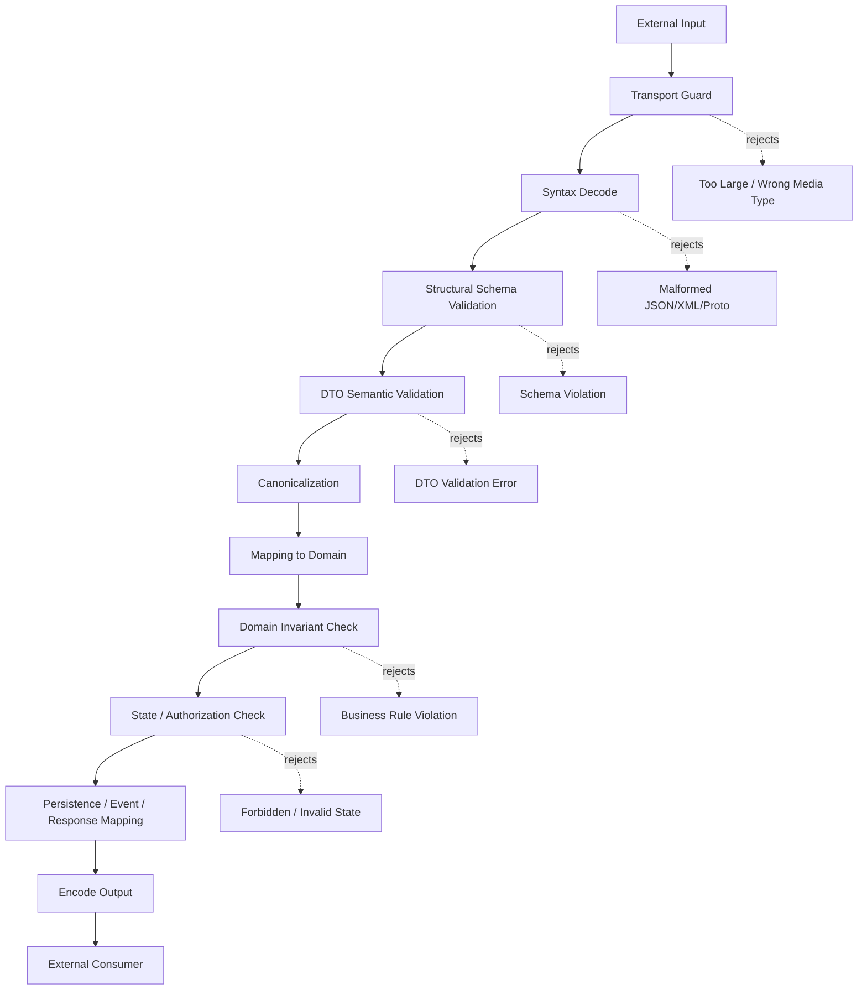
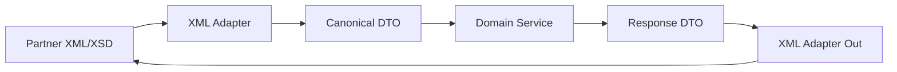
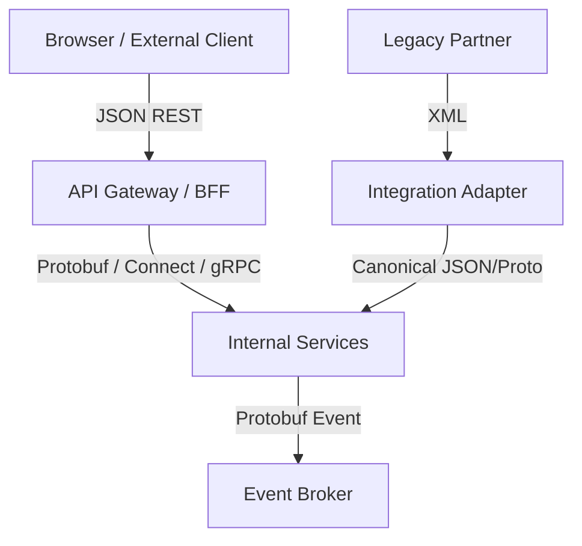
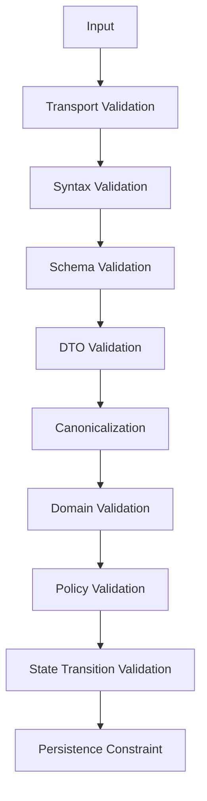
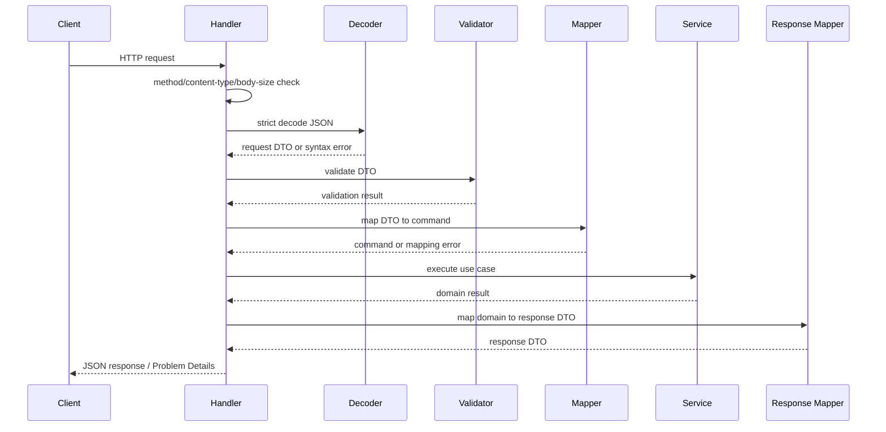
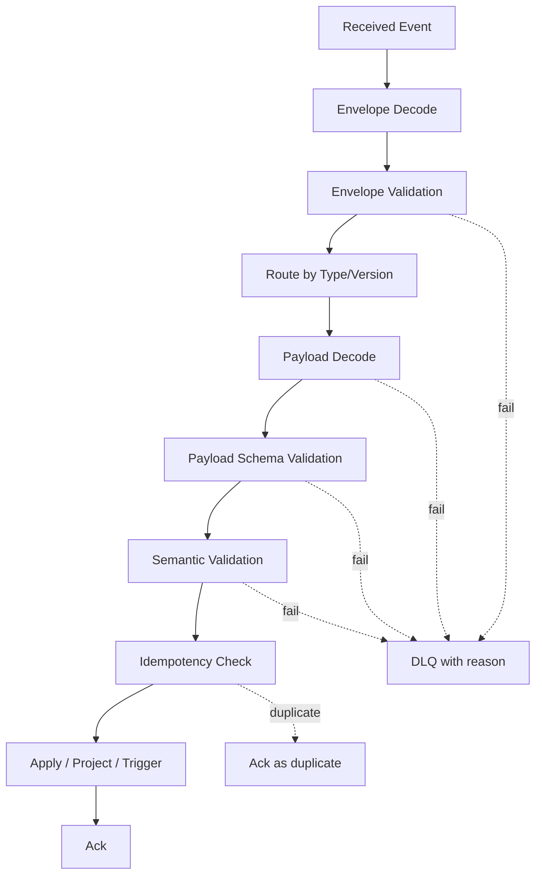
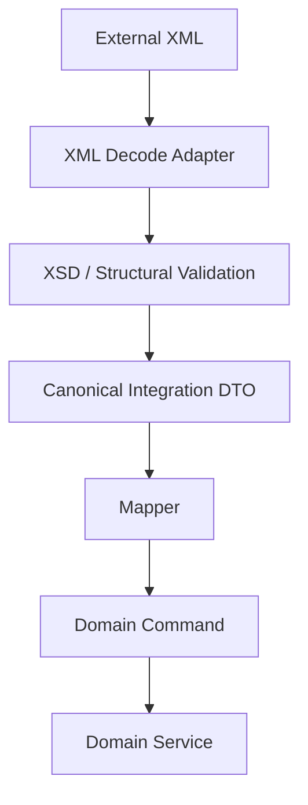
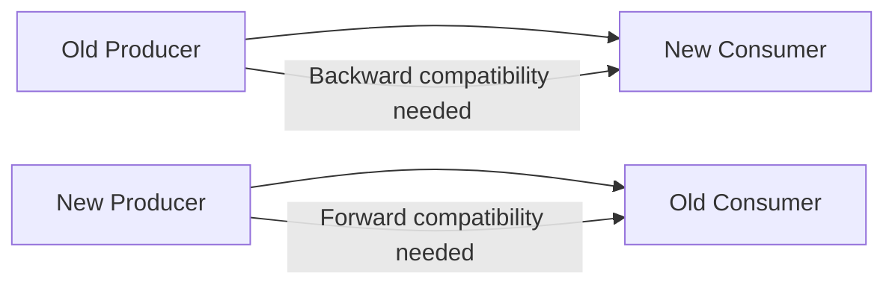
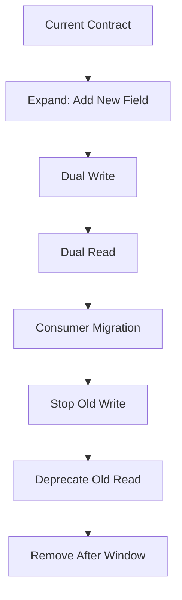

# learn-go-data-mapper-json-xml-protobuf-validation-part-033.md

# Part 033 — Production Handbook and Architecture Playbook

> Seri: **learn-go-data-mapper-json-xml-protobuf-validation**  
> Bagian: **033 / 033**  
> Status: **BAGIAN TERAKHIR — SERI SELESAI**  
> Target pembaca: Java software engineer yang ingin berpikir seperti staff/principal engineer ketika mendesain data mapping, JSON, XML, Protobuf, dan validation di Go.  
> Fokus: production architecture playbook, decision matrix, governance, checklist, anti-patterns, migration strategy, dan reusable design templates.

---

## Daftar Isi

1. [Tujuan Part Ini](#1-tujuan-part-ini)
2. [Apa yang Sebenarnya Kita Bangun?](#2-apa-yang-sebenarnya-kita-bangun)
3. [Mental Model Final: Representation Boundary Lifecycle](#3-mental-model-final-representation-boundary-lifecycle)
4. [Architecture North Star](#4-architecture-north-star)
5. [Decision Matrix Utama](#5-decision-matrix-utama)
6. [Choosing JSON, XML, Protobuf, or Hybrid](#6-choosing-json-xml-protobuf-or-hybrid)
7. [DTO and Mapper Architecture Playbook](#7-dto-and-mapper-architecture-playbook)
8. [Validation Architecture Playbook](#8-validation-architecture-playbook)
9. [HTTP API Boundary Blueprint](#9-http-api-boundary-blueprint)
10. [Event Boundary Blueprint](#10-event-boundary-blueprint)
11. [Protobuf Governance Blueprint](#11-protobuf-governance-blueprint)
12. [XML Integration Blueprint](#12-xml-integration-blueprint)
13. [Schema Governance Model](#13-schema-governance-model)
14. [Compatibility Engineering](#14-compatibility-engineering)
15. [Error Contract Playbook](#15-error-contract-playbook)
16. [Performance and Operational Playbook](#16-performance-and-operational-playbook)
17. [Security and Abuse-Resistance Checklist](#17-security-and-abuse-resistance-checklist)
18. [Observability for Data Boundaries](#18-observability-for-data-boundaries)
19. [Testing Strategy](#19-testing-strategy)
20. [Code Review Checklist](#20-code-review-checklist)
21. [Architecture Review Checklist](#21-architecture-review-checklist)
22. [Migration Playbooks](#22-migration-playbooks)
23. [Common Anti-Patterns](#23-common-anti-patterns)
24. [Reference Package Layouts](#24-reference-package-layouts)
25. [Production Templates](#25-production-templates)
26. [Final Decision Framework](#26-final-decision-framework)
27. [Capability Rubric: Good, Senior, Staff-Level](#27-capability-rubric-good-senior-staff-level)
28. [Ringkasan Seri](#28-ringkasan-seri)
29. [Penutup](#29-penutup)
30. [Referensi Utama](#30-referensi-utama)

---

## 1. Tujuan Part Ini

Part ini adalah **playbook penutup**. Setelah semua bagian sebelumnya membahas mapping, JSON, XML, Protobuf, schema, validation, event, HTTP, dan performance, bagian ini menyatukannya menjadi cara berpikir arsitektural.

Targetnya bukan lagi menjawab pertanyaan kecil seperti:

- “Bagaimana cara `json.Unmarshal`?”
- “Bagaimana cara membuat struct tag?”
- “Bagaimana cara validate request?”
- “Bagaimana cara generate `.pb.go`?”

Targetnya adalah menjawab pertanyaan production seperti:

- Format contract apa yang tepat untuk boundary ini?
- Siapa owner schema-nya?
- Apa yang boleh berubah tanpa breaking consumer?
- Kapan DTO boleh sama dengan domain model?
- Error validasi seperti apa yang aman dipublikasikan?
- Bagaimana mencegah silent data loss?
- Bagaimana memastikan event tetap bisa direplay 3 tahun lagi?
- Bagaimana menangani unknown fields, duplicate JSON fields, `null`, absent field, default value, dan field presence?
- Bagaimana membuat perubahan schema tanpa merusak service lama?
- Bagaimana mengukur performance serialization tanpa terjebak microbenchmark palsu?

Engineer yang kuat bukan hanya tahu API. Engineer yang kuat tahu **invariant apa yang harus dijaga** ketika data berpindah dari satu model ke model lain.

---

## 2. Apa yang Sebenarnya Kita Bangun?

Seri ini sebenarnya bukan hanya tentang JSON/XML/Protobuf. Seri ini tentang **representation engineering**.

Data yang sama bisa memiliki banyak representasi:

| Representasi | Contoh | Fungsi |
|---|---|---|
| Domain model | `Case`, `Applicant`, `Order`, `Policy` | Memegang business invariant. |
| Request DTO | `CreateCaseRequest` | Mewakili input client. |
| Response DTO | `CaseResponse` | Mewakili output publik. |
| Persistence model | `CaseRow`, `AuditRecord` | Mewakili struktur storage. |
| Event model | `CaseSubmittedV2` | Mewakili fakta historis. |
| Protobuf message | `case.v1.CaseSubmitted` | Mewakili contract strongly typed. |
| JSON Schema | `case-submitted.v2.schema.json` | Mewakili contract eksternal. |
| OpenAPI schema | `components.schemas.CreateCaseRequest` | Mewakili HTTP API contract. |
| XML schema | `case-submission.xsd` | Mewakili enterprise/legacy contract. |
| Validation rule | struct tag, schema rule, CEL rule, domain method | Membatasi state/input yang sah. |

Kesalahan umum adalah memperlakukan semua representasi itu sebagai “data yang sama”. Dalam production system, mereka bukan hal yang sama. Mereka punya owner, lifecycle, consumer, compatibility rule, dan failure mode yang berbeda.

### Prinsip utama

> Model internal boleh berubah cepat. Contract publik harus berubah lambat, eksplisit, dan terukur.

Inilah alasan kenapa mapper, schema, dan validation bukan detail kecil. Mereka adalah pagar antara sistem yang bisa berevolusi dan sistem yang rapuh.

---

## 3. Mental Model Final: Representation Boundary Lifecycle

Data boundary bukan titik tunggal. Ia punya lifecycle.



Setiap tahap menjawab pertanyaan yang berbeda:

| Tahap | Pertanyaan | Contoh gagal |
|---|---|---|
| Transport guard | Apakah payload boleh diproses? | Body terlalu besar, content-type salah. |
| Syntax decode | Apakah format valid? | JSON malformed, XML tidak well-formed. |
| Structural validation | Apakah bentuk data sesuai schema? | Required field hilang, type salah. |
| DTO semantic validation | Apakah nilai field masuk akal secara lokal? | Email invalid, date range terbalik. |
| Canonicalization | Apakah representasi sudah distandardisasi? | Trim whitespace, uppercase code. |
| Mapping | Apakah intent eksternal bisa diterjemahkan ke internal? | Unknown enum, incompatible version. |
| Domain invariant | Apakah state domain sah? | Renewal tidak boleh sebelum active. |
| State/authorization | Apakah actor boleh melakukan transisi? | User tidak boleh approve own case. |
| Output encoding | Apakah response/event aman dipublikasikan? | Internal field bocor, sensitive data. |

Staff-level engineer biasanya kuat karena tahu bahwa **validasi bukan satu step**. Validasi adalah rantai keputusan.

---

## 4. Architecture North Star

Gunakan prinsip berikut sebagai arah desain.

### 4.1 Boundary harus eksplisit

Setiap boundary penting harus punya nama, model, mapper, validator, dan error contract yang jelas.

Buruk:

```go
func Create(w http.ResponseWriter, r *http.Request) {
    var c Case
    json.NewDecoder(r.Body).Decode(&c)
    db.Save(c)
}
```

Masalah:

- domain model langsung terekspos ke request body,
- field internal bisa terisi dari client,
- absent/null/zero tidak dibedakan,
- validation tidak jelas,
- persistence tergantung bentuk API,
- API evolution menjadi sulit.

Lebih baik:

```go
type CreateCaseRequest struct {
    ApplicantID string `json:"applicantId" validate:"required"`
    Type        string `json:"type" validate:"required,oneof=new renewal appeal"`
    Remarks     string `json:"remarks,omitempty" validate:"max=2000"`
}

func (h *Handler) CreateCase(w http.ResponseWriter, r *http.Request) {
    req, ok := decodeValidate[CreateCaseRequest](w, r)
    if !ok {
        return
    }

    cmd, err := mapCreateCaseRequestToCommand(req)
    if err != nil {
        writeProblem(w, err)
        return
    }

    result, err := h.service.CreateCase(r.Context(), cmd)
    if err != nil {
        writeProblem(w, err)
        return
    }

    writeJSON(w, http.StatusCreated, mapCaseToResponse(result))
}
```

### 4.2 Contract harus punya owner

Schema tanpa owner akan membusuk.

Untuk setiap contract, jawab:

- Siapa owner-nya?
- Siapa consumer-nya?
- Bagaimana breaking change dideteksi?
- Bagaimana versioning dilakukan?
- Berapa lama compatibility window?
- Bagaimana consumer lama dimigrasikan?
- Bagaimana schema dipublikasikan?
- Bagaimana sample payload dites?

### 4.3 Mapping harus menjaga invariant

Mapper bukan copy field. Mapper adalah enforcement point untuk semantic boundary.

Contoh invariant:

- external enum tidak boleh masuk domain kalau unknown,
- amount tidak boleh lewat `float64`,
- timestamp harus timezone-aware,
- field internal tidak boleh berasal dari request,
- deprecated field hanya dibaca, tidak ditulis,
- absent/null/zero harus punya makna eksplisit,
- unknown extension field harus disimpan atau ditolak sesuai policy.

### 4.4 Validation harus stabil sebagai contract

Error validasi adalah API. Jangan mempublikasikan raw error library karena:

- format bisa berubah saat upgrade dependency,
- field internal bisa bocor,
- pesan error sulit dilokalisasi,
- client sulit membuat handling yang stabil.

Buat envelope sendiri.

```json
{
  "type": "https://api.example.com/problems/validation-error",
  "title": "Validation failed",
  "status": 400,
  "code": "VALIDATION_FAILED",
  "errors": [
    {
      "path": "/applicantId",
      "code": "REQUIRED",
      "message": "applicantId is required"
    }
  ]
}
```

### 4.5 Compatibility lebih penting daripada kerapian lokal

Kadang schema yang “cantik” secara internal justru buruk secara evolusi.

Contoh buruk:

```proto
message CaseEvent {
  string status = 1;
  string actor = 2;
  string payload_json = 3;
}
```

Ia terlihat fleksibel, tapi kehilangan type safety, lintability, breaking detection, dan discoverability.

Lebih baik:

```proto
message CaseSubmitted {
  string case_id = 1;
  string applicant_id = 2;
  CaseType type = 3;
  google.protobuf.Timestamp submitted_at = 4;
  Actor submitted_by = 5;

  reserved 6, 7;
  reserved "old_status", "legacy_actor";
}
```

---

## 5. Decision Matrix Utama

### 5.1 Mapper strategy

| Situasi | Rekomendasi | Alasannya |
|---|---|---|
| Domain critical, banyak invariant | Manual mapper | Paling eksplisit dan mudah diaudit. |
| Banyak DTO mirip, risiko rendah | Semi-generated mapper | Mengurangi boilerplate, tetap reviewable. |
| Dynamic config/map input | Reflection mapper terbatas | Fleksibel, tapi jangan untuk core domain. |
| Protobuf boundary | Generated code + explicit mapper | Contract kuat, domain tetap bersih. |
| JSON passthrough/proxy | `json.RawMessage` + envelope validation | Hindari premature materialization. |
| Migration legacy | Adapter mapper eksplisit | Isolasi legacy weirdness. |
| Performance hotspot | Benchmark manual/generator | Jangan tebak. Ukur. |

### 5.2 JSON decode policy

| Boundary | Unknown field | Duplicate key | Null policy | Number policy |
|---|---|---|---|---|
| Public command API | Reject by default | Reject if possible | Explicit per field | Avoid float for money/ID |
| Internal admin API | Usually reject | Reject if high risk | Explicit | `json.Number` for dynamic |
| Read/query API | More lenient possible | Usually reject | Explicit | Typed DTO |
| Webhook receiver | Usually tolerate unknown | Log duplicate/reject high risk | Preserve semantics | Avoid lossy decode |
| Event consumer | Tolerate compatible unknown | Reject malformed | Version-specific | Schema-specific |
| Config file | Reject unknown | Reject duplicate | Explicit | Strict typed |

### 5.3 Format selection

| Need | JSON | XML | Protobuf |
|---|---:|---:|---:|
| Human readable | Strong | Medium | Weak binary, okay via text/JSON mapping |
| Browser/native HTTP | Strong | Weak/legacy | Medium via gRPC-Web/Connect/JSON mapping |
| Legacy enterprise/SOAP | Weak | Strong | Weak |
| Strong schema evolution | Medium with governance | Medium with XSD discipline | Strong binary wire evolution |
| Compact payload | Medium | Weak | Strong |
| Tooling ubiquity | Strong | Medium legacy | Strong modern backend |
| Unknown field preservation | Weak in JSON object mapping | Custom | Strong in binary Protobuf |
| Schema-first governance | Strong with JSON Schema/OpenAPI | Strong with XSD | Strong with `.proto`/Buf |
| Cross-language generated code | Medium | Weak/variable | Strong |
| Public REST API | Strong | Rare | Usually not direct binary |
| Internal service RPC | Medium | Rare | Strong |
| Event streams | Strong if schema governed | Rare | Strong if consumers support |

### 5.4 Validation placement

| Validation type | Best place | Example |
|---|---|---|
| Body size | HTTP middleware | Max 1 MiB request body. |
| Syntax | Decoder | Malformed JSON. |
| Shape/schema | JSON Schema/OpenAPI/Protobuf rules | Required field, type mismatch. |
| DTO semantic | Struct validation / Protovalidate | `startDate <= endDate`. |
| Canonicalization | Mapper or DTO method | Trim, normalize code. |
| Domain invariant | Domain constructor/method | Case cannot be approved twice. |
| Authorization contextual | Application service/policy | Actor cannot approve own submission. |
| Persistence uniqueness | DB constraint + app handling | Duplicate reference number. |
| Workflow/state transition | State machine/application layer | Only `SUBMITTED -> IN_REVIEW`. |

---

## 6. Choosing JSON, XML, Protobuf, or Hybrid

### 6.1 Jangan memilih format hanya karena speed

Format selection harus mempertimbangkan:

- consumer type,
- ownership,
- schema evolution,
- operational debugging,
- compatibility requirement,
- tooling,
- governance maturity,
- payload size,
- latency,
- security posture,
- audit/regulatory need.

Speed hanya satu faktor.

### 6.2 JSON sebagai public API default

JSON cocok untuk:

- REST/HTTP API,
- browser/frontend,
- public API,
- integration yang butuh readability,
- operational debugging,
- webhook,
- loosely-coupled partner integration.

Namun JSON harus diperkuat dengan:

- strict decode untuk command API,
- OpenAPI/JSON Schema,
- stable validation error,
- explicit nullability,
- numeric precision policy,
- versioning/deprecation governance,
- contract tests.

JSON tanpa schema governance akan menjadi “stringly typed distributed monolith”.

### 6.3 XML sebagai enterprise compatibility layer

XML cocok ketika:

- partner mewajibkan XML,
- XSD sudah menjadi contract resmi,
- SOAP/legacy integration,
- document-heavy payload,
- namespace/attribute semantics penting,
- regulatory/enterprise ecosystem masih memakai XSD.

Jangan memaksakan XML ke domain internal. Buat adapter layer.



### 6.4 Protobuf sebagai internal typed contract

Protobuf cocok untuk:

- gRPC/Connect internal API,
- high-throughput service-to-service,
- strongly typed event,
- schema evolution with field numbers,
- cross-language generated SDK,
- binary payload efficiency,
- long-lived event replay.

Tetapi Protobuf harus disertai:

- reserved field discipline,
- Buf breaking checks,
- explicit presence strategy,
- ProtoJSON caution,
- validation annotations bila sesuai,
- package/version governance.

### 6.5 Hybrid pattern yang umum

Banyak sistem mature memakai hybrid:



Pattern ini sehat jika boundary-nya jelas. Pattern ini buruk jika semua format bocor ke semua layer.

---

## 7. DTO and Mapper Architecture Playbook

### 7.1 Rule of thumb

Gunakan model terpisah bila salah satu kondisi ini benar:

- API contract punya lifecycle berbeda dari domain.
- Ada field yang hanya untuk transport.
- Ada field internal yang tidak boleh dipublikasikan.
- Ada backward compatibility requirement.
- Ada multiple consumers.
- Ada event replay atau audit need.
- Ada validation berbeda per use case.
- Ada create/update/patch semantics.
- Ada storage optimization yang tidak sama dengan domain.

Gabungkan model hanya bila:

- app sangat kecil,
- tidak ada public contract,
- tidak ada domain invariant penting,
- field lifecycle sama,
- perubahan dapat dikendalikan penuh,
- risiko data leak rendah.

### 7.2 DTO naming convention

Gunakan nama yang menggambarkan boundary dan intent:

```go
type CreateCaseRequest struct{}
type UpdateCaseRequest struct{}
type PatchCaseRequest struct{}
type CaseResponse struct{}
type CaseListItemResponse struct{}
type CaseSubmittedEvent struct{}
type CaseRow struct{}
type CaseSnapshot struct{}
type CaseExportRecord struct{}
```

Hindari:

```go
type CaseDTO struct{}
type CaseData struct{}
type CaseModel struct{}
type CasePayload struct{}
```

Nama generik biasanya tanda ownership dan lifecycle belum jelas.

### 7.3 Mapper direction harus eksplisit

```go
func MapCreateCaseRequestToCommand(req CreateCaseRequest) (CreateCaseCommand, error) {
    // transport intent -> application command
}

func MapCaseToResponse(c Case) CaseResponse {
    // domain state -> public representation
}

func MapCaseToSubmittedEvent(c Case) CaseSubmittedEvent {
    // domain fact -> durable event
}
```

Jangan membuat mapper dua arah otomatis untuk domain critical object.

Buruk:

```go
func Map[A any, B any](a A) B
```

Masalah:

- direction hilang,
- invariant hilang,
- review sulit,
- rename field bisa menyebabkan silent break,
- domain semantics tidak terlihat.

### 7.4 Mapper harus memutus field yang tidak boleh masuk

Contoh request:

```go
type CreateUserRequest struct {
    Email string `json:"email" validate:"required,email"`
    Role  string `json:"role,omitempty"`
}
```

Kalau role tidak boleh ditentukan client biasa, jangan map langsung.

```go
func MapCreateUserRequest(req CreateUserRequest, actor Actor) (CreateUserCommand, error) {
    cmd := CreateUserCommand{
        Email: strings.TrimSpace(strings.ToLower(req.Email)),
        Role:  DefaultUserRole,
    }

    if req.Role != "" {
        if !actor.CanAssignRole(req.Role) {
            return CreateUserCommand{}, ErrForbiddenRoleAssignment
        }
        cmd.Role = Role(req.Role)
    }

    return cmd, nil
}
```

Mapper adalah tempat baik untuk mengubah “external intent” menjadi “allowed internal command”.

### 7.5 Mapping checklist

Untuk setiap mapper, cek:

- Apakah direction jelas?
- Apakah field internal terlindungi?
- Apakah absent/null/zero semantics jelas?
- Apakah enum unknown ditolak atau disimpan?
- Apakah numeric conversion lossless?
- Apakah timezone/locale jelas?
- Apakah deprecated field ditangani?
- Apakah unknown extension point ada policy?
- Apakah error mapping stabil?
- Apakah mapping dites untuk edge cases?

---

## 8. Validation Architecture Playbook

### 8.1 Validasi bukan domain rule saja

Validasi harus dipisahkan berdasarkan pertanyaan.



### 8.2 Jangan taruh semua rule di struct tag

Struct tag bagus untuk rule lokal:

```go
type CreateBookingRequest struct {
    StartDate string `json:"startDate" validate:"required,datetime=2006-01-02"`
    EndDate   string `json:"endDate" validate:"required,datetime=2006-01-02"`
    RoomID    string `json:"roomId" validate:"required"`
}
```

Tapi rule ini tidak cocok hanya di tag:

- room harus available,
- actor harus boleh booking room,
- booking tidak boleh melewati budget,
- booking hanya boleh dibuat di state tertentu,
- overlapping booking harus dicek transactional.

Itu domain/application/persistence validation.

### 8.3 Validation ownership

| Rule | Owner |
|---|---|
| JSON syntax | transport layer |
| OpenAPI/JSON Schema | API contract owner |
| DTO tags | handler/application boundary |
| Protobuf validation annotation | proto contract owner |
| Domain invariant | domain module |
| Authorization rule | policy module |
| State transition | workflow/state machine module |
| DB uniqueness | persistence schema + application error translation |

### 8.4 Validation error harus punya severity dan audience

Tidak semua error untuk client.

| Error detail | Client | Log | Metric | Audit |
|---|---:|---:|---:|---:|
| Field path | Yes | Yes | Maybe low-cardinality only | Yes |
| Validation code | Yes | Yes | Yes | Yes |
| Raw invalid value | Usually no | Carefully redacted | No | Depends |
| Stack trace | No | Yes internal | No | No |
| Internal rule name | Usually no | Yes | Maybe | Maybe |
| Correlation ID | Yes | Yes | Yes | Yes |

---

## 9. HTTP API Boundary Blueprint

### 9.1 Recommended pipeline



### 9.2 HTTP command endpoint rules

For command endpoints (`POST`, `PUT`, `PATCH`, `DELETE` with body):

- enforce method,
- enforce `Content-Type`,
- cap body size,
- decode exactly one JSON value,
- reject trailing tokens,
- reject unknown fields unless endpoint is intentionally extensible,
- reject duplicate keys for high-risk APIs if possible,
- avoid dynamic `map[string]any` for business payload,
- validate DTO,
- canonicalize before domain mapping,
- translate errors into stable problem envelope.

### 9.3 Strict decoder template

```go
type DecodeOptions struct {
    MaxBytes        int64
    DisallowUnknown bool
    UseNumber       bool
}

func DecodeJSONBody[T any](w http.ResponseWriter, r *http.Request, opts DecodeOptions) (T, bool) {
    var zero T

    if opts.MaxBytes > 0 {
        r.Body = http.MaxBytesReader(w, r.Body, opts.MaxBytes)
    }

    dec := json.NewDecoder(r.Body)
    if opts.DisallowUnknown {
        dec.DisallowUnknownFields()
    }
    if opts.UseNumber {
        dec.UseNumber()
    }

    var dst T
    if err := dec.Decode(&dst); err != nil {
        writeDecodeProblem(w, err)
        return zero, false
    }

    // Reject trailing JSON value.
    var extra any
    if err := dec.Decode(&extra); err != io.EOF {
        writeProblem(w, Problem{
            Status: http.StatusBadRequest,
            Code:   "TRAILING_JSON_VALUE",
            Detail: "request body must contain exactly one JSON value",
        })
        return zero, false
    }

    return dst, true
}
```

### 9.4 PATCH endpoint rules

PATCH is where many systems break semantics.

Do not use normal non-pointer DTO if you need to distinguish absent vs zero.

Bad:

```go
type PatchUserRequest struct {
    DisplayName string `json:"displayName"`
    Active      bool   `json:"active"`
}
```

This cannot distinguish:

- field absent,
- field present with zero value,
- explicit clear/null intent.

Better with explicit optional type:

```go
type Optional[T any] struct {
    Set   bool
    Null  bool
    Value T
}
```

Then design each field intentionally:

```go
type PatchUserRequest struct {
    DisplayName Optional[string] `json:"displayName"`
    Active      Optional[bool]   `json:"active"`
}
```

Rule:

- absent means “do not change”,
- present non-null means “set value”,
- present null means either “clear” or “reject”, explicitly per field.

---

## 10. Event Boundary Blueprint

### 10.1 Event is a durable fact

An event is not a method call.

A method call says:

> “Please do this now.”

An event says:

> “This fact happened and may be replayed later.”

Therefore event contract must tolerate:

- replay,
- duplicate delivery,
- out-of-order consumption,
- consumer lag,
- producer upgrade before consumer upgrade,
- schema evolution,
- poison message isolation,
- long-term audit.

### 10.2 Event envelope pattern

```go
type EventEnvelope struct {
    ID              string          `json:"id"`
    Type            string          `json:"type"`
    Source          string          `json:"source"`
    Subject         string          `json:"subject,omitempty"`
    Time            time.Time       `json:"time"`
    SpecVersion     string          `json:"specversion"`
    DataContentType string          `json:"datacontenttype"`
    SchemaURI       string          `json:"dataschema,omitempty"`
    TraceID         string          `json:"traceId,omitempty"`
    Data            json.RawMessage `json:"data"`
}
```

Envelope separates operational metadata from payload.

### 10.3 Event validation pipeline



### 10.4 Event evolution rules

Generally safe:

- add optional field,
- add new enum value if consumers handle unknown,
- add new event type,
- add field with default-compatible semantics,
- keep old field while writing new field during migration.

Dangerous:

- rename JSON field consumed externally,
- change field meaning,
- change numeric precision,
- change timestamp timezone/format,
- change enum string without alias period,
- remove field before compatibility window ends,
- reuse Protobuf field number,
- change Protobuf field type incompatibly.

### 10.5 Idempotency rule

Every event consumer should know how it handles duplicates.

Options:

| Strategy | Use when |
|---|---|
| Event ID dedup table | Side-effecting consumer. |
| Natural key upsert | Projection/read model. |
| Version check | Aggregate state update. |
| Idempotent command emission | Downstream trigger. |
| Ignore duplicates after hash compare | Audit ingestion. |

---

## 11. Protobuf Governance Blueprint

### 11.1 Proto package versioning

Prefer package versioning:

```proto
syntax = "proto3";

package regulatory.case.v1;

option go_package = "example.com/platform/gen/regulatory/case/v1;casev1";
```

Do not put multiple incompatible major versions in the same package.

### 11.2 Field number rules

Rules:

- Never change field number after release.
- Never reuse deleted field number.
- Reserve deleted field numbers.
- Reserve deleted field names.
- Avoid field numbers 19000–19999 because they are reserved by Protobuf.
- Allocate field number ranges deliberately for large messages.

Example:

```proto
message CaseSubmitted {
  string case_id = 1;
  string applicant_id = 2;
  CaseType type = 3;
  google.protobuf.Timestamp submitted_at = 4;

  reserved 5, 6;
  reserved "legacy_status", "old_actor_id";
}
```

### 11.3 Buf checks in CI

Minimum CI gates:

```bash
buf format --diff --exit-code
buf lint
buf breaking --against '.git#branch=main'
```

Policy depends on consumer:

| Consumer | Breaking policy tendency |
|---|---|
| Generated code consumers | Stricter package/file compatibility. |
| Binary wire consumers only | Wire compatibility may be enough. |
| ProtoJSON consumers | Need JSON-aware compatibility. |
| Public SDK | Strongest compatibility. |
| Internal short-lived service | Can allow controlled breaking with migration. |

### 11.4 ProtoJSON warning

Do not assume binary Protobuf compatibility automatically means ProtoJSON compatibility.

ProtoJSON uses names and JSON mapping rules. This makes some changes riskier:

- renaming fields,
- renaming enum values,
- changing json_name,
- changing presence/default emission expectations,
- unknown field handling differences.

### 11.5 Generated-code API rule

With modern Go Protobuf, design code against accessors rather than struct internals when possible, especially if using Editions/Opaque API path.

Good:

```go
id := msg.GetCaseId()
```

Avoid treating generated struct layout as domain model.

---

## 12. XML Integration Blueprint

### 12.1 XML as anti-corruption layer

XML complexity should be contained.



### 12.2 XML adapter responsibilities

XML adapter should handle:

- namespace mapping,
- attribute/element conversion,
- date/time peculiarities,
- legacy code normalization,
- XSD validation strategy,
- partner-specific defaults,
- mixed content extraction if needed,
- safe error reporting,
- redaction of sensitive XML fragments.

It should not contain core domain rule unless the rule is truly partner-specific transport rule.

### 12.3 XSD validation strategy

Because Go standard library does not provide built-in XSD validation, choose explicitly:

| Strategy | Pros | Cons |
|---|---|---|
| Validate at gateway | Centralized, language-agnostic | Need infra support. |
| Validate with `xmllint` in CI | Good for sample/contract | Not runtime protection. |
| CGO/libxml2 runtime | Mature XSD | Operational complexity. |
| Separate validator service | Isolated complexity | Network dependency. |
| Trust partner + parse defensively | Simple | Risky for public/untrusted input. |

### 12.4 XML security stance

For untrusted XML:

- cap body size,
- stream parse when large,
- avoid expanding external entities,
- avoid unsafe custom entity processing,
- avoid logging full payload,
- validate namespace URI not prefix,
- protect against deep nesting and huge tokens,
- isolate partner-specific quirks.

---

## 13. Schema Governance Model

### 13.1 Schema is product, not byproduct

Treat schema as product artifact.

It needs:

- owner,
- version,
- changelog,
- review process,
- compatibility policy,
- generated artifacts,
- examples,
- validation tests,
- deprecation policy,
- consumer communication.

### 13.2 Code-first vs schema-first

| Approach | Best when | Risk |
|---|---|---|
| Code-first | Internal API, small team, fast iteration | Schema becomes accidental. |
| Schema-first | Public API, multi-team, partner integration | More upfront discipline. |
| Hybrid | Most real systems | Drift if governance weak. |

### 13.3 Contract repository pattern

For large org/platform:

```text
contracts/
  openapi/
    public-api/v1/openapi.yaml
    admin-api/v1/openapi.yaml
  jsonschema/
    events/case-submitted/v1.schema.json
    events/case-approved/v1.schema.json
  proto/
    buf.yaml
    regulatory/case/v1/case.proto
    regulatory/identity/v1/identity.proto
  xml/
    partner-a/case-submission/v2.xsd
    partner-b/ack/v1.xsd
  examples/
    case-submitted-v1.valid.json
    case-submitted-v1.invalid.json
  changelog/
    2026-06-24-case-v1.md
```

### 13.4 Schema review questions

For every schema change:

- Is this additive, behavioral, or breaking?
- Which consumers are affected?
- Can old consumers ignore it safely?
- Can old producers still write valid data?
- Is default value safe?
- Does field name carry correct domain meaning?
- Is numeric type safe?
- Is nullability explicit?
- Is timestamp format explicit?
- Are examples updated?
- Are contract tests updated?
- Is migration/deprecation documented?

---

## 14. Compatibility Engineering

### 14.1 Backward and forward compatibility

Backward compatibility:

> New consumer can read old data.

Forward compatibility:

> Old consumer can tolerate new data.

Rolling deployment often needs both.



### 14.2 Compatibility checklist by change type

| Change | JSON | Protobuf binary | XML/XSD |
|---|---|---|---|
| Add optional field | Usually safe if unknown tolerated | Safe | Safe if schema allows extension/evolution |
| Add required field | Breaking | Dangerous unless default/presence handled | Breaking |
| Remove field | Breaking for readers expecting it | Safe only if not reused, but semantic break possible | Breaking |
| Rename field | Breaking | Binary safe only if field number same, JSON risk | Breaking |
| Change type | Usually breaking | Often breaking/wire unsafe | Breaking |
| Add enum value | Consumer must handle unknown | Usually possible but consumer-specific | Schema/consumer-specific |
| Change enum meaning | Breaking semantic | Breaking semantic | Breaking semantic |
| Tighten validation | Breaking for existing producers | Breaking semantic | Breaking semantic |
| Loosen validation | Usually safe | Usually safe | Usually safe |

### 14.3 Compatibility window

A compatibility window is the period during which old and new schemas are both accepted or produced.

Example:

```text
T0: Add new field `primaryEmail`; keep old `email`.
T1: Producers write both fields.
T2: Consumers prefer `primaryEmail`, fallback to `email`.
T3: Observe no consumer uses `email`.
T4: Stop writing `email`, keep reading.
T5: Remove from public contract only after agreed lifecycle.
```

### 14.4 Expand-contract pattern

Use for safe schema migration.



---

## 15. Error Contract Playbook

### 15.1 Error classes

Do not collapse all errors into “bad request”.

| Class | HTTP | Meaning |
|---|---:|---|
| Malformed body | 400 | Syntax invalid. |
| Unsupported media type | 415 | Wrong content type. |
| Too large | 413 | Body exceeds limit. |
| Schema validation | 400 or 422 | Shape/value invalid. |
| Domain rule violation | 409 or 422 | Semantically invalid. |
| Authenticated but forbidden | 403 | Actor lacks permission. |
| Invalid state transition | 409 | Current state conflicts. |
| Duplicate key | 409 | Resource already exists. |
| Rate limit | 429 | Too many requests. |

Whether to use 400 or 422 depends on API convention. The most important rule is consistency.

### 15.2 Stable validation error model

```go
type Problem struct {
    Type     string             `json:"type"`
    Title    string             `json:"title"`
    Status   int                `json:"status"`
    Code     string             `json:"code"`
    Detail   string             `json:"detail,omitempty"`
    Instance string             `json:"instance,omitempty"`
    Errors   []FieldViolation   `json:"errors,omitempty"`
}

type FieldViolation struct {
    Path    string `json:"path"`
    Code    string `json:"code"`
    Message string `json:"message"`
}
```

### 15.3 Error code examples

Use machine-readable codes:

```text
MALFORMED_JSON
TRAILING_JSON_VALUE
UNKNOWN_FIELD
DUPLICATE_FIELD
REQUIRED
INVALID_FORMAT
OUT_OF_RANGE
INVALID_ENUM
INVALID_STATE
FORBIDDEN_TRANSITION
CONFLICT_DUPLICATE
BODY_TOO_LARGE
UNSUPPORTED_MEDIA_TYPE
```

### 15.4 Error path rules

For JSON, prefer JSON Pointer style:

```text
/applicantId
/items/0/quantity
/addresses/2/postalCode
```

For Protobuf, use proto field path or convert to API-specific path:

```text
applicant_id
items[0].quantity
```

Be consistent.

---

## 16. Performance and Operational Playbook

### 16.1 Performance hierarchy

Optimize in this order:

1. Choose correct boundary design.
2. Avoid unnecessary full materialization.
3. Avoid dynamic `map[string]any` in hot path.
4. Avoid lossy numeric conversions.
5. Stream large arrays/NDJSON/XML.
6. Reduce payload size if network-bound.
7. Measure allocation and latency.
8. Consider codegen/alternative serializer only after measurement.
9. Tune pooling carefully.
10. Monitor tail latency, not only average.

### 16.2 What to measure

Measure:

- p50/p95/p99 latency,
- allocations/op,
- bytes allocated/op,
- CPU time,
- payload size,
- GC pressure,
- validation cost,
- error path cost,
- memory peak during large payload,
- throughput under concurrency,
- effect of logging/redaction.

### 16.3 Common performance traps

| Trap | Why bad |
|---|---|
| Decode large array into `[]T` | Memory spike. |
| `map[string]any` everywhere | Reflection, type assertions, precision loss. |
| Logging full payload | IO cost, sensitive data risk. |
| `sync.Pool` everywhere | Complexity, stale state bugs, no guaranteed retention. |
| `float64` for money | Precision bugs. |
| Validate same schema every request without compilation/cache | CPU waste. |
| Generate schema at runtime per request | CPU waste. |
| Use Protobuf JSON for speed assumption | ProtoJSON may not be faster than expected; measure. |

### 16.4 Streaming decision

Stream when:

- payload can be processed record by record,
- array can be huge,
- backpressure matters,
- partial failure handling exists,
- memory bound matters,
- consumer can tolerate incremental processing.

Do not stream when:

- business rule needs whole document,
- transaction must be all-or-nothing,
- validation requires global cross-record invariant,
- complexity outweighs benefit.

### 16.5 Pooling rule

Use `sync.Pool` only when:

- allocation is proven hotspot,
- object reset is safe and tested,
- object does not hold sensitive data after use,
- object does not retain huge backing arrays unintentionally,
- benchmark shows benefit under realistic concurrency.

---

## 17. Security and Abuse-Resistance Checklist

### 17.1 JSON

- Cap request body size.
- Reject trailing data.
- Consider duplicate-key detection for sensitive endpoints.
- Avoid unmarshalling untrusted payload into `map[string]any` then trusting types.
- Avoid `float64` for money/ID.
- Redact sensitive fields before logging.
- Validate content type.
- Use strict unknown-field policy for command endpoints.
- Avoid reflecting raw validation error internals to client.

### 17.2 XML

- Cap body size.
- Avoid unsafe entity expansion.
- Stream large payload.
- Validate namespace URI, not prefix.
- Avoid logging full XML.
- Treat XSD validation as explicit architecture decision.
- Protect against deep nesting / huge token attacks.
- Isolate partner-specific parsing quirks.

### 17.3 Protobuf

- Cap message size.
- Validate after unmarshal.
- Do not trust generated type as domain invariant.
- Preserve or intentionally discard unknown fields according to boundary policy.
- Avoid unsafe assumptions about default values/presence.
- Be careful with `Any` type allowlist.
- Use Buf breaking checks.
- Reserve deleted fields.

### 17.4 Validation

- Do not expose raw internal rule names unless intended.
- Do not leak sensitive invalid values.
- Keep metric labels low-cardinality.
- Normalize error response.
- Avoid inconsistent error status across endpoints.
- Make validation deterministic.

---

## 18. Observability for Data Boundaries

### 18.1 What to log

Log structured metadata:

```json
{
  "event": "request_decode_failed",
  "route": "/v1/cases",
  "method": "POST",
  "content_type": "application/json",
  "error_code": "UNKNOWN_FIELD",
  "field_path": "/legacyCode",
  "body_size": 1832,
  "correlation_id": "..."
}
```

Do not log full body by default.

### 18.2 Metrics

Useful metrics:

```text
api_decode_errors_total{route,code}
api_validation_errors_total{route,code}
api_body_size_bytes{route}
api_decode_duration_seconds{route}
event_consume_validation_errors_total{event_type,version,code}
event_dlq_total{event_type,reason}
protobuf_breaking_check_failures_total{module}
schema_validation_duration_seconds{schema_id}
```

Avoid high-cardinality labels like raw field value, user ID, case ID, full field path for deeply dynamic data unless controlled.

### 18.3 Tracing

For data boundary spans, annotate:

- content type,
- schema ID/version,
- event type,
- validation result,
- decode duration,
- payload size bucket,
- mapper name,
- error code.

Do not annotate raw sensitive payload.

---

## 19. Testing Strategy

### 19.1 Unit tests for mapper

Mapper tests should cover:

- valid mapping,
- missing optional fields,
- explicit null if supported,
- zero value,
- unknown enum,
- numeric boundary,
- time zone,
- deprecated field,
- invalid canonicalization.

Example table test:

```go
func TestMapCreateCaseRequest(t *testing.T) {
    tests := []struct {
        name    string
        req     CreateCaseRequest
        want    CreateCaseCommand
        wantErr string
    }{
        {
            name: "normalizes applicant id",
            req: CreateCaseRequest{ApplicantID: " abc ", Type: "new"},
            want: CreateCaseCommand{ApplicantID: "abc", Type: CaseTypeNew},
        },
        {
            name:    "rejects unknown type",
            req:     CreateCaseRequest{ApplicantID: "abc", Type: "strange"},
            wantErr: "INVALID_CASE_TYPE",
        },
    }

    for _, tt := range tests {
        t.Run(tt.name, func(t *testing.T) {
            got, err := MapCreateCaseRequest(tt.req)
            if tt.wantErr != "" {
                require.Error(t, err)
                require.Contains(t, err.Error(), tt.wantErr)
                return
            }
            require.NoError(t, err)
            require.Equal(t, tt.want, got)
        })
    }
}
```

### 19.2 Golden tests

Use golden tests for:

- public JSON response,
- event payload,
- XML integration payload,
- Problem Details error envelope,
- generated schema snapshots.

Golden tests protect public contract from accidental drift.

### 19.3 Fuzz tests

Fuzz useful boundaries:

- JSON custom unmarshalers,
- money/decimal parser,
- enum parser,
- optional type unmarshal,
- XML token processor,
- event envelope parser,
- schema validation wrapper.

### 19.4 Contract tests

Contract tests should verify:

- sample payloads pass schema,
- invalid payloads fail with expected codes,
- generated OpenAPI remains compatible,
- Protobuf breaking check passes,
- old events still decode,
- new consumers can read old payload,
- old consumers tolerate new payload where required.

### 19.5 Replay tests

For events:

- keep historical event corpus,
- replay after schema change,
- verify projections remain correct,
- verify unknown field handling,
- verify idempotency.

---

## 20. Code Review Checklist

Use this checklist during PR review.

### 20.1 DTO

- Is the DTO named by boundary and intent?
- Is it separate from domain model when needed?
- Are JSON/XML tags intentional?
- Are `omitempty` semantics correct?
- Is nullability explicit?
- Are pointer fields justified?
- Are numeric fields safe?
- Are timestamp fields explicit?
- Are deprecated fields documented?

### 20.2 Mapper

- Is mapper direction explicit?
- Does mapper prevent client-controlled internal fields?
- Does mapper canonicalize safely?
- Does mapper reject unknown enum/value?
- Does mapper avoid partial mutation on error?
- Are conversion errors typed/stable?
- Are edge cases tested?

### 20.3 JSON

- Is body size capped?
- Is strict decoding needed and enabled?
- Are unknown fields handled intentionally?
- Are duplicate keys considered?
- Is trailing JSON rejected?
- Is `UseNumber` needed?
- Is `map[string]any` avoided for domain payload?

### 20.4 XML

- Are namespaces handled by URI?
- Is streaming needed?
- Is XSD validation strategy explicit?
- Are partner quirks isolated?
- Is XML logging redacted?

### 20.5 Protobuf

- Are field numbers stable?
- Are deleted fields reserved?
- Is field presence explicit?
- Are enum unknowns considered?
- Is ProtoJSON behavior considered?
- Does Buf lint/breaking pass?
- Is `Any` allowlisted if used?

### 20.6 Validation

- Are validation layers correctly placed?
- Are raw library errors normalized?
- Are field paths stable?
- Are messages localizable if needed?
- Is domain validation not hidden inside transport tag?
- Are authorization/state checks separated from DTO validation?

---

## 21. Architecture Review Checklist

For larger design review, ask:

1. What are all inbound and outbound data boundaries?
2. What format is used at each boundary and why?
3. Which models are public contracts?
4. Which models are internal implementation details?
5. Who owns each schema?
6. How are breaking changes detected?
7. What is the compatibility window?
8. How are old consumers/producers migrated?
9. What is the unknown field policy?
10. What is the nullability policy?
11. What is the numeric precision policy?
12. What is the timestamp/timezone policy?
13. What is the error envelope?
14. What is logged, measured, and redacted?
15. What happens to poison messages?
16. How are schema samples tested?
17. What happens during rolling deployment?
18. Can current code replay 1-year-old events?
19. Can new data be read by old consumers where required?
20. What operational metric proves boundary health?

---

## 22. Migration Playbooks

### 22.1 JSON field rename

Goal: rename `email` to `primaryEmail`.

Safe migration:

1. Add `primaryEmail`; keep `email`.
2. Server accepts both.
3. If both present, define precedence and detect conflict.
4. Server writes both for a period if needed.
5. Clients migrate to `primaryEmail`.
6. Metrics track old field usage.
7. Mark `email` deprecated in OpenAPI.
8. Stop writing `email` after usage drops.
9. Stop accepting `email` only after deprecation window.

DTO example:

```go
type UpdateContactRequest struct {
    Email        Optional[string] `json:"email"`
    PrimaryEmail Optional[string] `json:"primaryEmail"`
}

func (r UpdateContactRequest) ResolveEmail() (Optional[string], error) {
    if r.Email.Set && r.PrimaryEmail.Set && r.Email.Value != r.PrimaryEmail.Value {
        return Optional[string]{}, ErrConflictingEmailFields
    }
    if r.PrimaryEmail.Set {
        return r.PrimaryEmail, nil
    }
    return r.Email, nil
}
```

### 22.2 Protobuf field removal

Safe removal:

1. Stop depending on field in consumers.
2. Stop writing field in producers.
3. Wait through compatibility window.
4. Remove field from `.proto`.
5. Add field number and name to `reserved`.
6. Run Buf breaking checks according to selected policy.

### 22.3 Event version migration

Safe event migration:

1. Add new event type/version.
2. Consumers support both old and new.
3. Producer dual-publishes only if necessary and idempotency-safe.
4. Prefer single event with additive fields if possible.
5. Track consumer lag and type usage.
6. Retire old event after replay/retention policy allows.

### 22.4 XML partner migration

Safe XML migration:

1. Keep partner-specific adapter versioned.
2. Add new XSD and sample payloads.
3. Validate inbound/outbound sample corpus.
4. Run shadow validation if possible.
5. Produce old and new format in parallel only with clear reconciliation.
6. Record partner cutover date.
7. Keep fallback parser for agreed period.

---

## 23. Common Anti-Patterns

### 23.1 Domain model as API model

```go
type User struct {
    ID           string `json:"id"`
    PasswordHash string `json:"passwordHash"`
    IsAdmin      bool   `json:"isAdmin"`
}
```

Risk:

- sensitive field leak,
- privilege escalation,
- domain/storage coupling to API,
- hard versioning.

### 23.2 `map[string]any` as permanent architecture

Useful for raw dynamic boundary. Bad as core domain.

Risk:

- type safety lost,
- precision loss,
- validation scattered,
- refactoring hard,
- errors discovered late.

### 23.3 All validation in handler

Handler becomes giant procedural blob.

Better:

- handler: transport and DTO validation,
- mapper: canonicalization and conversion,
- application service: use case rule,
- domain: invariant,
- repository: persistence constraint translation.

### 23.4 Raw validator errors to client

Bad:

```json
{"error":"Key: 'CreateRequest.Email' Error:Field validation for 'Email' failed on the 'email' tag"}
```

Better:

```json
{
  "code": "VALIDATION_FAILED",
  "errors": [
    {"path": "/email", "code": "INVALID_EMAIL", "message": "email must be a valid email address"}
  ]
}
```

### 23.5 Protobuf field number reuse

This is one of the worst Protobuf mistakes.

If an old field had sensitive meaning and a new field reuses the number, old binary data can be interpreted as new meaning.

Always reserve.

### 23.6 JSON Schema generated blindly from Go struct

Generated schema can be useful, but it may not represent intended public contract.

Risks:

- internal field leaks,
- nullability wrong,
- required inference wrong,
- validation too weak/strong,
- doc drift.

### 23.7 `omitempty` without semantic review

`omitempty` can accidentally hide meaningful zero values.

Example:

```go
type QuotaResponse struct {
    Remaining int `json:"remaining,omitempty"`
}
```

If remaining is `0`, it disappears. That may be wrong.

### 23.8 Event as command

Bad event:

```json
{"type":"SendEmailNow","data":{"to":"..."}}
```

Better event fact:

```json
{"type":"CaseSubmitted","data":{"caseId":"...","submittedAt":"..."}}
```

Commands request action. Events record facts.

---

## 24. Reference Package Layouts

### 24.1 HTTP JSON service

```text
internal/
  caseapp/
    domain/
      case.go
      status.go
      invariant.go
    app/
      commands.go
      service.go
      errors.go
    transport/
      http/
        handler.go
        request.go
        response.go
        mapper.go
        validation.go
        problem.go
    persistence/
      case_row.go
      repository.go
      mapper.go
    events/
      case_submitted.go
      mapper.go
```

### 24.2 Protobuf-first service

```text
api/
  proto/
    buf.yaml
    buf.gen.yaml
    regulatory/case/v1/case.proto
    regulatory/case/v1/case_service.proto
internal/
  gen/
    regulatory/case/v1/*.pb.go
  caseapp/
    domain/
    app/
    rpc/
      connect_handler.go
      mapper.go
      validation.go
    events/
      proto_mapper.go
```

### 24.3 XML integration adapter

```text
internal/
  integration/
    partnera/
      xmlmodel/
        request.go
        response.go
      xsd/
        case-submission-v2.xsd
      adapter.go
      mapper.go
      validation.go
      samples/
        valid-case.xml
        invalid-case.xml
  caseapp/
    app/
    domain/
```

### 24.4 Shared boundary package caution

Avoid large shared “models” package:

```text
common/models
```

This often becomes a dumping ground.

Prefer boundary-specific packages:

```text
caseapi/v1
caseevent/v1
caseproto/v1
partnera/xml/v2
```

---

## 25. Production Templates

### 25.1 Boundary decision record

Use this template for ADR/design doc.

```markdown
# Boundary Decision: <Name>

## Context
What system boundary is this? Who produces and consumes data?

## Format
Chosen format: JSON / XML / Protobuf / Hybrid

Reason:
- ...

Rejected options:
- ...

## Contract Owner
Owner team/person:
Reviewers:

## Schema Location
OpenAPI/JSON Schema/Proto/XSD path:

## Versioning Strategy
- Current version:
- Compatibility window:
- Deprecation policy:

## Decode Policy
- Unknown fields:
- Duplicate fields:
- Null handling:
- Number precision:
- Timestamp format:

## Validation Layers
- Transport:
- Schema:
- DTO semantic:
- Domain:
- Authorization/state:

## Error Contract
- Envelope:
- Error codes:
- Field path format:

## Observability
- Logs:
- Metrics:
- Traces:
- Redaction:

## Testing
- Unit:
- Golden:
- Contract:
- Replay:
- Fuzz:

## Risks
- Compatibility risks:
- Security risks:
- Operational risks:

## Migration Plan
Steps:
1. ...
```

### 25.2 Endpoint review template

```markdown
# Endpoint Review: POST /v1/cases

## Request DTO
- Type:
- Nullability policy:
- Unknown field policy:
- Max body size:

## Validation
- Struct validation:
- Cross-field validation:
- Domain validation:

## Mapping
- Request -> command:
- Domain -> response:

## Error Contract
- Syntax error:
- Validation error:
- Domain error:
- Conflict:

## Compatibility
- Additive changes allowed:
- Deprecation mechanism:

## Test Evidence
- Unit mapper tests:
- Invalid payload tests:
- Golden response tests:
```

### 25.3 Event review template

```markdown
# Event Contract Review: CaseSubmitted v1

## Event Identity
- Type:
- Version:
- Producer:
- Consumers:

## Payload Schema
- Format:
- Schema path:
- Required fields:
- Optional fields:

## Compatibility
- Additive changes:
- Deprecated fields:
- Unknown field policy:
- Replay guarantee:

## Delivery Semantics
- Idempotency key:
- Ordering assumption:
- Retry policy:
- DLQ policy:

## Validation
- Producer-side:
- Consumer-side:

## Observability
- Metrics:
- Log fields:
- Trace fields:
```

---

## 26. Final Decision Framework

When designing any data boundary, run this sequence.

### Step 1 — Identify the boundary

Ask:

- Is this inbound or outbound?
- Is it public, partner, internal, storage, or event?
- Is it request/response, command, query, document, or fact?

### Step 2 — Identify consumers and lifecycle

Ask:

- Who consumes this?
- Can they upgrade together?
- Is replay needed?
- Is backward/forward compatibility required?

### Step 3 — Choose format

Use:

- JSON for public REST/browser/human-readable integration.
- XML for legacy/enterprise/XSD/partner-mandated integration.
- Protobuf for strongly typed internal RPC/events and cross-language contracts.
- Hybrid when boundaries have different consumers.

### Step 4 — Define schema and owner

Ask:

- Where is schema stored?
- Who approves changes?
- What CI check protects it?

### Step 5 — Define decode policy

Ask:

- Unknown fields reject/tolerate/preserve?
- Duplicate keys reject/tolerate?
- Null allowed?
- Number precision?
- Timestamp format?
- Body/message size?

### Step 6 — Define model separation

Ask:

- Does DTO differ from domain?
- Does response differ from request?
- Does event differ from current state?
- Does persistence differ from domain?

### Step 7 — Define validation layers

Ask:

- What is syntax validation?
- What is schema validation?
- What is semantic DTO validation?
- What is domain invariant?
- What is state/authorization rule?

### Step 8 — Define error contract

Ask:

- What status code?
- What error code?
- What field path format?
- What can be exposed?
- What must be redacted?

### Step 9 — Define test strategy

Ask:

- Unit mapper tests?
- Golden samples?
- Contract validation?
- Breaking checks?
- Replay corpus?
- Fuzz tests?

### Step 10 — Define observability

Ask:

- What logs prove failure?
- What metrics show drift?
- What traces show cost?
- How to avoid sensitive data leak?

---

## 27. Capability Rubric: Good, Senior, Staff-Level

### 27.1 Good engineer

Can:

- use `encoding/json`, `encoding/xml`, and Protobuf generated code,
- write DTOs,
- validate structs,
- create request/response handlers,
- fix basic marshal/unmarshal bugs.

### 27.2 Senior engineer

Can:

- design DTO/domain separation,
- handle null/absent/zero properly,
- write custom marshalers safely,
- design validation error envelope,
- manage schema changes,
- use Protobuf reserved fields,
- benchmark serialization hotspots,
- create robust event payloads.

### 27.3 Staff/principal-level engineer

Can:

- define organization-wide schema governance,
- design compatibility strategy across rolling deployments,
- protect event replay over years,
- choose format based on consumer lifecycle, not trend,
- build boundary observability,
- establish review checklists and CI gates,
- design migration playbooks,
- prevent entire classes of data corruption and contract drift,
- explain trade-offs clearly to product, platform, security, and operations stakeholders.

Top-tier engineering is not “knowing more serializers”. It is being able to make data boundaries **boring, explicit, evolvable, measurable, and safe**.

---

## 28. Ringkasan Seri

Seri ini telah membahas:

| Part | Tema |
|---:|---|
| 000 | Orientation: data representation boundary. |
| 001 | Data mapper architecture for Java engineers. |
| 002 | DTO, domain, API, persistence model separation. |
| 003 | Mapping invariants and boundary contracts. |
| 004 | Struct tags as serialization metadata. |
| 005 | Manual mapping vs reflection vs code generation. |
| 006 | JSON fundamentals in Go. |
| 007 | JSON nullability, optionality, zero value semantics. |
| 008 | JSON numbers, precision, lossy boundaries. |
| 009 | Custom JSON marshal/unmarshal. |
| 010 | Strict JSON decoding and unknown field policy. |
| 011 | Streaming JSON processing. |
| 012 | JSON v2 and jsontext in Go 1.26 era. |
| 013 | JSON Schema as external contract. |
| 014 | JSON Schema in Go systems. |
| 015 | OpenAPI schema and Go DTO governance. |
| 016 | XML fundamentals in Go. |
| 017 | XML processing beyond basic marshal. |
| 018 | XML Schema, XSD, and contract reality. |
| 019 | Protobuf fundamentals for Go engineers. |
| 020 | Go Protobuf modern runtime. |
| 021 | Protobuf generated code: Open Struct vs Opaque API. |
| 022 | Protobuf field presence and optionality. |
| 023 | Protobuf JSON mapping. |
| 024 | Protobuf schema evolution. |
| 025 | Buf, proto modules, linting, breaking change detection. |
| 026 | Validation mental model in Go. |
| 027 | Struct validation with go-playground/validator. |
| 028 | Validation error modeling. |
| 029 | Protobuf semantic validation with Protovalidate. |
| 030 | Mapping and validation in HTTP APIs. |
| 031 | Mapping and validation in event-driven systems. |
| 032 | Performance, allocation, operational trade-offs. |
| 033 | Production handbook and architecture playbook. |

---

## 29. Penutup

Seri ini selesai.

Hal paling penting yang perlu dibawa bukan API tertentu, karena library dan versi akan terus berubah. Hal yang lebih tahan lama adalah mental model:

1. **Data boundary adalah contract.**  
   Jangan perlakukan sebagai struct biasa.

2. **Mapper adalah semantic translation.**  
   Bukan copy field.

3. **Validation adalah arsitektur berlapis.**  
   Bukan sekadar tag.

4. **Schema adalah produk.**  
   Ia perlu owner, review, versioning, dan compatibility checks.

5. **Compatibility adalah engineering discipline.**  
   Breaking change paling berbahaya sering terlihat seperti refactor kecil.

6. **Error response adalah public API.**  
   Stabilkan, normalisasi, dan jangan bocorkan internal detail.

7. **Event adalah durable fact.**  
   Desain untuk replay, lag, duplicate, migration, dan consumer diversity.

8. **Performance harus diukur di pipeline nyata.**  
   Serializer speed saja bukan jawaban.

9. **Format choice mengikuti consumer lifecycle.**  
   JSON, XML, dan Protobuf punya tempat masing-masing.

10. **Production-grade Go bukan minimalisme tanpa struktur.**  
    Ia adalah eksplisit, sederhana, tapi disiplin terhadap boundary.

Jika kamu menguasai prinsip ini, kamu tidak hanya “bisa menulis JSON di Go”. Kamu bisa mendesain sistem yang contract-nya jelas, aman berubah, tahan rollback, dapat diobservasi, dan dapat dipertanggungjawabkan.

---

## 30. Referensi Utama

Referensi berikut adalah baseline yang relevan untuk seri ini:

- Go 1.26 Release Notes: `https://go.dev/doc/go1.26`
- Go `encoding/json`: `https://pkg.go.dev/encoding/json`
- Go experimental JSON v2/jsontext blog: `https://go.dev/blog/jsonv2-exp`
- Go `encoding/xml`: `https://pkg.go.dev/encoding/xml`
- Go Protobuf module: `https://pkg.go.dev/google.golang.org/protobuf`
- Go Protobuf Generated Code Guide, Open API: `https://protobuf.dev/reference/go/go-generated/`
- Go Protobuf Generated Code Guide, Opaque API: `https://protobuf.dev/reference/go/go-generated-opaque/`
- Go Protobuf Opaque API FAQ: `https://protobuf.dev/reference/go/opaque-faq/`
- Protobuf Proto3 Guide: `https://protobuf.dev/programming-guides/proto3/`
- Protobuf Field Presence: `https://protobuf.dev/programming-guides/field_presence/`
- Protobuf JSON Mapping: `https://protobuf.dev/programming-guides/json/`
- Protobuf Encoding Guide: `https://protobuf.dev/programming-guides/encoding/`
- Buf Breaking Change Detection: `https://buf.build/docs/breaking/`
- Protovalidate: `https://buf.build/docs/protovalidate/`
- JSON Schema Draft 2020-12: `https://json-schema.org/draft/2020-12`
- OpenAPI Specification 3.2.0: `https://spec.openapis.org/oas/v3.2.0.html`
- RFC 9457 Problem Details: `https://www.rfc-editor.org/rfc/rfc9457`
- RFC 6901 JSON Pointer: `https://www.rfc-editor.org/rfc/rfc6901`
- OWASP Input Validation Cheat Sheet: `https://cheatsheetseries.owasp.org/cheatsheets/Input_Validation_Cheat_Sheet.html`

---

# Status Akhir

**SERI SELESAI — part 033 / 033.**

<!-- NAVIGATION_FOOTER -->
<div class="page-nav">
<a href="./learn-go-data-mapper-json-xml-protobuf-validation-part-032.md">⬅️ Part 032 — Performance, Allocation, and Operational Trade-offs</a>
<a href="./index.md">📚 Kategori</a>
<a href="../../index.md">🏠 Home</a>
<span></span>
</div>
