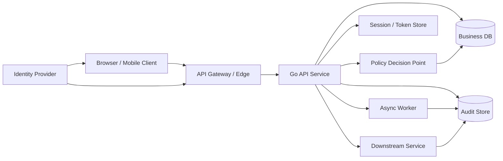
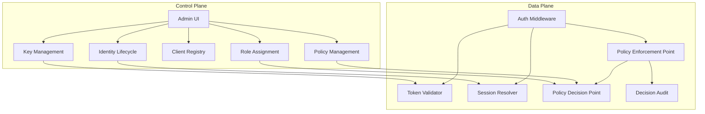
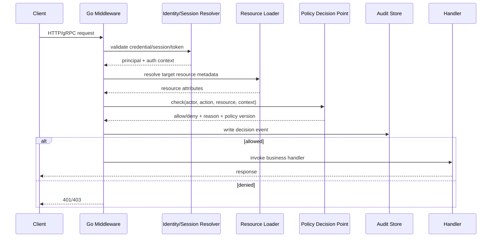
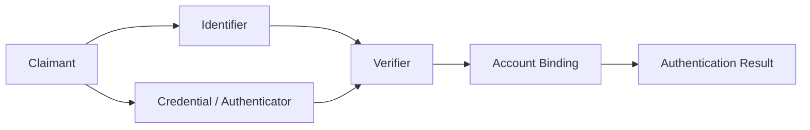
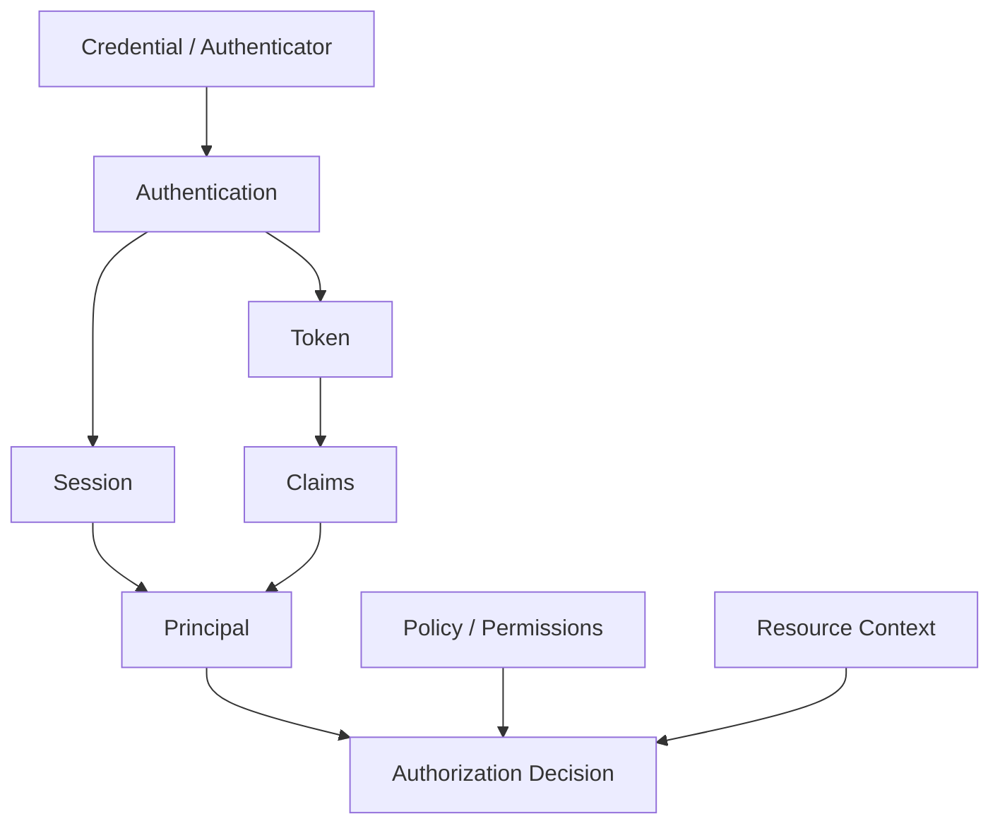
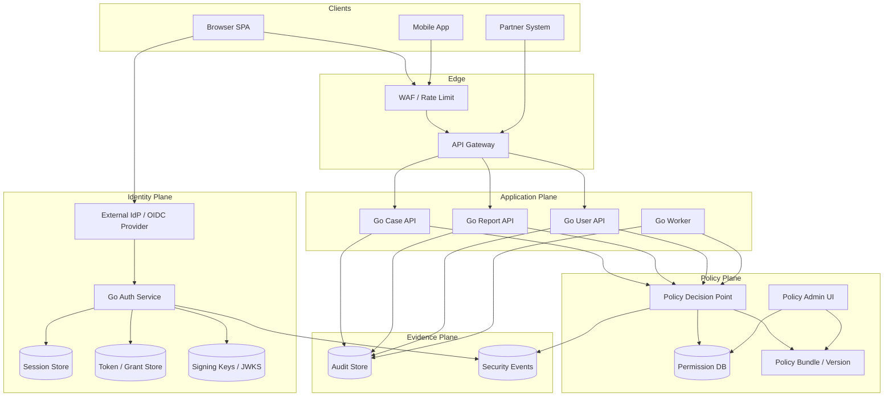

# learn-go-authentication-authorization-identity-permission-part-000.md

# Part 000 — Orientation Handbook: Mental Model, Scope, Invariants, dan Peta Besar Go Authentication, Authorization, Identity, Permission

> Seri: **learn-go-authentication-authorization-identity-permission**  
> Target: engineer yang ingin memahami authentication, authorization, identity, permission, federation, session, token, policy, multi-tenant access control, service identity, dan operational hardening pada level desain sistem produksi.  
> Baseline bahasa: **Go 1.26.x**.  
> Status seri: **belum selesai**. Ini adalah bagian 0 dari rencana 35 bagian.

---

## Daftar Isi

1. [Tujuan Part 000](#1-tujuan-part-000)
2. [Kenapa Auth Adalah Topik Arsitektur, Bukan Sekadar Middleware](#2-kenapa-auth-adalah-topik-arsitektur-bukan-sekadar-middleware)
3. [Batas Seri Ini Agar Tidak Mengulang Seri Sebelumnya](#3-batas-seri-ini-agar-tidak-mengulang-seri-sebelumnya)
4. [Peta Besar Domain: Identity, Authentication, Authorization, Permission](#4-peta-besar-domain-identity-authentication-authorization-permission)
5. [Terminologi yang Harus Presisi](#5-terminologi-yang-harus-presisi)
6. [Control-Plane vs Data-Plane dalam Auth System](#6-control-plane-vs-data-plane-dalam-auth-system)
7. [Core Invariants Sistem Auth Produksi](#7-core-invariants-sistem-auth-produksi)
8. [Mental Model: Request Menjadi Decision](#8-mental-model-request-menjadi-decision)
9. [Model Identitas: Human, Workload, Agent, External Identity](#9-model-identitas-human-workload-agent-external-identity)
10. [Authentication Sebagai Pembuktian, Bukan Sekadar Login](#10-authentication-sebagai-pembuktian-bukan-sekadar-login)
11. [Authorization Sebagai Keputusan Kontekstual](#11-authorization-sebagai-keputusan-kontekstual)
12. [Permission Sebagai Bahasa Bisnis yang Dieksekusi Sistem](#12-permission-sebagai-bahasa-bisnis-yang-dieksekusi-sistem)
13. [Token, Session, Claim, dan Credential: Jangan Disamakan](#13-token-session-claim-dan-credential-jangan-disamakan)
14. [Boundary: Browser, API, Gateway, Service, Database, Job Worker](#14-boundary-browser-api-gateway-service-database-job-worker)
15. [Distributed Auth: Staleness, Cache, Revocation, dan Consistency](#15-distributed-auth-staleness-cache-revocation-dan-consistency)
16. [Risk Model: Apa yang Sebenarnya Dilindungi](#16-risk-model-apa-yang-sebenarnya-dilindungi)
17. [Go Engineering Lens: Bagaimana Topik Ini Masuk ke Codebase](#17-go-engineering-lens-bagaimana-topik-ini-masuk-ke-codebase)
18. [Reference Architecture Awal](#18-reference-architecture-awal)
19. [Design Questions yang Harus Bisa Dijawab Engineer Senior](#19-design-questions-yang-harus-bisa-dijawab-engineer-senior)
20. [Anti-Pattern yang Akan Kita Hindari Sejak Awal](#20-anti-pattern-yang-akan-kita-hindari-sejak-awal)
21. [Peta Seri 35 Part](#21-peta-seri-35-part)
22. [Cara Membaca Seri Ini](#22-cara-membaca-seri-ini)
23. [Checklist Kompetensi Setelah Menyelesaikan Seri](#23-checklist-kompetensi-setelah-menyelesaikan-seri)
24. [Sumber Primer dan Standar yang Menjadi Basis](#24-sumber-primer-dan-standar-yang-menjadi-basis)
25. [Ringkasan Part 000](#25-ringkasan-part-000)

---

## 1. Tujuan Part 000

Bagian ini bukan tutorial login sederhana.

Bagian ini adalah fondasi untuk membangun cara berpikir yang benar sebelum masuk ke implementasi detail. Banyak engineer bisa membuat endpoint `/login`, menyimpan password hash, menandatangani JWT, menaruh middleware, lalu menganggap sistem auth sudah selesai. Itu biasanya cukup untuk demo, tetapi tidak cukup untuk sistem produksi yang punya:

- multi-role user;
- tenant boundary;
- admin privilege;
- delegated access;
- audit trail;
- external identity provider;
- refresh token;
- service-to-service call;
- background worker;
- report/export;
- stale permission problem;
- regulatory defensibility;
- incident response;
- revocation requirement;
- recovery flow;
- break-glass access;
- fraud and account takeover risk.

Tujuan part 000 adalah membangun **peta mental**:

```text
Identity  -> siapa subject/actor-nya?
AuthN     -> bagaimana kita tahu klaim identity itu benar?
Session   -> bagaimana hasil authentication dipertahankan antar request?
Token     -> bagaimana authority/claims direpresentasikan dan dibawa?
AuthZ     -> apakah actor boleh melakukan action pada resource dalam context tertentu?
Permission-> bagaimana hak bisnis dimodelkan, disimpan, dievaluasi, diaudit?
Audit     -> bagaimana keputusan itu bisa dibuktikan kembali nanti?
Ops       -> bagaimana sistem tetap aman ketika key rotate, IdP down, cache stale, token bocor?
```

Part ini menjawab pertanyaan inti:

> “Apa kerangka berpikir yang benar untuk mendesain authentication, authorization, identity, dan permission system di Go pada level production engineering?”

---

## 2. Kenapa Auth Adalah Topik Arsitektur, Bukan Sekadar Middleware

Di banyak codebase, auth sering dimulai dari middleware:

```go
func AuthMiddleware(next http.Handler) http.Handler {
    return http.HandlerFunc(func(w http.ResponseWriter, r *http.Request) {
        token := extractBearerToken(r)
        claims, err := validateJWT(token)
        if err != nil {
            http.Error(w, "unauthorized", http.StatusUnauthorized)
            return
        }
        ctx := context.WithValue(r.Context(), "claims", claims)
        next.ServeHTTP(w, r.WithContext(ctx))
    })
}
```

Kode seperti ini tidak salah sebagai potongan kecil. Masalahnya: ia memberi ilusi bahwa auth hanya persoalan **validasi token**. Dalam sistem nyata, pertanyaan yang jauh lebih sulit adalah:

- Apakah user ini masih aktif?
- Apakah session ini sudah direvoke?
- Apakah token ini dibuat sebelum permission terbaru dicabut?
- Apakah user ini sedang bertindak sebagai dirinya sendiri atau sedang impersonating user lain?
- Apakah user ini punya role di tenant A tetapi request ini untuk tenant B?
- Apakah role `manager` berarti sama di semua modul?
- Apakah permission export report sama dengan permission view list?
- Apakah background worker boleh memakai authority user asli?
- Apakah service downstream boleh percaya claim dari upstream?
- Apakah gateway-only authorization cukup?
- Bagaimana membuktikan “siapa melakukan apa sebagai siapa” enam bulan kemudian?

Auth adalah arsitektur karena ia menyentuh seluruh boundary sistem:



Seorang engineer yang kuat tidak hanya bertanya:

> “Bagaimana cara verify JWT?”

Tetapi bertanya:

> “Di boundary mana identity berubah menjadi authority? Siapa sumber kebenaran authority? Berapa lama keputusan authorization boleh stale? Apa bukti yang disimpan ketika keputusan dibuat? Apa yang terjadi jika authority dicabut saat token masih hidup?”

Itulah level pembahasan seri ini.

---

## 3. Batas Seri Ini Agar Tidak Mengulang Seri Sebelumnya

Anda sudah menyelesaikan banyak seri Go fundamental dan intermediate/advanced. Karena itu, seri ini **tidak akan mengulang** materi berikut secara panjang:

- dasar Go syntax;
- goroutine, channel, mutex, context cancellation secara umum;
- HTTP server/client dasar;
- gRPC transport dasar;
- cryptography primitive seperti AES, HMAC, RSA, ECDSA, Ed25519 secara detail;
- SQL connection pool dan transaction dasar;
- logging/observability/profiling umum;
- unit testing dan benchmarking umum;
- deployment/Kubernetes dasar;
- JSON/XML/protobuf mapping dasar.

Seri ini tetap akan memakai topik-topik itu ketika relevan, tetapi perspektifnya spesifik:

| Topik dari seri lama | Tidak diulang | Yang dibahas di seri ini |
|---|---|---|
| HTTP | routing, timeout, body read | auth middleware, cookie, bearer, CSRF boundary |
| gRPC | proto, stream, deadline | metadata identity, interceptor, per-RPC authz |
| Crypto | primitive math | key lifecycle, token signature validation, JWKS cache |
| SQL | pool, transaction | permission schema, assignment model, audit evidence |
| Observability | logging generic | auth decision logs, correlation, forensics |
| Testing | table test generic | auth policy test, negative permission test, token abuse test |
| Deployment | container basics | secret/key rotation, IdP outage mode, workload identity |

Dengan kata lain, kita tidak belajar “cara bikin login” saja. Kita belajar bagaimana auth menjadi **sistem kendali** yang defensible.

---

## 4. Peta Besar Domain: Identity, Authentication, Authorization, Permission

Empat istilah ini sering dicampur. Dalam sistem enterprise, mencampur istilah akan merusak desain.

### 4.1 Identity

Identity adalah representasi tentang **entity** yang bisa dikenali oleh sistem.

Entity bisa berupa:

- manusia;
- organisasi;
- tenant;
- service;
- job runner;
- external client;
- machine account;
- delegated actor;
- support operator;
- automation agent.

Identity bukan selalu user. User hanya salah satu jenis identity.

Contoh:

```text
human:fajar
service:case-api
service:report-worker
tenant:agency-a
external-idp:singpass-sub-123
client:mobile-app-ios
```

### 4.2 Authentication

Authentication adalah proses membuktikan bahwa claimant benar-benar menguasai authenticator/credential yang diasosiasikan dengan identity tertentu.

Contoh:

- password + password hash verification;
- TOTP verification;
- passkey/WebAuthn assertion;
- OIDC login melalui external IdP;
- mTLS client certificate;
- signed JWT bearer assertion;
- SPIFFE SVID untuk workload.

Authentication tidak otomatis berarti user boleh melakukan action.

### 4.3 Authorization

Authorization adalah proses memutuskan apakah subject/actor boleh melakukan **action** terhadap **resource** dalam **context** tertentu.

Contoh:

```text
Can user:123 approve application:789 in tenant:agency-a while acting_as role:case_officer?
```

Authorization perlu menjawab:

- siapa actor-nya;
- subject asli siapa;
- action apa;
- resource mana;
- tenant mana;
- dalam workflow state apa;
- berdasarkan role/grant/policy apa;
- apakah ada deny rule;
- apakah authority masih fresh;
- apakah keputusan perlu diaudit.

### 4.4 Permission

Permission adalah model hak yang bisa dievaluasi oleh sistem. Permission bukan hanya string seperti `READ_USER`. Ia bisa menjadi kombinasi:

```text
subject + action + resource + context + condition + constraints + evidence
```

Contoh permission sederhana:

```text
case.read
case.update
case.approve
report.export
user.impersonate
```

Contoh permission yang lebih benar:

```text
allow actor=user:123
  action=case.approve
  resource=case:456
  where tenant=agency-a
    and case.status=UNDER_REVIEW
    and actor.assigned_team contains case.assigned_team
    and actor.assurance_level >= AAL2
    and actor is not case.creator
```

---

## 5. Terminologi yang Harus Presisi

Terminologi auth harus presisi karena setiap istilah biasanya memiliki implikasi keamanan.

### 5.1 Entity

Entity adalah sesuatu yang bisa direferensikan sistem.

Contoh:

- person;
- account;
- user;
- service;
- tenant;
- client application;
- organization;
- device.

Tidak semua entity bisa login. Tidak semua entity punya permission. Tidak semua entity adalah principal.

### 5.2 Identity

Identity adalah representasi yang stabil tentang entity dalam domain tertentu.

Satu manusia bisa punya banyak identity:

```text
Fajar as citizen identity
Fajar as employee identity
Fajar as system admin identity
Fajar as external IdP subject
Fajar as support impersonator
```

Kesalahan umum:

> Menganggap email adalah identity primer.

Email bisa berubah, bisa tidak verified, bisa didaur ulang oleh provider, bisa shared, bisa typo, dan bisa menjadi attribute bukan primary key.

### 5.3 Account

Account adalah representasi login/application-level dari identity.

Satu identity bisa punya beberapa account. Satu account bisa terhubung ke beberapa external identity.

Contoh:

```text
UserAccount{id=U123, status=ACTIVE}
ExternalIdentity{provider=Google, subject=abc}
ExternalIdentity{provider=CorporateIdP, subject=xyz}
```

### 5.4 Principal

Principal adalah entity yang telah di-authenticate atau direpresentasikan dalam execution context.

Dalam code Go, principal sering muncul sebagai object dalam `context.Context`:

```go
type Principal struct {
    SubjectID     string
    SubjectType   string
    TenantID      string
    SessionID     string
    AuthTimeUnix  int64
    Assurance     string
    Authenticated bool
}
```

Tetapi dalam sistem advanced, principal saja belum cukup.

### 5.5 Subject

Subject adalah identity yang menjadi target klaim.

Dalam OIDC, claim `sub` adalah subject identifier. Tetapi subject dalam sistem internal tidak selalu sama dengan user ID lokal. Kita perlu membedakan:

```text
external subject: issuer=https://idp.example.com, sub=abc123
local subject: user:987
```

Kesalahan fatal:

> Menganggap `sub` dari dua issuer berbeda selalu berada dalam namespace yang sama.

`sub=123` dari issuer A tidak sama dengan `sub=123` dari issuer B.

### 5.6 Actor

Actor adalah pihak yang sedang melakukan tindakan.

Dalam request normal:

```text
actor == subject
```

Dalam impersonation/delegation:

```text
actor != subject
```

Contoh:

```text
support_admin:77 acting_on_behalf_of user:123
```

Audit yang baik harus menyimpan actor dan subject secara terpisah.

### 5.7 Claimant

Claimant adalah pihak yang mengklaim identity sebelum authentication selesai.

Contoh saat login:

```text
claimant says: I am fajar@example.com
system asks: prove it
```

Setelah proof valid, claimant bisa menjadi authenticated principal.

### 5.8 Credential

Credential adalah secret/material/proof yang dipakai untuk authentication.

Contoh:

- password;
- passkey private key di authenticator;
- TOTP seed;
- client secret;
- private key untuk JWT assertion;
- mTLS private key;
- recovery code;
- refresh token.

Credential harus punya lifecycle:

```text
created -> active -> rotated -> suspended -> revoked -> archived
```

### 5.9 Authenticator

Authenticator adalah sesuatu yang dimiliki/dikuasai claimant untuk membuktikan identity.

Contoh:

- password manager entry;
- hardware security key;
- phone authenticator app;
- platform authenticator;
- client certificate;
- workload identity document.

### 5.10 Session

Session adalah state yang mempertahankan hasil authentication antar request.

Session bisa berupa:

- server-side session ID dalam cookie;
- encrypted/signed cookie;
- access token + refresh token;
- browser session bound to server store;
- native app token set;
- device-bound session.

Session bukan credential primer, tetapi session token biasanya harus diperlakukan seperti credential karena possession memberi akses.

### 5.11 Token

Token adalah artefak pembawa informasi/authority.

Token bisa:

- opaque;
- JWT;
- signed JWS;
- encrypted JWE;
- refresh token;
- ID token;
- access token;
- capability token;
- one-time token.

Token bukan permission. Token bisa membawa claims yang membantu authorization, tetapi authorization tetap keputusan sistem.

### 5.12 Role

Role adalah bundel authority yang biasanya merepresentasikan pekerjaan/fungsi.

Contoh:

```text
case_officer
case_manager
system_admin
agency_admin
read_only_auditor
```

Role bukan permission tunggal. Role harus dipetakan ke permission. Role juga sering perlu scope/tenant/domain.

### 5.13 Permission

Permission adalah hak melakukan action.

Contoh:

```text
application.view
application.assign
application.approve
application.reject
report.export
user.disable
```

Permission harus cukup granular untuk mencegah over-privilege tetapi tidak terlalu granular hingga tidak bisa dikelola.

### 5.14 Policy

Policy adalah aturan yang menentukan allow/deny.

Policy bisa berupa:

- konfigurasi role-permission;
- Rego policy;
- Casbin model;
- hard-coded business rule;
- database-driven rule;
- workflow guard;
- deny list;
- risk engine rule.

### 5.15 Entitlement

Entitlement adalah hak/akses yang diberikan kepada subject/tenant/account, sering dipakai pada SaaS/license/subscription.

Contoh:

```text
tenant agency-a has entitlement: advanced_reporting
tenant agency-b does not
```

Entitlement berbeda dari permission user. User mungkin punya `report.export`, tetapi tenant belum punya feature entitlement.

### 5.16 Grant

Grant adalah pemberian authority.

Contoh:

```text
user:123 granted role:case_manager in tenant:agency-a by admin:9 at time:t
```

Grant harus bisa diaudit dan direvoke.

### 5.17 Delegation

Delegation adalah pemberian authority terbatas dari satu subject/actor kepada pihak lain.

Contoh:

```text
manager delegates approval review to deputy for 3 days
```

Delegation berbeda dari impersonation.

### 5.18 Impersonation

Impersonation adalah actor menjalankan sistem seolah-olah sebagai subject lain. Ini sangat berbahaya jika tidak dikontrol.

Minimum requirement impersonation:

- explicit permission;
- reason code;
- time limit;
- visible banner;
- immutable audit;
- no secret exposure;
- restricted actions;
- preferably approval for sensitive scope.

### 5.19 Tenant

Tenant adalah boundary organisasi/data/authority.

Dalam multi-tenant system, tenant bukan sekadar filter query. Tenant adalah security boundary.

Kesalahan fatal:

```sql
SELECT * FROM cases WHERE id = ?
```

Jika `case_id` global dan tidak dicek terhadap tenant, BOLA/IDOR bisa terjadi.

Seharusnya:

```sql
SELECT * FROM cases WHERE id = ? AND tenant_id = ?
```

Namun query guard saja belum cukup; authorization decision tetap harus ada.

---

## 6. Control-Plane vs Data-Plane dalam Auth System

Auth system memiliki dua sisi besar.

### 6.1 Control-plane

Control-plane adalah bagian yang mengatur konfigurasi identity dan authority.

Contoh:

- user provisioning;
- role assignment;
- permission configuration;
- policy definition;
- client registration;
- key management;
- MFA enrollment;
- tenant setup;
- delegation setup;
- account disablement;
- emergency access approval.

Control-plane menjawab:

> “Siapa seharusnya punya authority apa?”

### 6.2 Data-plane

Data-plane adalah bagian yang mengevaluasi request nyata saat runtime.

Contoh:

- verify session cookie;
- verify JWT;
- load principal;
- check permission;
- enforce tenant boundary;
- call policy engine;
- deny request;
- write audit event.

Data-plane menjawab:

> “Request ini boleh lewat atau tidak sekarang?”

### 6.3 Kenapa pemisahan ini penting

Banyak bug auth terjadi ketika control-plane dan data-plane bercampur tidak jelas.

Contoh bug:

- role sudah dicabut di UI admin, tetapi JWT masih membawa role lama selama 8 jam;
- user disabled di control-plane, tetapi service hanya verify JWT signature dan tidak cek status user;
- permission policy berubah, tetapi local cache service belum invalidated;
- tenant reassignment terjadi, tetapi background job masih memakai authority lama;
- admin menambahkan permission baru tanpa approval, tidak ada audit trail.

Diagram:



### 6.4 Rule of thumb

- Control-plane changes should be auditable.
- Data-plane decisions should be explainable.
- Control-plane state should not be blindly copied into long-lived tokens.
- Data-plane should have a strategy for freshness vs latency.
- Control-plane should support rollback/versioning for policy mistakes.

---

## 7. Core Invariants Sistem Auth Produksi

Invariant adalah aturan yang harus selalu benar. Jika invariant dilanggar, sistem bisa insecure meskipun kode terlihat berjalan.

### Invariant 1 — Identity namespace harus eksplisit

Tidak boleh ada subject ID tanpa issuer/source namespace.

Buruk:

```text
sub = 123
```

Lebih benar:

```text
issuer = https://idp.agency.example
subject = 123
local_user_id = user_8f32
```

Alasan:

`sub=123` dari issuer A dan issuer B adalah dua identity berbeda.

### Invariant 2 — Authentication result bukan authorization decision

Token valid hanya berarti token valid. Belum tentu action boleh.

```text
JWT signature valid != user allowed to approve case
```

### Invariant 3 — Authorization harus mengevaluasi action + resource + context

Cek role global saja tidak cukup.

Buruk:

```go
if principal.HasRole("manager") { allow() }
```

Lebih benar:

```go
decision := authorizer.Check(ctx, AuthzRequest{
    Actor:    principal.Actor,
    Action:   "case.approve",
    Resource: ResourceRef{Type: "case", ID: caseID, TenantID: tenantID},
    Context: map[string]any{
        "case_status": case.Status,
        "assigned_team": case.AssignedTeam,
        "request_ip_risk": riskScore,
    },
})
```

### Invariant 4 — Tenant boundary tidak boleh bergantung pada UI

Frontend boleh menyembunyikan tombol, tetapi backend tetap harus enforce.

### Invariant 5 — Deny harus menjadi default

Jika policy tidak ditemukan, principal tidak jelas, token ambiguous, tenant mismatch, atau resource gagal dimuat, default harus deny.

Exception hanya boleh dibuat secara eksplisit dengan alasan operasional yang terdokumentasi.

### Invariant 6 — Permission assignment harus auditable

Minimal audit untuk grant/revoke:

```text
who changed it
who received/lost authority
what changed
scope/tenant/resource
reason
when
source request/correlation id
before/after snapshot
```

### Invariant 7 — Runtime decision harus bisa dijelaskan

Sistem production harus bisa menjawab:

```text
Why was this request allowed?
Why was this request denied?
Which policy version was used?
Which grant/role caused the allow?
Was this user acting as themselves or someone else?
```

### Invariant 8 — Session/token harus punya lifecycle

Token/session tidak boleh hanya dibuat dan dilupakan.

Harus ada strategi:

- expiry;
- refresh;
- rotation;
- revocation;
- reuse detection;
- device/session listing;
- forced logout;
- key rotation impact;
- suspicious session response.

### Invariant 9 — Auth error harus tidak membocorkan informasi sensitif

Login gagal tidak boleh membedakan:

```text
email not found
password wrong
account exists but disabled
```

Dalam banyak context, response eksternal harus generik, sementara audit internal detail.

### Invariant 10 — Service-to-service call harus punya identity sendiri

Jangan memakai “internal network” sebagai bukti trust.

Internal service tetap perlu:

- workload identity;
- caller identity;
- audience validation;
- method-level authorization;
- least privilege;
- request provenance.

### Invariant 11 — Authorization tidak boleh hanya di gateway

Gateway bagus untuk coarse-grained enforcement, tetapi service tetap harus enforce fine-grained rule karena:

- gateway bisa bypass;
- service bisa dipanggil oleh worker/internal service;
- resource-level rule perlu data domain;
- downstream service tidak boleh percaya semua request hanya karena sudah lewat gateway.

### Invariant 12 — Claim dari token harus dianggap stale kecuali didesain fresh

Role/permission di token bisa stale sampai token expired. Jika revocation/freshness penting, jangan bergantung hanya pada role claim long-lived.

### Invariant 13 — Actor dan subject harus dibedakan

Untuk impersonation/delegation:

```text
actor = admin:77
subject = user:123
```

Audit yang hanya menyimpan `user_id=123` akan kehilangan bukti siapa sebenarnya menjalankan action.

### Invariant 14 — Recovery flow adalah auth flow paling sensitif

Password reset, MFA reset, email change, device recovery, dan account unlock sering menjadi jalur takeover. Recovery flow harus diperlakukan sebagai bagian inti auth, bukan fitur tambahan.

### Invariant 15 — Permission model harus bisa tumbuh tanpa migrasi besar setiap bulan

Permission model yang baik punya taxonomy stabil:

```text
resource_type.action[.scope]
```

Contoh:

```text
case.read
case.update
case.approve
case.assign
case.export
case.comment.create
case.document.download
```

---

## 8. Mental Model: Request Menjadi Decision

Setiap request melewati transformasi:

```text
raw request
  -> authenticated/anonymous principal
  -> normalized actor
  -> resource resolution
  -> context enrichment
  -> policy decision
  -> enforcement
  -> audit evidence
  -> business execution
```

Diagram:



### 8.1 Raw request

Raw request hanya membawa sinyal:

- cookie;
- Authorization header;
- client certificate;
- API key;
- request path;
- method;
- body;
- IP;
- user agent;
- gRPC metadata;
- correlation id.

Raw request belum punya meaning bisnis.

### 8.2 Credential/session/token extraction

Sistem harus tahu mekanisme auth yang berlaku:

- browser cookie session;
- bearer access token;
- mTLS peer certificate;
- signed client assertion;
- API key;
- webhook signature;
- internal job identity.

Jangan menerima semua mekanisme di semua endpoint tanpa policy jelas. Contoh endpoint admin sebaiknya tidak otomatis menerima API key jika API key hanya dimaksudkan untuk partner integration.

### 8.3 Authentication

Authentication menghasilkan auth context:

```go
type AuthContext struct {
    Authenticated bool
    Method        string // password, oidc, webauthn, mtls, api_key
    AuthTimeUnix  int64
    Assurance     string
    SessionID     string
    TokenID       string
    Issuer        string
    Subject       string
}
```

### 8.4 Principal normalization

External identity harus dinormalisasi ke local principal.

```text
issuer=https://idp.example.com, sub=abc
  -> external_identity row
  -> local user account
  -> local principal
```

### 8.5 Resource resolution

Authorization tanpa resource context sering dangkal.

Contoh:

```text
GET /cases/123
```

Untuk authorize, sistem perlu tahu:

```text
case.id = 123
case.tenant_id = agency-a
case.status = UNDER_REVIEW
case.assigned_team = licensing
case.created_by = user-9
case.confidentiality = restricted
```

### 8.6 Context enrichment

Context bisa berasal dari:

- request;
- session;
- tenant;
- resource;
- user profile;
- risk engine;
- feature flag;
- time;
- workflow state;
- delegation state;
- device/session posture.

### 8.7 Policy decision

Policy decision harus menghasilkan bukan hanya boolean:

```go
type Decision struct {
    Allow         bool
    ReasonCode    string
    Explanation   string
    PolicyVersion string
    MatchedRules   []string
    Obligations    []Obligation
}
```

Obligation adalah aksi tambahan yang harus dilakukan jika allow.

Contoh:

```text
allow but require step-up MFA
allow but mask field NRIC
allow but watermark exported report
allow but require dual approval
```

### 8.8 Enforcement

Policy decision tidak berguna jika tidak enforced.

PEP harus konsisten:

- sebelum handler;
- sebelum DB mutation;
- sebelum file download;
- sebelum export;
- sebelum async job enqueue;
- sebelum downstream call;
- sebelum displaying sensitive fields.

### 8.9 Audit evidence

Decision event harus menyimpan cukup bukti untuk rekonstruksi.

Minimal:

```text
request_id
actor_id
subject_id
tenant_id
action
resource_type
resource_id
decision
reason_code
policy_version
auth_method
auth_time
session_id/token_id
source_ip/user_agent if applicable
timestamp
```

---

## 9. Model Identitas: Human, Workload, Agent, External Identity

Auth modern bukan hanya human login.

### 9.1 Human identity

Human identity adalah user manusia.

Sumbernya bisa:

- local registration;
- enterprise IdP;
- government IdP;
- social login;
- imported account;
- admin-provisioned account.

Pertanyaan desain:

- Apakah email verified?
- Apakah account bisa punya lebih dari satu email?
- Apakah subject dari IdP immutable?
- Bagaimana account linking?
- Bagaimana jika external IdP mengganti identifier?
- Bagaimana jika user pindah tenant?
- Bagaimana jika user punya dua role di dua tenant?

### 9.2 Workload identity

Workload identity adalah identity untuk service/job/container/function.

Contoh:

```text
service:case-api
service:report-api
worker:notification-dispatcher
job:data-archival
integration:partner-sync-client
```

Workload identity penting karena internal call tidak boleh trusted hanya karena dari private network.

Pertanyaan desain:

- Siapa caller service ini?
- Apakah caller boleh memanggil method ini?
- Apakah caller boleh membawa delegated user context?
- Apakah caller boleh melakukan bulk export?
- Apakah caller token audience-nya benar?
- Apakah identity workload bisa direvoke/rotate?

### 9.3 External client identity

External client adalah aplikasi yang mengakses API.

Contoh:

```text
client:mobile-app
client:partner-system-a
client:internal-admin-portal
client:public-spa
```

Client identity berbeda dari user identity.

OAuth membedakan:

```text
resource owner = user
client = application
authorization server = issuer token
resource server = API
```

Kesalahan umum:

> Menggunakan `client_id` sebagai `user_id`.

Client bisa bertindak tanpa user dalam client credentials flow. User bisa memakai banyak client.

### 9.4 External identity

External identity adalah identity yang berasal dari provider luar.

Model minimal:

```go
type ExternalIdentity struct {
    ProviderID       string
    Issuer           string
    Subject          string
    LocalUserID      string
    Email            string
    EmailVerified    bool
    LinkedAtUnix     int64
    LastLoginAtUnix  int64
}
```

Composite key penting:

```text
(issuer, subject)
```

Bukan hanya `subject`.

### 9.5 Agent identity

Di sistem modern, agent bisa berupa automation/AI/software actor yang melakukan action atas instruksi human atau system.

Seri ini tidak akan membahas AI agent secara spekulatif, tetapi mental modelnya relevan:

```text
actor = agent:case-triage-bot
subject/context = user:case-manager or system automation
authority_basis = delegated policy / service role / approved workflow
```

Kuncinya sama:

- actor harus eksplisit;
- authority harus terbatas;
- audit harus menyimpan provenance;
- permission tidak boleh melebihi pemberi authority;
- high-risk action perlu approval/step-up.

---

## 10. Authentication Sebagai Pembuktian, Bukan Sekadar Login

Authentication sering disederhanakan menjadi “login”. Itu terlalu sempit.

Authentication adalah proses menjawab:

> “Apakah claimant benar-benar menguasai authenticator yang valid untuk identity ini, dengan assurance yang cukup, pada waktu ini?”

### 10.1 Komponen authentication



### 10.2 Identifier bukan credential

Identifier adalah klaim siapa:

- username;
- email;
- phone number;
- external subject;
- certificate subject;
- SPIFFE ID;
- API key ID.

Credential adalah bukti:

- password;
- private key;
- TOTP code;
- signed assertion;
- possession of token;
- mTLS handshake.

### 10.3 Authentication method punya assurance berbeda

Tidak semua authentication method setara.

Secara kasar:

| Method | Kekuatan | Catatan |
|---|---:|---|
| Password saja | rendah-sedang | rentan phishing/reuse/leak |
| Password + TOTP | sedang | masih rentan phishing real-time |
| Password + push MFA | sedang | rentan MFA fatigue jika buruk |
| Passkey/WebAuthn | tinggi | phishing-resistant jika origin binding benar |
| mTLS workload | tinggi untuk service | tergantung issuance/rotation/trust domain |
| Static API key | rendah-sedang | sering bocor, sulit scope/revoke jika buruk |

### 10.4 Authentication event harus menghasilkan metadata

Contoh:

```go
type AuthenticationEvent struct {
    EventID       string
    AccountID     string
    Method        string
    Assurance     string
    Success       bool
    FailureReason string
    IP            string
    UserAgent     string
    DeviceID      string
    AuthTimeUnix  int64
    SessionID     string
    RiskScore     int
}
```

Metadata ini dipakai untuk:

- audit;
- risk-based auth;
- anomaly detection;
- step-up;
- incident response;
- user security history.

### 10.5 Authentication bisa terjadi tanpa user interface

Contoh:

- service validates mTLS client certificate;
- job runner exchanges OIDC token for cloud credential;
- backend validates webhook signature;
- API gateway validates client credentials token;
- worker validates signed task envelope.

Karena itu, sistem auth tidak boleh didesain hanya sebagai `LoginPage -> Session`.

---

## 11. Authorization Sebagai Keputusan Kontekstual

Authorization tidak boleh dipahami sebagai “cek role”.

Authorization adalah decision function:

```text
f(actor, action, resource, context, policy, state) -> decision
```

Dalam Go:

```go
type AuthzRequest struct {
    Actor    ActorRef
    Subject  SubjectRef
    Action   string
    Resource ResourceRef
    Context  map[string]any
}

type AuthzDecision struct {
    Allow         bool
    ReasonCode    string
    PolicyVersion string
    Evidence      []Evidence
}
```

### 11.1 Empat unsur minimum

Authorization minimum butuh:

```text
actor + action + resource + context
```

Jika salah satu hilang, decision berisiko salah.

### 11.2 Action harus spesifik

Buruk:

```text
manage_case
```

Lebih baik:

```text
case.read
case.update
case.assign
case.approve
case.reject
case.close
case.reopen
case.export
case.delete
case.comment.create
case.document.download
```

Action yang terlalu besar menyebabkan over-privilege.

### 11.3 Resource harus jelas

Resource bukan hanya URL.

```text
/cases/123
```

Resource yang benar:

```text
type=case
id=123
tenant=agency-a
owner_team=licensing
status=under_review
classification=restricted
```

### 11.4 Context mengubah keputusan

User yang sama, action sama, resource sama, bisa allowed/denied tergantung context.

Contoh:

- jam kerja vs luar jam kerja;
- case status draft vs approved;
- user assigned vs tidak assigned;
- MFA fresh vs lama;
- IP trusted vs unknown;
- normal view vs export;
- self-service vs admin;
- tenant internal vs cross-tenant support;
- emergency mode vs normal mode.

### 11.5 Decision bisa punya obligation

Authorization tidak selalu binary.

Contoh:

```text
allow with field masking
allow after step-up
allow but require approval
allow but require watermark
allow but write high-risk audit
```

Model:

```go
type Obligation struct {
    Type   string
    Params map[string]string
}
```

---

## 12. Permission Sebagai Bahasa Bisnis yang Dieksekusi Sistem

Permission yang baik adalah jembatan antara:

- bahasa bisnis;
- policy admin;
- runtime enforcement;
- audit evidence;
- test cases;
- incident investigation.

### 12.1 Permission bukan sekadar enum teknis

Buruk:

```text
PERM_1
PERM_2
ADMIN
SUPER_ADMIN
```

Lebih baik:

```text
case.read
case.update
case.approve
case.assign
case.export
report.view
report.export
user.invite
user.disable
policy.grant
policy.revoke
```

### 12.2 Permission naming harus stabil

Gunakan pola:

```text
<resource>.<action>[.<qualifier>]
```

Contoh:

```text
case.document.download
case.document.upload
case.note.create
case.note.delete
case.decision.approve
case.decision.override
report.export.csv
report.export.bulk
```

Namun hati-hati: qualifier terlalu banyak bisa menjadi taxonomy explosion.

### 12.3 Permission harus dibedakan dari UI menu

UI menu permission:

```text
menu.case.visible
```

Business action permission:

```text
case.approve
```

Jangan menganggap menu hidden berarti endpoint aman.

### 12.4 Permission harus dibedakan dari feature entitlement

Feature entitlement:

```text
tenant has feature advanced_reporting
```

User permission:

```text
user can report.export
```

Final allow butuh keduanya:

```text
tenant_entitled && user_authorized
```

### 12.5 Permission harus dibedakan dari workflow guard

Permission user:

```text
case.approve
```

Workflow guard:

```text
case.status == UNDER_REVIEW
```

Final allow:

```text
has_permission(case.approve) && case.status == UNDER_REVIEW
```

### 12.6 Permission harus punya semantics

Setiap permission harus terdokumentasi:

```yaml
permission: case.approve
description: Allows approving a case decision in eligible workflow states.
resource: case
risk: high
requires_mfa: true
audit_level: high
cannot_be_self_approved: true
allowed_resource_states:
  - UNDER_REVIEW
  - PENDING_APPROVAL
```

Tanpa semantics, permission menjadi string random.

---

## 13. Token, Session, Claim, dan Credential: Jangan Disamakan

Kesalahan konsep paling umum adalah menyamakan token dengan session, claim dengan permission, dan credential dengan identity.

### 13.1 Credential

Credential adalah material untuk membuktikan identity.

Contoh:

- password;
- passkey private key;
- TOTP secret;
- client secret;
- private key;
- certificate private key;
- recovery code.

Credential harus dijaga, dirotasi, direvoke, dan tidak boleh tersebar.

### 13.2 Token

Token adalah artefak yang menyatakan sesuatu.

Contoh:

- ID token menyatakan authentication event/user claims;
- access token memberi akses ke resource server;
- refresh token memperoleh token baru;
- reset token membuktikan access ke recovery flow;
- capability token membawa authority terbatas.

Token bisa menjadi bearer token, artinya siapa pun yang memegang token bisa memakainya. Maka token harus diperlakukan seperti secret.

### 13.3 Session

Session adalah continuity state.

Session bisa direpresentasikan oleh:

- cookie session ID;
- server-side session row;
- JWT access token + refresh token;
- encrypted cookie;
- mobile device session.

Session punya lifecycle yang berbeda dari token.

### 13.4 Claim

Claim adalah pernyataan dalam token atau identity document.

Contoh JWT claims:

```json
{
  "iss": "https://idp.example.com",
  "sub": "abc123",
  "aud": "case-api",
  "exp": 1780000000,
  "iat": 1779990000,
  "scope": "case.read case.update"
}
```

Claim bukan fakta absolut. Claim adalah pernyataan issuer pada waktu tertentu.

### 13.5 Authority

Authority adalah kemampuan sah untuk melakukan action.

Authority bisa berasal dari:

- role assignment;
- direct permission grant;
- group membership;
- ownership;
- delegation;
- workflow assignment;
- emergency access;
- service account policy;
- OAuth scope;
- capability token.

### 13.6 Relationship antar konsep



### 13.7 Practical rule

- Credential membuktikan identity.
- Session mempertahankan authentication state.
- Token membawa claims/authority hints.
- Claim perlu divalidasi dan dinormalisasi.
- Permission dievaluasi oleh policy.
- Authorization decision harus terjadi dekat resource/action.

---

## 14. Boundary: Browser, API, Gateway, Service, Database, Job Worker

Sistem auth yang baik memahami boundary.

### 14.1 Browser boundary

Browser punya risiko khusus:

- XSS;
- CSRF;
- cookie theft;
- local storage token leakage;
- redirect flow attacks;
- same-site/cross-site behavior;
- browser history/referrer leakage.

Strategi browser berbeda dari service-to-service.

### 14.2 API boundary

API harus enforce:

- token/session validation;
- method-level auth;
- resource-level auth;
- tenant boundary;
- rate limit;
- request body constraints;
- audit for sensitive actions.

### 14.3 Gateway boundary

Gateway cocok untuk:

- TLS termination;
- coarse authentication;
- route-level allow/deny;
- token pre-validation;
- request normalization;
- WAF/rate limiting;
- central logging;
- coarse scope check.

Gateway tidak cukup untuk:

- object-level authorization;
- workflow-state permission;
- field-level masking;
- tenant-specific business rules;
- actor/subject audit semantics;
- transaction-specific decisions.

### 14.4 Service boundary

Service harus tetap enforce policy karena service punya domain knowledge.

Contoh:

```text
case-api knows case.status, assigned_team, tenant, owner, confidentiality
```

Gateway biasanya tidak punya semua atribut tersebut.

### 14.5 Database boundary

Database dapat membantu enforcement:

- tenant_id in composite key;
- row-level security;
- views;
- stored procedures;
- constraints;
- audit triggers.

Namun database tidak boleh menjadi satu-satunya authorization layer untuk business semantics kompleks kecuali memang didesain begitu.

### 14.6 Worker boundary

Async worker sering jadi lubang auth.

Contoh flow:

```text
User clicks export
API authorizes report.export
API enqueues job
Worker executes export 5 minutes later
```

Pertanyaan penting:

- authority siapa yang dipakai worker?
- apakah permission dicek ulang saat worker jalan?
- bagaimana jika user permission dicabut sebelum job dieksekusi?
- apakah job menyimpan actor/subject/tenant?
- apakah export result masih boleh di-download nanti?

### 14.7 Downstream boundary

Jika service A memanggil service B, service B harus tahu:

- caller service identity;
- user context jika delegated;
- original actor;
- tenant;
- request ID;
- allowed audience;
- scope/method permission.

Jangan hanya meneruskan raw user token ke semua downstream tanpa desain token exchange/delegation.

---

## 15. Distributed Auth: Staleness, Cache, Revocation, dan Consistency

Di sistem kecil, authorization bisa membaca database langsung setiap request. Di sistem besar, ini mahal atau tidak feasible.

Akhirnya muncul cache:

- JWT claims;
- session cache;
- user profile cache;
- role cache;
- permission cache;
- policy bundle cache;
- JWKS cache;
- tenant config cache;
- decision cache.

Cache membawa masalah: **staleness**.

### 15.1 Stale permission problem

Scenario:

```text
10:00 user gets token with role=manager
10:05 admin revokes manager role
10:06 user calls approve endpoint
10:06 service sees token role=manager and allows
```

Jika token berlaku sampai 18:00, revoke tidak efektif selama 8 jam.

### 15.2 Strategi mengurangi staleness

| Strategi | Kelebihan | Kekurangan |
|---|---|---|
| Short access token TTL | sederhana | sering refresh, UX/load impact |
| Introspection | fresh | latency/dependency ke auth server |
| Session version | revoke cepat | perlu store lookup |
| Permission version claim | deteksi stale | perlu compare dengan server state |
| Event invalidation | scalable | delivery/order complexity |
| Central PDP | consistent | latency/availability concern |
| Local policy + fresh attributes | cepat | attribute freshness problem |

### 15.3 Revocation bukan hanya delete token

Revocation bisa berarti:

- revoke session;
- revoke refresh token;
- revoke access token;
- revoke credential;
- revoke role assignment;
- revoke delegation;
- revoke service client;
- revoke signing key;
- revoke tenant access;
- revoke admin elevation.

Setiap jenis punya propagation berbeda.

### 15.4 Latency vs correctness

Top engineer tidak bertanya “pakai cache atau tidak”. Pertanyaannya:

> “Untuk action ini, berapa maksimum staleness yang bisa diterima?”

Contoh:

| Action | Staleness yang mungkin diterima |
|---|---:|
| view public dashboard | menit |
| view own profile | menit |
| update case | detik-menit tergantung risiko |
| approve legal decision | sangat rendah |
| export sensitive report | sangat rendah |
| disable user | harus cepat propagate |
| break-glass access | harus real-time/audited |

### 15.5 Decision cache harus hati-hati

Caching `allow` lebih berbahaya daripada caching `deny`.

Jika cache allow:

```text
allow user:123 case.approve case:456 for 5 minutes
```

Lalu case status berubah dari `UNDER_REVIEW` ke `APPROVED`, cache allow bisa salah.

Decision cache hanya aman jika cache key mencakup semua atribut yang memengaruhi keputusan dan invalidation jelas.

---

## 16. Risk Model: Apa yang Sebenarnya Dilindungi

Auth bukan tujuan. Auth adalah kontrol untuk melindungi aset dan proses.

### 16.1 Asset yang dilindungi

- personal data;
- case record;
- financial data;
- regulatory decision;
- credential;
- audit trail;
- admin function;
- export/report;
- configuration;
- policy control-plane;
- signing key;
- session/token store;
- tenant boundary;
- service-to-service channel.

### 16.2 Threat actor

- anonymous attacker;
- registered user;
- compromised user;
- malicious insider;
- over-privileged admin;
- compromised service;
- malicious partner client;
- compromised CI/CD agent;
- botnet;
- attacker with leaked token;
- attacker with stale session;
- confused deputy scenario.

### 16.3 Failure classes

| Failure | Example |
|---|---|
| Broken authentication | password reset takeover |
| Broken authorization | IDOR/BOLA, tenant breakout |
| Token misuse | accepting ID token as access token |
| Session weakness | fixation, no rotation, no revocation |
| Federation bug | wrong issuer/audience validation |
| Policy bug | role grants too broad |
| Admin abuse | impersonation without audit |
| Service trust bug | internal service accepts any caller |
| Cache staleness | revoked permission still allowed |
| Recovery weakness | MFA reset bypasses assurance |

### 16.4 High-risk auth actions

Beberapa action harus dianggap high-risk by default:

- login from new device;
- password reset;
- MFA reset;
- email/phone change;
- role grant/revoke;
- tenant admin assignment;
- data export;
- case approval/rejection;
- impersonation start;
- break-glass activation;
- service client secret rotation;
- signing key change;
- policy publish.

High-risk action biasanya membutuhkan:

- stronger assurance;
- step-up auth;
- reason code;
- approval;
- immutable audit;
- notification;
- shorter session lifetime;
- anomaly monitoring.

---

## 17. Go Engineering Lens: Bagaimana Topik Ini Masuk ke Codebase

Seri ini akan memakai Go bukan hanya sebagai bahasa implementasi, tetapi sebagai cara membangun boundary yang jelas.

### 17.1 Package layout awal

Contoh layout konseptual:

```text
/internal/authn
    credential.go
    password.go
    webauthn.go
    oidc.go
    session.go
    token.go

/internal/authz
    authorizer.go
    decision.go
    policy.go
    rbac.go
    abac.go
    rebac.go
    pdp_client.go

/internal/identity
    user.go
    account.go
    external_identity.go
    principal.go
    tenant.go

/internal/securityctx
    context.go
    principal.go
    actor.go

/internal/audit
    auth_event.go
    decision_event.go
    sink.go

/internal/httpmw
    authentication_middleware.go
    authorization_middleware.go

/internal/grpcmw
    auth_unary_interceptor.go
    auth_stream_interceptor.go
```

### 17.2 Jangan jadikan auth sebagai package util

Buruk:

```text
/pkg/utils/jwt.go
/pkg/utils/auth.go
/pkg/common/permission.go
```

Ini biasanya menghasilkan desain kabur.

Lebih baik pisahkan domain:

```text
authn = membuktikan identity
authz = membuat keputusan authorization
identity = model account/user/tenant/principal
audit = evidence
securityctx = context runtime
```

### 17.3 Typed principal dalam context

Hindari string key global:

```go
ctx := context.WithValue(r.Context(), "user", user)
```

Lebih baik:

```go
package securityctx

type principalKey struct{}

func WithPrincipal(ctx context.Context, p Principal) context.Context {
    return context.WithValue(ctx, principalKey{}, p)
}

func PrincipalFrom(ctx context.Context) (Principal, bool) {
    p, ok := ctx.Value(principalKey{}).(Principal)
    return p, ok
}
```

Namun jangan berlebihan: `context.Context` bukan tempat menyimpan semua user profile dan permission lengkap. Context membawa reference/summary, bukan database mini.

### 17.4 Interface untuk Authorizer

```go
type Authorizer interface {
    Check(ctx context.Context, req AuthzRequest) (AuthzDecision, error)
}
```

Dengan interface ini, service layer bisa memanggil authorizer tanpa peduli apakah implementasinya:

- local RBAC;
- Casbin;
- OPA;
- remote PDP;
- custom engine;
- hybrid.

### 17.5 Auth error taxonomy

Jangan semua error menjadi `401`.

| Kondisi | HTTP | gRPC | Makna |
|---|---:|---|---|
| Tidak ada credential | 401 | Unauthenticated | belum authenticated |
| Credential invalid | 401 | Unauthenticated | authn gagal |
| Token expired | 401 | Unauthenticated | perlu refresh/login |
| Authenticated tapi tidak boleh | 403 | PermissionDenied | authz deny |
| Resource tidak ditemukan | 404 atau 403 | NotFound/PermissionDenied | tergantung leakage policy |
| Policy service down | 503 atau 403 | Unavailable/PermissionDenied | tergantung fail mode |

### 17.6 Default deny di Go

Pattern:

```go
decision, err := authorizer.Check(ctx, req)
if err != nil {
    // default deny, optionally 503 for infra failure if safe
    return err
}
if !decision.Allow {
    return ErrPermissionDenied
}
```

Jangan:

```go
if err != nil {
    log.Println(err)
    // continue anyway
}
```

### 17.7 Explicit action constants

```go
type Action string

const (
    ActionCaseRead    Action = "case.read"
    ActionCaseUpdate  Action = "case.update"
    ActionCaseApprove Action = "case.approve"
    ActionCaseExport  Action = "case.export"
)
```

Action constant membantu mengurangi typo. Tetapi registry tetap perlu agar permission punya metadata.

### 17.8 Avoid role check scattered everywhere

Buruk:

```go
if user.Role == "admin" || user.Role == "manager" { ... }
```

Masalah:

- sulit audit;
- sulit test;
- sulit ubah policy;
- role semantics tersebar;
- exception makin banyak.

Lebih baik:

```go
decision, err := authorizer.Check(ctx, authz.CheckCaseApprove(principal, caseRecord))
```

### 17.9 Resource loader harus authorization-aware

Untuk object-level authorization, kadang perlu load resource sebelum check. Tetapi loading resource juga bisa leak existence.

Pattern:

```go
caseRecord, err := repo.FindCaseForTenant(ctx, tenantID, caseID)
if errors.Is(err, ErrNotFound) {
    return ErrNotFound
}

if err := authz.Require(ctx, principal, ActionCaseRead, caseRecord.AuthzResource()); err != nil {
    return err
}
```

Untuk endpoint sensitif, Anda mungkin memilih return 404 saat tidak authorized agar existence tidak bocor.

### 17.10 Policy decision as first-class object

Jangan hanya return bool.

```go
type Decision struct {
    Allow         bool
    Reason        string
    PolicyVersion string
    Evidence      []string
    Obligations   []Obligation
}
```

Ini membantu audit, debugging, explainability, dan incident response.

---

## 18. Reference Architecture Awal

Ini bukan final architecture. Ini peta awal yang akan kita detailkan di part akhir.



### 18.1 Komponen utama

#### Identity Provider / Auth Service

Bertanggung jawab untuk:

- authentication;
- OIDC integration;
- session creation;
- token issuance;
- credential lifecycle;
- MFA/passkey;
- account recovery;
- key publication via JWKS;
- login audit.

#### Policy Decision Point

Bertanggung jawab untuk:

- menerima authz request;
- evaluate policy;
- load attributes;
- produce decision;
- attach reason/evidence;
- decision logging.

#### Policy Enforcement Point

Biasanya berada di:

- gateway;
- Go middleware;
- service method;
- repository/query layer;
- worker;
- file/export pipeline.

#### Permission DB

Menyimpan:

- role;
- permission;
- role-permission mapping;
- grants;
- delegation;
- tenant boundary;
- policy version;
- SoD constraints;
- temporary elevation.

#### Audit Store

Menyimpan:

- authn events;
- authz decisions;
- admin control-plane changes;
- impersonation events;
- break-glass events;
- token lifecycle events;
- high-risk data access.

---

## 19. Design Questions yang Harus Bisa Dijawab Engineer Senior

Berikut pertanyaan yang menjadi “ujian arsitektur” untuk setiap sistem auth.

### 19.1 Identity

1. Apa primary identity key internal?
2. Apakah email immutable? Jika tidak, bagaimana account linking aman?
3. Bagaimana membedakan subject dari beberapa issuer?
4. Bagaimana account disabled memengaruhi session aktif?
5. Bagaimana external identity unlink/link diaudit?
6. Apakah user bisa punya beberapa tenant?
7. Apakah user bisa punya role berbeda di tenant berbeda?
8. Apakah service account berbeda dari user account?
9. Apakah machine identity bisa expire/rotate?
10. Apa yang terjadi jika external IdP down?

### 19.2 Authentication

1. Apa authentication method yang didukung?
2. Method mana yang cukup untuk action biasa?
3. Method mana yang wajib untuk high-risk action?
4. Apakah login event menyimpan auth time?
5. Apakah session dirotasi setelah login/privilege elevation?
6. Bagaimana mencegah user enumeration?
7. Bagaimana rate limit login dan recovery?
8. Bagaimana compromised credential ditangani?
9. Bagaimana MFA reset diamankan?
10. Apakah passkey/WebAuthn origin dan RP ID benar?

### 19.3 Token/session

1. Apakah access token opaque atau JWT?
2. Berapa TTL access token dan refresh token?
3. Apakah refresh token rotation diterapkan?
4. Apakah refresh token reuse dideteksi?
5. Bagaimana forced logout bekerja?
6. Apakah session list per device tersedia?
7. Bagaimana key rotation memengaruhi token lama?
8. Bagaimana JWKS cache invalidated?
9. Apakah ID token pernah dipakai sebagai access token?
10. Apakah audience/issuer/token type selalu divalidasi?

### 19.4 Authorization

1. Apa action taxonomy resmi?
2. Apa resource taxonomy resmi?
3. Apakah permission role-based, attribute-based, relationship-based, atau hybrid?
4. Di mana PDP berada?
5. Di mana PEP berada?
6. Apakah service tetap enforce authz selain gateway?
7. Bagaimana tenant boundary enforced?
8. Bagaimana object-level authorization dilakukan?
9. Bagaimana field-level permission dilakukan?
10. Bagaimana deny/allow conflict diselesaikan?

### 19.5 Distributed system

1. Data auth apa yang dicache?
2. Berapa maksimum stale permission yang diterima?
3. Bagaimana revoke dipropagasikan?
4. Apakah token claim boleh membawa role?
5. Apakah role claim dianggap authoritative?
6. Apakah policy version disimpan di audit?
7. Apa fail mode jika PDP down?
8. Apa fail mode jika IdP down?
9. Apa fail mode jika JWKS endpoint down?
10. Apa fail mode jika session store down?

### 19.6 Audit/regulatory

1. Apakah setiap sensitive action punya audit event?
2. Apakah audit membedakan actor dan subject?
3. Apakah impersonation terlihat jelas?
4. Apakah policy version tersimpan?
5. Apakah decision reason tersimpan?
6. Apakah denied decision diaudit?
7. Apakah admin grant/revoke diaudit?
8. Apakah audit immutable/tamper-evident?
9. Apakah audit bisa direkonstruksi per case/user/tenant?
10. Apakah retention policy sesuai kebutuhan?

---

## 20. Anti-Pattern yang Akan Kita Hindari Sejak Awal

### 20.1 “JWT valid, berarti boleh”

JWT valid hanya membuktikan signature dan claims tertentu. Authorization tetap perlu.

### 20.2 Role global tanpa tenant scope

Buruk:

```text
user has role admin
```

Lebih benar:

```text
user has role agency_admin in tenant agency-a
```

### 20.3 Permission hard-coded tersebar

Buruk:

```go
if role == "admin" || role == "manager" || user.ID == ownerID { ... }
```

Ketika aturan berubah, Anda harus mencari semua cabang logic.

### 20.4 Admin sebagai bypass universal

`super_admin` sering menjadi sumber bencana. Admin tetap harus punya:

- scope;
- audit;
- reason;
- step-up;
- least privilege;
- break-glass separation.

### 20.5 Impersonation tanpa actor tracking

Jika audit hanya mencatat target user, sistem tidak bisa membuktikan admin mana yang melakukan action.

### 20.6 Tenant filter hanya di frontend

Frontend bukan security boundary.

### 20.7 Long-lived token dengan role claim

Role claim long-lived menyebabkan revoke lambat.

### 20.8 Refresh token tanpa rotation

Refresh token yang bocor bisa dipakai lama tanpa deteksi jika tidak ada rotation/reuse detection.

### 20.9 OIDC callback tanpa state/nonce/PKCE

Redirect-based login flow punya threat model khusus. State, nonce, PKCE, redirect URI validation, issuer validation, dan audience validation bukan optional detail.

### 20.10 Accept any `kid`/JWKS tanpa kontrol

JWT validation yang mengambil key berdasarkan `kid` tanpa membatasi issuer/JWKS source bisa berbahaya.

### 20.11 Gateway-only authorization

Gateway tidak tahu semua domain rule.

### 20.12 Policy engine tanpa test

Policy adalah code. Policy tanpa test sama bahayanya dengan business logic tanpa test.

### 20.13 Fail-open tidak sadar

Jika PDP timeout lalu sistem membiarkan request lewat, itu fail-open. Fail-open hanya boleh untuk skenario sangat spesifik dan sadar risiko.

### 20.14 Recovery flow lebih lemah dari login

Jika password reset hanya butuh email link tetapi login butuh MFA, attacker akan menyerang recovery flow.

### 20.15 API key sebagai user identity

API key sering merepresentasikan client/integration, bukan user. Jangan campur.

---

## 21. Peta Seri 35 Part

Ini daftar seri yang akan kita ikuti.

| Part | Filename | Tema |
|---:|---|---|
| 000 | `learn-go-authentication-authorization-identity-permission-part-000.md` | Orientation handbook: scope, mental model, invariants |
| 001 | `learn-go-authentication-authorization-identity-permission-part-001.md` | Mental Model: Identity, Authentication, Authorization, Permission |
| 002 | `learn-go-authentication-authorization-identity-permission-part-002.md` | Threat Model untuk Auth System |
| 003 | `learn-go-authentication-authorization-identity-permission-part-003.md` | Identity Domain Model |
| 004 | `learn-go-authentication-authorization-identity-permission-part-004.md` | Credential Lifecycle |
| 005 | `learn-go-authentication-authorization-identity-permission-part-005.md` | Assurance Levels, Risk-Based Auth |
| 006 | `learn-go-authentication-authorization-identity-permission-part-006.md` | Password Authentication di Go |
| 007 | `learn-go-authentication-authorization-identity-permission-part-007.md` | MFA, OTP, TOTP, Recovery Codes, Step-Up |
| 008 | `learn-go-authentication-authorization-identity-permission-part-008.md` | Passkeys & WebAuthn di Go |
| 009 | `learn-go-authentication-authorization-identity-permission-part-009.md` | Session Architecture |
| 010 | `learn-go-authentication-authorization-identity-permission-part-010.md` | JWT, JWS, JWE, JWK, JWKS |
| 011 | `learn-go-authentication-authorization-identity-permission-part-011.md` | Token Lifecycle |
| 012 | `learn-go-authentication-authorization-identity-permission-part-012.md` | Secure Auth Middleware di Go |
| 013 | `learn-go-authentication-authorization-identity-permission-part-013.md` | OAuth2 Fundamentals |
| 014 | `learn-go-authentication-authorization-identity-permission-part-014.md` | OAuth2 Security BCP |
| 015 | `learn-go-authentication-authorization-identity-permission-part-015.md` | OpenID Connect |
| 016 | `learn-go-authentication-authorization-identity-permission-part-016.md` | Building OIDC Client/Relying Party di Go |
| 017 | `learn-go-authentication-authorization-identity-permission-part-017.md` | Authorization Server / IdP Concepts in Go |
| 018 | `learn-go-authentication-authorization-identity-permission-part-018.md` | Federation: SAML, OIDC, External IdP, Enterprise SSO |
| 019 | `learn-go-authentication-authorization-identity-permission-part-019.md` | Authorization Mental Model: PDP, PEP, PIP, PAP |
| 020 | `learn-go-authentication-authorization-identity-permission-part-020.md` | RBAC yang Benar |
| 021 | `learn-go-authentication-authorization-identity-permission-part-021.md` | Permission Modelling |
| 022 | `learn-go-authentication-authorization-identity-permission-part-022.md` | ABAC |
| 023 | `learn-go-authentication-authorization-identity-permission-part-023.md` | ReBAC dan Graph Permission |
| 024 | `learn-go-authentication-authorization-identity-permission-part-024.md` | Policy-as-Code di Go |
| 025 | `learn-go-authentication-authorization-identity-permission-part-025.md` | Capability-Based Access |
| 026 | `learn-go-authentication-authorization-identity-permission-part-026.md` | Multi-Tenant Authorization |
| 027 | `learn-go-authentication-authorization-identity-permission-part-027.md` | Service-to-Service Auth |
| 028 | `learn-go-authentication-authorization-identity-permission-part-028.md` | gRPC Auth |
| 029 | `learn-go-authentication-authorization-identity-permission-part-029.md` | API Gateway vs Service-Level Authorization |
| 030 | `learn-go-authentication-authorization-identity-permission-part-030.md` | Authorization in Distributed Systems |
| 031 | `learn-go-authentication-authorization-identity-permission-part-031.md` | Auditability & Regulatory Defensibility |
| 032 | `learn-go-authentication-authorization-identity-permission-part-032.md` | Admin, Impersonation, Delegated Access, Break-Glass |
| 033 | `learn-go-authentication-authorization-identity-permission-part-033.md` | Abuse, Fraud, Bot, Brute Force, Account Takeover Defense |
| 034 | `learn-go-authentication-authorization-identity-permission-part-034.md` | Production Hardening |
| 035 | `learn-go-authentication-authorization-identity-permission-part-035.md` | End-to-End Reference Architecture |

Catatan: part 000 adalah orientasi tambahan, sehingga total file bisa menjadi 36 jika dihitung dengan part 000. Namun rencana materi inti tetap 35 part sesuai batas besar seri.

---

## 22. Cara Membaca Seri Ini

### 22.1 Jangan lompat langsung ke JWT

JWT adalah salah satu artifact, bukan pusat sistem auth. Jika langsung mulai dari JWT, desain biasanya menjadi token-centric, bukan authority-centric.

Urutan mental yang benar:

```text
identity model -> threat model -> authn -> session/token -> authz -> permission model -> distributed consistency -> audit/ops
```

### 22.2 Selalu tanyakan boundary

Untuk setiap mekanisme, tanyakan:

- boundary mana yang dilindungi?
- siapa attacker-nya?
- apa trust assumption-nya?
- apa failure mode-nya?
- apa yang terjadi jika credential/token bocor?
- apa yang terjadi jika policy berubah?
- apa yang terjadi jika dependency down?

### 22.3 Selalu pisahkan authentication dan authorization

Contoh salah:

```go
if token.Valid {
    allowSensitiveOperation()
}
```

Contoh benar:

```go
principal := authenticate(token)
resource := loadResource(id)
decision := authorize(principal, "resource.sensitive_action", resource, context)
enforce(decision)
```

### 22.4 Selalu desain untuk audit sejak awal

Audit bukan afterthought. Jika audit ditambahkan belakangan, sering tidak punya data penting:

- actor;
- subject;
- policy version;
- role/grant evidence;
- request context;
- decision reason;
- pre/post state.

### 22.5 Selalu bedakan normal path dan abuse path

Auth system harus didesain bukan hanya untuk user baik-baik.

Pertanyaan abuse:

- Bagaimana jika token dicuri?
- Bagaimana jika refresh token dicuri?
- Bagaimana jika admin salah grant?
- Bagaimana jika user mencoba IDOR?
- Bagaimana jika attacker brute force login?
- Bagaimana jika attacker menyerang password reset?
- Bagaimana jika service internal compromised?
- Bagaimana jika cache policy stale?

### 22.6 Dokumentasikan trade-off

Tidak ada desain auth yang sempurna. Yang ada adalah trade-off sadar.

Contoh:

```text
Kami memilih short-lived JWT 5 menit + refresh token rotation karena ingin mengurangi latency resource server tetapi tetap membatasi revoke delay. Untuk action high-risk, service melakukan fresh permission check ke PDP dan tidak mengandalkan role claim JWT.
```

Ini lebih kuat daripada:

```text
Kami pakai JWT karena stateless dan modern.
```

---

## 23. Checklist Kompetensi Setelah Menyelesaikan Seri

Setelah menyelesaikan seri ini, target kompetensi adalah mampu:

### 23.1 Identity modelling

- membedakan user/account/principal/subject/actor;
- mendesain external identity linking;
- mendesain tenant-aware identity;
- mendesain lifecycle account;
- mendesain service/workload identity;
- mendesain impersonation/delegation model.

### 23.2 Authentication engineering

- membangun password auth yang aman;
- mendesain MFA/step-up;
- memahami passkey/WebAuthn relying party;
- mendesain recovery flow;
- menghindari enumeration;
- menulis login/session audit;
- memahami assurance level.

### 23.3 Token/session architecture

- memilih opaque token vs JWT;
- memvalidasi JWT/JWKS dengan benar;
- mendesain refresh token rotation;
- mendesain session revocation;
- menangani key rotation;
- membedakan ID token/access token;
- mendesain cookie security untuk browser.

### 23.4 OAuth/OIDC/federation

- memahami role OAuth;
- menerapkan authorization code + PKCE;
- memvalidasi state/nonce/issuer/audience;
- membangun OIDC relying party di Go;
- memahami federation dan claim mapping;
- memahami kapan tidak membangun IdP sendiri.

### 23.5 Authorization modelling

- mendesain RBAC tanpa role explosion;
- mendesain ABAC;
- memahami ReBAC/Zanzibar-style model;
- mendesain permission taxonomy;
- mendesain tenant-aware permission;
- memahami SoD dan temporary elevation;
- membuat policy test.

### 23.6 Distributed auth

- mendesain PDP/PEP/PIP/PAP;
- menentukan cache strategy;
- menentukan revocation strategy;
- memahami stale permission;
- mendesain service-to-service auth;
- menerapkan gRPC auth interceptor;
- menentukan gateway vs service enforcement.

### 23.7 Operational security

- mendesain key rotation;
- menangani JWKS cache;
- membuat outage mode;
- membuat auth incident runbook;
- mendesain break-glass;
- menulis forensic-grade audit trail.

---

## 24. Sumber Primer dan Standar yang Menjadi Basis

Seri ini akan mengacu terutama pada sumber primer dan standar berikut:

1. **Go 1.26 Release Notes** — baseline bahasa dan runtime Go untuk seri ini.  
   <https://go.dev/doc/go1.26>

2. **OAuth 2.0 Security Best Current Practice — RFC 9700** — pedoman keamanan terbaru OAuth 2.0, termasuk redirect-based flow, PKCE, deprecation flow lama, dan threat model modern.  
   <https://www.rfc-editor.org/info/rfc9700/>

3. **OpenID Connect Core 1.0** — identity layer di atas OAuth 2.0, ID Token, claims, UserInfo, nonce, authentication semantics.  
   <https://openid.net/specs/openid-connect-core-1_0.html>

4. **NIST SP 800-63-4 Digital Identity Guidelines** — identity proofing, authentication, federation, assurance level, risk management, dan lifecycle digital identity.  
   <https://pages.nist.gov/800-63-4/>

5. **OWASP ASVS** — security verification requirements untuk aplikasi dan web services.  
   <https://owasp.org/www-project-application-security-verification-standard/>

6. **W3C WebAuthn Level 3** — public key credential API untuk strong authentication/passkey.  
   <https://www.w3.org/TR/webauthn-3/>

7. **SPIFFE** — workload identity specification untuk service identity lintas environment.  
   <https://spiffe.io/docs/latest/spiffe-about/overview/>

8. **Open Policy Agent** — policy-as-code engine untuk externalized policy decisioning.  
   <https://openpolicyagent.org/docs>

9. **Apache Casbin** — authorization library yang mendukung banyak access control model seperti ACL, RBAC, ABAC, ReBAC, PBAC, dan lain-lain.  
   <https://casbin.org/>

10. **Google Zanzibar paper** — referensi penting untuk relationship-based, global-scale authorization system.  
    <https://research.google/pubs/zanzibar-googles-consistent-global-authorization-system/>

11. **OAuth 2.0 Token Exchange — RFC 8693** — standard untuk token exchange, impersonation/delegation, dan security token service.  
    <https://www.rfc-editor.org/info/rfc8693/>

12. **OAuth 2.0 Authorization Server Metadata — RFC 8414** — metadata discovery untuk authorization server endpoint dan capability.  
    <https://datatracker.ietf.org/doc/html/rfc8414>

---

## 25. Ringkasan Part 000

Bagian ini menetapkan fondasi seri.

Auth bukan sekadar middleware. Auth adalah sistem kendali yang menghubungkan identity, session, token, permission, policy, tenant boundary, service identity, audit, dan operational response.

Poin inti:

1. Identity, authentication, authorization, dan permission harus dibedakan secara tegas.
2. Authentication membuktikan identity, tetapi tidak otomatis memberi izin.
3. Authorization adalah keputusan terhadap actor, action, resource, dan context.
4. Permission adalah bahasa bisnis yang harus bisa dieksekusi dan diaudit.
5. Token membawa claims, tetapi claims bisa stale dan tidak boleh menjadi satu-satunya sumber authority untuk action sensitif.
6. Tenant boundary adalah security boundary, bukan filter UI.
7. Gateway berguna, tetapi service-level authorization tetap diperlukan.
8. Distributed auth selalu menghadapi trade-off freshness, latency, availability, dan auditability.
9. Actor dan subject harus dibedakan untuk impersonation/delegation.
10. Auditability harus didesain sejak awal, bukan ditempel belakangan.
11. Control-plane changes dan data-plane decisions sama-sama harus explainable.
12. Default deny adalah prinsip dasar.

Mental model paling penting:

```text
Authentication says who/what is making the request.
Authorization decides whether that actor may do this action on that resource in this context.
Permission is the durable business vocabulary that makes the decision manageable.
Audit is the evidence that the decision was correct, explainable, and defensible.
```

Seri **belum selesai**. Lanjut ke part berikutnya:

```text
learn-go-authentication-authorization-identity-permission-part-001.md
```

Topik berikutnya:

> **Mental Model: Identity, Authentication, Authorization, Permission** — membongkar lebih dalam perbedaan konseptual dan operational model dari empat domain utama auth system.

<!-- NAVIGATION_FOOTER -->
<div class="page-nav">
<span></span>
<a href="./index.md">📚 Kategori</a>
<a href="../../index.md">🏠 Home</a>
<a href="./learn-go-authentication-authorization-identity-permission-part-001.md">Part 001 — Mental Model: Identity, Authentication, Authorization, Permission ➡️</a>
</div>
