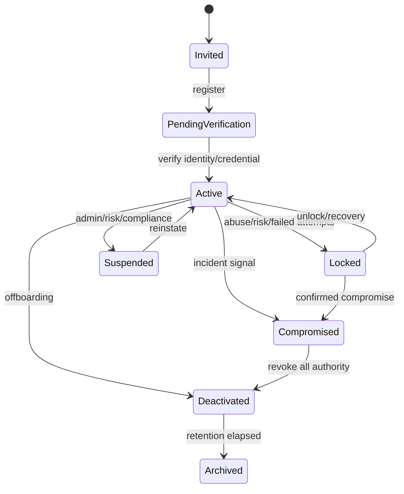
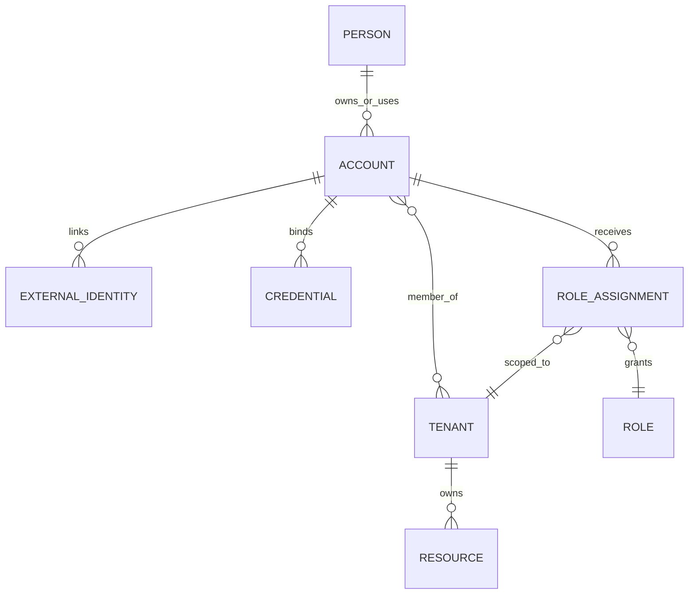
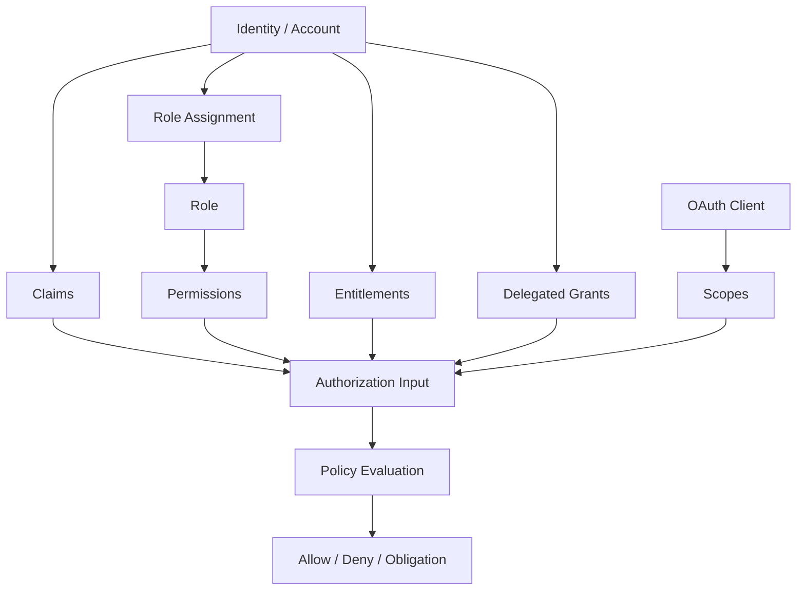
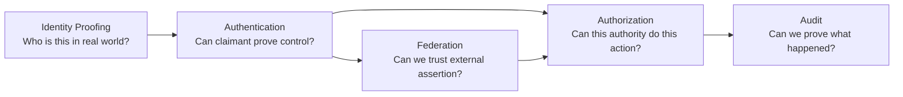
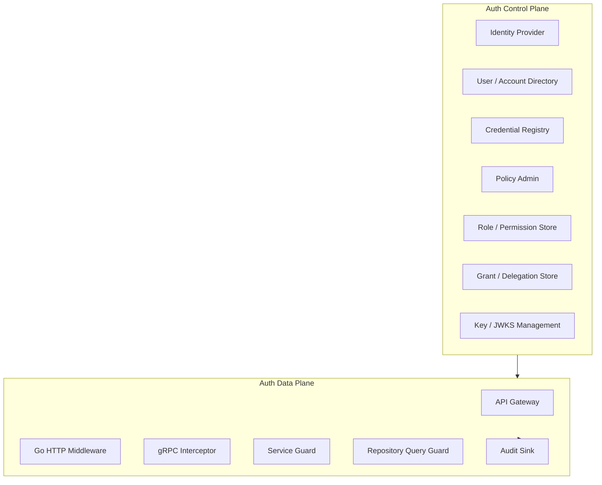
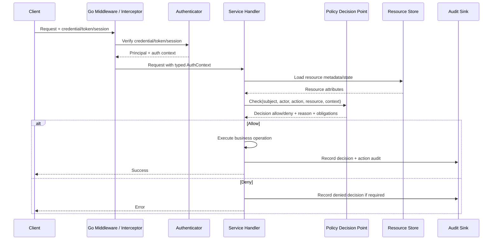
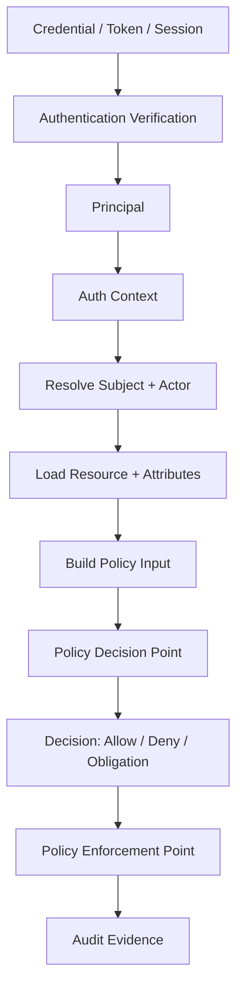
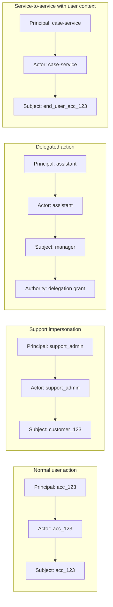
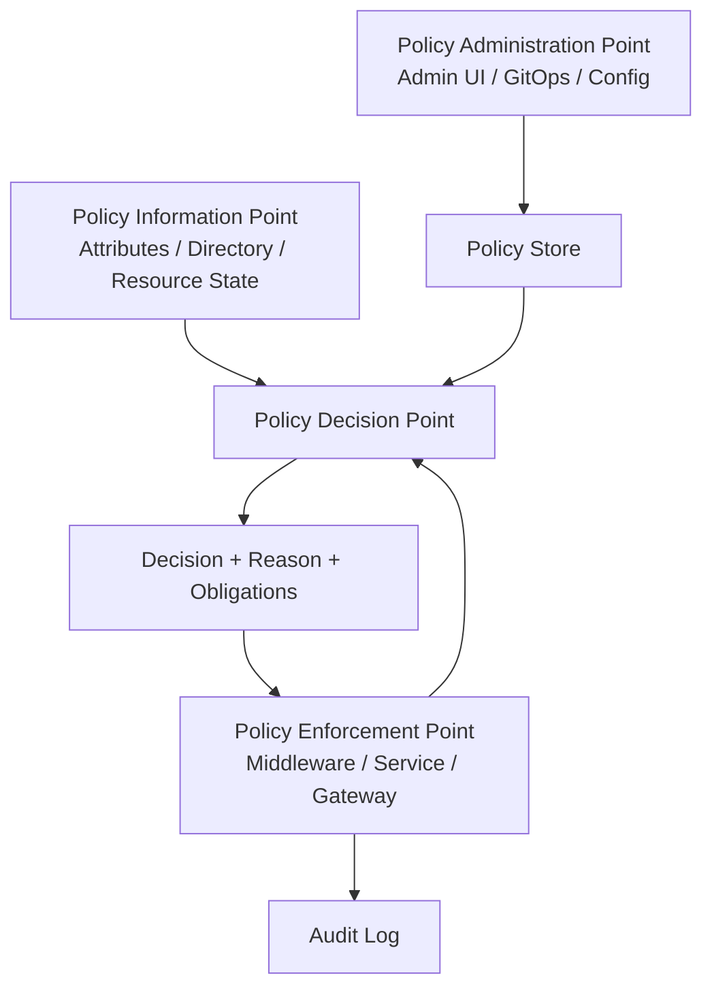

# learn-go-authentication-authorization-identity-permission-part-001.md

# Part 001 — Mental Model: Identity, Authentication, Authorization, Permission

> Seri: **Advanced Go Authentication, Authorization, Identity, Permission**  
> Target: Go 1.26.x  
> Level: Advanced / internal engineering handbook  
> Status seri: **belum selesai**  
> Fokus part ini: membangun mental model yang presisi sebelum masuk ke implementasi OAuth2, OIDC, session, JWT, RBAC, ABAC, ReBAC, policy engine, workload identity, dan distributed authorization.

---

## Daftar Isi

1. [Tujuan Part Ini](#1-tujuan-part-ini)
2. [Masalah Besar: Auth Bukan Satu Fitur, Tapi Sistem Kontrol](#2-masalah-besar-auth-bukan-satu-fitur-tapi-sistem-kontrol)
3. [Core Vocabulary yang Harus Presisi](#3-core-vocabulary-yang-harus-presisi)
4. [Identity: Bukan Sekadar User Table](#4-identity-bukan-sekadar-user-table)
5. [Account, User, Person, Organization, Tenant](#5-account-user-person-organization-tenant)
6. [Principal, Subject, Actor: Tiga Istilah yang Sering Tertukar](#6-principal-subject-actor-tiga-istilah-yang-sering-tertukar)
7. [Authentication: Pembuktian Kontrol, Bukan Pembuktian Moral](#7-authentication-pembuktian-kontrol-bukan-pembuktian-moral)
8. [Authorization: Keputusan Berbasis Authority, Context, Policy, dan Evidence](#8-authorization-keputusan-berbasis-authority-context-policy-dan-evidence)
9. [Permission, Role, Scope, Claim, Entitlement, Grant](#9-permission-role-scope-claim-entitlement-grant)
10. [Authentication vs Authorization vs Identity Proofing vs Federation](#10-authentication-vs-authorization-vs-identity-proofing-vs-federation)
11. [Human Identity vs Workload Identity](#11-human-identity-vs-workload-identity)
12. [Auth sebagai Control Plane dan Data Plane](#12-auth-sebagai-control-plane-dan-data-plane)
13. [Request-Time Model: Dari Request Masuk sampai Decision](#13-request-time-model-dari-request-masuk-sampai-decision)
14. [Design Invariants untuk Sistem Auth](#14-design-invariants-untuk-sistem-auth)
15. [Common Failure Modes dari Mental Model yang Salah](#15-common-failure-modes-dari-mental-model-yang-salah)
16. [Go Design Lens: Bagaimana Mental Model Ini Diterjemahkan ke Code](#16-go-design-lens-bagaimana-mental-model-ini-diterjemahkan-ke-code)
17. [Minimal Domain Types di Go](#17-minimal-domain-types-di-go)
18. [Middleware Bukan Tempat Semua Auth Logic](#18-middleware-bukan-tempat-semua-auth-logic)
19. [Authorization Decision Interface](#19-authorization-decision-interface)
20. [Diagram Mental Model](#20-diagram-mental-model)
21. [Case Study: Regulatory Case Management](#21-case-study-regulatory-case-management)
22. [Checklist Review Desain](#22-checklist-review-desain)
23. [Pertanyaan Latihan](#23-pertanyaan-latihan)
24. [Ringkasan](#24-ringkasan)
25. [Referensi Primer](#25-referensi-primer)

---

## 1. Tujuan Part Ini

Part ini bukan membahas "cara login pakai Go". Itu terlalu sempit.

Tujuan part ini adalah membangun **bahasa berpikir** dan **model konseptual** yang akan dipakai sepanjang seluruh seri.

Jika mental model auth salah, implementasi OAuth2, OIDC, JWT, RBAC, ABAC, ReBAC, session, policy engine, atau service-to-service identity akan ikut salah, walaupun library yang dipakai benar.

Kesalahan auth level senior jarang hanya seperti:

```text
password tidak di-hash
JWT secret hardcoded
missing HTTPS
```

Itu penting, tetapi bukan titik kegagalan paling dalam.

Kesalahan yang lebih mahal biasanya seperti:

```text
- sistem tidak bisa membedakan user asli vs admin yang sedang impersonate user
- token dianggap sebagai sumber kebenaran permission, padahal permission sudah berubah
- role dipakai sebagai permission final sehingga role explosion tidak terkendali
- tenant boundary tidak masuk ke authorization decision
- service internal percaya semua request dari network internal
- audit log hanya mencatat user_id, bukan actor, subject, policy version, dan authority chain
- scope OAuth dianggap sama dengan business permission
- authentication sukses dianggap cukup untuk mengakses resource
- permission dicek di UI, bukan di server-side enforcement point
- batch/export/search lupa object-level authorization
```

Part ini akan memaksa kita memisahkan istilah, boundary, dan keputusan.

---

## 2. Masalah Besar: Auth Bukan Satu Fitur, Tapi Sistem Kontrol

Dalam aplikasi kecil, auth sering terlihat seperti fitur:

```text
Register → Login → Middleware → Check Role → Done
```

Dalam sistem enterprise, regulatory, financial, healthcare, public-sector, marketplace, SaaS multi-tenant, atau distributed microservices, auth adalah **sistem kontrol**.

Artinya auth menentukan:

1. siapa yang dikenal sistem,
2. bukti apa yang cukup untuk menganggap dia benar,
3. sesi apa yang aktif,
4. authority apa yang sedang dibawa,
5. resource apa yang ingin disentuh,
6. aturan apa yang berlaku,
7. siapa aktor sebenarnya,
8. atas nama siapa tindakan dilakukan,
9. apakah tindakan tersebut boleh,
10. bukti apa yang disimpan untuk audit,
11. bagaimana perubahan permission menyebar,
12. bagaimana sistem gagal ketika IdP, cache, policy store, atau key server bermasalah.

Model sederhana:

```text
Auth is not login.
Auth is the runtime governance system for digital authority.
```

Dalam sistem serius, auth harus menjawab pertanyaan seperti:

```text
Can this actor, authenticated by this mechanism, using this session,
representing this subject, under this tenant, at this assurance level,
perform this action on this resource, in this workflow state,
according to this policy version, with this delegation chain,
at this time, from this environment, and leave enough evidence for audit?
```

Kalimat itu panjang karena masalahnya memang panjang.

Engineer biasa mencoba menyederhanakannya menjadi:

```go
if user.Role == "ADMIN" {
    allow()
}
```

Engineer kuat bertanya:

```text
Admin untuk tenant mana?
Admin acting as himself atau impersonating?
Admin boleh melihat data atau boleh mengubah decision?
Admin authority berasal dari role permanen, approval sementara, atau break-glass?
Action ini butuh assurance level berapa?
Resource sedang berada di workflow stage apa?
Apakah ada separation-of-duties?
Apakah ada conflict dengan prior involvement?
Bagaimana audit membuktikan decision ini sah?
```

Inilah perbedaan antara auth sebagai fitur dan auth sebagai sistem kontrol.

---

## 3. Core Vocabulary yang Harus Presisi

Di bawah ini adalah vocabulary minimal yang harus dipisahkan.

| Istilah | Makna Ringkas | Kesalahan Umum |
|---|---|---|
| Identity | Representasi digital tentang entitas | Disamakan dengan row `users` |
| Identifier | Nilai untuk merujuk identity | Dianggap stabil selamanya |
| Account | Akun lokal dalam sistem | Dianggap sama dengan manusia |
| User | Entitas pengguna aplikasi | Dipakai terlalu longgar |
| Person | Manusia nyata | Dianggap selalu diketahui oleh sistem |
| Organization | Entitas organisasi | Dianggap sama dengan tenant |
| Tenant | Boundary isolasi data/konfigurasi | Dianggap hanya kolom `tenant_id` |
| Principal | Entitas yang berhasil diautentikasi | Dicampur dengan business user |
| Subject | Entitas yang menjadi target authority dalam request | Tidak dibedakan dari actor |
| Actor | Entitas yang benar-benar melakukan tindakan | Hilang saat impersonation/delegation |
| Credential | Bukti yang dapat dipakai untuk autentikasi | Disamakan dengan password saja |
| Authenticator | Mekanisme/faktor autentikasi | Tidak dibedakan dari credential |
| Session | State kontinuitas setelah autentikasi | Disamakan dengan token |
| Token | Artefak pembawa klaim/authority | Dianggap selalu sumber kebenaran |
| Claim | Pernyataan tentang subject/principal | Dianggap otomatis benar dan fresh |
| Role | Bundel authority/permission | Dipakai sebagai izin final |
| Permission | Izin melakukan action pada resource | Disimpan terlalu kasar |
| Scope | Batas authority OAuth/client | Disamakan dengan permission bisnis |
| Policy | Aturan evaluasi keputusan | Hardcoded tersebar di handler |
| Entitlement | Hak yang diberikan kepada identity/account | Tidak punya lifecycle jelas |
| Grant | Pemberian authority eksplisit | Tidak punya expiry/revocation |
| PDP | Policy Decision Point | Disamakan dengan middleware |
| PEP | Policy Enforcement Point | Terlalu banyak/terlalu sedikit |
| PIP | Policy Information Point | Attribute freshness diabaikan |
| PAP | Policy Administration Point | Admin UI dianggap sepele |

Top engineer tidak hanya tahu istilahnya. Mereka tahu **konsekuensi desain** dari tiap istilah.

---

## 4. Identity: Bukan Sekadar User Table

### 4.1 Definisi kerja

Dalam konteks sistem digital:

```text
Identity adalah representasi digital dari sebuah entitas yang dikenali sistem,
berisi identifier, atribut, hubungan, credential binding, assurance metadata,
dan lifecycle state.
```

Identity bisa mewakili:

- manusia,
- organisasi,
- aplikasi,
- service,
- machine,
- batch job,
- API client,
- automation bot,
- external IdP subject,
- delegated actor,
- support/admin session,
- temporary guest,
- anonymous-but-tracked subject.

### 4.2 Identity bukan selalu manusia

Kesalahan umum:

```text
Identity = user = human = email
```

Padahal dalam sistem modern:

```text
- cron job punya identity
- service punya identity
- CI/CD runner punya identity
- mobile app instance bisa punya device identity
- API client third-party punya client identity
- admin bisa bertindak sebagai actor atas subject lain
- external IdP punya subject yang perlu dipetakan ke account lokal
```

Maka field seperti ini berbahaya jika dipakai terlalu luas:

```go
type User struct {
    ID    string
    Email string
    Role  string
}
```

Untuk aplikasi kecil itu cukup. Untuk sistem identity serius, itu terlalu miskin.

### 4.3 Identity adalah kumpulan klaim, bukan fakta absolut

Sebuah identity membawa klaim:

```text
email = "a@example.com"
email_verified = true
name = "Alice"
department = "Compliance"
tenant = "agency-a"
auth_time = 2026-06-24T10:00:00Z
aal = 2
```

Klaim bukan selalu fakta absolut. Klaim punya:

- issuer,
- waktu diterbitkan,
- konteks,
- freshness,
- assurance,
- trust boundary,
- transformasi/mapping,
- lifecycle,
- kemungkinan stale.

Contoh:

```text
Claim: user.department = Compliance
Issuer: Corporate IdP
Issued at: 09:00
Policy check at: 17:00
Problem: user mungkin sudah pindah department pukul 13:00
```

Dalam authorization serius, pertanyaan yang benar bukan hanya:

```text
Apa department user?
```

Tapi:

```text
Siapa yang menyatakan department itu?
Kapan dinyatakan?
Apakah attribute itu cukup fresh untuk decision ini?
Apakah policy ini menerima issuer tersebut sebagai authority?
```

### 4.4 Identifier bukan identity

Identifier adalah pointer.

Identity adalah objek konseptual.

Contoh identifier:

```text
user_id
account_id
subject_id
external_sub
employee_id
client_id
spiffe_id
email
phone
username
```

Email tidak ideal sebagai immutable identifier karena email bisa berubah, dipakai ulang, atau berbeda antar IdP.

Dalam OIDC, `sub` adalah subject identifier yang diberikan issuer untuk end-user. Namun `sub` hanya bermakna dalam konteks issuer. Maka pair yang lebih aman adalah:

```text
issuer + subject
```

bukan hanya:

```text
subject
```

Contoh desain lokal:

```text
ExternalIdentity {
  provider_issuer: "https://idp.example.com"
  provider_subject: "248289761001"
  local_account_id: "acc_123"
}
```

Jika hanya menyimpan `sub`, dua issuer berbeda bisa menghasilkan nilai `sub` yang sama.

### 4.5 Identity lifecycle penting

Identity bukan objek statis.

State umum:

```text
invited
registered
pending_verification
active
suspended
locked
deactivated
merged
deleted
archived
compromised
```

State identity memengaruhi authentication dan authorization.

Contoh:

```text
- account suspended tidak boleh login
- account locked mungkin tidak boleh password login tetapi masih boleh recovery
- account deactivated tidak boleh refresh token
- account compromised harus mencabut session dan credential
- account merged harus punya migration audit
```

State machine sederhana:



---

## 5. Account, User, Person, Organization, Tenant

### 5.1 Person

`Person` adalah manusia nyata.

Sistem digital sering tidak benar-benar mengetahui person. Sistem hanya mengetahui evidence, claims, credentials, dan accounts.

Contoh:

```text
Fajar sebagai manusia nyata ≠ row users ≠ OIDC subject ≠ browser session.
```

### 5.2 User

`User` adalah entitas pengguna dalam aplikasi. Biasanya user diasosiasikan dengan person, tetapi tidak selalu.

Contoh user non-person:

```text
- service account
- integration user
- bot user
- migration user
- system user
```

Masalah muncul ketika semua hal dimasukkan ke tabel `users`, lalu logic bisnis menganggap semua `users` adalah manusia.

### 5.3 Account

`Account` adalah representasi lokal yang dipakai sistem untuk mengelola akses.

Satu person bisa punya banyak account:

```text
- personal account
- corporate account
- agency account
- vendor account
- support account
```

Satu account bisa terkait banyak external identity:

```text
- login via corporate OIDC
- login via government identity provider
- passkey
- recovery email
```

### 5.4 Organization

`Organization` adalah entitas sosial/legal/bisnis.

Organization bisa:

- memiliki users,
- memiliki resources,
- menjadi tenant,
- berada dalam hierarchy,
- memiliki delegated administrators,
- memiliki policy override.

### 5.5 Tenant

Tenant adalah boundary isolasi.

Tenant bukan hanya `tenant_id`.

Tenant mencakup:

```text
- data boundary
- configuration boundary
- identity boundary
- permission boundary
- audit boundary
- operational boundary
- key boundary, dalam beberapa sistem
- policy boundary, dalam beberapa sistem
```

Anti-pattern:

```go
func GetCase(caseID string) (*Case, error) {
    return repo.FindByID(caseID)
}
```

Lebih aman:

```go
func GetCase(ctx context.Context, tenantID TenantID, caseID CaseID) (*Case, error) {
    return repo.FindByTenantAndID(ctx, tenantID, caseID)
}
```

Namun ini masih belum cukup. Query guard harus ditemani authorization decision:

```text
Can subject S perform action case.read on case C under tenant T?
```

### 5.6 Account-person-tenant model



Mental model:

```text
Person adalah dunia nyata.
External identity adalah claim dari provider.
Account adalah local projection.
Tenant adalah boundary.
Role/permission adalah authority model.
```

---

## 6. Principal, Subject, Actor: Tiga Istilah yang Sering Tertukar

Ini bagian paling penting dari part ini.

### 6.1 Principal

Principal adalah entitas yang berhasil diautentikasi oleh sistem.

Contoh:

```text
- user account acc_123
- service svc_payment
- API client client_abc
- workload spiffe://prod.example.com/ns/case/sa/api
```

Authentication menghasilkan principal.

```text
credential/session/token → verification → principal
```

### 6.2 Subject

Subject adalah entitas yang menjadi subjek authority dalam request.

Dalam request normal:

```text
actor = subject = principal
```

Dalam impersonation:

```text
principal = support_admin_1
actor    = support_admin_1
subject  = customer_123
```

Dalam delegation:

```text
principal = assistant_1
actor    = assistant_1
subject  = manager_1
authority = delegated_by(manager_1)
```

Dalam service call:

```text
principal = service_case_api
subject  = user_acc_123
actor    = user_acc_123 or service_case_api depending on semantics
```

### 6.3 Actor

Actor adalah entitas yang benar-benar melakukan tindakan.

Audit harus tahu actor.

Kalau sistem hanya menyimpan `user_id`, audit bisa kehilangan informasi penting.

Contoh buruk:

```text
Audit: user customer_123 updated address
```

Padahal sebenarnya:

```text
Actor: support_admin_1
Subject: customer_123
Action: customer.address.update
Authority: support_impersonation_grant_789
Reason: ticket INC-456
```

### 6.4 Kenapa perbedaan ini penting?

Karena authorization dan audit punya pertanyaan berbeda.

Authorization bertanya:

```text
Apakah authority yang sedang dipakai boleh melakukan action ini?
```

Audit bertanya:

```text
Siapa yang benar-benar melakukan tindakan ini?
Atas nama siapa?
Dengan authority apa?
Kapan?
Berdasarkan policy versi mana?
```

### 6.5 Model Go sederhana

```go
type PrincipalID string
type SubjectID string
type ActorID string

type PrincipalKind string

const (
    PrincipalHuman   PrincipalKind = "human"
    PrincipalService PrincipalKind = "service"
    PrincipalClient  PrincipalKind = "client"
)

type Principal struct {
    ID        PrincipalID
    Kind      PrincipalKind
    Issuer    string
    AuthTime  time.Time
    Assurance AssuranceLevel
}

type Actor struct {
    ID        ActorID
    Principal PrincipalID
    Kind      PrincipalKind
}

type Subject struct {
    ID     SubjectID
    Kind   string
    Tenant TenantID
}

type AuthContext struct {
    Principal Principal
    Actor     Actor
    Subject   Subject

    SessionID     string
    DelegationID  *string
    Impersonation *ImpersonationContext
}
```

Catatan: ini bukan schema final. Ini mental model awal.

---

## 7. Authentication: Pembuktian Kontrol, Bukan Pembuktian Moral

### 7.1 Definisi kerja

```text
Authentication adalah proses memverifikasi bahwa claimant memiliki kontrol atas authenticator/credential yang terikat pada identity/account tertentu.
```

Authentication tidak membuktikan bahwa orang itu "baik".
Authentication tidak otomatis memberi izin.
Authentication tidak selalu membuktikan legal identity.

Authentication hanya mengatakan:

```text
Claimant ini berhasil menunjukkan bukti yang cukup menurut mekanisme yang dipilih.
```

Contoh:

```text
Password benar → claimant kemungkinan mengontrol password.
TOTP benar → claimant kemungkinan mengontrol TOTP secret/device.
Passkey assertion valid → claimant mengontrol private key authenticator untuk RP ini.
mTLS client cert valid → caller mengontrol private key certificate.
OIDC ID token valid → issuer menyatakan user sudah diautentikasi.
```

### 7.2 Authentication punya level kekuatan

Tidak semua authentication setara.

Contoh kasar:

```text
password only < password + TOTP < passkey phishing-resistant < hardware-bound key with strong attestation
```

Authorization bisa mensyaratkan authentication strength tertentu.

Contoh:

```text
- membaca dashboard: AAL1 cukup
- mengubah rekening pembayaran: butuh step-up AAL2
- menyetujui enforcement action: butuh phishing-resistant factor atau dual approval
```

### 7.3 Authentication punya waktu

Authentication bukan fakta abadi.

Auth context perlu membawa:

```text
auth_time
session_start
last_activity
assurance_level
methods_used
step_up_time
```

Contoh:

```text
User login 8 jam lalu dengan password.
Sekarang ingin export data sensitif.
Apakah login lama masih cukup?
```

Mungkin tidak.

### 7.4 Authentication menghasilkan session/token/context

Authentication biasanya menghasilkan salah satu:

```text
- server-side session
- signed session cookie
- access token
- ID token
- refresh token
- mTLS-authenticated channel
- workload identity credential
```

Namun artefak itu bukan identity itu sendiri.

```text
Token is evidence, not the person.
Session is continuity, not permission.
```

---

## 8. Authorization: Keputusan Berbasis Authority, Context, Policy, dan Evidence

### 8.1 Definisi kerja

```text
Authorization adalah proses mengambil keputusan allow/deny atas sebuah action terhadap resource dalam context tertentu, berdasarkan identity/authority/policy/evidence yang tersedia.
```

Formula sederhana:

```text
Decision = f(subject, actor, action, resource, context, policy, authority, evidence)
```

Dalam bentuk pertanyaan:

```text
Can subject S, represented by actor A, perform action X on resource R under context C?
```

### 8.2 Authorization bukan hanya role check

Role check:

```go
if user.Role == "ADMIN" {
    allow()
}
```

Authorization decision:

```text
subject: acc_123
actor: acc_123
action: case.approve
resource: case_789
resource attributes:
  tenant: agency-a
  stage: review
  assigned_officer: acc_123
subject attributes:
  tenant membership: agency-a
  role: senior_case_officer
context:
  auth assurance: AAL2
  time: business hours
policy:
  case approval policy v12
constraints:
  cannot approve own submitted case
  must be assigned to case
  must have active appointment
  case must be in review stage
```

Keputusan auth yang benar sering membutuhkan resource state.

Itu sebabnya authorization tidak bisa selalu selesai di API gateway.

### 8.3 Authorization punya evidence

Decision yang baik tidak hanya return boolean.

Minimal:

```text
allow/deny
reason code
policy version
matched rule
required action if denied
obligations
input snapshot hash/reference
decision timestamp
```

Contoh:

```go
type DecisionEffect string

const (
    Allow DecisionEffect = "allow"
    Deny  DecisionEffect = "deny"
)

type Decision struct {
    Effect        DecisionEffect
    ReasonCode    string
    PolicyID      string
    PolicyVersion string
    EvaluatedAt   time.Time
    Obligations   []Obligation
}
```

`Obligations` adalah hal yang harus dilakukan jika allow diberikan.

Contoh obligations:

```text
- mask field NRIC
- require audit reason
- require step-up authentication
- watermark export file
- notify supervisor
```

### 8.4 Authorization bisa menghasilkan deny yang berbeda-beda

Tidak semua deny sama.

```text
Unauthenticated: caller belum punya principal valid
Unauthorized: principal valid tapi tidak punya authority
Forbidden by workflow: authority ada, state resource tidak memperbolehkan
Requires step-up: authority mungkin ada, assurance belum cukup
Requires approval: action boleh hanya setelah dual control
Tenant mismatch: hard deny
Policy unavailable: fail-closed atau degraded path
```

HTTP mapping sering:

```text
401 Unauthorized     = unauthenticated, perlu authentication
403 Forbidden        = authenticated tapi tidak boleh
404 Not Found        = kadang dipakai untuk menyembunyikan existence resource
409 Conflict         = state resource tidak valid untuk action
428 Precondition     = precondition/step-up/approval required, tergantung API design
```

Dalam API internal, reason code biasanya lebih penting daripada hanya status code.

---

## 9. Permission, Role, Scope, Claim, Entitlement, Grant

Bagian ini membedakan konsep yang paling sering dicampur.

### 9.1 Permission

Permission adalah izin untuk melakukan action terhadap resource atau class resource.

Format umum:

```text
<resource-type>.<action>
```

Contoh:

```text
case.read
case.create
case.update
case.approve
case.assign
case.export
case.delete
appeal.submit
appeal.review
user.invite
role.assign
report.generate
payment.refund
```

Permission yang lebih matang punya dimensi:

```text
action
resource type
resource instance
scope
tenant
condition
constraint
validity
source authority
```

### 9.2 Role

Role adalah bundel permission atau authority yang diberikan kepada subject dalam scope tertentu.

Contoh:

```text
Senior Case Officer
Agency Admin
External Representative
Compliance Reviewer
Read-only Auditor
```

Role bukan permission final.

Role harus di-resolve menjadi authority.

Anti-pattern:

```go
if role == "CASE_OFFICER" { allow }
```

Lebih baik:

```text
role assignment → effective permissions → decision policy → allow/deny
```

### 9.3 Scope

Dalam OAuth, scope membatasi authority client/token.

Contoh:

```text
openid profile email
case:read
case:write
report:export
```

Scope sering merepresentasikan consent atau delegated access pada level API.

Scope bukan selalu business permission.

Contoh:

```text
Token punya scope case:read.
Apakah user boleh membaca case_123?
Belum tentu.
Masih perlu object-level authorization.
```

Scope menjawab:

```text
Apakah token/client diberi batas authority untuk area ini?
```

Permission menjawab:

```text
Apakah subject boleh melakukan action ini terhadap resource ini?
```

### 9.4 Claim

Claim adalah pernyataan.

Contoh claim:

```json
{
  "iss": "https://idp.example.com",
  "sub": "user-123",
  "email": "alice@example.com",
  "email_verified": true,
  "tenant": "agency-a",
  "roles": ["case_officer"],
  "aal": "2"
}
```

Claim dapat digunakan sebagai input authorization.

Namun claim bukan decision.

Bahaya:

```text
JWT contains roles → application blindly trusts roles → stale privilege persists until token expires
```

### 9.5 Entitlement

Entitlement adalah hak yang diberikan kepada subject/account.

Contoh:

```text
Account acc_123 entitled to access module Compliance for tenant agency-a.
Organization org_1 entitled to submit renewal applications.
```

Entitlement sering dekat dengan licensing, subscription, organizational appointment, product access, atau regulatory appointment.

Entitlement bukan sama dengan role.

### 9.6 Grant

Grant adalah pemberian authority secara eksplisit.

Contoh:

```text
- manager grants assistant access to calendar
- tenant admin grants user role agency_reviewer
- user consents third-party app to read profile
- emergency approval grants admin break-glass for 2 hours
```

Grant harus punya:

```text
grantor
grantee
authority
scope
valid_from
valid_until
revocation_state
reason/source
created_by
created_at
```

### 9.7 Relasi antar istilah



---

## 10. Authentication vs Authorization vs Identity Proofing vs Federation

### 10.1 Identity proofing

Identity proofing adalah proses mengaitkan digital identity dengan real-world identity berdasarkan evidence.

Contoh:

```text
- verifikasi dokumen identitas
- face match
- government identity provider
- corporate HR verification
- business registry validation
```

Aplikasi biasa sering tidak melakukan identity proofing sendiri.

### 10.2 Authentication

Authentication membuktikan claimant mengontrol authenticator yang terikat pada identity/account.

Contoh:

```text
password
TOTP
passkey
client certificate
OIDC login result
```

### 10.3 Authorization

Authorization memutuskan apakah authority yang tersedia boleh digunakan untuk action tertentu.

### 10.4 Federation

Federation adalah mekanisme mempercayai identity/authentication result dari pihak lain.

Contoh:

```text
Your Go application trusts corporate IdP through OIDC.
```

Aplikasi tidak memverifikasi password user langsung. Aplikasi memverifikasi token/assertion dari IdP.

### 10.5 Mapping besar



---

## 11. Human Identity vs Workload Identity

### 11.1 Human identity

Human identity mewakili manusia atau account yang dipakai manusia.

Karakteristik:

```text
- interactive login
- session
- MFA/passkey/password
- consent
- recovery
- phishing risk
- user lifecycle
- HR/offboarding dependency
```

### 11.2 Workload identity

Workload identity mewakili software workload.

Contoh:

```text
- service A calls service B
- Kubernetes workload calls database proxy
- cron job calls billing API
- CI/CD pipeline deploys artifact
- batch worker consumes queue
```

Karakteristik:

```text
- non-human
- no password login
- often certificate/token based
- short-lived credential preferred
- platform attestation useful
- service-to-service policy
- rotation automation
```

### 11.3 Jangan pakai user model untuk workload

Anti-pattern:

```text
Create fake user:
email = billing-service@example.com
role = ADMIN
password = random long password
```

Masalah:

```text
- lifecycle tidak sesuai
- audit membingungkan
- MFA tidak relevan
- password rotation manual
- privilege sering terlalu luas
- susah membedakan human vs machine
```

Lebih baik:

```text
PrincipalKind = service/workload/client
Credential = mTLS/JWT assertion/SPIFFE SVID/platform identity
Policy = service-to-service action/resource permission
```

### 11.4 Identity harus typed

Dalam Go, hindari semua identity sebagai `string`.

```go
type HumanAccountID string
type ServicePrincipalID string
type TenantID string
```

Ini bukan keamanan kriptografis, tapi membantu mencegah bug desain.

---

## 12. Auth sebagai Control Plane dan Data Plane

### 12.1 Control plane

Auth control plane mengelola konfigurasi, identity, policy, dan authority.

Contoh komponen:

```text
- identity provider
- user directory
- credential registry
- session store
- client registry
- role management
- permission catalog
- policy management
- grant/delegation store
- tenant membership store
- key management/JWKS
- audit policy
```

### 12.2 Data plane

Auth data plane menegakkan keputusan pada request nyata.

Contoh:

```text
- HTTP middleware
- gRPC interceptor
- API gateway plugin
- service method guard
- repository query guard
- object-level authorization
- export authorization
- batch job authorization
```

### 12.3 Keduanya harus dipisah secara mental

Control plane menjawab:

```text
Apa aturan, identity, role, permission, grant, dan keys yang berlaku?
```

Data plane menjawab:

```text
Untuk request ini, apa keputusan yang harus ditegakkan sekarang?
```

Diagram:



### 12.4 Kesalahan umum

```text
- semua policy hardcoded di data plane
- semua decision dilempar ke gateway sehingga service kehilangan context
- control plane update tidak punya propagation model
- data plane tidak tahu policy version
- audit tidak bisa merekonstruksi decision karena input tidak tercatat
```

---

## 13. Request-Time Model: Dari Request Masuk sampai Decision

Mari modelkan request.

```text
Incoming request
  ↓
Extract credentials/session/token
  ↓
Authenticate / verify / introspect
  ↓
Build principal
  ↓
Resolve actor/subject/tenant
  ↓
Load resource/action/context
  ↓
Evaluate policy
  ↓
Return decision
  ↓
Enforce decision
  ↓
Execute business action
  ↓
Emit audit event
```

Diagram:



### 13.1 Authentication may happen before resource load

Middleware can verify identity early.

But final authorization often needs resource state.

Example:

```text
Middleware knows user is acc_123.
Middleware does not know whether acc_123 can approve case_789,
because it does not know case_789.assigned_officer, workflow stage, tenant,
or conflict-of-interest state.
```

### 13.2 Coarse-grained vs fine-grained

Coarse-grained check:

```text
Does request have valid token?
Does token include API scope case:write?
Does principal belong to tenant?
```

Fine-grained check:

```text
Can this subject update this field of this case at this workflow stage?
```

Both are needed.

---

## 14. Design Invariants untuk Sistem Auth

Invariant adalah aturan yang harus selalu benar.

### Invariant 1 — Authentication never implies authorization

```text
Authenticated ≠ allowed.
```

Login sukses hanya memberi principal/session.
Permission tetap harus dicek.

### Invariant 2 — Authorization decision must include resource context

Banyak action tidak bisa diputuskan hanya dari user/token.

```text
case.approve requires case state, tenant, assignment, conflict-of-interest, and assurance.
```

### Invariant 3 — Tenant boundary must be explicit

Jangan bergantung pada implicit tenant dari UI, route, atau token saja.

Resource harus divalidasi dalam tenant boundary.

### Invariant 4 — Actor and subject must not be collapsed

Jika sistem mendukung admin, delegation, support, automation, workflow assignment, atau service calls, actor/subject harus dipisah.

### Invariant 5 — Token is evidence, not source of all truth

Token bisa stale.
Token membawa claims.
Policy dan permission store tetap punya authority.

### Invariant 6 — Deny must be safe by default

Jika policy tidak tersedia, attribute tidak fresh, issuer tidak dikenal, key invalid, tenant mismatch, atau resource tidak jelas, default harus deny kecuali ada desain degraded mode yang eksplisit.

### Invariant 7 — Policy must be testable

Jika authorization tersebar sebagai `if` acak di handler, policy sulit dites.
Policy yang serius harus punya test cases.

### Invariant 8 — Audit must record enough evidence

Audit minimal harus bisa menjawab:

```text
who acted?
as whom?
on what?
with what authority?
under which policy?
what was the result?
when?
from where/context?
```

### Invariant 9 — Admin is not magic

Admin juga subject dari policy.
Admin action harus lebih diaudit, bukan lebih dipercaya.

### Invariant 10 — UI permission is not enforcement

UI boleh menyembunyikan tombol.
Server tetap harus enforce.

---

## 15. Common Failure Modes dari Mental Model yang Salah

### 15.1 Authentication bypass disguised as routing issue

Contoh:

```text
/api/internal/export accessible from public ingress because route annotation wrong
```

Root cause bukan hanya routing. Root cause: sistem menganggap network boundary cukup sebagai identity.

### 15.2 IDOR / BOLA

Contoh:

```http
GET /cases/123
GET /cases/124
```

Jika handler hanya cek login dan tidak cek object-level permission, user bisa membaca resource milik orang/tenant lain.

### 15.3 Role explosion

Awalnya:

```text
ADMIN
USER
```

Lalu:

```text
AGENCY_ADMIN
AGENCY_ADMIN_READONLY
AGENCY_ADMIN_REPORT_ONLY
CASE_OFFICER_LEVEL_1
CASE_OFFICER_LEVEL_2
CASE_OFFICER_TEMP_APPROVER
CASE_OFFICER_EXTERNAL_LIMITED
CASE_OFFICER_EXTERNAL_LIMITED_NO_EXPORT
```

Ini tanda role dipakai untuk encode condition.

Solusi: pisahkan role, permission, resource attributes, constraints, dan policy.

### 15.4 Stale token privilege

User role dicabut pukul 10:00.
Access token berlaku sampai 18:00.
Service hanya percaya role claim dalam JWT.
User masih punya akses 8 jam.

Solusi tergantung risk:

```text
- short TTL
- introspection
- permission version
- session revocation
- event-driven invalidation
- critical action real-time check
```

### 15.5 Confused deputy

Service A punya akses luas ke Service B.
User meminta Service A melakukan operasi yang user sendiri tidak boleh lakukan.
Service B hanya melihat Service A identity dan allow.

Solusi:

```text
- propagate user/subject context
- distinguish service principal from end-user subject
- check both service authority and user authority
- use delegation/actor model
```

### 15.6 Tenant breakout through search/export/report

Object detail endpoint aman.
Export endpoint lupa tenant/object-level authorization.

Contoh:

```text
GET /cases/123 → protected
GET /cases/export?status=open → leaks all tenants
```

Sistem yang matang menganggap search/report/export sebagai high-risk authorization surface.

### 15.7 Impersonation audit loss

Support admin masuk sebagai customer.
Audit mencatat customer melakukan perubahan.

Ini fatal untuk forensic dan regulatory defensibility.

### 15.8 Policy drift

Permission logic di:

```text
- frontend
- API gateway
- service A
- service B
- report worker
- SQL view
```

Semua beda sedikit.

Hasilnya inconsistent authorization.

### 15.9 Overloading OAuth scope

Scope `case:write` dianggap boleh semua write operation.

Padahal:

```text
case.update_draft
case.submit
case.assign
case.approve
case.close
case.delete
case.export
```

berbeda risk dan authority.

### 15.10 System account with god permission

Batch job diberi role `ADMIN` karena mudah.

Nanti batch job compromise menjadi full system compromise.

---

## 16. Go Design Lens: Bagaimana Mental Model Ini Diterjemahkan ke Code

Go mendorong explicitness.

Untuk auth, itu bagus.

Prinsip Go yang relevan:

```text
- small interfaces
- explicit error handling
- context propagation
- package boundaries
- typed domain concepts
- simple composition
- testable functions
```

### 16.1 Hindari package auth yang terlalu besar

Anti-pattern:

```text
/internal/auth
  login.go
  jwt.go
  oauth.go
  role.go
  middleware.go
  policy.go
  password.go
  session.go
  user.go
  tenant.go
  audit.go
```

Semua bercampur.

Lebih baik pisahkan berdasarkan responsibility:

```text
/internal/identity
  account.go
  principal.go
  external_identity.go

/internal/authn
  authenticator.go
  password.go
  session.go
  oidc.go

/internal/authz
  action.go
  resource.go
  decision.go
  policy.go
  engine.go

/internal/tenant
  tenant.go
  membership.go

/internal/audit
  auth_event.go
  decision_event.go

/internal/httpauth
  middleware.go
  errors.go

/internal/grpcauth
  interceptor.go
```

### 16.2 Naming matters

Jangan semua disebut `User`.

Gunakan istilah yang sesuai:

```go
Principal
Subject
Actor
Account
Credential
Session
Grant
Permission
Policy
Decision
```

Nama yang presisi mengurangi bug konseptual.

### 16.3 Context should carry auth context, not everything

Jangan simpan banyak hal acak dalam `context.Context`.

Cukup simpan auth context yang typed dan immutable untuk request.

```go
type contextKey struct{}

func WithAuthContext(ctx context.Context, ac AuthContext) context.Context {
    return context.WithValue(ctx, contextKey{}, ac)
}

func AuthContextFrom(ctx context.Context) (AuthContext, bool) {
    ac, ok := ctx.Value(contextKey{}).(AuthContext)
    return ac, ok
}
```

Catatan:

```text
context.Context bukan dependency injection container.
```

Gunakan hanya untuk request-scoped value.

### 16.4 Error harus typed

Auth error perlu dibedakan.

```go
type AuthErrorCode string

const (
    ErrMissingCredential AuthErrorCode = "missing_credential"
    ErrInvalidCredential AuthErrorCode = "invalid_credential"
    ErrExpiredToken      AuthErrorCode = "expired_token"
    ErrInsufficientAAL   AuthErrorCode = "insufficient_assurance"
    ErrForbidden         AuthErrorCode = "forbidden"
    ErrTenantMismatch    AuthErrorCode = "tenant_mismatch"
    ErrPolicyUnavailable AuthErrorCode = "policy_unavailable"
)

type AuthError struct {
    Code    AuthErrorCode
    Message string
    Cause   error
}

func (e *AuthError) Error() string { return string(e.Code) }
func (e *AuthError) Unwrap() error { return e.Cause }
```

Mapping ke HTTP/gRPC dilakukan di adapter layer, bukan di domain policy.

---

## 17. Minimal Domain Types di Go

Bagian ini memberi skeleton mental, bukan framework final.

### 17.1 Identity identifiers

```go
package identity

type AccountID string
type TenantID string
type PrincipalID string
type ExternalSubject string
type Issuer string

type AccountKind string

const (
    AccountHuman   AccountKind = "human"
    AccountService AccountKind = "service"
    AccountBot     AccountKind = "bot"
)

type AccountState string

const (
    AccountInvited     AccountState = "invited"
    AccountActive      AccountState = "active"
    AccountLocked      AccountState = "locked"
    AccountSuspended   AccountState = "suspended"
    AccountDeactivated AccountState = "deactivated"
    AccountCompromised AccountState = "compromised"
)

type Account struct {
    ID     AccountID
    Kind   AccountKind
    State  AccountState
    Tenant TenantID
}
```

### 17.2 Authentication context

```go
package authn

import "time"

type AssuranceLevel int

const (
    AssuranceUnknown AssuranceLevel = iota
    AssuranceLow
    AssuranceMedium
    AssuranceHigh
)

type Method string

const (
    MethodPassword Method = "password"
    MethodTOTP     Method = "totp"
    MethodPasskey  Method = "passkey"
    MethodOIDC     Method = "oidc"
    MethodMTLS     Method = "mtls"
)

type Authentication struct {
    PrincipalID string
    Issuer      string
    AuthTime    time.Time
    Methods     []Method
    Assurance   AssuranceLevel
    SessionID   string
}
```

### 17.3 Authorization action/resource

```go
package authz

type Action string

const (
    ActionCaseRead    Action = "case.read"
    ActionCaseUpdate  Action = "case.update"
    ActionCaseApprove Action = "case.approve"
    ActionCaseExport  Action = "case.export"
)

type ResourceType string

const (
    ResourceCase   ResourceType = "case"
    ResourceReport ResourceType = "report"
    ResourceUser   ResourceType = "user"
)

type ResourceRef struct {
    Type     ResourceType
    ID       string
    TenantID string
}
```

### 17.4 Auth request

```go
package authz

import "time"

type Subject struct {
    ID       string
    TenantID string
    Kind     string
}

type Actor struct {
    ID   string
    Kind string
}

type RequestContext struct {
    Time        time.Time
    IP          string
    UserAgent   string
    AuthMethods []string
    Assurance   int
}

type CheckRequest struct {
    Subject  Subject
    Actor    Actor
    Action   Action
    Resource ResourceRef
    Context  RequestContext
}
```

### 17.5 Decision

```go
package authz

import "time"

type Effect string

const (
    EffectAllow Effect = "allow"
    EffectDeny  Effect = "deny"
)

type Obligation struct {
    Type   string
    Params map[string]string
}

type Decision struct {
    Effect        Effect
    ReasonCode    string
    PolicyID      string
    PolicyVersion string
    Obligations   []Obligation
    EvaluatedAt   time.Time
}

func (d Decision) Allowed() bool {
    return d.Effect == EffectAllow
}
```

### 17.6 Policy engine interface

```go
package authz

import "context"

type PolicyEngine interface {
    Check(ctx context.Context, req CheckRequest) (Decision, error)
}
```

Interface kecil seperti ini memungkinkan:

```text
- local in-memory policy untuk test
- OPA adapter
- Casbin adapter
- custom engine
- remote PDP client
- fallback/degraded evaluator
```

---

## 18. Middleware Bukan Tempat Semua Auth Logic

### 18.1 Tugas middleware

Middleware cocok untuk:

```text
- extract credential/session/token
- verify token/session secara umum
- build principal/auth context
- reject unauthenticated request
- attach typed auth context to request context
- enforce coarse route requirement
```

Middleware tidak cocok untuk semua fine-grained authorization karena sering tidak punya resource state.

### 18.2 Contoh HTTP middleware skeleton

```go
func RequireAuthentication(verifier TokenVerifier) func(http.Handler) http.Handler {
    return func(next http.Handler) http.Handler {
        return http.HandlerFunc(func(w http.ResponseWriter, r *http.Request) {
            token, err := extractBearer(r.Header.Get("Authorization"))
            if err != nil {
                writeAuthError(w, ErrMissingCredential)
                return
            }

            authn, err := verifier.Verify(r.Context(), token)
            if err != nil {
                writeAuthError(w, ErrInvalidCredential)
                return
            }

            ctx := WithAuthContext(r.Context(), authn)
            next.ServeHTTP(w, r.WithContext(ctx))
        })
    }
}
```

### 18.3 Fine-grained check di service layer

```go
func (s *CaseService) ApproveCase(ctx context.Context, caseID string) error {
    ac, ok := AuthContextFrom(ctx)
    if !ok {
        return ErrUnauthenticated
    }

    c, err := s.caseRepo.GetByID(ctx, caseID)
    if err != nil {
        return err
    }

    decision, err := s.policy.Check(ctx, authz.CheckRequest{
        Subject:  ac.Subject,
        Actor:    ac.Actor,
        Action:   authz.ActionCaseApprove,
        Resource: authz.ResourceRef{Type: "case", ID: c.ID, TenantID: c.TenantID},
        Context: authz.RequestContext{
            Time:      s.clock.Now(),
            Assurance: ac.Assurance,
        },
    })
    if err != nil {
        return err
    }
    if !decision.Allowed() {
        return NewForbidden(decision)
    }

    if err := c.Approve(ac.Actor.ID); err != nil {
        return err
    }

    if err := s.caseRepo.Save(ctx, c); err != nil {
        return err
    }

    s.audit.RecordDecision(ctx, decision)
    return nil
}
```

### 18.4 Kenapa bukan semua di handler?

Handler seharusnya adapter HTTP.

Authorization domain harus bisa dites tanpa HTTP.

Jika policy tersebar di handler, worker/batch/gRPC path bisa lupa enforce policy.

---

## 19. Authorization Decision Interface

Aplikasi matang tidak hanya memanggil `Can(user, action)`.

Minimal:

```go
Check(ctx, subject, actor, action, resource, context) → decision
```

Lebih matang:

```go
type CheckRequest struct {
    RequestID string
    Subject   Subject
    Actor     Actor
    Action    Action
    Resource  ResourceRef
    ResourceAttributes map[string]any
    SubjectAttributes  map[string]any
    Environment        map[string]any
    AuthorityChain     []AuthorityLink
}
```

### 19.1 Authority chain

Authority chain menjelaskan asal authority.

Contoh:

```text
RoleAssignment: acc_123 has SeniorCaseOfficer in tenant agency-a
Delegation: manager_9 delegates case.approve to assistant_5 until Friday
ImpersonationGrant: support_admin_1 may act as customer_123 for ticket INC-456
OAuthConsent: user grants client_abc scope profile.read
```

### 19.2 Policy decision harus dapat diaudit

Decision log:

```json
{
  "request_id": "req_123",
  "effect": "deny",
  "reason_code": "case.not_assigned_officer",
  "policy_id": "case-approval-policy",
  "policy_version": "2026-06-24.3",
  "subject": "acc_123",
  "actor": "acc_123",
  "action": "case.approve",
  "resource": "case_789",
  "tenant": "agency-a",
  "evaluated_at": "2026-06-24T12:00:00Z"
}
```

Jangan log secret/token penuh.

---

## 20. Diagram Mental Model

### 20.1 Identity to decision pipeline



### 20.2 Principal, actor, subject



### 20.3 Policy architecture



---

## 21. Case Study: Regulatory Case Management

Bayangkan sistem case management untuk agency/regulator.

### 21.1 Entitas

```text
Tenant: agency-a
Account: officer_1
Role: Senior Case Officer
Resource: case_1001
Workflow state: Pending Review
Action: case.approve
```

### 21.2 Business rule

```text
Officer boleh approve case jika:
1. officer aktif,
2. officer member tenant yang sama,
3. officer punya role Senior Case Officer atau Approval Officer,
4. case berada pada stage Pending Review,
5. officer assigned sebagai reviewer,
6. officer bukan submitter awal,
7. officer tidak punya conflict-of-interest flag,
8. session memiliki assurance minimal AAL2,
9. approval belum melewati deadline atau ada override grant,
10. policy version aktif mengizinkan action tersebut.
```

### 21.3 Naive code

```go
if user.Role == "ADMIN" || user.Role == "SENIOR_CASE_OFFICER" {
    approve(caseID)
}
```

Bug:

```text
- tidak cek tenant
- tidak cek assignment
- tidak cek stage
- tidak cek conflict of interest
- tidak cek submitter
- tidak cek assurance
- tidak cek delegation/override
- tidak bisa audit policy decision
```

### 21.4 Better decision request

```go
req := authz.CheckRequest{
    Subject: authz.Subject{
        ID:       "officer_1",
        TenantID: "agency-a",
        Kind:     "human_account",
    },
    Actor: authz.Actor{
        ID:   "officer_1",
        Kind: "human_account",
    },
    Action: authz.Action("case.approve"),
    Resource: authz.ResourceRef{
        Type:     "case",
        ID:       "case_1001",
        TenantID: "agency-a",
    },
    Context: authz.RequestContext{
        Time:      now,
        Assurance: 2,
    },
}
```

Then policy engine loads/evaluates attributes:

```text
subject.roles[tenant=agency-a]
subject.account_state
case.stage
case.assigned_reviewer
case.submitter
case.conflict_flags
case.deadline
active_delegations
policy_version
```

### 21.5 Decision output

```json
{
  "effect": "deny",
  "reason_code": "case.submitter_cannot_approve_own_case",
  "policy_id": "case-approval",
  "policy_version": "v17",
  "obligations": [],
  "evaluated_at": "2026-06-24T12:00:00Z"
}
```

### 21.6 Why this matters

Dalam sistem regulatory, authorization bukan sekadar mencegah hacker.

Authorization juga memastikan:

```text
- due process
- separation of duties
- defensible decision trail
- accountability
- least privilege
- non-repudiation-like audit evidence
- compliance with internal operating model
```

---

## 22. Checklist Review Desain

Gunakan checklist ini ketika menilai desain auth.

### 22.1 Identity model

- [ ] Apakah `user`, `account`, `principal`, `subject`, dan `actor` dibedakan?
- [ ] Apakah external identity disimpan sebagai `issuer + subject`, bukan subject saja?
- [ ] Apakah account lifecycle punya state machine?
- [ ] Apakah human dan workload identity dipisah?
- [ ] Apakah tenant membership punya lifecycle?

### 22.2 Authentication

- [ ] Apakah authentication menghasilkan auth context yang typed?
- [ ] Apakah auth method dan assurance level disimpan?
- [ ] Apakah `auth_time` tersedia untuk step-up decision?
- [ ] Apakah session dan token dibedakan?
- [ ] Apakah failed login, lockout, recovery, dan revocation punya model?

### 22.3 Authorization

- [ ] Apakah authorization menerima action/resource/context?
- [ ] Apakah resource-level authorization dilakukan server-side?
- [ ] Apakah tenant boundary eksplisit?
- [ ] Apakah role tidak dipakai sebagai final decision?
- [ ] Apakah policy bisa dites?
- [ ] Apakah deny reason code tersedia?
- [ ] Apakah decision bisa diaudit?

### 22.4 Distributed system

- [ ] Apakah stale token/permission sudah dimodelkan?
- [ ] Apakah revocation latency diketahui?
- [ ] Apakah service-to-service call membawa user/subject context bila perlu?
- [ ] Apakah internal service tetap punya authorization?
- [ ] Apakah cache auth punya TTL dan invalidation model?

### 22.5 Audit

- [ ] Apakah actor dan subject tercatat?
- [ ] Apakah policy version tercatat?
- [ ] Apakah denied decision penting tercatat?
- [ ] Apakah impersonation/delegation tercatat eksplisit?
- [ ] Apakah audit tidak menyimpan secret/token penuh?

---

## 23. Pertanyaan Latihan

Jawab pertanyaan ini sebelum lanjut ke part berikutnya.

### 23.1 Conceptual

1. Apa perbedaan `identity`, `identifier`, dan `account`?
2. Kenapa email buruk sebagai immutable primary identifier?
3. Apa perbedaan principal, subject, dan actor?
4. Dalam support impersonation, siapa actor dan siapa subject?
5. Kenapa authentication tidak boleh dianggap authorization?
6. Kenapa OAuth scope tidak sama dengan business permission?
7. Kenapa role check sederhana sering menyebabkan role explosion?
8. Apa itu stale token privilege?
9. Apa itu confused deputy dalam service-to-service architecture?
10. Kenapa authorization decision sering butuh resource state?

### 23.2 Design

1. Desain model untuk user yang bisa punya account di banyak tenant.
2. Desain model audit untuk admin impersonation.
3. Desain authorization check untuk `case.approve`.
4. Desain error taxonomy untuk auth middleware.
5. Tentukan data apa yang harus masuk ke decision log.

### 23.3 Go implementation

1. Buat typed ID untuk `AccountID`, `TenantID`, `PrincipalID`, dan `ResourceID`.
2. Buat interface `PolicyEngine` kecil.
3. Buat `Decision` struct dengan reason code dan obligations.
4. Buat middleware yang hanya melakukan authentication.
5. Buat service method yang melakukan fine-grained authorization.

---

## 24. Ringkasan

Mental model utama part ini:

```text
Identity adalah representasi digital dari entitas.
Authentication membuktikan kontrol atas credential/authenticator.
Authorization mengambil keputusan allow/deny atas action terhadap resource.
Permission adalah unit authority.
Role adalah bundel authority, bukan keputusan final.
Scope membatasi authority token/client, bukan selalu permission bisnis.
Claim adalah pernyataan, bukan fakta absolut.
Principal adalah entitas terautentikasi.
Subject adalah entitas yang authority-nya digunakan.
Actor adalah entitas yang benar-benar melakukan tindakan.
Tenant adalah boundary, bukan sekadar kolom.
Token adalah evidence, bukan sumber kebenaran tunggal.
Audit harus bisa merekonstruksi actor, subject, action, resource, authority, policy, dan result.
```

Dalam Go, mental model ini harus diterjemahkan menjadi:

```text
- type names yang presisi
- package boundaries yang jelas
- auth context typed
- policy decision interface kecil
- middleware untuk authentication, service guard untuk fine-grained authorization
- error taxonomy eksplisit
- audit decision evidence
```

Top engineer tidak menilai auth dari apakah login berhasil.

Top engineer bertanya:

```text
Apakah authority model benar?
Apakah failure mode aman?
Apakah decision bisa dijelaskan?
Apakah audit bisa membuktikan?
Apakah tenant boundary mustahil ditembus secara tidak sengaja?
Apakah model tetap bekerja ketika sistem didistribusikan, permission berubah, token stale, dan admin bertindak atas nama orang lain?
```

---

## 25. Referensi Primer

Referensi ini dipakai sebagai basis konseptual seri, bukan sekadar bacaan tambahan.

1. Go 1.26 Release Notes — https://go.dev/doc/go1.26
2. OAuth 2.0 Security Best Current Practice, RFC 9700 — https://datatracker.ietf.org/doc/rfc9700/
3. OpenID Connect Core 1.0 — https://openid.net/specs/openid-connect-core-1_0.html
4. NIST SP 800-63-4 Digital Identity Guidelines — https://pages.nist.gov/800-63-4/
5. OWASP Application Security Verification Standard — https://owasp.org/www-project-application-security-verification-standard/
6. WebAuthn Level 3 — https://www.w3.org/TR/webauthn-3/
7. SPIFFE Concepts — https://spiffe.io/docs/latest/spiffe-about/spiffe-concepts/
8. Open Policy Agent Documentation — https://openpolicyagent.org/docs
9. Zanzibar: Google's Consistent, Global Authorization System — https://research.google/pubs/zanzibar-googles-consistent-global-authorization-system/

---

## Status Seri

Seri **belum selesai**.

Part berikutnya:

```text
learn-go-authentication-authorization-identity-permission-part-002.md
```

Topik berikutnya:

```text
Threat Model untuk Auth System
```


<!-- NAVIGATION_FOOTER -->
<div class="page-nav">
<a href="./learn-go-authentication-authorization-identity-permission-part-000.md">⬅️ Part 000 — Orientation Handbook: Mental Model, Scope, Invariants, dan Peta Besar Go Authentication, Authorization, Identity, Permission</a>
<a href="./index.md">📚 Kategori</a>
<a href="../../index.md">🏠 Home</a>
<a href="./learn-go-authentication-authorization-identity-permission-part-002.md">Part 002 — Threat Model untuk Auth System di Go ➡️</a>
</div>
