# learn-go-authentication-authorization-identity-permission-part-003.md

# Part 003 — Identity Domain Model: User, Principal, Subject, Actor, Account, Tenant

> Seri: `learn-go-authentication-authorization-identity-permission`  
> Target: Go 1.26.x  
> Level: advanced / internal engineering handbook  
> Fokus: domain model identity sebagai fondasi authentication, authorization, permission, federation, auditability, dan multi-tenant security.

---

## Ringkasan Eksekutif

Bagian ini membahas **model domain identity**. Ini bukan sekadar memilih nama tabel `users` atau membuat struct `User`. Dalam sistem auth yang matang, domain identity adalah fondasi yang menentukan apakah sistem mampu menjawab pertanyaan-pertanyaan seperti:

- siapa yang benar-benar melakukan aksi ini?
- dia bertindak sebagai dirinya sendiri, organisasi, tenant, service, admin support, atau delegated actor?
- identitas ini berasal dari sistem lokal, external IdP, directory enterprise, SCIM provisioning, workload identity, atau token exchange?
- permission melekat pada user, account, principal, tenant membership, role assignment, group, relationship, atau session context?
- audit log nanti bisa membuktikan aksi ini dilakukan **oleh siapa**, **atas nama siapa**, **di bawah authority apa**, dan **berdasarkan policy versi mana**?
- kalau external IdP mengganti email, user rename, account di-merge, tenant dipindahkan, role dicabut, atau session masih hidup, apa yang harus terjadi?

Banyak sistem auth gagal bukan karena JWT library salah, bukan karena OAuth flow tidak jalan, dan bukan karena password hash kurang kuat. Banyak sistem gagal karena model domain identity terlalu dangkal:

```text
users(id, email, password_hash, role)
```

Model seperti itu cukup untuk aplikasi kecil, tetapi akan runtuh ketika masuk:

- enterprise SSO,
- multi-tenant,
- delegated access,
- admin impersonation,
- cross-agency data boundary,
- service-to-service identity,
- audit defensibility,
- user lifecycle,
- account recovery,
- external identity linking,
- fine-grained permission,
- role hierarchy,
- relationship-based authorization,
- revocation,
- dan regulatory-grade audit.

Part ini membangun vocabulary, invariants, struktur aggregate, desain table, Go type design, failure mode, dan blueprint implementasi yang akan dipakai oleh semua part setelah ini.

---

## Sumber Primer dan Basis Faktual

Materi ini memakai sumber primer dan spesifikasi berikut sebagai baseline konseptual:

1. Go 1.26 Release Notes — https://go.dev/doc/go1.26
2. NIST SP 800-63-4 Digital Identity Guidelines — https://pages.nist.gov/800-63-4/
3. OpenID Connect Core 1.0 — https://openid.net/specs/openid-connect-core-1_0.html
4. RFC 7519 JSON Web Token — https://www.rfc-editor.org/rfc/rfc7519
5. RFC 7643 SCIM Core Schema — https://datatracker.ietf.org/doc/html/rfc7643
6. RFC 7644 SCIM Protocol — https://www.rfc-editor.org/info/rfc7644/
7. RFC 9700 OAuth 2.0 Security Best Current Practice — https://datatracker.ietf.org/doc/rfc9700/
8. SPIFFE Concepts — https://spiffe.io/docs/latest/spiffe-about/spiffe-concepts/
9. Open Policy Agent Documentation — https://openpolicyagent.org/docs
10. Zanzibar paper — https://research.google/pubs/zanzibar-googles-consistent-global-authorization-system/

Catatan penting: bagian ini tidak memaksa kita membangun IdP sendiri. Sebaliknya, tujuan utamanya adalah membuat sistem Go kita memiliki model internal yang benar, walaupun authentication source-nya berasal dari Keycloak, Auth0, Okta, Entra ID, Ping, Cognito, Singpass/Corppass, SAML IdP, internal LDAP, atau SPIFFE workload identity.

---

## Daftar Isi

1. Mengapa identity domain model lebih penting dari kelihatannya
2. Masalah utama: mencampur human identity, account, principal, subject, dan actor
3. Vocabulary presisi
4. Mental model berlapis
5. Entity utama dalam identity domain
6. `User` bukan security principal
7. `Account` sebagai administrative container
8. `Principal` sebagai authenticated entity
9. `Subject` sebagai target klaim/token
10. `Actor` sebagai pelaku aktual
11. `Tenant` sebagai boundary, bukan label
12. `Organization`, `Workspace`, `Agency`, `Business Unit`
13. `Credential` dan `Authenticator`
14. `Session` dan `LoginSession`
15. `ExternalIdentity` dan federated identity
16. `DirectoryIdentity`, SCIM, dan provisioning
17. `ServiceIdentity` dan workload identity
18. `RoleAssignment`, `PermissionGrant`, `Entitlement`
19. `Group`, `Membership`, dan relationship model
20. Claim modelling
21. Domain invariants
22. Aggregate boundary
23. Persistence model
24. Go type design
25. Context propagation
26. API contract dan DTO boundary
27. Event model
28. Audit model
29. Multi-tenant identity model
30. Federation account linking
31. Impersonation dan delegation modelling
32. State machines
33. Failure modes
34. Anti-patterns
35. Reference package structure
36. Case study regulatory case management
37. Checklist review
38. Latihan desain
39. Ringkasan

---

# 1. Mengapa Identity Domain Model Lebih Penting dari Kelihatannya

Dalam aplikasi sederhana, identity sering direduksi menjadi:

```go
type User struct {
    ID           string
    Email        string
    PasswordHash string
    Role         string
}
```

Model ini terlihat masuk akal di awal. Namun, secara arsitektural ia menyimpan banyak kebohongan:

1. Menganggap satu user hanya punya satu cara login.
2. Menganggap email adalah identity stabil.
3. Menganggap role melekat langsung pada user.
4. Menganggap permission global, bukan scoped ke tenant/resource/context.
5. Menganggap orang yang login selalu sama dengan orang yang menjadi subject aksi.
6. Menganggap service identity tidak perlu dimodelkan.
7. Menganggap audit cukup menyimpan `user_id`.
8. Menganggap external IdP tidak akan berubah.
9. Menganggap user lifecycle sederhana.
10. Menganggap authorization decision cukup membaca string role.

Di sistem enterprise, semua asumsi itu biasanya salah.

Contoh nyata:

- seorang officer login sebagai dirinya, tetapi membuat keputusan atas nama agency;
- seorang support admin melakukan impersonation ke tenant customer;
- seorang manager approve action karena delegated authority dari director;
- seorang service memproses event atas nama user yang melakukan submit;
- user memiliki account di beberapa tenant;
- satu natural person punya beberapa external identity dari IdP berbeda;
- satu email berubah, tetapi identity semestinya tetap sama;
- user resign, tetapi audit lama tetap harus resolve ke historical identity;
- permission dicabut, tetapi token lama masih hidup;
- user pindah department, tetapi role assignment lama masih tersisa;
- org structure berubah, tetapi case lama tetap butuh historical authority.

Identity domain model adalah tempat kita membuat realitas ini eksplisit.

---

# 2. Masalah Utama: Mencampur User, Account, Principal, Subject, Actor

Kesalahan paling umum adalah memakai kata “user” untuk semua hal:

```text
user login
user id in token
user owns tenant
user has role
user acted on case
user is impersonated
user is service account
user is API client
user belongs to department
user is external identity
```

Padahal kata “user” di atas mewakili banyak konsep berbeda.

## 2.1 Problem: satu kata, banyak meaning

| Istilah kabur | Kemungkinan makna sebenarnya |
|---|---|
| user | human person |
| user | local account |
| user | authenticated principal |
| user | OIDC subject |
| user | service account |
| user | tenant member |
| user | actor in audit log |
| user | owner of resource |
| user | external IdP identity |
| user | delegated authority holder |

Ketika semua dipaksa menjadi satu entity, sistem menjadi sulit diperbaiki.

## 2.2 Consequence

Akibatnya:

- account linking rawan takeover;
- audit log ambigu;
- impersonation sulit dibedakan dari aksi biasa;
- multi-tenant isolation bocor;
- role assignment tidak punya scope jelas;
- token `sub` disalahartikan sebagai internal `user_id`;
- email rename merusak foreign key konseptual;
- service-to-service request diperlakukan seperti human request;
- revoked account masih punya session aktif;
- deleted user membuat audit lama kehilangan konteks;
- admin action tidak bisa dibuktikan secara defensible.

---

# 3. Vocabulary Presisi

Kita akan memakai vocabulary berikut secara konsisten.

## 3.1 Identity

**Identity** adalah representasi stabil tentang entitas yang bisa dikenali oleh sistem.

Entitas itu bisa:

- human,
- organization,
- tenant,
- application,
- service,
- workload,
- device,
- automation agent,
- external subject dari IdP.

Identity bukan selalu account login.

## 3.2 Natural Person

**Natural person** adalah manusia nyata di dunia. Biasanya tidak dimodelkan langsung secara penuh kecuali sistem butuh identity proofing/regulatory verification.

Dalam banyak aplikasi, kita tidak benar-benar tahu natural person. Kita hanya tahu bahwa ada subscriber/account yang berhasil authenticate melalui credential tertentu.

## 3.3 User

Dalam seri ini, `User` berarti **local human identity record** di aplikasi kita.

`User` bukan otomatis:

- account login,
- OIDC subject,
- role holder,
- tenant member,
- actor aktual,
- principal dalam request.

`User` adalah entity internal yang merepresentasikan human-oriented identity di domain aplikasi.

## 3.4 Account

`Account` adalah container administratif untuk login/lifecycle.

Satu `User` bisa punya beberapa account, atau satu account bisa mengikat beberapa external identities tergantung model. Dalam sistem enterprise, pemisahan `User` dan `Account` membantu menangani:

- account disabled tanpa menghapus identity;
- multiple login methods;
- account recovery;
- tenant-specific account lifecycle;
- local account vs federated account;
- account merge/split;
- invited-but-not-activated user;
- service account yang bukan natural person.

## 3.5 Principal

`Principal` adalah entity yang berhasil diautentikasi dalam request/session tertentu.

Principal bisa berupa:

- human user,
- service,
- workload,
- API client,
- external principal,
- delegated actor,
- impersonating admin.

Principal adalah hasil authentication.

## 3.6 Subject

`Subject` adalah entity yang menjadi subject dari klaim, token, atau authorization decision.

Dalam OIDC, `sub` adalah subject identifier. OpenID Connect menekankan bahwa kombinasi `iss` dan `sub` adalah identifier stabil yang dapat diandalkan oleh relying party untuk end-user dari issuer tersebut.

Di sistem internal, subject dapat berarti:

- user yang menjadi target aksi,
- resource owner,
- delegated user,
- account yang diwakili,
- service yang membuat request.

## 3.7 Actor

`Actor` adalah pelaku aktual dari sebuah aksi.

Contoh:

- User A mengubah profilnya sendiri: actor = User A, subject = User A.
- Admin B impersonate User A dan mengubah data: actor = Admin B, subject = User A.
- Service S memproses submission milik User A: actor = Service S, subject = User A, initiating actor = User A.
- Delegated officer C approve atas nama Manager D: actor = Officer C, authority subject = Manager D.

Actor sangat penting untuk audit.

## 3.8 Tenant

`Tenant` adalah isolation boundary.

Tenant bukan sekadar kolom `tenant_id`. Tenant menentukan:

- data boundary,
- membership boundary,
- role assignment boundary,
- policy boundary,
- admin boundary,
- token audience/context boundary,
- reporting/export boundary,
- audit boundary.

## 3.9 Organization

`Organization` adalah struktur bisnis/administratif.

Ia bisa berada di dalam tenant atau lintas tenant, tergantung domain.

Contoh:

- agency,
- company,
- department,
- branch,
- team,
- regulatory body,
- external firm.

Organization bukan selalu tenant. Tenant adalah boundary isolasi; organization adalah struktur domain.

## 3.10 Credential

`Credential` adalah bukti yang dipakai untuk authenticate.

Contoh:

- password hash,
- TOTP secret,
- WebAuthn public key credential,
- recovery code,
- client secret,
- private key,
- certificate,
- refresh token family,
- external IdP binding.

## 3.11 Authenticator

`Authenticator` adalah mekanisme/faktor yang membuktikan possession/control terhadap credential.

Contoh:

- password authenticator,
- OTP authenticator,
- passkey authenticator,
- certificate authenticator,
- platform authenticator,
- hardware security key.

## 3.12 Session

`Session` adalah continuity context setelah authentication.

Session bukan identity. Session adalah state bahwa principal tertentu sudah melewati authentication tertentu pada waktu tertentu dengan assurance tertentu dan boundary tertentu.

## 3.13 Claim

`Claim` adalah pernyataan tentang subject.

Contoh:

- `sub = "abc"`
- `iss = "https://idp.example.com"`
- `email_verified = true`
- `tenant_id = "tnt_123"`
- `aal = 2`
- `roles = ["case_officer"]`

Claim bukan selalu fakta final. Claim punya issuer, freshness, audience, dan trust level.

## 3.14 Role

`Role` adalah named collection of permissions atau domain responsibility.

Role bukan permission.

Role sering digunakan untuk administrasi manusia, sedangkan permission dipakai untuk decision.

## 3.15 Permission

`Permission` adalah kemampuan melakukan action tertentu terhadap resource tertentu dalam context tertentu.

Format konseptual:

```text
subject S may perform action A on resource R under context C because authority X
```

## 3.16 Grant

`Grant` adalah pemberian authority.

Grant bisa berupa:

- role assignment,
- direct permission,
- delegated access,
- temporary elevation,
- consent grant,
- OAuth authorization grant,
- relationship tuple,
- capability token.

## 3.17 Entitlement

`Entitlement` adalah hak akses atau benefit yang dimiliki subject/account karena package, license, subscription, contract, tenant membership, atau regulation.

Entitlement sering terkait product/business logic. Permission lebih dekat ke authorization decision.

---

# 4. Mental Model Berlapis

Identity domain dapat dibayangkan sebagai lapisan-lapisan berikut:

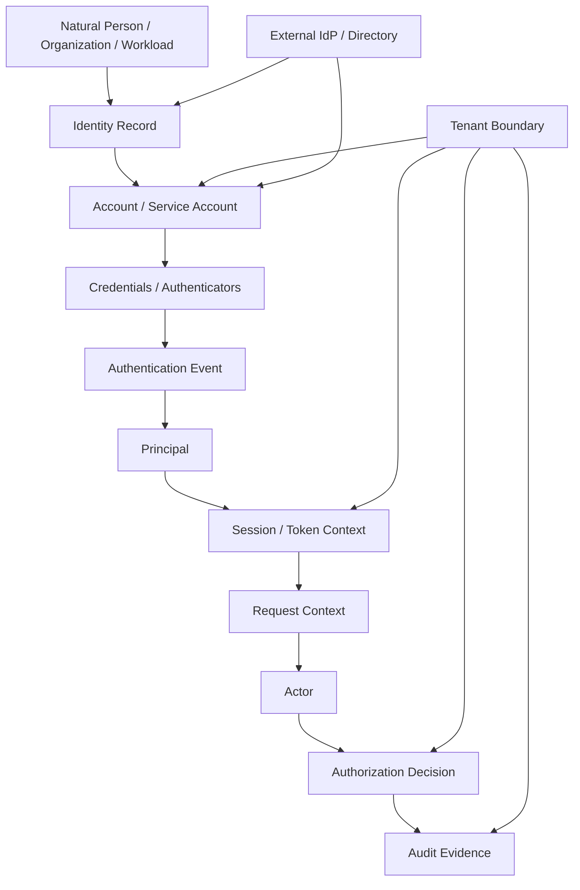
```mermaid
flowchart TD
    NP[Natural Person / Organization / Workload] --> ID[Identity Record]
    ID --> ACC[Account / Service Account]
    ACC --> CRED[Credentials / Authenticators]
    CRED --> AUTHN[Authentication Event]
    AUTHN --> PR[Principal]
    PR --> SESS[Session / Token Context]
    SESS --> REQ[Request Context]
    REQ --> ACTOR[Actor]
    ACTOR --> AUTHZ[Authorization Decision]
    AUTHZ --> AUDIT[Audit Evidence]

    TEN[Tenant Boundary] --> ACC
    TEN --> SESS
    TEN --> AUTHZ
    TEN --> AUDIT

    EXT[External IdP / Directory] --> ACC
    EXT --> ID
```

Hal penting:

- Identity record tidak otomatis authenticated.
- Account tidak otomatis active.
- Credential tidak otomatis valid.
- Authentication event tidak otomatis authorized.
- Principal tidak otomatis punya permission.
- Session tidak otomatis berlaku untuk semua tenant.
- Actor tidak selalu sama dengan subject.
- Authorization decision harus bisa diaudit.

---

# 5. Entity Utama dalam Identity Domain

Kita akan mulai dari entity-level model.

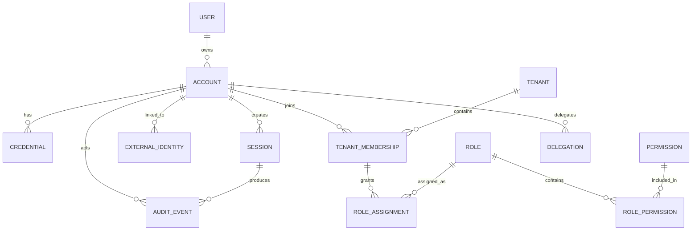
```mermaid
erDiagram
    USER ||--o{ ACCOUNT : owns
    ACCOUNT ||--o{ CREDENTIAL : has
    ACCOUNT ||--o{ SESSION : creates
    ACCOUNT ||--o{ EXTERNAL_IDENTITY : linked_to
    ACCOUNT ||--o{ TENANT_MEMBERSHIP : joins
    TENANT ||--o{ TENANT_MEMBERSHIP : contains
    TENANT_MEMBERSHIP ||--o{ ROLE_ASSIGNMENT : grants
    ROLE ||--o{ ROLE_ASSIGNMENT : assigned_as
    ROLE ||--o{ ROLE_PERMISSION : contains
    PERMISSION ||--o{ ROLE_PERMISSION : included_in
    ACCOUNT ||--o{ DELEGATION : delegates
    ACCOUNT ||--o{ AUDIT_EVENT : acts
    SESSION ||--o{ AUDIT_EVENT : produces
```

Model ini bukan schema final, tetapi peta konseptual.

---

# 6. `User` Bukan Security Principal

## 6.1 Definisi

`User` adalah record identity internal untuk manusia.

Contoh Go type:

```go
package identity

import "time"

type UserID string

type UserStatus string

const (
    UserStatusActive      UserStatus = "active"
    UserStatusSuspended   UserStatus = "suspended"
    UserStatusDeactivated UserStatus = "deactivated"
    UserStatusDeleted     UserStatus = "deleted"
)

type User struct {
    ID          UserID
    DisplayName string
    LegalName   *string
    PrimaryEmail *EmailAddress
    Status      UserStatus
    CreatedAt   time.Time
    UpdatedAt   time.Time
}
```

## 6.2 Kenapa `User` tidak boleh langsung jadi principal?

Karena `User` adalah long-lived domain identity, sedangkan `Principal` adalah hasil authentication dalam request/session tertentu.

Contoh perbedaan:

| Situation | User | Principal |
|---|---|---|
| User login normal | human identity | authenticated user principal |
| Admin impersonate | target user | admin principal + impersonated subject |
| Background job | mungkin tidak ada | service principal |
| Webhook inbound | mungkin external actor | client/workload principal |
| Token exchange | original user | exchanged/delegated principal |

Kalau `User` langsung dipakai sebagai principal, kita kehilangan konteks authentication:

- metode login,
- waktu login,
- assurance level,
- issuer,
- tenant context,
- session ID,
- delegation chain,
- impersonation state,
- token audience,
- policy context.

## 6.3 `User` harus stabil

`User.ID` harus stable dan opaque.

Jangan menggunakan:

- email sebagai primary key,
- username sebagai primary key,
- external `sub` langsung sebagai local ID,
- incremental ID yang bocor ke external boundary jika IDOR risk tinggi,
- tenant-specific employee number sebagai global ID.

Gunakan ID internal opaque:

```text
usr_01HVZ7Q3F0N2F1G7YAMK8Q9ABC
```

Atau UUID/ULID sesuai standar internal.

## 6.4 User deletion

Untuk auth system, deletion jarang berarti hard delete.

Biasanya state yang diperlukan:

- active,
- suspended,
- deactivated,
- pending deletion,
- deleted/anonymized,
- merged,
- duplicate.

Alasannya:

- audit lama harus tetap bisa resolve;
- legal hold mungkin mencegah deletion;
- username/email bisa direuse;
- external account bisa unlink;
- permission historical perlu traceability.

---

# 7. `Account` sebagai Administrative Container

## 7.1 Definisi

`Account` adalah login/lifecycle container.

Contoh:

```go
type AccountID string

type AccountKind string

const (
    AccountKindHuman        AccountKind = "human"
    AccountKindService      AccountKind = "service"
    AccountKindAutomation   AccountKind = "automation"
    AccountKindIntegration  AccountKind = "integration"
)

type AccountStatus string

const (
    AccountStatusInvited       AccountStatus = "invited"
    AccountStatusActive        AccountStatus = "active"
    AccountStatusLocked        AccountStatus = "locked"
    AccountStatusSuspended     AccountStatus = "suspended"
    AccountStatusDeprovisioned AccountStatus = "deprovisioned"
)

type Account struct {
    ID        AccountID
    UserID    *UserID // nil for pure service/integration account
    Kind      AccountKind
    Status    AccountStatus
    CreatedAt time.Time
    UpdatedAt time.Time
}
```

## 7.2 Kenapa perlu memisahkan User dan Account?

Karena lifecycle-nya berbeda.

| Concern | User | Account |
|---|---|---|
| Representasi orang | Ya | Tidak selalu |
| Login state | Tidak | Ya |
| Credential binding | Tidak langsung | Ya |
| Suspension login | Bisa berdampak | Langsung |
| Multi-login method | Tidak | Ya |
| External IdP link | Tidak langsung | Ya |
| Service account | Tidak | Ya |
| Audit display | Ya | Bisa |

## 7.3 Pattern: one user, many accounts

Digunakan ketika:

- user punya local account dan external SSO account;
- user punya account per tenant;
- user punya account human dan admin support account terpisah;
- user punya personal identity dan professional identity.

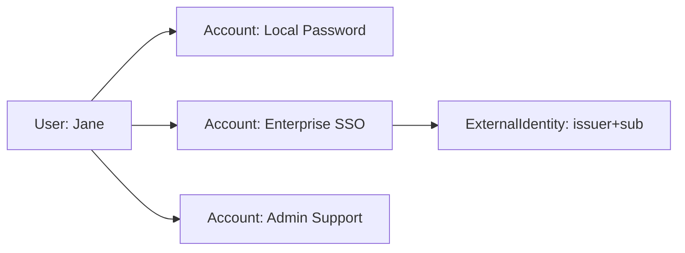
```mermaid
flowchart LR
    U[User: Jane] --> A1[Account: Local Password]
    U --> A2[Account: Enterprise SSO]
    U --> A3[Account: Admin Support]
    A2 --> E1[ExternalIdentity: issuer+sub]
```

## 7.4 Pattern: one account, many credentials

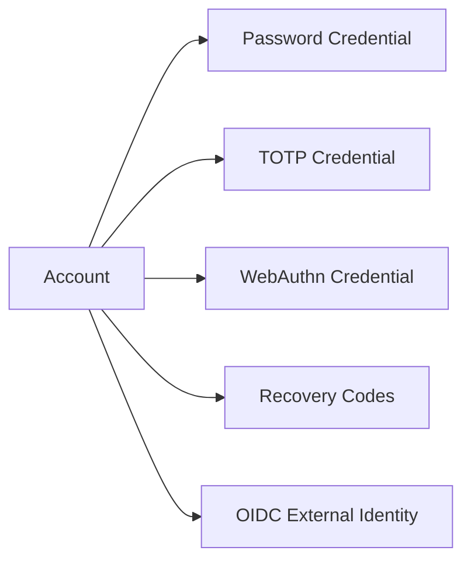
```mermaid
flowchart LR
    A[Account] --> P[Password Credential]
    A --> T[TOTP Credential]
    A --> W[WebAuthn Credential]
    A --> R[Recovery Codes]
    A --> O[OIDC External Identity]
```

## 7.5 Dangerous simplification

```go
type User struct {
    ID string
    Email string
    PasswordHash string
    GoogleSub string
    Role string
}
```

Masalah:

- local password dan Google identity dicampur;
- tidak ada lifecycle credential;
- tidak ada external issuer;
- tidak bisa handle multi-IdP;
- tidak bisa audit account linking;
- role global;
- tidak ada tenant boundary;
- tidak bisa handle passkey/MFA properly.

---

# 8. `Principal` sebagai Authenticated Entity

## 8.1 Definisi

`Principal` adalah representasi entity yang sudah berhasil diautentikasi dalam context tertentu.

```go
type PrincipalKind string

const (
    PrincipalKindUser      PrincipalKind = "user"
    PrincipalKindService   PrincipalKind = "service"
    PrincipalKindClient    PrincipalKind = "client"
    PrincipalKindAnonymous PrincipalKind = "anonymous"
)

type PrincipalID string

type Principal struct {
    ID          PrincipalID
    Kind        PrincipalKind
    AccountID   *AccountID
    UserID      *UserID
    ServiceID   *ServiceID
    Issuer      string
    AuthTime    time.Time
    Assurance   AssuranceLevel
    SessionID   *SessionID
}
```

## 8.2 Principal dibuat oleh authentication boundary

Sumber principal:

- verified session cookie;
- valid access token;
- valid mTLS peer certificate;
- valid SPIFFE SVID;
- valid API key;
- validated OIDC ID token;
- internal job runner identity;
- signed webhook identity.

## 8.3 Principal tidak boleh diambil dari request body

Anti-pattern:

```json
{
  "user_id": "usr_123",
  "action": "approve"
}
```

Lalu service memperlakukan `user_id` sebagai pelaku.

Yang benar:

- actor/principal berasal dari authentication middleware;
- request body boleh berisi target subject/resource;
- authorization harus memeriksa apakah principal boleh bertindak terhadap target.

## 8.4 Principal harus immutable dalam request

Setelah middleware membangun principal, downstream handler tidak boleh mengubahnya.

Gunakan value object yang tidak diekspor field mutasinya atau treat as immutable.

```go
type RequestIdentity struct {
    principal Principal
    actor     Actor
    tenant    TenantContext
}

func (r RequestIdentity) Principal() Principal { return r.principal }
func (r RequestIdentity) Actor() Actor         { return r.actor }
func (r RequestIdentity) Tenant() TenantContext { return r.tenant }
```

---

# 9. `Subject` sebagai Target Klaim/Decision

## 9.1 Definisi

`Subject` adalah entity yang menjadi subject dari klaim atau authorization decision.

```go
type SubjectKind string

const (
    SubjectKindUser       SubjectKind = "user"
    SubjectKindAccount    SubjectKind = "account"
    SubjectKindService    SubjectKind = "service"
    SubjectKindExternal   SubjectKind = "external"
    SubjectKindTenant     SubjectKind = "tenant"
)

type Subject struct {
    Kind SubjectKind
    ID   string
}
```

## 9.2 Subject dalam OIDC

Dalam OIDC, `sub` adalah identifier subject dari end-user pada issuer tertentu. Jangan menganggap `sub` global tanpa `iss`.

Identity binding yang benar:

```text
external_identity_key = (issuer, subject)
```

Bukan:

```text
external_identity_key = subject
```

Karena dua issuer berbeda bisa sama-sama mengeluarkan `sub = "123"`.

## 9.3 Subject dalam JWT

Dalam JWT, `sub` adalah subject claim. Namun makna subject bergantung pada issuer dan token profile.

Token dari IdP A:

```json
{
  "iss": "https://idp-a.example.com",
  "sub": "248289761001",
  "aud": "client-123"
}
```

Token dari IdP B:

```json
{
  "iss": "https://idp-b.example.com",
  "sub": "248289761001",
  "aud": "api-abc"
}
```

`sub` sama tidak berarti user sama.

## 9.4 Subject internal vs external

Gunakan explicit mapping:

```go
type ExternalSubject struct {
    Issuer  string
    Subject string
}

type ExternalIdentity struct {
    ID              ExternalIdentityID
    ProviderID      IdentityProviderID
    Issuer          string
    Subject         string
    AccountID       AccountID
    LinkedAt        time.Time
    LastSeenAt      *time.Time
    EmailAtLinkTime *EmailAddress
}
```

---

# 10. `Actor` sebagai Pelaku Aktual

## 10.1 Definisi

`Actor` adalah entity yang benar-benar menginisiasi aksi.

```go
type ActorKind string

const (
    ActorKindHuman     ActorKind = "human"
    ActorKindService   ActorKind = "service"
    ActorKindSystem    ActorKind = "system"
    ActorKindDelegated ActorKind = "delegated"
)

type Actor struct {
    Kind        ActorKind
    PrincipalID PrincipalID
    UserID      *UserID
    ServiceID   *ServiceID
    SessionID   *SessionID
}
```

## 10.2 Actor vs Subject

| Scenario | Actor | Subject |
|---|---|---|
| user update own profile | user | user |
| officer create case for applicant | officer | applicant |
| admin impersonate user | admin | impersonated user |
| background job sends email | service | user/case |
| webhook updates order | external client/service | order/customer |

## 10.3 Actor chain

Untuk delegation dan impersonation, satu actor saja tidak cukup.

```go
type ActorChain struct {
    ActualActor      Actor
    EffectiveSubject Subject
    OnBehalfOf       *Subject
    Impersonation    *ImpersonationContext
    Delegation       *DelegationContext
}
```

Contoh audit:

```json
{
  "actual_actor": "usr_admin_123",
  "effective_subject": "usr_customer_456",
  "mode": "impersonation",
  "reason_code": "support_ticket",
  "ticket_id": "INC-2026-001"
}
```

Tanpa actor chain, audit bisa menuduh user customer melakukan aksi yang sebenarnya dilakukan admin.

## 10.4 System actor

System actor digunakan untuk event internal.

Contoh:

- scheduled job expire token;
- workflow engine auto-close case;
- data migration script;
- event syncer retries outbound call.

System actor harus tetap punya identity.

Jangan audit sebagai `user_id = null` tanpa keterangan.

---

# 11. `Tenant` sebagai Boundary, Bukan Label

## 11.1 Definisi

Tenant adalah boundary isolasi.

```go
type TenantID string

type TenantStatus string

const (
    TenantStatusActive    TenantStatus = "active"
    TenantStatusSuspended TenantStatus = "suspended"
    TenantStatusArchived  TenantStatus = "archived"
)

type Tenant struct {
    ID        TenantID
    Name      string
    Status    TenantStatus
    CreatedAt time.Time
    UpdatedAt time.Time
}
```

## 11.2 Tenant context

```go
type TenantContext struct {
    TenantID TenantID
    Source   TenantContextSource
}

type TenantContextSource string

const (
    TenantContextFromRoute TenantContextSource = "route"
    TenantContextFromHost  TenantContextSource = "host"
    TenantContextFromToken TenantContextSource = "token"
    TenantContextFromSession TenantContextSource = "session"
)
```

## 11.3 Tenant must be authorized, not merely selected

Anti-pattern:

```http
GET /tenants/{tenant_id}/cases
Authorization: Bearer <valid-token>
```

Handler mengambil `tenant_id` dari route dan langsung query.

Yang benar:

1. authenticate principal;
2. resolve requested tenant;
3. check membership/authority;
4. enforce tenant in query;
5. include tenant in audit.

## 11.4 Tenant confusion

Tenant bisa berasal dari banyak tempat:

- hostname: `agency-a.example.com`
- route: `/tenants/tnt_123/...`
- token claim: `tenant_id`
- session selection
- resource ownership
- database row
- user preference

Kalau sumber-sumber ini konflik, sistem harus punya aturan eksplisit.

Contoh invariant:

```text
If route tenant and token tenant are both present, they MUST match unless caller has cross-tenant authority.
```

## 11.5 Tenant boundary diagram

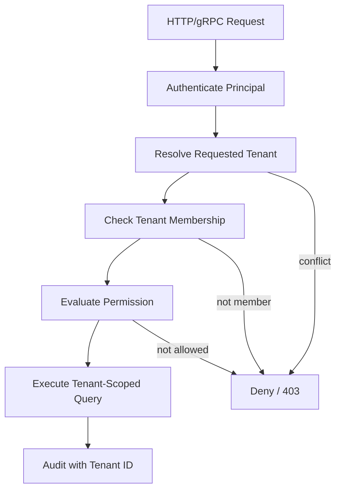
```mermaid
flowchart TD
    R[HTTP/gRPC Request] --> AUTHN[Authenticate Principal]
    AUTHN --> RT[Resolve Requested Tenant]
    RT --> MEM[Check Tenant Membership]
    MEM --> POL[Evaluate Permission]
    POL --> Q[Execute Tenant-Scoped Query]
    Q --> AUD[Audit with Tenant ID]

    RT -->|conflict| DENY[Deny / 403]
    MEM -->|not member| DENY
    POL -->|not allowed| DENY
```

---

# 12. `Organization`, `Workspace`, `Agency`, `Business Unit`

## 12.1 Jangan samakan tenant dengan organization

Tenant adalah security boundary. Organization adalah domain/business structure.

Contoh:

```text
Tenant: CEA production environment agency boundary
Organization: Licensing Division
Organization: Enforcement Division
Organization: External Firm A
Organization: External Firm B
```

Atau SaaS:

```text
Tenant: customer account Acme Corp
Organizations: Sales, Finance, Legal, APAC Branch
```

## 12.2 Organization hierarchy

```go
type OrganizationID string

type Organization struct {
    ID        OrganizationID
    TenantID  TenantID
    ParentID  *OrganizationID
    Name      string
    Kind      OrganizationKind
    Status    string
}
```

## 12.3 Authorization implication

Organization dapat mempengaruhi authorization:

- user hanya boleh melihat case dari department sendiri;
- manager boleh approve subordinate;
- agency officer boleh view all applications under agency;
- external firm admin boleh manage users di firm-nya;
- cross-division reviewer butuh special role.

Namun permission tidak otomatis melekat hanya karena organization membership. Tetap perlu policy.

---

# 13. `Credential` dan `Authenticator`

## 13.1 Credential entity

```go
type CredentialID string

type CredentialKind string

const (
    CredentialKindPassword     CredentialKind = "password"
    CredentialKindTOTP         CredentialKind = "totp"
    CredentialKindWebAuthn     CredentialKind = "webauthn"
    CredentialKindRecoveryCode CredentialKind = "recovery_code"
    CredentialKindClientSecret CredentialKind = "client_secret"
    CredentialKindCertificate  CredentialKind = "certificate"
)

type CredentialStatus string

const (
    CredentialStatusActive     CredentialStatus = "active"
    CredentialStatusRevoked    CredentialStatus = "revoked"
    CredentialStatusCompromised CredentialStatus = "compromised"
    CredentialStatusExpired    CredentialStatus = "expired"
)

type Credential struct {
    ID          CredentialID
    AccountID   AccountID
    Kind        CredentialKind
    Status      CredentialStatus
    CreatedAt   time.Time
    LastUsedAt  *time.Time
    RevokedAt   *time.Time
}
```

## 13.2 Credential-specific storage

Jangan paksa semua credential ke satu kolom JSON tanpa alasan.

Bisa gunakan pola:

```text
credentials
password_credentials
webauthn_credentials
totp_credentials
client_secret_credentials
certificate_credentials
```

Atau single table + encrypted typed payload, tetapi tetap harus punya lifecycle field umum.

## 13.3 Credential bukan permission

Memiliki credential hanya membuktikan kemampuan authenticate. Tidak berarti boleh melakukan action.

Passkey yang valid tidak otomatis berarti user boleh approve enforcement case.

## 13.4 Credential lifecycle

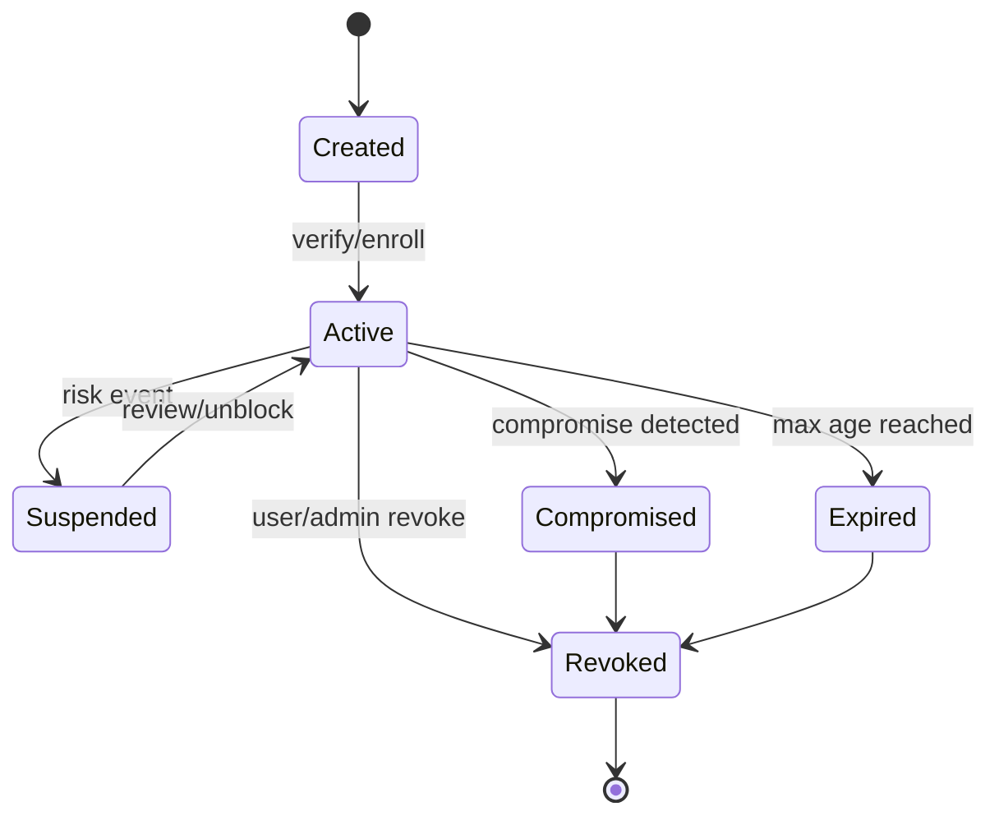
```mermaid
stateDiagram-v2
    [*] --> Created
    Created --> Active: verify/enroll
    Active --> Suspended: risk event
    Suspended --> Active: review/unblock
    Active --> Revoked: user/admin revoke
    Active --> Compromised: compromise detected
    Active --> Expired: max age reached
    Compromised --> Revoked
    Expired --> Revoked
    Revoked --> [*]
```

---

# 14. `Session` dan `LoginSession`

## 14.1 Session entity

```go
type SessionID string

type SessionStatus string

const (
    SessionStatusActive  SessionStatus = "active"
    SessionStatusExpired SessionStatus = "expired"
    SessionStatusRevoked SessionStatus = "revoked"
)

type Session struct {
    ID             SessionID
    AccountID      AccountID
    PrincipalID    PrincipalID
    Status         SessionStatus
    AuthTime       time.Time
    CreatedAt      time.Time
    LastSeenAt     time.Time
    ExpiresAt      time.Time
    AbsoluteEndsAt time.Time
    Assurance      AssuranceLevel
    IPHash         *string
    UserAgentHash  *string
}
```

## 14.2 Session as evidence

Session membawa evidence:

- siapa principal;
- kapan authenticate;
- metode/faktor apa;
- assurance level;
- issuer;
- tenant selected;
- apakah step-up sudah dilakukan;
- apakah session hasil impersonation;
- kapan expire;
- apakah revoked.

## 14.3 Session bukan authorization cache permanen

Session boleh menyimpan context, tetapi permission yang sensitif harus dievaluasi ulang atau memiliki TTL/policy freshness.

Anti-pattern:

```go
type Session struct {
    UserID string
    Roles  []string // never refreshed
}
```

Masalah:

- role dicabut tapi session masih punya role lama;
- tenant membership berubah;
- emergency revoke sulit;
- audit tidak tahu policy version.

## 14.4 Session and tenant selection

Dalam multi-tenant app, user mungkin login sekali lalu memilih tenant.

Jangan mencampur login session dan tenant session tanpa model jelas.

```go
type TenantSession struct {
    SessionID SessionID
    TenantID  TenantID
    SelectedAt time.Time
    RoleSnapshotVersion *string
}
```

Untuk aksi sensitif, role snapshot bisa tidak cukup. Gunakan fresh authorization decision.

---

# 15. `ExternalIdentity` dan Federated Identity

## 15.1 Definisi

`ExternalIdentity` adalah binding antara account internal dan identity dari external issuer.

```go
type ExternalIdentityID string

type IdentityProviderID string

type ExternalIdentity struct {
    ID         ExternalIdentityID
    ProviderID IdentityProviderID
    Issuer     string
    Subject    string
    AccountID  AccountID
    LinkedAt   time.Time
    LastSeenAt *time.Time
    ClaimsHashAtLink *string
}
```

## 15.2 Binding key

Minimal unique constraint:

```text
UNIQUE(provider_id, issuer, subject)
```

Bila provider punya stable issuer, `provider_id + subject` bisa cukup, tetapi menyimpan issuer tetap baik untuk audit.

## 15.3 Jangan link berdasarkan email saja

Anti-pattern:

```text
if oidc.email == local_user.email {
    login_as(local_user)
}
```

Ini rawan account takeover karena:

- email bisa tidak verified;
- email bisa reassigned;
- IdP berbeda punya verification quality berbeda;
- corporate email bisa didaur ulang;
- attacker bisa punya email sama di IdP lain dalam environment tertentu;
- domain trust belum tentu sama.

Email boleh dipakai sebagai candidate matching dalam controlled linking flow, bukan sebagai proof tunggal.

## 15.4 Account linking flow

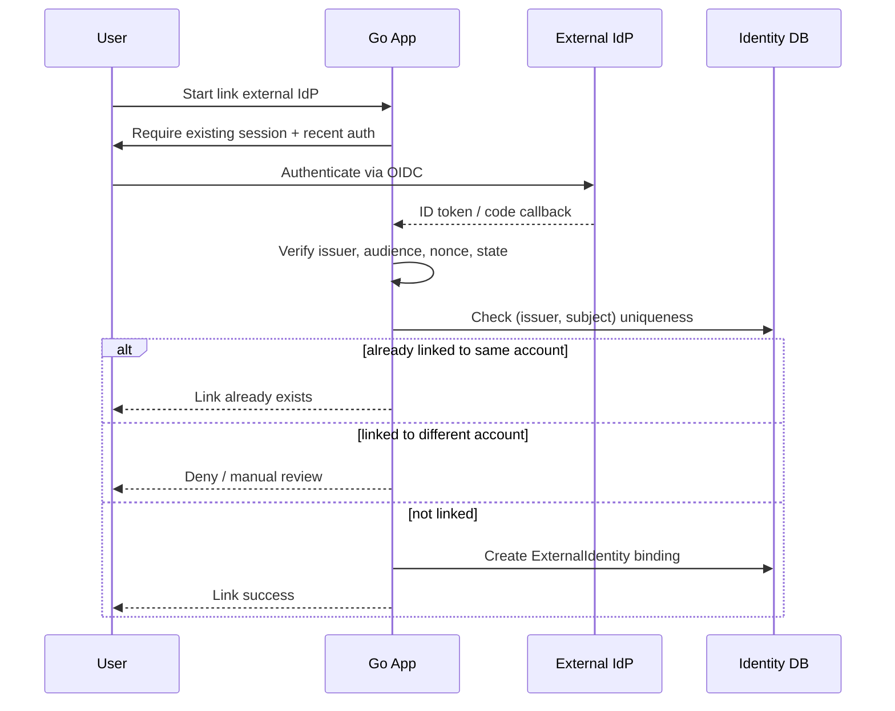
```mermaid
sequenceDiagram
    participant U as User
    participant App as Go App
    participant IdP as External IdP
    participant DB as Identity DB

    U->>App: Start link external IdP
    App->>U: Require existing session + recent auth
    U->>IdP: Authenticate via OIDC
    IdP-->>App: ID token / code callback
    App->>App: Verify issuer, audience, nonce, state
    App->>DB: Check (issuer, subject) uniqueness
    alt already linked to same account
        App-->>U: Link already exists
    else linked to different account
        App-->>U: Deny / manual review
    else not linked
        App->>DB: Create ExternalIdentity binding
        App-->>U: Link success
    end
```

## 15.5 JIT provisioning

Just-in-time provisioning membuat account saat user pertama kali login dari trusted IdP.

Syarat:

- issuer trusted;
- client/audience benar;
- subject stable;
- claim mapping terdefinisi;
- tenant mapping jelas;
- default role minimal;
- audit event dibuat;
- deprovisioning path tersedia.

JIT provisioning tanpa deprovisioning sering menghasilkan zombie accounts.

---

# 16. `DirectoryIdentity`, SCIM, dan Provisioning

## 16.1 SCIM mental model

SCIM menyediakan schema dan protocol standar untuk user/group provisioning lintas domain. RFC 7643 mendefinisikan core schema untuk users dan groups dalam JSON, sedangkan RFC 7644 mendefinisikan HTTP-based protocol untuk manajemen identity lintas domain.

## 16.2 Local model vs SCIM model

SCIM `User` bukan otomatis sama dengan local `User`.

SCIM membawa data provisioning:

- username,
- name,
- emails,
- active flag,
- groups,
- enterprise extension,
- externalId.

Local identity model harus memutuskan mapping:

```text
SCIM User -> Account + User + TenantMembership + GroupMembership
```

## 16.3 Directory identity entity

```go
type DirectoryID string

type DirectoryIdentity struct {
    ID          string
    DirectoryID DirectoryID
    ExternalID  string
    UserName    string
    AccountID   AccountID
    Active      bool
    LastSyncedAt time.Time
}
```

## 16.4 Provisioning lifecycle

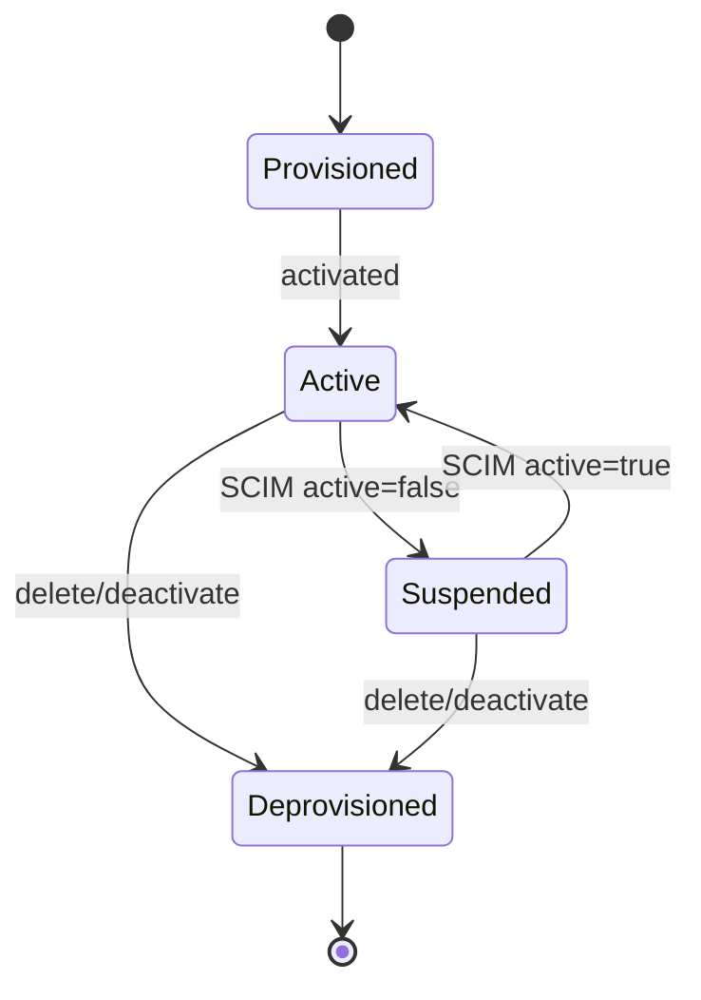
```mermaid
stateDiagram-v2
    [*] --> Provisioned
    Provisioned --> Active: activated
    Active --> Suspended: SCIM active=false
    Suspended --> Active: SCIM active=true
    Active --> Deprovisioned: delete/deactivate
    Suspended --> Deprovisioned: delete/deactivate
    Deprovisioned --> [*]
```

## 16.5 SCIM deprovisioning invariant

Kalau directory menyatakan user inactive, sistem harus menentukan efeknya:

- revoke sessions?
- disable account?
- remove tenant membership?
- remove group membership?
- preserve audit identity?
- block login via all methods or only directory login?

Ini harus eksplisit. Jangan hanya update kolom `active=false` tanpa konsekuensi security.

---

# 17. `ServiceIdentity` dan Workload Identity

## 17.1 Kenapa service identity perlu dimodelkan

Sistem modern tidak hanya diakses manusia.

Actor dapat berupa:

- API gateway,
- batch worker,
- event consumer,
- cron job,
- integration connector,
- webhook client,
- CI/CD job,
- data migration tool,
- report generator,
- workflow engine.

Jika semua ini memakai “system user” tunggal, audit dan authorization menjadi lemah.

## 17.2 Service identity entity

```go
type ServiceID string

type ServiceIdentity struct {
    ID          ServiceID
    Name        string
    OwnerTeam   string
    Environment string
    Status      string
    CreatedAt   time.Time
}
```

## 17.3 SPIFFE-style workload identity

SPIFFE ID adalah URI yang mengidentifikasi workload secara unik dalam trust domain, misalnya:

```text
spiffe://example.org/ns/payments/sa/payment-api
```

Model internal:

```go
type WorkloadIdentity struct {
    ID          string
    ServiceID   ServiceID
    TrustDomain string
    SPIFFEID    string
    Environment string
    Namespace   string
    Workload    string
}
```

## 17.4 Service account vs workload identity

| Concept | Meaning |
|---|---|
| Service account | logical account used by software |
| Workload identity | runtime identity of deployed workload |
| API client | OAuth client/application identity |
| Machine user | legacy pattern, often weak |

## 17.5 Service actor audit

Audit event harus bisa menyimpan:

- service identity;
- workload identity;
- original user if on-behalf-of;
- correlation ID;
- tenant;
- operation;
- policy decision.

Contoh:

```json
{
  "actor_kind": "service",
  "service_id": "svc_event_syncer",
  "workload_id": "spiffe://example.org/ns/aceas/sa/event-syncer",
  "on_behalf_of": "usr_123",
  "tenant_id": "tnt_cea",
  "action": "case.sync"
}
```

---

# 18. `RoleAssignment`, `PermissionGrant`, `Entitlement`

## 18.1 Role assignment

```go
type RoleID string

type RoleAssignmentID string

type RoleAssignment struct {
    ID          RoleAssignmentID
    AccountID   AccountID
    TenantID    TenantID
    RoleID      RoleID
    ResourceID  *string
    GrantedBy   *ActorRef
    GrantedAt   time.Time
    ExpiresAt   *time.Time
    Status      string
}
```

## 18.2 Permission grant

```go
type PermissionID string

type PermissionGrant struct {
    ID           string
    Subject      Subject
    TenantID     TenantID
    PermissionID PermissionID
    Resource     *ResourceRef
    Conditions   []Condition
    GrantedAt    time.Time
    ExpiresAt    *time.Time
}
```

## 18.3 Entitlement

```go
type Entitlement struct {
    ID        string
    TenantID  TenantID
    Subject   Subject
    Code      string
    Source    EntitlementSource
    StartsAt  time.Time
    EndsAt    *time.Time
}
```

## 18.4 Difference

| Concept | Used for | Example |
|---|---|---|
| Role | human administration | `case_officer` |
| Permission | authorization decision | `case.approve` |
| Grant | why subject has authority | role assignment, delegation |
| Entitlement | business/product right | subscribed module, agency privilege |
| Claim | statement in token/context | `tenant_id`, `groups` |

## 18.5 Permission should be derived, not blindly copied

Roles, groups, entitlements, and relationships can all contribute to permission.

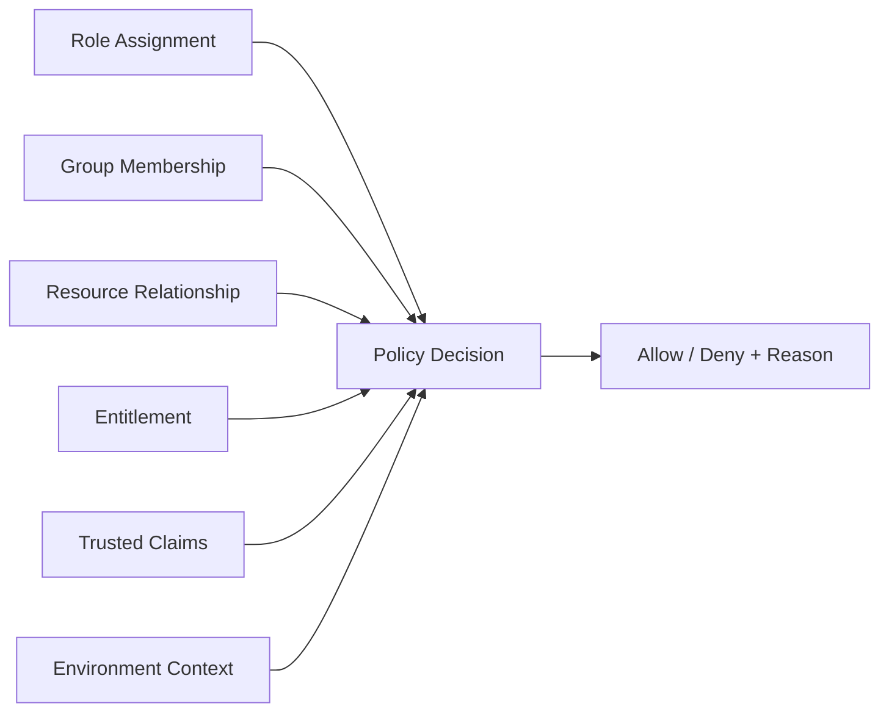
```mermaid
flowchart LR
    RA[Role Assignment] --> PDP[Policy Decision]
    GM[Group Membership] --> PDP
    REL[Resource Relationship] --> PDP
    ENT[Entitlement] --> PDP
    CLAIM[Trusted Claims] --> PDP
    CTX[Environment Context] --> PDP
    PDP --> DEC[Allow / Deny + Reason]
```

---

# 19. `Group`, `Membership`, dan Relationship Model

## 19.1 Group

Group adalah collection of subjects/accounts. Dalam enterprise SSO, group sering berasal dari directory.

```go
type GroupID string

type Group struct {
    ID       GroupID
    TenantID TenantID
    Name     string
    Source   GroupSource
}
```

## 19.2 Membership

```go
type GroupMembership struct {
    GroupID   GroupID
    AccountID AccountID
    Source    string
    AddedAt   time.Time
}
```

## 19.3 Group bukan role

Group adalah membership structure. Role adalah authority abstraction.

Kadang group dipetakan ke role:

```text
Directory group "CEA-Enforcement-Officers" -> role "enforcement_officer" in tenant "CEA"
```

Tetapi jangan menganggap semua group adalah role.

## 19.4 Relationship tuple

Untuk ReBAC/Zanzibar-style modelling, relationship dapat dimodelkan sebagai tuple:

```text
object#relation@subject
```

Contoh:

```text
case:CASE-123#owner@user:usr_1
case:CASE-123#reviewer@group:grp_legal_reviewers
tenant:tnt_1#admin@user:usr_2
```

Go type:

```go
type RelationTuple struct {
    Object   ObjectRef
    Relation string
    Subject  Subject
}
```

Relationship model sangat kuat untuk resource sharing dan hierarchical access.

---

# 20. Claim Modelling

## 20.1 Claim bukan domain truth otomatis

Claim adalah pernyataan dari issuer. Ia harus dievaluasi berdasarkan:

- issuer trust;
- audience;
- expiry;
- signature;
- token type;
- authentication context;
- freshness;
- mapping rules.

## 20.2 Internal claim set

Jangan menyebarkan raw JWT claims ke seluruh aplikasi.

Bangun normalized claim set.

```go
type ClaimSet struct {
    Issuer     string
    Subject    string
    Audience   []string
    ExpiresAt  time.Time
    IssuedAt   time.Time
    AuthTime   *time.Time
    Nonce      *string
    Email      *EmailAddress
    EmailVerified *bool
    TenantIDs  []TenantID
    Groups     []string
    Raw         map[string]any
}
```

## 20.3 Claim mapping

```go
type ClaimMapper interface {
    MapExternalClaims(ctx context.Context, provider IdentityProvider, claims ClaimSet) (MappedIdentity, error)
}

type MappedIdentity struct {
    ExternalSubject ExternalSubject
    CandidateEmail  *EmailAddress
    DisplayName     *string
    TenantHints     []TenantID
    GroupHints      []string
}
```

## 20.4 Preserve raw claims carefully

Raw claims berguna untuk audit/debug, tetapi bisa mengandung PII atau sensitive attributes.

Prinsip:

- jangan log raw token;
- jangan simpan semua claim tanpa retention policy;
- jangan expose raw claims ke frontend;
- snapshot claim penting untuk audit decision;
- hash atau redact claim sensitif.

---

# 21. Domain Invariants

Invariants adalah aturan yang harus selalu benar.

## 21.1 Identity invariants

1. `UserID` internal harus stable dan opaque.
2. Email tidak boleh menjadi primary identity.
3. External identity uniqueness minimal berdasarkan `(issuer, subject)`.
4. Disabled account tidak boleh membuat session baru.
5. Revoked credential tidak boleh dipakai authenticate.
6. Session harus memiliki account/principal yang valid pada saat dibuat.
7. Tenant-scoped action harus punya tenant context eksplisit.
8. Role assignment harus punya scope.
9. Authorization decision harus membedakan actor dan subject.
10. Audit event harus menyimpan actor aktual, bukan hanya subject.

## 21.2 Federation invariants

1. Jangan link external identity berdasarkan email saja.
2. Jangan percaya claim dari issuer yang tidak dikonfigurasi.
3. Jangan treat ID token sebagai access token.
4. Jangan treat access token sebagai local session tanpa validasi audience.
5. `sub` harus dipasangkan dengan issuer.
6. JIT provision harus menghasilkan account minimal privilege.
7. Deprovisioning harus revoke atau disable access sesuai policy.

## 21.3 Multi-tenant invariants

1. Semua tenant resource harus punya tenant owner eksplisit.
2. Principal harus authorized masuk tenant sebelum authorization resource-level.
3. Tenant dari route/token/session/resource harus konsisten.
4. Cross-tenant access harus explicit, auditable, dan rare.
5. Query database harus enforce tenant boundary.
6. Audit event harus menyimpan tenant context.

## 21.4 Audit invariants

1. Audit actor tidak boleh nullable tanpa system actor.
2. Impersonation harus terlihat eksplisit.
3. Delegation harus menyimpan authority source.
4. Denied authorization decision penting untuk security audit.
5. Policy version/decision reason perlu disimpan untuk aksi sensitif.
6. Historical identity display harus tetap bisa direkonstruksi.

---

# 22. Aggregate Boundary

## 22.1 Identity aggregate

Aggregate bukan selalu sama dengan table. Aggregate adalah boundary consistency.

Candidate aggregates:

- `UserAggregate`
- `AccountAggregate`
- `CredentialAggregate`
- `TenantMembershipAggregate`
- `ExternalIdentityAggregate`
- `SessionAggregate`
- `RoleAssignmentAggregate`

## 22.2 Account aggregate

Account aggregate dapat mengatur:

- status account;
- credential list;
- external identity bindings;
- login lock;
- recovery state;
- MFA enrollment requirement.

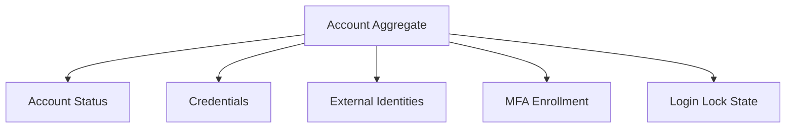
```mermaid
flowchart TD
    A[Account Aggregate] --> S[Account Status]
    A --> C[Credentials]
    A --> E[External Identities]
    A --> M[MFA Enrollment]
    A --> L[Login Lock State]
```

## 22.3 Tenant membership aggregate

Tenant membership aggregate mengatur:

- account belongs to tenant;
- membership status;
- assigned org unit;
- roles in tenant;
- invitation state;
- deprovisioning.

## 22.4 Jangan terlalu besar

Anti-pattern:

```text
User aggregate contains everything:
- credentials
- sessions
- tenants
- roles
- permissions
- audit logs
- external identities
- preferences
```

Ini membuat consistency boundary terlalu besar dan rawan contention.

Lebih baik:

- identity lifecycle transaction kecil;
- authorization read model terpisah;
- audit append-only;
- session lifecycle terpisah;
- permission projection terpisah.

---

# 23. Persistence Model

## 23.1 Baseline relational schema

Berikut sketsa relational schema konseptual.

```sql
CREATE TABLE users (
    id              VARCHAR(64) PRIMARY KEY,
    display_name    VARCHAR(255) NOT NULL,
    legal_name      VARCHAR(255),
    primary_email   VARCHAR(320),
    status          VARCHAR(32) NOT NULL,
    created_at      TIMESTAMP NOT NULL,
    updated_at      TIMESTAMP NOT NULL
);

CREATE TABLE accounts (
    id          VARCHAR(64) PRIMARY KEY,
    user_id     VARCHAR(64),
    kind        VARCHAR(32) NOT NULL,
    status      VARCHAR(32) NOT NULL,
    created_at  TIMESTAMP NOT NULL,
    updated_at  TIMESTAMP NOT NULL,
    CONSTRAINT fk_accounts_user FOREIGN KEY (user_id) REFERENCES users(id)
);

CREATE TABLE identity_providers (
    id          VARCHAR(64) PRIMARY KEY,
    name        VARCHAR(255) NOT NULL,
    issuer      VARCHAR(512) NOT NULL,
    kind        VARCHAR(32) NOT NULL,
    status      VARCHAR(32) NOT NULL,
    created_at  TIMESTAMP NOT NULL,
    updated_at  TIMESTAMP NOT NULL
);

CREATE TABLE external_identities (
    id            VARCHAR(64) PRIMARY KEY,
    provider_id   VARCHAR(64) NOT NULL,
    issuer        VARCHAR(512) NOT NULL,
    subject       VARCHAR(512) NOT NULL,
    account_id    VARCHAR(64) NOT NULL,
    linked_at     TIMESTAMP NOT NULL,
    last_seen_at  TIMESTAMP,
    CONSTRAINT fk_extid_provider FOREIGN KEY (provider_id) REFERENCES identity_providers(id),
    CONSTRAINT fk_extid_account FOREIGN KEY (account_id) REFERENCES accounts(id),
    CONSTRAINT uq_extid_issuer_subject UNIQUE (issuer, subject)
);
```

## 23.2 Credentials

```sql
CREATE TABLE credentials (
    id           VARCHAR(64) PRIMARY KEY,
    account_id   VARCHAR(64) NOT NULL,
    kind         VARCHAR(32) NOT NULL,
    status       VARCHAR(32) NOT NULL,
    created_at   TIMESTAMP NOT NULL,
    last_used_at TIMESTAMP,
    revoked_at   TIMESTAMP,
    CONSTRAINT fk_credentials_account FOREIGN KEY (account_id) REFERENCES accounts(id)
);

CREATE TABLE password_credentials (
    credential_id  VARCHAR(64) PRIMARY KEY,
    password_hash  TEXT NOT NULL,
    algorithm      VARCHAR(64) NOT NULL,
    params_version VARCHAR(64) NOT NULL,
    CONSTRAINT fk_password_credential FOREIGN KEY (credential_id) REFERENCES credentials(id)
);

CREATE TABLE webauthn_credentials (
    credential_id     VARCHAR(64) PRIMARY KEY,
    webauthn_id       BYTEA NOT NULL,
    public_key        BYTEA NOT NULL,
    sign_count        BIGINT,
    transports        TEXT,
    backup_eligible   BOOLEAN,
    backup_state      BOOLEAN,
    CONSTRAINT fk_webauthn_credential FOREIGN KEY (credential_id) REFERENCES credentials(id)
);
```

## 23.3 Tenants and membership

```sql
CREATE TABLE tenants (
    id          VARCHAR(64) PRIMARY KEY,
    name        VARCHAR(255) NOT NULL,
    status      VARCHAR(32) NOT NULL,
    created_at  TIMESTAMP NOT NULL,
    updated_at  TIMESTAMP NOT NULL
);

CREATE TABLE tenant_memberships (
    id          VARCHAR(64) PRIMARY KEY,
    tenant_id   VARCHAR(64) NOT NULL,
    account_id  VARCHAR(64) NOT NULL,
    status      VARCHAR(32) NOT NULL,
    created_at  TIMESTAMP NOT NULL,
    updated_at  TIMESTAMP NOT NULL,
    CONSTRAINT fk_tm_tenant FOREIGN KEY (tenant_id) REFERENCES tenants(id),
    CONSTRAINT fk_tm_account FOREIGN KEY (account_id) REFERENCES accounts(id),
    CONSTRAINT uq_tm_tenant_account UNIQUE (tenant_id, account_id)
);
```

## 23.4 Roles and grants

```sql
CREATE TABLE roles (
    id          VARCHAR(64) PRIMARY KEY,
    tenant_id   VARCHAR(64),
    code        VARCHAR(128) NOT NULL,
    name        VARCHAR(255) NOT NULL,
    status      VARCHAR(32) NOT NULL,
    CONSTRAINT uq_role_scope_code UNIQUE (tenant_id, code)
);

CREATE TABLE role_assignments (
    id             VARCHAR(64) PRIMARY KEY,
    tenant_id      VARCHAR(64) NOT NULL,
    account_id     VARCHAR(64) NOT NULL,
    role_id        VARCHAR(64) NOT NULL,
    resource_type  VARCHAR(128),
    resource_id    VARCHAR(128),
    granted_by     VARCHAR(64),
    granted_at     TIMESTAMP NOT NULL,
    expires_at     TIMESTAMP,
    status         VARCHAR(32) NOT NULL,
    CONSTRAINT fk_ra_tenant FOREIGN KEY (tenant_id) REFERENCES tenants(id),
    CONSTRAINT fk_ra_account FOREIGN KEY (account_id) REFERENCES accounts(id),
    CONSTRAINT fk_ra_role FOREIGN KEY (role_id) REFERENCES roles(id)
);
```

## 23.5 Sessions

```sql
CREATE TABLE sessions (
    id               VARCHAR(64) PRIMARY KEY,
    account_id       VARCHAR(64) NOT NULL,
    status           VARCHAR(32) NOT NULL,
    auth_time        TIMESTAMP NOT NULL,
    assurance_level  VARCHAR(32) NOT NULL,
    created_at       TIMESTAMP NOT NULL,
    last_seen_at     TIMESTAMP NOT NULL,
    expires_at       TIMESTAMP NOT NULL,
    absolute_ends_at TIMESTAMP NOT NULL,
    revoked_at       TIMESTAMP,
    CONSTRAINT fk_sessions_account FOREIGN KEY (account_id) REFERENCES accounts(id)
);
```

## 23.6 Audit identity snapshot

Untuk audit, jangan hanya simpan foreign key yang mungkin berubah display-nya.

```sql
CREATE TABLE audit_events (
    id                    VARCHAR(64) PRIMARY KEY,
    occurred_at            TIMESTAMP NOT NULL,
    tenant_id              VARCHAR(64),
    actor_kind             VARCHAR(32) NOT NULL,
    actor_account_id        VARCHAR(64),
    actor_user_id           VARCHAR(64),
    actor_service_id        VARCHAR(64),
    effective_subject_kind  VARCHAR(32),
    effective_subject_id    VARCHAR(128),
    action                 VARCHAR(128) NOT NULL,
    resource_type           VARCHAR(128),
    resource_id             VARCHAR(128),
    authz_decision_id       VARCHAR(64),
    actor_display_snapshot  TEXT,
    metadata_json           TEXT
);
```

---

# 24. Go Type Design

## 24.1 Strong domain IDs

Jangan memakai `string` mentah di seluruh code.

```go
package identity

type UserID string
type AccountID string
type TenantID string
type SessionID string
type RoleID string
type PermissionID string
type ServiceID string
```

Manfaat:

- mengurangi salah passing ID;
- memperjelas API;
- membantu refactor;
- mempermudah validation.

## 24.2 Value object untuk email

```go
type EmailAddress struct {
    value string
}

func ParseEmailAddress(raw string) (EmailAddress, error) {
    // Use a robust email validation policy suitable for login identifiers.
    // Do not overfit RFC grammar for UX. Normalize only what your product policy allows.
    if raw == "" {
        return EmailAddress{}, ErrInvalidEmail
    }
    return EmailAddress{value: raw}, nil
}

func (e EmailAddress) String() string { return e.value }
```

Catatan: email normalization adalah area berbahaya. Lowercase domain biasanya aman, tetapi local-part case sensitivity dan provider-specific aliasing tidak boleh diasumsikan sembarangan.

## 24.3 Explicit status types

```go
type AccountStatus string

func (s AccountStatus) CanAuthenticate() bool {
    return s == AccountStatusActive
}
```

Jangan sebar logic seperti:

```go
if account.Status != "disabled" && account.Status != "locked" && account.Status != "deleted" {
    // allow login
}
```

## 24.4 Domain errors

```go
var (
    ErrAccountNotActive      = errors.New("account is not active")
    ErrCredentialRevoked     = errors.New("credential revoked")
    ErrExternalIdentityTaken = errors.New("external identity already linked")
    ErrTenantMismatch        = errors.New("tenant context mismatch")
)
```

Error detail untuk client harus hati-hati agar tidak membuka enumeration.

## 24.5 Repository interface

```go
type AccountRepository interface {
    FindByID(ctx context.Context, id AccountID) (Account, error)
    FindByExternalIdentity(ctx context.Context, issuer, subject string) (Account, error)
    Save(ctx context.Context, account Account) error
}

type TenantMembershipRepository interface {
    FindActiveMembership(ctx context.Context, tenantID TenantID, accountID AccountID) (TenantMembership, error)
}
```

## 24.6 Domain service

```go
type IdentityResolver struct {
    accounts AccountRepository
    external ExternalIdentityRepository
}

func (r *IdentityResolver) ResolveExternalSubject(
    ctx context.Context,
    issuer string,
    subject string,
) (AccountID, error) {
    if issuer == "" || subject == "" {
        return "", ErrInvalidExternalSubject
    }
    ext, err := r.external.FindByIssuerSubject(ctx, issuer, subject)
    if err != nil {
        return "", err
    }
    return ext.AccountID, nil
}
```

---

# 25. Context Propagation

## 25.1 Auth context dalam Go

`context.Context` boleh membawa request-scoped identity, tetapi jangan disalahgunakan sebagai global storage.

Pattern:

```go
package requestidentity

import "context"

type key struct{}

func With(ctx context.Context, id RequestIdentity) context.Context {
    return context.WithValue(ctx, key{}, id)
}

func From(ctx context.Context) (RequestIdentity, bool) {
    v, ok := ctx.Value(key{}).(RequestIdentity)
    return v, ok
}
```

## 25.2 Jangan pakai string key

Anti-pattern:

```go
ctx = context.WithValue(ctx, "user", user)
```

Masalah:

- collision;
- hidden dependency;
- type confusion;
- sulit review.

## 25.3 RequestIdentity shape

```go
type RequestIdentity struct {
    Principal Principal
    Actor     Actor
    Tenant    *TenantContext
    Session   *SessionRef
    Claims    ClaimSet
}
```

## 25.4 Handler usage

```go
func ApproveCaseHandler(authz Authorizer) http.HandlerFunc {
    return func(w http.ResponseWriter, r *http.Request) {
        rid, ok := requestidentity.From(r.Context())
        if !ok {
            http.Error(w, "unauthenticated", http.StatusUnauthorized)
            return
        }

        caseID := r.PathValue("case_id")
        decision, err := authz.Decide(r.Context(), AuthorizationRequest{
            Actor:    rid.Actor,
            Tenant:   rid.Tenant,
            Action:   Action("case.approve"),
            Resource: ResourceRef{Type: "case", ID: caseID},
        })
        if err != nil {
            http.Error(w, "authorization unavailable", http.StatusServiceUnavailable)
            return
        }
        if !decision.Allowed {
            http.Error(w, "forbidden", http.StatusForbidden)
            return
        }

        // perform command
    }
}
```

---

# 26. API Contract dan DTO Boundary

## 26.1 Jangan expose internal model mentah

Internal model:

```go
type Account struct {
    ID AccountID
    UserID *UserID
    Status AccountStatus
    // internal fields
}
```

Public DTO:

```go
type AccountResponse struct {
    ID          string `json:"id"`
    DisplayName string `json:"display_name"`
    Status      string `json:"status"`
}
```

Jangan expose:

- credential status detail yang tidak perlu;
- external subject;
- raw claims;
- session internals;
- role assignment internals;
- audit-only actor fields.

## 26.2 Login response

Anti-pattern:

```json
{
  "user_id": "usr_123",
  "role": "admin",
  "tenant_id": "tnt_1"
}
```

Lebih baik:

```json
{
  "session_id": "ses_abc",
  "account": {
    "id": "acc_123",
    "display_name": "Jane Doe"
  },
  "available_tenants": [
    {"id": "tnt_1", "name": "Agency A"}
  ],
  "assurance": {
    "level": "aal2",
    "step_up_required": false
  }
}
```

Permission detail sebaiknya tidak diberikan sebagai sumber kebenaran final di frontend untuk aksi sensitif. Frontend boleh memakai feature flags/affordance, backend tetap enforce.

## 26.3 Admin API

Admin API harus membedakan:

- target account;
- acting admin;
- reason;
- approval;
- effective time;
- audit metadata.

```json
{
  "target_account_id": "acc_target",
  "operation": "suspend",
  "reason_code": "security_risk",
  "comment": "Detected credential compromise"
}
```

Actor tidak dikirim dari body. Actor berasal dari session/token.

---

# 27. Event Model

## 27.1 Kenapa event penting

Identity lifecycle menghasilkan event yang dipakai untuk:

- audit;
- downstream projection;
- session revocation;
- notification;
- SIEM/security monitoring;
- authorization cache invalidation;
- tenant membership sync.

## 27.2 Event examples

```go
type IdentityEvent interface {
    EventID() string
    OccurredAt() time.Time
}

type AccountActivated struct {
    ID        string
    AccountID AccountID
    Actor     ActorRef
    At        time.Time
}

type ExternalIdentityLinked struct {
    ID        string
    AccountID AccountID
    Issuer    string
    Subject   string
    Actor     ActorRef
    At        time.Time
}

type RoleAssigned struct {
    ID        string
    TenantID  TenantID
    AccountID AccountID
    RoleID    RoleID
    Actor     ActorRef
    At        time.Time
}
```

## 27.3 Events should be security meaningful

Bad event:

```text
UserUpdated
```

Better events:

```text
PrimaryEmailChanged
AccountSuspended
CredentialRevoked
ExternalIdentityLinked
ExternalIdentityUnlinked
TenantMembershipDeprovisioned
RoleAssignmentExpired
AdminImpersonationStarted
StepUpAuthenticationCompleted
```

## 27.4 Event idempotency

Identity events often drive revocation/cache invalidation. Make handlers idempotent.

Example:

- `CredentialRevoked` processed twice should not fail dangerously.
- `TenantMembershipRemoved` should invalidate relevant sessions once or many times safely.
- `ExternalIdentityUnlinked` should not delete local audit identity.

---

# 28. Audit Model

## 28.1 Audit must answer legal/security questions

A good audit model answers:

```text
Who did what, to which resource, in which tenant, as whom, using which authority, from which session, at what time, and what was the decision evidence?
```

## 28.2 Actor fields

Audit event should include:

- actual actor kind;
- actual actor account ID;
- actual actor user ID;
- service ID if service;
- effective subject;
- impersonation context;
- delegation context;
- tenant;
- session ID;
- authentication time;
- assurance level;
- action;
- resource;
- decision;
- policy version;
- reason;
- correlation ID.

## 28.3 Audit snapshot

Do not rely only on joins to current user table.

If user changes display name, historical audit should still show historical context.

Store snapshot:

```go
type ActorSnapshot struct {
    Kind        string
    ID          string
    DisplayName string
    Email       *string
    TenantID    *string
    OrgUnit     *string
}
```

## 28.4 Denied decisions

For sensitive actions, denied decisions can be as important as allowed decisions.

Example:

- repeated denied access to high-value case;
- cross-tenant access attempt;
- support admin trying impersonation without approval;
- stale token trying revoked permission.

---

# 29. Multi-Tenant Identity Model

## 29.1 Three common models

### Model A: Global user, tenant memberships

```text
User -> Account -> TenantMembership -> Roles
```

Good for SaaS and enterprise apps where one person can belong to many tenants.

### Model B: Tenant-local user

```text
Tenant -> User -> Account -> Roles
```

Simpler isolation, but harder for cross-tenant identity, SSO, and user profile unification.

### Model C: Hybrid

```text
GlobalUser -> TenantProfile -> TenantMembership
```

Useful when global identity exists but tenant-specific profile/authority differs.

## 29.2 Recommended enterprise model

For complex systems:

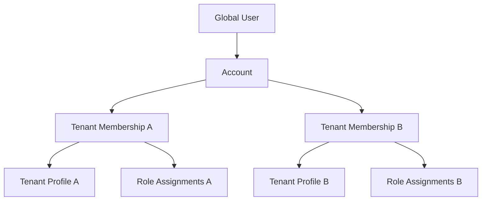
```mermaid
flowchart TD
    GU[Global User] --> ACC[Account]
    ACC --> TM1[Tenant Membership A]
    ACC --> TM2[Tenant Membership B]
    TM1 --> TP1[Tenant Profile A]
    TM2 --> TP2[Tenant Profile B]
    TM1 --> RA1[Role Assignments A]
    TM2 --> RA2[Role Assignments B]
```

## 29.3 Tenant profile

```go
type TenantProfile struct {
    TenantID    TenantID
    AccountID   AccountID
    DisplayName string
    OrgUnitID   *OrganizationID
    EmployeeNo  *string
    Status      string
}
```

## 29.4 Tenant-specific identity attributes

Be careful with attributes like:

- job title;
- license number;
- department;
- firm registration;
- officer rank;
- employment status;
- authorization category.

These may be tenant-specific and should not live on global `User` blindly.

---

# 30. Federation Account Linking

## 30.1 Manual linking vs automatic linking

Manual linking:

- safer;
- requires user already authenticated;
- requires recent auth;
- explicit consent/action;
- good for adding Google/Microsoft/passkey.

Automatic linking:

- convenient;
- risky;
- should require high trust issuer and verified claims;
- often appropriate only in controlled enterprise tenant.

## 30.2 Linking decision table

| Condition | Recommended action |
|---|---|
| `(issuer, sub)` already linked to account | login as that account |
| `(issuer, sub)` linked to different account | deny/manual review |
| email matches existing account but not linked | require local auth then link |
| IdP is tenant-managed authoritative directory | JIT provision or link per configured rule |
| email unverified | do not auto-link |
| issuer unknown | deny |
| subject changed | treat as new external identity unless provider guarantees migration mapping |

## 30.3 Account takeover scenario

1. App auto-links by email.
2. Attacker controls external IdP account with same email claim or unverified email.
3. App logs attacker into victim account.

Mitigation:

- require verified email only as weak signal;
- bind by issuer+subject;
- require existing session for linking;
- use tenant-controlled issuer policy;
- audit link event;
- notify user/admin;
- support unlink/review.

---

# 31. Impersonation dan Delegation Modelling

## 31.1 Impersonation

Impersonation berarti actor A bertindak as subject B, biasanya untuk support/admin.

```go
type ImpersonationContext struct {
    AdminActor   ActorRef
    TargetSubject Subject
    ReasonCode   string
    TicketID      *string
    ApprovedBy    *ActorRef
    StartedAt     time.Time
    ExpiresAt     time.Time
}
```

## 31.2 Delegation

Delegation berarti authority diberikan dari delegator ke delegatee.

```go
type DelegationContext struct {
    Delegator   Subject
    Delegatee   Subject
    Scope       []PermissionID
    Resource    *ResourceRef
    StartsAt    time.Time
    ExpiresAt   time.Time
    GrantedBy   ActorRef
}
```

## 31.3 Difference

| Concept | Meaning | Audit treatment |
|---|---|---|
| Impersonation | admin/support acts as another user | must show actual admin prominently |
| Delegation | user/role grants limited authority to another | show delegatee and delegator |
| On-behalf-of | service acts carrying user context | show service and originating user |
| Break-glass | emergency elevation | show reason, approval, expiry |

## 31.4 Never hide impersonation

Dangerous:

```text
audit actor = target user
```

Correct:

```text
actual_actor = support_admin
effective_subject = target_user
mode = impersonation
reason = support_ticket
```

---

# 32. State Machines

## 32.1 Account state

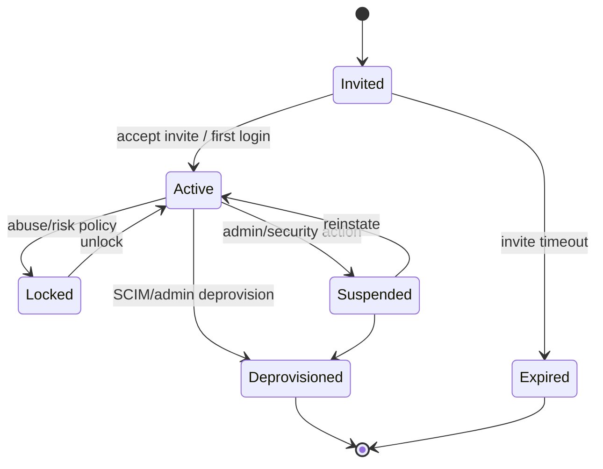
```mermaid
stateDiagram-v2
    [*] --> Invited
    Invited --> Active: accept invite / first login
    Invited --> Expired: invite timeout
    Active --> Locked: abuse/risk policy
    Locked --> Active: unlock
    Active --> Suspended: admin/security action
    Suspended --> Active: reinstate
    Active --> Deprovisioned: SCIM/admin deprovision
    Suspended --> Deprovisioned
    Deprovisioned --> [*]
    Expired --> [*]
```

## 32.2 Tenant membership state

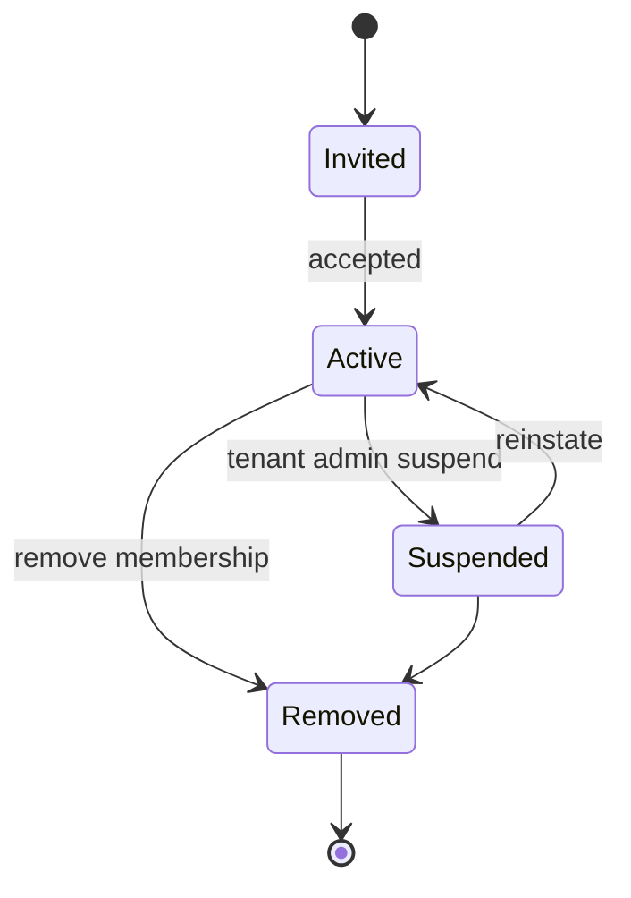
```mermaid
stateDiagram-v2
    [*] --> Invited
    Invited --> Active: accepted
    Active --> Suspended: tenant admin suspend
    Suspended --> Active: reinstate
    Active --> Removed: remove membership
    Suspended --> Removed
    Removed --> [*]
```

## 32.3 External identity link state

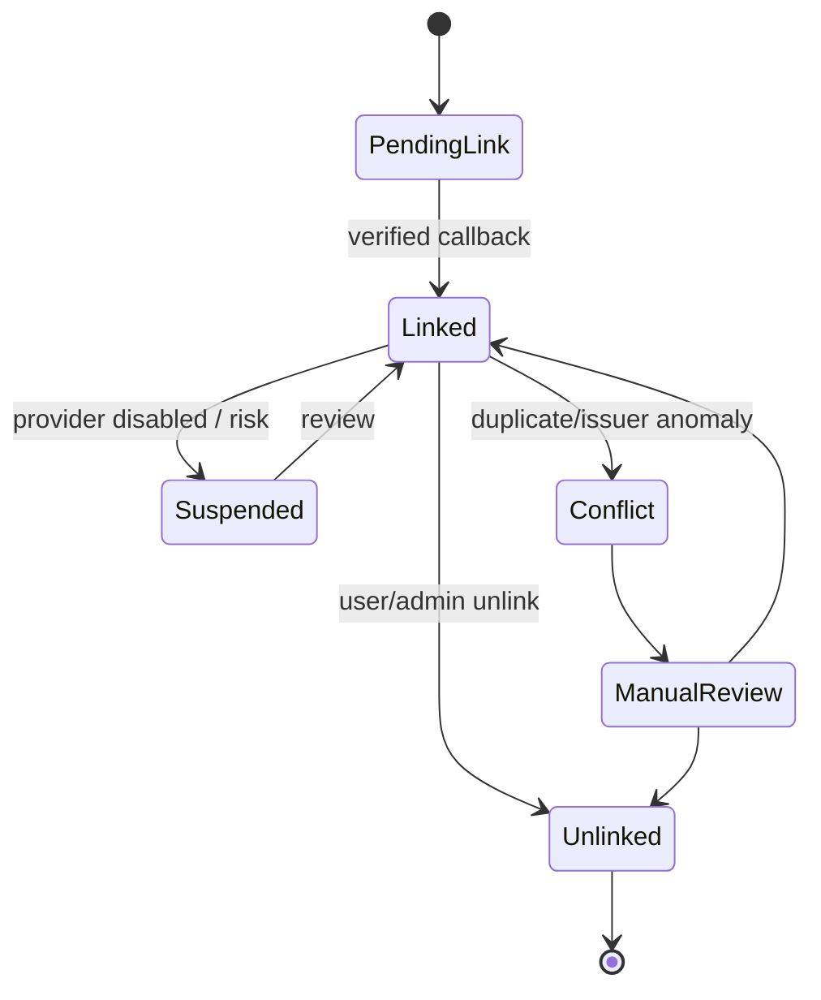
```mermaid
stateDiagram-v2
    [*] --> PendingLink
    PendingLink --> Linked: verified callback
    Linked --> Suspended: provider disabled / risk
    Suspended --> Linked: review
    Linked --> Unlinked: user/admin unlink
    Linked --> Conflict: duplicate/issuer anomaly
    Conflict --> ManualReview
    ManualReview --> Linked
    ManualReview --> Unlinked
    Unlinked --> [*]
```

## 32.4 Session state

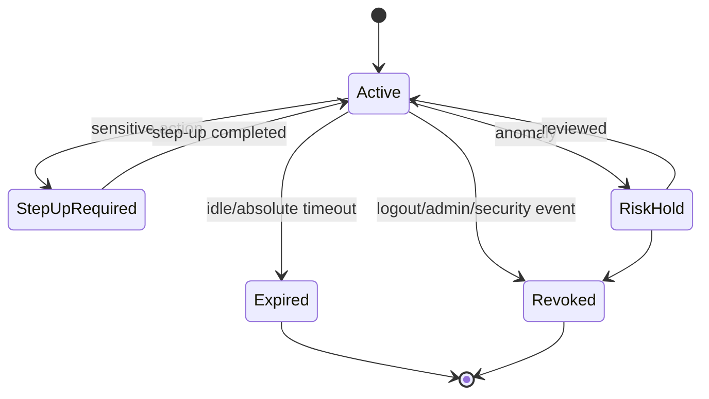
```mermaid
stateDiagram-v2
    [*] --> Active
    Active --> StepUpRequired: sensitive action
    StepUpRequired --> Active: step-up completed
    Active --> Expired: idle/absolute timeout
    Active --> Revoked: logout/admin/security event
    Active --> RiskHold: anomaly
    RiskHold --> Active: reviewed
    RiskHold --> Revoked
    Expired --> [*]
    Revoked --> [*]
```

---

# 33. Failure Modes

## 33.1 Identity merge failure

Two local users are accidentally merged because they share email.

Impact:

- data leakage;
- unauthorized access;
- audit corruption;
- account takeover.

Mitigation:

- never auto-merge by email alone;
- require explicit verified linking;
- keep merge audit;
- support rollback/manual review.

## 33.2 External IdP subject reuse

Provider reassigns identifier or app misreads non-stable claim.

Mitigation:

- use OIDC `sub`, not email/name;
- bind issuer+subject;
- understand provider subject stability policy;
- detect sudden claim changes.

## 33.3 Tenant mismatch

Token has tenant A, route says tenant B.

Mitigation:

- explicit tenant resolution;
- deny on mismatch unless cross-tenant authority;
- audit mismatch.

## 33.4 Role assignment without scope

A role intended for tenant A becomes global.

Mitigation:

- role assignment requires scope;
- unique constraints include tenant/resource;
- authorization request includes tenant.

## 33.5 Ghost access after deprovisioning

Directory disables user, but app still has active session/refresh token.

Mitigation:

- deprovision event revokes sessions;
- short token TTL;
- authorization checks current membership;
- cache invalidation.

## 33.6 Audit actor ambiguity

Support admin changes customer data, audit shows customer.

Mitigation:

- actor/effective subject separation;
- impersonation context mandatory;
- support session distinct from user session.

## 33.7 Service identity collapse

All background jobs use `system`.

Impact:

- impossible forensic analysis;
- overprivileged service;
- lateral movement;
- weak policy.

Mitigation:

- service-specific identity;
- workload identity;
- least privilege;
- service actor audit.

---

# 34. Anti-Patterns

## 34.1 `users.role`

```sql
ALTER TABLE users ADD COLUMN role VARCHAR(50);
```

Why bad:

- global role;
- no tenant scope;
- no expiry;
- no grant audit;
- no role hierarchy;
- no separation of duties;
- no delegation.

## 34.2 Email as ID

```sql
PRIMARY KEY(email)
```

Why bad:

- email changes;
- email can be reassigned;
- case normalization issues;
- privacy leakage;
- external IdP email may not be verified;
- one person can have multiple emails.

## 34.3 Blind token-to-user mapping

```go
userID := claims["sub"].(string)
```

Why bad:

- ignores issuer;
- ignores audience;
- ignores token type;
- `sub` may be external;
- collision across issuers.

## 34.4 Frontend-driven authority

```json
{
  "role": "admin"
}
```

Backend accepts role from client.

Never trust client-supplied authority.

## 34.5 Raw claims everywhere

Passing `map[string]any` through services leads to:

- type confusion;
- inconsistent mapping;
- security bugs;
- hard-to-test authorization;
- accidental exposure.

Normalize once at boundary.

## 34.6 One system user

```text
all jobs run as user_id = 0
```

Bad for audit and least privilege.

## 34.7 Delete identity to revoke access

Deleting user row to revoke access can destroy audit linkage. Prefer lifecycle states and revocation events.

---

# 35. Reference Package Structure

Salah satu package layout untuk Go service:

```text
internal/
  identity/
    user.go
    account.go
    credential.go
    external_identity.go
    tenant.go
    membership.go
    service_identity.go
    errors.go
  authn/
    authenticator.go
    session.go
    oidc.go
    password.go
    webauthn.go
    middleware.go
  authz/
    authorizer.go
    decision.go
    policy.go
    permission.go
    role.go
    relation.go
  audit/
    event.go
    actor_snapshot.go
    writer.go
  requestidentity/
    context.go
    principal.go
    actor.go
  directory/
    scim.go
    provisioning.go
  tenant/
    resolver.go
    guard.go
```

## 35.1 Dependency direction

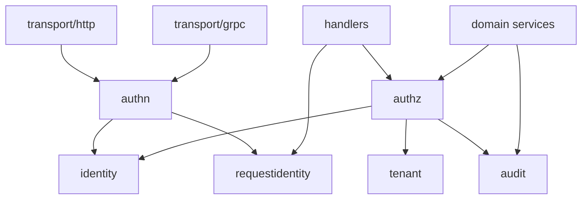
```mermaid
flowchart TD
    HTTP[transport/http] --> AUTHN[authn]
    GRPC[transport/grpc] --> AUTHN
    AUTHN --> ID[identity]
    AUTHN --> REQ[requestidentity]
    HANDLER[handlers] --> REQ
    HANDLER --> AUTHZ[authz]
    AUTHZ --> ID
    AUTHZ --> TEN[tenant]
    AUTHZ --> AUD[audit]
    DOMAIN[domain services] --> AUTHZ
    DOMAIN --> AUD
```

Important:

- domain service should not parse JWT;
- handler should not manually inspect raw claims for permission;
- authz should receive normalized request identity;
- audit should receive actor context and decision context.

## 35.2 Interface boundaries

```go
type Authenticator interface {
    Authenticate(ctx context.Context, token string) (RequestIdentity, error)
}

type Authorizer interface {
    Decide(ctx context.Context, req AuthorizationRequest) (Decision, error)
}

type AuditWriter interface {
    Write(ctx context.Context, event AuditEvent) error
}
```

---

# 36. Case Study: Regulatory Case Management

Bayangkan sistem regulatory enforcement lifecycle.

Entities:

- officer,
- supervisor,
- legal reviewer,
- external agency user,
- salesperson applicant,
- service account for notification,
- case,
- appeal,
- enforcement action,
- tenant/agency,
- organization division.

## 36.1 Naive model

```text
users(id, email, role)
cases(id, assigned_user_id)
```

Problem:

- officer role global;
- supervisor di divisi A bisa approve case divisi B;
- external agency user bisa enumerate case ID;
- service email sender appears as null actor;
- admin impersonation terlihat seperti user asli;
- audit tidak bisa membuktikan authority;
- deprovisioned officer masih punya active session;
- case transfer tidak update permission;
- org hierarchy tidak dimodelkan.

## 36.2 Better model

```text
users
accounts
tenants
organizations
tenant_memberships
tenant_profiles
roles
role_assignments
case_assignments
relation_tuples
sessions
audit_events
```

## 36.3 Authorization example

Question:

```text
Can Officer Jane approve Case C-123?
```

Inputs:

- actor: account `acc_jane`
- tenant: `tnt_cea`
- action: `case.approve`
- resource: `case:C-123`
- case status: `pending_supervisor_approval`
- case org unit: `enforcement_division`
- Jane membership: active in tenant
- Jane roles: `supervisor` scoped to `enforcement_division`
- Jane assurance: AAL2
- policy version: `case-policy-v17`

Decision:

```json
{
  "allowed": true,
  "reason": "role supervisor scoped to enforcement_division permits case.approve at pending_supervisor_approval",
  "policy_version": "case-policy-v17"
}
```

Audit:

```json
{
  "actor_account_id": "acc_jane",
  "tenant_id": "tnt_cea",
  "action": "case.approve",
  "resource_type": "case",
  "resource_id": "C-123",
  "decision": "allow",
  "policy_version": "case-policy-v17",
  "assurance": "aal2"
}
```

## 36.4 Impersonation example

Support admin investigates user issue.

Correct audit:

```json
{
  "actual_actor": "acc_support_admin",
  "effective_subject": "acc_end_user",
  "mode": "impersonation",
  "reason_code": "support_ticket",
  "ticket_id": "INC-12345",
  "action": "application.view",
  "resource_id": "APP-789"
}
```

Incorrect audit:

```json
{
  "actor": "acc_end_user",
  "action": "application.view"
}
```

The incorrect audit destroys accountability.

---

# 37. Checklist Review

Gunakan checklist ini saat review identity model.

## 37.1 Entity checklist

- [ ] Apakah `User`, `Account`, `Principal`, `Subject`, dan `Actor` dibedakan?
- [ ] Apakah external identity disimpan sebagai `(issuer, subject)`?
- [ ] Apakah email tidak menjadi primary identity?
- [ ] Apakah service/workload identity dimodelkan?
- [ ] Apakah tenant membership terpisah dari user?
- [ ] Apakah role assignment punya scope?
- [ ] Apakah session punya lifecycle?
- [ ] Apakah credential punya lifecycle?
- [ ] Apakah audit menyimpan actor dan effective subject?
- [ ] Apakah impersonation/delegation eksplisit?

## 37.2 Multi-tenant checklist

- [ ] Apakah semua resource tenant-scoped punya tenant owner?
- [ ] Apakah tenant dari route/token/session/resource direkonsiliasi?
- [ ] Apakah cross-tenant access explicit dan auditable?
- [ ] Apakah query enforce tenant boundary?
- [ ] Apakah tenant membership dicek sebelum resource permission?

## 37.3 Federation checklist

- [ ] Apakah issuer whitelist dikonfigurasi?
- [ ] Apakah audience divalidasi?
- [ ] Apakah `sub` tidak dipakai tanpa issuer?
- [ ] Apakah auto-link by email dilarang kecuali policy ketat?
- [ ] Apakah JIT provisioning default minimal privilege?
- [ ] Apakah deprovisioning mencabut session/grant sesuai policy?

## 37.4 Audit checklist

- [ ] Apakah event sensitive menyimpan policy version?
- [ ] Apakah denied decision dicatat untuk action high-risk?
- [ ] Apakah actor snapshot disimpan?
- [ ] Apakah system actor tidak nullable?
- [ ] Apakah support/admin impersonation terlihat jelas?

---

# 38. Latihan Desain

## Latihan 1 — Refactor `users.role`

Diberikan schema:

```sql
users(id, email, password_hash, role, tenant_id)
```

Refactor menjadi model yang mendukung:

- user multi-tenant;
- external OIDC login;
- role expiry;
- audit grant;
- support impersonation;
- service account.

Output yang diharapkan:

- entity list;
- table list;
- invariants;
- migration plan.

## Latihan 2 — Account linking

Desain flow linking Microsoft Entra ID ke account lokal.

Pertanyaan:

- kapan boleh auto-link?
- apa key external identity?
- bagaimana jika email match tapi subject belum linked?
- bagaimana jika external identity sudah linked ke account lain?
- event apa yang harus diaudit?

## Latihan 3 — Tenant confusion

Request:

```http
GET /tenants/tnt_a/cases/CASE-123
Authorization: Bearer token with tenant_id=tnt_b
```

Buat decision tree:

- kapan deny?
- kapan allow?
- siapa yang boleh cross-tenant?
- audit event apa yang dibuat?

## Latihan 4 — Admin impersonation

Desain model untuk support admin yang bisa impersonate user selama 15 menit dengan ticket ID dan approval.

Harus mencakup:

- data model;
- session model;
- actor chain;
- audit;
- forbidden actions saat impersonation.

---

# 39. Ringkasan

Identity domain model adalah fondasi semua sistem authentication dan authorization yang serius.

Pelajaran utama:

1. Jangan memakai `User` untuk semua konsep.
2. Pisahkan `User`, `Account`, `Principal`, `Subject`, dan `Actor`.
3. Email bukan identity stabil.
4. External identity harus dibind minimal dengan `(issuer, subject)`.
5. Tenant adalah security boundary, bukan label UI.
6. Role assignment harus scoped.
7. Credential dan session punya lifecycle sendiri.
8. Service/workload identity harus first-class.
9. Impersonation dan delegation harus eksplisit.
10. Audit harus menyimpan actor aktual, effective subject, tenant, action, resource, authority, dan decision evidence.

Mental model final:

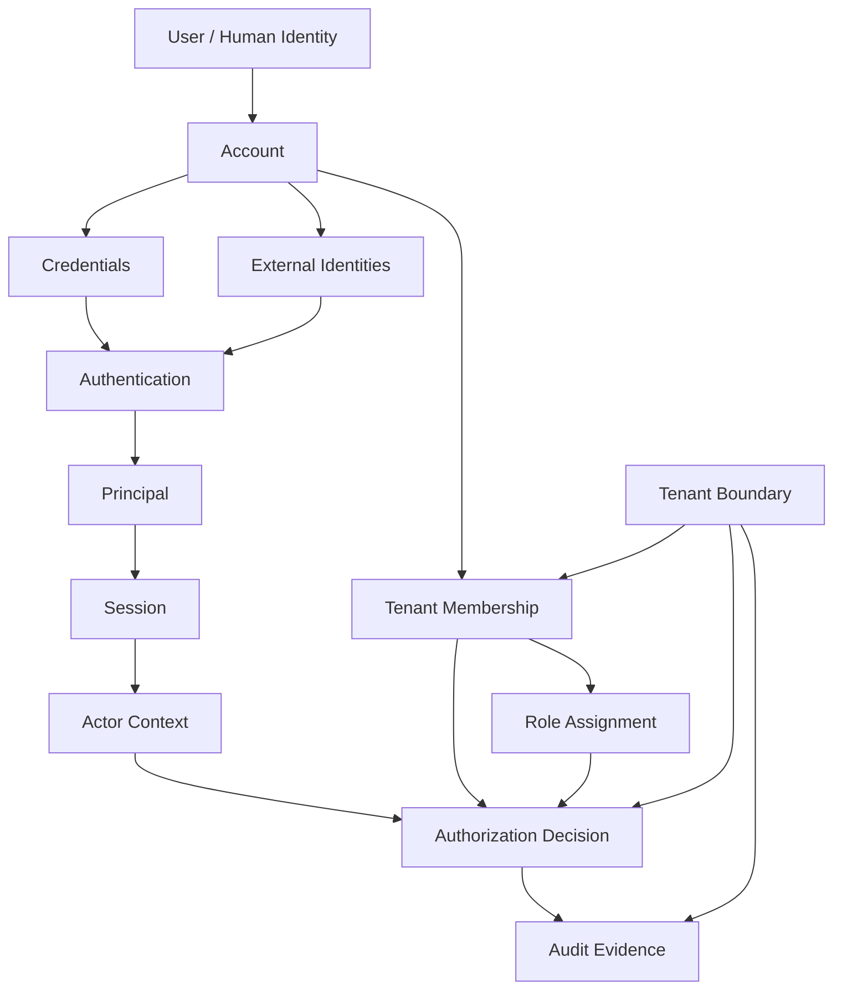
```mermaid
flowchart TD
    U[User / Human Identity] --> A[Account]
    A --> C[Credentials]
    A --> EXT[External Identities]
    A --> TM[Tenant Membership]
    TM --> RA[Role Assignment]
    C --> AUTHN[Authentication]
    EXT --> AUTHN
    AUTHN --> P[Principal]
    P --> S[Session]
    S --> ACT[Actor Context]
    ACT --> D[Authorization Decision]
    D --> AUD[Audit Evidence]

    TM --> D
    RA --> D
    TEN[Tenant Boundary] --> TM
    TEN --> D
    TEN --> AUD
```

Kalau bagian ini dipahami dengan benar, part berikutnya tentang credential lifecycle, authentication, session, OAuth/OIDC, RBAC, ABAC, ReBAC, policy-as-code, dan audit akan jauh lebih mudah karena kita sudah punya vocabulary dan struktur domain yang stabil.

---

## Status Seri

Seri belum selesai.

Part berikutnya:

```text
learn-go-authentication-authorization-identity-permission-part-004.md
```

Topik berikutnya:

```text
Credential Lifecycle: Registration, Binding, Recovery, Rotation, Revocation
```


<!-- NAVIGATION_FOOTER -->
<div class="page-nav">
<a href="./learn-go-authentication-authorization-identity-permission-part-002.md">⬅️ Part 002 — Threat Model untuk Auth System di Go</a>
<a href="./index.md">📚 Kategori</a>
<a href="../../index.md">🏠 Home</a>
<a href="./learn-go-authentication-authorization-identity-permission-part-004.md">Part 004 — Credential Lifecycle: Registration, Binding, Recovery, Rotation, Revocation ➡️</a>
</div>
