# learn-go-authentication-authorization-identity-permission-part-004.md

# Part 004 — Credential Lifecycle: Registration, Binding, Recovery, Rotation, Revocation

> Seri: `learn-go-authentication-authorization-identity-permission`  
> Target pembaca: engineer yang ingin mendesain sistem identity/auth di Go pada level production, enterprise, regulatory, dan distributed systems.  
> Baseline: Go 1.26.x, OAuth/OIDC modern, NIST SP 800-63-4, OWASP ASVS, WebAuthn Level 3.  
> Status seri: **belum selesai**.  
> Part sebelumnya: `part-003` — Identity Domain Model.  
> Part ini: credential lifecycle.  
> Part berikutnya: `part-005` — Assurance Levels: IAL, AAL, FAL, Risk-Based Authentication.

---

## Daftar Isi

1. Tujuan Part Ini
2. Kenapa Credential Lifecycle Adalah Masalah Arsitektur, Bukan Sekadar Login Form
3. Terminologi Presisi
4. Mental Model: Credential Sebagai Objek Berumur Panjang
5. Perbedaan Credential, Authenticator, Secret, Factor, Session, Token
6. Lifecycle Besar Credential
7. State Machine Credential
8. Registration Flow: Dari Identitas ke Akun yang Dapat Dipakai
9. Enrollment vs Binding vs Activation
10. Credential Binding: Membuktikan Kepemilikan dan Mengikat ke Subject
11. Password Credential Lifecycle
12. Email/Phone Verification Credential
13. OTP/TOTP Credential Lifecycle
14. Recovery Code Lifecycle
15. Passkey/WebAuthn Credential Lifecycle
16. API Key dan Personal Access Token Lifecycle
17. Service Account Credential Lifecycle
18. Credential Recovery: Jalur Alternatif yang Sering Lebih Berbahaya dari Login
19. Password Reset Token Design
20. MFA Reset dan Account Recovery
21. Credential Rotation
22. Credential Revocation
23. Compromise Handling
24. Session dan Token Invalidation Setelah Credential Event
25. Audit Model untuk Credential Lifecycle
26. Data Model di Go
27. Relational Schema Reference
28. Service Interface Design
29. Registration Implementation Skeleton
30. Binding Implementation Skeleton
31. Recovery Implementation Skeleton
32. Revocation Implementation Skeleton
33. Abuse Resistance: Enumeration, Brute Force, Credential Stuffing
34. Distributed Systems Problems
35. Multi-Tenant Credential Lifecycle
36. Regulatory and Forensic Defensibility
37. Failure Modes
38. Anti-Patterns
39. Production Checklist
40. Mini Case Study: Regulatory Case Management Platform
41. Review Questions
42. Ringkasan
43. Referensi Primer

---

## 1. Tujuan Part Ini

Tujuan part ini adalah membangun mental model yang benar untuk **credential lifecycle**.

Banyak engineer memandang authentication sebagai kumpulan endpoint:

```text
POST /register
POST /login
POST /logout
POST /forgot-password
POST /reset-password
POST /mfa/verify
```

Pandangan ini terlalu dangkal.

Dalam sistem nyata, terutama enterprise, government, fintech, healthcare, regulatory, atau multi-tenant SaaS, credential bukan sekadar input form. Credential adalah **objek keamanan** yang:

- dibuat,
- diverifikasi,
- diikat ke subject/account,
- digunakan untuk membuktikan kontrol,
- dirotasi,
- diganti,
- dipulihkan,
- dicabut,
- diaudit,
- dan kadang harus dijadikan evidence dalam investigasi.

Part ini akan menjawab:

- Apa beda registration, enrollment, binding, activation?
- Apa yang sebenarnya terjadi ketika user menambahkan password, TOTP, passkey, recovery code, API key?
- Kenapa recovery flow sering menjadi bypass authentication?
- Bagaimana mendesain reset token yang aman?
- Kapan credential harus revoke vs suspend vs rotate?
- Apa efek credential event terhadap session dan token?
- Bagaimana memodelkannya di Go tanpa membuat auth system menjadi kumpulan `if role == ...` dan `if token.Valid`?

---

## 2. Kenapa Credential Lifecycle Adalah Masalah Arsitektur, Bukan Sekadar Login Form

Credential lifecycle adalah masalah arsitektur karena ia berada di persimpangan beberapa domain:

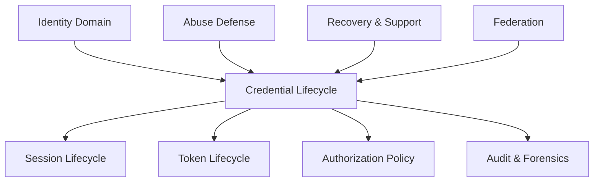

Credential lifecycle mempengaruhi:

| Area | Contoh Dampak |
|---|---|
| Authentication | user bisa login atau tidak |
| Authorization | credential strength dapat memicu step-up auth |
| Session | password reset dapat memutus session lama |
| Token | refresh token lama mungkin harus dicabut |
| Audit | investigator perlu tahu credential mana yang dipakai |
| Risk | credential baru dari lokasi aneh bisa menaikkan risk score |
| Support | helpdesk recovery bisa menjadi jalur takeover |
| Federation | external identity berubah atau claim tidak lagi valid |
| Multi-tenant | credential yang sama bisa dipakai lintas tenant, tetapi authority berbeda |

Kesalahan umum:

> Engineer mendesain login dulu, lalu recovery belakangan.

Ini berbahaya karena recovery biasanya menjadi **alternate authentication path**. Jika recovery lebih lemah dari login, attacker tidak perlu mengalahkan login; cukup menyerang recovery.

---

## 3. Terminologi Presisi

Sebelum masuk desain, kita harus presisi.

| Istilah | Makna |
|---|---|
| Identity | Representasi entitas dalam sistem: manusia, organisasi, service, workload |
| Account | Local container untuk identity di aplikasi/tenant tertentu |
| Subject | Entity yang sedang diautentikasi atau direpresentasikan dalam security decision |
| Principal | Representasi authenticated subject di runtime aplikasi |
| Actor | Entity yang melakukan aksi; bisa sama dengan subject atau berbeda saat impersonation/delegation |
| Credential | Data/faktor/artefak yang memungkinkan claimant membuktikan kontrol atas authenticator atau secret |
| Authenticator | Sesuatu yang dimiliki/dikontrol user untuk authentication: password secret, TOTP app, passkey authenticator, hardware key |
| Factor | Kategori bukti: something you know, have, are, do, somewhere you are |
| Binding | Proses mengaitkan credential/authenticator ke account/subject dengan bukti kontrol yang memadai |
| Enrollment | Proses menambahkan credential/authenticator baru ke account |
| Activation | Membuat credential eligible untuk dipakai setelah verifikasi terpenuhi |
| Recovery | Proses mendapatkan kembali akses ketika credential utama hilang/terkompromi |
| Rotation | Mengganti credential lama dengan credential baru secara terkontrol |
| Revocation | Mencabut credential agar tidak bisa dipakai lagi |
| Suspension | Menonaktifkan sementara, biasanya reversible |
| Compromise | Credential diketahui/diduga berada di luar kontrol legitimate holder |

Presisi ini penting karena bug auth sering muncul dari satu kata yang terlalu longgar.

Contoh:

```text
"User verified"
```

Verified apa?

- email verified?
- phone verified?
- identity proofing verified?
- password verified?
- MFA verified?
- passkey assertion verified?
- session recently authenticated?
- tenant membership verified?

Kalimat yang benar harus lebih spesifik:

```text
The account has an active email credential whose address-control verification completed at 2026-06-24T09:10:00Z.
```

Atau:

```text
The current session has satisfied AAL2 step-up at 2026-06-24T09:10:00Z using credential_id=...
```

---

## 4. Mental Model: Credential Sebagai Objek Berumur Panjang

Credential harus dipandang sebagai entity yang punya:

- identity,
- owner,
- type,
- assurance,
- lifecycle state,
- issuance metadata,
- binding metadata,
- last-used metadata,
- revocation metadata,
- risk metadata,
- audit trail.

Bukan hanya field:

```go
PasswordHash string
MFASecret    string
```

Lebih tepat:

```go
type Credential struct {
    ID              CredentialID
    AccountID       AccountID
    SubjectID       SubjectID
    TenantID        *TenantID
    Type            CredentialType
    State           CredentialState
    AssuranceLevel  AuthenticatorAssuranceLevel
    BindingMethod   BindingMethod
    CreatedAt       time.Time
    ActivatedAt     *time.Time
    LastUsedAt      *time.Time
    RotatedAt       *time.Time
    RevokedAt       *time.Time
    RevocationReason *RevocationReason
    Metadata        CredentialMetadata
}
```

Top engineer tidak bertanya hanya:

> “Bagaimana hashing password?”

Mereka bertanya:

> “Dalam kondisi apa credential ini boleh menjadi evidence untuk authentication decision, authority apa yang membinding credential ini, bagaimana ia direvoke, apa efeknya ke session/token, dan bagaimana investigator membuktikan keputusannya enam bulan kemudian?”

---

## 5. Perbedaan Credential, Authenticator, Secret, Factor, Session, Token

Ini salah satu area paling sering tercampur.

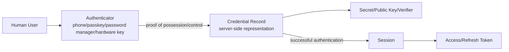

### Credential bukan session

Credential adalah bukti yang dipakai untuk membuat authentication event.

Session adalah hasil dari authentication event.

Jika password diganti, session lama mungkin harus invalidated. Tapi password bukan session.

### Credential bukan token

Access token biasanya artefak authorization yang diberikan setelah authentication/authorization flow.

Credential adalah sumber kemampuan untuk memperoleh token/session.

### Credential bukan role

Role menjawab authority/permission. Credential menjawab proof of control.

Credential yang kuat tidak otomatis berarti user boleh melakukan aksi tertentu. Ia hanya memberi assurance bahwa claimant memang subject tertentu.

### Credential bukan identity

Satu identity/account bisa punya banyak credential:

- password,
- passkey laptop,
- passkey phone,
- TOTP app,
- recovery codes,
- enterprise SSO identity,
- admin break-glass hardware key.

Satu credential juga bisa menjadi external binding ke identity provider.

---

## 6. Lifecycle Besar Credential

Lifecycle umum:

```text
proposed
  -> pending_verification
  -> bound
  -> active
  -> suspended
  -> active
  -> rotating
  -> superseded
  -> revoked
  -> retained_for_audit
  -> destroyed/anonymized
```

Tidak semua credential melewati semua state.

Contoh password:

```text
created -> active -> rotated -> superseded -> retained_for_audit
```

Contoh email verification:

```text
proposed -> pending_verification -> active -> revoked
```

Contoh WebAuthn passkey:

```text
registration_challenge_issued -> attestation_verified -> active -> revoked
```

Contoh API key:

```text
issued -> active -> last_used -> rotating -> revoked
```

---

## 7. State Machine Credential

Credential lifecycle sebaiknya eksplisit sebagai state machine.

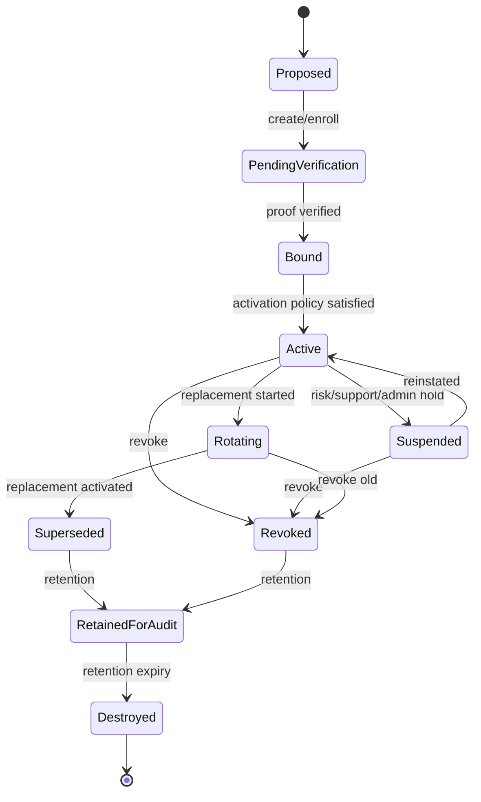

### State meaning

| State | Meaning | Can Authenticate? |
|---|---|---|
| `proposed` | Credential data submitted but not verified | No |
| `pending_verification` | Waiting for proof of control | No |
| `bound` | Control proved, but not yet active | Usually no |
| `active` | Eligible for authentication | Yes |
| `suspended` | Temporarily disabled | No |
| `rotating` | Replacement process started | Maybe, depending policy |
| `superseded` | Replaced by newer credential | No |
| `revoked` | Permanently invalid | No |
| `retained_for_audit` | Stored only for evidence/retention | No |
| `destroyed` | Removed/anonymized | No |

### Invariant

> Hanya credential dengan state `active` yang boleh menjadi basis authentication success, kecuali ada explicit recovery policy yang lebih ketat dan terekam audit-nya.

---

## 8. Registration Flow: Dari Identitas ke Akun yang Dapat Dipakai

Registration bukan hanya insert user.

Registration minimal menyentuh:

- identity creation,
- account creation,
- credential enrollment,
- proof of control,
- duplicate detection,
- tenant membership,
- risk screening,
- audit event,
- session issuance policy.

### Registration mental model

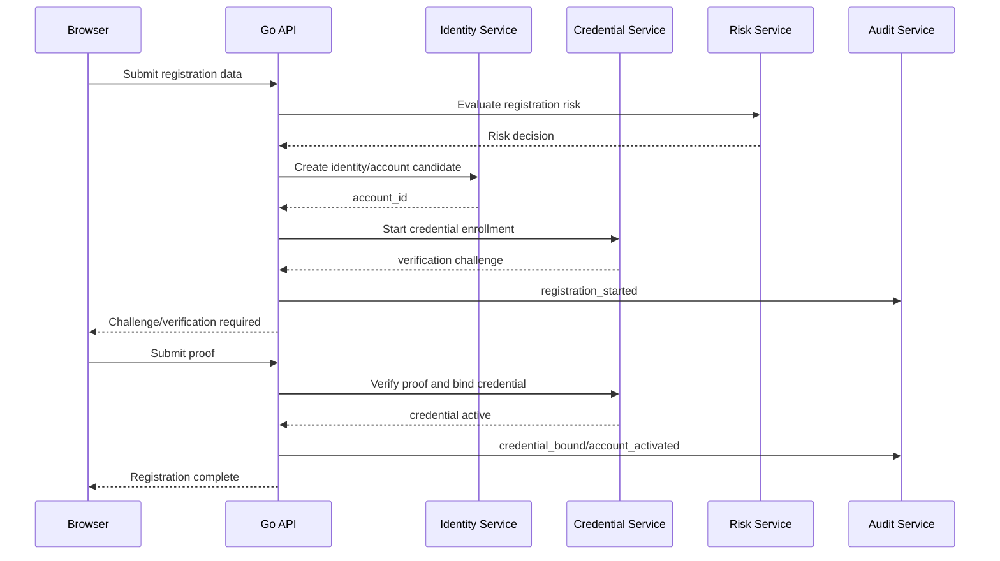

### Registration variants

| Variant | Example | Risk |
|---|---|---|
| Self-service | public sign-up | bot, fake account, enumeration |
| Invitation-based | admin invites staff | stale invite, wrong recipient |
| JIT federation | first SSO login creates account | claim mapping bug |
| Admin-created | back-office creates user | admin abuse, typo, wrong tenant |
| Bulk import | CSV/SCIM import | identity collision, weak initial credential |
| Machine identity provisioning | service account creation | orphaned credentials |

---

## 9. Enrollment vs Binding vs Activation

Tiga kata ini sering digabung padahal harus dipisah.

### Enrollment

Enrollment adalah proses user/system menambahkan credential candidate.

Contoh:

- user memasukkan email baru,
- user scan QR TOTP,
- user melakukan WebAuthn registration ceremony,
- admin membuat API key,
- service account dibuat dengan client secret.

Enrollment belum tentu berarti credential boleh dipakai.

### Binding

Binding adalah proses membuktikan bahwa credential benar-benar dikontrol oleh subject/account yang dimaksud.

Contoh:

- email link diklik,
- OTP dikonfirmasi,
- TOTP code valid,
- WebAuthn attestation/assertion valid,
- old password + MFA valid sebelum password change,
- admin approval valid untuk service credential.

### Activation

Activation adalah keputusan policy bahwa credential yang sudah bound boleh digunakan.

Contoh credential bisa bound tetapi belum active:

- credential menunggu approval admin,
- credential high-risk butuh cooling-off period,
- passkey menunggu device trust evaluation,
- email baru menunggu old email notification delay,
- service key menunggu two-person approval.

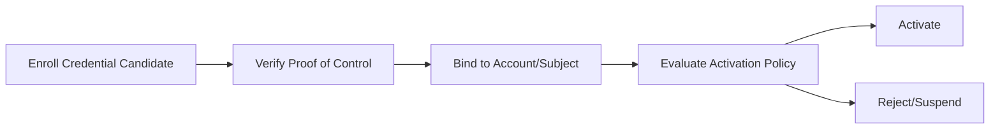

### Invariant

> Enrollment adalah input. Binding adalah proof. Activation adalah policy decision.

Jika ketiganya dicampur, sistem akan sulit menangani MFA reset, device replacement, admin approval, high-risk enrollment, dan audit.

---

## 10. Credential Binding: Membuktikan Kepemilikan dan Mengikat ke Subject

Credential binding menjawab:

> Apa bukti bahwa credential ini dikontrol oleh subject/account yang benar?

Binding harus menyimpan metadata:

- siapa yang membinding,
- kapan,
- dengan metode apa,
- assurance level apa,
- challenge ID apa,
- device/IP/risk context apa,
- apakah ada admin override,
- apakah ada step-up auth,
- policy version apa.

### Binding examples

| Credential | Proof of Control | Binding Risk |
|---|---|---|
| Password | User sets secret through authenticated or verified channel | weak reset path |
| Email | User controls mailbox/link/code | mailbox compromise |
| Phone | User controls SMS/voice channel | SIM swap |
| TOTP | User proves generated code from shared secret | seed leakage |
| WebAuthn | Authenticator signs challenge with private key | origin/RP misconfig |
| API Key | Key is issued once by server after authenticated admin action | leaked key material |
| Service certificate | CSR/signing workflow or workload attestation | wrong workload identity |

### Binding should be non-repudiable enough for your domain

Untuk sistem consumer biasa, audit sederhana mungkin cukup.

Untuk sistem regulatory, binding harus bisa menjawab:

- apakah user sendiri yang menambahkan credential?
- apakah admin/support yang menambahkan?
- apakah ada approval?
- apakah actor berbeda dari subject?
- apakah user diberi notifikasi?
- apakah credential langsung aktif atau menunggu cooling-off?
- credential ini pernah dipakai untuk aksi penting apa?

---

## 11. Password Credential Lifecycle

Password masih realitas banyak sistem.

Lifecycle password:

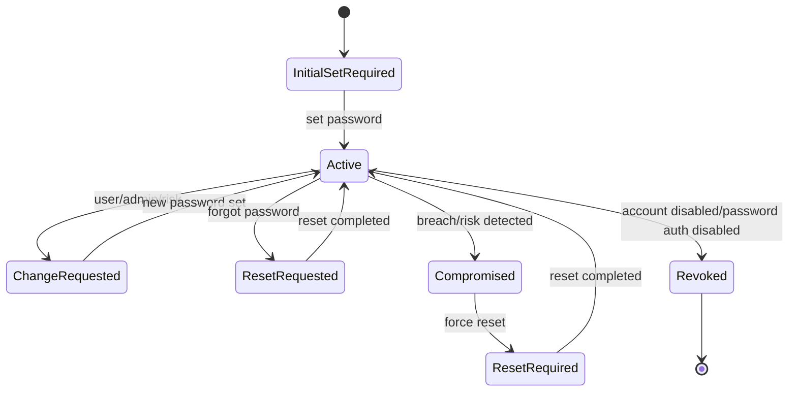

### Password lifecycle events

| Event | Required Controls |
|---|---|
| Initial set | verified channel, token expiry, single-use token |
| Login | rate limit, constant response semantics, password verifier check |
| Change password | existing session + recent auth + old password or step-up |
| Forgot password | anti-enumeration, single-use reset token, expiry, secure delivery |
| Force reset | invalidate risky sessions, notify user/admin |
| Disable password auth | ensure alternate credential exists |

### Password change vs password reset

Password change:

- user is already authenticated,
- should require current password or step-up,
- usually initiated from settings page.

Password reset:

- user may not be authenticated,
- uses recovery channel,
- higher risk,
- should not leak account existence,
- should invalidate relevant sessions/tokens after success.

### Password storage note

Part ini tidak mengulang seri cryptography, tapi production baseline tetap:

- never store plaintext password,
- use memory-hard or widely vetted password hashing function,
- store algorithm and parameters with hash,
- support parameter upgrade on next successful authentication,
- compare secrets safely,
- avoid logging secrets,
- avoid sending password by email.

Example verifier metadata:

```go
type PasswordVerifier struct {
    Algorithm string    // "argon2id", "bcrypt", etc.
    Params    string    // encoded cost/memory/parallelism/version
    Salt      []byte
    Hash      []byte
    Version   int
    CreatedAt time.Time
}
```

### Password hash upgrade pattern

```go
type PasswordHasher interface {
    Hash(ctx context.Context, password []byte) (EncodedPasswordHash, error)
    Verify(ctx context.Context, encoded EncodedPasswordHash, password []byte) (PasswordVerifyResult, error)
}

type PasswordVerifyResult struct {
    Match         bool
    NeedsRehash   bool
    Algorithm     string
    ParameterInfo string
}
```

After successful login:

```go
if result.Match && result.NeedsRehash {
    // Best effort upgrade. Do not block login path too long.
    // Protect with optimistic locking to avoid overwriting newer password.
    _ = svc.UpgradePasswordHash(ctx, accountID, rawPassword, credentialVersion)
}
```

Invariant:

> Password verifier migration must never accidentally accept weaker or malformed encodings as valid.

---

## 12. Email/Phone Verification Credential

Email dan phone sering dianggap contact detail. Dalam auth system, keduanya bisa menjadi credential atau recovery channel.

Karena itu, lifecycle harus jelas.

```text
email_address proposed
  -> verification_sent
  -> verified_control
  -> active_recovery_channel
  -> changed/revoked
```

### Email verification is not identity proofing

Email verified hanya berarti:

> claimant punya kontrol atas mailbox pada saat verification.

Itu tidak berarti:

- orangnya benar secara legal,
- organisasinya benar,
- role-nya benar,
- tenant membership valid,
- user boleh melakukan high-risk action.

### Phone verification risk

Phone/SMS lebih riskan karena:

- SIM swap,
- number recycling,
- shared phone,
- delivery interception,
- roaming/telecom issue.

Jadi phone verified sebaiknya tidak otomatis dianggap high-assurance credential.

### Contact change policy

Saat user mengganti email/phone:

- minta recent authentication,
- verifikasi channel baru,
- notifikasi channel lama,
- pertimbangkan delay/cooling-off untuk high-risk account,
- invalidate recovery tokens lama,
- catat actor/subject.

---

## 13. OTP/TOTP Credential Lifecycle

TOTP enrollment umumnya:

1. user authenticated,
2. server generate TOTP secret,
3. server tampilkan QR/URI,
4. user scan dengan authenticator app,
5. user submit code,
6. server verify code,
7. credential active,
8. recovery codes generated,
9. audit + notification.

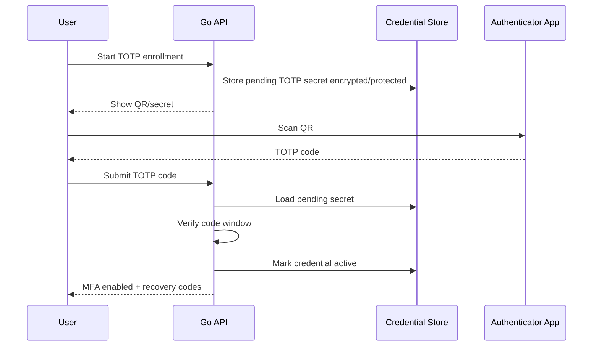

### TOTP lifecycle states

| State | Meaning |
|---|---|
| pending | secret generated but not verified |
| active | accepted as factor |
| suspended | temporarily disabled due to risk/support |
| rotated | replaced with new TOTP secret |
| revoked | permanently invalid |

### TOTP design concerns

- Pending TOTP secrets must expire.
- Do not activate TOTP before first successful code verification.
- Avoid broad time windows.
- Store server-side secret carefully.
- Support drift only within policy.
- Prevent brute force on TOTP verification.
- Recovery code generation should happen after successful enrollment.
- Changing/removing TOTP should require step-up.

### Important invariant

> A pending TOTP secret is a credential candidate, not an active authenticator.

If you treat pending TOTP as active, attacker who starts enrollment on hijacked session may create denial of service or bypass flows.

---

## 14. Recovery Code Lifecycle

Recovery codes are credentials.

They are not just backup strings.

Lifecycle:

```text
generated -> displayed_once -> hashed_stored -> unused -> used/revoked/expired
```

### Recovery code properties

Recovery codes should be:

- high entropy,
- generated server-side using secure randomness,
- shown once,
- stored hashed,
- single-use,
- revocable,
- regenerable after step-up,
- audited on use.

### Example model

```go
type RecoveryCode struct {
    ID             RecoveryCodeID
    CredentialID   CredentialID
    AccountID      AccountID
    Hash           []byte
    HashAlgorithm  string
    CreatedAt      time.Time
    UsedAt         *time.Time
    RevokedAt      *time.Time
}
```

### Recovery code use policy

Using a recovery code should usually:

- consume the code,
- trigger notification,
- possibly require credential review,
- possibly revoke existing sessions,
- possibly require adding a new MFA factor.

Invariant:

> Recovery codes are authentication credentials with lower operational frequency but high account-takeover impact.

---

## 15. Passkey/WebAuthn Credential Lifecycle

Passkeys/WebAuthn introduce a stronger lifecycle model because server stores a public key credential and authenticator signs challenges.

Lifecycle:

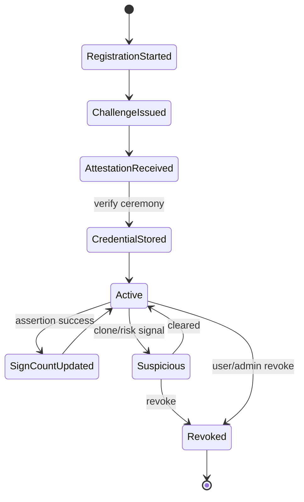

### WebAuthn registration data

A WebAuthn credential record usually stores:

- credential ID,
- public key,
- user handle,
- RP ID,
- sign count / backup state metadata,
- attestation metadata if policy needs it,
- transports,
- discoverable credential flag,
- created time,
- last used time,
- credential name/device label.

```go
type WebAuthnCredential struct {
    CredentialID       []byte
    AccountID          AccountID
    UserHandle         []byte
    PublicKeyCOSE      []byte
    RPID               string
    SignCount          uint32
    BackupEligible     *bool
    BackupState        *bool
    Transports         []string
    AttestationType    string
    AAGUID             []byte
    CreatedAt          time.Time
    LastUsedAt         *time.Time
    RevokedAt          *time.Time
}
```

### WebAuthn lifecycle concerns

- Challenge must be single-use and expire.
- Challenge must bind to user/account/session and RP ID.
- Origin and RP ID validation are non-negotiable.
- Credential ID must be unique enough in your credential store.
- User handle should not leak sensitive internal identifiers if avoidable.
- Device rename is metadata only, not credential proof.
- Revocation removes server-side acceptance; it does not erase authenticator state on user device.
- Synced passkeys change threat model compared to hardware-bound keys.

### Passkey recovery problem

Passkeys reduce phishing risk, but account recovery remains hard.

If user loses all passkeys, recovery may fall back to:

- recovery codes,
- verified email + stronger checks,
- identity proofing,
- helpdesk process,
- admin approval,
- enterprise IdP.

The fallback path must not be materially weaker than the account value requires.

---

## 16. API Key dan Personal Access Token Lifecycle

API keys and personal access tokens are credentials for non-browser/API access.

They deserve lifecycle management equal to passwords, often stricter.

### API key lifecycle

```text
requested -> approved -> issued_once -> active -> last_used -> rotated -> revoked -> retained_metadata
```

### API key design principles

- Show secret once.
- Store only hash/verifier of key.
- Prefix key with non-secret identifier for lookup.
- Bind to account/service/tenant/scope.
- Support expiry.
- Support revocation.
- Track last used time and source.
- Use least privilege scopes.
- Never use API key as authorization model by itself.

Example key format:

```text
gak_live_01HZY8...publicprefix..._secretpart
```

Server stores:

```go
type APIKeyCredential struct {
    ID            CredentialID
    KeyPrefix     string
    SecretHash    []byte
    AccountID     AccountID
    TenantID      TenantID
    Name          string
    Scopes        []Scope
    State         CredentialState
    ExpiresAt     *time.Time
    LastUsedAt    *time.Time
    CreatedBy     ActorID
    RevokedAt     *time.Time
}
```

### Lookup pattern

```go
func AuthenticateAPIKey(ctx context.Context, raw string) (*Principal, error) {
    prefix, secret, err := SplitAPIKey(raw)
    if err != nil {
        return nil, ErrInvalidCredential
    }

    candidates, err := repo.FindActiveAPIKeysByPrefix(ctx, prefix)
    if err != nil {
        return nil, err
    }

    for _, key := range candidates {
        if verifier.Verify(secret, key.SecretHash) {
            return principalFromAPIKey(key), nil
        }
    }

    return nil, ErrInvalidCredential
}
```

Important:

- Prefix is not secret.
- Prefix reduces lookup cost.
- Verification still checks secret hash.
- Do not log raw key.

---

## 17. Service Account Credential Lifecycle

Service account credentials are machine credentials.

They are often more dangerous than user credentials because they are:

- long-lived,
- automated,
- embedded in CI/CD or workloads,
- high privilege,
- hard to rotate,
- rarely monitored by humans.

### Service credential types

| Type | Example |
|---|---|
| Client secret | OAuth2 client credentials |
| Private key | JWT bearer / signing credential |
| mTLS certificate | workload-to-service authentication |
| Kubernetes service account token | in-cluster workload identity |
| SPIFFE SVID | workload identity certificate/JWT |
| Static API key | legacy integration |

### Lifecycle principles

- Prefer short-lived workload identity over static secrets.
- Bind credential to workload identity, not just environment variable.
- Use audience-bound tokens where possible.
- Rotate automatically.
- Revoke on workload decommission.
- Detect unused service credentials.
- Do not share one credential across multiple services.
- Separate deployment identity from runtime identity.

### Dangerous anti-pattern

```text
One shared CLIENT_SECRET for all internal services.
```

Impact:

- no attribution,
- impossible revocation without outage,
- lateral movement,
- audit useless,
- rotation risky.

Better:

```text
One workload identity per deployable service per environment, with scoped authority.
```

---

## 18. Credential Recovery: Jalur Alternatif yang Sering Lebih Berbahaya dari Login

Credential recovery adalah salah satu bagian paling berbahaya dari auth system.

Mental model:

> Recovery is authentication through an alternate path.

Jika login butuh password + MFA, tetapi reset hanya butuh email, maka attacker akan menyerang email/reset.

### Recovery flow attack surface

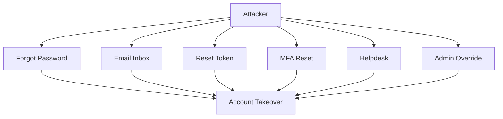

### Recovery must answer

- What credential was lost?
- What remaining proof does the user have?
- What assurance level is required?
- Does recovery reduce account assurance?
- Should high-risk actions be blocked after recovery?
- Should sessions be revoked?
- Should admin approval be required?
- Should user be notified?
- How is abuse detected?

### Recovery taxonomy

| Recovery Type | Risk |
|---|---|
| Password reset by email | mailbox compromise |
| OTP reset by SMS | SIM swap |
| MFA reset by support | social engineering |
| Passkey reset by email | weak fallback for strong auth |
| Admin force reset | insider abuse |
| Recovery code | theft of stored backup codes |
| Enterprise IdP recovery | depends on IdP assurance |

### Security invariant

> Recovery must be treated as a privileged authentication event, not a convenience endpoint.

---

## 19. Password Reset Token Design

Password reset token is temporary credential.

Lifecycle:

```text
issued -> delivered -> presented -> consumed -> expired/revoked
```

### Requirements

A reset token should be:

- high entropy,
- generated server-side,
- single-use,
- short-lived,
- stored hashed,
- bound to account,
- bound to purpose,
- optionally bound to tenant/client/risk context,
- invalidated after use,
- invalidated when password changes,
- not logged,
- not exposed in referrer logs,
- delivered over appropriate channel.

### Token model

```go
type RecoveryToken struct {
    ID              RecoveryTokenID
    AccountID       AccountID
    TenantID        *TenantID
    Purpose         RecoveryPurpose
    TokenHash       []byte
    CreatedAt       time.Time
    ExpiresAt       time.Time
    ConsumedAt      *time.Time
    RevokedAt       *time.Time
    RequestedFromIP string
    UserAgentHash   []byte
    RiskLevel       RiskLevel
}
```

### Token generation

```go
func GenerateRecoveryToken() (raw string, hash []byte, err error) {
    b := make([]byte, 32) // 256 bits
    if _, err := rand.Read(b); err != nil {
        return "", nil, err
    }

    raw = base64.RawURLEncoding.EncodeToString(b)
    hash = hashRecoveryToken([]byte(raw))
    return raw, hash, nil
}
```

The exact hash function is a policy decision. The important lifecycle principle:

> Store a verifier/hash, not the bearer token itself.

### Consume token atomically

```go
func (s *RecoveryService) ConsumePasswordResetToken(
    ctx context.Context,
    rawToken string,
    newPassword []byte,
) error {
    tokenHash := hashRecoveryToken([]byte(rawToken))

    return s.tx.WithTx(ctx, func(ctx context.Context) error {
        token, err := s.tokens.FindActiveByHashForUpdate(ctx, tokenHash, time.Now())
        if err != nil {
            return ErrInvalidOrExpiredRecoveryToken
        }

        if token.Purpose != PurposePasswordReset {
            return ErrInvalidOrExpiredRecoveryToken
        }

        encoded, err := s.passwordHasher.Hash(ctx, newPassword)
        if err != nil {
            return err
        }

        if err := s.credentials.RotatePassword(ctx, token.AccountID, encoded); err != nil {
            return err
        }

        if err := s.tokens.MarkConsumed(ctx, token.ID); err != nil {
            return err
        }

        if err := s.sessions.RevokeForAccount(ctx, token.AccountID, RevokePasswordReset); err != nil {
            return err
        }

        return s.audit.Record(ctx, AuditEvent{
            Type:      "credential.password_reset_completed",
            AccountID: token.AccountID,
            TokenID:   token.ID.String(),
        })
    })
}
```

### Atomicity invariant

> Token consumption, password update, session invalidation, and audit event must be coordinated so a crash cannot leave token reusable after password change.

At minimum, token consumption and password update should be in the same transaction. Session revocation may be event-driven but must be reliable enough for your risk tolerance.

---

## 20. MFA Reset dan Account Recovery

MFA reset is high-risk because it removes a strong factor.

Common unsafe pattern:

```text
User loses MFA -> support disables MFA after email confirmation.
```

This may reduce authentication assurance dramatically.

### Safer MFA reset policy

Depending on account risk:

- require recovery code,
- require existing active session + recent password verification,
- require another enrolled factor,
- require enterprise IdP authentication,
- require identity proofing,
- require admin approval,
- impose cooling-off period,
- notify all trusted channels,
- block sensitive actions temporarily,
- revoke all sessions after reset.

### MFA reset state machine

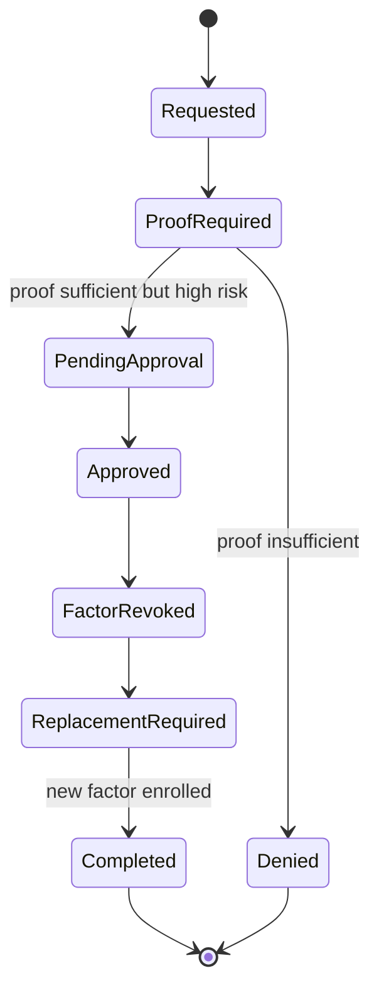

### MFA reset audit fields

- subject account,
- actor account/admin,
- reason,
- proof method,
- old factor ID,
- new factor ID,
- approval ID,
- risk score,
- session revocation outcome,
- notification outcome.

---

## 21. Credential Rotation

Rotation means replacing credential while maintaining continuity and minimizing risk.

### Rotation types

| Type | Example |
|---|---|
| User-initiated | user changes password |
| Policy-driven | API key expires every 90 days |
| Compromise-driven | leaked key discovered |
| Algorithm migration | password hash parameter upgrade |
| Device replacement | new passkey/security key |
| Service secret rotation | client secret renewal |
| Emergency rotation | signing key compromise |

### Rotation design

Rotation can be:

1. **Cutover rotation**
   - old credential immediately invalid after new credential active.
   - good for password reset.

2. **Overlap rotation**
   - old and new credential both valid for short window.
   - common for API keys/service secrets.
   - needs clear expiration.

3. **Dual-control rotation**
   - requires approval or two actors.
   - common for high-privilege service/admin credentials.

### API key rotation flow

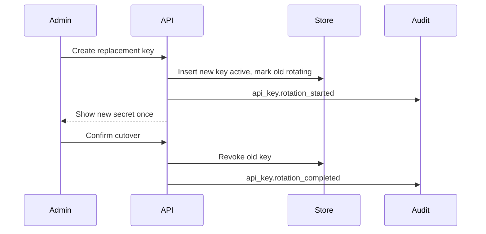

### Rotation invariant

> Rotation must not create an indefinite period where both old and new credentials remain valid without explicit expiry and audit.

---

## 22. Credential Revocation

Revocation means credential can no longer authenticate.

### Revocation causes

| Cause | Example |
|---|---|
| User action | user removes passkey |
| Admin action | admin disables API key |
| Risk action | leaked credential detected |
| Lifecycle action | expired credential |
| Tenant action | user removed from tenant |
| Employment action | staff offboarding |
| Federation action | external identity unlinked |
| Incident action | key compromise |

### Revocation scope

Revocation can affect:

- one credential,
- credential type,
- all credentials of account,
- all sessions of account,
- all refresh tokens,
- all service tokens,
- all tenant memberships,
- all accounts linked to external identity.

### Revocation data

```go
type CredentialRevocation struct {
    CredentialID CredentialID
    RevokedAt    time.Time
    RevokedBy    ActorRef
    Reason       RevocationReason
    EvidenceRef  *string
    PolicyID     *string
    Comment      string
}
```

### Revocation invariant

> Revocation is a security decision and must be auditable.

Never silently delete a credential that has been used. Deletion destroys forensic evidence. Prefer revocation + retention, then destroy after retention policy permits.

---

## 23. Compromise Handling

Credential compromise is not just `state = revoked`.

It is an incident workflow.

### Compromise response flow

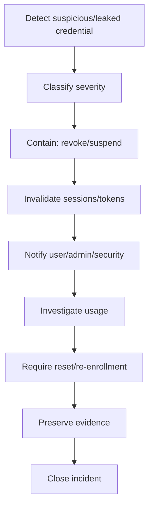

### Questions after compromise

- Which credential was compromised?
- When was it created?
- When was it last used?
- Which sessions/tokens were minted from it?
- Which resources were accessed?
- Which tenant was affected?
- Was actor same as subject?
- Were sensitive actions performed?
- Was MFA satisfied?
- Was the credential used from new device/IP/location?

### Credential-to-session correlation

When creating session, store authentication method references.

```go
type AuthEvent struct {
    ID              AuthEventID
    AccountID       AccountID
    SubjectID       SubjectID
    CredentialIDs   []CredentialID
    Methods         []AuthenticationMethod
    AssuranceLevel  AuthenticatorAssuranceLevel
    OccurredAt      time.Time
    RiskLevel       RiskLevel
}
```

Then session references auth event:

```go
type Session struct {
    ID          SessionID
    AccountID   AccountID
    AuthEventID AuthEventID
    CreatedAt   time.Time
    ExpiresAt   time.Time
    RevokedAt   *time.Time
}
```

This lets you answer:

> “Which active sessions were authenticated using credential X?”

Without this, compromise response becomes guesswork.

---

## 24. Session dan Token Invalidation Setelah Credential Event

Credential events should trigger session/token decisions.

### Event matrix

| Credential Event | Session Impact | Token Impact |
|---|---|---|
| Password changed voluntarily | revoke other sessions or require reauth | revoke refresh tokens depending policy |
| Password reset via recovery | revoke all sessions | revoke all refresh tokens |
| MFA enrolled | maybe keep session | update assurance for future only |
| MFA removed | require reauth / revoke risky sessions | reduce assurance / revoke sensitive tokens |
| Passkey added | notify, maybe no revoke | none unless high risk |
| Passkey revoked | revoke sessions authenticated by that passkey | revoke linked refresh tokens |
| API key revoked | no user session impact | immediately reject API key |
| Service secret rotated | allow overlap window | old tokens may continue until expiry unless introspected |
| Account compromised | revoke all | revoke all |

### Key design question

Can your system trace tokens back to credential/auth event?

If no, revocation becomes coarse:

```text
revoke all sessions for account
```

If yes, revocation can be precise:

```text
revoke sessions authenticated using compromised credential_id
```

### Token invalidation difficulty

Stateless JWTs are hard to revoke instantly unless you add:

- short TTL,
- token introspection,
- revocation list,
- session version,
- credential version,
- event-driven cache invalidation,
- gateway enforcement,
- or sender-constrained token.

This will be expanded in Part 011 and Part 030.

---

## 25. Audit Model untuk Credential Lifecycle

Credential lifecycle must be auditable.

Not only successful login.

### Required audit events

| Event | Why It Matters |
|---|---|
| credential.enrollment_started | detect malicious enrollment attempts |
| credential.bound | proof of control established |
| credential.activated | credential became usable |
| credential.authentication_succeeded | successful use |
| credential.authentication_failed | attack detection |
| credential.rotation_started | change tracking |
| credential.rotated | old/new linkage |
| credential.revoked | security evidence |
| credential.recovery_requested | account takeover signal |
| credential.recovery_completed | high-risk event |
| credential.mfa_removed | high-risk event |
| credential.passkey_added | high-risk event |
| credential.api_key_issued | sensitive service event |
| credential.api_key_used | attribution |

### Audit event shape

```go
type CredentialAuditEvent struct {
    EventID       string
    EventType     string
    OccurredAt    time.Time
    Actor         ActorRef
    Subject       SubjectRef
    AccountID     AccountID
    TenantID      *TenantID
    CredentialID  *CredentialID
    CredentialType *CredentialType
    AuthEventID   *AuthEventID
    SessionID     *SessionID
    PolicyVersion *string
    RiskLevel     RiskLevel
    Outcome       AuditOutcome
    Reason        string
    RequestID     string
    Source        RequestSource
}
```

### Actor vs subject

For self-service password change:

```text
actor = user A
subject = user A
```

For admin reset:

```text
actor = admin B
subject = user A
```

For service credential rotation by automation:

```text
actor = deployment pipeline/service
subject = service account X
```

This distinction is critical for forensic defensibility.

---

## 26. Data Model di Go

A clean model separates:

- generic credential record,
- type-specific secret/verifier,
- lifecycle state,
- audit events,
- policy decisions.

### Core types

```go
package identity

import "time"

type CredentialID string
type AccountID string
type SubjectID string
type TenantID string

type CredentialType string

const (
    CredentialPassword     CredentialType = "password"
    CredentialTOTP         CredentialType = "totp"
    CredentialRecoveryCode CredentialType = "recovery_code"
    CredentialWebAuthn     CredentialType = "webauthn"
    CredentialAPIKey       CredentialType = "api_key"
    CredentialExternalOIDC CredentialType = "external_oidc"
    CredentialServiceKey   CredentialType = "service_key"
)

type CredentialState string

const (
    CredentialProposed            CredentialState = "proposed"
    CredentialPendingVerification CredentialState = "pending_verification"
    CredentialBound               CredentialState = "bound"
    CredentialActive              CredentialState = "active"
    CredentialSuspended           CredentialState = "suspended"
    CredentialRotating            CredentialState = "rotating"
    CredentialSuperseded          CredentialState = "superseded"
    CredentialRevoked             CredentialState = "revoked"
    CredentialRetainedForAudit    CredentialState = "retained_for_audit"
)

type Credential struct {
    ID             CredentialID
    AccountID      AccountID
    SubjectID      SubjectID
    TenantID       *TenantID
    Type           CredentialType
    State          CredentialState
    Assurance      AssuranceLevel
    CreatedAt      time.Time
    ActivatedAt    *time.Time
    LastUsedAt     *time.Time
    RevokedAt      *time.Time
    Version        int64
}

type AssuranceLevel string

const (
    AssuranceUnknown AssuranceLevel = "unknown"
    AssuranceAAL1    AssuranceLevel = "aal1"
    AssuranceAAL2    AssuranceLevel = "aal2"
    AssuranceAAL3    AssuranceLevel = "aal3"
)
```

### State transition guard

```go
func CanTransitionCredential(from, to CredentialState) bool {
    allowed := map[CredentialState]map[CredentialState]bool{
        CredentialProposed: {
            CredentialPendingVerification: true,
            CredentialRevoked:             true,
        },
        CredentialPendingVerification: {
            CredentialBound:   true,
            CredentialRevoked: true,
        },
        CredentialBound: {
            CredentialActive:  true,
            CredentialRevoked: true,
        },
        CredentialActive: {
            CredentialSuspended:  true,
            CredentialRotating:   true,
            CredentialRevoked:    true,
            CredentialSuperseded: true,
        },
        CredentialSuspended: {
            CredentialActive:  true,
            CredentialRevoked: true,
        },
        CredentialRotating: {
            CredentialSuperseded: true,
            CredentialRevoked:    true,
        },
        CredentialSuperseded: {
            CredentialRetainedForAudit: true,
        },
        CredentialRevoked: {
            CredentialRetainedForAudit: true,
        },
    }

    return allowed[from][to]
}
```

Do not scatter lifecycle transition rules across handlers.

Centralize them.

---

## 27. Relational Schema Reference

This is a conceptual schema, not vendor-specific.

```sql
CREATE TABLE credentials (
    id                 VARCHAR(64) PRIMARY KEY,
    account_id          VARCHAR(64) NOT NULL,
    subject_id          VARCHAR(64) NOT NULL,
    tenant_id           VARCHAR(64),
    credential_type     VARCHAR(64) NOT NULL,
    state               VARCHAR(64) NOT NULL,
    assurance_level     VARCHAR(32) NOT NULL,
    created_at          TIMESTAMP NOT NULL,
    activated_at        TIMESTAMP NULL,
    last_used_at        TIMESTAMP NULL,
    revoked_at          TIMESTAMP NULL,
    revoked_reason      VARCHAR(128) NULL,
    version             BIGINT NOT NULL DEFAULT 1
);

CREATE INDEX idx_credentials_account_type_state
    ON credentials(account_id, credential_type, state);

CREATE INDEX idx_credentials_tenant_account
    ON credentials(tenant_id, account_id);
```

Password verifier:

```sql
CREATE TABLE password_credentials (
    credential_id      VARCHAR(64) PRIMARY KEY,
    algorithm          VARCHAR(64) NOT NULL,
    params             TEXT NOT NULL,
    salt               BYTEA NOT NULL,
    verifier_hash      BYTEA NOT NULL,
    created_at         TIMESTAMP NOT NULL,
    FOREIGN KEY (credential_id) REFERENCES credentials(id)
);
```

Recovery tokens:

```sql
CREATE TABLE recovery_tokens (
    id                 VARCHAR(64) PRIMARY KEY,
    account_id          VARCHAR(64) NOT NULL,
    tenant_id           VARCHAR(64),
    purpose             VARCHAR(64) NOT NULL,
    token_hash          BYTEA NOT NULL,
    created_at          TIMESTAMP NOT NULL,
    expires_at          TIMESTAMP NOT NULL,
    consumed_at         TIMESTAMP NULL,
    revoked_at          TIMESTAMP NULL,
    risk_level          VARCHAR(32) NOT NULL
);

CREATE UNIQUE INDEX ux_recovery_tokens_hash_active
    ON recovery_tokens(token_hash)
    WHERE consumed_at IS NULL AND revoked_at IS NULL;
```

WebAuthn credential:

```sql
CREATE TABLE webauthn_credentials (
    credential_id       VARCHAR(64) PRIMARY KEY,
    webauthn_cred_id    BYTEA NOT NULL UNIQUE,
    user_handle         BYTEA NOT NULL,
    public_key_cose     BYTEA NOT NULL,
    rp_id               VARCHAR(255) NOT NULL,
    sign_count          BIGINT NOT NULL,
    aaguid              BYTEA NULL,
    transports          TEXT NULL,
    attestation_type    VARCHAR(64) NULL,
    backup_eligible     BOOLEAN NULL,
    backup_state        BOOLEAN NULL,
    FOREIGN KEY (credential_id) REFERENCES credentials(id)
);
```

API keys:

```sql
CREATE TABLE api_key_credentials (
    credential_id       VARCHAR(64) PRIMARY KEY,
    key_prefix          VARCHAR(64) NOT NULL,
    secret_hash         BYTEA NOT NULL,
    display_name        VARCHAR(255) NOT NULL,
    scopes              TEXT NOT NULL,
    expires_at          TIMESTAMP NULL,
    last_used_ip_hash   BYTEA NULL,
    FOREIGN KEY (credential_id) REFERENCES credentials(id)
);

CREATE INDEX idx_api_keys_prefix
    ON api_key_credentials(key_prefix);
```

### Schema invariant

> Type-specific tables store verifier material. Generic `credentials` table stores lifecycle, ownership, and audit joinability.

---

## 28. Service Interface Design

Avoid handler-driven credential logic.

Bad:

```go
func ResetPasswordHandler(w http.ResponseWriter, r *http.Request) {
    // parse token
    // update password
    // delete token
    // revoke sessions
    // send email
    // log audit
}
```

Better:

```go
type CredentialService interface {
    StartPasswordReset(ctx context.Context, cmd StartPasswordResetCommand) error
    CompletePasswordReset(ctx context.Context, cmd CompletePasswordResetCommand) error
    ChangePassword(ctx context.Context, cmd ChangePasswordCommand) error

    StartTOTPEnrollment(ctx context.Context, cmd StartTOTPEnrollmentCommand) (*TOTPEnrollmentChallenge, error)
    CompleteTOTPEnrollment(ctx context.Context, cmd CompleteTOTPEnrollmentCommand) error
    RevokeCredential(ctx context.Context, cmd RevokeCredentialCommand) error

    IssueAPIKey(ctx context.Context, cmd IssueAPIKeyCommand) (*IssuedAPIKey, error)
    RotateAPIKey(ctx context.Context, cmd RotateAPIKeyCommand) (*IssuedAPIKey, error)
}
```

### Command object pattern

```go
type CompletePasswordResetCommand struct {
    TenantID       *TenantID
    RawToken       string
    NewPassword    []byte
    RequestSource  RequestSource
    CorrelationID  string
}
```

This improves:

- testing,
- audit consistency,
- transaction boundary,
- policy enforcement,
- reuse across HTTP/gRPC/worker.

---

## 29. Registration Implementation Skeleton

```go
type RegistrationService struct {
    tx          TxManager
    accounts    AccountRepository
    credentials CredentialRepository
    passwords   PasswordHasher
    risk        RiskEvaluator
    audit       AuditSink
    clock       Clock
}

func (s *RegistrationService) RegisterWithPassword(
    ctx context.Context,
    cmd RegisterWithPasswordCommand,
) (*RegistrationResult, error) {
    now := s.clock.Now()

    riskDecision, err := s.risk.EvaluateRegistration(ctx, RegistrationRiskInput{
        Email:         cmd.Email,
        RequestSource: cmd.RequestSource,
        TenantID:      cmd.TenantID,
    })
    if err != nil {
        return nil, err
    }
    if riskDecision.Block {
        return nil, ErrRegistrationBlocked
    }

    var result *RegistrationResult

    err = s.tx.WithTx(ctx, func(ctx context.Context) error {
        account, err := s.accounts.CreateCandidate(ctx, CreateAccountInput{
            TenantID: cmd.TenantID,
            Email:    cmd.Email,
            Now:      now,
        })
        if err != nil {
            return err
        }

        encoded, err := s.passwords.Hash(ctx, cmd.Password)
        if err != nil {
            return err
        }

        cred, err := s.credentials.CreatePasswordCredential(ctx, CreatePasswordCredentialInput{
            AccountID: account.ID,
            SubjectID: account.SubjectID,
            TenantID:  cmd.TenantID,
            State:     CredentialPendingVerification,
            Verifier:  encoded,
            CreatedAt: now,
        })
        if err != nil {
            return err
        }

        if err := s.audit.Record(ctx, AuditEvent{
            Type:         "registration.started",
            AccountID:    account.ID,
            CredentialID: &cred.ID,
            Outcome:      AuditSuccess,
            OccurredAt:   now,
        }); err != nil {
            return err
        }

        result = &RegistrationResult{
            AccountID:    account.ID,
            CredentialID: cred.ID,
            NextStep:     "verify_email",
        }
        return nil
    })
    if err != nil {
        return nil, err
    }

    return result, nil
}
```

Notes:

- Email verification could activate account later.
- Password can be stored but account may remain unverified.
- Avoid logging raw password.
- Risk decision happens before expensive operations.
- Do not reveal duplicate account details in public response.

---

## 30. Binding Implementation Skeleton

Example: email verification binds email recovery channel.

```go
func (s *CredentialService) CompleteEmailVerification(
    ctx context.Context,
    cmd CompleteEmailVerificationCommand,
) error {
    now := s.clock.Now()
    tokenHash := hashRecoveryToken([]byte(cmd.RawToken))

    return s.tx.WithTx(ctx, func(ctx context.Context) error {
        token, err := s.tokens.FindActiveByHashForUpdate(ctx, tokenHash, now)
        if err != nil {
            return ErrInvalidOrExpiredVerificationToken
        }
        if token.Purpose != PurposeEmailVerification {
            return ErrInvalidOrExpiredVerificationToken
        }

        cred, err := s.credentials.GetForUpdate(ctx, token.CredentialID)
        if err != nil {
            return err
        }
        if cred.State != CredentialPendingVerification {
            return ErrInvalidCredentialState
        }

        if err := s.credentials.Transition(ctx, cred.ID, CredentialBound, now); err != nil {
            return err
        }
        if err := s.credentials.Transition(ctx, cred.ID, CredentialActive, now); err != nil {
            return err
        }
        if err := s.tokens.MarkConsumed(ctx, token.ID, now); err != nil {
            return err
        }

        return s.audit.Record(ctx, AuditEvent{
            Type:         "credential.email.verified",
            AccountID:    cred.AccountID,
            CredentialID: &cred.ID,
            OccurredAt:   now,
            Outcome:      AuditSuccess,
        })
    })
}
```

Important:

- Use `FOR UPDATE` or equivalent optimistic concurrency.
- Verification token must be single-use.
- State transition must be guarded.
- Audit inside or reliably coupled with transaction.

---

## 31. Recovery Implementation Skeleton

Start reset must not leak account existence.

```go
func (s *RecoveryService) StartPasswordReset(
    ctx context.Context,
    cmd StartPasswordResetCommand,
) error {
    now := s.clock.Now()

    // Always return generic success to caller.
    // Internally, only create token if account exists and policy allows.
    account, err := s.accounts.FindByLoginIdentifier(ctx, cmd.Identifier)
    if err != nil {
        if errors.Is(err, ErrAccountNotFound) {
            s.delay.Equalize(ctx)
            return nil
        }
        return err
    }

    risk, err := s.risk.EvaluateRecoveryRequest(ctx, RecoveryRiskInput{
        AccountID:     account.ID,
        RequestSource: cmd.RequestSource,
        Purpose:       PurposePasswordReset,
    })
    if err != nil {
        return err
    }
    if risk.Block {
        _ = s.audit.Record(ctx, AuditEvent{
            Type:      "credential.password_reset_blocked",
            AccountID: account.ID,
            Outcome:   AuditDenied,
            OccurredAt: now,
        })
        return nil
    }

    raw, hash, err := GenerateRecoveryToken()
    if err != nil {
        return err
    }

    err = s.tx.WithTx(ctx, func(ctx context.Context) error {
        token, err := s.tokens.Create(ctx, CreateRecoveryTokenInput{
            AccountID: account.ID,
            Purpose:   PurposePasswordReset,
            Hash:      hash,
            CreatedAt: now,
            ExpiresAt: now.Add(15 * time.Minute),
            RiskLevel: risk.Level,
        })
        if err != nil {
            return err
        }

        if err := s.audit.Record(ctx, AuditEvent{
            Type:      "credential.password_reset_requested",
            AccountID: account.ID,
            TokenID:   token.ID.String(),
            Outcome:   AuditSuccess,
            OccurredAt: now,
        }); err != nil {
            return err
        }

        return s.outbox.Enqueue(ctx, SendPasswordResetEmail{
            AccountID: account.ID,
            Email:     account.Email,
            RawToken:  raw,
        })
    })
    if err != nil {
        return err
    }

    return nil
}
```

### Response policy

User-facing response:

```text
If an account exists for that identifier, recovery instructions will be sent.
```

Do not say:

```text
Email not found.
```

for public reset flows.

---

## 32. Revocation Implementation Skeleton

```go
func (s *CredentialService) RevokeCredential(
    ctx context.Context,
    cmd RevokeCredentialCommand,
) error {
    now := s.clock.Now()

    return s.tx.WithTx(ctx, func(ctx context.Context) error {
        cred, err := s.credentials.GetForUpdate(ctx, cmd.CredentialID)
        if err != nil {
            return err
        }

        if cred.State == CredentialRevoked {
            return nil
        }
        if !CanTransitionCredential(cred.State, CredentialRevoked) {
            return ErrInvalidCredentialState
        }

        decision, err := s.policy.CanRevokeCredential(ctx, RevokeCredentialPolicyInput{
            Actor:      cmd.Actor,
            Credential: cred,
            Reason:     cmd.Reason,
        })
        if err != nil {
            return err
        }
        if !decision.Allow {
            return ErrForbidden
        }

        if err := s.credentials.MarkRevoked(ctx, cred.ID, MarkRevokedInput{
            RevokedAt: now,
            RevokedBy: cmd.Actor,
            Reason:    cmd.Reason,
        }); err != nil {
            return err
        }

        if cmd.RevokeSessions {
            if err := s.sessions.RevokeByCredential(ctx, cred.ID, now); err != nil {
                return err
            }
        }

        return s.audit.Record(ctx, AuditEvent{
            Type:         "credential.revoked",
            Actor:        cmd.Actor,
            AccountID:    cred.AccountID,
            CredentialID: &cred.ID,
            Outcome:      AuditSuccess,
            Reason:       string(cmd.Reason),
            OccurredAt:   now,
        })
    })
}
```

Policy questions:

- Can user revoke their own last MFA factor?
- Can admin revoke another admin’s passkey?
- Can support revoke credential without approval?
- Can service credential be revoked during active deployment?
- Does revocation need session invalidation?

---

## 33. Abuse Resistance: Enumeration, Brute Force, Credential Stuffing

Credential lifecycle endpoints are abuse targets.

### Common target endpoints

| Endpoint | Abuse |
|---|---|
| registration | fake accounts, email bombing |
| login | credential stuffing, brute force |
| forgot password | account enumeration, inbox flooding |
| reset password | token brute force, replay |
| MFA verify | OTP brute force |
| MFA reset | social engineering |
| API key create | privilege abuse |
| API key authenticate | leaked key replay |
| passkey registration | malicious credential binding |

### Controls

- rate limit by IP, account, tenant, device, ASN, credential ID,
- generic responses,
- challenge escalation,
- proof-of-work or CAPTCHA only where appropriate,
- anomaly detection,
- email throttling,
- token expiry,
- single-use tokens,
- notification after sensitive changes,
- lockout carefully designed to avoid denial of service,
- separate rate limits for existing vs unknown accounts internally but same external response.

### Anti-enumeration pattern

```go
func GenericRecoveryResponse() RecoveryResponse {
    return RecoveryResponse{
        Message: "If an account exists for that identifier, recovery instructions will be sent.",
    }
}
```

But internal audit should still distinguish:

```text
recovery.requested.account_found
recovery.requested.account_not_found
```

External ambiguity does not mean internal blindness.

---

## 34. Distributed Systems Problems

Credential lifecycle gets harder in distributed systems.

### Problem 1: Stale credential state

Service A caches credential active.

Credential revoked.

Service A still accepts it for 5 minutes.

Question:

> Is 5-minute revocation lag acceptable?

For API key with low privilege maybe yes. For compromised admin credential maybe no.

### Problem 2: Session revocation propagation

Password reset completes in auth service, but API gateway still accepts old token.

Mitigations:

- short access token TTL,
- refresh token revocation,
- session version in token,
- revocation cache,
- token introspection,
- event-driven invalidation,
- gateway-side session lookup for high-risk operations.

### Problem 3: Concurrent credential changes

User changes password while admin disables account.

Need:

- transaction isolation,
- optimistic locking,
- state transition guard,
- deterministic conflict handling.

### Problem 4: Outbox reliability

Password reset succeeds but notification fails.

Need:

- outbox pattern,
- retry,
- notification status,
- audit event independent from email delivery.

### Problem 5: Read replica lag

Login checks credential state from replica that is behind primary.

Mitigation:

- use primary for credential verification,
- or route recent account changes to primary,
- or include credential version checks.

### Problem 6: Clock skew

Recovery token expiry depends on time.

Mitigation:

- centralized trusted time source,
- reasonable skew tolerance,
- use server-side timestamps,
- never trust client expiry.

---

## 35. Multi-Tenant Credential Lifecycle

Credential can be global or tenant-bound.

### Model choices

| Model | Description | Risk |
|---|---|---|
| Global credential | one login credential across tenants | tenant isolation must be in authorization |
| Tenant-bound credential | credential valid only in one tenant | operational complexity |
| Hybrid | global identity, tenant-specific membership/role | common enterprise model |

### Example

A regulatory officer may have one identity but multiple tenant contexts:

```text
subject: user-123
account: account-abc
tenant memberships:
  - agency-A: investigator
  - agency-B: reviewer
credentials:
  - password global
  - passkey global
  - admin hardware key only valid for agency-A high-risk operations
```

Credential authentication answers:

```text
This is user-123 with AAL2.
```

Authorization must still answer:

```text
Can user-123 act as reviewer on case-789 in tenant agency-B at workflow stage appeal_review?
```

Do not encode tenant authority in credential unless intentionally designing tenant-bound credentials.

### Multi-tenant recovery risk

If global password reset compromises account, all tenants may be affected.

Options:

- global reset revokes sessions across all tenants,
- tenant-specific high-risk actions require step-up,
- tenant admin cannot reset global credential unless authorized,
- external enterprise tenant may own recovery through IdP,
- recovery audit must include tenant impact.

---

## 36. Regulatory and Forensic Defensibility

In regulatory systems, credential lifecycle must support evidence.

You may need to prove:

- who created credential,
- who approved it,
- what proof was used,
- what policy was in force,
- when credential became active,
- when credential was used,
- whether MFA was satisfied,
- whether actor and subject differed,
- whether session/token was derived from compromised credential,
- whether revoked credential could still access system.

### Evidence chain

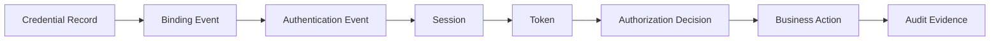

If any link is missing, forensic reconstruction weakens.

### Evidence design principle

> Do not store only the final state. Store meaningful lifecycle events.

Bad:

```text
credential.state = active
```

Better:

```text
credential.created
credential.binding_challenge_issued
credential.binding_verified
credential.activated
credential.used
credential.revoked
```

---

## 37. Failure Modes

### Failure mode matrix

| Failure | Root Cause | Impact | Prevention |
|---|---|---|---|
| Pending credential accepted | state not checked | bypass verification | active-only invariant |
| Reset token reusable | no atomic consume | account takeover | single-use + transaction |
| Password reset leaks account existence | different response | enumeration | generic response + timing control |
| MFA reset weaker than MFA | poor recovery design | ATO | recovery assurance policy |
| API key stored plaintext | bad storage | mass compromise | hash/verifier only |
| Revoked credential still accepted | cache lag | unauthorized access | TTL/introspection/revocation cache |
| No actor/subject distinction | audit model weak | impossible forensics | actor-subject audit model |
| Admin can disable last MFA silently | weak policy | privilege abuse | dual control/notification |
| Old sessions survive compromise | no session link | persistence | auth-event/session correlation |
| Duplicate identity binding | no external identity uniqueness | account confusion | unique issuer-sub binding |

### Top 5 practical bugs

1. Treating email verification as identity proofing.
2. Letting password reset bypass MFA without additional controls.
3. Storing API keys in plaintext.
4. Deleting credential records instead of revoking them.
5. Failing to revoke sessions after recovery-based reset.

---

## 38. Anti-Patterns

### Anti-pattern 1: `users.password_hash` only

```sql
ALTER TABLE users ADD COLUMN password_hash TEXT;
```

This makes it hard to:

- support multiple credentials,
- audit password changes,
- rotate verifier algorithms,
- disable password auth while keeping passkeys,
- support tenant-specific credential policy.

### Anti-pattern 2: Recovery as support convenience

```text
Support can remove MFA after user emails screenshot of ID.
```

Without structured policy and audit, this becomes social engineering path.

### Anti-pattern 3: Credential state as boolean

```go
MFAEnabled bool
```

This cannot represent:

- pending enrollment,
- suspended factor,
- revoked factor,
- replacement required,
- multiple MFA devices.

### Anti-pattern 4: API key == user

```go
userID := lookupUserByAPIKey(key)
```

Better:

```go
principal := APIKeyPrincipal{
    Subject: serviceOrUserSubject,
    CredentialID: keyID,
    Scopes: scopes,
    TenantID: tenantID,
}
```

API key is credential. It may represent user, service, integration, tenant, or automation.

### Anti-pattern 5: “Logout clears everything”

Logout affects session.

It does not revoke credential unless explicitly designed.

### Anti-pattern 6: Silent credential changes

Sensitive credential lifecycle events should notify user/admin/security depending risk.

Silent credential changes are attacker-friendly.

---

## 39. Production Checklist

### Lifecycle model

- [ ] Credential has explicit type.
- [ ] Credential has explicit state.
- [ ] Only active credentials authenticate.
- [ ] State transitions are centralized.
- [ ] Credential history is auditable.
- [ ] Credential deletion is separated from revocation.

### Registration

- [ ] Registration has anti-automation controls.
- [ ] Duplicate identity logic is defined.
- [ ] Email/phone verification is not treated as legal identity proof.
- [ ] Account activation is policy-driven.

### Binding

- [ ] Enrollment, binding, activation are separate.
- [ ] Proof of control is recorded.
- [ ] Binding method is auditable.
- [ ] Pending credentials expire.

### Recovery

- [ ] Recovery response does not enumerate accounts.
- [ ] Recovery tokens are single-use.
- [ ] Recovery tokens expire.
- [ ] Recovery tokens are stored hashed.
- [ ] Reset completion invalidates relevant sessions/tokens.
- [ ] MFA reset has stronger policy than password reset.

### Rotation

- [ ] Rotation has explicit overlap window if any.
- [ ] Old credential revocation is enforced.
- [ ] API key/service credential rotation is operationally safe.
- [ ] Rotation events are audited.

### Revocation

- [ ] Revocation reason is captured.
- [ ] Revocation actor is captured.
- [ ] Revocation affects sessions/tokens according to policy.
- [ ] Revocation propagates within acceptable time.

### Audit

- [ ] Actor and subject are separated.
- [ ] Credential ID is linked to auth events.
- [ ] Auth events link to sessions.
- [ ] Sessions/tokens link to authorization decisions where required.
- [ ] Sensitive lifecycle events trigger notification.

### Distributed systems

- [ ] Credential verification does not rely on stale replicas for high-risk paths.
- [ ] Cache TTLs are risk-based.
- [ ] Outbox exists for notification/audit side effects.
- [ ] Idempotency is handled for token consumption and revocation.

---

## 40. Mini Case Study: Regulatory Case Management Platform

Bayangkan platform case management regulatory multi-tenant.

Actors:

- public applicant,
- licensed officer,
- agency investigator,
- supervisor,
- legal reviewer,
- system integration service,
- support admin,
- emergency break-glass admin.

Credential types:

- public user password + email recovery,
- officer enterprise SSO,
- investigator passkey + TOTP,
- supervisor passkey required for approval,
- service account mTLS/SPIFFE,
- API key for legacy integration,
- break-glass hardware key.

### Bad design

```text
One users table.
One password_hash.
One is_mfa_enabled boolean.
Admin can reset anyone.
Sessions persist after reset.
Audit only records login success.
```

Consequences:

- cannot prove who reset whose credential,
- cannot separate support action from user action,
- cannot tell which credential created a session,
- cannot revoke only compromised passkey,
- cannot enforce supervisor high-assurance step-up,
- cannot defend tenant boundary during recovery.

### Better design

```text
identity_subjects
accounts
credentials
credential_bindings
recovery_tokens
auth_events
sessions
session_revocations
credential_audit_events
policy_decisions
```

### Example high-risk operation

Supervisor approves enforcement escalation.

Requirement:

- user authenticated,
- current tenant membership active,
- role supervisor for case tenant,
- session has recent AAL2 or AAL3,
- credential not recovery-only,
- no recent risky recovery event,
- authorization decision logged with policy version.

Flow:

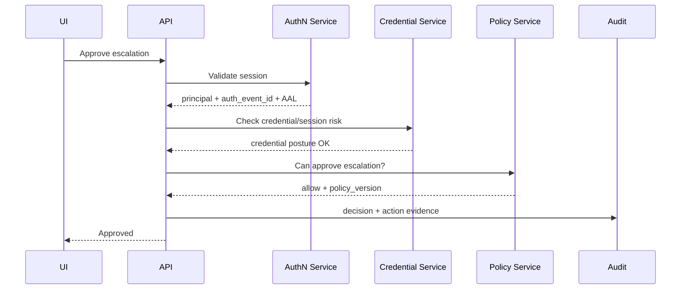

If password was reset 3 minutes ago through email-only recovery, policy may require step-up or cooling-off:

```text
Deny: recent_recovery_event_requires_step_up
```

This is what mature auth design looks like: credential lifecycle affects authorization decision, not just login.

---

## 41. Review Questions

Use these to test understanding.

1. Why is password reset an authentication path, not just account management?
2. What is the difference between credential enrollment, binding, and activation?
3. Why should recovery codes be stored hashed?
4. When should password reset revoke sessions?
5. How would you model multiple passkeys for one account?
6. What is the difference between revoking credential and logging out?
7. Why is deleting credential records dangerous for forensics?
8. How do you prevent reset token replay?
9. What happens if credential state is cached for 10 minutes?
10. How do you trace a compromised credential to sessions and actions?
11. Why is `MFAEnabled bool` insufficient?
12. How would you support API key rotation without downtime?
13. Why is email verification not identity proofing?
14. How should admin-initiated reset differ from user-initiated reset?
15. What should happen after user loses all passkeys?

---

## 42. Ringkasan

Credential lifecycle is the backbone of authentication architecture.

Core mental models:

- Credential is not session.
- Credential is not token.
- Credential is not role.
- Credential is not identity.
- Credential has lifecycle state.
- Recovery is alternate authentication.
- Binding requires proof of control.
- Activation is policy decision.
- Revocation must be auditable.
- Credential events affect session/token posture.
- Distributed systems make revocation and consistency hard.
- Regulatory systems require evidence chain.

Core invariants:

1. Only active credentials may authenticate.
2. Enrollment, binding, and activation must be separate concepts.
3. Recovery must not be weaker than the account value requires.
4. Reset/recovery tokens must be single-use, expiring, and stored as verifiers.
5. Credential revocation must have actor, reason, timestamp, and effect scope.
6. Credential events must be linked to auth events, sessions, and audit.
7. Actor and subject must be distinct in audit model.
8. Deleting used credentials destroys evidence; revoke first, retain, then destroy by policy.

Top 1% engineer angle:

> A basic engineer implements `/forgot-password`.  
> A senior engineer implements safe token generation and hashing.  
> A principal-level engineer models recovery as a high-risk alternate authentication ceremony, links it to assurance, session revocation, audit evidence, policy decisioning, abuse controls, and incident response.

---

## 43. Referensi Primer

Referensi ini dipakai sebagai basis faktual dan akan terus muncul di part berikutnya:

1. Go 1.26 Release Notes  
   https://go.dev/doc/go1.26

2. NIST SP 800-63B-4 — Digital Identity Guidelines: Authentication and Authenticator Management  
   https://pages.nist.gov/800-63-4/sp800-63b.html

3. NIST SP 800-63-4 landing page  
   https://pages.nist.gov/800-63-4/

4. OWASP Authentication Cheat Sheet  
   https://cheatsheetseries.owasp.org/cheatsheets/Authentication_Cheat_Sheet.html

5. OWASP Forgot Password Cheat Sheet  
   https://cheatsheetseries.owasp.org/cheatsheets/Forgot_Password_Cheat_Sheet.html

6. OWASP Multifactor Authentication Cheat Sheet  
   https://cheatsheetseries.owasp.org/cheatsheets/Multifactor_Authentication_Cheat_Sheet.html

7. OWASP ASVS Authentication Requirements  
   https://github.com/OWASP/ASVS/blob/master/4.0/en/0x11-V2-Authentication.md

8. OWASP ASVS Session Management Requirements  
   https://github.com/OWASP/ASVS/blob/master/4.0/en/0x12-V3-Session-management.md

9. W3C Web Authentication Level 3  
   https://www.w3.org/TR/webauthn-3/

10. RFC 7519 — JSON Web Token  
    https://www.rfc-editor.org/rfc/rfc7519

11. RFC 9700 — Best Current Practice for OAuth 2.0 Security  
    https://www.rfc-editor.org/rfc/rfc9700

---

## Status Seri

Seri **belum selesai**.

Part yang sudah dibuat:

- `part-000` — Orientation Handbook
- `part-001` — Mental Model: Identity, Authentication, Authorization, Permission
- `part-002` — Threat Model untuk Auth System
- `part-003` — Identity Domain Model
- `part-004` — Credential Lifecycle: Registration, Binding, Recovery, Rotation, Revocation

Part berikutnya:

- `part-005` — Assurance Levels: IAL, AAL, FAL, Risk-Based Authentication


<!-- NAVIGATION_FOOTER -->
<div class="page-nav">
<a href="./learn-go-authentication-authorization-identity-permission-part-003.md">⬅️ Part 003 — Identity Domain Model: User, Principal, Subject, Actor, Account, Tenant</a>
<a href="./index.md">📚 Kategori</a>
<a href="../../index.md">🏠 Home</a>
<a href="./learn-go-authentication-authorization-identity-permission-part-005.md">Part 005 — Assurance Levels: IAL, AAL, FAL, Risk-Based Authentication ➡️</a>
</div>
