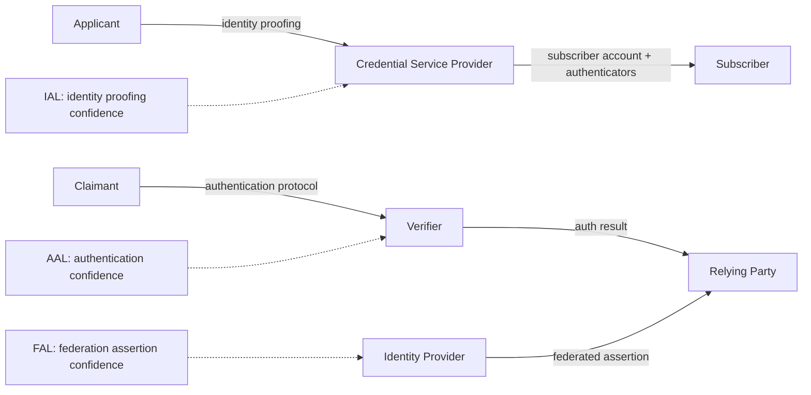
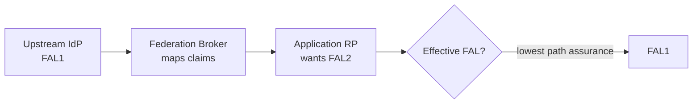
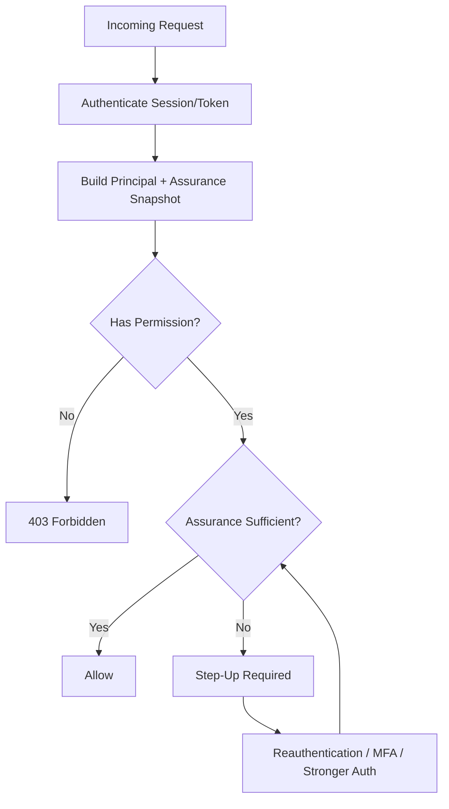
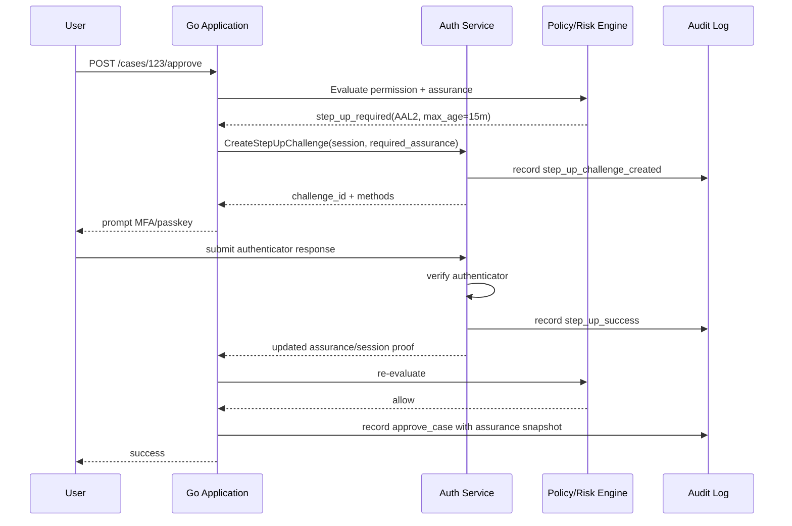
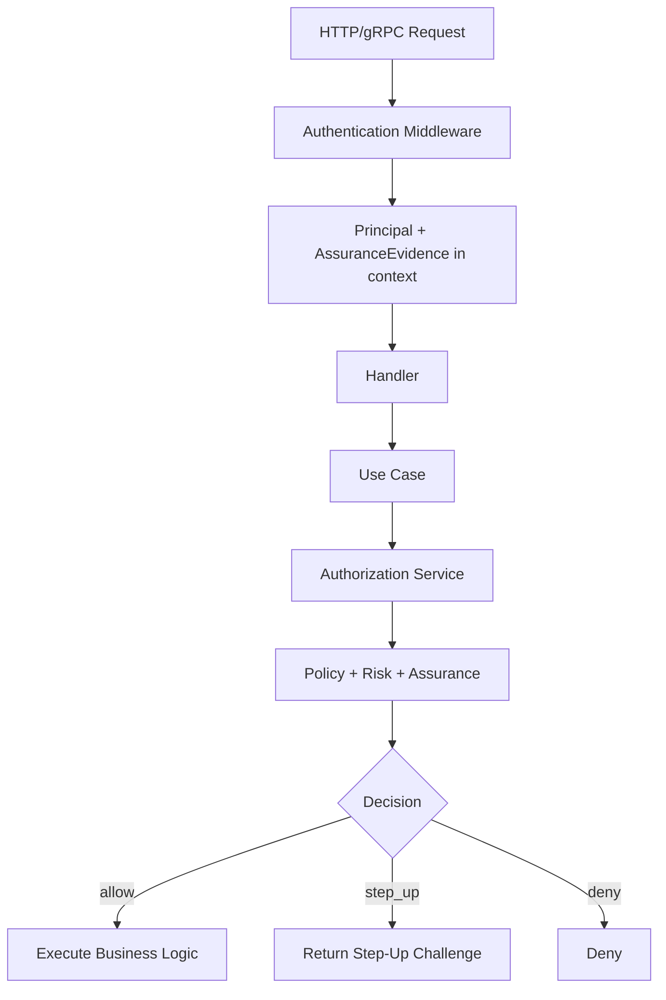
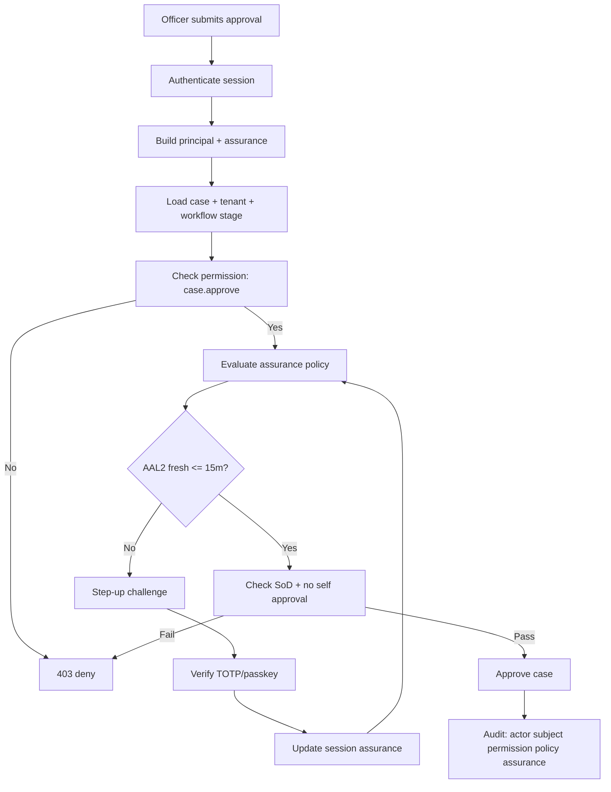

# learn-go-authentication-authorization-identity-permission-part-005.md

# Part 005 — Assurance Levels: IAL, AAL, FAL, Risk-Based Authentication

> Seri: **learn-go-authentication-authorization-identity-permission**  
> Fokus: **Go Authentication, Authorization, Identity, Permission, Assurance Engineering**  
> Target: Go **1.26.x**  
> Status seri: **belum selesai**  
> Bagian sebelumnya: `part-004` — Credential Lifecycle  
> Bagian ini: `part-005` — Assurance Levels  
> Bagian berikutnya: `part-006` — Password Authentication di Go

---

## Ringkasan Eksekutif

Banyak engineer menganggap authentication sebagai nilai boolean:

```text
isAuthenticated = true | false
```

Untuk aplikasi kecil, mental model ini sering terasa cukup. Untuk sistem enterprise, regulatory, multi-tenant, federated, atau high-risk, model boolean ini berbahaya.

Pertanyaan yang benar bukan hanya:

```text
Apakah user sudah login?
```

Pertanyaan yang lebih akurat adalah:

```text
Siapa subjek ini?
Seberapa kuat kita yakin identitas real-world-nya benar?
Seberapa kuat kita yakin ia sedang mengontrol authenticator yang sah?
Dari federasi mana assertion ini datang?
Seberapa kuat federation transaction-nya?
Apakah confidence tersebut cukup untuk aksi ini, resource ini, tenant ini, dan risiko saat ini?
```

Di sinilah konsep assurance level menjadi penting.

Dalam NIST SP 800-63-4, assurance dibagi menjadi tiga dimensi besar:

| Dimensi | Nama | Pertanyaan Utama |
|---|---|---|
| IAL | Identity Assurance Level | Seberapa kuat proses identity proofing terhadap orang tersebut? |
| AAL | Authentication Assurance Level | Seberapa kuat proses authentication saat ini? |
| FAL | Federation Assurance Level | Seberapa kuat assertion/federation transaction antara IdP dan RP? |

Bagian ini tidak hanya menjelaskan definisi. Kita akan membangun mental model engineering untuk menerjemahkan assurance ke desain Go:

- type modelling
- domain boundary
- session claims
- token claims
- OIDC mapping
- step-up authentication
- risk-based authentication
- authorization integration
- audit evidence
- fallback behavior
- distributed-system failure modes

Tujuan akhirnya: kamu tidak hanya tahu istilah IAL/AAL/FAL, tapi mampu mendesain sistem yang bisa menjawab:

> “Untuk aksi ini, pada resource ini, di tenant ini, apakah current subject memiliki assurance yang cukup? Kalau tidak, bagaimana sistem menaikkan assurance secara aman, auditable, dan tidak merusak user journey?”

---

## Daftar Isi

1. [Kenapa Assurance Level Penting](#1-kenapa-assurance-level-penting)
2. [Kesalahan Mental Model: Login Bukan Satu Level](#2-kesalahan-mental-model-login-bukan-satu-level)
3. [NIST SP 800-63-4 sebagai Kerangka Kerja](#3-nist-sp-800-63-4-sebagai-kerangka-kerja)
4. [IAL — Identity Assurance Level](#4-ial--identity-assurance-level)
5. [AAL — Authentication Assurance Level](#5-aal--authentication-assurance-level)
6. [FAL — Federation Assurance Level](#6-fal--federation-assurance-level)
7. [Assurance Vector: Jangan Jadikan Assurance Satu Angka](#7-assurance-vector-jangan-jadikan-assurance-satu-angka)
8. [Assurance vs Authorization](#8-assurance-vs-authorization)
9. [Risk-Based Authentication](#9-risk-based-authentication)
10. [Step-Up Authentication](#10-step-up-authentication)
11. [Go Domain Model untuk Assurance](#11-go-domain-model-untuk-assurance)
12. [Representasi Assurance di Session dan Token](#12-representasi-assurance-di-session-dan-token)
13. [OIDC `acr`, `amr`, `auth_time`, dan Assurance Mapping](#13-oidc-acr-amr-auth_time-dan-assurance-mapping)
14. [Policy Design: Required Assurance per Action](#14-policy-design-required-assurance-per-action)
15. [Middleware dan Enforcement di Go](#15-middleware-dan-enforcement-di-go)
16. [Assurance di Multi-Service Architecture](#16-assurance-di-multi-service-architecture)
17. [Auditability: Membuktikan Assurance Saat Keputusan Dibuat](#17-auditability-membuktikan-assurance-saat-keputusan-dibuat)
18. [Failure Modes dan Attack Scenarios](#18-failure-modes-dan-attack-scenarios)
19. [Case Study: Regulatory Case Management](#19-case-study-regulatory-case-management)
20. [Production Checklist](#20-production-checklist)
21. [Review Questions](#21-review-questions)
22. [Referensi Primer](#22-referensi-primer)

---

# 1. Kenapa Assurance Level Penting

## 1.1 Auth system bukan hanya “gerbang masuk”

Dalam sistem sederhana, authentication dianggap seperti pintu masuk:

```text
belum login -> login -> boleh masuk aplikasi
```

Namun dalam sistem besar, authentication adalah bagian dari **risk control fabric**. Setiap aksi punya risiko berbeda:

| Aksi | Risiko | Kebutuhan Assurance |
|---|---:|---|
| Melihat dashboard umum | rendah | login biasa mungkin cukup |
| Mengubah alamat email | sedang | reauthentication atau MFA |
| Mengubah nomor rekening pembayaran | tinggi | step-up + fraud check |
| Approve enforcement action | tinggi | strong MFA + audit reason |
| Break-glass admin access | sangat tinggi | AAL tinggi + approval + immutable audit |
| Export data massal | tinggi | step-up + rate control + purpose logging |
| Link external identity provider | tinggi | reauth + proof of control kedua sisi |

Kalau sistem hanya menyimpan `user_id` dan `role`, ia tidak tahu:

- kapan user terakhir login;
- login memakai password saja atau passkey;
- MFA berhasil atau hanya remembered device;
- identity proofing dilakukan atau self-registered;
- assertion federated datang dari IdP terpercaya atau IdP self-service;
- login sudah terlalu lama untuk aksi sensitif;
- current session berasal dari recovery flow yang baru saja dilakukan;
- credential baru saja direset, sehingga risiko takeover meningkat.

Top engineer tidak mendesain auth sebagai boolean. Mereka mendesain auth sebagai **evidence-backed confidence model**.

---

## 1.2 Assurance adalah confidence, bukan privilege

Assurance level menjelaskan tingkat keyakinan sistem terhadap proses identity/auth/federation. Ia **bukan** permission.

Contoh:

```text
Alice login dengan passkey phishing-resistant.
AAL tinggi.

Namun Alice bukan case officer untuk Case #123.
Authorization tetap deny.
```

Sebaliknya:

```text
Bob adalah case officer untuk Case #123.
Permission ada.

Namun Bob baru login dengan password 20 hari lalu,
dan ingin approve high-impact decision.
AAL/session freshness tidak cukup.
Sistem harus step-up.
```

Jadi:

```text
Authorization = apakah subjek punya authority?
Assurance     = apakah evidence identitas/authentication cukup kuat untuk memakai authority itu saat ini?
```

Keduanya harus digabung, bukan dicampur.

---

## 1.3 Assurance mengurangi “silent privilege escalation”

Banyak privilege escalation tidak terjadi karena role salah, tapi karena sistem gagal membedakan kualitas sesi.

Contoh failure:

1. user login password-only dari device tidak dikenal;
2. attacker mendapatkan password melalui phishing;
3. attacker login sukses;
4. role user memang punya akses admin;
5. sistem mengizinkan perubahan credential, role assignment, data export;
6. semua authorization check pass karena `role=admin`.

Yang hilang: **assurance gate**.

Untuk aksi sensitif, role saja tidak cukup. Perlu:

- session masih fresh;
- MFA/strong authenticator baru saja dilakukan;
- credential tidak baru saja direset melalui recovery flow berisiko;
- device/IP/behavior tidak anomali;
- federated assertion memenuhi assurance minimum;
- audit evidence lengkap.

---

# 2. Kesalahan Mental Model: Login Bukan Satu Level

## 2.1 Anti-pattern: `IsAuthenticated bool`

Anti-pattern klasik:

```go
type UserSession struct {
    UserID          string
    IsAuthenticated bool
    Roles           []string
}
```

Masalah:

- tidak tahu metode auth;
- tidak tahu waktu auth;
- tidak tahu assurance;
- tidak tahu credential mana yang dipakai;
- tidak tahu session dibuat dari login normal, SSO, recovery, atau impersonation;
- tidak bisa step-up secara presisi;
- audit tidak bisa menjelaskan mengapa aksi sensitif diizinkan.

Untuk aplikasi enterprise, session minimal harus membawa **authentication event evidence**.

Contoh model yang lebih baik:

```go
type AuthSession struct {
    SessionID        SessionID
    SubjectID        SubjectID
    ActorID          ActorID
    TenantID         TenantID

    AuthenticatedAt  time.Time
    LastReauthAt     *time.Time
    AuthMethods      []AuthMethod
    Assurance        AssuranceVector

    AuthEventID      AuthEventID
    CredentialIDs    []CredentialID
    FederationID     *FederationTransactionID

    CreatedAt        time.Time
    ExpiresAt        time.Time
    IdleExpiresAt    time.Time
    RevokedAt        *time.Time
}
```

---

## 2.2 Login punya banyak kualitas

Beberapa sesi sama-sama “authenticated”, tetapi kualitasnya berbeda:

| Skenario | Sama-sama authenticated? | Assurance |
|---|---:|---|
| Password-only dari device lama | ya | rendah-sedang |
| Password + TOTP | ya | lebih tinggi |
| Passkey platform authenticator | ya | tinggi, phishing-resistant tergantung karakteristik |
| Hardware security key non-exportable | ya | sangat tinggi |
| Login federated dari IdP internal | ya | tergantung assertion dan trust agreement |
| Remembered device tanpa MFA ulang | ya | mungkin tidak cukup untuk aksi sensitif |
| Login setelah password recovery | ya | perlu risk cooling period untuk beberapa aksi |
| Impersonation support staff | ya | bukan subject-auth biasa; butuh model actor/subject |

Kalau semua disimpan sebagai `true`, sistem kehilangan nuance yang dibutuhkan untuk security decision.

---

## 2.3 “MFA enabled” tidak sama dengan “MFA performed”

Kesalahan umum:

```text
user.mfa_enabled = true
```

dipakai untuk menyimpulkan current session kuat.

Ini salah.

Yang relevan untuk current request adalah:

```text
Apakah MFA dilakukan untuk session ini?
Kapan dilakukan?
Metode apa?
Apakah metode itu phishing-resistant?
Apakah activation factor digunakan?
Apakah session sudah terlalu tua?
Apakah step-up dilakukan setelah perubahan risiko?
```

MFA enrollment adalah property akun. MFA execution adalah property authentication event/session.

Model yang benar:

```go
type CredentialProfile struct {
    SubjectID       SubjectID
    MFAEnrolled     bool
    RegisteredTypes []AuthenticatorType
}

type AuthEvent struct {
    EventID          AuthEventID
    SubjectID        SubjectID
    OccurredAt       time.Time
    Methods          []AuthMethod
    AAL              AAL
    PhishingResistant bool
    Reauthentication bool
}
```

---

# 3. NIST SP 800-63-4 sebagai Kerangka Kerja

## 3.1 Apa yang diberikan NIST 800-63-4

NIST SP 800-63-4 adalah guideline digital identity yang membahas:

- identity proofing;
- enrollment;
- authenticator management;
- authentication protocol;
- federation;
- assertions;
- risk management;
- privacy;
- customer experience.

Suite-nya terdiri dari:

| Dokumen | Fokus |
|---|---|
| SP 800-63-4 | model umum dan digital identity risk management |
| SP 800-63A-4 | identity proofing dan enrollment |
| SP 800-63B-4 | authentication dan authenticator management |
| SP 800-63C-4 | federation dan assertions |

Dalam seri ini, NIST bukan diperlakukan sebagai checklist compliance semata, melainkan sebagai **bahasa engineering** untuk memodelkan confidence.

---

## 3.2 Tiga dimensi assurance

NIST membagi assurance menjadi:

```text
IAL = confidence in identity proofing
AAL = confidence in authentication event
FAL = confidence in federation transaction/assertion
```

Mermaid:



Dalam sistem Go enterprise, mapping kasarnya:

| NIST Concept | Go System Equivalent |
|---|---|
| CSP | identity/account service, credential service |
| Verifier | login service, authenticator verifier, IdP login endpoint |
| RP | application/service yang mengandalkan identity/auth result |
| IdP | OIDC/SAML identity provider |
| Subscriber account | internal account/identity record |
| Authenticator | password, TOTP app, passkey, hardware key, certificate, recovery code |
| Assertion | ID token, SAML assertion, signed claims, federation result |

---

## 3.3 xAL bukan replacement untuk threat modelling

NIST menyatakan assurance level adalah baseline control set. Namun risiko digital identity dinamis dan tidak mungkin semua risiko ditangkap oleh tiga angka.

Artinya:

```text
IAL2 + AAL2 + FAL2 != automatically secure
```

Masih perlu:

- threat modelling;
- abuse detection;
- authorization design;
- tenant boundary;
- fraud controls;
- session management;
- auditability;
- operational response;
- privacy and redress;
- user experience.

Assurance adalah input untuk risk decision, bukan hasil akhir.

---

# 4. IAL — Identity Assurance Level

## 4.1 Apa itu IAL

IAL menjawab:

> Seberapa kuat proses identity proofing yang menghubungkan digital account dengan real-world person?

IAL bukan tentang apakah user bisa login. Itu AAL.

IAL tentang apakah sistem tahu siapa orang tersebut dalam dunia nyata, berdasarkan proses enrollment dan identity evidence.

Contoh:

| Skenario | Kemungkinan IAL |
|---|---:|
| Akun dibuat hanya dengan email dan password | tidak ada IAL kuat / self-asserted |
| Akun dibuat dengan email + phone verification | masih bukan identity proofing kuat |
| Akun dibuat dengan validasi dokumen identitas digital | IAL tertentu tergantung proses |
| Akun dibuat melalui in-person attended proofing dengan biometric requirements | lebih mendekati IAL tinggi |

---

## 4.2 Kesalahan umum tentang IAL

### Kesalahan 1 — Email verified dianggap identity proofing

Email verification membuktikan kontrol atas mailbox saat itu. Ia tidak membuktikan real-world identity.

```text
email_verified = control over email address
identity_proofed = confidence about real-world person
```

### Kesalahan 2 — KYC vendor result dianggap final tanpa context

Vendor KYC bisa memberikan hasil seperti:

```json
{
  "document_valid": true,
  "face_match": true,
  "risk_score": 0.12
}
```

Tapi sistem tetap harus tahu:

- evidence apa yang dikumpulkan;
- metode validation apa;
- fraud controls apa;
- apakah proofing attended/unattended;
- kapan proofing dilakukan;
- apakah evidence expired;
- apakah ada redress process;
- apakah IAL claim berasal dari CSP yang dipercaya.

### Kesalahan 3 — IAL diperlakukan sebagai role

Buruk:

```text
role = IAL2_USER
```

Lebih baik:

```text
identity_assurance_level = IAL2
roles = [CASE_OFFICER]
```

IAL adalah evidence property, bukan authorization assignment.

---

## 4.3 IAL1, IAL2, IAL3 secara engineering

Berikut simplifikasi konseptual untuk engineer. Detail normatif tetap mengacu ke SP 800-63A-4.

| Level | Mental Model | Engineering Implication |
|---|---|---|
| IAL1 | Ada proses proofing dasar untuk membatasi fraud/skala attack | Cocok untuk layanan yang butuh identity claim minimal tapi masih mengontrol automated/synthetic identity risk |
| IAL2 | Identity proofing lebih ketat, evidence dan validation lebih kuat | Cocok untuk layanan dengan konsekuensi sedang/tinggi terhadap individu atau organisasi |
| IAL3 | Proofing paling ketat, on-site attended, biometric collection/retention requirement tertentu | Cocok untuk high-risk identity binding, bukan default karena UX/cost/privacy impact tinggi |

Poin penting:

- IAL tinggi punya cost, friction, privacy impact;
- jangan memaksa IAL tinggi untuk semua user journey;
- partition aplikasi agar fungsi low-risk tidak perlu proofing berlebihan;
- user redress harus ada ketika proofing gagal/salah.

---

## 4.4 IAL sebagai property account, bukan session

IAL biasanya melekat ke subscriber account atau identity record.

```go
type IdentityProofingRecord struct {
    SubjectID        SubjectID
    IAL              IAL
    ProofingMethod   ProofingMethod
    EvidenceRefs     []EvidenceRef
    VerifiedAttrs    []VerifiedAttribute
    PerformedAt      time.Time
    ExpiresAt        *time.Time
    CSPID            *ProviderID
    ReviewStatus     ProofingReviewStatus
    FraudSignals     FraudSignalSummary
    AuditID          AuditID
}
```

Session bisa membawa snapshot IAL, tetapi source of truth tetap identity/proofing record.

Mengapa snapshot tetap berguna?

- audit decision harus merekam IAL saat request diputuskan;
- downstream service tidak selalu bisa query identity service real-time;
- token/session perlu membawa assurance claim yang diverifikasi;
- perubahan IAL perlu invalidation/versioning.

---

## 4.5 IAL downgrade dan expiry

IAL bukan status abadi.

Identity proofing dapat menjadi stale karena:

- evidence expired;
- fraud investigation;
- legal change;
- account compromise;
- duplicate identity discovered;
- CSP revokes trust;
- user data breach;
- identity record merge/split;
- proofing vendor issue;
- policy changes.

Karena itu model perlu mendukung:

```go
type IALStatus string

const (
    IALStatusActive      IALStatus = "active"
    IALStatusSuspended   IALStatus = "suspended"
    IALStatusExpired     IALStatus = "expired"
    IALStatusRevoked     IALStatus = "revoked"
    IALStatusUnderReview IALStatus = "under_review"
)
```

Jangan hanya simpan:

```go
ial := 2
```

Simpan juga:

- source;
- timestamp;
- status;
- evidence type;
- assurance authority;
- version;
- audit reference.

---

# 5. AAL — Authentication Assurance Level

## 5.1 Apa itu AAL

AAL menjawab:

> Seberapa kuat authentication event membuktikan claimant mengontrol authenticator yang bound ke subscriber account?

AAL adalah property dari authentication event/session.

Contoh:

| Login Method | Kemungkinan AAL |
|---|---:|
| Password-only | AAL1 |
| Password + TOTP | biasanya AAL2 jika implemented sesuai requirement |
| Password + SMS OTP | bisa memenuhi sebagian use case, tetapi risk lebih tinggi terhadap SIM swap/interception |
| Passkey synced | kuat dan phishing-resistant untuk banyak use case, tetapi tidak otomatis AAL3 karena private key sync/exportability concern |
| Hardware security key non-exportable + activation factor | kandidat AAL3 jika memenuhi requirement |

---

## 5.2 AAL1, AAL2, AAL3 secara engineering

| Level | Mental Model | Requirement Intuition |
|---|---|---|
| AAL1 | Basic confidence | Satu authenticator bisa cukup; authentication harus melalui protected channel |
| AAL2 | High confidence | Dua faktor atau multi-factor authenticator; setidaknya replay resistance; lebih cocok untuk sensitive actions |
| AAL3 | Very high confidence | Cryptographic authenticator dengan non-exportable private key, phishing resistance, replay resistance, authentication intent |

AAL tinggi bukan hanya “lebih banyak langkah”. Ia butuh authenticator dan protocol properties yang lebih kuat.

---

## 5.3 Faktor authentication

Klasik:

```text
Something you know  = password, PIN
Something you have  = OTP device, phone, hardware key, passkey device
Something you are   = biometric characteristic
```

Namun untuk desain modern, klasifikasi ini kurang cukup. Engineer perlu melihat properties:

| Property | Pertanyaan |
|---|---|
| Replay-resistant | Apakah hasil auth bisa dipakai ulang oleh attacker? |
| Phishing-resistant | Apakah authenticator binding ke origin/RP sehingga credential tidak bisa dipakai di phishing site? |
| Verifier compromise-resistant | Apakah compromise server membocorkan secret yang bisa dipakai login? |
| Non-exportable key | Apakah private key tidak bisa diekspor dari hardware/protected environment? |
| User presence | Apakah user hadir saat auth? |
| User verification | Apakah device memverifikasi biometric/PIN/local factor? |
| Authentication intent | Apakah user melakukan gesture jelas untuk menyetujui auth? |
| Activation factor | Apakah authenticator perlu factor tambahan untuk aktif? |

Inilah mengapa “MFA” bukan semua sama.

---

## 5.4 Auth method taxonomy untuk Go

Contoh enum yang berguna:

```go
type AuthMethod string

const (
    AuthMethodPassword       AuthMethod = "password"
    AuthMethodEmailOTP       AuthMethod = "email_otp"
    AuthMethodSMSOTP         AuthMethod = "sms_otp"
    AuthMethodTOTP           AuthMethod = "totp"
    AuthMethodRecoveryCode   AuthMethod = "recovery_code"
    AuthMethodPasskey        AuthMethod = "passkey"
    AuthMethodSecurityKey    AuthMethod = "security_key"
    AuthMethodClientCert     AuthMethod = "client_certificate"
    AuthMethodFederatedOIDC  AuthMethod = "federated_oidc"
    AuthMethodFederatedSAML  AuthMethod = "federated_saml"
)
```

Tetapi method saja belum cukup. Tambahkan properties:

```go
type AuthenticatorProperties struct {
    ReplayResistant       bool
    PhishingResistant     bool
    VerifierCompromiseResistant bool
    NonExportableKey      bool
    UserPresence          bool
    UserVerification      bool
    AuthenticationIntent  bool
    HardwareProtected     bool
    Syncable              bool
}
```

Dengan begitu risk engine bisa membedakan:

```text
TOTP vs passkey vs hardware security key
```

bukan sekadar:

```text
mfa=true
```

---

## 5.5 AAL freshness

AAL bukan hanya level. AAL punya waktu.

```text
AAL2 performed 10 seconds ago != AAL2 performed 20 days ago
```

Untuk sensitive action, sering dibutuhkan:

```text
current session AAL >= required AAL
AND
last authentication/reauthentication within max_age
```

Contoh:

| Aksi | Minimum AAL | Freshness |
|---|---:|---:|
| View profile | AAL1 | session valid |
| Change password | AAL2 | 10 menit |
| Add authenticator | AAL2 | 5 menit |
| Disable MFA | AAL2/phishing-resistant preferred | 5 menit |
| Approve enforcement decision | AAL2 atau lebih | 15 menit |
| Break-glass admin | AAL3 atau strong enterprise equivalent | 5 menit + approval |

Go model:

```go
type FreshnessRequirement struct {
    MaxAge time.Duration
}

func (r FreshnessRequirement) SatisfiedBy(now time.Time, event AuthEvent) bool {
    anchor := event.OccurredAt
    if event.ReauthenticatedAt != nil {
        anchor = *event.ReauthenticatedAt
    }
    return now.Sub(anchor) <= r.MaxAge
}
```

---

# 6. FAL — Federation Assurance Level

## 6.1 Apa itu FAL

FAL menjawab:

> Seberapa kuat federation transaction/assertion antara IdP dan RP?

Dalam OIDC/SAML SSO, application sering tidak melakukan primary authentication sendiri. Ia menerima assertion dari IdP.

Maka application harus menilai:

- apakah assertion signed;
- apakah signature valid terhadap IdP expected;
- apakah audience benar;
- apakah assertion replay protected;
- apakah assertion injection/mix-up dicegah;
- apakah trust agreement pre-established;
- apakah assertion berisi xAL yang cukup;
- apakah IdP memenuhi requirement;
- apakah federation proxy menurunkan assurance;
- apakah identifier privacy-safe;
- apakah RP dapat request minimum xAL.

---

## 6.2 FAL1, FAL2, FAL3 secara engineering

| Level | Mental Model | Engineering Implication |
|---|---|---|
| FAL1 | Basic federation protection | signed assertion, audience restriction, replay protection |
| FAL2 | Stronger transaction protection | stronger assertion injection protection, single RP audience, pre-established trust agreement |
| FAL3 | Very high federation confidence | subscriber proves control of authenticator at RP in addition to assertion; stronger trust/key binding |

FAL sering diabaikan karena engineer fokus pada ID token validation saja. Padahal ID token valid belum berarti federation transaction memenuhi assurance yang dibutuhkan.

---

## 6.3 Federation proxy dan assurance downgrading

Dalam enterprise, sering ada chain:

```text
External IdP -> Federation Broker -> Internal RP
```

Atau:

```text
Government Login -> Agency IdP -> Application
```

Masalahnya: downstream RP tidak boleh menganggap connection terakhir lebih kuat dari weakest link.

Mermaid:



Rule engineering:

```text
effective_fal = min(fal across federation path)
```

Jika broker tidak membawa provenance, RP tidak bisa membuat keputusan benar.

---

## 6.4 Federation assertion harus membawa evidence, bukan hanya identity

Buruk:

```json
{
  "sub": "user-123",
  "email": "alice@example.com",
  "roles": ["admin"]
}
```

Lebih baik:

```json
{
  "iss": "https://idp.example.gov",
  "sub": "pairwise-subject-abc",
  "aud": "case-management-rp",
  "exp": 1760000000,
  "iat": 1759999700,
  "auth_time": 1759999600,
  "acr": "urn:example:aal:2",
  "amr": ["pwd", "otp"],
  "assurance": {
    "ial": "ial2",
    "aal": "aal2",
    "fal": "fal2",
    "source": "pre_established_trust:v3",
    "transaction_id": "ftx_01H..."
  }
}
```

Catatan: standardized claim names dan semantics harus mengikuti protocol yang dipakai. Field custom perlu namespace atau kontrak eksplisit agar tidak bentrok.

---

# 7. Assurance Vector: Jangan Jadikan Assurance Satu Angka

## 7.1 Anti-pattern: `assurance_level = 2`

Banyak desain internal menyederhanakan assurance menjadi:

```go
AssuranceLevel int // 1,2,3
```

Masalah:

- IAL2/AAL1/FAL2 tidak sama dengan IAL1/AAL2/FAL2;
- aksi tertentu mungkin peduli AAL tapi tidak peduli IAL;
- aksi lain butuh IAL tinggi tapi AAL sedang cukup;
- federation flow butuh FAL kuat;
- risk engine perlu melihat freshness, method, source, dan status.

Model yang benar adalah vector.

```go
type AssuranceVector struct {
    IAL IAL
    AAL AAL
    FAL FAL
}
```

Namun vector level saja masih belum cukup. Tambahkan evidence metadata.

```go
type AssuranceSnapshot struct {
    Vector            AssuranceVector
    SubjectID         SubjectID
    AccountID         AccountID
    SessionID         SessionID

    IdentityProofedAt *time.Time
    AuthenticatedAt   time.Time
    ReauthenticatedAt *time.Time
    FederationAt      *time.Time

    AuthMethods       []AuthMethod
    AuthProperties    AuthenticatorProperties

    IdentitySource    *ProviderID
    AuthenticatorRefs []CredentialID
    FederationSource  *ProviderID

    EvidenceVersion   int64
    CapturedAt        time.Time
}
```

---

## 7.2 Assurance comparison bukan selalu linear

IAL/AAL/FAL terlihat seperti ordinal level 1, 2, 3. Namun policy tidak selalu “semakin tinggi selalu cukup”.

Contoh:

- AAL3 hardware security key sangat kuat untuk user authentication;
- tetapi jika IAL tidak ada, user tetap belum identity-proofed untuk layanan yang membutuhkan real-world identity;
- FAL3 federation kuat, tetapi kalau IdP tidak dipercaya untuk tenant tertentu, tetap deny;
- AAL2 dengan SMS OTP mungkin tidak acceptable untuk aksi high-risk tertentu meski nominalnya dua faktor;
- AAL2 passkey mungkin lebih baik dari password+SMS untuk phishing risk.

Karena itu comparison perlu dua layer:

1. baseline numeric xAL;
2. policy constraints terhadap method/properties/source/freshness.

```go
type AssuranceRequirement struct {
    MinIAL       IAL
    MinAAL       AAL
    MinFAL       FAL
    MaxAuthAge   time.Duration

    RequirePhishingResistant bool
    RequireReplayResistant   bool
    AllowedAuthMethods       []AuthMethod
    TrustedIdentitySources   []ProviderID
    TrustedFederationSources []ProviderID
}
```

---

## 7.3 Effective assurance

Current assurance bisa berbeda dari raw event assurance.

Contoh penurunan:

| Kondisi | Dampak |
|---|---|
| session sudah tua | AAL efektif turun untuk high-risk action |
| credential baru saja direset | risk meningkat, step-up mungkin dibutuhkan |
| federated assertion dari proxy FAL1 | effective FAL maksimum FAL1 |
| IdP trust suspended | FAL efektif tidak valid |
| identity proofing expired | IAL efektif turun/suspended |
| authenticator compromised | AAL efektif tidak valid |
| tenant context tidak match | assurance tidak applicable |

Model:

```go
type EffectiveAssurance struct {
    Snapshot AssuranceSnapshot
    Effective AssuranceVector
    Degradations []AssuranceDegradation
    ComputedAt time.Time
}

type AssuranceDegradation struct {
    Code string
    Reason string
    From AssuranceVector
    To AssuranceVector
}
```

---

# 8. Assurance vs Authorization

## 8.1 Authorization decision butuh dua gate

Untuk aksi sensitif:

```text
Gate 1: Authority gate
    Apakah subject/actor punya permission?

Gate 2: Assurance gate
    Apakah current identity/auth/federation confidence cukup?
```

Mermaid:



---

## 8.2 Jangan menyembunyikan assurance di role

Buruk:

```text
ROLE_ADMIN_AAL2
ROLE_ADMIN_AAL3
ROLE_CASE_APPROVER_REAUTHED
```

Masalah:

- role explosion;
- sulit audit;
- sulit revoke;
- tidak bisa model freshness;
- tidak bisa support federation variance;
- mencampur authority dan confidence.

Lebih baik:

```text
role = CASE_APPROVER
required_assurance(action=approve_case) = AAL2, max_age=15m
```

---

## 8.3 Authorization result perlu reason code

Jangan hanya return bool.

```go
type Decision string

const (
    DecisionAllow  Decision = "allow"
    DecisionDeny   Decision = "deny"
    DecisionStepUp Decision = "step_up_required"
)

type AuthzDecision struct {
    Decision Decision
    Reasons  []Reason
    Required *AssuranceRequirement
    Current  *AssuranceSnapshot
}
```

Dengan ini sistem bisa membedakan:

- deny karena tidak punya permission;
- step-up karena AAL kurang;
- deny karena tenant boundary;
- deny karena IAL suspended;
- deny karena FAL source tidak trusted.

HTTP mapping:

| Decision | HTTP | Catatan |
|---|---:|---|
| unauthenticated | 401 | belum ada auth valid |
| unauthorized | 403 | sudah auth tapi tidak punya authority |
| step-up required | 403 atau 401 dengan challenge | tergantung API contract |
| risk blocked | 403 | jangan bocorkan detail sensitif |

Untuk browser app, step-up sering diarahkan ke auth flow. Untuk API, return machine-readable challenge.

---

# 9. Risk-Based Authentication

## 9.1 Apa itu risk-based authentication

Risk-based authentication adalah proses menyesuaikan authentication requirement berdasarkan risiko saat ini.

Alih-alih semua request dipaksa MFA, sistem bertanya:

```text
Apakah request ini lebih berisiko daripada baseline?
```

Sinyal risiko:

- action sensitivity;
- resource sensitivity;
- data volume;
- tenant criticality;
- admin privilege;
- login location anomaly;
- device novelty;
- impossible travel;
- IP reputation;
- TOR/VPN/proxy;
- credential age;
- password reset recently;
- new authenticator recently enrolled;
- failed login burst;
- unusual time;
- abnormal API pattern;
- federation source;
- session age;
- account under investigation;
- high-risk workflow stage.

---

## 9.2 Risk-based auth bukan magic ML

Banyak organisasi salah mengira risk-based authentication harus langsung memakai ML kompleks.

Untuk kebanyakan sistem, rule-based engine yang jelas, auditable, dan deterministik lebih baik sebagai baseline.

Contoh rule sederhana:

```text
IF action in [CHANGE_PASSWORD, ADD_MFA, EXPORT_DATA, APPROVE_CASE]
THEN require AAL2 with max_age <= 15m

IF device is new AND action is high-risk
THEN require phishing-resistant authenticator if available

IF password reset within last 24h
THEN block adding new payout destination unless step-up with existing strong factor

IF admin impersonation
THEN require reason code + AAL2 + approval for high-impact action
```

Top engineer membangun risk engine secara bertahap:

1. deterministic rules;
2. clear telemetry;
3. human review path;
4. feature flags;
5. metrics;
6. only then ML or probabilistic scoring if justified.

---

## 9.3 Risk score vs risk decision

Jangan mencampur score dengan decision.

```go
type RiskScore struct {
    Value float64 // 0.0 to 1.0
    Bands []RiskBand
    Signals []RiskSignal
}

type RiskDecision struct {
    Level RiskLevel
    RequiredAssurance AssuranceRequirement
    Block bool
    Reasons []Reason
}
```

Score adalah input. Decision adalah output yang harus auditable.

---

## 9.4 Risk engine interface

```go
type RiskEvaluator interface {
    Evaluate(ctx context.Context, input RiskInput) (RiskDecision, error)
}

type RiskInput struct {
    Subject       SubjectRef
    Actor         ActorRef
    Tenant        TenantRef
    Action        Action
    Resource      ResourceRef
    Session       AssuranceSnapshot
    Request       RequestContext
    AccountState  AccountSecurityState
}

type RequestContext struct {
    IP              net.IP
    UserAgent       string
    DeviceID        *DeviceID
    Geo             *GeoContext
    RequestTime     time.Time
    CorrelationID   string
    DataVolumeHint  *int64
}
```

Design principle:

> Risk evaluator tidak melakukan authorization. Ia menentukan assurance requirement tambahan atau block condition berdasarkan risiko.

---

# 10. Step-Up Authentication

## 10.1 Apa itu step-up

Step-up authentication adalah proses menaikkan assurance untuk current session ketika user ingin melakukan aksi yang membutuhkan assurance lebih tinggi.

Contoh:

```text
User login AAL1 dengan password.
User ingin export 50.000 records.
Policy membutuhkan AAL2 fresh <= 10 menit.
Sistem meminta TOTP/passkey.
Jika berhasil, session dinaikkan menjadi AAL2 untuk window tertentu.
```

---

## 10.2 Step-up bukan login ulang penuh

Step-up seharusnya:

- mempertahankan konteks request;
- meminta authenticator tambahan/lebih kuat;
- menghasilkan auth event baru;
- memperbarui assurance session;
- mengikat hasil step-up ke session/request;
- audit reason;
- melanjutkan aksi setelah sukses;
- gagal dengan aman jika timeout.

---

## 10.3 Step-up flow



---

## 10.4 Step-up challenge model

```go
type StepUpChallenge struct {
    ChallengeID       StepUpChallengeID
    SessionID         SessionID
    SubjectID         SubjectID
    TenantID          TenantID
    RequestedByAction Action
    Resource          ResourceRef

    Required          AssuranceRequirement
    AllowedMethods    []AuthMethod

    NonceHash         []byte
    RedirectURI       *url.URL
    CreatedAt         time.Time
    ExpiresAt         time.Time
    ConsumedAt        *time.Time
    Status            StepUpStatus
}

type StepUpStatus string

const (
    StepUpPending  StepUpStatus = "pending"
    StepUpPassed   StepUpStatus = "passed"
    StepUpFailed   StepUpStatus = "failed"
    StepUpExpired  StepUpStatus = "expired"
    StepUpConsumed StepUpStatus = "consumed"
)
```

Important invariants:

- challenge single-use;
- challenge bound ke session;
- challenge bound ke subject;
- challenge expires quickly;
- challenge cannot raise assurance for different tenant/session;
- challenge result auditable;
- challenge cannot be replayed;
- challenge failure rate limited.

---

## 10.5 Step-up should not become confused deputy

Bahaya:

1. user membuka action A dan mendapat step-up challenge;
2. attacker memancing user menyelesaikan step-up;
3. hasil step-up dipakai untuk action B yang lebih sensitif;
4. sistem hanya melihat session AAL2, lalu allow B.

Mitigasi:

- bind challenge to action/resource where needed;
- for very high-risk transaction, use transaction-specific confirmation;
- include human-readable transaction details;
- short max_age;
- audit action/resource/challenge link;
- require re-evaluation after step-up.

Contoh:

```go
type TransactionBinding struct {
    Action     Action
    ResourceID string
    Digest     []byte // canonical digest of transaction details
}
```

---

# 11. Go Domain Model untuk Assurance

## 11.1 Strong types untuk xAL

Jangan pakai `int` mentah di seluruh codebase.

```go
type IAL uint8

type AAL uint8

type FAL uint8

const (
    IALNone IAL = 0
    IAL1    IAL = 1
    IAL2    IAL = 2
    IAL3    IAL = 3
)

const (
    AALNone AAL = 0
    AAL1    AAL = 1
    AAL2    AAL = 2
    AAL3    AAL = 3
)

const (
    FALNone FAL = 0
    FAL1    FAL = 1
    FAL2    FAL = 2
    FAL3    FAL = 3
)
```

Tambahkan parser yang ketat:

```go
func ParseAAL(s string) (AAL, error) {
    switch strings.ToLower(strings.TrimSpace(s)) {
    case "aal1", "1":
        return AAL1, nil
    case "aal2", "2":
        return AAL2, nil
    case "aal3", "3":
        return AAL3, nil
    case "", "none", "unknown":
        return AALNone, nil
    default:
        return AALNone, fmt.Errorf("unknown AAL %q", s)
    }
}
```

Kenapa strict?

- typo claim tidak boleh silently downgrade/upgrade;
- audit harus presisi;
- token dari IdP harus diverifikasi terhadap mapping eksplisit.

---

## 11.2 Assurance vector

```go
type AssuranceVector struct {
    IAL IAL `json:"ial"`
    AAL AAL `json:"aal"`
    FAL FAL `json:"fal"`
}

func (v AssuranceVector) Meets(min AssuranceVector) bool {
    return v.IAL >= min.IAL &&
        v.AAL >= min.AAL &&
        v.FAL >= min.FAL
}
```

Namun `Meets` hanya baseline numeric check. Jangan jadikan satu-satunya enforcement untuk high-risk policy.

---

## 11.3 Assurance evidence

```go
type AssuranceEvidence struct {
    Vector AssuranceVector `json:"vector"`

    IdentityProofing *IdentityProofingEvidence `json:"identity_proofing,omitempty"`
    Authentication   AuthenticationEvidence   `json:"authentication"`
    Federation       *FederationEvidence       `json:"federation,omitempty"`

    CapturedAt time.Time `json:"captured_at"`
}

type IdentityProofingEvidence struct {
    SourceProvider ProviderID `json:"source_provider"`
    ProofedAt      time.Time  `json:"proofed_at"`
    ExpiresAt      *time.Time `json:"expires_at,omitempty"`
    Status         string     `json:"status"`
    EvidenceRef    string     `json:"evidence_ref"`
}

type AuthenticationEvidence struct {
    EventID          AuthEventID  `json:"event_id"`
    AuthenticatedAt  time.Time    `json:"authenticated_at"`
    ReauthenticatedAt *time.Time  `json:"reauthenticated_at,omitempty"`
    Methods          []AuthMethod `json:"methods"`
    Properties       AuthenticatorProperties `json:"properties"`
}

type FederationEvidence struct {
    ProviderID       ProviderID `json:"provider_id"`
    TransactionID    string     `json:"transaction_id"`
    AssertionID      string     `json:"assertion_id"`
    TrustAgreementID string     `json:"trust_agreement_id"`
    FederatedAt      time.Time  `json:"federated_at"`
}
```

---

## 11.4 Assurance requirement

```go
type AssuranceRequirement struct {
    Minimum AssuranceVector `json:"minimum"`

    MaxAuthAge *time.Duration `json:"max_auth_age,omitempty"`

    RequirePhishingResistant bool `json:"require_phishing_resistant"`
    RequireReplayResistant   bool `json:"require_replay_resistant"`
    RequireNonExportableKey  bool `json:"require_non_exportable_key"`

    AllowedAuthMethods []AuthMethod `json:"allowed_auth_methods,omitempty"`

    TrustedIdentityProviders   []ProviderID `json:"trusted_identity_providers,omitempty"`
    TrustedFederationProviders []ProviderID `json:"trusted_federation_providers,omitempty"`

    Reason string `json:"reason"`
}
```

---

## 11.5 Evaluator

```go
type AssuranceEvaluator struct {
    Clock Clock
}

func (e AssuranceEvaluator) Evaluate(
    current AssuranceEvidence,
    required AssuranceRequirement,
) AssuranceEvaluation {
    now := e.Clock.Now()
    var reasons []Reason

    if !current.Vector.Meets(required.Minimum) {
        reasons = append(reasons, Reason{
            Code: "assurance.level.insufficient",
            Message: "current xAL vector does not meet minimum requirement",
        })
    }

    if required.MaxAuthAge != nil {
        authTime := current.Authentication.AuthenticatedAt
        if current.Authentication.ReauthenticatedAt != nil {
            authTime = *current.Authentication.ReauthenticatedAt
        }
        if now.Sub(authTime) > *required.MaxAuthAge {
            reasons = append(reasons, Reason{
                Code: "assurance.freshness.expired",
                Message: "authentication event is too old for this action",
            })
        }
    }

    props := current.Authentication.Properties

    if required.RequirePhishingResistant && !props.PhishingResistant {
        reasons = append(reasons, Reason{
            Code: "assurance.phishing_resistance.required",
            Message: "phishing-resistant authentication is required",
        })
    }

    if required.RequireReplayResistant && !props.ReplayResistant {
        reasons = append(reasons, Reason{
            Code: "assurance.replay_resistance.required",
            Message: "replay-resistant authentication is required",
        })
    }

    if required.RequireNonExportableKey && !props.NonExportableKey {
        reasons = append(reasons, Reason{
            Code: "assurance.non_exportable_key.required",
            Message: "non-exportable private key is required",
        })
    }

    if len(reasons) > 0 {
        return AssuranceEvaluation{
            Satisfied: false,
            StepUpRequired: true,
            Reasons: reasons,
        }
    }

    return AssuranceEvaluation{Satisfied: true}
}
```

---

# 12. Representasi Assurance di Session dan Token

## 12.1 Server-side session

Untuk aplikasi web enterprise, server-side session sering lebih fleksibel:

```go
type SessionRecord struct {
    ID          SessionID
    SubjectID   SubjectID
    TenantID    TenantID
    State       SessionState

    Assurance   AssuranceEvidence

    CreatedAt   time.Time
    ExpiresAt   time.Time
    IdleUntil   time.Time
    Version     int64
}
```

Keunggulan:

- assurance bisa diupdate setelah step-up;
- session bisa revoke cepat;
- evidence detail tidak semua expose ke browser;
- policy change bisa diterapkan lebih cepat;
- audit bisa link ke session record.

Kelemahan:

- butuh session store;
- latency/cache concern;
- distributed invalidation;
- HA requirement.

---

## 12.2 Stateless JWT session

Jika memakai JWT untuk access token/session token, assurance bisa dimasukkan sebagai claim.

Contoh:

```json
{
  "iss": "https://auth.example.com",
  "sub": "sub_123",
  "aud": "case-api",
  "exp": 1760000000,
  "iat": 1759999700,
  "auth_time": 1759999600,
  "acr": "urn:example:aal:2",
  "amr": ["pwd", "totp"],
  "xal": {
    "ial": "ial2",
    "aal": "aal2",
    "fal": "fal1"
  },
  "sid": "sess_123",
  "ver": 7
}
```

Kelebihan:

- service bisa validate lokal;
- mengurangi dependency runtime ke auth service;
- cocok untuk high-throughput API.

Kelemahan:

- revocation sulit jika TTL panjang;
- assurance downgrade tidak langsung terlihat;
- step-up perlu issue token baru;
- token bloat;
- claim stale;
- perlu key rotation/JWKS discipline.

Rule:

```text
Untuk token dengan embedded assurance, TTL harus lebih pendek daripada toleransi stale assurance.
```

---

## 12.3 Hybrid model

Model umum enterprise:

```text
Browser session cookie -> server-side session
API access token      -> short-lived JWT
Refresh/session state -> server-side
```

Step-up flow:

1. user punya browser session AAL1;
2. high-risk action butuh AAL2;
3. step-up success;
4. server-side session assurance updated;
5. new short-lived access token issued with AAL2 claim;
6. downstream service validates token;
7. audit logs capture token/session assurance snapshot.

---

# 13. OIDC `acr`, `amr`, `auth_time`, dan Assurance Mapping

## 13.1 Claim penting

Dalam OIDC, beberapa claim penting untuk assurance:

| Claim | Makna |
|---|---|
| `acr` | Authentication Context Class Reference; class/context authentication yang dicapai |
| `amr` | Authentication Methods References; metode authentication yang digunakan |
| `auth_time` | waktu end-user authentication terjadi |
| `iss` | issuer |
| `aud` | audience |
| `sub` | subject identifier |
| `nonce` | bind auth response ke auth request |

`acr` bukan otomatis AAL. Ia perlu mapping kontraktual.

Contoh mapping:

```yaml
acr_mapping:
  "urn:example:aal:1": "AAL1"
  "urn:example:aal:2": "AAL2"
  "urn:example:aal:3": "AAL3"
  "https://schemas.openid.net/pape/policies/2007/06/multi-factor": "AAL2_COMPAT"
```

---

## 13.2 Mapping harus per IdP

Jangan mapping global secara naif.

Buruk:

```go
if token.Claims.ACR == "mfa" {
    aal = AAL2
}
```

Lebih baik:

```go
type ProviderAssuranceMapping struct {
    ProviderID ProviderID
    ACRToAAL map[string]AAL
    AMRProperties map[string]AuthenticatorProperties
    TrustedFAL FAL
    TrustAgreementID string
    UpdatedAt time.Time
}
```

Kenapa per IdP?

Karena `acr="mfa"` dari IdP A tidak harus punya arti sama dengan `acr="mfa"` dari IdP B.

---

## 13.3 `amr` tidak cukup untuk assurance

Contoh:

```json
"amr": ["pwd", "otp"]
```

Ini menunjukkan metode, tetapi tidak otomatis membuktikan:

- OTP via SMS atau TOTP?
- OTP replay-resistant?
- authenticator bound ke account bagaimana?
- apakah user verification dilakukan?
- apakah phishing-resistant?
- apakah session fresh?

`amr` adalah evidence fragment, bukan final decision.

---

## 13.4 `auth_time` dan `max_age`

Untuk step-up atau sensitive action, RP dapat meminta authentication freshness. Dalam OIDC, `max_age` sering dipakai untuk meminta reauthentication jika auth terlalu lama.

Di sisi application, tetap lakukan enforcement lokal:

```go
func AuthTooOld(authTime time.Time, maxAge time.Duration, now time.Time) bool {
    return now.Sub(authTime) > maxAge
}
```

Jangan hanya percaya bahwa IdP selalu mematuhi request `max_age`. Validasi returned claim.

---

# 14. Policy Design: Required Assurance per Action

## 14.1 Action sensitivity matrix

Contoh policy table:

| Action | Min IAL | Min AAL | Min FAL | Freshness | Extra Constraint |
|---|---:|---:|---:|---:|---|
| `profile.view` | none | AAL1 | FAL1 | session valid | - |
| `profile.update_email` | none/IAL1 | AAL2 | FAL1 | 10m | notify old email |
| `credential.add_mfa` | none | AAL2 | FAL1 | 5m | cannot use newly added factor |
| `credential.disable_mfa` | none | AAL2 | FAL1 | 5m | require existing strong factor |
| `case.view` | IAL1 | AAL1 | FAL1 | session valid | tenant boundary |
| `case.assign` | IAL1 | AAL2 | FAL1 | 15m | role + workflow condition |
| `case.approve_enforcement` | IAL2 | AAL2 | FAL2 | 15m | reason + SoD |
| `case.finalize_legal_action` | IAL2 | AAL2/3 | FAL2 | 10m | dual control |
| `admin.impersonate` | IAL2 | AAL2 | FAL2 | 5m | approval + purpose |
| `admin.break_glass` | IAL2/3 | AAL3 or equivalent | FAL2/3 | 5m | incident ticket + immutable audit |
| `data.bulk_export` | IAL2 | AAL2 | FAL2 | 10m | data volume risk |

---

## 14.2 Policy sebagai data

```yaml
policies:
  - action: "case.approve_enforcement"
    resource_type: "case"
    required_assurance:
      minimum:
        ial: 2
        aal: 2
        fal: 2
      max_auth_age: "15m"
      require_replay_resistant: true
    authorization:
      permissions:
        - "case.approve"
      constraints:
        - "same_tenant"
        - "not_self_approval"
        - "workflow_stage:review"
    audit:
      require_reason: true
      capture_assurance_snapshot: true
```

Keuntungan:

- reviewable;
- testable;
- bisa versioned;
- bisa di-audit;
- bisa di-rollout bertahap;
- bisa diintegrasikan dengan policy engine.

---

## 14.3 Policy sebagai code

Kadang policy terlalu kompleks untuk YAML statis. Maka gunakan code/OPA/Casbin/custom engine.

Tetapi pastikan output tetap eksplisit:

```json
{
  "decision": "step_up_required",
  "required_assurance": {
    "ial": 2,
    "aal": 2,
    "fal": 2,
    "max_auth_age_seconds": 900
  },
  "reasons": [
    "case.approve requires fresh AAL2"
  ]
}
```

Jangan output hanya:

```json
{"allow": false}
```

Karena aplikasi tidak tahu apakah harus deny atau step-up.

---

# 15. Middleware dan Enforcement di Go

## 15.1 Layering

Recommended layers:

```text
Transport middleware:
    parse session/token
    validate signature/session
    build principal
    attach assurance snapshot

Application authorization:
    evaluate permission
    evaluate assurance requirement
    return allow/deny/step-up

Handler:
    execute business operation only after allow
```

Mermaid:



---

## 15.2 Context value dengan type safety

```go
type principalContextKey struct{}

type Principal struct {
    SubjectID SubjectID
    ActorID   ActorID
    TenantID  TenantID
    Assurance AssuranceEvidence
}

func WithPrincipal(ctx context.Context, p Principal) context.Context {
    return context.WithValue(ctx, principalContextKey{}, p)
}

func PrincipalFromContext(ctx context.Context) (Principal, bool) {
    p, ok := ctx.Value(principalContextKey{}).(Principal)
    return p, ok
}
```

Jangan pakai string key:

```go
ctx.Value("user") // brittle
```

---

## 15.3 Middleware skeleton

```go
type SessionStore interface {
    Get(ctx context.Context, id SessionID) (SessionRecord, error)
}

type AuthMiddleware struct {
    Sessions SessionStore
    Clock    Clock
}

func (m AuthMiddleware) Wrap(next http.Handler) http.Handler {
    return http.HandlerFunc(func(w http.ResponseWriter, r *http.Request) {
        sessionID, err := readSessionCookie(r)
        if err != nil {
            writeUnauthorized(w)
            return
        }

        session, err := m.Sessions.Get(r.Context(), sessionID)
        if err != nil || session.State != SessionActive {
            writeUnauthorized(w)
            return
        }

        now := m.Clock.Now()
        if now.After(session.ExpiresAt) || now.After(session.IdleUntil) {
            writeUnauthorized(w)
            return
        }

        principal := Principal{
            SubjectID: session.SubjectID,
            ActorID:   ActorID(session.SubjectID),
            TenantID:  session.TenantID,
            Assurance: session.Assurance,
        }

        next.ServeHTTP(w, r.WithContext(WithPrincipal(r.Context(), principal)))
    })
}
```

---

## 15.4 Use case enforcement

```go
type AuthorizationService interface {
    Decide(ctx context.Context, input AuthzInput) (AuthzDecision, error)
}

func (uc CaseUseCase) Approve(ctx context.Context, caseID CaseID, command ApproveCommand) error {
    principal, ok := PrincipalFromContext(ctx)
    if !ok {
        return ErrUnauthenticated
    }

    c, err := uc.Cases.Get(ctx, caseID)
    if err != nil {
        return err
    }

    decision, err := uc.Authz.Decide(ctx, AuthzInput{
        Principal: principal,
        Action:    Action("case.approve_enforcement"),
        Resource:  ResourceRef{Type: "case", ID: string(caseID), TenantID: c.TenantID},
        Context:   map[string]any{"workflow_stage": c.Stage},
    })
    if err != nil {
        return err
    }

    switch decision.Decision {
    case DecisionAllow:
        return uc.Cases.Approve(ctx, caseID, command)
    case DecisionStepUp:
        return StepUpRequiredError{Requirement: decision.Required}
    default:
        return ErrForbidden
    }
}
```

---

# 16. Assurance di Multi-Service Architecture

## 16.1 Masalah propagation

Dalam microservices:

```text
Gateway -> Case API -> Workflow Service -> Document Service -> Audit Service
```

Siapa yang perlu tahu assurance?

Minimal service yang membuat sensitive decision harus tahu:

- subject;
- actor;
- tenant;
- action;
- session/auth event;
- assurance snapshot;
- correlation/request ID;
- delegation/impersonation context.

---

## 16.2 Jangan blindly trust internal headers

Buruk:

```http
X-User-ID: user-123
X-AAL: 2
```

Jika service dapat dipanggil langsung atau header bisa dipalsukan, assurance bypass.

Lebih aman:

- gateway signs internal assertion;
- service validates internal token;
- mTLS service identity;
- strict network boundary;
- reject unauthenticated internal calls;
- propagate signed principal context;
- include expiration and audience.

---

## 16.3 Internal principal assertion

Contoh internal signed token payload:

```json
{
  "iss": "gateway.internal",
  "aud": "case-service",
  "sub": "user-123",
  "act": "user-123",
  "tenant": "tenant-a",
  "sid": "sess-123",
  "auth_event": "auth-789",
  "xal": {"ial":2,"aal":2,"fal":1},
  "auth_time": 1759999600,
  "jti": "int-assertion-abc",
  "exp": 1760000000
}
```

Tetap perlu:

- signature validation;
- issuer allowlist;
- audience check;
- TTL short;
- replay protection untuk critical operations;
- service identity check via mTLS/workload identity.

---

## 16.4 Effective assurance di downstream service

Downstream service harus bisa memutuskan:

```text
Can I rely on this assurance claim?
```

Input:

- token issuer;
- signing key trust;
- audience;
- expiry;
- service-to-service transport;
- caller workload identity;
- claim version;
- revocation/invalidation status;
- local policy.

Rule:

```text
Assurance claim valid only inside its trust boundary.
```

---

# 17. Auditability: Membuktikan Assurance Saat Keputusan Dibuat

## 17.1 Apa yang harus tercatat

Untuk aksi sensitif, audit event harus bisa menjawab:

```text
Who did what, as whom, to which resource, under which tenant,
with what permission, at what assurance level,
based on which auth event, policy version, and risk decision?
```

Contoh audit event:

```json
{
  "event_type": "case.approve_enforcement",
  "event_id": "evt_01H...",
  "occurred_at": "2026-06-24T12:00:00Z",
  "actor_id": "user_123",
  "subject_id": "user_123",
  "tenant_id": "agency_a",
  "resource": {"type":"case", "id":"case_789"},
  "decision": "allow",
  "permission": "case.approve",
  "policy_version": "authz-policy-2026-06-01.7",
  "risk_decision_id": "risk_456",
  "assurance": {
    "ial": "IAL2",
    "aal": "AAL2",
    "fal": "FAL2",
    "auth_methods": ["password", "totp"],
    "auth_time": "2026-06-24T11:55:00Z",
    "auth_event_id": "auth_123",
    "federation_transaction_id": "fed_999"
  },
  "reason_code": "review_completed",
  "correlation_id": "req_abc"
}
```

---

## 17.2 Audit harus capture snapshot, bukan pointer saja

Buruk:

```json
{"auth_event_id":"auth_123"}
```

Jika auth event dihapus, diperbarui, atau schema berubah, audit sulit dibaca.

Lebih baik:

- simpan pointer (`auth_event_id`);
- simpan snapshot minimal assurance;
- simpan policy version;
- simpan decision reason;
- simpan tenant/resource context;
- simpan actor/subject distinction.

---

## 17.3 Denied dan step-up events juga penting

Audit bukan hanya success.

Harus catat:

- step-up challenge created;
- step-up success;
- step-up failed;
- step-up expired;
- denied insufficient assurance;
- denied insufficient permission;
- risk block;
- suspicious downgrade;
- IdP assurance mismatch.

Ini penting untuk incident investigation dan fraud analytics.

---

# 18. Failure Modes dan Attack Scenarios

## 18.1 Session AAL stale

Skenario:

1. user login AAL2 satu bulan lalu;
2. session masih valid karena remember me;
3. user melakukan sensitive action;
4. sistem hanya check `aal=2`, bukan `auth_time`;
5. action allowed.

Mitigasi:

- enforce max auth age per action;
- store last reauth timestamp;
- require step-up for sensitive action;
- audit freshness.

---

## 18.2 MFA enrollment confused with MFA execution

Skenario:

1. user account punya `mfa_enabled=true`;
2. attacker login password-only karena remembered device;
3. service melihat `mfa_enabled=true`;
4. service mengizinkan action yang seharusnya butuh fresh MFA.

Mitigasi:

- separate account credential profile from session auth event;
- require `amr`/auth event evidence;
- reauth window.

---

## 18.3 Federated assertion valid tetapi assurance kurang

Skenario:

1. RP menerima OIDC ID token valid;
2. signature valid;
3. issuer trusted;
4. audience valid;
5. tetapi `acr` menunjukkan AAL1;
6. RP mengizinkan admin operation yang butuh AAL2.

Mitigasi:

- map `acr` per IdP;
- request minimum xAL;
- validate returned xAL;
- step-up via IdP;
- deny if unmet.

---

## 18.4 Assurance claim spoofing melalui internal header

Skenario:

1. internal service menerima `X-AAL: 3`;
2. attacker mencapai service melalui misconfigured ingress;
3. header dipalsukan;
4. service allow high-risk operation.

Mitigasi:

- never trust unsigned headers across trust boundary;
- validate signed assertion;
- enforce mTLS/workload identity;
- block direct ingress;
- require audience-specific token.

---

## 18.5 Recovery flow bypass

Skenario:

1. attacker compromise email;
2. reset password;
3. login sukses;
4. langsung disable MFA/add payout/export data.

Mitigasi:

- mark account `recent_recovery=true`;
- require old factor where possible;
- cooling period for high-risk actions;
- notify previous channels;
- risk review;
- do not allow newly added factor to satisfy step-up immediately for critical actions.

---

## 18.6 IAL overclaim

Skenario:

1. external IdP sends `ial=2` custom claim;
2. RP accepts without trust agreement;
3. user treated as identity-proofed;
4. high-risk regulated action allowed.

Mitigasi:

- accept IAL only from trusted provider;
- map claims through provider config;
- require evidence/provenance;
- audit identity source;
- fail closed for unknown claim.

---

# 19. Case Study: Regulatory Case Management

## 19.1 Context

Bayangkan sistem regulatory case management dengan actors:

- public applicant;
- licensee representative;
- case officer;
- senior officer;
- legal officer;
- system admin;
- support admin;
- external agency user;
- machine integration service.

Resources:

- application;
- license;
- enforcement case;
- appeal;
- document;
- payment;
- correspondence;
- audit trail;
- report/export.

Risiko:

- unauthorized disclosure;
- fraudulent application;
- wrongful enforcement decision;
- data tampering;
- tenant breakout;
- admin abuse;
- credential takeover;
- regulatory non-repudiation failure.

---

## 19.2 Assurance policy example

| User Journey | IAL | AAL | FAL | Notes |
|---|---:|---:|---:|---|
| Public browse public info | none | none | none | anonymous allowed |
| Submit low-risk enquiry | none/IAL1 | AAL1 | FAL1 if federated | email verification may be enough depending risk |
| Submit license application | IAL1/2 | AAL1/2 | FAL1/2 | depends on legal impact |
| Update business representative | IAL2 | AAL2 | FAL2 | high fraud risk |
| Officer view assigned case | IAL1/2 | AAL1 | FAL1/2 | tenant + assignment required |
| Officer approve case recommendation | IAL2 | AAL2 fresh | FAL2 | step-up required |
| Senior officer final decision | IAL2 | AAL2 fresh or stronger | FAL2 | SoD + reason |
| Legal enforcement issuance | IAL2 | AAL2/3 | FAL2 | high impact |
| Support impersonation | IAL2 | AAL2 fresh | FAL2 | purpose + audit + constrained permissions |
| Break-glass prod support | IAL2/3 | AAL3/equivalent | FAL2/3 | incident ticket + time bound |

---

## 19.3 Flow: approve enforcement case



---

## 19.4 Why this matters for defensibility

Saat diaudit, organisasi harus bisa menjawab:

```text
Mengapa officer X boleh approve case Y pada waktu Z?
```

Jawaban yang lemah:

```text
Karena role-nya ADMIN.
```

Jawaban yang defensible:

```text
Pada 2026-06-24 11:55 UTC, subject user_123 melakukan reauthentication AAL2 menggunakan password+TOTP. Identity record-nya IAL2 dari provider agency-idp dengan proofing status active. Federation transaction FAL2 berasal dari pre-established trust agreement v3. Pada 12:00 UTC, policy case.approve_enforcement version 2026-06-01.7 mensyaratkan permission case.approve, same tenant, workflow stage review, non-self approval, dan AAL2 fresh <= 15 menit. Semua constraint terpenuhi. Audit event evt_abc merekam snapshot assurance dan reason code.
```

Itulah perbedaan antara auth yang sekadar jalan dan auth yang defensible.

---

# 20. Production Checklist

## 20.1 Domain model

- [ ] IAL, AAL, FAL dimodelkan sebagai dimensi terpisah.
- [ ] Assurance tidak disimpan sebagai role.
- [ ] Session menyimpan auth event evidence.
- [ ] Identity proofing record punya source/status/timestamp/version.
- [ ] Federation evidence punya issuer/assertion/trust agreement.
- [ ] Authenticator properties disimpan untuk policy yang butuh replay/phishing resistance.

## 20.2 Policy

- [ ] Sensitive action punya minimum assurance.
- [ ] Freshness requirement per action didefinisikan.
- [ ] Step-up result re-evaluated sebelum action dieksekusi.
- [ ] Policy output membedakan deny vs step-up.
- [ ] Unknown assurance claim fail closed.
- [ ] Provider-specific `acr`/`amr` mapping.

## 20.3 Session/token

- [ ] `auth_time` atau equivalent tersedia.
- [ ] `amr`/method evidence tersedia.
- [ ] Assurance claim tidak stale melebihi risk tolerance.
- [ ] Token TTL disesuaikan dengan revocation/freshness need.
- [ ] Step-up menghasilkan auth event baru.
- [ ] Session versioning mendukung invalidation.

## 20.4 Federation

- [ ] ID token/assertion signature divalidasi.
- [ ] Audience/issuer/nonce/state divalidasi.
- [ ] Assertion replay protection.
- [ ] FAL/trust agreement dikelola eksplisit.
- [ ] Federation proxy tidak menaikkan assurance tanpa evidence.
- [ ] Effective FAL mempertimbangkan weakest link.

## 20.5 Risk engine

- [ ] Risk signals terpisah dari authorization decision.
- [ ] Risk decision auditable.
- [ ] Deterministic baseline rules tersedia.
- [ ] High-risk recovery flow punya restrictions.
- [ ] New device/IP/geolocation anomalies bisa trigger step-up.
- [ ] Metrics untuk challenge rate, failure rate, false positive, abandonment.

## 20.6 Audit

- [ ] Allow/deny/step-up semua dicatat.
- [ ] Audit event menyimpan assurance snapshot.
- [ ] Policy version dicatat.
- [ ] Actor vs subject dicatat.
- [ ] Reason code untuk high-risk action.
- [ ] Correlation ID end-to-end.

## 20.7 Operational

- [ ] IdP assurance mapping review berkala.
- [ ] Downgrade/expiry identity proofing didukung.
- [ ] Compromised authenticator menurunkan effective assurance.
- [ ] Break-glass access punya assurance + approval + expiry.
- [ ] Runbook untuk IdP outage.
- [ ] Runbook untuk mass assurance claim bug.

---

# 21. Review Questions

1. Mengapa `isAuthenticated=true` tidak cukup untuk sistem enterprise?
2. Apa perbedaan IAL, AAL, dan FAL?
3. Mengapa “MFA enabled” tidak sama dengan “MFA performed in current session”?
4. Mengapa `acr` dari OIDC tidak boleh langsung dianggap AAL tertentu tanpa provider-specific mapping?
5. Apa perbedaan permission gate dan assurance gate?
6. Kapan step-up harus return challenge, dan kapan harus langsung deny?
7. Mengapa freshness penting untuk sensitive action?
8. Apa risiko federation proxy terhadap effective FAL?
9. Bagaimana assurance snapshot membantu regulatory audit?
10. Mengapa risk-based authentication sebaiknya dimulai dari deterministic rules sebelum ML?
11. Apa yang harus terjadi setelah password recovery sebelum user boleh melakukan high-risk action?
12. Bagaimana mencegah internal header spoofing untuk assurance propagation?
13. Apa bedanya IAL attached to account vs AAL attached to session/auth event?
14. Mengapa assurance tidak boleh dimodelkan sebagai role?
15. Apa saja evidence yang perlu dicatat untuk membuktikan “aksi ini dilakukan dengan AAL2 fresh”?

---

# 22. Referensi Primer

Referensi utama yang menjadi dasar bagian ini:

1. NIST SP 800-63-4 — Digital Identity Guidelines  
   https://pages.nist.gov/800-63-4/sp800-63.html

2. NIST SP 800-63A-4 — Identity Proofing and Enrollment  
   https://pages.nist.gov/800-63-4/sp800-63a.html

3. NIST SP 800-63B-4 — Authentication and Authenticator Management  
   https://pages.nist.gov/800-63-4/sp800-63b.html

4. NIST SP 800-63C-4 — Federation and Assertions  
   https://pages.nist.gov/800-63-4/sp800-63c.html

5. OpenID Connect Core 1.0  
   https://openid.net/specs/openid-connect-core-1_0.html

6. OAuth 2.0 Security Best Current Practice — RFC 9700  
   https://www.rfc-editor.org/rfc/rfc9700.html

7. OWASP Application Security Verification Standard 5.0.0  
   https://owasp.org/www-project-application-security-verification-standard/

8. OWASP Authentication Cheat Sheet  
   https://cheatsheetseries.owasp.org/cheatsheets/Authentication_Cheat_Sheet.html

9. OWASP Session Management Cheat Sheet  
   https://cheatsheetseries.owasp.org/cheatsheets/Session_Management_Cheat_Sheet.html

10. Go 1.26 Release Notes  
    https://go.dev/doc/go1.26

---

# Penutup Part 005

Bagian ini membangun fondasi untuk berpikir bahwa authentication bukan boolean, tetapi confidence model yang harus dibawa ke authorization, risk decision, session design, federation, dan audit.

Key takeaway:

```text
Authority tanpa assurance menghasilkan privilege yang rapuh.
Assurance tanpa authority tetap tidak memberi izin.
Sistem yang matang membutuhkan keduanya: permission gate + assurance gate.
```

Seri **belum selesai**.

Bagian berikutnya:

```text
learn-go-authentication-authorization-identity-permission-part-006.md
```

Topik berikutnya:

```text
Password Authentication di Go: Correctness, Storage, UX, Abuse Resistance
```


<!-- NAVIGATION_FOOTER -->
<div class="page-nav">
<a href="./learn-go-authentication-authorization-identity-permission-part-004.md">⬅️ Part 004 — Credential Lifecycle: Registration, Binding, Recovery, Rotation, Revocation</a>
<a href="./index.md">📚 Kategori</a>
<a href="../../index.md">🏠 Home</a>
<a href="./learn-go-authentication-authorization-identity-permission-part-006.md">Part 006 — Password Authentication di Go: Correctness, Storage, UX, Abuse Resistance ➡️</a>
</div>
