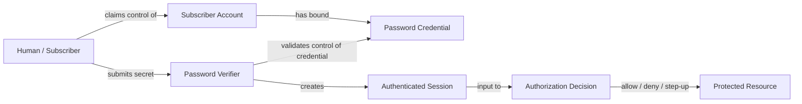
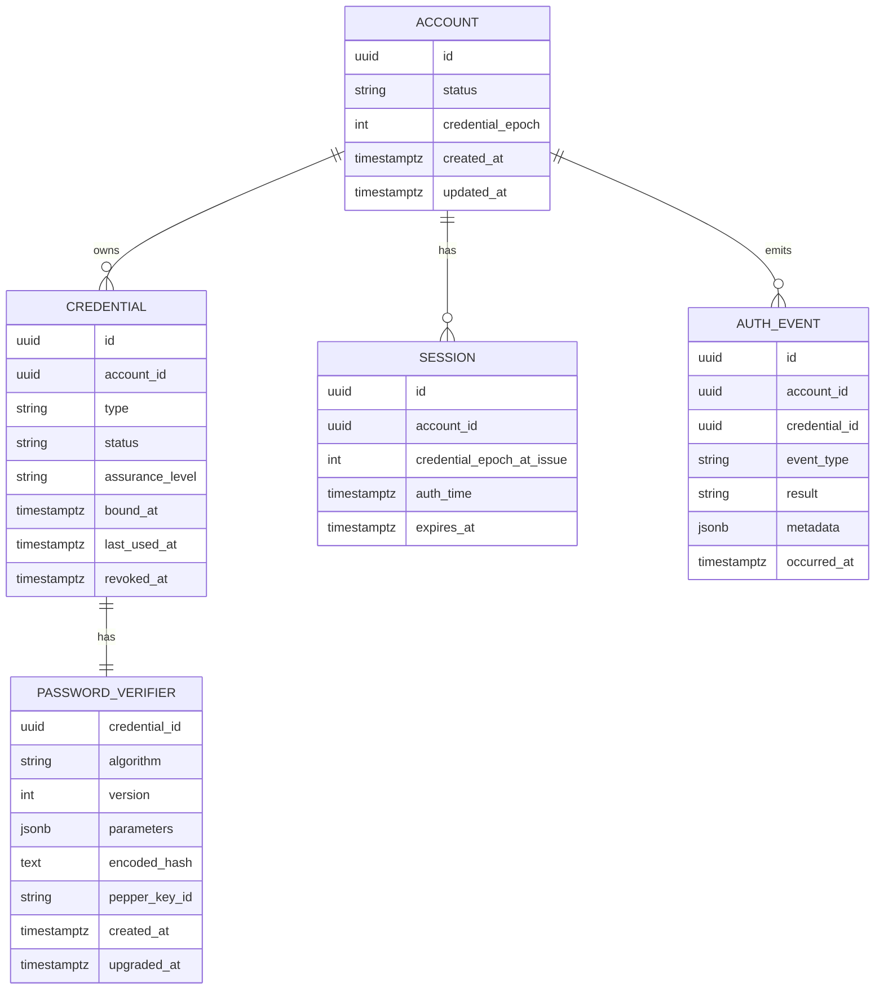
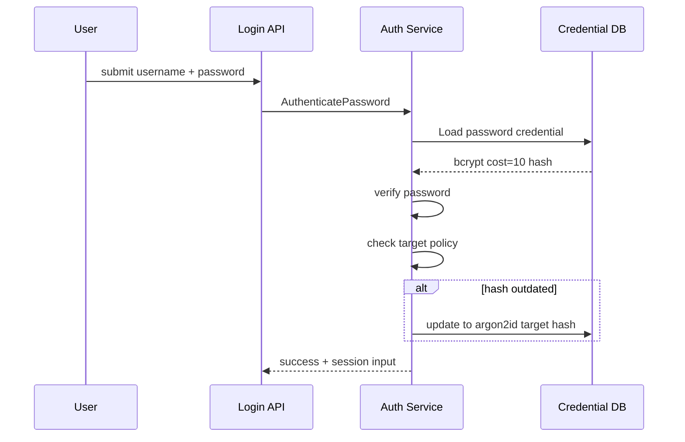
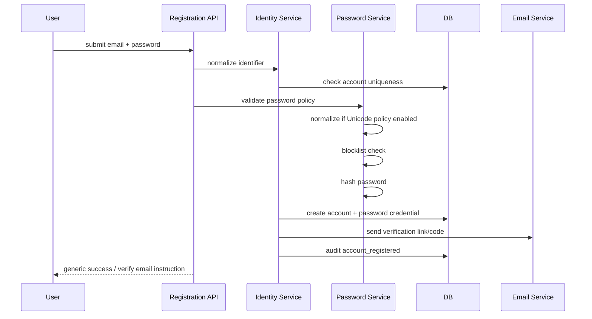
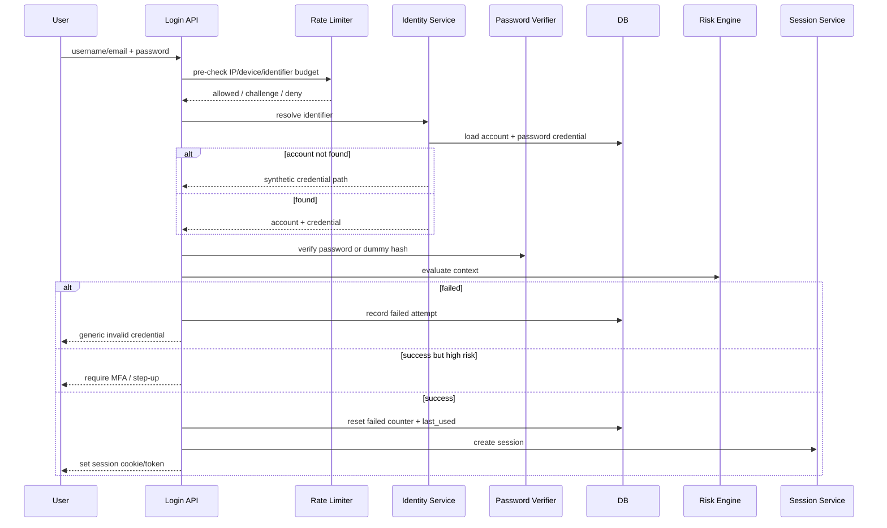
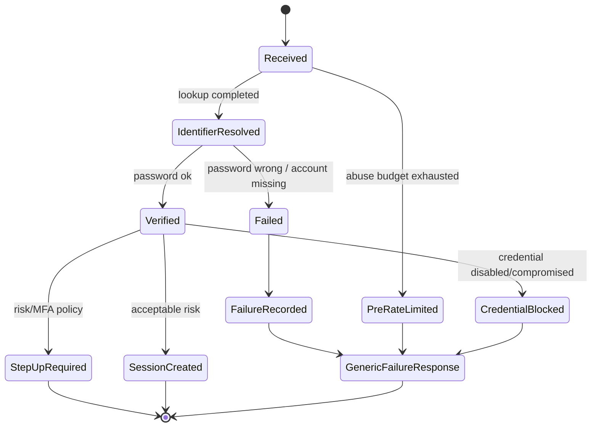
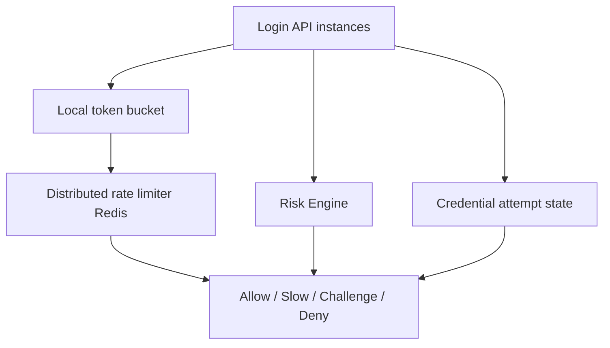
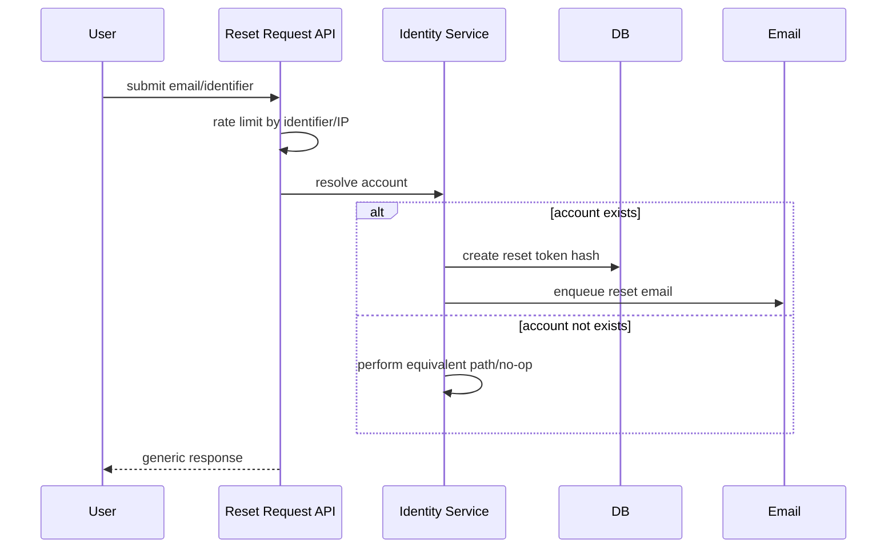
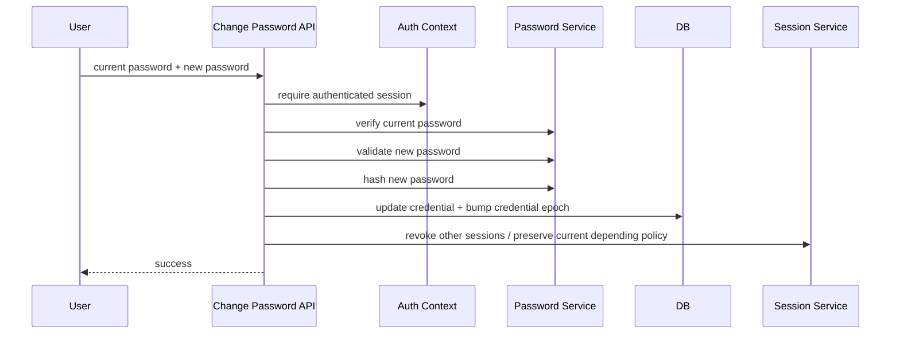

# learn-go-authentication-authorization-identity-permission-part-006.md

# Part 006 — Password Authentication di Go: Correctness, Storage, UX, Abuse Resistance

> **Series**: `learn-go-authentication-authorization-identity-permission`  
> **Target Go**: Go 1.26.x  
> **Level**: Advanced / internal engineering handbook  
> **Status seri**: Belum selesai  
> **Fokus part ini**: membangun password authentication yang benar sebagai legacy-but-real authenticator, tanpa mengulang primitive cryptography dari seri `learn-go-security-cryptography-integrity`.

---

## Daftar Isi

1. [Posisi Password dalam Sistem Identity Modern](#1-posisi-password-dalam-sistem-identity-modern)
2. [Mental Model: Password Bukan Identitas](#2-mental-model-password-bukan-identitas)
3. [Apa yang Sebenarnya Harus Dilindungi](#3-apa-yang-sebenarnya-harus-dilindungi)
4. [Requirement Faktual dari Standar Modern](#4-requirement-faktual-dari-standar-modern)
5. [Design Invariants Password Authentication](#5-design-invariants-password-authentication)
6. [Domain Model Password Credential](#6-domain-model-password-credential)
7. [Password Policy yang Tidak Merusak Security](#7-password-policy-yang-tidak-merusak-security)
8. [Unicode, Normalisasi, Panjang Password, dan DoS](#8-unicode-normalisasi-panjang-password-dan-dos)
9. [Password Hashing: Argon2id, bcrypt, scrypt, PBKDF2](#9-password-hashing-argon2id-bcrypt-scrypt-pbkdf2)
10. [Format Hash yang Bisa Dimigrasikan](#10-format-hash-yang-bisa-dimigrasikan)
11. [Pepper: Kapan Berguna dan Kapan Menipu](#11-pepper-kapan-berguna-dan-kapan-menipu)
12. [Implementasi Password Hasher di Go](#12-implementasi-password-hasher-di-go)
13. [Registration Flow yang Benar](#13-registration-flow-yang-benar)
14. [Login Flow yang Benar](#14-login-flow-yang-benar)
15. [Enumeration Resistance](#15-enumeration-resistance)
16. [Rate Limiting, Throttling, Lockout, dan Abuse Resistance](#16-rate-limiting-throttling-lockout-dan-abuse-resistance)
17. [Credential Stuffing dan Password Spraying](#17-credential-stuffing-dan-password-spraying)
18. [Password Reset Flow yang Aman](#18-password-reset-flow-yang-aman)
19. [Password Change Flow untuk Authenticated User](#19-password-change-flow-untuk-authenticated-user)
20. [Session Handling Setelah Password Event](#20-session-handling-setelah-password-event)
21. [Audit Event Model](#21-audit-event-model)
22. [Go Package Design](#22-go-package-design)
23. [Database Schema Reference](#23-database-schema-reference)
24. [Concurrency dan Race Condition](#24-concurrency-dan-race-condition)
25. [Testing Strategy](#25-testing-strategy)
26. [Operational Playbook](#26-operational-playbook)
27. [Failure Modes](#27-failure-modes)
28. [Anti-Pattern yang Harus Dihindari](#28-anti-pattern-yang-harus-dihindari)
29. [Case Study: Regulatory Case Management Platform](#29-case-study-regulatory-case-management-platform)
30. [Production Checklist](#30-production-checklist)
31. [Review Questions](#31-review-questions)
32. [Ringkasan](#32-ringkasan)
33. [Referensi Primer](#33-referensi-primer)

---

## 1. Posisi Password dalam Sistem Identity Modern

Password adalah authenticator paling umum sekaligus salah satu sumber risiko terbesar dalam sistem identity.

Di sistem modern, password seharusnya dipahami sebagai:

- **fallback authenticator**, bukan masa depan identity;
- **centrally verified secret**, bukan bukti identity yang kuat;
- **online guessing target**, bukan hanya data yang harus di-hash;
- **phishable authenticator**, bukan phishing-resistant authenticator;
- **risk signal**, bukan hanya boolean benar/salah;
- **lifecycle object**, bukan kolom `password_hash` saja.

Kesalahan umum engineer adalah menganggap password authentication selesai ketika sudah melakukan:

```go
bcrypt.CompareHashAndPassword(hash, []byte(password))
```

Itu hanya satu operasi kecil. Sistem password authentication yang benar meliputi:

1. policy ketika password dibuat;
2. normalisasi input;
3. panjang maksimum untuk mencegah resource exhaustion;
4. hashing dan parameter versioning;
5. pepper management bila dipakai;
6. failed attempt state;
7. rate limiting;
8. enumeration resistance;
9. reset flow;
10. change flow;
11. compromised credential handling;
12. session invalidation;
13. audit trail;
14. migration strategy;
15. incident response.

Dengan kata lain:

> Password authentication adalah **stateful security protocol** yang menyentuh UX, storage, distributed systems, abuse detection, dan auditability.

---

## 2. Mental Model: Password Bukan Identitas

### 2.1 Password adalah authenticator

Password membuktikan bahwa claimant mengetahui secret yang sebelumnya diikat ke subscriber account.

Password tidak membuktikan:

- bahwa claimant adalah manusia tertentu;
- bahwa claimant adalah pemilik legal account;
- bahwa device aman;
- bahwa session tidak diambil alih;
- bahwa akses boleh diberikan ke semua resource;
- bahwa current transaction cukup aman tanpa step-up.

Model yang lebih presisi:



Password adalah **evidence of control**, bukan identity itu sendiri.

### 2.2 Password result bukan authorization

Login sukses tidak boleh langsung diterjemahkan menjadi “boleh melakukan aksi X”.

Login sukses hanya menghasilkan authentication state, misalnya:

```go
type AuthenticationResult struct {
    SubjectID      string
    AccountID      string
    Authenticator  AuthenticatorType
    AAL            AssuranceLevel
    AuthTime       time.Time
    CredentialID   string
    Risk           RiskAssessment
}
```

Authorization tetap harus dilakukan terpisah:

```go
type Authorizer interface {
    Decide(ctx context.Context, input AuthorizationInput) (AuthorizationDecision, error)
}
```

Password authentication hanya memberi sinyal:

- siapa subject-nya;
- credential apa yang dipakai;
- kapan authentication terjadi;
- assurance level berapa;
- apakah perlu MFA atau step-up;
- apakah ada risk signal.

### 2.3 Password adalah centrally verified secret

Berbeda dengan passkey/WebAuthn yang membuktikan possession of private key dengan origin binding, password dikirim ke verifier melalui protected channel. Verifier lalu membandingkannya dengan password verifier/hash di backend.

Konsekuensi desain:

- backend melihat password plaintext saat login;
- password harus tidak pernah di-log;
- password harus tidak pernah dimasukkan ke trace, metrics label, audit payload, panic, error string;
- password harus diproses sesingkat mungkin;
- password hashing harus tahan offline attack ketika database bocor;
- password input endpoint harus tahan online guessing.

---

## 3. Apa yang Sebenarnya Harus Dilindungi

### 3.1 Asset

Password authentication melindungi beberapa asset berbeda:

| Asset | Contoh | Failure jika bocor/rusak |
|---|---|---|
| Plaintext password in transit | request body login | account takeover |
| Plaintext password in memory | variable, panic, trace | credential exposure |
| Password hash/verifier | database row | offline cracking |
| Pepper | KMS/HSM secret | mempercepat hash cracking jika ikut bocor |
| Reset token | password reset link | account takeover |
| Failed-attempt state | login throttle state | brute force lebih mudah atau DoS lockout |
| Session created after login | cookie/session token | session hijacking |
| Audit events | login/reset/change event | forensic blindness |
| Account recovery channel | email/phone/recovery contact | account takeover via recovery |

### 3.2 Attacker goals

Attacker tidak selalu ingin mengetahui password. Mereka bisa punya goal lain:

1. login sebagai user;
2. memastikan apakah email terdaftar;
3. membuat account victim terkunci;
4. membanjiri email reset victim;
5. memaksa downgrade dari passkey/MFA ke password reset;
6. mengambil session setelah login;
7. memakai password leak dari layanan lain;
8. cracking hash hasil database breach;
9. menyalahgunakan admin reset;
10. menghindari audit trail.

### 3.3 Dua mode serangan utama

#### Online attack

Attacker berinteraksi dengan sistem login:

```text
POST /login
POST /password-reset/request
POST /password-reset/confirm
```

Pertahanan utama:

- rate limit;
- progressive delay;
- bot detection;
- enumeration resistance;
- breached/common password blocking;
- MFA/step-up;
- anomaly detection;
- account notification.

#### Offline attack

Attacker sudah punya password hash database:

```text
user_id | password_hash | algorithm | params | salt
```

Pertahanan utama:

- slow/memory-hard password hashing;
- per-password salt;
- parameter versioning;
- optional pepper stored separately;
- fast rotation after incident;
- password reset campaign;
- monitoring credential reuse.

Online dan offline attack butuh pertahanan berbeda. Password hashing tidak melindungi login endpoint dari credential stuffing. Rate limiting tidak cukup ketika database hash sudah bocor.

---

## 4. Requirement Faktual dari Standar Modern

Bagian ini mengambil prinsip dari standar primer, lalu diterjemahkan ke engineering decision.

### 4.1 NIST SP 800-63B-4

NIST SP 800-63B-4 mengatur digital authentication dan authenticator lifecycle. Untuk password, beberapa requirement penting:

- password single-factor minimum **15 karakter**;
- password yang hanya dipakai sebagai bagian multi-factor boleh lebih pendek, tetapi minimum **8 karakter**;
- maximum password length sebaiknya minimal **64 karakter**;
- jangan memakai composition rule seperti wajib uppercase/lowercase/angka/simbol;
- jangan mewajibkan periodic password change tanpa bukti compromise;
- jangan memakai hint atau security questions sebagai bagian password setup;
- password harus diverifikasi secara penuh, tidak boleh ditruncate;
- password harus dibandingkan dengan blocklist umum/expected/compromised;
- verifier harus rate limit failed attempt;
- password manager, autofill, dan paste harus diizinkan;
- password harus dikirim lewat authenticated protected channel;
- password harus disimpan dalam bentuk salted hash yang tahan offline attack;
- hash scheme dan cost factor harus disimpan untuk migration.

### 4.2 OWASP Authentication Cheat Sheet

OWASP menekankan:

- minimum length;
- maximum length yang memadai;
- tidak silently truncate;
- dukung unicode dan whitespace;
- tidak perlu composition rule;
- block common/breached passwords;
- gunakan password strength meter;
- rotasi hanya saat compromise/indikasi risiko, bukan periodik buta.

### 4.3 OWASP Password Storage Cheat Sheet

OWASP merekomendasikan password storage memakai slow hash seperti:

- Argon2id;
- bcrypt;
- PBKDF2 jika ada kebutuhan FIPS;
- scrypt sebagai opsi.

OWASP juga menekankan unique salt dan bahwa fast hash seperti SHA-256 tidak cocok untuk password storage.

### 4.4 OWASP Forgot Password Cheat Sheet

Untuk reset password:

- response harus konsisten untuk account ada/tidak ada;
- waktu response sebaiknya uniform;
- token reset harus random, cukup panjang, tersimpan aman, single-use, dan expire;
- jangan mengubah account sebelum token valid diberikan;
- setelah reset, user login melalui flow biasa;
- invalidasi session existing harus ditawarkan atau dilakukan otomatis.

### 4.5 Go 1.26.x baseline

Go 1.26 mempertahankan kompatibilitas Go 1 dan membawa perubahan runtime/library, tetapi desain password authentication tetap harus mengandalkan prinsip stabil:

- `crypto/rand` untuk random secret/token;
- `crypto/subtle` untuk comparison tertentu;
- `golang.org/x/crypto/bcrypt` bila memakai bcrypt;
- `golang.org/x/crypto/argon2` bila memakai Argon2id;
- explicit error handling;
- context cancellation;
- timeouts;
- typed domain model;
- small interface boundaries.

---

## 5. Design Invariants Password Authentication

Invariants adalah aturan yang harus selalu benar. Kalau invariant dilanggar, sistem menjadi rapuh walaupun unit test happy-path lewat.

### 5.1 Invariant utama

1. **Plaintext password tidak boleh persist.**
   Tidak di database, log, metric, trace, message queue, audit payload, panic, error string.

2. **Password verifier harus bisa dimigrasikan.**
   Simpan algorithm, version, parameters, salt/encoded hash, created time.

3. **Password verification harus independent dari user enumeration.**
   Response login/reset tidak boleh membocorkan account ada/tidak ada.

4. **Password login harus stateful terhadap abuse.**
   Harus ada failed-attempt state, throttle, dan risk signal.

5. **Password hashing cost harus dikontrol.**
   Cukup mahal untuk attacker, tapi tidak bisa dipakai untuk DoS murah.

6. **Reset password adalah authentication flow.**
   Reset bukan “utility endpoint”; reset adalah salah satu jalur account takeover paling sensitif.

7. **Password change/reset harus memengaruhi session.**
   Minimal bump credential version/session epoch; idealnya invalidate session tertentu atau semua session sesuai risk.

8. **Credential state harus eksplisit.**
   Jangan hanya `password_hash != null`. Gunakan `active`, `requires_change`, `compromised`, `disabled`, `rotated`, `revoked`.

9. **Credential event harus audit-able.**
   Login success/failure, reset requested, reset completed, password changed, hash upgraded, credential disabled.

10. **Password bukan high-assurance authenticator.**
    Untuk high-risk action, gunakan MFA/passkey/step-up.

### 5.2 Invariant untuk Go code

1. Password input type jangan tersebar sebagai `string` bebas.
2. Jangan memasukkan password ke `fmt.Errorf`.
3. Jangan log request body untuk auth endpoint.
4. Jangan memakai `math/rand` untuk reset token.
5. Jangan generate token dari timestamp, UUID biasa, email, atau hash deterministik.
6. Jangan mengandalkan HTTP status berbeda untuk account-not-found vs wrong-password.
7. Jangan membuat package auth bergantung langsung ke framework web tertentu.
8. Jangan embed authorization decision di password verifier.

---

## 6. Domain Model Password Credential

Password credential sebaiknya dimodelkan sebagai aggregate atau entity tersendiri, bukan field di table user.

### 6.1 Entity utama



### 6.2 Go types

```go
package identity

import "time"

type AccountID string
type CredentialID string

type CredentialType string

const (
    CredentialTypePassword CredentialType = "password"
    CredentialTypeTOTP     CredentialType = "totp"
    CredentialTypePasskey  CredentialType = "passkey"
)

type CredentialStatus string

const (
    CredentialActive         CredentialStatus = "active"
    CredentialRequiresChange CredentialStatus = "requires_change"
    CredentialCompromised    CredentialStatus = "compromised"
    CredentialDisabled       CredentialStatus = "disabled"
    CredentialRevoked        CredentialStatus = "revoked"
)

type PasswordAlgorithm string

const (
    PasswordAlgArgon2id PasswordAlgorithm = "argon2id"
    PasswordAlgBcrypt   PasswordAlgorithm = "bcrypt"
    PasswordAlgPBKDF2   PasswordAlgorithm = "pbkdf2-sha256"
)

type PasswordCredential struct {
    ID           CredentialID
    AccountID    AccountID
    Status       CredentialStatus
    Algorithm    PasswordAlgorithm
    EncodedHash  string
    PepperKeyID  string
    CreatedAt    time.Time
    LastUsedAt   *time.Time
    UpgradedAt   *time.Time
    RevokedAt    *time.Time
}
```

### 6.3 Kenapa bukan `users.password_hash` saja?

Karena begitu sistem bertambah matang, Anda akan butuh:

- multiple credential per account;
- password disabled tapi passkey active;
- password requires change;
- migration bcrypt -> argon2id;
- password hash upgraded on login;
- admin reset vs user change;
- compromised credential state;
- audit credential ID;
- per-credential failed attempt;
- credential revocation;
- session invalidation based on credential epoch.

Kalau semua dipaksa ke `users.password_hash`, desain akan menjadi brittle.

---

## 7. Password Policy yang Tidak Merusak Security

Password policy harus menurunkan risiko, bukan sekadar membuat form terlihat “secure”.

### 7.1 Policy modern

Gunakan rule:

```text
- Minimum length:
  - 15 jika password dapat dipakai sebagai single factor.
  - 8 jika password hanya dipakai bersama MFA.
- Maximum supported length minimal 64 karakter.
- Terima whitespace.
- Terima semua printable ASCII.
- Terima Unicode jika sistem mendukung normalisasi konsisten.
- Jangan composition rule wajib angka/simbol/uppercase.
- Jangan periodic forced rotation tanpa indikasi compromise.
- Jangan password hint.
- Jangan security question.
- Jangan truncate diam-diam.
- Block common, expected, dan compromised password.
```

### 7.2 Kenapa composition rule buruk?

Rule seperti:

```text
Minimal 8 karakter, harus ada uppercase, lowercase, angka, simbol.
```

sering menghasilkan password seperti:

```text
Password1!
Summer2026!
CompanyName123!
```

Secara UX terlihat kompleks, tetapi secara attacker model sangat predictable.

Lebih baik:

```text
minimum panjang tinggi + blocklist + password manager + MFA/passkey
```

### 7.3 Password strength meter

Strength meter berguna jika:

- memberi feedback jelas;
- tidak memaksa pattern tertentu;
- mendeteksi password terlalu umum;
- menghargai passphrase panjang;
- tidak mengirim password ke pihak ketiga tanpa privacy design.

Strength meter tidak boleh menjadi satu-satunya pertahanan.

### 7.4 Blocklist

Blocklist harus mencakup:

- password dari breach corpus;
- common password;
- nama aplikasi;
- nama organisasi;
- username/email local-part;
- nama tenant/agency;
- varian obvious seperti `Company2026!`.

Tetapi blocklist tidak harus absurd besar. Untuk online attack, failed attempts sudah dibatasi throttling. Blocklist terlalu besar dapat merusak UX tanpa manfaat sebanding.

### 7.5 Password manager support

Jangan lakukan hal-hal yang merusak password manager:

- `autocomplete="off"` secara agresif;
- mencegah paste;
- limit panjang terlalu pendek;
- menolak karakter aneh tanpa alasan;
- multi-page password field yang membingungkan;
- password input custom yang tidak dikenali browser;
- menyembunyikan field username secara tidak standar.

Password manager adalah bagian dari security posture.

---

## 8. Unicode, Normalisasi, Panjang Password, dan DoS

### 8.1 Karakter vs byte

Go `len(s)` mengembalikan jumlah byte, bukan jumlah Unicode code point.

```go
s := "rahasia🔐"
fmt.Println(len(s))         // byte length
fmt.Println(utf8.RuneCountInString(s)) // code point count
```

Untuk password policy, Anda harus sadar apakah minimum length dihitung berdasarkan:

- byte;
- rune/code point;
- grapheme cluster.

NIST menyatakan setiap Unicode code point dihitung sebagai satu karakter untuk evaluasi panjang.

### 8.2 Normalisasi Unicode

Unicode dapat merepresentasikan karakter visual sama dengan byte berbeda.

Contoh konseptual:

```text
é = U+00E9
é = e + U+0301
```

Jika user membuat password di device A dan login di device B, normalisasi tidak konsisten bisa menyebabkan lockout.

Praktik yang masuk akal:

1. pilih policy eksplisit;
2. jika menerima Unicode, normalisasi NFC sebelum hashing;
3. jangan mengubah password setelah hashing;
4. dokumentasikan behavior;
5. test dengan karakter non-ASCII.

Go package untuk normalisasi ada di `golang.org/x/text/unicode/norm`.

### 8.3 Panjang maksimum dan DoS

“Harus mendukung minimal 64 karakter” bukan berarti menerima 10 MB password.

Password hashing mahal. Jika endpoint menerima password sangat panjang tanpa limit, attacker bisa membuat CPU/memory exhaustion.

Policy aman:

```text
Minimum: 15 atau 8 tergantung MFA posture.
Maximum accepted input: misalnya 1024 byte atau 4096 byte.
Maximum policy-supported password: minimal 64 karakter.
Reject input terlalu panjang dengan generic error.
Jangan truncate diam-diam.
```

Perhatikan bcrypt punya limit 72 byte. Jika memakai bcrypt, password lebih panjang dari 72 byte harus ditangani eksplisit. Jangan diam-diam truncate.

### 8.4 Input lifecycle di Go

`string` immutable di Go; Anda tidak bisa benar-benar menghapus isinya dari memory. `[]byte` bisa dioverwrite, tetapi belum menjamin semua copy hilang karena runtime, stack growth, compiler optimization, logging, dan library calls.

Prinsip realistis:

- jangan log;
- jangan store;
- jangan copy ke banyak tempat;
- jangan masuk ke error;
- jangan masuk ke metrics/tracing;
- proses sesingkat mungkin;
- gunakan `[]byte` di boundary hashing jika memungkinkan;
- zeroize buffer best-effort jika Anda memang mengontrolnya.

Go 1.26 memperkenalkan eksperimen `runtime/secret`, tetapi karena experimental, jangan jadikan fondasi wajib production sebelum matang dan kebijakan organisasi mendukung.

---

## 9. Password Hashing: Argon2id, bcrypt, scrypt, PBKDF2

### 9.1 Tujuan password hashing

Tujuan password hashing bukan merahasiakan password plaintext setelah login. Tujuan utamanya adalah membuat **offline guessing** mahal jika password verifier database bocor.

Hash password harus:

- salted;
- slow;
- parameterized;
- upgradeable;
- resistant terhadap GPU/ASIC cracking sebanyak mungkin;
- punya format yang menyimpan algorithm dan parameter.

### 9.2 Argon2id

Argon2id adalah pilihan modern yang memory-hard.

Kelebihan:

- memory-hard;
- parameter fleksibel: memory, time, parallelism;
- lebih tahan GPU cracking dibanding fast hash;
- direkomendasikan banyak guideline modern.

Trade-off:

- parameter buruk membuatnya tidak efektif;
- memory tinggi bisa menjadi DoS vector;
- perlu benchmarking di hardware production;
- tidak selalu cocok jika FIPS strict.

### 9.3 bcrypt

bcrypt masih banyak dipakai dan tersedia stabil di Go melalui `golang.org/x/crypto/bcrypt`.

Kelebihan:

- matang;
- format hash self-contained;
- mudah dipakai;
- banyak interoperabilitas legacy.

Keterbatasan:

- password input limit 72 byte;
- bukan memory-hard modern seperti Argon2id;
- cost hanya CPU-oriented;
- perlu handle long password eksplisit.

### 9.4 scrypt

scrypt memory-hard dan tersedia di `golang.org/x/crypto/scrypt`.

Kelebihan:

- memory-hard;
- lebih tua dan cukup dikenal.

Trade-off:

- parameter tuning perlu hati-hati;
- Argon2id biasanya lebih direkomendasikan untuk desain baru jika tidak ada constraint khusus.

### 9.5 PBKDF2

PBKDF2 relevan ketika:

- FIPS/compliance membutuhkan primitive tertentu;
- stack enterprise/HSM hanya mendukung mekanisme tertentu;
- migrasi legacy.

Trade-off:

- CPU-hard, bukan memory-hard;
- iteration count harus tinggi;
- lebih mudah diparalelisasi attacker dibanding memory-hard hash.

### 9.6 Decision matrix

| Kondisi | Pilihan default |
|---|---|
| Sistem baru, tidak FIPS-restricted | Argon2id |
| Sistem Go sederhana dengan legacy compatibility | bcrypt dengan cost >= 10 dan batas 72 byte eksplisit |
| FIPS strict | PBKDF2-HMAC-SHA-256 dengan iteration sesuai guideline/compliance |
| Legacy bcrypt existing | Tetap support verify, rehash ke target baru saat login/change |
| Risiko DoS tinggi dan resource kecil | bcrypt atau Argon2id parameter konservatif + rate limit ketat |

### 9.7 Parameter bukan copy-paste

Parameter hash harus dipilih berdasarkan:

- latency login target;
- CPU/memory pod/container;
- peak login QPS;
- autoscaling behavior;
- abuse scenario;
- background migration load;
- SLO;
- attacker cost.

Contoh target internal:

```text
P50 verify: 75-150ms
P95 verify: 200-500ms
Hard timeout: 1-2s
Max concurrent hash operations per instance: bounded
```

Angka itu bukan universal. Sistem publik high-traffic, internal enterprise, dan admin portal punya trade-off berbeda.

---

## 10. Format Hash yang Bisa Dimigrasikan

### 10.1 Jangan hanya simpan raw hash

Buruk:

```text
password_hash = "abc123..."
```

Lebih baik:

```text
algorithm = "argon2id"
version = 1
parameters = {"memory_kib": 65536, "time": 3, "parallelism": 2, "salt_len": 16, "key_len": 32}
encoded_hash = "$argon2id$v=19$m=65536,t=3,p=2$..."
pepper_key_id = "pepper-2026-01"
```

### 10.2 Self-contained encoded hash

Argon2 encoded hash biasanya memuat parameter:

```text
$argon2id$v=19$m=65536,t=3,p=2$base64salt$base64hash
```

bcrypt hash juga self-contained:

```text
$2a$10$...
$2b$12$...
```

Tetapi tetap berguna menyimpan metadata tambahan:

- credential ID;
- algorithm family;
- pepper key ID;
- created_at;
- upgraded_at;
- migration status;
- source legacy system.

### 10.3 Rehash-on-login

Jika user login dengan hash lama dan password benar, upgrade hash di transaksi terpisah.

Flow:



Important:

- upgrade hanya setelah verification sukses;
- harus idempotent;
- jangan block login jika upgrade gagal non-kritis;
- log audit `password_hash_upgraded` tanpa sensitive payload;
- gunakan optimistic locking agar tidak overwrite update lain.

---

## 11. Pepper: Kapan Berguna dan Kapan Menipu

### 11.1 Salt vs pepper

| Konsep | Sifat | Disimpan di mana | Tujuan |
|---|---|---|---|
| Salt | unik per password, tidak rahasia | bersama hash | mencegah precomputed/rainbow table dan hash collision antar user |
| Pepper | secret global/tenant/key-version | KMS/HSM/secret manager, terpisah dari DB | defense in depth jika DB hash bocor tanpa secret store |

Salt wajib. Pepper opsional.

### 11.2 Kapan pepper berguna

Pepper berguna jika threat model-nya:

- database credential bocor;
- secret manager tidak ikut bocor;
- attacker offline tidak punya pepper;
- Anda bisa merotasi pepper dengan prosedur matang.

### 11.3 Kapan pepper menipu

Pepper tidak banyak membantu jika:

- app server ikut compromise;
- attacker bisa memanggil login endpoint;
- pepper disimpan di table yang sama;
- pepper hardcoded di binary/repository;
- tidak ada key ID/versioning;
- tidak ada rotation plan;
- pepper dipakai sebagai pengganti hashing kuat.

### 11.4 Strategi pepper

Ada dua pola umum:

#### Pre-hash pepper

```text
password' = HMAC(pepper, password)
hash = Argon2id(password')
```

#### Post-hash pepper

```text
hash = Argon2id(password)
stored = HMAC(pepper, hash)
```

Untuk sistem enterprise, gunakan desain yang mudah diaudit dan dimigrasikan. Simpan `pepper_key_id`. Jangan membuat pepper rotation mustahil.

### 11.5 Pepper rotation problem

Rotasi pepper tidak sama seperti rotasi signing key JWT.

Jika pepper dipakai dalam hash password, Anda biasanya perlu password plaintext untuk rehash. Karena plaintext hanya ada saat login/change/reset, rotation sering dilakukan bertahap:

1. maintain old pepper for verification;
2. mark pepper target baru;
3. ketika login sukses, rehash dengan pepper baru;
4. forced reset untuk account yang tidak pernah login jika pepper lama harus dimatikan;
5. incident mode: invalidate credential jika old pepper diduga bocor.

---

## 12. Implementasi Password Hasher di Go

Bagian ini memberikan reference design, bukan library production final. Production implementation harus diuji, diaudit, dan disesuaikan dengan compliance.

### 12.1 Interface

```go
package password

import "context"

type Plaintext []byte

type HashRecord struct {
    Algorithm   string
    Version     int
    EncodedHash string
    PepperKeyID string
}

type VerificationResult struct {
    OK            bool
    NeedsRehash   bool
    Algorithm     string
    ParameterNote string
}

type Hasher interface {
    Hash(ctx context.Context, password Plaintext) (HashRecord, error)
    Verify(ctx context.Context, password Plaintext, record HashRecord) (VerificationResult, error)
}
```

### 12.2 Password input type

Gunakan type agar password tidak mudah tertukar dengan string biasa.

```go
type PlaintextPassword struct {
    bytes []byte
}

func NewPlaintextPassword(b []byte) PlaintextPassword {
    cp := make([]byte, len(b))
    copy(cp, b)
    return PlaintextPassword{bytes: cp}
}

func (p PlaintextPassword) Bytes() []byte {
    cp := make([]byte, len(p.bytes))
    copy(cp, p.bytes)
    return cp
}

func (p PlaintextPassword) String() string {
    return "<redacted-password>"
}

func (p PlaintextPassword) Wipe() {
    for i := range p.bytes {
        p.bytes[i] = 0
    }
}
```

Catatan:

- `String()` sengaja tidak mengembalikan secret.
- `Wipe()` hanya best-effort.
- Jangan membuat method `RawString()` kecuali sangat diperlukan.

### 12.3 Argon2id implementation sketch

```go
package password

import (
    "context"
    "crypto/rand"
    "crypto/subtle"
    "encoding/base64"
    "errors"
    "fmt"
    "runtime"
    "strconv"
    "strings"

    "golang.org/x/crypto/argon2"
)

type Argon2idParams struct {
    MemoryKiB   uint32
    Time        uint32
    Parallelism uint8
    SaltLen     uint32
    KeyLen      uint32
}

type Argon2idHasher struct {
    Params Argon2idParams
}

func DefaultArgon2idHasher() Argon2idHasher {
    p := uint8(runtime.NumCPU())
    if p > 4 {
        p = 4
    }
    if p < 1 {
        p = 1
    }

    return Argon2idHasher{
        Params: Argon2idParams{
            MemoryKiB:   64 * 1024,
            Time:        3,
            Parallelism: p,
            SaltLen:     16,
            KeyLen:      32,
        },
    }
}

func (h Argon2idHasher) Hash(ctx context.Context, password []byte) (string, error) {
    select {
    case <-ctx.Done():
        return "", ctx.Err()
    default:
    }

    salt := make([]byte, h.Params.SaltLen)
    if _, err := rand.Read(salt); err != nil {
        return "", fmt.Errorf("generate password salt: %w", err)
    }

    key := argon2.IDKey(
        password,
        salt,
        h.Params.Time,
        h.Params.MemoryKiB,
        h.Params.Parallelism,
        h.Params.KeyLen,
    )

    b64Salt := base64.RawStdEncoding.EncodeToString(salt)
    b64Key := base64.RawStdEncoding.EncodeToString(key)

    encoded := fmt.Sprintf(
        "$argon2id$v=19$m=%d,t=%d,p=%d$%s$%s",
        h.Params.MemoryKiB,
        h.Params.Time,
        h.Params.Parallelism,
        b64Salt,
        b64Key,
    )

    return encoded, nil
}

func (h Argon2idHasher) Verify(ctx context.Context, password []byte, encoded string) (bool, bool, error) {
    select {
    case <-ctx.Done():
        return false, false, ctx.Err()
    default:
    }

    params, salt, expected, err := parseArgon2idEncoded(encoded)
    if err != nil {
        // Treat malformed stored verifier as operational/security error.
        return false, false, err
    }

    actual := argon2.IDKey(
        password,
        salt,
        params.Time,
        params.MemoryKiB,
        params.Parallelism,
        uint32(len(expected)),
    )

    ok := subtle.ConstantTimeCompare(actual, expected) == 1
    needsRehash := ok && weakerThan(params, h.Params)
    return ok, needsRehash, nil
}

func weakerThan(current, target Argon2idParams) bool {
    return current.MemoryKiB < target.MemoryKiB ||
        current.Time < target.Time ||
        current.Parallelism < target.Parallelism ||
        current.KeyLen < target.KeyLen
}

func parseArgon2idEncoded(encoded string) (Argon2idParams, []byte, []byte, error) {
    // Format: $argon2id$v=19$m=65536,t=3,p=2$salt$key
    parts := strings.Split(encoded, "$")
    if len(parts) != 6 || parts[1] != "argon2id" || parts[2] != "v=19" {
        return Argon2idParams{}, nil, nil, errors.New("invalid argon2id encoded hash")
    }

    paramPart := parts[3]
    params := Argon2idParams{}
    for _, kv := range strings.Split(paramPart, ",") {
        pair := strings.SplitN(kv, "=", 2)
        if len(pair) != 2 {
            return Argon2idParams{}, nil, nil, errors.New("invalid argon2id params")
        }
        n, err := strconv.ParseUint(pair[1], 10, 32)
        if err != nil {
            return Argon2idParams{}, nil, nil, errors.New("invalid argon2id numeric param")
        }
        switch pair[0] {
        case "m":
            params.MemoryKiB = uint32(n)
        case "t":
            params.Time = uint32(n)
        case "p":
            if n == 0 || n > 255 {
                return Argon2idParams{}, nil, nil, errors.New("invalid argon2id parallelism")
            }
            params.Parallelism = uint8(n)
        default:
            return Argon2idParams{}, nil, nil, errors.New("unknown argon2id param")
        }
    }

    salt, err := base64.RawStdEncoding.DecodeString(parts[4])
    if err != nil {
        return Argon2idParams{}, nil, nil, errors.New("invalid argon2id salt")
    }

    key, err := base64.RawStdEncoding.DecodeString(parts[5])
    if err != nil {
        return Argon2idParams{}, nil, nil, errors.New("invalid argon2id key")
    }

    params.SaltLen = uint32(len(salt))
    params.KeyLen = uint32(len(key))
    return params, salt, key, nil
}
```

### 12.4 bcrypt implementation sketch

```go
package password

import (
    "context"
    "errors"

    "golang.org/x/crypto/bcrypt"
)

const BcryptMaxPasswordBytes = 72

type BcryptHasher struct {
    Cost int
}

func (h BcryptHasher) Hash(ctx context.Context, password []byte) (string, error) {
    select {
    case <-ctx.Done():
        return "", ctx.Err()
    default:
    }

    if len(password) > BcryptMaxPasswordBytes {
        return "", errors.New("password exceeds bcrypt byte limit")
    }

    cost := h.Cost
    if cost == 0 {
        cost = bcrypt.DefaultCost
    }

    hash, err := bcrypt.GenerateFromPassword(password, cost)
    if err != nil {
        return "", err
    }
    return string(hash), nil
}

func (h BcryptHasher) Verify(ctx context.Context, password []byte, encoded string) (ok bool, needsRehash bool, err error) {
    select {
    case <-ctx.Done():
        return false, false, ctx.Err()
    default:
    }

    if len(password) > BcryptMaxPasswordBytes {
        // Never silently truncate.
        return false, false, nil
    }

    if err := bcrypt.CompareHashAndPassword([]byte(encoded), password); err != nil {
        return false, false, nil
    }

    currentCost, err := bcrypt.Cost([]byte(encoded))
    if err != nil {
        return true, true, nil
    }

    targetCost := h.Cost
    if targetCost == 0 {
        targetCost = bcrypt.DefaultCost
    }

    return true, currentCost < targetCost, nil
}
```

### 12.5 Jangan expose detail error ke user

Internal error taxonomy:

```go
type AuthErrorCode string

const (
    AuthErrInvalidCredentials AuthErrorCode = "invalid_credentials"
    AuthErrRateLimited        AuthErrorCode = "rate_limited"
    AuthErrAccountDisabled    AuthErrorCode = "account_disabled"
    AuthErrCredentialDisabled AuthErrorCode = "credential_disabled"
    AuthErrStepUpRequired     AuthErrorCode = "step_up_required"
    AuthErrInternal           AuthErrorCode = "internal"
)
```

User-facing message:

```text
Email atau password tidak valid.
```

Internal audit:

```json
{
  "event_type": "password_login_failed",
  "reason": "password_mismatch",
  "account_resolved": true,
  "credential_status": "active",
  "risk_score": 42
}
```

Jangan berikan detail `account not found`, `password wrong`, `credential disabled` ke attacker via UI/API.

---

## 13. Registration Flow yang Benar

### 13.1 Registration bukan hanya insert user

Registration melibatkan:

1. identifier intake;
2. normalization;
3. uniqueness check;
4. password policy validation;
5. blocklist check;
6. credential creation;
7. email/phone verification;
8. optional MFA/passkey enrollment;
9. audit;
10. session issuance policy.

### 13.2 Flow



### 13.3 Email normalization warning

Email uniqueness is harder than it looks.

Bad idea:

```go
normalized := strings.ToLower(email)
```

Masalah:

- local-part email technically case-sensitive walaupun kebanyakan provider case-insensitive;
- Gmail dot/plus normalization tidak universal;
- enterprise IdP bisa punya identifier berbeda;
- Unicode domain perlu IDNA handling;
- account linking bisa rusak.

Praktik yang aman:

- simpan original email untuk display;
- simpan canonical email untuk lookup;
- canonicalization policy harus eksplisit per identifier type;
- jangan menerapkan Gmail-specific normalization ke semua domain;
- untuk enterprise/federated identity, gunakan provider subject stable ID, bukan email sebagai primary identity.

### 13.4 Password validation pipeline

```go
type PasswordPolicy struct {
    MinCharsSingleFactor int
    MinCharsWithMFA      int
    MaxBytes             int
    SupportUnicode       bool
    RequireMFA           bool
}

type PasswordPolicyResult struct {
    OK       bool
    Code     string
    UserHint string
}

type PasswordBlocklist interface {
    Contains(ctx context.Context, password []byte, contextWords []string) (bool, error)
}
```

Pipeline:

```text
receive password
-> max byte guard
-> unicode normalization if enabled
-> minimum character count
-> blocklist/context word check
-> optional strength meter
-> hash
-> wipe best-effort
```

### 13.5 Jangan hash sebelum cheap validation

Hashing mahal. Lakukan cheap validation dulu:

1. empty check;
2. max byte check;
3. min length check;
4. blocklist check.

Baru hash.

Tetapi hati-hati: pada login flow, jangan membuat timing terlalu membocorkan account existence. Registration berbeda; user memang sedang membuat credential.

---

## 14. Login Flow yang Benar

### 14.1 Flow login ideal



### 14.2 Synthetic credential path

Untuk mengurangi user enumeration via timing, ketika account tidak ditemukan, sistem bisa melakukan dummy hash verify dengan hash konstan.

```go
var dummyBcryptHash = []byte("$2a$10$7EqJtq98hPqEX7fNZaFWoOhi68T6VYfC8Ynmw3kOQiNf9WOKG2vFy")

func verifyEvenIfAccountMissing(password []byte, actualHash *string) bool {
    if actualHash == nil {
        _ = bcrypt.CompareHashAndPassword(dummyBcryptHash, password)
        return false
    }
    return bcrypt.CompareHashAndPassword([]byte(*actualHash), password) == nil
}
```

Catatan:

- dummy hash cost harus mirip target production;
- jangan pakai dummy hash yang password-nya diketahui sebagai vulnerability? Password dummy tidak penting selama hash hanya untuk timing equalization, tapi simpan dan treat sebagai non-secret constant;
- Argon2 dummy juga bisa dipakai;
- tetap perlu rate limit karena dummy hash bisa dipakai attacker untuk CPU DoS.

### 14.3 Login result state machine



### 14.4 Login response discipline

API response:

```json
{
  "error": "invalid_credentials",
  "message": "Email atau password tidak valid."
}
```

Jangan:

```json
{
  "error": "account_not_found"
}
```

Jangan:

```json
{
  "error": "password_wrong_but_email_exists"
}
```

Jangan:

```json
{
  "error": "account_disabled_for_user_fajar@example.com"
}
```

Untuk user yang benar-benar perlu tahu account disabled, tampilkan setelah channel aman atau melalui support/account recovery flow yang tidak menambah enumeration surface.

### 14.5 Session creation

Password login sukses harus menghasilkan session yang membawa metadata:

```go
type SessionClaims struct {
    SubjectID              string
    AccountID              string
    AuthTime               time.Time
    AuthenticatorType      string
    AuthenticationMethod   []string // e.g. ["pwd"] or ["pwd", "otp"]
    AssuranceLevel         string
    CredentialEpochAtIssue int
    PasswordChangedAt      *time.Time
}
```

`CredentialEpochAtIssue` berguna untuk invalidasi session massal tanpa menyimpan semua session di DB jika desain Anda stateless/hybrid.

---

## 15. Enumeration Resistance

### 15.1 Enumeration surface

Enumeration bisa terjadi di:

- login;
- forgot password;
- registration;
- email verification;
- MFA reset;
- account unlock;
- admin search;
- public API error;
- timing;
- rate-limit behavior;
- email sending behavior;
- HTTP status;
- response body;
- redirect target.

### 15.2 Login enumeration

Bad:

```text
Email tidak ditemukan.
Password salah.
Account belum aktif.
```

Better:

```text
Email atau password tidak valid.
```

### 15.3 Forgot password enumeration

Bad:

```text
Kami tidak menemukan akun dengan email tersebut.
```

Better:

```text
Jika akun dengan email tersebut terdaftar, instruksi reset akan dikirim.
```

### 15.4 Timing equalization

Timing equalization tidak harus perfect cryptographic constant-time pada seluruh request. Yang penting jangan ada perbedaan kasar:

```text
account missing: 5ms
password wrong: 280ms
```

Itu jelas bocor.

Mitigasi:

- dummy hash;
- async reset email;
- minimum response delay dengan jitter hati-hati;
- rate limit;
- avoid quick exits;
- monitor enumeration attempts.

### 15.5 Email side-channel

Walaupun UI generic, email bisa menjadi side-channel:

- account ada menerima email;
- account tidak ada tidak menerima email.

Ini biasanya diterima sebagai trade-off karena attacker tidak melihat inbox korban. Tetapi untuk targeted attack, email bombing dan social engineering tetap risiko.

Mitigasi:

- rate limit reset per identifier;
- notify account owner untuk suspicious reset attempts dengan frekuensi terkendali;
- avoid flooding;
- do not reveal in API.

---

## 16. Rate Limiting, Throttling, Lockout, dan Abuse Resistance

### 16.1 Jangan berpikir hanya per-IP

Per-IP rate limit gagal menghadapi:

- botnet;
- residential proxy;
- NAT kantor;
- mobile carrier NAT;
- distributed credential stuffing.

Gunakan multi-dimensional budget:

```text
identifier budget: email/account
IP budget: source network
device budget: cookie/device fingerprint risk, bukan hard identity
ASN/country budget
tenant budget
global login budget
password reset budget
credential-specific failed attempts
```

### 16.2 Rate limiter dimensions

```go
type RateLimitInput struct {
    IdentifierHash string
    AccountID      *string
    IP             string
    UserAgentHash  string
    TenantID       *string
    Endpoint       string
    Time           time.Time
}

type RateLimitDecision struct {
    Allowed      bool
    RequireBotCheck bool
    RetryAfter   *time.Duration
    Reason       string
}
```

### 16.3 Progressive throttling

Progressive throttling lebih baik daripada hard lockout cepat.

Example:

| Failed attempts | Action |
|---:|---|
| 1-3 | normal generic failure |
| 4-6 | small delay |
| 7-10 | larger delay + risk flag |
| 11+ | require CAPTCHA/bot challenge or temporary cooldown |
| severe | disable credential or force recovery depending policy |

### 16.4 Lockout trade-off

Hard lockout bisa menjadi DoS:

```text
attacker tahu email CEO -> salah password 10x -> CEO terkunci
```

Alternatif:

- slow down instead of lock;
- require MFA/passkey for suspicious login;
- allow existing sessions to continue;
- notify user;
- separate lockout per authenticator rather than entire account;
- support recovery.

### 16.5 NIST upper bound

NIST memberi upper bound no more than 100 consecutive failed attempts per authenticator on single subscriber account sebelum authenticator disabled, tetapi organisasi boleh memakai limit lebih rendah. Itu bukan rekomendasi agar membiarkan 99 percobaan tanpa mitigasi. Gunakan progressive controls jauh sebelum itu.

### 16.6 Distributed limiter architecture



Design notes:

- local limiter melindungi Redis saat spike;
- Redis/global limiter memberi cross-instance consistency;
- DB state untuk credential/account counters yang perlu durability;
- risk engine tidak boleh menjadi hard dependency yang membuat login down jika outage, kecuali policy mengharuskan fail-closed.

### 16.7 Hashing as DoS vector

Password verify mahal. Attacker bisa mengirim banyak login untuk account tidak ada dan memaksa dummy hash.

Mitigasi:

- cheap pre-rate-limit sebelum hash;
- max request body size;
- max password byte length;
- bounded worker pool untuk hash;
- circuit breaker untuk auth endpoint;
- separate CPU pool/isolation jika perlu;
- autoscaling dengan hati-hati agar tidak memperbesar attack bill.

---

## 17. Credential Stuffing dan Password Spraying

### 17.1 Credential stuffing

Credential stuffing memakai pasangan username/password dari breach layanan lain.

Ciri:

- banyak account berbeda;
- banyak IP;
- password sering valid di sebagian kecil account;
- user-agent automation;
- velocity tinggi;
- pattern global.

Pertahanan:

- breached password block saat creation/change;
- MFA/passkey;
- risk-based challenge;
- IP/ASN/device reputation;
- anomaly detection;
- login notification;
- password reuse education;
- global failure pattern detection.

### 17.2 Password spraying

Password spraying memakai satu password umum ke banyak account.

Contoh:

```text
Winter2026!
CompanyName2026!
Password123!
```

Pertahanan:

- block context-specific password;
- tenant-level spray detection;
- low-and-slow detection;
- per-password fingerprint detection tanpa menyimpan password plaintext.

### 17.3 Password fingerprint untuk abuse detection

Anda mungkin ingin mendeteksi “password yang sama dicoba ke ribuan account” tanpa menyimpan password.

Pattern:

```text
attempt_password_fingerprint = HMAC(abuse_key, normalized_password)
```

Gunakan hanya untuk short-lived abuse telemetry, bukan permanent credential store. Key harus terpisah dan akses terbatas.

Risiko:

- jika key bocor, telemetry membantu attacker;
- privacy concern;
- compliance harus jelas;
- jangan log raw password.

### 17.4 Risk signal

```go
type LoginRiskSignal struct {
    NewDevice          bool
    NewCountry         bool
    ImpossibleTravel   bool
    KnownBadASN        bool
    PasswordSpray      bool
    CredentialStuffing bool
    RecentReset        bool
    RecentMFAChange    bool
}
```

Risk signal tidak harus langsung deny. Bisa menghasilkan:

- allow;
- allow + notify;
- require MFA;
- require passkey;
- temporary cooldown;
- deny.

---

## 18. Password Reset Flow yang Aman

Password reset adalah salah satu flow paling berbahaya dalam identity system.

### 18.1 Reset token requirements

Token reset harus:

- generated dengan CSPRNG;
- cukup panjang;
- single-use;
- expire;
- linked ke account;
- stored hashed;
- scoped ke purpose `password_reset`;
- punya attempt counter;
- invalidated setelah success;
- tidak reusable lintas tenant/account;
- tidak dimasukkan ke log/referrer.

### 18.2 Jangan simpan reset token plaintext

Buruk:

```sql
password_reset_tokens(token, account_id, expires_at)
```

Lebih baik:

```sql
password_reset_tokens(token_hash, account_id, purpose, expires_at, used_at)
```

User menerima plaintext token sekali melalui email/link. Server hanya menyimpan hash token.

### 18.3 Generate token di Go

```go
package reset

import (
    "crypto/rand"
    "encoding/base64"
)

func GenerateURLToken(byteLen int) (string, error) {
    b := make([]byte, byteLen)
    if _, err := rand.Read(b); err != nil {
        return "", err
    }
    return base64.RawURLEncoding.EncodeToString(b), nil
}
```

Gunakan minimal 128-bit entropy; 32 random bytes memberi 256-bit entropy sebelum encoding.

### 18.4 Hash token

```go
package reset

import (
    "crypto/hmac"
    "crypto/sha256"
    "encoding/base64"
)

func TokenHash(serverKey []byte, token string) string {
    mac := hmac.New(sha256.New, serverKey)
    mac.Write([]byte("password-reset-token:v1:"))
    mac.Write([]byte(token))
    return base64.RawStdEncoding.EncodeToString(mac.Sum(nil))
}
```

Kenapa HMAC, bukan plain SHA-256?

- token memang random, SHA-256 token bisa cukup;
- HMAC dengan server key memberi defense tambahan jika DB reset token bocor;
- key harus disimpan terpisah.

### 18.5 Request reset flow



Response:

```text
Jika akun terdaftar, instruksi reset akan dikirim.
```

### 18.6 Confirm reset flow

```mermaid
sequenceDiagram
    participant U as User
    participant API as Reset Confirm API
    participant DB as DB
    participant PW as Password Service
    participant Sess as Session Service

    U->>API: token + new password
    API->>DB: find active token hash
    DB-->>API: token row / none
    API->>PW: validate new password
    API->>PW: hash new password
    API->>DB: transaction: mark token used + update credential + bump epoch
    API->>Sess: invalidate sessions or mark epoch invalid
    API-->>U: password reset completed; login again
```

### 18.7 Do not auto-login after reset

Auto-login setelah reset menambah complexity:

- session creation dari reset flow;
- MFA bypass risk;
- ambiguous assurance;
- harder audit;
- bugs pada session invalidation.

Lebih aman:

```text
Password berhasil diubah. Silakan login kembali.
```

### 18.8 Reset token placement

Reset link biasanya:

```text
https://app.example.com/reset-password?token=...
```

Risiko:

- referrer leakage;
- browser history;
- proxy logs;
- analytics;
- frontend error monitoring.

Mitigasi:

- set `Referrer-Policy: no-referrer` pada reset page;
- jangan load third-party analytics di reset page;
- segera tukar token URL menjadi short-lived reset session;
- jangan log query string;
- gunakan trusted base URL, jangan dari `Host` header mentah.

### 18.9 Host header injection

Buruk:

```go
resetURL := "https://" + r.Host + "/reset?token=" + token
```

Jika `Host` bisa dimanipulasi, email reset dapat mengarah ke domain attacker.

Lebih baik:

```go
type PublicURLConfig struct {
    BaseURL string // e.g. https://app.example.com
}

func (c PublicURLConfig) ResetURL(token string) string {
    return c.BaseURL + "/reset-password?token=" + url.QueryEscape(token)
}
```

Base URL harus berasal dari config trusted.

### 18.10 Reset and MFA

Jika account punya MFA/passkey, reset password tidak boleh otomatis melemahkan semua faktor.

Policy:

- reset password tidak menghapus MFA;
- MFA reset adalah flow terpisah dengan assurance lebih tinggi;
- jika password reset dilakukan via weak channel, require step-up sebelum sensitive action;
- notify user pada semua recovery addresses;
- record audit event.

---

## 19. Password Change Flow untuk Authenticated User

Password change berbeda dari reset.

### 19.1 Change flow

Authenticated user biasanya harus memberikan current password atau step-up.



### 19.2 Require current password?

Require current password jika user authenticated only by password session and changing password.

Tetapi kalau session sudah step-up dengan phishing-resistant MFA, policy bisa mengizinkan password change tanpa current password, tergantung risk.

Decision matrix:

| Current session | Current password required? | Notes |
|---|---:|---|
| Password-only, old auth_time | yes | avoid stolen session changing credential |
| Password + recent MFA | maybe | depends policy |
| Passkey recent AAL2/phishing-resistant | maybe no | strong authenticator already proven |
| Admin forced reset | no user password | must use admin workflow + audit |
| Recovery flow | no current password | token/recovery becomes proof |

### 19.3 Password history

Password history sering diminta compliance. Namun harus hati-hati:

- menyimpan hash lama menambah material untuk offline cracking;
- user bisa melakukan trivial variations;
- periodic rotation tanpa compromise tidak disarankan.

Jika diwajibkan:

- simpan hash lama dengan same strong hashing;
- limit jumlah history;
- gunakan hanya untuk change flow;
- protect dengan same credential store controls;
- jangan gunakan sebagai alasan periodic rotation buta.

---

## 20. Session Handling Setelah Password Event

### 20.1 Password reset/change harus berdampak pada session

Jika password berubah tetapi session lama tetap valid selamanya, attacker yang sudah punya session tetap masuk.

Events:

| Event | Session action |
|---|---|
| User changes password normally | revoke other sessions or offer option; keep current if recently reauthenticated |
| Password reset via email | revoke all sessions by default |
| Password marked compromised | revoke all sessions and require reset/MFA |
| Admin forced reset | revoke all sessions; require password change on next login |
| Hash upgrade only | no session revocation needed |

### 20.2 Credential epoch

Tambahkan `credential_epoch` pada account.

```sql
ALTER TABLE accounts ADD COLUMN credential_epoch integer NOT NULL DEFAULT 1;
```

Saat password reset/change:

```sql
UPDATE accounts
SET credential_epoch = credential_epoch + 1,
    updated_at = now()
WHERE id = $1;
```

Session membawa epoch saat issue:

```go
type Session struct {
    AccountID              string
    CredentialEpochAtIssue int
    IssuedAt               time.Time
}
```

Validasi:

```go
func IsSessionStillValid(sessionEpoch, currentEpoch int) bool {
    return sessionEpoch == currentEpoch
}
```

Untuk stateless JWT, perlu cara membaca current epoch dari cache/DB atau menggunakan short-lived token + refresh validation.

### 20.3 Session revocation store

Untuk server-side session:

```sql
UPDATE sessions
SET revoked_at = now(), revoke_reason = 'password_reset'
WHERE account_id = $1 AND revoked_at IS NULL;
```

Untuk stateless:

- short access token;
- refresh token store;
- session epoch;
- token version;
- introspection;
- denylist untuk emergency.

Detail token lifecycle akan dibahas di part 011.

---

## 21. Audit Event Model

### 21.1 Audit harus menjawab pertanyaan forensik

Untuk password auth, audit harus bisa menjawab:

- siapa mencoba login;
- account mana yang ditarget;
- berhasil/gagal;
- credential mana yang dipakai;
- failure reason internal;
- source context;
- risk signal;
- policy decision;
- session dibuat atau tidak;
- password berubah karena user, reset, admin, atau compromise;
- session lama dicabut atau tidak.

### 21.2 Event taxonomy

```text
password_login_attempted
password_login_succeeded
password_login_failed
password_rate_limited
password_hash_upgraded
password_change_requested
password_changed
password_reset_requested
password_reset_token_issued
password_reset_token_consumed
password_reset_failed
password_reset_completed
password_marked_compromised
password_credential_disabled
password_credential_reenabled
```

### 21.3 Event shape

```go
type AuthAuditEvent struct {
    EventID       string
    EventType     string
    AccountID     *string
    CredentialID  *string
    TenantID      *string
    Result        string
    Reason        string
    SourceIP      string
    UserAgentHash string
    RequestID     string
    CorrelationID string
    RiskScore     int
    OccurredAt    time.Time
    Metadata      map[string]any
}
```

### 21.4 Do not log secrets

Tidak boleh masuk audit:

- password;
- reset token plaintext;
- OTP;
- recovery code plaintext;
- full session token;
- full Authorization header;
- raw cookie;
- full device fingerprint jika privacy-sensitive.

Gunakan hash/fingerprint dengan key jika perlu correlation.

### 21.5 Login failure reason

Internal reason boleh detail:

```text
account_not_found
password_mismatch
credential_disabled
credential_compromised
rate_limited_identifier
rate_limited_ip
risk_denied
```

External reason tetap generic.

---

## 22. Go Package Design

### 22.1 Package boundary

Contoh struktur:

```text
/internal/identity
  account.go
  credential.go
  session.go

/internal/authn/password
  policy.go
  hasher_argon2id.go
  hasher_bcrypt.go
  service.go
  reset.go
  errors.go

/internal/authn/rate
  limiter.go
  redis_limiter.go

/internal/authn/audit
  event.go
  sink.go

/internal/httpapi/auth
  login_handler.go
  register_handler.go
  reset_handler.go
```

### 22.2 Service interface

```go
type PasswordAuthService interface {
    Register(ctx context.Context, cmd RegisterWithPasswordCommand) (RegisterResult, error)
    Authenticate(ctx context.Context, cmd PasswordLoginCommand) (PasswordLoginResult, error)
    RequestReset(ctx context.Context, cmd PasswordResetRequestCommand) error
    ConfirmReset(ctx context.Context, cmd PasswordResetConfirmCommand) error
    ChangePassword(ctx context.Context, cmd ChangePasswordCommand) error
}
```

### 22.3 Commands

```go
type PasswordLoginCommand struct {
    TenantHint   *string
    Identifier   string
    Password     []byte
    SourceIP     string
    UserAgent    string
    RequestID    string
    RequestedAt  time.Time
}

type PasswordLoginResult struct {
    Success        bool
    AccountID      string
    SubjectID      string
    CredentialID   string
    RequireStepUp  bool
    StepUpReason   string
    AuthTime       time.Time
    AssuranceLevel string
}
```

### 22.4 Dependency interfaces

```go
type AccountRepository interface {
    FindByIdentifier(ctx context.Context, tenantHint *string, identifier string) (*AccountRecord, error)
    CreateWithPassword(ctx context.Context, input CreateAccountWithPasswordInput) (*AccountRecord, error)
    BumpCredentialEpoch(ctx context.Context, accountID string, reason string) error
}

type CredentialRepository interface {
    GetPasswordCredential(ctx context.Context, accountID string) (*PasswordCredentialRecord, error)
    UpdatePasswordHash(ctx context.Context, credentialID string, hash PasswordHashRecord) error
    RecordFailedAttempt(ctx context.Context, credentialID *string, identifierHash string, at time.Time) error
    ResetFailedAttempts(ctx context.Context, credentialID string, at time.Time) error
}

type AuditSink interface {
    Emit(ctx context.Context, event AuthAuditEvent) error
}
```

### 22.5 Handler should be thin

HTTP handler:

- parse request;
- enforce max body size;
- call service;
- map result to HTTP response;
- set cookie/session via session service.

Handler tidak boleh:

- langsung query DB untuk password hash;
- langsung compare hash;
- melakukan authz;
- log password;
- mengandung policy kompleks.

---

## 23. Database Schema Reference

Schema contoh PostgreSQL. Untuk Oracle/MySQL, konsep sama.

### 23.1 Accounts

```sql
CREATE TABLE accounts (
    id UUID PRIMARY KEY,
    tenant_id UUID NULL,
    status TEXT NOT NULL,
    credential_epoch INTEGER NOT NULL DEFAULT 1,
    created_at TIMESTAMPTZ NOT NULL,
    updated_at TIMESTAMPTZ NOT NULL
);
```

### 23.2 Account identifiers

```sql
CREATE TABLE account_identifiers (
    id UUID PRIMARY KEY,
    account_id UUID NOT NULL REFERENCES accounts(id),
    type TEXT NOT NULL, -- email, username, external_subject
    value_original TEXT NOT NULL,
    value_canonical TEXT NOT NULL,
    verified_at TIMESTAMPTZ NULL,
    created_at TIMESTAMPTZ NOT NULL,
    UNIQUE (type, value_canonical)
);
```

Untuk multi-tenant:

```sql
CREATE UNIQUE INDEX uq_account_identifier_tenant
ON account_identifiers (tenant_id, type, value_canonical);
```

jika identifier uniqueness scoped by tenant.

### 23.3 Credentials

```sql
CREATE TABLE credentials (
    id UUID PRIMARY KEY,
    account_id UUID NOT NULL REFERENCES accounts(id),
    type TEXT NOT NULL,
    status TEXT NOT NULL,
    assurance_level TEXT NOT NULL,
    bound_at TIMESTAMPTZ NOT NULL,
    last_used_at TIMESTAMPTZ NULL,
    revoked_at TIMESTAMPTZ NULL,
    revoke_reason TEXT NULL
);

CREATE INDEX idx_credentials_account_type
ON credentials(account_id, type);
```

### 23.4 Password verifiers

```sql
CREATE TABLE password_verifiers (
    credential_id UUID PRIMARY KEY REFERENCES credentials(id),
    algorithm TEXT NOT NULL,
    version INTEGER NOT NULL,
    parameters JSONB NOT NULL,
    encoded_hash TEXT NOT NULL,
    pepper_key_id TEXT NULL,
    created_at TIMESTAMPTZ NOT NULL,
    upgraded_at TIMESTAMPTZ NULL
);
```

### 23.5 Failed attempts

```sql
CREATE TABLE credential_attempt_state (
    credential_id UUID PRIMARY KEY REFERENCES credentials(id),
    consecutive_failures INTEGER NOT NULL DEFAULT 0,
    first_failure_at TIMESTAMPTZ NULL,
    last_failure_at TIMESTAMPTZ NULL,
    disabled_until TIMESTAMPTZ NULL,
    updated_at TIMESTAMPTZ NOT NULL
);
```

For account-not-found attempts:

```sql
CREATE TABLE identifier_attempt_state (
    identifier_hash TEXT PRIMARY KEY,
    consecutive_failures INTEGER NOT NULL DEFAULT 0,
    first_failure_at TIMESTAMPTZ NULL,
    last_failure_at TIMESTAMPTZ NULL,
    disabled_until TIMESTAMPTZ NULL,
    updated_at TIMESTAMPTZ NOT NULL
);
```

Use keyed hash for `identifier_hash` if identifiers are sensitive.

### 23.6 Password reset tokens

```sql
CREATE TABLE password_reset_tokens (
    id UUID PRIMARY KEY,
    account_id UUID NOT NULL REFERENCES accounts(id),
    token_hash TEXT NOT NULL UNIQUE,
    purpose TEXT NOT NULL,
    expires_at TIMESTAMPTZ NOT NULL,
    used_at TIMESTAMPTZ NULL,
    created_at TIMESTAMPTZ NOT NULL,
    requested_ip_hash TEXT NULL,
    request_user_agent_hash TEXT NULL,
    attempt_count INTEGER NOT NULL DEFAULT 0
);

CREATE INDEX idx_password_reset_tokens_account_active
ON password_reset_tokens(account_id, expires_at)
WHERE used_at IS NULL;
```

### 23.7 Audit table

```sql
CREATE TABLE auth_audit_events (
    id UUID PRIMARY KEY,
    tenant_id UUID NULL,
    account_id UUID NULL,
    credential_id UUID NULL,
    event_type TEXT NOT NULL,
    result TEXT NOT NULL,
    reason TEXT NULL,
    source_ip INET NULL,
    user_agent_hash TEXT NULL,
    request_id TEXT NULL,
    correlation_id TEXT NULL,
    risk_score INTEGER NULL,
    metadata JSONB NOT NULL DEFAULT '{}',
    occurred_at TIMESTAMPTZ NOT NULL
);

CREATE INDEX idx_auth_audit_account_time
ON auth_audit_events(account_id, occurred_at DESC);
```

---

## 24. Concurrency dan Race Condition

### 24.1 Double-use reset token

Race:

1. attacker dan user submit token bersamaan;
2. dua request membaca `used_at IS NULL`;
3. dua-duanya update password.

Fix: atomic consume.

```sql
UPDATE password_reset_tokens
SET used_at = now()
WHERE token_hash = $1
  AND used_at IS NULL
  AND expires_at > now()
RETURNING account_id;
```

Hanya satu request akan mendapat row.

### 24.2 Failed attempt race

Concurrent failures bisa overwrite counter.

Bad:

```text
read count=3
write count=4
```

Gunakan atomic increment:

```sql
UPDATE credential_attempt_state
SET consecutive_failures = consecutive_failures + 1,
    last_failure_at = now(),
    updated_at = now()
WHERE credential_id = $1;
```

Atau upsert:

```sql
INSERT INTO credential_attempt_state (
    credential_id, consecutive_failures, first_failure_at, last_failure_at, updated_at
) VALUES ($1, 1, now(), now(), now())
ON CONFLICT (credential_id)
DO UPDATE SET
    consecutive_failures = credential_attempt_state.consecutive_failures + 1,
    last_failure_at = now(),
    updated_at = now();
```

### 24.3 Hash upgrade race

Dua login sukses bersamaan bisa mencoba rehash.

Gunakan optimistic condition:

```sql
UPDATE password_verifiers
SET algorithm = $new_algorithm,
    version = $new_version,
    parameters = $new_parameters,
    encoded_hash = $new_hash,
    pepper_key_id = $new_pepper_key_id,
    upgraded_at = now()
WHERE credential_id = $credential_id
  AND encoded_hash = $old_hash;
```

Jika affected rows 0, abaikan.

### 24.4 Password reset vs login

Jika password reset terjadi saat login request lama sedang diproses:

- login memakai old password bisa verify tepat sebelum reset;
- session dibuat setelah reset.

Mitigasi:

- transaksi/bump epoch;
- session creation membaca current credential epoch setelah verification;
- reject jika credential version berubah selama flow;
- short auth transaction window.

Pattern:

```text
load credential version V
verify password
before session issue, check account credential_epoch still V
create session with V
```

Atau create session setelah DB transaction yang locks relevant row, tergantung throughput.

---

## 25. Testing Strategy

### 25.1 Unit tests

Test:

- min length policy;
- max byte policy;
- Unicode normalization;
- blocklist positive/negative;
- bcrypt long password rejection;
- Argon2 encoded parse;
- verify success;
- verify failure;
- needs rehash;
- malformed hash;
- pepper key missing;
- reset token single-use;
- reset token expired;
- generic response mapping.

### 25.2 Table-driven tests

```go
func TestPasswordPolicy(t *testing.T) {
    cases := []struct {
        name      string
        password  string
        withMFA   bool
        wantOK    bool
        wantCode  string
    }{
        {"single factor too short", "short-password", false, false, "too_short"},
        {"mfa min ok", "12345678", true, true, ""},
        {"single factor long ok", "correct horse battery staple", false, true, ""},
    }

    for _, tc := range cases {
        t.Run(tc.name, func(t *testing.T) {
            got := ValidatePasswordPolicy([]byte(tc.password), tc.withMFA)
            if got.OK != tc.wantOK {
                t.Fatalf("OK = %v, want %v", got.OK, tc.wantOK)
            }
        })
    }
}
```

### 25.3 Integration tests

Test dengan real DB:

- registration creates account + credential + audit;
- duplicate identifier;
- login success creates session;
- login wrong password increments failure;
- account missing path still generic;
- reset request for existing/missing returns same API response;
- reset confirm consumes token atomically;
- reset bumps credential epoch;
- old session invalid after reset.

### 25.4 Race tests

Gunakan `go test -race` untuk service code, tetapi race DB tetap perlu integration/concurrency tests.

Scenarios:

- 20 concurrent reset confirm same token;
- 20 concurrent failed logins same credential;
- password change while session refresh;
- hash upgrade while password reset.

### 25.5 Performance tests

Benchmark hashing:

```go
func BenchmarkArgon2idHash(b *testing.B) {
    h := DefaultArgon2idHasher()
    pwd := []byte("correct horse battery staple")
    ctx := context.Background()

    b.ResetTimer()
    for i := 0; i < b.N; i++ {
        if _, err := h.Hash(ctx, pwd); err != nil {
            b.Fatal(err)
        }
    }
}
```

Tetapi jangan hanya benchmark single goroutine. Test concurrent login load:

```text
N concurrent hash operations
CPU saturation
memory pressure
p95 latency
timeouts
rate limiter behavior
```

### 25.6 Security regression tests

- no password in logs;
- no token in logs;
- reset URL uses configured host;
- reset page no third-party script;
- error body generic;
- timing class not grossly different;
- max body size enforced;
- max password byte enforced before hashing.

---

## 26. Operational Playbook

### 26.1 Hash parameter upgrade

Steps:

1. benchmark target parameter;
2. set new target in config;
3. deploy verifier that supports old+new;
4. enable rehash-on-login;
5. monitor hash upgrade rate;
6. background campaign for dormant accounts if needed;
7. after threshold, decide forced reset or keep old verifier support.

Metrics:

```text
password_hash_algorithm_count{algorithm,version}
password_hash_upgrade_total{from,to,result}
password_verify_duration_ms{algorithm,version}
password_login_success_total
password_login_failure_total{reason}
```

Do not label metrics with email/user/account ID.

### 26.2 Suspected password hash database breach

Immediate:

1. confirm scope;
2. freeze suspicious access;
3. rotate DB credentials/secrets;
4. assess whether pepper also compromised;
5. increase monitoring;
6. invalidate sessions if needed;
7. force password reset for affected accounts;
8. notify according to legal/regulatory process;
9. block known compromised passwords;
10. preserve forensic evidence.

If pepper not compromised:

- still treat as serious;
- offline cracking harder but not impossible depending design;
- rotate pepper strategy carefully.

If pepper compromised:

- assume hashes more crackable;
- forced reset likely needed;
- old pepper must remain for verification only if safe, or credentials disabled.

### 26.3 Credential stuffing incident

Signals:

- login failures spike;
- many identifiers targeted;
- many IPs/ASNs;
- low success ratio but non-zero;
- password reset requests spike;
- MFA challenges spike.

Response:

- tighten rate limit;
- require MFA for suspicious logins;
- block known bad ASNs temporarily if acceptable;
- challenge high-risk flows;
- notify accounts with successful suspicious login;
- check session creation after suspicious login;
- disable passwords that appear compromised;
- encourage/passkey enrollment.

### 26.4 Email provider outage

Password reset depends on email. If email provider down:

- login should not fail;
- password reset request may accept but queue delayed;
- status page/support scripts ready;
- avoid repeated email flood after recovery;
- token expiry should account for send time, not just request time if queue delay is material.

### 26.5 Clock issue

Reset token expiry and session expiry depend on time.

Mitigation:

- NTP monitoring;
- DB time as authority for DB token validation;
- avoid app server clock drift causing inconsistent expiry;
- conservative leeway for session/token where appropriate;
- audit clock skew anomaly.

---

## 27. Failure Modes

### 27.1 Security failure modes

| Failure | Cause | Impact | Mitigation |
|---|---|---|---|
| Password stored plaintext | bad implementation/logging | full account compromise | hash only, secret scanning, logging guard |
| Fast hash SHA-256 | misunderstanding hashing | offline cracking cheap | Argon2id/bcrypt/PBKDF2 |
| bcrypt truncation | >72 bytes ignored/failed weirdly | password ambiguity | reject explicitly or choose Argon2id |
| Account enumeration | distinct errors/timing | targeted attacks | generic response, dummy hash, rate limit |
| Reset token reusable | no used_at atomic update | account takeover | single-use atomic consume |
| Reset link host injection | uses request Host | phishing takeover | configured trusted base URL |
| No rate limit | brute force/stuffing | account takeover | multi-dimensional limiter |
| Hard lockout too aggressive | attacker triggers lock | DoS | progressive delay/risk challenge |
| No session invalidation | old stolen session survives | persistent compromise | epoch/revocation |
| Logs contain password | request body logging | credential leak | redact/drop auth body |
| Password reset bypasses MFA | weak recovery | takeover | separate MFA recovery, step-up |

### 27.2 Operational failure modes

| Failure | Cause | Impact | Mitigation |
|---|---|---|---|
| Hash parameter too expensive | copied config | login outage | benchmark, worker pool, rate limit |
| Hash parameter too weak | old cost | offline cracking easier | rehash-on-login |
| Redis rate limiter down | dependency failure | fail open/closed ambiguity | explicit degraded mode |
| Audit sink down | synchronous audit hard dependency | login outage or missing audit | durable queue/outbox |
| Email provider down | reset unavailable | support load | queue, retry, alternate recovery |
| Pepper KMS down | cannot verify password | login outage | cache with TTL, emergency mode, HA KMS |

### 27.3 UX failure modes

| Failure | Impact |
|---|---|
| Reject spaces/unicode unnecessarily | password manager/passphrase worse |
| Require symbol/uppercase | predictable passwords |
| Force monthly password change | weaker rotated variants |
| Disable paste | hurts password manager |
| Vague blocklist error | user creates trivial variants |
| Hard lockout without explanation | support load and DoS |

---

## 28. Anti-Pattern yang Harus Dihindari

### 28.1 `sha256(password)`

```go
sum := sha256.Sum256([]byte(password))
```

Fast hash tidak cocok untuk password storage.

### 28.2 Global salt

```go
hash := sha256(password + globalSalt)
```

Salt harus unik per password dan slow hashing tetap diperlukan.

### 28.3 Plain reset token in DB

Jika DB bocor, attacker bisa pakai token aktif.

### 28.4 JWT untuk reset password tanpa store

Stateless reset JWT sulit direvoke single-use. Bisa dibuat benar dengan `jti` store, tetapi kalau sudah butuh store, random opaque token lebih sederhana.

### 28.5 Login endpoint log request body

Auth endpoint harus masuk denylist logging body.

### 28.6 Account lockout setelah sedikit percobaan

Mudah dipakai untuk DoS.

### 28.7 Password hint/security question

Security question sering mudah ditebak atau diketahui publik.

### 28.8 Password reset otomatis login

Memperumit session assurance dan membuka bypass.

### 28.9 User ID sebagai sole login identifier tanpa rate limit

Sequential user IDs mempercepat enumeration dan spraying.

### 28.10 Menggabungkan authn dan authz

```go
if loginOK && user.Role == "admin" { ... }
```

Password verification tidak boleh menjadi tempat authorization logic.

---

## 29. Case Study: Regulatory Case Management Platform

Bayangkan sistem regulatory case management dengan actor:

- public user;
- licensee;
- agency officer;
- senior officer;
- enforcement manager;
- system admin;
- support officer;
- external identity provider;
- service account.

### 29.1 Password posture per actor

| Actor | Password allowed? | Required control |
|---|---:|---|
| Public low-risk user | yes | password + email verification, optional MFA |
| Licensee submitting regulated transaction | yes, but step-up | MFA/passkey for submission/significant action |
| Agency officer | maybe via enterprise SSO | prefer IdP/federation, MFA required |
| Senior enforcement manager | avoid local password only | phishing-resistant MFA/passkey/enterprise IdP |
| System admin | no password-only | SSO + MFA + break-glass controlled |
| Support impersonation | not normal password | delegated access workflow |
| Service account | no human password | workload identity/client credential/mTLS |

### 29.2 Password login policy

For public/licensee portal:

```text
- single-factor password min 15 chars unless MFA enrolled;
- password blocklist includes agency/application names;
- rate limit per identifier/IP/tenant;
- MFA required for high-impact action;
- password reset invalidates sessions;
- password change requires current password or recent MFA;
- audit all credential events.
```

For internal officer portal:

```text
- prefer external IdP/OIDC/SAML;
- local password only as emergency/break-glass if approved;
- break-glass account stored separately;
- use strong password + MFA + dual control;
- every use triggers alert and incident review.
```

### 29.3 Permission is separate

After password login:

```text
Officer authenticated successfully.
```

Still must check:

```text
Can this officer view this case?
Can this officer approve this enforcement action?
Is officer assigned to the case?
Is case in a stage where approval is allowed?
Does action require senior role and step-up auth?
```

Password success only contributes `auth_time`, `aal`, and `subject`.

### 29.4 Audit examples

```json
{
  "event_type": "password_login_succeeded",
  "account_id": "acc_123",
  "credential_id": "cred_pwd_456",
  "tenant_id": "agency_cea",
  "result": "success",
  "authenticator": "password",
  "aal": "aal1",
  "risk_score": 18,
  "request_id": "req_abc"
}
```

```json
{
  "event_type": "password_reset_completed",
  "account_id": "acc_123",
  "credential_id": "cred_pwd_456",
  "result": "success",
  "sessions_revoked": true,
  "credential_epoch_before": 7,
  "credential_epoch_after": 8,
  "request_id": "req_def"
}
```

---

## 30. Production Checklist

### 30.1 Password policy

- [ ] Minimum length follows assurance/MFA posture.
- [ ] Maximum length supports at least 64 characters.
- [ ] Max byte guard prevents DoS.
- [ ] No composition rule.
- [ ] No periodic forced change without compromise.
- [ ] No password hint.
- [ ] No security question.
- [ ] Password manager/autofill/paste allowed.
- [ ] Common/compromised/context blocklist exists.
- [ ] Unicode policy documented and tested.

### 30.2 Storage

- [ ] Argon2id/bcrypt/scrypt/PBKDF2 only; no fast hash.
- [ ] Salt unique per password.
- [ ] Algorithm and parameters stored.
- [ ] Hash version migration supported.
- [ ] Pepper, if used, stored separately with key ID.
- [ ] Legacy hashes supported only for verification + migration.
- [ ] Password hashes protected by DB access control.

### 30.3 Login

- [ ] Generic invalid credential response.
- [ ] Dummy verification path for missing account or equivalent timing mitigation.
- [ ] Pre-hash rate limiting.
- [ ] Multi-dimensional rate limit.
- [ ] Failed attempt state persisted.
- [ ] Successful login resets relevant counters.
- [ ] Risk-based step-up supported.
- [ ] Session records auth_time, method, assurance, credential epoch.

### 30.4 Reset/change

- [ ] Reset request generic.
- [ ] Reset token CSPRNG-generated.
- [ ] Reset token stored hashed.
- [ ] Reset token single-use atomic consume.
- [ ] Reset token expires.
- [ ] Reset URL uses trusted configured base URL.
- [ ] Reset page avoids referrer leakage and third-party scripts.
- [ ] Password reset does not auto-login.
- [ ] Password reset invalidates sessions/bumps epoch.
- [ ] MFA recovery is separate.

### 30.5 Audit/observability

- [ ] Audit all credential lifecycle events.
- [ ] No plaintext password/token in logs/traces/metrics.
- [ ] Metrics do not label with user/email/account.
- [ ] Login success/failure/rate-limit counters exist.
- [ ] Hash verification latency tracked.
- [ ] Credential stuffing indicators monitored.

### 30.6 Operations

- [ ] Hash parameter benchmarked on production-like hardware.
- [ ] Hash concurrency bounded.
- [ ] KMS/pepper dependency availability plan.
- [ ] DB breach runbook.
- [ ] Credential stuffing runbook.
- [ ] Email outage plan.
- [ ] Pepper rotation plan if pepper used.
- [ ] Forced reset campaign mechanism.

---

## 31. Review Questions

1. Kenapa password bukan identity?
2. Kenapa login success tidak berarti authorization success?
3. Apa perbedaan online guessing dan offline cracking?
4. Kenapa SHA-256 tidak cocok untuk password storage?
5. Apa risiko bcrypt 72-byte limit?
6. Kenapa password composition rule sering memperburuk hasil?
7. Bagaimana cara mencegah account enumeration di login?
8. Kenapa forgot password harus response generic?
9. Kenapa reset token sebaiknya disimpan hashed?
10. Kenapa reset token harus single-use atomic?
11. Apa bedanya password reset dan password change?
12. Kapan session harus di-revoke setelah password event?
13. Apa fungsi credential epoch?
14. Apa trade-off hard lockout?
15. Bagaimana progressive throttling mengurangi DoS?
16. Kapan pepper berguna?
17. Kenapa pepper rotation sulit?
18. Bagaimana rehash-on-login bekerja?
19. Apa yang harus masuk audit event?
20. Apa yang tidak boleh masuk log?

---

## 32. Ringkasan

Password authentication di Go bukan tentang memilih satu fungsi hash lalu selesai.

Desain yang kuat harus memperlakukan password sebagai:

- authenticator yang phishable;
- centrally verified secret;
- target online guessing;
- material offline cracking jika DB bocor;
- bagian dari credential lifecycle;
- input risk engine;
- event audit yang harus defensible;
- legacy bridge menuju MFA/passkey/federated identity.

Core engineering model:

```text
Password input
-> policy validation
-> blocklist/context check
-> slow salted hash with versioned parameters
-> credential state
-> login verification with enumeration resistance
-> rate limiting + risk decision
-> session with assurance metadata
-> lifecycle events with audit
-> reset/change/revocation/session invalidation
```

Top engineer tidak hanya bertanya:

```text
Apakah password sudah di-hash?
```

Mereka bertanya:

```text
Apa yang terjadi ketika database hash bocor?
Apa yang terjadi ketika attacker melakukan credential stuffing?
Apa yang terjadi ketika reset token dipakai dua kali bersamaan?
Apa yang terjadi ketika password berubah tetapi session lama masih hidup?
Apa yang terjadi ketika pepper/KMS/email/rate-limiter down?
Apa evidence yang tersedia untuk investigasi?
```

Itulah perbedaan antara password hashing snippet dan production-grade password authentication system.

---

## 33. Referensi Primer

1. Go 1.26 Release Notes — https://go.dev/doc/go1.26
2. NIST SP 800-63B-4, Authentication and Authenticator Management — https://pages.nist.gov/800-63-4/sp800-63b.html
3. OWASP Authentication Cheat Sheet — https://cheatsheetseries.owasp.org/cheatsheets/Authentication_Cheat_Sheet.html
4. OWASP Password Storage Cheat Sheet — https://cheatsheetseries.owasp.org/cheatsheets/Password_Storage_Cheat_Sheet.html
5. OWASP Forgot Password Cheat Sheet — https://cheatsheetseries.owasp.org/cheatsheets/Forgot_Password_Cheat_Sheet.html
6. OWASP Authorization Cheat Sheet — https://cheatsheetseries.owasp.org/cheatsheets/Authorization_Cheat_Sheet.html
7. Go `crypto/rand` package — https://pkg.go.dev/crypto/rand
8. Go `crypto/subtle` package — https://pkg.go.dev/crypto/subtle
9. Go `golang.org/x/crypto/bcrypt` package — https://pkg.go.dev/golang.org/x/crypto/bcrypt
10. Go `golang.org/x/crypto/argon2` package — https://pkg.go.dev/golang.org/x/crypto/argon2

---

# Status Seri

Seri **belum selesai**.

Lanjut berikutnya:

```text
learn-go-authentication-authorization-identity-permission-part-007.md
```

Topik berikutnya:

```text
MFA, OTP, TOTP, Recovery Codes, Step-Up Authentication
```


<!-- NAVIGATION_FOOTER -->
<div class="page-nav">
<a href="./learn-go-authentication-authorization-identity-permission-part-005.md">⬅️ Part 005 — Assurance Levels: IAL, AAL, FAL, Risk-Based Authentication</a>
<a href="./index.md">📚 Kategori</a>
<a href="../../index.md">🏠 Home</a>
<a href="./learn-go-authentication-authorization-identity-permission-part-007.md">Part 007 — MFA, OTP, TOTP, Recovery Codes, Step-Up Authentication di Go ➡️</a>
</div>
