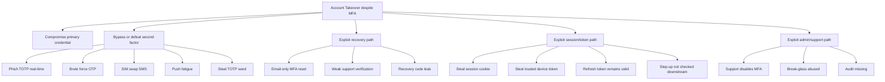
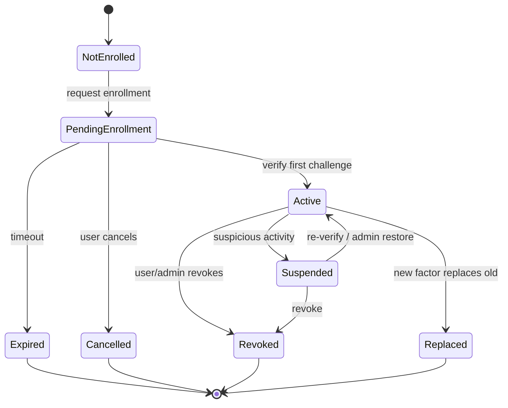
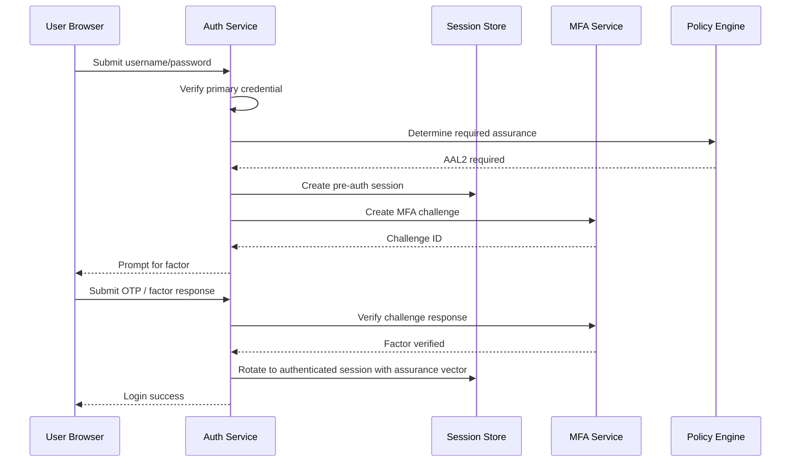
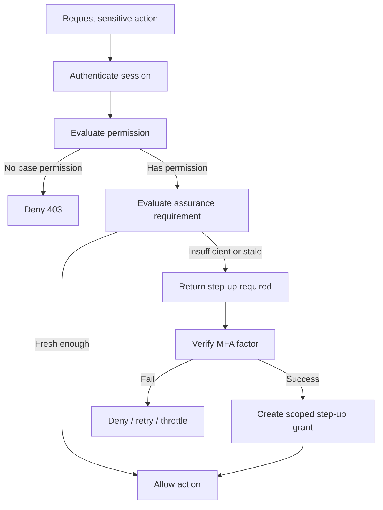
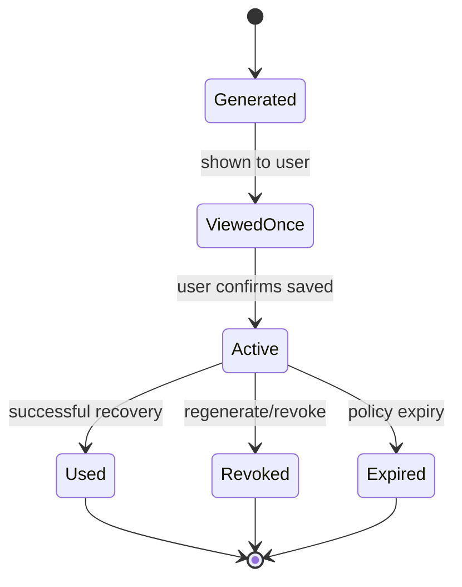
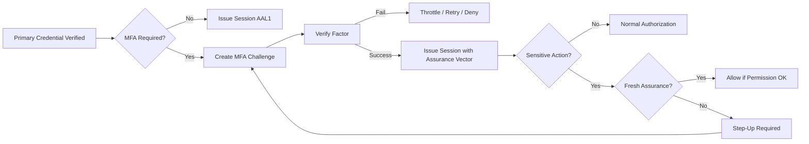
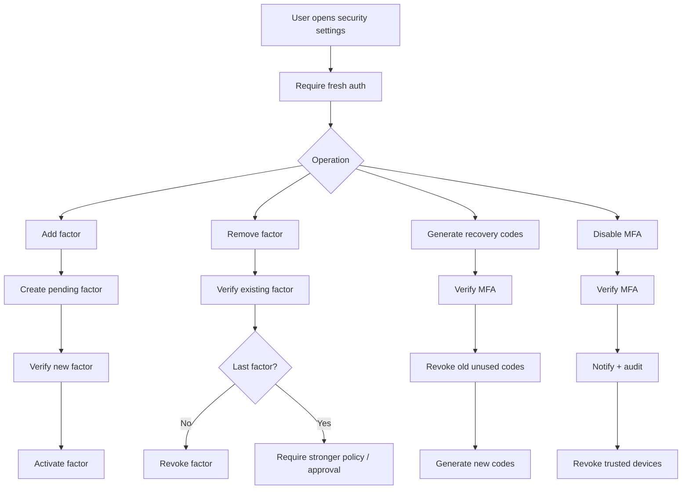
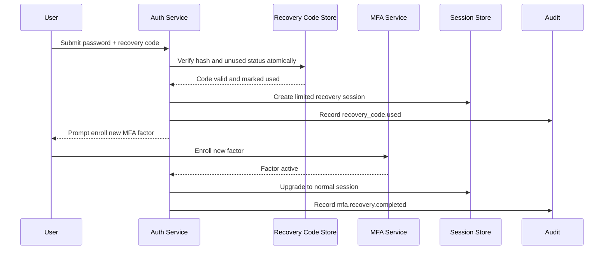

# learn-go-authentication-authorization-identity-permission-part-007.md

# Part 007 — MFA, OTP, TOTP, Recovery Codes, Step-Up Authentication di Go

> Seri: `learn-go-authentication-authorization-identity-permission`  
> Level: Advanced / internal engineering handbook  
> Target: Go 1.26.x  
> Fokus: MFA design, OTP/TOTP, recovery code, step-up authentication, assurance propagation, abuse resistance, Go implementation model  
> Prasyarat: Part 000–006 selesai dipahami

---

## Status Seri

Seri **belum selesai**.

Part ini adalah bagian ke-007 dari rencana maksimal 35 part.

Part sebelumnya:

- Part 000 — Orientation Handbook
- Part 001 — Mental Model: Identity, Authentication, Authorization, Permission
- Part 002 — Threat Model untuk Auth System
- Part 003 — Identity Domain Model
- Part 004 — Credential Lifecycle
- Part 005 — Assurance Levels: IAL, AAL, FAL, Risk-Based Authentication
- Part 006 — Password Authentication di Go

Part berikutnya:

- Part 008 — Passkeys & WebAuthn Relying Party Implementation di Go

---

## Daftar Isi

1. Tujuan Part Ini
2. Ringkasan Eksekutif
3. Mental Model: MFA Bukan Sekadar Kode Tambahan
4. Terminologi Presisi
5. Faktor, Authenticator, dan Assurance
6. Mengapa MFA Sering Tetap Gagal
7. Threat Model MFA
8. MFA dalam Identity Lifecycle
9. MFA Enrollment Flow
10. MFA Challenge Flow saat Login
11. Step-Up Authentication Flow
12. Factor Management Flow
13. Recovery Flow
14. Remembered Device dan Trusted Device
15. OTP, HOTP, dan TOTP
16. TOTP Algorithm Mental Model
17. TOTP Secret Management
18. TOTP Verification di Go
19. Recovery Codes yang Benar
20. Out-of-Band OTP: Email, SMS, Push
21. MFA Push dan MFA Fatigue
22. Transaction-Bound Authentication
23. Assurance Freshness dan Authentication Age
24. OIDC `acr`, `amr`, dan `auth_time`
25. Go Domain Model
26. Go Package Layout
27. Go Interfaces
28. HTTP Middleware dan Step-Up Gate
29. gRPC Interceptor dan Step-Up
30. Storage Model
31. Rate Limit dan Abuse Resistance
32. Audit Model
33. Distributed Systems Concerns
34. UX yang Aman
35. Testing Strategy
36. Failure Modes
37. Anti-Pattern
38. Production Checklist
39. Case Study: Regulatory Case Management
40. Mermaid Diagrams
41. Review Questions
42. Practical Exercises
43. Referensi Primer

---

## 1. Tujuan Part Ini

Setelah mempelajari part ini, kamu harus mampu:

1. Mendesain MFA sebagai bagian dari **assurance model**, bukan fitur UI.
2. Membedakan OTP, HOTP, TOTP, recovery code, push challenge, passkey, dan step-up.
3. Mengerti kapan MFA meningkatkan keamanan, kapan hanya memberi ilusi keamanan.
4. Mendesain enrollment, challenge, recovery, disable, reset, dan rotation flow secara aman.
5. Mengimplementasikan TOTP verification di Go dengan boundary yang benar.
6. Mendesain recovery code yang tidak menjadi backdoor permanen.
7. Memodelkan step-up authentication untuk aksi berisiko tinggi.
8. Menghindari bypass umum seperti MFA reset lemah, trusted device terlalu longgar, dan endpoint alternatif tanpa MFA.
9. Mendesain audit trail MFA yang dapat dipertanggungjawabkan.
10. Menghubungkan MFA dengan NIST AAL, OIDC `acr`, `amr`, `auth_time`, dan policy decision.

---

## 2. Ringkasan Eksekutif

MFA sering disalahpahami sebagai:

> “Tambahkan OTP setelah password, selesai.”

Pemahaman itu terlalu dangkal.

MFA yang benar adalah mekanisme untuk meningkatkan **confidence** bahwa claimant masih memiliki kontrol atas authenticator yang terdaftar, pada konteks tertentu, untuk aksi tertentu, dalam window waktu tertentu.

Artinya MFA bukan hanya:

- kode 6 digit,
- QR code,
- Google Authenticator,
- SMS OTP,
- tombol “enable 2FA”,
- atau middleware setelah login.

MFA adalah bagian dari lifecycle:

```text
identity proofing -> credential enrollment -> authentication -> session creation -> authorization -> step-up -> recovery -> revocation -> audit
```

Sistem yang bagus bertanya:

```text
Apakah actor ini cukup dipercaya untuk melakukan action ini terhadap resource ini sekarang?
```

Bukan hanya:

```text
Apakah user pernah memasukkan OTP hari ini?
```

Pada sistem enterprise/regulatory, MFA harus mampu menjawab:

- siapa yang melakukan autentikasi,
- faktor apa yang dipakai,
- kapan faktor itu diverifikasi,
- assurance level apa yang tercapai,
- apakah faktor itu phishing-resistant,
- apakah step-up dilakukan untuk aksi spesifik,
- apakah ada bypass/recovery/admin override,
- policy version apa yang mensyaratkan MFA,
- dan apakah audit trail cukup untuk rekonstruksi insiden.

---

## 3. Mental Model: MFA Bukan Sekadar Kode Tambahan

### 3.1 MFA sebagai assurance upgrade

Password-only login biasanya hanya membuktikan:

```text
claimant mengetahui secret yang diasosiasikan dengan account
```

MFA menambahkan bukti lain, misalnya:

```text
claimant juga menguasai authenticator terdaftar
```

atau:

```text
claimant hadir secara lokal pada perangkat yang menyimpan private key
```

atau:

```text
claimant mampu menyelesaikan challenge pada channel lain
```

MFA tidak otomatis membuktikan identitas legal seseorang. MFA membuktikan kontrol atas authenticator.

Kesalahan mental model:

```text
MFA success = user is definitely legitimate
```

Mental model yang lebih benar:

```text
MFA success = evidence tambahan bahwa claimant menguasai faktor yang telah dibound ke account/principal tertentu
```

MFA bisa tetap gagal jika:

- faktor dicuri,
- OTP diphishing real-time,
- SIM swap terjadi,
- recovery flow lemah,
- push approval disetujui karena fatigue,
- trusted device cookie dicuri,
- session upgrade tidak diterapkan ke semua endpoint,
- password reset otomatis membypass MFA,
- admin dapat disable MFA tanpa approval,
- service lama punya endpoint login tanpa MFA,
- token lama tetap valid setelah MFA berubah.

### 3.2 MFA sebagai state transition

Dalam sistem auth matang, MFA bukan boolean:

```go
User.MFAEnabled bool
```

Itu terlalu miskin.

MFA lebih tepat dipahami sebagai state machine:

```text
not_enrolled -> pending_enrollment -> active -> suspended -> revoked -> replaced
```

Dan setiap authentication attempt punya state:

```text
password_verified -> factor_required -> factor_challenged -> factor_verified -> session_issued
```

Step-up punya state sendiri:

```text
session_authenticated -> high_risk_action_requested -> step_up_required -> factor_verified_for_action -> action_allowed
```

### 3.3 MFA sebagai policy input

Authorization engine tidak seharusnya hanya menerima:

```go
principal.ID
principal.Roles
```

Untuk aksi sensitif, authorization engine perlu tahu:

```go
assurance.AAL
assurance.Methods
assurance.AuthenticatedAt
assurance.StepUpPerformedAt
assurance.StepUpReason
assurance.PhishingResistant
assurance.FederationAssurance
```

Maka decision bisa berbunyi:

```text
ALLOW approve_case only if:
- actor has permission case.approve
- case is in review state
- actor is not original submitter
- actor has AAL >= 2
- latest MFA age <= 10 minutes
- MFA method is not SMS for high-risk approval
```

Di sinilah MFA terhubung ke authorization dan regulatory defensibility.

---

## 4. Terminologi Presisi

### 4.1 Claimant

Claimant adalah pihak yang mengklaim identitas tertentu saat authentication.

Contoh:

```text
Browser session yang mengirim username/password dan OTP
```

Claimant belum tentu legitimate user.

### 4.2 Subject

Subject adalah entitas yang menjadi target authentication result.

Dalam OIDC, `sub` adalah stable subject identifier.

Dalam internal system, subject bisa:

- human user,
- service account,
- workload,
- external identity,
- delegated actor.

### 4.3 Authenticator

Authenticator adalah sesuatu yang digunakan claimant untuk membuktikan kontrol.

Contoh:

- password,
- TOTP seed dalam authenticator app,
- hardware OTP token,
- WebAuthn credential,
- recovery code,
- client certificate,
- cryptographic key,
- push approval app.

### 4.4 Factor

Factor adalah kategori bukti:

| Factor | Contoh | Risiko Umum |
|---|---|---|
| Knowledge | password, PIN | phished, reused, guessed |
| Possession | TOTP app, phone, hardware token | stolen, cloned, lost |
| Inherence | biometrics | spoofing, privacy, revocation sulit |

Namun sistem modern lebih baik berpikir dalam bentuk **authenticator strength** daripada sekadar kategori faktor.

Dua faktor yang lemah tidak otomatis lebih baik dari satu faktor yang phishing-resistant.

### 4.5 MFA

MFA adalah proses authentication yang memakai lebih dari satu faktor yang independen.

Namun “independen” harus dipikirkan serius.

Contoh bermasalah:

```text
password + email OTP
```

Jika email account juga bisa diakses dari browser/session yang sama, independence-nya rendah.

Contoh lebih kuat:

```text
password + WebAuthn security key
```

Karena faktor kedua origin-bound dan berbasis public key.

### 4.6 2FA vs MFA

2FA adalah kasus khusus MFA dengan dua faktor.

MFA lebih umum.

Dalam desain enterprise, gunakan istilah MFA karena sistem bisa punya:

- password + TOTP,
- password + WebAuthn,
- SSO + device certificate,
- passkey + risk challenge,
- admin approval + break-glass code.

### 4.7 OTP

OTP adalah one-time password.

Jenis umum:

- HOTP: counter/event-based OTP.
- TOTP: time-based OTP.
- email OTP.
- SMS OTP.
- recovery code.

Jangan menyamakan semua OTP. Sifat keamanan dan operasionalnya berbeda.

### 4.8 HOTP

HOTP memakai shared secret dan counter.

Server dan authenticator harus sinkron pada counter.

Masalah utama:

- resynchronization,
- counter drift,
- replay,
- brute force window.

### 4.9 TOTP

TOTP memakai shared secret dan time step.

Umumnya 30 detik per step, 6 digit, berbasis HMAC.

Masalah utama:

- shared secret harus disimpan recoverable,
- clock skew,
- phishing real-time,
- replay dalam window,
- seed leakage.

### 4.10 Recovery code

Recovery code adalah authenticator fallback.

Recovery code bukan “bantuan UX kecil”. Recovery code adalah **credential yang dapat membypass faktor utama**.

Perlakukan recovery code seperti high-value secret.

### 4.11 Step-up authentication

Step-up adalah meminta authentication tambahan saat:

- action lebih sensitif,
- context berubah,
- risk meningkat,
- assurance session tidak cukup,
- authentication terlalu lama.

Contoh:

- login biasa cukup AAL1,
- export semua data perlu AAL2 fresh dalam 10 menit,
- disable MFA perlu AAL2 + password re-entry,
- break-glass perlu AAL3 atau approval tambahan.

### 4.12 Reauthentication

Reauthentication adalah meminta user membuktikan lagi kontrol atas authenticator.

Reauthentication belum tentu MFA. Bisa password re-entry saja. Step-up biasanya menaikkan assurance, bukan hanya refresh password.

### 4.13 Authenticator binding

Binding adalah proses menghubungkan authenticator dengan subject/account.

Contoh:

```text
TOTP seed X bound to account A at time T by actor A after password verification
```

Binding harus diaudit.

### 4.14 Authenticator replacement

Replacement adalah mengganti faktor lama dengan faktor baru.

Ini flow berisiko tinggi karena attacker yang berhasil masuk bisa mengganti faktor untuk mengambil alih account.

### 4.15 Authenticator revocation

Revocation adalah menonaktifkan faktor.

Revocation harus berdampak pada:

- future challenges,
- remembered devices,
- active sessions jika perlu,
- refresh tokens,
- step-up cache,
- audit trail.

---

## 5. Faktor, Authenticator, dan Assurance

### 5.1 Jangan menilai MFA hanya dari jumlah faktor

Tiga contoh:

```text
password + SMS OTP
password + TOTP
passkey only
```

Mana yang lebih kuat?

Jawabannya tergantung ancaman.

Untuk phishing real-time:

- SMS OTP rentan.
- TOTP rentan.
- Passkey/WebAuthn jauh lebih kuat karena origin-bound.

Untuk kehilangan perangkat:

- passkey synced bisa dipulihkan via platform account.
- hardware key bisa hilang.
- TOTP seed bisa hilang jika tidak backup.

Untuk server compromise:

- TOTP seed di server harus recoverable untuk verification.
- WebAuthn hanya menyimpan public key di server.

Maka decision tidak boleh hanya:

```go
if user.MFAEnabled { allow }
```

Lebih baik:

```go
if assurance.Level >= AAL2 && assurance.AuthAge <= 10*time.Minute { allow }
```

Dan untuk aksi tertentu:

```go
if assurance.PhishingResistant && assurance.AuthAge <= 5*time.Minute { allow }
```

### 5.2 Authenticator strength matrix

| Authenticator | Strength | Weakness | Suitable For |
|---|---:|---|---|
| Password only | Low | reuse, phishing, guessing | low-risk account |
| Email OTP | Low–Medium | email compromise, same-device weakness | recovery, low-risk step-up |
| SMS OTP | Low–Medium | SIM swap, SS7, malware, phishing | fallback only, regulated caution |
| TOTP app | Medium | phishing, seed theft, replay window | common AAL2-like MFA |
| Push approval | Medium | MFA fatigue, device compromise | consumer/mobile convenience |
| Push number matching | Medium+ | still social-engineerable | better push MFA |
| Hardware OTP | Medium | phishing, physical loss | legacy enterprise |
| WebAuthn platform passkey | High | ecosystem/account recovery dependency | phishing-resistant login |
| WebAuthn roaming key | High | physical loss, provisioning | admin/high-risk roles |
| Client certificate | Medium–High | lifecycle/device mgmt | enterprise device/workload |
| Recovery code | Emergency | theft, reuse if not one-time | fallback only |

### 5.3 Independence matters

MFA harus mengurangi probability bahwa satu compromise path cukup untuk account takeover.

Buruk:

```text
login password reset via email + email OTP as second factor
```

Jika attacker menguasai email, semua runtuh.

Lebih baik:

```text
email recovery requires existing TOTP or recovery code or support workflow
```

Untuk admin:

```text
disable MFA requires current MFA + password re-entry + audit + notification
```

### 5.4 Authenticator possession bukan identity proofing

MFA tidak sama dengan identity proofing.

Jika user palsu berhasil mendaftar dan enroll TOTP, MFA hanya membuktikan bahwa user palsu itu masih menguasai TOTP-nya.

Identity proofing dibahas di assurance/IAL. MFA terutama menaikkan AAL.

---

## 6. Mengapa MFA Sering Tetap Gagal

MFA gagal bukan karena konsepnya buruk, tapi karena implementasinya sering punya lubang.

### 6.1 MFA hanya diterapkan pada login utama

Attacker mencari endpoint alternatif:

- mobile API lama,
- legacy login,
- password reset,
- session refresh,
- OAuth device flow,
- admin API,
- support tool,
- internal endpoint,
- remembered device bypass,
- SSO callback yang auto-provisions session.

Invariant:

```text
Setiap path yang menghasilkan authenticated session harus melewati assurance gate yang sama.
```

### 6.2 Recovery flow lebih lemah dari login flow

Banyak account takeover terjadi lewat recovery.

Jika recovery hanya butuh email link, maka MFA menjadi dekorasi.

Rule:

```text
Recovery flow must not be materially weaker than the risk it unlocks.
```

### 6.3 MFA enrollment tanpa proof yang cukup

Jika attacker login dengan password curian lalu enroll MFA miliknya sendiri, account terkunci untuk owner asli.

Enrollment harus butuh:

- password re-entry,
- existing factor jika ada,
- recent authentication,
- suspicious context detection,
- notification,
- cooldown untuk high-risk account.

### 6.4 MFA disable terlalu mudah

Jika user bisa disable MFA hanya dengan session lama:

```text
stolen session -> disable MFA -> change password -> takeover
```

Disable MFA harus dianggap aksi high-risk.

### 6.5 Session tidak dinaikkan assurance-nya dengan benar

Setelah OTP benar, sistem harus menyimpan:

- factor used,
- time verified,
- assurance level,
- method reference,
- session ID,
- step-up scope.

Bukan hanya:

```go
session.MFAPassed = true
```

Karena `MFAPassed` tanpa timestamp, method, dan purpose tidak cukup untuk policy.

### 6.6 OTP bisa diphishing real-time

TOTP dan SMS OTP dapat dipakai attacker secara real-time:

```text
victim -> fake login page -> attacker relays password and OTP -> real site
```

Karena itu TOTP bukan phishing-resistant.

### 6.7 Push MFA fatigue

Attacker mengirim banyak push challenge sampai user menekan approve.

Mitigasi:

- number matching,
- challenge details,
- rate limit,
- deny reason,
- suspicious challenge notification,
- block after repeated denial,
- device unlock requirement,
- no blind approve.

### 6.8 Trusted device cookie dicuri

Remembered device sering jadi bypass permanen.

Jika cookie trusted device dicuri, attacker bisa melewati MFA.

Mitigasi:

- bind ke device/session properties secara hati-hati,
- rotate token,
- store hash server-side,
- short TTL,
- invalidate saat password/MFA berubah,
- require step-up untuk high-risk action tetap.

### 6.9 MFA state tidak konsisten antar service

Dalam microservices, service A tahu MFA aktif, service B tidak.

Atau gateway menandai MFA sukses, tetapi service downstream tidak memverifikasi claim.

Mitigasi:

- normalized principal context,
- signed internal token dengan assurance claims,
- centralized PDP,
- clear freshness semantics,
- no blind trust from arbitrary headers.

---

## 7. Threat Model MFA

### 7.1 Assets

MFA melindungi:

- account access,
- high-risk action,
- administrative capability,
- session elevation,
- credential management,
- tenant boundary,
- export/report data,
- approval/decision action,
- delegated access,
- break-glass access,
- audit integrity.

### 7.2 Attacker capabilities

Pertimbangkan attacker yang bisa:

- mengetahui password user,
- mengakses email user,
- melakukan phishing real-time,
- mencuri session cookie,
- mencuri refresh token,
- melakukan SIM swap,
- brute force OTP,
- mengeksploitasi rate limit gap,
- memakai endpoint lama,
- mencoba reset MFA lewat support,
- melakukan social engineering,
- membaca database backup,
- membaca application logs,
- mengontrol reverse proxy internal,
- menyuntik header internal,
- memperoleh privilege support staff,
- mengeksploitasi race condition saat enrollment.

### 7.3 Threat taxonomy

| Threat | Description | Design Response |
|---|---|---|
| OTP brute force | Menebak kode 6 digit | rate limit, attempt counter, short challenge TTL |
| OTP replay | Kode sama dipakai dua kali | record used time-step/challenge nonce |
| Real-time phishing | OTP direlay ke situs asli | WebAuthn/passkey, risk signal, short TTL |
| Seed exfiltration | TOTP seed bocor dari DB/log | envelope encryption, secret redaction, access control |
| SIM swap | SMS OTP diarahkan ke attacker | avoid SMS for high-risk, cooldown on phone change |
| MFA fatigue | User ditekan approve push | number matching, deny feedback, rate limit |
| Recovery bypass | Recovery lebih lemah | recovery codes, support workflow, step-up |
| Trusted device theft | Bypass cookie dicuri | server-side hash, rotation, TTL, invalidation |
| Session upgrade bug | MFA tidak menaikkan assurance dengan benar | assurance vector in session |
| Endpoint bypass | API lama tidak memaksa MFA | central auth gate, route inventory |
| Admin bypass | Support disable MFA sembarangan | approval, audit, dual control |
| Tenant breakout | MFA state salah tenant | tenant-scoped factor and session |
| Clock manipulation | TOTP accepted terlalu luas | narrow skew, NTP monitoring |
| Enumeration | Error reveals MFA enabled | generic responses |

### 7.4 Attack tree: account takeover despite MFA



---

## 8. MFA dalam Identity Lifecycle

MFA harus menempel pada lifecycle identity, bukan berdiri sendiri.

### 8.1 Lifecycle map

```text
Account created
  -> primary credential set
  -> email/phone verified
  -> MFA enrollment offered/required
  -> MFA factor bound
  -> login challenge
  -> session assurance established
  -> step-up for sensitive action
  -> factor rotation/replacement
  -> factor recovery
  -> factor revoked
  -> account deactivated
```

### 8.2 MFA state sebagai aggregate

Dalam domain-driven view, `MFAEnrollment` adalah aggregate atau bagian dari `Credential` aggregate.

Minimal state:

```text
FactorEnrollment
- id
- subject_id
- tenant_id
- factor_type
- status
- secret_ref/public_key_ref
- enrolled_at
- enrolled_by_actor_id
- verified_at
- last_used_at
- revoked_at
- revoked_by_actor_id
- assurance_level
- phishing_resistant
- metadata
```

### 8.3 MFA policy sebagai konfigurasi eksplisit

Jangan hardcode:

```go
if user.Role == "admin" { requireMFA = true }
```

Lebih baik:

```text
MFA policy:
- tenant_id
- subject_type
- role_pattern
- action_pattern
- resource_pattern
- required_aal
- required_method
- max_auth_age
- allow_recovery_code
- allow_sms
- effective_from
- policy_version
```

Ini penting agar audit bisa menjawab:

```text
Pada tanggal X, mengapa action Y membutuhkan/tidak membutuhkan MFA?
```

---

## 9. MFA Enrollment Flow

### 9.1 Tujuan enrollment

Enrollment mengikat authenticator baru ke subject/account.

Security question:

```text
Apakah actor yang sedang enroll faktor ini memang legitimate subject/authorized admin?
```

### 9.2 Enrollment phases

Untuk TOTP:

```text
1. User authenticated with fresh session
2. User requests TOTP enrollment
3. Server creates pending factor with generated secret
4. Server shows otpauth URI/QR
5. User scans QR
6. User submits first TOTP code
7. Server verifies code
8. Server activates factor
9. Server issues recovery codes or requires backup factor
10. Server sends notification
11. Server writes audit event
```

### 9.3 Jangan aktifkan faktor sebelum diverifikasi

Buruk:

```text
generate TOTP secret -> save active -> show QR
```

Jika user gagal scan, account bisa masuk state aneh.

Lebih baik:

```text
generate TOTP secret -> pending -> verify code -> active
```

### 9.4 Enrollment state machine



### 9.5 Preconditions untuk enrollment

Enrollment faktor baru harus mensyaratkan:

- authenticated session,
- password re-entry atau existing MFA jika account sudah punya MFA,
- session freshness,
- no suspicious lock state,
- tenant context jelas,
- CSRF protection untuk web flow,
- audit event.

### 9.6 Enrollment notification

Setiap enrollment faktor baru harus memicu notification.

Isi notification:

- factor type,
- time,
- approximate location/device jika tersedia,
- action jika tidak mengenali aktivitas,
- link untuk secure recovery path.

Jangan memasukkan secret atau recovery code dalam email notification.

### 9.7 Enrollment cooldown

Untuk account berisiko tinggi:

- setelah password reset, jangan langsung izinkan enroll factor baru tanpa additional verification.
- setelah email/phone berubah, delay penggunaan channel itu untuk recovery.
- setelah factor baru ditambahkan, mungkin perlu cooldown sebelum bisa disable factor lama.

Trade-off:

```text
cooldown meningkatkan keamanan tetapi bisa mengganggu account recovery legitimate
```

Solusi enterprise:

- risk-tiered cooldown,
- admin approval,
- break-glass policy,
- manual verification.

---

## 10. MFA Challenge Flow saat Login

### 10.1 Login bukan satu event tunggal

Login dengan MFA terdiri dari beberapa tahap:

```text
Start login
  -> primary credential verified
  -> determine required assurance
  -> select challenge
  -> verify factor
  -> create session
```

Jangan membuat full session sebelum MFA selesai kecuali session itu diberi status terbatas.

### 10.2 Pre-MFA session

Setelah password benar, sebelum MFA benar, sistem bisa membuat temporary session:

```text
pre_auth_session
- short TTL
- cannot access application resources
- bound to login attempt
- only allowed to submit MFA challenge
- rotated after MFA success
```

Jangan pakai session penuh lalu hanya menyembunyikan UI.

### 10.3 Login flow diagram



### 10.4 Challenge selection

Jika user punya banyak faktor:

- default ke faktor terkuat,
- izinkan fallback sesuai risk,
- jangan tampilkan detail yang memudahkan attacker,
- jangan reveal “user has MFA enabled” pada tahap username enumeration.

Contoh policy:

```text
Admin:
- prefer WebAuthn
- allow TOTP fallback only for login
- no SMS for privileged action

Normal user:
- TOTP or passkey
- email OTP fallback only for recovery
```

### 10.5 Challenge TTL

OTP challenge harus punya TTL.

Untuk TOTP, time window sudah ada, tapi login challenge tetap perlu TTL agar pre-auth session tidak hidup lama.

Contoh:

```text
pre-auth session TTL: 5 minutes
TOTP accepted skew: previous/current/next step at most
attempt limit: 5 attempts per challenge
lock escalation: per account + per IP + per device fingerprint
```

### 10.6 Error response

Jangan bedakan terlalu spesifik:

Buruk:

```text
Password correct, but TOTP wrong.
```

Lebih baik:

```text
Authentication failed. Check your credentials and verification code.
```

Namun untuk user legitimate, UX perlu tetap jelas di UI state setelah password sudah diverifikasi. Pisahkan external message dengan internal event code.

---

## 11. Step-Up Authentication Flow

### 11.1 Apa bedanya step-up dengan login MFA?

Login MFA menaikkan assurance saat membuat session.

Step-up meminta bukti tambahan saat session yang ada tidak cukup untuk action tertentu.

Contoh:

```text
User login pukul 09:00 dengan password+TOTP.
User ingin export semua case pukul 15:00.
Policy mensyaratkan MFA fresh <= 10 menit.
Maka user harus step-up lagi.
```

### 11.2 Step-up harus action-aware

Buruk:

```go
session.MFAPassed = true
```

Lebih baik:

```go
StepUpGrant{
    SubjectID: subjectID,
    ActorID: actorID,
    SessionID: sessionID,
    Action: "case.export",
    ResourcePattern: "tenant:cea/*",
    AssuranceLevel: AAL2,
    Method: "totp",
    VerifiedAt: now,
    ExpiresAt: now.Add(10*time.Minute),
    ChallengeID: challengeID,
}
```

### 11.3 Step-up gate

Authorization flow:

```text
request action
  -> authenticate session
  -> authorize base permission
  -> evaluate assurance requirement
  -> if insufficient: return step-up required
  -> verify factor
  -> create step-up grant
  -> retry action
```

### 11.4 Step-up Mermaid



### 11.5 Step-up response design

HTTP response could be:

```http
HTTP/1.1 403 Forbidden
Content-Type: application/json

{
  "error": "step_up_required",
  "required_aal": 2,
  "max_auth_age_seconds": 600,
  "challenge_options": ["totp", "webauthn"]
}
```

But be careful: do not expose policy internals unnecessarily to unauthenticated callers.

### 11.6 Step-up grants must be scoped

Do not make step-up global for hours.

Safer:

```text
step-up valid for:
- same session,
- same actor,
- same tenant,
- same action group,
- short time window,
- optionally same resource or resource class.
```

### 11.7 Step-up for critical actions

Examples:

| Action | Step-Up Requirement |
|---|---|
| Change password | password re-entry + MFA |
| Disable MFA | MFA + notification + audit |
| Add new admin | AAL2 fresh <= 5 min |
| Export report | AAL2 fresh <= 10 min |
| Approve enforcement action | AAL2 + separation of duties |
| Break-glass access | AAL3 or dual approval |
| Change bank/payment info | phishing-resistant factor preferred |

---

## 12. Factor Management Flow

### 12.1 Factor management is high risk

Operations:

- add factor,
- remove factor,
- replace factor,
- rename device,
- set default factor,
- generate recovery codes,
- view recovery codes,
- disable MFA,
- reset MFA via support.

These must be protected.

### 12.2 Add factor

Required controls:

- fresh session,
- existing MFA if available,
- password re-entry,
- pending state,
- verification before active,
- notification,
- audit.

### 12.3 Remove factor

If account has multiple factors, removal can be allowed with fresh MFA.

If removing last factor:

- require stronger verification,
- possibly require admin approval for privileged users,
- warn user,
- invalidate remembered devices,
- audit as high-risk event.

### 12.4 Replace factor

Replacement is effectively:

```text
add new factor -> verify new factor -> revoke old factor
```

Avoid atomic replacement that leaves account without active factor on failure.

### 12.5 Generate new recovery codes

Generating recovery codes invalidates old unused codes.

Require MFA.

Store only hashes.

Show codes only once.

### 12.6 Disable MFA

Disable MFA should rarely be self-service without additional checks.

Controls:

- fresh MFA,
- password re-entry,
- notification,
- cooldown,
- invalidate sessions/tokens if risk high,
- require support approval for admin accounts.

---

## 13. Recovery Flow

### 13.1 Recovery is part of auth, not support afterthought

Recovery is often the weakest link.

If recovery can bypass MFA, then recovery flow defines real account security.

### 13.2 Recovery goals

Recovery should:

- restore legitimate access,
- prevent attacker takeover,
- preserve audit evidence,
- avoid permanent lockout,
- minimize support burden,
- scale with account risk.

### 13.3 Recovery paths

Possible paths:

1. Use recovery code.
2. Use another enrolled factor.
3. Use WebAuthn backup credential.
4. Use verified support workflow.
5. Use organization admin reset.
6. Use delayed recovery email with cooldown.
7. Use offline process for high-assurance accounts.

### 13.4 Recovery code flow

```text
1. User selects recovery code path
2. User submits username/password
3. User submits recovery code
4. Server verifies hash and unused status
5. Server marks recovery code used atomically
6. Server grants limited recovery session
7. User enrolls new MFA factor
8. Server invalidates old sessions/remembered devices if needed
9. Server sends notification
10. Server writes audit event
```

### 13.5 Recovery session should be limited

After recovery code succeeds, do not immediately grant full application access.

Safer:

```text
recovery session can only:
- enroll new factor,
- rotate password if needed,
- view security settings,
- contact support.
```

After new factor is verified, create normal session.

### 13.6 Support reset risk

Support reset is dangerous.

Controls:

- ticket linkage,
- identity verification checklist,
- supervisor approval for privileged account,
- reason code,
- no secret disclosure,
- reset produces pending state, not direct disable,
- mandatory notification,
- immutable audit.

### 13.7 Enterprise/org admin reset

In B2B/enterprise systems, tenant admin might reset user MFA.

Risks:

- malicious tenant admin,
- compromised tenant admin,
- wrong tenant boundary,
- insider abuse.

Controls:

- tenant-scoped authority,
- cannot reset higher privilege user without dual control,
- cannot reset platform admin,
- reason required,
- notification to user and tenant security contact,
- audit event includes actor and tenant.

---

## 14. Remembered Device dan Trusted Device

### 14.1 What it is

Remembered device allows user to skip MFA for a period after successful MFA on a device.

It improves UX but weakens security.

### 14.2 It is a bypass token

Treat remembered device token as credential.

Bad:

```text
remembered=true in unsigned cookie
```

Better:

```text
random high-entropy token in secure cookie
server stores hash(token) with subject/session/device metadata
```

### 14.3 Trusted device data model

```text
TrustedDevice
- id
- subject_id
- tenant_id
- token_hash
- created_at
- last_used_at
- expires_at
- revoked_at
- created_from_session_id
- last_ip_hash
- user_agent_hash
- risk_score_at_creation
- factor_id_used
```

### 14.4 Cookie controls

Use:

- `Secure`
- `HttpOnly`
- `SameSite=Lax` or `Strict` depending flow
- narrow path/domain
- rotation on use if feasible
- short TTL for high-risk users

### 14.5 Invalidation events

Invalidate remembered devices when:

- password changed,
- MFA factor added/removed,
- account recovery used,
- suspicious login detected,
- user signs out all devices,
- admin revokes device,
- tenant policy changes.

### 14.6 Trusted device is not enough for high-risk actions

Even if login MFA skipped due to trusted device, high-risk action can still require step-up.

```text
trusted device may satisfy login convenience, not sensitive action assurance
```

---

## 15. OTP, HOTP, dan TOTP

### 15.1 OTP categories

| Type | Moving Factor | Server State | Common Use |
|---|---|---|---|
| HOTP | Counter | counter sync | hardware token, event-based token |
| TOTP | Time step | secret + replay tracking | authenticator app |
| Email OTP | Random challenge | challenge store | email verification/recovery |
| SMS OTP | Random challenge | challenge store | fallback/legacy |
| Recovery code | Pre-generated secret | hash + used flag | account recovery |

### 15.2 HOTP

HOTP uses:

```text
HOTP(K, C) = Truncate(HMAC-SHA-1(K, C))
```

Where:

- `K` is shared secret.
- `C` is counter.

Problems:

- server and client counter can drift,
- server may need look-ahead window,
- look-ahead increases brute force surface,
- accepted counter must advance atomically.

### 15.3 TOTP

TOTP extends HOTP by replacing counter with time-step counter:

```text
T = floor((CurrentUnixTime - T0) / X)
TOTP = HOTP(K, T)
```

Common values:

- `T0 = 0`
- `X = 30 seconds`
- digits = 6
- hash = SHA-1 for compatibility, though SHA-256/SHA-512 are supported by spec.

### 15.4 TOTP weakness

TOTP is convenient and widely supported, but:

- it is not phishing-resistant,
- server must store recoverable secret,
- code can be replayed within accepted window unless tracked,
- attacker with DB secret can generate codes,
- malware on phone can read code,
- clock issues can cause false rejects.

### 15.5 TOTP security value

TOTP still adds value because attacker needs more than password in many attack classes.

It is useful against:

- password reuse,
- credential stuffing,
- leaked password database,
- basic phishing that does not relay in real time,
- remote attacker without device/seed.

It is weak against:

- real-time phishing proxy,
- server-side seed compromise,
- endpoint malware,
- social engineering with live OTP collection.

---

## 16. TOTP Algorithm Mental Model

### 16.1 Timeline

Assume 30-second step:

```text
12:00:00 - 12:00:29 -> code A
12:00:30 - 12:00:59 -> code B
12:01:00 - 12:01:29 -> code C
```

Verifier may accept:

```text
previous, current, next
```

to handle clock skew.

But wider window means more valid codes.

### 16.2 Brute force math

For 6-digit OTP:

```text
1,000,000 possible codes
```

If server accepts 3 time steps:

```text
3 valid codes per secret at a time
```

Probability per random attempt roughly:

```text
3 / 1,000,000
```

With unlimited attempts, attacker eventually succeeds.

Therefore rate limiting is mandatory.

### 16.3 Replay within time window

If user submits code for current step, attacker who sees it might replay before window ends.

Mitigation:

- record last successful time-step per factor,
- reject same time-step reuse for same factor,
- tie verification to challenge/session when possible.

Caveat:

If accepting previous/current/next, carefully handle race and clock skew.

### 16.4 Atomic verification

TOTP verification must atomically:

1. Validate code.
2. Check not replayed.
3. Increment attempt/mark success.
4. Update last used step.
5. Emit audit.

Race condition example:

```text
Two requests submit same valid TOTP concurrently.
Both read last_used_step = 100.
Both verify step 101.
Both succeed.
```

Mitigation:

- database transaction with row lock,
- compare-and-swap update,
- unique constraint on `(factor_id, time_step)` in used table.

---

## 17. TOTP Secret Management

### 17.1 TOTP secret must be recoverable

Unlike password, TOTP secret cannot be stored only as a hash because verifier must compute expected code.

Therefore:

- store encrypted secret,
- keep encryption key outside DB,
- restrict access,
- never log secret,
- never expose secret after enrollment,
- rotate/re-enroll if suspected compromise.

### 17.2 Envelope encryption model

```text
TOTP seed -> encrypted with data key -> data key encrypted by KMS/master key
```

Store:

```text
encrypted_seed
key_id
algorithm
created_at
```

Do not store plaintext seed.

### 17.3 Secret length

Use high entropy random secret.

Common authenticator apps encode seed as Base32.

Do not use:

- user ID,
- email,
- timestamp,
- deterministic secret,
- weak random.

### 17.4 Secret lifecycle

```text
generated -> pending -> active -> rotated/replaced -> revoked -> destroyed according to retention policy
```

### 17.5 Secret access boundary

Only MFA verification service should decrypt TOTP seed.

Application services should ask:

```text
VerifyFactor(challenge, response) -> assurance result
```

They should not receive TOTP seed.

---

## 18. TOTP Verification di Go

### 18.1 Prefer library for production

For production, use vetted libraries where possible, with review and dependency management.

One popular Go package is `github.com/pquerna/otp/totp`, which supports generating and validating TOTP compatible with common authenticator apps.

However, top engineers still understand the algorithm so they can review:

- skew,
- period,
- digits,
- replay prevention,
- secret storage,
- error handling,
- rate limiting,
- transaction semantics.

### 18.2 Educational HOTP implementation

This code is educational. In production, prefer a reviewed library and wrap it behind your own interface.

```go
package mfaotp

import (
    "crypto/hmac"
    "crypto/sha1"
    "encoding/binary"
    "fmt"
)

func HOTP(secret []byte, counter uint64, digits int) (string, error) {
    if len(secret) < 16 {
        return "", fmt.Errorf("secret too short")
    }
    if digits < 6 || digits > 8 {
        return "", fmt.Errorf("unsupported digit length")
    }

    var buf [8]byte
    binary.BigEndian.PutUint64(buf[:], counter)

    mac := hmac.New(sha1.New, secret)
    _, _ = mac.Write(buf[:])
    sum := mac.Sum(nil)

    offset := sum[len(sum)-1] & 0x0f
    binaryCode := (uint32(sum[offset])&0x7f)<<24 |
        (uint32(sum[offset+1])&0xff)<<16 |
        (uint32(sum[offset+2])&0xff)<<8 |
        (uint32(sum[offset+3]) & 0xff)

    mod := uint32(1)
    for i := 0; i < digits; i++ {
        mod *= 10
    }

    otp := binaryCode % mod
    return fmt.Sprintf("%0*d", digits, otp), nil
}
```

### 18.3 TOTP wrapper

```go
package mfaotp

import "time"

func TOTP(secret []byte, now time.Time, period time.Duration, digits int) (string, uint64, error) {
    if period <= 0 {
        period = 30 * time.Second
    }
    step := uint64(now.Unix() / int64(period.Seconds()))
    code, err := HOTP(secret, step, digits)
    return code, step, err
}
```

### 18.4 Verification with skew

```go
package mfaotp

import (
    "crypto/subtle"
    "time"
)

type VerifyResult struct {
    OK       bool
    TimeStep uint64
}

func VerifyTOTP(secret []byte, submitted string, now time.Time, period time.Duration, digits int, skew int) (VerifyResult, error) {
    if skew < 0 || skew > 1 {
        // Wide skew windows make brute force easier.
        skew = 1
    }

    current := int64(now.Unix() / int64(period.Seconds()))

    for delta := -skew; delta <= skew; delta++ {
        step := current + int64(delta)
        if step < 0 {
            continue
        }

        expected, err := HOTP(secret, uint64(step), digits)
        if err != nil {
            return VerifyResult{}, err
        }

        if subtle.ConstantTimeCompare([]byte(expected), []byte(submitted)) == 1 {
            return VerifyResult{OK: true, TimeStep: uint64(step)}, nil
        }
    }

    return VerifyResult{OK: false}, nil
}
```

### 18.5 Important caveat on constant-time comparison

Constant-time compare only helps if input length is normalized.

Before comparing:

- enforce numeric-only,
- enforce exact digit length,
- reject too long input,
- avoid variable error timing as much as practical.

Example:

```go
func NormalizeOTP(s string, digits int) (string, bool) {
    if len(s) != digits {
        return "", false
    }
    for _, r := range s {
        if r < '0' || r > '9' {
            return "", false
        }
    }
    return s, true
}
```

### 18.6 Verification service interface

```go
package mfa

import (
    "context"
    "time"
)

type FactorType string

const (
    FactorTOTP         FactorType = "totp"
    FactorRecoveryCode FactorType = "recovery_code"
    FactorWebAuthn     FactorType = "webauthn"
    FactorEmailOTP     FactorType = "email_otp"
    FactorSMSOTP       FactorType = "sms_otp"
)

type VerifyFactorCommand struct {
    TenantID      string
    SubjectID     string
    ActorID       string
    SessionID     string
    ChallengeID   string
    FactorID      string
    FactorType    FactorType
    Response      string
    ClientIP      string
    UserAgent     string
    RequestedAAL  int
    Purpose       string
    Now           time.Time
}

type AssuranceResult struct {
    Verified              bool
    AAL                   int
    Method                string
    FactorID              string
    PhishingResistant     bool
    AuthenticatedAt       time.Time
    MaxAge                time.Duration
    StepUpPurpose         string
    StepUpExpiresAt       time.Time
}

type FactorVerifier interface {
    VerifyFactor(ctx context.Context, cmd VerifyFactorCommand) (AssuranceResult, error)
}
```

### 18.7 Do not expose implementation details to app handlers

Bad handler:

```go
seed := db.GetTOTPSeed(userID)
if totp.Validate(code, seed) { ... }
```

Better:

```go
result, err := mfaVerifier.VerifyFactor(ctx, cmd)
if err != nil { ... }
if !result.Verified { ... }
session.UpgradeAssurance(result)
```

This keeps secret handling inside MFA module/service.

---

## 19. Recovery Codes yang Benar

### 19.1 Recovery codes are authenticators

Recovery codes are not metadata.

They are credentials that can unlock account access.

Treat them like password-equivalent or stronger.

### 19.2 Properties

Recovery codes should be:

- high entropy,
- single-use,
- generated server-side with CSPRNG,
- shown only once,
- stored hashed,
- rate-limited,
- auditable,
- revocable,
- regenerated with old codes invalidated.

### 19.3 Format

Human-friendly examples:

```text
9K7P-L3QD-R2MA
Q4HX-8N2C-VP7T
```

Avoid ambiguous characters if possible:

```text
0/O, 1/I/L
```

But do not reduce entropy too much.

### 19.4 Entropy

A 6-digit OTP has ~20 bits of entropy.

Recovery code should be much stronger, because:

- valid longer,
- often stored offline by user,
- bypasses MFA.

Aim for at least 128-bit generated secret before formatting, or a practical high entropy equivalent.

### 19.5 Store recovery code hashes

Unlike TOTP seed, recovery codes can be hashed.

Use password hashing? Usually recovery codes are high entropy, so keyed HMAC or strong hash with server-side pepper can be acceptable depending design. If codes are shorter/human-entered, use password-hash style KDF.

A practical design:

```text
display_code = formatted random 128-bit secret
stored_hash = HMAC-SHA256(server_pepper, normalized_code)
```

Because random 128-bit code is not brute-forceable if rate limited and pepper protected.

For shorter recovery codes, use Argon2id/bcrypt-like approach.

### 19.6 Atomic use

Recovery code verification must atomically mark used.

Schema pattern:

```sql
UPDATE recovery_codes
SET used_at = :now,
    used_by_session_id = :session_id
WHERE subject_id = :subject_id
  AND code_hash = :code_hash
  AND used_at IS NULL
  AND revoked_at IS NULL;
```

Success only if affected rows = 1.

### 19.7 Recovery code lifecycle



### 19.8 Do not email recovery codes

Emailing recovery codes undermines security because email is often part of recovery attack surface.

Better:

- show once in secure web session,
- encourage password manager storage,
- allow download/print with warning,
- never show again.

---

## 20. Out-of-Band OTP: Email, SMS, Push

### 20.1 Out-of-band definition

Out-of-band means authenticator interaction happens through a separate channel from primary session.

Examples:

- SMS code,
- email code,
- push app notification,
- voice call.

### 20.2 Channel independence matters

Email OTP is weak if attacker already controls email.

SMS OTP is weak if attacker can SIM swap or intercept messages.

Push is weak if user blindly approves.

### 20.3 Email OTP

Acceptable for:

- email verification,
- low-risk recovery,
- low-risk step-up,
- user notification.

Dangerous for:

- high-risk admin action,
- disabling MFA,
- account recovery when email is compromised,
- financial transaction authorization.

Controls:

- short TTL,
- one-time challenge ID,
- rate limit send and verify,
- generic responses,
- invalidate old codes on new code generation,
- bind code to purpose.

### 20.4 SMS OTP

SMS should be treated as restricted/legacy fallback in high security systems.

Risks:

- SIM swap,
- number recycling,
- SMS interception,
- malware,
- phishing,
- delivery reliability,
- international cost.

Controls:

- avoid for privileged users,
- cooldown after phone number change,
- notification to old number/email,
- carrier change detection where available,
- rate limit,
- never use SMS as only recovery for high-risk accounts.

### 20.5 Push OTP / push approve

Push can be convenient but must include context:

- application name,
- action,
- approximate location,
- device,
- number matching,
- deny button,
- report fraud option.

Bad:

```text
Approve login? [Approve] [Deny]
```

Better:

```text
Login attempt to ACEAS Admin Console
Location: Singapore
Browser: Chrome on Windows
Enter number 42 shown in browser
[Approve] [Deny, not me]
```

### 20.6 Bind challenge to purpose

OTP should be bound to purpose.

Do not allow code issued for email verification to authorize password reset.

Challenge record:

```text
challenge_id
subject_id
factor_type
purpose
resource_scope
action
expires_at
attempts
status
```

---

## 21. MFA Push dan MFA Fatigue

### 21.1 Attack

Attacker with password repeatedly triggers push prompts.

User eventually approves to stop annoyance.

### 21.2 Mitigations

1. Number matching.
2. Rate limit push challenge creation.
3. Cooldown after deny.
4. Display context.
5. Fraud report button.
6. Require device unlock/biometric locally.
7. Block repeated challenge after suspicious pattern.
8. Notify user through separate channel.
9. Do not allow unlimited retries.
10. Use phishing-resistant factor for high-risk roles.

### 21.3 Challenge fatigue risk state

```text
push_sent_count_last_5m
push_denied_count_last_5m
push_ignored_count_last_5m
new_location
new_device
password_recently_failed_many_times
```

If risk high:

```text
Do not send more pushes. Require explicit user-initiated challenge or stronger factor.
```

---

## 22. Transaction-Bound Authentication

### 22.1 Why normal MFA may not be enough

Normal MFA says:

```text
user authenticated recently
```

Transaction-bound authentication says:

```text
user approved this specific action with these parameters
```

For high-risk systems, step-up should bind to transaction details.

Example:

```text
Approve enforcement case C-2026-000123 with penalty amount $50,000
```

### 22.2 Challenge content

Challenge should include:

- action,
- resource identifier,
- amount/value if relevant,
- target recipient if relevant,
- tenant/organization,
- timestamp,
- nonce/challenge ID.

### 22.3 Go model

```go
type TransactionChallenge struct {
    ChallengeID string
    TenantID    string
    SubjectID   string
    ActorID     string
    SessionID   string
    Action      string
    ResourceID  string
    Summary     string
    Nonce       string
    ExpiresAt   time.Time
}
```

For TOTP, transaction binding is weak because TOTP code itself does not sign transaction details. You can bind server-side challenge to purpose, but user authenticator app does not see the transaction.

For real transaction signing, prefer cryptographic authenticators that can sign challenge including transaction details.

---

## 23. Assurance Freshness dan Authentication Age

### 23.1 Freshness

MFA success from yesterday should not authorize today’s sensitive action.

Freshness is measured by `auth_time` or equivalent internal timestamp.

### 23.2 Authentication age

```go
age := now.Sub(session.Assurance.AuthenticatedAt)
```

Policy:

```text
if action = case.approve:
  require AAL2
  max_auth_age = 10 minutes
```

### 23.3 Multiple timestamps

Session should track:

- primary credential verification time,
- MFA verification time,
- step-up verification time,
- current session creation time,
- last activity time.

Example:

```go
type SessionAssurance struct {
    PrimaryAuthenticatedAt time.Time
    MFAAuthenticatedAt     time.Time
    StepUpAuthenticatedAt  time.Time
    AAL                    int
    Methods                []string
}
```

### 23.4 Time source

Distributed systems need consistent time.

Concerns:

- clock skew between auth service and app service,
- NTP drift,
- token `iat`/`auth_time` validation,
- replay window.

Do not use client time for security decisions.

---

## 24. OIDC `acr`, `amr`, dan `auth_time`

### 24.1 `amr`

`amr` means Authentication Methods References.

It can describe methods used, such as:

```json
{
  "amr": ["pwd", "otp"]
}
```

But do not blindly trust arbitrary `amr`. Trust depends on issuer and federation contract.

### 24.2 `acr`

`acr` means Authentication Context Class Reference.

It describes authentication context/class, often mapped to assurance policy.

Example:

```json
{
  "acr": "urn:example:aal2"
}
```

You must define mapping:

```text
urn:example:aal2 -> internal AAL2
```

### 24.3 `auth_time`

`auth_time` indicates when end-user authentication occurred.

Useful for max age and step-up.

### 24.4 Federation caution

External IdP may send:

```json
{"amr": ["mfa"]}
```

But your relying party must know:

- what “mfa” means,
- whether it is phishing-resistant,
- when it happened,
- whether it satisfies your policy,
- whether claim is signed by trusted issuer,
- whether user was actually reauthenticated.

### 24.5 Internal assurance normalization

Normalize external claims into internal model:

```go
type ExternalAssuranceClaims struct {
    Issuer   string
    ACR      string
    AMR      []string
    AuthTime time.Time
}

type InternalAssurance struct {
    AAL               int
    Methods           []string
    PhishingResistant bool
    AuthenticatedAt   time.Time
    Source            string
}
```

Do not leak provider-specific assumptions across your whole codebase.

---

## 25. Go Domain Model

### 25.1 Core types

```go
package identity

type TenantID string
type SubjectID string
type ActorID string
type SessionID string
type FactorID string
type ChallengeID string
```

Strong types prevent common bugs:

- passing tenant ID as subject ID,
- using actor where subject expected,
- cross-tenant factor lookup.

### 25.2 Factor type

```go
package mfa

type FactorType string

const (
    FactorTypeTOTP         FactorType = "totp"
    FactorTypeHOTP         FactorType = "hotp"
    FactorTypeSMSOTP       FactorType = "sms_otp"
    FactorTypeEmailOTP     FactorType = "email_otp"
    FactorTypePush         FactorType = "push"
    FactorTypeRecoveryCode FactorType = "recovery_code"
    FactorTypeWebAuthn     FactorType = "webauthn"
)
```

### 25.3 Factor status

```go
type FactorStatus string

const (
    FactorPending   FactorStatus = "pending"
    FactorActive    FactorStatus = "active"
    FactorSuspended FactorStatus = "suspended"
    FactorRevoked   FactorStatus = "revoked"
)
```

### 25.4 Factor entity

```go
type Factor struct {
    ID                  FactorID
    TenantID            identity.TenantID
    SubjectID           identity.SubjectID
    Type                FactorType
    Status              FactorStatus
    DisplayName         string
    SecretRef           string // encrypted secret reference, not plaintext
    PublicKeyRef         string // for WebAuthn-like factor
    PhishingResistant   bool
    AssuranceLevel      int
    EnrolledAt          time.Time
    EnrolledByActorID   identity.ActorID
    VerifiedAt          *time.Time
    LastUsedAt          *time.Time
    RevokedAt           *time.Time
    RevokedByActorID    *identity.ActorID
    RevocationReason    string
}
```

### 25.5 Challenge entity

```go
type ChallengeStatus string

const (
    ChallengePending   ChallengeStatus = "pending"
    ChallengeSucceeded ChallengeStatus = "succeeded"
    ChallengeFailed    ChallengeStatus = "failed"
    ChallengeExpired   ChallengeStatus = "expired"
    ChallengeCancelled ChallengeStatus = "cancelled"
)

type Challenge struct {
    ID          ChallengeID
    TenantID    identity.TenantID
    SubjectID   identity.SubjectID
    ActorID     identity.ActorID
    SessionID   identity.SessionID
    FactorID    FactorID
    FactorType  FactorType
    Purpose     string
    Action      string
    ResourceID  string
    Status      ChallengeStatus
    ExpiresAt   time.Time
    CreatedAt   time.Time
    Attempts    int
    MaxAttempts int
}
```

### 25.6 Assurance vector

```go
type AssuranceVector struct {
    AAL                   int
    Methods               []string
    PhishingResistant     bool
    AuthenticatedAt       time.Time
    MFAAuthenticatedAt    *time.Time
    StepUpAuthenticatedAt *time.Time
    StepUpPurpose         string
    StepUpExpiresAt       *time.Time
    Source                string
}
```

---

## 26. Go Package Layout

A practical package layout:

```text
/internal/authn
  password/
  session/
  mfa/
    factor.go
    challenge.go
    service.go
    totp.go
    recovery.go
    trusted_device.go
    audit.go
    policy.go
  oidc/

/internal/authz
  decision.go
  policy.go
  assurance.go

/internal/identity
  subject.go
  actor.go
  tenant.go

/internal/platform
  clock/
  crypto/
  kms/
  ratelimit/
  audit/
```

### 26.1 Boundary rule

`mfa` may depend on:

- identity types,
- audit interface,
- rate limit interface,
- secret encryption interface,
- clock.

`mfa` should not depend on:

- HTTP framework,
- concrete database driver,
- UI shape,
- business module packages.

### 26.2 Service boundary

```go
type Service struct {
    factors    FactorRepository
    challenges ChallengeRepository
    secrets    SecretProtector
    limiter    RateLimiter
    audit      AuditSink
    clock      Clock
}
```

This makes the core testable.

---

## 27. Go Interfaces

### 27.1 Repositories

```go
type FactorRepository interface {
    GetActiveFactors(ctx context.Context, tenantID identity.TenantID, subjectID identity.SubjectID) ([]Factor, error)
    GetFactorForUpdate(ctx context.Context, tenantID identity.TenantID, factorID FactorID) (Factor, error)
    SaveFactor(ctx context.Context, factor Factor) error
    MarkFactorUsed(ctx context.Context, factorID FactorID, at time.Time, usedStep *uint64) error
    RevokeFactor(ctx context.Context, factorID FactorID, actorID identity.ActorID, reason string, at time.Time) error
}

type ChallengeRepository interface {
    Create(ctx context.Context, challenge Challenge) error
    GetForUpdate(ctx context.Context, tenantID identity.TenantID, challengeID ChallengeID) (Challenge, error)
    MarkSucceeded(ctx context.Context, challengeID ChallengeID, at time.Time) error
    MarkFailedAttempt(ctx context.Context, challengeID ChallengeID, at time.Time) error
}
```

### 27.2 Secret protector

```go
type SecretProtector interface {
    Encrypt(ctx context.Context, plaintext []byte, aad map[string]string) (ciphertext []byte, keyID string, err error)
    Decrypt(ctx context.Context, ciphertext []byte, keyID string, aad map[string]string) ([]byte, error)
}
```

Use AAD to bind ciphertext to tenant/subject/factor where possible.

### 27.3 Rate limiter

```go
type RateLimiter interface {
    Allow(ctx context.Context, key string, cost int) (allowed bool, retryAfter time.Duration, err error)
}
```

Keys:

```text
mfa:verify:subject:{tenant}:{subject}
mfa:verify:ip:{ip}
mfa:send:subject:{tenant}:{subject}
mfa:send:channel:{phone/email hash}
mfa:recovery:{tenant}:{subject}
```

### 27.4 Audit sink

```go
type AuditSink interface {
    Record(ctx context.Context, event AuditEvent) error
}

type AuditEvent struct {
    EventType   string
    TenantID    string
    SubjectID   string
    ActorID     string
    SessionID   string
    FactorID    string
    ChallengeID string
    Result      string
    Reason      string
    IPHash      string
    UserAgent   string
    At          time.Time
    Metadata    map[string]string
}
```

Do not log OTP codes, TOTP seeds, recovery codes, or full phone/email if unnecessary.

---

## 28. HTTP Middleware dan Step-Up Gate

### 28.1 Authentication middleware responsibility

Authentication middleware should:

- validate session/token,
- attach principal/actor/assurance to context,
- not perform business authorization,
- not directly verify MFA unless on MFA endpoints.

### 28.2 Authorization gate with assurance

```go
type Requirement struct {
    Permission          string
    RequiredAAL         int
    MaxMFAAge           time.Duration
    RequirePhishResist  bool
    StepUpPurpose       string
}

func Require(req Requirement, next http.Handler) http.Handler {
    return http.HandlerFunc(func(w http.ResponseWriter, r *http.Request) {
        actor := ActorFromContext(r.Context())
        if actor == nil {
            http.Error(w, "unauthenticated", http.StatusUnauthorized)
            return
        }

        if !HasPermission(r.Context(), actor, req.Permission) {
            http.Error(w, "forbidden", http.StatusForbidden)
            return
        }

        if !AssuranceSatisfies(actor.Assurance, req, time.Now()) {
            WriteStepUpRequired(w, req)
            return
        }

        next.ServeHTTP(w, r)
    })
}
```

### 28.3 Assurance evaluation

```go
func AssuranceSatisfies(a AssuranceVector, req Requirement, now time.Time) bool {
    if a.AAL < req.RequiredAAL {
        return false
    }
    if req.RequirePhishResist && !a.PhishingResistant {
        return false
    }
    if req.MaxMFAAge > 0 {
        if a.MFAAuthenticatedAt == nil {
            return false
        }
        if now.Sub(*a.MFAAuthenticatedAt) > req.MaxMFAAge {
            return false
        }
    }
    return true
}
```

### 28.4 Step-up endpoint

```text
POST /auth/step-up/challenges
POST /auth/step-up/challenges/{id}/verify
```

The action endpoint should not accept arbitrary “MFA passed” flags from the client.

Instead:

- client receives `step_up_required`,
- client completes challenge,
- server upgrades session or creates step-up grant,
- client retries original action.

### 28.5 Do not rely on front-end routing

The backend must enforce step-up.

Frontend can improve UX, but cannot be a security control.

---

## 29. gRPC Interceptor dan Step-Up

### 29.1 gRPC auth context

gRPC metadata may carry:

- bearer token,
- internal service token,
- trace ID,
- assurance claims.

Do not trust raw metadata unless produced by trusted authentication layer.

### 29.2 Unary interceptor

```go
func AuthzUnaryInterceptor(authorizer Authorizer) grpc.UnaryServerInterceptor {
    return func(ctx context.Context, req any, info *grpc.UnaryServerInfo, handler grpc.UnaryHandler) (any, error) {
        actor := ActorFromContext(ctx)
        if actor == nil {
            return nil, status.Error(codes.Unauthenticated, "unauthenticated")
        }

        requirement := RequirementForMethod(info.FullMethod)
        decision := authorizer.Decide(ctx, actor, requirement)
        if !decision.Allow {
            if decision.StepUpRequired {
                return nil, status.Error(codes.PermissionDenied, "step_up_required")
            }
            return nil, status.Error(codes.PermissionDenied, "forbidden")
        }

        return handler(ctx, req)
    }
}
```

### 29.3 Per-RPC step-up

For gRPC, step-up is often handled outside RPC:

1. Client calls method.
2. Server returns `PermissionDenied` with step-up details.
3. Client calls auth service step-up flow.
4. Client retries with upgraded token/session.

Use structured error details in real systems.

### 29.4 Service-to-service caution

Human MFA should not be faked by downstream services.

If service B calls service C on behalf of user, service C needs propagated delegated context:

```text
workload identity + user actor + assurance vector
```

---

## 30. Storage Model

### 30.1 Tables

Example relational model:

```sql
CREATE TABLE mfa_factors (
    id                  VARCHAR(64) PRIMARY KEY,
    tenant_id           VARCHAR(64) NOT NULL,
    subject_id          VARCHAR(64) NOT NULL,
    factor_type         VARCHAR(32) NOT NULL,
    status              VARCHAR(32) NOT NULL,
    display_name        VARCHAR(128),
    encrypted_secret    BLOB,
    key_id              VARCHAR(128),
    public_key_ref      VARCHAR(256),
    assurance_level     INTEGER NOT NULL,
    phishing_resistant  BOOLEAN NOT NULL,
    enrolled_at         TIMESTAMP NOT NULL,
    enrolled_by_actor_id VARCHAR(64) NOT NULL,
    verified_at         TIMESTAMP,
    last_used_at        TIMESTAMP,
    last_used_step      BIGINT,
    revoked_at          TIMESTAMP,
    revoked_by_actor_id VARCHAR(64),
    revocation_reason   VARCHAR(256),
    version             BIGINT NOT NULL
);

CREATE INDEX idx_mfa_factors_subject
ON mfa_factors (tenant_id, subject_id, status);
```

### 30.2 Challenges

```sql
CREATE TABLE mfa_challenges (
    id            VARCHAR(64) PRIMARY KEY,
    tenant_id     VARCHAR(64) NOT NULL,
    subject_id    VARCHAR(64) NOT NULL,
    actor_id      VARCHAR(64) NOT NULL,
    session_id    VARCHAR(64) NOT NULL,
    factor_id     VARCHAR(64),
    factor_type   VARCHAR(32) NOT NULL,
    purpose       VARCHAR(64) NOT NULL,
    action        VARCHAR(128),
    resource_id   VARCHAR(128),
    status        VARCHAR(32) NOT NULL,
    attempts      INTEGER NOT NULL,
    max_attempts  INTEGER NOT NULL,
    expires_at    TIMESTAMP NOT NULL,
    created_at    TIMESTAMP NOT NULL,
    succeeded_at  TIMESTAMP,
    failed_at     TIMESTAMP
);

CREATE INDEX idx_mfa_challenges_subject
ON mfa_challenges (tenant_id, subject_id, created_at);
```

### 30.3 Recovery codes

```sql
CREATE TABLE recovery_codes (
    id                  VARCHAR(64) PRIMARY KEY,
    tenant_id           VARCHAR(64) NOT NULL,
    subject_id          VARCHAR(64) NOT NULL,
    code_hash           VARCHAR(256) NOT NULL,
    hash_key_id         VARCHAR(128) NOT NULL,
    created_at          TIMESTAMP NOT NULL,
    used_at             TIMESTAMP,
    used_by_session_id  VARCHAR(64),
    revoked_at          TIMESTAMP,
    batch_id            VARCHAR(64) NOT NULL
);

CREATE UNIQUE INDEX uq_recovery_code_hash
ON recovery_codes (tenant_id, subject_id, code_hash);
```

### 30.4 Trusted devices

```sql
CREATE TABLE trusted_devices (
    id                   VARCHAR(64) PRIMARY KEY,
    tenant_id            VARCHAR(64) NOT NULL,
    subject_id           VARCHAR(64) NOT NULL,
    token_hash           VARCHAR(256) NOT NULL,
    created_at           TIMESTAMP NOT NULL,
    last_used_at         TIMESTAMP,
    expires_at           TIMESTAMP NOT NULL,
    revoked_at           TIMESTAMP,
    created_from_session_id VARCHAR(64),
    factor_id_used       VARCHAR(64),
    user_agent_hash      VARCHAR(128),
    ip_hash              VARCHAR(128)
);

CREATE UNIQUE INDEX uq_trusted_device_token
ON trusted_devices (token_hash);
```

### 30.5 Optimistic locking

Use `version` field for factor updates.

Critical operations can use row locks.

Avoid race when:

- two challenges verify same factor,
- recovery code used concurrently,
- factor revoked while challenge pending,
- trusted device token rotated.

---

## 31. Rate Limit dan Abuse Resistance

### 31.1 OTP rate limiting

OTP verification must be rate-limited by multiple dimensions:

- account/subject,
- IP/network,
- session/challenge,
- tenant,
- factor,
- device fingerprint if used.

### 31.2 Send rate limiting

For email/SMS/push:

- limit challenge creation,
- limit resend,
- limit per destination,
- limit per IP,
- exponential cooldown.

### 31.3 Lockout trade-off

Hard account lockout can be abused for denial of service.

Better:

- progressive delay,
- challenge cooldown,
- require stronger factor,
- block suspicious source,
- notify user,
- support unlock path.

### 31.4 Attempt counters

Challenge-level attempt counter:

```text
max 5 attempts per challenge
```

Subject-level counter:

```text
max 20 failed MFA attempts per hour
```

IP-level counter:

```text
max N attempts per minute per IP/subnet
```

### 31.5 Do not reset failure counters too generously

Attackers may create new challenge repeatedly to reset attempts.

Mitigation:

- subject-level rolling window,
- factor-level rolling window,
- challenge creation rate limit.

### 31.6 Recovery code rate limit

Recovery code attempts must be heavily rate-limited.

A recovery code bypasses MFA, so brute force must be extremely hard.

---

## 32. Audit Model

### 32.1 MFA audit events

Record:

- `mfa.factor.enrollment.started`
- `mfa.factor.enrollment.completed`
- `mfa.factor.enrollment.failed`
- `mfa.challenge.created`
- `mfa.challenge.succeeded`
- `mfa.challenge.failed`
- `mfa.factor.revoked`
- `mfa.factor.replaced`
- `mfa.recovery_code.generated`
- `mfa.recovery_code.used`
- `mfa.recovery_code.failed`
- `mfa.trusted_device.created`
- `mfa.trusted_device.used`
- `mfa.trusted_device.revoked`
- `mfa.step_up.required`
- `mfa.step_up.succeeded`
- `mfa.step_up.failed`
- `mfa.admin_reset.requested`
- `mfa.admin_reset.approved`
- `mfa.admin_reset.completed`

### 32.2 Audit fields

```text
event_id
occurred_at
event_type
tenant_id
subject_id
actor_id
actor_type
session_id
factor_id
factor_type
challenge_id
purpose
action
resource_id
result
reason_code
policy_version
assurance_before
assurance_after
ip_hash
user_agent
correlation_id
```

### 32.3 Never log secrets

Do not log:

- OTP code,
- TOTP seed,
- recovery code plaintext,
- trusted device token plaintext,
- full phone/email unless required and protected.

### 32.4 Audit for denied attempts

Denied events are as important as successful events.

Security teams need to reconstruct:

- brute force attempts,
- recovery abuse,
- push fatigue attacks,
- admin reset abuse,
- suspicious step-up failures.

### 32.5 Audit retention

Regulated systems may need long retention.

But avoid storing unnecessary PII.

Use:

- hashes for IP/email/phone where possible,
- structured reason codes,
- separate sensitive metadata with controlled access.

---

## 33. Distributed Systems Concerns

### 33.1 MFA state consistency

If MFA factor is revoked, how quickly should all services know?

Options:

- central session introspection,
- short-lived tokens,
- event-driven revocation,
- cache invalidation,
- risk-based forced refresh.

### 33.2 Token TTL vs revocation

If access token contains `amr=[pwd,otp]` and lives for 1 hour, but user disables MFA after 5 minutes, should token remain valid?

Depends on policy.

For high-risk systems:

- short access token TTL,
- central session check for sensitive actions,
- revocation epoch in token/session,
- force step-up after factor change.

### 33.3 Assurance propagation

Downstream services need assurance context.

Possible approaches:

1. Gateway injects signed internal token.
2. Services call auth service introspection.
3. Services use shared session store.
4. PDP evaluates assurance centrally.

Avoid:

```text
X-MFA-Passed: true
```

unless header is protected by trusted proxy boundary and stripped from external requests.

Even then, prefer signed claims.

### 33.4 Cache staleness

Caching factor state improves performance but creates risk.

Examples:

- factor revoked but cache says active,
- policy changed but service cache old,
- trusted device revoked but token still accepted.

Mitigations:

- short TTL,
- cache version,
- revocation epoch,
- event invalidation,
- central check for high-risk action.

### 33.5 IdP and MFA service outage

What happens if MFA provider is down?

Fail-open is dangerous.

Possible degraded modes:

- allow existing low-risk sessions,
- block new high-risk actions,
- allow break-glass with strict audit,
- use backup factor provider,
- require WebAuthn local verification if available.

Policy must be explicit.

---

## 34. UX yang Aman

### 34.1 Security UX matters

Bad UX causes insecure behavior:

- users save recovery codes in email,
- users approve random pushes,
- users disable MFA,
- users call support often,
- users choose weakest factor.

### 34.2 Good MFA setup UX

Flow:

1. Explain why MFA is needed.
2. Offer preferred strong factor first.
3. Provide fallback plan.
4. Verify factor before activation.
5. Generate recovery codes.
6. Require user confirmation that codes were saved.
7. Send notification.
8. Show security settings page.

### 34.3 Avoid leaking enumeration

Login page should not reveal:

```text
This account has MFA enabled
```

before password verification.

### 34.4 Clear challenge details

For push or step-up:

- what action,
- which account,
- approximate source,
- time,
- how to deny/report.

### 34.5 Recovery UX

Recovery should be calm and structured:

- explain limited recovery session,
- require new factor setup,
- notify old channels,
- provide support escalation for high-risk accounts.

### 34.6 Internationalization

OTP input must handle:

- copy/paste with spaces,
- mobile keyboard,
- localization,
- accessibility,
- time remaining indicator.

But normalize carefully and reject ambiguous/invalid input.

---

## 35. Testing Strategy

### 35.1 Unit tests

Test:

- TOTP valid current step,
- previous/next skew,
- invalid length,
- non-numeric input,
- replayed time-step,
- expired challenge,
- too many attempts,
- revoked factor,
- pending factor,
- wrong tenant,
- recovery code one-time use,
- trusted device expiry.

### 35.2 RFC test vectors

Use RFC HOTP/TOTP test vectors where applicable.

This validates algorithm implementation.

### 35.3 Race tests

Test concurrent verification:

```text
same TOTP code submitted concurrently -> only one success if replay prevention enabled
same recovery code submitted concurrently -> only one success
factor revoked while challenge verifies -> deterministic result
```

### 35.4 Integration tests

Test full flows:

- login with password+TOTP,
- login with trusted device,
- step-up for sensitive action,
- disable MFA requires MFA,
- password reset invalidates trusted device,
- recovery code leads to limited recovery session,
- federation claim maps to assurance.

### 35.5 Abuse tests

Test:

- OTP brute force throttling,
- challenge resend abuse,
- push fatigue prevention,
- enumeration resistance,
- rate limit bypass via new challenge,
- IP rotation if possible.

### 35.6 Security regression tests

Every new auth endpoint must answer:

```text
Can this endpoint create or upgrade session without required MFA?
Can this endpoint disable/replace MFA without step-up?
Can this endpoint be used cross-tenant?
Can this endpoint bypass rate limit?
Can this endpoint leak factor existence?
```

---

## 36. Failure Modes

### 36.1 User loses device

Expected:

- recovery code works,
- backup factor works,
- support flow exists,
- recovery session limited,
- audit event recorded.

### 36.2 User changes phone number

Controls:

- verify old factor if possible,
- cooldown before new phone can be used for recovery,
- notification to old channel,
- risk scoring.

### 36.3 TOTP clock drift

Controls:

- skew window of 1 step,
- NTP monitoring,
- user guidance,
- avoid widening window globally.

### 36.4 Authenticator app seed leaked

Controls:

- revoke factor,
- require re-enrollment,
- invalidate sessions if risk high,
- notify user,
- audit incident.

### 36.5 Database leaked

If encrypted TOTP seeds and recovery code hashes are leaked:

- recovery code hashes should remain hard to abuse,
- TOTP seeds depend on key separation,
- KMS/key compromise determines impact.

### 36.6 KMS unavailable

TOTP verification may fail.

Policy:

- fail closed for new high-risk access,
- allow existing session low-risk reads maybe,
- use operational alert,
- do not log decrypted fallback secret.

### 36.7 Rate limiter unavailable

Failing open enables brute force.

Failing closed may lock out all users.

Practical policy:

- local emergency limiter,
- degraded mode with stricter limits,
- high-risk actions fail closed.

### 36.8 Email/SMS provider down

Do not disable MFA globally.

Options:

- alternate factor,
- backup provider,
- recovery codes,
- status messaging,
- support escalation.

### 36.9 Admin mistakenly resets MFA

Controls:

- approval workflow,
- audit,
- notification,
- ability to revoke recovery session,
- incident runbook.

---

## 37. Anti-Pattern

### 37.1 `mfa_enabled` boolean as security source

Bad:

```sql
mfa_enabled BOOLEAN
```

Better:

```text
active factors + policy + assurance result + session freshness
```

### 37.2 OTP without rate limit

A 6-digit OTP without rate limit is a delayed breach.

### 37.3 Accepting wide TOTP windows

Accepting ±5 steps may improve UX but increases valid code count.

### 37.4 No replay prevention

Same TOTP accepted multiple times can enable race/replay.

### 37.5 Recovery code stored plaintext

Plaintext recovery codes in DB turn DB compromise into MFA bypass.

### 37.6 Email-only MFA reset

If attacker owns email, MFA collapses.

### 37.7 Step-up stored globally

Bad:

```text
MFA ok for 24 hours for all actions
```

Better:

```text
MFA fresh <= 10 minutes for specific sensitive action class
```

### 37.8 MFA bypass in admin tool

Support/admin panels often become hidden auth bypass.

### 37.9 Trusting frontend state

Bad:

```json
{"mfaPassed": true}
```

### 37.10 Logging OTP

Never log OTP codes or secrets.

### 37.11 Not invalidating trusted devices

Trusted devices must be revoked on credential/security events.

### 37.12 Treating SMS as strong MFA

SMS may be acceptable fallback but should not be considered strong for high-risk actions.

### 37.13 Factor enrollment without reauthentication

Stolen session can add attacker factor.

### 37.14 No tenant scoping

MFA factor lookup without tenant boundary can create cross-tenant bugs.

---

## 38. Production Checklist

### 38.1 Enrollment

- [ ] Factor starts pending.
- [ ] Factor becomes active only after successful verification.
- [ ] Existing MFA required to add new factor if account already has MFA.
- [ ] Password re-entry required for factor management.
- [ ] Enrollment notification sent.
- [ ] Audit event recorded.
- [ ] TOTP seed encrypted.
- [ ] Secret never logged.

### 38.2 Challenge

- [ ] Challenge has purpose.
- [ ] Challenge has TTL.
- [ ] Challenge has max attempts.
- [ ] Challenge is tenant scoped.
- [ ] Challenge is session scoped.
- [ ] Challenge success updates assurance vector.
- [ ] Challenge failure rate-limited.
- [ ] Errors avoid enumeration.

### 38.3 TOTP

- [ ] Uses high entropy secret.
- [ ] Uses compatible parameters intentionally.
- [ ] Skew window narrow.
- [ ] Input normalized.
- [ ] Constant-time comparison after length validation.
- [ ] Replay prevention implemented where required.
- [ ] Atomic last-used-step update.
- [ ] RFC test vectors used.

### 38.4 Recovery codes

- [ ] Generated with CSPRNG.
- [ ] High entropy.
- [ ] Stored hashed/peppered.
- [ ] Shown once only.
- [ ] Single-use atomic update.
- [ ] Rate-limited.
- [ ] Use creates limited recovery session.
- [ ] Use triggers notification.

### 38.5 Step-up

- [ ] Action policy defines required AAL.
- [ ] Max auth age enforced.
- [ ] Step-up grant scoped.
- [ ] Sensitive actions enforce backend step-up.
- [ ] Step-up result audited.
- [ ] Federation claims normalized.

### 38.6 Trusted device

- [ ] Token random high entropy.
- [ ] Token stored hashed server-side.
- [ ] Cookie Secure/HttpOnly/SameSite.
- [ ] Expiry enforced.
- [ ] Revoked on security events.
- [ ] Not accepted for high-risk step-up.

### 38.7 Operations

- [ ] MFA provider outage policy exists.
- [ ] Rate limiter outage policy exists.
- [ ] KMS outage policy exists.
- [ ] Admin reset runbook exists.
- [ ] Break-glass audited.
- [ ] Security monitoring dashboards exist.

---

## 39. Case Study: Regulatory Case Management

### 39.1 Context

A regulatory case management platform has roles:

- applicant,
- officer,
- senior officer,
- enforcement officer,
- legal reviewer,
- manager,
- system admin,
- support agent.

Actions:

- view case,
- edit draft,
- submit application,
- assign case,
- approve renewal,
- export report,
- issue enforcement action,
- waive penalty,
- impersonate user,
- reset MFA.

### 39.2 Risk tiers

| Action | Risk | MFA Requirement |
|---|---|---|
| View own profile | Low | session only |
| Edit own draft | Low | session only |
| Submit application | Medium | AAL1 or AAL2 depending tenant |
| View assigned case | Medium | AAL2 for officers |
| Export report | High | fresh AAL2 <= 10 min |
| Approve enforcement action | High | fresh AAL2 + SoD |
| Waive penalty | Critical | fresh AAL2/3 + approval |
| Reset another user's MFA | Critical | fresh AAL2 + admin permission + reason |
| Break-glass access | Critical | AAL3 or dual approval + audit |

### 39.3 Policy example

```rego
package authz

default allow := false

allow if {
  input.action == "case.export"
  input.permissions[_] == "case.export"
  input.assurance.aal >= 2
  input.assurance.mfa_age_seconds <= 600
  input.tenant_id == input.resource.tenant_id
}

step_up_required if {
  input.action == "case.export"
  input.permissions[_] == "case.export"
  input.assurance.aal < 2
}

step_up_required if {
  input.action == "case.export"
  input.permissions[_] == "case.export"
  input.assurance.mfa_age_seconds > 600
}
```

### 39.4 MFA reset by support

Support agent wants to reset officer MFA.

Policy:

```text
Require:
- support_agent has mfa.reset permission in same tenant or platform scope
- support_agent has fresh AAL2 <= 5 min
- target is not platform admin
- reason code provided
- ticket ID provided
- supervisor approval if target has privileged role
- notification sent to target
- reset creates pending recovery, not direct full access
```

### 39.5 Audit event

```json
{
  "event_type": "mfa.admin_reset.completed",
  "tenant_id": "cea",
  "actor_id": "support-123",
  "subject_id": "officer-456",
  "actor_assurance": {
    "aal": 2,
    "methods": ["pwd", "totp"],
    "mfa_age_seconds": 180
  },
  "reason_code": "lost_device_verified_by_ticket",
  "ticket_id": "HELP-2026-10231",
  "policy_version": "mfa-reset-policy-v7",
  "result": "success"
}
```

### 39.6 Common design trap

Bad design:

```text
Support can set user.mfa_enabled = false.
```

Better:

```text
Support creates MFA recovery process requiring user to enroll new factor before full session.
```

---

## 40. Mermaid Diagrams

### 40.1 MFA lifecycle overview



### 40.2 Factor management



### 40.3 Recovery flow



---

## 41. Review Questions

1. Mengapa MFA bukan sekadar boolean `mfa_enabled`?
2. Apa beda authentication freshness dengan session lifetime?
3. Mengapa recovery code harus dianggap credential?
4. Mengapa TOTP tidak phishing-resistant?
5. Mengapa TOTP seed tidak bisa disimpan seperti password hash?
6. Bagaimana cara mencegah replay TOTP dalam time window?
7. Mengapa trusted device token harus disimpan hashed server-side?
8. Apa beda login MFA dengan step-up authentication?
9. Mengapa step-up grant sebaiknya scoped ke action/purpose?
10. Apa risiko SMS OTP dalam high-risk system?
11. Apa kontrol minimal untuk support-driven MFA reset?
12. Apa yang harus terjadi pada sessions ketika faktor MFA direvoke?
13. Bagaimana external OIDC `amr` harus dinormalisasi?
14. Mengapa rate limit perlu multi-dimensional?
15. Apa yang harus diaudit saat MFA challenge gagal?

---

## 42. Practical Exercises

### Exercise 1 — Model MFA aggregate

Buat package Go:

```text
/internal/authn/mfa
```

Dengan entity:

- `Factor`
- `Challenge`
- `RecoveryCode`
- `TrustedDevice`
- `AssuranceVector`

Pastikan semua ID memakai strong type.

### Exercise 2 — TOTP verification

Implementasikan TOTP verifier yang:

- menerima skew ±1,
- memvalidasi format input,
- mencegah replay last-used-step,
- memakai repository transaction,
- menulis audit event.

### Exercise 3 — Recovery code

Implementasikan recovery code generator:

- 10 kode,
- minimal 128-bit entropy per code,
- format human-readable,
- store HMAC hash,
- show once,
- atomic use.

### Exercise 4 — Step-up middleware

Buat HTTP middleware:

```go
Require(Requirement{
    Permission: "case.export",
    RequiredAAL: 2,
    MaxMFAAge: 10 * time.Minute,
})
```

Jika assurance tidak cukup, return structured `step_up_required`.

### Exercise 5 — Threat model

Ambil satu flow:

```text
support resets user MFA
```

Buat threat model:

- assets,
- attacker,
- abuse path,
- mitigations,
- audit fields,
- tests.

---

## 43. Referensi Primer

Referensi berikut menjadi basis faktual untuk part ini:

1. NIST SP 800-63B-4 — Authentication and Authenticator Management  
   https://pages.nist.gov/800-63-4/sp800-63b.html

2. NIST SP 800-63-4 — Digital Identity Guidelines  
   https://pages.nist.gov/800-63-4/

3. RFC 4226 — HOTP: An HMAC-Based One-Time Password Algorithm  
   https://datatracker.ietf.org/doc/html/rfc4226

4. RFC 6238 — TOTP: Time-Based One-Time Password Algorithm  
   https://datatracker.ietf.org/doc/html/rfc6238

5. OpenID Connect Core 1.0  
   https://openid.net/specs/openid-connect-core-1_0.html

6. OWASP Multifactor Authentication Cheat Sheet  
   https://cheatsheetseries.owasp.org/cheatsheets/Multifactor_Authentication_Cheat_Sheet.html

7. OWASP Authentication Cheat Sheet  
   https://cheatsheetseries.owasp.org/cheatsheets/Authentication_Cheat_Sheet.html

8. OWASP Web Security Testing Guide — Testing Multi-Factor Authentication  
   https://github.com/OWASP/wstg/blob/master/document/4-Web_Application_Security_Testing/04-Authentication_Testing/11-Testing_Multi-Factor_Authentication.md

9. OWASP Application Security Verification Standard  
   https://owasp.org/www-project-application-security-verification-standard/

10. Go `crypto/hmac` package  
    https://pkg.go.dev/crypto/hmac

11. Go `crypto/subtle` package  
    https://pkg.go.dev/crypto/subtle

12. `github.com/pquerna/otp/totp` package  
    https://pkg.go.dev/github.com/pquerna/otp/totp

---

## Penutup

Part ini membangun fondasi MFA sebagai sistem assurance, bukan sekadar “kode kedua”.

Takeaway paling penting:

```text
MFA yang matang adalah kombinasi dari factor lifecycle, challenge lifecycle, recovery lifecycle, assurance freshness, policy decision, abuse resistance, dan auditability.
```

Dalam Go, desain yang baik tidak menaruh OTP logic langsung di handler. Desain yang baik memisahkan:

- factor repository,
- challenge repository,
- secret protection,
- rate limiter,
- audit sink,
- assurance evaluator,
- HTTP/gRPC adapter.

Part berikutnya akan melangkah ke faktor yang jauh lebih kuat secara phishing resistance:

```text
Part 008 — Passkeys & WebAuthn Relying Party Implementation di Go
```

Seri **belum selesai**.


<!-- NAVIGATION_FOOTER -->
<div class="page-nav">
<a href="./learn-go-authentication-authorization-identity-permission-part-006.md">⬅️ Part 006 — Password Authentication di Go: Correctness, Storage, UX, Abuse Resistance</a>
<a href="./index.md">📚 Kategori</a>
<a href="../../index.md">🏠 Home</a>
<a href="./learn-go-authentication-authorization-identity-permission-part-008.md">Part 008 — Passkeys & WebAuthn Relying Party Implementation di Go ➡️</a>
</div>
