# learn-go-authentication-authorization-identity-permission-part-008.md

# Part 008 — Passkeys & WebAuthn Relying Party Implementation di Go

> Seri: `learn-go-authentication-authorization-identity-permission`  
> Level: Advanced / internal engineering handbook  
> Target: Go 1.26.x  
> Fokus: passkeys, WebAuthn relying party, registration ceremony, authentication ceremony, discoverable credentials, origin/RP ID binding, challenge lifecycle, credential storage, assurance, account recovery, Go implementation model  
> Prasyarat: Part 000–007 selesai dipahami

---

## Status Seri

Seri **belum selesai**.

Part ini adalah bagian ke-008 dari rencana maksimal 35 part.

Part sebelumnya:

- Part 000 — Orientation Handbook
- Part 001 — Mental Model: Identity, Authentication, Authorization, Permission
- Part 002 — Threat Model untuk Auth System
- Part 003 — Identity Domain Model
- Part 004 — Credential Lifecycle
- Part 005 — Assurance Levels: IAL, AAL, FAL, Risk-Based Authentication
- Part 006 — Password Authentication di Go
- Part 007 — MFA, OTP, TOTP, Recovery Codes, Step-Up Authentication

Part berikutnya:

- Part 009 — Session Architecture: Cookie Session, Server-Side Session, Stateless Token

---

## Daftar Isi

1. Tujuan Part Ini
2. Ringkasan Eksekutif
3. Passkey dalam Satu Kalimat
4. Kenapa Bagian Ini Penting
5. Batasan Pembahasan
6. Terminologi Presisi
7. Mental Model: WebAuthn sebagai Public-Key Challenge Response yang Origin-Bound
8. Aktor dalam WebAuthn
9. Apa yang Disimpan Server dan Apa yang Tidak
10. WebAuthn Credential vs Password vs TOTP Secret
11. Passkey, FIDO2, CTAP, WebAuthn
12. Registration Ceremony: Membuat Credential Baru
13. Authentication Ceremony: Membuktikan Kontrol Credential
14. Discoverable Credential dan Usernameless Login
15. Resident Key vs Discoverable Credential
16. Conditional UI dan Passkey Autofill
17. RP ID, Origin, Effective Domain, dan App Boundary
18. Challenge Lifecycle
19. `clientDataJSON`
20. `authenticatorData`
21. User Presence dan User Verification
22. Backup Eligibility dan Backup State
23. Signature Counter dan Clone Detection
24. Attestation: Kapan Perlu, Kapan Tidak
25. AAGUID, Metadata, dan Authenticator Policy
26. Synced Passkeys vs Device-Bound Passkeys
27. Passkeys sebagai MFA atau Passwordless
28. Assurance Mapping: AAL, UV, Phishing Resistance, Freshness
29. WebAuthn UX: Registration, Login, Recovery, Device Change
30. Account Linking dan Passkey Enrollment
31. Account Recovery Setelah Passkey Hilang
32. Threat Model WebAuthn
33. Failure Mode Utama
34. Anti-Pattern yang Sering Terjadi
35. Go Implementation Strategy
36. Library Pilihan: `go-webauthn/webauthn`
37. Go Package Layout
38. Domain Types
39. Interface Design
40. Storage Schema
41. Relying Party Configuration
42. Registration Begin Handler
43. Registration Finish Handler
44. Login Begin Handler untuk Known User
45. Passkey Login Begin Handler untuk Discoverable Credential
46. Passkey Login Finish Handler
47. Frontend Contract Minimal
48. Session Data Store
49. Challenge Store
50. Credential Store
51. Multi-Tenant RP ID Strategy
52. Admin dan Support Flows
53. Audit Model
54. Security Controls
55. Testing Strategy
56. Observability yang Aman
57. Migration Strategy dari Password ke Passkey
58. Production Runbook
59. Case Study: Regulatory Case Management
60. Mermaid Diagrams
61. Review Questions
62. Practical Exercises
63. Production Checklist
64. Referensi Primer

---

## 1. Tujuan Part Ini

Tujuan bagian ini adalah membuat kamu mampu mendesain dan mengimplementasikan **WebAuthn Relying Party** di Go dengan cara yang benar secara konsep, aman secara production, dan fleksibel untuk enterprise identity system.

Setelah bagian ini, kamu harus bisa menjawab:

1. Apa beda passkey, WebAuthn credential, authenticator, credential ID, user handle, dan public key.
2. Kenapa passkey disebut phishing-resistant, dan batas resistensi itu di mana.
3. Apa yang divalidasi server saat registration dan authentication.
4. Kenapa RP ID dan origin binding adalah pusat keamanan WebAuthn.
5. Bagaimana menyimpan credential WebAuthn di database.
6. Bagaimana mendesain flow passkey sebagai passwordless, MFA, atau step-up.
7. Bagaimana menangani synced passkey vs device-bound passkey.
8. Bagaimana membuat recovery flow yang tidak menghancurkan security benefit passkey.
9. Bagaimana menerjemahkan hasil WebAuthn ke assurance/session di Go.
10. Bagaimana menguji dan mengoperasikan WebAuthn di production.

Yang harus kamu pahami sejak awal:

> Passkey bukan sekadar fitur login modern. Passkey adalah perubahan model dari shared secret menuju asymmetric credential yang scoped ke relying party.

Password gagal karena secret yang sama diketahui user dan server. Passkey menghilangkan server-side shared secret: server menyimpan public key, user device menyimpan private key, lalu login dilakukan dengan signature atas challenge dan context.

---

## 2. Ringkasan Eksekutif

WebAuthn adalah standar browser API untuk membuat dan memakai public-key credential yang scoped ke WebAuthn Relying Party. Dalam flow normal:

1. Server membuat challenge.
2. Browser/user agent meneruskan challenge ke authenticator.
3. Authenticator meminta user presence/verification.
4. Authenticator menandatangani challenge dan context.
5. Server memverifikasi signature, challenge, origin, RP ID hash, credential ID, flags, dan metadata yang relevan.
6. Jika valid, server membuat session dengan assurance tertentu.

Passkey adalah istilah umum untuk FIDO credential yang dipakai sebagai password replacement. Passkey dapat berupa:

- **synced passkey**: credential tersedia di beberapa device melalui passkey provider;
- **device-bound passkey**: credential tidak keluar dari satu authenticator/device;
- **security-key backed passkey**: credential berada di hardware security key;
- **platform passkey**: credential dikelola OS/browser credential manager.

Hal paling penting dalam implementasi Go bukan memverifikasi kriptografi secara manual. Hal paling penting adalah:

- konfigurasi RP ID benar;
- origin whitelist benar;
- challenge disimpan dan divalidasi benar;
- session data tidak bisa dipakai ulang;
- credential disimpan dengan canonical ID dan owner benar;
- user handle tidak ambigu;
- registration hanya boleh dilakukan oleh user yang sudah dibuktikan atau flow onboarding yang aman;
- account recovery tidak lebih lemah dari passkey;
- login success diterjemahkan ke assurance dan audit event dengan benar.

---

## 3. Passkey dalam Satu Kalimat

> Passkey adalah credential berbasis public-key yang dibuat untuk satu relying party, disimpan di authenticator/passkey provider, dan digunakan untuk membuktikan ke server bahwa user mengontrol private key tanpa pernah mengirim secret reusable ke server.

Konsekuensi besar:

| Password | Passkey |
|---|---|
| Shared secret | Public/private key pair |
| User mengetik secret | Device menandatangani challenge |
| Server menyimpan hash password | Server menyimpan public key + credential metadata |
| Bisa di-phish | Origin-bound sehingga jauh lebih tahan phishing |
| Bisa dicuri dari DB lalu di-crack offline | DB hanya berisi public key, tidak cukup untuk login |
| User reuse password antar situs | Credential scoped ke RP |
| Reset password sering jadi titik lemah | Recovery harus didesain eksplisit |

Passkey bukan “password yang disimpan device”. Itu model yang salah.

Passkey adalah kunci privat yang tidak perlu diketahui user, tidak diketik, dan tidak dikirim ke relying party.

---

## 4. Kenapa Bagian Ini Penting

Banyak engineer menganggap passkey adalah fitur frontend/browser. Itu salah.

Passkey adalah sistem identity lifecycle penuh:

- enrollment policy;
- credential binding;
- user verification policy;
- account recovery;
- device migration;
- assurance mapping;
- fraud/abuse handling;
- auditability;
- session creation;
- risk-based step-up;
- tenant boundary;
- admin support process.

Jika hanya implementasi API WebAuthn tanpa domain model yang benar, sistem akan terlihat modern tetapi tetap rapuh.

Contoh kegagalan umum:

1. Passkey login aman, tetapi reset password via email bisa mengambil alih account.
2. Passkey dipakai untuk admin, tetapi support staff bisa disable factor tanpa approval.
3. Credential discoverable login menyelesaikan user berdasarkan credential ID tanpa tenant boundary.
4. Server tidak memvalidasi origin saat deployment multi-domain.
5. Challenge disimpan di cookie unsigned dan bisa dipakai ulang.
6. Sign counter diabaikan total tanpa risk signal.
7. User verification tidak diwajibkan untuk high-risk action.
8. Passkey dianggap AAL3 padahal synced passkey belum tentu memenuhi policy lokal.
9. RP ID berganti saat domain migration sehingga semua credential tidak bisa dipakai.
10. Test environment menggunakan RP ID berbeda dari production tanpa strategi migrasi.

Top engineer tidak berhenti di `BeginRegistration` dan `FinishLogin`. Mereka memikirkan **lifecycle, boundary, failure, recovery, and evidence**.

---

## 5. Batasan Pembahasan

Bagian ini membahas WebAuthn dari sisi **Relying Party backend Go**.

Dibahas:

- registration ceremony;
- authentication ceremony;
- passkey login;
- credential storage;
- challenge/session store;
- origin/RP ID design;
- assurance mapping;
- multi-tenant concern;
- recovery;
- audit;
- implementation strategy di Go.

Tidak dibahas ulang secara dalam:

- detail matematis ECDSA/EdDSA/RSA;
- TLS internals;
- generic browser security;
- generic session architecture, karena part 009 membahas itu;
- generic MFA/TOTP, karena part 007 sudah membahas itu;
- cryptography primitive, karena sudah ada seri security/cryptography.

Namun bagian ini tetap menyebut hal-hal tersebut jika langsung memengaruhi desain WebAuthn.

---

## 6. Terminologi Presisi

| Istilah | Makna |
|---|---|
| Relying Party / RP | Aplikasi/service yang ingin mengautentikasi user memakai WebAuthn. Dalam konteks kita: backend Go. |
| RP ID | Identifier domain untuk RP. Biasanya registrable domain/effective domain seperti `example.com`. Dipakai untuk scoping credential. |
| Origin | Scheme + host + port dari halaman web, misalnya `https://app.example.com`. |
| User Agent | Browser atau environment yang menyediakan WebAuthn API. |
| Authenticator | Komponen yang membuat/menyimpan private key dan menghasilkan signature; bisa platform authenticator atau roaming authenticator. |
| Platform Authenticator | Authenticator bawaan device/OS, misalnya secure enclave/TPM-backed credential manager. |
| Roaming Authenticator | Authenticator eksternal yang bisa dipakai lintas device, misalnya hardware security key. |
| Credential | Public-key credential yang dibuat untuk RP tertentu. Dalam WebAuthn, server menyimpan credential ID dan public key. |
| Credential ID | Opaque identifier dari authenticator untuk credential tertentu. |
| User Handle | Opaque RP-chosen identifier untuk user, dipakai terutama dalam discoverable credential/passkey login. |
| Attestation | Bukti tentang provenance/model authenticator saat credential dibuat. |
| Assertion | Bukti saat login bahwa authenticator mengontrol private key credential. |
| User Presence / UP | Bukti user hadir/berinteraksi, misalnya menyentuh security key. |
| User Verification / UV | Bukti authenticator melakukan verifikasi lokal user, misalnya PIN/biometric. |
| Discoverable Credential | Credential yang dapat ditemukan oleh authenticator tanpa server mengirim allow-list credential. |
| Resident Key | Istilah historis yang sering berkaitan dengan credential yang disimpan di authenticator; modernnya lebih baik memakai “discoverable credential”. |
| Conditional Mediation | WebAuthn UI pattern yang memungkinkan browser menampilkan passkey dalam autofill/login UX. |
| Backup Eligibility / BE | Flag bahwa credential eligible untuk backup/sync. |
| Backup State / BS | Flag bahwa credential saat ini dianggap backed up/synced. |

Terminologi ini penting karena banyak bug berasal dari pemakaian kata yang longgar.

Contoh:

- “Credential” di WebAuthn bukan password.
- “User verified” bukan berarti server mengenal user; itu berarti authenticator melakukan verifikasi lokal.
- “Passkey login” discoverable bukan sama dengan login biasa yang user sudah diketahui.
- “RP ID” bukan selalu sama dengan full origin.

---

## 7. Mental Model: WebAuthn sebagai Public-Key Challenge Response yang Origin-Bound

WebAuthn dapat disederhanakan menjadi tiga lapisan:

1. **Browser/API layer**  
   Browser memastikan WebAuthn dipanggil dari origin tertentu dan meneruskan request ke authenticator.

2. **Authenticator layer**  
   Authenticator menyimpan private key dan melakukan operasi create/get credential setelah user consent.

3. **RP/backend layer**  
   Backend membuat challenge, menyimpan session data, menerima response, dan memverifikasi semua binding.

Mental model signature saat login:

```text
signature = Sign(private_key, authenticatorData || SHA256(clientDataJSON))
```

Di dalam `clientDataJSON`, ada challenge dan origin.

Di dalam `authenticatorData`, ada RP ID hash, flags, counter, dan data lain.

Jadi server tidak hanya memverifikasi “signature benar”. Server harus memastikan signature itu benar **untuk challenge yang server buat**, **untuk origin yang diizinkan**, **untuk RP ID yang benar**, **oleh credential yang terdaftar pada user/account yang benar**, dan **dengan flags yang memenuhi policy**.

Inilah core invariant:

> WebAuthn assertion valid hanya jika cryptographic proof, browser context, authenticator context, dan domain model server semuanya konsisten.

Kalau salah satu hilang, keamanan turun drastis.

---

## 8. Aktor dalam WebAuthn

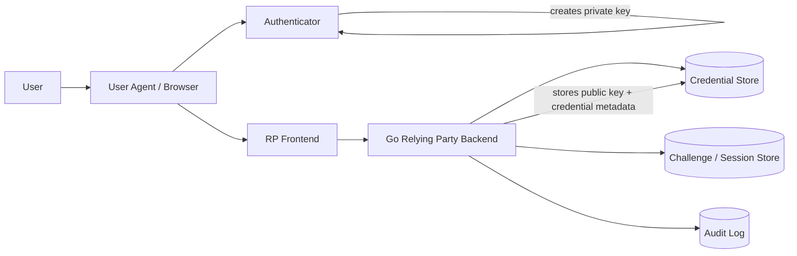

Aktor utama:

### User

Manusia yang ingin login. User tidak perlu tahu private key. User hanya melakukan gesture lokal: biometric, PIN, pattern, touch, atau device unlock.

### User Agent

Browser atau platform client yang menyediakan `navigator.credentials.create()` dan `navigator.credentials.get()`.

User agent adalah bagian penting dari security boundary karena ia membawa origin context.

### Authenticator

Authenticator menyimpan private key dan menandatangani challenge.

Authenticator dapat berupa:

- hardware security key;
- built-in platform authenticator;
- phone sebagai cross-device authenticator;
- passkey provider melalui OS/browser/password manager.

### Relying Party Frontend

Frontend memanggil WebAuthn API dan mengirim response ke backend.

Frontend tidak boleh dianggap trusted untuk keputusan akhir. Frontend hanya transporter.

### Relying Party Backend Go

Backend adalah verifier dan source of truth untuk:

- challenge;
- credential ownership;
- origin allowlist;
- RP ID;
- session creation;
- assurance mapping;
- audit.

---

## 9. Apa yang Disimpan Server dan Apa yang Tidak

Server menyimpan:

- credential ID;
- public key;
- user/account ID;
- user handle;
- RP ID;
- sign counter terakhir;
- attestation metadata jika dipakai;
- AAGUID jika tersedia;
- flags seperti backup eligibility/state;
- timestamps;
- credential status;
- label/nickname device;
- audit events.

Server tidak menyimpan:

- private key;
- biometric data;
- PIN device;
- passkey provider secret;
- reusable login secret.

Ini adalah perubahan besar dari password dan TOTP.

Password hash tetap merupakan target bernilai tinggi karena attacker bisa melakukan offline cracking. TOTP secret juga target bernilai tinggi karena siapa pun yang memiliki secret dapat menghasilkan OTP. WebAuthn public key tidak cukup untuk login.

Namun jangan salah:

> Credential store WebAuthn tetap critical data karena mapping credential ke user/account/tenant dapat disalahgunakan jika integrity-nya rusak.

Jika attacker bisa mengubah public key credential milik user ke public key attacker, maka attacker bisa login. Jadi integrity credential store tetap wajib dilindungi.

---

## 10. WebAuthn Credential vs Password vs TOTP Secret

| Properti | Password | TOTP Secret | WebAuthn Credential |
|---|---|---|---|
| Secret di server | Hash, bukan plain secret, tapi crackable offline jika lemah | Biasanya encrypted secret, harus bisa dibaca untuk verify | Tidak ada private secret; hanya public key |
| Secret di client/user | Diingat/diketik user | Disimpan authenticator app | Private key disimpan authenticator/passkey provider |
| Phishing resistance | Lemah | Lemah-sedang; OTP bisa di-relay | Kuat karena origin/RP binding |
| Replay resistance | Password reusable | OTP short-lived tapi relayable | Challenge-based signature |
| Server breach impact | Hash bisa dicrack | TOTP secret bisa dicuri jika decrypted | Public key tidak cukup untuk login |
| UX | Buruk-sedang | Sedang | Baik jika platform support matang |
| Recovery complexity | Umum tapi sering lemah | Sedang | Tinggi; recovery harus didesain hati-hati |
| Device migration | Tidak relevan | Backup/restore app tergantung provider | Synced passkey mempermudah; device-bound butuh re-enrollment |

Top engineer melihat WebAuthn sebagai cara mengurangi kelas serangan besar, bukan sebagai penghapus semua risiko.

---

## 11. Passkey, FIDO2, CTAP, WebAuthn

Hubungannya:

```text
Passkey = istilah produk/UX untuk credential FIDO yang dipakai sebagai password replacement
FIDO2 = ekosistem standar untuk authentication berbasis public key
WebAuthn = browser/web API untuk RP dan user agent
CTAP = protocol client-to-authenticator
```

Backend Go biasanya tidak berinteraksi langsung dengan CTAP. Backend berbicara HTTP dengan frontend, menerima JSON response dari WebAuthn API, lalu memvalidasi data WebAuthn.

Jadi pembagian tanggung jawab:

| Layer | Tanggung Jawab |
|---|---|
| Browser | Menjalankan WebAuthn API, enforce origin context |
| Authenticator | Generate credential, store private key, sign challenge |
| Frontend | Memanggil API dan mengirim response |
| Backend Go | Generate challenge, validate response, persist credential, issue session |

---

## 12. Registration Ceremony: Membuat Credential Baru

Registration ceremony adalah proses membuat credential baru untuk user.

Tujuannya:

- membuat public/private key pair;
- mengikat credential ke RP ID;
- mengikat credential ke account/user;
- menyimpan public key dan metadata di server;
- memastikan credential dibuat dengan policy yang sesuai.

High-level flow:

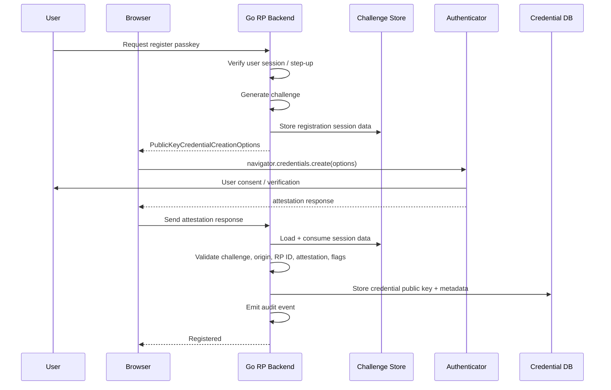

Registration bukan sekadar “tambahkan passkey”. Registration adalah **credential binding**.

Pertanyaan desain utama:

1. User sudah authenticated atau sedang onboarding?
2. Apakah perlu step-up sebelum menambahkan passkey?
3. Apakah passkey boleh menjadi credential pertama?
4. Apakah user verification wajib?
5. Apakah attestation required?
6. Apakah synced passkey boleh untuk role/admin tertentu?
7. Apakah credential label wajib?
8. Apakah user boleh punya banyak passkey?
9. Bagaimana mencegah duplicate registration?
10. Bagaimana audit event dibuat?

### Registration server responsibilities

Backend harus:

- membuat random challenge dengan CSPRNG;
- menyimpan session data server-side;
- menetapkan RP ID;
- menetapkan allowed origins;
- membuat user handle stabil dan opaque;
- menentukan user verification requirement;
- menentukan authenticator attachment preference jika perlu;
- menentukan resident key/discoverable credential requirement;
- menyertakan exclude credentials untuk mencegah duplicate;
- memvalidasi response;
- menyimpan credential atomically;
- membuat audit event.

### Registration invariants

1. Challenge harus unik, random, dan single-use.
2. Challenge harus punya TTL pendek.
3. Credential harus terikat ke user/account yang benar.
4. Credential ID tidak boleh duplicate dalam RP scope.
5. Public key harus disimpan persis dari verified response.
6. Origin harus termasuk allowlist.
7. RP ID hash harus cocok.
8. User handle harus opaque dan stabil.
9. Credential baru harus punya status lifecycle.
10. Registration harus audit-able.

---

## 13. Authentication Ceremony: Membuktikan Kontrol Credential

Authentication ceremony adalah proses login dengan credential yang sudah terdaftar.

Ada dua pola utama:

1. **Known-user login**  
   Server sudah tahu user/account sebelum WebAuthn assertion, misalnya username sudah dimasukkan atau session password sudah ada.

2. **Discoverable/passkey login**  
   Server belum tahu user. Authenticator mengembalikan credential/user handle, lalu server menyelesaikan user dari credential.

High-level known-user flow:

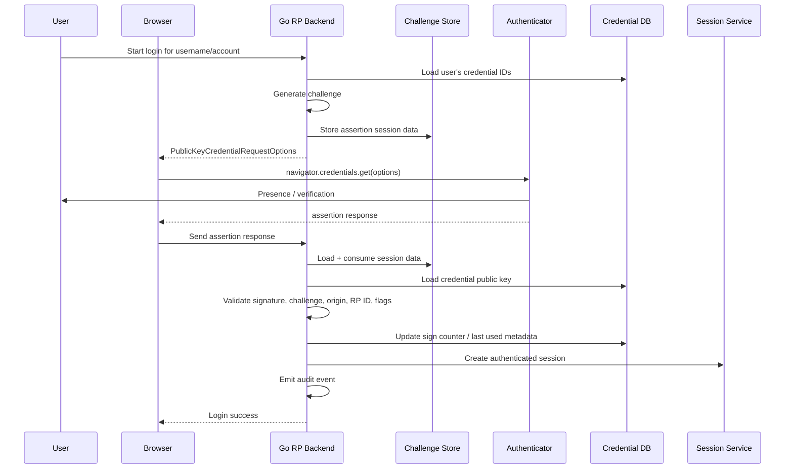

Authentication server responsibilities:

- generate challenge;
- store session data;
- load allowed credentials if known-user;
- validate response;
- map credential to user/account/tenant;
- enforce credential status;
- verify user verification policy;
- update counter/last used safely;
- create session with correct assurance;
- audit.

### Authentication invariants

1. Assertion must match an active credential.
2. Credential must belong to resolved user/account/tenant.
3. Challenge must match unexpired server-side session data.
4. Challenge/session data must be consumed once.
5. Origin must be allowed.
6. RP ID hash must match configured RP ID.
7. Signature must validate against stored public key.
8. User verification must satisfy policy.
9. Credential status must allow login.
10. Session assurance must reflect actual authenticator result.

---

## 14. Discoverable Credential dan Usernameless Login

Discoverable credential memungkinkan login tanpa username terlebih dahulu.

Known-user login:

```text
username -> server loads allowed credential IDs -> authenticator chooses credential
```

Discoverable login:

```text
server sends challenge without knowing user -> authenticator returns credential/user handle -> server resolves user
```

Ini bagus untuk UX:

- user bisa klik “Sign in with passkey”;
- browser bisa menampilkan passkey suggestion;
- user tidak perlu mengetik username;
- phishing resistance tetap kuat.

Namun ini menambah risiko domain model:

- credential ID harus globally unique dalam RP scope;
- user handle harus opaque;
- lookup credential harus tenant-aware jika multi-tenant;
- jangan expose apakah user/credential ada melalui error detail;
- jangan membocorkan account metadata saat login gagal;
- jangan menerima user handle sebagai source of truth tanpa credential ownership check.

### Discoverable login server-side resolution

Untuk passkey login, server bisa resolve user dengan dua pola:

1. **User-handle-first**  
   Resolve user dari `userHandle`, lalu cari credential ID di credential list user.

2. **Credential-ID-first**  
   Resolve credential dari credential ID, lalu cocokkan user handle dan account binding.

Keduanya harus tetap memvalidasi:

- RP ID;
- tenant/domain context;
- credential status;
- account status;
- public key signature;
- user handle binding.

Dalam sistem enterprise multi-tenant, saya lebih suka model eksplisit:

```text
(rp_id, credential_id) -> credential row -> account_id/user_id/tenant_id -> verify user_handle binding
```

Jika user handle didesain unik per RP, user-handle-first juga bisa digunakan, tetapi tetap perlu credential ownership check.

---

## 15. Resident Key vs Discoverable Credential

Istilah “resident key” historisnya sering dipakai untuk credential yang disimpan di authenticator. Dalam desain modern, istilah **discoverable credential** lebih menggambarkan capability: credential dapat ditemukan saat authentication tanpa allow-list dari server.

Kenapa ini penting?

Karena engineer sering salah mengira semua passkey pasti discoverable. Dalam praktik, passkey sebagai passwordless biasanya membutuhkan discoverable credential agar usernameless/username-less flow bekerja. Tetapi WebAuthn juga bisa dipakai sebagai second factor dengan non-discoverable credential ketika user sudah diketahui.

| Use Case | User Known Before WebAuthn? | Discoverable Needed? |
|---|---:|---:|
| Password + security key MFA | Ya | Tidak wajib |
| Username + passkey | Ya | Tidak wajib, tapi UX bisa lebih baik |
| Full usernameless passkey login | Tidak | Ya |
| Conditional UI autofill | Biasanya tidak eksplisit | Ya |
| Admin step-up with registered key | Ya | Tidak wajib |

---

## 16. Conditional UI dan Passkey Autofill

Conditional UI memungkinkan browser menampilkan passkey sebagai bagian dari login autofill.

UX modern:

1. Login page dimuat.
2. Frontend memanggil WebAuthn `get()` dengan mediation conditional.
3. Browser menampilkan passkey suggestion di field username/email.
4. User memilih passkey.
5. Authenticator melakukan UV/UP.
6. Backend menyelesaikan login.

Manfaat:

- user tidak perlu klik tombol khusus;
- transisi dari password ke passkey lebih natural;
- mengurangi friction;
- mendukung usernameless login.

Risiko implementasi:

- challenge harus tetap dibuat server-side;
- challenge tidak boleh long-lived hanya karena page idle;
- jika challenge expired, frontend harus refresh secara aman;
- jangan membuat infinite challenge generation tanpa rate limit;
- jangan menampilkan error detail yang bisa dipakai enumeration.

---

## 17. RP ID, Origin, Effective Domain, dan App Boundary

Ini bagian paling penting.

### Origin

Origin adalah:

```text
scheme + host + port
```

Contoh:

```text
https://app.example.com
https://admin.example.com
https://example.com
https://localhost:3000
```

### RP ID

RP ID biasanya domain seperti:

```text
example.com
app.example.com
```

Credential scoped ke RP ID. Jika RP ID `example.com`, maka origin `https://app.example.com` dan `https://admin.example.com` dapat termasuk dalam RP boundary jika konfigurasi dan browser rules mengizinkan.

Jika RP ID `app.example.com`, credential tidak otomatis berlaku untuk `admin.example.com`.

### Design decision

| Pilihan RP ID | Konsekuensi |
|---|---|
| `example.com` | Bisa dipakai lintas subdomain, tapi trust boundary lebih luas. |
| `app.example.com` | Scope lebih sempit, isolasi lebih baik, tetapi credential tidak berlaku lintas subdomain. |
| Per-tenant subdomain | Lebih kompleks; user mungkin perlu credential per tenant. |
| Domain lama saat migration | Credential bisa rusak jika RP ID berubah tanpa strategi. |

### Rule of thumb

Gunakan RP ID seluas boundary trust yang benar-benar kamu miliki.

Jika `admin.example.com` dan `app.example.com` punya risk profile sangat berbeda, jangan otomatis menyatukan RP ID tanpa policy tambahan.

### Multi-domain example

Misal:

```text
public.example.gov
intranet.example.gov
case.example.gov
admin.example.gov
```

Pertanyaan:

- Apakah semua domain dimiliki RP yang sama?
- Apakah user yang sama boleh login ke semuanya dengan credential yang sama?
- Apakah admin domain punya requirement UV/attestation lebih tinggi?
- Apakah intranet memakai different IdP?
- Apakah domain migration mungkin terjadi?

RP ID adalah desain arsitektur, bukan config kecil.

---

## 18. Challenge Lifecycle

Challenge adalah nonce random yang server buat dan authenticator sign.

Challenge lifecycle:

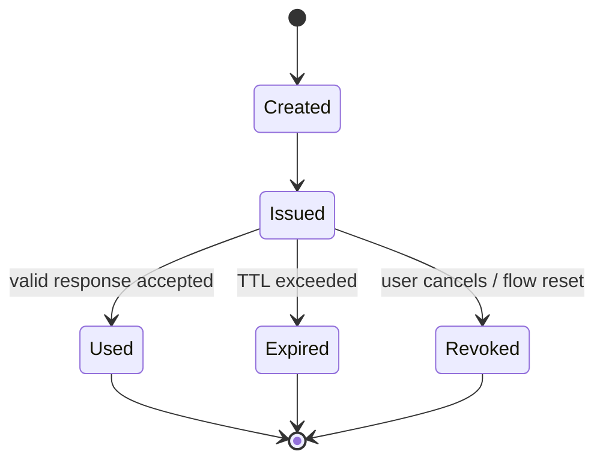

### Challenge requirements

Challenge harus:

- random dari CSPRNG;
- panjang cukup;
- unique;
- bound ke ceremony type;
- bound ke user/account jika known-user;
- bound ke RP ID/origin policy;
- punya TTL pendek;
- single-use;
- disimpan server-side atau di session data yang integrity-protected;
- tidak bisa dipakai lintas flow;
- tidak bisa dipakai untuk registration dan login sekaligus.

### Challenge anti-pattern

Buruk:

```go
challenge := fmt.Sprintf("%d", time.Now().UnixNano())
```

Buruk karena predictable.

Lebih benar:

```go
func NewChallenge(n int) ([]byte, error) {
    if n < 32 {
        n = 32
    }
    b := make([]byte, n)
    if _, err := rand.Read(b); err != nil {
        return nil, fmt.Errorf("generate challenge: %w", err)
    }
    return b, nil
}
```

Dalam praktik, library WebAuthn biasanya generate challenge. Tetapi kamu tetap harus memahami properties-nya karena storage/session lifecycle berada di aplikasi.

### TTL

Common TTL: 2–10 menit.

Untuk conditional UI, TTL bisa jadi masalah karena login page bisa idle. Solusi:

- refresh challenge jika expired;
- jangan membuat challenge long-lived;
- rate limit challenge creation;
- bind challenge ke browser session/csrf/session ID jika relevan.

### Single-use

Challenge harus consumed atomically.

Pseudo-SQL:

```sql
UPDATE webauthn_challenges
SET status = 'used', used_at = now()
WHERE id = :id
  AND status = 'issued'
  AND expires_at > now();
```

Jika affected rows = 0, reject.

---

## 19. `clientDataJSON`

`clientDataJSON` dibuat oleh user agent dan berisi data context dari client.

Secara konseptual berisi:

- `type`: `webauthn.create` atau `webauthn.get`;
- `challenge`: challenge dari RP;
- `origin`: origin halaman;
- `crossOrigin` jika relevan;
- fields lain tergantung spec/browser.

Server harus memvalidasi:

1. `type` sesuai ceremony.
2. `challenge` cocok dengan server-side challenge.
3. `origin` termasuk allowed origins.
4. Cross-origin embedding sesuai policy.

`clientDataJSON` bukan data trusted hanya karena berasal dari browser. Ia trusted setelah signature dan validation context benar.

---

## 20. `authenticatorData`

`authenticatorData` adalah binary structure dari authenticator.

Konseptual berisi:

- RP ID hash;
- flags;
- sign counter;
- attested credential data saat registration;
- extension data jika ada.

Server harus memvalidasi:

- RP ID hash cocok dengan SHA-256 RP ID yang diharapkan;
- flags memenuhi policy;
- sign counter tidak menunjukkan cloning risk yang jelas;
- attested credential data valid saat registration;
- extensions sesuai policy jika dipakai.

### Flags penting

| Flag | Makna |
|---|---|
| UP | User presence. User melakukan gesture/interaksi. |
| UV | User verification. Authenticator memverifikasi user lokal. |
| BE | Backup eligibility. Credential eligible untuk backup/sync. |
| BS | Backup state. Credential dianggap sudah backed up/synced. |
| AT | Attested credential data hadir saat registration. |
| ED | Extension data hadir. |

### Production interpretation

- UP biasanya wajib untuk authentication.
- UV wajib jika passkey dipakai sebagai passwordless atau step-up high risk.
- BE/BS jangan diabaikan untuk high assurance policy.
- AT relevan saat registration.
- ED hanya relevan jika kamu mengaktifkan extensions.

---

## 21. User Presence dan User Verification

### User Presence

User presence berarti user melakukan interaksi fisik/logis dengan authenticator.

Contoh:

- menyentuh security key;
- menyetujui prompt;
- melakukan gesture yang diminta platform.

UP membuktikan ada user hadir, bukan bahwa user sudah diverifikasi secara biometrik/PIN.

### User Verification

User verification berarti authenticator memverifikasi local user.

Contoh:

- fingerprint;
- face recognition;
- device PIN;
- platform unlock;
- security key PIN.

UV sangat penting untuk passwordless.

Jika kamu menerima WebAuthn tanpa UV sebagai single-factor passwordless login, kamu harus memahami risikonya: siapa pun yang mengontrol unlocked authenticator/device mungkin bisa login.

### Policy mapping

| Use Case | User Verification |
|---|---|
| Passkey sebagai passwordless login | Required |
| Passkey sebagai MFA setelah password | Preferred/Required tergantung risk |
| Admin step-up | Required |
| Payment/approval/signature action | Required + freshness |
| Low-risk remembered device | Preferred, tapi harus sadar assurance turun |

---

## 22. Backup Eligibility dan Backup State

WebAuthn Level 3 memperkenalkan/memperjelas flags yang memberi sinyal tentang backup/sync credential.

Secara sederhana:

- **BE**: credential eligible untuk backup.
- **BS**: credential saat ini backed up.

Ini penting karena passkey modern sering disinkronkan antar device melalui passkey provider.

### Kenapa ini penting?

Synced passkey meningkatkan availability dan UX, tetapi trust boundary melebar ke passkey provider/cloud account.

Device-bound credential lebih cocok untuk high assurance tertentu, tetapi UX recovery lebih sulit.

### Policy examples

| Role / Action | Synced Passkey Allowed? | Device-Bound Preferred? |
|---|---:|---:|
| Consumer login | Ya | Tidak wajib |
| Normal enterprise user | Ya, dengan risk controls | Opsional |
| Case officer approving sensitive decision | Ya/tergantung policy | Mungkin preferred |
| Super admin / break-glass | Hati-hati | Ya, lebih disarankan |
| Cryptographic signing legal-grade | Biasanya perlu stronger binding | Ya atau dedicated credential |

Jangan membuat klaim “semua passkey = AAL3”. Itu terlalu kasar.

Assurance harus mempertimbangkan:

- UV;
- authenticator type;
- attestation policy;
- backup eligibility/state;
- enrollment context;
- account recovery strength;
- session freshness;
- risk signal.

---

## 23. Signature Counter dan Clone Detection

Authenticator dapat menyertakan signature counter.

Tujuannya: mendeteksi kemungkinan cloned authenticator/private key.

Jika counter dari assertion lebih kecil atau sama dari counter terakhir, ini bisa jadi sinyal credential clone atau authenticator behavior tertentu.

Namun realita modern:

- beberapa authenticator memakai global counter;
- beberapa counter tidak reliable;
- synced passkey dapat membuat counter semantics lebih kompleks;
- beberapa credential mungkin selalu counter 0.

### Production policy

Jangan langsung mengandalkan counter sebagai satu-satunya kontrol.

Gunakan sebagai risk signal:

- counter regression untuk credential yang sebelumnya incrementing → high severity;
- counter always zero dari awal → classify as no-counter credential;
- sudden metadata change + counter anomaly + impossible travel → force re-auth/recovery review;
- admin credential counter anomaly → disable credential pending review.

### Update counter secara aman

Jangan update counter sebelum seluruh validation sukses.

Pseudo:

```sql
UPDATE webauthn_credentials
SET sign_count = :new_count,
    last_used_at = now()
WHERE credential_id = :credential_id
  AND sign_count = :old_count;
```

Jika concurrent login terjadi, race bisa muncul. Treat carefully:

- if new count > stored count, update;
- if conflict due concurrent update, re-read and decide;
- if new count <= stored count, emit risk signal.

---

## 24. Attestation: Kapan Perlu, Kapan Tidak

Attestation adalah bukti provenance authenticator saat registration.

Dengan attestation, RP bisa mengetahui model/type authenticator tertentu dan menerapkan policy, misalnya hanya menerima hardware security key tertentu untuk admin.

Namun attestation punya trade-off:

| Aspek | Dampak |
|---|---|
| Privacy | Attestation bisa memberi fingerprinting surface. |
| UX | Beberapa platform membatasi/menampilkan prompt tambahan. |
| Operational | Perlu metadata trust store. |
| Security | Bisa enforce authenticator class tertentu. |
| Compatibility | Strict attestation dapat menurunkan success rate registration. |

### Strategy umum

Untuk consumer/general workforce:

```text
attestation conveyance: none / indirect
```

Untuk high assurance admin:

```text
attestation required atau enterprise attestation policy
allowlist AAGUID/authenticator models
```

### Jangan asal require attestation

Jika kamu require attestation tanpa proses metadata dan exception handling, kamu akan membuat banyak user gagal register.

Attestation adalah policy layer, bukan default yang selalu benar.

---

## 25. AAGUID, Metadata, dan Authenticator Policy

AAGUID adalah identifier model authenticator, bukan identifier unik user.

AAGUID berguna untuk:

- allowlist authenticator model;
- blocklist authenticator model bermasalah;
- classify platform vs roaming authenticator;
- audit authenticator fleet;
- high assurance enrollment policy.

Namun AAGUID tidak boleh diperlakukan sebagai:

- user identifier;
- device serial number;
- guarantee absolut tanpa metadata validation;
- pengganti attestation chain validation.

### Authenticator policy example

```text
Normal user:
  - allow platform passkeys
  - require UV preferred/required depending flow
  - no strict attestation

Case approver:
  - require UV
  - allow synced passkey with step-up freshness
  - monitor BE/BS

Super admin:
  - require UV
  - require hardware/security-key class or approved AAGUID
  - require attestation validation
  - require at least two credentials
  - require break-glass backup held offline
```

---

## 26. Synced Passkeys vs Device-Bound Passkeys

### Synced passkeys

Synced passkeys tersedia di beberapa device melalui passkey provider.

Manfaat:

- recovery lebih mudah;
- device replacement lebih mudah;
- UX lebih baik;
- mengurangi fallback ke password/reset email;
- mendorong adoption.

Risiko/trade-off:

- trust bergeser ke passkey provider;
- compromise cloud account/provider dapat berdampak;
- policy high assurance mungkin perlu batasan;
- visibility RP terhadap sync mechanics terbatas.

### Device-bound passkeys

Device-bound passkey tidak keluar dari authenticator/device.

Manfaat:

- stronger possession semantics;
- lebih cocok untuk privileged/admin use case;
- lebih mudah reason tentang key locality.

Risiko/trade-off:

- device loss membuat recovery sulit;
- user harus enroll beberapa device/key;
- support overhead naik;
- fallback recovery bisa menjadi titik terlemah.

### Engineering conclusion

Untuk banyak aplikasi, synced passkeys adalah pilihan praktis yang jauh lebih baik daripada password. Untuk privileged flows, kombinasikan:

- require UV;
- require recent authentication;
- require device-bound or attested security key jika policy menuntut;
- maintain backup credential;
- strong recovery controls;
- audit.

---

## 27. Passkeys sebagai MFA atau Passwordless

WebAuthn/passkey bisa dipakai dalam beberapa mode:

### Mode A — Passkey sebagai passwordless primary factor

User login langsung dengan passkey.

```text
passkey -> authenticated session
```

Requirement:

- discoverable credential ideal;
- UV required;
- recovery kuat;
- session assurance jelas;
- account linking aman.

### Mode B — Passkey sebagai MFA setelah password

User login password lalu menggunakan WebAuthn sebagai second factor.

```text
password -> WebAuthn assertion -> session AAL2-ish
```

Requirement:

- user known sebelum WebAuthn;
- allowCredentials bisa dipakai;
- UV preferred/required sesuai policy;
- password compromise still mitigated.

### Mode C — Passkey sebagai step-up

User sudah punya session, lalu ingin aksi high risk.

```text
existing session -> WebAuthn challenge -> elevated auth context
```

Requirement:

- bind challenge ke action;
- require UV;
- set freshness window;
- audit action context;
- jangan membuat global elevation terlalu lama.

### Mode D — Passkey sebagai account recovery factor

User kehilangan password/MFA lain, lalu membuktikan passkey.

Requirement:

- define recovery trust;
- ensure credential status active;
- require UV;
- revoke/reset weaker factors after recovery if needed;
- audit.

---

## 28. Assurance Mapping: AAL, UV, Phishing Resistance, Freshness

WebAuthn result perlu diterjemahkan ke auth context internal.

Contoh internal assurance:

```go
type AuthenticationMethod string

const (
    AuthMethodPassword AuthenticationMethod = "password"
    AuthMethodTOTP     AuthenticationMethod = "totp"
    AuthMethodPasskey  AuthenticationMethod = "passkey"
    AuthMethodSecurityKey AuthenticationMethod = "security_key"
)

type AuthenticatorBinding string

const (
    BindingUnknown     AuthenticatorBinding = "unknown"
    BindingSynced      AuthenticatorBinding = "synced"
    BindingDeviceBound AuthenticatorBinding = "device_bound"
)

type AuthContext struct {
    SubjectID        string
    AccountID        string
    TenantID         string
    Methods          []AuthenticationMethod
    UserVerified     bool
    PhishingResistant bool
    Binding          AuthenticatorBinding
    AuthenticatedAt  time.Time
    AuthTime         time.Time
    CredentialID     string
    AssuranceLevel   string // internal representation, not blindly equal to NIST label
}
```

### Mapping contoh

| Evidence | Internal Meaning |
|---|---|
| Valid WebAuthn signature | Authenticator controls private key. |
| Valid challenge | Response is fresh for this ceremony. |
| Valid origin/RP ID | Response is scoped to your RP. |
| UV true | Local user verification occurred. |
| BE/BS true | Credential may be synced/backed up. |
| Attestation approved | Authenticator model meets policy. |
| Recent auth time | Can satisfy step-up freshness. |

### Jangan overclaim

Jangan langsung:

```text
passkey == AAL3
```

Lebih benar:

```text
passkey assertion with UV + approved authenticator class + required binding + strong recovery + fresh session may satisfy internal high assurance policy
```

---

## 29. WebAuthn UX: Registration, Login, Recovery, Device Change

Security yang tidak bisa dipakai akan gagal di production.

### Registration UX

Baik:

- jelaskan “buat passkey” bukan “buat cryptographic credential”;
- beri nama device/passkey;
- rekomendasikan minimal dua passkey untuk high-risk account;
- setelah registration, tampilkan recovery readiness;
- jangan paksa user memahami RP ID.

Buruk:

- error browser mentah ditampilkan ke user;
- gagal registration tanpa arahan;
- tidak ada opsi retry;
- tidak ada device naming;
- tidak ada backup credential path.

### Login UX

Baik:

- tombol “Sign in with passkey”;
- conditional UI;
- fallback jelas tapi tidak membuka enumeration;
- error generic di UI, detail di audit internal;
- jika credential revoked, beri recovery path aman.

### Recovery UX

Baik:

- recovery code/passkey backup/admin verified recovery;
- notification ke channel terdaftar;
- cooldown untuk perubahan high-risk;
- revoke suspicious sessions;
- audit reason.

Buruk:

- “lost passkey? reset by email only” untuk admin;
- support staff bisa reset tanpa approval;
- recovery melewati MFA/passkey requirement;
- tidak ada notification.

---

## 30. Account Linking dan Passkey Enrollment

Passkey enrollment harus terikat ke account yang benar.

Ada beberapa scenario:

### Existing user menambahkan passkey

Flow:

1. User sudah login.
2. Untuk high-risk account, minta step-up.
3. Begin registration.
4. Finish registration.
5. Simpan credential ke account user.
6. Audit.
7. Notify user.

### New user onboarding dengan passkey-first

Flow:

1. User membuktikan email/identity proofing atau invitation.
2. Server membuat provisional account.
3. User membuat passkey.
4. Credential menjadi primary authenticator.
5. Account activation selesai.

Risiko:

- invitation theft;
- email takeover;
- incomplete identity proofing;
- duplicate account;
- account linking salah.

### Federated user menambahkan passkey lokal

Pertanyaan:

- Apakah passkey lokal menjadi fallback jika IdP down?
- Apakah policy federation mengizinkan local credential?
- Apakah local passkey mem-bypass IdP lifecycle/deprovisioning?
- Bagaimana account disabled di IdP dipropagasi?

Untuk enterprise SSO, hati-hati: menambahkan local passkey bisa menjadi shadow authentication path.

---

## 31. Account Recovery Setelah Passkey Hilang

Passkey mengurangi masalah password, tetapi recovery tetap menjadi pintu belakang.

Threat model recovery:

- attacker menguasai email;
- attacker menghubungi support;
- attacker social engineering admin;
- attacker mengambil alih phone number;
- user kehilangan semua device;
- passkey provider account compromised;
- tenant admin malicious.

### Recovery policy berdasarkan risk

| Account Type | Recovery Minimum |
|---|---|
| Consumer low-risk | Email + risk checks + cooldown mungkin cukup. |
| Enterprise normal user | IdP reauthentication atau admin verified reset. |
| Case officer | Admin approval + existing factor/passkey if available + notification. |
| Super admin | Dual control + offline backup credential + audit + cooldown. |
| Break-glass account | Pre-registered hardware keys + sealed process. |

### Recovery invariants

1. Recovery tidak boleh lebih lemah dari authentication target tanpa compensating controls.
2. Recovery harus invalidate suspicious sessions.
3. Recovery harus notify user/admin.
4. Recovery harus audit-able.
5. Recovery harus rate-limited.
6. Recovery harus mempertimbangkan tenant boundary.
7. Recovery harus punya cooldown untuk sensitive changes.

### Passkey backup recommendation

Untuk account penting:

- minimum dua passkeys;
- satu platform passkey untuk UX;
- satu hardware/security key sebagai backup;
- recovery codes atau admin recovery sesuai risk;
- periodic recovery readiness check.

---

## 32. Threat Model WebAuthn

WebAuthn menghilangkan atau mengurangi banyak attack, tetapi bukan semua.

### Mitigated strongly

- password phishing;
- credential stuffing;
- password reuse;
- server password hash breach;
- OTP relay in many phishing scenarios;
- fake domain login stealing reusable secret.

### Still possible

- compromised endpoint/device;
- malicious browser/user agent;
- infected authenticator/passkey provider;
- account recovery attack;
- support/social engineering;
- session theft after login;
- OAuth/OIDC federation misbinding;
- RP implementation bugs;
- wrong origin/RP ID configuration;
- credential store integrity compromise;
- admin privilege abuse.

### Attack tree

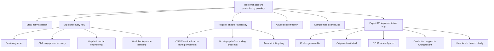

---

## 33. Failure Mode Utama

### 33.1 RP ID berubah setelah domain migration

Credential WebAuthn scoped ke RP ID. Jika kamu pindah dari:

```text
old.example.com
```

ke:

```text
new.example.com
```

dan RP ID lama adalah `old.example.com`, credential lama tidak bisa dipakai di domain baru.

Mitigasi:

- pilih RP ID strategis sejak awal;
- gunakan parent domain jika trust boundary benar;
- rencanakan migration window;
- minta user enroll credential baru sebelum cutover;
- sediakan recovery path.

### 33.2 Challenge reuse

Jika challenge bisa dipakai lebih dari sekali, attacker bisa replay assertion dalam kondisi tertentu.

Mitigasi:

- single-use challenge;
- atomic consume;
- short TTL;
- bind ceremony type.

### 33.3 Origin allowlist terlalu luas

Misal menerima semua origin `*.example.com` padahal subdomain tidak semua trusted.

Mitigasi:

- explicit allowlist;
- separate RP ID untuk boundary berbeda;
- deployment review saat domain baru ditambah.

### 33.4 User handle collision

Jika user handle tidak unik/stabil, discoverable login bisa resolve user salah.

Mitigasi:

- random opaque stable handle;
- uniqueness constraint per RP ID;
- jangan pakai email sebagai user handle;
- jangan recycle user handle setelah account deletion tanpa retention policy.

### 33.5 Credential registered without step-up

Jika attacker mencuri session biasa lalu menambahkan passkey, account takeover menjadi persisten.

Mitigasi:

- require recent authentication/step-up before adding credential;
- notify user;
- allow user revoke new credential;
- delay sensitive operations after new credential if risk high.

### 33.6 Recovery weaker than passkey

Passkey login aman, tetapi “lost passkey” memakai email-only reset.

Mitigasi:

- risk-tiered recovery;
- recovery codes;
- admin dual control for privileged accounts;
- cooldown;
- session revocation;
- audit.

---

## 34. Anti-Pattern yang Sering Terjadi

### Anti-pattern 1 — Treat passkey as frontend feature

Buruk:

```text
Frontend handles WebAuthn, backend just accepts success boolean.
```

Benar:

```text
Backend validates challenge, origin, RP ID, signature, credential ownership, flags, and policy.
```

### Anti-pattern 2 — Store only credential ID

Credential ID saja tidak cukup. Server perlu public key, user binding, sign counter, status, metadata, RP ID, timestamps, dan audit.

### Anti-pattern 3 — Use email as user handle

Email berubah, PII, bisa leak, dan tidak ideal sebagai opaque handle.

Gunakan random stable bytes.

### Anti-pattern 4 — Single passkey, no recovery plan

Jika user kehilangan device/provider, account lockout.

### Anti-pattern 5 — Passkey accepted for admin without policy

Admin membutuhkan stricter:

- UV required;
- attestation/device policy;
- multiple credentials;
- recovery controls;
- audit.

### Anti-pattern 6 — Ignore backup flags completely

Untuk normal login mungkin acceptable. Untuk high assurance, BE/BS adalah signal penting.

### Anti-pattern 7 — No registration audit

Credential enrollment adalah security-sensitive event. Harus ada audit.

### Anti-pattern 8 — Allow passkey local fallback for federated enterprise account without lifecycle integration

Jika IdP disable user tetapi local passkey tetap aktif, deprovisioning gagal.

---

## 35. Go Implementation Strategy

Ada dua strategi:

1. Pakai library WebAuthn matang.
2. Implementasi manual parser/validator.

Untuk production, gunakan library yang mengikuti spec dan aktif dipelihara. Jangan implementasi manual kecuali kamu sedang membuat library/spec implementation.

Backend Go harus fokus ke:

- domain model;
- session/challenge store;
- credential store;
- policy;
- audit;
- error handling;
- recovery;
- integration.

### Layering yang disarankan

```text
http handler
  -> application service
      -> webauthn adapter/library
      -> credential repository
      -> challenge/session store
      -> user/account service
      -> assurance service
      -> audit service
```

Jangan biarkan HTTP handler langsung memutuskan semua policy.

---

## 36. Library Pilihan: `go-webauthn/webauthn`

Di ekosistem Go, library `github.com/go-webauthn/webauthn` adalah salah satu pilihan populer untuk WebAuthn/FIDO2 backend.

Library ini menyediakan high-level API seperti:

- create/configure WebAuthn RP;
- begin registration;
- finish registration;
- begin login;
- finish login;
- begin discoverable/passkey login;
- finish passkey login;
- user interface untuk credential retrieval.

Namun library tidak menggantikan business logic kamu.

Library tidak otomatis tahu:

- tenant boundary;
- user lifecycle;
- admin policy;
- recovery process;
- audit evidence;
- session assurance;
- enterprise attestation policy;
- deprovisioning integration.

### Versioning warning

Jika library masih major version `v0`, API dapat berubah. Pin dependency version, baca release notes, dan wrap library di adapter internal agar domain code tidak tersebar bergantung langsung ke library.

---

## 37. Go Package Layout

Contoh layout:

```text
/internal/authn/passkey/
    service.go
    config.go
    errors.go
    model.go
    policy.go
    audit.go
    webauthn_adapter.go
    challenge_store.go
    credential_store.go
    http_handlers.go
    frontend_contract.go

/internal/authn/session/
    service.go
    model.go

/internal/identity/
    account.go
    user.go
    tenant.go

/internal/audit/
    event.go
    writer.go
```

Atau jika sistem besar:

```text
/internal/identity/passkey
/internal/security/webauthn
/internal/access/assurance
```

Yang penting:

- WebAuthn library adapter dipisah;
- domain model tidak tergantung HTTP;
- storage interface eksplisit;
- policy terpisah dari handler;
- audit eksplisit;
- errors typed.

---

## 38. Domain Types

```go
package passkey

import "time"

type CredentialID string
type UserHandle string
type UserID string
type AccountID string
type TenantID string
type RPID string

type CredentialStatus string

const (
    CredentialActive   CredentialStatus = "active"
    CredentialDisabled CredentialStatus = "disabled"
    CredentialRevoked  CredentialStatus = "revoked"
    CredentialPending  CredentialStatus = "pending"
)

type AuthenticatorAttachment string

const (
    AttachmentUnknown       AuthenticatorAttachment = "unknown"
    AttachmentPlatform      AuthenticatorAttachment = "platform"
    AttachmentCrossPlatform AuthenticatorAttachment = "cross_platform"
)

type CredentialBinding string

const (
    BindingUnknown     CredentialBinding = "unknown"
    BindingSynced      CredentialBinding = "synced"
    BindingDeviceBound CredentialBinding = "device_bound"
)

type Credential struct {
    ID              CredentialID
    RPID            RPID
    TenantID        TenantID
    AccountID       AccountID
    UserID          UserID
    UserHandle      UserHandle

    PublicKeyCOSE    []byte
    SignCount        uint32

    AAGUID           string
    Attachment       AuthenticatorAttachment
    Binding          CredentialBinding
    BackupEligible   bool
    BackupState      bool
    UserVerifiedAtRegistration bool

    Status          CredentialStatus
    DisplayName     string
    CreatedAt       time.Time
    LastUsedAt      *time.Time
    RevokedAt       *time.Time
    RevokedReason   string
}
```

Catatan:

- `PublicKeyCOSE` tergantung representasi library.
- Credential ID sering binary/base64url. Simpan canonical binary atau canonical base64url secara konsisten.
- Jangan pakai email sebagai primary key credential.
- `UserHandle` harus opaque dan stabil.

---

## 39. Interface Design

```go
type CredentialRepository interface {
    FindByCredentialID(ctx context.Context, rpID RPID, credentialID CredentialID) (*Credential, error)
    FindByUserHandle(ctx context.Context, rpID RPID, handle UserHandle) ([]*Credential, error)
    ListActiveByUser(ctx context.Context, rpID RPID, tenantID TenantID, userID UserID) ([]*Credential, error)
    Insert(ctx context.Context, cred *Credential) error
    MarkUsed(ctx context.Context, id CredentialID, oldCount uint32, newCount uint32, usedAt time.Time) error
    Revoke(ctx context.Context, id CredentialID, reason string, at time.Time) error
}

type CeremonyStore interface {
    Save(ctx context.Context, s *CeremonySession) error
    Consume(ctx context.Context, id string) (*CeremonySession, error)
}

type AuditWriter interface {
    Write(ctx context.Context, event AuditEvent) error
}

type Policy interface {
    RegistrationPolicy(ctx context.Context, actor Actor, account Account) (RegistrationPolicy, error)
    LoginPolicy(ctx context.Context, request LoginRequest) (LoginPolicy, error)
    StepUpPolicy(ctx context.Context, action SensitiveAction) (StepUpPolicy, error)
}
```

Ceremony store harus support atomic consume.

Credential repository harus enforce uniqueness.

Audit writer sebaiknya tidak menggagalkan login karena temporary sink outage? Ini bergantung regulatory requirement. Untuk high-regulated systems, setidaknya harus ada durable local/event queue sebelum success dianggap final.

---

## 40. Storage Schema

Contoh PostgreSQL-ish schema. Sesuaikan Oracle/MySQL jika perlu.

```sql
CREATE TABLE webauthn_user_handles (
    rp_id              VARCHAR(255) NOT NULL,
    user_handle        BYTEA NOT NULL,
    tenant_id          VARCHAR(64) NOT NULL,
    account_id         VARCHAR(64) NOT NULL,
    user_id            VARCHAR(64) NOT NULL,
    created_at         TIMESTAMP NOT NULL,
    PRIMARY KEY (rp_id, user_handle),
    UNIQUE (rp_id, tenant_id, account_id, user_id)
);

CREATE TABLE webauthn_credentials (
    credential_id      BYTEA NOT NULL,
    rp_id              VARCHAR(255) NOT NULL,
    tenant_id          VARCHAR(64) NOT NULL,
    account_id         VARCHAR(64) NOT NULL,
    user_id            VARCHAR(64) NOT NULL,
    user_handle        BYTEA NOT NULL,

    public_key_cose    BYTEA NOT NULL,
    sign_count         BIGINT NOT NULL DEFAULT 0,

    aaguid             VARCHAR(64),
    attachment         VARCHAR(32),
    binding            VARCHAR(32),
    backup_eligible    BOOLEAN,
    backup_state       BOOLEAN,
    user_verified_at_registration BOOLEAN,

    status             VARCHAR(32) NOT NULL,
    display_name       VARCHAR(255),
    created_at         TIMESTAMP NOT NULL,
    last_used_at       TIMESTAMP,
    revoked_at         TIMESTAMP,
    revoked_reason     VARCHAR(512),

    PRIMARY KEY (rp_id, credential_id),
    FOREIGN KEY (rp_id, user_handle)
        REFERENCES webauthn_user_handles (rp_id, user_handle)
);

CREATE INDEX idx_webauthn_credentials_user
    ON webauthn_credentials (rp_id, tenant_id, account_id, user_id, status);

CREATE INDEX idx_webauthn_credentials_last_used
    ON webauthn_credentials (last_used_at);
```

### Why separate user handle table?

Karena user handle harus stabil untuk user per RP. Jika credential dihapus semua, user handle tetap bisa dipertahankan untuk audit/linking policy.

### Credential ID storage

Credential ID adalah bytes. Pilih salah satu:

- simpan binary bytes;
- simpan base64url tanpa padding;
- jangan campur encoding.

Jika pakai string ID di Go, canonicalize di boundary.

---

## 41. Relying Party Configuration

Contoh config:

```go
type Config struct {
    RPID           string
    RPDisplayName string
    RPOrigins     []string

    RegistrationTimeout time.Duration
    LoginTimeout        time.Duration

    RequireUserVerificationForLogin bool
    RequireUserVerificationForStepUp bool

    AllowSyncedPasskeysForAdmins bool
    RequireAttestationForAdmins  bool
}
```

Contoh initialization dengan `go-webauthn/webauthn` secara konseptual:

```go
package passkey

import (
    "fmt"

    gwa "github.com/go-webauthn/webauthn/webauthn"
)

func NewWebAuthn(cfg Config) (*gwa.WebAuthn, error) {
    rp, err := gwa.New(&gwa.Config{
        RPDisplayName: cfg.RPDisplayName,
        RPID:          cfg.RPID,
        RPOrigins:     cfg.RPOrigins,
    })
    if err != nil {
        return nil, fmt.Errorf("create webauthn relying party: %w", err)
    }
    return rp, nil
}
```

Catatan:

- Exact API dapat berubah tergantung versi library.
- Wrap initialization agar perubahan library tidak bocor ke seluruh codebase.
- Validasi config saat startup.

### Startup validation

```go
func (c Config) Validate() error {
    if c.RPID == "" {
        return errors.New("rp id is required")
    }
    if len(c.RPOrigins) == 0 {
        return errors.New("at least one rp origin is required")
    }
    for _, o := range c.RPOrigins {
        if !strings.HasPrefix(o, "https://") && !strings.HasPrefix(o, "http://localhost") {
            return fmt.Errorf("insecure origin not allowed: %s", o)
        }
    }
    return nil
}
```

Production origin harus HTTPS. Localhost exception hanya untuk development.

---

## 42. Registration Begin Handler

Conceptual handler:

```go
func (h *Handler) BeginRegistration(w http.ResponseWriter, r *http.Request) {
    ctx := r.Context()

    actor, err := h.sessions.RequireAuthenticated(ctx, r)
    if err != nil {
        writeAuthError(w, err)
        return
    }

    account, err := h.accounts.GetAccount(ctx, actor.AccountID)
    if err != nil {
        writeError(w, err)
        return
    }

    pol, err := h.policy.RegistrationPolicy(ctx, actor, account)
    if err != nil {
        writeError(w, err)
        return
    }

    if pol.RequiresRecentAuth && !actor.AuthContext.IsFresh(pol.MaxAge) {
        writeStepUpRequired(w)
        return
    }

    wu, err := h.users.WebAuthnUser(ctx, actor.TenantID, actor.AccountID, actor.UserID)
    if err != nil {
        writeError(w, err)
        return
    }

    options, sessionData, err := h.webauthn.BeginRegistration(
        wu,
        // options: resident key, user verification, exclude credentials, attestation
    )
    if err != nil {
        writeError(w, fmt.Errorf("begin passkey registration: %w", err))
        return
    }

    ceremony := CeremonySessionFromWebAuthn(sessionData, CeremonyRegistration, actor, h.clock.Now().Add(h.cfg.RegistrationTimeout))
    if err := h.ceremonies.Save(ctx, ceremony); err != nil {
        writeError(w, err)
        return
    }

    h.audit.Write(ctx, AuditEvent{
        Type:      "passkey.registration.started",
        ActorID:   actor.UserID,
        AccountID: actor.AccountID,
        TenantID:  actor.TenantID,
    })

    writeJSON(w, http.StatusOK, options)
}
```

Important points:

- Require authenticated session untuk adding passkey.
- Require step-up for sensitive accounts.
- Store session data server-side.
- Do not trust frontend to choose user.
- Include exclude credentials.
- Emit audit.

---

## 43. Registration Finish Handler

```go
func (h *Handler) FinishRegistration(w http.ResponseWriter, r *http.Request) {
    ctx := r.Context()

    actor, err := h.sessions.RequireAuthenticated(ctx, r)
    if err != nil {
        writeAuthError(w, err)
        return
    }

    ceremonyID := r.URL.Query().Get("ceremony_id")
    ceremony, err := h.ceremonies.Consume(ctx, ceremonyID)
    if err != nil {
        writeError(w, ErrInvalidOrExpiredCeremony)
        return
    }

    if ceremony.Type != CeremonyRegistration {
        writeError(w, ErrInvalidCeremonyType)
        return
    }

    if ceremony.Actor.UserID != actor.UserID || ceremony.Actor.AccountID != actor.AccountID {
        writeError(w, ErrCeremonyActorMismatch)
        return
    }

    wu, err := h.users.WebAuthnUser(ctx, actor.TenantID, actor.AccountID, actor.UserID)
    if err != nil {
        writeError(w, err)
        return
    }

    credential, err := h.webauthn.FinishRegistration(wu, ceremony.WebAuthnSessionData, r)
    if err != nil {
        h.audit.Write(ctx, AuditEvent{
            Type:      "passkey.registration.failed",
            ActorID:   actor.UserID,
            AccountID: actor.AccountID,
            TenantID:  actor.TenantID,
            Reason:    safeReason(err),
        })
        writeError(w, ErrInvalidPasskeyRegistration)
        return
    }

    domainCredential := MapCredential(credential, actor, h.cfg.RPID)

    if err := h.credentials.Insert(ctx, domainCredential); err != nil {
        writeError(w, err)
        return
    }

    h.audit.Write(ctx, AuditEvent{
        Type:         "passkey.registration.completed",
        ActorID:      actor.UserID,
        AccountID:    actor.AccountID,
        TenantID:     actor.TenantID,
        CredentialID: domainCredential.ID,
    })

    h.notifications.SecurityEvent(ctx, actor.AccountID, "A new passkey was added")

    writeJSON(w, http.StatusCreated, map[string]string{"status": "registered"})
}
```

### Critical details

- `Consume` must be atomic.
- Actor must match ceremony initiator.
- Insert credential should be idempotency-safe but not allow overwrite.
- If DB insert fails after ceremony consumed, user can retry from begin.
- Audit failure/success separately.
- Notification should not include sensitive raw credential IDs.

---

## 44. Login Begin Handler untuk Known User

Known-user flow cocok untuk:

- username first login;
- passkey as MFA;
- step-up for existing session;
- admin action verification.

```go
func (h *Handler) BeginLoginKnownUser(w http.ResponseWriter, r *http.Request) {
    ctx := r.Context()

    var req struct {
        TenantHint string `json:"tenant_hint"`
        Username   string `json:"username"`
    }
    if err := readJSON(r, &req); err != nil {
        writeError(w, err)
        return
    }

    // Avoid enumeration: external behavior should be uniform.
    user, err := h.accounts.FindLoginCandidate(ctx, req.TenantHint, req.Username)
    if err != nil {
        h.fakeDelayOrFakeChallenge(ctx)
        writeJSON(w, http.StatusOK, GenericLoginStartedResponse())
        return
    }

    wu, err := h.users.WebAuthnUser(ctx, user.TenantID, user.AccountID, user.UserID)
    if err != nil {
        writeJSON(w, http.StatusOK, GenericLoginStartedResponse())
        return
    }

    assertion, sessionData, err := h.webauthn.BeginLogin(wu)
    if err != nil {
        writeJSON(w, http.StatusOK, GenericLoginStartedResponse())
        return
    }

    ceremony := CeremonySessionFromWebAuthn(sessionData, CeremonyLoginKnownUser, ActorRef{
        TenantID: user.TenantID,
        AccountID: user.AccountID,
        UserID: user.UserID,
    }, h.clock.Now().Add(h.cfg.LoginTimeout))

    if err := h.ceremonies.Save(ctx, ceremony); err != nil {
        writeError(w, err)
        return
    }

    writeJSON(w, http.StatusOK, assertion)
}
```

Enumeration resistance tetap perlu. Jangan return “no passkey found for this email” secara eksplisit pada public login endpoint.

---

## 45. Passkey Login Begin Handler untuk Discoverable Credential

Discoverable/passkey login tidak membutuhkan username.

```go
func (h *Handler) BeginPasskeyLogin(w http.ResponseWriter, r *http.Request) {
    ctx := r.Context()

    assertion, sessionData, err := h.webauthn.BeginDiscoverableLogin()
    if err != nil {
        writeError(w, fmt.Errorf("begin passkey login: %w", err))
        return
    }

    ceremony := CeremonySessionFromWebAuthn(sessionData, CeremonyPasskeyLogin, ActorRef{}, h.clock.Now().Add(h.cfg.LoginTimeout))
    if err := h.ceremonies.Save(ctx, ceremony); err != nil {
        writeError(w, err)
        return
    }

    writeJSON(w, http.StatusOK, assertion)
}
```

Untuk conditional UI, library dapat menyediakan mediated/conditional methods tergantung versi.

Important:

- Walaupun user belum diketahui, challenge tetap disimpan.
- Setelah finish, user harus di-resolve dari credential/user handle.
- Tenant context bisa berasal dari domain, route, atau tenant hint.
- Jangan izinkan tenant escape.

---

## 46. Passkey Login Finish Handler

```go
func (h *Handler) FinishPasskeyLogin(w http.ResponseWriter, r *http.Request) {
    ctx := r.Context()

    ceremonyID := r.URL.Query().Get("ceremony_id")
    ceremony, err := h.ceremonies.Consume(ctx, ceremonyID)
    if err != nil {
        writeError(w, ErrInvalidOrExpiredCeremony)
        return
    }

    if ceremony.Type != CeremonyPasskeyLogin {
        writeError(w, ErrInvalidCeremonyType)
        return
    }

    handler := func(rawID, userHandle []byte) (webauthn.User, error) {
        return h.users.ResolveDiscoverableWebAuthnUser(ctx, h.cfg.RPID, rawID, userHandle)
    }

    user, credential, err := h.webauthn.FinishPasskeyLogin(handler, ceremony.WebAuthnSessionData, r)
    if err != nil {
        h.audit.Write(ctx, AuditEvent{
            Type:   "passkey.login.failed",
            Reason: safeReason(err),
        })
        writeError(w, ErrInvalidPasskeyLogin)
        return
    }

    acct, err := h.accounts.ResolveFromWebAuthnUser(ctx, user)
    if err != nil {
        writeError(w, ErrInvalidPasskeyLogin)
        return
    }

    if err := h.accounts.EnsureLoginAllowed(ctx, acct); err != nil {
        writeAuthError(w, err)
        return
    }

    authCtx := h.assurance.FromPasskeyAssertion(acct, credential)

    sess, err := h.sessions.Create(ctx, SessionCreateRequest{
        TenantID: acct.TenantID,
        AccountID: acct.AccountID,
        UserID: acct.UserID,
        AuthContext: authCtx,
    })
    if err != nil {
        writeError(w, err)
        return
    }

    h.audit.Write(ctx, AuditEvent{
        Type:         "passkey.login.completed",
        TenantID:     acct.TenantID,
        AccountID:    acct.AccountID,
        ActorID:      acct.UserID,
        CredentialID: CredentialID(base64.RawURLEncoding.EncodeToString(credential.ID)),
    })

    setSessionCookie(w, sess)
    writeJSON(w, http.StatusOK, map[string]string{"status": "authenticated"})
}
```

### Handler warning

`DiscoverableUserHandler` is sensitive. It must:

- resolve credential/user under correct RP ID;
- verify credential status;
- verify account status;
- enforce tenant boundary;
- return user with all credentials needed by library;
- avoid leaking lookup detail.

---

## 47. Frontend Contract Minimal

Backend returns WebAuthn options. Frontend transforms base64url fields to ArrayBuffer and calls browser API.

Pseudo frontend:

```js
async function registerPasskey() {
  const options = await fetch('/passkeys/register/begin', { method: 'POST' }).then(r => r.json());
  const publicKey = decodeCreationOptions(options.publicKey);
  const credential = await navigator.credentials.create({ publicKey });
  const payload = encodeCredentialCreationResponse(credential);
  await fetch('/passkeys/register/finish?ceremony_id=' + options.ceremony_id, {
    method: 'POST',
    headers: { 'content-type': 'application/json' },
    body: JSON.stringify(payload),
  });
}

async function loginWithPasskey() {
  const options = await fetch('/passkeys/login/begin', { method: 'POST' }).then(r => r.json());
  const publicKey = decodeRequestOptions(options.publicKey);
  const assertion = await navigator.credentials.get({ publicKey });
  const payload = encodeCredentialRequestResponse(assertion);
  await fetch('/passkeys/login/finish?ceremony_id=' + options.ceremony_id, {
    method: 'POST',
    headers: { 'content-type': 'application/json' },
    body: JSON.stringify(payload),
  });
}
```

Important frontend rules:

- never invent challenge;
- never modify RP ID;
- never treat frontend success as auth success;
- always send response to backend;
- handle browser cancellation gracefully;
- handle unsupported browser/device;
- avoid logging credential response.

---

## 48. Session Data Store

WebAuthn library returns session data that must be stored and restored.

Store requirements:

- encrypted or integrity-protected if client-side; preferably server-side;
- TTL;
- atomic consume;
- bound to ceremony ID;
- bound to actor/session for registration/step-up;
- bound to IP/user agent as risk signal, not hard requirement unless acceptable;
- not logged.

Example model:

```go
type CeremonyType string

const (
    CeremonyRegistration   CeremonyType = "registration"
    CeremonyLoginKnownUser CeremonyType = "login_known_user"
    CeremonyPasskeyLogin   CeremonyType = "passkey_login"
    CeremonyStepUp         CeremonyType = "step_up"
)

type CeremonySession struct {
    ID        string
    Type      CeremonyType
    RPID      RPID
    Actor     ActorRef
    CreatedAt time.Time
    ExpiresAt time.Time

    WebAuthnSessionData webauthn.SessionData

    Status string
}
```

### Redis implementation concern

If using Redis:

- use `SET key value NX EX ttl` for create;
- use Lua script for consume/delete atomically;
- use JSON/msgpack with version field;
- avoid storing large request bodies;
- monitor eviction policy;
- auth challenge store must not be silently evicted under memory pressure if this creates odd UX.

Consume script concept:

```lua
local v = redis.call("GET", KEYS[1])
if not v then
  return nil
end
redis.call("DEL", KEYS[1])
return v
```

If strict audit needed, instead of delete immediately, mark consumed with TTL for forensic trace.

---

## 49. Challenge Store

You can store WebAuthn session data directly or split challenge from ceremony data.

Recommended: store complete ceremony data as opaque signed/encrypted server-side object.

### Fields to bind

- challenge;
- user/account if known;
- RP ID;
- origin policy version;
- ceremony type;
- redirect/return path if needed;
- created time;
- expires time;
- CSRF/session ID binding if relevant;
- risk context.

### Why bind origin policy version?

If deployment changes origin allowlist during active ceremonies, you want deterministic behavior. In many systems, simply rejecting if current config differs is acceptable. In regulated systems, you may want to know which policy was in effect when challenge was issued.

---

## 50. Credential Store

Credential store is integrity-critical.

### Operations

- create credential;
- list active credentials by user;
- resolve credential for login;
- revoke credential;
- update sign count;
- update display name;
- mark suspicious;
- query for audit.

### Constraints

- `(rp_id, credential_id)` unique;
- `(rp_id, user_handle)` maps to one user;
- credential status checked on every login;
- no overwrite of existing credential;
- credential deletion should usually be soft delete/revoke for audit;
- revocation should invalidate sessions if policy says so.

### Encryption?

Public key is not secret, but credential metadata may be sensitive.

Encrypting public key is not usually the priority. Integrity, access control, audit, and backup are more important.

However, metadata such as account/user mapping, device name, AAGUID, IP history may be sensitive. Protect according to data classification.

---

## 51. Multi-Tenant RP ID Strategy

Multi-tenant WebAuthn is hard because RP ID is domain-scoped, while tenant boundaries are application-scoped.

### Pattern 1 — Shared RP ID, app-level tenant boundary

Example:

```text
RP ID: app.example.com
Tenants: tenant_id in application database
```

Pros:

- one credential can work across tenants if user has multiple tenant memberships;
- simpler UX;
- simpler domain config.

Cons:

- must enforce tenant boundary in app logic;
- credential lookup must not bypass tenant authorization;
- compromised shared auth layer affects all tenants.

### Pattern 2 — Tenant subdomain with parent RP ID

Example:

```text
tenant-a.example.com
tenant-b.example.com
RP ID: example.com
```

Pros:

- user credential can work across tenant subdomains;
- good UX.

Cons:

- all subdomains inside RP trust boundary;
- subdomain takeover risk becomes auth risk;
- origin allowlist must be strict.

### Pattern 3 — Tenant-specific RP ID

Example:

```text
tenant-a.example.com -> RP ID tenant-a.example.com
```

Pros:

- strong tenant isolation;
- credential scoped per tenant.

Cons:

- user must enroll per tenant;
- tenant migration painful;
- complex support.

### Recommendation

For enterprise/regulatory systems, usually choose shared RP ID only if:

- platform controls all subdomains;
- tenant isolation is enforced in authorization layer;
- credential lookup includes tenant/account status;
- audit logs tenant context;
- origin allowlist is controlled and reviewed.

If tenants bring custom domains, evaluate carefully. WebAuthn with custom domains requires strict RP/origin strategy and may require per-domain credentials.

---

## 52. Admin dan Support Flows

Passkey admin flows are dangerous.

### Admin can remove user passkey

Controls:

- require admin step-up;
- require reason code;
- notify user;
- preserve audit;
- maybe cooldown before adding new credential;
- for privileged user require second approver.

### Support can help user recover

Controls:

- support cannot directly add credential for user;
- support can initiate verified recovery flow;
- user must complete credential registration from own browser/device;
- dual control for high-risk accounts;
- session revocation after recovery;
- audit evidence.

### Admin impersonation

If admin impersonates user, should they be allowed to register passkey for that user?

Usually no.

Rule:

> Passkey enrollment must require presence of the actual subject, not just an administrator acting as that subject.

Admin may trigger reset/recovery, but credential creation should happen under user-controlled authenticator.

---

## 53. Audit Model

Passkey audit events:

| Event | Required Fields |
|---|---|
| `passkey.registration.started` | actor, account, tenant, RP ID, policy, time |
| `passkey.registration.completed` | credential ID fingerprint, AAGUID, UV, BE/BS, attachment, account, tenant |
| `passkey.registration.failed` | actor/account if known, reason class, RP ID |
| `passkey.login.started` | ceremony type, RP ID, origin if available |
| `passkey.login.completed` | subject/account, credential ID fingerprint, UV, BE/BS, sign count risk, session ID |
| `passkey.login.failed` | reason class, RP ID, origin, credential known? no raw detail to UI |
| `passkey.revoked` | actor, subject, credential ID fingerprint, reason, approval ID |
| `passkey.recovery.started` | actor/requester, account, channel, risk score |
| `passkey.recovery.completed` | method, approvers, sessions revoked |
| `passkey.counter.anomaly` | credential, old/new counter, risk action |

### Credential ID in logs

Do not log raw credential ID everywhere. Use fingerprint:

```go
func CredentialFingerprint(id []byte) string {
    sum := sha256.Sum256(id)
    return base64.RawURLEncoding.EncodeToString(sum[:])[:22]
}
```

This allows correlation without exposing raw identifiers broadly.

### Audit invariant

For every successful session created by passkey, you should be able to reconstruct:

- who authenticated;
- which credential was used;
- under which RP ID;
- from which origin;
- whether UV happened;
- whether credential was backup eligible/backed up;
- what session was created;
- what policy version was applied.

---

## 54. Security Controls

### Registration controls

- require authenticated session;
- require step-up for sensitive account;
- exclude existing credentials;
- require UV for primary passkey;
- notify on new credential;
- rate limit enrollment;
- audit;
- enforce max credentials per account if needed;
- require multiple credentials for high-risk account.

### Login controls

- rate limit begin and finish;
- generic errors;
- challenge TTL;
- atomic consume;
- validate credential status;
- account status check;
- tenant boundary check;
- update sign counter/risk;
- create session with correct assurance.

### Recovery controls

- no email-only recovery for privileged account;
- dual control for admin;
- cooldown;
- session revocation;
- notification;
- audit.

### Operational controls

- RP config review;
- origin allowlist review;
- domain migration plan;
- dependency scanning;
- library version pinning;
- browser compatibility monitoring;
- enrollment success metrics;
- failure reason taxonomy.

---

## 55. Testing Strategy

### Unit tests

Test:

- config validation;
- user handle generation;
- credential ID canonicalization;
- challenge TTL;
- ceremony consume once;
- policy decisions;
- account status checks;
- tenant boundary lookup;
- audit event creation;
- error mapping.

### Integration tests

Use WebAuthn test fixtures or virtual authenticators when possible.

Test:

- registration begin/finish;
- known-user login;
- discoverable login;
- failed origin;
- expired challenge;
- reused challenge;
- revoked credential;
- disabled account;
- user handle mismatch;
- sign counter anomaly;
- admin step-up.

### Browser tests

Use Playwright/Selenium with virtual authenticator support if available in your stack.

Scenarios:

- create passkey;
- login passkey;
- conditional UI where feasible;
- cancel prompt;
- unsupported browser;
- multiple passkeys;
- cross-device UX manual test.

### Security tests

- replay same assertion;
- tamper challenge;
- tamper origin;
- tamper credential ID;
- attempt registration under stolen non-fresh session;
- attempt discoverable login across tenant;
- attempt revoked credential login;
- attempt support reset without approval.

---

## 56. Observability yang Aman

Metrics:

- `passkey_registration_started_total`
- `passkey_registration_completed_total`
- `passkey_registration_failed_total{reason_class}`
- `passkey_login_started_total{flow}`
- `passkey_login_completed_total{flow}`
- `passkey_login_failed_total{reason_class}`
- `passkey_challenge_expired_total`
- `passkey_challenge_reused_total`
- `passkey_counter_anomaly_total`
- `passkey_recovery_started_total`
- `passkey_recovery_completed_total`

Do not put raw credential ID, email, user handle, or full origin if it contains tenant/user-sensitive info into high-cardinality labels.

Structured log should include:

- request ID;
- tenant ID if allowed;
- account ID internal if allowed;
- ceremony type;
- reason class;
- policy version;
- credential fingerprint;
- no raw public key;
- no raw clientDataJSON;
- no raw authenticatorData in normal logs.

---

## 57. Migration Strategy dari Password ke Passkey

### Phase 1 — Add passkey as optional MFA/passwordless

- existing password login remains;
- user can add passkey after login + step-up;
- passkey login available;
- monitor adoption.

### Phase 2 — Nudge adoption

- prompt after login;
- explain benefits;
- show recovery readiness;
- enforce for privileged roles.

### Phase 3 — Require passkey for high-risk actions

- not necessarily for all login;
- require step-up with passkey for approvals/admin/export.

### Phase 4 — Passwordless default

- new accounts register passkey first;
- password becomes fallback or disabled;
- recovery strengthened.

### Phase 5 — Remove weak fallback for privileged accounts

- no SMS-only;
- no email-only;
- hardware/security key backup;
- dual control recovery.

### Migration invariant

> Do not deploy passkeys in a way that keeps every weak legacy recovery path unchanged and then claim the system is phishing-resistant.

Phishing resistance of login is only one part. Account recovery and credential enrollment can still be phished/social-engineered.

---

## 58. Production Runbook

### Symptom: users cannot login after domain migration

Check:

- RP ID changed?
- origin allowlist missing new domain?
- browser using old frontend?
- reverse proxy scheme/host mismatch?
- HSTS/certificate issue?

Action:

- restore old domain redirect if possible;
- provide re-enrollment path;
- communicate recovery process;
- audit failed login patterns.

### Symptom: registration failures spike

Check:

- frontend encoding base64url bug;
- browser compatibility;
- attestation policy too strict;
- challenge store outage;
- Redis eviction;
- RP origin mismatch;
- library upgrade behavior.

### Symptom: login failures spike

Check:

- challenge TTL too short;
- session store latency;
- RP ID mismatch;
- origin mismatch;
- credential store outage;
- browser/platform passkey provider issue.

### Symptom: counter anomalies spike

Check:

- synced passkey behavior;
- library parsing change;
- authenticator model;
- possible credential cloning;
- replay attempts.

Action:

- classify risk;
- force reauth for affected accounts;
- revoke credentials if high confidence compromise;
- notify security team;
- preserve evidence.

---

## 59. Case Study: Regulatory Case Management

Context:

- multi-tenant regulatory platform;
- officers access cases;
- supervisors approve enforcement actions;
- admins manage permissions;
- external users submit applications;
- audit defensibility required.

### Requirements

1. Normal external users may use synced platform passkeys.
2. Officers must use passkey or enterprise IdP MFA.
3. Supervisors approving enforcement action need recent passkey step-up with UV.
4. System admins require hardware security key or approved device-bound credential.
5. Support cannot create passkey for users.
6. Credential enrollment requires recent auth.
7. All passkey events are audit logged.
8. Tenant boundary enforced on credential lookup.
9. Domain migration must not break credentials unexpectedly.

### Architecture

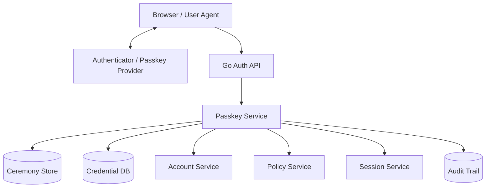

### Approval step-up

Flow:

1. Officer/supervisor is already logged in.
2. User clicks “Approve enforcement action”.
3. Backend checks session auth age and assurance.
4. If insufficient, backend starts WebAuthn step-up.
5. Challenge is bound to action ID and case ID.
6. User verifies with passkey.
7. Backend creates short-lived elevation context.
8. Approval is committed with audit evidence:
   - actor;
   - subject;
   - case ID;
   - action;
   - passkey credential fingerprint;
   - UV true;
   - auth time;
   - policy version.

### Step-up model

```go
type StepUpPurpose string

const (
    StepUpApproveEnforcement StepUpPurpose = "approve_enforcement"
    StepUpExportCaseData     StepUpPurpose = "export_case_data"
    StepUpManagePermission   StepUpPurpose = "manage_permission"
)

type StepUpSession struct {
    ID           string
    SessionID    string
    AccountID    string
    UserID       string
    TenantID     string
    Purpose      StepUpPurpose
    ResourceID   string
    CredentialID CredentialID
    UserVerified bool
    CreatedAt    time.Time
    ExpiresAt    time.Time
}
```

Step-up should be narrow. Do not make “user is elevated for everything for 8 hours”.

---

## 60. Mermaid Diagrams

### 60.1 Registration Ceremony

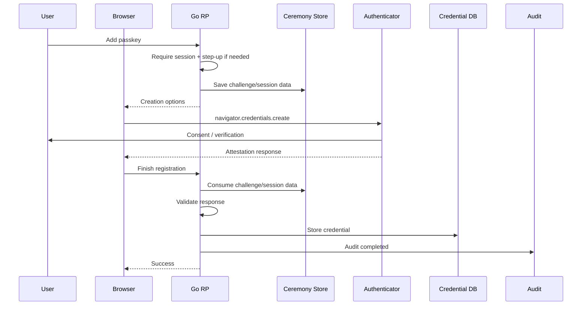

### 60.2 Discoverable Passkey Login

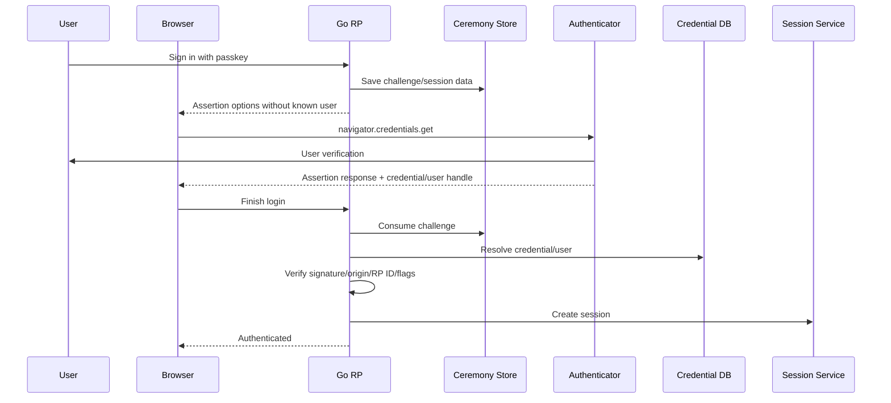

### 60.3 Trust Boundary

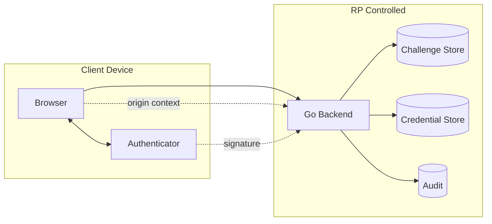

### 60.4 Credential Lifecycle

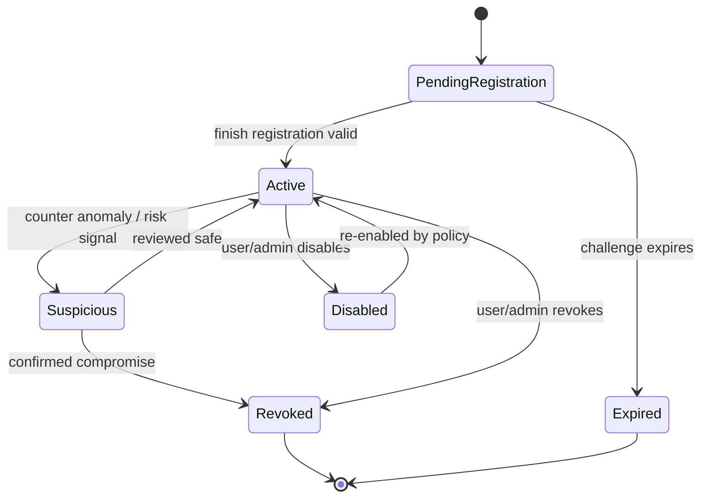

### 60.5 Step-Up for Sensitive Action

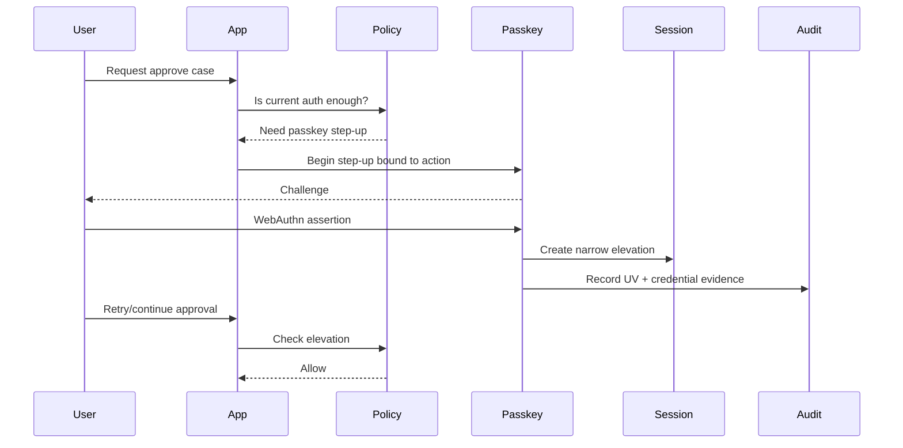

---

## 61. Review Questions

1. Apa beda RP ID dan origin?
2. Kenapa RP ID adalah architecture decision?
3. Kenapa server tetap harus menyimpan challenge walaupun browser menjalankan WebAuthn API?
4. Apa yang membedakan known-user login dan discoverable login?
5. Kenapa email tidak ideal sebagai user handle?
6. Apa yang terjadi jika domain migration mengubah RP ID?
7. Apa yang harus divalidasi dari `clientDataJSON`?
8. Apa yang harus divalidasi dari `authenticatorData`?
9. Apa makna User Presence dan User Verification?
10. Apakah semua passkey otomatis AAL3? Jelaskan kenapa tidak.
11. Kapan attestation perlu diwajibkan?
12. Apa risiko synced passkey untuk admin?
13. Kenapa recovery flow dapat menghancurkan benefit passkey?
14. Bagaimana mencegah attacker menambahkan passkey saat session user dicuri?
15. Bagaimana desain audit event untuk passkey login?
16. Bagaimana credential lookup harus dilakukan di sistem multi-tenant?
17. Kenapa sign counter anomaly sebaiknya risk signal, bukan selalu hard fail?
18. Apa saja metric production yang perlu dipantau?
19. Apa bedanya passkey sebagai passwordless dan passkey sebagai MFA?
20. Bagaimana step-up passkey harus dibatasi scope-nya?

---

## 62. Practical Exercises

### Exercise 1 — RP ID Decision Memo

Ambil sistem dengan domain:

```text
app.company.com
admin.company.com
tenant-a.company.com
tenant-b.company.com
```

Tulis memo desain:

- RP ID apa yang dipilih?
- origin apa yang diizinkan?
- apa trust boundary-nya?
- apa risiko subdomain takeover?
- bagaimana domain migration dilakukan?

### Exercise 2 — Credential Schema Review

Desain tabel WebAuthn credential untuk:

- multi-tenant;
- user handle;
- credential ID;
- public key;
- status lifecycle;
- sign counter;
- audit metadata.

Tambahkan constraints dan indexes.

### Exercise 3 — Step-Up Flow

Desain flow WebAuthn step-up untuk aksi:

```text
approve enforcement decision
```

Challenge harus bound ke:

- session ID;
- user ID;
- case ID;
- action type;
- expiry.

Tentukan audit event.

### Exercise 4 — Recovery Threat Model

Buat threat model untuk:

```text
User kehilangan semua passkeys.
```

Bandingkan recovery untuk:

- consumer user;
- officer;
- supervisor;
- super admin.

### Exercise 5 — Error Taxonomy

Buat error taxonomy:

- invalid challenge;
- expired challenge;
- origin mismatch;
- credential revoked;
- user handle mismatch;
- account disabled;
- UV required;
- counter anomaly.

Tentukan mana yang boleh ditampilkan ke user dan mana yang hanya untuk internal logs.

---

## 63. Production Checklist

### RP configuration

- [ ] RP ID dipilih berdasarkan trust boundary.
- [ ] Allowed origins explicit, bukan wildcard sembarangan.
- [ ] HTTPS enforced di production.
- [ ] Localhost hanya untuk development.
- [ ] Domain migration plan tersedia.

### Challenge/session

- [ ] Challenge random dan cukup panjang.
- [ ] Ceremony session disimpan server-side/integrity-protected.
- [ ] TTL pendek.
- [ ] Atomic consume.
- [ ] Ceremony type bound.
- [ ] Actor/session bound untuk registration/step-up.

### Registration

- [ ] Require authenticated session untuk add passkey.
- [ ] Require step-up untuk sensitive account.
- [ ] Exclude existing credentials.
- [ ] User handle opaque dan stable.
- [ ] Credential ID uniqueness enforced.
- [ ] Notification on new passkey.
- [ ] Audit event.

### Login

- [ ] Known-user and discoverable flows separated.
- [ ] Origin validated.
- [ ] RP ID hash validated.
- [ ] Signature validated.
- [ ] Credential ownership checked.
- [ ] Tenant boundary checked.
- [ ] Credential/account status checked.
- [ ] UV policy enforced.
- [ ] Session assurance set correctly.

### Storage

- [ ] Public key stored canonically.
- [ ] Credential ID stored canonically.
- [ ] Sign counter stored.
- [ ] BE/BS stored if library exposes.
- [ ] AAGUID/attestation metadata stored if policy uses it.
- [ ] Soft revoke rather than hard delete for audit.

### Recovery

- [ ] Recovery tiered by risk.
- [ ] Admin recovery requires approval.
- [ ] User notified.
- [ ] Sessions revoked after suspicious recovery.
- [ ] Recovery audit event.

### Operations

- [ ] Metrics instrumented.
- [ ] Failure reason taxonomy.
- [ ] Dependency pinned.
- [ ] Browser compatibility tested.
- [ ] Runbook for domain/RP mismatch.
- [ ] Runbook for challenge store outage.

---

## 64. Referensi Primer

1. W3C — Web Authentication: An API for accessing Public Key Credentials Level 3  
   `https://www.w3.org/TR/webauthn-3/`

2. FIDO Alliance — Passkeys  
   `https://fidoalliance.org/passkeys/`

3. NIST SP 800-63B-4 — Authentication and Authenticator Management  
   `https://pages.nist.gov/800-63-4/sp800-63b.html`

4. OWASP Authentication Cheat Sheet  
   `https://cheatsheetseries.owasp.org/cheatsheets/Authentication_Cheat_Sheet.html`

5. OWASP Multifactor Authentication Cheat Sheet  
   `https://cheatsheetseries.owasp.org/cheatsheets/Multifactor_Authentication_Cheat_Sheet.html`

6. OWASP ASVS  
   `https://owasp.org/www-project-application-security-verification-standard/`

7. Go WebAuthn Library — `github.com/go-webauthn/webauthn`  
   `https://github.com/go-webauthn/webauthn`

8. Go package docs — `github.com/go-webauthn/webauthn/webauthn`  
   `https://pkg.go.dev/github.com/go-webauthn/webauthn/webauthn`

9. W3C WebAuthn Security and Privacy Self-Review  
   `https://github.com/w3c/webauthn/wiki/Security-and-Privacy-Self%E2%80%90Review%3A-WebAuthn-L1%2C-L2%2C-L3`

---

## Penutup

Passkey/WebAuthn adalah salah satu evolusi paling penting dalam authentication modern karena memindahkan login dari shared-secret model ke asymmetric, origin-bound, challenge-response model.

Namun kualitas sistem tidak ditentukan oleh “sudah pakai passkey” saja. Kualitasnya ditentukan oleh:

- RP ID design;
- challenge lifecycle;
- credential domain model;
- session assurance;
- recovery strength;
- tenant boundary;
- admin controls;
- auditability;
- operational readiness.

Pada level top engineer, pertanyaan utamanya bukan:

> “Bagaimana cara memanggil WebAuthn API?”

Tetapi:

> “Authority apa yang diberikan oleh assertion ini, dalam konteks apa, kepada subject siapa, untuk resource mana, selama berapa lama, dan bagaimana kita membuktikannya nanti?”

Part berikutnya akan masuk ke **Session Architecture**: cookie session, server-side session, stateless token, hybrid session, session rotation, logout semantics, idle timeout, absolute timeout, concurrent sessions, dan device/session management.

<!-- NAVIGATION_FOOTER -->
<div class="page-nav">
<a href="./learn-go-authentication-authorization-identity-permission-part-007.md">⬅️ Part 007 — MFA, OTP, TOTP, Recovery Codes, Step-Up Authentication di Go</a>
<a href="./index.md">📚 Kategori</a>
<a href="../../index.md">🏠 Home</a>
<a href="./learn-go-authentication-authorization-identity-permission-part-009.md">Part 009 — Session Architecture: Cookie Session, Server-Side Session, Stateless Token ➡️</a>
</div>
