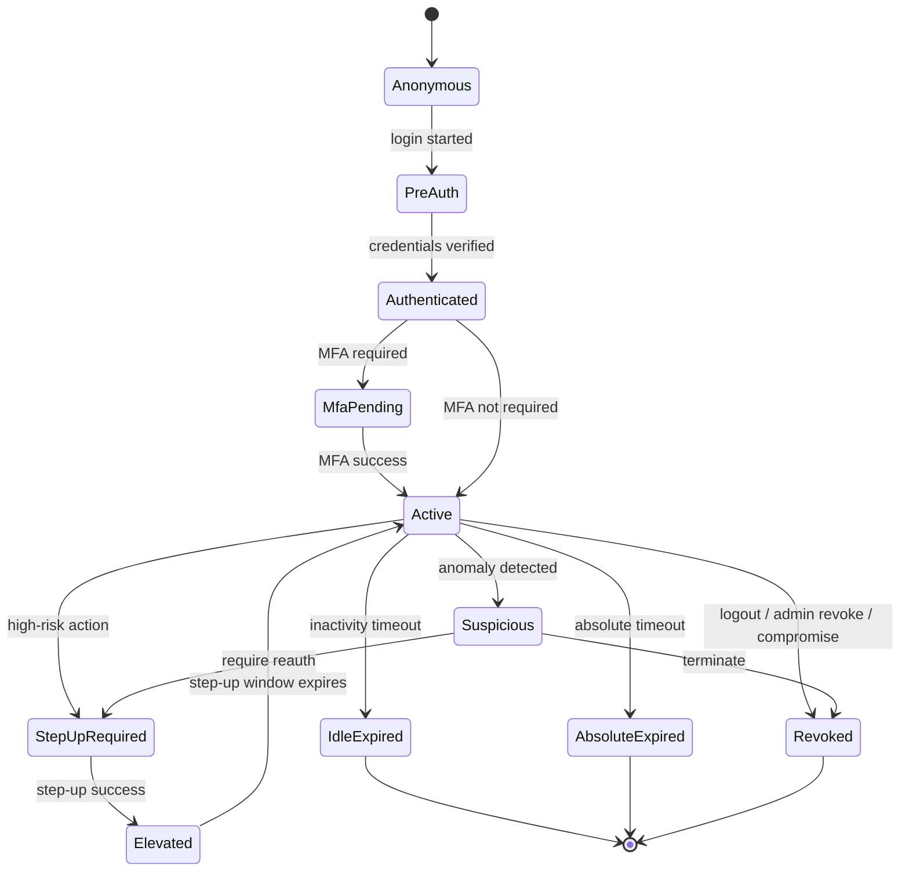
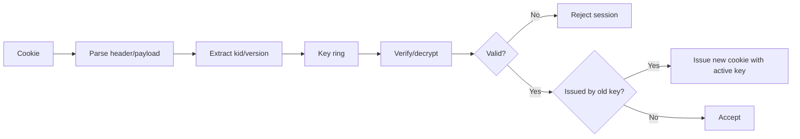
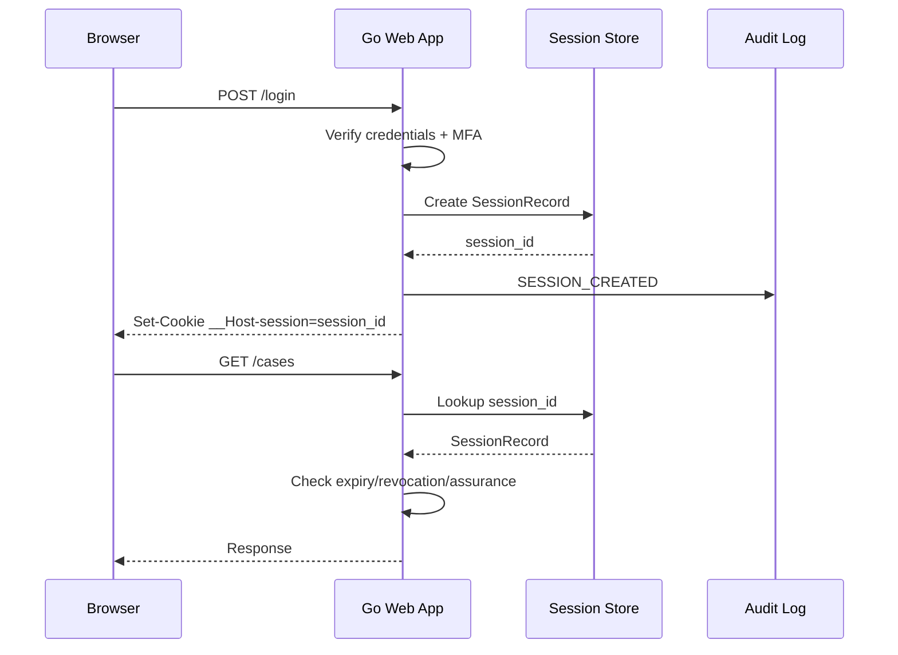
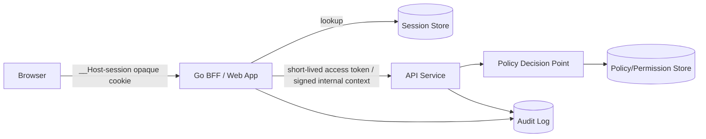
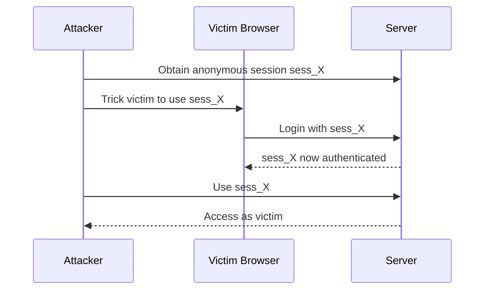
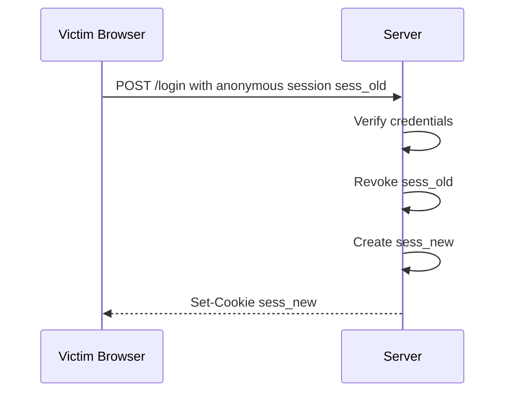
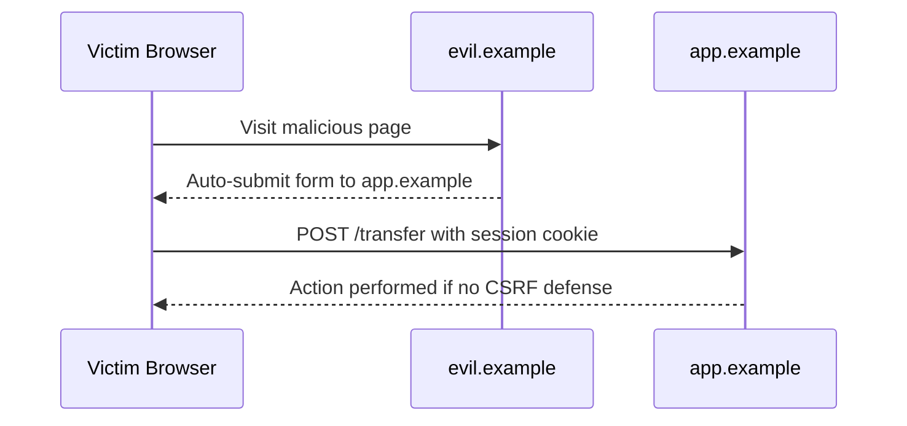
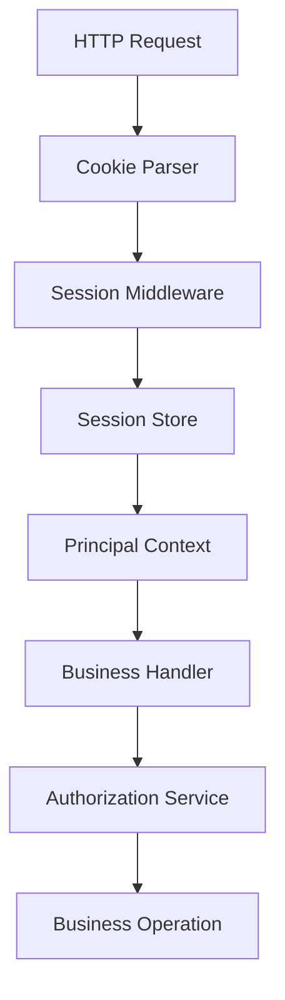
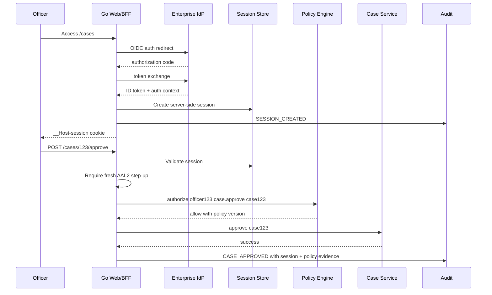

# learn-go-authentication-authorization-identity-permission-part-009.md

# Part 009 — Session Architecture: Cookie Session, Server-Side Session, Stateless Token

> Seri: **learn-go-authentication-authorization-identity-permission**  
> Target: Go 1.26.x  
> Level: Advanced / internal engineering handbook  
> Fokus: desain session sebagai kontrol keamanan, bukan hanya mekanisme “login persistence”.

---

## Daftar Isi

1. [Tujuan Part Ini](#1-tujuan-part-ini)
2. [Session Itu Apa?](#2-session-itu-apa)
3. [Session Bukan Authenticator, Bukan Identity, Bukan Authorization](#3-session-bukan-authenticator-bukan-identity-bukan-authorization)
4. [HTTP, Cookie, dan Kenapa Session Ada](#4-http-cookie-dan-kenapa-session-ada)
5. [Tiga Arsitektur Besar Session](#5-tiga-arsitektur-besar-session)
6. [Decision Matrix: Cookie Session vs Server-Side Session vs Stateless Token](#6-decision-matrix-cookie-session-vs-server-side-session-vs-stateless-token)
7. [Security Invariants untuk Session](#7-security-invariants-untuk-session)
8. [Lifecycle Session sebagai State Machine](#8-lifecycle-session-sebagai-state-machine)
9. [Cookie Session Deep Dive](#9-cookie-session-deep-dive)
10. [Server-Side Session Deep Dive](#10-server-side-session-deep-dive)
11. [Stateless Token Session Deep Dive](#11-stateless-token-session-deep-dive)
12. [Hybrid Session: Real-World Enterprise Pattern](#12-hybrid-session-real-world-enterprise-pattern)
13. [Session ID Design](#13-session-id-design)
14. [Session Store Design](#14-session-store-design)
15. [Timeout: Idle, Absolute, Assurance Freshness, Step-Up](#15-timeout-idle-absolute-assurance-freshness-step-up)
16. [Session Rotation dan Session Fixation Defense](#16-session-rotation-dan-session-fixation-defense)
17. [Logout Semantics: Local, Global, Federated, Device-Level](#17-logout-semantics-local-global-federated-device-level)
18. [CSRF, SameSite, Fetch Metadata, dan Browser Session](#18-csrf-samesite-fetch-metadata-dan-browser-session)
19. [SPA, Mobile, CLI, dan Non-Browser Client](#19-spa-mobile-cli-dan-non-browser-client)
20. [Go Architecture: Package Boundary](#20-go-architecture-package-boundary)
21. [Go Implementation: Session Types](#21-go-implementation-session-types)
22. [Go Implementation: Cookie Issuer](#22-go-implementation-cookie-issuer)
23. [Go Implementation: Session Store Interface](#23-go-implementation-session-store-interface)
24. [Go Implementation: Middleware](#24-go-implementation-middleware)
25. [Go Implementation: Login, Rotate, Logout](#25-go-implementation-login-rotate-logout)
26. [Distributed Systems Problems](#26-distributed-systems-problems)
27. [Audit Model](#27-audit-model)
28. [Failure Modes](#28-failure-modes)
29. [Anti-Patterns](#29-anti-patterns)
30. [Production Checklist](#30-production-checklist)
31. [Case Study: Regulatory Case Management Platform](#31-case-study-regulatory-case-management-platform)
32. [Review Questions](#32-review-questions)
33. [Ringkasan](#33-ringkasan)
34. [Referensi Primer](#34-referensi-primer)

---

## 1. Tujuan Part Ini

Part ini membahas **session architecture** secara serius.

Bukan hanya:

> “Setelah login, simpan token di cookie.”

Tetapi:

> “Setelah authentication event terjadi, bagaimana sistem mempertahankan hubungan aman antara user, device, browser, assurance level, tenant, role context, dan request berikutnya, sambil tetap memungkinkan logout, revocation, timeout, monitoring, audit, dan recovery dari failure?”

Session adalah salah satu area yang sering terlihat sederhana tetapi sangat sering menjadi sumber insiden:

- session fixation;
- token theft;
- stale permission;
- logout tidak benar-benar logout;
- session tetap hidup setelah password/MFA diubah;
- session tenant A bisa dipakai untuk data tenant B;
- refresh token membuat user “hidup selamanya”;
- stateless JWT tidak bisa dicabut;
- cookie salah domain sehingga subdomain bisa melakukan fixation;
- session timeout hanya enforced di browser, bukan server;
- audit tidak bisa menjelaskan “siapa melakukan apa, dari session mana, setelah auth event mana”.

Top engineer melihat session bukan sebagai detail framework. Session adalah **runtime control object**.

---

## 2. Session Itu Apa?

Definisi kerja:

> Session adalah hubungan sementara antara requester dan sistem yang dibuat setelah authentication event, diwakili oleh session secret atau token, dan dipakai untuk mengasosiasikan request berikutnya dengan subject, actor, assurance, device, tenant context, dan kebijakan keamanan tertentu.

Session biasanya menjawab:

- user sudah login atau belum;
- login kapan;
- metode login apa;
- assurance level berapa;
- session masih fresh atau tidak;
- session sudah idle terlalu lama atau belum;
- session berasal dari device/browser mana;
- session punya tenant/account context apa;
- session sudah dicabut atau belum;
- session boleh dipakai untuk action ini atau harus step-up;
- session ini dibuat sebagai user sendiri, delegated access, impersonation, atau break-glass.

### 2.1 Session sebagai runtime proof

Session bukan identity asli. Session adalah **runtime proof** bahwa suatu authentication event pernah terjadi dan masih dianggap valid.

```text
Human / Workload Identity
        |
        | authentication event
        v
Session
        |
        | request continuation
        v
Authenticated interaction
```

### 2.2 Session sebagai envelope

Session bukan cuma `user_id`.

Session enterprise biasanya membawa atau menunjuk ke:

```text
Session
├── session_id
├── subject_id
├── actor_id
├── account_id
├── tenant_id / active_tenant_id
├── auth_time
├── last_activity_at
├── expires_at
├── assurance_level
├── authentication_methods
├── device_id
├── client_id
├── ip / user-agent hints
├── step_up_until
├── impersonation_context
├── policy_snapshot_version
├── revoked_at
└── risk_state
```

Kalau session hanya menyimpan `user_id`, sistem akan kesulitan saat perlu:

- audit;
- step-up;
- impersonation;
- session revocation;
- assurance-aware authorization;
- tenant isolation;
- device management;
- suspicious activity detection.

---

## 3. Session Bukan Authenticator, Bukan Identity, Bukan Authorization

Ini perbedaan yang harus bersih sejak awal.

| Konsep | Menjawab | Contoh | Salah kaprah umum |
|---|---|---|---|
| Identity | Entitas siapa/apa | user, service, organization | “JWT adalah identity” |
| Authenticator | Bukti kontrol faktor | password, passkey, TOTP, client cert | “cookie adalah authenticator” |
| Authentication event | Proses verifikasi kontrol authenticator | login password+MFA | “session = login event” |
| Session | Kelanjutan sementara dari auth event | browser session cookie | “session valid berarti boleh semua” |
| Authorization | Decision boleh/tidak | allow `case.approve` | “role di session cukup” |
| Permission | Model authority | `case:read`, `case:approve` | “permission sama dengan route name” |
| Token | Format/carrier secret/claim | session ID, JWT, opaque token | “JWT selalu stateless session” |

### 3.1 Cookie bukan session

Cookie adalah **transport/storage mechanism** di browser.

Session adalah **server-side atau logical relationship**.

Cookie bisa membawa:

- opaque session ID;
- signed session blob;
- encrypted session blob;
- CSRF token;
- preference non-security;
- refresh token;
- device identifier.

Tetapi cookie itu sendiri bukan session.

### 3.2 JWT bukan session

JWT adalah format token berbasis JSON claims yang bisa ditandatangani dan/atau dienkripsi.

JWT bisa dipakai untuk:

- access token;
- ID token;
- session token;
- client assertion;
- token exchange;
- internal service assertion.

Tetapi JWT tidak otomatis menjadi session yang aman.

### 3.3 Access token bukan bukti kehadiran user

Access token bisa tetap valid setelah user menutup browser atau meninggalkan device.

Karena itu sistem high-assurance tidak boleh menganggap:

```text
access token valid = subscriber masih hadir
```

Session presence, assurance freshness, dan access-token validity adalah hal berbeda.

---

## 4. HTTP, Cookie, dan Kenapa Session Ada

HTTP bersifat request/response. Server menerima request tanpa otomatis tahu bahwa request ini merupakan kelanjutan dari request sebelumnya.

Cookie muncul sebagai mekanisme agar server dapat menyimpan state kecil di user agent dan user agent mengirimkannya kembali pada request berikutnya.

```mermaid
sequenceDiagram
    participant B as Browser
    participant S as Server

    B->>S: GET /login
    S-->>B: HTML login form
    B->>S: POST /login credentials
    S-->>B: Set-Cookie: __Host-session=opaque; Secure; HttpOnly; SameSite=Lax
    B->>S: GET /cases Cookie: __Host-session=opaque
    S-->>B: Cases page if session valid
```

Masalahnya: cookie adalah fitur browser yang sangat kompleks karena domain, path, SameSite, Secure, HttpOnly, expiration, subdomain, redirects, browser policy, dan historical compatibility.

### 4.1 Set-Cookie tidak boleh digabung sembarangan

`Set-Cookie` punya semantik khusus. Beberapa `Set-Cookie` header harus dikirim sebagai beberapa header terpisah, bukan digabung menjadi satu header comma-separated. Ini penting saat membuat middleware/proxy/gateway yang memanipulasi response header.

### 4.2 Cookie metadata menentukan boundary

Cookie bukan hanya `name=value`.

Yang penting:

- `Secure`
- `HttpOnly`
- `SameSite`
- `Path`
- `Domain`
- `Expires`
- `Max-Age`
- prefix `__Host-`
- prefix `__Secure-`
- `Partitioned` pada browser modern/CHIPS scenario

Untuk session cookie sensitif, baseline aman biasanya:

```http
Set-Cookie: __Host-session=<opaque>; Path=/; Secure; HttpOnly; SameSite=Lax
```

Untuk aplikasi yang sangat sensitif dan tidak membutuhkan cross-site navigation login callback behavior di endpoint yang sama, `SameSite=Strict` bisa dipertimbangkan.

---

## 5. Tiga Arsitektur Besar Session

Ada tiga bentuk besar:

1. **Cookie session**
2. **Server-side session**
3. **Stateless token session**

Istilah ini kadang tumpang tindih. Agar presisi, kita definisikan seperti ini.

### 5.1 Cookie session

Session state disimpan di cookie, biasanya signed atau encrypted.

Contoh:

```text
Browser cookie contains:
{
  "sub": "usr_123",
  "auth_time": 1760000000,
  "exp": 1760003600
}
```

Cookie bisa:

- signed only: client bisa membaca, tidak bisa mengubah tanpa invalid signature;
- encrypted/authenticated: client tidak bisa membaca dan tidak bisa mengubah;
- compressed+encrypted: hati-hati terhadap side-channel dan ukuran.

Kelebihan:

- tidak perlu session store;
- horizontal scaling mudah;
- latency rendah;
- cocok untuk state kecil.

Kekurangan:

- revocation sulit;
- ukuran cookie terbatas;
- stale claims;
- logout global sulit;
- key rotation perlu hati-hati;
- data exposure jika hanya signed;
- replay tetap mungkin jika cookie dicuri.

### 5.2 Server-side session

Cookie hanya membawa opaque session ID. State session disimpan server-side.

```text
Cookie:
  __Host-session=sess_opaque_random

Server store:
  sess_opaque_random -> SessionRecord
```

Kelebihan:

- revocation mudah;
- logout global/device-level mudah;
- state bisa kaya;
- permission/assurance freshness lebih mudah;
- audit dan monitoring lebih kuat.

Kekurangan:

- butuh storage;
- latency tambahan;
- consistency dan availability store penting;
- deployment multi-region lebih sulit;
- cache invalidation harus didesain.

### 5.3 Stateless token session

Client membawa token self-contained, biasanya JWT/JWE/PASETO-like token, dan server memvalidasi token tanpa membaca session store per request.

```text
Authorization: Bearer <signed-token>
```

atau:

```http
Cookie: __Host-session=<signed-token>
```

Kelebihan:

- scalable;
- cocok untuk API/service mesh;
- resource server bisa validate lokal;
- mengurangi dependency session store.

Kekurangan:

- revocation sulit;
- stale permission;
- token theft blast radius tergantung TTL;
- key rotation kompleks;
- tidak cocok sebagai long-lived browser session tanpa kontrol tambahan;
- cenderung menyamarkan authorization state sebagai authentication state.

---

## 6. Decision Matrix: Cookie Session vs Server-Side Session vs Stateless Token

| Kriteria | Cookie session stateful di cookie | Server-side session | Stateless token |
|---|---:|---:|---:|
| Horizontal scaling | Sangat mudah | Butuh shared store | Sangat mudah |
| Logout segera | Sulit | Mudah | Sulit tanpa blacklist/introspection |
| Device/session management | Lemah-sedang | Kuat | Lemah-sedang |
| Revocation per session | Sulit | Kuat | Sulit |
| Stale permission defense | Lemah | Kuat | Lemah kecuali TTL pendek |
| Audit richness | Sedang | Kuat | Sedang |
| Multi-region | Mudah secara compute, sulit revocation | Sulit-sedang | Mudah secara compute, sulit revocation |
| Token theft blast radius | Sampai expiry | Bisa dicabut | Sampai expiry |
| Storage cost | Rendah | Ada | Rendah |
| Cookie size pressure | Tinggi | Rendah | Tinggi jika JWT di cookie |
| Best for | low-risk web app, small state | enterprise web app, regulatory app | API access token, service-to-service |
| Bad for | high-risk revocation-heavy app | ultra-low-latency stateless edge only | browser session jangka panjang |

### 6.1 Rule of thumb

Untuk aplikasi enterprise/regulatory dengan user manusia:

> Gunakan **server-side browser session** dengan opaque cookie, lalu gunakan access token internal yang pendek umur hanya jika perlu memanggil API/resource server.

Untuk API machine-to-machine:

> Gunakan **short-lived signed access token** atau mTLS/workload identity, bukan browser session.

Untuk SPA modern:

> Hindari menyimpan long-lived token di localStorage. Prefer Backend-for-Frontend/BFF dengan HttpOnly Secure cookie atau authorization code + PKCE dengan refresh token rotation yang sangat hati-hati.

---

## 7. Security Invariants untuk Session

Invariants adalah aturan yang harus selalu benar.

### 7.1 Session secret harus unguessable

Session ID harus berasal dari random source kriptografis. Jangan pakai:

- incrementing ID;
- UUID v1/time-based;
- hash dari user ID;
- timestamp;
- email;
- encoded JSON tanpa randomness;
- deterministic session ID.

Gunakan minimal 128-bit random untuk margin modern.

### 7.2 Session secret harus meaningless

Opaque session ID tidak boleh mengandung:

- user ID;
- role;
- email;
- tenant ID;
- timestamp yang bisa dibaca;
- permission;
- informasi internal.

Session ID harus seperti:

```text
untrusted random handle -> server-side lookup
```

bukan:

```text
encoded domain state
```

Jika state memang di client, harus signed/encrypted dan tetap dianggap bearer credential.

### 7.3 Session timeout harus enforced server-side

Client boleh menampilkan countdown, tetapi server yang harus menentukan:

- idle expired;
- absolute expired;
- assurance expired;
- step-up expired;
- revoked;
- device disabled;
- account disabled.

### 7.4 Session harus rotate saat privilege berubah

Session ID harus diganti setelah:

- login berhasil;
- MFA berhasil;
- step-up berhasil;
- role/admin mode berubah;
- tenant context berubah jika tenant context melekat kuat ke session;
- impersonation dimulai/diakhiri;
- password/MFA berubah;
- recovery flow selesai.

Tujuannya mencegah session fixation dan mengurangi blast radius.

### 7.5 Session check bukan authorization check

Valid session hanya berarti request authenticated.

Setiap sensitive action tetap membutuhkan authorization decision:

```text
valid session + fresh assurance + allow(policy, subject, action, resource, context)
```

### 7.6 Logout harus invalidate server-side authority

Logout tidak cukup dengan:

```javascript
localStorage.removeItem("token")
```

atau hanya:

```http
Set-Cookie: session=; Max-Age=0
```

Untuk server-side session, record harus revoked/deleted. Untuk refresh token, token family harus dicabut jika logout global/device-level.

### 7.7 Session harus auditable

Minimal audit:

- session created;
- session rotated;
- session expired;
- session revoked;
- logout;
- suspicious reuse;
- assurance upgraded;
- tenant switched;
- impersonation started/ended;
- admin elevation started/ended.

---

## 8. Lifecycle Session sebagai State Machine

Session harus dipahami sebagai state machine.



### 8.1 State yang sering dilupakan

Banyak aplikasi hanya punya:

```text
logged_in = true/false
```

Itu terlalu miskin.

Dalam sistem nyata, perlu membedakan:

| State | Makna |
|---|---|
| `anonymous` | belum ada identity yang terautentikasi |
| `pre_auth` | login flow dimulai, belum trusted |
| `mfa_pending` | faktor pertama valid, belum assurance cukup |
| `active` | session authenticated dan usable |
| `step_up_required` | session valid tapi assurance/freshness tidak cukup |
| `elevated` | session sementara punya assurance lebih tinggi |
| `idle_expired` | tidak aktif terlalu lama |
| `absolute_expired` | sudah melebihi umur maksimum |
| `revoked` | dicabut eksplisit |
| `suspicious` | anomali terdeteksi, butuh action |

### 8.2 Session transition harus atomic

Contoh bahaya:

1. user berhasil MFA;
2. server membuat elevated session;
3. store gagal update old session revoked;
4. dua session aktif dengan assurance berbeda;
5. audit bingung.

Untuk operasi sensitif, transisi session harus atomik di store.

---

## 9. Cookie Session Deep Dive

Cookie session berarti session state berada di cookie.

Ada dua pola:

1. **Signed cookie**
2. **Encrypted cookie**

### 9.1 Signed cookie

Signed cookie melindungi integrity, bukan confidentiality.

```text
payload = base64(json(session_state))
signature = HMAC(key, payload)
cookie = payload + "." + signature
```

Client bisa membaca payload.

Cocok untuk:

- non-sensitive claims;
- flash message;
- low-risk preference;
- short-lived small session.

Tidak cocok untuk:

- PII;
- role internal yang sensitif;
- tenant membership detail;
- policy snapshot;
- long-lived auth session.

### 9.2 Encrypted cookie

Encrypted cookie memakai authenticated encryption.

```text
cookie = AEAD_Encrypt(key, json(session_state), aad)
```

Client tidak bisa membaca atau mengubah.

Tetapi tetap ada masalah:

- replay jika cookie dicuri;
- revocation sulit;
- stale state;
- key rotation;
- ukuran;
- tidak ada server-side control per session.

### 9.3 Kapan cookie session layak?

Layak jika:

- aplikasi kecil;
- risiko rendah;
- tidak butuh logout global kuat;
- tidak butuh admin revoke cepat;
- state kecil;
- TTL pendek;
- tidak banyak permission berubah;
- tidak multi-tenant kompleks.

Tidak layak jika:

- aplikasi regulatory;
- ada impersonation;
- ada break-glass;
- ada high-risk workflow;
- user permission sering berubah;
- session harus bisa dicabut segera;
- audit harus rekonstruktif.

### 9.4 Cookie payload versioning

Kalau tetap memakai cookie session, payload wajib punya versi:

```json
{
  "v": 3,
  "sid": "s_opaque_optional",
  "sub": "usr_123",
  "auth_time": 1760000000,
  "iat": 1760000000,
  "exp": 1760003600,
  "aal": 2,
  "amr": ["pwd", "otp"],
  "nonce": "..."
}
```

Tanpa versioning, migrasi sulit.

### 9.5 Key rotation untuk cookie session

Butuh:

- active signing/encryption key;
- previous verification/decryption keys;
- `kid` atau key ring;
- max TTL tidak lebih panjang dari masa dukung old key;
- emergency revoke plan.



### 9.6 Common bug: cookie contains authorization truth

Buruk:

```json
{
  "user_id": "usr_123",
  "roles": ["admin"]
}
```

Lalu server percaya role di cookie selama 8 jam.

Jika admin role dicabut, cookie lama tetap admin.

Lebih baik:

- cookie menyimpan session handle;
- server mengambil role/permission dari authoritative source atau cache dengan invalidation;
- jika claims dimaterialisasi, gunakan TTL pendek dan policy version check.

---

## 10. Server-Side Session Deep Dive

Server-side session adalah default kuat untuk aplikasi web enterprise.

### 10.1 Flow dasar



### 10.2 Session store sebagai security database

Session store bukan cache biasa.

Ia menentukan apakah request hidup atau mati.

Session store minimal mendukung:

- create;
- get;
- touch activity;
- rotate ID;
- revoke one session;
- revoke all sessions for account;
- revoke all sessions for credential change;
- list sessions for account/device;
- expire;
- audit event emission.

### 10.3 Store choice

| Store | Kelebihan | Kekurangan | Cocok |
|---|---|---|---|
| Redis | cepat, TTL native | persistence/config perlu hati-hati | session active store |
| SQL | durable, queryable | latency lebih tinggi | audit/session registry |
| DynamoDB/NoSQL | scalable, TTL | consistency model perlu dipahami | multi-region/session registry |
| In-memory | cepat | tidak survive restart, tidak multi-instance | dev/test only |
| Hybrid Redis+SQL | cepat + durable audit | kompleks | enterprise production |

### 10.4 Session record contoh

```sql
CREATE TABLE auth_session (
    session_id_hash       VARCHAR(128) PRIMARY KEY,
    account_id            VARCHAR(64) NOT NULL,
    subject_id            VARCHAR(64) NOT NULL,
    actor_id              VARCHAR(64) NULL,
    tenant_id             VARCHAR(64) NULL,
    device_id             VARCHAR(64) NULL,
    auth_time             TIMESTAMP NOT NULL,
    last_activity_at      TIMESTAMP NOT NULL,
    expires_at            TIMESTAMP NOT NULL,
    idle_expires_at       TIMESTAMP NOT NULL,
    assurance_level       SMALLINT NOT NULL,
    authentication_methods VARCHAR(512) NOT NULL,
    state                 VARCHAR(32) NOT NULL,
    risk_state            VARCHAR(32) NOT NULL,
    policy_version        VARCHAR(64) NULL,
    rotated_from_hash     VARCHAR(128) NULL,
    revoked_at            TIMESTAMP NULL,
    revoked_reason        VARCHAR(128) NULL,
    created_at            TIMESTAMP NOT NULL,
    updated_at            TIMESTAMP NOT NULL
);

CREATE INDEX idx_auth_session_account_state
    ON auth_session(account_id, state);

CREATE INDEX idx_auth_session_expiry
    ON auth_session(expires_at);
```

### 10.5 Hash session ID at rest

Jangan simpan raw session ID di database.

Simpan hash:

```text
session_id_secret -> SHA-256 or HMAC-SHA-256 -> session_id_hash
```

Kenapa?

Jika DB leak, attacker tidak langsung mendapat bearer credential.

Lebih baik gunakan HMAC dengan server secret:

```text
lookup_key = HMAC(session_lookup_key, raw_session_id)
```

Manfaat:

- raw session secret tidak pernah persistent;
- DB dump tidak bisa langsung dipakai sebagai cookie;
- lookup tetap deterministic.

### 10.6 Touch strategy

Jangan update `last_activity_at` pada setiap request ke SQL jika traffic tinggi.

Strategi:

- update jika beda lebih dari threshold, misalnya 60 detik;
- touch di Redis cepat, flush async ke durable store;
- jangan reset idle timeout untuk request background tertentu;
- jangan touch untuk static asset;
- jangan touch untuk failed authorization high-risk tanpa desain.

Contoh policy:

```text
Touch only if:
- session active
- request authenticated
- route is user-initiated or API call meaningful
- last_activity_at older than 60s
```

### 10.7 Device/session management UI

User harus bisa melihat dan mencabut session:

- device/browser label;
- lokasi kasar;
- last active;
- created at;
- current session marker;
- assurance method;
- revoke button.

Admin/security team perlu:

- revoke all sessions for account;
- revoke sessions by tenant;
- revoke sessions by suspicious campaign;
- revoke sessions by credential event;
- revoke sessions created before timestamp.

---

## 11. Stateless Token Session Deep Dive

Stateless token adalah token self-contained.

### 11.1 Struktur umum JWT-like session token

```json
{
  "iss": "https://auth.example.com",
  "sub": "usr_123",
  "aud": "web-app",
  "iat": 1760000000,
  "exp": 1760000900,
  "auth_time": 1760000000,
  "sid": "sess_123",
  "aal": 2,
  "amr": ["pwd", "otp"],
  "tenant": "tenant_abc"
}
```

### 11.2 Validasi token bukan hanya signature

Validasi minimal:

- signature valid;
- algorithm expected;
- key trusted;
- `iss` tepat;
- `aud` tepat;
- `exp` belum lewat;
- `nbf` jika ada;
- `iat` reasonable;
- `auth_time` fresh untuk action tertentu;
- `typ`/token use tepat;
- `sid`/`jti` belum revoked jika revocation list dipakai;
- tenant claim cocok dengan resource boundary;
- assurance claim cukup;
- clock skew terkendali.

### 11.3 Stateless bukan berarti tanpa state sama sekali

Begitu butuh:

- logout;
- revoke compromised token;
- refresh token rotation;
- suspicious session termination;
- permission invalidation;
- global sign-out;
- device list;

maka Anda butuh state.

State bisa berupa:

- revocation list;
- token family registry;
- session registry;
- key version invalidation;
- user `session_version`;
- permission `policy_version`;
- token introspection endpoint.

Jadi “stateless” sering berarti:

> Tidak lookup session store pada setiap request normal, tetapi tetap punya control state untuk lifecycle tertentu.

### 11.4 Token TTL sebagai blast-radius control

Jika stateless token dicuri, server tidak bisa menarik token tanpa state tambahan.

Maka TTL harus pendek.

| Token | Typical TTL | Catatan |
|---|---:|---|
| Browser session opaque ID | 15 min–24h idle/absolute tergantung assurance | server-side revocable |
| Access token web API | 5–15 min | short-lived |
| Internal service token | 1–15 min | prefer mTLS/workload identity |
| Refresh token | days/months | harus rotation dan reuse detection |
| Password reset token | 5–30 min | one-time use |
| Step-up token/window | 1–15 min | action-bound lebih baik |

TTL bukan angka universal. TTL diturunkan dari risk, assurance, revocation capability, dan UX.

### 11.5 Stateless session untuk browser: hati-hati

Browser session berbasis JWT panjang umur punya masalah:

- logout tidak instan;
- role stale;
- user disabled tapi token masih valid;
- tenant membership stale;
- token besar dikirim setiap request;
- token theft dari browser berarti replay;
- XSS/CSRF threat tetap ada tergantung storage.

Untuk browser app, opaque server-side session sering lebih aman dan lebih mudah dioperasikan.

---

## 12. Hybrid Session: Real-World Enterprise Pattern

Pola yang sering paling masuk akal:

```text
Browser -> BFF/Web App:
    HttpOnly Secure SameSite cookie containing opaque session ID

BFF/Web App -> API services:
    short-lived internal access token or propagated principal context

API service -> Policy service:
    authorize(subject, action, resource, context)
```



### 12.1 Kenapa hybrid bagus?

Karena memisahkan concerns:

- browser security memakai cookie attributes;
- session lifecycle ditangani server-side;
- API scale memakai token pendek;
- authorization tetap centralized/consistent;
- revocation bisa dilakukan di session store;
- audit punya `session_id`, `actor_id`, `subject_id`, `auth_time`.

### 12.2 Internal access token tidak harus sama dengan browser session

Browser session lebih panjang dan revocable.

Internal access token pendek dan scoped.

```text
Browser session:
  sid=sess_abc
  expires=8h absolute
  idle=30m

Internal access token:
  aud=case-service
  exp=5m
  sid=sess_abc
  sub=usr_123
  tenant=agency_1
```

Jika internal access token leak, TTL pendek. Jika browser session dicabut, BFF berhenti mengeluarkan access token baru.

### 12.3 Token exchange pattern

BFF dapat menukar session menjadi token internal per audience:

```text
session -> token(case-service, 5m)
session -> token(report-service, 5m)
session -> token(document-service, 5m)
```

Token internal tidak perlu membawa semua role. Cukup membawa subject/session/tenant/auth context, lalu service melakukan authorization.

---

## 13. Session ID Design

### 13.1 Entropy

Gunakan minimal 128 bit random.

Di Go:

```go
package sessionid

import (
    "crypto/rand"
    "encoding/base64"
    "fmt"
)

func New() (string, error) {
    var b [32]byte // 256-bit random
    if _, err := rand.Read(b[:]); err != nil {
        return "", fmt.Errorf("generate session id: %w", err)
    }
    return base64.RawURLEncoding.EncodeToString(b[:]), nil
}
```

Kenapa 32 byte?

- 16 byte/128-bit sudah kuat untuk banyak kasus;
- 32 byte/256-bit memberi margin dan murah;
- Base64URL aman untuk cookie value;
- tidak ada struktur yang bisa ditebak.

### 13.2 Prefix internal boleh, tapi jangan kurangi entropy

Boleh menggunakan prefix untuk observability internal:

```text
sess_<random>
```

Tapi random part tetap harus kuat.

### 13.3 Jangan letakkan metadata di session ID

Buruk:

```text
usr_123.tenant_456.1760000000.signature
```

Lebih baik:

```text
sess_<random>
```

Lalu server-side lookup.

### 13.4 Validate shape sebelum lookup

Session ID berasal dari client. Treat as untrusted input.

```go
func ValidSessionID(s string) bool {
    if len(s) < 32 || len(s) > 128 {
        return false
    }
    for _, r := range s {
        if (r >= 'a' && r <= 'z') ||
            (r >= 'A' && r <= 'Z') ||
            (r >= '0' && r <= '9') ||
            r == '-' || r == '_' {
            continue
        }
        return false
    }
    return true
}
```

Jangan masukkan raw session ID arbitrary ke SQL/log/error.

---

## 14. Session Store Design

### 14.1 Store harus punya semantics eksplisit

Interface buruk:

```go
type Store interface {
    Get(id string) map[string]any
    Set(id string, data map[string]any)
}
```

Terlalu generik, tidak menyatakan security semantics.

Interface lebih baik:

```go
package session

import (
    "context"
    "time"
)

type ID string

type LookupKey string

type State string

const (
    StateActive          State = "active"
    StateIdleExpired     State = "idle_expired"
    StateAbsoluteExpired State = "absolute_expired"
    StateRevoked         State = "revoked"
)

type AssuranceLevel int

const (
    AAL0 AssuranceLevel = 0
    AAL1 AssuranceLevel = 1
    AAL2 AssuranceLevel = 2
    AAL3 AssuranceLevel = 3
)

type Record struct {
    IDHash                string
    AccountID             string
    SubjectID             string
    ActorID               string
    TenantID              string
    DeviceID              string
    AuthTime              time.Time
    LastActivityAt        time.Time
    AbsoluteExpiresAt     time.Time
    IdleExpiresAt         time.Time
    AssuranceLevel        AssuranceLevel
    AuthenticationMethods []string
    State                 State
    StepUpUntil           *time.Time
    PolicyVersion         string
    CreatedAt             time.Time
    UpdatedAt             time.Time
    RevokedAt             *time.Time
    RevokedReason         string
}

type CreateInput struct {
    RawID                 ID
    AccountID             string
    SubjectID             string
    ActorID               string
    TenantID              string
    DeviceID              string
    AuthTime              time.Time
    Now                   time.Time
    AbsoluteTTL           time.Duration
    IdleTTL               time.Duration
    AssuranceLevel        AssuranceLevel
    AuthenticationMethods []string
    PolicyVersion         string
}

type Store interface {
    Create(ctx context.Context, in CreateInput) (*Record, error)
    FindActive(ctx context.Context, rawID ID, now time.Time) (*Record, error)
    Touch(ctx context.Context, rawID ID, now time.Time, idleTTL time.Duration) error
    Rotate(ctx context.Context, oldRawID ID, newRawID ID, now time.Time) (*Record, error)
    Revoke(ctx context.Context, rawID ID, reason string, now time.Time) error
    RevokeAllForAccount(ctx context.Context, accountID string, reason string, now time.Time) error
}
```

### 14.2 `FindActive` harus enforce expiry

Jangan biarkan semua caller lupa cek expiry.

```go
func (s *SQLStore) FindActive(ctx context.Context, rawID session.ID, now time.Time) (*session.Record, error) {
    key := s.lookupKey(rawID)

    rec, err := s.findByHash(ctx, key)
    if err != nil {
        return nil, err
    }
    if rec == nil {
        return nil, session.ErrNotFound
    }
    if rec.State != session.StateActive {
        return nil, session.ErrInactive
    }
    if !rec.RevokedAt.IsZero() {
        return nil, session.ErrRevoked
    }
    if !now.Before(rec.AbsoluteExpiresAt) {
        return nil, session.ErrAbsoluteExpired
    }
    if !now.Before(rec.IdleExpiresAt) {
        return nil, session.ErrIdleExpired
    }
    return rec, nil
}
```

### 14.3 Race conditions

Race yang harus dipikirkan:

- logout vs request concurrent;
- rotate vs old session reuse;
- permission revoke vs active request;
- session touch vs revoke;
- refresh token reuse vs rotation;
- admin revoke all vs login baru;
- tenant switch vs API request.

Gunakan:

- database transaction;
- compare-and-swap/version;
- row lock untuk rotate/revoke;
- monotonic `session_version` untuk account-wide revocation;
- idempotent operations.

---

## 15. Timeout: Idle, Absolute, Assurance Freshness, Step-Up

Session timeout bukan satu angka.

Ada beberapa waktu:

| Waktu | Makna |
|---|---|
| `auth_time` | kapan authentication event terjadi |
| `last_activity_at` | kapan ada aktivitas terakhir |
| `idle_expires_at` | kapan session mati karena idle |
| `absolute_expires_at` | kapan session mati walau aktif terus |
| `assurance_fresh_until` | kapan assurance dianggap fresh |
| `step_up_until` | kapan elevation untuk action sensitif habis |
| `refresh_expires_at` | kapan refresh/reissue tidak boleh lagi |

### 15.1 Idle timeout

Idle timeout melindungi kasus:

- user meninggalkan workstation;
- session terbuka di browser publik;
- device digunakan orang lain;
- XSS/CSRF mencoba menggunakan session lama yang idle.

Tetapi idle timeout harus memperhatikan UX dan risiko.

### 15.2 Absolute timeout

Absolute timeout mencegah session hidup selamanya karena terus aktif.

Tanpa absolute timeout, sliding session bisa menjadi immortal session.

### 15.3 Assurance freshness

Untuk aksi tertentu, session valid saja tidak cukup.

Contoh:

- approve enforcement action;
- export PII;
- change bank/payment info;
- add admin role;
- disable MFA;
- impersonate user;
- close regulatory case.

Policy:

```text
case.approve requires:
- session active
- AAL2 or higher
- auth_time <= 30 minutes ago OR step_up_until valid
- actor not impersonating unless permission allows
```

### 15.4 NIST-oriented timeout baseline

Untuk sistem yang ingin mengacu pada NIST SP 800-63B-4:

- AAL1: overall timeout sebaiknya tidak lebih dari 30 hari; inactivity timeout boleh diterapkan tapi tidak wajib.
- AAL2: overall timeout sebaiknya tidak lebih dari 24 jam; inactivity timeout sebaiknya tidak lebih dari 1 jam.
- AAL3: overall timeout tidak lebih dari 12 jam; inactivity timeout sebaiknya tidak lebih dari 15 menit.

Untuk aplikasi regulatory, biasanya angka operasional lebih ketat daripada batas maksimum.

Contoh:

```text
Standard staff portal:
  idle: 30 min
  absolute: 8-12 h

Admin console:
  idle: 15 min
  absolute: 8 h
  step-up: 5-15 min

Public citizen portal:
  idle: 15-30 min
  absolute: 2-8 h depending risk
```

### 15.5 Jangan enforce timeout hanya di frontend

Buruk:

```javascript
setTimeout(() => logout(), 15 * 60 * 1000)
```

Frontend countdown berguna untuk UX, tetapi enforcement harus server-side.

---

## 16. Session Rotation dan Session Fixation Defense

Session fixation terjadi ketika attacker berhasil membuat victim memakai session ID yang diketahui attacker, lalu victim login, dan session yang sama menjadi authenticated.

### 16.1 Vulnerable flow



### 16.2 Correct flow



### 16.3 Rotation events

Rotate after:

- login;
- MFA completion;
- step-up;
- privilege elevation;
- impersonation start/end;
- tenant context switch if context-bound;
- recovery completion;
- suspicious activity challenge.

### 16.4 Grace window?

Kadang perlu grace window untuk concurrent browser requests.

Contoh:

- user login;
- browser punya beberapa pending requests dengan old session;
- rotate immediately;
- old requests gagal.

Grace window bisa dipakai, tetapi hati-hati.

Pattern:

```text
old session state = rotated
old session accepted only for 5-30 seconds
old session cannot perform sensitive action
old session returns new cookie or 401 refresh required
old session reuse after grace = suspicious
```

Untuk high-security action, tidak ada grace.

---

## 17. Logout Semantics: Local, Global, Federated, Device-Level

Logout adalah topik yang sering disalahpahami.

### 17.1 Local logout

Mencabut session saat ini di aplikasi saat ini.

```text
current session -> revoked
cookie -> Max-Age=0
```

### 17.2 Device logout

Mencabut session untuk device/browser tertentu.

```text
device_id = dev_123 -> revoke all active sessions for device
```

### 17.3 Global logout

Mencabut semua session user/account.

Dipakai setelah:

- password change;
- MFA reset;
- account takeover suspicion;
- user disabled;
- role critical revoked;
- security admin action.

### 17.4 Federated logout

Jika login via IdP/OIDC/SAML, logout bisa memiliki beberapa layer:

```text
RP session
IdP session
other RP sessions
browser cookies at each domain
refresh tokens
access tokens
```

Salah kaprah:

> Logout dari aplikasi otomatis logout dari IdP dan semua aplikasi.

Belum tentu.

Dalam federation, RP session dan IdP session bisa independen. RP harus tetap authoritative atas session timeout/reauth requirement untuk aplikasinya sendiri.

### 17.5 Logout response harus clear cookie benar

Cookie deletion harus match attributes penting:

```go
http.SetCookie(w, &http.Cookie{
    Name:     "__Host-session",
    Value:    "",
    Path:     "/",
    MaxAge:   -1,
    Secure:   true,
    HttpOnly: true,
    SameSite: http.SameSiteLaxMode,
})
```

Jika dulu cookie di-set dengan Domain tertentu, deletion harus match Domain itu. Karena `__Host-` tidak boleh punya Domain, deletion lebih sederhana.

---

## 18. CSRF, SameSite, Fetch Metadata, dan Browser Session

Cookie otomatis dikirim browser. Ini membuat cookie session nyaman, tetapi menciptakan CSRF risk.

### 18.1 CSRF mental model

Attacker site bisa membuat browser victim mengirim request ke aplikasi Anda. Jika browser otomatis menyertakan cookie session, request bisa authenticated.



### 18.2 SameSite bukan pengganti semua CSRF control

`SameSite=Lax` atau `Strict` membantu, tetapi jangan jadikan satu-satunya kontrol untuk semua context.

Masih perlu:

- CSRF token untuk unsafe methods;
- Origin/Referer validation untuk browser requests;
- Fetch Metadata headers jika tersedia;
- jangan pakai GET untuk mutating action;
- content-type restrictions;
- double-submit pattern jika sesuai;
- BFF boundary.

### 18.3 Fetch Metadata di Go

Go 1.25 memperkenalkan `http.CrossOriginProtection`, yang menggunakan browser Fetch Metadata untuk membantu menolak non-safe cross-origin browser requests. Pada Go 1.26.x, fitur ini dapat dipertimbangkan sebagai salah satu lapisan CSRF/cross-origin defense, bukan pengganti semua authorization/CSRF design.

Conceptual use:

```go
// Illustrative; check exact API on your Go version.
func main() {
    mux := http.NewServeMux()
    mux.HandleFunc("POST /cases/{id}/approve", approveHandler)

    // Cross-origin protection should be configured carefully with trusted origins/bypasses.
    protected := http.NewCrossOriginProtection()
    handler := protected.Handler(mux)

    http.ListenAndServe(":8080", handler)
}
```

Prinsipnya:

- safe methods seperti GET/HEAD/OPTIONS berbeda dari unsafe methods;
- mutating browser requests harus punya CSRF protection;
- API bearer token untuk non-browser clients tidak sama threat modelnya.

### 18.4 CSRF token binding ke session

CSRF token harus:

- unik per session atau per request/window;
- tidak predictable;
- divalidasi server-side;
- tidak bocor ke third-party;
- rotate saat session rotate;
- invalid saat session revoked.

---

## 19. SPA, Mobile, CLI, dan Non-Browser Client

Session architecture tergantung client.

### 19.1 Server-rendered web app

Biasanya paling cocok:

```text
HttpOnly Secure SameSite cookie + server-side session
```

### 19.2 SPA same-site dengan BFF

Recommended enterprise pattern:

```text
SPA -> BFF with HttpOnly cookie
BFF -> APIs using internal token/session context
```

SPA tidak memegang access token long-lived.

### 19.3 SPA pure API client

Jika SPA langsung ke API dan menggunakan OAuth/OIDC:

- gunakan Authorization Code + PKCE;
- hindari implicit flow;
- jangan simpan long-lived token di localStorage;
- pertimbangkan refresh token rotation;
- pertimbangkan token binding/sender constraint jika tersedia;
- risiko XSS harus dianggap sangat serius.

### 19.4 Mobile app

Mobile biasanya menggunakan:

- OAuth authorization code + PKCE;
- system browser/custom tab;
- secure storage untuk refresh token;
- access token pendek;
- refresh token rotation;
- device binding/risk signals.

Cookie browser session tidak selalu cocok untuk native mobile API.

### 19.5 CLI

CLI biasanya menggunakan:

- device authorization grant;
- short-lived access token;
- refresh token stored in OS keychain if possible;
- explicit logout clears local credential;
- token revocation server-side.

### 19.6 Service-to-service

Jangan pakai human browser session.

Gunakan:

- mTLS;
- SPIFFE/SPIRE;
- OAuth client credentials;
- workload identity;
- short-lived signed token;
- per-service authorization.

---

## 20. Go Architecture: Package Boundary

Struktur package yang sehat:

```text
/internal/auth/session
    id.go
    record.go
    store.go
    cookie.go
    middleware.go
    errors.go
    policy.go

/internal/auth/session/sqlstore
/internal/auth/session/redisstore
/internal/auth/csrf
/internal/auth/assurance
/internal/auth/audit
/internal/httpserver
/internal/app/login
/internal/app/logout
```

### 20.1 Jangan campur session dengan handler bisnis

Buruk:

```go
func ApproveCase(w http.ResponseWriter, r *http.Request) {
    cookie, _ := r.Cookie("session")
    userID := decode(cookie.Value)
    if isAdmin(userID) { ... }
}
```

Lebih baik:

```go
func ApproveCase(w http.ResponseWriter, r *http.Request) {
    principal := auth.MustPrincipal(r.Context())
    decision := authorizer.Authorize(ctx, principal, "case.approve", resource)
    ...
}
```

Session middleware hanya menetapkan authenticated principal/context. Authorization tetap eksplisit.

### 20.2 Boundary yang disarankan



---

## 21. Go Implementation: Session Types

Contoh tipe domain:

```go
package session

import "time"

type RawID string

type AccountID string
type SubjectID string
type ActorID string
type TenantID string
type DeviceID string

type AssuranceLevel int

const (
    AssuranceUnknown AssuranceLevel = 0
    AssuranceAAL1    AssuranceLevel = 1
    AssuranceAAL2    AssuranceLevel = 2
    AssuranceAAL3    AssuranceLevel = 3
)

type State string

const (
    StateActive          State = "active"
    StateRotated         State = "rotated"
    StateRevoked         State = "revoked"
    StateIdleExpired     State = "idle_expired"
    StateAbsoluteExpired State = "absolute_expired"
)

type Record struct {
    IDHash                string
    AccountID             AccountID
    SubjectID             SubjectID
    ActorID               ActorID
    TenantID              TenantID
    DeviceID              DeviceID
    AuthTime              time.Time
    LastActivityAt        time.Time
    IdleExpiresAt         time.Time
    AbsoluteExpiresAt     time.Time
    AssuranceLevel        AssuranceLevel
    AuthenticationMethods []string
    State                 State
    StepUpUntil           *time.Time
    CreatedAt             time.Time
    UpdatedAt             time.Time
    RevokedAt             *time.Time
    RevokedReason         string
}

func (r Record) IsActiveAt(now time.Time) bool {
    if r.State != StateActive || r.RevokedAt != nil {
        return false
    }
    if !now.Before(r.IdleExpiresAt) {
        return false
    }
    if !now.Before(r.AbsoluteExpiresAt) {
        return false
    }
    return true
}

func (r Record) HasFreshAssurance(now time.Time, maxAge time.Duration, min AssuranceLevel) bool {
    if r.AssuranceLevel < min {
        return false
    }
    if maxAge <= 0 {
        return true
    }
    return now.Sub(r.AuthTime) <= maxAge
}
```

### 21.1 Jangan gunakan `map[string]any` untuk session core

Session core perlu type-safety karena kesalahan field bisa menjadi security bug.

```go
// Bad
ctx = context.WithValue(ctx, "user", claims["user"])

// Better
ctx = authcontext.WithPrincipal(ctx, principal)
```

---

## 22. Go Implementation: Cookie Issuer

Cookie issuer mengisolasi detail cookie.

```go
package sessioncookie

import (
    "net/http"
    "time"
)

type Config struct {
    Name     string
    Path     string
    Domain   string
    Secure   bool
    SameSite http.SameSite
}

type Issuer struct {
    cfg Config
}

func NewIssuer(cfg Config) *Issuer {
    if cfg.Name == "" {
        cfg.Name = "__Host-session"
    }
    if cfg.Path == "" {
        cfg.Path = "/"
    }
    if cfg.SameSite == 0 {
        cfg.SameSite = http.SameSiteLaxMode
    }
    return &Issuer{cfg: cfg}
}

func (i *Issuer) Set(w http.ResponseWriter, value string, expires time.Time) {
    http.SetCookie(w, &http.Cookie{
        Name:     i.cfg.Name,
        Value:    value,
        Path:     i.cfg.Path,
        Domain:   i.cfg.Domain,
        Expires:  expires,
        Secure:   i.cfg.Secure,
        HttpOnly: true,
        SameSite: i.cfg.SameSite,
    })
}

func (i *Issuer) Clear(w http.ResponseWriter) {
    http.SetCookie(w, &http.Cookie{
        Name:     i.cfg.Name,
        Value:    "",
        Path:     i.cfg.Path,
        Domain:   i.cfg.Domain,
        MaxAge:   -1,
        Secure:   i.cfg.Secure,
        HttpOnly: true,
        SameSite: i.cfg.SameSite,
    })
}
```

### 22.1 Production defaults

Untuk production:

```go
issuer := sessioncookie.NewIssuer(sessioncookie.Config{
    Name:     "__Host-session",
    Path:     "/",
    Domain:   "", // required for __Host-
    Secure:   true,
    SameSite: http.SameSiteLaxMode,
})
```

Untuk local development, jangan menurunkan standar production secara diam-diam. Gunakan environment-specific config yang jelas.

---

## 23. Go Implementation: Session Store Interface

```go
package session

import (
    "context"
    "errors"
    "time"
)

var (
    ErrNotFound        = errors.New("session not found")
    ErrInactive        = errors.New("session inactive")
    ErrRevoked         = errors.New("session revoked")
    ErrIdleExpired     = errors.New("session idle expired")
    ErrAbsoluteExpired = errors.New("session absolute expired")
)

type Store interface {
    Create(ctx context.Context, in CreateInput) (*Record, error)
    FindActive(ctx context.Context, rawID RawID, now time.Time) (*Record, error)
    Touch(ctx context.Context, rawID RawID, now time.Time) error
    Rotate(ctx context.Context, oldID RawID, newID RawID, now time.Time) (*Record, error)
    Revoke(ctx context.Context, rawID RawID, reason string, now time.Time) error
    RevokeAllForAccount(ctx context.Context, accountID AccountID, reason string, now time.Time) error
}

type CreateInput struct {
    RawID                 RawID
    AccountID             AccountID
    SubjectID             SubjectID
    ActorID               ActorID
    TenantID              TenantID
    DeviceID              DeviceID
    AuthTime              time.Time
    Now                   time.Time
    IdleTTL               time.Duration
    AbsoluteTTL           time.Duration
    AssuranceLevel        AssuranceLevel
    AuthenticationMethods []string
}
```

### 23.1 Store should return typed errors

Middleware needs to map errors correctly:

| Error | HTTP | Meaning |
|---|---:|---|
| missing cookie | 401 | unauthenticated |
| invalid shape | 401 | unauthenticated/suspicious |
| not found | 401 | unauthenticated |
| idle expired | 401 or 440-style app code | re-login/reauth |
| absolute expired | 401 | full reauth |
| revoked | 401 | logged out/revoked |
| store unavailable | 503 or fail-closed | infrastructure problem |

Do not return `403` for missing/expired session. `403` is for authenticated but not authorized.

---

## 24. Go Implementation: Middleware

```go
package sessionmw

import (
    "context"
    "errors"
    "net/http"
    "time"

    "example.com/app/internal/auth/session"
)

type Principal struct {
    SessionIDHash         string
    AccountID             string
    SubjectID             string
    ActorID               string
    TenantID              string
    AssuranceLevel        session.AssuranceLevel
    AuthenticationMethods []string
    AuthTime              time.Time
}

type principalKey struct{}

func WithPrincipal(ctx context.Context, p Principal) context.Context {
    return context.WithValue(ctx, principalKey{}, p)
}

func PrincipalFrom(ctx context.Context) (Principal, bool) {
    p, ok := ctx.Value(principalKey{}).(Principal)
    return p, ok
}

type Middleware struct {
    CookieName string
    Store      session.Store
    Now        func() time.Time
}

func (m Middleware) RequireSession(next http.Handler) http.Handler {
    return http.HandlerFunc(func(w http.ResponseWriter, r *http.Request) {
        now := m.now()

        c, err := r.Cookie(m.CookieName)
        if err != nil {
            http.Error(w, "unauthenticated", http.StatusUnauthorized)
            return
        }

        rawID := session.RawID(c.Value)
        if !validSessionID(string(rawID)) {
            http.Error(w, "unauthenticated", http.StatusUnauthorized)
            return
        }

        rec, err := m.Store.FindActive(r.Context(), rawID, now)
        if err != nil {
            // Avoid leaking whether a session existed.
            if errors.Is(err, session.ErrNotFound) ||
                errors.Is(err, session.ErrRevoked) ||
                errors.Is(err, session.ErrIdleExpired) ||
                errors.Is(err, session.ErrAbsoluteExpired) {
                http.Error(w, "unauthenticated", http.StatusUnauthorized)
                return
            }
            http.Error(w, "session unavailable", http.StatusServiceUnavailable)
            return
        }

        // Touch may be async or thresholded in production.
        _ = m.Store.Touch(r.Context(), rawID, now)

        p := Principal{
            SessionIDHash:         rec.IDHash,
            AccountID:             string(rec.AccountID),
            SubjectID:             string(rec.SubjectID),
            ActorID:               string(rec.ActorID),
            TenantID:              string(rec.TenantID),
            AssuranceLevel:        rec.AssuranceLevel,
            AuthenticationMethods: rec.AuthenticationMethods,
            AuthTime:              rec.AuthTime,
        }

        next.ServeHTTP(w, r.WithContext(WithPrincipal(r.Context(), p)))
    })
}

func (m Middleware) now() time.Time {
    if m.Now != nil {
        return m.Now()
    }
    return time.Now().UTC()
}
```

### 24.1 Middleware tidak boleh melakukan full authorization

Middleware boleh:

- parse cookie;
- validate session;
- set principal;
- enforce route requires authentication;
- enforce coarse assurance for route group jika jelas.

Middleware jangan:

- hardcode business permission;
- membaca resource dari DB hanya untuk auth route generic;
- menyimpan role list sebagai satu-satunya authorization truth;
- menelan error policy decision.

---

## 25. Go Implementation: Login, Rotate, Logout

### 25.1 Login flow

```go
func (h *LoginHandler) ServeHTTP(w http.ResponseWriter, r *http.Request) {
    ctx := r.Context()
    now := h.now()

    // 1. Parse and validate request.
    var req LoginRequest
    if err := decodeJSON(r, &req); err != nil {
        writeBadRequest(w)
        return
    }

    // 2. Verify credentials. Details handled in part 006/007/008.
    authn, err := h.Authenticator.Authenticate(ctx, req.Username, req.Password, req.MFACode)
    if err != nil {
        h.Audit.LoginFailed(ctx, req.Username, r.RemoteAddr)
        writeInvalidCredentials(w)
        return
    }

    // 3. Generate session ID.
    rawID, err := h.IDGenerator.New()
    if err != nil {
        writeServerError(w)
        return
    }

    // 4. Create server-side session.
    rec, err := h.Sessions.Create(ctx, session.CreateInput{
        RawID:                 session.RawID(rawID),
        AccountID:             session.AccountID(authn.AccountID),
        SubjectID:             session.SubjectID(authn.SubjectID),
        ActorID:               session.ActorID(authn.SubjectID),
        TenantID:              session.TenantID(authn.DefaultTenantID),
        DeviceID:              session.DeviceID(authn.DeviceID),
        AuthTime:              now,
        Now:                   now,
        IdleTTL:               h.Policy.IdleTTL(authn.AssuranceLevel),
        AbsoluteTTL:           h.Policy.AbsoluteTTL(authn.AssuranceLevel),
        AssuranceLevel:        authn.AssuranceLevel,
        AuthenticationMethods: authn.Methods,
    })
    if err != nil {
        writeServerError(w)
        return
    }

    // 5. Set cookie.
    h.Cookie.Set(w, rawID, rec.AbsoluteExpiresAt)

    // 6. Audit.
    h.Audit.SessionCreated(ctx, rec)

    writeJSON(w, http.StatusOK, LoginResponse{OK: true})
}
```

### 25.2 Rotate after MFA/step-up

```go
func (h *StepUpHandler) Complete(w http.ResponseWriter, r *http.Request) {
    ctx := r.Context()
    now := h.now()

    oldCookie, err := r.Cookie(h.CookieName)
    if err != nil {
        http.Error(w, "unauthenticated", http.StatusUnauthorized)
        return
    }

    if err := h.StepUpVerifier.Verify(ctx, r); err != nil {
        http.Error(w, "step-up failed", http.StatusUnauthorized)
        return
    }

    newID, err := h.IDGenerator.New()
    if err != nil {
        http.Error(w, "server error", http.StatusInternalServerError)
        return
    }

    rec, err := h.Sessions.Rotate(ctx, session.RawID(oldCookie.Value), session.RawID(newID), now)
    if err != nil {
        http.Error(w, "unauthenticated", http.StatusUnauthorized)
        return
    }

    h.Cookie.Set(w, newID, rec.AbsoluteExpiresAt)
    h.Audit.SessionRotated(ctx, rec, "step_up")

    writeJSON(w, http.StatusOK, map[string]any{"ok": true})
}
```

### 25.3 Logout

```go
func (h *LogoutHandler) ServeHTTP(w http.ResponseWriter, r *http.Request) {
    ctx := r.Context()
    now := h.now()

    if c, err := r.Cookie(h.CookieName); err == nil && validSessionID(c.Value) {
        _ = h.Sessions.Revoke(ctx, session.RawID(c.Value), "user_logout", now)
        h.Audit.SessionRevoked(ctx, c.Value, "user_logout")
    }

    h.Cookie.Clear(w)
    w.WriteHeader(http.StatusNoContent)
}
```

Logout harus idempotent. Logout session yang sudah expired/revoked tidak perlu error ke user.

---

## 26. Distributed Systems Problems

Session di single-node mudah. Session di distributed system rumit.

### 26.1 Store availability

Jika session store down, pilihan:

| Strategy | Risiko |
|---|---|
| fail-open | attacker bisa bypass session validation jika store down |
| fail-closed | outage membuat semua user tidak bisa akses |
| degraded read-only | kompleks tapi bisa mengurangi impact |
| local cache with short TTL | stale revocation risk |

Untuk auth, default harus fail-closed untuk sensitive operations.

### 26.2 Local cache

Local cache session bisa mengurangi latency, tetapi menciptakan stale revocation.

Mitigasi:

- TTL sangat pendek, misalnya 5–60 detik;
- cache only positive active sessions;
- do not cache elevated/high-risk sessions terlalu lama;
- revoke event invalidation via pub/sub;
- compare `account_session_version`;
- force store check untuk sensitive actions.

### 26.3 Multi-region

Masalah:

- user login di region A;
- request berikutnya ke region B;
- session belum replicated;
- logout di region A;
- token masih accepted di region B.

Opsi:

1. sticky region;
2. globally replicated store;
3. stateless short token + regional session anchor;
4. home-region session routing;
5. eventual consistency dengan low-risk acceptance dan high-risk strict check.

### 26.4 Clock skew

Session expiry memakai waktu. Semua node perlu NTP benar.

Gunakan:

- UTC everywhere;
- monotonic duration untuk runtime internal jika mungkin;
- database/server time authority untuk write critical;
- small clock skew allowance untuk token, tetapi jangan terlalu longgar.

### 26.5 Concurrent request after logout

Skenario:

1. user klik logout;
2. request API lama masih berjalan;
3. session revoked;
4. request lama commit action.

Mitigasi:

- authorization check near mutation;
- transaction-level check for session active on sensitive operation;
- cancellation on logout sulit tapi bisa dengan eventing;
- short-running request;
- idempotency and audit.

### 26.6 Permission change while session active

Session valid tidak berarti permission masih valid.

Mitigasi:

- policy decision per action;
- permission cache TTL pendek;
- account/tenant permission version;
- revoke sessions for critical role changes;
- step-up for newly elevated privilege.

---

## 27. Audit Model

Session audit minimal:

```sql
CREATE TABLE auth_session_event (
    event_id        VARCHAR(64) PRIMARY KEY,
    event_type      VARCHAR(64) NOT NULL,
    session_id_hash VARCHAR(128) NULL,
    account_id      VARCHAR(64) NULL,
    subject_id      VARCHAR(64) NULL,
    actor_id        VARCHAR(64) NULL,
    tenant_id       VARCHAR(64) NULL,
    device_id       VARCHAR(64) NULL,
    ip_address      VARCHAR(64) NULL,
    user_agent_hash VARCHAR(128) NULL,
    reason          VARCHAR(256) NULL,
    occurred_at     TIMESTAMP NOT NULL,
    metadata_json   CLOB NULL
);
```

### 27.1 Event taxonomy

| Event | Kapan |
|---|---|
| `SESSION_CREATED` | setelah login/reauth success |
| `SESSION_ROTATED` | setelah login/MFA/step-up/privilege change |
| `SESSION_TOUCHED` | optional sampled/thresholded |
| `SESSION_IDLE_EXPIRED` | saat ditemukan idle expired |
| `SESSION_ABSOLUTE_EXPIRED` | saat ditemukan absolute expired |
| `SESSION_REVOKED` | logout/admin/security event |
| `SESSION_REVOKE_ALL` | global sign-out/account compromise |
| `SESSION_REUSE_AFTER_ROTATE` | old session dipakai setelah rotate |
| `SESSION_REUSE_AFTER_REVOKE` | revoked session dipakai |
| `SESSION_ANOMALY_DETECTED` | IP/device/UA/risk anomaly |
| `SESSION_STEP_UP_GRANTED` | step-up berhasil |
| `SESSION_STEP_UP_EXPIRED` | optional saat enforcement |

### 27.2 Jangan log raw session ID

Log:

- hash/HMAC of session ID;
- session internal ID;
- event ID;
- correlation ID.

Jangan log:

- raw cookie;
- raw JWT;
- refresh token;
- CSRF token;
- password reset token.

### 27.3 Audit reconstruction question

Sistem harus bisa menjawab:

> Pada tanggal X, user melakukan approval case Y. Session mana yang dipakai, login dengan metode apa, assurance level berapa, apakah sedang impersonation, dari tenant mana, permission version apa, dan apakah ada revoke/role change di sekitar waktu itu?

Kalau tidak bisa dijawab, auditability belum matang.

---

## 28. Failure Modes

### 28.1 Session fixation

Penyebab:

- session ID tidak rotate setelah login;
- menerima session ID dari URL;
- cookie Domain terlalu luas;
- subdomain vulnerable bisa set cookie;
- anonymous session dipromosikan menjadi authenticated.

Mitigasi:

- rotate after auth;
- only accept cookie transport;
- use `__Host-` cookie;
- no Domain for sensitive cookie;
- invalidate old session.

### 28.2 Session hijacking

Penyebab:

- XSS;
- malware;
- insecure cookie;
- no TLS/Secure;
- token in localStorage;
- logs leak;
- browser extension compromise.

Mitigasi:

- Secure/HttpOnly/SameSite;
- CSP/XSS prevention;
- never log tokens;
- anomaly detection;
- reauth for sensitive action;
- device-bound/session-bound mechanisms where possible.

### 28.3 Stale permission

Penyebab:

- role stored in long-lived JWT;
- permission cache no invalidation;
- user disabled but token valid;
- tenant membership changed while session active.

Mitigasi:

- server-side authorization;
- short-lived access token;
- policy version;
- revoke on critical changes;
- per-action policy decision.

### 28.4 Logout not effective

Penyebab:

- only clear frontend token;
- refresh token still valid;
- multiple cookies not cleared;
- IdP/RP session confusion;
- stateless token still accepted.

Mitigasi:

- revoke server-side session;
- revoke refresh token family;
- clear all relevant cookies;
- expose session management;
- short TTL access tokens;
- document federation semantics.

### 28.5 Session store outage

Penyebab:

- Redis down;
- DB overloaded;
- network partition;
- region replication delay.

Mitigasi:

- fail-closed for sensitive routes;
- graceful 503;
- clear runbook;
- local cache only with explicit risk;
- circuit breaker;
- separate session store capacity planning.

### 28.6 Cookie misconfiguration

Penyebab:

- missing Secure;
- missing HttpOnly;
- SameSite=None without Secure;
- Domain=.example.com too broad;
- Path too broad/narrow incorrectly;
- multiple cookies same name/path confusion;
- deletion cookie doesn't match original scope.

Mitigasi:

- centralized cookie issuer;
- automated security tests;
- use `__Host-` prefix;
- config validation at startup.

---

## 29. Anti-Patterns

### 29.1 JWT as forever session

```text
JWT exp = 30 days
roles embedded
no revocation
stored in localStorage
```

Ini adalah kumpulan risiko:

- token theft long blast radius;
- stale role;
- XSS exposure;
- logout weak;
- permission changes delayed.

### 29.2 `user_id` cookie

```http
Set-Cookie: user_id=123
```

Tanpa signature/encryption/lookup, ini fatal.

### 29.3 Session timeout only in JavaScript

Frontend-only timeout tidak punya security authority.

### 29.4 One session for all tenants without active context

Jika user punya banyak tenant, session harus jelas:

- active tenant;
- tenant switch flow;
- resource tenant verification;
- cross-tenant permission.

Jangan hanya mengandalkan frontend memilih tenant.

### 29.5 Role in session as final authority

Role bisa berubah. Session bisa stale. Authorization perlu authoritative decision.

### 29.6 Accept session ID from URL

URL bocor ke:

- logs;
- browser history;
- Referer;
- screenshots;
- analytics;
- proxy.

Jangan menerima session ID dari URL.

### 29.7 Shared cookie across unrelated apps

`Domain=.example.com` untuk banyak aplikasi dengan security level berbeda bisa membuat aplikasi lemah mengganggu aplikasi kuat.

### 29.8 No session event audit

Tanpa audit, insiden session sulit diselidiki.

---

## 30. Production Checklist

### 30.1 Cookie

- [ ] session cookie memakai `Secure`.
- [ ] session cookie memakai `HttpOnly`.
- [ ] session cookie memakai `SameSite=Lax` atau `Strict`.
- [ ] sensitive session cookie memakai prefix `__Host-` jika memungkinkan.
- [ ] tidak memakai `Domain` untuk `__Host-` cookie.
- [ ] `Path=/` untuk `__Host-` cookie.
- [ ] cookie clear/logout match scope cookie asli.
- [ ] tidak ada raw token di URL.
- [ ] tidak ada token di logs.

### 30.2 Session ID

- [ ] session ID dari CSPRNG.
- [ ] minimal 128-bit entropy; prefer 256-bit.
- [ ] session ID meaningless.
- [ ] shape validation sebelum lookup.
- [ ] raw session ID tidak disimpan di DB.
- [ ] raw session ID tidak masuk audit/log.

### 30.3 Lifecycle

- [ ] rotate setelah login.
- [ ] rotate setelah MFA.
- [ ] rotate setelah step-up.
- [ ] rotate setelah privilege/tenant/impersonation transition jika relevan.
- [ ] old session revoked atau grace strictly limited.
- [ ] logout revoke server-side.
- [ ] global revoke tersedia.
- [ ] revoke on password/MFA reset.

### 30.4 Timeout

- [ ] idle timeout server-side.
- [ ] absolute timeout server-side.
- [ ] assurance freshness untuk sensitive action.
- [ ] frontend timeout hanya UX.
- [ ] timeout policy terdokumentasi per assurance/risk class.

### 30.5 Authorization coupling

- [ ] valid session tidak dianggap cukup untuk action.
- [ ] authorization decision per sensitive action.
- [ ] tenant/resource boundary dicek server-side.
- [ ] stale permission dimitigasi.
- [ ] policy version atau cache invalidation dipikirkan.

### 30.6 Distributed operation

- [ ] session store capacity planned.
- [ ] session store outage behavior jelas.
- [ ] cache TTL eksplisit.
- [ ] revoke propagation didesain.
- [ ] multi-region semantics terdokumentasi.
- [ ] clock sync monitored.

### 30.7 Audit

- [ ] session created logged.
- [ ] session rotated logged.
- [ ] session revoked logged.
- [ ] reuse after revoke/rotate logged.
- [ ] step-up/elevation logged.
- [ ] impersonation session logged.
- [ ] actor/subject/session/tenant captured.

---

## 31. Case Study: Regulatory Case Management Platform

Bayangkan sistem regulatory case management:

- officer login via enterprise SSO;
- officer punya akses tenant/agency tertentu;
- officer bisa melihat case;
- senior officer bisa approve enforcement action;
- admin bisa impersonate support user;
- sensitive document export perlu step-up;
- permission bisa berubah karena org rotation;
- audit harus defensible.

### 31.1 Desain buruk

```text
Browser stores JWT for 12 hours:
{
  sub: officer123,
  roles: ["senior_officer"],
  tenant: "agencyA"
}
```

Masalah:

1. Officer dipindah dari agencyA ke agencyB, token masih agencyA.
2. Senior role dicabut, token masih punya role.
3. Logout hanya hapus localStorage.
4. Jika token leak, attacker punya 12 jam.
5. Approval audit hanya tahu `sub`, tidak tahu session/auth event.
6. Step-up tidak jelas.

### 31.2 Desain lebih kuat

```text
Browser:
  __Host-session = opaque random ID

Session store:
  subject_id = officer123
  actor_id = officer123
  active_tenant_id = agencyA
  auth_time = 09:00
  aal = 2
  amr = [oidc, passkey]
  idle_expires_at = 09:30
  absolute_expires_at = 17:00
  policy_version = pv_2026_06_24_01

Approval action:
  check session active
  check AAL2
  check auth_time/step-up freshness <= 15 min
  call PDP for case.approve on case_id
  verify case.tenant_id == active_tenant_id or cross-tenant grant
  audit decision with session_id_hash + policy_version
```

### 31.3 Session flow



### 31.4 Important invariant

Approval tidak pernah diputuskan oleh role di cookie.

Approval diputuskan oleh:

```text
active session
+ assurance freshness
+ tenant/resource relation
+ current permission policy
+ workflow state
+ audit context
```

---

## 32. Review Questions

Gunakan pertanyaan ini untuk mengevaluasi desain session Anda.

1. Apakah session ID rotate setelah login dan MFA?
2. Apakah raw session ID pernah masuk database/log?
3. Apakah logout mencabut authority server-side?
4. Apakah user bisa melihat dan mencabut session/device aktif?
5. Apakah password/MFA reset mencabut session lama?
6. Apakah permission change membuat session/token stale?
7. Apakah role disimpan di token jangka panjang?
8. Apakah timeout enforced server-side?
9. Apakah ada absolute timeout, bukan hanya idle timeout?
10. Apakah sensitive action membutuhkan assurance freshness?
11. Apakah session valid dianggap authorization allow?
12. Apakah cookie memakai Secure, HttpOnly, SameSite, dan prefix yang tepat?
13. Apakah cookie Domain terlalu luas?
14. Apakah CSRF dilindungi untuk unsafe browser requests?
15. Apakah session store outage behavior fail-closed atau documented degraded mode?
16. Apakah multi-region revocation semantics jelas?
17. Apakah session event bisa direkonstruksi untuk audit?
18. Apakah impersonation punya session context berbeda?
19. Apakah old session reuse setelah rotation dideteksi?
20. Apakah test otomatis memverifikasi cookie flags?

---

## 33. Ringkasan

Session adalah runtime security object.

Poin utama:

1. Cookie bukan session; cookie hanya carrier.
2. JWT bukan session; JWT hanya token format.
3. Valid session bukan authorization decision.
4. Browser session enterprise paling aman biasanya opaque cookie + server-side session store.
5. Stateless token cocok untuk short-lived API access, bukan long-lived browser session tanpa state tambahan.
6. Session harus punya lifecycle: create, rotate, touch, expire, revoke, audit.
7. Timeout harus server-side: idle, absolute, assurance freshness, step-up.
8. Session ID harus random, meaningless, tidak disimpan raw.
9. Session fixation dicegah dengan rotation setelah privilege/authentication change.
10. Logout harus mencabut authority server-side, bukan hanya clear client state.
11. Distributed session membutuhkan desain revocation, caching, clock, consistency, dan outage mode.
12. Untuk sistem regulatory, audit session sama pentingnya dengan validation session.

Mental model paling penting:

```text
Authentication event creates session.
Session proves continuity.
Authorization decides permission.
Audit preserves accountability.
```

---

## 34. Referensi Primer

- Go 1.26 Release Notes — https://go.dev/doc/go1.26
- Go `net/http` package documentation — https://pkg.go.dev/net/http
- Cookies: HTTP State Management Mechanism, RFC 6265bis draft — https://datatracker.ietf.org/doc/draft-ietf-httpbis-rfc6265bis/
- RFC 6265: HTTP State Management Mechanism — https://www.rfc-editor.org/rfc/rfc6265
- OWASP Session Management Cheat Sheet — https://cheatsheetseries.owasp.org/cheatsheets/Session_Management_Cheat_Sheet.html
- OWASP Application Security Verification Standard, Session Management — https://github.com/OWASP/ASVS/blob/master/4.0/en/0x12-V3-Session-management.md
- NIST SP 800-63B-4: Authentication and Authenticator Management — https://pages.nist.gov/800-63-4/sp800-63b.html
- OWASP Cross-Site Request Forgery Prevention Cheat Sheet — https://cheatsheetseries.owasp.org/cheatsheets/Cross-Site_Request_Forgery_Prevention_Cheat_Sheet.html
- OWASP HTML5 Security Cheat Sheet — https://cheatsheetseries.owasp.org/cheatsheets/HTML5_Security_Cheat_Sheet.html

---

## Status Seri

Seri **belum selesai**.

Part berikutnya:

```text
learn-go-authentication-authorization-identity-permission-part-010.md
```

Topik berikutnya:

```text
JWT, JWS, JWE, JWK, JWKS: Token Validation as Engineering Discipline
```

<!-- NAVIGATION_FOOTER -->
<div class="page-nav">
<a href="./learn-go-authentication-authorization-identity-permission-part-008.md">⬅️ Part 008 — Passkeys & WebAuthn Relying Party Implementation di Go</a>
<a href="./index.md">📚 Kategori</a>
<a href="../../index.md">🏠 Home</a>
<a href="./learn-go-authentication-authorization-identity-permission-part-010.md">Part 010 — JWT, JWS, JWE, JWK, JWKS: Token Validation as Engineering Discipline ➡️</a>
</div>
