# learn-go-authentication-authorization-identity-permission-part-010.md

# Part 010 — JWT, JWS, JWE, JWK, JWKS: Token Validation as Engineering Discipline

> Seri: `learn-go-authentication-authorization-identity-permission`  
> Level: Advanced / internal engineering handbook  
> Target Go: Go 1.26.x  
> Fokus: token validation, JOSE taxonomy, JWT/JWS/JWE/JWK/JWKS, issuer/audience/algorithm/key policy, JWKS cache, token-type separation, Go implementation architecture  
> Status seri: **belum selesai** — ini adalah part 010 dari 035

---

## Daftar Isi

1. [Tujuan Part Ini](#1-tujuan-part-ini)
2. [Problem Sebenarnya: Banyak Sistem Tidak Memvalidasi Token, Hanya Men-decode Token](#2-problem-sebenarnya-banyak-sistem-tidak-memvalidasi-token-hanya-men-decode-token)
3. [Baseline Fakta dan Sumber Primer](#3-baseline-fakta-dan-sumber-primer)
4. [Mental Model JOSE: JWT, JWS, JWE, JWK, JWKS](#4-mental-model-jose-jwt-jws-jwe-jwk-jwks)
5. [JWT Bukan Session, Bukan Permission Model, Bukan Authorization Engine](#5-jwt-bukan-session-bukan-permission-model-bukan-authorization-engine)
6. [Anatomi JWT](#6-anatomi-jwt)
7. [Registered Claims: Makna, Invariant, dan Kesalahan Umum](#7-registered-claims-makna-invariant-dan-kesalahan-umum)
8. [JWS: Integrity, Authenticity, dan Algorithm Policy](#8-jws-integrity-authenticity-dan-algorithm-policy)
9. [JWE: Encryption, Confidentiality, dan Kapan Tidak Perlu](#9-jwe-encryption-confidentiality-dan-kapan-tidak-perlu)
10. [JWK dan JWKS: Key Distribution untuk Verifier](#10-jwk-dan-jwks-key-distribution-untuk-verifier)
11. [ID Token vs Access Token vs Refresh Token vs Session Token](#11-id-token-vs-access-token-vs-refresh-token-vs-session-token)
12. [Token Validation Pipeline](#12-token-validation-pipeline)
13. [Algorithm Confusion dan Key Confusion](#13-algorithm-confusion-dan-key-confusion)
14. [Header Trust Problem: `kid`, `jku`, `jwk`, `x5u`, `x5c`](#14-header-trust-problem-kid-jku-jwk-x5u-x5c)
15. [Issuer dan Discovery](#15-issuer-dan-discovery)
16. [JWKS Cache Engineering](#16-jwks-cache-engineering)
17. [Key Rotation dan Emergency Key Revocation](#17-key-rotation-dan-emergency-key-revocation)
18. [Clock Skew, Expiry, Not-Before, Issued-At](#18-clock-skew-expiry-not-before-issued-at)
19. [Audience dan Token Substitution](#19-audience-dan-token-substitution)
20. [Scope, Role, Permission, dan Claim Overloading](#20-scope-role-permission-dan-claim-overloading)
21. [Bearer Token, Replay Risk, dan Sender-Constrained Token](#21-bearer-token-replay-risk-dan-sender-constrained-token)
22. [Opaque Token vs JWT Access Token](#22-opaque-token-vs-jwt-access-token)
23. [Revocation, Introspection, dan Logout Semantics](#23-revocation-introspection-dan-logout-semantics)
24. [Go Package Design untuk Token Validation](#24-go-package-design-untuk-token-validation)
25. [Domain Types: Jangan Biarkan Token Mentah Menyebar ke Business Code](#25-domain-types-jangan-biarkan-token-mentah-menyebar-ke-business-code)
26. [Go Implementation Skeleton dengan `golang-jwt/jwt/v5`](#26-go-implementation-skeleton-dengan-golang-jwtjwtv5)
27. [JWKS Provider Interface dan Cache Abstraction](#27-jwks-provider-interface-dan-cache-abstraction)
28. [Authorization Middleware Integration](#28-authorization-middleware-integration)
29. [gRPC Interceptor Integration](#29-grpc-interceptor-integration)
30. [Error Taxonomy dan HTTP/gRPC Mapping](#30-error-taxonomy-dan-httpgrpc-mapping)
31. [Observability Tanpa Membocorkan Token](#31-observability-tanpa-membocorkan-token)
32. [Testing Strategy](#32-testing-strategy)
33. [Performance Engineering](#33-performance-engineering)
34. [Failure Mode Matrix](#34-failure-mode-matrix)
35. [Case Study: Multi-Tenant Regulatory Case Management](#35-case-study-multi-tenant-regulatory-case-management)
36. [Production Checklist](#36-production-checklist)
37. [Anti-Pattern yang Harus Dihindari](#37-anti-pattern-yang-harus-dihindari)
38. [Latihan Desain](#38-latihan-desain)
39. [Ringkasan](#39-ringkasan)
40. [Referensi Primer](#40-referensi-primer)

---

## 1. Tujuan Part Ini

Part ini membahas **JWT/JWS/JWE/JWK/JWKS sebagai disiplin engineering**, bukan sekadar tutorial “cara bikin JWT di Go”.

Setelah menyelesaikan part ini, kamu harus bisa:

1. membedakan JWT, JWS, JWE, JWK, dan JWKS secara presisi;
2. menjelaskan kenapa `base64 decode` bukan validasi;
3. membangun validator yang mengecek signature, issuer, audience, expiry, token type, algorithm, key source, dan semantic claims;
4. mendesain JWKS cache yang tahan key rotation, IdP outage, dan `kid` miss;
5. memisahkan ID token, access token, refresh token, dan session token;
6. memahami risiko token substitution, algorithm confusion, key confusion, replay, stale permission, dan claim overloading;
7. mengintegrasikan validator ke HTTP middleware dan gRPC interceptor di Go;
8. membangun observability yang berguna tanpa membocorkan token;
9. menyusun checklist production untuk layanan Go yang menerima token dari IdP/OIDC/OAuth.

---

## 2. Problem Sebenarnya: Banyak Sistem Tidak Memvalidasi Token, Hanya Men-decode Token

Kesalahan umum:

```go
parts := strings.Split(rawJWT, ".")
payload, _ := base64.RawURLEncoding.DecodeString(parts[1])
json.Unmarshal(payload, &claims)
```

Kode seperti ini hanya membaca payload. Ini **bukan validasi**.

Token validation yang benar minimal harus menjawab:

| Pertanyaan | Kenapa penting |
|---|---|
| Apakah token benar-benar diterbitkan oleh issuer yang dipercaya? | mencegah fake issuer dan token substitution |
| Apakah signature valid? | memastikan payload tidak diubah |
| Apakah algorithm sesuai policy? | mencegah `none`, HS/RS confusion, downgrade |
| Apakah key yang dipakai berasal dari trust source yang benar? | mencegah attacker-supplied key |
| Apakah token belum expired dan belum terlalu awal dipakai? | membatasi lifetime dan replay window |
| Apakah audience sesuai service ini? | mencegah token untuk API A dipakai ke API B |
| Apakah token type sesuai endpoint? | mencegah ID token dipakai sebagai access token |
| Apakah subject/principal valid untuk konteks tenant/action? | mencegah privilege confusion |
| Apakah claim cukup untuk request ini? | mencegah over-trust terhadap token |
| Apakah token masih active/revoked? | penting untuk logout, compromise, admin revoke |
| Apakah assurance level cukup? | penting untuk step-up action |
| Apakah token freshness cukup? | penting untuk high-risk action |

**Top 1% engineer tidak bertanya “JWT valid atau tidak?” saja.**  
Mereka bertanya:

> Valid untuk issuer mana, audience mana, token type mana, algorithm mana, key set mana, waktu mana, risk level mana, tenant mana, dan authority mana?

---

## 3. Baseline Fakta dan Sumber Primer

Part ini menggunakan sumber primer berikut:

| Sumber | Relevansi |
|---|---|
| RFC 7519 — JSON Web Token | definisi JWT, registered claims |
| RFC 7515 — JSON Web Signature | tanda tangan/MAC untuk payload JSON/octet |
| RFC 7516 — JSON Web Encryption | encrypted content representation |
| RFC 7517 — JSON Web Key | representasi key dan JWK Set |
| RFC 7518 — JSON Web Algorithms | algorithm identifiers untuk JOSE |
| RFC 8725 — JWT Best Current Practices | security guidance untuk implementasi JWT |
| RFC 8414 — OAuth 2.0 Authorization Server Metadata | metadata discovery authorization server |
| OpenID Connect Core 1.0 | ID Token, claims, authentication layer |
| OpenID Connect Discovery 1.0 | discovery document dan `jwks_uri` |
| RFC 9068 — JWT Profile for OAuth 2.0 Access Tokens | profil access token JWT |
| RFC 7009 — OAuth 2.0 Token Revocation | revocation endpoint |
| RFC 7662 — OAuth 2.0 Token Introspection | introspection endpoint |
| RFC 8705 — OAuth 2.0 mTLS | certificate-bound access token |
| Go 1.26.x | baseline bahasa dan standard library |
| `github.com/golang-jwt/jwt/v5` | library Go populer untuk JWT parsing/validation |

Catatan penting:

- OAuth 2.0 sendiri tidak mewajibkan access token berbentuk JWT.
- OIDC ID token memang JWT.
- JWT bisa signed, encrypted, nested, atau unsecured, tetapi production verifier harus punya policy yang sangat ketat.
- Access token JWT tidak otomatis berarti permission boleh langsung diambil mentah dari claim tanpa authorization decision.

---

## 4. Mental Model JOSE: JWT, JWS, JWE, JWK, JWKS

JOSE adalah keluarga spesifikasi untuk representasi object security berbasis JSON.

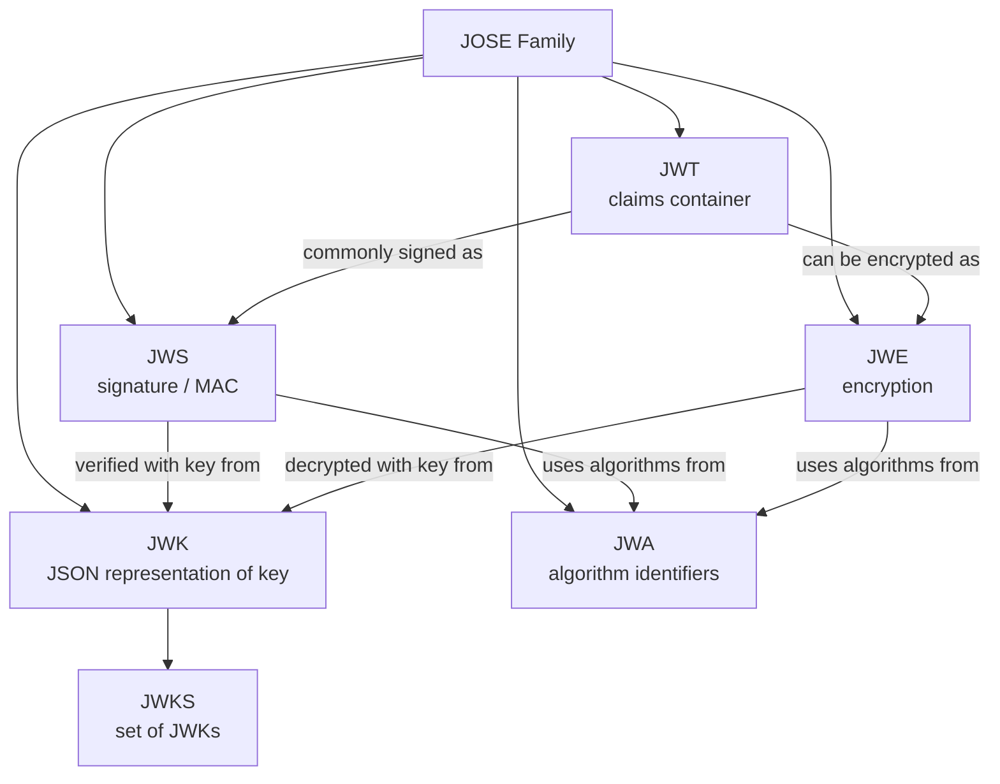

### 4.1 JWT

JWT adalah container untuk claims.

Contoh payload:

```json
{
  "iss": "https://idp.example.com/realms/aceas",
  "sub": "user-123",
  "aud": "case-api",
  "exp": 1760000000,
  "iat": 1759996400,
  "scope": "case:read case:update",
  "tenant_id": "agency-cea"
}
```

JWT sendiri hanya mengatakan: “ini sekumpulan claims dalam format compact URL-safe.”

### 4.2 JWS

JWS memberikan integrity/authenticity melalui signature atau MAC.

Compact JWS:

```text
base64url(header).base64url(payload).base64url(signature)
```

Contoh header:

```json
{
  "typ": "JWT",
  "alg": "RS256",
  "kid": "2026-06-key-a"
}
```

### 4.3 JWE

JWE memberikan confidentiality/encryption.

Compact JWE punya lima bagian:

```text
protected-header.encrypted-key.iv.ciphertext.authentication-tag
```

JWE bukan pengganti signature validation. Banyak deployment memakai **signed JWT** saja karena transport sudah TLS dan token tidak berisi data sensitif. Kalau token perlu confidentiality di luar TLS boundary, JWE bisa relevan, tetapi complexity meningkat.

### 4.4 JWK

JWK adalah key dalam JSON.

Contoh public RSA JWK:

```json
{
  "kty": "RSA",
  "use": "sig",
  "kid": "2026-06-key-a",
  "alg": "RS256",
  "n": "...",
  "e": "AQAB"
}
```

### 4.5 JWKS

JWKS adalah set key.

```json
{
  "keys": [
    {
      "kty": "RSA",
      "use": "sig",
      "kid": "2026-06-key-a",
      "alg": "RS256",
      "n": "...",
      "e": "AQAB"
    }
  ]
}
```

JWKS biasanya dipublikasikan oleh issuer/authorization server/IdP melalui `jwks_uri`.

---

## 5. JWT Bukan Session, Bukan Permission Model, Bukan Authorization Engine

JWT sering disalahpahami sebagai solusi auth lengkap. Padahal JWT hanya format token.

JWT **bisa membawa**:

- issuer;
- subject;
- audience;
- expiry;
- issued-at;
- authentication method;
- assurance level;
- scopes;
- roles;
- tenant id;
- custom claims.

JWT **tidak otomatis menyediakan**:

- revocation langsung;
- permission freshness;
- logout propagation;
- account state checking;
- dynamic authorization;
- field-level access;
- relationship-based access;
- tenant boundary enforcement;
- step-up policy;
- abuse detection;
- session management;
- recovery semantics.

Mental model yang lebih tepat:

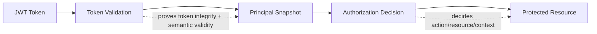

Token validation menghasilkan **authenticated principal snapshot**.  
Authorization tetap perlu **policy decision**.

---

## 6. Anatomi JWT

JWT compact form:

```text
xxxxx.yyyyy.zzzzz
```

Untuk signed JWT/JWS:

| Segment | Isi |
|---|---|
| header | metadata: `alg`, `typ`, `kid`, dll |
| payload | claims |
| signature | signature/MAC atas header + payload |

Contoh:

```text
eyJhbGciOiJSUzI1NiIsInR5cCI6IkpXVCIsImtpZCI6IjIwMjYtMDYifQ
.
eyJpc3MiOiJodHRwczovL2lkcC5leGFtcGxlLmNvbSIsInN1YiI6InVzZXItMTIzIiwiYXVkIjoiY2FzZS1hcGkiLCJleHAiOjE3NjAwMDAwMDB9
.
MEUCIQD...
```

### 6.1 Header bukan authority

Header adalah input tidak terpercaya sampai signature tervalidasi.

Namun paradox-nya: verifier sering perlu membaca header untuk memilih key. Karena itu header boleh dipakai sebagai **hint**, bukan authority.

Contoh:

- `kid` boleh dipakai sebagai lookup hint di JWKS issuer yang sudah dipercaya.
- `alg` boleh dipakai untuk mencocokkan terhadap allowlist.
- `jku` tidak boleh otomatis diikuti.
- `jwk` tidak boleh otomatis dipercaya.
- `x5u` tidak boleh otomatis di-fetch.

### 6.2 Payload bukan authority sebelum signature valid

Payload bisa dibaca tanpa secret. Jadi jangan pernah:

- logging seluruh payload sebelum validasi;
- memakai `sub` sebelum signature valid;
- memakai `tenant_id` sebelum issuer/audience valid;
- memakai `role` sebelum token type valid.

---

## 7. Registered Claims: Makna, Invariant, dan Kesalahan Umum

RFC 7519 mendefinisikan beberapa registered claim names.

| Claim | Nama | Fungsi |
|---|---|---|
| `iss` | Issuer | siapa yang menerbitkan token |
| `sub` | Subject | identitas subject |
| `aud` | Audience | penerima token yang dimaksud |
| `exp` | Expiration Time | token tidak boleh diterima setelah waktu ini |
| `nbf` | Not Before | token tidak boleh diterima sebelum waktu ini |
| `iat` | Issued At | kapan token diterbitkan |
| `jti` | JWT ID | identifier unik token |

### 7.1 `iss`

Invariant:

> `iss` harus cocok persis dengan issuer configuration yang dipercaya.

Kesalahan umum:

```go
strings.HasPrefix(claims.Issuer, "https://idp.example.com")
```

Ini berbahaya. Gunakan exact match terhadap issuer yang dikonfigurasi.

Salah:

```text
https://idp.example.com.evil.net
```

Benar:

```text
issuer == "https://idp.example.com/realms/aceas"
```

### 7.2 `sub`

`sub` adalah subject identifier dalam scope issuer.

Invariant:

> `sub` hanya unik bila dikualifikasi oleh `iss`.

Jangan menyimpan hanya:

```text
sub = "123"
```

Simpan sebagai:

```text
issuer = "https://idp.example.com/realms/aceas"
subject = "123"
```

Composite identity:

```text
external_subject_key = issuer + "|" + sub
```

### 7.3 `aud`

`aud` adalah intended recipient.

Invariant:

> Resource server harus menolak token yang audiencenya bukan dirinya.

Kalau service `case-api` menerima token dengan audience `report-api`, itu token substitution.

### 7.4 `exp`

`exp` membatasi lifetime token.

Invariant:

> Token expired harus ditolak, kecuali ada leeway kecil yang eksplisit untuk clock skew.

Jangan memakai leeway besar seperti 5–30 menit tanpa alasan. Untuk sistem internal yang time sync-nya sehat, 30–120 detik sering cukup.

### 7.5 `nbf`

`nbf` mencegah token dipakai sebelum waktunya.

Penting untuk:

- future-effective grant;
- delayed activation;
- controlled rollout;
- clock skew handling.

### 7.6 `iat`

`iat` bukan expiry. Ia membantu:

- token age;
- freshness;
- anomaly detection;
- revocation strategy berbasis `revoked_after`;
- step-up age policy.

### 7.7 `jti`

`jti` membantu:

- replay detection;
- denylist;
- audit correlation;
- token revocation;
- one-time token.

Namun `jti` hanya berguna jika issuer benar-benar menjamin uniqueness dan resource server punya storage/lookup strategy.

---

## 8. JWS: Integrity, Authenticity, dan Algorithm Policy

JWS menjawab:

> Apakah payload ini benar-benar ditandatangani oleh key yang dipercaya dan tidak berubah?

JWS tidak menjawab:

- apakah user masih aktif;
- apakah permission masih valid;
- apakah token belum direvoke;
- apakah action boleh dilakukan;
- apakah tenant boundary aman.

### 8.1 Algorithm policy harus allowlist

Jangan menerima algorithm dari token secara bebas.

Salah:

```go
// Tidak cukup: parser menerima apapun yang library dukung.
jwt.Parse(raw, keyFunc)
```

Benar secara prinsip:

```go
jwt.NewParser(
    jwt.WithValidMethods([]string{"RS256"}),
)
```

Atau untuk IdP modern yang menggunakan EdDSA:

```go
jwt.NewParser(
    jwt.WithValidMethods([]string{"EdDSA"}),
)
```

Policy harus dikonfigurasi per issuer:

```yaml
issuers:
  - issuer: https://idp.example.com/realms/aceas
    audience: case-api
    allowed_algs: ["RS256"]
    jwks_uri: https://idp.example.com/realms/aceas/protocol/openid-connect/certs
```

### 8.2 Algorithm tidak boleh dicampur sembarangan

Contoh policy yang rawan:

```yaml
allowed_algs: ["HS256", "RS256"]
```

Kenapa rawan?

Karena symmetric algorithm dan asymmetric algorithm memakai jenis key berbeda. Kalau library/implementation salah, public RSA key bisa diperlakukan sebagai HMAC secret pada class of algorithm confusion attack.

Prinsip:

> Untuk satu issuer + token type + audience, gunakan algorithm policy sempit dan key type yang jelas.

### 8.3 Jangan menerima `alg: none`

Unsecured JWT ada dalam spesifikasi, tetapi production resource server normal tidak boleh menerimanya.

### 8.4 `typ` dan `cty`

Header `typ` sering berisi `JWT`. Dalam profile tertentu, type bisa lebih spesifik, misalnya access token JWT profile dapat memakai media type khusus.

Prinsip:

> Gunakan token type explicit validation jika issuer mendukungnya, tetapi jangan mengandalkan `typ` saja sebagai security boundary.

---

## 9. JWE: Encryption, Confidentiality, dan Kapan Tidak Perlu

JWE mengenkripsi payload. Ini berguna ketika token melewati pihak yang tidak boleh melihat claims.

Namun JWE menambah kompleksitas:

- key management untuk decryption;
- algorithm policy ganda: key management algorithm dan content encryption algorithm;
- debugging lebih sulit;
- rotasi key lebih kompleks;
- risiko salah paham: encrypted bukan berarti authorized;
- tetap perlu validasi issuer/audience/expiry setelah decrypt.

### 9.1 Signed lalu encrypted vs encrypted lalu signed

Nested JWT bisa:

1. sign then encrypt;
2. encrypt then sign.

Setiap pilihan punya konsekuensi. Dalam banyak IdP/OIDC deployment, ID token/access token cukup signed karena:

- dikirim lewat TLS;
- penerima perlu memvalidasi signature;
- claims seharusnya tidak mengandung data rahasia berlebihan.

### 9.2 Jangan menyimpan data sensitif dalam JWT hanya karena bisa JWE

JWT sering beredar ke:

- browser;
- log;
- reverse proxy;
- gateway;
- mobile storage;
- monitoring headers;
- crash dump;
- third-party SDK.

Jika data tidak perlu berada di token, jangan masukkan.

---

## 10. JWK dan JWKS: Key Distribution untuk Verifier

JWK menyediakan format key. JWKS menyediakan set key.

Resource server biasanya:

1. menerima token;
2. membaca unverified header untuk `kid`;
3. memilih issuer config berdasarkan request boundary atau unverified `iss` dengan hati-hati;
4. mengambil key dari JWKS issuer yang sudah trusted;
5. memvalidasi signature;
6. memvalidasi claims.

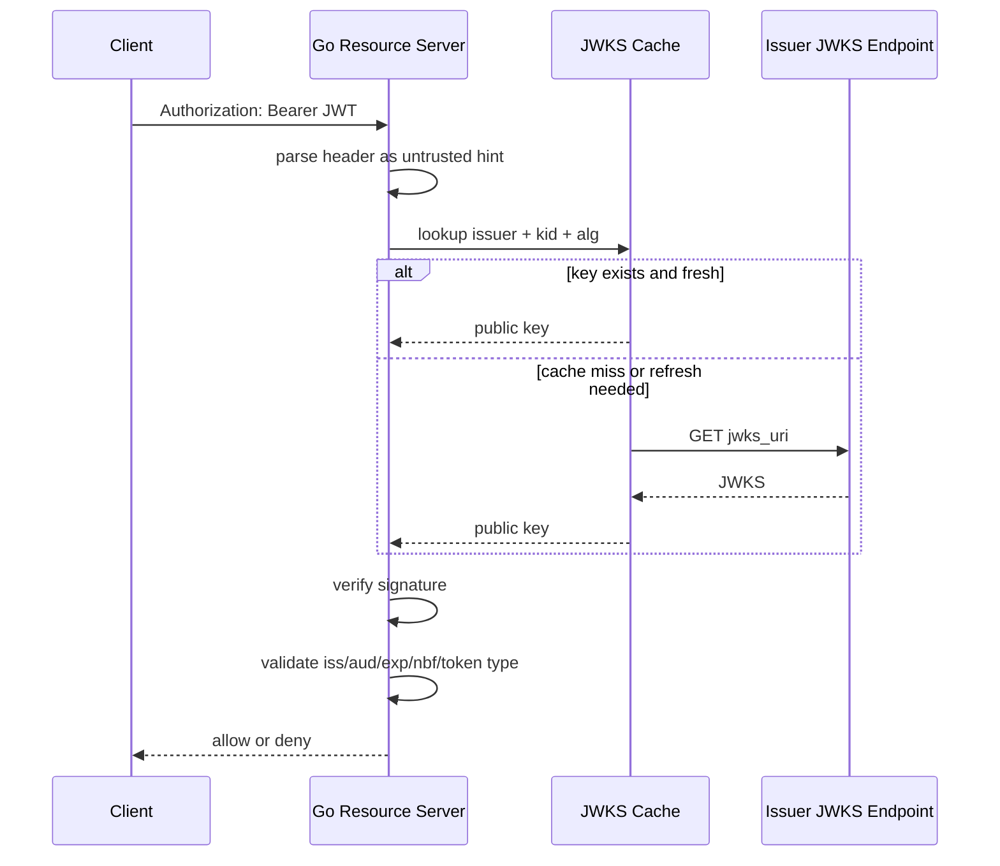

### 10.1 `kid` tidak global unik

`kid` hanya key identifier dalam konteks key set.

Jangan lookup key hanya berdasarkan `kid`.

Salah:

```text
key = globalKeyMap[kid]
```

Benar:

```text
key = keyStore[issuer][kid]
```

Lebih aman:

```text
key = keyStore[issuer][kid][alg/key_use]
```

### 10.2 JWK fields yang relevan

| Field | Makna |
|---|---|
| `kty` | key type: RSA, EC, OKP, oct |
| `use` | intended use, misalnya `sig` |
| `key_ops` | operations yang diizinkan |
| `alg` | intended algorithm |
| `kid` | key id |
| `n`, `e` | RSA modulus dan exponent |
| `crv`, `x`, `y` | EC/OKP parameters |
| `x5c` | certificate chain |
| `x5t` | certificate thumbprint |

Prinsip:

> Verifier harus memastikan key material, key type, intended use, dan algorithm policy konsisten.

---

## 11. ID Token vs Access Token vs Refresh Token vs Session Token

Ini salah satu sumber bug paling mahal.

| Token | Audience utama | Dipakai untuk | Harus diterima oleh |
|---|---|---|---|
| ID Token | client/RP | membuktikan authentication user kepada client | OIDC client |
| Access Token | resource server/API | akses resource/API | API/resource server |
| Refresh Token | authorization server/client | memperoleh access token baru | token endpoint/client yang sah |
| Session Token | aplikasi/session service | menjaga app session | aplikasi pemilik session |

### 11.1 ID token bukan access token

ID token punya audience client, bukan API.

Jika API menerima ID token sebagai bearer access token, bug-nya serius:

- token dibuat untuk client;
- scope API mungkin tidak ada;
- audience bukan API;
- authorization context tidak cocok;
- token substitution mungkin terjadi.

### 11.2 Access token bukan login proof untuk client

Client tidak boleh memakai access token sebagai bukti login user bila OIDC ID token tersedia. OAuth 2.0 adalah authorization framework; OIDC menambahkan identity layer untuk authentication.

### 11.3 Refresh token tidak boleh dikirim ke resource server

Refresh token adalah high-value secret. Resource server tidak perlu melihatnya.

### 11.4 Session cookie dan JWT access token bisa hidup bersama

Pattern umum:

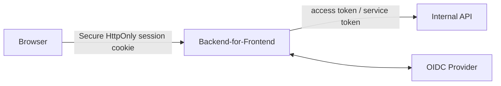

BFF menyimpan session server-side dan memperoleh token untuk memanggil API. Browser tidak perlu menyimpan access token di JavaScript.

---

## 12. Token Validation Pipeline

Pipeline yang sehat:

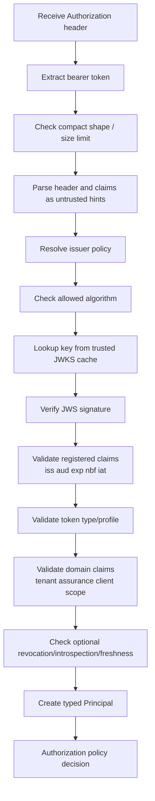

### 12.1 Pipeline stages

| Stage | Failure example | Error class |
|---|---|---|
| extraction | missing bearer token | unauthenticated |
| shape | malformed compact JWT | invalid_token |
| issuer policy | unknown issuer | invalid_issuer |
| algorithm | `alg` not allowed | invalid_algorithm |
| key lookup | no matching `kid` | key_not_found |
| signature | signature mismatch | invalid_signature |
| time | expired / not yet valid | token_expired / token_not_yet_valid |
| audience | wrong API | invalid_audience |
| token type | ID token used as access token | invalid_token_type |
| semantics | missing tenant | invalid_claims |
| revocation | revoked `jti` | token_revoked |
| authorization | insufficient permission | permission_denied |

### 12.2 Jangan campur authentication failure dengan authorization failure

- Invalid/expired/missing token → `401 Unauthorized` dengan `WWW-Authenticate`.
- Valid token tetapi permission kurang → `403 Forbidden`.

---

## 13. Algorithm Confusion dan Key Confusion

Algorithm confusion terjadi ketika verifier membiarkan token menentukan algorithm tanpa policy kuat.

Contoh berbahaya secara konsep:

1. Server normal memakai RS256.
2. Attacker membuat token HS256.
3. Verifier salah memperlakukan RSA public key sebagai HMAC secret.
4. Signature attacker dianggap valid.

Mitigasi:

- explicit allowlist algorithm;
- jangan mencampur HS dan RS untuk issuer yang sama;
- validasi key type terhadap algorithm;
- validasi `use`/`key_ops` jika tersedia;
- jangan menerima `none`;
- jangan memakai token header sebagai authority;
- test negative cases.

### 13.1 Algorithm policy matrix

| Algorithm family | Key model | Cocok untuk |
|---|---|---|
| HS256/384/512 | shared secret | single trusted issuer-verifier boundary terbatas |
| RS256/384/512 | asymmetric RSA | IdP menandatangani, banyak resource server memverifikasi |
| PS256/384/512 | RSA-PSS | modern RSA signature |
| ES256/384/512 | ECDSA | compact key/signature, perlu implementation discipline |
| EdDSA | Ed25519/EdDSA | modern signature, tergantung dukungan IdP/library |

Untuk enterprise multi-service, asymmetric signing biasanya lebih aman secara operasional karena resource server hanya perlu public key.

---

## 14. Header Trust Problem: `kid`, `jku`, `jwk`, `x5u`, `x5c`

Header JWT bisa mengandung parameter yang memengaruhi key selection.

### 14.1 `kid`

`kid` boleh digunakan sebagai hint. Masalahnya:

- collision antar issuer;
- path traversal jika dipakai membaca file;
- SQL injection jika dipakai mentah;
- cache poisoning;
- extremely long `kid` untuk memory/CPU abuse;
- `kid` tidak ada saat key rotation.

Mitigasi:

- limit length;
- treat as opaque string;
- tidak dipakai sebagai path;
- lookup scoped by issuer;
- fallback refresh JWKS sekali saat miss;
- jangan brute-force remote fetch berulang.

### 14.2 `jku`

`jku` adalah JWK Set URL.

Jangan otomatis fetch URL dari token header.

Berbahaya:

```json
{
  "alg": "RS256",
  "jku": "https://evil.example.com/jwks.json",
  "kid": "evil-key"
}
```

Mitigasi:

- ignore `jku`, kecuali issuer policy explicitly allow exact URL;
- whitelist per issuer;
- no dynamic arbitrary URL;
- no internal network fetch dari token input.

### 14.3 `jwk`

`jwk` memungkinkan key inline di header.

Jangan otomatis percaya key dari token. Kalau attacker membawa token dan key-nya sendiri, signature bisa valid terhadap key attacker.

### 14.4 `x5u`

`x5u` menunjuk URL certificate chain.

Risiko:

- SSRF;
- arbitrary certificate;
- trust anchor confusion;
- DoS.

Mitigasi:

- ignore by default;
- use only with strict issuer-pinned policy;
- validate certificate chain, hostname, key usage, thumbprint.

### 14.5 `x5c`

`x5c` membawa certificate chain inline.

Certificate chain tetap harus divalidasi terhadap trust anchor yang benar. Jangan otomatis percaya hanya karena chain ada.

---

## 15. Issuer dan Discovery

Dalam OIDC, provider metadata bisa ditemukan melalui discovery document. Discovery menyediakan endpoint seperti:

- authorization endpoint;
- token endpoint;
- userinfo endpoint;
- `jwks_uri`;
- supported signing algorithms;
- issuer.

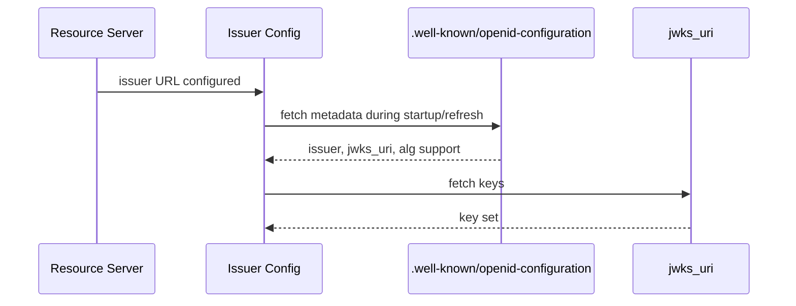

### 15.1 Dynamic discovery is not always safe

Untuk enterprise resource server, prefer:

- issuer configured explicitly;
- discovery URL derived from issuer, not user input;
- metadata fetched with timeout;
- metadata issuer exact-match checked;
- `jwks_uri` host pinned or allowlisted if required;
- no per-request dynamic discovery from token input.

### 15.2 Multi-issuer validation

Jika API menerima token dari beberapa issuers:

```yaml
trusted_issuers:
  - name: staff-idp
    issuer: https://sso.company.example/realms/staff
    audience: case-api
    token_types: ["access_token"]
    algs: ["RS256"]
  - name: agency-idp
    issuer: https://login.agency.example/realms/external
    audience: case-api
    token_types: ["access_token"]
    algs: ["RS256"]
```

Jangan pakai satu global validator longgar.

---

## 16. JWKS Cache Engineering

JWKS cache bukan sekadar `map[string]Key`.

Ia harus menangani:

- startup warming;
- cache TTL;
- HTTP caching header;
- key rotation overlap;
- kid miss refresh;
- issuer outage;
- stale-if-error;
- thundering herd;
- negative caching;
- emergency key revocation;
- metrics;
- per-issuer policy.

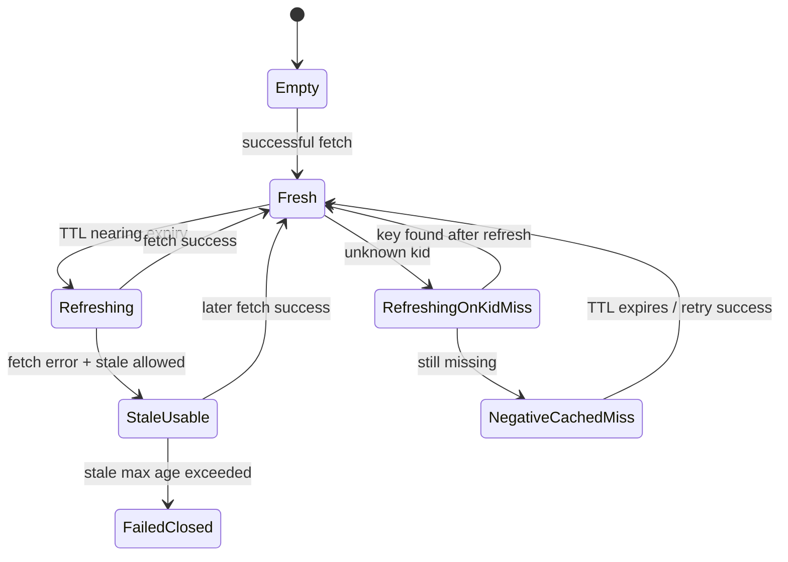

### 16.1 Cache policy fields

```go
type JWKSCachePolicy struct {
    MinRefreshInterval     time.Duration
    DefaultTTL             time.Duration
    StaleIfErrorTTL        time.Duration
    NegativeKidMissTTL     time.Duration
    MaxJWKSBytes           int64
    FetchTimeout           time.Duration
    MaxKeysPerIssuer       int
}
```

### 16.2 Kid miss strategy

Saat `kid` tidak ditemukan:

1. cek negative cache;
2. jika belum negative-cached, trigger refresh;
3. deduplicate refresh dengan singleflight/mutex;
4. jika setelah refresh key tetap tidak ada, reject token;
5. metric `jwks_kid_miss_total`;
6. jangan fetch ulang untuk setiap request attacker.

### 16.3 Startup strategy

Pilihan:

| Strategy | Kelebihan | Kekurangan |
|---|---|---|
| fail startup jika JWKS gagal | aman, cepat tahu dependency rusak | service tidak start saat IdP outage |
| lazy fetch | startup cepat | request pertama bisa gagal/latency tinggi |
| bundled bootstrap key | resilient | risk stale key kalau tidak dikelola |
| stale persisted JWKS | resilient terhadap outage | butuh max stale policy |

Untuk sistem regulatory/high assurance, biasanya:

- warm JWKS saat startup;
- fail startup untuk issuer critical bila tidak ada key sama sekali;
- allow stale-if-error hanya jika pernah punya key valid dan belum lewat stale max age;
- emergency denylist untuk compromised `kid`.

---

## 17. Key Rotation dan Emergency Key Revocation

Key rotation normal:

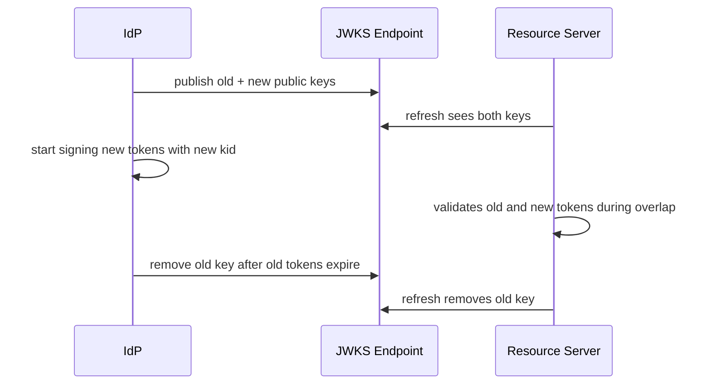

### 17.1 Rotation invariant

> Jangan hapus old public key dari JWKS sebelum semua token yang ditandatangani old private key expired, kecuali private key compromise.

### 17.2 Emergency revocation

Jika private key compromise:

- stop signing dengan key itu;
- remove key dari JWKS;
- propagate emergency key denylist ke resource servers;
- reduce cache TTL;
- purge JWKS cache;
- revoke affected tokens if identifiable;
- force reauth where needed;
- audit token usage after compromise window;
- incident report.

### 17.3 Local emergency denylist

Resource server bisa punya config:

```yaml
revoked_signing_keys:
  - issuer: https://idp.example.com/realms/aceas
    kid: 2026-06-key-a
    reason: private-key-compromise
    effective_at: 2026-06-24T10:00:00Z
```

Validator harus reject token yang memakai revoked `kid`, meskipun signature valid.

---

## 18. Clock Skew, Expiry, Not-Before, Issued-At

Distributed systems punya clock skew.

Namun leeway terlalu besar memperpanjang replay window.

### 18.1 Recommended mindset

| Field | Check |
|---|---|
| `exp` | now <= exp + leeway |
| `nbf` | now + leeway >= nbf |
| `iat` | iat tidak terlalu jauh di masa depan |
| auth freshness | now - auth_time <= required freshness |
| token max age | now - iat <= max token age policy |

### 18.2 Clock source abstraction

Di Go, jangan panggil `time.Now()` langsung di semua tempat jika ingin testable.

```go
type Clock interface {
    Now() time.Time
}

type SystemClock struct{}

func (SystemClock) Now() time.Time {
    return time.Now().UTC()
}
```

### 18.3 Token lifetime bukan session lifetime

Access token 5–15 menit bukan berarti user session 5–15 menit. Refresh/session policy berbeda.

---

## 19. Audience dan Token Substitution

Token substitution:

> Token valid untuk service A dipakai ke service B karena service B hanya mengecek signature dan expiry.

Contoh:

```json
{
  "iss": "https://idp.example.com",
  "sub": "user-123",
  "aud": "profile-api",
  "scope": "profile:read",
  "exp": 1760000000
}
```

Jika `case-api` menerima token ini, maka `case-api` rusak.

Mitigasi:

- exact audience check;
- token type check;
- issuer-specific audience policy;
- no default wildcard audience;
- no “aud missing means internal”.

### 19.1 Multiple audiences

`aud` bisa string atau array.

Policy harus jelas:

- require one of expected audiences;
- reject if audience absent;
- optionally reject if token has extra audience for high-risk API;
- avoid generic audience like `api`.

---

## 20. Scope, Role, Permission, dan Claim Overloading

JWT sering membawa:

```json
{
  "scope": "case:read case:update",
  "roles": ["officer", "manager"],
  "permissions": ["CASE_APPROVE"]
}
```

Masalah:

- scope OAuth awalnya delegasi access, bukan full internal permission model;
- role claim bisa stale;
- permission claim bisa terlalu besar;
- tenant context bisa ambigu;
- role assignment bisa berubah setelah token diterbitkan;
- token bloat;
- claim dipercaya tanpa PIP/policy check.

### 20.1 Rule of thumb

| Data | Cocok di token? | Catatan |
|---|---:|---|
| `sub` | ya | identifier |
| `iss` | ya | trust boundary |
| `aud` | ya | intended recipient |
| `exp` | ya | lifetime |
| `tenant_id` | kadang | hanya jika token tenant-bound |
| coarse scope | ya | untuk coarse API access |
| full permission matrix | biasanya tidak | stale dan bloat |
| role list | hati-hati | harus tenant/context-aware |
| PII | sebaiknya tidak | leakage risk |
| high-risk decision | tidak | harus PDP/runtime check |

### 20.2 Token claim adalah input, bukan keputusan akhir

Claims bisa menjadi input untuk PDP:

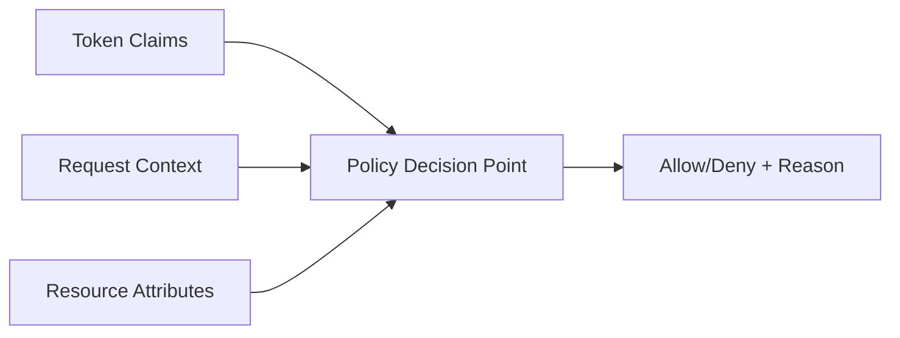

---

## 21. Bearer Token, Replay Risk, dan Sender-Constrained Token

Bearer token berarti:

> Siapa pun yang memegang token dapat menggunakannya.

Risiko:

- token dicuri dari browser storage;
- token masuk log;
- token bocor lewat proxy;
- token dicuri dari mobile device;
- token di-replay ke API.

Mitigasi:

- TLS everywhere;
- short TTL;
- HttpOnly/Secure/SameSite cookie untuk browser session;
- no token in URL;
- no token logging;
- audience restriction;
- sender-constrained token untuk high-risk/service-to-service;
- mTLS certificate-bound token;
- DPoP/proof-of-possession bila sesuai;
- replay detection untuk one-time/high-risk token.

### 21.1 Certificate-bound access token

Dengan OAuth mTLS, access token bisa diikat ke client certificate. Resource server harus memverifikasi bahwa request memakai certificate yang match dengan binding di token.

Contoh claim konseptual:

```json
{
  "cnf": {
    "x5t#S256": "base64url-sha256-cert-thumbprint"
  }
}
```

Validator token saja tidak cukup; ia harus mengecek binding terhadap TLS peer certificate.

---

## 22. Opaque Token vs JWT Access Token

### 22.1 JWT access token

Kelebihan:

- local validation;
- low latency;
- resource server tidak harus call authorization server setiap request;
- scalable;
- cocok untuk microservices.

Kekurangan:

- revocation tidak instan;
- claims bisa stale;
- token bloat;
- key rotation complexity;
- confidentiality risk bila claims berlebihan.

### 22.2 Opaque token

Kelebihan:

- revocation/introspection mudah;
- claims tidak bocor ke client/resource intermediaries;
- authorization server pegang state;
- lebih fleksibel untuk dynamic policy.

Kekurangan:

- resource server perlu introspection call/cache;
- dependency runtime ke authorization server;
- latency;
- availability coupling.

### 22.3 Hybrid

Pattern enterprise:

- external/public API: opaque token + introspection/cache;
- internal service mesh: short-lived JWT access token;
- browser: BFF server-side session;
- high-risk action: step-up + transaction-bound decision.

---

## 23. Revocation, Introspection, dan Logout Semantics

JWT access token short-lived sering tidak dicek revocation per request. Ini trade-off.

### 23.1 Revocation options

| Strategy | Latency | Freshness | Complexity |
|---|---:|---:|---:|
| short TTL only | rendah | rendah-sedang | rendah |
| denylist by `jti` | sedang | tinggi | sedang |
| revoked-after by subject/session | sedang | tinggi | sedang |
| introspection | tinggi | tinggi | sedang-tinggi |
| opaque token | tinggi | tinggi | sedang |
| event-driven cache invalidation | rendah-sedang | tinggi-ish | tinggi |

### 23.2 Logout mismatch

Logout dari UI tidak selalu berarti semua access token langsung mati.

Jika butuh strict logout:

- access token TTL pendek;
- refresh token revoked;
- session invalidated;
- token `jti` denylist for remaining lifetime;
- resource server checks denylist for sensitive routes;
- or opaque token/introspection.

### 23.3 `revoked_after` pattern

```sql
CREATE TABLE subject_token_revocation (
    issuer TEXT NOT NULL,
    subject TEXT NOT NULL,
    revoked_after TIMESTAMPTZ NOT NULL,
    reason TEXT NOT NULL,
    updated_at TIMESTAMPTZ NOT NULL,
    PRIMARY KEY (issuer, subject)
);
```

Validation rule:

```text
if token.iat <= revoked_after => reject
```

Kelebihan:

- tidak perlu simpan semua `jti`;
- cocok untuk “force logout all sessions”.

Kekurangan:

- token tanpa `iat` sulit;
- butuh lookup/cache;
- granularitas kasar.

---

## 24. Go Package Design untuk Token Validation

Jangan menaruh semua logic di middleware.

Rekomendasi package boundary:

```text
internal/authn/token/
  validator.go
  claims.go
  errors.go
  issuer.go
  jwks.go
  revocation.go
  principal.go

internal/httpmiddleware/
  authn.go

internal/grpcinterceptor/
  authn.go

internal/authz/
  policy.go
  decision.go
```

### 24.1 Dependency direction

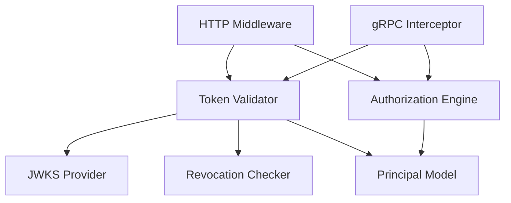

Middleware boleh tahu HTTP/gRPC. Validator tidak boleh tahu route handler business logic.

### 24.2 Validator interface

```go
type Validator interface {
    ValidateAccessToken(ctx context.Context, raw string, expected ExpectedToken) (*Principal, error)
}
```

`ExpectedToken` membuat validation context explicit.

```go
type ExpectedToken struct {
    Audience       string
    TenantRequired bool
    TokenUse       TokenUse
    MinAssurance   AssuranceLevel
    MaxAge         time.Duration
}
```

---

## 25. Domain Types: Jangan Biarkan Token Mentah Menyebar ke Business Code

Salah:

```go
func ApproveCase(w http.ResponseWriter, r *http.Request) {
    token := r.Context().Value("token").(*jwt.Token)
    role := token.Claims.(jwt.MapClaims)["role"]
    // ...
}
```

Benar:

```go
func ApproveCase(w http.ResponseWriter, r *http.Request) {
    principal := authn.PrincipalFromContext(r.Context())
    // AuthZ layer decides with principal + resource + action.
}
```

### 25.1 Principal snapshot

```go
type Principal struct {
    Issuer       string
    Subject      string
    Actor        *Actor
    ClientID     string
    TenantID     string
    AuthTime     time.Time
    IssuedAt     time.Time
    ExpiresAt    time.Time
    Assurance    AssuranceLevel
    Methods      []string
    Scopes       ScopeSet
    TokenID      string
    TokenUse     TokenUse
    RawClaimHash string
}
```

### 25.2 Jangan simpan raw token di context

Context bisa masuk log/error/trace. Simpan typed principal saja. Jika perlu korelasi, simpan hash token atau `jti`.

---

## 26. Go Implementation Skeleton dengan `golang-jwt/jwt/v5`

Contoh berikut adalah skeleton konseptual. Production code harus disesuaikan dengan issuer/JWKS library yang dipakai, error taxonomy, dan policy organisasi.

### 26.1 Types

```go
package token

import (
    "context"
    "crypto"
    "errors"
    "fmt"
    "time"

    jwt "github.com/golang-jwt/jwt/v5"
)

type TokenUse string

const (
    TokenUseAccess TokenUse = "access_token"
    TokenUseID     TokenUse = "id_token"
)

type AssuranceLevel string

const (
    AssuranceUnknown AssuranceLevel = ""
    AssuranceAAL1    AssuranceLevel = "aal1"
    AssuranceAAL2    AssuranceLevel = "aal2"
    AssuranceAAL3    AssuranceLevel = "aal3"
)

type ExpectedToken struct {
    Audience        string
    TokenUse        TokenUse
    TenantRequired  bool
    MaxAge          time.Duration
    RequiredIssuer  string
    RequiredMethods []string
}

type Principal struct {
    Issuer    string
    Subject   string
    Audience  []string
    TenantID  string
    ClientID  string
    Scopes    []string
    TokenID   string
    TokenUse  TokenUse
    AuthTime  time.Time
    IssuedAt  time.Time
    ExpiresAt time.Time
}

type Claims struct {
    jwt.RegisteredClaims

    Scope     string   `json:"scope,omitempty"`
    Scopes    []string `json:"scp,omitempty"`
    ClientID  string   `json:"client_id,omitempty"`
    TenantID  string   `json:"tenant_id,omitempty"`
    TokenUse  string   `json:"token_use,omitempty"`
    Typ       string   `json:"typ,omitempty"`
    ACR       string   `json:"acr,omitempty"`
    AMR       []string `json:"amr,omitempty"`
    AuthTime  *jwt.NumericDate `json:"auth_time,omitempty"`
}
```

### 26.2 Issuer policy

```go
type IssuerPolicy struct {
    Issuer        string
    JWKSURI       string
    AllowedAlgs   []string
    Audiences     map[string]struct{}
    ExpectedUse   TokenUse
    ClockSkew     time.Duration
    MaxTokenAge   time.Duration
    RequireExpiry bool
}

type IssuerRegistry interface {
    Resolve(issuer string) (*IssuerPolicy, bool)
}
```

### 26.3 Key provider

```go
type VerificationKey struct {
    KeyID     string
    Algorithm string
    PublicKey crypto.PublicKey
}

type KeyProvider interface {
    LookupKey(ctx context.Context, issuer string, kid string, alg string) (*VerificationKey, error)
}
```

### 26.4 Validator

```go
type AccessTokenValidator struct {
    issuers IssuerRegistry
    keys    KeyProvider
    clock   Clock
}

type Clock interface {
    Now() time.Time
}

func NewAccessTokenValidator(
    issuers IssuerRegistry,
    keys KeyProvider,
    clock Clock,
) *AccessTokenValidator {
    return &AccessTokenValidator{
        issuers: issuers,
        keys:    keys,
        clock:   clock,
    }
}
```

### 26.5 Validate function

```go
func (v *AccessTokenValidator) ValidateAccessToken(
    ctx context.Context,
    raw string,
    expected ExpectedToken,
) (*Principal, error) {
    if raw == "" {
        return nil, ErrMissingToken
    }

    unverifiedClaims := &Claims{}
    _, _, err := jwt.NewParser().ParseUnverified(raw, unverifiedClaims)
    if err != nil {
        return nil, fmt.Errorf("%w: %v", ErrMalformedToken, err)
    }

    issuer := unverifiedClaims.Issuer
    if expected.RequiredIssuer != "" && issuer != expected.RequiredIssuer {
        return nil, ErrInvalidIssuer
    }

    policy, ok := v.issuers.Resolve(issuer)
    if !ok {
        return nil, ErrUntrustedIssuer
    }

    parser := jwt.NewParser(
        jwt.WithValidMethods(policy.AllowedAlgs),
        jwt.WithIssuer(policy.Issuer),
        jwt.WithAudience(expected.Audience),
        jwt.WithLeeway(policy.ClockSkew),
        jwt.WithExpirationRequired(),
        jwt.WithIssuedAt(),
    )

    claims := &Claims{}

    token, err := parser.ParseWithClaims(raw, claims, func(t *jwt.Token) (any, error) {
        alg, _ := t.Header["alg"].(string)
        if !stringIn(alg, policy.AllowedAlgs) {
            return nil, ErrInvalidAlgorithm
        }

        kid, _ := t.Header["kid"].(string)
        if kid == "" {
            return nil, ErrMissingKeyID
        }
        if len(kid) > 256 {
            return nil, ErrInvalidKeyID
        }

        key, err := v.keys.LookupKey(ctx, policy.Issuer, kid, alg)
        if err != nil {
            return nil, fmt.Errorf("%w: %v", ErrKeyLookup, err)
        }
        if key.Algorithm != "" && key.Algorithm != alg {
            return nil, ErrKeyAlgorithmMismatch
        }

        return key.PublicKey, nil
    })
    if err != nil {
        return nil, classifyJWTError(err)
    }
    if token == nil || !token.Valid {
        return nil, ErrInvalidSignature
    }

    if err := v.validateSemanticClaims(claims, policy, expected); err != nil {
        return nil, err
    }

    return claims.ToPrincipal(), nil
}
```

### 26.6 Semantic validation

```go
func (v *AccessTokenValidator) validateSemanticClaims(
    c *Claims,
    policy *IssuerPolicy,
    expected ExpectedToken,
) error {
    if c.Subject == "" {
        return ErrMissingSubject
    }

    if expected.TokenUse != "" {
        if TokenUse(c.TokenUse) != expected.TokenUse && TokenUse(c.Typ) != expected.TokenUse {
            return ErrInvalidTokenUse
        }
    }

    if expected.TenantRequired && c.TenantID == "" {
        return ErrMissingTenant
    }

    now := v.clock.Now()

    if expected.MaxAge > 0 && c.IssuedAt != nil {
        age := now.Sub(c.IssuedAt.Time)
        if age > expected.MaxAge {
            return ErrTokenTooOld
        }
    }

    if policy.MaxTokenAge > 0 && c.IssuedAt != nil {
        age := now.Sub(c.IssuedAt.Time)
        if age > policy.MaxTokenAge {
            return ErrTokenTooOld
        }
    }

    return nil
}

func (c *Claims) ToPrincipal() *Principal {
    p := &Principal{
        Issuer:   c.Issuer,
        Subject:  c.Subject,
        Audience: c.Audience,
        TenantID: c.TenantID,
        ClientID: c.ClientID,
        TokenID:  c.ID,
        TokenUse: TokenUse(c.TokenUse),
    }

    if c.IssuedAt != nil {
        p.IssuedAt = c.IssuedAt.Time
    }
    if c.ExpiresAt != nil {
        p.ExpiresAt = c.ExpiresAt.Time
    }
    if c.AuthTime != nil {
        p.AuthTime = c.AuthTime.Time
    }

    if c.Scope != "" {
        p.Scopes = splitScope(c.Scope)
    } else {
        p.Scopes = append([]string(nil), c.Scopes...)
    }

    return p
}
```

### 26.7 Helpers and errors

```go
var (
    ErrMissingToken         = errors.New("missing token")
    ErrMalformedToken       = errors.New("malformed token")
    ErrInvalidSignature     = errors.New("invalid signature")
    ErrInvalidAlgorithm     = errors.New("invalid algorithm")
    ErrMissingKeyID         = errors.New("missing key id")
    ErrInvalidKeyID         = errors.New("invalid key id")
    ErrKeyLookup            = errors.New("key lookup failed")
    ErrKeyAlgorithmMismatch = errors.New("key algorithm mismatch")
    ErrInvalidIssuer        = errors.New("invalid issuer")
    ErrUntrustedIssuer      = errors.New("untrusted issuer")
    ErrMissingSubject       = errors.New("missing subject")
    ErrInvalidTokenUse      = errors.New("invalid token use")
    ErrMissingTenant        = errors.New("missing tenant")
    ErrTokenTooOld          = errors.New("token too old")
)

func stringIn(s string, xs []string) bool {
    for _, x := range xs {
        if s == x {
            return true
        }
    }
    return false
}

func splitScope(s string) []string {
    // OAuth scope is space-delimited.
    fields := strings.Fields(s)
    out := make([]string, 0, len(fields))
    for _, f := range fields {
        if f != "" {
            out = append(out, f)
        }
    }
    return out
}
```

Catatan: snippet di atas memerlukan import `strings` bila digunakan penuh.

---

## 27. JWKS Provider Interface dan Cache Abstraction

Validator tidak perlu tahu apakah key berasal dari:

- static config;
- OIDC discovery JWKS;
- local file;
- memory cache;
- persisted cache;
- test fixture.

```go
type JWKSProvider interface {
    LookupKey(ctx context.Context, issuer, kid, alg string) (*VerificationKey, error)
    Refresh(ctx context.Context, issuer string) error
}
```

### 27.1 Cache entry

```go
type CachedJWKS struct {
    Issuer       string
    Keys         map[string][]VerificationKey
    FetchedAt    time.Time
    ExpiresAt    time.Time
    StaleUntil   time.Time
    ETag         string
    LastModified string
}
```

Why `map[string][]VerificationKey`?

Karena `kid` collision mungkin terjadi dalam JWKS yang buruk. Validator harus bisa reject ambiguity, bukan asal ambil key pertama.

```go
func selectKey(keys []VerificationKey, alg string) (*VerificationKey, error) {
    var matches []VerificationKey
    for _, k := range keys {
        if k.Algorithm == "" || k.Algorithm == alg {
            matches = append(matches, k)
        }
    }

    switch len(matches) {
    case 0:
        return nil, ErrKeyLookup
    case 1:
        return &matches[0], nil
    default:
        return nil, errors.New("ambiguous key selection")
    }
}
```

### 27.2 HTTP fetch constraints

JWKS fetcher harus punya:

- timeout;
- max response size;
- HTTPS required;
- no redirect to arbitrary host unless explicitly allowed;
- JSON decode size limit;
- max keys;
- cache headers;
- metrics;
- retry/backoff;
- singleflight refresh.

```go
type JWKSFetcherConfig struct {
    URI              string
    Timeout          time.Duration
    MaxResponseBytes int64
    AllowHTTP        bool
    AllowedHost      string
}
```

---

## 28. Authorization Middleware Integration

HTTP middleware sebaiknya melakukan authentication saja, lalu menyerahkan authorization ke layer berikutnya.

```go
func AuthnMiddleware(v token.Validator, expected token.ExpectedToken) func(http.Handler) http.Handler {
    return func(next http.Handler) http.Handler {
        return http.HandlerFunc(func(w http.ResponseWriter, r *http.Request) {
            raw, err := bearerFromHeader(r.Header.Get("Authorization"))
            if err != nil {
                writeUnauthorized(w, err)
                return
            }

            principal, err := v.ValidateAccessToken(r.Context(), raw, expected)
            if err != nil {
                writeUnauthorized(w, err)
                return
            }

            ctx := token.ContextWithPrincipal(r.Context(), principal)
            next.ServeHTTP(w, r.WithContext(ctx))
        })
    }
}
```

Authorization:

```go
func RequirePermission(pdp authz.PDP, action string, resourceResolver ResourceResolver) Middleware {
    return func(next http.Handler) http.Handler {
        return http.HandlerFunc(func(w http.ResponseWriter, r *http.Request) {
            principal, ok := token.PrincipalFromContext(r.Context())
            if !ok {
                writeUnauthorized(w, token.ErrMissingToken)
                return
            }

            resource, err := resourceResolver.Resolve(r.Context(), r)
            if err != nil {
                writeError(w, err)
                return
            }

            decision, err := pdp.Decide(r.Context(), authz.Request{
                Principal: principal,
                Action:    action,
                Resource:  resource,
            })
            if err != nil {
                writeError(w, err)
                return
            }
            if !decision.Allow {
                writeForbidden(w, decision)
                return
            }

            next.ServeHTTP(w, r)
        })
    }
}
```

---

## 29. gRPC Interceptor Integration

gRPC token biasanya lewat metadata:

```text
authorization: Bearer <token>
```

Unary interceptor:

```go
func UnaryAuthnInterceptor(v token.Validator, expected token.ExpectedToken) grpc.UnaryServerInterceptor {
    return func(
        ctx context.Context,
        req any,
        info *grpc.UnaryServerInfo,
        handler grpc.UnaryHandler,
    ) (any, error) {
        raw, err := bearerFromGRPCMetadata(ctx)
        if err != nil {
            return nil, status.Error(codes.Unauthenticated, "missing bearer token")
        }

        principal, err := v.ValidateAccessToken(ctx, raw, expected)
        if err != nil {
            return nil, status.Error(codes.Unauthenticated, "invalid bearer token")
        }

        ctx = token.ContextWithPrincipal(ctx, principal)
        return handler(ctx, req)
    }
}
```

Service/method authorization:

```go
type MethodPolicy struct {
    FullMethod string
    Action     string
    Resource   string
}

func UnaryAuthzInterceptor(pdp authz.PDP, policies MethodPolicyRegistry) grpc.UnaryServerInterceptor {
    return func(ctx context.Context, req any, info *grpc.UnaryServerInfo, handler grpc.UnaryHandler) (any, error) {
        principal, ok := token.PrincipalFromContext(ctx)
        if !ok {
            return nil, status.Error(codes.Unauthenticated, "missing principal")
        }

        policy, ok := policies.Lookup(info.FullMethod)
        if !ok {
            return nil, status.Error(codes.PermissionDenied, "no method policy")
        }

        decision, err := pdp.Decide(ctx, authz.Request{
            Principal: principal,
            Action:    policy.Action,
            Resource:  authz.Resource{Type: policy.Resource},
        })
        if err != nil {
            return nil, status.Error(codes.Internal, "authorization failed")
        }
        if !decision.Allow {
            return nil, status.Error(codes.PermissionDenied, "permission denied")
        }

        return handler(ctx, req)
    }
}
```

---

## 30. Error Taxonomy dan HTTP/gRPC Mapping

### 30.1 HTTP mapping

| Error | HTTP |
|---|---:|
| missing token | 401 |
| malformed token | 401 |
| invalid signature | 401 |
| expired token | 401 |
| invalid issuer | 401 |
| invalid audience | 401 |
| invalid token type | 401 |
| token revoked | 401 |
| valid token but insufficient permission | 403 |
| policy service unavailable | 503 or fail-closed 403 depending design |
| JWKS unavailable with no usable key | 503 or 401 depending cause |

### 30.2 `WWW-Authenticate`

For OAuth protected resources, include useful but safe challenge:

```http
HTTP/1.1 401 Unauthorized
WWW-Authenticate: Bearer realm="case-api", error="invalid_token"
```

Do not reveal:

- expected issuer internal config;
- key IDs in detail;
- claim mismatch detail to attacker;
- stack traces.

### 30.3 gRPC mapping

| Error | gRPC code |
|---|---|
| missing/invalid token | `Unauthenticated` |
| valid identity but denied | `PermissionDenied` |
| policy/JWKS dependency outage | `Unavailable` or `Internal` depending boundary |
| malformed request metadata | `Unauthenticated` |

---

## 31. Observability Tanpa Membocorkan Token

Never log raw token.

### 31.1 Safe fields

| Field | Safe? | Notes |
|---|---:|---|
| issuer | yes | if not sensitive |
| audience | yes | useful |
| subject | maybe | hash/pseudonymize for privacy |
| client_id | yes-ish | depends |
| tenant_id | yes-ish | depends |
| kid | yes | useful for rotation |
| alg | yes | useful for detection |
| jti | maybe | can be sensitive; hash if needed |
| token hash | yes | use keyed hash if correlation needed |
| raw claims | no | avoid |
| raw token | never | high risk |

### 31.2 Metrics

Suggested metrics:

```text
auth_token_validation_total{issuer, audience, result, reason}
auth_token_validation_latency_seconds{issuer}
auth_jwks_cache_hit_total{issuer}
auth_jwks_cache_miss_total{issuer}
auth_jwks_refresh_total{issuer, result}
auth_jwks_kid_miss_total{issuer}
auth_token_expired_total{issuer}
auth_token_invalid_audience_total{issuer}
auth_token_invalid_algorithm_total{issuer, alg}
auth_token_revoked_total{issuer}
```

### 31.3 Audit events

Authentication audit event:

```json
{
  "event_type": "token_validation_failed",
  "issuer": "https://idp.example.com/realms/aceas",
  "audience": "case-api",
  "kid": "2026-06-key-a",
  "reason": "invalid_audience",
  "request_id": "req-123",
  "source_ip_hash": "..."
}
```

Successful token validation should not necessarily be audited for every request in high-volume systems. Instead:

- audit login/session creation;
- audit high-risk auth events;
- audit authorization decisions for sensitive actions;
- sample low-risk validation metrics.

---

## 32. Testing Strategy

### 32.1 Unit tests

Test cases:

| Case | Expected |
|---|---|
| valid RS256 token | accepted |
| expired token | rejected |
| future `nbf` | rejected |
| wrong issuer | rejected |
| wrong audience | rejected |
| missing `sub` | rejected |
| missing `kid` | rejected if policy requires |
| unknown `kid` | refresh then reject |
| invalid signature | rejected |
| `alg: none` | rejected |
| HS256 token against RS256 policy | rejected |
| ID token used as access token | rejected |
| access token for another API | rejected |
| malformed base64 | rejected |
| oversized token | rejected |
| duplicate/ambiguous key | rejected |
| revoked `jti` | rejected |
| stale JWKS within allowed stale-if-error | accepted if signature valid |
| stale JWKS beyond max age | fail closed |

### 32.2 Golden tokens

Maintain fixtures:

```text
testdata/tokens/
  valid_access_rs256.jwt
  expired_access.jwt
  wrong_audience.jwt
  wrong_issuer.jwt
  missing_sub.jwt
  alg_none.jwt
  hs_confusion.jwt
  unknown_kid.jwt

testdata/jwks/
  issuer-a.json
  issuer-a-rotated.json
  issuer-b.json
```

### 32.3 Property/security-oriented tests

Fuzz:

- token segment count;
- base64 invalid chars;
- very long header;
- massive JSON payload;
- invalid UTF-8;
- unknown alg;
- weird `aud` type;
- `exp` as string instead of number;
- nested arrays/objects;
- duplicate keys behavior.

### 32.4 Integration tests

Use local fake issuer:

- serves discovery;
- serves JWKS;
- rotates keys;
- returns 500;
- returns slow response;
- returns oversized JWKS;
- returns malformed JWKS.

---

## 33. Performance Engineering

Token validation cost components:

| Component | Cost |
|---|---|
| header parsing | low |
| JSON parsing | low-medium |
| signature verification | medium-high depending algorithm |
| JWKS lookup memory | low |
| JWKS refresh network | high |
| revocation lookup | variable |
| introspection | high |

### 33.1 Avoid per-request JWKS fetch

This is a production-killer.

Bad:

```text
every request -> fetch jwks_uri -> verify
```

Good:

```text
request -> memory cache -> occasional refresh
```

### 33.2 Crypto verification cost

Asymmetric signature verification is not free. But for normal API workloads, it is usually acceptable if:

- JWKS is cached;
- token parsing is bounded;
- middleware avoids repeated validation within one request chain;
- gateway/BFF handles external validation where appropriate;
- internal services use short-lived propagated principal or service token carefully.

### 33.3 Cache principal within request only

Do not cache “token -> principal” globally for long unless you understand:

- revocation;
- expiry;
- memory pressure;
- tenant state;
- token uniqueness;
- replay correlation;
- permission staleness.

A short in-process token validation cache can be useful for high-throughput APIs, but it creates revocation freshness trade-offs.

---

## 34. Failure Mode Matrix

| Failure | Cause | Impact | Mitigation |
|---|---|---|---|
| valid token rejected after rotation | JWKS cache stale missing new key | outage | refresh on kid miss, overlap keys |
| compromised old key still accepted | stale cache too long | security incident | emergency key denylist, max stale |
| API accepts ID token | no token type check | token substitution | validate audience/type/profile |
| API accepts other API token | missing audience check | privilege confusion | exact audience |
| API accepts fake issuer | issuer not pinned | account takeover | configured trusted issuers |
| algorithm confusion | alg not allowlisted | signature bypass | allowed algs per issuer |
| SSRF via `jku` | fetch URL from header | internal network exposure | ignore or strict allowlist |
| user remains authorized after role removal | long-lived JWT role claim | stale permission | short TTL + PDP lookup |
| logout ineffective | stateless access token | user confusion/risk | revoke refresh + short TTL + denylist |
| JWKS endpoint down | IdP outage | auth outage | stale-if-error with max age |
| massive token DoS | no size limit | CPU/memory pressure | header size limit |
| duplicate `kid` | bad JWKS | ambiguous verification | reject ambiguity |
| token in logs | logging middleware | credential leak | redact Authorization |
| tenant breakout | tenant claim trusted blindly | data breach | resource tenant check in authz |

---

## 35. Case Study: Multi-Tenant Regulatory Case Management

Konteks:

- platform case management;
- multi-tenant agency;
- internal officers;
- external business users;
- admin users;
- service-to-service calls;
- audit defensibility wajib;
- OIDC IdP eksternal/internal;
- API Go menerima access token JWT.

### 35.1 Requirements

1. Staff IdP dan external IdP berbeda.
2. API `case-api` hanya menerima access token dengan audience `case-api`.
3. ID token tidak boleh diterima API.
4. Token harus membawa tenant context untuk external user.
5. Staff token boleh tanpa tenant awal, tetapi resource access tetap harus melewati authorization policy.
6. Admin impersonation harus memakai actor claim/delegation context, bukan mengganti `sub`.
7. Token TTL 10 menit.
8. Refresh token tidak pernah masuk API.
9. JWKS harus tahan rotation.
10. Authorization decision log harus bisa menjawab: siapa, sebagai siapa, tenant mana, action apa, resource apa, policy version apa.

### 35.2 Issuer config

```yaml
trusted_issuers:
  - name: staff
    issuer: https://sso.gov.example/realms/staff
    jwks_uri: https://sso.gov.example/realms/staff/protocol/openid-connect/certs
    allowed_algs: ["RS256"]
    audiences: ["case-api"]
    token_use: "access_token"
    max_token_age: "10m"
    clock_skew: "60s"

  - name: external
    issuer: https://login.example.gov/realms/business
    jwks_uri: https://login.example.gov/realms/business/protocol/openid-connect/certs
    allowed_algs: ["RS256"]
    audiences: ["case-api"]
    token_use: "access_token"
    require_tenant: true
    max_token_age: "10m"
    clock_skew: "60s"
```

### 35.3 Validation to principal

```json
{
  "issuer": "https://login.example.gov/realms/business",
  "subject": "external-sub-123",
  "client_id": "business-portal",
  "tenant_id": "agency-cea",
  "scopes": ["case.read", "case.submit"],
  "token_use": "access_token",
  "auth_time": "2026-06-24T07:10:00Z",
  "issued_at": "2026-06-24T07:14:00Z",
  "expires_at": "2026-06-24T07:24:00Z"
}
```

### 35.4 Authorization decision

Token validation says:

> This is authenticated external subject X from issuer Y for audience case-api.

Authorization says:

> Subject X may read case C because X belongs to tenant T, case C belongs to tenant T, workflow state allows read, and policy version P grants `case.read`.

### 35.5 Audit event

```json
{
  "event_type": "authorization_decision",
  "decision": "allow",
  "issuer": "https://login.example.gov/realms/business",
  "subject": "external-sub-123",
  "actor": null,
  "tenant_id": "agency-cea",
  "action": "case.read",
  "resource_type": "case",
  "resource_id": "CASE-2026-001",
  "resource_tenant_id": "agency-cea",
  "policy_version": "authz-policy-2026-06-20",
  "token_kid": "2026-06-key-a",
  "token_jti_hash": "hmac-sha256:...",
  "request_id": "req-abc"
}
```

---

## 36. Production Checklist

### 36.1 Token parsing

- [ ] Reject missing token.
- [ ] Reject malformed compact token.
- [ ] Enforce max token length.
- [ ] Do not log raw token.
- [ ] Parse header/payload as untrusted hints only.

### 36.2 Issuer

- [ ] Trusted issuers configured explicitly.
- [ ] Issuer exact-match checked.
- [ ] Discovery URL not derived from arbitrary user input.
- [ ] Metadata issuer exact-match checked.

### 36.3 Algorithm

- [ ] Allowed algorithms configured per issuer/token type.
- [ ] `none` rejected.
- [ ] HS and RS not mixed casually.
- [ ] Key type matches algorithm.
- [ ] Key use/ops checked where available.

### 36.4 Key/JWKS

- [ ] `kid` scoped by issuer.
- [ ] `kid` length bounded.
- [ ] `jku`/`jwk`/`x5u` ignored unless explicitly pinned.
- [ ] JWKS cache has TTL.
- [ ] Refresh on `kid` miss.
- [ ] Negative cache for repeated miss.
- [ ] Stale-if-error max age defined.
- [ ] Emergency key denylist supported.
- [ ] Duplicate/ambiguous key rejected.

### 36.5 Claims

- [ ] `iss` validated.
- [ ] `aud` validated.
- [ ] `exp` required.
- [ ] `nbf` validated if present.
- [ ] `iat` validated if present/required.
- [ ] `sub` required for user token.
- [ ] token type/profile validated.
- [ ] tenant claim validated if required.
- [ ] assurance/freshness checked for high-risk action.

### 36.6 Revocation/freshness

- [ ] Refresh token revocation handled by authorization server.
- [ ] Access token TTL short.
- [ ] Sensitive APIs can check revocation/denylist/introspection.
- [ ] `revoked_after` strategy defined for force logout.
- [ ] Session invalidation semantics documented.

### 36.7 Integration

- [ ] HTTP middleware returns 401 for authn failure.
- [ ] Authorization layer returns 403 for permission denial.
- [ ] gRPC maps to `Unauthenticated` vs `PermissionDenied`.
- [ ] Raw token not stored in context.
- [ ] Typed principal stored in context.
- [ ] Authorization uses principal + resource + action + context.

### 36.8 Operations

- [ ] Metrics for validation result and reason.
- [ ] Metrics for JWKS cache hits/misses/refresh.
- [ ] Alerts for unknown issuer, invalid algorithm spikes, kid miss spikes.
- [ ] Key rotation tested.
- [ ] IdP outage tested.
- [ ] Emergency key compromise runbook exists.

---

## 37. Anti-Pattern yang Harus Dihindari

### 37.1 Decode-only JWT

```go
payload := decode(jwtParts[1])
```

Ini bukan auth.

### 37.2 Trusting `alg` from token

```go
if token.Header["alg"] == "RS256" {
    // assume safe
}
```

Header adalah untrusted input.

### 37.3 Using ID token as API bearer token

API harus menerima access token, bukan ID token.

### 37.4 Storing all permissions in JWT forever

Permission berubah. Token bisa stale.

### 37.5 Long-lived access token

Access token berumur hari/minggu membuat revocation sulit.

### 37.6 Dynamic JWKS URL from token

Jangan fetch `jku` dari attacker-controlled token.

### 37.7 One global key map

`kid` tidak global unik.

### 37.8 Ignoring audience

Signature valid bukan berarti token untuk service ini.

### 37.9 Logging Authorization header

Token leak melalui log sering lebih realistis daripada serangan crypto.

### 37.10 Treating token validation as authorization

Token valid belum tentu action boleh.

---

## 38. Latihan Desain

### Latihan 1 — Token Type Separation

Desain validator yang menerima:

- ID token untuk callback login;
- access token untuk API;
- service token untuk internal service.

Tuliskan policy berbeda untuk masing-masing token type.

### Latihan 2 — JWKS Rotation Drill

Simulasikan:

1. IdP publish old+new key.
2. IdP mulai sign dengan new key.
3. Resource server cache masih old.
4. Token new `kid` masuk.
5. JWKS endpoint timeout.
6. JWKS endpoint pulih.

Tentukan kapan request diterima/ditolak.

### Latihan 3 — Tenant Boundary

Token:

```json
{
  "sub": "user-1",
  "tenant_id": "tenant-a",
  "scope": "case:read"
}
```

Request:

```text
GET /tenants/tenant-b/cases/CASE-1
```

Apa yang harus dilakukan token validator?  
Apa yang harus dilakukan authorization layer?

### Latihan 4 — Emergency Key Compromise

Private key `kid=2026-06-key-a` bocor.

Susun runbook:

- IdP action;
- resource server action;
- cache action;
- user/session action;
- audit/forensic action.

### Latihan 5 — Access Token Claim Minimalism

Desain JWT access token minimal untuk `case-api`.

Apa claims wajib?  
Apa claims sebaiknya tidak dimasukkan?  
Apa data harus diambil runtime oleh authorization service?

---

## 39. Ringkasan

JWT/JWS/JWE/JWK/JWKS adalah alat penting, tetapi bukan sistem auth lengkap.

Core principles:

1. JWT adalah claims container.
2. JWS memberikan integrity/authenticity.
3. JWE memberikan confidentiality.
4. JWK/JWKS mendistribusikan key untuk verifier.
5. Decode bukan validation.
6. Header adalah hint, bukan authority.
7. Algorithm harus allowlisted.
8. Key harus scoped by issuer.
9. Issuer dan audience wajib divalidasi.
10. ID token tidak boleh dipakai sebagai access token.
11. Signature valid bukan berarti permission valid.
12. Claims adalah snapshot, bisa stale.
13. Revocation dan logout perlu desain eksplisit.
14. JWKS cache adalah komponen security-critical.
15. Authorization tetap membutuhkan policy decision.

Mental model akhir:

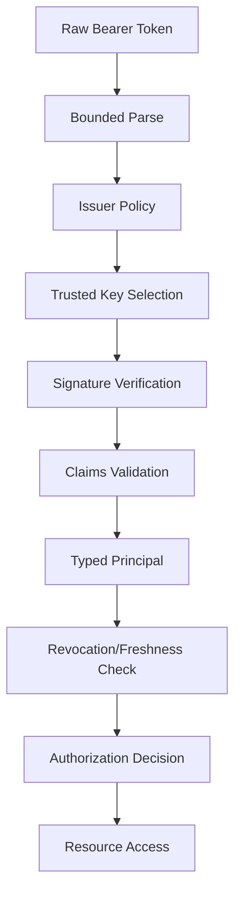

---

## 40. Referensi Primer

- RFC 7519 — JSON Web Token (JWT): https://www.rfc-editor.org/info/rfc7519/
- RFC 7515 — JSON Web Signature (JWS): https://www.rfc-editor.org/info/rfc7515/
- RFC 7516 — JSON Web Encryption (JWE): https://www.rfc-editor.org/info/rfc7516/
- RFC 7517 — JSON Web Key (JWK): https://datatracker.ietf.org/doc/html/rfc7517
- RFC 7518 — JSON Web Algorithms (JWA): https://www.rfc-editor.org/info/rfc7518/
- RFC 8725 — JSON Web Token Best Current Practices: https://datatracker.ietf.org/doc/html/rfc8725
- RFC 8414 — OAuth 2.0 Authorization Server Metadata: https://datatracker.ietf.org/doc/html/rfc8414
- OpenID Connect Core 1.0: https://openid.net/specs/openid-connect-core-1_0.html
- OpenID Connect Discovery 1.0: https://openid.net/specs/openid-connect-discovery-1_0.html
- RFC 9068 — JWT Profile for OAuth 2.0 Access Tokens: https://datatracker.ietf.org/doc/rfc9068/
- RFC 7009 — OAuth 2.0 Token Revocation: https://datatracker.ietf.org/doc/html/rfc7009
- RFC 7662 — OAuth 2.0 Token Introspection: https://datatracker.ietf.org/doc/html/rfc7662
- RFC 8705 — OAuth 2.0 Mutual-TLS Client Authentication and Certificate-Bound Access Tokens: https://datatracker.ietf.org/doc/html/rfc8705
- Go 1.26 Release Notes: https://go.dev/doc/go1.26
- `github.com/golang-jwt/jwt/v5`: https://pkg.go.dev/github.com/golang-jwt/jwt/v5

---

## Status Seri

Seri **belum selesai**.

Part berikutnya:

```text
learn-go-authentication-authorization-identity-permission-part-011.md
```

Topik berikutnya:

```text
Token Lifecycle: Expiry, Refresh, Rotation, Replay Detection, Revocation
```


<!-- NAVIGATION_FOOTER -->
<div class="page-nav">
<a href="./learn-go-authentication-authorization-identity-permission-part-009.md">⬅️ Part 009 — Session Architecture: Cookie Session, Server-Side Session, Stateless Token</a>
<a href="./index.md">📚 Kategori</a>
<a href="../../index.md">🏠 Home</a>
<a href="./learn-go-authentication-authorization-identity-permission-part-011.md">Part 011 — Token Lifecycle: Expiry, Refresh, Rotation, Replay Detection, Revocation ➡️</a>
</div>
