# learn-go-authentication-authorization-identity-permission-part-011.md

# Part 011 — Token Lifecycle: Expiry, Refresh, Rotation, Replay Detection, Revocation

> Seri: `learn-go-authentication-authorization-identity-permission`  
> Level: Advanced / internal engineering handbook  
> Target Go: Go 1.26.x  
> Fokus: token lifecycle, expiry, refresh token rotation, replay detection, revocation, introspection, logout semantics, distributed consistency, dan implementasi Go  
> Status seri: **belum selesai** — ini adalah part 011 dari 035

---

## Daftar Isi

1. [Tujuan Part Ini](#1-tujuan-part-ini)
2. [Problem Sebenarnya: Token Bukan Benda Statis](#2-problem-sebenarnya-token-bukan-benda-statis)
3. [Baseline Fakta dan Sumber Primer](#3-baseline-fakta-dan-sumber-primer)
4. [Mental Model: Token sebagai Delegated Authority yang Berumur](#4-mental-model-token-sebagai-delegated-authority-yang-berumur)
5. [Token Taxonomy](#5-token-taxonomy)
6. [Lifecycle State Machine](#6-lifecycle-state-machine)
7. [Core Invariants](#7-core-invariants)
8. [Access Token Expiry](#8-access-token-expiry)
9. [Refresh Token: Long-Lived Credential, Bukan Sekadar Token Tambahan](#9-refresh-token-long-lived-credential-bukan-sekadar-token-tambahan)
10. [Refresh Token Rotation](#10-refresh-token-rotation)
11. [Token Family dan Grant Model](#11-token-family-dan-grant-model)
12. [Replay Detection](#12-replay-detection)
13. [Revocation Semantics](#13-revocation-semantics)
14. [OAuth Token Revocation Endpoint](#14-oauth-token-revocation-endpoint)
15. [Token Introspection](#15-token-introspection)
16. [Opaque Token vs JWT Lifecycle](#16-opaque-token-vs-jwt-lifecycle)
17. [Sender-Constrained Token: mTLS dan DPoP](#17-sender-constrained-token-mtls-dan-dpop)
18. [Binding Token ke Client, Session, Device, Tenant, Scope, dan Audience](#18-binding-token-ke-client-session-device-tenant-scope-dan-audience)
19. [Storage: Jangan Simpan Refresh Token Mentah](#19-storage-jangan-simpan-refresh-token-mentah)
20. [Data Model dan Schema](#20-data-model-dan-schema)
21. [Concurrency dan Race Condition pada Rotation](#21-concurrency-dan-race-condition-pada-rotation)
22. [Distributed Consistency dan Revocation Latency](#22-distributed-consistency-dan-revocation-latency)
23. [Cache Strategy](#23-cache-strategy)
24. [Outbox, Eventing, dan Revocation Propagation](#24-outbox-eventing-dan-revocation-propagation)
25. [Key Rotation vs Token Rotation](#25-key-rotation-vs-token-rotation)
26. [Logout Semantics](#26-logout-semantics)
27. [Go Package Architecture](#27-go-package-architecture)
28. [Domain Types](#28-domain-types)
29. [Repository dan Transaction Boundary](#29-repository-dan-transaction-boundary)
30. [Token Issuance Service](#30-token-issuance-service)
31. [Refresh Flow Implementation](#31-refresh-flow-implementation)
32. [Revocation Flow Implementation](#32-revocation-flow-implementation)
33. [HTTP Handler Design](#33-http-handler-design)
34. [Resource Server Validation Strategy](#34-resource-server-validation-strategy)
35. [Client-Type Specific Design](#35-client-type-specific-design)
36. [Error Taxonomy](#36-error-taxonomy)
37. [Audit Model](#37-audit-model)
38. [Observability Tanpa Membocorkan Token](#38-observability-tanpa-membocorkan-token)
39. [Testing Strategy](#39-testing-strategy)
40. [Performance Engineering](#40-performance-engineering)
41. [Failure Mode Matrix](#41-failure-mode-matrix)
42. [Case Study: Regulatory Case Management Multi-Tenant](#42-case-study-regulatory-case-management-multi-tenant)
43. [Production Checklist](#43-production-checklist)
44. [Anti-Pattern yang Harus Dihindari](#44-anti-pattern-yang-harus-dihindari)
45. [Latihan Desain](#45-latihan-desain)
46. [Ringkasan](#46-ringkasan)
47. [Referensi Primer](#47-referensi-primer)

---

## 1. Tujuan Part Ini

Part ini membahas **token lifecycle** sebagai disiplin engineering.

Pada part sebelumnya kita membahas JWT/JWS/JWE/JWK/JWKS dan validasi token. Sekarang fokusnya bergeser dari pertanyaan:

> “Apakah token ini valid secara format dan signature?”

menjadi:

> “Apakah token ini masih boleh dipakai sekarang, untuk client ini, resource ini, tenant ini, session ini, scope ini, assurance ini, dan belum pernah dicabut atau disalahgunakan?”

Setelah menyelesaikan part ini, kamu harus bisa:

1. mendesain lifetime access token dan refresh token secara proporsional;
2. membedakan expiry, inactivity timeout, absolute timeout, revocation, invalidation, dan rotation;
3. menerapkan refresh token rotation dengan replay detection;
4. memahami konsekuensi distributed system: race condition, cache staleness, eventual revocation, multi-device, retry, dan idempotency;
5. mendesain revocation endpoint dan introspection strategy;
6. memilih opaque token vs JWT berdasarkan kebutuhan revocation, latency, autonomy, dan scale;
7. menyimpan token secara aman tanpa menyimpan secret mentah;
8. membangun domain model token family, grant, session, device, dan credential binding;
9. membangun Go package yang memisahkan issuance, refresh, revocation, validation, audit, dan observability;
10. menyusun runbook ketika refresh token dicuri, signing key bocor, atau IdP/token store outage.

Part ini sangat penting karena banyak sistem tampak aman saat login, tetapi gagal saat token mulai hidup lama di client, berpindah jaringan, dipakai paralel, dicuri, di-cache, di-refresh, di-retry, dan dicabut.

---

## 2. Problem Sebenarnya: Token Bukan Benda Statis

Kesalahan pemula:

> Token dibuat, dikirim ke client, lalu dianggap selesai.

Kesalahan engineer menengah:

> Token diberi `exp`, jadi dianggap lifecycle sudah aman.

Realita production:

- token dapat dicuri;
- refresh token dapat dipakai dari dua device;
- request refresh dapat double-submit karena retry jaringan;
- access token lama masih valid setelah permission dicabut;
- JWT access token tetap valid walau user logout;
- token introspection bisa overload;
- revocation event bisa terlambat sampai ke service;
- cache token metadata bisa stale;
- refresh token rotation bisa race di cluster;
- mobile app bisa offline lama;
- browser tab bisa refresh token bersamaan;
- service A bisa menerima token yang audience-nya untuk service B;
- token lama bisa membawa scope yang tidak lagi sesuai policy;
- signing key rotation bisa memutus token valid secara massal jika salah desain.

Jadi lifecycle token bukan hanya `exp`.

Lifecycle token adalah gabungan dari:

| Dimensi | Pertanyaan |
|---|---|
| Waktu | Kapan token mulai valid, expired, inactive, absolute-expired? |
| Kepemilikan | Untuk client, device, session, user, service, atau tenant mana? |
| Authority | Scope/permission/audience apa yang dibawa? |
| Status | Active, revoked, rotated, reused, compromised? |
| Binding | Bearer biasa atau sender-constrained? |
| Storage | Disimpan mentah, hashed, encrypted, atau opaque handle? |
| Validasi | Lokal, introspection, cache, hybrid? |
| Propagasi | Bagaimana revocation sampai ke resource server? |
| Audit | Bagaimana membuktikan token dipakai, di-refresh, dicabut, atau direplay? |

Token lifecycle yang buruk biasanya terlihat seperti ini:

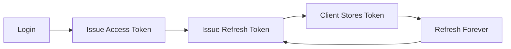

Token lifecycle yang lebih realistis:

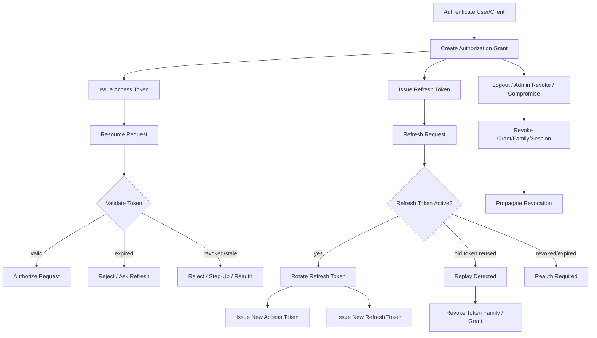

Top engineers memperlakukan token lifecycle sebagai **stateful security control**, bahkan ketika token access-nya berbentuk stateless JWT.

---

## 3. Baseline Fakta dan Sumber Primer

Part ini menggunakan sumber primer berikut:

| Sumber | Relevansi |
|---|---|
| RFC 6749 — OAuth 2.0 Authorization Framework | istilah access token, refresh token, client, grant, authorization server, token endpoint |
| RFC 6750 — Bearer Token Usage | bearer token semantics dan replay risk |
| RFC 7009 — OAuth 2.0 Token Revocation | revocation endpoint untuk access/refresh token dan cascading grant revocation |
| RFC 7662 — OAuth 2.0 Token Introspection | resource server dapat menanyakan active state dan metadata token ke authorization server |
| RFC 9700 — Best Current Practice for OAuth 2.0 Security | refresh token rotation, sender-constrained token, audience restriction, replay prevention |
| RFC 8705 — OAuth 2.0 Mutual-TLS Client Authentication and Certificate-Bound Access Tokens | sender-constrained token via mTLS |
| RFC 9449 — OAuth 2.0 DPoP | proof-of-possession untuk mendeteksi replay access/refresh token |
| RFC 7519 — JWT | `exp`, `nbf`, `iat`, `jti`, `aud`, `iss`, `sub` claims |
| RFC 9068 — JWT Profile for OAuth 2.0 Access Tokens | JWT access token profile untuk OAuth resource servers |
| OpenID Connect Core | ID token, refresh token usage, `auth_time`, `acr`, `amr`, session semantics |
| NIST SP 800-63B-4 | session management, reauthentication, authenticator/session lifecycle |
| OWASP ASVS | verification requirements untuk session, token, authentication, access control |
| Go 1.26 release notes | baseline Go runtime/toolchain untuk implementasi |

Catatan penting:

- RFC 9700 menyatakan refresh token untuk public clients harus sender-constrained atau memakai refresh token rotation.
- RFC 7009 mendefinisikan endpoint agar client dapat memberi tahu authorization server bahwa token tidak lagi dibutuhkan, dan revocation request dapat menginvalidasi token aktual serta token lain yang berasal dari grant yang sama.
- RFC 7662 mendefinisikan introspection agar protected resource dapat mengetahui apakah token masih active dan metadata otorisasi terkait.
- RFC 9449 mendefinisikan DPoP sebagai mekanisme application-level untuk sender-constraining token dan mendeteksi replay pada access maupun refresh token.

---

## 4. Mental Model: Token sebagai Delegated Authority yang Berumur

Token bukan identitas penuh. Token adalah **representasi authority terbatas**.

Lebih presisi:

> Token adalah artefak yang membawa atau menunjuk ke authority yang diberikan kepada client tertentu untuk bertindak atas nama subject/actor tertentu terhadap resource tertentu, selama waktu tertentu, dalam boundary tertentu.

Token tidak boleh dianggap sebagai:

- user database;
- permission database;
- session database;
- audit log;
- source of truth selamanya;
- bukti bahwa user masih aktif;
- bukti bahwa permission belum berubah;
- bukti bahwa device tidak compromised.

Token hanya menjawab sebagian kecil dari authorization context.

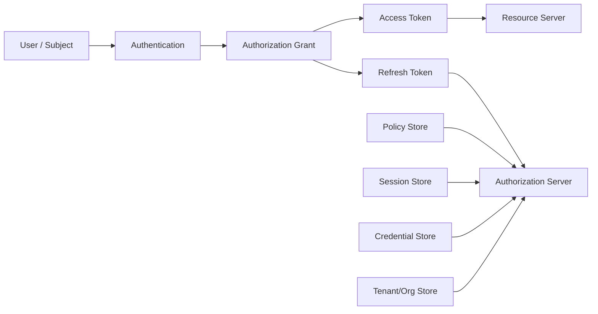

Perhatikan:

- access token biasanya diberikan ke resource server;
- refresh token biasanya hanya diberikan ke token endpoint;
- refresh token harus diperlakukan seperti credential;
- authorization grant adalah entitas konseptual yang lebih besar dari token;
- revocation sering perlu terjadi di level grant, session, family, atau credential, bukan hanya satu token.

---

## 5. Token Taxonomy

### 5.1 Access Token

Access token dipakai client untuk mengakses protected resource.

Karakteristik ideal:

- lifetime pendek;
- audience-restricted;
- scope-restricted;
- token type jelas;
- tidak dipakai untuk login client;
- tidak dipakai sebagai refresh token;
- tidak disimpan terlalu lama;
- dapat divalidasi oleh resource server.

Access token bisa berupa:

| Bentuk | Implikasi |
|---|---|
| Opaque random string | resource server perlu introspection atau shared token metadata store |
| JWT/JWS | resource server dapat validasi lokal tetapi revocation real-time lebih sulit |
| Sender-constrained token | token hanya berguna jika sender membuktikan possession key/certificate |

### 5.2 Refresh Token

Refresh token dipakai untuk mendapatkan access token baru tanpa user login ulang.

Karakteristik:

- lifetime lebih panjang;
- hanya dikirim ke authorization server/token endpoint;
- harus bound ke client/grant/scope/resource/session;
- harus bisa dicabut;
- harus disimpan lebih aman daripada access token;
- untuk public client, harus sender-constrained atau rotation;
- reuse harus dianggap sinyal kompromi.

Refresh token bukan “JWT access token yang expired lebih lama”.

Refresh token adalah credential.

### 5.3 ID Token

ID token adalah artefak OIDC untuk client membuktikan hasil authentication end-user.

ID token **bukan** access token untuk API.

Kesalahan fatal:

```text
Frontend receives ID token -> calls API with ID token -> API accepts because signature valid
```

Ini token substitution.

### 5.4 Session Token

Session token biasanya berupa cookie/session id untuk aplikasi web.

Session token bisa:

- opaque session id;
- encrypted cookie;
- signed cookie;
- backend-for-frontend session handle.

Session token lifecycle berbeda dari OAuth access/refresh token.

### 5.5 Device Token / Remembered Device Token

Dipakai untuk remembered-device atau reduced-friction MFA.

Harus:

- bound ke user/account/session/device;
- revocable;
- memiliki absolute expiry;
- tidak menggantikan MFA untuk high-risk actions;
- tidak menjadi bypass universal.

### 5.6 API Key

API key sering dipakai untuk programmatic access, tetapi banyak sistem salah memperlakukannya sebagai token sederhana.

API key lifecycle harus mencakup:

- issuance;
- display once;
- hash storage;
- scope/audience binding;
- rotation;
- expiration;
- last-used tracking;
- revocation;
- audit.

### 5.7 Service Account Token

Untuk workload/machine identity.

Harus bound ke:

- workload identity;
- environment;
- audience;
- service account;
- privilege set;
- rotation mechanism;
- runtime attestation jika tersedia.

---

## 6. Lifecycle State Machine

Token lifecycle sebaiknya dimodelkan eksplisit.

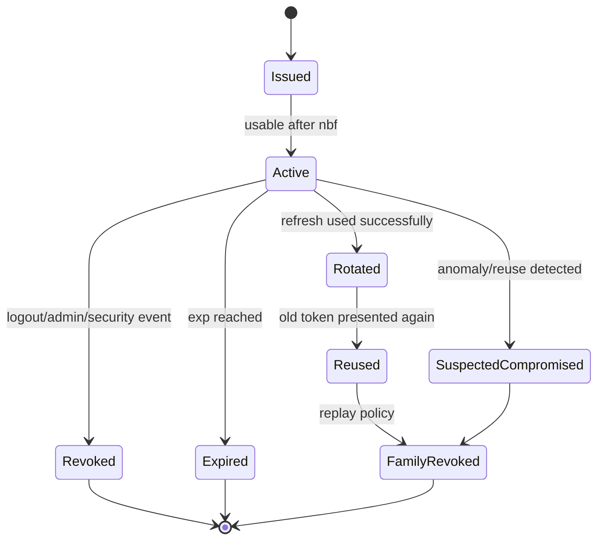

Namun state ini berbeda untuk access token dan refresh token.

### 6.1 Access Token State

| State | Makna |
|---|---|
| issued | token dibuat |
| active | token dalam window valid |
| expired | melewati `exp` |
| revoked | dinyatakan tidak boleh dipakai sebelum `exp` |
| superseded | authority/token metadata digantikan policy baru |
| rejected | resource server menolak karena audience/scope/issuer/token type |

### 6.2 Refresh Token State

| State | Makna |
|---|---|
| issued | dibuat untuk grant/session/client tertentu |
| active | boleh dipakai refresh |
| rotated | sudah dipakai dan diganti token baru |
| reused | token lama dipakai lagi setelah rotation |
| revoked | dicabut manual/sistem |
| expired | absolute/inactivity expiry |
| family_revoked | seluruh chain refresh token dicabut |
| compromised | ditandai akibat reuse/anomaly |

Top-level lifecycle tidak cukup jika tidak ada model **token family**.

---

## 7. Core Invariants

Gunakan invariant berikut sebagai alat review desain.

### Invariant 1 — Refresh token hanya boleh dipakai di token endpoint

Refresh token tidak boleh diterima resource server.

```text
/api/cases/{id}
Authorization: Bearer <refresh_token>
```

Resource server harus menolak.

### Invariant 2 — Access token harus audience-restricted

Token untuk service `profile-api` tidak boleh dipakai ke `case-api`.

### Invariant 3 — Refresh token harus bound ke grant/client/session

Token refresh yang dicuri dari client A tidak boleh bisa dipakai oleh client B.

### Invariant 4 — Refresh token reuse adalah security signal

Jika sistem memakai rotation, token lama yang dipakai ulang bukan hanya “invalid token”. Itu indikator kemungkinan theft atau race.

### Invariant 5 — Revocation scope harus eksplisit

Saat mencabut token, tentukan apakah yang dicabut:

- satu access token;
- satu refresh token;
- satu refresh token family;
- satu authorization grant;
- satu session;
- semua session user;
- semua token untuk client;
- semua token untuk tenant;
- semua token akibat signing key compromise.

### Invariant 6 — Token mentah tidak boleh masuk log

Jangan log access token, refresh token, API key, DPoP proof, authorization header, cookie session id, atau password reset token.

### Invariant 7 — Expiry bukan revocation

Expired berarti waktu valid berakhir.

Revoked berarti authority dicabut sebelum expiry.

### Invariant 8 — Logout bukan selalu revocation real-time untuk JWT

Jika access token JWT sudah diterbitkan dan resource server validasi lokal, logout tidak otomatis membuat JWT tidak valid kecuali ada revocation/introspection/backchannel/cache invalidation/pendekatan TTL pendek.

### Invariant 9 — Rotation harus atomic

Refresh token lama di-invalidasi dan token baru diterbitkan dalam satu boundary transaksi yang aman.

### Invariant 10 — Authorization decision tidak boleh hanya bergantung pada token claims untuk high-risk action

Token membawa snapshot. High-risk action sering perlu policy/current-state check.

---

## 8. Access Token Expiry

Access token expiry adalah kompromi antara:

- keamanan;
- UX;
- latency;
- network retry;
- policy freshness;
- revocation latency;
- mobile/offline behavior;
- resource server autonomy.

### 8.1 Lifetime Pendek Mengurangi Blast Radius

Access token yang dicuri hanya berguna sampai `exp`.

Namun lifetime terlalu pendek menyebabkan:

- refresh traffic tinggi;
- race refresh di browser tab;
- mobile UX buruk;
- Authorization Server bottleneck;
- false logout jika refresh gagal.

### 8.2 Lifetime Panjang Mengurangi Load tetapi Menaikkan Risiko

Access token panjang:

- mengurangi token endpoint calls;
- meningkatkan offline/poor-network tolerance;
- tetapi memperpanjang window penyalahgunaan;
- membuat permission change/logout lambat efektif;
- memperparah risk jika token muncul di log/browser storage.

### 8.3 Practical Ranges

Tidak ada angka universal. Pilihan lifetime harus berdasarkan risiko dan architecture.

Contoh decision matrix:

| Context | Access Token Lifetime | Alasan |
|---|---:|---|
| Banking/high-risk admin | 1–5 menit | blast radius rendah, step-up sering |
| Enterprise web app BFF | 5–15 menit | BFF bisa refresh via secure server session |
| SPA public client | 5–10 menit | browser risk tinggi; refresh rotation wajib jika refresh token dipakai |
| Mobile app | 5–30 menit | network/offline tolerance lebih dibutuhkan |
| Service-to-service internal | 5–15 menit | workload identity rotation, low manual UX concern |
| Low-risk public content API | 15–60 menit | risiko relatif rendah |

Jangan menyalin angka. Buat risk model.

### 8.4 Access Token Expiry Decision Tree

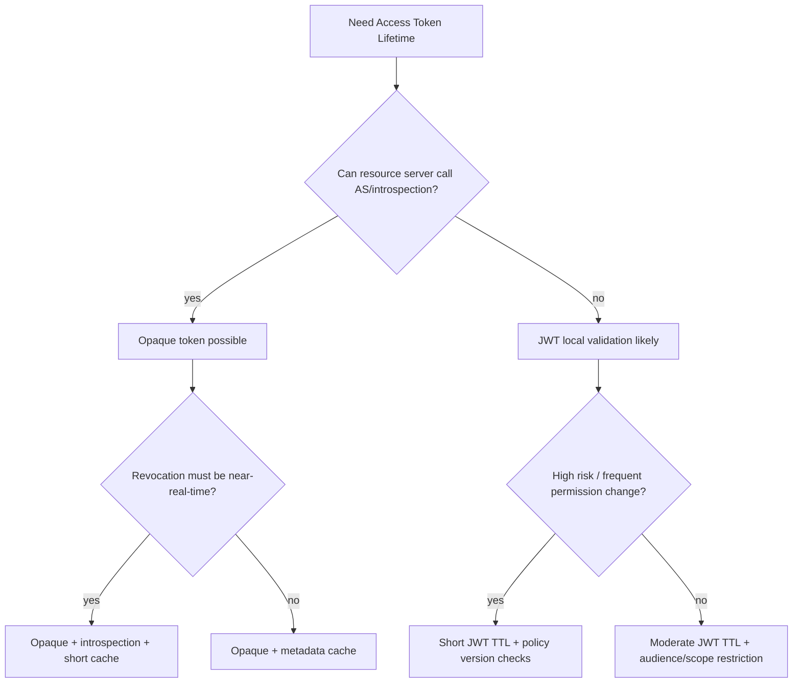

### 8.5 Expiry Claim Checks

For JWT access token:

- `exp` must exist;
- `exp` must not be too far in future;
- `nbf` must not be too far in future;
- `iat` must be plausible;
- clock skew must be bounded;
- token age may be restricted separately from `exp` for high-risk action.

Pseudo rules:

```go
if claims.ExpiresAt == nil {
    return ErrMissingExpiry
}
if claims.ExpiresAt.Time.After(now.Add(maxAccessTokenLifetime)) {
    return ErrExcessiveLifetime
}
if now.After(claims.ExpiresAt.Time.Add(allowedSkew)) {
    return ErrExpired
}
if claims.NotBefore != nil && now.Add(allowedSkew).Before(claims.NotBefore.Time) {
    return ErrNotYetValid
}
```

---

## 9. Refresh Token: Long-Lived Credential, Bukan Sekadar Token Tambahan

Refresh token adalah salah satu artefak paling berbahaya dalam auth system.

Access token biasanya pendek. Refresh token memungkinkan access token baru terus diterbitkan.

Jika refresh token dicuri, attacker bisa mempertahankan akses tanpa password user.

### 9.1 Refresh Token Harus Diperlakukan Seperti Credential

Implikasi:

- jangan simpan mentah di database;
- jangan log;
- jangan expose ke resource server;
- jangan kirim ke origin yang tidak perlu;
- jangan simpan di localStorage browser tanpa alasan kuat;
- jangan gunakan tanpa binding;
- jangan berikan scope lebih luas dari grant awal;
- jangan biarkan hidup selamanya;
- monitor last used, IP/device anomaly, reuse.

### 9.2 Refresh Token Expiry

Ada beberapa expiry:

| Jenis | Makna |
|---|---|
| Absolute expiry | refresh token family/grant mati setelah tanggal tertentu |
| Inactivity expiry | mati jika tidak dipakai dalam periode tertentu |
| Session expiry | mati jika session user berakhir |
| Credential expiry | mati jika credential/factor diganti |
| Policy expiry | mati jika client/tenant/policy berubah |
| Risk expiry | mati karena anomaly/compromise |

### 9.3 Refresh Token Scope

Refresh token tidak boleh bisa menaikkan privilege.

Jika user memberikan consent untuk:

```text
scope: cases.read cases.comment
resource: case-api
```

Refresh token dari grant itu tidak boleh tiba-tiba menghasilkan access token dengan:

```text
scope: cases.delete admin.impersonate
resource: admin-api
```

### 9.4 Refresh Token dan Multi-Device

Satu user bisa punya banyak device/session.

Jangan desain refresh token sebagai satu global token per user.

Lebih baik:

```text
User
 └── Session/Grant per client-device
      └── Refresh Token Family
           ├── RT seq 1
           ├── RT seq 2
           └── RT seq 3
```

Dengan ini user bisa revoke satu device tanpa logout semua device.

---

## 10. Refresh Token Rotation

Refresh token rotation berarti setiap refresh berhasil akan:

1. menerima refresh token lama;
2. memvalidasi bahwa token lama masih active;
3. menandai token lama sebagai rotated/consumed;
4. menerbitkan access token baru;
5. menerbitkan refresh token baru;
6. menghubungkan token baru ke family/grant yang sama;
7. menyimpan state agar reuse token lama dapat dideteksi.

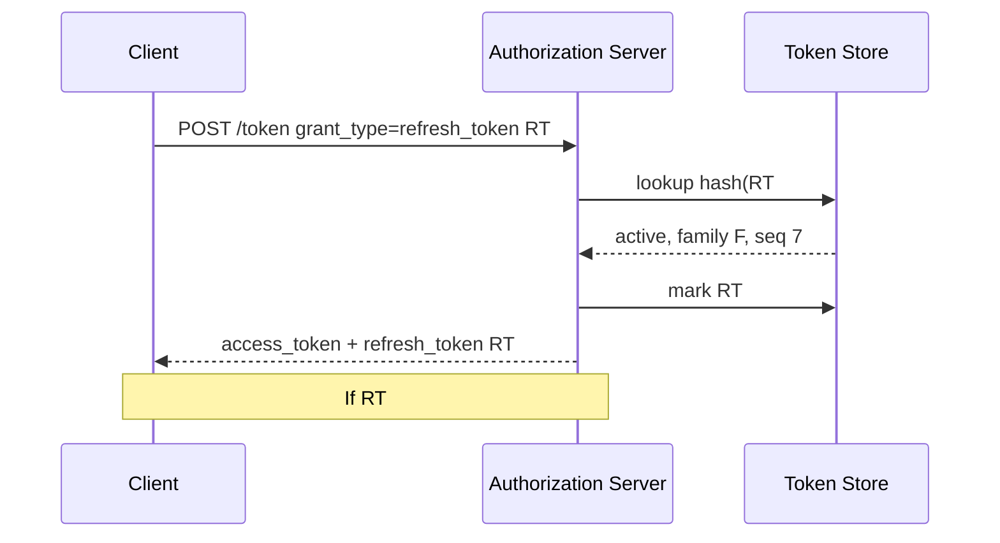

### 10.1 Kenapa Rotation Berguna

Dengan static refresh token, attacker yang mencuri token dapat terus refresh tanpa mudah terdeteksi.

Dengan rotation:

- token lama menjadi invalid setelah dipakai;
- jika token lama muncul lagi, ada anomali;
- sistem dapat revoke token family;
- user/session dapat dipaksa reauth.

### 10.2 Rotation Bukan Obat Semua Penyakit

Rotation tidak mencegah attacker yang:

- mencuri refresh token terbaru terus-menerus dari compromised device;
- mengendalikan browser/app runtime;
- intercept response token baru;
- mencuri session cookie BFF;
- mengendalikan authorization server atau storage.

Rotation mendeteksi **reuse conflict**, bukan menjamin device bersih.

### 10.3 Reuse Detection Policy

Ketika token lama dipakai:

| Kondisi | Kemungkinan | Respons |
|---|---|---|
| RT lama dipakai jauh setelah rotation | token theft | revoke family, require reauth |
| RT lama dipakai hampir bersamaan karena retry | race/retry | tergantung grace/idempotency policy |
| RT dari client berbeda dipakai | theft/client mix-up | revoke family/client grant |
| RT sudah expired | normal stale client | reject, maybe reauth |
| RT already revoked | logout/admin action | reject, audit |

### 10.4 Grace Window: Perlu Sangat Hati-Hati

Browser/mobile/network retry bisa menyebabkan request refresh ganda.

Tanpa mitigasi, sistem bisa salah menganggap reuse sebagai compromise.

Namun grace window yang terlalu longgar membuka peluang attacker.

Pola yang lebih aman daripada “accept old token for N seconds” adalah **idempotent refresh response**.

Ide:

- refresh request pertama dengan RT#7 sukses dan membuat RT#8;
- jika request identik datang lagi dalam short window dari same client/session/request fingerprint, server bisa mengembalikan hasil yang sama atau error idempotent;
- jika reuse datang dari context berbeda, treat as replay.

Tapi berhati-hati: menyimpan ulang refresh token baru untuk response kedua berarti kamu harus bisa mengembalikan secret RT#8. Karena refresh token mentah tidak boleh disimpan, pola ini sulit.

Alternatif:

- client-side refresh singleflight;
- backend-for-frontend menghindari multi-tab refresh;
- rotation transaction dengan clear error; client reauth bila ambiguous;
- very short server-side grace hanya untuk same token family + same client + same device + same request id, dengan audit kuat.

### 10.5 Client-Side Singleflight

Untuk SPA/mobile, mencegah refresh paralel sangat penting.

Di Go server-side BFF:

```go
type RefreshCoordinator struct {
    mu sync.Mutex
    inFlight map[string]*refreshCall
}

type refreshCall struct {
    done chan struct{}
    result TokenSet
    err error
}
```

Namun untuk browser murni, singleflight perlu dilakukan dengan:

- shared worker;
- service worker;
- BroadcastChannel;
- local lock dengan expiry;
- atau BFF pattern sehingga browser tidak memegang refresh token.

---

## 11. Token Family dan Grant Model

Refresh token rotation membutuhkan model family.

### 11.1 Authorization Grant

Authorization grant adalah authority yang diberikan resource owner kepada client.

Contoh:

```text
Grant G123:
  subject: user-123
  client: web-portal
  tenant: cea
  scopes: cases.read cases.update
  resources: case-api
  assurance: AAL2
  created_at: 2026-06-24T10:00:00Z
  expires_at: 2026-07-24T10:00:00Z
```

### 11.2 Token Family

Token family adalah chain refresh token yang berasal dari satu grant/session/client-device context.

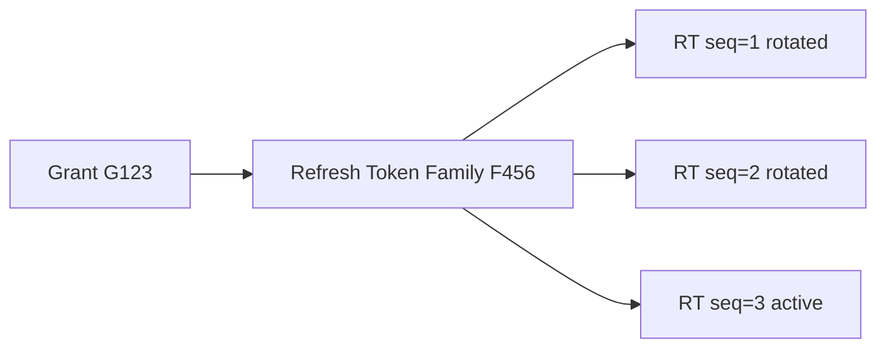

### 11.3 Kenapa Family Penting

Tanpa family, ketika reuse terjadi kamu tidak tahu apa yang harus dicabut.

Dengan family:

- reuse RT#2 dapat revoke semua token dalam family F456;
- user dapat logout device tertentu;
- admin dapat revoke grant tertentu;
- system dapat audit lineage token;
- anomaly detection lebih presisi.

### 11.4 Sequence Number

Gunakan sequence number untuk rotation.

```text
family_id = F456
seq       = 7
status    = active
```

Saat refresh sukses:

```text
RT seq 7 -> rotated
RT seq 8 -> active
```

Jika `seq=7` muncul lagi setelah status `rotated`, itu reuse.

### 11.5 Token Identifier

Token value harus random secret.

Token metadata harus punya ID non-secret:

- token_id;
- family_id;
- grant_id;
- jti untuk JWT;
- hash/token fingerprint.

Jangan menggunakan token mentah sebagai primary key yang muncul di log query/debug.

---

## 12. Replay Detection

Replay adalah penggunaan kembali token yang seharusnya tidak dapat dipakai ulang, atau penggunaan token curian oleh pihak yang bukan holder yang sah.

### 12.1 Bearer Token Replay

Bearer token memiliki sifat:

> siapa pun yang membawa token dapat memakainya.

Jika access token dicuri, resource server tidak tahu apakah pembawa token adalah client asli.

Mitigasi:

- lifetime pendek;
- sender-constrained token;
- audience restriction;
- TLS;
- no token in URL;
- no logs;
- revocation/introspection untuk high-risk;
- anomaly detection.

### 12.2 Refresh Token Replay

Refresh token rotation membuat replay lebih terlihat.

Alur compromise:

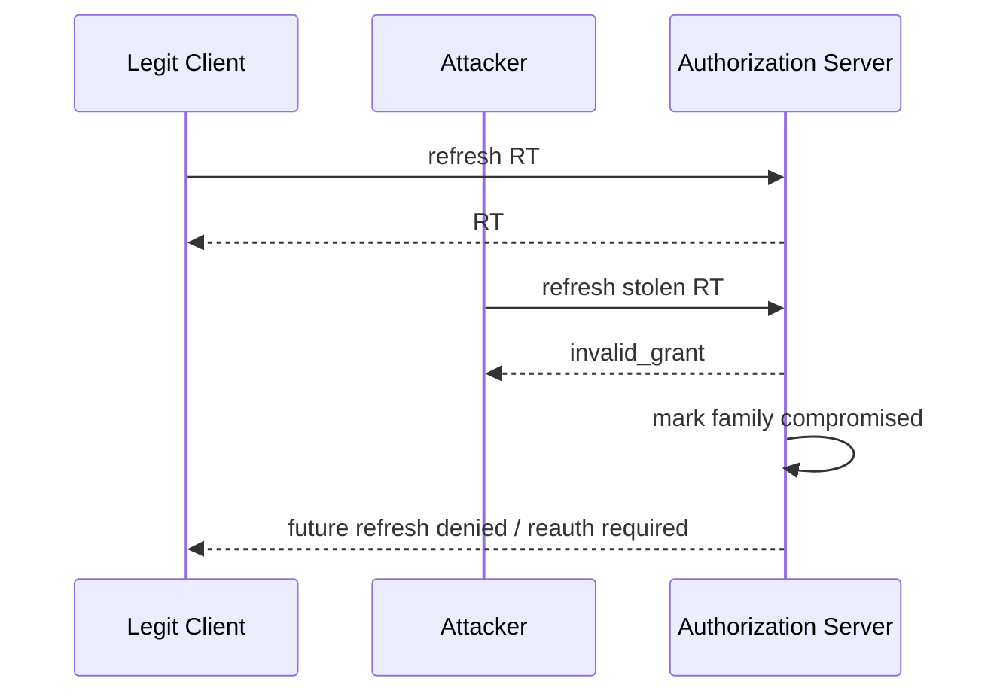

Masalahnya, authorization server tidak selalu tahu siapa attacker dan siapa legit.

Karena itu banyak policy memilih:

> On refresh token reuse, revoke the token family and require reauthentication.

### 12.3 Replay Signal Data

Simpan metadata untuk analisis:

- token family;
- token sequence;
- first issued time;
- rotated time;
- attempted reuse time;
- client id;
- session id;
- device id;
- IP hash / ASN / geolocation coarse;
- user-agent hash;
- DPoP key thumbprint / mTLS certificate thumbprint;
- request id;
- tenant id;
- risk score.

Jangan simpan data personal berlebihan tanpa tujuan dan retention policy.

### 12.4 Replay Detection Pseudocode

```go
func (s *Service) UseRefreshToken(ctx context.Context, raw string, req RefreshRequest) (TokenSet, error) {
    digest := s.hasher.Digest(raw)

    return s.tx.WithTx(ctx, func(ctx context.Context, tx Tx) (TokenSet, error) {
        rt, err := tx.RefreshTokens().FindForUpdate(ctx, digest)
        if err != nil {
            s.audit.RefreshFailed(ctx, req, "not_found")
            return TokenSet{}, ErrInvalidGrant
        }

        switch rt.Status {
        case RefreshActive:
            return s.rotateActive(ctx, tx, rt, req)

        case RefreshRotated:
            s.audit.RefreshReuseDetected(ctx, rt, req)
            if err := tx.RefreshTokenFamilies().Revoke(ctx, rt.FamilyID, RevokeReasonReplayDetected); err != nil {
                return TokenSet{}, err
            }
            return TokenSet{}, ErrInvalidGrant

        case RefreshRevoked, RefreshExpired, RefreshFamilyRevoked:
            s.audit.RefreshFailed(ctx, req, string(rt.Status))
            return TokenSet{}, ErrInvalidGrant

        default:
            return TokenSet{}, ErrInvalidGrant
        }
    })
}
```

Important:

- return outward error should often be generic `invalid_grant`;
- audit reason can be detailed internally;
- do not disclose “replay detected” to attacker;
- notify user/admin through separate safe channel if policy requires.

---

## 13. Revocation Semantics

Revocation berarti authority dicabut sebelum expiry.

Tetapi pertanyaan utamanya:

> Apa scope pencabutannya?

### 13.1 Revocation Scope

| Scope | Contoh |
|---|---|
| Single token | revoke one refresh token |
| Token family | revoke all refresh tokens for one device/session chain |
| Grant | revoke all tokens issued under one OAuth consent/grant |
| Session | logout one browser/device session |
| Client-user pair | disconnect one app integration |
| User all sessions | user reset password or account takeover |
| Tenant-wide | tenant suspended or security incident |
| Key-wide | signing key compromised |
| Credential-bound | passkey/password/MFA factor revoked |

### 13.2 Revocation Reason

Reason harus eksplisit:

```go
type RevocationReason string

const (
    RevokeLogout             RevocationReason = "logout"
    RevokeUserInitiated      RevocationReason = "user_initiated"
    RevokeAdminInitiated     RevocationReason = "admin_initiated"
    RevokePasswordChanged    RevocationReason = "password_changed"
    RevokeCredentialRemoved  RevocationReason = "credential_removed"
    RevokeReplayDetected     RevocationReason = "replay_detected"
    RevokeCompromise         RevocationReason = "compromise"
    RevokeClientDisabled     RevocationReason = "client_disabled"
    RevokeTenantSuspended    RevocationReason = "tenant_suspended"
    RevokePolicyChanged      RevocationReason = "policy_changed"
)
```

### 13.3 Revocation Does Not Mean Immediate Everywhere

Jika resource server melakukan local JWT validation, revocation belum tentu real-time.

Cara membuat revocation lebih cepat:

- access token TTL pendek;
- introspection untuk high-risk endpoints;
- token version/session version check;
- distributed revocation cache;
- event propagation;
- denylist by `jti` untuk exceptional cases;
- policy version embedded plus current policy check;
- backchannel logout/session revocation;
- gateway central check.

### 13.4 Revocation Matrix

| Event | Minimum action | Stronger action |
|---|---|---|
| User logout one device | revoke session/family | invalidate access token via revocation cache |
| Password change | revoke all sessions except current | require MFA re-enrollment review |
| MFA factor removed | revoke sessions authenticated with factor | step-up all sessions |
| Refresh token reuse | revoke family | revoke grant/client sessions, notify user |
| Account takeover confirmed | revoke all grants/sessions | force password/MFA reset, freeze high-risk action |
| Client secret compromised | revoke client grants/tokens | rotate secret, disable client temporarily |
| Signing key compromise | revoke key, rotate JWKS | invalidate all affected JWTs |
| Tenant suspended | revoke tenant grants | block tenant auth and resource access |

---

## 14. OAuth Token Revocation Endpoint

RFC 7009 defines a token revocation endpoint where clients notify the authorization server that a token is no longer needed.

### 14.1 Endpoint Shape

Typical request:

```http
POST /oauth/revoke
Content-Type: application/x-www-form-urlencoded
Authorization: Basic <client-auth>

token=<token>&token_type_hint=refresh_token
```

### 14.2 Important Semantics

A revocation request may invalidate:

- the actual token;
- other tokens based on the same authorization grant.

This is important. If you revoke refresh token, you may also revoke related access tokens depending on policy.

### 14.3 Token Type Hint

`token_type_hint` is optimization, not trust boundary.

Do not assume token is refresh token just because client says:

```text
token_type_hint=refresh_token
```

The server may search across token types if the hinted lookup fails.

### 14.4 Client Authentication

Revocation endpoint must authenticate clients where appropriate.

Public clients cannot keep secrets. Their revocation semantics differ.

Confidential clients should authenticate using allowed method:

- client secret basic;
- private_key_jwt;
- mTLS;
- DPoP-bound client where applicable;
- deployment-specific mechanism.

### 14.5 Idempotency

Revocation should generally be idempotent outwardly.

If token is already revoked or unknown, do not reveal too much.

Bad:

```json
{"error":"token belongs to user fajar@example.com and was revoked yesterday"}
```

Better:

```http
200 OK
```

or standard-compliant error only when client authentication/request is invalid.

### 14.6 Go Handler Skeleton

```go
func (h *OAuthHandler) RevokeToken(w http.ResponseWriter, r *http.Request) {
    ctx := r.Context()

    client, err := h.clientAuth.Authenticate(ctx, r)
    if err != nil {
        h.writeOAuthError(w, ErrInvalidClient)
        return
    }

    if err := r.ParseForm(); err != nil {
        h.writeOAuthError(w, ErrInvalidRequest)
        return
    }

    rawToken := r.PostForm.Get("token")
    hint := r.PostForm.Get("token_type_hint")
    if rawToken == "" {
        h.writeOAuthError(w, ErrInvalidRequest)
        return
    }

    req := RevokeRequest{
        ClientID:      client.ID,
        RawToken:      rawToken,
        TokenTypeHint: hint,
        IP:            clientIP(r),
        UserAgent:     r.UserAgent(),
        RequestID:     requestID(ctx),
    }

    // Do not expose whether token existed if request is otherwise authorized.
    _ = h.tokens.Revoke(ctx, req)

    w.WriteHeader(http.StatusOK)
}
```

---

## 15. Token Introspection

RFC 7662 defines a way for protected resources to ask authorization server whether a token is active and obtain metadata.

### 15.1 Why Introspection Exists

OAuth core does not require resource server to understand token format.

Resource server needs answers:

- is token active?
- expired?
- revoked?
- issued by which AS?
- for which client?
- what scopes?
- which subject?
- which audience/resource?
- what authorization context?

Introspection centralizes this.

### 15.2 Introspection Request

```http
POST /oauth/introspect
Content-Type: application/x-www-form-urlencoded
Authorization: Basic <resource-server-auth>

token=<access_token>&token_type_hint=access_token
```

### 15.3 Introspection Response

Example:

```json
{
  "active": true,
  "scope": "cases.read cases.update",
  "client_id": "web-portal",
  "sub": "user-123",
  "aud": "case-api",
  "iss": "https://id.example.com",
  "exp": 1782297600,
  "iat": 1782294000,
  "tenant_id": "cea"
}
```

Inactive token should reveal minimal state:

```json
{
  "active": false
}
```

### 15.4 Introspection Endpoint Must Be Protected

Do not expose introspection publicly without strong authentication.

If not protected, attackers can use it as token oracle.

### 15.5 Introspection Caching Trade-off

Resource server may cache introspection response.

But this creates staleness:

| Cache TTL | Result |
|---:|---|
| 0 sec | most fresh, high AS load |
| 5–30 sec | good for high-risk APIs, moderate load |
| 1–5 min | lower load, revocation delayed |
| until token exp | essentially local validation semantics |

Design rule:

> Cache introspection no longer than your acceptable revocation latency.

### 15.6 Introspection vs JWT Local Validation

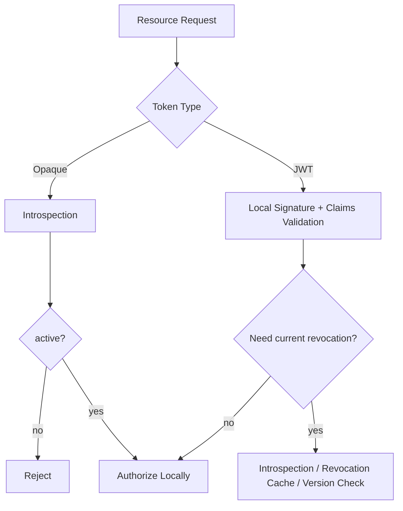

---

## 16. Opaque Token vs JWT Lifecycle

### 16.1 Opaque Token

Opaque token:

```text
2YotnFZFEjr1zCsicMWpAA
```

Resource server cannot infer claims. It must call AS/introspection or shared store.

Advantages:

- revocation easier;
- metadata stays server-side;
- token leaks reveal no claims;
- policy change can be reflected centrally;
- token format can change without client impact.

Disadvantages:

- network call/latency;
- AS availability dependency;
- introspection scaling;
- cache complexity.

### 16.2 JWT Access Token

JWT contains claims and can be validated locally.

Advantages:

- resource server autonomy;
- low latency;
- less AS coupling;
- works well at high scale;
- easier for cross-service verification.

Disadvantages:

- revocation harder;
- claim staleness;
- larger token;
- token leaks may expose metadata;
- key/JWKS lifecycle complexity;
- over-trust risk.

### 16.3 Hybrid

Hybrid often best:

- JWT access token with short TTL;
- refresh token server-side stateful and rotated;
- introspection only for high-risk routes;
- revocation event cache for critical jti/session;
- policy version check for sensitive permissions.

### 16.4 Decision Matrix

| Requirement | Prefer |
|---|---|
| Near-real-time revocation | opaque/introspection |
| Very high request volume | JWT local validation |
| Sensitive claims should not be exposed | opaque or JWE with caution |
| Many independent resource servers | JWT with strict audience |
| Central policy must be current | introspection/PDP check |
| Offline resource server validation | JWT |
| Simple logout semantics | server-side session/opaque |
| External third-party API ecosystem | OAuth token + introspection/JWT profile |

---

## 17. Sender-Constrained Token: mTLS dan DPoP

Bearer token problem:

> possession of the token is enough.

Sender-constrained token changes this:

> token is only accepted when the sender proves possession of a key/certificate bound to the token.

### 17.1 mTLS-Bound Token

OAuth mTLS can bind token to client certificate.

Resource server checks:

- TLS client certificate present;
- certificate/thumbprint matches token binding claim/metadata;
- token still valid;
- audience/scope valid.

Best for:

- backend-to-backend;
- enterprise confidential clients;
- controlled infrastructure;
- high assurance service identity.

Challenges:

- certificate lifecycle;
- proxy/load balancer termination;
- service mesh integration;
- client cert forwarding risk;
- operational complexity.

### 17.2 DPoP

DPoP is application-level proof of possession.

Client sends:

```http
Authorization: DPoP <access_token>
DPoP: <signed proof JWT>
```

DPoP proof includes method/URL binding and a unique `jti` to help detect replay.

Best for:

- public clients where mTLS is impractical;
- browser/native app scenarios;
- proof-of-possession without client certificate.

Challenges:

- client key storage;
- DPoP proof replay cache;
- clock skew;
- endpoint URL normalization;
- multi-instance resource server replay detection;
- implementation complexity.

### 17.3 Sender Constraint Does Not Replace Rotation

For public clients, RFC 9700 allows either sender-constrained refresh token or refresh token rotation. In high-risk systems, using both may be justified.

But implementation cost rises.

### 17.4 Replay Cache for DPoP

DPoP proof uses unique `jti`.

Resource server should prevent reuse within proof validity window.

```go
type ProofReplayCache interface {
    SeenOrStore(ctx context.Context, thumbprint string, proofJTI string, exp time.Time) (seen bool, err error)
}
```

Key challenge:

- local memory cache misses across replicas;
- distributed cache adds latency;
- false positives hurt UX;
- false negatives reduce protection.

---

## 18. Binding Token ke Client, Session, Device, Tenant, Scope, dan Audience

Token harus punya boundary.

### 18.1 Client Binding

Refresh token harus bound ke `client_id`.

On refresh:

```go
if token.ClientID != authenticatedClient.ID {
    return ErrInvalidGrant
}
```

### 18.2 Session Binding

Refresh token family should link to session.

Benefits:

- logout one session;
- show device/session management UI;
- revoke suspicious device;
- trace audit.

### 18.3 Device Binding

For native/mobile:

- device id alone is not strong proof;
- device fingerprint is privacy-sensitive and unstable;
- hardware-backed key/passkey/DPoP key is stronger;
- model device binding as signal, not absolute truth, unless cryptographically proven.

### 18.4 Tenant Binding

Access token should not allow tenant switch unless explicitly designed.

Bad:

```json
{
  "sub":"user-123",
  "roles":["admin"]
}
```

Better:

```json
{
  "sub":"user-123",
  "aud":"case-api",
  "tenant_id":"cea",
  "scope":"cases.read cases.update",
  "authorization_context":"tenant-bound"
}
```

But even better for fine-grained access:

- token identifies subject/client/tenant baseline;
- service checks resource tenant and permission model at request time.

### 18.5 Scope Binding

Refresh token must not mint broader scopes than originally authorized.

If refresh request asks lower scopes, it may be allowed depending on policy.

If it asks higher scopes, require new authorization/consent/step-up.

### 18.6 Audience Binding

Access token should be audience-restricted to specific resource server or small set.

Resource server must reject if not in `aud`.

### 18.7 Assurance Binding

Token should carry assurance context carefully:

- `acr`/AAL value;
- `amr` methods;
- `auth_time`;
- step-up timestamp;
- max age for high-risk action.

But high-risk action should verify freshness against policy, not trust stale token forever.

---

## 19. Storage: Jangan Simpan Refresh Token Mentah

Refresh token is a secret. Store only a digest.

### 19.1 Token Generation

Generate high-entropy random value:

```go
func GenerateToken(n int) (string, error) {
    b := make([]byte, n)
    if _, err := rand.Read(b); err != nil {
        return "", err
    }
    return base64.RawURLEncoding.EncodeToString(b), nil
}
```

Use at least 256 bits of entropy for refresh/API tokens.

### 19.2 Hashing Token

Use keyed hash for lookup:

```go
type TokenHasher struct {
    key []byte
}

func (h TokenHasher) Digest(raw string) []byte {
    mac := hmac.New(sha256.New, h.key)
    mac.Write([]byte("refresh-token:v1:"))
    mac.Write([]byte(raw))
    return mac.Sum(nil)
}
```

Why HMAC instead of plain SHA-256?

- refresh tokens are high entropy, so SHA-256 may be acceptable;
- HMAC adds protection if DB leaks but app secret remains protected;
- version prefix supports migration.

### 19.3 Constant-Time Compare

When comparing digest:

```go
if subtle.ConstantTimeCompare(got, want) != 1 {
    return ErrInvalidGrant
}
```

In many designs, digest lookup is by indexed column. Constant-time compare matters when comparing candidate values after lookup or when not using direct digest index.

### 19.4 Secret Rotation for Hash Key

If using HMAC key, plan rotation.

Options:

- store `hash_version`;
- support multiple active hash keys for lookup;
- migrate on refresh;
- expire old tokens naturally;
- revoke all tokens if key compromise.

### 19.5 Display Once

For API key/refresh-like long-lived tokens, show raw token once at creation. Store only digest.

---

## 20. Data Model dan Schema

### 20.1 Core Tables

Example relational model:

```sql
CREATE TABLE oauth_grant (
    id                 VARCHAR(64) PRIMARY KEY,
    subject_id         VARCHAR(64) NOT NULL,
    actor_id           VARCHAR(64),
    client_id          VARCHAR(128) NOT NULL,
    tenant_id          VARCHAR(64),
    scope              TEXT NOT NULL,
    resource_audience  TEXT NOT NULL,
    assurance_level    VARCHAR(32),
    status             VARCHAR(32) NOT NULL,
    created_at         TIMESTAMP NOT NULL,
    expires_at         TIMESTAMP,
    revoked_at         TIMESTAMP,
    revoked_reason     VARCHAR(64),
    revoked_by         VARCHAR(64),
    version            BIGINT NOT NULL DEFAULT 1
);
```

```sql
CREATE TABLE refresh_token_family (
    id                 VARCHAR(64) PRIMARY KEY,
    grant_id           VARCHAR(64) NOT NULL REFERENCES oauth_grant(id),
    session_id         VARCHAR(64),
    device_id          VARCHAR(64),
    client_id          VARCHAR(128) NOT NULL,
    tenant_id          VARCHAR(64),
    status             VARCHAR(32) NOT NULL,
    current_seq        BIGINT NOT NULL DEFAULT 0,
    created_at         TIMESTAMP NOT NULL,
    last_used_at       TIMESTAMP,
    expires_at         TIMESTAMP,
    inactivity_expires_at TIMESTAMP,
    revoked_at         TIMESTAMP,
    revoked_reason     VARCHAR(64),
    compromised_at     TIMESTAMP,
    version            BIGINT NOT NULL DEFAULT 1
);
```

```sql
CREATE TABLE refresh_token (
    id                 VARCHAR(64) PRIMARY KEY,
    family_id          VARCHAR(64) NOT NULL REFERENCES refresh_token_family(id),
    grant_id           VARCHAR(64) NOT NULL REFERENCES oauth_grant(id),
    token_hash         BYTEA NOT NULL,
    hash_version       VARCHAR(16) NOT NULL,
    seq                BIGINT NOT NULL,
    status             VARCHAR(32) NOT NULL,
    issued_at          TIMESTAMP NOT NULL,
    consumed_at        TIMESTAMP,
    expires_at         TIMESTAMP NOT NULL,
    client_id          VARCHAR(128) NOT NULL,
    dpop_jkt           VARCHAR(128),
    mtls_thumbprint    VARCHAR(128),
    last_seen_ip_hash  VARCHAR(128),
    last_seen_ua_hash  VARCHAR(128),
    UNIQUE(token_hash),
    UNIQUE(family_id, seq)
);
```

For Oracle, adapt `BYTEA` to `RAW(32)` or suitable binary type.

### 20.2 Access Token Metadata

If using opaque access tokens or JWT denylist/introspection:

```sql
CREATE TABLE access_token_record (
    id                 VARCHAR(64) PRIMARY KEY,
    jti                VARCHAR(128),
    token_hash         BYTEA,
    grant_id           VARCHAR(64) NOT NULL,
    family_id          VARCHAR(64),
    subject_id         VARCHAR(64),
    client_id          VARCHAR(128),
    tenant_id          VARCHAR(64),
    audience           TEXT NOT NULL,
    scope              TEXT NOT NULL,
    issued_at          TIMESTAMP NOT NULL,
    expires_at         TIMESTAMP NOT NULL,
    revoked_at         TIMESTAMP,
    revoked_reason     VARCHAR(64)
);
```

### 20.3 Revocation Event Table

```sql
CREATE TABLE token_revocation_event (
    id                 VARCHAR(64) PRIMARY KEY,
    event_type         VARCHAR(64) NOT NULL,
    scope_type         VARCHAR(64) NOT NULL,
    scope_id           VARCHAR(128) NOT NULL,
    subject_id         VARCHAR(64),
    client_id          VARCHAR(128),
    tenant_id          VARCHAR(64),
    reason             VARCHAR(64) NOT NULL,
    occurred_at        TIMESTAMP NOT NULL,
    actor_id           VARCHAR(64),
    request_id         VARCHAR(128),
    published_at       TIMESTAMP
);
```

This supports outbox publication.

### 20.4 Why Version Columns Matter

Use version columns for optimistic locking where appropriate.

For rotation, prefer row lock on token/family to prevent double-use.

---

## 21. Concurrency dan Race Condition pada Rotation

Refresh token rotation is concurrency-sensitive.

### 21.1 Race: Double Refresh

Scenario:

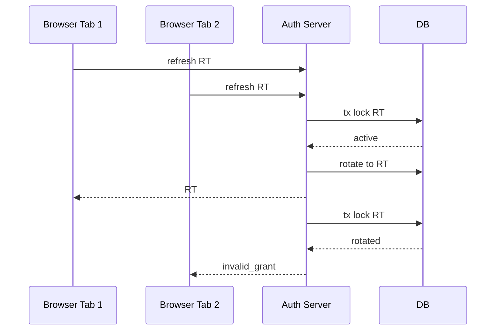

This can happen without attacker.

### 21.2 Server Policy Choices

| Policy | Pros | Cons |
|---|---|---|
| strict rotation, second request invalid | simple, secure | can false logout multi-tab/retry |
| small grace for same client | better UX | replay window |
| idempotent response | best UX | hard because raw new RT not stored |
| client singleflight required | good if controlled client | not always reliable |
| BFF server session | best browser security/UX | architecture cost |

### 21.3 Recommended for High-Security Go Backend

For browser apps:

- prefer BFF pattern;
- browser stores session cookie, not refresh token;
- backend coordinates refresh;
- refresh token stays server-side;
- multi-tab problem disappears or reduces.

For native/mobile:

- refresh token rotation;
- client-side request serialization;
- secure storage;
- robust handling of `invalid_grant`;
- device/session management.

For service-to-service:

- prefer client credentials with short-lived access token;
- use workload identity/mTLS;
- avoid long-lived refresh token unless necessary.

### 21.4 SQL Locking Pattern

Within transaction:

```sql
SELECT * FROM refresh_token WHERE token_hash = :hash FOR UPDATE;
```

Then:

1. check token status;
2. check family status;
3. check grant status;
4. mark old token consumed;
5. insert new token;
6. update family current_seq/last_used;
7. commit.

Do not issue new token before the transaction has made old token unusable.

### 21.5 Optimistic Locking Pattern

```sql
UPDATE refresh_token
SET status = 'rotated', consumed_at = :now
WHERE id = :id AND status = 'active';
```

If affected rows = 0, another request consumed it.

Then decide whether it is benign race or replay.

### 21.6 Transaction Boundary

Issuing token often involves random generation and signing.

Be careful:

- if you sign JWT before commit and commit fails, client may receive unusable token;
- if you commit before response and response fails, client may not receive new refresh token and old one is consumed;
- retry may create reuse-like condition.

You cannot fully eliminate all ambiguity. You design recovery.

Possible patterns:

| Pattern | Description |
|---|---|
| Commit then respond | DB truth first; network failure can strand client |
| Prepare token inside tx, commit, respond | common; still response failure issue |
| Store one-time response envelope encrypted | supports idempotent retry; more complex |
| BFF server-held token | response failure less severe because server owns state |

---

## 22. Distributed Consistency dan Revocation Latency

Revocation in distributed systems is not instant by default.

### 22.1 Revocation Latency Budget

Define acceptable delay:

| Risk | Revocation Latency Target |
|---|---:|
| Normal logout | seconds to minutes may be acceptable |
| Admin removes permission | seconds to short minutes |
| Account takeover | near-real-time desired |
| Tenant suspension | near-real-time |
| Signing key compromise | immediate emergency response |
| Payment/critical action | per-request current check |

### 22.2 Token TTL as Upper Bound

If JWT access token lifetime is 15 minutes and no revocation check exists, logout may take up to 15 minutes to fully take effect.

That may be okay for low-risk systems.

It is not okay for high-risk admin or regulated actions.

### 22.3 Version-Based Revocation

Embed version in token:

```json
{
  "sub":"user-123",
  "sid":"sess-456",
  "token_version": 12,
  "policy_version": 88
}
```

Resource server checks current version:

- user token version;
- session version;
- tenant policy version;
- permission model version.

If token version < current version, reject.

Trade-off:

- requires lookup/cache;
- can invalidate classes of tokens efficiently;
- useful for password change/logout all.

### 22.4 Revocation Cache

Resource server keeps cache:

```text
revoked:jti:<jti> -> expires at original token exp
revoked:sid:<sid> -> expires at session max expiry
revoked:user-version:<user> -> version
revoked:tenant:<tenant> -> suspended
```

Denylist entries should expire when no longer needed.

### 22.5 Eventual Consistency Risk

If revocation event publication fails, services may accept revoked token.

Mitigations:

- outbox pattern;
- retry publisher;
- event consumer lag monitoring;
- fallback introspection for high-risk actions;
- short access token TTL;
- service startup warmup of revocation snapshot;
- periodic reconciliation.

---

## 23. Cache Strategy

Caching auth data is dangerous but often necessary.

### 23.1 Cache Types

| Cache | Purpose | Risk |
|---|---|---|
| JWKS cache | signature key lookup | stale key / emergency revocation delay |
| Introspection cache | avoid AS call per request | stale active state |
| Revocation cache | reject known revoked tokens | propagation lag/misses |
| Policy version cache | detect stale tokens | stale policy |
| Session cache | check active session | stale logout |
| Token metadata cache | speed opaque token validation | stale revocation/scope |

### 23.2 Positive vs Negative Cache

Positive cache:

```text
token active -> cache active for 30s
```

Negative cache:

```text
token inactive -> cache inactive for 60s
```

Negative cache helps protect introspection endpoint from repeated invalid tokens but can cause issues if token state changes from inactive to active. Usually token should not become active after inactive except clock/not-before edge cases.

### 23.3 Cache TTL Rule

Never set cache TTL longer than:

```text
min(token_exp - now, acceptable_revocation_delay, policy_freshness_budget)
```

### 23.4 Cache Poisoning Risk

Do not let untrusted token values become unbounded cache keys without limits.

Use digest of token/JTI and cap sizes.

Bad:

```go
cache.Set(rawAuthorizationHeader, result)
```

Better:

```go
key := "introspection:" + hex.EncodeToString(hmacDigest(rawToken))
cache.Set(key, result, ttl)
```

### 23.5 Singleflight Introspection

If many requests arrive with same token, prevent stampede.

```go
var group singleflight.Group

v, err, _ := group.Do(cacheKey, func() (any, error) {
    return client.Introspect(ctx, rawToken)
})
```

Use `golang.org/x/sync/singleflight` where appropriate.

---

## 24. Outbox, Eventing, dan Revocation Propagation

Revocation often needs propagation.

### 24.1 Why Outbox

If you update DB and publish event separately:

```text
DB revoke success
publish event fails
```

Resource servers may not learn revocation.

Outbox pattern:

1. update token state;
2. insert revocation event in same DB transaction;
3. publisher reads outbox and publishes;
4. mark event published;
5. retry until success.

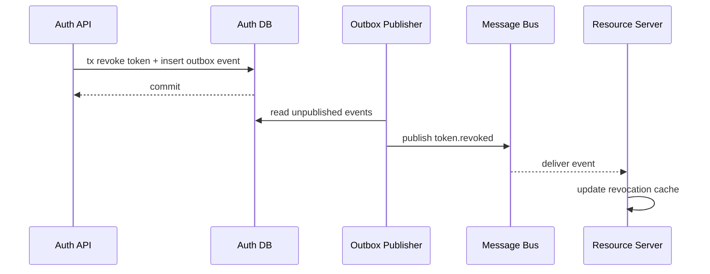

### 24.2 Event Content

Avoid raw token.

Use:

```json
{
  "event_id": "evt_123",
  "event_type": "token_family_revoked",
  "occurred_at": "2026-06-24T13:00:00Z",
  "tenant_id": "cea",
  "subject_id": "user-123",
  "client_id": "web-portal",
  "family_id": "rtf_456",
  "session_id": "sess_789",
  "reason": "replay_detected",
  "revocation_epoch": 42
}
```

### 24.3 Event Ordering

Events can arrive out of order.

Use monotonic version/epoch:

```text
session_revocation_version
user_token_version
tenant_auth_epoch
```

Resource server should apply only if event version is newer.

### 24.4 Event Replay

Consumers should be idempotent.

```go
if event.Version <= current.Version {
    return nil
}
apply(event)
```

---

## 25. Key Rotation vs Token Rotation

Do not confuse:

| Concept | Rotates What |
|---|---|
| Refresh token rotation | refresh token secret value |
| Access token rotation | issuing new access token periodically |
| Signing key rotation | cryptographic key used to sign JWT |
| Client secret rotation | secret credential of OAuth client |
| DPoP key rotation | client proof key |
| Session id rotation | session identifier after auth/privilege change |

### 25.1 Normal Signing Key Rotation

Normal JWT signing key rotation:

1. publish new key in JWKS;
2. start signing new tokens with new `kid`;
3. keep old key until all old tokens expire;
4. remove old key after safe overlap.

### 25.2 Emergency Signing Key Compromise

Emergency:

1. stop signing with compromised key;
2. remove key or mark as revoked;
3. reject tokens signed with compromised key;
4. force reauth/refresh;
5. rotate secrets;
6. audit impact.

This may break active sessions.

### 25.3 Refresh Token Rotation Does Not Need JWT Signing Key

If refresh token is opaque random secret stored as digest, signing key rotation does not affect it.

This separation is good.

---

## 26. Logout Semantics

Logout is deceptively complex.

### 26.1 Local App Logout

Local logout:

- clear app session cookie;
- revoke local session;
- maybe revoke refresh token family.

But if external IdP session remains, user may immediately login again silently.

### 26.2 OAuth Client Logout

For OAuth/OIDC client:

- revoke refresh token/grant if disconnecting app;
- clear local session;
- optionally redirect to IdP logout endpoint if OIDC session logout is supported;
- handle multiple client sessions.

### 26.3 Resource Server Impact

If access token JWT remains valid until expiry, resource server may still accept it.

Mitigations:

- short TTL;
- introspection;
- revocation cache;
- session version check;
- BFF where browser does not hold access token.

### 26.4 Logout Types

| Logout Type | Meaning |
|---|---|
| local logout | only current app session ends |
| global logout | all sessions for user/client/IdP end |
| single-device logout | one session/family revoked |
| IdP logout | upstream identity provider session ends |
| backchannel logout | IdP/server notifies clients/server-side sessions |
| frontchannel logout | browser-mediated logout notification |
| admin logout | admin revokes user sessions |
| security logout | system revokes due to compromise/anomaly |

### 26.5 UX Honesty

Do not display:

> “You are logged out everywhere”

unless you actually revoked all relevant sessions/grants and propagated state.

Better:

> “You are signed out of this device.”

or:

> “All known sessions have been revoked. Some access may remain briefly until short-lived tokens expire.”

For regulated systems, precision matters.

---

## 27. Go Package Architecture

A practical package layout:

```text
/internal/auth/token/
  domain.go
  errors.go
  hasher.go
  generator.go
  service.go
  access_issuer.go
  refresh_service.go
  revocation_service.go
  introspection.go
  repository.go
  audit.go
  clock.go
  policy.go
  http_handlers.go
  middleware.go
```

Recommended boundaries:

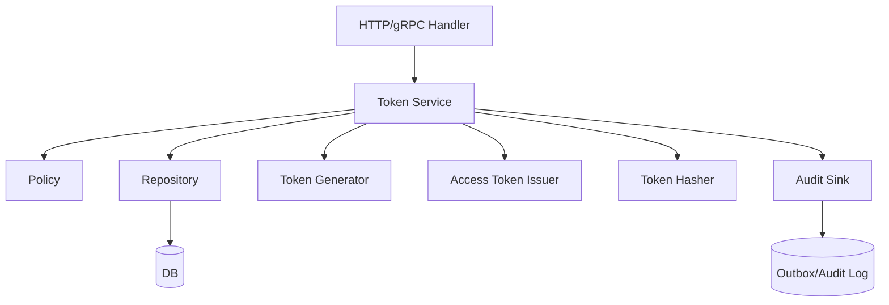

Avoid letting handlers manipulate token rows directly.

### 27.1 Dependencies Direction

Domain should not depend on HTTP.

```text
handler -> service -> repository
handler -> service -> issuer
handler -> service -> audit
```

### 27.2 Clock Interface

Never hard-code `time.Now()` in core logic.

```go
type Clock interface {
    Now() time.Time
}
```

Testing token expiry/rotation becomes much easier.

### 27.3 Entropy Interface

For deterministic tests:

```go
type RandomSource interface {
    Read([]byte) (int, error)
}
```

Production uses `crypto/rand.Reader`.

---

## 28. Domain Types

Make illegal states hard to express.

```go
type TokenID string
type GrantID string
type FamilyID string
type ClientID string
type SubjectID string
type TenantID string
type SessionID string

type RefreshTokenStatus string

const (
    RefreshActive        RefreshTokenStatus = "active"
    RefreshRotated       RefreshTokenStatus = "rotated"
    RefreshRevoked       RefreshTokenStatus = "revoked"
    RefreshExpired       RefreshTokenStatus = "expired"
    RefreshFamilyRevoked RefreshTokenStatus = "family_revoked"
)

type RefreshTokenRecord struct {
    ID              TokenID
    FamilyID        FamilyID
    GrantID         GrantID
    TokenHash       []byte
    HashVersion     string
    Seq             int64
    Status          RefreshTokenStatus
    IssuedAt        time.Time
    ConsumedAt      *time.Time
    ExpiresAt       time.Time
    ClientID        ClientID
    TenantID        *TenantID
    DPoPJKT         *string
    MTLSCertThumb   *string
}
```

### 28.1 TokenSet

```go
type TokenSet struct {
    AccessToken      string
    AccessTokenExp   time.Time
    RefreshToken     string
    RefreshTokenExp  time.Time
    TokenType        string // usually Bearer or DPoP
    Scope            []string
}
```

Do not expose internal token IDs to clients unless standardized (`jti`) and safe.

### 28.2 Request Context

```go
type RefreshRequest struct {
    RawRefreshToken string
    ClientID        ClientID
    TenantHint      *TenantID
    SessionID       *SessionID
    DPoPJKT         *string
    MTLSCertThumb   *string
    IPHash          string
    UserAgentHash   string
    RequestID       string
    Now             time.Time
}
```

---

## 29. Repository dan Transaction Boundary

### 29.1 Repository Interface

```go
type TokenRepository interface {
    WithTx(ctx context.Context, fn func(ctx context.Context, tx TokenTx) error) error
}

type TokenTx interface {
    FindRefreshTokenForUpdate(ctx context.Context, digest []byte) (RefreshTokenRecord, error)
    FindFamilyForUpdate(ctx context.Context, id FamilyID) (RefreshTokenFamily, error)
    FindGrantForUpdate(ctx context.Context, id GrantID) (Grant, error)
    MarkRefreshTokenRotated(ctx context.Context, id TokenID, consumedAt time.Time) error
    InsertRefreshToken(ctx context.Context, rec RefreshTokenRecord) error
    UpdateFamilyAfterRefresh(ctx context.Context, id FamilyID, seq int64, usedAt time.Time) error
    RevokeFamily(ctx context.Context, id FamilyID, reason RevocationReason, at time.Time) error
    InsertRevocationEvent(ctx context.Context, ev RevocationEvent) error
}
```

### 29.2 Why `ForUpdate`

Rotation is mutation of a single-use credential.

Without row lock or atomic compare-and-swap, two requests can both see active token.

### 29.3 Avoid Leaking Storage Errors

Database `not found` should become `invalid_grant` outwardly.

But audit internally:

```go
if errors.Is(err, sql.ErrNoRows) {
    audit.RefreshFailed(ctx, "token_not_found")
    return ErrInvalidGrant
}
```

---

## 30. Token Issuance Service

### 30.1 Initial Issue After Login/OAuth Grant

```go
type IssueRequest struct {
    SubjectID      SubjectID
    ClientID       ClientID
    TenantID       *TenantID
    SessionID      *SessionID
    Scope          []string
    Audience       []string
    AssuranceLevel string
    DPoPJKT        *string
    MTLSCertThumb  *string
}
```

Issuance steps:

1. validate client;
2. validate subject/account status;
3. evaluate consent/policy;
4. create grant;
5. create refresh token family if refresh allowed;
6. issue access token;
7. issue refresh token if allowed;
8. audit issuance;
9. return token set.

### 30.2 Access Token Claims

Example JWT claims:

```json
{
  "iss": "https://id.example.com",
  "sub": "user-123",
  "aud": "case-api",
  "client_id": "web-portal",
  "tenant_id": "cea",
  "scope": "cases.read cases.update",
  "sid": "sess-789",
  "grant_id": "grant-123",
  "jti": "at-456",
  "iat": 1782294000,
  "nbf": 1782294000,
  "exp": 1782294900
}
```

Do not overload token with huge permission graph.

### 30.3 Refresh Token Return

Refresh token should be opaque:

```text
rt_01JZ...<high entropy>...
```

Prefix can help operational classification, but never rely on prefix for security.

---

## 31. Refresh Flow Implementation

### 31.1 Full Flow

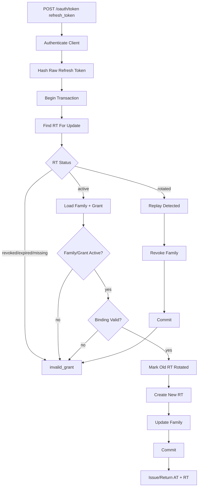

### 31.2 Go Service Skeleton

```go
type RefreshService struct {
    repo        TokenRepository
    hasher      TokenHasher
    generator   TokenGenerator
    access      AccessTokenIssuer
    policy      TokenPolicy
    audit       AuditSink
    clock       Clock
}

func (s *RefreshService) Refresh(ctx context.Context, req RefreshRequest) (TokenSet, error) {
    now := s.clock.Now().UTC()
    digest := s.hasher.Digest(req.RawRefreshToken)

    var result TokenSet

    err := s.repo.WithTx(ctx, func(ctx context.Context, tx TokenTx) error {
        rt, err := tx.FindRefreshTokenForUpdate(ctx, digest)
        if err != nil {
            s.audit.Record(ctx, RefreshFailedEvent(req, "not_found", now))
            return ErrInvalidGrant
        }

        if rt.Status == RefreshRotated {
            s.audit.Record(ctx, RefreshReplayDetectedEvent(req, rt, now))
            if err := tx.RevokeFamily(ctx, rt.FamilyID, RevokeReplayDetected, now); err != nil {
                return err
            }
            if err := tx.InsertRevocationEvent(ctx, NewFamilyRevokedEvent(rt, RevokeReplayDetected, now)); err != nil {
                return err
            }
            return ErrInvalidGrant
        }

        if rt.Status != RefreshActive {
            s.audit.Record(ctx, RefreshFailedEvent(req, string(rt.Status), now))
            return ErrInvalidGrant
        }

        if now.After(rt.ExpiresAt) {
            s.audit.Record(ctx, RefreshFailedEvent(req, "expired", now))
            return ErrInvalidGrant
        }

        family, err := tx.FindFamilyForUpdate(ctx, rt.FamilyID)
        if err != nil {
            return err
        }
        grant, err := tx.FindGrantForUpdate(ctx, rt.GrantID)
        if err != nil {
            return err
        }

        if err := s.policy.ValidateRefresh(ctx, req, rt, family, grant, now); err != nil {
            s.audit.Record(ctx, RefreshFailedEvent(req, err.Error(), now))
            return ErrInvalidGrant
        }

        rawNew, err := s.generator.RefreshToken()
        if err != nil {
            return err
        }
        newDigest := s.hasher.Digest(rawNew)

        newRT := NewRefreshTokenRecord(rt, newDigest, now, s.policy.RefreshTokenTTL(grant))

        if err := tx.MarkRefreshTokenRotated(ctx, rt.ID, now); err != nil {
            return err
        }
        if err := tx.InsertRefreshToken(ctx, newRT); err != nil {
            return err
        }
        if err := tx.UpdateFamilyAfterRefresh(ctx, family.ID, newRT.Seq, now); err != nil {
            return err
        }

        accessToken, accessExp, err := s.access.Issue(ctx, AccessIssueRequest{
            SubjectID: grant.SubjectID,
            ClientID:  grant.ClientID,
            TenantID:  grant.TenantID,
            Scope:     grant.Scope,
            Audience:  grant.Audience,
            GrantID:   grant.ID,
            FamilyID:  family.ID,
            SessionID: family.SessionID,
            Now:       now,
        })
        if err != nil {
            return err
        }

        result = TokenSet{
            AccessToken:     accessToken,
            AccessTokenExp:  accessExp,
            RefreshToken:    rawNew,
            RefreshTokenExp: newRT.ExpiresAt,
            TokenType:       "Bearer",
            Scope:           grant.Scope,
        }

        s.audit.Record(ctx, RefreshSucceededEvent(req, rt, newRT, now))
        return nil
    })

    if err != nil {
        return TokenSet{}, err
    }
    return result, nil
}
```

### 31.3 Important Corrections

The above is a skeleton, not copy-paste production code. Production needs:

- no raw refresh token in structs after digesting if possible;
- robust error wrapping;
- client authentication;
- DPoP/mTLS proof validation before/inside policy;
- rate limiting;
- request size limits;
- audit sink failure policy;
- DB isolation review;
- context timeout;
- secure response headers;
- metrics.

---

## 32. Revocation Flow Implementation

### 32.1 Revoke One Family

```go
func (s *RevocationService) RevokeFamily(ctx context.Context, req RevokeFamilyRequest) error {
    now := s.clock.Now().UTC()

    return s.repo.WithTx(ctx, func(ctx context.Context, tx TokenTx) error {
        family, err := tx.FindFamilyForUpdate(ctx, req.FamilyID)
        if err != nil {
            return nil // outward idempotency depending on caller
        }

        if family.Status == FamilyRevoked {
            return nil
        }

        if err := tx.RevokeFamily(ctx, family.ID, req.Reason, now); err != nil {
            return err
        }

        ev := RevocationEvent{
            ID:        NewEventID(),
            Type:      "refresh_token_family_revoked",
            ScopeType: "family",
            ScopeID:   string(family.ID),
            SubjectID: family.SubjectID,
            ClientID:  family.ClientID,
            TenantID:  family.TenantID,
            Reason:    req.Reason,
            ActorID:   req.ActorID,
            OccurredAt: now,
            RequestID: req.RequestID,
        }
        return tx.InsertRevocationEvent(ctx, ev)
    })
}
```

### 32.2 Revoke All User Sessions

Use version bump when possible:

```sql
UPDATE user_auth_state
SET token_version = token_version + 1,
    updated_at = :now
WHERE subject_id = :subject_id;
```

Then resource servers reject tokens with older `token_version`.

### 32.3 Revoke Access Token by JTI

For exceptional cases:

```go
type RevokedJTI struct {
    JTI       string
    ExpiresAt time.Time // original token exp
    Reason    RevocationReason
}
```

Store only until original token expiry. No need keep forever for enforcement, but audit may be retained separately.

---

## 33. HTTP Handler Design

### 33.1 Token Endpoint

```http
POST /oauth/token
Content-Type: application/x-www-form-urlencoded

grant_type=refresh_token&refresh_token=...
```

Handler responsibilities:

- enforce method/content-type;
- authenticate client;
- parse form safely;
- rate limit;
- validate grant type;
- call service;
- map errors to OAuth error responses;
- secure cache headers;
- no token logs.

### 33.2 Response Headers

Token responses should not be cached by intermediaries:

```http
Cache-Control: no-store
Pragma: no-cache
Content-Type: application/json
```

### 33.3 OAuth Error Mapping

For refresh failure:

```json
{
  "error": "invalid_grant"
}
```

Do not disclose:

- token expired;
- token reused;
- token belongs to another client;
- user disabled;
- family revoked.

Those are internal audit reasons.

### 33.4 Secure Handler Skeleton

```go
func (h *TokenHandler) Token(w http.ResponseWriter, r *http.Request) {
    if r.Method != http.MethodPost {
        w.Header().Set("Allow", http.MethodPost)
        http.Error(w, "method not allowed", http.StatusMethodNotAllowed)
        return
    }

    w.Header().Set("Cache-Control", "no-store")
    w.Header().Set("Pragma", "no-cache")

    if err := r.ParseForm(); err != nil {
        h.writeOAuthError(w, http.StatusBadRequest, "invalid_request")
        return
    }

    switch r.PostForm.Get("grant_type") {
    case "refresh_token":
        h.handleRefresh(w, r)
    default:
        h.writeOAuthError(w, http.StatusBadRequest, "unsupported_grant_type")
    }
}
```

---

## 34. Resource Server Validation Strategy

Resource server validates access token.

### 34.1 Local JWT Validation Only

Good for high-scale APIs if:

- token TTL short;
- audience exact;
- issuer exact;
- JWKS cache robust;
- no immediate revocation requirement;
- high-risk actions do extra checks.

### 34.2 Introspection Only

Good if:

- central revocation required;
- tokens opaque;
- number of requests manageable;
- AS highly available;
- cache carefully tuned.

### 34.3 Hybrid Validation

For many enterprise systems:

- JWT validated locally for most reads;
- current session/policy version checked for writes/admin;
- introspection for high-risk or suspicious requests;
- revocation cache for emergency.

### 34.4 Policy Freshness

Even if token is valid, authorization may require current data:

```go
if request.Action == "case.approve" {
    if err := policy.CheckCurrent(ctx, principal, resource, action); err != nil {
        return deny
    }
}
```

Do not put all authority into long-lived claims.

---

## 35. Client-Type Specific Design

### 35.1 Server-Side Web App

Recommended:

- server-side session cookie;
- refresh token held on server;
- browser never sees access/refresh token if possible;
- CSRF protection;
- SameSite/HttpOnly/Secure cookie;
- session rotation after login/step-up.

### 35.2 SPA

Harder.

Options:

| Pattern | Notes |
|---|---|
| BFF | strongest practical browser pattern for sensitive apps |
| Authorization Code + PKCE, no refresh token | UX may suffer; silent renew limited |
| Refresh token rotation in browser | possible but storage/race risk |
| Token in localStorage | avoid for sensitive systems |
| Token in memory only | safer but reload loses token |

For high-risk enterprise/regulatory apps, BFF is often more defensible.

### 35.3 Mobile Native App

Use:

- Authorization Code + PKCE;
- system browser;
- secure storage/keychain/keystore;
- refresh token rotation;
- device binding signal;
- DPoP/passkey/hardware-backed key where feasible;
- robust reauth when refresh fails.

### 35.4 CLI

Options:

- device authorization flow;
- short-lived access token;
- refresh token stored in OS credential store;
- explicit logout/revoke;
- tenant/profile selection;
- no token printed accidentally.

### 35.5 Service-to-Service

Prefer:

- client credentials;
- workload identity;
- mTLS/SPIFFE;
- short-lived tokens;
- no refresh token if workload can obtain new token using workload credential.

---

## 36. Error Taxonomy

Outward OAuth errors are intentionally limited.

Internal taxonomy should be richer.

```go
type TokenErrorCode string

const (
    ErrCodeInvalidRequest      TokenErrorCode = "invalid_request"
    ErrCodeInvalidClient       TokenErrorCode = "invalid_client"
    ErrCodeInvalidGrant        TokenErrorCode = "invalid_grant"
    ErrCodeUnauthorizedClient  TokenErrorCode = "unauthorized_client"
    ErrCodeUnsupportedGrant    TokenErrorCode = "unsupported_grant_type"
    ErrCodeTemporarilyUnavailable TokenErrorCode = "temporarily_unavailable"
)
```

Internal reasons:

```go
type InternalRefreshFailureReason string

const (
    RefreshTokenNotFound       InternalRefreshFailureReason = "token_not_found"
    RefreshTokenExpired        InternalRefreshFailureReason = "token_expired"
    RefreshTokenRevoked        InternalRefreshFailureReason = "token_revoked"
    RefreshTokenRotatedReuse   InternalRefreshFailureReason = "rotated_token_reuse"
    RefreshClientMismatch      InternalRefreshFailureReason = "client_mismatch"
    RefreshSenderBindingFailed InternalRefreshFailureReason = "sender_binding_failed"
    RefreshGrantRevoked        InternalRefreshFailureReason = "grant_revoked"
    RefreshFamilyRevoked       InternalRefreshFailureReason = "family_revoked"
    RefreshTenantSuspended     InternalRefreshFailureReason = "tenant_suspended"
)
```

External response usually remains:

```json
{"error":"invalid_grant"}
```

### 36.1 Status Codes

| Failure | HTTP |
|---|---:|
| invalid client authentication | 401 |
| invalid refresh token/grant | 400 |
| unsupported grant type | 400 |
| malformed request | 400 |
| AS overloaded | 503 |
| rate limited | 429 |

---

## 37. Audit Model

Token lifecycle must be auditable.

### 37.1 Events

Record:

- token issued;
- refresh succeeded;
- refresh failed;
- refresh token reused;
- family revoked;
- grant revoked;
- session revoked;
- access token introspected;
- revocation endpoint called;
- client authentication failed;
- sender binding failed;
- token used after revocation;
- emergency key revocation.

### 37.2 Audit Fields

| Field | Why |
|---|---|
| event_id | traceability |
| event_type | classification |
| occurred_at | timeline |
| subject_id | who |
| actor_id | admin/delegated actor |
| client_id | which client |
| tenant_id | boundary |
| session_id/family_id/grant_id | lineage |
| token_id/jti/hash fingerprint | token correlation without raw secret |
| reason | why |
| request_id/correlation_id | distributed trace |
| ip_hash/user_agent_hash | anomaly analysis |
| outcome | success/failure |
| policy_version | decision reconstruction |

### 37.3 Do Not Audit Raw Token

Store safe fingerprint:

```go
func TokenFingerprint(raw string, key []byte) string {
    mac := hmac.New(sha256.New, key)
    mac.Write([]byte("audit-token-fingerprint:v1:"))
    mac.Write([]byte(raw))
    return hex.EncodeToString(mac.Sum(nil))[:32]
}
```

Use separate key/purpose from storage hash if possible.

---

## 38. Observability Tanpa Membocorkan Token

### 38.1 Metrics

Useful metrics:

```text
auth_token_issued_total{client_id,token_type}
auth_refresh_success_total{client_id}
auth_refresh_failure_total{client_id,reason}
auth_refresh_reuse_detected_total{client_id,tenant_id}
auth_revocation_total{reason,scope_type}
auth_introspection_requests_total{resource_server}
auth_introspection_latency_seconds
auth_introspection_cache_hit_ratio
auth_token_validation_failure_total{reason,service}
auth_revocation_event_lag_seconds
auth_jwks_cache_miss_total{issuer}
```

Be careful with labels. Do not put user IDs or token IDs in high-cardinality metrics unless intentionally controlled.

### 38.2 Logs

Good log:

```json
{
  "level":"warn",
  "event":"refresh_token_reuse_detected",
  "client_id":"web-portal",
  "tenant_id":"cea",
  "family_id":"rtf_456",
  "subject_hash":"u_abc123",
  "request_id":"req_789"
}
```

Bad log:

```json
{
  "refresh_token":"rt_01JZ...",
  "authorization":"Bearer eyJ..."
}
```

### 38.3 Tracing

Do not put tokens in span attributes.

Good attributes:

```text
auth.client_id
auth.issuer
auth.token_type
auth.validation_result
auth.failure_reason
auth.grant_type
auth.revocation_scope
```

Bad attributes:

```text
http.request.header.authorization
cookie.session_id
oauth.refresh_token
```

### 38.4 Alerting

Alerts:

- refresh token reuse spike;
- invalid grant spike by client;
- introspection latency high;
- introspection 5xx;
- revocation event lag;
- token endpoint 429 spike;
- JWKS miss spike;
- emergency key usage detected;
- client mismatch failures.

---

## 39. Testing Strategy

### 39.1 Unit Tests

Test:

- token generation length/entropy shape;
- digest consistency;
- expiry boundary;
- active refresh success;
- rotated token reuse;
- revoked token rejection;
- expired token rejection;
- client mismatch;
- DPoP/mTLS binding mismatch;
- family revoked;
- grant revoked;
- scope narrowing;
- tenant suspended.

### 39.2 Race Tests

Simulate concurrent refresh with same token.

```go
func TestConcurrentRefreshOnlyOneSucceeds(t *testing.T) {
    // Setup active refresh token.
    // Run N goroutines calling Refresh with same raw token.
    // Assert exactly one success.
    // Assert family either remains active with seq+1 or is revoked depending on policy.
}
```

Use real DB transaction behavior in integration tests. In-memory fake can miss isolation bugs.

### 39.3 Property Tests

Invariants:

- at most one active refresh token per family if rotation policy says so;
- sequence increases monotonically;
- revoked family cannot issue new token;
- access token lifetime never exceeds max;
- refresh token cannot expand scopes;
- reused rotated token triggers configured policy.

### 39.4 Integration Tests

Test with:

- database transaction isolation;
- Redis/revocation cache;
- outbox publisher;
- resource server validation;
- clock skew;
- network retry;
- AS outage;
- cache stale.

### 39.5 Security Tests

Attempt:

- use refresh token as access token;
- use access token at token endpoint;
- use token for wrong audience;
- use refresh token from wrong client;
- use old refresh token after rotation;
- reuse DPoP proof;
- revoke token then introspect;
- use token after password change;
- submit massive invalid tokens to introspection.

---

## 40. Performance Engineering

### 40.1 Token Endpoint Load

Refresh token lifetime and access token TTL affect token endpoint QPS.

Rough model:

```text
refresh_qps ≈ active_sessions / access_token_lifetime_seconds
```

If 100,000 active sessions and access token lifetime 5 minutes:

```text
100,000 / 300 ≈ 333 refreshes/sec
```

But real traffic bursts because tokens often issued around same login windows.

Mitigations:

- jitter access token lifetime slightly;
- client refresh before expiry with random skew;
- BFF coordination;
- token endpoint autoscaling;
- DB index optimization;
- avoid global locks;
- avoid writing access token rows unless needed.

### 40.2 DB Hot Spots

Refresh rotation writes per refresh.

Indexes:

```sql
CREATE UNIQUE INDEX ux_refresh_token_hash ON refresh_token(token_hash);
CREATE INDEX ix_refresh_family_status ON refresh_token_family(status, expires_at);
CREATE INDEX ix_grant_subject_client ON oauth_grant(subject_id, client_id, status);
CREATE INDEX ix_revocation_scope ON token_revocation_event(scope_type, scope_id, occurred_at);
```

Avoid indexing giant text scopes directly.

### 40.3 Cleanup Jobs

Expired token cleanup:

- delete/archive old token records;
- retain audit events per compliance retention;
- remove expired revoked JTI entries;
- partition by date if volume large;
- do not create table bloat in relational DB.

### 40.4 Introspection Scaling

Use:

- cache;
- singleflight;
- rate limiting;
- resource server authentication;
- separate read model;
- bounded response;
- circuit breaker with fail policy.

### 40.5 Fail Open vs Fail Closed

For auth, default is fail closed.

But production needs explicit degradation strategy:

| Component Down | Low-risk API | High-risk API |
|---|---|---|
| introspection down | maybe accept cached active briefly | deny or step-up unavailable |
| revocation event bus down | rely on TTL/cache | deny sensitive actions or force introspection |
| JWKS fetch down | use cached known-good keys | use cached keys until max staleness, then deny |
| token DB down | cannot refresh | existing short-lived access may continue until exp |

Document this. Do not improvise during incident.

---

## 41. Failure Mode Matrix

| Failure Mode | Cause | Impact | Detection | Mitigation |
|---|---|---|---|---|
| Refresh token stolen | malware/XSS/log leak | persistent account access | reuse/anomaly | rotation, sender-constraint, revoke family |
| Double refresh false positive | browser tabs/retry | user logout | invalid_grant spike | client singleflight/BFF/grace policy |
| JWT accepted after logout | local validation | delayed logout | user report/audit | short TTL, revocation cache, introspection |
| Revocation event lost | publish failure | revoked token accepted | outbox lag/reconciliation | transactional outbox, retry |
| Introspection overload | per-request calls | latency/outage | AS metrics | cache, autoscale, local JWT for low-risk |
| Cache stale | TTL too long | revoked token accepted | security test | TTL budget, event invalidation |
| Token logs leaked | bad logging | credential compromise | secret scanning | log redaction, no raw tokens |
| Client mismatch not checked | poor binding | token used by wrong client | audit anomaly | client binding invariant |
| Scope escalation on refresh | poor policy | privilege escalation | tests | grant-bound scopes |
| Family not revoked on reuse | weak replay handling | attacker persists | incident review | strict replay policy |
| Hash key lost | secret management failure | cannot validate refresh tokens | startup failure | key versioning/backups/rotation plan |
| Signing key removed too early | bad JWKS rotation | mass auth failures | validation errors | overlap until token exp |
| DPoP replay cache local only | multi-replica | proof replay accepted | security tests | distributed replay cache for high-risk |
| Tenant suspension not enforced | token claims trusted | tenant breakout | audit/regression | current tenant status check |

---

## 42. Case Study: Regulatory Case Management Multi-Tenant

### 42.1 Context

System:

- government/regulatory case management;
- users from agency, vendors, officers, supervisors;
- multi-tenant or quasi-multi-organization;
- high-risk actions: approve case, issue notice, close enforcement, impersonate user, export reports;
- external identity provider via OIDC;
- Go services behind API gateway;
- Vue SPA frontend;
- audit trail required.

### 42.2 Bad Design

```text
Access token JWT valid for 8 hours.
Refresh token never rotates.
User roles embedded in token.
Logout only deletes browser token.
Permission changes apply after next login.
No token family.
No replay detection.
No revocation events.
```

Failure:

- officer removed from case still can act until token expires;
- stolen refresh token persists for months;
- admin cannot revoke one device;
- audit cannot prove whether token reuse occurred;
- tenant suspension delayed;
- ID token might be accepted by APIs if validation weak.

### 42.3 Better Design

```text
Access token: JWT, 5-10 min, audience case-api, tenant-bound.
Refresh token: opaque, server-side digest, rotated each use.
Family: per client-device-session.
Grant: bound to subject/client/tenant/scopes/resources/assurance.
High-risk action: require current PDP check + assurance freshness.
Logout device: revoke session + family.
Password/MFA change: bump user token version + revoke families.
Tenant suspension: tenant auth epoch + revocation event.
Replay: revoke family, notify user/security.
Audit: record grant_id, family_id, session_id, actor, subject, tenant, reason.
```

### 42.4 Architecture

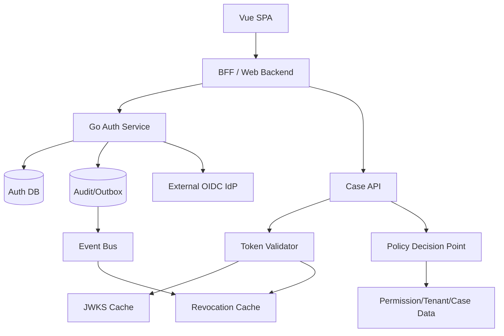

### 42.5 High-Risk Action Flow

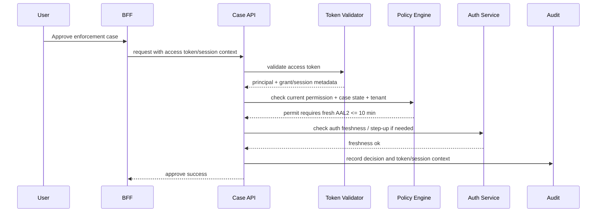

Important:

- token validation is not the whole authorization;
- current case state matters;
- tenant boundary matters;
- assurance freshness matters;
- audit must preserve actor/subject/session/grant context.

---

## 43. Production Checklist

### 43.1 Access Token

- [ ] `iss` exact validation.
- [ ] `aud` exact validation per service.
- [ ] `exp` required.
- [ ] max lifetime enforced.
- [ ] `nbf`/clock skew bounded.
- [ ] token type checked.
- [ ] scopes not treated as full permission model.
- [ ] high-risk endpoints perform current policy check.
- [ ] no access token in URL.
- [ ] no access token in logs/traces.

### 43.2 Refresh Token

- [ ] high entropy.
- [ ] opaque preferred.
- [ ] stored as digest, not raw.
- [ ] bound to client.
- [ ] bound to grant/session/family.
- [ ] bound to scope/resource.
- [ ] rotated on use or sender-constrained for public clients.
- [ ] reuse detection implemented.
- [ ] family revocation policy defined.
- [ ] absolute expiry.
- [ ] inactivity expiry.
- [ ] client mismatch checked.
- [ ] DPoP/mTLS binding checked if used.

### 43.3 Revocation

- [ ] revocation scope explicit.
- [ ] revocation reason recorded.
- [ ] token revocation endpoint authenticated.
- [ ] revocation endpoint does not leak token existence.
- [ ] outbox/event propagation reliable.
- [ ] resource server revocation latency budget defined.
- [ ] emergency revoke procedure documented.
- [ ] cleanup/retention policy exists.

### 43.4 Introspection

- [ ] introspection endpoint authenticated.
- [ ] inactive response minimal.
- [ ] cache TTL bounded by revocation latency.
- [ ] rate limited.
- [ ] token scanning mitigated.
- [ ] resource server authorization to introspect checked.

### 43.5 Go Implementation

- [ ] `context.Context` used for cancellation/timeouts.
- [ ] clock injectable for tests.
- [ ] crypto/rand used for token generation.
- [ ] token hashing keyed/versioned.
- [ ] DB transaction handles rotation atomically.
- [ ] race tests exist.
- [ ] external errors generic; internal audit detailed.
- [ ] no raw token in logs/errors/panic.
- [ ] metrics cardinality controlled.
- [ ] schema indexes reviewed.

---

## 44. Anti-Pattern yang Harus Dihindari

### Anti-Pattern 1 — Refresh Token Tanpa Rotation dan Tanpa Expiry

```text
refresh token valid forever
```

Ini persistent credential yang jika bocor memberi akses jangka panjang.

### Anti-Pattern 2 — Menyimpan Refresh Token Mentah

Jika DB leak, semua refresh token langsung usable.

### Anti-Pattern 3 — JWT 24 Jam untuk Semua API

Logout, permission change, dan account compromise menjadi lambat ditangani.

### Anti-Pattern 4 — Accept ID Token sebagai Access Token

Signature valid bukan berarti token valid untuk resource server.

### Anti-Pattern 5 — Rotation Tanpa Reuse Detection

Kalau token lama hanya dianggap expired biasa, kamu kehilangan sinyal compromise.

### Anti-Pattern 6 — Revoke Hanya di UI

Menghapus token dari browser bukan revocation server-side.

### Anti-Pattern 7 — Token Claims sebagai Permission Source of Truth

Claims bisa stale. Gunakan current policy check untuk aksi penting.

### Anti-Pattern 8 — Logging Authorization Header

Ini credential leak.

### Anti-Pattern 9 — Introspection Endpoint Tanpa Authentication

Menjadi oracle untuk token scanning.

### Anti-Pattern 10 — Grace Window Terlalu Longgar

Membuat stolen refresh token masih bisa dipakai.

### Anti-Pattern 11 — No Tenant Binding

Token valid user bisa dipakai lintas tenant bila service lupa cek tenant.

### Anti-Pattern 12 — Signing Key Rotation Mendadak Tanpa Overlap

Menyebabkan mass logout atau request failure.

### Anti-Pattern 13 — Error Message Terlalu Jujur ke Client

```json
{"error":"refresh token reused from another IP, family revoked"}
```

Informasi ini berguna bagi attacker. Simpan di audit, bukan response.

---

## 45. Latihan Desain

### Latihan 1 — Token Lifetime Matrix

Buat matrix lifetime untuk:

- public SPA;
- server-side web app;
- mobile app;
- CLI;
- service-to-service;
- admin console.

Untuk tiap client, tentukan:

- access token TTL;
- refresh token absolute expiry;
- inactivity expiry;
- rotation policy;
- sender constraint;
- storage strategy;
- revocation strategy.

### Latihan 2 — Refresh Token Reuse

Desain respons ketika RT lama dipakai ulang dalam 3 skenario:

1. 20 ms setelah rotation dari user-agent sama;
2. 5 menit setelah rotation dari ASN berbeda;
3. 2 hari setelah password change.

Tentukan:

- outward error;
- audit event;
- revocation scope;
- user notification;
- admin/security alert.

### Latihan 3 — JWT Logout

Kamu punya JWT access token TTL 15 menit dan refresh token rotation. User klik logout.

Jelaskan:

- apa yang langsung dicabut;
- apakah access token lama masih bisa dipakai;
- bagaimana membuat logout efektif <30 detik;
- trade-off biaya dan latency.

### Latihan 4 — Regulatory Case Approval

Endpoint:

```text
POST /cases/{caseId}/approve
```

Desain token validation dan current authorization check:

- token claims apa yang cukup;
- apa yang harus dicek ke DB/PDP;
- assurance freshness;
- audit fields;
- failure behavior jika PDP down.

### Latihan 5 — Introspection Cache

Resource server melakukan 10k RPS. Token TTL 5 menit. Revocation latency target 30 detik.

Desain introspection cache:

- positive TTL;
- negative TTL;
- cache key;
- singleflight;
- failure behavior;
- metrics.

---

## 46. Ringkasan

Token lifecycle adalah salah satu area paling sering diremehkan dalam identity/auth engineering.

Poin utama:

1. Token bukan artefak statis; token punya lifecycle, owner, binding, status, expiry, lineage, dan revocation semantics.
2. Access token sebaiknya pendek, audience-restricted, dan tidak membawa authority berlebihan.
3. Refresh token adalah credential jangka panjang; harus disimpan aman, bound, expired, rotated atau sender-constrained.
4. Refresh token rotation berguna karena reuse token lama menjadi sinyal compromise.
5. Reuse detection harus membedakan race/retry dan theft, tetapi tidak boleh membuka replay window terlalu lebar.
6. Revocation harus punya scope: token, family, grant, session, user, client, tenant, key.
7. JWT local validation memberi scale, tetapi revocation real-time lebih sulit.
8. Opaque token/introspection memberi control, tetapi menambah latency dan dependency.
9. Distributed revocation membutuhkan outbox, cache, eventing, versioning, dan latency budget.
10. Go implementation yang baik memisahkan generator, hasher, repository, service, policy, issuer, audit, dan handler.
11. Jangan pernah log token mentah.
12. Untuk high-risk system, token validation harus digabung dengan current authorization, assurance freshness, dan audit evidence.

Mental model terakhir:

```text
Token lifecycle = authority lifecycle + credential lifecycle + distributed consistency problem.
```

Jika kamu hanya melihat token sebagai string, desainmu akan rapuh.

Jika kamu melihat token sebagai authority yang berumur, stateful, dapat dicabut, dapat diputar, dan harus dibuktikan lineage-nya, kamu mulai berpikir seperti engineer sistem identity tingkat senior/principal.

---

## 47. Referensi Primer

1. Go 1.26 Release Notes — https://go.dev/doc/go1.26
2. RFC 6749 — The OAuth 2.0 Authorization Framework — https://www.rfc-editor.org/rfc/rfc6749
3. RFC 6750 — The OAuth 2.0 Authorization Framework: Bearer Token Usage — https://www.rfc-editor.org/rfc/rfc6750
4. RFC 7009 — OAuth 2.0 Token Revocation — https://www.rfc-editor.org/rfc/rfc7009
5. RFC 7662 — OAuth 2.0 Token Introspection — https://www.rfc-editor.org/rfc/rfc7662
6. RFC 9700 — Best Current Practice for OAuth 2.0 Security — https://www.rfc-editor.org/rfc/rfc9700
7. RFC 8705 — OAuth 2.0 Mutual-TLS Client Authentication and Certificate-Bound Access Tokens — https://www.rfc-editor.org/rfc/rfc8705
8. RFC 9449 — OAuth 2.0 Demonstrating Proof of Possession — https://www.rfc-editor.org/rfc/rfc9449
9. RFC 7519 — JSON Web Token — https://www.rfc-editor.org/rfc/rfc7519
10. RFC 9068 — JSON Web Token Profile for OAuth 2.0 Access Tokens — https://www.rfc-editor.org/rfc/rfc9068
11. OpenID Connect Core 1.0 — https://openid.net/specs/openid-connect-core-1_0.html
12. NIST SP 800-63B-4 — Authentication and Authenticator Management — https://pages.nist.gov/800-63-4/sp800-63b.html
13. OWASP ASVS — https://owasp.org/www-project-application-security-verification-standard/
14. OWASP Session Management Cheat Sheet — https://cheatsheetseries.owasp.org/cheatsheets/Session_Management_Cheat_Sheet.html
15. OWASP OAuth 2.0 Cheat Sheet — https://cheatsheetseries.owasp.org/cheatsheets/OAuth2_Cheat_Sheet.html
16. golang.org/x/oauth2 — https://pkg.go.dev/golang.org/x/oauth2
17. golang.org/x/sync/singleflight — https://pkg.go.dev/golang.org/x/sync/singleflight

---

# Status Akhir Part

Part 011 selesai.

Seri **belum selesai**. Lanjut ke:

`learn-go-authentication-authorization-identity-permission-part-012.md` — **Secure Auth Middleware di Go: `net/http`, chi, gin, grpc Interceptor**


<!-- NAVIGATION_FOOTER -->
<div class="page-nav">
<a href="./learn-go-authentication-authorization-identity-permission-part-010.md">⬅️ Part 010 — JWT, JWS, JWE, JWK, JWKS: Token Validation as Engineering Discipline</a>
<a href="./index.md">📚 Kategori</a>
<a href="../../index.md">🏠 Home</a>
<a href="./learn-go-authentication-authorization-identity-permission-part-012.md">Part 012 — Secure Auth Middleware di Go: `net/http`, chi, gin, gRPC Interceptor ➡️</a>
</div>
