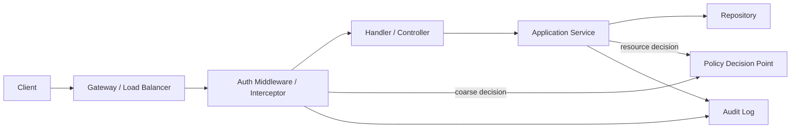
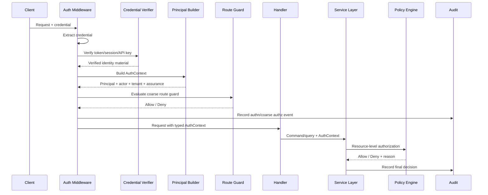
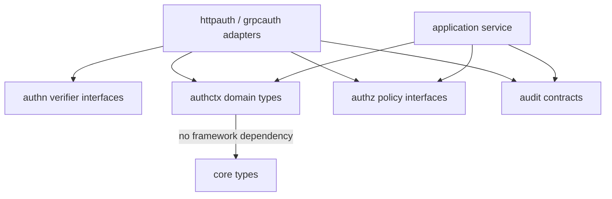
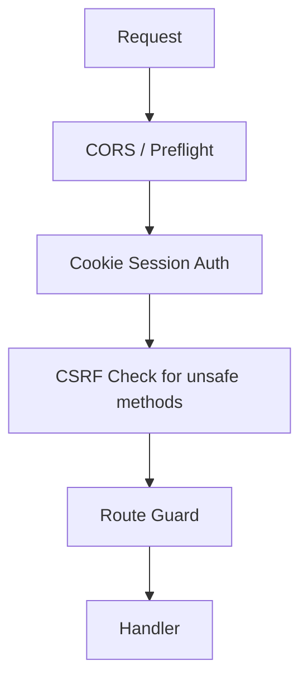
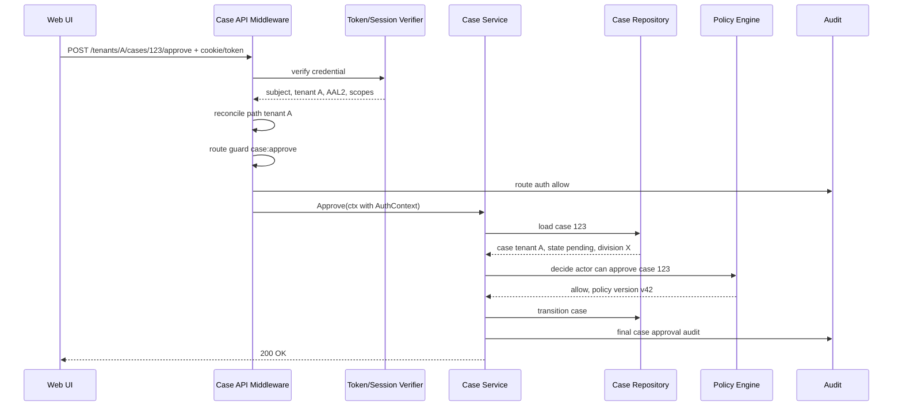

# learn-go-authentication-authorization-identity-permission-part-012.md

# Part 012 — Secure Auth Middleware di Go: `net/http`, chi, gin, gRPC Interceptor

> Seri: `learn-go-authentication-authorization-identity-permission`  
> Level: Advanced / internal engineering handbook  
> Target Go: Go 1.26.x  
> Fokus: secure auth middleware, PEP boundary, request identity propagation, typed context, HTTP/gRPC integration, error mapping, observability, dan failure-mode design  
> Status seri: **belum selesai** — ini adalah part 012 dari 035

---

## Daftar Isi

1. [Tujuan Part Ini](#1-tujuan-part-ini)
2. [Problem Sebenarnya: Middleware Sering Dijadikan Tempat Sampah Auth](#2-problem-sebenarnya-middleware-sering-dijadikan-tempat-sampah-auth)
3. [Baseline Fakta dan Sumber Primer](#3-baseline-fakta-dan-sumber-primer)
4. [Mental Model: Middleware sebagai Policy Enforcement Point](#4-mental-model-middleware-sebagai-policy-enforcement-point)
5. [Apa yang Boleh dan Tidak Boleh Dilakukan Middleware](#5-apa-yang-boleh-dan-tidak-boleh-dilakukan-middleware)
6. [Request Auth Pipeline](#6-request-auth-pipeline)
7. [Core Invariants](#7-core-invariants)
8. [Authentication Result vs Authorization Decision](#8-authentication-result-vs-authorization-decision)
9. [Error Taxonomy: 400, 401, 403, 404, 409, 429, 500, 503](#9-error-taxonomy-400-401-403-404-409-429-500-503)
10. [Package Architecture](#10-package-architecture)
11. [Domain Types untuk Auth Context](#11-domain-types-untuk-auth-context)
12. [Typed Context Key Pattern](#12-typed-context-key-pattern)
13. [Credential Extraction](#13-credential-extraction)
14. [Token Validation Boundary](#14-token-validation-boundary)
15. [Principal Construction](#15-principal-construction)
16. [Assurance dan Session Metadata dalam Middleware](#16-assurance-dan-session-metadata-dalam-middleware)
17. [`net/http` Middleware Baseline](#17-nethttp-middleware-baseline)
18. [Route Guard Pattern di `net/http`](#18-route-guard-pattern-di-nethttp)
19. [chi Integration](#19-chi-integration)
20. [gin Integration](#20-gin-integration)
21. [gRPC Unary Server Interceptor](#21-grpc-unary-server-interceptor)
22. [gRPC Stream Server Interceptor](#22-grpc-stream-server-interceptor)
23. [Middleware Chain Ordering](#23-middleware-chain-ordering)
24. [Optional Auth vs Required Auth](#24-optional-auth-vs-required-auth)
25. [Public Endpoint, Health Check, CORS Preflight, Metrics](#25-public-endpoint-health-check-cors-preflight-metrics)
26. [Route-Level vs Resource-Level Authorization](#26-route-level-vs-resource-level-authorization)
27. [Mapping HTTP Route ke Permission](#27-mapping-http-route-ke-permission)
28. [Mapping gRPC Method ke Permission](#28-mapping-grpc-method-ke-permission)
29. [Multi-Credential Strategy: Cookie, Bearer, API Key, mTLS](#29-multi-credential-strategy-cookie-bearer-api-key-mtls)
30. [Session Cookie Middleware dan CSRF Boundary](#30-session-cookie-middleware-dan-csrf-boundary)
31. [Context Propagation ke Downstream Service](#31-context-propagation-ke-downstream-service)
32. [Do Not Propagate Raw User Token Blindly](#32-do-not-propagate-raw-user-token-blindly)
33. [Observability Tanpa Membocorkan Secret](#33-observability-tanpa-membocorkan-secret)
34. [Audit Event dari Middleware](#34-audit-event-dari-middleware)
35. [Performance Engineering](#35-performance-engineering)
36. [Concurrency dan Cancellation](#36-concurrency-dan-cancellation)
37. [Testing Strategy](#37-testing-strategy)
38. [Failure Mode Matrix](#38-failure-mode-matrix)
39. [Security Checklist](#39-security-checklist)
40. [Anti-Pattern yang Harus Dihindari](#40-anti-pattern-yang-harus-dihindari)
41. [Case Study: Regulatory Case Management Multi-Tenant](#41-case-study-regulatory-case-management-multi-tenant)
42. [Reference Implementation Layout](#42-reference-implementation-layout)
43. [Latihan Desain](#43-latihan-desain)
44. [Ringkasan](#44-ringkasan)
45. [Referensi Primer](#45-referensi-primer)

---

## 1. Tujuan Part Ini

Part ini membahas **secure auth middleware** di Go.

Pada part sebelumnya kita sudah membahas session, JWT/JWKS, dan token lifecycle. Sekarang kita masuk ke tempat pertama di mana token/session/credential bertemu request nyata:

> middleware, handler boundary, router boundary, dan interceptor boundary.

Setelah menyelesaikan part ini, kamu harus bisa:

1. mendesain middleware yang memisahkan authentication, authorization, audit, observability, dan business logic;
2. membangun typed principal propagation memakai `context.Context` secara aman;
3. menerapkan auth middleware untuk `net/http`, chi, gin, unary gRPC, dan streaming gRPC;
4. membedakan optional auth, required auth, step-up auth, route guard, resource guard, dan service guard;
5. memetakan error auth ke HTTP/gRPC status yang benar;
6. menghindari token leak di log, metric, trace, panic, dan error response;
7. memahami chain ordering agar CORS, request ID, recovery, rate limit, authentication, authorization, CSRF, dan audit tidak saling merusak;
8. mendesain test strategy untuk bypass, malformed token, expired token, wrong audience, missing tenant, stale session, dan route misconfiguration;
9. membangun auth package yang bisa dipakai lintas service tanpa membawa framework dependency ke domain layer;
10. memahami kapan middleware cukup, dan kapan authorization harus tetap dilakukan di service/resource layer.

Part ini sengaja sangat praktis, tetapi tetap bukan tutorial framework dangkal. Targetnya adalah kemampuan desain middleware yang bisa bertahan di sistem enterprise: multi-tenant, federated identity, user session, machine identity, audit, policy-as-code, dan distributed service calls.

---

## 2. Problem Sebenarnya: Middleware Sering Dijadikan Tempat Sampah Auth

Banyak codebase Go memulai auth dengan pola seperti ini:

```go
func Auth(next http.Handler) http.Handler {
    return http.HandlerFunc(func(w http.ResponseWriter, r *http.Request) {
        token := strings.TrimPrefix(r.Header.Get("Authorization"), "Bearer ")
        claims, err := parseJWT(token)
        if err != nil {
            http.Error(w, "unauthorized", http.StatusUnauthorized)
            return
        }
        ctx := context.WithValue(r.Context(), "user", claims.UserID)
        next.ServeHTTP(w, r.WithContext(ctx))
    })
}
```

Untuk prototype, ini terlihat cukup. Untuk production, ini berbahaya karena:

- context key berupa string bisa bentrok;
- `claims` sering langsung dipercaya sebagai permission;
- tidak ada `issuer`, `audience`, `token_use`, `tenant`, `session`, dan `assurance` validation;
- tidak jelas error mana yang 401 dan mana yang 403;
- tidak ada audit decision;
- route bisa lupa dipasang middleware;
- authorization diletakkan terlalu awal tanpa resource context;
- middleware berubah menjadi tempat query database, policy evaluation, audit write, dan business rule;
- framework-specific context bocor ke domain layer;
- token mentah sering ikut ter-log;
- unit test handler menjadi sulit karena auth context tidak punya type stabil.

Middleware auth yang baik harus menjawab beberapa pertanyaan presisi:

1. Credential apa yang ada di request?
2. Credential itu berasal dari channel apa?
3. Credential itu valid menurut validator yang mana?
4. Siapa subject-nya?
5. Siapa actor-nya?
6. Tenant boundary apa yang berlaku?
7. Session/assurance/factor apa yang melekat?
8. Apakah request ini butuh authentication?
9. Apakah route ini butuh authorization awal?
10. Apakah resource-level authorization harus dilakukan nanti di service layer?
11. Apa yang harus dicatat untuk audit?
12. Apa yang aman untuk dimasukkan ke log/metric/trace?

Middleware bukan sekadar “decode token”. Middleware adalah **enforcement boundary**.

---

## 3. Baseline Fakta dan Sumber Primer

Beberapa baseline yang penting untuk part ini:

1. Go `context` membawa deadline, cancellation signal, dan request-scoped values lintas API boundary. Dokumentasi resmi Go menekankan bahwa context values hanya untuk data request-scoped yang melintasi process/API boundary, bukan untuk passing optional parameters.
2. `net/http` adalah baseline middleware paling fundamental di Go; framework seperti chi tetap kompatibel dengan `http.Handler`.
3. chi adalah router idiomatik dan composable untuk HTTP service di Go, dibangun di atas `context` untuk signaling, cancellation, dan request-scoped values di handler chain.
4. gin memiliki `gin.Context` sendiri dan menyediakan mekanisme `Abort`/`AbortWithStatusJSON` untuk menghentikan chain saat middleware gagal.
5. gRPC mendukung authentication credentials dan metadata; metadata dapat membawa authentication credentials seperti OAuth2/JWT melalui header `authorization`.
6. gRPC-Go menyediakan unary dan stream interceptor sebagai boundary untuk cross-cutting concern seperti authentication, authorization, logging, tracing, recovery, dan metrics.
7. OAuth/OIDC/JWT validation tetap harus mengikuti prinsip part 010 dan part 011: issuer, audience, algorithm, key, expiry, not-before, token type, subject, tenant, scope, session, dan revocation semantics.

Part ini tidak akan mengulang detail token validation atau refresh lifecycle. Kita akan menganggap sudah ada interface `TokenVerifier`, `SessionVerifier`, atau `CredentialVerifier` dari part sebelumnya.

---

## 4. Mental Model: Middleware sebagai Policy Enforcement Point

Dalam authorization architecture, ada beberapa komponen klasik:

- **PEP** — Policy Enforcement Point: tempat keputusan auth ditegakkan.
- **PDP** — Policy Decision Point: tempat keputusan dibuat.
- **PIP** — Policy Information Point: sumber attribute/fact.
- **PAP** — Policy Administration Point: tempat policy dikonfigurasi.

Middleware biasanya menjadi **PEP awal**.

Tapi ini penting:

> Middleware adalah PEP, bukan selalu PDP.

Artinya, middleware boleh menegakkan hasil keputusan, tetapi tidak selalu harus memuat seluruh logic keputusan.

Contoh:

- Middleware memvalidasi token dan menolak request tanpa credential valid.
- Middleware bisa menolak route `/admin/*` jika principal tidak punya role awal.
- Middleware bisa memastikan tenant claim ada.
- Middleware bisa memastikan assurance minimum untuk route tertentu.
- Tetapi middleware tidak selalu bisa memutuskan apakah user boleh membaca **case #123**, karena resource detail mungkin baru diketahui setelah query database.

Untuk resource-level authorization:

```text
HTTP middleware:
  - authenticate subject
  - construct principal
  - enforce coarse route guard

Service layer:
  - load resource
  - evaluate object-level policy
  - enforce final decision
```

Auth boundary yang benar biasanya berlapis:



Kunci mental model:

- Middleware membuat request menjadi **authenticated request**.
- Authorization final sering membutuhkan **resource context**.
- Middleware harus menghasilkan **identity context** yang stabil, typed, dan aman.
- Middleware tidak boleh menjadi domain service tersembunyi.

---

## 5. Apa yang Boleh dan Tidak Boleh Dilakukan Middleware

### Boleh dilakukan middleware

Middleware auth boleh:

- membaca credential dari header/cookie/mTLS peer/API key;
- melakukan syntactic validation credential;
- memanggil verifier/token validator/session store;
- membangun `Principal` atau `AuthContext` typed;
- menempelkan `AuthContext` ke `context.Context`;
- enforce authentication requirement;
- enforce coarse route-level permission;
- enforce assurance minimum;
- enforce tenant presence;
- menulis security audit event untuk deny/allow coarse;
- memasang safe attributes untuk log/trace;
- mengembalikan error standar.

### Tidak ideal dilakukan middleware

Middleware auth sebaiknya tidak:

- memuat seluruh business authorization;
- query resource detail besar untuk semua request;
- menulis business audit final tanpa resource decision;
- memanggil remote PDP untuk semua endpoint murah jika bisa didefer;
- memasukkan raw token ke context;
- memasukkan password/API key/secret ke log;
- memakai `context.WithValue` dengan key string;
- memutuskan permission hanya dari `role` claim tanpa policy layer;
- membuka akses karena validator/PDP timeout tanpa explicit degraded-mode policy;
- menyembunyikan failure sebagai 200 dengan error body;
- membuat handler bergantung pada gin/chi context di domain layer.

### Rule of thumb

```text
Middleware should answer:
  Can this request enter the application boundary?

Service/resource authorization should answer:
  Can this actor perform this action on this exact resource now?
```

---

## 6. Request Auth Pipeline

Pipeline ideal untuk request HTTP/gRPC:



Pipeline ini memisahkan tiga kelas pekerjaan:

1. **Credential verification** — apakah credential valid?
2. **Principal construction** — siapa actor/subject/request authority?
3. **Policy enforcement** — apakah request boleh lanjut?

Ketiganya tidak boleh dicampur sembarangan.

---

## 7. Core Invariants

Middleware auth harus menjaga invariants berikut:

### Invariant 1 — Fail closed by default

Jika credential dibutuhkan tetapi tidak ada/invalid, request harus ditolak.

Tidak boleh ada fallback diam-diam ke anonymous untuk route yang protected.

### Invariant 2 — Authentication result bukan authorization

Token valid hanya berarti token valid. Itu belum berarti user boleh melakukan action.

### Invariant 3 — Raw credential tidak boleh masuk context domain

Context untuk domain boleh membawa `Principal`, `Actor`, `Tenant`, `SessionID`, `Assurance`, dan `TraceID`, tetapi tidak membawa access token mentah kecuali ada alasan eksplisit dan boundary yang aman.

### Invariant 4 — Error response tidak boleh membantu attacker

Response ke client harus cukup informatif untuk client benar, tetapi tidak memberi sinyal berlebihan untuk enumeration, brute force, atau token probing.

### Invariant 5 — Principal harus typed dan immutable

Handler dan service harus menerima identity context yang typed, tidak berupa `map[string]any` atau raw JWT claims.

### Invariant 6 — Tenant boundary harus eksplisit

Jika sistem multi-tenant, tenant tidak boleh diambil dari path saja atau claim saja tanpa reconciliation. Path tenant, token tenant, session tenant, dan resource tenant harus konsisten.

### Invariant 7 — Coarse authorization bukan pengganti resource authorization

Route guard tidak cukup untuk object-level access control.

### Invariant 8 — Middleware order adalah bagian dari security design

Salah urutan middleware dapat menciptakan bypass, token leak, atau audit gap.

### Invariant 9 — Cancellation harus dihormati

Verifier/PDP call harus memakai request context dan timeout agar auth layer tidak membuat request menggantung.

### Invariant 10 — Audit harus bisa merekonstruksi keputusan

Untuk deny/allow penting, audit harus punya actor, subject, tenant, route/method, required auth level, actual auth level, reason, correlation ID, dan timestamp.

---

## 8. Authentication Result vs Authorization Decision

Jangan memakai satu struct untuk semua hal.

Authentication result:

```go
type AuthenticationResult struct {
    Scheme       string
    SubjectID    string
    ActorID      string
    TenantID     string
    SessionID    string
    ClientID     string
    Scopes       []string
    TokenID      string
    Issuer       string
    Audience     []string
    AuthTime     time.Time
    AuthMethods  []string
    Assurance    AssuranceLevel
    ExpiresAt    time.Time
}
```

Authorization decision:

```go
type AuthorizationDecision struct {
    Allowed      bool
    ReasonCode   string
    PolicyID     string
    PolicyVersion string
    Obligations  []Obligation
}
```

Principal:

```go
type Principal struct {
    SubjectID SubjectID
    ActorID   ActorID
    TenantID  TenantID
    AccountID AccountID
    Kind      PrincipalKind
}
```

Auth context:

```go
type AuthContext struct {
    Principal   Principal
    Session     SessionInfo
    Client      ClientInfo
    Assurance   AssuranceInfo
    Grants      GrantSnapshot
    Source      CredentialSource
    RequestTime time.Time
}
```

Design ini membuat boundary jelas:

- verifier menghasilkan authentication result;
- builder menghasilkan auth context;
- policy engine menghasilkan authorization decision;
- middleware menegakkan requirement awal.

---

## 9. Error Taxonomy: 400, 401, 403, 404, 409, 429, 500, 503

Auth error mapping harus konsisten.

| Kondisi | HTTP | gRPC | Catatan |
|---|---:|---|---|
| Credential tidak ada pada protected route | 401 | `Unauthenticated` | Include `WWW-Authenticate` untuk Bearer jika cocok |
| Credential malformed | 401 atau 400 | `Unauthenticated` atau `InvalidArgument` | Untuk bearer token, biasanya 401 |
| Token expired | 401 | `Unauthenticated` | Client perlu reauth/refresh |
| Token signature invalid | 401 | `Unauthenticated` | Jangan bedakan terlalu detail ke client |
| Wrong issuer/audience | 401 | `Unauthenticated` | Security log detail internal |
| Authenticated tapi tidak punya izin | 403 | `PermissionDenied` | Jangan minta login ulang |
| Resource tidak boleh diketahui eksistensinya | 404 | `NotFound` | IDOR/BOLA mitigation |
| Step-up required | 403 atau 401 + challenge semantics | `PermissionDenied` dengan detail | Bergantung protokol app |
| Rate limited login/token probing | 429 | `ResourceExhausted` | Jangan bocorkan existence |
| Conflict session/tenant/state | 409 | `FailedPrecondition` | Misal tenant mismatch pada command |
| Token store/JWKS/PDP outage | 503 atau 500 | `Unavailable` | Jangan fail-open kecuali explicit policy |
| Internal bug/panic | 500 | `Internal` | Recovery middleware harus aman |

Prinsip:

- **401** berarti client belum authenticated secara valid.
- **403** berarti client sudah dikenal, tetapi tidak memiliki authority untuk action.
- **404** bisa dipakai untuk menyembunyikan resource existence saat policy membutuhkan.
- **503** lebih jujur untuk dependency auth outage daripada membiarkan request lewat.

Untuk OAuth Bearer, response 401 sering memakai header:

```text
WWW-Authenticate: Bearer error="invalid_token"
```

Tetapi jangan mengirim detail internal seperti `kid not found`, `issuer mismatch`, `signature invalid`, atau `database timeout` ke client umum.

---

## 10. Package Architecture

Package layout yang sehat:

```text
/internal/authn/
  verifier.go          # token/session/api-key verification interface
  bearer.go            # bearer extractor/verifier adapter
  cookie.go            # session cookie adapter
  apikey.go            # api key adapter
  mtls.go              # client cert extraction

/internal/authctx/
  context.go           # typed context helpers
  principal.go         # principal/auth context model
  assurance.go         # assurance model

/internal/authz/
  policy.go            # PDP interface
  decision.go          # decision model
  requirement.go       # route/action requirements

/internal/httpauth/
  middleware.go        # net/http middleware
  chi.go               # chi-specific route helpers if needed
  gin.go               # gin adapter
  errors.go            # HTTP error mapping

/internal/grpcauth/
  unary.go             # unary interceptor
  stream.go            # stream interceptor
  metadata.go          # metadata extraction
  errors.go            # gRPC status mapping

/internal/audit/
  auth_events.go       # authn/authz audit event contracts
```

Dependency direction:



Hal penting:

- `authctx` tidak boleh import gin, chi, grpc, atau net/http.
- `application service` tidak boleh menerima `*gin.Context` atau `http.ResponseWriter`.
- `authn` dan `authz` interface sebaiknya framework-neutral.
- Adapter framework hanya menerjemahkan request/metadata menjadi `AuthContext`.

---

## 11. Domain Types untuk Auth Context

Gunakan strong-ish domain types untuk mengurangi string mix-up.

```go
package authctx

import "time"

type SubjectID string
type ActorID string
type AccountID string
type TenantID string
type SessionID string
type ClientID string
type TokenID string

type PrincipalKind string

const (
    PrincipalHuman   PrincipalKind = "human"
    PrincipalService PrincipalKind = "service"
    PrincipalSystem  PrincipalKind = "system"
    PrincipalAnonymous PrincipalKind = "anonymous"
)

type Principal struct {
    SubjectID SubjectID
    ActorID   ActorID
    AccountID AccountID
    TenantID  TenantID
    Kind      PrincipalKind
}

type AssuranceInfo struct {
    IAL       int
    AAL       int
    FAL       int
    AuthTime  time.Time
    Methods   []string
    StepUpAt  *time.Time
}

type SessionInfo struct {
    ID              SessionID
    CreatedAt       time.Time
    LastAuthenticatedAt time.Time
    ExpiresAt       time.Time
    IdleExpiresAt   time.Time
    DeviceID        string
}

type CredentialSource string

const (
    SourceBearerToken CredentialSource = "bearer_token"
    SourceCookieSession CredentialSource = "cookie_session"
    SourceAPIKey CredentialSource = "api_key"
    SourceMTLS CredentialSource = "mtls"
)

type AuthContext struct {
    Principal Principal
    Assurance AssuranceInfo
    Session   *SessionInfo
    ClientID  ClientID
    TokenID   TokenID
    Source    CredentialSource
    Scopes    []string
    Roles     []string
    Issuer    string
    Audience  []string
    RequestAt time.Time
}

func (a AuthContext) IsAuthenticated() bool {
    return a.Principal.Kind != PrincipalAnonymous && a.Principal.SubjectID != ""
}
```

Kenapa tidak langsung pakai JWT claims?

Karena claims adalah format transport. Domain butuh model stabil.

JWT claims bisa berubah tergantung IdP, client, scope, atau version. `AuthContext` adalah kontrak internal service.

---

## 12. Typed Context Key Pattern

Go `context.Context` boleh membawa request-scoped value. Namun harus hati-hati.

Anti-pattern:

```go
ctx = context.WithValue(ctx, "user", userID)
```

Masalah:

- key string bisa bentrok dengan package lain;
- caller harus type assert manual;
- misspelling tidak terdeteksi;
- domain menjadi rapuh.

Pattern yang lebih aman:

```go
package authctx

import "context"

type authContextKey struct{}

func WithAuth(ctx context.Context, auth AuthContext) context.Context {
    return context.WithValue(ctx, authContextKey{}, auth)
}

func FromContext(ctx context.Context) (AuthContext, bool) {
    v := ctx.Value(authContextKey{})
    if v == nil {
        return AuthContext{}, false
    }
    auth, ok := v.(AuthContext)
    return auth, ok
}

func MustFromContext(ctx context.Context) AuthContext {
    auth, ok := FromContext(ctx)
    if !ok {
        panic("auth context missing")
    }
    return auth
}
```

Namun hati-hati dengan `MustFromContext`:

- boleh dipakai di internal handler yang secara kontrak protected;
- jangan dipakai di library umum;
- lebih baik handler mengembalikan 500/403 terkontrol daripada panic liar;
- recovery middleware tetap harus ada.

Pattern tambahan untuk optional auth:

```go
func Anonymous(requestAt time.Time) AuthContext {
    return AuthContext{
        Principal: Principal{Kind: PrincipalAnonymous},
        RequestAt: requestAt,
    }
}
```

Jangan memakai context sebagai dependency injection container.

Bagus:

```go
func (s *CaseService) Approve(ctx context.Context, cmd ApproveCaseCommand) error {
    auth, ok := authctx.FromContext(ctx)
    if !ok { return ErrUnauthenticated }
    // use auth as request-scoped identity
}
```

Buruk:

```go
func (s *CaseService) Approve(ctx context.Context, cmd ApproveCaseCommand) error {
    db := ctx.Value("db").(*sql.DB)
    logger := ctx.Value("logger").(*zap.Logger)
    policy := ctx.Value("policy").(PolicyEngine)
}
```

---

## 13. Credential Extraction

Credential extraction harus terpisah dari verification.

Extractor menjawab:

> Credential apa yang disediakan request?

Verifier menjawab:

> Credential itu valid dan mewakili siapa?

```go
type CredentialKind string

const (
    CredentialBearer CredentialKind = "bearer"
    CredentialCookie  CredentialKind = "cookie"
    CredentialAPIKey  CredentialKind = "api_key"
    CredentialMTLS    CredentialKind = "mtls"
)

type Credential struct {
    Kind   CredentialKind
    Value  string
    // SafeFingerprint bukan secret; untuk log/debug internal.
    SafeFingerprint string
}

type Extractor interface {
    ExtractHTTP(r *http.Request) (Credential, bool, error)
}
```

Bearer extractor:

```go
type BearerExtractor struct{}

func (BearerExtractor) ExtractHTTP(r *http.Request) (Credential, bool, error) {
    h := r.Header.Get("Authorization")
    if h == "" {
        return Credential{}, false, nil
    }

    parts := strings.SplitN(h, " ", 2)
    if len(parts) != 2 || !strings.EqualFold(parts[0], "Bearer") || strings.TrimSpace(parts[1]) == "" {
        return Credential{}, true, ErrMalformedCredential
    }

    token := strings.TrimSpace(parts[1])
    return Credential{
        Kind:  CredentialBearer,
        Value: token,
        SafeFingerprint: fingerprintSecret(token),
    }, true, nil
}
```

Fingerprint secret harus irreversible:

```go
func fingerprintSecret(secret string) string {
    sum := sha256.Sum256([]byte(secret))
    return hex.EncodeToString(sum[:8]) // short safe-ish identifier, not enough to recover secret
}
```

Catatan penting:

- Jangan log `Credential.Value`.
- Jangan masukkan credential mentah ke context kecuali adapter downstream memang membutuhkannya dan ada threat model.
- Jangan menerima lebih dari satu credential secara ambigu tanpa strategy eksplisit.

### Ambiguous credential

Apa yang terjadi jika request membawa cookie session dan bearer token sekaligus?

Pilihan:

1. reject sebagai ambiguous;
2. prefer bearer untuk API route;
3. prefer cookie untuk browser route;
4. pakai route metadata untuk menentukan allowed schemes.

Yang buruk adalah menerima keduanya diam-diam dan memilih random.

```go
type CredentialPolicy struct {
    AllowedKinds []CredentialKind
    AmbiguousMode AmbiguousMode
}

type AmbiguousMode string

const (
    AmbiguousReject AmbiguousMode = "reject"
    AmbiguousPreferBearer AmbiguousMode = "prefer_bearer"
    AmbiguousPreferCookie AmbiguousMode = "prefer_cookie"
)
```

---

## 14. Token Validation Boundary

Middleware tidak boleh tahu detail `kid`, JWKS cache, issuer discovery, token family, replay detection, atau introspection. Itu tugas verifier.

Interface:

```go
type Verifier interface {
    Verify(ctx context.Context, cred Credential, req VerificationRequest) (AuthenticationResult, error)
}

type VerificationRequest struct {
    ExpectedAudience string
    ExpectedIssuer   string
    RouteID          string
    TenantHint       string
    ClientIP         string
    UserAgent        string
    Now              time.Time
}
```

Verifier bisa melakukan:

- JWT validation;
- opaque token introspection;
- session store lookup;
- API key hash lookup;
- mTLS cert mapping;
- revocation check;
- assurance extraction;
- session freshness check.

Middleware hanya memanggil:

```go
result, err := verifier.Verify(r.Context(), cred, VerificationRequest{...})
```

Keuntungan:

- middleware tetap tipis;
- validator bisa dites terpisah;
- verifier bisa diganti antara JWT lokal dan introspection remote;
- route/framework tidak terikat ke JOSE library tertentu;
- auth logic bisa dipakai di HTTP dan gRPC.

---

## 15. Principal Construction

Authentication result belum tentu sama dengan principal internal.

Contoh OIDC claim:

```json
{
  "iss": "https://idp.example.gov",
  "sub": "24400320",
  "aud": "case-api",
  "tenant_id": "agency-a",
  "client_id": "web-portal",
  "amr": ["pwd", "otp"],
  "auth_time": 1782294000
}
```

Principal internal:

```go
Principal{
    SubjectID: "subj_01H...", // internal stable subject
    ActorID:   "actor_01H...", // may differ for impersonation/delegation
    AccountID: "acct_01H...",
    TenantID:  "tenant_agency_a",
    Kind:      PrincipalHuman,
}
```

Kenapa perlu mapping?

- `sub` external dari IdP bisa pairwise;
- user bisa punya beberapa external identities;
- tenant internal tidak selalu sama dengan claim string;
- service identity berbeda dari human identity;
- impersonation butuh actor/subject separation;
- audit butuh stable internal ID.

Principal builder:

```go
type PrincipalBuilder interface {
    Build(ctx context.Context, result AuthenticationResult) (authctx.AuthContext, error)
}
```

Builder bisa melakukan:

- account lookup;
- external identity mapping;
- tenant normalization;
- disabled account check;
- required status check;
- actor/subject derivation;
- grant snapshot loading;
- assurance normalization.

Tetapi hati-hati:

- jangan query terlalu banyak di middleware;
- gunakan cache dengan staleness policy jelas;
- untuk route murah/health, jangan build principal;
- untuk resource-level role, bisa defer ke service layer.

---

## 16. Assurance dan Session Metadata dalam Middleware

Middleware harus membawa assurance metadata karena banyak route butuh minimum AAL/freshness.

Contoh route requirement:

```go
type RouteRequirement struct {
    AuthRequired bool
    MinAAL       int
    MaxAuthAge   time.Duration
    RequiredScopes []string
    RequiredRoles  []string
    TenantRequired bool
}
```

Evaluator:

```go
func CheckRequirement(auth authctx.AuthContext, req RouteRequirement, now time.Time) error {
    if req.AuthRequired && !auth.IsAuthenticated() {
        return ErrUnauthenticated
    }
    if req.TenantRequired && auth.Principal.TenantID == "" {
        return ErrTenantRequired
    }
    if req.MinAAL > 0 && auth.Assurance.AAL < req.MinAAL {
        return ErrStepUpRequired
    }
    if req.MaxAuthAge > 0 && now.Sub(auth.Assurance.AuthTime) > req.MaxAuthAge {
        return ErrReauthenticationRequired
    }
    for _, scope := range req.RequiredScopes {
        if !contains(auth.Scopes, scope) {
            return ErrForbidden
        }
    }
    return nil
}
```

Jangan mengubah `AAL` menjadi permission.

AAL hanya menjawab seberapa kuat authentication-nya. Permission tetap policy.

---

## 17. `net/http` Middleware Baseline

Baseline middleware `net/http`:

```go
type AuthMiddleware struct {
    Extractor  Extractor
    Verifier   Verifier
    Builder    PrincipalBuilder
    Auditor    AuthAuditor
    Clock      Clock
    Requirement RouteRequirement
}

func (m AuthMiddleware) Wrap(next http.Handler) http.Handler {
    return http.HandlerFunc(func(w http.ResponseWriter, r *http.Request) {
        now := m.Clock.Now()

        cred, present, err := m.Extractor.ExtractHTTP(r)
        if err != nil {
            m.writeAuthError(w, r, ErrUnauthenticated)
            return
        }

        if !present {
            if m.Requirement.AuthRequired {
                m.auditDeny(r, "missing_credential")
                m.writeAuthError(w, r, ErrUnauthenticated)
                return
            }
            ctx := authctx.WithAuth(r.Context(), authctx.Anonymous(now))
            next.ServeHTTP(w, r.WithContext(ctx))
            return
        }

        result, err := m.Verifier.Verify(r.Context(), cred, VerificationRequest{
            RouteID:  routeID(r),
            ClientIP: clientIP(r),
            UserAgent: r.UserAgent(),
            Now: now,
        })
        if err != nil {
            m.auditDeny(r, safeAuthErrorCode(err))
            m.writeAuthError(w, r, mapAuthError(err))
            return
        }

        auth, err := m.Builder.Build(r.Context(), result)
        if err != nil {
            m.auditDeny(r, safeAuthErrorCode(err))
            m.writeAuthError(w, r, mapAuthError(err))
            return
        }

        if err := CheckRequirement(auth, m.Requirement, now); err != nil {
            m.auditDenyWithAuth(r, auth, safeAuthErrorCode(err))
            m.writeAuthError(w, r, mapAuthError(err))
            return
        }

        m.auditAllow(r, auth)
        ctx := authctx.WithAuth(r.Context(), auth)
        next.ServeHTTP(w, r.WithContext(ctx))
    })
}
```

Hal penting:

- `r.WithContext(ctx)` membuat shallow copy request dengan context baru;
- jangan modify request global shared state;
- credential extraction sebelum verification;
- verification memakai `r.Context()` agar cancellation/timeouts respected;
- audit deny jangan menulis token;
- handler berikutnya hanya melihat `AuthContext`, bukan token mentah.

HTTP error writer:

```go
func writeJSONAuthError(w http.ResponseWriter, status int, code string) {
    w.Header().Set("Content-Type", "application/json")
    if status == http.StatusUnauthorized {
        w.Header().Set("WWW-Authenticate", `Bearer error="invalid_token"`)
    }
    w.WriteHeader(status)
    _ = json.NewEncoder(w).Encode(map[string]string{
        "error": code,
    })
}
```

Jangan:

```go
json.NewEncoder(w).Encode(map[string]string{
    "error": err.Error(), // mungkin bocor detail internal
})
```

---

## 18. Route Guard Pattern di `net/http`

Untuk route-level authorization, gunakan wrapper composable.

```go
type Guard struct {
    Policy RoutePolicy
    Clock  Clock
}

func (g Guard) Require(req RouteRequirement, next http.Handler) http.Handler {
    return http.HandlerFunc(func(w http.ResponseWriter, r *http.Request) {
        auth, ok := authctx.FromContext(r.Context())
        if !ok || !auth.IsAuthenticated() {
            writeJSONAuthError(w, http.StatusUnauthorized, "unauthenticated")
            return
        }
        if err := CheckRequirement(auth, req, g.Clock.Now()); err != nil {
            writeJSONAuthError(w, statusForAuthError(err), publicCode(err))
            return
        }
        next.ServeHTTP(w, r)
    })
}
```

Registration:

```go
mux := http.NewServeMux()

protected := authMiddleware.Wrap
adminGuard := guard.Require(RouteRequirement{
    AuthRequired: true,
    MinAAL: 2,
    RequiredScopes: []string{"case:admin"},
    TenantRequired: true,
}, http.HandlerFunc(adminHandler))

mux.Handle("/admin/cases", protected(adminGuard))
```

Masalah dengan manual wrapping:

- route bisa lupa protected;
- requirement tersebar;
- sulit audit route table;
- sulit generate docs.

Solusi untuk sistem besar:

- route registration DSL;
- central route manifest;
- startup validation;
- test yang memastikan protected route punya requirement.

Contoh route manifest:

```go
type RouteSpec struct {
    Method string
    Path string
    Handler http.Handler
    Requirement RouteRequirement
}
```

---

## 19. chi Integration

chi tetap memakai `http.Handler`, jadi middleware net/http bisa langsung dipakai.

```go
r := chi.NewRouter()
r.Use(requestIDMiddleware)
r.Use(recovererMiddleware)
r.Use(loggingMiddleware)

r.Group(func(r chi.Router) {
    r.Use(authMiddleware.Wrap)

    r.With(require(RouteRequirement{
        AuthRequired: true,
        TenantRequired: true,
        RequiredScopes: []string{"case:read"},
    })).Get("/tenants/{tenantID}/cases/{caseID}", getCaseHandler)

    r.With(require(RouteRequirement{
        AuthRequired: true,
        TenantRequired: true,
        MinAAL: 2,
        RequiredScopes: []string{"case:approve"},
    })).Post("/tenants/{tenantID}/cases/{caseID}/approve", approveCaseHandler)
})
```

`require` middleware:

```go
func require(req RouteRequirement) func(http.Handler) http.Handler {
    return func(next http.Handler) http.Handler {
        return http.HandlerFunc(func(w http.ResponseWriter, r *http.Request) {
            auth, ok := authctx.FromContext(r.Context())
            if !ok || !auth.IsAuthenticated() {
                writeJSONAuthError(w, http.StatusUnauthorized, "unauthenticated")
                return
            }
            if err := CheckRequirement(auth, req, time.Now()); err != nil {
                writeJSONAuthError(w, statusForAuthError(err), publicCode(err))
                return
            }
            next.ServeHTTP(w, r)
        })
    }
}
```

Tenant reconciliation:

```go
func tenantReconcile(next http.Handler) http.Handler {
    return http.HandlerFunc(func(w http.ResponseWriter, r *http.Request) {
        auth, ok := authctx.FromContext(r.Context())
        if !ok {
            writeJSONAuthError(w, http.StatusUnauthorized, "unauthenticated")
            return
        }

        pathTenant := chi.URLParam(r, "tenantID")
        if pathTenant == "" {
            writeJSONAuthError(w, http.StatusBadRequest, "tenant_required")
            return
        }
        if string(auth.Principal.TenantID) != normalizeTenant(pathTenant) {
            // 404 can be used if tenant existence should not be revealed.
            writeJSONAuthError(w, http.StatusNotFound, "not_found")
            return
        }
        next.ServeHTTP(w, r)
    })
}
```

Hal yang perlu dijaga dengan chi:

- middleware group harus jelas;
- jangan menaruh protected route di luar group;
- route-specific middleware lebih baik daripada handler manual check;
- gunakan route tests untuk memastikan semua sensitive route punya guard.

---

## 20. gin Integration

gin memakai `gin.Context`, tetapi domain service tetap harus menerima `context.Context` atau explicit `AuthContext`, bukan `*gin.Context`.

Gin middleware:

```go
func GinAuth(m AuthMiddlewareCore) gin.HandlerFunc {
    return func(c *gin.Context) {
        r := c.Request
        now := m.Clock.Now()

        cred, present, err := m.Extractor.ExtractHTTP(r)
        if err != nil {
            c.AbortWithStatusJSON(http.StatusUnauthorized, gin.H{"error": "unauthenticated"})
            return
        }

        if !present {
            if m.Requirement.AuthRequired {
                c.AbortWithStatusJSON(http.StatusUnauthorized, gin.H{"error": "unauthenticated"})
                return
            }
            ctx := authctx.WithAuth(r.Context(), authctx.Anonymous(now))
            c.Request = r.WithContext(ctx)
            c.Next()
            return
        }

        result, err := m.Verifier.Verify(r.Context(), cred, VerificationRequest{Now: now})
        if err != nil {
            c.AbortWithStatusJSON(statusForAuthError(err), gin.H{"error": publicCode(err)})
            return
        }

        auth, err := m.Builder.Build(r.Context(), result)
        if err != nil {
            c.AbortWithStatusJSON(statusForAuthError(err), gin.H{"error": publicCode(err)})
            return
        }

        if err := CheckRequirement(auth, m.Requirement, now); err != nil {
            c.AbortWithStatusJSON(statusForAuthError(err), gin.H{"error": publicCode(err)})
            return
        }

        ctx := authctx.WithAuth(r.Context(), auth)
        c.Request = r.WithContext(ctx)

        // Optional: gin-local cache for ergonomics, not domain boundary.
        c.Set("auth", auth)

        c.Next()
    }
}
```

Handler:

```go
func (h *CaseHandler) Approve(c *gin.Context) {
    auth, ok := authctx.FromContext(c.Request.Context())
    if !ok {
        c.JSON(http.StatusInternalServerError, gin.H{"error": "auth_context_missing"})
        return
    }

    cmd := ApproveCaseCommand{
        TenantID: c.Param("tenantID"),
        CaseID: c.Param("caseID"),
    }

    if err := h.Service.Approve(c.Request.Context(), auth, cmd); err != nil {
        writeGinAppError(c, err)
        return
    }

    c.JSON(http.StatusOK, gin.H{"status": "approved"})
}
```

Hal penting dengan gin:

- `c.Abort()` menghentikan handler berikutnya dalam chain;
- jangan lupa `return` setelah `AbortWithStatusJSON`;
- jangan gunakan `gin.Context` di service/domain;
- `c.Set("auth", auth)` boleh untuk adapter convenience, tetapi canonical source tetap `c.Request.Context()`;
- middleware harus mengganti `c.Request` dengan request yang membawa context baru.

Anti-pattern gin:

```go
func (s *CaseService) Approve(c *gin.Context) error {
    user := c.GetString("user")
    // domain now depends on web framework
}
```

---

## 21. gRPC Unary Server Interceptor

Untuk gRPC, credential biasanya masuk via metadata.

Extractor metadata:

```go
func bearerFromIncomingMetadata(ctx context.Context) (Credential, bool, error) {
    md, ok := metadata.FromIncomingContext(ctx)
    if !ok {
        return Credential{}, false, nil
    }

    values := md.Get("authorization")
    if len(values) == 0 {
        return Credential{}, false, nil
    }
    if len(values) > 1 {
        return Credential{}, true, ErrMalformedCredential
    }

    h := values[0]
    parts := strings.SplitN(h, " ", 2)
    if len(parts) != 2 || !strings.EqualFold(parts[0], "Bearer") {
        return Credential{}, true, ErrMalformedCredential
    }

    token := strings.TrimSpace(parts[1])
    if token == "" {
        return Credential{}, true, ErrMalformedCredential
    }
    return Credential{Kind: CredentialBearer, Value: token, SafeFingerprint: fingerprintSecret(token)}, true, nil
}
```

Unary interceptor:

```go
func UnaryAuthInterceptor(m GRPCAuthCore) grpc.UnaryServerInterceptor {
    return func(
        ctx context.Context,
        req any,
        info *grpc.UnaryServerInfo,
        handler grpc.UnaryHandler,
    ) (any, error) {
        now := m.Clock.Now()
        requirement := m.RequirementForMethod(info.FullMethod)

        cred, present, err := bearerFromIncomingMetadata(ctx)
        if err != nil {
            return nil, status.Error(codes.Unauthenticated, "unauthenticated")
        }

        if !present {
            if requirement.AuthRequired {
                return nil, status.Error(codes.Unauthenticated, "unauthenticated")
            }
            ctx = authctx.WithAuth(ctx, authctx.Anonymous(now))
            return handler(ctx, req)
        }

        result, err := m.Verifier.Verify(ctx, cred, VerificationRequest{
            RouteID: info.FullMethod,
            Now: now,
        })
        if err != nil {
            return nil, grpcAuthError(err)
        }

        auth, err := m.Builder.Build(ctx, result)
        if err != nil {
            return nil, grpcAuthError(err)
        }

        if err := CheckRequirement(auth, requirement, now); err != nil {
            return nil, grpcAuthError(err)
        }

        ctx = authctx.WithAuth(ctx, auth)
        return handler(ctx, req)
    }
}
```

gRPC error mapping:

```go
func grpcAuthError(err error) error {
    switch {
    case errors.Is(err, ErrUnauthenticated), errors.Is(err, ErrMalformedCredential), errors.Is(err, ErrExpiredToken):
        return status.Error(codes.Unauthenticated, "unauthenticated")
    case errors.Is(err, ErrForbidden), errors.Is(err, ErrStepUpRequired):
        return status.Error(codes.PermissionDenied, "permission_denied")
    case errors.Is(err, ErrRateLimited):
        return status.Error(codes.ResourceExhausted, "rate_limited")
    case errors.Is(err, ErrAuthDependencyUnavailable):
        return status.Error(codes.Unavailable, "auth_unavailable")
    default:
        return status.Error(codes.Internal, "internal")
    }
}
```

Perhatikan:

- `info.FullMethod` berformat seperti `/package.Service/Method`;
- requirement bisa di-map dari method manifest;
- jangan mengevaluasi object-level permission di interceptor kecuali request berisi semua resource attributes dan threat model jelas;
- untuk streaming, problem lebih kompleks karena context harus dibungkus.

---

## 22. gRPC Stream Server Interceptor

Stream interceptor harus membungkus `ServerStream` agar context yang membawa `AuthContext` bisa terlihat handler.

Wrapper:

```go
type wrappedServerStream struct {
    grpc.ServerStream
    ctx context.Context
}

func (w *wrappedServerStream) Context() context.Context {
    return w.ctx
}
```

Interceptor:

```go
func StreamAuthInterceptor(m GRPCAuthCore) grpc.StreamServerInterceptor {
    return func(
        srv any,
        stream grpc.ServerStream,
        info *grpc.StreamServerInfo,
        handler grpc.StreamHandler,
    ) error {
        ctx := stream.Context()
        now := m.Clock.Now()
        requirement := m.RequirementForMethod(info.FullMethod)

        cred, present, err := bearerFromIncomingMetadata(ctx)
        if err != nil {
            return status.Error(codes.Unauthenticated, "unauthenticated")
        }

        if !present {
            if requirement.AuthRequired {
                return status.Error(codes.Unauthenticated, "unauthenticated")
            }
            wrapped := &wrappedServerStream{
                ServerStream: stream,
                ctx: authctx.WithAuth(ctx, authctx.Anonymous(now)),
            }
            return handler(srv, wrapped)
        }

        result, err := m.Verifier.Verify(ctx, cred, VerificationRequest{
            RouteID: info.FullMethod,
            Now: now,
        })
        if err != nil {
            return grpcAuthError(err)
        }

        auth, err := m.Builder.Build(ctx, result)
        if err != nil {
            return grpcAuthError(err)
        }

        if err := CheckRequirement(auth, requirement, now); err != nil {
            return grpcAuthError(err)
        }

        wrapped := &wrappedServerStream{
            ServerStream: stream,
            ctx: authctx.WithAuth(ctx, auth),
        }
        return handler(srv, wrapped)
    }
}
```

Streaming-specific risk:

- stream bisa berlangsung lama melebihi token expiry;
- permission bisa berubah saat stream aktif;
- tenant context harus tetap konsisten;
- bidirectional stream bisa menerima banyak command dalam satu authenticated stream;
- step-up di tengah stream sulit;
- cancellation harus dihormati.

Untuk long-lived stream, ada beberapa strategy:

1. validasi credential hanya saat stream dibuka;
2. batasi max stream duration;
3. lakukan periodic revalidation;
4. enforce per-message authorization;
5. gunakan server-side session state;
6. gunakan short-lived internal stream capability.

Untuk enterprise system, jangan menganggap satu auth check di awal stream cukup untuk semua message jika stream membawa action berbeda.

---

## 23. Middleware Chain Ordering

Urutan middleware adalah security-sensitive.

Rekomendasi HTTP chain umum:

```text
1. panic recovery
2. request size limit
3. request ID / correlation ID
4. remote address normalization / trusted proxy
5. timeout
6. basic security headers
7. CORS / preflight handling
8. rate limiting / abuse throttling
9. authentication
10. CSRF check for cookie-auth unsafe methods
11. route-level authorization / assurance guard
12. audit start / final audit
13. handler
14. response logging / metrics
```

Kenapa recovery di awal?

- agar panic dari auth middleware tidak bocor;
- agar response tetap aman.

Kenapa request ID sebelum auth?

- agar auth error bisa dikorelasikan.

Kenapa trusted proxy sebelum rate limit/auth?

- agar client IP benar.

Kenapa CORS/preflight sebelum auth?

- browser preflight `OPTIONS` sering tidak membawa auth credential;
- protected API bisa tetap membutuhkan CORS preflight response.

Kenapa CSRF setelah authentication?

- CSRF biasanya berlaku untuk cookie-authenticated state-changing request;
- perlu tahu scheme/session.

Kenapa authorization setelah authentication?

- policy butuh principal.

gRPC chain umum:

```text
1. recovery
2. request/trace ID
3. timeout/deadline enforcement
4. authentication
5. authorization / method requirement
6. validation
7. audit/metrics/logging
8. handler
```

Jika memakai interceptor chaining, pastikan urutan eksplisit dan dites.

---

## 24. Optional Auth vs Required Auth

Tidak semua route butuh auth, tetapi beberapa route mendapat behavior berbeda jika user authenticated.

Contoh:

- public article list: optional auth untuk personalization;
- login endpoint: no existing auth required;
- logout endpoint: auth optional atau required tergantung design;
- password reset endpoint: no login required tetapi rate-limited;
- case detail: auth required;
- approve case: auth required + AAL2 + permission.

Model:

```go
type AuthMode string

const (
    AuthNone     AuthMode = "none"
    AuthOptional AuthMode = "optional"
    AuthRequired AuthMode = "required"
)

type RouteRequirement struct {
    Mode AuthMode
    MinAAL int
    RequiredScopes []string
    TenantRequired bool
}
```

Semantics:

| Mode | Credential missing | Credential invalid | Handler receives |
|---|---|---|---|
| `none` | allowed | reject or ignore by policy | anonymous/no auth |
| `optional` | allowed as anonymous | usually reject if credential present but invalid | anonymous or auth |
| `required` | reject 401 | reject 401 | authenticated auth context |

Untuk `optional`, jangan diam-diam ignore invalid token jika attacker bisa mengeksploitasi cache/personalization confusion. Biasanya lebih aman:

```text
missing credential => anonymous
present but invalid credential => 401
```

---

## 25. Public Endpoint, Health Check, CORS Preflight, Metrics

Endpoint publik tetap butuh threat model.

### Health check

Health endpoint untuk load balancer sebaiknya tidak butuh user auth, tetapi jangan bocorkan dependency detail sensitif.

```text
GET /healthz        -> public, shallow
GET /readyz         -> internal only or protected
GET /debug/pprof    -> never public; protected/internal network only
GET /metrics        -> protected/internal scraping only
```

### CORS preflight

Browser preflight:

```text
OPTIONS /api/cases
Origin: https://app.example.gov
Access-Control-Request-Method: POST
Access-Control-Request-Headers: authorization, content-type
```

Preflight biasanya tidak membawa bearer token. Jika auth middleware memblokir semua `OPTIONS`, browser app bisa gagal.

Rule:

- CORS middleware sebelum auth;
- allow only known origins;
- do not use `Access-Control-Allow-Origin: *` with credentialed browser flows;
- validate actual request tetap lewat auth.

### Metrics

Metrics endpoint bisa membocorkan:

- route names;
- tenant names;
- error rate;
- internal dependency names;
- auth failure spikes.

Biasanya `/metrics` hanya internal network atau protected by mTLS/service account.

---

## 26. Route-Level vs Resource-Level Authorization

Route-level check:

```text
POST /cases/{id}/approve requires case:approve and AAL2
```

Resource-level check:

```text
Actor may approve case 123 only if:
- case belongs to same tenant;
- actor assigned to case's division or has supervisor delegation;
- case state is PENDING_APPROVAL;
- actor is not same as preparer if separation-of-duty applies;
- actor's appointment is active;
- action is within business hours for high-risk workflow;
- no legal hold blocks transition.
```

Middleware biasanya hanya bisa melakukan route-level check karena belum punya resource state.

Service layer:

```go
func (s *CaseService) Approve(ctx context.Context, auth authctx.AuthContext, cmd ApproveCaseCommand) error {
    c, err := s.repo.GetCase(ctx, cmd.CaseID)
    if err != nil { return err }

    decision, err := s.policy.Decide(ctx, authz.Request{
        Actor: auth.Principal.ActorID,
        Subject: auth.Principal.SubjectID,
        Tenant: auth.Principal.TenantID,
        Action: "case.approve",
        Resource: authz.Resource{
            Type: "case",
            ID: string(c.ID),
            TenantID: string(c.TenantID),
            Attributes: map[string]any{
                "state": c.State,
                "division": c.DivisionID,
                "prepared_by": c.PreparedBy,
            },
        },
        Context: map[string]any{
            "aal": auth.Assurance.AAL,
            "auth_time": auth.Assurance.AuthTime,
        },
    })
    if err != nil { return err }
    if !decision.Allowed { return ErrForbidden }

    return s.repo.Approve(ctx, c.ID, auth.Principal.ActorID)
}
```

Rule:

> Middleware can guard entrance. Service must guard consequences.

---

## 27. Mapping HTTP Route ke Permission

Permission mapping tidak boleh hanya berdasarkan string path manual di handler.

Lebih baik route manifest:

```go
type Permission string

const (
    PermissionCaseRead Permission = "case.read"
    PermissionCaseApprove Permission = "case.approve"
)

type HTTPSpec struct {
    Method string
    Pattern string
    RouteID string
    Auth RouteRequirement
    Permission Permission
}
```

Startup route registration:

```go
specs := []HTTPSpec{
    {
        Method: "GET",
        Pattern: "/tenants/{tenantID}/cases/{caseID}",
        RouteID: "case.get",
        Auth: RouteRequirement{Mode: AuthRequired, TenantRequired: true, RequiredScopes: []string{"case:read"}},
        Permission: PermissionCaseRead,
    },
    {
        Method: "POST",
        Pattern: "/tenants/{tenantID}/cases/{caseID}/approve",
        RouteID: "case.approve",
        Auth: RouteRequirement{Mode: AuthRequired, TenantRequired: true, MinAAL: 2, RequiredScopes: []string{"case:approve"}},
        Permission: PermissionCaseApprove,
    },
}
```

Keuntungan:

- bisa generate documentation;
- bisa test coverage route auth;
- bisa audit semua route protected;
- bisa membandingkan route dengan policy registry;
- bisa mencegah route baru lupa auth requirement.

Test idea:

```go
func TestSensitiveRoutesRequireAuth(t *testing.T) {
    for _, spec := range specs {
        if strings.Contains(spec.Pattern, "/cases") && spec.Auth.Mode != AuthRequired {
            t.Fatalf("route %s must require auth", spec.RouteID)
        }
    }
}
```

---

## 28. Mapping gRPC Method ke Permission

gRPC route identity adalah full method.

```text
/aceas.case.v1.CaseService/GetCase
/aceas.case.v1.CaseService/ApproveCase
```

Method manifest:

```go
type GRPCMethodSpec struct {
    FullMethod string
    Requirement RouteRequirement
    Permission Permission
}

var grpcMethods = map[string]GRPCMethodSpec{
    "/aceas.case.v1.CaseService/GetCase": {
        FullMethod: "/aceas.case.v1.CaseService/GetCase",
        Requirement: RouteRequirement{Mode: AuthRequired, TenantRequired: true, RequiredScopes: []string{"case:read"}},
        Permission: PermissionCaseRead,
    },
    "/aceas.case.v1.CaseService/ApproveCase": {
        FullMethod: "/aceas.case.v1.CaseService/ApproveCase",
        Requirement: RouteRequirement{Mode: AuthRequired, TenantRequired: true, MinAAL: 2, RequiredScopes: []string{"case:approve"}},
        Permission: PermissionCaseApprove,
    },
}
```

Default behavior:

```go
func (m GRPCAuthCore) RequirementForMethod(method string) RouteRequirement {
    spec, ok := m.Methods[method]
    if !ok {
        // Important: fail closed for unknown methods unless explicitly public.
        return RouteRequirement{Mode: AuthRequired}
    }
    return spec.Requirement
}
```

Unknown method should not become public by accident.

---

## 29. Multi-Credential Strategy: Cookie, Bearer, API Key, mTLS

Modern systems sering memiliki beberapa credential schemes:

| Scheme | Use case | Primary risk |
|---|---|---|
| Cookie session | browser/BFF | CSRF, session fixation, SameSite mistake |
| Bearer token | API/mobile/service | token theft/replay |
| API key | machine integration | long-lived secret leak |
| mTLS client cert | service-to-service | cert lifecycle/mapping mistake |
| Signed request | webhook/integration | canonicalization/replay |

Route harus menentukan allowed schemes.

```go
type RouteRequirement struct {
    Mode AuthMode
    AllowedCredentialKinds []CredentialKind
    MinAAL int
    RequiredScopes []string
    TenantRequired bool
}
```

Example:

```go
Browser route:
  allowed = cookie_session
  csrf = required for unsafe method

API route:
  allowed = bearer_token
  csrf = not applicable

Webhook route:
  allowed = signed_request
  authn = signature + replay window

Internal gRPC:
  allowed = mtls + service token
```

Jangan membuat global middleware yang menerima semua credential di semua endpoint. Itu memperluas attack surface.

### API Key handling

API key sebaiknya:

- punya prefix public identifier;
- secret disimpan hashed;
- punya owner, tenant, scopes, expiry, last used at;
- bisa revoked;
- rate limited;
- tidak dipakai untuk human admin actions;
- tidak disimpan di log.

Format:

```text
ak_live_7f3d2a.<random-secret>
```

Prefix membantu lookup tanpa menyimpan secret mentah.

---

## 30. Session Cookie Middleware dan CSRF Boundary

Jika memakai cookie session untuk browser, auth middleware harus dipasangkan dengan CSRF design.

Kenapa?

- browser otomatis mengirim cookie ke origin terkait;
- attacker site bisa memicu request cross-site;
- SameSite membantu tetapi tidak menggantikan threat model penuh;
- state-changing endpoints harus punya CSRF protection jika menggunakan cookie auth.

Pipeline:



Unsafe methods:

```text
POST, PUT, PATCH, DELETE
```

CSRF options:

- synchronizer token;
- double-submit cookie with signed token;
- origin/referer validation as defense-in-depth;
- SameSite=Lax/Strict depending UX;
- Fetch Metadata headers.

Middleware harus tahu credential source:

```go
if auth.Source == authctx.SourceCookieSession && isUnsafeMethod(r.Method) {
    if err := csrfVerifier.Verify(r); err != nil {
        writeJSONAuthError(w, http.StatusForbidden, "csrf_failed")
        return
    }
}
```

Bearer token API biasanya tidak butuh CSRF karena browser tidak otomatis menyertakan Authorization header kecuali JS melakukannya. Namun XSS tetap bisa mencuri token jika disimpan buruk.

---

## 31. Context Propagation ke Downstream Service

Request identity perlu dibawa ke downstream service, tetapi bukan berarti raw user token boleh dipropagasikan sembarangan.

Ada beberapa model:

### Model A — Propagate original user token

Service A memanggil Service B dengan token user asli.

Kelebihan:

- B bisa memvalidasi user langsung;
- audit B melihat subject asli;
- simple untuk resource server.

Kekurangan:

- token audience mungkin salah;
- token bisa bocor lebih jauh;
- Service A dapat memakai token user untuk action lain;
- revocation/TTL coupling;
- scope token user mungkin terlalu luas atau terlalu sempit.

### Model B — Token exchange / downscoped token

Service A menukar token user menjadi token khusus untuk Service B.

Kelebihan:

- audience benar;
- scope bisa dikecilkan;
- delegation chain bisa jelas;
- lebih sesuai zero-trust.

Kekurangan:

- butuh token service;
- latency tambahan;
- caching dan lifecycle lebih kompleks.

### Model C — Internal signed request context

Gateway/service membuat internal identity envelope.

Kelebihan:

- cepat;
- bisa memasukkan actor/subject/tenant/policy version;
- cocok untuk mesh internal.

Kekurangan:

- harus punya trust boundary ketat;
- risiko confused deputy jika tidak ada audience/method binding;
- membutuhkan key rotation dan replay protection.

### Model D — mTLS workload identity + explicit actor context

Service identity diverifikasi via mTLS/SPIFFE, user context dikirim sebagai signed/validated metadata.

Kelebihan:

- membedakan workload identity dan user identity;
- audit lebih kuat;
- cocok service mesh.

Kekurangan:

- kompleksitas infra;
- perlu policy untuk delegation.

Prinsip:

```text
Downstream must know both:
  who is calling as workload, and
  on behalf of whom the action is performed.
```

---

## 32. Do Not Propagate Raw User Token Blindly

Blind token forwarding adalah anti-pattern umum.

```go
func callDownstream(r *http.Request) {
    token := r.Header.Get("Authorization")
    req.Header.Set("Authorization", token)
}
```

Masalah:

- audience token mungkin untuk API Gateway, bukan downstream;
- downstream bisa menerima token yang tidak seharusnya;
- Service A menjadi bearer token relay;
- token leak di service logs/proxies;
- policy service-to-service kabur;
- impossible to distinguish user action vs service action.

Lebih baik:

```go
type DownstreamIdentity struct {
    WorkloadID string
    ActorID string
    SubjectID string
    TenantID string
    DelegationID string
    Purpose string
}
```

Kemudian gunakan:

- token exchange;
- internal JWT dengan audience downstream;
- mTLS + signed metadata;
- gRPC credentials per call;
- explicit delegation policy.

Jika terpaksa forward token:

- pastikan audience cocok;
- batasi target service;
- jangan log;
- jangan cache raw token sembarangan;
- pertahankan timeout pendek;
- audit forwarding.

---

## 33. Observability Tanpa Membocorkan Secret

Auth middleware harus observable, tetapi tidak membocorkan credential.

Safe log fields:

```text
request_id
route_id
method
status
principal_kind
subject_id_hash or internal stable id
tenant_id
auth_source
client_id
token_fingerprint_short
auth_error_code
policy_reason_code
aal
latency_ms
```

Unsafe fields:

```text
access_token
refresh_token
id_token
authorization header
cookie header
set-cookie value
api key
password
otp
recovery code
full JWKS private key
raw client certificate if sensitive
```

Structured logging example:

```go
logger.InfoContext(ctx, "auth decision",
    "request_id", requestID,
    "route_id", routeID,
    "tenant_id", auth.Principal.TenantID,
    "principal_kind", auth.Principal.Kind,
    "auth_source", auth.Source,
    "aal", auth.Assurance.AAL,
    "decision", "allow",
)
```

Metric examples:

```text
authn_requests_total{source, result, reason}
authn_latency_seconds{source, verifier}
authz_route_decisions_total{route_id, decision, reason}
auth_dependency_errors_total{dependency}
auth_context_missing_total{route_id}
```

Avoid high-cardinality labels:

- do not use raw user ID as metric label;
- do not use token ID as label;
- do not use full path with resource ID if route template exists.

Trace attributes:

```text
enduser.id_hash
app.tenant_id
app.auth.source
app.auth.aal
app.auth.decision
```

Pseudonymize when needed.

---

## 34. Audit Event dari Middleware

Log observability berbeda dari audit.

Observability membantu debugging operasi. Audit membantu pembuktian.

Auth middleware audit event:

```go
type AuthnAuditEvent struct {
    EventID string
    RequestID string
    Time time.Time
    RouteID string
    Method string
    Source CredentialSource
    Result string // success, failure
    ReasonCode string
    SubjectID authctx.SubjectID
    ActorID authctx.ActorID
    TenantID authctx.TenantID
    SessionID authctx.SessionID
    ClientID authctx.ClientID
    TokenID authctx.TokenID
    AAL int
    IPHash string
    UserAgentHash string
}
```

Coarse authorization audit event:

```go
type RouteAuthzAuditEvent struct {
    EventID string
    RequestID string
    Time time.Time
    RouteID string
    RequiredScopes []string
    RequiredAAL int
    Decision string // allow, deny
    ReasonCode string
    PolicyID string
    PolicyVersion string
    ActorID authctx.ActorID
    SubjectID authctx.SubjectID
    TenantID authctx.TenantID
}
```

Audit principles:

- never store raw token;
- store stable IDs, not display names only;
- store reason code, not just message;
- store policy version if decision comes from policy;
- distinguish authentication failure vs authorization failure;
- distinguish actor vs subject;
- include route/method and request correlation ID;
- for denial before principal known, store safe fingerprint/IP hash where permitted.

---

## 35. Performance Engineering

Auth middleware sits on hot path.

Main cost sources:

- JWT parsing/signature validation;
- JWKS cache lookup;
- remote introspection;
- session store lookup;
- account/principal lookup;
- policy evaluation;
- audit write;
- logging allocation;
- repeated parsing in multiple middleware.

Performance rules:

### Rule 1 — Verify once per request

Do not parse token in auth middleware, then parse again in handler, then parse again in service.

### Rule 2 — Separate local and remote validation

Local JWT validation is usually fast. Remote introspection/session lookup is network-bound and must have timeout/circuit breaker.

### Rule 3 — Cache safe metadata with TTL and invalidation semantics

Cache principal mapping/session metadata carefully.

```text
Cache subject mapping: moderate TTL
Cache disabled account: short TTL or event invalidation
Cache permission decision: only if policy supports staleness
Cache token revocation: depends token model
```

### Rule 4 — Audit async only if durability semantics are clear

For high-risk actions, audit may need to be transactional with business operation. For middleware authn events, async buffered audit can be acceptable if loss policy is explicit.

### Rule 5 — Avoid high allocation context wrappers

Don't store large objects in context. Store compact auth context/snapshot.

### Rule 6 — Bound external calls

```go
ctx, cancel := context.WithTimeout(r.Context(), 200*time.Millisecond)
defer cancel()
result, err := verifier.Verify(ctx, cred, req)
```

But don't blindly use 200 ms for every deployment. Pick based on SLO and dependency design.

---

## 36. Concurrency dan Cancellation

`context.Context` is safe to pass across goroutines, but the values inside must also be safe.

If `AuthContext` contains slices/maps, consider immutability.

Bad:

```go
type AuthContext struct {
    Claims map[string]any // mutable shared map
}
```

Better:

```go
type GrantSnapshot struct {
    Scopes []string
}

func (g GrantSnapshot) HasScope(scope string) bool {
    for _, s := range g.Scopes {
        if s == scope { return true }
    }
    return false
}
```

If you must use maps, copy before storing:

```go
func cloneStringMap(in map[string]string) map[string]string {
    out := make(map[string]string, len(in))
    for k, v := range in { out[k] = v }
    return out
}
```

Cancellation:

- verifier should stop if request cancelled;
- remote PDP calls should stop if deadline exceeded;
- audit writes should not block forever;
- streaming interceptor should use stream context.

Do not start goroutines in middleware without lifecycle control.

Bad:

```go
go auditor.Write(event) // unbounded, no cancellation, no backpressure
```

Better:

- bounded queue;
- worker pool;
- drop policy or fail policy;
- metrics;
- shutdown drain.

---

## 37. Testing Strategy

Testing auth middleware harus mencakup bypass dan misconfiguration, bukan hanya happy path.

### Unit tests for extractor

Cases:

- missing Authorization;
- `Bearer <token>` valid format;
- lowercase `bearer` if supported;
- empty bearer;
- multiple spaces;
- unsupported scheme;
- multiple Authorization headers if framework exposes them;
- cookie + bearer ambiguous.

### Unit tests for context

- `WithAuth` then `FromContext` returns same auth;
- missing auth returns false;
- key collision impossible from external package;
- auth context is not mutable across request unexpectedly.

### Middleware tests

Use `httptest`.

```go
func TestAuthMiddlewareRejectsMissingCredential(t *testing.T) {
    mw := AuthMiddleware{Requirement: RouteRequirement{Mode: AuthRequired}}
    rr := httptest.NewRecorder()
    req := httptest.NewRequest(http.MethodGet, "/protected", nil)

    called := false
    h := mw.Wrap(http.HandlerFunc(func(w http.ResponseWriter, r *http.Request) {
        called = true
    }))

    h.ServeHTTP(rr, req)

    if called { t.Fatal("handler should not be called") }
    if rr.Code != http.StatusUnauthorized { t.Fatalf("got %d", rr.Code) }
}
```

### Route manifest tests

- every non-public route has requirement;
- admin route requires AAL2/appropriate scope;
- tenant route requires tenant;
- unsafe cookie route requires CSRF;
- unknown gRPC method fails closed;
- public endpoints are explicitly listed.

### Integration tests

- valid token accepted;
- expired token rejected;
- wrong audience rejected;
- wrong issuer rejected;
- revoked session rejected;
- disabled account rejected;
- token with tenant A cannot call tenant B path;
- route-level allow but resource-level deny;
- gin abort stops handler;
- gRPC interceptor injects auth into context;
- stream context wrapper works;
- cancellation cancels verifier.

### Security regression tests

- malformed token doesn't panic;
- huge Authorization header rejected/limited;
- token not logged;
- invalid token response doesn't leak internal reason;
- optional auth rejects present invalid credential;
- CORS preflight not blocked incorrectly;
- auth middleware cannot be bypassed by trailing slash/path normalization issue.

---

## 38. Failure Mode Matrix

| Failure | Root cause | Impact | Defense |
|---|---|---|---|
| Protected route accidentally public | route not wrapped | unauthorized access | route manifest + tests + default deny |
| Valid token accepted for wrong service | audience not checked | token substitution | verifier enforces audience |
| User from tenant A accesses tenant B | path/claim mismatch ignored | tenant breakout | tenant reconciliation + resource check |
| Handler trusts raw claim role | no policy layer | privilege escalation | typed principal + PDP/resource auth |
| Middleware logs Authorization header | naive request logging | credential leak | redaction middleware before logging |
| Gin abort without return | handler continues | bypass/duplicate response | always `return` after abort, tests |
| gRPC stream loses auth context | no stream wrapper | handler sees no auth | wrap `ServerStream.Context()` |
| Optional auth ignores invalid token | invalid credential treated anonymous | confused behavior | present invalid credential => 401 |
| PDP outage fail-open | bad default | unauthorized access | fail-closed unless explicit break-glass policy |
| Token verifier no timeout | dependency hang | request exhaustion | context timeout/circuit breaker |
| Raw token forwarded downstream | blind propagation | replay/confused deputy | token exchange/audience-bound internal token |
| Context key collision | string key | wrong principal | unexported typed key |
| Mutable claims map in context | shared mutable state | race/data corruption | immutable typed snapshot |
| Middleware checks only route | no object-level check | IDOR/BOLA | service-level resource authorization |
| CORS preflight blocked | auth before CORS | browser app broken | CORS before auth for OPTIONS |
| CSRF missing for cookie auth | browser auto cookie | cross-site action | CSRF middleware for unsafe methods |
| Too detailed 401 response | error leak | token probing | public error codes only |
| Metrics label uses user ID | high cardinality/privacy | metric blow-up/leak | route/result labels only |

---

## 39. Security Checklist

### Middleware design

- [ ] Authentication and authorization are separate concepts in code.
- [ ] Middleware produces typed `AuthContext`.
- [ ] Context key is unexported typed key, not string.
- [ ] Raw credential is not placed into domain context.
- [ ] Middleware fails closed by default.
- [ ] Unknown route/method does not become public.
- [ ] Optional auth has explicit semantics.
- [ ] Multiple credentials are handled by explicit policy.

### Token/session validation

- [ ] Issuer checked.
- [ ] Audience checked.
- [ ] Expiry and not-before checked.
- [ ] Token type/use checked.
- [ ] Signature/key validation done in verifier.
- [ ] Revocation/session status checked where required.
- [ ] Tenant claim normalized and reconciled.
- [ ] Assurance/freshness extracted.

### HTTP

- [ ] CORS/preflight handled intentionally.
- [ ] Cookie-auth unsafe methods have CSRF protection.
- [ ] `WWW-Authenticate` used appropriately.
- [ ] Error body does not leak internal validation reason.
- [ ] Request logging redacts Authorization/Cookie.
- [ ] Path normalization/trailing slash behavior tested.

### gin

- [ ] `AbortWithStatusJSON` followed by `return`.
- [ ] `c.Request` updated with context.
- [ ] Domain service does not depend on `gin.Context`.

### chi

- [ ] Protected routes grouped intentionally.
- [ ] Route-specific requirements tested.
- [ ] Tenant URL param reconciled with auth context.

### gRPC

- [ ] Metadata extraction supports expected auth header.
- [ ] Unary interceptor injects auth context.
- [ ] Stream interceptor wraps `ServerStream.Context()`.
- [ ] Method requirement manifest default-denies unknown method.
- [ ] gRPC status codes distinguish unauthenticated and permission denied.

### Audit/observability

- [ ] Auth deny/allow events are audited.
- [ ] Token/API key/password/OTP never logged.
- [ ] Metrics avoid high-cardinality identity labels.
- [ ] Audit distinguishes actor and subject.
- [ ] Policy reason/version captured where possible.

---

## 40. Anti-Pattern yang Harus Dihindari

### Anti-pattern 1 — Decode JWT in every handler

```go
func handler(w http.ResponseWriter, r *http.Request) {
    claims := parseJWT(r.Header.Get("Authorization"))
}
```

Masalah:

- duplicate validation;
- inconsistent behavior;
- route bypass risk;
- hard to audit.

### Anti-pattern 2 — Role claim as final authorization

```go
if claims.Role == "admin" { allow() }
```

Masalah:

- role stale;
- tenant ignored;
- resource context ignored;
- separation-of-duty ignored;
- role explosion.

### Anti-pattern 3 — Framework context in domain

```go
func (s *Service) Do(c *gin.Context) error
```

Masalah:

- domain tied to web framework;
- unit testing harder;
- gRPC/worker reuse hard;
- auth boundary unclear.

### Anti-pattern 4 — Anonymous fallback on error

```go
if err != nil { auth = Anonymous() }
```

Masalah:

- invalid token can downgrade behavior;
- personalization/security confusion;
- attacker can bypass optional checks.

### Anti-pattern 5 — Log everything during auth debugging

```go
log.Printf("token=%s", token)
```

Masalah:

- credential leak;
- incident severity high;
- logs copied to external systems.

### Anti-pattern 6 — Middleware as god object

Middleware doing:

- token parsing;
- DB account lookup;
- role loading;
- permission decision;
- resource query;
- audit write;
- email notification;
- business transition.

Ini bukan middleware. Ini hidden application service.

### Anti-pattern 7 — Missing stream auth semantics

Unary auth pattern dipakai untuk stream tanpa memikirkan duration dan per-message action.

### Anti-pattern 8 — Public by omission

Route baru default public karena tidak masuk group protected.

Sistem besar harus default-deny.

---

## 41. Case Study: Regulatory Case Management Multi-Tenant

Bayangkan sistem regulatory case management:

- agency user login via external IdP;
- officer punya tenant agency;
- case belongs to agency;
- officer bisa view/assign/approve berdasarkan division, role, workflow state;
- supervisor bisa impersonate officer untuk support;
- service-to-service call memakai gRPC;
- audit harus membuktikan siapa melakukan apa, sebagai siapa, terhadap case mana.

### Route

```text
POST /tenants/{tenantID}/cases/{caseID}/approve
```

Route-level middleware requirement:

```go
RouteRequirement{
    Mode: AuthRequired,
    TenantRequired: true,
    MinAAL: 2,
    RequiredScopes: []string{"case:approve"},
}
```

Middleware checks:

1. token/session valid;
2. `tenantID` claim exists;
3. path tenant equals principal tenant;
4. AAL >= 2;
5. scope includes `case:approve`;
6. inject `AuthContext`;
7. audit route allow/deny.

Service-level authorization:

1. load case;
2. verify case tenant equals auth tenant;
3. verify case state is `PENDING_APPROVAL`;
4. verify officer belongs to assigned division;
5. verify officer is not preparer if SoD required;
6. verify no active conflict-of-interest flag;
7. verify delegation/impersonation allowed if actor != subject;
8. record final policy decision.

### Flow diagram



### Common bug

Middleware sees scope `case:approve` and allows direct approval without checking case tenant/state/division.

Impact:

- object-level authorization bypass;
- officer can approve unrelated case by guessing ID;
- audit says route allowed but cannot justify resource decision.

Correct design:

```text
Middleware: authenticated + coarse route permission
Service: resource-level policy decision
```

---

## 42. Reference Implementation Layout

Minimal reference layout:

```text
cmd/case-api/main.go
internal/platform/httpserver/
  server.go
  middleware_chain.go

internal/authctx/
  auth_context.go
  context.go
  principal.go
  assurance.go

internal/authn/
  credential.go
  extractor_http.go
  extractor_grpc.go
  verifier.go
  jwt_verifier.go
  session_verifier.go
  api_key_verifier.go

internal/authz/
  requirement.go
  decision.go
  policy.go
  route_guard.go

internal/adapters/httpauth/
  middleware.go
  errors.go
  chi.go
  gin.go

internal/adapters/grpcauth/
  unary.go
  stream.go
  metadata.go
  errors.go

internal/caseapp/
  service.go
  commands.go
  policy_requests.go

internal/casehttp/
  handlers.go
  routes.go

internal/casegrpc/
  server.go
```

Important dependency rule:

```text
caseapp imports authctx/authz contracts.
caseapp does not import httpauth/grpcauth/gin/chi/net/http.
```

Route registration example:

```go
func RegisterCaseRoutes(r chi.Router, h *Handler, authMW func(http.Handler) http.Handler) {
    r.Route("/tenants/{tenantID}/cases", func(r chi.Router) {
        r.Use(authMW)
        r.Use(tenantReconcile)

        r.With(require(RouteRequirement{
            Mode: AuthRequired,
            TenantRequired: true,
            RequiredScopes: []string{"case:read"},
        })).Get("/{caseID}", h.Get)

        r.With(require(RouteRequirement{
            Mode: AuthRequired,
            TenantRequired: true,
            MinAAL: 2,
            RequiredScopes: []string{"case:approve"},
        })).Post("/{caseID}/approve", h.Approve)
    })
}
```

Service signature:

```go
func (s *Service) Approve(ctx context.Context, auth authctx.AuthContext, cmd ApproveCaseCommand) error
```

Alternative:

```go
func (s *Service) Approve(ctx context.Context, cmd ApproveCaseCommand) error {
    auth, ok := authctx.FromContext(ctx)
    if !ok { return ErrUnauthenticated }
    ...
}
```

Both are valid. Explicit `auth` parameter improves test clarity. Context extraction improves propagation convenience. Pick one convention and be consistent.

---

## 43. Latihan Desain

### Latihan 1 — Route manifest

Buat route manifest untuk:

- login;
- logout;
- list cases;
- get case detail;
- approve case;
- export report;
- admin impersonate user;
- health check;
- metrics.

Untuk masing-masing, tentukan:

- auth mode;
- allowed credential scheme;
- minimum AAL;
- scope awal;
- tenant requirement;
- CSRF requirement;
- apakah butuh resource-level authorization.

### Latihan 2 — Optional auth semantics

Desain endpoint public `GET /announcements` yang optional auth untuk personalization.

Tentukan apa yang terjadi jika:

- no credential;
- valid credential;
- expired token;
- malformed token;
- disabled user;
- tenant mismatch.

### Latihan 3 — gRPC stream

Desain stream `CaseEventService/Subscribe`.

Pertanyaan:

- kapan token divalidasi?
- bagaimana jika token expired saat stream aktif?
- bagaimana jika permission dicabut?
- apakah per-message authorization dibutuhkan?
- bagaimana audit event dibuat?

### Latihan 4 — Blind token forwarding

Service A menerima user token dan perlu call Service B.

Bandingkan:

- forward original bearer;
- token exchange;
- internal JWT;
- mTLS + signed actor context.

Tentukan pilihan untuk sistem government/regulatory dengan audit kuat.

### Latihan 5 — Middleware bypass test

Buat test yang gagal jika route baru di package `casehttp` tidak punya `RouteRequirement`.

---

## 44. Ringkasan

Auth middleware adalah boundary kritis.

Inti part ini:

1. Middleware adalah PEP awal, bukan tempat semua auth logic hidup.
2. Authentication result harus dipisahkan dari authorization decision.
3. Context harus membawa typed `AuthContext`, bukan raw JWT claims atau string key.
4. Middleware harus fail closed, kecuali route public/optional dideklarasikan eksplisit.
5. Route-level authorization hanya coarse guard; resource-level authorization tetap di service layer.
6. `net/http`, chi, gin, unary gRPC, dan stream gRPC memiliki adapter berbeda, tetapi domain auth model harus sama.
7. gRPC stream membutuhkan context wrapper dan strategi untuk long-lived authorization.
8. Middleware ordering dapat menciptakan atau menutup bypass.
9. Observability harus redacted; audit harus defensible.
10. Sistem besar perlu route/method manifest agar auth requirement bisa diuji, diaudit, dan tidak bergantung pada ingatan developer.

Kalimat kunci:

> Secure auth middleware does not make authorization simple. It makes the boundary explicit.

Part berikutnya akan masuk ke OAuth2 fundamentals: roles, grants, tokens, scopes, consent, dan bagaimana semua itu diterjemahkan ke sistem Go tanpa salah memodelkan OAuth sebagai sekadar “login pakai token”.

---

## 45. Referensi Primer

- Go 1.26 Release Notes — https://go.dev/doc/go1.26
- Go `context` package documentation — https://pkg.go.dev/context
- Go blog: Context — https://go.dev/blog/context
- Go `net/http` package documentation — https://pkg.go.dev/net/http
- chi router — https://github.com/go-chi/chi
- gin package documentation — https://pkg.go.dev/github.com/gin-gonic/gin
- gin custom middleware documentation — https://gin-gonic.com/en/docs/middleware/custom-middleware/
- gRPC Authentication guide — https://grpc.io/docs/guides/auth/
- gRPC Metadata guide — https://grpc.io/docs/guides/metadata/
- gRPC-Go package — https://pkg.go.dev/google.golang.org/grpc
- gRPC-Go auth support documentation — https://github.com/grpc/grpc-go/blob/master/Documentation/grpc-auth-support.md
- RFC 9700 — OAuth 2.0 Security Best Current Practice — https://datatracker.ietf.org/doc/rfc9700/
- RFC 6750 — OAuth 2.0 Bearer Token Usage — https://www.rfc-editor.org/rfc/rfc6750
- RFC 7519 — JSON Web Token — https://www.rfc-editor.org/rfc/rfc7519
- RFC 8725 — JSON Web Token Best Current Practices — https://www.rfc-editor.org/rfc/rfc8725
- OpenID Connect Core 1.0 — https://openid.net/specs/openid-connect-core-1_0.html
- NIST SP 800-63-4 Digital Identity Guidelines — https://pages.nist.gov/800-63-4/
- OWASP ASVS — https://owasp.org/www-project-application-security-verification-standard/
- OWASP API Security Top 10 2023 — https://owasp.org/API-Security/editions/2023/en/0x00-header/

<!-- NAVIGATION_FOOTER -->
<div class="page-nav">
<a href="./learn-go-authentication-authorization-identity-permission-part-011.md">⬅️ Part 011 — Token Lifecycle: Expiry, Refresh, Rotation, Replay Detection, Revocation</a>
<a href="./index.md">📚 Kategori</a>
<a href="../../index.md">🏠 Home</a>
<a href="./learn-go-authentication-authorization-identity-permission-part-013.md">Part 013 — OAuth2 Fundamentals: Roles, Grants, Tokens, Scopes, Consent ➡️</a>
</div>
