# learn-go-authentication-authorization-identity-permission-part-013.md

# Part 013 — OAuth2 Fundamentals: Roles, Grants, Tokens, Scopes, Consent

> Seri: **learn-go-authentication-authorization-identity-permission**  
> Fokus: **OAuth 2.0 sebagai delegated authorization protocol**  
> Baseline Go: **Go 1.26.x**  
> Level: **Advanced / internal engineering handbook style**

---

## Daftar Isi

1. [Tujuan Bagian Ini](#1-tujuan-bagian-ini)
2. [Premis Utama: OAuth Bukan “Login Protocol”](#2-premis-utama-oauth-bukan-login-protocol)
3. [Problem yang Diselesaikan OAuth](#3-problem-yang-diselesaikan-oauth)
4. [Mental Model OAuth sebagai Delegated Authorization](#4-mental-model-oauth-sebagai-delegated-authorization)
5. [Empat Role Utama OAuth](#5-empat-role-utama-oauth)
6. [Entity Tambahan yang Selalu Muncul di Sistem Nyata](#6-entity-tambahan-yang-selalu-muncul-di-sistem-nyata)
7. [Authorization Grant: Bukti Authority, Bukan Permission Final](#7-authorization-grant-bukti-authority-bukan-permission-final)
8. [Access Token, Refresh Token, Authorization Code](#8-access-token-refresh-token-authorization-code)
9. [Scope: Delegation Boundary, Bukan Full Authorization Model](#9-scope-delegation-boundary-bukan-full-authorization-model)
10. [Consent: User Approval, Admin Approval, dan Policy Approval](#10-consent-user-approval-admin-approval-dan-policy-approval)
11. [Client Type: Public, Confidential, Native, SPA, Backend, CLI, Device](#11-client-type-public-confidential-native-spa-backend-cli-device)
12. [Grant Type Fundamental](#12-grant-type-fundamental)
13. [Authorization Code + PKCE](#13-authorization-code--pkce)
14. [Client Credentials](#14-client-credentials)
15. [Device Authorization Grant](#15-device-authorization-grant)
16. [Refresh Token Grant](#16-refresh-token-grant)
17. [Token Exchange: Preview untuk Delegation dan Impersonation](#17-token-exchange-preview-untuk-delegation-dan-impersonation)
18. [Implicit dan ROPC: Legacy yang Harus Dihindari](#18-implicit-dan-ropc-legacy-yang-harus-dihindari)
19. [OAuth vs OIDC vs SAML vs Internal Session](#19-oauth-vs-oidc-vs-saml-vs-internal-session)
20. [Sequence Diagram: OAuth dalam Sistem Nyata](#20-sequence-diagram-oauth-dalam-sistem-nyata)
21. [Go Design Lens](#21-go-design-lens)
22. [Package Boundary untuk OAuth Client di Go](#22-package-boundary-untuk-oauth-client-di-go)
23. [Model Data Minimal untuk OAuth Integration](#23-model-data-minimal-untuk-oauth-integration)
24. [Implementasi Authorization Code + PKCE di Go](#24-implementasi-authorization-code--pkce-di-go)
25. [Implementasi Client Credentials di Go](#25-implementasi-client-credentials-di-go)
26. [Resource Server: Validasi Bearer Token](#26-resource-server-validasi-bearer-token)
27. [Scope Mapping ke Permission Internal](#27-scope-mapping-ke-permission-internal)
28. [Consent Store dan Grant Store](#28-consent-store-dan-grant-store)
29. [Error Taxonomy](#29-error-taxonomy)
30. [Security Pitfalls](#30-security-pitfalls)
31. [Failure Modes dan Mitigasi](#31-failure-modes-dan-mitigasi)
32. [Observability dan Audit](#32-observability-dan-audit)
33. [Testing Strategy](#33-testing-strategy)
34. [Production Checklist](#34-production-checklist)
35. [Case Study: Regulatory Case Management Platform](#35-case-study-regulatory-case-management-platform)
36. [Ringkasan Mental Model](#36-ringkasan-mental-model)
37. [Latihan](#37-latihan)
38. [Referensi Primer](#38-referensi-primer)

---

## 1. Tujuan Bagian Ini

Bagian ini membangun fondasi OAuth 2.0 dengan kacamata engineer Go yang harus membangun sistem enterprise, bukan sekadar copy-paste snippet “login with provider”.

Setelah bagian ini, target pemahaman Anda:

1. Bisa menjelaskan **OAuth sebagai delegated authorization**, bukan authentication.
2. Bisa membedakan **resource owner, client, authorization server, resource server**.
3. Bisa membedakan **authorization code, access token, refresh token, scope, consent, grant**.
4. Bisa memilih grant type yang tepat untuk:
   - web backend,
   - SPA,
   - native mobile,
   - CLI,
   - machine-to-machine,
   - device tanpa keyboard/browser.
5. Bisa membuat boundary package Go yang bersih untuk OAuth client/resource server.
6. Bisa memetakan OAuth scope ke permission internal tanpa membuat authorization model menjadi dangkal.
7. Bisa mengenali anti-pattern OAuth yang terlihat “jalan”, tapi rapuh secara security.

---

## 2. Premis Utama: OAuth Bukan “Login Protocol”

Kesalahan paling umum:

> “Kita pakai OAuth untuk login.”

Kalimat ini tidak selalu salah secara percakapan sehari-hari, tetapi secara arsitektur **berbahaya kalau tidak dipresisikan**.

OAuth 2.0 adalah framework untuk **delegated authorization**. Ia memungkinkan sebuah aplikasi mendapatkan akses terbatas ke protected resource, biasanya atas nama resource owner, tanpa aplikasi tersebut mengetahui credential utama resource owner.

Contoh delegated authorization:

- Aplikasi kalender minta akses baca event Google Calendar Anda.
- CLI tool minta akses deploy ke cloud account Anda.
- Backend service minta akses ke API pembayaran sebagai client sendiri.
- Mobile app minta akses ke API user profile melalui authorization server.

OAuth menjawab:

> “Apakah client ini boleh memperoleh token untuk mengakses resource tertentu dengan scope tertentu?”

OAuth **tidak secara langsung** menjawab:

> “Siapa user ini secara identity-verifiable?”

Untuk authentication layer di atas OAuth, dipakai **OpenID Connect (OIDC)**. OIDC menambahkan ID Token, subject identifier, claims, nonce, UserInfo, dan discovery semantics.

### OAuth sebagai authorization, OIDC sebagai authentication layer

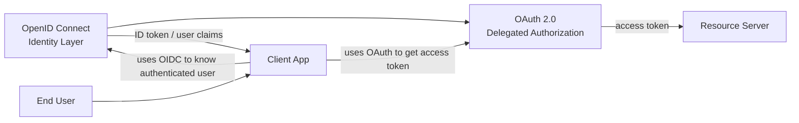

### Invariant utama

> OAuth access token adalah bukti authorization untuk mengakses resource.  
> OIDC ID token adalah bukti authentication event dan identity claims untuk client.

Jangan gunakan access token sebagai bukti login tanpa memahami issuer, audience, scope, token type, dan semantic contract-nya.

---

## 3. Problem yang Diselesaikan OAuth

Sebelum OAuth, pola integrasi sering seperti ini:

1. User memberi username/password kepada aplikasi pihak ketiga.
2. Aplikasi pihak ketiga menyimpan credential itu.
3. Aplikasi memakai credential tersebut untuk login ke service utama.
4. Kalau user ingin revoke akses, user harus ganti password.
5. Aplikasi punya akses berlebihan karena memakai credential utama user.

Masalahnya:

| Masalah | Dampak |
|---|---|
| Password sharing | Client pihak ketiga bisa impersonate user penuh |
| No limited access | Tidak ada scope granular |
| No independent revocation | Harus ganti password untuk mencabut akses |
| No client accountability | Sulit tahu client mana yang melakukan apa |
| Credential exposure | Credential utama tersebar ke banyak pihak |
| No consent record | Tidak ada bukti user/admin memberi izin |

OAuth mengganti model itu dengan:

1. User diarahkan ke authorization server.
2. Authorization server mengautentikasi user.
3. User/admin/policy menyetujui scope tertentu.
4. Client menerima authorization grant.
5. Client menukar grant menjadi access token.
6. Client memakai access token ke resource server.
7. Token dapat dibatasi scope, audience, lifetime, client, dan subject.
8. Grant/token dapat dicabut tanpa mengganti password utama.

### Diagram: dari password sharing ke delegated authorization

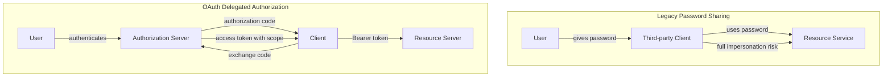

---

## 4. Mental Model OAuth sebagai Delegated Authorization

OAuth adalah protokol untuk mengatur **siapa memberi otoritas apa kepada siapa untuk mengakses resource mana dalam batas apa**.

Struktur konseptual:

```text
Resource Owner
    grants authority to
Client
    through Authorization Server
    to access
Resource Server
    with Access Token
    constrained by Scope / Audience / Lifetime / Client / Policy
```

Dalam sistem enterprise, OAuth bukan hanya flow login. OAuth adalah **contract antar boundary**:

- boundary user ↔ client,
- boundary client ↔ authorization server,
- boundary client ↔ resource server,
- boundary authorization server ↔ resource server,
- boundary organization policy ↔ user consent,
- boundary token semantics ↔ internal permission system.

### OAuth sebagai capability issuance system

Access token dapat dipandang sebagai **capability**:

> Bearer yang memegang token bisa meminta akses tertentu selama token valid.

Karena itu, bearer token harus diperlakukan seperti secret. Bila token bocor, pihak lain bisa menggunakannya kecuali token sender-constrained seperti mTLS/DPoP.

### OAuth bukan policy engine penuh

OAuth memberi token dengan scope. Tetapi resource server tetap harus melakukan authorization final.

Contoh:

```text
scope: case:read
```

Scope ini tidak cukup untuk menjawab:

- boleh baca case milik tenant mana?
- boleh baca case pada stage investigasi?
- boleh baca field personal data?
- boleh baca case yang sedang conflict-of-interest?
- boleh baca case setelah assignment dicabut?

Scope adalah **delegation boundary**, bukan pengganti ABAC/ReBAC/domain authorization.

---

## 5. Empat Role Utama OAuth

OAuth mendefinisikan empat role utama:

1. **Resource Owner**
2. **Client**
3. **Authorization Server**
4. **Resource Server**

### 5.1 Resource Owner

Resource owner adalah entity yang dapat memberikan akses ke protected resource.

Sering kali resource owner adalah end-user, tetapi tidak selalu.

Contoh:

| Skenario | Resource Owner |
|---|---|
| User memberi akses calendar ke app | Human user |
| Admin memberi aplikasi akses organisasi | Organization/admin authority |
| Service account mengakses API internal | Owning service/platform |
| Tenant memberi integrasi akses data tenant | Tenant administrator |

Kesalahan umum:

> Menganggap resource owner selalu sama dengan authenticated user.

Dalam enterprise, authorization bisa diberikan oleh:

- user sendiri,
- admin organisasi,
- policy otomatis,
- contract antar sistem,
- tenant-level consent,
- delegated authority.

### 5.2 Client

Client adalah aplikasi yang meminta access token.

Client bisa:

- web backend,
- SPA,
- native mobile,
- CLI,
- machine service,
- scheduled job,
- IoT/device,
- integration connector.

Client bukan selalu “frontend”. Dalam OAuth, client adalah pihak yang memperoleh token dari authorization server.

### 5.3 Authorization Server

Authorization server adalah komponen yang:

- mengautentikasi resource owner,
- memvalidasi client,
- mengevaluasi grant request,
- mengelola consent/grant,
- menerbitkan token,
- me-rotate refresh token,
- menyediakan metadata/discovery,
- menyediakan JWKS/introspection/revocation endpoint sesuai desain.

Dalam produk nyata, authorization server bisa berupa:

- Keycloak,
- Auth0,
- Okta,
- Azure Entra ID,
- Google Identity,
- Cognito,
- custom internal IdP,
- authorization server embedded di platform.

### 5.4 Resource Server

Resource server adalah API/service yang melindungi resource dan menerima access token.

Tanggung jawab resource server:

- ekstrak access token,
- validasi token,
- validasi issuer/audience/token type,
- interpret scope/claims,
- panggil policy engine/domain authorization,
- enforce permission,
- audit decision.

Resource server tidak boleh sekadar melihat token “valid secara signature” lalu memberi akses. Signature validity hanya satu lapis.

---

## 6. Entity Tambahan yang Selalu Muncul di Sistem Nyata

Spesifikasi OAuth menyederhanakan model menjadi empat role. Sistem nyata membutuhkan entity tambahan.

### 6.1 User-Agent

Browser atau app container yang membawa resource owner ke authorization server.

Risiko:

- redirect manipulation,
- code interception,
- malicious browser extension,
- CSRF,
- open redirect,
- deep link hijacking pada native app.

### 6.2 Client Instance

Spesifikasi sering bicara tentang client sebagai logical application. Produksi membutuhkan konsep client instance.

Contoh:

```text
Client: mobile-app
Client instance: mobile-app installation on Fajar's phone
```

Ini penting untuk:

- refresh token rotation,
- device management,
- breach containment,
- logout per device,
- risk scoring.

### 6.3 Client Registration

Client perlu metadata:

- `client_id`,
- client type,
- redirect URIs,
- allowed grant types,
- allowed scopes,
- token endpoint auth method,
- JWKS URI untuk private_key_jwt,
- owner tenant,
- risk classification,
- production approval status.

### 6.4 Consent Grant

Consent grant adalah record bahwa resource owner/admin/policy telah memberi izin kepada client untuk scope tertentu.

```text
user X approved client Y to access scope Z at time T
```

### 6.5 Authorization Grant

Authorization grant adalah credential sementara/terbatas yang dipakai client untuk mendapatkan access token.

Contoh:

- authorization code,
- refresh token,
- client credentials assertion,
- device code,
- token exchange subject token.

### 6.6 Token Family

Dalam refresh token rotation, semua refresh token yang berasal dari satu grant awal dapat dianggap satu token family.

Tujuannya:

- replay detection,
- family invalidation,
- incident containment,
- audit chain.

### 6.7 Scope Registry

Scope bukan string liar. Scope harus diregistrasi sebagai domain contract.

Contoh registry:

| Scope | Meaning | Owner | Resource Server | Risk |
|---|---|---|---|---|
| `case.read` | Read case summary | Case platform | Case API | Medium |
| `case.write` | Create/update case | Case platform | Case API | High |
| `case.export` | Export case data | Case platform | Report API | Very High |
| `user.profile.read` | Read profile | Identity team | Profile API | Low |

---

## 7. Authorization Grant: Bukti Authority, Bukan Permission Final

Authorization grant adalah representasi bahwa client telah memperoleh authority tertentu untuk meminta token.

Contoh paling umum: authorization code.

```text
authorization code != access token
authorization code != session
authorization code != user identity
```

Authorization code adalah artefak sementara yang:

- dikirim via redirect melalui browser,
- short-lived,
- one-time use,
- harus di-bind ke client,
- idealnya di-bind ke PKCE verifier,
- ditukar melalui back-channel ke token endpoint.

### Kenapa authorization code tidak boleh dipakai langsung ke API?

Karena authorization code:

- belum final token,
- melewati front-channel,
- rentan interception bila tidak pakai PKCE,
- tidak punya semantic audience resource server,
- tidak dirancang untuk resource access.

### Grant sebagai pre-token authority

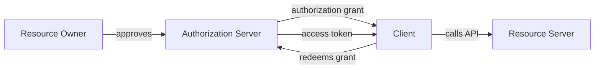

---

## 8. Access Token, Refresh Token, Authorization Code

### 8.1 Access Token

Access token dipakai client untuk mengakses protected resource.

Sifat umum:

- disampaikan ke resource server,
- biasanya Bearer token,
- punya expiry,
- punya scope/audience,
- bisa opaque atau structured JWT,
- harus divalidasi resource server.

Access token menjawab:

> “Client ini memiliki authority untuk meminta akses tertentu ke resource server ini, dalam batas token ini.”

Access token tidak otomatis menjawab:

- user masih aktif?
- permission user masih sama?
- tenant masih sama?
- resource boleh diakses?
- field tertentu boleh dibuka?

### 8.2 Refresh Token

Refresh token dipakai client untuk mendapatkan access token baru tanpa user interaction.

Sifat:

- lebih sensitif dari access token,
- lifetime lebih panjang,
- harus disimpan lebih hati-hati,
- idealnya dirotasi,
- harus di-bind ke client,
- harus bisa direvoke.

Refresh token adalah credential. Perlakukan seperti password/API key.

### 8.3 Authorization Code

Authorization code adalah grant sementara hasil authorization endpoint.

Sifat:

- short-lived,
- one-time use,
- front-channel artifact,
- harus ditukar di token endpoint,
- wajib dipadukan dengan PKCE untuk public clients dan secara praktik modern juga sangat disarankan untuk confidential clients.

### 8.4 Perbandingan

| Artifact | Dipakai oleh | Dikirim ke | Lifetime | Risiko utama |
|---|---|---|---|---|
| Authorization code | Client | Authorization server token endpoint | Sangat pendek | Code interception |
| Access token | Client | Resource server | Pendek | Token replay/leak |
| Refresh token | Client | Authorization server token endpoint | Lebih panjang | Persistent compromise |
| ID token | OIDC client | Client | Pendek | Token substitution/confusion |

Catatan: ID token akan dibahas lebih dalam di part OIDC. Jangan campur ID token dan access token.

---

## 9. Scope: Delegation Boundary, Bukan Full Authorization Model

Scope adalah string yang menyatakan batas akses yang diminta/diberikan kepada client.

Contoh:

```text
read:calendar
write:calendar
case.read
case.write
profile.email
report.export
```

### 9.1 Scope sebagai coarse-grained delegation

Scope bagus untuk:

- membatasi client,
- menampilkan consent,
- membatasi token,
- memisahkan API capability besar,
- memudahkan API gateway/resource server melakukan coarse enforcement.

Scope buruk untuk:

- object-level permission,
- row-level authorization,
- tenant boundary,
- workflow-stage authorization,
- field-level authorization,
- conflict-of-interest rules,
- separation of duties,
- real-time business rule.

### 9.2 Scope bukan role

Anti-pattern:

```text
scope: admin
scope: officer
scope: manager
```

Ini mencampur role internal dengan delegated capability.

Lebih baik:

```text
scope: case.read case.update case.assign
```

Lalu resource server memeriksa role/attribute/relationship internal:

```text
Token scope allows case.update
AND user is assigned officer for this case
AND case stage allows update
AND tenant matches
AND no conflict-of-interest flag
```

### 9.3 Scope naming

Prinsip scope naming:

1. Action-oriented.
2. Resource-aware.
3. Stable sebagai API contract.
4. Tidak terlalu granular sampai meledak.
5. Tidak terlalu broad sampai meaningless.
6. Tidak mengandung data instance ID kecuali desain capability khusus.

Contoh buruk:

```text
scope: all
scope: admin
scope: user
scope: access
scope: case
```

Contoh lebih baik:

```text
case.read
case.create
case.update
case.assign
case.export
profile.read
notification.send
report.generate
```

### 9.4 Scope dan audience

Scope harus selalu dipahami bersama audience.

```text
audience: case-api
scope: case.read
```

Tanpa audience, token bisa rawan token substitution:

- token untuk API A dipakai ke API B,
- token dari issuer salah diterima,
- token OIDC ID token dipakai sebagai access token.

---

## 10. Consent: User Approval, Admin Approval, dan Policy Approval

Consent adalah proses/record bahwa authority diberikan kepada client.

Namun consent tidak selalu berarti user mengklik “Allow”.

### 10.1 User consent

Contoh:

```text
User approves client app to read profile and calendar.
```

User consent cocok untuk personal data/resource milik user.

### 10.2 Admin consent

Contoh:

```text
Tenant admin approves CRM integration to read all organization contacts.
```

Admin consent diperlukan ketika akses berdampak ke organisasi/tenant, bukan hanya satu user.

### 10.3 Policy-based consent

Contoh:

```text
Internal approved service may obtain client_credentials token for service-to-service API.
```

Tidak ada user consent, tetapi ada policy/platform approval.

### 10.4 Consent record minimal

Consent store harus menjawab:

- siapa pemberi consent?
- untuk client apa?
- scope apa?
- resource/audience apa?
- tenant mana?
- kapan dibuat?
- sampai kapan berlaku?
- bagaimana dicabut?
- policy version apa yang berlaku?
- apakah consent user, admin, atau system?

Contoh:

```go
type ConsentGrant struct {
    ID              string
    TenantID        string
    ResourceOwnerID string
    GrantedByActor  string
    ClientID        string
    Audience        string
    Scopes          []string
    GrantType       string
    ConsentMode     string // user, admin, policy
    PolicyVersion   string
    CreatedAt       time.Time
    ExpiresAt       *time.Time
    RevokedAt       *time.Time
}
```

### 10.5 Consent bukan authorization final

Consent berarti client boleh meminta akses dalam batas tertentu. Resource server tetap harus memutuskan apakah request aktual boleh dilakukan.

---

## 11. Client Type: Public, Confidential, Native, SPA, Backend, CLI, Device

OAuth security banyak bergantung pada jenis client.

### 11.1 Confidential client

Confidential client mampu menjaga secret.

Contoh:

- backend web app,
- server-side service,
- daemon internal,
- confidential API integration.

Client secret hanya aman bila berada di controlled backend environment. Secret yang ditanam di mobile app, SPA, desktop app, atau firmware tidak benar-benar secret.

### 11.2 Public client

Public client tidak mampu menjaga secret.

Contoh:

- SPA,
- native mobile,
- desktop app,
- CLI distributed to users,
- device app.

Public client harus memakai PKCE untuk authorization code flow.

### 11.3 Native app

Native app menggunakan system browser atau external user-agent, bukan embedded webview untuk login.

Redirect bisa melalui:

- loopback redirect,
- claimed HTTPS scheme,
- custom URI scheme.

Risiko:

- custom scheme hijacking,
- authorization code interception,
- insecure local storage.

### 11.4 SPA

SPA adalah public client karena code berjalan di browser user.

Risiko:

- token exposure via XSS,
- localStorage/sessionStorage leakage,
- refresh token handling,
- CORS misconception,
- browser extension access.

Untuk aplikasi enterprise, sering lebih aman memakai **Backend-for-Frontend (BFF)**:

```text
Browser holds secure cookie session.
BFF holds OAuth tokens server-side.
API only sees backend calls.
```

### 11.5 CLI

CLI bisa memakai:

- authorization code + loopback redirect,
- device authorization grant,
- client credentials untuk service account,
- workload identity di environment cloud.

Jangan meminta user paste password utama ke CLI custom kalau bisa OAuth/device flow.

### 11.6 Machine-to-machine client

M2M biasanya memakai client credentials.

Resource owner bukan human user. Authorization didasarkan pada:

- client identity,
- service account,
- workload identity,
- platform policy,
- tenant/org binding.

---

## 12. Grant Type Fundamental

Grant type adalah mekanisme client memperoleh token.

### 12.1 Grant yang umum dan modern

| Grant | Untuk | User involved? | Catatan |
|---|---|---:|---|
| Authorization Code + PKCE | Web, SPA, native, mobile | Ya | Default modern untuk user delegation |
| Client Credentials | Service-to-service | Tidak | Untuk machine identity |
| Refresh Token | Token renewal | Tidak langsung | Harus rotasi/revoke dengan hati-hati |
| Device Authorization | Device/CLI input terbatas | Ya | User login di browser lain |
| Token Exchange | Delegation/impersonation/token translation | Bisa | Advanced; part khusus nanti |

### 12.2 Grant yang legacy/harus dihindari

| Grant | Masalah |
|---|---|
| Implicit | Token lewat front-channel, risiko leak tinggi, digantikan authorization code + PKCE |
| Resource Owner Password Credentials | Client melihat password user, melanggar delegation model |

---

## 13. Authorization Code + PKCE

Authorization Code + PKCE adalah default modern untuk user-facing OAuth flow.

### 13.1 Intuisi

Client tidak langsung menerima access token lewat browser. Client menerima authorization code, lalu menukarnya ke token endpoint.

PKCE menambahkan proof bahwa pihak yang menukar code adalah pihak yang memulai flow.

### 13.2 PKCE artifact

- `code_verifier`: random secret generated by client.
- `code_challenge`: derived from verifier, umumnya `BASE64URL(SHA256(code_verifier))`.
- `code_challenge_method`: `S256`.

Flow:

1. Client membuat `code_verifier`.
2. Client menghitung `code_challenge`.
3. Client mengirim `code_challenge` ke authorization endpoint.
4. Authorization server menyimpan challenge bersama authorization code.
5. Client menukar code dengan mengirim `code_verifier`.
6. Authorization server menghitung ulang dan membandingkan dengan challenge.

### 13.3 Diagram

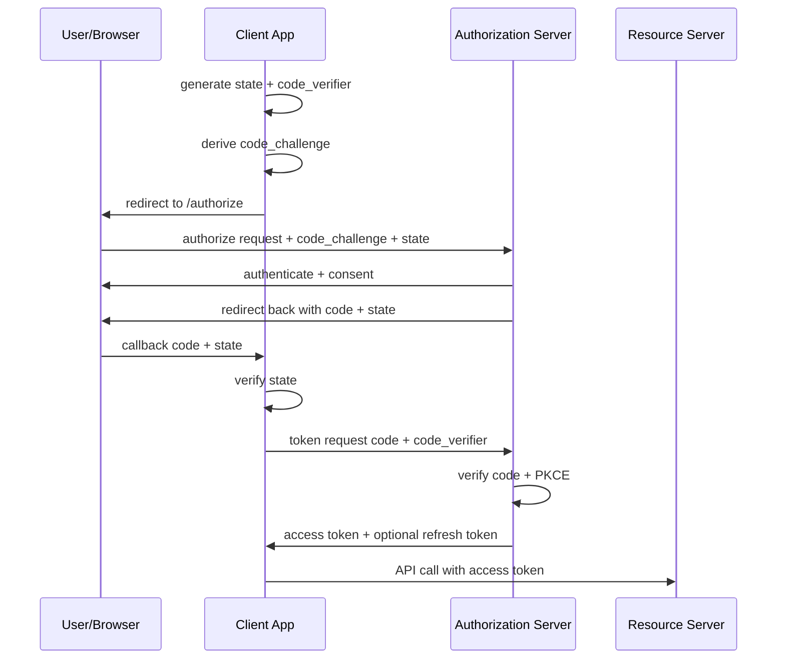

### 13.4 Security properties

Authorization Code + PKCE mengurangi risiko:

- code interception,
- malicious app intercepting redirect,
- browser history token leak,
- front-channel access token leak,
- authorization code injection.

Namun masih harus menjaga:

- exact redirect URI match,
- state validation,
- issuer validation,
- audience validation,
- token validation,
- consent/scope correctness,
- session binding.

### 13.5 State bukan PKCE

`state` dan PKCE menyelesaikan masalah berbeda.

| Mechanism | Fungsi |
|---|---|
| `state` | Bind callback ke browser session/client transaction; mitigasi CSRF/mix-up tertentu |
| PKCE | Bind authorization code ke client instance yang memulai flow |

Keduanya tetap dibutuhkan.

---

## 14. Client Credentials

Client credentials dipakai ketika client bertindak atas nama dirinya sendiri, bukan atas nama user.

Contoh:

- report scheduler memanggil case API,
- ingestion service membaca message API,
- billing service memanggil notification service,
- backend integrasi memanggil API partner.

### 14.1 Flow

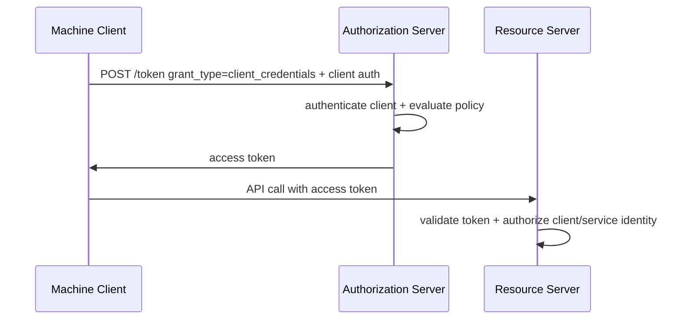

### 14.2 Client authentication method

Client credentials bukan berarti selalu `client_id + client_secret`.

Metode umum:

- client secret basic/post,
- private_key_jwt,
- mTLS client authentication,
- platform workload identity assertion,
- cloud-native federation.

Untuk enterprise high-trust service-to-service, static client secret sering menjadi titik lemah.

### 14.3 Authorization concern

Token client credentials tidak memiliki human subject.

Jangan memalsukan user:

```text
sub = user123
```

Kalau token mewakili service, subject-nya harus service/client identity.

Contoh:

```json
{
  "iss": "https://auth.example.gov",
  "sub": "client:report-scheduler",
  "aud": "case-api",
  "scope": "case.read report.generate",
  "client_id": "report-scheduler"
}
```

Resource server harus bisa membedakan:

- human user token,
- service token,
- delegated token,
- impersonation token.

---

## 15. Device Authorization Grant

Device authorization grant dipakai untuk device yang sulit input credential atau tidak memiliki browser nyaman.

Contoh:

- smart TV,
- terminal CLI di remote server,
- IoT device,
- hardware console,
- limited-input device.

### 15.1 Flow

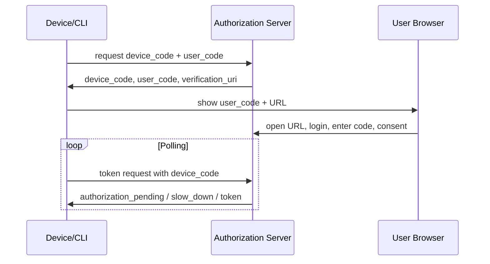

### 15.2 Risk

Device flow harus memperhatikan:

- phishing via user code,
- polling rate,
- code entropy,
- expiration,
- device binding,
- user confusion,
- consent clarity.

### 15.3 CLI decision

Untuk CLI internal:

- jika CLI punya browser/loopback support: authorization code + PKCE sering lebih baik.
- jika CLI berjalan di server/headless: device flow lebih usable.
- jika CLI untuk automation: workload identity/client credentials lebih tepat.

---

## 16. Refresh Token Grant

Refresh token grant dipakai untuk mendapatkan access token baru.

### 16.1 Flow

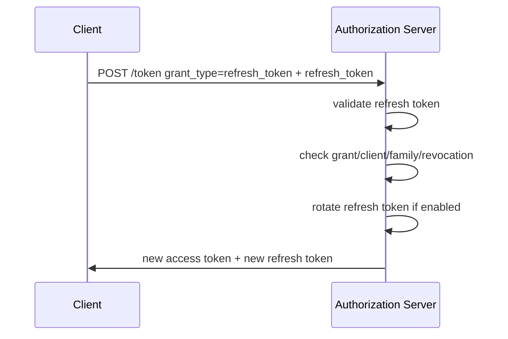

### 16.2 Refresh token rotation

Modern design untuk public client:

1. Refresh token hanya bisa dipakai satu kali.
2. Saat dipakai, server menerbitkan refresh token baru.
3. Token lama ditandai used.
4. Jika token lama dipakai ulang, itu indikasi replay.
5. Server bisa mencabut seluruh token family.

### 16.3 Race condition

Dua request paralel bisa memakai refresh token yang sama.

Jika tidak hati-hati:

- satu request sukses,
- request kedua dianggap replay,
- user logout paksa padahal hanya race normal.

Mitigasi:

- compare-and-swap transaction,
- short grace window dengan idempotency,
- client-side singleflight,
- token refresh lock,
- deterministic response untuk duplicate safe retry.

Topik ini sudah dibahas mendalam di part 011, tetapi penting untuk konteks OAuth.

---

## 17. Token Exchange: Preview untuk Delegation dan Impersonation

OAuth token exchange memungkinkan client menukar satu token dengan token lain, sering untuk:

- delegation,
- impersonation,
- audience change,
- scope reduction,
- downscoping,
- service-to-service propagation,
- external-to-internal token translation.

Contoh:

```text
User token for frontend API
    exchanged into
Downscoped token for document service
```

Atau:

```text
Support admin actor token
    exchanged into
Impersonation token acting as customer subject
```

### 17.1 Delegation vs impersonation

| Model | Meaning | Audit |
|---|---|---|
| Delegation | Actor acts with delegated authority while retaining actor identity | Strong audit if actor preserved |
| Impersonation | Actor acts as another subject | Dangerous unless explicitly marked |

Token exchange akan dibahas lebih detail di part capability/delegation.

---

## 18. Implicit dan ROPC: Legacy yang Harus Dihindari

### 18.1 Implicit flow

Implicit flow mengembalikan access token melalui front-channel/browser redirect.

Masalah:

- token muncul di browser environment,
- leak via history/referrer/logging,
- sulit sender-constrain,
- tidak memakai code exchange back-channel,
- digantikan authorization code + PKCE untuk SPA/native.

### 18.2 Resource Owner Password Credentials

ROPC meminta user memberikan username/password ke client.

Masalah:

- client melihat password user,
- melanggar delegasi,
- sulit MFA/federation/passkey,
- memperluas phishing surface,
- membuat client terlalu dipercaya.

ROPC hanya muncul di legacy migration dengan constraint ekstrem. Untuk desain baru, hindari.

---

## 19. OAuth vs OIDC vs SAML vs Internal Session

| Mechanism | Fungsi utama | Artifact utama | Catatan |
|---|---|---|---|
| OAuth 2.0 | Delegated authorization | Access token, refresh token, authorization code | Tidak mendefinisikan identity login secara lengkap |
| OIDC | Authentication layer di atas OAuth | ID token, UserInfo claims | Untuk “login”/identity federation modern |
| SAML | Enterprise federation/SSO berbasis assertion XML | SAML assertion | Banyak di enterprise lama/pemerintah |
| Internal session | App session management | Cookie/session ID | Setelah login/OIDC callback, app sering membuat session sendiri |

### 19.1 Pattern umum web app

```text
OIDC login -> validate ID token -> link/create user -> create internal session cookie
```

Lalu:

```text
Browser uses app session cookie to app backend
Backend uses OAuth token to call APIs if needed
```

### 19.2 Pattern umum API

```text
Client sends OAuth access token to API
API validates token
API maps token to principal/client
API enforces internal policy
```

---

## 20. Sequence Diagram: OAuth dalam Sistem Nyata

### 20.1 Web app dengan backend session dan API call

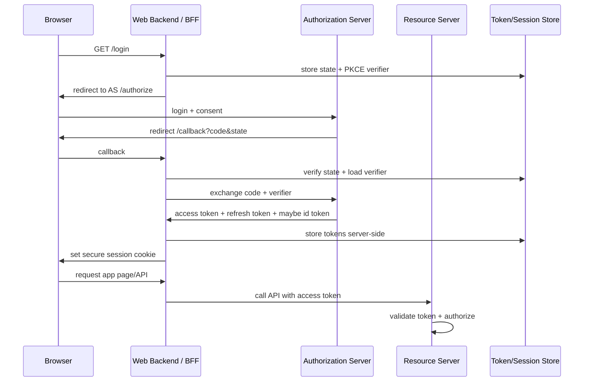

### 20.2 SPA direct token model

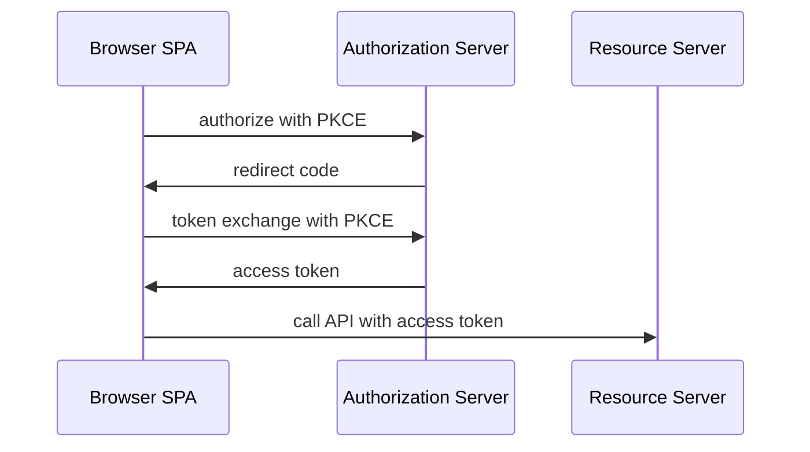

Catatan: model SPA direct token harus sangat hati-hati terhadap XSS/token storage. Banyak sistem enterprise memilih BFF agar token tidak berada di JavaScript runtime.

---

## 21. Go Design Lens

Dalam Go, implementasi OAuth yang baik harus memisahkan:

1. protocol mechanics,
2. HTTP handler,
3. state/challenge store,
4. token store,
5. domain identity binding,
6. permission mapping,
7. audit.

Anti-pattern:

```go
func Callback(w http.ResponseWriter, r *http.Request) {
    // parse code
    // exchange token
    // decode token
    // create user
    // create session
    // write DB
    // call audit
    // call external API
    // all in one handler
}
```

Lebih baik:

```text
http handler
  -> oauth flow service
      -> state store
      -> token exchanger
      -> external identity linker
      -> session issuer
      -> audit sink
```

### 21.1 Boundary konseptual

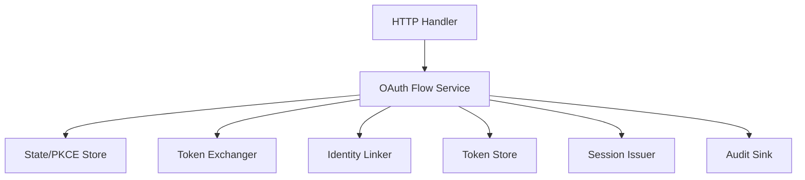

---

## 22. Package Boundary untuk OAuth Client di Go

Rekomendasi struktur:

```text
/internal/auth/oauthclient
    config.go
    state.go
    pkce.go
    flow.go
    token.go
    errors.go

/internal/auth/session
    session.go
    issuer.go
    store.go

/internal/identity/external
    provider.go
    linker.go
    account_binding.go

/internal/authz/scope
    registry.go
    mapper.go

/internal/audit
    auth_events.go
```

### 22.1 `oauthclient.Config`

```go
package oauthclient

import "golang.org/x/oauth2"

type ProviderID string

type Config struct {
    ProviderID  ProviderID
    OAuth2      oauth2.Config
    Issuer      string
    Audience    string
    AllowedHost string
}
```

### 22.2 State store

```go
type AuthState struct {
    State        string
    CodeVerifier string
    RedirectTo   string
    CreatedAt    time.Time
    ExpiresAt    time.Time
    TenantID      string
    CSRFSessionID string
}

type StateStore interface {
    Save(ctx context.Context, s AuthState) error
    Consume(ctx context.Context, state string) (AuthState, error)
}
```

`Consume` harus atomic. State OAuth tidak boleh reusable.

### 22.3 Token store

```go
type OAuthTokenSet struct {
    ProviderID   string
    ClientID     string
    Subject      string
    AccessToken  string
    RefreshToken string
    TokenType    string
    Scopes       []string
    Expiry       time.Time
    IssuedAt     time.Time
}

type TokenStore interface {
    Save(ctx context.Context, owner string, token OAuthTokenSet) error
    Load(ctx context.Context, owner string, provider string) (OAuthTokenSet, error)
    Revoke(ctx context.Context, owner string, provider string, reason string) error
}
```

Dalam produksi, access/refresh token sebaiknya dienkripsi at rest atau disimpan via secret/token vault tergantung risk profile.

---

## 23. Model Data Minimal untuk OAuth Integration

### 23.1 OAuth client registry

```sql
CREATE TABLE oauth_client_registry (
    client_id              VARCHAR(128) PRIMARY KEY,
    client_name            VARCHAR(255) NOT NULL,
    client_type            VARCHAR(32) NOT NULL,
    owner_tenant_id         VARCHAR(64),
    allowed_grant_types     TEXT NOT NULL,
    allowed_scopes          TEXT NOT NULL,
    redirect_uris           TEXT,
    token_auth_method       VARCHAR(64),
    jwks_uri                TEXT,
    status                  VARCHAR(32) NOT NULL,
    created_at              TIMESTAMP NOT NULL,
    updated_at              TIMESTAMP NOT NULL
);
```

### 23.2 Authorization request state

```sql
CREATE TABLE oauth_auth_state (
    state_hash          VARCHAR(128) PRIMARY KEY,
    code_verifier_hash  VARCHAR(128) NOT NULL,
    tenant_id           VARCHAR(64),
    csrf_session_id     VARCHAR(128) NOT NULL,
    redirect_to         TEXT,
    provider_id         VARCHAR(64) NOT NULL,
    created_at          TIMESTAMP NOT NULL,
    expires_at          TIMESTAMP NOT NULL,
    consumed_at         TIMESTAMP
);
```

State dan verifier dapat disimpan hash agar store compromise tidak langsung memberi material mentah.

### 23.3 Consent grant

```sql
CREATE TABLE oauth_consent_grant (
    grant_id             VARCHAR(64) PRIMARY KEY,
    tenant_id            VARCHAR(64),
    resource_owner_id    VARCHAR(64) NOT NULL,
    granted_by_actor_id  VARCHAR(64) NOT NULL,
    client_id            VARCHAR(128) NOT NULL,
    audience             VARCHAR(255) NOT NULL,
    scopes               TEXT NOT NULL,
    consent_mode         VARCHAR(32) NOT NULL,
    policy_version       VARCHAR(64),
    created_at           TIMESTAMP NOT NULL,
    expires_at           TIMESTAMP,
    revoked_at           TIMESTAMP,
    revoke_reason        TEXT
);
```

### 23.4 External OAuth token binding

```sql
CREATE TABLE external_oauth_token_binding (
    binding_id           VARCHAR(64) PRIMARY KEY,
    user_id              VARCHAR(64) NOT NULL,
    provider_id          VARCHAR(64) NOT NULL,
    provider_subject     VARCHAR(255) NOT NULL,
    scopes               TEXT NOT NULL,
    access_token_ref     TEXT,
    refresh_token_ref    TEXT,
    expires_at           TIMESTAMP,
    created_at           TIMESTAMP NOT NULL,
    updated_at           TIMESTAMP NOT NULL,
    revoked_at           TIMESTAMP,
    UNIQUE(provider_id, provider_subject)
);
```

---

## 24. Implementasi Authorization Code + PKCE di Go

Contoh berikut adalah skeleton edukatif. Produksi harus menambahkan hardening sesuai checklist.

### 24.1 PKCE helper

```go
package oauthclient

import (
    "crypto/rand"
    "crypto/sha256"
    "encoding/base64"
    "fmt"
)

func NewCodeVerifier() (string, error) {
    b := make([]byte, 32)
    if _, err := rand.Read(b); err != nil {
        return "", fmt.Errorf("generate pkce verifier: %w", err)
    }
    return base64.RawURLEncoding.EncodeToString(b), nil
}

func CodeChallengeS256(verifier string) string {
    sum := sha256.Sum256([]byte(verifier))
    return base64.RawURLEncoding.EncodeToString(sum[:])
}
```

### 24.2 State helper

```go
func NewState() (string, error) {
    b := make([]byte, 32)
    if _, err := rand.Read(b); err != nil {
        return "", fmt.Errorf("generate oauth state: %w", err)
    }
    return base64.RawURLEncoding.EncodeToString(b), nil
}
```

### 24.3 Login start handler

```go
package handlers

import (
    "net/http"
    "time"

    "golang.org/x/oauth2"
)

type OAuthStartHandler struct {
    Config     oauth2.Config
    StateStore StateStore
}

type StateStore interface {
    Save(r *http.Request, state AuthState) error
}

type AuthState struct {
    State        string
    CodeVerifier string
    RedirectTo   string
    CreatedAt    time.Time
    ExpiresAt    time.Time
}

func (h OAuthStartHandler) ServeHTTP(w http.ResponseWriter, r *http.Request) {
    state, err := oauthclient.NewState()
    if err != nil {
        http.Error(w, "failed to start login", http.StatusInternalServerError)
        return
    }

    verifier, err := oauthclient.NewCodeVerifier()
    if err != nil {
        http.Error(w, "failed to start login", http.StatusInternalServerError)
        return
    }

    authState := AuthState{
        State:        state,
        CodeVerifier: verifier,
        RedirectTo:   safeRedirectTarget(r.URL.Query().Get("redirect_to")),
        CreatedAt:    time.Now().UTC(),
        ExpiresAt:    time.Now().UTC().Add(10 * time.Minute),
    }

    if err := h.StateStore.Save(r, authState); err != nil {
        http.Error(w, "failed to start login", http.StatusInternalServerError)
        return
    }

    url := h.Config.AuthCodeURL(
        state,
        oauth2.AccessTypeOffline,
        oauth2.SetAuthURLParam("code_challenge", oauthclient.CodeChallengeS256(verifier)),
        oauth2.SetAuthURLParam("code_challenge_method", "S256"),
    )

    http.Redirect(w, r, url, http.StatusFound)
}
```

Catatan penting:

- `redirect_to` harus divalidasi sebagai local/safe target.
- Jangan menerima arbitrary redirect URL dari query.
- State store harus memiliki TTL.
- Simpan state server-side atau cookie yang signed/encrypted dengan expiry.

### 24.4 Callback handler

```go
type OAuthCallbackHandler struct {
    Config     oauth2.Config
    StateStore CallbackStateStore
    TokenStore TokenStore
    Session    SessionIssuer
}

type CallbackStateStore interface {
    Consume(r *http.Request, state string) (AuthState, error)
}

type TokenStore interface {
    SaveExternalToken(r *http.Request, token *oauth2.Token) error
}

type SessionIssuer interface {
    Issue(w http.ResponseWriter, r *http.Request, subject string) error
}

func (h OAuthCallbackHandler) ServeHTTP(w http.ResponseWriter, r *http.Request) {
    q := r.URL.Query()

    if oauthErr := q.Get("error"); oauthErr != "" {
        // Map OAuth error safely. Do not dump raw provider error to user.
        http.Error(w, "authorization failed", http.StatusUnauthorized)
        return
    }

    code := q.Get("code")
    state := q.Get("state")
    if code == "" || state == "" {
        http.Error(w, "invalid callback", http.StatusBadRequest)
        return
    }

    saved, err := h.StateStore.Consume(r, state)
    if err != nil {
        http.Error(w, "invalid or expired login state", http.StatusBadRequest)
        return
    }

    token, err := h.Config.Exchange(
        r.Context(),
        code,
        oauth2.SetAuthURLParam("code_verifier", saved.CodeVerifier),
    )
    if err != nil {
        http.Error(w, "token exchange failed", http.StatusUnauthorized)
        return
    }

    if !token.Valid() {
        http.Error(w, "invalid token response", http.StatusUnauthorized)
        return
    }

    // OAuth alone does not prove user identity. For login, use OIDC ID token
    // validation or a provider-specific userinfo/profile binding.
    // Here represented as placeholder.
    subject := "external-subject-after-validation"

    if err := h.TokenStore.SaveExternalToken(r, token); err != nil {
        http.Error(w, "failed to store token", http.StatusInternalServerError)
        return
    }

    if err := h.Session.Issue(w, r, subject); err != nil {
        http.Error(w, "failed to issue session", http.StatusInternalServerError)
        return
    }

    http.Redirect(w, r, saved.RedirectTo, http.StatusFound)
}
```

### 24.5 Important warning

Snippet di atas belum melakukan OIDC ID token validation. Jika use case adalah login, callback harus memvalidasi OIDC ID token atau melakukan identity binding yang valid sesuai provider contract.

OAuth token exchange saja tidak cukup untuk menyimpulkan identity.

---

## 25. Implementasi Client Credentials di Go

Paket `golang.org/x/oauth2/clientcredentials` umum dipakai untuk client credentials.

```go
package serviceclient

import (
    "context"
    "net/http"

    "golang.org/x/oauth2/clientcredentials"
)

type Config struct {
    TokenURL     string
    ClientID     string
    ClientSecret string
    Scopes       []string
}

func NewHTTPClient(ctx context.Context, cfg Config) *http.Client {
    cc := clientcredentials.Config{
        ClientID:     cfg.ClientID,
        ClientSecret: cfg.ClientSecret,
        TokenURL:     cfg.TokenURL,
        Scopes:       cfg.Scopes,
    }
    return cc.Client(ctx)
}
```

### 25.1 Production hardening

Untuk produksi:

- jangan hardcode secret,
- ambil secret dari secret manager,
- gunakan rotation,
- set timeout transport,
- observability token endpoint latency,
- retry dengan hati-hati,
- cache token via TokenSource,
- prefer private_key_jwt/mTLS/workload identity untuk high-trust internal service.

### 25.2 Custom transport

```go
func NewOAuthHTTPClient(ctx context.Context, cfg clientcredentials.Config, base *http.Client) *http.Client {
    ts := cfg.TokenSource(ctx)
    return &http.Client{
        Transport: &oauth2.Transport{
            Source: ts,
            Base:   base.Transport,
        },
        Timeout: base.Timeout,
    }
}
```

Pastikan `base.Transport` tidak nil atau gunakan `http.DefaultTransport` yang dikloning dan dikonfigurasi.

---

## 26. Resource Server: Validasi Bearer Token

Resource server menerima request:

```http
Authorization: Bearer <access_token>
```

Resource server harus memutuskan:

1. Apakah token ada?
2. Apakah formatnya valid?
3. Apakah issuer dipercaya?
4. Apakah signature/introspection valid?
5. Apakah audience cocok?
6. Apakah token belum expired?
7. Apakah token type access token?
8. Apakah client/subject dibolehkan?
9. Apakah scope cukup?
10. Apakah domain policy memperbolehkan request aktual?

### 26.1 Middleware skeleton

```go
type TokenVerifier interface {
    VerifyAccessToken(ctx context.Context, raw string) (AccessPrincipal, error)
}

type AccessPrincipal struct {
    Issuer    string
    Subject   string
    ClientID  string
    Audience  []string
    Scopes    []string
    TokenID   string
    ExpiresAt time.Time
}

type ScopeAuthorizer interface {
    Require(principal AccessPrincipal, scopes ...string) error
}

func BearerAuth(verifier TokenVerifier) func(http.Handler) http.Handler {
    return func(next http.Handler) http.Handler {
        return http.HandlerFunc(func(w http.ResponseWriter, r *http.Request) {
            raw, ok := extractBearer(r.Header.Get("Authorization"))
            if !ok {
                writeOAuthError(w, http.StatusUnauthorized, "invalid_token", "missing bearer token")
                return
            }

            p, err := verifier.VerifyAccessToken(r.Context(), raw)
            if err != nil {
                writeOAuthError(w, http.StatusUnauthorized, "invalid_token", "invalid access token")
                return
            }

            ctx := context.WithValue(r.Context(), principalContextKey{}, p)
            next.ServeHTTP(w, r.WithContext(ctx))
        })
    }
}
```

### 26.2 Jangan return detail sensitif

Untuk user/client:

```json
{"error":"invalid_token"}
```

Untuk log internal:

```json
{
  "event":"oauth.token_rejected",
  "reason":"audience_mismatch",
  "issuer":"https://auth.example.gov",
  "aud_expected":"case-api",
  "token_kid":"2026-06-key-1"
}
```

---

## 27. Scope Mapping ke Permission Internal

OAuth scope tidak sama dengan permission internal. Butuh mapping layer.

### 27.1 Contoh mapping

```go
type Scope string

type Permission string

const (
    ScopeCaseRead   Scope = "case.read"
    ScopeCaseUpdate Scope = "case.update"

    PermissionCaseViewSummary Permission = "case:view_summary"
    PermissionCaseViewPII     Permission = "case:view_pii"
    PermissionCaseEdit        Permission = "case:edit"
)

var scopePermissions = map[Scope][]Permission{
    ScopeCaseRead: {
        PermissionCaseViewSummary,
    },
    ScopeCaseUpdate: {
        PermissionCaseViewSummary,
        PermissionCaseEdit,
    },
}
```

### 27.2 Domain check tetap wajib

```go
func CanUpdateCase(ctx context.Context, p Principal, c Case) Decision {
    if !p.HasOAuthScope("case.update") {
        return Deny("missing_scope")
    }
    if p.TenantID != c.TenantID {
        return Deny("tenant_mismatch")
    }
    if !p.HasRole("case_officer") {
        return Deny("missing_role")
    }
    if c.Stage == StageClosed {
        return Deny("case_closed")
    }
    if c.ConflictActors.Contains(p.SubjectID) {
        return Deny("conflict_of_interest")
    }
    return Allow()
}
```

### 27.3 Layering yang benar

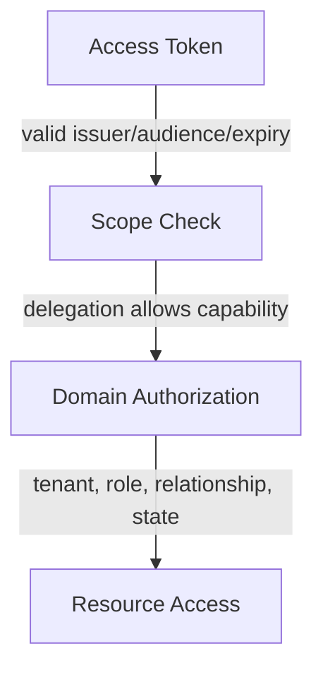

---

## 28. Consent Store dan Grant Store

### 28.1 Consent store

Consent store menyimpan approval.

Digunakan oleh authorization server untuk menentukan apakah perlu menampilkan consent screen atau bisa langsung issue authorization code.

### 28.2 Grant store

Grant store menyimpan authorization grants dan token family.

Perbedaan:

| Store | Berisi | Lifetime |
|---|---|---|
| Consent store | Approval user/admin/policy | Bisa panjang |
| Authorization code store | One-time code transaction | Sangat pendek |
| Refresh token store | Long-lived credential/family | Menengah/panjang |
| Access token store | Jika opaque/introspection | Pendek |

### 28.3 Revocation model

Mencabut consent tidak selalu otomatis mencabut semua access token yang sudah issued jika token stateless dan belum expired.

Mitigasi:

- short access token TTL,
- refresh token revoke,
- introspection untuk high-risk API,
- token version claim,
- grant version check,
- event-driven cache invalidation.

---

## 29. Error Taxonomy

OAuth memiliki error response di beberapa endpoint. Namun dalam aplikasi Go, perlu taxonomy internal.

### 29.1 Authorization endpoint errors

Contoh:

- `invalid_request`,
- `unauthorized_client`,
- `access_denied`,
- `unsupported_response_type`,
- `invalid_scope`,
- `server_error`,
- `temporarily_unavailable`.

### 29.2 Token endpoint errors

Contoh:

- `invalid_request`,
- `invalid_client`,
- `invalid_grant`,
- `unauthorized_client`,
- `unsupported_grant_type`,
- `invalid_scope`.

### 29.3 Resource server errors

Bearer token error umum:

- `invalid_request`,
- `invalid_token`,
- `insufficient_scope`.

### 29.4 Internal error type

```go
type OAuthErrorKind string

const (
    ErrInvalidRequest      OAuthErrorKind = "invalid_request"
    ErrInvalidClient       OAuthErrorKind = "invalid_client"
    ErrInvalidGrant        OAuthErrorKind = "invalid_grant"
    ErrInvalidToken        OAuthErrorKind = "invalid_token"
    ErrInsufficientScope   OAuthErrorKind = "insufficient_scope"
    ErrUnauthorizedClient  OAuthErrorKind = "unauthorized_client"
    ErrTemporarilyUnavailable OAuthErrorKind = "temporarily_unavailable"
)

type OAuthError struct {
    Kind        OAuthErrorKind
    SafeMessage string
    Cause       error
}

func (e *OAuthError) Error() string {
    return string(e.Kind) + ": " + e.SafeMessage
}
```

Jangan mencampur:

- error untuk client,
- error untuk browser user,
- error untuk audit,
- error untuk internal logs.

---

## 30. Security Pitfalls

### 30.1 Treating OAuth as authentication

Menggunakan access token untuk login tanpa OIDC/userinfo validation.

### 30.2 Missing state validation

Callback tidak memverifikasi state.

Dampak:

- login CSRF,
- account linking attack,
- mix-up confusion.

### 30.3 Missing PKCE

Authorization code bisa diintercept dan ditukar pihak lain.

### 30.4 Weak redirect URI validation

Anti-pattern:

```text
redirect_uri startsWith("https://app.example.com")
```

Ini bisa menerima:

```text
https://app.example.com.evil.tld/callback
```

Gunakan exact match registered redirect URI.

### 30.5 Overbroad scope

```text
scope=admin all full_access
```

Scope seperti ini menghancurkan delegation boundary.

### 30.6 Token stored in browser localStorage

Risiko XSS membuat token mudah dicuri.

Untuk enterprise web app, pertimbangkan BFF/session cookie.

### 30.7 Accepting token from wrong issuer

Resource server harus allowlist issuer.

### 30.8 Missing audience validation

Token untuk API lain diterima.

### 30.9 Scope-only authorization

Scope `case.read` dianggap cukup untuk membaca semua case.

### 30.10 Refresh token never expires and never rotates

Membuat compromise jangka panjang.

### 30.11 Client secret in public client

Secret di SPA/mobile bukan secret.

### 30.12 Consent not revocable

User/admin tidak bisa mencabut akses.

### 30.13 No audit of grant issuance

Tidak ada bukti siapa memberi scope apa kepada client apa.

---

## 31. Failure Modes dan Mitigasi

| Failure Mode | Dampak | Mitigasi |
|---|---|---|
| Authorization server down | Login/token refresh gagal | Graceful degradation, token cache, clear UX |
| JWKS fetch gagal | Token validation gagal | Cache valid keys, stale-if-error policy terbatas |
| Token endpoint latency tinggi | Request lambat | TokenSource cache, timeout, circuit breaker |
| Refresh token replay | Persistent compromise | Rotation, family invalidation, audit alert |
| Redirect URI mismatch | Login gagal atau exploit jika lemah | Exact registration, strict validation |
| Scope registry drift | Client punya scope tidak dimengerti API | Central registry, contract tests |
| Consent stale | Client masih punya akses lama | Grant expiration, re-consent, revoke event |
| Resource server cache stale | Permission dicabut tapi masih bisa akses | TTL rendah, revocation events, introspection untuk high risk |
| Clock skew | Token dianggap expired/not yet valid | Bounded skew tolerance, NTP monitoring |
| Mixed issuer | Token provider lain diterima | Per-route issuer/audience config |

---

## 32. Observability dan Audit

OAuth observability harus memisahkan metrics, logs, audit events, dan security alerts.

### 32.1 Metrics

Contoh metrics:

- authorization start count,
- callback success/failure,
- token exchange latency,
- token refresh count,
- refresh failure reason,
- invalid state count,
- invalid grant count,
- insufficient scope count,
- per-client token issuance,
- per-scope issuance,
- revocation count.

### 32.2 Audit event

Audit event penting:

- consent granted,
- consent revoked,
- authorization code issued,
- token issued,
- refresh token rotated,
- refresh token replay detected,
- client credentials token issued,
- scope denied,
- token rejected,
- client disabled,
- redirect URI changed.

### 32.3 Audit event structure

```go
type OAuthAuditEvent struct {
    EventID       string
    EventType     string
    Time          time.Time
    TenantID      string
    ActorSubject  string
    ResourceOwner string
    ClientID      string
    Audience      string
    Scopes        []string
    GrantID       string
    TokenID       string
    Outcome       string
    Reason        string
    IP            string
    UserAgent     string
    PolicyVersion string
}
```

Jangan log raw token, authorization code, refresh token, client secret, atau code verifier.

---

## 33. Testing Strategy

### 33.1 Unit tests

Test:

- PKCE challenge generation,
- state generation entropy/format,
- state consume one-time,
- redirect target validation,
- scope parser,
- scope mapper,
- bearer extraction,
- OAuth error mapping.

### 33.2 Integration tests

Gunakan fake authorization server.

Test:

- start login menghasilkan URL benar,
- callback dengan state valid sukses,
- callback dengan state invalid gagal,
- token exchange error dimapping benar,
- refresh flow,
- client credentials flow,
- resource server rejects wrong audience.

### 33.3 Contract tests

Untuk provider eksternal:

- discovery metadata,
- token endpoint auth method,
- supported scopes,
- token response fields,
- refresh token behavior,
- revocation behavior,
- JWKS rotation behavior.

### 33.4 Security tests

Test negatif:

- missing state,
- reused state,
- expired state,
- missing PKCE verifier,
- wrong verifier,
- open redirect attempt,
- wrong issuer,
- wrong audience,
- insufficient scope,
- malformed Bearer header,
- token in query string rejected.

---

## 34. Production Checklist

### 34.1 Client side / OAuth client

- [ ] Authorization Code + PKCE untuk user-facing flow.
- [ ] State dibuat high entropy dan divalidasi.
- [ ] State one-time use dengan TTL.
- [ ] PKCE `S256`, bukan `plain`.
- [ ] Redirect URI exact match.
- [ ] `redirect_to` internal divalidasi.
- [ ] Token tidak dilog.
- [ ] Refresh token disimpan aman.
- [ ] Refresh token rotation didukung jika provider mendukung.
- [ ] Consent/grant bisa dicabut.
- [ ] External identity linking tidak hanya berdasarkan email unverified.

### 34.2 Authorization server / platform

- [ ] Client registry punya owner dan approval status.
- [ ] Scope registry jelas.
- [ ] Client type dan grant type dibatasi.
- [ ] Public client tidak memakai client secret sebagai security basis.
- [ ] Refresh token untuk public client sender-constrained atau rotation.
- [ ] Token lifetime berbasis risk.
- [ ] Audit issuance/revocation lengkap.
- [ ] Admin consent dibedakan dari user consent.

### 34.3 Resource server

- [ ] Bearer token hanya diterima dari Authorization header.
- [ ] Issuer allowlist.
- [ ] Audience validation.
- [ ] Expiry/nbf/iat validation dengan skew terbatas.
- [ ] Token type validation.
- [ ] Scope check.
- [ ] Domain authorization setelah scope check.
- [ ] Error `401` vs `403` benar.
- [ ] `WWW-Authenticate` header sesuai untuk API.
- [ ] Denial diaudit untuk aksi high-risk.

---

## 35. Case Study: Regulatory Case Management Platform

Bayangkan platform regulatory case management dengan:

- ACEAS-like case modules,
- external portal,
- internal officer portal,
- partner agency API,
- report export,
- service-to-service integration,
- tenant/agency boundary,
- audit defensibility.

### 35.1 Skenario

Partner agency ingin membaca status case tertentu dari API.

Mereka tidak boleh:

- membaca semua case,
- membaca PII,
- mengubah case,
- mengakses tenant lain,
- melihat internal notes.

### 35.2 OAuth design

Client:

```text
client_id = agency-x-status-reader
client_type = confidential
allowed_grant_types = client_credentials
allowed_scopes = case.status.read
allowed_audience = case-status-api
owner_tenant = agency-x
```

Token:

```json
{
  "iss": "https://auth.regulator.example",
  "sub": "client:agency-x-status-reader",
  "client_id": "agency-x-status-reader",
  "aud": "case-status-api",
  "scope": "case.status.read",
  "tenant_id": "agency-x",
  "exp": 1782300000
}
```

### 35.3 Resource server checks

```text
1. token signature/introspection valid
2. issuer trusted
3. audience == case-status-api
4. scope contains case.status.read
5. client tenant == requested case tenant or allowed partner mapping
6. case sharing status == shared_with_partner
7. fields filtered to approved response projection
8. audit event written
```

### 35.4 Common broken design

```text
scope = case.read
```

Lalu API menampilkan semua fields karena token valid.

Masalah:

- scope terlalu broad,
- no tenant check,
- no data projection,
- no relationship check,
- no sharing state,
- no regulatory-grade audit.

### 35.5 Better design

Scope sebagai delegation boundary:

```text
case.status.read
```

Domain policy sebagai final decision:

```text
partner agency can read case status only when:
- case belongs to mapped tenant relationship
- case is in shareable state
- case has external_reference_id for that agency
- requested fields are in status projection
- no confidentiality hold exists
```

---

## 36. Ringkasan Mental Model

OAuth tidak boleh dipahami sebagai “cara login”. OAuth adalah framework untuk menerbitkan token akses terbatas berdasarkan grant yang diberikan oleh resource owner/admin/policy kepada client.

Key points:

1. OAuth = delegated authorization.
2. OIDC = identity/authentication layer di atas OAuth.
3. Access token = authority untuk resource server.
4. Refresh token = credential sensitif untuk memperpanjang authority.
5. Authorization code = grant sementara, bukan token akses.
6. Scope = delegation boundary, bukan full permission model.
7. Consent = approval record, bukan authorization final.
8. Resource server tetap harus melakukan domain authorization.
9. PKCE dan state menyelesaikan problem berbeda dan keduanya penting.
10. Client type menentukan security posture.
11. Public client tidak bisa menjaga secret.
12. Client credentials mewakili machine identity, bukan human user.
13. Token harus divalidasi berdasarkan issuer, audience, expiry, token type, scope, dan policy.
14. OAuth bugs sering muncul di boundary: redirect, state, token substitution, scope mapping, consent, refresh, dan account linking.

---

## 37. Latihan

### Latihan 1 — Scope design

Desain scope untuk regulatory case API berikut:

- baca ringkasan case,
- baca PII,
- update status,
- assign officer,
- export report,
- close case.

Pisahkan scope OAuth dari permission internal.

### Latihan 2 — Client classification

Klasifikasikan client berikut sebagai public/confidential dan pilih grant yang tepat:

1. Vue SPA untuk citizen portal.
2. Go backend BFF untuk internal portal.
3. CLI deployment tool.
4. Scheduled report generator.
5. Mobile inspection app.
6. Smart kiosk tanpa keyboard.

### Latihan 3 — Threat modeling

Buat threat model untuk authorization code callback:

- state hilang,
- PKCE verifier hilang,
- redirect URI dimanipulasi,
- provider error,
- code dipakai ulang,
- callback dipanggil dua kali paralel.

### Latihan 4 — Consent model

Desain table consent untuk tenant admin yang mengizinkan partner agency membaca status case selama 90 hari.

Field minimal:

- tenant,
- actor pemberi consent,
- client,
- scopes,
- audience,
- expiry,
- revocation,
- policy version.

### Latihan 5 — Go package boundary

Refactor handler OAuth callback monolitik menjadi package:

- state store,
- token exchanger,
- identity linker,
- session issuer,
- audit sink.

---

## 38. Referensi Primer

Referensi ini dipakai sebagai basis faktual utama bagian ini:

1. RFC 6749 — The OAuth 2.0 Authorization Framework  
   https://datatracker.ietf.org/doc/html/rfc6749

2. RFC 9700 — Best Current Practice for OAuth 2.0 Security  
   https://datatracker.ietf.org/doc/rfc9700/

3. RFC 7636 — Proof Key for Code Exchange by OAuth Public Clients  
   https://datatracker.ietf.org/doc/html/rfc7636

4. RFC 8628 — OAuth 2.0 Device Authorization Grant  
   https://datatracker.ietf.org/doc/html/rfc8628

5. RFC 8693 — OAuth 2.0 Token Exchange  
   https://www.rfc-editor.org/info/rfc8693/

6. RFC 8705 — OAuth 2.0 Mutual-TLS Client Authentication and Certificate-Bound Access Tokens  
   https://datatracker.ietf.org/doc/html/rfc8705

7. `golang.org/x/oauth2` package documentation  
   https://pkg.go.dev/golang.org/x/oauth2

8. `golang.org/x/oauth2/clientcredentials` package documentation  
   https://pkg.go.dev/golang.org/x/oauth2/clientcredentials

9. OpenID Connect Core 1.0  
   https://openid.net/specs/openid-connect-core-1_0.html

10. Go 1.26 Release Notes  
    https://go.dev/doc/go1.26

---

## Status Seri

Seri **belum selesai**.

Bagian berikutnya:

```text
learn-go-authentication-authorization-identity-permission-part-014.md
```

Topik berikutnya:

```text
OAuth2 Security BCP: PKCE, Redirect URI, State, Mix-Up, Code Injection
```

<!-- NAVIGATION_FOOTER -->
<div class="page-nav">
<a href="./learn-go-authentication-authorization-identity-permission-part-012.md">⬅️ Part 012 — Secure Auth Middleware di Go: `net/http`, chi, gin, gRPC Interceptor</a>
<a href="./index.md">📚 Kategori</a>
<a href="../../index.md">🏠 Home</a>
<a href="./learn-go-authentication-authorization-identity-permission-part-014.md">Part 014 — OAuth2 Security BCP: PKCE, Redirect URI, State, Mix-Up, Code Injection ➡️</a>
</div>
