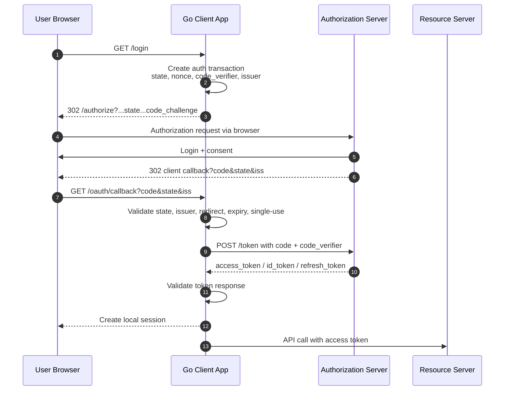
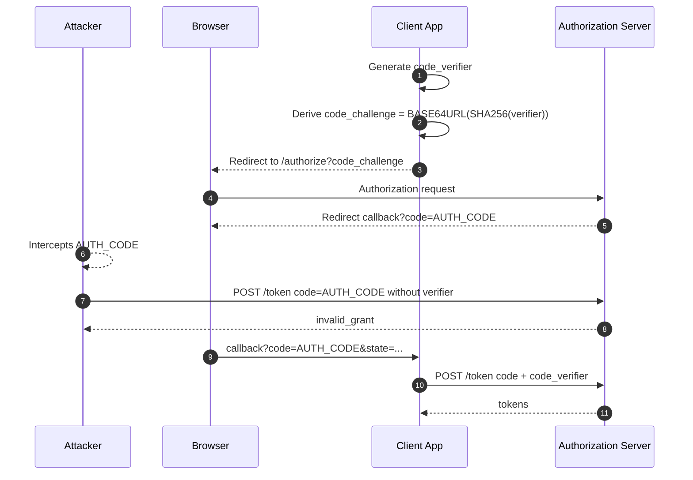
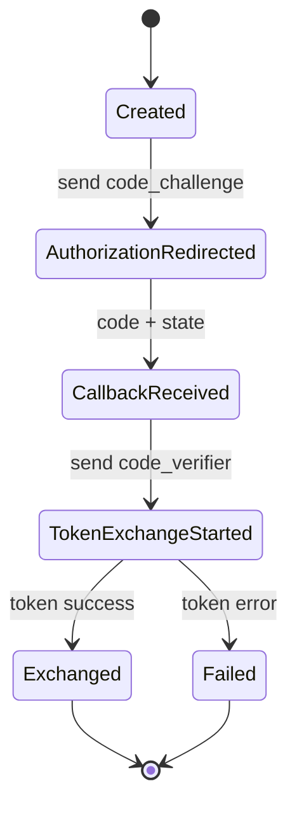
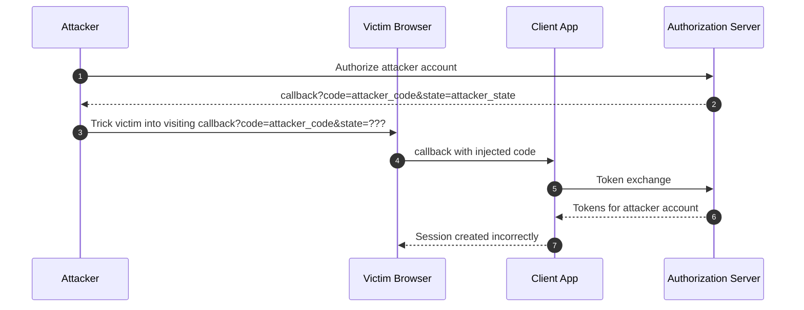
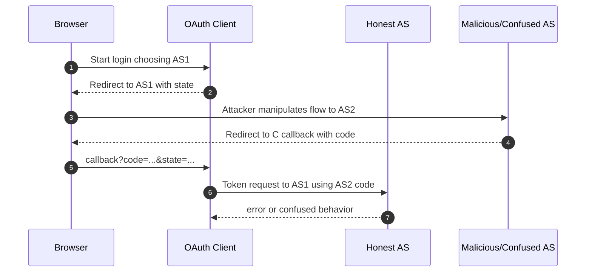
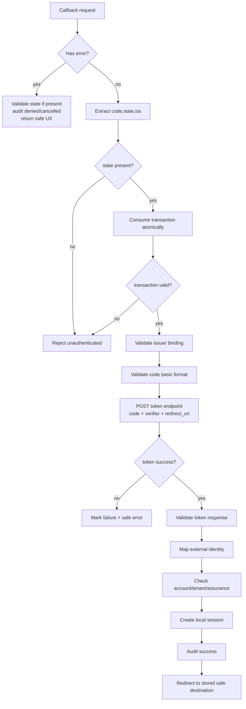
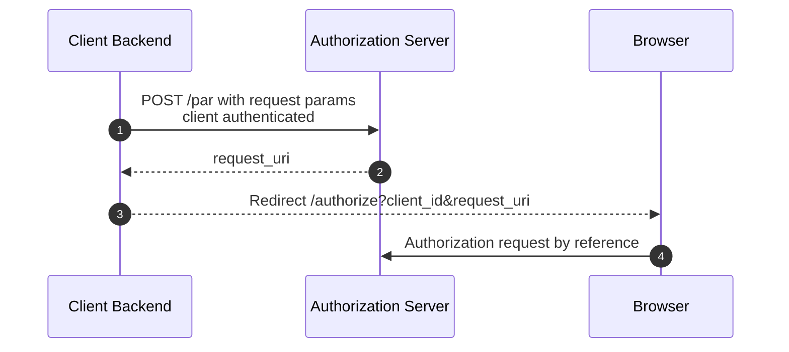
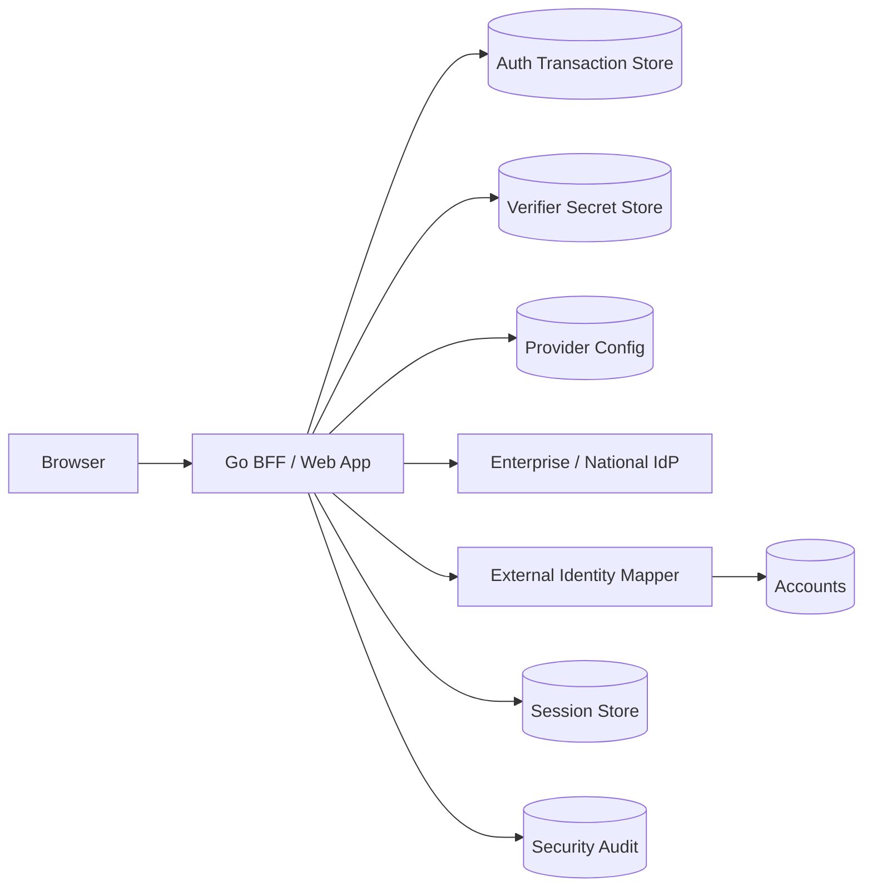

# learn-go-authentication-authorization-identity-permission-part-014.md

# Part 014 — OAuth2 Security BCP: PKCE, Redirect URI, State, Mix-Up, Code Injection

> Seri: **learn-go-authentication-authorization-identity-permission**  
> Fokus: **OAuth 2.0 front-channel hardening dan authorization code flow yang aman di Go**  
> Baseline Go: **Go 1.26.x**  
> Level: **Advanced / internal engineering handbook style**

---

## Daftar Isi

1. [Tujuan Bagian Ini](#1-tujuan-bagian-ini)
2. [Premis Utama: OAuth Flow Aman Karena Boundaries, Bukan Karena Parameter Lengkap](#2-premis-utama-oauth-flow-aman-karena-boundaries-bukan-karena-parameter-lengkap)
3. [Scope Bagian Ini](#3-scope-bagian-ini)
4. [Sumber Primer dan Posisi RFC 9700](#4-sumber-primer-dan-posisi-rfc-9700)
5. [Mental Model Front-Channel vs Back-Channel](#5-mental-model-front-channel-vs-back-channel)
6. [Security Invariants untuk Authorization Code Flow](#6-security-invariants-untuk-authorization-code-flow)
7. [Threat Taxonomy](#7-threat-taxonomy)
8. [Authorization Code Interception](#8-authorization-code-interception)
9. [PKCE: Proof Key for Code Exchange](#9-pkce-proof-key-for-code-exchange)
10. [PKCE Bukan Client Authentication](#10-pkce-bukan-client-authentication)
11. [PKCE Data Model dan Lifecycle](#11-pkce-data-model-dan-lifecycle)
12. [Generate Code Verifier dan Challenge di Go](#12-generate-code-verifier-dan-challenge-di-go)
13. [State Parameter: CSRF Correlation dan Flow Binding](#13-state-parameter-csrf-correlation-dan-flow-binding)
14. [State Bukan Tempat Menyimpan Semua Data](#14-state-bukan-tempat-menyimpan-semua-data)
15. [Server-Side Authorization Transaction Store](#15-server-side-authorization-transaction-store)
16. [Redirect URI Attack Surface](#16-redirect-uri-attack-surface)
17. [Redirect URI Validation yang Benar](#17-redirect-uri-validation-yang-benar)
18. [Open Redirect pada Client Callback](#18-open-redirect-pada-client-callback)
19. [Authorization Code Injection dan Code Substitution](#19-authorization-code-injection-dan-code-substitution)
20. [Mix-Up Attack](#20-mix-up-attack)
21. [Issuer Binding dan RFC 9207](#21-issuer-binding-dan-rfc-9207)
22. [OIDC Nonce vs OAuth State](#22-oidc-nonce-vs-oauth-state)
23. [Redirect Endpoint sebagai Security Boundary](#23-redirect-endpoint-sebagai-security-boundary)
24. [Callback Validation Pipeline](#24-callback-validation-pipeline)
25. [Token Endpoint Request Hardening](#25-token-endpoint-request-hardening)
26. [Browser-Based App, SPA, BFF, dan Native App](#26-browser-based-app-spa-bff-dan-native-app)
27. [PAR dan JAR sebagai Hardening Lanjutan](#27-par-dan-jar-sebagai-hardening-lanjutan)
28. [Scope, Consent, dan Parameter Injection](#28-scope-consent-dan-parameter-injection)
29. [Go Package Boundary](#29-go-package-boundary)
30. [Reference Domain Types](#30-reference-domain-types)
31. [Storage Schema](#31-storage-schema)
32. [Authorization Start Handler](#32-authorization-start-handler)
33. [Authorization Callback Handler](#33-authorization-callback-handler)
34. [HTTP Cookie Design untuk OAuth Transaction](#34-http-cookie-design-untuk-oauth-transaction)
35. [Race Condition dan Idempotency](#35-race-condition-dan-idempotency)
36. [Error Taxonomy dan Response Strategy](#36-error-taxonomy-dan-response-strategy)
37. [Observability dan Audit](#37-observability-dan-audit)
38. [Testing Strategy](#38-testing-strategy)
39. [Failure-Mode Matrix](#39-failure-mode-matrix)
40. [Production Checklist](#40-production-checklist)
41. [Case Study: Enterprise SSO untuk Regulatory Platform](#41-case-study-enterprise-sso-untuk-regulatory-platform)
42. [Anti-Pattern yang Harus Dihapus dari Codebase](#42-anti-pattern-yang-harus-dihapus-dari-codebase)
43. [Ringkasan Mental Model](#43-ringkasan-mental-model)
44. [Latihan](#44-latihan)
45. [Referensi Primer](#45-referensi-primer)

---

## 1. Tujuan Bagian Ini

Bagian ini membahas security hardening untuk OAuth 2.0 authorization code flow, terutama pada area yang sering terlihat sederhana tetapi rawan fatal:

1. **PKCE** untuk melindungi authorization code dari interception dan injection.
2. **Redirect URI validation** untuk mencegah code leakage ke domain/endpoint attacker.
3. **State parameter** untuk CSRF protection dan flow correlation.
4. **Mix-up attack defense** untuk client yang mendukung lebih dari satu authorization server.
5. **Authorization code injection/substitution** untuk mencegah user login ke account attacker atau attacker menukar grant.
6. **Callback validation pipeline** sebagai gate wajib sebelum token exchange.
7. **Go implementation pattern** yang auditable, testable, dan aman terhadap race condition.

Setelah bagian ini, target pemahaman Anda:

- Bisa mendesain OAuth client flow yang aman untuk web backend, BFF, SPA-assisted flow, native app callback, dan enterprise SSO.
- Bisa menjelaskan kenapa `state`, `nonce`, `code_verifier`, `redirect_uri`, `issuer`, dan `client_id` harus diperlakukan sebagai **flow-binding material**.
- Bisa membangun `AuthorizationTransactionStore` di Go yang single-use, expiring, race-safe, dan tidak bocor data sensitif.
- Bisa melakukan review implementasi OAuth existing dan menemukan bug security yang sering lolos dari unit test biasa.
- Bisa membedakan mitigasi untuk CSRF, code interception, code injection, open redirect, mix-up, dan token substitution.

---

## 2. Premis Utama: OAuth Flow Aman Karena Boundaries, Bukan Karena Parameter Lengkap

OAuth request yang memiliki parameter lengkap belum tentu aman.

Contoh request yang terlihat benar:

```text
GET /authorize?
  response_type=code&
  client_id=web-client&
  redirect_uri=https%3A%2F%2Fapp.example.com%2Foauth%2Fcallback&
  scope=openid%20profile&
  state=abc&
  code_challenge=xyz&
  code_challenge_method=S256
```

Tetapi request tersebut tetap bisa rapuh jika:

- `state` tidak diverifikasi terhadap transaksi server-side;
- `state` reusable;
- `state` tidak bind ke issuer/provider;
- `code_verifier` disimpan di browser local storage;
- callback endpoint menerima `next=https://evil.example`;
- `redirect_uri` memakai prefix matching;
- client mengambil token endpoint berdasarkan query parameter callback, bukan berdasarkan konfigurasi issuer yang dipercaya;
- authorization code dapat ditukar lebih dari sekali;
- token response tidak diverifikasi issuer/audience/token type-nya;
- multi-IdP login tidak membedakan flow Google, Microsoft, enterprise SAML bridge, dan internal IdP;
- error callback tidak diaudit.

Mental model yang benar:

> OAuth authorization flow aman ketika setiap artifact yang melintasi browser bisa dikorelasikan kembali ke transaksi yang dibuat server, digunakan sekali, dibatasi waktu, di-bind ke issuer/client/redirect/scope, lalu diverifikasi sebelum token exchange.

---

## 3. Scope Bagian Ini

Yang dibahas:

- authorization code flow hardening;
- PKCE;
- state;
- redirect URI;
- callback validation;
- mix-up attack;
- code injection/substitution;
- issuer binding;
- parameter injection;
- Go implementation;
- audit dan testing.

Yang tidak dibahas detail karena sudah atau akan masuk part lain:

- validasi JWT/JWKS secara mendalam: Part 010;
- token refresh/revocation: Part 011;
- OAuth fundamentals: Part 013;
- OIDC claims dan ID Token detail: Part 015;
- building OIDC client/RP: Part 016;
- authorization server internals: Part 017;
- federation/SAML/enterprise SSO: Part 018.

---

## 4. Sumber Primer dan Posisi RFC 9700

Materi ini berangkat dari beberapa sumber primer:

- **RFC 6749** — OAuth 2.0 Authorization Framework.
- **RFC 6750** — Bearer Token Usage.
- **RFC 7636** — Proof Key for Code Exchange.
- **RFC 8252** — OAuth 2.0 for Native Apps.
- **RFC 9207** — Authorization Server Issuer Identification.
- **RFC 9700** — Best Current Practice for OAuth 2.0 Security.
- **RFC 9126** — Pushed Authorization Requests.
- **RFC 9101** — JWT-Secured Authorization Request.
- **OpenID Connect Core 1.0** — untuk `nonce`, ID Token, dan issuer validation pada OIDC.

Posisi RFC 9700 penting: ia bukan OAuth “tambahan kecil”, tetapi konsolidasi best current practice yang memperbarui dan memperluas threat model OAuth lama. Praktik yang dulunya dianggap opsional pada beberapa deployment sekarang harus diperlakukan sebagai baseline untuk sistem modern.

Dalam desain internal engineering handbook, gunakan prinsip ini:

> Implementasi OAuth baru harus didesain seolah-olah attacker bisa mengamati, memodifikasi, atau mengulang bagian front-channel selama browser redirect, kecuali hal itu dilindungi oleh binding, signature, one-time state, PKCE, issuer validation, atau server-side transaction state.

---

## 5. Mental Model Front-Channel vs Back-Channel

OAuth interactive flow memakai dua jalur:

| Jalur | Lewat | Contoh | Risiko utama |
|---|---|---|---|
| Front-channel | Browser/user-agent | `/authorize`, redirect callback | parameter tampering, CSRF, code leakage, mix-up, open redirect |
| Back-channel | Server-to-server | token endpoint, PAR endpoint, JWKS fetch | TLS trust, client auth, issuer confusion, timeout, retry, secret management |

Diagram sederhana:



Security observation:

- Authorization code melewati browser, jadi jangan dianggap rahasia sempurna.
- `state` melewati browser, jadi jangan dianggap rahasia sempurna.
- `code_challenge` melewati browser, memang didesain public.
- `code_verifier` **tidak boleh** melewati browser redirect authorization request.
- Token exchange terjadi via back-channel dan harus menjadi satu-satunya tempat code ditukar menjadi token.

---

## 6. Security Invariants untuk Authorization Code Flow

Gunakan invariant berikut saat design review:

### Invariant 1 — Authorization transaction harus server-created

Login flow harus diawali oleh client app yang membuat transaksi:

```text
AuthTransaction {
  id,
  provider/issuer,
  client_id,
  redirect_uri,
  state_hash,
  nonce_hash,
  code_verifier_encrypted_or_hash_reference,
  requested_scopes,
  tenant_context,
  post_login_redirect,
  created_at,
  expires_at,
  used_at,
  ip/user_agent hints
}
```

Callback tanpa transaksi valid harus ditolak.

### Invariant 2 — State harus single-use

`state` bukan hanya random string; ia adalah handle/correlation key ke authorization transaction. Setelah callback valid, transaksi harus ditandai used secara atomik.

### Invariant 3 — PKCE verifier tidak boleh hilang atau bisa ditebak

Jika `code_verifier` hilang, token exchange gagal. Jika verifier bisa ditebak/bocor, attacker dapat menukar intercepted code.

### Invariant 4 — Issuer/provider harus di-bind sejak awal

Jangan memilih token endpoint berdasarkan data yang dikirim browser tanpa binding ke transaksi. Multi-provider client harus tahu dari transaksi bahwa flow ini milik issuer A, bukan issuer B.

### Invariant 5 — Redirect URI harus exact registered redirect

Prefix matching, wildcard host, atau query bebas membuka attack surface besar.

### Invariant 6 — Authorization code harus ditukar sekali

Client harus memperlakukan code sebagai one-time credential. Authorization server wajib enforce one-time use; client juga harus membuat callback handling idempotent dan race-safe.

### Invariant 7 — OAuth success belum berarti local login success

Setelah token response sukses, client masih perlu:

- memvalidasi token;
- memetakan external identity ke internal account;
- mengecek account state;
- mengecek tenant boundary;
- mengecek assurance/step-up requirement;
- membuat local session dengan authority yang benar.

---

## 7. Threat Taxonomy

| Threat | Gejala | Root cause | Mitigasi utama |
|---|---|---|---|
| CSRF login | Victim login sebagai account attacker | state lemah/tidak diverifikasi | high entropy state, server-side transaction, SameSite cookie |
| Code interception | Attacker mencuri code di redirect | code melewati browser/custom URI | PKCE S256, short code TTL, one-time code |
| Code injection | Attacker inject code ke callback victim | callback tidak bind ke state/session | state + PKCE + issuer binding |
| Redirect URI manipulation | Code dikirim ke attacker endpoint | redirect validation lemah | exact redirect matching |
| Open redirect | Callback lanjut ke evil URL | post-login redirect tidak divalidasi | relative redirect allowlist |
| Mix-up | Code dari AS-A dikirim ke token endpoint AS-B atau sebaliknya | multi-AS binding lemah | issuer binding, RFC 9207 `iss`, OIDC issuer validation |
| Scope injection | Client meminta/menyetujui scope tak diharapkan | request param tidak controlled server-side | server-side allowed scope policy, PAR/JAR |
| Consent phishing | User diarahkan ke client/issuer palsu | weak client metadata / redirect confusion | verified redirect, client display metadata, issuer trust |
| Replay callback | Callback URL dipakai ulang | state/code reusable | single-use transaction, code one-time exchange |
| Token substitution | Token untuk audience/issuer lain dipakai | token validation lemah | issuer, audience, azp/client_id, token type validation |

---

## 8. Authorization Code Interception

Authorization code interception terjadi ketika attacker mendapatkan authorization code yang dikirim dari authorization server ke redirect URI client.

Skenario umum:

1. Native app memakai custom URI scheme yang bisa diklaim aplikasi lain.
2. Browser history/log/proxy mencatat callback URL.
3. Mobile OS/app link misconfiguration.
4. Reverse proxy/access log menyimpan full query string.
5. Malware/browser extension membaca URL.
6. Callback URL dibocorkan lewat referer karena halaman callback memuat resource eksternal sebelum membersihkan URL.

Tanpa PKCE:

```text
attacker obtains code
attacker sends code + client_id/client_secret? to token endpoint
authorization server returns token
```

Dengan PKCE:

```text
attacker obtains code
attacker lacks code_verifier
/token request fails
```

Diagram:



Key idea:

> Authorization code yang bocor tidak cukup untuk menukar token jika token endpoint membutuhkan proof berupa `code_verifier` yang hanya diketahui client yang memulai flow.

---

## 9. PKCE: Proof Key for Code Exchange

PKCE memakai dua nilai:

| Nilai | Lokasi | Sifat |
|---|---|---|
| `code_verifier` | client/server transaction store | secret, high entropy |
| `code_challenge` | authorization request | public derivative |

Untuk method `S256`:

```text
code_challenge = BASE64URL-ENCODE(SHA256(ASCII(code_verifier)))
```

Authorization request membawa:

```text
code_challenge=...
code_challenge_method=S256
```

Token request membawa:

```text
code=...
code_verifier=original_secret
```

Authorization server menyimpan challenge pada authorization code. Saat token exchange, server menghitung ulang challenge dari verifier dan membandingkannya dengan challenge yang terikat pada code.

### Kenapa S256 wajib diprioritaskan

PKCE mendukung method `plain`, tetapi untuk sistem modern, gunakan `S256` sebagai baseline. `plain` tidak memberi perlindungan yang sama jika authorization request dapat diamati, karena challenge sama dengan verifier.

Policy internal yang sehat:

```text
- Client must send PKCE.
- Server must require PKCE for public clients.
- Server should require PKCE for confidential clients too.
- Server must reject code_challenge_method=plain unless explicit legacy exception.
- Client must generate verifier per authorization transaction.
- Client must never reuse verifier.
```

---

## 10. PKCE Bukan Client Authentication

PKCE sering disalahpahami sebagai pengganti client secret.

Yang benar:

- PKCE membuktikan bahwa entity yang menukar code adalah entity yang memulai authorization request.
- Client authentication membuktikan identitas confidential client ke token endpoint.
- Public client tidak bisa menjaga client secret secara kuat.
- Confidential client tetap perlu client authentication sesuai kebutuhan, dan tetap bisa memakai PKCE.

Tabel:

| Mekanisme | Membuktikan apa? | Melindungi dari apa? |
|---|---|---|
| PKCE | possession of verifier bound to auth request | code interception/injection |
| Client secret | confidential client identity | unauthorized token endpoint use |
| mTLS/private_key_jwt | stronger client authentication | secret replay/leak risk |
| Redirect URI validation | where code may be sent | code leakage to attacker endpoint |
| State | callback belongs to initiated transaction | CSRF/login injection |

Engineering rule:

> Jangan pernah menulis komentar “PKCE authenticates the client”. Komentar seperti itu biasanya menandakan desain mental yang salah.

---

## 11. PKCE Data Model dan Lifecycle

Lifecycle PKCE:



PKCE verifier harus terkait dengan authorization transaction.

Contoh field:

```text
auth_transactions
- id
- state_hash
- code_verifier_ciphertext
- code_challenge
- code_challenge_method
- issuer
- client_id
- redirect_uri
- requested_scopes_json
- created_at
- expires_at
- used_at
```

Pilihan storage untuk `code_verifier`:

| Strategy | Pro | Kontra |
|---|---|---|
| Server-side DB encrypted | survives restart, auditable | perlu encryption key management |
| Server-side Redis encrypted | cepat, TTL native | volatile, perlu HA |
| Signed/encrypted cookie | stateless-ish | ukuran cookie, rotation, replay handling lebih sulit |
| Browser local/session storage | mudah untuk SPA | exposure tinggi, tidak cocok untuk BFF/server web |

Untuk web backend/BFF enterprise, preferensi kuat:

```text
server-side transaction store + SameSite cookie carrying only opaque transaction handle or csrf correlation
```

---

## 12. Generate Code Verifier dan Challenge di Go

PKCE verifier harus high-entropy dan URL-safe.

Contoh implementasi Go:

```go
package oauthsec

import (
    "crypto/rand"
    "crypto/sha256"
    "encoding/base64"
    "fmt"
)

const CodeVerifierBytes = 32

func NewCodeVerifier() (string, error) {
    b := make([]byte, CodeVerifierBytes)
    if _, err := rand.Read(b); err != nil {
        return "", fmt.Errorf("generate code verifier: %w", err)
    }
    return base64.RawURLEncoding.EncodeToString(b), nil
}

func S256Challenge(verifier string) string {
    sum := sha256.Sum256([]byte(verifier))
    return base64.RawURLEncoding.EncodeToString(sum[:])
}
```

Catatan:

- `base64.RawURLEncoding` menghasilkan base64url tanpa padding.
- Jangan pakai `math/rand`.
- Jangan derive verifier dari session ID, user ID, timestamp, atau hash email.
- Jangan reuse verifier antar login attempt.
- Jangan log verifier.
- Jangan expose verifier ke frontend jika flow dikelola backend.

### Stronger generator dengan panjang eksplisit

```go
func RandomURLSafeString(nBytes int) (string, error) {
    if nBytes < 16 {
        return "", fmt.Errorf("nBytes too small: %d", nBytes)
    }
    b := make([]byte, nBytes)
    if _, err := rand.Read(b); err != nil {
        return "", err
    }
    return base64.RawURLEncoding.EncodeToString(b), nil
}
```

### Unit test dasar

```go
func TestS256ChallengeDeterministic(t *testing.T) {
    verifier := "dBjftJeZ4CVP-mB92K27uhbUJU1p1r_wW1gFWFOEjXk"
    got := S256Challenge(verifier)
    want := "E9Melhoa2OwvFrEMTJguCHaoeK1t8URWbuGJSstw-cM"
    if got != want {
        t.Fatalf("challenge mismatch: got %q want %q", got, want)
    }
}
```

Test vector tersebut berasal dari RFC 7636.

---

## 13. State Parameter: CSRF Correlation dan Flow Binding

`state` adalah nilai opaque yang dikirim client di authorization request dan dikembalikan authorization server di callback.

Fungsi utama:

1. **CSRF protection**: callback harus cocok dengan login flow yang dimulai user/browser yang sama.
2. **Flow correlation**: callback harus map ke authorization transaction tertentu.
3. **Issuer/provider binding**: flow harus tetap milik provider yang dipilih saat start.
4. **Post-login redirect binding**: setelah sukses, user hanya diarahkan ke destination yang sudah divalidasi.
5. **Tenant binding**: flow multi-tenant harus kembali ke tenant context yang benar.

Yang sering salah:

```go
// Bad: predictable state
state := fmt.Sprintf("%d", time.Now().Unix())

// Bad: state stored only in query without server-side verification
redirect := authURL + "&state=" + state

// Bad: state contains raw JSON with user intent and no integrity protection
state := base64.StdEncoding.EncodeToString([]byte(`{"next":"https://evil.example"}`))
```

Desain lebih baik:

```text
state = random 128-256 bit opaque string
store hash(state) in auth_transactions
send raw state to browser
on callback: hash(received_state), lookup unexpired unused transaction
```

Kenapa hash state di database?

- Jika DB snapshot bocor, attacker tidak langsung bisa replay state.
- Konsisten dengan pola penyimpanan token rahasia.
- Audit tetap bisa dilakukan via prefix/fingerprint.

---

## 14. State Bukan Tempat Menyimpan Semua Data

Ada godaan menyimpan banyak data di `state`:

```json
{
  "provider": "google",
  "next": "https://app.example.com/dashboard",
  "tenant": "agency-a",
  "csrf": "...",
  "created_at": "..."
}
```

Ini bisa aman jika ditandatangani dan/atau dienkripsi dengan benar, tetapi biasanya tidak perlu. Untuk enterprise app, model server-side lebih mudah diaudit.

Recommended split:

| Data | Di `state`? | Di server-side transaction? |
|---|---:|---:|
| Random correlation value | Ya | hash-nya |
| Provider/issuer | Tidak | Ya |
| Code verifier | Tidak | Ya |
| Post-login redirect | Tidak | Ya, setelah allowlist |
| Tenant context | Tidak | Ya |
| Requested scopes | Tidak | Ya |
| Nonce hash | Tidak | Ya |
| User identity | Tidak | Belum diketahui saat start |

Rule:

> Treat `state` as a pointer, not a suitcase.

---

## 15. Server-Side Authorization Transaction Store

OAuth interactive login harus menciptakan authorization transaction.

Interface Go:

```go
package oauthflow

import (
    "context"
    "time"
)

type TransactionID string
type Issuer string
type ClientID string

type AuthorizationTransaction struct {
    ID                  TransactionID
    StateHash           []byte
    NonceHash           []byte
    CodeVerifierCipher  []byte
    CodeChallenge       string
    CodeChallengeMethod string

    Issuer              Issuer
    ClientID            ClientID
    RedirectURI          string
    RequestedScopes      []string
    TenantHint           string
    PostLoginRedirect    string

    CreatedAt            time.Time
    ExpiresAt            time.Time
    UsedAt               *time.Time
    FailureReason        string

    UserAgentHash        []byte
    IPPrefixHash         []byte
}

type TransactionStore interface {
    Create(ctx context.Context, tx AuthorizationTransaction) error
    ConsumeByState(ctx context.Context, rawState string, now time.Time) (AuthorizationTransaction, error)
    MarkFailed(ctx context.Context, id TransactionID, reason string) error
}
```

`ConsumeByState` harus atomik:

```sql
UPDATE oauth_auth_transactions
SET used_at = :now
WHERE state_hash = :state_hash
  AND used_at IS NULL
  AND expires_at > :now
RETURNING ...;
```

Jika database tidak mendukung `RETURNING`, lakukan dalam transaction dengan row lock.

Kenapa atomik penting?

- Callback dapat diklik dua kali.
- Browser retry bisa terjadi.
- Attacker bisa replay callback URL.
- Load balancer bisa mengirim duplicate request.
- User double-tap login pada mobile.

---

## 16. Redirect URI Attack Surface

Redirect URI adalah tempat authorization server mengirim authorization code. Karena code bisa ditukar menjadi token, redirect URI validation adalah salah satu boundary paling kritis.

Serangan umum:

1. **Wildcard host**:

```text
https://*.example.com/callback
```

Jika attacker menguasai subdomain lemah, code bocor.

2. **Prefix matching**:

```text
Registered: https://app.example.com/callback
Accepted:   https://app.example.com/callback.evil.com
```

3. **Open redirect chaining**:

```text
https://app.example.com/redirect?to=https://evil.example
```

4. **Query parameter confusion**:

```text
https://app.example.com/callback?next=https://evil.example
```

5. **Path traversal/canonicalization bug**:

```text
https://app.example.com/oauth/../redirect
```

6. **HTTP allowed in production**:

```text
http://app.example.com/callback
```

7. **Loopback/native app ambiguity**:

```text
http://127.0.0.1:{dynamic_port}/callback
```

Native app mempunyai aturan khusus, tetapi web confidential client tidak boleh meniru kelonggaran native app.

---

## 17. Redirect URI Validation yang Benar

Policy modern:

```text
- exact match registered redirect URI untuk web clients;
- HTTPS wajib kecuali loopback native app sesuai profile;
- tidak ada wildcard host;
- tidak ada prefix matching;
- tidak menerima redirect URI dari request jika client hanya punya satu registered URI;
- jika multiple registered URIs, request redirect_uri harus exact one-of;
- normalize secara hati-hati saat registration, bukan saat runtime secara longgar;
- callback endpoint tidak boleh menjadi open redirect;
- post-login redirect harus dipisah dari OAuth redirect_uri.
```

### Data model client registration

```text
oauth_clients
- id
- client_id
- client_type
- auth_method
- issuer
- status

oauth_client_redirect_uris
- id
- client_id
- redirect_uri
- environment
- created_at
```

### Go validator

```go
package oauthclient

import (
    "errors"
    "net/url"
)

var ErrRedirectURINotRegistered = errors.New("redirect uri not registered")
var ErrRedirectURIInvalid = errors.New("redirect uri invalid")

func ValidateRedirectURI(requested string, registered []string) error {
    u, err := url.Parse(requested)
    if err != nil || !u.IsAbs() || u.Host == "" {
        return ErrRedirectURIInvalid
    }

    // For web clients: HTTPS only. Loopback/native exceptions must be handled
    // by separate policy, not hidden here.
    if u.Scheme != "https" {
        return ErrRedirectURIInvalid
    }

    for _, r := range registered {
        if requested == r { // exact string match against registered value
            return nil
        }
    }
    return ErrRedirectURINotRegistered
}
```

Kenapa exact string match?

- URL canonicalization memiliki banyak edge case.
- Beberapa server/framework berbeda dalam decoding path.
- Security rule harus mudah diaudit.
- Registration-time validation bisa memastikan bentuk URI benar.

### Registration-time validation

Saat admin/client developer mendaftarkan redirect URI:

- reject fragment (`#...`);
- reject username/password component;
- reject wildcard host;
- reject public suffix oddity jika policy membutuhkan;
- reject raw IP untuk web clients kecuali explicit dev profile;
- reject non-HTTPS;
- reject `localhost` untuk production;
- reject path yang terlalu umum seperti `/redirect` jika endpoint open redirect.

---

## 18. Open Redirect pada Client Callback

OAuth callback sering melakukan:

```text
/oauth/callback?code=...&state=... -> create session -> redirect to next
```

Jika `next` diterima dari query callback secara bebas, attacker bisa membuat URL:

```text
https://app.example.com/oauth/callback?code=...&state=...&next=https://evil.example
```

Atau jika `next` disimpan dalam state tanpa validasi, hasilnya sama.

Policy post-login redirect:

```text
- Prefer relative path only: /dashboard, /cases/123.
- Reject scheme-relative URL: //evil.example.
- Reject absolute URL unless in strict allowlist.
- Normalize and validate before storing transaction.
- Store allowed next in server-side transaction.
- Never trust next from callback query.
```

Go helper:

```go
func NormalizePostLoginRedirect(raw string) (string, error) {
    if raw == "" {
        return "/"
    }
    u, err := url.Parse(raw)
    if err != nil {
        return "", err
    }
    if u.IsAbs() || u.Host != "" {
        return "", errors.New("absolute redirect not allowed")
    }
    if raw[0] != '/' {
        return "", errors.New("redirect must be absolute path")
    }
    if len(raw) >= 2 && raw[:2] == "//" {
        return "", errors.New("scheme-relative redirect not allowed")
    }
    return raw, nil
}
```

---

## 19. Authorization Code Injection dan Code Substitution

Authorization code injection terjadi saat attacker memasukkan code miliknya ke callback victim.

Dampak:

- victim bisa login sebagai attacker;
- attacker dapat membuat victim melakukan action dalam session attacker;
- account linking bisa menghubungkan external identity attacker ke account victim;
- client dapat menyimpan token milik attacker pada account victim;
- audit menjadi salah karena subject/actor bercampur.

Skenario simplified:



Mitigasi:

- `state` harus cocok dengan flow victim yang valid;
- `state` single-use;
- PKCE verifier harus cocok dengan code challenge pada code;
- issuer harus cocok;
- nonce harus cocok untuk OIDC;
- account linking harus membutuhkan authenticated local session dan step-up untuk high-risk bind;
- callback tanpa transaction harus ditolak, bukan memulai flow baru.

Important distinction:

| Serangan | `state` membantu? | PKCE membantu? | Issuer binding membantu? |
|---|---:|---:|---:|
| CSRF login | Ya | Sebagian | Sebagian |
| Code interception | Tidak cukup | Ya | Tidak utama |
| Code injection | Ya | Ya | Ya jika multi-AS |
| Mix-up | Tidak cukup | Tidak cukup | Ya |
| Open redirect | Tidak | Tidak | Tidak |

---

## 20. Mix-Up Attack

Mix-up attack relevan ketika client berinteraksi dengan lebih dari satu authorization server.

Contoh:

- `login with GovSSO`
- `login with Google`
- `login with Microsoft Entra ID`
- `login with internal IdP`
- `login with agency-specific IdP`

Root problem:

> Client menerima callback tetapi bingung authorization server mana yang sebenarnya memproses request, lalu menukar code ke token endpoint yang salah atau mengasosiasikan response dengan issuer yang salah.

Simplified attack shape:



Dalam variasi tertentu, attacker memanfaatkan perbedaan endpoint, dynamic client registration, atau discovery confusion.

Mitigasi:

1. Store selected issuer/provider in transaction when login starts.
2. On callback, resolve transaction from state.
3. Use token endpoint from trusted config for that issuer, not from callback input.
4. If authorization response contains `iss`, verify it equals transaction issuer.
5. For OIDC, validate ID Token `iss` and `aud`.
6. Do not multiplex multiple issuers through one loose callback without issuer binding.
7. Do not infer provider from `redirect_uri` path alone unless path is part of registered trusted configuration.

---

## 21. Issuer Binding dan RFC 9207

Issuer binding menjawab:

```text
Authorization response ini datang dari authorization server mana?
```

Pada OIDC, issuer juga muncul di discovery metadata dan ID Token. Untuk OAuth murni, RFC 9207 menambahkan authorization server issuer identification lewat parameter `iss` pada authorization response.

Design rule:

```text
expected_issuer = auth_transaction.issuer
actual_issuer = callback.iss if present, otherwise provider-specific validated signal
if actual_issuer present and actual_issuer != expected_issuer: reject
```

Go model:

```go
type ProviderConfig struct {
    Name                  string
    Issuer                string
    AuthorizationEndpoint string
    TokenEndpoint         string
    JWKSURI               string
    ClientID              string
    RedirectURI           string
    RequireIssuerParam    bool
}
```

Callback validation:

```go
func ValidateIssuer(expected string, got string, require bool) error {
    if got == "" {
        if require {
            return errors.New("missing issuer")
        }
        return nil
    }
    if got != expected {
        return errors.New("issuer mismatch")
    }
    return nil
}
```

Security nuance:

- Jangan menerima issuer arbitrary lalu fetch discovery document on the fly tanpa allowlist.
- Jangan memakai `iss` dari callback sebagai kunci utama untuk memilih token endpoint sebelum `state` valid.
- Untuk multi-tenant enterprise, issuer bisa berbeda per tenant, tetapi tetap harus berasal dari tenant config yang sudah dipercaya.

---

## 22. OIDC Nonce vs OAuth State

`state` dan `nonce` sering dicampur.

| Parameter | Protocol | Fungsi utama | Kembali lewat |
|---|---|---|---|
| `state` | OAuth/OIDC | CSRF/flow correlation | authorization response callback |
| `nonce` | OIDC | bind ID Token to auth request / replay defense | ID Token claim |

Dalam OIDC:

1. Client membuat `nonce`.
2. Client mengirim nonce di authorization request.
3. Authorization server memasukkan nonce ke ID Token.
4. Client memvalidasi ID Token `nonce` sama dengan transaksi.

State tidak menggantikan nonce.
Nonce tidak menggantikan state.

Desain transaction:

```text
raw_state -> callback query
hash(raw_state) -> DB lookup
raw_nonce -> authorization request
hash(raw_nonce) -> DB comparison after ID Token validation
```

Jika menggunakan OIDC hybrid/implicit legacy, nonce semakin penting. Untuk authorization code flow modern, nonce tetap berguna untuk OIDC login binding dan replay defense.

---

## 23. Redirect Endpoint sebagai Security Boundary

Callback endpoint bukan controller biasa.

Ia adalah boundary yang harus melakukan:

1. Method validation.
2. Error response validation.
3. State extraction.
4. Transaction lookup and atomic consume.
5. Issuer validation.
6. Code format validation.
7. Token exchange with timeout.
8. Token response validation.
9. External identity mapping.
10. Local account state validation.
11. Session creation.
12. Audit event write.
13. Safe redirect.

Ia tidak boleh:

- menerima callback tanpa state;
- menerima POST/GET campur tanpa design jelas;
- menulis log full URL berisi code;
- render halaman yang memuat third-party resource sebelum code dibersihkan;
- melakukan open redirect;
- membuat account/linking otomatis tanpa policy;
- fallback ke provider lain jika token exchange gagal;
- retry token exchange secara agresif dengan same code.

---

## 24. Callback Validation Pipeline

Pipeline recommended:



Core rule:

> Token exchange should happen only after state transaction and issuer binding are valid.

---

## 25. Token Endpoint Request Hardening

Token request untuk authorization code + PKCE:

```http
POST /token HTTP/1.1
Host: issuer.example
Content-Type: application/x-www-form-urlencoded
Authorization: Basic ... optional for confidential clients

grant_type=authorization_code&
code=...&
redirect_uri=https%3A%2F%2Fapp.example.com%2Foauth%2Fcallback&
client_id=...&
code_verifier=...
```

Rules:

- Use expected token endpoint from trusted provider config.
- Use `redirect_uri` exactly same as authorization request when required.
- Include `code_verifier`.
- Authenticate confidential client.
- Use short HTTP timeout.
- Do not retry `invalid_grant`.
- Do not log request body.
- Treat network timeout as ambiguous: code may or may not have been consumed.
- Validate token response before local session creation.

Go HTTP client:

```go
var tokenHTTPClient = &http.Client{
    Timeout: 5 * time.Second,
}
```

Avoid global default client for security-sensitive integration if you need explicit timeout, transport, proxy, TLS, and observability policy.

---

## 26. Browser-Based App, SPA, BFF, dan Native App

### Backend web app

Best shape:

```text
Browser -> Go backend starts OAuth flow
Go backend stores transaction and verifier
Browser only carries state/code
Go backend exchanges code
Go backend creates HttpOnly session cookie
```

### BFF for SPA

Best shape:

```text
SPA -> BFF /login
BFF handles OAuth
BFF stores tokens server-side
SPA receives only application session cookie
```

Ini mengurangi token exposure di browser.

### Pure SPA

Modern SPAs can use authorization code + PKCE, but token storage and refresh token handling are harder. You need strong constraints around:

- no implicit flow;
- code + PKCE;
- refresh token rotation if refresh token issued;
- Content Security Policy;
- no local storage for high-value tokens if avoidable;
- XSS prevention as token theft prevention;
- sender-constrained tokens where available;
- backend mediation if risk is high.

### Native app

Native app harus memakai external user-agent/browser dan PKCE. Redirect URI bisa berupa claimed HTTPS app link/universal link, loopback, atau private-use scheme sesuai platform policy. Embedded web-view sebaiknya dihindari karena phishing dan credential capture risk.

---

## 27. PAR dan JAR sebagai Hardening Lanjutan

### Pushed Authorization Requests — PAR

PAR memindahkan authorization request detail dari front-channel ke back-channel.

Flow:



Keuntungan:

- parameter besar/kompleks tidak lewat browser;
- authorization request bisa di-authenticate via back-channel;
- mengurangi parameter tampering;
- cocok untuk high-assurance, FAPI-style, regulated workloads.

### JWT-Secured Authorization Request — JAR

JAR membungkus authorization request dalam signed JWT. Ini memberi integrity protection terhadap parameter request.

Dalam sistem enterprise, PAR dan JAR berguna ketika:

- scope/claims/authorization_details kompleks;
- high-value transaction;
- client harus membuktikan request integrity;
- regulatory audit perlu request object immutable;
- user-agent path dianggap terlalu berisiko.

Jangan langsung implement custom request signing tanpa memahami JAR/PAR. Lebih aman menggunakan standard yang ada.

---

## 28. Scope, Consent, dan Parameter Injection

Authorization request membawa `scope`. Jangan biarkan frontend membangun scope bebas.

Bad:

```go
scope := r.URL.Query().Get("scope")
authURL := provider.AuthCodeURL(state, oauth2.SetAuthURLParam("scope", scope))
```

Good:

```go
type LoginPurpose string

const (
    PurposeLogin LoginPurpose = "login"
    PurposeLink  LoginPurpose = "link_external_identity"
    PurposeAdmin LoginPurpose = "admin_step_up"
)

func ScopesForPurpose(p LoginPurpose) []string {
    switch p {
    case PurposeLogin:
        return []string{"openid", "profile", "email"}
    case PurposeLink:
        return []string{"openid", "profile", "email"}
    case PurposeAdmin:
        return []string{"openid", "profile", "email", "acr:high"} // illustrative, provider-specific
    default:
        return nil
    }
}
```

Consent harus dipahami sebagai approval layer, bukan authorization final.

User consent:

```text
User says client may access X.
```

Internal authorization:

```text
System says this subject may perform action Y on resource Z under context C.
```

Jangan map `scope=admin` langsung menjadi internal admin permission.

---

## 29. Go Package Boundary

Package layout recommended:

```text
/internal/identity/oauthflow
  transaction.go
  state.go
  pkce.go
  callback.go
  errors.go

/internal/identity/oauthprovider
  config.go
  discovery.go
  token_client.go

/internal/identity/session
  manager.go

/internal/identity/accountlink
  mapper.go

/internal/identity/audit
  events.go
```

Boundary:

| Package | Responsibility |
|---|---|
| `oauthflow` | start/callback transaction orchestration |
| `oauthprovider` | issuer config, endpoints, token exchange |
| `session` | local session creation, rotation, cookie |
| `accountlink` | external identity to internal account mapping |
| `audit` | append-only security events |

Avoid:

```text
handlers/oauth.go with 1000 lines mixing URL building, DB, token validation, user creation, cookie writing, audit, and redirect policy
```

Top-level orchestration is acceptable in application service, but primitives must stay testable.

---

## 30. Reference Domain Types

```go
package oauthflow

import "time"

type AuthPurpose string

const (
    AuthPurposeLogin       AuthPurpose = "login"
    AuthPurposeAccountLink AuthPurpose = "account_link"
    AuthPurposeStepUp      AuthPurpose = "step_up"
)

type AuthTransactionStatus string

const (
    AuthTxPending  AuthTransactionStatus = "pending"
    AuthTxConsumed AuthTransactionStatus = "consumed"
    AuthTxFailed   AuthTransactionStatus = "failed"
    AuthTxExpired  AuthTransactionStatus = "expired"
)

type AuthTransaction struct {
    ID          string
    Status      AuthTransactionStatus
    Purpose     AuthPurpose

    StateHash   []byte
    NonceHash   []byte

    Issuer      string
    ClientID    string
    RedirectURI string
    Scopes      []string

    CodeVerifierRef string // reference to encrypted secret store, or encrypted payload ID
    CodeChallenge    string

    TenantHint        string
    PostLoginRedirect string

    CreatedAt time.Time
    ExpiresAt time.Time
    ConsumedAt *time.Time
}
```

### Callback input type

```go
type CallbackInput struct {
    Code  string
    State string
    Iss  string
    Error string
    ErrorDescription string
}
```

### Callback result type

```go
type CallbackResult struct {
    InternalAccountID string
    SessionID         string
    RedirectTo        string
    AssuranceLevel    string
}
```

---

## 31. Storage Schema

Example PostgreSQL-style schema. Adapt to your DB.

```sql
CREATE TABLE oauth_auth_transactions (
    id UUID PRIMARY KEY,
    status TEXT NOT NULL,
    purpose TEXT NOT NULL,

    state_hash BYTEA NOT NULL UNIQUE,
    nonce_hash BYTEA NULL,

    issuer TEXT NOT NULL,
    client_id TEXT NOT NULL,
    redirect_uri TEXT NOT NULL,
    scopes_json JSONB NOT NULL,

    code_verifier_ciphertext BYTEA NOT NULL,
    code_challenge TEXT NOT NULL,
    code_challenge_method TEXT NOT NULL,

    tenant_hint TEXT NULL,
    post_login_redirect TEXT NOT NULL,

    created_at TIMESTAMPTZ NOT NULL,
    expires_at TIMESTAMPTZ NOT NULL,
    consumed_at TIMESTAMPTZ NULL,
    failed_at TIMESTAMPTZ NULL,
    failure_reason TEXT NULL,

    user_agent_hash BYTEA NULL,
    ip_prefix_hash BYTEA NULL
);

CREATE INDEX idx_oauth_auth_tx_expires_at
ON oauth_auth_transactions (expires_at);

CREATE INDEX idx_oauth_auth_tx_status_created
ON oauth_auth_transactions (status, created_at);
```

Atomic consume:

```sql
UPDATE oauth_auth_transactions
SET status = 'consumed', consumed_at = $2
WHERE state_hash = $1
  AND status = 'pending'
  AND expires_at > $2
RETURNING *;
```

If no row returned:

- invalid state;
- expired state;
- replayed state;
- race already consumed;
- DB inconsistency.

Do not tell user which one. Log/audit internally.

---

## 32. Authorization Start Handler

Example skeleton:

```go
func (h *Handler) StartLogin(w http.ResponseWriter, r *http.Request) {
    ctx := r.Context()

    providerName := r.PathValue("provider")
    provider, err := h.providers.Get(providerName)
    if err != nil {
        h.safeError(w, r, http.StatusBadRequest)
        return
    }

    next, err := NormalizePostLoginRedirect(r.URL.Query().Get("next"))
    if err != nil {
        h.safeError(w, r, http.StatusBadRequest)
        return
    }

    rawState, err := RandomURLSafeString(32)
    if err != nil {
        h.safeError(w, r, http.StatusInternalServerError)
        return
    }
    rawNonce, err := RandomURLSafeString(32)
    if err != nil {
        h.safeError(w, r, http.StatusInternalServerError)
        return
    }
    verifier, err := NewCodeVerifier()
    if err != nil {
        h.safeError(w, r, http.StatusInternalServerError)
        return
    }

    tx := AuthTransaction{
        ID:                  h.ids.New(),
        Status:              AuthTxPending,
        Purpose:             AuthPurposeLogin,
        StateHash:           h.hash.Secret(rawState),
        NonceHash:           h.hash.Secret(rawNonce),
        Issuer:              provider.Issuer,
        ClientID:            provider.ClientID,
        RedirectURI:          provider.RedirectURI,
        Scopes:              []string{"openid", "profile", "email"},
        CodeVerifierRef:     "", // set after encryption/storage
        CodeChallenge:       S256Challenge(verifier),
        CodeChallengeMethod: "S256",
        PostLoginRedirect:   next,
        CreatedAt:           h.clock.Now(),
        ExpiresAt:           h.clock.Now().Add(10 * time.Minute),
    }

    tx.CodeVerifierRef, err = h.secrets.Store(ctx, verifier, tx.ExpiresAt)
    if err != nil {
        h.safeError(w, r, http.StatusInternalServerError)
        return
    }

    if err := h.store.Create(ctx, tx); err != nil {
        h.safeError(w, r, http.StatusInternalServerError)
        return
    }

    authURL := provider.BuildAuthURL(AuthURLParams{
        State:               rawState,
        Nonce:               rawNonce,
        CodeChallenge:       tx.CodeChallenge,
        CodeChallengeMethod: "S256",
        RedirectURI:         tx.RedirectURI,
        Scopes:              tx.Scopes,
    })

    http.Redirect(w, r, authURL, http.StatusFound)
}
```

Production notes:

- `h.providers.Get` must use allowlisted provider config.
- `BuildAuthURL` must not accept arbitrary endpoint from request.
- `next` must be normalized before storing.
- `verifier` should not be logged.
- `state` can be logged only as fingerprint, not raw.

---

## 33. Authorization Callback Handler

Example skeleton:

```go
func (h *Handler) Callback(w http.ResponseWriter, r *http.Request) {
    ctx := r.Context()

    input := CallbackInput{
        Code:             r.URL.Query().Get("code"),
        State:            r.URL.Query().Get("state"),
        Iss:              r.URL.Query().Get("iss"),
        Error:            r.URL.Query().Get("error"),
        ErrorDescription: r.URL.Query().Get("error_description"),
    }

    if input.State == "" {
        h.audit.SecurityEvent(ctx, "oauth_callback_missing_state", nil)
        h.safeError(w, r, http.StatusUnauthorized)
        return
    }

    tx, err := h.store.ConsumeByState(ctx, input.State, h.clock.Now())
    if err != nil {
        h.audit.SecurityEvent(ctx, "oauth_callback_invalid_state", map[string]any{
            "state_fingerprint": h.hash.Fingerprint(input.State),
        })
        h.safeError(w, r, http.StatusUnauthorized)
        return
    }

    if input.Error != "" {
        h.audit.SecurityEvent(ctx, "oauth_callback_error", map[string]any{
            "tx_id": tx.ID,
            "error": input.Error,
        })
        h.redirectSafe(w, r, "/login?error=oauth_cancelled")
        return
    }

    if input.Code == "" {
        h.audit.SecurityEvent(ctx, "oauth_callback_missing_code", map[string]any{"tx_id": tx.ID})
        h.safeError(w, r, http.StatusUnauthorized)
        return
    }

    provider, err := h.providers.GetByIssuer(tx.Issuer)
    if err != nil {
        h.safeError(w, r, http.StatusUnauthorized)
        return
    }

    if err := ValidateIssuer(tx.Issuer, input.Iss, provider.RequireIssuerParam); err != nil {
        h.audit.SecurityEvent(ctx, "oauth_issuer_mismatch", map[string]any{
            "tx_id": tx.ID,
            "expected_issuer": tx.Issuer,
            "actual_issuer": input.Iss,
        })
        h.safeError(w, r, http.StatusUnauthorized)
        return
    }

    verifier, err := h.secrets.Load(ctx, tx.CodeVerifierRef)
    if err != nil {
        h.audit.SecurityEvent(ctx, "oauth_missing_code_verifier", map[string]any{"tx_id": tx.ID})
        h.safeError(w, r, http.StatusUnauthorized)
        return
    }

    tokenResp, err := h.tokenClient.ExchangeCode(ctx, provider, TokenExchangeRequest{
        Code:         input.Code,
        RedirectURI:  tx.RedirectURI,
        CodeVerifier: verifier,
    })
    if err != nil {
        h.audit.SecurityEvent(ctx, "oauth_token_exchange_failed", map[string]any{
            "tx_id": tx.ID,
            "error_class": ClassifyOAuthError(err),
        })
        h.safeError(w, r, http.StatusUnauthorized)
        return
    }

    identity, err := h.identityMapper.Map(ctx, provider, tokenResp, tx)
    if err != nil {
        h.safeError(w, r, http.StatusUnauthorized)
        return
    }

    session, err := h.sessions.Create(ctx, identity.AccountID, SessionCreateOptions{
        AuthMethod: "oidc",
        Issuer:     tx.Issuer,
        ACR:        identity.ACR,
        AMR:        identity.AMR,
    })
    if err != nil {
        h.safeError(w, r, http.StatusInternalServerError)
        return
    }

    h.sessions.WriteCookie(w, session)
    h.audit.SecurityEvent(ctx, "oauth_login_success", map[string]any{
        "tx_id": tx.ID,
        "account_id": identity.AccountID,
        "issuer": tx.Issuer,
    })
    h.redirectSafe(w, r, tx.PostLoginRedirect)
}
```

Real implementation should:

- sanitize error messages;
- never expose provider error details directly;
- validate token response thoroughly;
- handle account disabled/locked/deprovisioned state;
- rotate existing session ID after login;
- clear temporary cookies if used;
- never log full callback URL.

---

## 34. HTTP Cookie Design untuk OAuth Transaction

Ada dua common pattern:

### Pattern A — State-only server-side lookup

Browser hanya membawa `state` di authorization request/callback. Server lookup transaction by state hash.

Pros:

- sederhana;
- works across devices/browser redirect;
- tidak perlu extra cookie.

Cons:

- state yang bocor bisa dicoba replay sampai expired;
- perlu rate limiting dan single-use consume.

### Pattern B — State + same-site transaction cookie

Server juga menulis cookie:

```text
oauth_tx=<opaque_tx_id_or_nonce>; HttpOnly; Secure; SameSite=Lax; Path=/oauth/callback; Max-Age=600
```

Callback harus cocok:

```text
state query valid AND cookie correlation valid
```

Pros:

- stronger browser correlation;
- CSRF protection lebih baik.

Cons:

- bisa bermasalah pada beberapa cross-site redirect/browser setting;
- perlu memikirkan multiple tabs/login attempts;
- native/mobile flow tidak selalu cocok.

Cookie guidance:

```go
http.SetCookie(w, &http.Cookie{
    Name:     "oauth_tx",
    Value:    cookieValue,
    Path:     "/oauth/callback",
    MaxAge:   600,
    Secure:   true,
    HttpOnly: true,
    SameSite: http.SameSiteLaxMode,
})
```

Do not store `code_verifier` in plaintext cookie unless encrypted and replay-safe.

---

## 35. Race Condition dan Idempotency

OAuth callback race example:

```text
T1 callback arrives -> validates state -> token exchange
T2 duplicate callback arrives -> validates same state -> token exchange again
```

Jika state consume tidak atomik, hasilnya:

- duplicate token exchange;
- inconsistent account linking;
- duplicate session creation;
- confusing audit;
- one request succeeds, another fails `invalid_grant`;
- support team melihat false incident.

Correct pattern:

```text
atomic consume state before token exchange
```

Trade-off:

If token exchange times out after state consumed, retrying callback will fail because state already used. This is acceptable because authorization code exchange is not safely idempotent from the client perspective. Safer UX is to ask user to retry login.

For account linking, add idempotency constraint:

```sql
CREATE UNIQUE INDEX uniq_external_identity
ON external_identities (issuer, subject);
```

For session creation, it is okay to create a new session once. Do not create session before token validation.

---

## 36. Error Taxonomy dan Response Strategy

Internal error classes:

| Class | Example | User response | Audit severity |
|---|---|---|---|
| `missing_state` | no state query | generic login failed | high |
| `invalid_state` | not found/expired/replayed | generic login failed | high |
| `oauth_denied` | user denied consent | user-friendly cancelled | low |
| `issuer_mismatch` | callback iss != tx issuer | generic login failed | critical |
| `missing_code` | no code in callback | generic login failed | medium |
| `token_invalid_grant` | code/verifier mismatch | generic login failed | high |
| `token_network_timeout` | timeout | retry login | medium |
| `token_server_error` | AS 5xx | retry later | medium/high |
| `id_token_invalid` | signature/issuer/aud/nonce fail | generic login failed | critical |
| `account_disabled` | mapped account inactive | contact admin | medium |

Do not leak:

- whether state existed;
- whether code was valid;
- whether issuer mismatch happened;
- whether account exists unless UX policy explicitly permits;
- raw provider error descriptions.

Safe user copy:

```text
We could not complete sign-in. Please try again.
```

For user-denied consent:

```text
Sign-in was cancelled.
```

---

## 37. Observability dan Audit

Metrics:

```text
oauth_start_total{provider,purpose}
oauth_callback_total{provider,result,error_class}
oauth_state_invalid_total{provider}
oauth_issuer_mismatch_total{provider}
oauth_token_exchange_duration_seconds{provider,result}
oauth_token_exchange_error_total{provider,error_class}
oauth_login_success_total{provider,tenant}
oauth_account_link_success_total{provider}
```

Logs should include:

- correlation ID;
- transaction ID;
- provider/issuer;
- error class;
- state fingerprint;
- account ID after mapping success;
- session ID fingerprint;
- user agent hash/IP prefix hash if allowed by privacy policy.

Logs must not include:

- authorization code;
- code verifier;
- access token;
- refresh token;
- ID token raw;
- full callback URL;
- raw state;
- raw nonce.

Audit events:

| Event | Actor known? | Subject known? | Notes |
|---|---:|---:|---|
| `oauth_login_started` | no | no | provider, tenant hint, purpose |
| `oauth_callback_received` | no | no | no raw code |
| `oauth_state_rejected` | no | no | possible attack |
| `oauth_issuer_mismatch` | no | no | critical |
| `oauth_token_exchange_failed` | no | no | classify only |
| `oauth_external_identity_mapped` | yes | yes | issuer+sub fingerprint |
| `oauth_login_succeeded` | yes | yes | session fingerprint |
| `oauth_account_linked` | yes | yes | high-risk audit |

---

## 38. Testing Strategy

### Unit tests

1. PKCE verifier/challenge generation.
2. State entropy/format.
3. State hash lookup.
4. Redirect URI exact matching.
5. Post-login redirect validation.
6. Issuer validation.
7. Error classification.
8. Token request builder does not log secrets.

### Integration tests with fake authorization server

Build fake AS supporting:

- `/authorize` redirects with code/state/iss;
- `/token` validates verifier;
- token success;
- invalid_grant;
- issuer mismatch;
- delayed token response;
- duplicate code handling.

### Security regression tests

| Test | Expected |
|---|---|
| callback without state | rejected |
| callback with expired state | rejected |
| callback with replayed state | rejected |
| callback with wrong issuer | rejected |
| callback with injected code but wrong verifier | rejected |
| redirect URI prefix variant | rejected |
| `next=https://evil.example` | rejected |
| `next=//evil.example` | rejected |
| token response with wrong issuer/audience | rejected |
| duplicate callback concurrent | one path max, no double session |

### Concurrency test example

```go
func TestConsumeStateConcurrent(t *testing.T) {
    // Arrange one pending transaction.
    // Launch N goroutines calling ConsumeByState with the same state.
    // Assert exactly one succeeds.
}
```

### Fuzz targets

- redirect URI parser;
- post-login redirect parser;
- callback query parser;
- provider selection logic;
- state length/encoding parser.

---

## 39. Failure-Mode Matrix

| Failure | Likely cause | Safe behavior | Alert? |
|---|---|---|---|
| Missing state | malformed/attack | reject | yes if spike |
| Invalid state | expired/replay/attack | reject | yes |
| Duplicate callback | retry/double click/replay | only one consume | yes if spike |
| Issuer mismatch | mix-up/attack/config bug | reject | critical |
| Token endpoint timeout | AS/network issue | fail login, retry flow | yes |
| `invalid_grant` | expired code, wrong verifier, replay | fail login | yes if spike |
| Redirect URI mismatch | config drift/attack | reject/start fails | yes |
| State store unavailable | DB/Redis outage | fail closed | yes |
| Secret store unavailable | KMS/Redis issue | fail closed | yes |
| Audit write fails | infra issue | depends policy, but high-risk flows may fail closed | yes |
| Clock skew | expiry wrong | small tolerance where appropriate | yes |

Fail-open vs fail-closed:

```text
OAuth callback security validation should fail closed.
```

The only acceptable “soft” behavior is user-friendly retry, not bypass.

---

## 40. Production Checklist

### Authorization request

- [ ] Authorization code flow only for browser login.
- [ ] PKCE S256 enabled.
- [ ] `state` high entropy.
- [ ] `nonce` for OIDC.
- [ ] Provider/issuer chosen from allowlisted config.
- [ ] Redirect URI exact registered value.
- [ ] Scope determined server-side.
- [ ] Post-login redirect validated before storing.
- [ ] Authorization transaction stored server-side.
- [ ] Transaction TTL short, e.g. 5–10 minutes.

### Callback

- [ ] Missing state rejected.
- [ ] State consumed atomically.
- [ ] Replayed/expired state rejected.
- [ ] Issuer verified where available/required.
- [ ] Error callback handled safely.
- [ ] Code missing rejected.
- [ ] Token exchange uses stored provider config.
- [ ] Token exchange uses stored redirect URI.
- [ ] Token exchange includes code verifier.
- [ ] No retry on `invalid_grant`.
- [ ] Token response validated before session.
- [ ] Session rotated/created after successful mapping.
- [ ] Safe redirect only.

### Logging/audit

- [ ] No raw code/state/nonce/verifier/token in logs.
- [ ] Invalid state spike metric.
- [ ] Issuer mismatch critical alert.
- [ ] Token exchange latency metric.
- [ ] Login success/failure audit.
- [ ] Account linking audit.

### Config

- [ ] No wildcard redirect URI.
- [ ] No prefix redirect matching.
- [ ] No HTTP redirect URI in production.
- [ ] No dynamic issuer discovery from user input.
- [ ] Client secret stored in secret manager.
- [ ] Separate dev/staging/prod clients.
- [ ] Provider metadata pinned/allowlisted.

---

## 41. Case Study: Enterprise SSO untuk Regulatory Platform

Context:

- platform case management multi-tenant;
- internal officer login via enterprise IdP;
- external business user login via national identity provider;
- admin can impersonate under controlled workflow;
- regulatory audit requires proof of who logged in, from which issuer, under which assurance level.

### Bad design

```text
/oauth/callback handles all providers.
provider determined from query param ?provider=...
state is UUID stored in browser local storage.
redirect_uri accepts any URL under app.example.com.
post-login next accepted from callback query.
external identity auto-created if email matches.
no issuer mismatch detection.
```

Risks:

- provider mix-up;
- account takeover via email claim confusion;
- open redirect;
- login CSRF;
- replay callback;
- external account linking abuse;
- audit cannot reconstruct intended issuer.

### Better design

```text
/login/{provider} creates transaction:
- provider issuer from server config
- state hash
- nonce hash
- PKCE verifier secret
- tenant hint
- purpose login/link/step-up
- safe post-login redirect

/callback validates:
- state atomic consume
- issuer binding
- PKCE token exchange
- ID token issuer/audience/nonce
- external identity exact issuer+sub mapping
- tenant/account state
- local session with assurance vector
- audit event
```

### Mermaid architecture



### Decision table

| Scenario | Required mitigation |
|---|---|
| Multiple IdPs | issuer binding + allowlisted provider config |
| High-risk admin login | step-up, ACR/AMR validation, shorter session |
| External identity linking | authenticated local session + step-up + audit |
| Cross-tenant user | tenant-bound external identity mapping |
| IdP outage | fail closed for new login, existing session policy separately |
| Callback replay | atomic state consume |

---

## 42. Anti-Pattern yang Harus Dihapus dari Codebase

1. **`state=userID`**

State harus random opaque, bukan identity.

2. **`redirect_uri` prefix matching**

Prefix matching sering bisa dibypass.

3. **Provider from callback query**

```go
provider := r.URL.Query().Get("provider")
```

Provider harus berasal dari transaction/config, bukan callback query.

4. **No PKCE for confidential clients**

Confidential client juga sebaiknya memakai PKCE. Client secret tidak melindungi semua code injection/interception scenario.

5. **Log full callback URL**

Callback URL mengandung `code` dan `state`.

6. **Open redirect after login**

`next` harus allowlisted atau relative path.

7. **Token exchange before state validation**

Selalu validasi transaction dulu.

8. **Auto-link account by email only**

Email bukan stable federated subject. Mapping primer harus `issuer + subject`.

9. **Accept dynamic issuer URL from user input**

Discovery harus allowlisted atau under controlled tenant configuration.

10. **Ignore callback `error`**

Error callback tetap harus diverifikasi state-nya jika state ada, lalu diaudit.

---

## 43. Ringkasan Mental Model

OAuth security pada interactive authorization flow berdiri di atas binding:

```text
browser callback
  -> state
  -> server-side transaction
  -> expected issuer
  -> expected client
  -> expected redirect URI
  -> expected PKCE verifier
  -> expected nonce
  -> expected purpose
  -> expected tenant/post-login redirect
```

Jika salah satu binding longgar, attacker mencari cara menggeser flow:

- code milik siapa;
- issuer mana;
- client mana;
- redirect ke mana;
- account mana;
- tenant mana;
- session siapa;
- authority apa.

Top engineers melihat OAuth bukan sebagai sequence diagram login, tetapi sebagai **chain of custody** untuk authority.

Chain of custody yang aman:

```text
User intent
 -> Authorization request
 -> Authorization transaction
 -> Browser redirect
 -> Callback validation
 -> Token exchange
 -> Token validation
 -> External identity mapping
 -> Local session
 -> Internal authorization
 -> Audit evidence
```

---

## 44. Latihan

### Latihan 1 — Review OAuth callback

Cari bug dalam pseudo-code berikut:

```go
func Callback(w http.ResponseWriter, r *http.Request) {
    provider := providers[r.URL.Query().Get("provider")]
    code := r.URL.Query().Get("code")
    state := r.URL.Query().Get("state")

    if state == "" {
        http.Error(w, "bad state", 400)
        return
    }

    token := provider.Exchange(code)
    user := provider.UserInfo(token)
    login(user.Email)
    http.Redirect(w, r, r.URL.Query().Get("next"), 302)
}
```

Minimal temukan:

- provider dari query;
- tidak lookup state server-side;
- tidak PKCE;
- token exchange sebelum consume state;
- tidak issuer validation;
- user mapping by email;
- open redirect;
- error leakage;
- no audit;
- no replay defense.

### Latihan 2 — Design transaction schema

Buat schema authorization transaction yang mendukung:

- login;
- account linking;
- admin step-up;
- provider multi-issuer;
- PKCE;
- OIDC nonce;
- safe post-login redirect;
- atomic consume;
- audit fingerprint.

### Latihan 3 — Threat model multi-provider login

Anda punya provider:

- internal IdP;
- Microsoft Entra ID;
- national identity provider;
- agency-specific IdP.

Buat mitigation untuk:

- mix-up;
- provider config drift;
- wrong tenant mapping;
- email collision;
- callback replay;
- expired state;
- ID Token issuer mismatch.

### Latihan 4 — Build fake AS test

Implement fake authorization server di Go yang bisa:

- return code with valid state;
- return wrong issuer;
- reject wrong verifier;
- delay token endpoint;
- return invalid ID token;
- replay same code.

Gunakan itu untuk integration test callback handler.

---

## 45. Referensi Primer

1. RFC 6749 — The OAuth 2.0 Authorization Framework: https://datatracker.ietf.org/doc/html/rfc6749
2. RFC 6750 — The OAuth 2.0 Authorization Framework: Bearer Token Usage: https://datatracker.ietf.org/doc/html/rfc6750
3. RFC 7636 — Proof Key for Code Exchange by OAuth Public Clients: https://datatracker.ietf.org/doc/html/rfc7636
4. RFC 8252 — OAuth 2.0 for Native Apps: https://datatracker.ietf.org/doc/html/rfc8252
5. RFC 9207 — OAuth 2.0 Authorization Server Issuer Identification: https://datatracker.ietf.org/doc/html/rfc9207
6. RFC 9700 — Best Current Practice for OAuth 2.0 Security: https://datatracker.ietf.org/doc/html/rfc9700
7. RFC 9126 — OAuth 2.0 Pushed Authorization Requests: https://datatracker.ietf.org/doc/html/rfc9126
8. RFC 9101 — The OAuth 2.0 Authorization Framework: JWT-Secured Authorization Request: https://datatracker.ietf.org/doc/html/rfc9101
9. OpenID Connect Core 1.0: https://openid.net/specs/openid-connect-core-1_0.html
10. OAuth 2.0 for Browser-Based Applications, IETF OAuth Working Group draft/RFC lineage: check current IETF datatracker status when implementing browser-only flows.
11. Go 1.26 Release Notes: https://go.dev/doc/go1.26

---

# Status Seri

Seri **belum selesai**.

Lanjut ke bagian berikutnya:

`learn-go-authentication-authorization-identity-permission-part-015.md` — **OpenID Connect: ID Token, UserInfo, Discovery, Claims, Nonce**.

<!-- NAVIGATION_FOOTER -->
<div class="page-nav">
<a href="./learn-go-authentication-authorization-identity-permission-part-013.md">⬅️ Part 013 — OAuth2 Fundamentals: Roles, Grants, Tokens, Scopes, Consent</a>
<a href="./index.md">📚 Kategori</a>
<a href="../../index.md">🏠 Home</a>
<a href="./learn-go-authentication-authorization-identity-permission-part-015.md">Part 015 — OpenID Connect: ID Token, UserInfo, Discovery, Claims, Nonce ➡️</a>
</div>
