# learn-go-authentication-authorization-identity-permission-part-015.md

# Part 015 — OpenID Connect: ID Token, UserInfo, Discovery, Claims, Nonce

> Seri: `learn-go-authentication-authorization-identity-permission`  
> Bagian: `015`  
> Target pembaca: engineer Go yang ingin mampu mendesain, mengimplementasikan, men-review, dan mengoperasikan integrasi OpenID Connect pada sistem enterprise/multi-tenant/regulatory dengan standar engineering tinggi.  
> Fokus: **OIDC sebagai identity layer di atas OAuth 2.0**, bukan sekadar “login with provider”.  
> Baseline Go: Go 1.26.x.  

---

## Daftar Isi

1. [Tujuan Bagian Ini](#1-tujuan-bagian-ini)
2. [Masalah Besar yang Diselesaikan OIDC](#2-masalah-besar-yang-diselesaikan-oidc)
3. [OAuth2 vs OIDC: Perbedaan yang Tidak Boleh Kabur](#3-oauth2-vs-oidc-perbedaan-yang-tidak-boleh-kabur)
4. [Terminologi Inti OIDC](#4-terminologi-inti-oidc)
5. [Mental Model: Authentication Event yang Dibungkus ID Token](#5-mental-model-authentication-event-yang-dibungkus-id-token)
6. [OIDC Actors dan Trust Boundary](#6-oidc-actors-dan-trust-boundary)
7. [OIDC Flow Overview](#7-oidc-flow-overview)
8. [Authorization Code Flow + PKCE untuk OIDC](#8-authorization-code-flow--pkce-untuk-oidc)
9. [ID Token: Apa, Bukan Apa, dan Kenapa Penting](#9-id-token-apa-bukan-apa-dan-kenapa-penting)
10. [ID Token Claims: Registered, Standard, dan Custom](#10-id-token-claims-registered-standard-dan-custom)
11. [`sub`: Identifier Paling Penting dan Paling Sering Disalahgunakan](#11-sub-identifier-paling-penting-dan-paling-sering-disalahgunakan)
12. [`iss`, `aud`, `azp`, `exp`, `iat`, `nbf`: Validasi Minimum](#12-iss-aud-azp-exp-iat-nbf-validasi-minimum)
13. [`nonce`: Replay Defense untuk Browser-Based Authentication](#13-nonce-replay-defense-untuk-browser-based-authentication)
14. [`acr`, `amr`, `auth_time`: Assurance dan Step-Up](#14-acr-amr-auth_time-assurance-dan-step-up)
15. [Access Token vs ID Token vs Refresh Token](#15-access-token-vs-id-token-vs-refresh-token)
16. [UserInfo Endpoint](#16-userinfo-endpoint)
17. [Discovery: `.well-known/openid-configuration`](#17-discovery-well-knownopenid-configuration)
18. [JWKS: Key Discovery, Rotation, dan Cache](#18-jwks-key-discovery-rotation-dan-cache)
19. [Claims Mapping ke Domain Model Internal](#19-claims-mapping-ke-domain-model-internal)
20. [Email, Phone, Name, dan Profile Claims: Jangan Jadikan Primary Key](#20-email-phone-name-dan-profile-claims-jangan-jadikan-primary-key)
21. [Public vs Pairwise Subject Identifier](#21-public-vs-pairwise-subject-identifier)
22. [Account Linking dan External Identity Binding](#22-account-linking-dan-external-identity-binding)
23. [OIDC Session: RP Session vs OP Session](#23-oidc-session-rp-session-vs-op-session)
24. [Logout: RP-Initiated, Front-Channel, Back-Channel](#24-logout-rp-initiated-front-channel-back-channel)
25. [Multi-Provider dan Multi-Tenant OIDC](#25-multi-provider-dan-multi-tenant-oidc)
26. [Go Architecture: Package Boundary untuk OIDC](#26-go-architecture-package-boundary-untuk-oidc)
27. [Go Type Model: Issuer, Provider, Auth Transaction, External Identity](#27-go-type-model-issuer-provider-auth-transaction-external-identity)
28. [Callback Validation Pipeline](#28-callback-validation-pipeline)
29. [State, Nonce, PKCE, dan Authorization Transaction Store](#29-state-nonce-pkce-dan-authorization-transaction-store)
30. [OIDC Login Handler di Go: Skeleton yang Aman](#30-oidc-login-handler-di-go-skeleton-yang-aman)
31. [ID Token Verification di Go](#31-id-token-verification-di-go)
32. [UserInfo Fetching dan Claim Reconciliation](#32-userinfo-fetching-dan-claim-reconciliation)
33. [Error Taxonomy dan UX Mapping](#33-error-taxonomy-dan-ux-mapping)
34. [Security Failure Modes](#34-security-failure-modes)
35. [Distributed Systems Failure Modes](#35-distributed-systems-failure-modes)
36. [Audit Model untuk OIDC Login](#36-audit-model-untuk-oidc-login)
37. [Observability dan Metrics](#37-observability-dan-metrics)
38. [Testing Strategy](#38-testing-strategy)
39. [Case Study: Enterprise Regulatory SSO](#39-case-study-enterprise-regulatory-sso)
40. [Production Checklist](#40-production-checklist)
41. [Ringkasan Mental Model](#41-ringkasan-mental-model)
42. [Latihan](#42-latihan)
43. [Referensi Primer](#43-referensi-primer)

---

## 1. Tujuan Bagian Ini

Part sebelumnya membahas OAuth2 fundamental dan OAuth2 Security BCP. Sekarang kita naik satu layer: **OpenID Connect**.

Tujuan bagian ini bukan hanya membuat aplikasi Go bisa “login pakai Keycloak/Google/Azure/Okta”. Targetnya lebih tinggi:

1. Memahami **OIDC sebagai protokol untuk membawa hasil autentikasi** dari OpenID Provider ke Relying Party.
2. Membedakan **ID Token** dari **Access Token** dan **Refresh Token** secara ketat.
3. Mengetahui claim mana yang boleh dipercaya, claim mana yang hanya atribut profil, dan claim mana yang harus diikat ke domain internal.
4. Mendesain OIDC login flow yang aman terhadap replay, CSRF, mix-up, token substitution, stale key, dan account takeover lewat account linking.
5. Menentukan boundary package Go: mana bagian transport/protocol, mana bagian identity domain, mana bagian session, mana bagian audit.
6. Menyusun mekanisme production: discovery cache, JWKS cache, provider outage handling, logout semantics, dan audit defensibility.

Setelah bagian ini, Anda harus bisa melihat integrasi OIDC tidak sebagai potongan kode callback, tetapi sebagai **identity ingress pipeline**.

---

## 2. Masalah Besar yang Diselesaikan OIDC

OAuth2 awalnya bukan protokol autentikasi. OAuth2 adalah framework delegated authorization. Dalam OAuth2 murni, client mendapat access token untuk memanggil resource server. Token itu tidak otomatis menjawab:

- user siapa yang login ke aplikasi ini?
- kapan authentication dilakukan?
- authentication method apa yang dipakai?
- issuer mana yang menyatakan authentication itu?
- apa identifier stabil user tersebut di issuer?
- apakah response ini adalah hasil login untuk client saya, atau token untuk client lain?
- bagaimana client memverifikasi hasil authentication secara interoperable?

Tanpa OIDC, banyak sistem historically melakukan pola berbahaya:

```text
1. Redirect user ke OAuth provider.
2. Terima authorization code.
3. Tukar code menjadi access token.
4. Panggil /me atau /userinfo-like endpoint.
5. Kalau dapat email, anggap user login.
```

Masalahnya:

- endpoint `/me` tidak selalu standardized;
- access token audience bisa untuk resource server lain;
- email bisa berubah;
- email belum tentu verified;
- access token bukan bukti authentication event untuk RP;
- client bisa menerima token yang tidak dimaksudkan untuknya;
- tidak ada standardized `nonce`, `auth_time`, `amr`, atau `acr` handling.

OIDC menambahkan identity layer di atas OAuth2 dengan konsep kunci: **ID Token**.

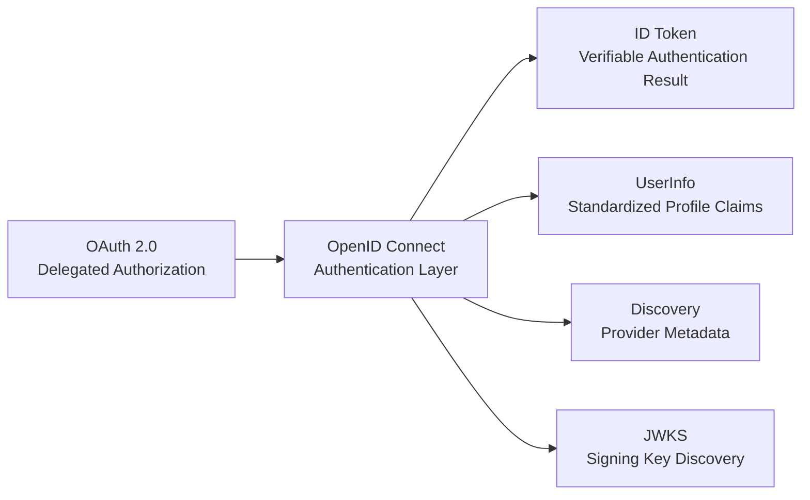

Mental model yang benar:

> OIDC bukan “OAuth2 untuk login” secara sembarangan. OIDC adalah cara standar bagi client/RP untuk menerima dan memverifikasi hasil authentication yang dilakukan oleh OpenID Provider.

---

## 3. OAuth2 vs OIDC: Perbedaan yang Tidak Boleh Kabur

Perbedaan ini harus tertanam kuat.

| Aspek | OAuth2 | OIDC |
|---|---|---|
| Tujuan utama | Delegated authorization | Authentication layer di atas OAuth2 |
| Pertanyaan utama | “Client boleh akses resource apa?” | “Siapa end-user yang diautentikasi OP?” |
| Token utama | Access token | ID token + access token |
| Scope wajib | Tidak ada scope khusus untuk identity | `openid` wajib untuk OIDC request |
| Output identity | Tidak distandardisasi oleh OAuth2 core | ID Token distandardisasi |
| User profile | Resource-specific | UserInfo endpoint standard |
| Replay protection untuk auth response | OAuth state/PKCE/security profile | OAuth state + OIDC nonce |
| Client disebut | OAuth Client | Relying Party / Client |
| Server disebut | Authorization Server | OpenID Provider |

Kesalahan besar:

```text
Access token received => user is authenticated
```

Yang benar:

```text
ID token verified with issuer/audience/expiry/nonce/etc. => OP asserts an authentication event for this RP/client.
```

Access token dapat digunakan oleh RP untuk memanggil UserInfo atau API tertentu, tetapi access token bukan objek utama untuk membangun RP session.

---

## 4. Terminologi Inti OIDC

### 4.1 OpenID Provider / OP

OP adalah authorization server yang juga mendukung OIDC dan dapat mengautentikasi end-user serta menerbitkan ID Token.

Contoh:

- Keycloak realm
- Azure Entra ID tenant
- Google Identity
- Okta authorization server
- Auth0 tenant
- internal identity provider

### 4.2 Relying Party / RP

RP adalah aplikasi yang mengandalkan authentication assertion dari OP.

Dalam konteks Go, RP bisa berupa:

- server-rendered web app;
- backend-for-frontend;
- API gateway yang membuat session cookie;
- admin portal;
- internal tool;
- service yang menerima ID Token dalam controlled flow tertentu.

### 4.3 End-User

End-user adalah manusia yang diautentikasi oleh OP.

Jangan samakan end-user dengan internal user row. End-user adalah subject eksternal dalam konteks OP. Internal user row adalah representasi domain Anda.

### 4.4 ID Token

ID Token adalah JWT yang berisi claims tentang authentication event dan subject.

ID Token biasanya signed. Bisa juga encrypted, tetapi signed ID Token adalah kasus umum.

### 4.5 UserInfo Endpoint

Endpoint standard untuk mengambil claims tambahan tentang end-user menggunakan access token.

### 4.6 Claims

Claims adalah pernyataan tentang subject atau event, misalnya:

- `sub`
- `iss`
- `aud`
- `exp`
- `iat`
- `auth_time`
- `nonce`
- `email`
- `email_verified`
- `name`
- `given_name`
- `family_name`

### 4.7 Scope

Scope adalah request terhadap akses/claim tertentu.

Scope OIDC umum:

- `openid`
- `profile`
- `email`
- `address`
- `phone`
- `offline_access`

`openid` adalah scope yang menandakan request OIDC. Tanpa `openid`, Anda melakukan OAuth2 request biasa, bukan OIDC authentication request.

### 4.8 Discovery Document

Metadata JSON di endpoint `.well-known/openid-configuration` yang berisi issuer, endpoints, supported scopes, response types, signing algorithms, JWKS URI, dan capability lain.

---

## 5. Mental Model: Authentication Event yang Dibungkus ID Token

ID Token bukan sekadar “profile user”. ID Token adalah **representasi verifiable dari authentication event**.

Isi utamanya menjawab:

- siapa issuer-nya? (`iss`)
- siapa subject yang diautentikasi? (`sub`)
- untuk client mana assertion ini dibuat? (`aud`, kadang `azp`)
- kapan token dibuat? (`iat`)
- kapan token kedaluwarsa? (`exp`)
- apakah request ini terkait nonce yang RP kirim? (`nonce`)
- kapan user authentication terjadi? (`auth_time`)
- metode/assurance apa yang dipakai? (`amr`, `acr`)

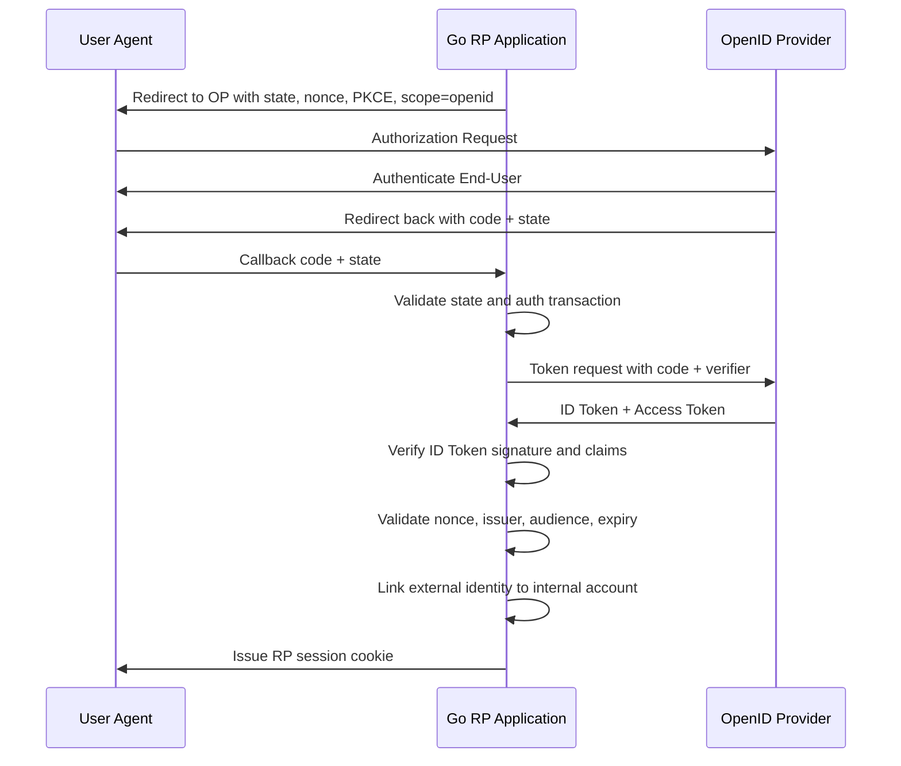

Authentication event terjadi di OP. RP tidak melihat password, passkey, MFA, atau enterprise policy secara langsung. RP menerima **assertion**. Karena itu RP harus memverifikasi assertion tersebut dengan ketat.

---

## 6. OIDC Actors dan Trust Boundary

OIDC menambahkan beberapa boundary:

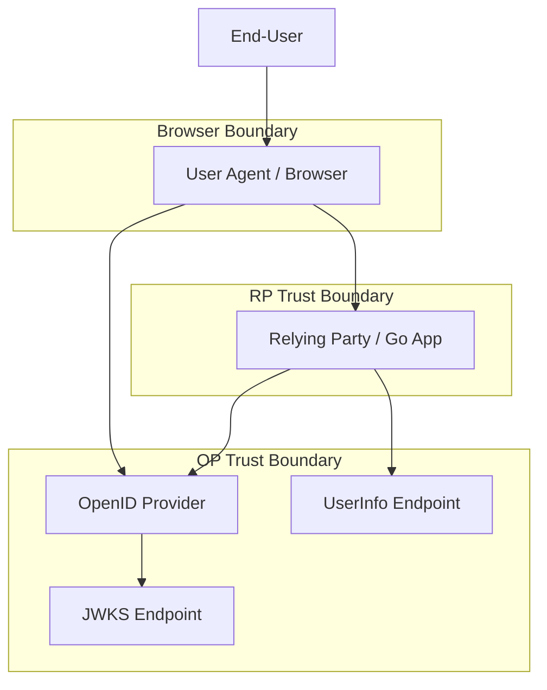

### 6.1 Browser is not trusted storage

Browser membawa redirect response. Browser bisa:

- kehilangan tab;
- mengirim callback dua kali;
- membawa stale request;
- dipengaruhi extension;
- terkena CSRF;
- membawa cookie lama;
- memiliki session OP berbeda dari session RP.

Karena itu RP harus menyimpan authorization transaction di server-side store atau di cookie yang integrity-protected dan bound ketat.

### 6.2 OP is trusted only for configured issuer

Jangan percaya sembarang provider metadata dari user input. Provider harus registered/configured.

Bad pattern:

```text
/login?issuer=https://whatever.example
```

Lalu aplikasi melakukan dynamic discovery ke issuer tersebut tanpa allowlist. Ini membuka pintu malicious OP, SSRF, metadata poisoning, dan account linking abuse.

### 6.3 RP session is RP-owned

Setelah ID Token verified, RP biasanya membuat session sendiri. RP session lifecycle tidak otomatis sama dengan OP session lifecycle.

Kesalahan umum:

```text
ID token valid for 1 hour => RP session must valid for 1 hour
```

Tidak selalu. RP session harus mengikuti policy aplikasi Anda: idle timeout, absolute timeout, step-up freshness, tenant risk, dan regulatory requirement.

---

## 7. OIDC Flow Overview

OIDC mendefinisikan beberapa flow historis:

1. Authorization Code Flow
2. Implicit Flow
3. Hybrid Flow

Untuk sistem modern, terutama web server/BFF/enterprise app, baseline aman adalah:

```text
Authorization Code Flow + PKCE
```

Implicit flow dan hybrid flow historically dipakai untuk browser-based app lama. Untuk desain baru, hindari kecuali ada alasan interoperability legacy yang sangat kuat dan risk acceptance jelas.

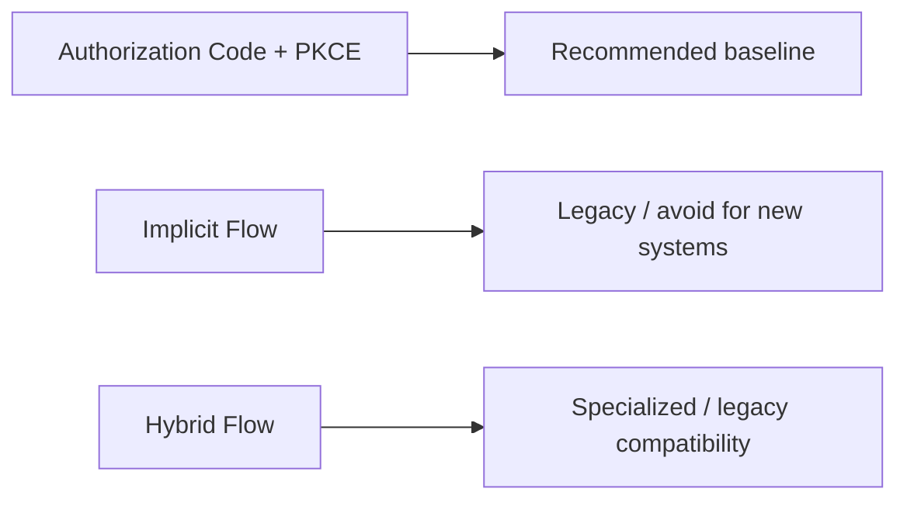

OIDC flow bukan hanya “cara mendapatkan token”. Flow adalah jalur trust dari RP ke OP lalu kembali lagi ke RP.

---

## 8. Authorization Code Flow + PKCE untuk OIDC

Parameter penting authorization request:

| Parameter | Tujuan |
|---|---|
| `client_id` | Identifier RP/client di OP |
| `redirect_uri` | Callback endpoint yang registered |
| `response_type=code` | Meminta authorization code |
| `scope=openid ...` | Menandakan OIDC dan meminta claims/scope |
| `state` | CSRF/request correlation |
| `nonce` | Bind authentication response/ID Token ke RP request |
| `code_challenge` | PKCE challenge |
| `code_challenge_method=S256` | PKCE method yang harus dipakai |
| `prompt` | Mengontrol interaksi OP tertentu |
| `max_age` | Meminta batas usia authentication event |
| `login_hint` | Hint untuk OP, bukan security control |
| `acr_values` | Meminta assurance/class tertentu |

### 8.1 State dan Nonce berbeda

`state` dan `nonce` sering disamakan. Itu salah.

| Parameter | Disimpan di | Dikembalikan di | Fungsi utama |
|---|---|---|---|
| `state` | Authorization transaction RP | Callback query | CSRF + request correlation |
| `nonce` | Authorization transaction RP | ID Token claim | Token replay/substitution defense |

Gunakan keduanya.

### 8.2 PKCE tetap diperlukan

PKCE bukan hanya untuk mobile/public client. Security BCP modern mendorong PKCE pada authorization code flow untuk memperkuat perlindungan authorization code.

Dengan PKCE:

- RP membuat `code_verifier` random;
- RP mengirim `code_challenge = BASE64URL(SHA256(code_verifier))`;
- callback membawa authorization code;
- token request menyertakan `code_verifier`;
- OP memverifikasi bahwa code hanya bisa ditukar oleh party yang punya verifier.

---

## 9. ID Token: Apa, Bukan Apa, dan Kenapa Penting

### 9.1 Apa itu ID Token

ID Token adalah JWT yang diterbitkan OP kepada RP berisi claims tentang authentication event dan end-user.

Contoh payload simplified:

```json
{
  "iss": "https://idp.example.com/realms/agency",
  "sub": "248289761001",
  "aud": "case-management-web",
  "exp": 1760000000,
  "iat": 1759999700,
  "auth_time": 1759999600,
  "nonce": "n-0S6_WzA2Mj",
  "acr": "urn:example:aal2",
  "amr": ["pwd", "otp"],
  "email": "user@example.gov",
  "email_verified": true
}
```

### 9.2 ID Token bukan access token

ID Token tidak boleh dipakai untuk authorize API call ke resource server umum.

Bad pattern:

```http
Authorization: Bearer <id_token>
GET /api/cases/123
```

Kenapa buruk?

- audience ID Token adalah client/RP, bukan API resource;
- claims-nya tentang authentication, bukan API permission;
- resource server bisa salah menerima token yang tidak dimaksudkan untuknya;
- token substitution attack menjadi lebih mudah.

### 9.3 ID Token bukan session

ID Token bisa menjadi input untuk membuat session, tetapi bukan session itu sendiri.

Bad pattern:

```text
Every request validates ID token from browser localStorage as app session.
```

Masalah:

- browser token theft;
- logout sulit;
- revocation sulit;
- session rotation tidak natural;
- CSRF/XSS trade-off buruk;
- RP kehilangan kontrol penuh atas session semantics.

Untuk web app/BFF enterprise, biasanya lebih aman:

```text
OIDC login => verify ID token => create server-side RP session => browser receives secure session cookie
```

---

## 10. ID Token Claims: Registered, Standard, dan Custom

Claims harus diperlakukan dengan “claim authority”. Tidak semua claim setara.

### 10.1 Security-critical claims

Claims yang wajib divalidasi atau dipakai untuk security decision:

| Claim | Makna | Catatan |
|---|---|---|
| `iss` | Issuer identifier | Harus exactly match configured issuer |
| `sub` | Subject identifier | Stable identifier di issuer |
| `aud` | Audience | Harus mencakup client ID RP |
| `exp` | Expiration | Harus belum expired dengan clock skew wajar |
| `iat` | Issued at | Bisa dipakai untuk sanity/freshness |
| `nbf` | Not before | Jika ada, harus dihormati |
| `nonce` | Nonce | Harus match transaction untuk browser OIDC login |
| `azp` | Authorized party | Penting saat multiple audience |
| `auth_time` | Authentication time | Penting untuk max_age/step-up |
| `acr` | Authentication context class | Assurance class |
| `amr` | Authentication methods references | Metode authentication |

### 10.2 Profile claims

Claims yang biasanya bersifat profil:

| Claim | Catatan |
|---|---|
| `name` | Display name, bukan legal identity otomatis |
| `given_name` | Bisa kosong/berbeda format |
| `family_name` | Tidak universal secara budaya |
| `preferred_username` | Tidak selalu stable |
| `email` | Bisa berubah, bisa recycled, bukan primary key |
| `email_verified` | Verified menurut OP, bukan berarti user internal valid |
| `phone_number` | Bisa berubah/reassigned |
| `locale` | Preferensi, bukan security attribute |

### 10.3 Custom claims

Custom claims sering berisi:

- agency code;
- department;
- groups;
- roles;
- tenant ID;
- employee ID;
- clearance;
- user type;
- organization unit.

Custom claims tidak otomatis benar. Harus ditanya:

1. Siapa authority untuk claim ini?
2. Apakah claim ini fresh?
3. Apakah claim ini intended untuk client ini?
4. Apakah claim ini berasal dari IdP, directory, HR system, atau manual mapper?
5. Apakah claim ini boleh dipakai untuk authorization langsung?
6. Apa yang terjadi jika claim berubah saat session aktif?

---

## 11. `sub`: Identifier Paling Penting dan Paling Sering Disalahgunakan

`sub` adalah subject identifier. Untuk OIDC, kombinasi paling aman untuk external identity key adalah:

```text
issuer + subject
```

Bukan hanya `sub`, karena `sub` hanya unik dalam konteks issuer.

Bukan email, karena email bukan stable subject identifier.

### 11.1 Internal storage model

```text
external_identity:
  provider_id
  issuer
  subject
  subject_type
  user_id/account_id
  first_seen_at
  last_seen_at
  claims_snapshot
```

Unique constraint:

```sql
UNIQUE (issuer, subject)
```

Jika multi-provider config Anda memiliki provider aliases, tetap simpan canonical issuer dari verified ID Token.

### 11.2 Jangan merge account hanya berdasarkan email

Bad pattern:

```text
if id_token.email == existing_user.email:
    login existing user
```

Ini bisa menjadi account takeover jika:

- provider tidak dipercaya untuk email domain tersebut;
- email belum verified;
- email pernah recycled;
- user corporate dan personal punya email sama/alias;
- attacker bisa membuat IdP sendiri dengan claim email korban;
- app mendukung multi-issuer tanpa issuer allowlist ketat.

Lebih aman:

```text
verified issuer + subject maps to external_identity binding.
If no binding, go through controlled linking/provisioning flow.
```

---

## 12. `iss`, `aud`, `azp`, `exp`, `iat`, `nbf`: Validasi Minimum

ID Token validation harus deterministik.

### 12.1 `iss`

`iss` harus exactly match configured issuer. Jangan normalisasi sembarangan.

Potential bug:

```text
https://idp.example.com/realm/a
https://idp.example.com/realm/a/
```

Bagi banyak provider, trailing slash bisa menjadi issuer berbeda. Ikuti metadata provider dan library verification.

### 12.2 `aud`

`aud` harus berisi `client_id` RP Anda.

Jika ID Token audience bukan client Anda, token itu bukan untuk Anda.

### 12.3 `azp`

Jika `aud` punya lebih dari satu audience, `azp` dapat menunjukkan authorized party. Banyak validator perlu memastikan `azp` sesuai client ID ketika diperlukan.

### 12.4 `exp`

Token harus belum expired. Clock skew boleh kecil dan eksplisit.

Jangan set skew terlalu besar. Skew 5 menit mungkin umum, tetapi ini policy, bukan hukum alam.

### 12.5 `iat`

`iat` bisa dipakai untuk sanity check:

- token issued terlalu jauh di masa depan;
- token sangat tua tapi masih somehow accepted;
- token tidak sesuai expected time window.

### 12.6 `nbf`

Jika ada, token tidak boleh diterima sebelum `nbf`.

### 12.7 Signature dan `alg`

Validasi claim tanpa signature validation adalah meaningless.

Bad pattern:

```go
payload := decodeJWTWithoutVerify(token)
if payload.EmailVerified { login() }
```

---

## 13. `nonce`: Replay Defense untuk Browser-Based Authentication

`nonce` adalah random value yang dikirim RP dalam authentication request dan harus muncul kembali sebagai claim dalam ID Token.

### 13.1 Apa yang dicegah nonce?

Nonce membantu mencegah replay/substitution ID Token dari authentication request lain.

Tanpa nonce:

- attacker bisa mencoba menyuntikkan ID Token lama;
- ID Token dari tab/session lain bisa diterima;
- RP kehilangan binding antara auth request dan authentication result.

### 13.2 Nonce lifecycle

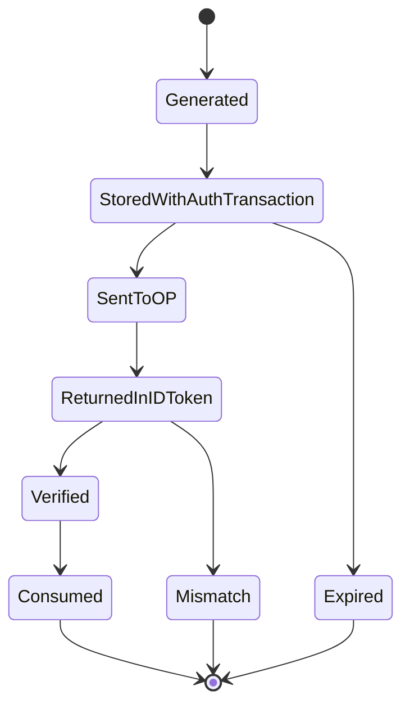

Rules:

1. Generate with CSPRNG.
2. Bind to authorization transaction.
3. Expire quickly.
4. Compare exactly.
5. Consume once.
6. Audit mismatch.

### 13.3 Nonce bukan state

`state` muncul di callback query. `nonce` muncul di ID Token. Jangan hanya validasi salah satu.

---

## 14. `acr`, `amr`, `auth_time`: Assurance dan Step-Up

OIDC bisa membawa informasi assurance.

### 14.1 `auth_time`

`auth_time` menunjukkan waktu user authentication terjadi. Ini penting saat RP meminta `max_age` atau melakukan step-up.

Contoh:

```text
User login ke OP jam 08:00.
User membuka RP jam 12:00.
OP SSO session masih valid.
RP menerima ID Token baru jam 12:00, tetapi auth_time tetap 08:00.
```

Jika aksi berisiko perlu reauthentication dalam 10 menit terakhir, gunakan `auth_time`, bukan `iat`.

### 14.2 `amr`

`amr` menunjukkan metode authentication, misalnya password, OTP, WebAuthn, MFA. Nilainya bergantung provider/profile.

Jangan hardcode terlalu naif:

```text
amr contains "mfa" => enough
```

Lebih baik mapping provider-specific `amr` ke internal assurance model.

### 14.3 `acr`

`acr` menunjukkan class/context authentication. Dalam enterprise, bisa dipetakan ke:

- AAL1;
- AAL2;
- phishing-resistant;
- government identity assurance;
- internal high assurance;
- admin step-up.

### 14.4 Internal assurance vector

Jangan sebar raw `acr` dan `amr` ke semua service. Buat normalized assurance vector.

```go
type AssuranceVector struct {
    Issuer          string
    Subject         string
    AuthTime        time.Time
    ACR             string
    AMR             []string
    Level           AssuranceLevel
    PhishingResist  bool
    FreshUntil      time.Time
    Source          string
}
```

Policy service kemudian membaca assurance yang sudah dinormalisasi.

---

## 15. Access Token vs ID Token vs Refresh Token

| Token | Issued to | Audience | Digunakan untuk | Disimpan di |
|---|---|---|---|---|
| ID Token | RP/client | RP/client | Verifikasi authentication event | Server-side auth transaction/session metadata, bukan untuk API call umum |
| Access Token | Client | Resource server/API | Memanggil API/resource | Server-side/BFF atau secure client storage sesuai client type |
| Refresh Token | Client | Authorization server | Mendapat access token baru | Sangat sensitif; server-side untuk confidential client |

### 15.1 ID Token untuk login, Access Token untuk API

RP menggunakan ID Token untuk membangun sesi internal. Resource server menggunakan access token untuk authorize API request.

### 15.2 Refresh Token bukan “remember me” sederhana

Refresh token adalah credential tingkat tinggi. Harus diperlakukan seperti credential:

- rotation;
- reuse detection;
- revocation;
- binding ke client/session/device;
- secure storage;
- audit.

---

## 16. UserInfo Endpoint

UserInfo endpoint adalah protected resource standar OIDC yang mengembalikan claims tentang authenticated end-user. RP memanggil UserInfo menggunakan access token.

### 16.1 Kapan perlu UserInfo?

Perlu jika:

- ID Token tidak membawa semua claim yang dibutuhkan;
- profile claim terlalu besar untuk ID Token;
- OP policy menyatakan profile harus diambil via UserInfo;
- claim freshness perlu lebih dekat ke saat login;
- encrypted/signed UserInfo response dipakai oleh profile tertentu.

Tidak perlu jika:

- ID Token sudah membawa claims yang cukup;
- claims hanya dipakai untuk initial binding;
- memanggil UserInfo menambah latency tanpa manfaat.

### 16.2 Validasi UserInfo `sub`

Jika UserInfo response berisi `sub`, pastikan match dengan `sub` ID Token.

Bad pattern:

```text
ID Token sub = userA
UserInfo sub = userB
App merges claims and logs in userA with userB email
```

Rule:

```text
userinfo.sub must equal id_token.sub if sub is present/required.
```

### 16.3 UserInfo bukan authorization source utama

UserInfo adalah profile claims. Jangan otomatis mengubah authorization internal hanya karena UserInfo mengandung `groups` atau `roles`, kecuali sudah ada desain authority dan freshness yang jelas.

---

## 17. Discovery: `.well-known/openid-configuration`

OIDC Discovery memungkinkan RP menemukan metadata OP.

Typical endpoint:

```text
https://issuer.example.com/.well-known/openid-configuration
```

Metadata penting:

| Field | Fungsi |
|---|---|
| `issuer` | Issuer identifier yang harus match configured issuer |
| `authorization_endpoint` | Endpoint authorization request |
| `token_endpoint` | Endpoint token exchange |
| `userinfo_endpoint` | Endpoint UserInfo |
| `jwks_uri` | Lokasi JWKS untuk signature verification |
| `response_types_supported` | Flow response types |
| `subject_types_supported` | public/pairwise |
| `id_token_signing_alg_values_supported` | Algoritma signature ID Token |
| `scopes_supported` | Scope yang didukung |
| `claims_supported` | Claims yang didukung |
| `end_session_endpoint` | RP-initiated logout endpoint, jika didukung |

### 17.1 Discovery bukan trust bootstrap dari user input

Discovery adalah mekanisme konfigurasi metadata, bukan mekanisme mempercayai issuer sembarangan.

Enterprise rule:

```text
Provider must be registered/configured before use.
Discovery document must be fetched from configured issuer.
Returned metadata issuer must exactly match expected issuer.
```

### 17.2 Discovery cache

Discovery response dapat dicache, tetapi jangan tanpa strategi:

- cache TTL;
- background refresh;
- startup warmup;
- stale-if-error behavior;
- alert jika metadata berubah signifikan;
- pinning expected issuer;
- avoid dynamic issuer from request.

### 17.3 Metadata drift

Provider metadata bisa berubah:

- JWKS URI berubah;
- signing algorithms berubah;
- endpoint host berubah;
- logout endpoint ditambah;
- supported claims berubah.

Perubahan ini harus observable, karena bisa memengaruhi login produksi.

---

## 18. JWKS: Key Discovery, Rotation, dan Cache

JWKS adalah set public keys yang dipakai RP untuk memverifikasi signature token.

### 18.1 Validation flow

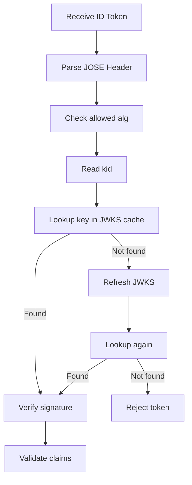

### 18.2 Never trust token-provided key URL

Do not accept arbitrary `jku`, `jwk`, or `x5u` from token header unless your trust profile explicitly supports and restricts it. For normal OIDC RP, use configured/discovered `jwks_uri`.

### 18.3 Key rotation behavior

Correct behavior:

- cache keys;
- refresh on unknown `kid` with rate limit;
- support overlap between old and new keys;
- reject if signature cannot be verified;
- monitor unknown kid spikes;
- prepare emergency key revocation path.

Bad behavior:

```text
unknown kid => skip signature validation
```

or

```text
unknown kid => fetch arbitrary URL from token header
```

---

## 19. Claims Mapping ke Domain Model Internal

OIDC claims harus masuk ke domain internal melalui translation boundary.

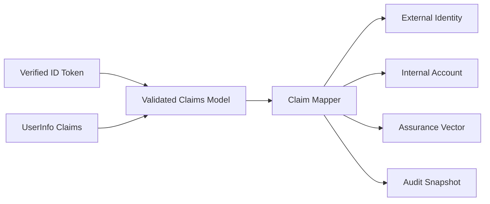

### 19.1 Jangan expose raw claims ke seluruh aplikasi

Bad pattern:

```go
ctx = context.WithValue(ctx, "claims", map[string]any{...})
```

Lalu business code membaca:

```go
if claims["role"] == "admin" { ... }
```

Ini membuat authorization tidak terkontrol.

Lebih baik:

```go
type AuthenticatedPrincipal struct {
    PrincipalID   PrincipalID
    AccountID     AccountID
    ExternalID    ExternalIdentityID
    Issuer        string
    Subject       string
    TenantID      TenantID
    Assurance     AssuranceVector
    SessionID     SessionID
}
```

Raw claims boleh disimpan untuk audit snapshot, tetapi business logic memakai model internal.

### 19.2 Claim mapper harus explicit

Claim mapper harus menjawab:

- claim mana wajib?
- claim mana optional?
- claim mana dipakai hanya display?
- claim mana authoritative untuk tenant?
- claim mana dipakai untuk provisioning?
- claim mana dipakai untuk assurance?
- claim mana tidak boleh dipercaya untuk authorization?

---

## 20. Email, Phone, Name, dan Profile Claims: Jangan Jadikan Primary Key

### 20.1 Email bukan identity key

Email sering dipakai sebagai username, tetapi jangan jadikan external identity primary key.

Risiko:

- email berubah;
- email alias;
- domain migration;
- recycled email;
- unverified email;
- personal/corporate collision;
- provider berbeda dengan email sama.

### 20.2 `email_verified` bukan silver bullet

`email_verified=true` berarti provider menyatakan email tersebut verified menurut proses provider. Itu tidak otomatis berarti:

- user boleh masuk tenant internal;
- user masih pegawai aktif;
- user punya role di aplikasi;
- email domain trusted untuk provisioning;
- email claim boleh dipakai untuk account takeover recovery.

### 20.3 Name/display claims tidak stabil

Nama bisa berubah, format budaya berbeda, transliteration berbeda, dan kadang kosong.

Untuk regulatory audit, audit actor harus memakai stable internal principal/user/account ID plus external issuer/subject snapshot, bukan hanya display name.

---

## 21. Public vs Pairwise Subject Identifier

OIDC mendukung subject identifier types, terutama public dan pairwise.

### 21.1 Public subject

Public subject cenderung sama untuk RP berbeda dalam issuer yang sama.

Kelebihan:

- mudah korelasi antar aplikasi milik organisasi sama;
- sederhana untuk SSO ecosystem internal.

Risiko:

- privacy/correlation antar RP.

### 21.2 Pairwise subject

Pairwise subject berbeda per sector/RP. Ini mengurangi cross-client correlation.

Dampak desain:

- Anda tidak bisa mengandalkan `sub` sama antar semua aplikasi;
- account linking antar RP perlu mekanisme lain;
- sector identifier dan client registration menjadi penting;
- data migration harus hati-hati.

### 21.3 Internal identity correlation

Untuk enterprise suite dengan banyak aplikasi, jangan mengandalkan asumsi bahwa `sub` selalu sama antar client. Tanyakan provider profile:

- subject type apa?
- apakah pairwise?
- apa sector identifier?
- apakah ada stable enterprise ID claim?
- claim mana authority-nya jelas?

---

## 22. Account Linking dan External Identity Binding

Account linking adalah area berisiko tinggi.

### 22.1 Safe linking principles

1. Link berdasarkan verified issuer + subject.
2. Email match hanya sebagai candidate, bukan proof.
3. Jika auto-provisioning, batasi berdasarkan trusted issuer, tenant rule, domain, dan claim authority.
4. Untuk existing account, lakukan step-up atau admin approval jika risiko tinggi.
5. Audit semua link/unlink.
6. Jangan silently relink subject ke account berbeda.

### 22.2 External identity state

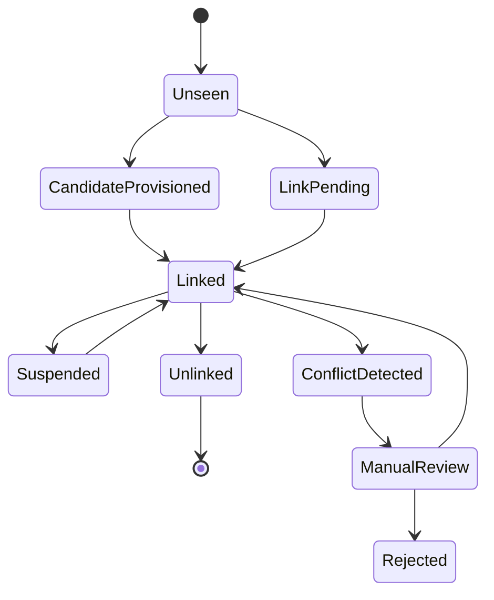

### 22.3 Conflict scenarios

- same issuer+sub already linked to another account;
- same email maps to multiple internal accounts;
- OP changes subject unexpectedly;
- tenant claim conflicts with selected tenant;
- user disabled internally but valid at OP;
- OP says user active but internal account suspended;
- external identity deleted and recreated.

### 22.4 JIT provisioning

Just-in-time provisioning can be good, but only with guardrails:

```text
Trusted issuer
+ verified required claims
+ tenant mapping rule
+ initial role policy
+ audit event
+ account state constraints
= safe JIT candidate
```

JIT should not mean “anyone with valid ID Token gets a production account”.

---

## 23. OIDC Session: RP Session vs OP Session

OIDC creates confusion around “session”. Ada minimal dua session:

1. **OP session**: session user di identity provider.
2. **RP session**: session user di aplikasi Anda.

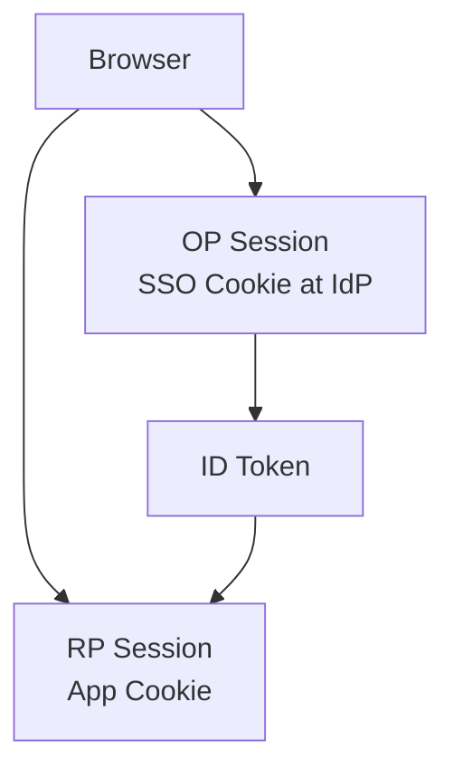

### 23.1 OP session still valid does not mean RP session valid

User bisa tetap login di OP, tetapi RP session sudah expired.

RP dapat redirect ulang ke OP dan mendapat ID Token baru tanpa user memasukkan credential lagi. Namun `auth_time` bisa menunjukkan authentication awal sudah lama.

### 23.2 RP session valid does not mean OP session valid

User bisa logout dari OP, tetapi RP session masih hidup jika tidak ada logout propagation.

Karena itu single logout perlu desain eksplisit.

### 23.3 Session lifetime policy

RP harus punya policy sendiri:

- idle timeout;
- absolute timeout;
- max age before step-up;
- admin action freshness;
- tenant-specific rules;
- device/session management;
- logout behavior.

---

## 24. Logout: RP-Initiated, Front-Channel, Back-Channel

Logout adalah salah satu area paling sering disalahpahami.

### 24.1 Local RP logout

RP menghapus session lokalnya.

```text
DELETE rp_session
clear cookie
```

Ini tidak selalu logout user dari OP.

### 24.2 RP-Initiated Logout

RP mengarahkan browser ke OP logout endpoint, sering dengan `id_token_hint` dan `post_logout_redirect_uri`.

Tujuan:

- meminta OP mengakhiri OP session;
- memungkinkan redirect balik setelah logout.

### 24.3 Front-Channel Logout

OP mengirim logout notification ke RP melalui browser/user agent, biasanya iframe/redirect mechanism.

Kelebihan:

- relatif mudah untuk browser apps.

Kelemahan:

- bergantung browser;
- third-party cookie restrictions;
- race condition;
- user closes tab;
- network/adblocker issues.

### 24.4 Back-Channel Logout

OP mengirim logout token langsung ke RP endpoint server-to-server.

Kelebihan:

- lebih reliable dari browser mediated logout;
- cocok untuk server apps.

Kelemahan:

- perlu endpoint publik/terpercaya;
- harus validasi logout token;
- perlu mapping `sid`/`sub` ke RP sessions;
- handling retry/idempotency.

### 24.5 Logout Token

Back-channel logout memakai logout token yang perlu divalidasi mirip ID Token dengan rule spesifik.

Minimal desain:

```text
validate issuer
validate audience
validate signature
validate event claim
validate iat/jti
validate sid/sub mapping
expire matching RP session(s)
audit
```

---

## 25. Multi-Provider dan Multi-Tenant OIDC

Multi-provider dan multi-tenant membuat desain OIDC jauh lebih kompleks.

### 25.1 Provider registry

Jangan hardcode satu provider jika enterprise butuh banyak issuer. Buat provider registry internal.

```go
type ProviderConfig struct {
    ID              string
    Name            string
    Issuer          string
    ClientID        string
    ClientSecretRef string
    RedirectURI     string
    AllowedAlgs     []string
    TenantBinding   TenantBindingRule
    Enabled         bool
}
```

### 25.2 Login route design

Safer route:

```text
GET /auth/{providerID}/login
GET /auth/{providerID}/callback
```

`providerID` harus lookup ke database/config allowlist. Jangan terima issuer arbitrary.

### 25.3 Tenant binding

Pertanyaan penting:

- Apakah satu issuer untuk semua tenant?
- Apakah satu issuer per tenant?
- Apakah tenant dipilih sebelum login atau diturunkan dari claim?
- Apakah claim tenant authoritative?
- Apakah user bisa punya akses multi-tenant?
- Apa yang terjadi jika tenant claim berubah?

### 25.4 Cross-tenant attack

Bad pattern:

```text
User logs in via tenant A issuer.
Callback contains tenant=B query param.
App creates session in tenant B.
```

Rule:

```text
Tenant context must be reconciled from trusted provider config + verified claims + internal assignment.
```

---

## 26. Go Architecture: Package Boundary untuk OIDC

Desain package sebaiknya memisahkan protocol handling dan domain decision.

```text
/internal/auth/oidc
  provider.go
  transaction.go
  login_handler.go
  callback_handler.go
  verifier.go
  userinfo.go
  claims.go

/internal/identity
  external_identity.go
  account_linker.go
  provisioning.go
  assurance.go

/internal/session
  session_service.go
  cookie.go

/internal/audit
  auth_events.go

/internal/policy
  login_policy.go
  tenant_policy.go
```

### 26.1 Apa yang tidak boleh ada di OIDC package

OIDC package jangan memutuskan:

- role akhir user;
- semua permission;
- business workflow access;
- case-level authorization;
- admin elevation.

OIDC package menghasilkan:

- verified identity assertion;
- verified provider;
- verified claims;
- normalized assurance;
- external identity candidate;
- login evidence.

### 26.2 Identity package memutuskan binding

Identity package bertanggung jawab:

- lookup external identity;
- link/provision account;
- validate account state;
- tenant reconciliation;
- assurance mapping;
- conflict handling.

### 26.3 Session package membuat RP session

Session package bertanggung jawab:

- issue session;
- rotate session;
- store session metadata;
- set secure cookie;
- enforce idle/absolute timeout.

---

## 27. Go Type Model: Issuer, Provider, Auth Transaction, External Identity

### 27.1 Strong domain types

Gunakan types untuk mencegah salah passing string.

```go
package identity

type Issuer string
type Subject string
type ClientID string
type ProviderID string
type TenantID string
type AccountID string
type SessionID string
```

### 27.2 Provider config

```go
type OIDCProviderConfig struct {
    ProviderID      ProviderID
    DisplayName     string
    Issuer          Issuer
    ClientID        ClientID
    ClientSecretRef string
    RedirectURI     string
    Scopes          []string
    AllowedAlgs     []string
    Enabled         bool

    TenantMode      TenantMode
    TenantClaim     string
    EmailDomainRule *EmailDomainRule
}

type TenantMode string

const (
    TenantModeFixed       TenantMode = "fixed"
    TenantModeClaimBased  TenantMode = "claim_based"
    TenantModeUserSelect  TenantMode = "user_select"
)
```

### 27.3 Authorization transaction

```go
type AuthTransaction struct {
    ID              string
    ProviderID      ProviderID
    StateHash       []byte
    NonceHash       []byte
    CodeVerifierEnc []byte
    RedirectURI     string
    ReturnTo         string
    RequestedTenant  *TenantID
    CreatedAt        time.Time
    ExpiresAt        time.Time
    ConsumedAt       *time.Time
    ClientIPHash     []byte
    UserAgentHash    []byte
}
```

Store hash untuk state/nonce agar leak database tidak langsung memungkinkan replay.

### 27.4 Verified OIDC assertion

```go
type VerifiedOIDCAssertion struct {
    ProviderID ProviderID
    Issuer     Issuer
    Subject    Subject
    Audience   []string

    AuthTime   *time.Time
    IssuedAt   time.Time
    ExpiresAt  time.Time
    Nonce      string
    ACR        string
    AMR        []string

    Email         string
    EmailVerified bool
    PreferredName string

    RawIDTokenClaims map[string]any
    UserInfoClaims   map[string]any
}
```

### 27.5 External identity binding

```go
type ExternalIdentity struct {
    ID              string
    ProviderID      ProviderID
    Issuer          Issuer
    Subject         Subject
    AccountID       AccountID
    TenantID        *TenantID
    FirstSeenAt     time.Time
    LastSeenAt      time.Time
    LastAuthTime    *time.Time
    Status          ExternalIdentityStatus
}

type ExternalIdentityStatus string

const (
    ExternalIdentityActive    ExternalIdentityStatus = "active"
    ExternalIdentitySuspended ExternalIdentityStatus = "suspended"
    ExternalIdentityUnlinked  ExternalIdentityStatus = "unlinked"
)
```

---

## 28. Callback Validation Pipeline

Callback handler harus seperti pipeline, bukan callback spaghetti.

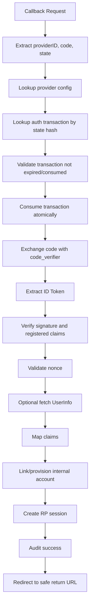

### 28.1 Atomic consume matters

Callback can be retried. Browser can double-submit. Attackers can replay.

Transaction consume should be atomic:

```sql
UPDATE oidc_auth_transaction
SET consumed_at = now()
WHERE id = ?
  AND consumed_at IS NULL
  AND expires_at > now()
```

If affected rows = 0, reject.

### 28.2 Safe return URL

Do not redirect to arbitrary `return_to`.

Allowed:

- relative paths;
- allowlisted origins;
- server-generated return tokens.

Bad:

```text
/auth/callback?return_to=https://evil.example
```

---

## 29. State, Nonce, PKCE, dan Authorization Transaction Store

### 29.1 What to store

Auth transaction should store:

- provider ID;
- state hash;
- nonce hash;
- code verifier encrypted or protected;
- redirect URI;
- requested tenant;
- return URL;
- expiry;
- consumed marker;
- user-agent/IP fingerprint hash optional;
- trace/correlation ID.

### 29.2 Expiry

Typical auth transaction lifetime: short, e.g. 5–10 minutes. Exact value depends on UX and risk.

### 29.3 Binding to browser session

For stronger protection, bind transaction to a pre-login browser cookie or anonymous session.

Be careful not to create brittle UX across devices/tabs. Binding strategy must balance security and real-world browser behavior.

### 29.4 Cleanup

Expired auth transactions should be cleaned periodically.

But callback validation must not rely on cleanup. Always check `expires_at`.

---

## 30. OIDC Login Handler di Go: Skeleton yang Aman

This is a conceptual skeleton. Part 016 will go deeper into concrete OIDC client implementation.

```go
func (h *LoginHandler) StartLogin(w http.ResponseWriter, r *http.Request) {
    ctx := r.Context()

    providerID := ProviderID(chi.URLParam(r, "providerID"))
    provider, err := h.providers.Get(ctx, providerID)
    if err != nil || !provider.Enabled {
        h.respondLoginUnavailable(w, r)
        return
    }

    state := randomBase64URL(32)
    nonce := randomBase64URL(32)
    codeVerifier := randomBase64URL(64)
    codeChallenge := pkceS256(codeVerifier)

    returnTo := sanitizeReturnTo(r.URL.Query().Get("return_to"))

    tx := AuthTransaction{
        ProviderID:      providerID,
        StateHash:       h.hasher.Hash(state),
        NonceHash:       h.hasher.Hash(nonce),
        CodeVerifierEnc: h.sealer.Seal([]byte(codeVerifier)),
        RedirectURI:     provider.RedirectURI,
        ReturnTo:         returnTo,
        CreatedAt:        h.clock.Now(),
        ExpiresAt:        h.clock.Now().Add(10 * time.Minute),
    }

    if err := h.txStore.Create(ctx, tx); err != nil {
        h.respondLoginUnavailable(w, r)
        return
    }

    authURL := h.oauthConfig(provider).AuthCodeURL(
        state,
        oauth2.SetAuthURLParam("nonce", nonce),
        oauth2.SetAuthURLParam("code_challenge", codeChallenge),
        oauth2.SetAuthURLParam("code_challenge_method", "S256"),
    )

    http.Redirect(w, r, authURL, http.StatusFound)
}
```

Important details hidden in helper functions:

- random values must use `crypto/rand`;
- state and nonce should be high entropy;
- `return_to` must be safe;
- provider must be allowlisted;
- code challenge must use S256;
- auth transaction must expire;
- errors must avoid leaking provider/client internals.

---

## 31. ID Token Verification di Go

Typical high-level verification steps:

1. Obtain provider metadata.
2. Obtain JWKS via provider metadata.
3. Verify JWS signature with expected issuer/key set.
4. Validate `iss`.
5. Validate `aud` and `azp` if needed.
6. Validate `exp`, `nbf`, `iat` with explicit skew.
7. Validate `nonce` against transaction.
8. Extract claims.
9. Normalize claims.
10. Audit result.

Pseudo-code:

```go
func (v *Verifier) VerifyIDToken(
    ctx context.Context,
    provider OIDCProviderConfig,
    rawIDToken string,
    expectedNonce string,
) (*VerifiedOIDCAssertion, error) {
    idToken, err := v.idTokenVerifier(provider).Verify(ctx, rawIDToken)
    if err != nil {
        return nil, ErrInvalidIDToken
    }

    var claims OIDCClaims
    if err := idToken.Claims(&claims); err != nil {
        return nil, ErrInvalidIDTokenClaims
    }

    if claims.Nonce != expectedNonce {
        return nil, ErrNonceMismatch
    }

    if claims.Subject == "" {
        return nil, ErrMissingSubject
    }

    assertion := mapClaims(provider, idToken, claims)
    return assertion, nil
}
```

### 31.1 Do not skip audience check casually

Some libraries expose configuration options to skip client ID/audience checks for special cases. Treat them as hazardous. In normal RP flow, audience validation is required.

### 31.2 Do not accept unsigned tokens

`alg=none` must not be accepted for normal production OIDC.

### 31.3 Do not parse first, trust later

You may parse for debugging, but no security decision before verification.

---

## 32. UserInfo Fetching dan Claim Reconciliation

### 32.1 Fetch after ID Token validation

Sequence:

```text
verify ID Token first
then optionally call UserInfo using access token
then reconcile claims
```

Do not call UserInfo and login user if ID Token invalid.

### 32.2 Claim conflict policy

If ID Token says:

```json
{"email": "a@example.com", "email_verified": true}
```

but UserInfo says:

```json
{"email": "b@example.com", "email_verified": true}
```

What should happen?

For security-sensitive systems, do not silently merge. Define conflict policy:

- reject login;
- prefer ID Token;
- prefer UserInfo;
- accept only if same;
- mark for manual review;
- update display profile only, not identity binding.

### 32.3 Claims snapshot

Store snapshot for audit:

```json
{
  "issuer": "https://idp.example.com/realms/agency",
  "subject": "248289761001",
  "id_token_claims_hash": "...",
  "userinfo_claims_hash": "...",
  "mapped_tenant": "agency-a",
  "mapped_account": "acc_123"
}
```

Avoid storing unnecessary sensitive claims forever. Store what supports audit and debugging, ideally minimized/redacted/hashed according to retention policy.

---

## 33. Error Taxonomy dan UX Mapping

OIDC errors harus dibedakan internal vs user-facing.

| Internal Error | User Message | Audit Severity |
|---|---|---|
| provider disabled | Login provider unavailable | Warning |
| unknown provider | Login provider unavailable | Warning/Suspicious |
| invalid state | Login session expired. Try again. | Suspicious |
| expired transaction | Login session expired. Try again. | Info/Warning |
| transaction replay | Login session already used. Try again. | Suspicious |
| code exchange failed | Login failed. Try again. | Warning |
| missing id_token | Login failed. Contact support. | Warning |
| invalid signature | Login failed. Contact support. | High |
| nonce mismatch | Login failed. Try again. | High |
| issuer mismatch | Login failed. Contact support. | High |
| audience mismatch | Login failed. Contact support. | High |
| account disabled | Your account is disabled. | Business/Security |
| external identity conflict | Account requires review. | High |
| tenant mismatch | Account cannot access selected tenant. | Warning/High |

User-facing errors should not reveal:

- expected issuer;
- client ID;
- exact claim mismatch;
- key IDs;
- token parsing details.

But audit logs must preserve enough evidence for investigation.

---

## 34. Security Failure Modes

### 34.1 Accepting access token as login proof

Symptom:

```text
If access token introspection says active, create user session.
```

Why dangerous:

- token may be intended for API, not RP;
- authentication event not verified as OIDC;
- no nonce;
- weak audience handling.

### 34.2 Missing nonce validation

Symptom:

```text
RP validates state but ignores nonce.
```

Risk:

- ID Token replay/substitution in browser flow.

### 34.3 Email-based account linking

Symptom:

```text
first login from any OIDC provider with matching email gets existing account.
```

Risk:

- account takeover.

### 34.4 Dynamic untrusted issuer

Symptom:

```text
RP discovers provider from user-supplied URL.
```

Risk:

- malicious OP;
- SSRF;
- metadata poisoning;
- fake claims.

### 34.5 Skipping audience validation

Symptom:

```text
Verifier configured with SkipClientIDCheck for convenience.
```

Risk:

- token issued to another client accepted.

### 34.6 JWKS cache without unknown-kid refresh

Symptom:

```text
Provider rotates key. Login outage until app restart.
```

Risk:

- availability incident.

### 34.7 Unknown kid fetch storm

Symptom:

```text
Every invalid token with random kid triggers JWKS fetch.
```

Risk:

- self-induced DoS.

### 34.8 Claim trust confusion

Symptom:

```text
roles claim from IdP directly grants admin rights.
```

Risk:

- privilege escalation due mapper misconfiguration or stale claim.

### 34.9 Logout assumed global

Symptom:

```text
RP local logout assumed to end OP session and all apps.
```

Risk:

- lingering sessions.

### 34.10 ID Token stored in localStorage

Symptom:

```text
SPA stores ID/access/refresh tokens in localStorage for long sessions.
```

Risk:

- XSS token theft;
- hard logout/revocation;
- refresh token exposure.

---

## 35. Distributed Systems Failure Modes

OIDC is often treated as a frontend login feature, but production failures are distributed-systems failures.

### 35.1 Provider outage

Symptoms:

- discovery fetch fails;
- token endpoint times out;
- JWKS endpoint unavailable;
- UserInfo endpoint slow.

Design:

- cache discovery;
- cache JWKS;
- separate login dependency from already-active RP session validation;
- fallback only for existing sessions, not new external assertions;
- clear status page/runbook.

### 35.2 Clock skew

Symptoms:

- valid tokens rejected as expired/not-yet-valid;
- step-up freshness wrong;
- audit time inconsistent.

Design:

- NTP monitoring;
- small explicit skew;
- audit both local receive time and token time;
- alert on skew anomalies.

### 35.3 Provider metadata drift

Symptoms:

- issuer mismatch after provider config change;
- endpoint moved;
- signing alg changed;
- JWKS URI changed.

Design:

- config versioning;
- metadata diff alert;
- staging validation;
- operational change process.

### 35.4 Multi-instance transaction store

If login starts on instance A and callback lands on instance B, auth transaction must be shared or browser-contained securely.

Use:

- database;
- Redis with proper expiry;
- encrypted/integrity-protected cookie with one-time server side replay guard.

### 35.5 Race between account disable and login callback

User starts login while account active. Admin disables account before callback completes.

Rule:

```text
Check internal account state after ID Token validation and before session issue.
```

### 35.6 Stale group/role claims

OP returns group claims that are stale relative to internal permissions.

Rule:

```text
OIDC login may establish identity. Fine-grained authorization should be evaluated by internal policy source unless explicit authority/freshness is defined.
```

---

## 36. Audit Model untuk OIDC Login

Audit should support forensic reconstruction:

- who attempted login?
- through which provider?
- what issuer?
- what subject?
- what client/RP?
- what transaction ID?
- was state valid?
- was nonce valid?
- what assurance?
- which internal account was linked?
- which tenant was selected/mapped?
- was provisioning/linking performed?
- why was login rejected?

### 36.1 Events

Recommended events:

```text
OIDC_LOGIN_STARTED
OIDC_CALLBACK_RECEIVED
OIDC_AUTH_TRANSACTION_VALIDATED
OIDC_CODE_EXCHANGE_SUCCEEDED
OIDC_ID_TOKEN_VERIFIED
OIDC_NONCE_VALIDATED
OIDC_USERINFO_FETCHED
OIDC_EXTERNAL_IDENTITY_LINKED
OIDC_ACCOUNT_PROVISIONED
OIDC_SESSION_CREATED
OIDC_LOGIN_FAILED
OIDC_LOGOUT_STARTED
OIDC_BACKCHANNEL_LOGOUT_RECEIVED
OIDC_SESSION_TERMINATED_BY_OP
```

### 36.2 Audit record shape

```json
{
  "event_type": "OIDC_ID_TOKEN_VERIFIED",
  "correlation_id": "corr_...",
  "provider_id": "agency-idp",
  "issuer": "https://idp.example.com/realms/agency",
  "subject_hash": "sha256:...",
  "client_id": "case-management-web",
  "auth_time": "2026-06-24T10:00:00Z",
  "acr": "urn:example:aal2",
  "amr": ["pwd", "otp"],
  "nonce_valid": true,
  "internal_account_id": "acc_123",
  "tenant_id": "agency-a",
  "outcome": "success"
}
```

Do not log raw tokens.

### 36.3 Regulatory defensibility

A regulatory-grade audit trail should distinguish:

- external identity asserted by OP;
- internal account authorized by your system;
- session created by RP;
- permissions evaluated later by policy engine;
- actor context for subsequent business actions.

---

## 37. Observability dan Metrics

### 37.1 Metrics

Recommended metrics:

```text
oidc_login_started_total{provider}
oidc_login_success_total{provider}
oidc_login_failure_total{provider,reason}
oidc_callback_invalid_state_total{provider}
oidc_callback_nonce_mismatch_total{provider}
oidc_code_exchange_latency_seconds{provider}
oidc_token_verify_latency_seconds{provider}
oidc_userinfo_latency_seconds{provider}
oidc_jwks_refresh_total{provider,result}
oidc_unknown_kid_total{provider}
oidc_account_link_conflict_total{provider}
oidc_provider_discovery_refresh_total{provider,result}
```

### 37.2 Logs

Log structured fields:

- correlation ID;
- provider ID;
- issuer;
- outcome;
- failure class;
- transaction age;
- JWKS cache hit/miss;
- key ID if safe;
- no raw token.

### 37.3 Traces

Trace spans:

```text
start_login
create_auth_transaction
provider_redirect
callback
load_auth_transaction
code_exchange
id_token_verify
userinfo_fetch
account_link
session_create
```

### 37.4 Alerting

Alert on:

- invalid state spike;
- nonce mismatch spike;
- unknown kid spike;
- code exchange failures;
- provider latency high;
- account linking conflicts;
- issuer/audience mismatch;
- JWKS refresh failures;
- sudden drop to zero successful logins.

---

## 38. Testing Strategy

### 38.1 Unit tests

Test:

- state generation uniqueness;
- nonce generation uniqueness;
- PKCE S256 calculation;
- return URL sanitizer;
- claim mapper;
- assurance mapper;
- provider registry lookup;
- account linking rules.

### 38.2 Token verification tests

Use generated test keys and tokens. Cases:

- valid ID Token;
- expired token;
- wrong issuer;
- wrong audience;
- missing subject;
- nonce mismatch;
- unsupported alg;
- unknown kid;
- future `nbf`;
- multiple audience without expected `azp` behavior.

### 38.3 Callback tests

Cases:

- valid callback;
- missing code;
- missing state;
- invalid state;
- expired transaction;
- consumed transaction replay;
- code exchange failure;
- token response missing ID Token;
- UserInfo sub mismatch;
- account disabled;
- tenant mismatch;
- unsafe return URL.

### 38.4 Integration tests

Use a local OIDC provider emulator or test OP.

Test:

- discovery;
- JWKS rotation;
- token exchange;
- UserInfo;
- logout callback;
- multiple providers;
- multi-instance transaction store.

### 38.5 Chaos tests

Simulate:

- JWKS endpoint down;
- token endpoint timeout;
- provider returns unknown kid;
- provider rotates key during traffic;
- Redis/database down for auth transaction;
- duplicate callback;
- browser back button replay.

---

## 39. Case Study: Enterprise Regulatory SSO

Bayangkan sistem regulatory case management multi-tenant:

- internal officers login via government IdP;
- external agency users login via agency-specific IdP;
- vendors login via B2B IdP;
- admin portal butuh MFA/step-up;
- users bisa punya akses lintas tenant;
- audit harus menjawab “who did what, as whom, under which authority”.

### 39.1 Naive design

```text
Login with OIDC.
Use email as username.
Read role claim.
Create JWT app token.
Let API trust role claim.
```

Failure:

- email-based takeover;
- role claim stale;
- tenant mismatch;
- no account linking audit;
- access token/ID token confusion;
- logout inconsistent;
- impossible forensic reconstruction.

### 39.2 Better design

```text
OIDC login verifies ID Token.
issuer+sub maps to external_identity.
external_identity maps to internal account.
account maps to tenant memberships.
role/permission evaluated internally.
assurance vector stored in session.
admin actions require fresh step-up.
audit stores external assertion snapshot and internal actor context.
```

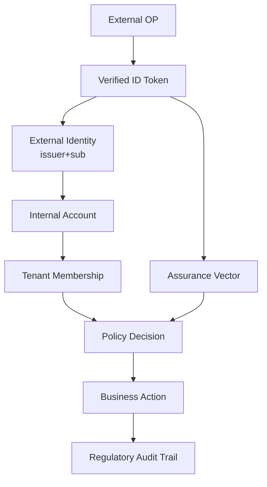

### 39.3 Key invariants

1. External identity is not internal account.
2. Email is not identity key.
3. ID Token proves authentication event, not application permission.
4. Access token is not login proof.
5. Tenant is not trusted from query param.
6. OIDC roles are not automatically internal roles.
7. Session is owned by RP.
8. Audit must record both external assertion and internal decision.

---

## 40. Production Checklist

### 40.1 Provider configuration

- [ ] Provider issuer allowlisted.
- [ ] Discovery metadata issuer exactly matches expected issuer.
- [ ] Redirect URI registered exactly.
- [ ] Client secret stored in secret manager.
- [ ] Allowed signing algorithms explicit.
- [ ] Provider enabled/disabled flag exists.
- [ ] Metadata refresh is observable.

### 40.2 Authorization request

- [ ] `scope` includes `openid`.
- [ ] Authorization Code Flow used.
- [ ] PKCE S256 used.
- [ ] `state` generated with CSPRNG.
- [ ] `nonce` generated with CSPRNG.
- [ ] Auth transaction expires quickly.
- [ ] Return URL sanitized.

### 40.3 Callback

- [ ] State validated.
- [ ] Auth transaction atomically consumed.
- [ ] Code exchanged with original code verifier.
- [ ] ID Token required for OIDC login.
- [ ] ID Token signature verified.
- [ ] Issuer validated.
- [ ] Audience validated.
- [ ] Expiry/nbf/iat validated.
- [ ] Nonce validated.
- [ ] UserInfo `sub` matched if UserInfo used.

### 40.4 Account linking

- [ ] Binding key is issuer + subject.
- [ ] Email is not primary key.
- [ ] Auto-provisioning constrained by policy.
- [ ] Conflicts go to safe failure/manual review.
- [ ] Disabled account cannot login.
- [ ] Tenant reconciliation explicit.
- [ ] Link/unlink audited.

### 40.5 Session

- [ ] RP session created after internal account validation.
- [ ] Session ID rotated on login.
- [ ] Secure cookie attributes set.
- [ ] Idle/absolute timeout enforced.
- [ ] Assurance vector stored.
- [ ] Step-up freshness supported.
- [ ] Logout clears RP session.

### 40.6 Operations

- [ ] JWKS cache handles rotation.
- [ ] Unknown kid refresh rate-limited.
- [ ] Provider outage runbook exists.
- [ ] No raw tokens logged.
- [ ] Metrics and alerts configured.
- [ ] Audit events complete.
- [ ] Tests cover replay/mismatch/failure cases.

---

## 41. Ringkasan Mental Model

OpenID Connect harus dipahami sebagai pipeline:

```text
Browser redirect
-> OAuth2 authorization code + PKCE
-> Token endpoint
-> ID Token verification
-> nonce validation
-> claims normalization
-> external identity binding
-> internal account resolution
-> tenant reconciliation
-> RP session creation
-> authorization later by internal policy
-> audit everything
```

Inti desainnya:

1. **OIDC authenticates identity, not permission.**
2. **ID Token is authentication evidence, not an API credential.**
3. **Access Token is API authorization input, not RP login proof.**
4. **issuer + sub is the external identity key.**
5. **email is profile data, not identity binding.**
6. **nonce binds ID Token to the RP authentication request.**
7. **state binds callback to the RP authorization transaction.**
8. **PKCE binds code redemption to the transaction holder.**
9. **RP session is separate from OP session.**
10. **Claims must be mapped into internal domain concepts before business use.**

---

## 42. Latihan

### Latihan 1 — Token Confusion Review

Anda menemukan endpoint:

```http
GET /api/me
Authorization: Bearer <id_token>
```

Tulis review:

- apa masalahnya?
- token apa yang harus dipakai?
- audience apa yang harus diverifikasi?
- bagaimana RP session seharusnya dibuat?

### Latihan 2 — Account Linking Policy

Desain policy untuk user yang login via OIDC dengan email sama seperti user existing, tetapi issuer+sub belum pernah dilihat.

Buat flow untuk:

- trusted enterprise issuer;
- public social issuer;
- unverified email;
- existing disabled account;
- tenant mismatch.

### Latihan 3 — Nonce Failure

Callback valid state, code exchange berhasil, ID Token signature valid, tetapi nonce mismatch.

Jawab:

- response user-facing apa?
- audit event apa?
- metric apa?
- kemungkinan penyebab apa?
- apakah boleh retry otomatis?

### Latihan 4 — Multi-Tenant Provider

Satu aplikasi memiliki 20 tenant. Setiap tenant punya issuer OIDC sendiri. Desain:

- provider registry;
- route login;
- callback lookup;
- tenant reconciliation;
- external identity unique constraint;
- audit fields.

### Latihan 5 — Logout Semantics

Jelaskan perbedaan:

- local RP logout;
- RP-initiated logout;
- front-channel logout;
- back-channel logout.

Lalu desain session invalidation untuk regulatory admin portal.

---

## 43. Referensi Primer

1. OpenID Foundation — OpenID Connect Core 1.0 incorporating errata set 2.  
   https://openid.net/specs/openid-connect-core-1_0.html
2. OpenID Foundation — OpenID Connect Discovery 1.0 incorporating errata set 2.  
   https://openid.net/specs/openid-connect-discovery-1_0.html
3. IETF RFC 8414 — OAuth 2.0 Authorization Server Metadata.  
   https://datatracker.ietf.org/doc/html/rfc8414
4. OpenID Foundation — OpenID Connect RP-Initiated Logout 1.0.  
   https://openid.net/specs/openid-connect-rpinitiated-1_0.html
5. OpenID Foundation — OpenID Connect Front-Channel Logout 1.0.  
   https://openid.net/specs/openid-connect-frontchannel-1_0.html
6. OpenID Foundation — OpenID Connect Back-Channel Logout 1.0.  
   https://openid.net/specs/openid-connect-backchannel-1_0.html
7. IETF RFC 9700 — Best Current Practice for OAuth 2.0 Security.  
   https://datatracker.ietf.org/doc/rfc9700/
8. IETF RFC 7519 — JSON Web Token.  
   https://www.rfc-editor.org/info/rfc7519
9. IETF RFC 8725 — JSON Web Token Best Current Practices.  
   https://www.rfc-editor.org/info/rfc8725
10. Go package — `github.com/coreos/go-oidc/v3/oidc`.  
    https://pkg.go.dev/github.com/coreos/go-oidc/v3/oidc
11. Go package — `golang.org/x/oauth2`.  
    https://pkg.go.dev/golang.org/x/oauth2
12. NIST SP 800-63-4 — Digital Identity Guidelines.  
    https://pages.nist.gov/800-63-4/

---

## Status Seri

Part 015 selesai. Seri **belum selesai**.

Lanjut berikutnya:

```text
learn-go-authentication-authorization-identity-permission-part-016.md
```

Topik berikutnya:

```text
Building OIDC Client/Relying Party di Go
```

Bagian berikutnya akan lebih implementatif: `coreos/go-oidc`, `golang.org/x/oauth2`, provider discovery, callback handler, ID token verifier, nonce/state/PKCE store, account linking, session creation, dan testable package architecture.

<!-- NAVIGATION_FOOTER -->
<div class="page-nav">
<a href="./learn-go-authentication-authorization-identity-permission-part-014.md">⬅️ Part 014 — OAuth2 Security BCP: PKCE, Redirect URI, State, Mix-Up, Code Injection</a>
<a href="./index.md">📚 Kategori</a>
<a href="../../index.md">🏠 Home</a>
<a href="./learn-go-authentication-authorization-identity-permission-part-016.md">Part 016 — Building OIDC Client / Relying Party di Go ➡️</a>
</div>
