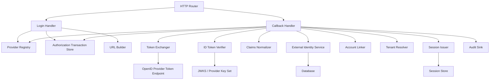
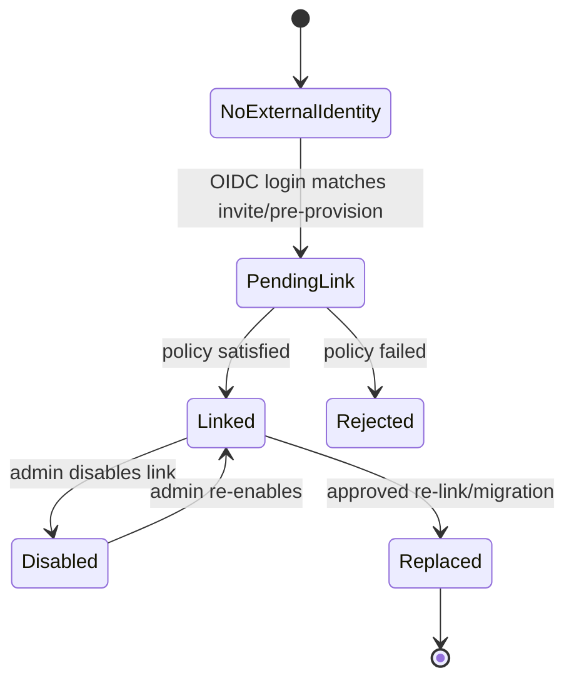
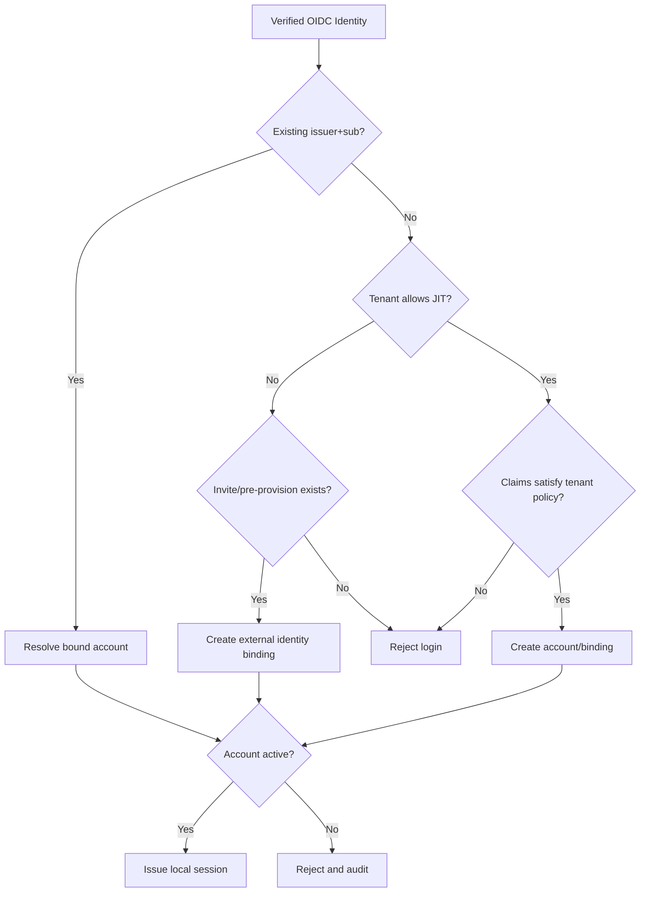
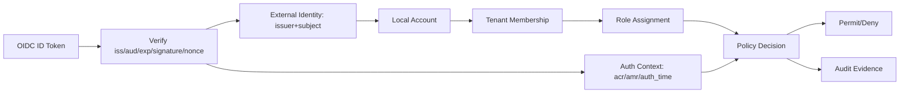

# learn-go-authentication-authorization-identity-permission-part-016.md

# Part 016 — Building OIDC Client / Relying Party di Go

> Seri: `learn-go-authentication-authorization-identity-permission`  
> Bahasa: Go 1.26.x  
> Level: Advanced / internal engineering handbook  
> Fokus: membangun OpenID Connect Relying Party / OIDC client yang aman, maintainable, multi-provider, multi-tenant aware, dan production-ready.

---

## Daftar Isi

1. [Tujuan Part Ini](#1-tujuan-part-ini)
2. [Apa yang Kita Bangun: OIDC Relying Party, Bukan Identity Provider](#2-apa-yang-kita-bangun-oidc-relying-party-bukan-identity-provider)
3. [Mental Model: OIDC Login Adalah Authentication Ceremony + Local Session Issuance](#3-mental-model-oidc-login-adalah-authentication-ceremony--local-session-issuance)
4. [Komponen Arsitektur Relying Party](#4-komponen-arsitektur-relying-party)
5. [Flow End-to-End: Start Login sampai Local Session](#5-flow-end-to-end-start-login-sampai-local-session)
6. [Go Package Boundary yang Sehat](#6-go-package-boundary-yang-sehat)
7. [Provider Registry dan Discovery](#7-provider-registry-dan-discovery)
8. [Authorization Transaction Store: State, Nonce, PKCE, Return URL](#8-authorization-transaction-store-state-nonce-pkce-return-url)
9. [Login Start Handler](#9-login-start-handler)
10. [Callback Handler: Pipeline yang Benar](#10-callback-handler-pipeline-yang-benar)
11. [Token Exchange dengan `golang.org/x/oauth2`](#11-token-exchange-dengan-golangorgxoauth2)
12. [ID Token Verification dengan `coreos/go-oidc`](#12-id-token-verification-dengan-coreosgo-oidc)
13. [Nonce Verification](#13-nonce-verification)
14. [Claims Extraction dan Normalization](#14-claims-extraction-dan-normalization)
15. [UserInfo Endpoint: Kapan Perlu, Kapan Tidak](#15-userinfo-endpoint-kapan-perlu-kapan-tidak)
16. [External Identity Binding: Jangan Pakai Email sebagai Primary Identity](#16-external-identity-binding-jangan-pakai-email-sebagai-primary-identity)
17. [Account Linking Strategy](#17-account-linking-strategy)
18. [Tenant Binding dan Enterprise SSO](#18-tenant-binding-dan-enterprise-sso)
19. [Session Issuance Setelah OIDC Login](#19-session-issuance-setelah-oidc-login)
20. [Logout dan Session Boundary](#20-logout-dan-session-boundary)
21. [Error Taxonomy](#21-error-taxonomy)
22. [Security Pitfalls yang Sering Terjadi](#22-security-pitfalls-yang-sering-terjadi)
23. [Failure Mode Matrix](#23-failure-mode-matrix)
24. [Observability dan Audit](#24-observability-dan-audit)
25. [Testing Strategy](#25-testing-strategy)
26. [Production Hardening Checklist](#26-production-hardening-checklist)
27. [Case Study: Enterprise Regulatory Case Management](#27-case-study-enterprise-regulatory-case-management)
28. [Ringkasan Mental Model](#28-ringkasan-mental-model)
29. [Referensi Primer](#29-referensi-primer)

---

## 1. Tujuan Part Ini

Pada part sebelumnya kita sudah membahas OpenID Connect sebagai identity layer di atas OAuth 2.0. Part ini turun ke implementasi nyata di Go: bagaimana membangun **Relying Party** yang menerima authentication dari OpenID Provider, memverifikasi evidence-nya, menghubungkan external identity ke internal account, lalu menerbitkan local session.

Output pemahaman yang diharapkan:

1. Bisa membedakan secara tegas antara:
   - OIDC Provider session,
   - OIDC authorization transaction,
   - ID Token,
   - Access Token,
   - UserInfo response,
   - local account,
   - local session.
2. Bisa membuat RP implementation yang aman terhadap:
   - CSRF pada callback,
   - authorization code injection,
   - mix-up attack,
   - nonce mismatch,
   - issuer/audience mismatch,
   - account takeover via email auto-link,
   - tenant breakout,
   - replay state,
   - unsafe return URL.
3. Bisa mendesain Go package boundary yang mudah di-test, di-audit, dan dioperasikan.
4. Bisa menentukan kapan cukup memakai library, kapan perlu wrapper internal, dan bagian mana yang tidak boleh diimplementasikan manual.

Part ini **bukan** tutorial “login with Google 20 lines”. Di sistem enterprise, 20 lines itu biasanya menyembunyikan masalah besar: state tidak single-use, nonce tidak dicek, redirect tidak aman, account linking pakai email, tenant tidak dibound, dan callback error tidak diaudit.

---

## 2. Apa yang Kita Bangun: OIDC Relying Party, Bukan Identity Provider

Dalam terminologi OIDC:

- **OpenID Provider / OP** adalah pihak yang melakukan authentication terhadap end-user dan menerbitkan ID Token.
- **Relying Party / RP** adalah aplikasi/client yang bergantung pada authentication result dari OP.
- **End-User** adalah manusia yang login.

Aplikasi Go kita dalam part ini bertindak sebagai **Relying Party**.

Kita tidak membangun authorization server atau identity provider di part ini. Itu baru dibahas di part berikutnya. Di sini kita membangun sisi consuming application: aplikasi yang menerima login dari Keycloak, Azure Entra ID, Okta, Google, Auth0, Singpass/Corppass-style provider, atau IdP internal lain.

### Invariant utama

> Relying Party tidak “percaya user sudah login” hanya karena callback menerima `code`. RP baru boleh membuat local session setelah authorization transaction tervalidasi, token exchange sukses, ID Token terverifikasi, nonce cocok, issuer/audience cocok, external identity tervalidasi, dan local account binding berhasil.

---

## 3. Mental Model: OIDC Login Adalah Authentication Ceremony + Local Session Issuance

OIDC login sering dipahami keliru sebagai:

> “Redirect user ke provider, terima callback, dapat email, login.”

Mental model yang benar:

```text
OIDC login =
  1. create local authorization transaction
  2. redirect user to OP authorization endpoint
  3. receive callback from user-agent
  4. bind callback to transaction via state
  5. exchange code with OP token endpoint
  6. verify ID Token as authentication evidence
  7. verify nonce to bind ID Token to browser flow
  8. normalize external identity
  9. link external identity to local account
 10. enforce tenant and account policy
 11. issue local session
 12. audit authentication result
```

Diagram:

```mermaid
sequenceDiagram
    autonumber
    participant B as Browser
    participant RP as Go Relying Party
    participant TS as Auth Transaction Store
    participant OP as OpenID Provider
    participant AS as Account Store
    participant SS as Session Store

    B->>RP: GET /auth/login/{provider}?return_to=/cases
    RP->>TS: create state, nonce, pkce_verifier, return_to
    RP-->>B: 302 Redirect to OP /authorize
    B->>OP: Authorization Request
    OP-->>B: Login / Consent
    OP-->>B: 302 back to RP callback?code&state
    B->>RP: GET /auth/callback/{provider}?code&state
    RP->>TS: consume state once
    RP->>OP: POST /token code + code_verifier
    OP-->>RP: id_token + access_token
    RP->>RP: verify ID Token signature, iss, aud, exp, nonce
    RP->>AS: find or link external identity issuer+subject
    RP->>SS: create local session
    RP-->>B: Set-Cookie session; redirect return_to
```

Perhatikan ada dua sesi yang berbeda:

1. **OP session**: sesi user di identity provider.
2. **RP local session**: sesi user di aplikasi Go kita.

Logout dari RP belum tentu logout dari OP. Logout dari OP belum tentu otomatis menghapus RP local session kecuali kita mengimplementasikan front-channel/back-channel logout atau session polling sesuai kebutuhan.

---

## 4. Komponen Arsitektur Relying Party

OIDC client production-grade sebaiknya tidak hanya berisi dua handler `login` dan `callback`. Ia sebaiknya terdiri dari beberapa komponen eksplisit.



### Komponen utama

| Komponen | Tanggung jawab | Tidak boleh melakukan |
|---|---|---|
| `ProviderRegistry` | Resolve konfigurasi provider berdasarkan provider ID/tenant | Membuat user session |
| `AuthTransactionStore` | Menyimpan state, nonce, PKCE verifier, return URL, expiry | Menyimpan access token user jangka panjang tanpa alasan |
| `LoginHandler` | Membuat auth transaction dan redirect ke OP | Melakukan account linking |
| `CallbackHandler` | Validasi callback dan orchestrate pipeline | Menaruh seluruh business policy inline tanpa test boundary |
| `TokenExchanger` | Exchange authorization code ke token endpoint | Memverifikasi authorization decision lokal |
| `IDTokenVerifier` | Signature/claim validation ID Token | Menganggap email sebagai identity primer |
| `ClaimsNormalizer` | Konversi claims provider-specific ke bentuk internal | Membuat role assignment langsung dari claim tanpa policy jelas |
| `ExternalIdentityService` | Bind issuer+subject ke local account | Auto-link sembarang email |
| `SessionIssuer` | Membuat local session | Memercayai access token sebagai local session tanpa kontrol |
| `AuditSink` | Mencatat authentication event | Menyimpan token mentah di log |

---

## 5. Flow End-to-End: Start Login sampai Local Session

### 5.1 Start login

Input:

```http
GET /auth/login/acme-idp?return_to=/cases/123
```

Langkah:

1. Validasi provider ID.
2. Resolve provider config.
3. Validasi `return_to` agar internal dan allowlisted.
4. Generate:
   - `state`,
   - `nonce`,
   - `pkce_verifier`,
   - `pkce_challenge`.
5. Simpan transaction dengan TTL pendek.
6. Build authorization URL:
   - `response_type=code`,
   - `client_id`,
   - `redirect_uri`,
   - `scope=openid ...`,
   - `state`,
   - `nonce`,
   - `code_challenge`,
   - `code_challenge_method=S256`.
7. Redirect browser ke OP.

### 5.2 Callback

Input:

```http
GET /auth/callback/acme-idp?code=...&state=...
```

Langkah:

1. Parse `error` dari provider bila ada.
2. Validasi `state` hadir.
3. Consume state secara atomic dan single-use.
4. Validasi provider ID callback cocok dengan transaction.
5. Exchange authorization code + PKCE verifier.
6. Ambil `id_token` dari token response.
7. Verify ID Token:
   - signature,
   - issuer,
   - audience,
   - expiry,
   - issued-at bila policy mengharuskan,
   - `azp` bila multi-audience,
   - nonce.
8. Extract claims.
9. Normalize external identity: `(issuer, subject)`.
10. Find/link local account.
11. Enforce local account status.
12. Enforce tenant binding.
13. Issue local session.
14. Audit success/failure.
15. Redirect ke sanitized `return_to`.

### 5.3 Kesalahan paling berbahaya

```go
// Anti-pattern: terlalu sederhana dan berbahaya.
email := claims.Email
user := users.FindByEmail(email)
sessions.Create(user.ID)
```

Masalahnya:

- email bisa berubah;
- email bisa belum terverifikasi;
- issuer berbeda bisa menerbitkan email yang sama;
- tenant tidak tervalidasi;
- account linking tidak eksplisit;
- subject identifier diabaikan;
- takeover bisa terjadi saat attacker mengontrol IdP lain dengan email sama.

Identity primer dari OIDC adalah:

```text
external_identity_key = issuer + subject
```

Bukan email.

---

## 6. Go Package Boundary yang Sehat

Contoh struktur package:

```text
/internal/auth/oidcrp/
  provider.go
  transaction.go
  login_handler.go
  callback_handler.go
  token_exchange.go
  idtoken.go
  claims.go
  identity_binding.go
  session_issuer.go
  errors.go
  audit.go

/internal/auth/session/
  session.go
  store.go
  cookie.go

/internal/identity/
  account.go
  external_identity.go
  tenant.go

/internal/platform/cryptoid/
  random.go

/internal/platform/httpx/
  redirect.go
  securecookie.go
```

### Design principle

> Handler boleh mengorkestrasi flow, tetapi keputusan penting harus hidup di service kecil yang dapat di-test secara terisolasi.

Misalnya:

- return URL validation harus bisa dites tanpa HTTP server;
- state consume harus bisa dites race condition;
- account linking harus bisa dites multi-provider;
- ID Token verification harus bisa dites dengan fake provider/JWKS;
- tenant binding harus bisa dites secara deterministic.

### Core domain types

```go
package oidcrp

import "time"

type ProviderID string
type Issuer string
type Subject string
type ClientID string

type ExternalIdentityKey struct {
    Issuer  Issuer
    Subject Subject
}

type AuthorizationTransaction struct {
    State        string
    ProviderID   ProviderID
    TenantHint   string
    Nonce        string
    PKCEVerifier string
    ReturnTo     string
    CreatedAt    time.Time
    ExpiresAt    time.Time
    ConsumedAt   *time.Time
    UserAgentHash string
    IPHash        string
}

type VerifiedOIDCIdentity struct {
    Key           ExternalIdentityKey
    ProviderID    ProviderID
    Email         string
    EmailVerified bool
    Name          string
    PreferredName string
    AuthTime      *time.Time
    ACR           string
    AMR           []string
    RawClaims     map[string]any
}
```

Kenapa `Issuer + Subject` dibungkus sebagai type?

Karena kita ingin mencegah developer memakai `email` sebagai identity key hanya karena lebih mudah dicari.

---

## 7. Provider Registry dan Discovery

OIDC Discovery menyediakan metadata OP seperti authorization endpoint, token endpoint, UserInfo endpoint, JWKS URI, supported scopes, supported claims, dan signing algorithms.

Namun production RP tidak boleh sepenuhnya “menerima provider arbitrary dari request user”. Provider harus berasal dari registry internal yang allowlisted.

### Provider config

```go
type ProviderConfig struct {
    ID           ProviderID
    Issuer       string
    ClientID     string
    ClientSecret string
    RedirectURL  string
    Scopes       []string

    // Policy lokal, bukan metadata OIDC standar.
    AllowSignup       bool
    RequireEmail      bool
    RequireVerifiedEmail bool
    AllowedTenants    []string
    AllowedDomains    []string
    RequiredACR       string
    RequiredAMR       []string
}
```

### Provider registry interface

```go
type ProviderRegistry interface {
    Resolve(ctx context.Context, providerID ProviderID, tenantHint string) (*RuntimeProvider, error)
}

type RuntimeProvider struct {
    Config      ProviderConfig
    OAuth2      *oauth2.Config
    OIDC        *oidc.Provider
    Verifier    *oidc.IDTokenVerifier
}
```

### Static vs dynamic provider

| Mode | Cocok untuk | Risiko |
|---|---|---|
| Static config | sedikit provider, sistem internal | perlu redeploy saat config berubah |
| DB-backed config | banyak tenant enterprise | perlu validation dan approval flow |
| Dynamic discovery from user input | jarang cocok untuk enterprise app | SSRF, malicious issuer, mix-up, trust confusion |

### Rule praktis

> Issuer harus allowlisted. Discovery boleh dinamis secara operasional, tetapi trust decision tidak boleh dinamis dari input user mentah.

### Discovery cache

Discovery dan JWKS tidak perlu dipanggil di setiap request login. Buat cache provider runtime.

```go
type CachedProviderRegistry struct {
    mu    sync.RWMutex
    items map[ProviderID]*cachedProvider
}

type cachedProvider struct {
    provider  *RuntimeProvider
    expiresAt time.Time
}
```

Perhatikan:

- cache expiry jangan terlalu lama untuk mendukung key rotation;
- jangan fail-open saat discovery gagal untuk provider baru;
- boleh pakai stale provider sementara untuk provider existing bila kebijakan outage mengizinkan;
- catat telemetry ketika memakai stale config.

---

## 8. Authorization Transaction Store: State, Nonce, PKCE, Return URL

Authorization transaction adalah objek lokal yang mengikat browser flow dari login start ke callback.

### Kenapa transaction store penting?

Karena `state`, `nonce`, dan PKCE masing-masing melindungi aspek berbeda:

| Elemen | Melindungi dari | Harus disimpan? |
|---|---|---|
| `state` | CSRF/callback injection, binding callback ke login attempt | Ya, single-use |
| `nonce` | ID Token replay/substitution dalam browser flow | Ya, dibandingkan dengan claim ID Token |
| `code_verifier` | authorization code interception | Ya, dipakai saat token exchange |
| `return_to` | open redirect dan UX return | Ya, sanitized |
| `provider_id` | mix-up/confused provider | Ya |
| `tenant_hint` | tenant binding | Ya bila multi-tenant |

### Interface store

```go
type TransactionStore interface {
    Create(ctx context.Context, tx AuthorizationTransaction) error
    Consume(ctx context.Context, state string) (AuthorizationTransaction, error)
}
```

`Consume` harus atomic:

```sql
UPDATE oidc_auth_transaction
SET consumed_at = now()
WHERE state_hash = $1
  AND consumed_at IS NULL
  AND expires_at > now()
RETURNING ...;
```

Jika memakai Redis:

- gunakan `GETDEL` untuk single-use bila tersedia;
- atau Lua script agar get+delete atomic;
- TTL pendek, misalnya 5–10 menit;
- simpan hash state, bukan state plaintext bila memungkinkan;
- jangan log state mentah.

### State dan nonce generation

```go
func RandomURLSafe(n int) (string, error) {
    b := make([]byte, n)
    if _, err := rand.Read(b); err != nil {
        return "", err
    }
    return base64.RawURLEncoding.EncodeToString(b), nil
}
```

Rekomendasi praktis:

- `state`: minimal 128-bit entropy;
- `nonce`: minimal 128-bit entropy;
- PKCE verifier: sesuai charset dan panjang RFC 7636, praktis gunakan 32 bytes random lalu base64url.

### Return URL validation

Jangan langsung redirect ke input user.

```go
func ValidateReturnTo(raw string) (string, error) {
    if raw == "" {
        return "/"
    }

    u, err := url.Parse(raw)
    if err != nil {
        return "", ErrInvalidReturnURL
    }

    // Hanya path internal relatif.
    if u.IsAbs() || u.Host != "" || strings.HasPrefix(raw, "//") {
        return "", ErrInvalidReturnURL
    }

    if !strings.HasPrefix(u.Path, "/") {
        return "", ErrInvalidReturnURL
    }

    // Optional: block callback/login/logout path agar tidak loop.
    if strings.HasPrefix(u.Path, "/auth/") {
        return "", ErrInvalidReturnURL
    }

    return u.RequestURI(), nil
}
```

Open redirect dalam login flow dapat menjadi credential/token phishing amplifier.

---

## 9. Login Start Handler

Contoh handler dengan dependency injection.

```go
type LoginHandler struct {
    Providers    ProviderRegistry
    Transactions TransactionStore
    Clock        Clock
    Random       func(int) (string, error)
}

func (h *LoginHandler) ServeHTTP(w http.ResponseWriter, r *http.Request) {
    ctx := r.Context()

    providerID := ProviderID(r.PathValue("provider"))
    tenantHint := r.URL.Query().Get("tenant")

    returnTo, err := ValidateReturnTo(r.URL.Query().Get("return_to"))
    if err != nil {
        http.Error(w, "invalid return target", http.StatusBadRequest)
        return
    }

    rp, err := h.Providers.Resolve(ctx, providerID, tenantHint)
    if err != nil {
        http.Error(w, "unknown provider", http.StatusNotFound)
        return
    }

    state, err := h.Random(32)
    if err != nil { internalError(w); return }

    nonce, err := h.Random(32)
    if err != nil { internalError(w); return }

    verifier, err := h.Random(32)
    if err != nil { internalError(w); return }

    challenge := pkceS256(verifier)

    now := h.Clock.Now()
    tx := AuthorizationTransaction{
        State:        state,
        ProviderID:   providerID,
        TenantHint:   tenantHint,
        Nonce:        nonce,
        PKCEVerifier: verifier,
        ReturnTo:     returnTo,
        CreatedAt:    now,
        ExpiresAt:    now.Add(10 * time.Minute),
        UserAgentHash: hashForAudit(r.UserAgent()),
        IPHash:        hashForAudit(clientIP(r)),
    }

    if err := h.Transactions.Create(ctx, tx); err != nil {
        internalError(w)
        return
    }

    authURL := rp.OAuth2.AuthCodeURL(
        state,
        oauth2.SetAuthURLParam("nonce", nonce),
        oauth2.SetAuthURLParam("code_challenge", challenge),
        oauth2.SetAuthURLParam("code_challenge_method", "S256"),
    )

    http.Redirect(w, r, authURL, http.StatusFound)
}

func pkceS256(verifier string) string {
    sum := sha256.Sum256([]byte(verifier))
    return base64.RawURLEncoding.EncodeToString(sum[:])
}
```

### Kenapa `state` tidak perlu disimpan di browser?

Boleh memakai cookie state, tetapi server-side transaction store lebih mudah untuk:

- single-use consumption;
- callback audit;
- correlation ID;
- tenant/provider binding;
- return URL sanitization;
- centralized replay detection.

Untuk aplikasi enterprise, server-side transaction store biasanya lebih defensible daripada semua data flow ditaruh di cookie terenkripsi.

---

## 10. Callback Handler: Pipeline yang Benar

Callback handler harus ketat, terurut, dan eksplisit.

```go
type CallbackHandler struct {
    Providers       ProviderRegistry
    Transactions    TransactionStore
    IdentityBinder  ExternalIdentityBinder
    SessionIssuer   SessionIssuer
    Audit           AuditSink
    Clock           Clock
}

func (h *CallbackHandler) ServeHTTP(w http.ResponseWriter, r *http.Request) {
    ctx := r.Context()
    providerID := ProviderID(r.PathValue("provider"))

    if oauthErr := r.URL.Query().Get("error"); oauthErr != "" {
        h.auditFailure(ctx, r, providerID, "provider_error", oauthErr)
        http.Error(w, "login failed", http.StatusUnauthorized)
        return
    }

    state := r.URL.Query().Get("state")
    code := r.URL.Query().Get("code")
    if state == "" || code == "" {
        h.auditFailure(ctx, r, providerID, "missing_callback_param", "")
        http.Error(w, "invalid login callback", http.StatusBadRequest)
        return
    }

    tx, err := h.Transactions.Consume(ctx, state)
    if err != nil {
        h.auditFailure(ctx, r, providerID, "invalid_or_replayed_state", "")
        http.Error(w, "invalid login transaction", http.StatusUnauthorized)
        return
    }

    if tx.ProviderID != providerID {
        h.auditFailure(ctx, r, providerID, "provider_mismatch", "")
        http.Error(w, "invalid login transaction", http.StatusUnauthorized)
        return
    }

    rp, err := h.Providers.Resolve(ctx, providerID, tx.TenantHint)
    if err != nil {
        h.auditFailure(ctx, r, providerID, "provider_resolution_failed", "")
        http.Error(w, "login provider unavailable", http.StatusServiceUnavailable)
        return
    }

    oauthToken, err := rp.OAuth2.Exchange(
        ctx,
        code,
        oauth2.SetAuthURLParam("code_verifier", tx.PKCEVerifier),
    )
    if err != nil {
        h.auditFailure(ctx, r, providerID, "token_exchange_failed", "")
        http.Error(w, "login failed", http.StatusUnauthorized)
        return
    }

    rawIDToken, ok := oauthToken.Extra("id_token").(string)
    if !ok || rawIDToken == "" {
        h.auditFailure(ctx, r, providerID, "missing_id_token", "")
        http.Error(w, "login failed", http.StatusUnauthorized)
        return
    }

    idToken, err := rp.Verifier.Verify(ctx, rawIDToken)
    if err != nil {
        h.auditFailure(ctx, r, providerID, "id_token_verify_failed", "")
        http.Error(w, "login failed", http.StatusUnauthorized)
        return
    }

    claims, err := ParseAndValidateClaims(idToken, tx.Nonce, rp.Config)
    if err != nil {
        h.auditFailure(ctx, r, providerID, "claims_validation_failed", "")
        http.Error(w, "login failed", http.StatusUnauthorized)
        return
    }

    identity, err := NormalizeIdentity(providerID, idToken.Issuer, idToken.Subject, claims)
    if err != nil {
        h.auditFailure(ctx, r, providerID, "identity_normalization_failed", "")
        http.Error(w, "login failed", http.StatusUnauthorized)
        return
    }

    local, err := h.IdentityBinder.BindOrResolve(ctx, BindRequest{
        ProviderID: providerID,
        TenantHint: tx.TenantHint,
        Identity:   identity,
        RawIDTokenClaims: claims.Raw,
    })
    if err != nil {
        h.auditFailure(ctx, r, providerID, "identity_binding_failed", "")
        http.Error(w, "login not allowed", http.StatusForbidden)
        return
    }

    sess, err := h.SessionIssuer.Issue(ctx, IssueSessionRequest{
        AccountID: local.AccountID,
        TenantID:  local.TenantID,
        AuthSource: "oidc",
        ExternalIdentity: identity.Key,
        AuthTime: identity.AuthTime,
        ACR: identity.ACR,
        AMR: identity.AMR,
    })
    if err != nil {
        h.auditFailure(ctx, r, providerID, "session_issue_failed", "")
        internalError(w)
        return
    }

    SetSessionCookie(w, sess)
    h.auditSuccess(ctx, r, providerID, local, identity)
    http.Redirect(w, r, tx.ReturnTo, http.StatusFound)
}
```

### Important design note

Callback handler di atas memang terlihat panjang. Dalam production code, sebagian besar logic harus dipindah ke service kecil agar handler hanya mengorkestrasi.

Namun urutan validasinya jangan dikompromikan:

1. state dulu,
2. provider binding,
3. token exchange,
4. ID Token verification,
5. nonce,
6. identity binding,
7. tenant policy,
8. session issue.

---

## 11. Token Exchange dengan `golang.org/x/oauth2`

`golang.org/x/oauth2` menyediakan primitif untuk membuat authorization URL dan menukar authorization code menjadi token.

Contoh config:

```go
func BuildOAuth2Config(p ProviderConfig, op *oidc.Provider) *oauth2.Config {
    return &oauth2.Config{
        ClientID:     p.ClientID,
        ClientSecret: p.ClientSecret,
        RedirectURL:  p.RedirectURL,
        Scopes:       p.Scopes,
        Endpoint:     op.Endpoint(),
    }
}
```

Scopes minimal untuk OIDC login:

```go
[]string{oidc.ScopeOpenID, "profile", "email"}
```

Namun jangan selalu meminta `profile` dan `email` jika tidak diperlukan. Minimalkan data.

### Token exchange timeout

Token endpoint call harus punya timeout.

```go
ctx, cancel := context.WithTimeout(r.Context(), 5*time.Second)
defer cancel()

tok, err := oauthConfig.Exchange(
    ctx,
    code,
    oauth2.SetAuthURLParam("code_verifier", tx.PKCEVerifier),
)
```

Jangan memakai context tanpa timeout untuk dependency eksternal dalam login path.

### Client secret handling

Untuk confidential clients:

- simpan secret di secret manager;
- jangan log config;
- rotasi secret dengan overlap;
- support dual secret jika provider memungkinkan;
- jangan kirim client secret ke browser.

Untuk public clients:

- jangan mengandalkan client secret;
- PKCE wajib secara praktis;
- hindari menaruh OIDC logic langsung di SPA jika backend bisa memakai BFF pattern.

---

## 12. ID Token Verification dengan `coreos/go-oidc`

`github.com/coreos/go-oidc/v3/oidc` mengimplementasikan OIDC client logic untuk Go dan terintegrasi dengan `golang.org/x/oauth2`.

Provider initialization:

```go
provider, err := oidc.NewProvider(ctx, issuerURL)
if err != nil {
    return nil, err
}

verifier := provider.Verifier(&oidc.Config{
    ClientID: clientID,
})
```

Verification:

```go
idToken, err := verifier.Verify(ctx, rawIDToken)
if err != nil {
    return nil, fmt.Errorf("verify id token: %w", err)
}
```

`Verify` melakukan validasi penting seperti signature dan standard claims sesuai config verifier. Namun aplikasi tetap perlu melakukan validasi policy tambahan seperti:

- `nonce`,
- `acr`,
- `amr`,
- `auth_time` freshness,
- `email_verified`,
- tenant/domain claim,
- provider-specific claims,
- local account status.

### Jangan parse JWT sendiri untuk authentication decision

Anti-pattern:

```go
parts := strings.Split(rawIDToken, ".")
payload, _ := base64.RawURLEncoding.DecodeString(parts[1])
json.Unmarshal(payload, &claims)
// lalu login user
```

Ini berbahaya karena belum memverifikasi:

- signature,
- issuer,
- audience,
- expiry,
- allowed algorithm,
- key material,
- clock skew.

Parsing boleh untuk debugging lokal, tetapi tidak boleh untuk auth decision.

---

## 13. Nonce Verification

OIDC `nonce` mengikat authentication response dengan authorization request dari browser flow.

### Claims struct

```go
type IDTokenClaims struct {
    Issuer        string   `json:"iss"`
    Subject       string   `json:"sub"`
    Audience      any      `json:"aud"`
    Expiry        int64    `json:"exp"`
    IssuedAt      int64    `json:"iat"`
    AuthTime      int64    `json:"auth_time,omitempty"`
    Nonce         string   `json:"nonce,omitempty"`
    ACR           string   `json:"acr,omitempty"`
    AMR           []string `json:"amr,omitempty"`
    Email         string   `json:"email,omitempty"`
    EmailVerified bool     `json:"email_verified,omitempty"`
    Name          string   `json:"name,omitempty"`
    PreferredName string   `json:"preferred_username,omitempty"`
    HostedDomain  string   `json:"hd,omitempty"`
    Raw           map[string]any `json:"-"`
}
```

Parse claims:

```go
func ExtractClaims(idToken *oidc.IDToken) (*IDTokenClaims, error) {
    var raw map[string]any
    if err := idToken.Claims(&raw); err != nil {
        return nil, err
    }

    var claims IDTokenClaims
    b, _ := json.Marshal(raw)
    if err := json.Unmarshal(b, &claims); err != nil {
        return nil, err
    }
    claims.Raw = raw
    return &claims, nil
}
```

Validate nonce:

```go
func ValidateNonce(claims *IDTokenClaims, expected string) error {
    if expected == "" {
        return ErrMissingExpectedNonce
    }
    if claims.Nonce == "" {
        return ErrMissingNonceClaim
    }
    if subtle.ConstantTimeCompare([]byte(claims.Nonce), []byte(expected)) != 1 {
        return ErrNonceMismatch
    }
    return nil
}
```

Catatan: constant-time comparison tidak mengubah OIDC menjadi crypto magic, tetapi membantu menjaga habit benar untuk secret-ish comparison. Yang lebih penting adalah nonce harus unique, random, tersimpan server-side, dan single authorization transaction.

---

## 14. Claims Extraction dan Normalization

OIDC claims adalah input dari external authority. Jangan langsung memasukkannya ke internal domain tanpa normalization.

### Normalized identity

```go
type NormalizedIdentity struct {
    Key ExternalIdentityKey

    Email         string
    EmailVerified bool
    DisplayName   string
    Username      string

    AuthTime *time.Time
    ACR      string
    AMR      []string

    ProviderID ProviderID
    TenantHints []string
}
```

### Normalize function

```go
func NormalizeIdentity(
    providerID ProviderID,
    issuer string,
    subject string,
    claims *IDTokenClaims,
) (NormalizedIdentity, error) {
    if issuer == "" || subject == "" {
        return NormalizedIdentity{}, ErrMissingIssuerOrSubject
    }

    var authTime *time.Time
    if claims.AuthTime > 0 {
        t := time.Unix(claims.AuthTime, 0).UTC()
        authTime = &t
    }

    return NormalizedIdentity{
        Key: ExternalIdentityKey{
            Issuer:  Issuer(issuer),
            Subject: Subject(subject),
        },
        Email:         strings.ToLower(strings.TrimSpace(claims.Email)),
        EmailVerified: claims.EmailVerified,
        DisplayName:   strings.TrimSpace(claims.Name),
        Username:      strings.TrimSpace(claims.PreferredName),
        AuthTime:      authTime,
        ACR:           claims.ACR,
        AMR:           claims.AMR,
        ProviderID:    providerID,
    }, nil
}
```

### Claim trust policy

Tidak semua claim punya bobot sama.

| Claim | Bisa dipakai untuk | Jangan dipakai untuk |
|---|---|---|
| `sub` | external identity key bersama issuer | display name |
| `iss` | trust boundary provider | tenant authorization tanpa registry |
| `email` | contact hint, possible linking candidate | primary identity tanpa `email_verified` dan policy |
| `email_verified` | linking precondition | bukti user authorized untuk tenant |
| `hd` / domain claim | UX/routing hint | sole tenant security boundary |
| `acr` | assurance policy | role mapping otomatis tanpa governance |
| `amr` | factor visibility | permission grant permanen |
| custom role claim | bootstrap/interop | source of truth tanpa lifecycle jelas |

Top engineer tidak hanya bertanya “claim apa yang tersedia?”, tetapi:

> “Siapa authority claim ini, freshness-nya apa, lifecycle-nya bagaimana, dan konsekuensi kalau claim ini salah/stale?”

---

## 15. UserInfo Endpoint: Kapan Perlu, Kapan Tidak

OIDC menyediakan UserInfo endpoint untuk mengambil claims tambahan memakai access token.

### Kapan perlu UserInfo?

- ID Token tidak memuat email/profile yang dibutuhkan.
- Provider memang mendesain claims utama di UserInfo.
- Dibutuhkan attribute yang terlalu besar/dinamis untuk ID Token.
- Ada requirement mengambil updated profile saat login.

### Kapan tidak perlu?

- ID Token sudah cukup.
- Login path harus minimal dependency.
- Provider UserInfo sering lambat/tidak stabil.
- Data profile bukan blocker untuk local session.

### Implementasi

```go
func FetchUserInfo(ctx context.Context, provider *oidc.Provider, token *oauth2.Token) (map[string]any, error) {
    userInfo, err := provider.UserInfo(ctx, oauth2.StaticTokenSource(token))
    if err != nil {
        return nil, err
    }

    var claims map[string]any
    if err := userInfo.Claims(&claims); err != nil {
        return nil, err
    }
    return claims, nil
}
```

### Important invariant

> UserInfo response tidak menggantikan ID Token verification. UserInfo boleh memperkaya profile, tetapi authentication evidence utama dalam OIDC login tetap ID Token yang tervalidasi.

---

## 16. External Identity Binding: Jangan Pakai Email sebagai Primary Identity

External identity binding adalah proses menghubungkan identity dari OP ke local account.

Schema minimum:

```sql
CREATE TABLE external_identity (
    id BIGSERIAL PRIMARY KEY,
    provider_id TEXT NOT NULL,
    issuer TEXT NOT NULL,
    subject TEXT NOT NULL,
    account_id BIGINT NOT NULL,
    tenant_id BIGINT NULL,
    email_at_last_login TEXT NULL,
    email_verified_at_last_login BOOLEAN NOT NULL DEFAULT FALSE,
    first_seen_at TIMESTAMPTZ NOT NULL,
    last_seen_at TIMESTAMPTZ NOT NULL,
    disabled_at TIMESTAMPTZ NULL,
    UNIQUE (issuer, subject),
    UNIQUE (provider_id, subject)
);
```

Untuk multi-tenant dengan provider shared, unique key mungkin perlu:

```sql
UNIQUE (tenant_id, issuer, subject)
```

Namun hati-hati: OIDC `sub` scoped ke issuer. Jika issuer sama, subject secara umum sudah unique. Tambahan tenant bisa dipakai untuk local partitioning, tetapi jangan membuat ambiguity jika identity yang sama memang harus map ke satu account global.

### Binding interface

```go
type ExternalIdentityBinder interface {
    BindOrResolve(ctx context.Context, req BindRequest) (BoundAccount, error)
}

type BindRequest struct {
    ProviderID ProviderID
    TenantHint string
    Identity   NormalizedIdentity
    RawIDTokenClaims map[string]any
}

type BoundAccount struct {
    AccountID string
    UserID    string
    TenantID  string
    Status    string
}
```

### Binding modes

| Mode | Penjelasan | Cocok untuk |
|---|---|---|
| Pre-provisioned | external identity sudah diregistrasi admin | government/enterprise high assurance |
| JIT provisioning | account dibuat saat login pertama | SaaS B2B dengan tenant policy kuat |
| Explicit linking | user login lokal lalu link IdP | consumer/account migration |
| Invite-based linking | user harus punya invite aktif | enterprise onboarding |
| Email auto-link | match email otomatis | berisiko, hanya jika policy sangat ketat |

### Email auto-link policy minimum

Jika tetap memakai email auto-link, syarat minimal:

1. issuer allowlisted untuk tenant tersebut;
2. email claim hadir;
3. `email_verified=true`;
4. domain email sesuai tenant policy;
5. account local belum punya external identity conflicting;
6. tidak ada local account privilege tinggi tanpa step-up/admin approval;
7. audit event `external_identity_auto_linked`;
8. user diberitahu/linking visible;
9. bisa rollback/disable;
10. ada rate limit dan anomaly detection.

Namun untuk sistem regulatory/enterprise, lebih defensible memakai pre-provisioning atau invite-based linking.

---

## 17. Account Linking Strategy

Account linking adalah salah satu titik takeover paling sering.

### Safe linking state machine



### Linking decision tree



### Linking anti-pattern

```go
if user := users.FindByEmail(claims.Email); user != nil {
    return bindExternalIdentity(user.ID, issuer, sub)
}
```

Lebih baik:

```go
existing := externalIdentities.FindByIssuerSubject(ctx, issuer, sub)
if existing != nil {
    return resolveAccount(existing.AccountID)
}

invite := invites.FindActiveByEmailAndTenant(ctx, claims.Email, tenantID)
if invite != nil && claims.EmailVerified {
    return createBindingFromInvite(invite, issuer, sub)
}

return errorNotLinked
```

### Re-linking

Re-linking harus diperlakukan sebagai high-risk action:

- perlu step-up authentication;
- perlu audit reason;
- untuk admin harus ada approval atau dual control;
- session lama bisa di-invalidasi;
- binding lama jangan hard-delete; gunakan disabled/replaced state.

---

## 18. Tenant Binding dan Enterprise SSO

Multi-tenant OIDC menambah complexity besar.

Pertanyaan yang harus dijawab:

1. Apakah setiap tenant punya issuer berbeda?
2. Apakah satu issuer melayani banyak tenant?
3. Apakah tenant dipilih dari subdomain/path/email domain/invite?
4. Apakah user bisa menjadi member banyak tenant?
5. Apakah external subject sama boleh map ke banyak local account?
6. Apakah role/permission berasal dari IdP atau internal system?

### Tenant binding invariant

> Tenant tidak boleh hanya didapat dari request path atau email domain. Tenant harus direkonsiliasi antara login transaction, provider config, external identity binding, local membership, dan local authorization policy.

### Contoh tenant validation

```go
func ValidateTenantBinding(req BindRequest, account BoundAccount, provider ProviderConfig) error {
    if req.TenantHint != "" && account.TenantID != req.TenantHint {
        return ErrTenantMismatch
    }

    if len(provider.AllowedTenants) > 0 && !contains(provider.AllowedTenants, account.TenantID) {
        return ErrProviderNotAllowedForTenant
    }

    if account.Status != "active" {
        return ErrAccountInactive
    }

    return nil
}
```

### Provider-per-tenant vs shared provider

| Model | Keuntungan | Risiko |
|---|---|---|
| Provider per tenant | isolation jelas, config spesifik | config sprawl |
| Shared provider | sederhana untuk internal org besar | tenant claim/membership harus kuat |
| Bring-your-own-IdP | cocok B2B enterprise | onboarding, metadata, rotation, support complexity |
| Brokered IdP | central control via broker seperti Keycloak | broker menjadi critical dependency |

### Role claim dari IdP

Role claim dari IdP sebaiknya tidak langsung menjadi permission final.

Lebih aman:

```text
IdP group/role claim -> external attribute -> local role mapping policy -> local role assignment/effective permission
```

Kenapa?

- IdP admin mungkin bukan application permission owner;
- group stale bisa memberi akses berlebih;
- role naming bisa berbeda antar tenant;
- audit permission harus defensible di aplikasi;
- business permission sering lebih detail dari IdP group.

---

## 19. Session Issuance Setelah OIDC Login

Setelah identity binding berhasil, RP membuat local session.

### Jangan memakai ID Token sebagai session cookie

Anti-pattern:

```http
Set-Cookie: session=<id_token>
```

Masalah:

- ID Token bukan session handle aplikasi;
- ukurannya besar;
- claim bisa stale;
- logout/revocation lokal sulit;
- data sensitive terekspos di browser storage/cookie;
- audience token untuk client, bukan resource internal arbitrer.

### Local session model

```go
type Session struct {
    ID        string
    AccountID string
    UserID    string
    TenantID  string

    AuthSource string
    AuthTime   time.Time
    ACR        string
    AMR        []string

    CreatedAt time.Time
    ExpiresAt time.Time
    IdleUntil time.Time

    ExternalIdentity ExternalIdentityKey
}
```

### Session issuance interface

```go
type SessionIssuer interface {
    Issue(ctx context.Context, req IssueSessionRequest) (IssuedSession, error)
}

type IssueSessionRequest struct {
    AccountID string
    UserID    string
    TenantID  string

    AuthSource string
    ExternalIdentity ExternalIdentityKey
    AuthTime *time.Time
    ACR string
    AMR []string
}

type IssuedSession struct {
    SessionID string
    CookieValue string
    ExpiresAt time.Time
}
```

### Session cookie

```go
func SetSessionCookie(w http.ResponseWriter, s IssuedSession) {
    http.SetCookie(w, &http.Cookie{
        Name:     "__Host-session",
        Value:    s.CookieValue,
        Path:     "/",
        Secure:   true,
        HttpOnly: true,
        SameSite: http.SameSiteLaxMode,
        Expires:  s.ExpiresAt,
    })
}
```

`__Host-` prefix membantu memastikan cookie tidak memakai `Domain` attribute dan `Path=/`, sehingga mengurangi risiko cookie injection lintas subdomain pada browser modern.

### Preserve assurance

Session harus menyimpan assurance result:

- `auth_time`,
- `acr`,
- `amr`,
- provider,
- external identity.

Nanti saat user melakukan high-risk action, authorization layer bisa meminta step-up bila:

- `auth_time` terlalu lama,
- ACR kurang,
- AMR tidak mencakup phishing-resistant factor,
- login berasal dari IdP yang tidak memenuhi assurance policy.

---

## 20. Logout dan Session Boundary

Logout OIDC tidak sesederhana menghapus local cookie.

Ada beberapa konsep:

| Logout | Efek |
|---|---|
| Local RP logout | hapus local session aplikasi |
| OP logout | hapus session di provider |
| Front-channel logout | OP mengirim sinyal logout via browser/iframe |
| Back-channel logout | OP mengirim server-to-server logout token |
| RP-initiated logout | RP mengarahkan user ke OP logout endpoint |

Part ini fokus RP login, bukan full logout protocol, tetapi design session harus mengantisipasi.

### Local logout minimum

```go
func Logout(w http.ResponseWriter, r *http.Request) {
    // 1. revoke/delete local session server-side
    // 2. expire cookie
    http.SetCookie(w, &http.Cookie{
        Name:     "__Host-session",
        Value:    "",
        Path:     "/",
        Secure:   true,
        HttpOnly: true,
        SameSite: http.SameSiteLaxMode,
        MaxAge:   -1,
    })
    http.Redirect(w, r, "/", http.StatusFound)
}
```

### Important invariant

> Local logout harus selalu bekerja meskipun OP logout endpoint down.

Jangan membuat user tidak bisa keluar dari aplikasi hanya karena provider sedang bermasalah.

---

## 21. Error Taxonomy

OIDC RP harus punya error taxonomy yang cukup detail untuk audit, tetapi response ke user tetap aman.

```go
type ErrorCode string

const (
    ErrCodeProviderError          ErrorCode = "provider_error"
    ErrCodeMissingCallbackParam   ErrorCode = "missing_callback_param"
    ErrCodeInvalidState           ErrorCode = "invalid_state"
    ErrCodeReplayedState          ErrorCode = "replayed_state"
    ErrCodeProviderMismatch       ErrorCode = "provider_mismatch"
    ErrCodeTokenExchangeFailed    ErrorCode = "token_exchange_failed"
    ErrCodeMissingIDToken         ErrorCode = "missing_id_token"
    ErrCodeIDTokenVerifyFailed    ErrorCode = "id_token_verify_failed"
    ErrCodeNonceMismatch          ErrorCode = "nonce_mismatch"
    ErrCodeIdentityNotLinked      ErrorCode = "identity_not_linked"
    ErrCodeTenantMismatch         ErrorCode = "tenant_mismatch"
    ErrCodeAccountInactive        ErrorCode = "account_inactive"
    ErrCodeSessionIssueFailed     ErrorCode = "session_issue_failed"
)
```

### HTTP mapping

| Error | User response | HTTP | Audit detail |
|---|---|---:|---|
| missing state/code | invalid login callback | 400 | yes |
| invalid/replayed state | login expired or invalid | 401 | yes |
| provider mismatch | login expired or invalid | 401 | yes/high severity |
| token exchange failed | login failed | 401 | yes |
| ID token verify failed | login failed | 401 | yes/high severity |
| nonce mismatch | login failed | 401 | yes/high severity |
| identity not linked | login not allowed | 403 | yes |
| tenant mismatch | login not allowed | 403 | yes/high severity |
| account inactive | login not allowed | 403 | yes |
| provider unavailable | login temporarily unavailable | 503 | yes |

### Jangan bocorkan detail ke browser

User tidak perlu tahu “nonce mismatch” atau “issuer invalid”. Detail itu untuk audit/security ops.

---

## 22. Security Pitfalls yang Sering Terjadi

### Pitfall 1 — Tidak memverifikasi nonce

Akibat:

- ID Token dari flow lain bisa disisipkan;
- session integrity melemah.

### Pitfall 2 — State tidak single-use

Akibat:

- replay callback;
- race condition login;
- forensic sulit.

### Pitfall 3 — Account linking memakai email

Akibat:

- account takeover antar provider;
- takeover saat email berubah/di-recycle;
- tenant breakout.

### Pitfall 4 — Menganggap access token sebagai bukti login

Access token ditujukan untuk resource server, bukan selalu untuk RP authentication. Untuk OIDC login, bukti authentication adalah ID Token yang valid.

### Pitfall 5 — Menerima issuer dari callback

Issuer/trust source harus dari provider registry, bukan query parameter user.

### Pitfall 6 — Unsafe return URL

Open redirect dapat dipakai attacker untuk membuat login flow tampak legitimate lalu membawa user ke domain phishing.

### Pitfall 7 — Role claim langsung jadi permission

IdP group bukan permission model aplikasi. Mapping harus eksplisit, versioned, dan auditable.

### Pitfall 8 — Discovery/JWKS fail-open

Jika signature tidak bisa diverifikasi karena JWKS gagal, jangan login user baru. Fail closed untuk authentication decision.

### Pitfall 9 — Tidak membedakan OP session dan RP session

User logout dari aplikasi tetapi masih login di OP; login ulang bisa silent. Itu mungkin benar, tetapi harus disadari dan dikomunikasikan.

### Pitfall 10 — Token masuk log

Jangan log:

- authorization code,
- access token,
- refresh token,
- ID Token mentah,
- state mentah,
- nonce mentah,
- client secret.

---

## 23. Failure Mode Matrix

| Failure | Penyebab | Dampak | Mitigasi |
|---|---|---|---|
| Provider discovery gagal | OP down/network | login gagal | cache metadata, stale-if-safe, alert |
| JWKS refresh gagal | network/rotation | token verify gagal | cache key, retry, fail closed untuk unknown key |
| State missing | expired/user double click | login gagal | clear UX, restart login |
| State replay | attacker/race | possible login attack | atomic consume, audit high severity |
| Nonce mismatch | replay/mix flow | session integrity risk | reject, audit high severity |
| Code exchange timeout | OP slow | login unavailable | timeout, retry carefully only before consuming? design UX |
| ID Token missing | provider misconfig | login gagal | config validation, provider conformance test |
| Email unverified | provider claim | unsafe linking | require verified for email-based linking |
| Tenant mismatch | wrong provider/path | tenant breakout risk | reject, audit high severity |
| Account disabled | local lifecycle | unauthorized access | reject, show generic message |
| Return URL invalid | malicious parameter | phishing/open redirect | sanitize allow relative path only |
| Session issue failed | store down | login incomplete | do not expose token, no partial login |
| Audit sink down | infra failure | forensic gap | critical auth audit should be durable; define fail policy |

---

## 24. Observability dan Audit

### Metrics

Contoh metric:

```text
oidc_login_started_total{provider,tenant}
oidc_callback_total{provider,tenant,result,error_code}
oidc_token_exchange_duration_seconds{provider}
oidc_id_token_verify_duration_seconds{provider}
oidc_state_replay_total{provider}
oidc_nonce_mismatch_total{provider}
oidc_identity_link_total{provider,mode}
oidc_tenant_mismatch_total{provider}
oidc_session_issue_total{provider,result}
```

### Logs

Log harus structured:

```json
{
  "event": "oidc_login_failed",
  "provider_id": "acme-idp",
  "tenant_hint": "agency-a",
  "error_code": "nonce_mismatch",
  "correlation_id": "...",
  "ip_hash": "...",
  "user_agent_hash": "..."
}
```

Jangan log token mentah.

### Audit event

Audit event untuk success:

```json
{
  "event_type": "authentication_success",
  "method": "oidc",
  "provider_id": "acme-idp",
  "issuer": "https://idp.example.com/realms/acme",
  "subject_hash": "sha256:...",
  "account_id": "acc_123",
  "tenant_id": "tenant_agency_a",
  "acr": "urn:example:aal2",
  "amr": ["pwd", "otp"],
  "auth_time": "2026-06-24T12:20:01Z",
  "session_id_hash": "sha256:...",
  "result": "success"
}
```

Audit event untuk failure:

```json
{
  "event_type": "authentication_failure",
  "method": "oidc",
  "provider_id": "acme-idp",
  "tenant_hint": "tenant_agency_a",
  "error_code": "provider_mismatch",
  "severity": "high",
  "result": "failure"
}
```

### Correlation

Gunakan correlation ID dari start login sampai callback bila memungkinkan. Karena browser redirect keluar aplikasi, correlation bisa disimpan di transaction store, bukan mengandalkan header.

---

## 25. Testing Strategy

Testing OIDC RP harus lebih dari happy path.

### Unit tests

- `ValidateReturnTo`
- `pkceS256`
- `ValidateNonce`
- `NormalizeIdentity`
- `BindOrResolve`
- tenant binding
- error mapping

### Transaction store tests

- create + consume success;
- consume expired state;
- consume same state twice;
- concurrent consume same state;
- unknown state;
- provider mismatch.

### ID Token verifier tests

Gunakan test provider/JWKS.

Test cases:

- valid token;
- wrong issuer;
- wrong audience;
- expired token;
- invalid signature;
- unknown `kid`;
- nonce missing;
- nonce mismatch;
- missing subject;
- unacceptable `acr`.

### Integration tests

Gunakan fake OP:

```text
/auth
/token
/.well-known/openid-configuration
/jwks
/userinfo
```

Beberapa library menyediakan test OIDC server. Jika memakai test server sendiri, pastikan behavior-nya cukup realistis untuk:

- JWKS rotation;
- token endpoint errors;
- callback error;
- malformed claims;
- delayed response;
- unsupported alg.

### End-to-end browser tests

- login success;
- cancel login di OP;
- expired state;
- double callback;
- unsafe return URL;
- account not linked;
- tenant mismatch;
- disabled account;
- logout local.

### Race tests

State consume wajib diuji secara concurrent.

```go
func TestConsumeStateSingleUseConcurrent(t *testing.T) {
    // spawn N goroutines consuming same state
    // exactly one should succeed
}
```

---

## 26. Production Hardening Checklist

### Protocol

- [ ] Authorization Code flow dipakai.
- [ ] PKCE S256 dipakai.
- [ ] `state` random, high entropy, single-use, TTL pendek.
- [ ] `nonce` random, disimpan, diverifikasi.
- [ ] Redirect URI exact dan terdaftar.
- [ ] Issuer allowlisted.
- [ ] ID Token signature diverifikasi.
- [ ] `iss`, `aud`, `exp` diverifikasi.
- [ ] `azp` dipertimbangkan bila multi-audience.
- [ ] `acr`/`amr` dipakai sesuai policy bila perlu.

### Provider config

- [ ] Provider config tidak berasal dari input user mentah.
- [ ] Client secret disimpan di secret manager.
- [ ] Discovery cache punya expiry.
- [ ] JWKS cache punya retry dan observability.
- [ ] Provider outage behavior terdokumentasi.

### Identity binding

- [ ] External identity key = issuer + subject.
- [ ] Email bukan primary identity.
- [ ] Email linking butuh `email_verified` dan policy.
- [ ] Account linking diaudit.
- [ ] Disabled/replaced link tidak hard-delete sembarangan.

### Tenant

- [ ] Tenant hint direkonsiliasi dengan provider config.
- [ ] Tenant membership lokal dicek.
- [ ] Domain email bukan satu-satunya boundary.
- [ ] Cross-tenant login failure diaudit high severity.

### Session

- [ ] ID Token tidak dipakai sebagai session cookie.
- [ ] Local session diterbitkan server-side.
- [ ] Cookie `Secure`, `HttpOnly`, `SameSite`.
- [ ] Session menyimpan assurance context.
- [ ] Logout lokal tetap bekerja saat OP down.

### Logging/audit

- [ ] Token mentah tidak masuk log.
- [ ] Authorization code tidak masuk log.
- [ ] State/nonce mentah tidak masuk log.
- [ ] Failure reason internal diaudit.
- [ ] User-facing message tetap generic.

### Testing

- [ ] State replay test.
- [ ] Nonce mismatch test.
- [ ] Wrong issuer/audience test.
- [ ] Invalid signature test.
- [ ] Account linking test.
- [ ] Tenant mismatch test.
- [ ] Unsafe return URL test.

---

## 27. Case Study: Enterprise Regulatory Case Management

Bayangkan sistem case management regulator dengan tenant:

- internal agency officers,
- external licensees,
- delegated company representatives,
- support admin,
- service-to-service background workers.

OIDC login dipakai untuk officers via enterprise IdP.

### Problem

Satu officer bisa:

- pindah division;
- punya role berbeda per module;
- melakukan action atas nama agency;
- perlu step-up untuk approve enforcement action;
- perlu audit defensible untuk “who authenticated as whom”.

### Naive design

```text
IdP group claim: ENFORCEMENT_ADMIN
App role: ENFORCEMENT_ADMIN
Login success -> full access
```

Masalah:

- IdP group mungkin stale;
- no local business approval;
- no module/stage-specific permission;
- no audit policy version;
- tenant/division context hilang;
- jika group salah, blast radius besar.

### Better design

```text
OIDC ID Token
  -> issuer+subject external identity
  -> local account
  -> local tenant membership
  -> local role assignment
  -> policy decision per action/resource/stage
  -> audit decision with auth context
```

Mermaid:



### Step-up example

Action:

```text
Approve Enforcement Order
```

Policy:

```text
Require:
- authenticated via trusted enterprise IdP
- local role: EnforcementApprover
- tenant: same agency
- case stage: PendingApproval
- auth_time <= 15 minutes
- acr >= AAL2 equivalent
- no active conflict-of-interest flag
```

OIDC login hanya memberi authentication context. Authorization tetap lokal dan resource-aware.

---

## 28. Ringkasan Mental Model

1. OIDC RP tidak boleh sekadar “decode token dan cari email”.
2. Login flow harus dimulai dengan server-side authorization transaction.
3. `state`, `nonce`, dan PKCE melindungi hal yang berbeda; semuanya penting.
4. Callback harus mengonsumsi state secara atomic dan single-use.
5. ID Token harus diverifikasi dengan provider key set dan expected client/audience.
6. Nonce harus dicek manual terhadap transaction.
7. External identity key adalah `issuer + subject`, bukan email.
8. Email hanya attribute, bukan identity primer.
9. Tenant binding harus direkonsiliasi dengan provider config, local membership, dan transaction context.
10. ID Token bukan local session.
11. Role/group claim dari IdP bukan permission final.
12. Audit harus merekam authentication evidence tanpa menyimpan token mentah.
13. Error internal harus kaya; error ke user harus aman.
14. Production RP adalah security boundary, bukan glue code.

---

## 29. Referensi Primer

- Go 1.26 Release Notes — https://go.dev/doc/go1.26
- `golang.org/x/oauth2` package documentation — https://pkg.go.dev/golang.org/x/oauth2
- `github.com/coreos/go-oidc/v3/oidc` package documentation — https://pkg.go.dev/github.com/coreos/go-oidc/v3/oidc
- OpenID Connect Core 1.0 — https://openid.net/specs/openid-connect-core-1_0.html
- OpenID Connect Discovery 1.0 — https://openid.net/specs/openid-connect-discovery-1_0.html
- OAuth 2.0 Authorization Framework, RFC 6749 — https://datatracker.ietf.org/doc/html/rfc6749
- PKCE, RFC 7636 — https://datatracker.ietf.org/doc/html/rfc7636
- OAuth 2.0 Security Best Current Practice, RFC 9700 — https://datatracker.ietf.org/doc/rfc9700/
- OAuth 2.0 Authorization Server Metadata, RFC 8414 — https://datatracker.ietf.org/doc/html/rfc8414
- OAuth 2.0 Authorization Server Issuer Identification, RFC 9207 — https://datatracker.ietf.org/doc/html/rfc9207
- OWASP ASVS — https://owasp.org/www-project-application-security-verification-standard/
- OWASP Authentication Cheat Sheet — https://cheatsheetseries.owasp.org/cheatsheets/Authentication_Cheat_Sheet.html

---

## Status Seri

Seri belum selesai.

Part berikutnya:

`learn-go-authentication-authorization-identity-permission-part-017.md` — **Building Authorization Server / Identity Provider Concepts in Go**.

<!-- NAVIGATION_FOOTER -->
<div class="page-nav">
<a href="./learn-go-authentication-authorization-identity-permission-part-015.md">⬅️ Part 015 — OpenID Connect: ID Token, UserInfo, Discovery, Claims, Nonce</a>
<a href="./index.md">📚 Kategori</a>
<a href="../../index.md">🏠 Home</a>
<a href="./learn-go-authentication-authorization-identity-permission-part-017.md">Part 017 — Building Authorization Server / Identity Provider Concepts in Go ➡️</a>
</div>
