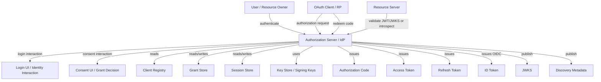
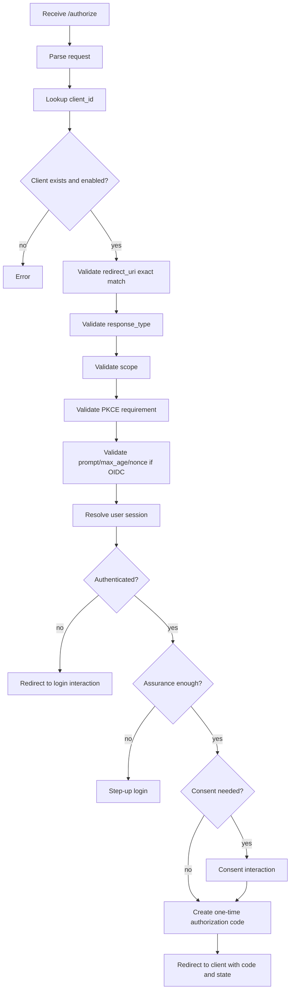
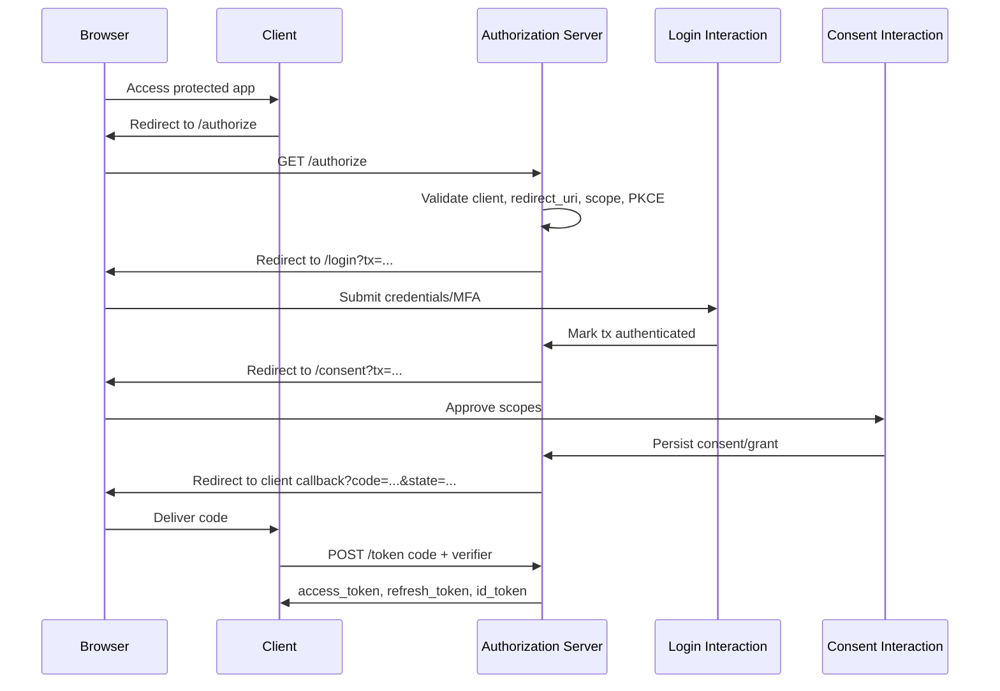
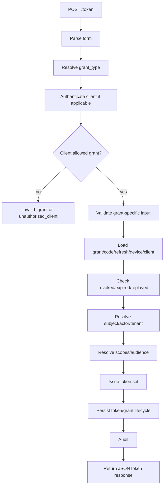
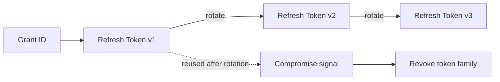
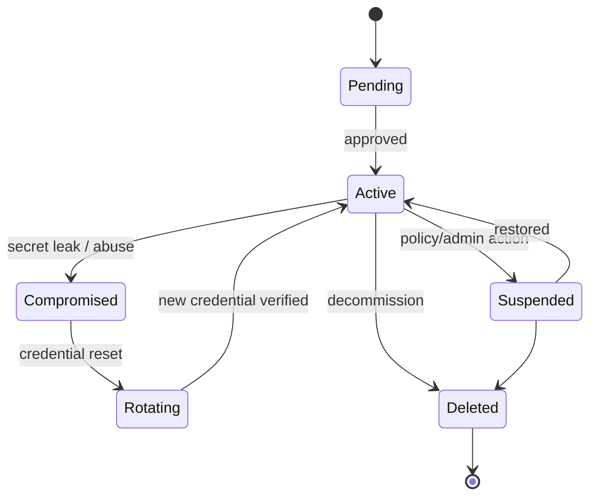
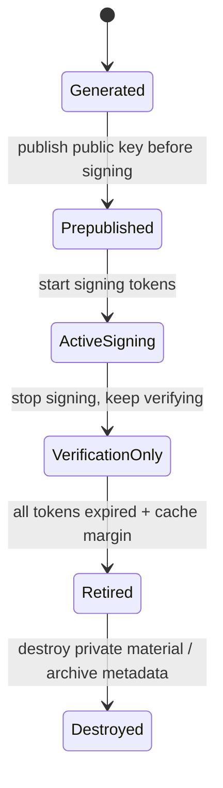
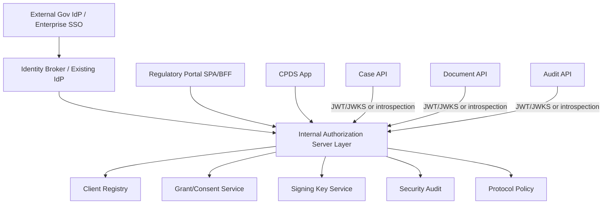

# learn-go-authentication-authorization-identity-permission-part-017.md

# Part 017 — Building Authorization Server / Identity Provider Concepts in Go

> Seri: `learn-go-authentication-authorization-identity-permission`  
> Bagian: `017 / 035`  
> Fokus: Authorization Server, Identity Provider, token issuance, client registry, consent, grant storage, signing key management, discovery, JWKS, dan boundary implementasi Go.  
> Baseline Go: Go 1.26.x  
> Status seri: **belum selesai**

---

## Daftar Isi

1. [Tujuan Bagian Ini](#1-tujuan-bagian-ini)
2. [Peringatan Utama: Memahami AS/IdP Tidak Sama Dengan Harus Membuat Sendiri](#2-peringatan-utama-memahami-asidp-tidak-sama-dengan-harus-membuat-sendiri)
3. [Mental Model: Authorization Server sebagai Security Control Plane](#3-mental-model-authorization-server-sebagai-security-control-plane)
4. [Terminologi Presisi](#4-terminologi-presisi)
5. [OAuth Authorization Server vs OpenID Provider](#5-oauth-authorization-server-vs-openid-provider)
6. [Boundary: Apa yang Dilakukan AS/IdP dan Apa yang Tidak](#6-boundary-apa-yang-dilakukan-asidp-dan-apa-yang-tidak)
7. [Reference Architecture](#7-reference-architecture)
8. [Endpoint Surface Area](#8-endpoint-surface-area)
9. [Authorization Endpoint](#9-authorization-endpoint)
10. [Login Interaction vs Protocol Endpoint](#10-login-interaction-vs-protocol-endpoint)
11. [Consent Endpoint dan Consent Domain Model](#11-consent-endpoint-dan-consent-domain-model)
12. [Authorization Code Issuance](#12-authorization-code-issuance)
13. [Token Endpoint](#13-token-endpoint)
14. [Refresh Token dan Grant Lifecycle](#14-refresh-token-dan-grant-lifecycle)
15. [ID Token Issuance untuk OIDC](#15-id-token-issuance-untuk-oidc)
16. [Access Token Design: Opaque vs JWT](#16-access-token-design-opaque-vs-jwt)
17. [Client Registry](#17-client-registry)
18. [Client Authentication](#18-client-authentication)
19. [Redirect URI Validation](#19-redirect-uri-validation)
20. [Scope, Audience, Resource, dan Consent Semantics](#20-scope-audience-resource-dan-consent-semantics)
21. [Discovery Metadata dan JWKS Endpoint](#21-discovery-metadata-dan-jwks-endpoint)
22. [Signing Key Management dan Rotation](#22-signing-key-management-dan-rotation)
23. [Token Revocation dan Introspection](#23-token-revocation-dan-introspection)
24. [Dynamic Client Registration: Kapan Perlu dan Kapan Berbahaya](#24-dynamic-client-registration-kapan-perlu-dan-kapan-berbahaya)
25. [Go Package Architecture](#25-go-package-architecture)
26. [Domain Model di Go](#26-domain-model-di-go)
27. [Storage Schema Referensi](#27-storage-schema-referensi)
28. [Authorization Transaction Store](#28-authorization-transaction-store)
29. [Implementasi Handler di Go](#29-implementasi-handler-di-go)
30. [Error Semantics dan OAuth Error Response](#30-error-semantics-dan-oauth-error-response)
31. [Audit dan Regulatory Defensibility](#31-audit-dan-regulatory-defensibility)
32. [Observability untuk AS/IdP](#32-observability-untuk-asidp)
33. [Security Failure Modes](#33-security-failure-modes)
34. [Concurrency, Race Condition, dan Distributed Consistency](#34-concurrency-race-condition-dan-distributed-consistency)
35. [Testing Strategy](#35-testing-strategy)
36. [Performance dan Capacity Model](#36-performance-dan-capacity-model)
37. [Build vs Buy vs Embed](#37-build-vs-buy-vs-embed)
38. [Case Study: Enterprise Regulatory IdP di Go](#38-case-study-enterprise-regulatory-idp-di-go)
39. [Production Checklist](#39-production-checklist)
40. [Review Questions](#40-review-questions)
41. [Ringkasan](#41-ringkasan)
42. [Sumber Primer](#42-sumber-primer)

---

## 1. Tujuan Bagian Ini

Bagian ini membahas bagaimana sebuah **Authorization Server** dan **Identity Provider** bekerja dari perspektif engineer yang harus mendesain, mengintegrasikan, mengaudit, atau membangun sebagian komponennya di Go.

Tujuan utamanya bukan membuat “clone Keycloak” dalam satu file Go. Tujuan sebenarnya:

1. memahami boundary protokol OAuth2/OIDC secara cukup dalam;
2. tahu data model internal yang dibutuhkan untuk token issuance;
3. tahu invariant keamanan yang tidak boleh dilanggar;
4. tahu kapan cukup menggunakan produk matang seperti Keycloak, Hydra, Auth0, Okta, Azure AD/Entra, Zitadel, Cognito, atau custom AS internal;
5. mampu menilai desain AS/IdP dari sudut protocol correctness, abuse resistance, auditability, dan operability;
6. mampu membangun service Go yang menjadi **authorization server subset**, misalnya internal token issuer, service-to-service token service, consent/grant service, JWKS publisher, token introspection service, atau custom authorization-code broker.

Topik ini berada di titik tengah antara:

- protocol engineering;
- identity lifecycle;
- security architecture;
- distributed systems;
- compliance/auditability;
- Go API/service design.

Kalau part sebelumnya membahas Relying Party/OIDC Client, bagian ini membahas sisi yang **menerbitkan** authorization code, access token, refresh token, ID token, metadata discovery, dan key material publik.

---

## 2. Peringatan Utama: Memahami AS/IdP Tidak Sama Dengan Harus Membuat Sendiri

Authorization Server adalah salah satu komponen paling berisiko dalam platform modern.

Kesalahan kecil bisa berdampak besar:

- redirect URI matching longgar → token/code dicuri;
- `aud` salah → token untuk service A diterima service B;
- `sub` tidak stabil → account takeover atau account linking salah;
- refresh token rotation salah → replay tidak terdeteksi;
- consent terlalu luas → over-privileged access;
- key rotation buruk → outage atau token forgery risk;
- dynamic client registration tanpa governance → malicious client onboarding;
- token endpoint menerima public client sebagai confidential client → client impersonation;
- authorization code tidak one-time-use → code replay;
- `nonce` tidak divalidasi → OIDC replay/substitution;
- issuer metadata tidak konsisten → mix-up attack;
- token claim terlalu percaya diri → downstream authorization salah.

Jadi aturan desainnya:

> **Build only what you can operate, test, certify, rotate, revoke, audit, and incident-respond.**

Dalam banyak organisasi, pilihan terbaik adalah:

- gunakan IdP/AS matang untuk public login/federation;
- bangun aplikasi Go sebagai resource server/client;
- bangun extension kecil di sekitar IdP, misalnya claim mapper, token exchange broker, consent service, audit bridge, atau policy decision service;
- jangan membuat AS penuh kecuali ada alasan kuat dan tim mampu menanggung maturity-nya.

Namun engineer top-level tetap perlu memahami cara kerja AS/IdP karena:

- integrasi enterprise SSO sering gagal di claim/issuer/audience/client config;
- debugging token issue membutuhkan pemahaman token issuance path;
- production incident sering terjadi di boundary AS ↔ client ↔ resource server;
- sistem permission enterprise sering perlu token exchange, delegation, impersonation, atau custom grant;
- compliance sering menuntut pembuktian: siapa memberi consent, kapan token diterbitkan, dengan authority apa, dan revoked kapan.

---

## 3. Mental Model: Authorization Server sebagai Security Control Plane

Authorization Server bukan sekadar endpoint `/token`.

Ia adalah **security control plane** yang mengubah:

- autentikasi manusia/service;
- registrasi client;
- consent;
- scope request;
- policy;
- tenant boundary;
- assurance level;
- session state;
- grant history;
- key state;

menjadi artefak security yang dikonsumsi data plane:

- authorization code;
- access token;
- refresh token;
- ID token;
- introspection response;
- discovery metadata;
- JWKS.

Diagram mental:



Seorang engineer harus melihat AS/IdP sebagai mesin state dan mesin keputusan, bukan sebagai kumpulan endpoint.

Core decision di dalam AS:

```text
Given:
  client
  redirect_uri
  response_type
  scope
  resource/audience
  user session
  assurance
  consent state
  tenant context
  policy
  risk signal

Decide:
  reject request
  require login
  require step-up
  require consent
  issue authorization code
  issue token
  revoke grant
  deny refresh
```

---

## 4. Terminologi Presisi

| Istilah | Makna | Catatan desain |
|---|---|---|
| Authorization Server / AS | Komponen OAuth2 yang mengotorisasi client dan menerbitkan token | Bisa juga menjalankan fungsi IdP bila OIDC aktif |
| OpenID Provider / OP | OIDC provider yang mengautentikasi end-user dan menerbitkan ID Token | OIDC adalah identity layer di atas OAuth2 |
| Client | Aplikasi yang meminta token | Bisa public/confidential; web/native/SPA/machine |
| Resource Owner | Entitas pemilik resource | Biasanya user, tapi tidak selalu |
| Resource Server | API/service yang menerima access token | Harus validasi issuer, audience, expiry, scope/claims |
| Authorization Endpoint | Endpoint browser redirect untuk meminta authorization code | High-risk endpoint; wajib validasi client/redirect/state/scope |
| Token Endpoint | Endpoint back-channel untuk menukar grant menjadi token | Harus melakukan client authentication jika applicable |
| Authorization Code | Short-lived one-time credential untuk ditukar di token endpoint | Jangan dianggap access token |
| Access Token | Token untuk resource server | Format bisa opaque/JWT; jangan dipakai sebagai bukti login RP |
| Refresh Token | Credential jangka panjang untuk memperoleh access token baru | Harus diperlakukan seperti credential sensitif |
| ID Token | OIDC token untuk menyatakan authentication event dan identity claims | Audience-nya client/RP, bukan API umum |
| Grant | Representasi authority yang diberikan kepada client | Lebih stabil dari token; token adalah output grant |
| Consent | Keputusan resource owner untuk memberi akses tertentu ke client | Bukan pengganti policy organisasi |
| Scope | String capability/requested privilege dalam OAuth | Scope terlalu coarse untuk permission enterprise jika berdiri sendiri |
| Audience | Penerima token yang dimaksud | Resource server harus reject audience yang tidak cocok |
| Subject (`sub`) | Identifier subject dalam issuer tertentu | Pair `(iss, sub)` adalah identity key OIDC paling penting |
| Issuer (`iss`) | Identifier AS/OP yang menerbitkan token | Harus stabil dan exact match |
| Client Authentication | Cara confidential client membuktikan identitas ke token endpoint | Basic secret, private_key_jwt, mTLS, dsb |
| Discovery | Metadata publik AS/OP | Digunakan client untuk mengetahui endpoint/capability |
| JWKS | Public key set untuk verifikasi signature | Perlu caching dan rotation strategy |

---

## 5. OAuth Authorization Server vs OpenID Provider

OAuth2 tidak mendefinisikan authentication user untuk client. OAuth2 fokus pada **delegated authorization**: client memperoleh akses terbatas ke resource server.

OpenID Connect menambahkan identity layer:

- ID Token;
- standardized claims;
- UserInfo;
- discovery metadata OIDC;
- nonce;
- authentication context references;
- subject identifier model.

Perbedaan penting:

| Pertanyaan | OAuth2 | OIDC |
|---|---|---|
| “Apakah client boleh akses API X?” | Ya, via access token | Tetap OAuth2 |
| “Siapa user yang login ke client?” | Tidak distandardisasi | Ya, via ID Token |
| “Token mana untuk API?” | Access Token | Access Token |
| “Token mana untuk login app?” | Tidak ada | ID Token |
| “Ada UserInfo?” | Tidak | Ya |
| “Ada nonce?” | Tidak umum | Ya, untuk replay protection |

Anti-pattern umum:

```text
Client menerima access_token dari AS lalu decode access_token dan menganggap user sudah login.
```

Masalahnya:

- access token audience-nya resource server, bukan client;
- access token format tidak wajib JWT;
- access token claims tidak wajib memuat authentication evidence;
- access token bisa valid untuk API tapi tidak valid sebagai bukti login RP.

Correct OIDC RP:

```text
Client validates ID Token:
  iss exact match
  aud contains client_id
  azp when required
  exp/iat valid
  nonce matches transaction
  signature valid via issuer JWKS
  auth_time/acr/amr if required
```

---

## 6. Boundary: Apa yang Dilakukan AS/IdP dan Apa yang Tidak

### 6.1 AS/IdP melakukan

- register/manage clients;
- validate authorization requests;
- authenticate user atau mendelegasikan login ke identity interaction service;
- ask consent jika dibutuhkan;
- issue authorization code;
- validate code redemption;
- authenticate client di token endpoint;
- issue access/refresh/ID tokens;
- expose discovery metadata;
- expose JWKS;
- revoke tokens/grants;
- introspect opaque tokens;
- manage signing keys;
- log security events;
- enforce protocol-level security policy.

### 6.2 AS/IdP biasanya tidak melakukan

- business authorization detail di setiap resource;
- object-level permission untuk semua domain entity;
- database row-level filtering;
- workflow-stage authorization di downstream domain;
- UI business logic;
- application-specific audit full detail;
- menggantikan PDP/permission service sepenuhnya.

Authorization Server bisa menyertakan scope/claims, tetapi downstream service tetap harus mengevaluasi authorization final untuk resource tertentu.

Misalnya:

```text
Token scope: case:read
Request: GET /cases/CASE-123

Resource server masih harus cek:
  - tenant sama?
  - user assigned ke case?
  - case status boleh dibaca role ini?
  - ada legal restriction?
  - ada conflict of interest?
```

---

## 7. Reference Architecture

### 7.1 Logical components

```mermaid
flowchart LR
    subgraph Protocol_Surface[Protocol Surface]
        AUTHZ[/GET-POST /authorize/]
        TOKEN[/POST /token/]
        REVOKE[/POST /revoke/]
        INTROSPECT[/POST /introspect/]
        USERINFO[/GET /userinfo/]
        WELLKNOWN[/.well-known/openid-configuration]
        JWKS[/jwks.json/]
    end

    subgraph Domain_Services[Domain Services]
        CLIENT[Client Registry]
        TX[Authorization Transaction Service]
        LOGIN[Login Interaction Service]
        CONSENT[Consent Service]
        GRANT[Grant Service]
        TOKENISS[Token Issuer]
        KEY[Key Manager]
        SESSION[User Session Service]
        POLICY[Protocol Policy Service]
        AUDIT[Security Audit]
    end

    AUTHZ --> CLIENT
    AUTHZ --> TX
    AUTHZ --> SESSION
    AUTHZ --> LOGIN
    AUTHZ --> CONSENT
    AUTHZ --> GRANT
    AUTHZ --> POLICY

    TOKEN --> CLIENT
    TOKEN --> GRANT
    TOKEN --> TOKENISS
    TOKEN --> KEY
    TOKEN --> AUDIT

    REVOKE --> GRANT
    INTROSPECT --> GRANT
    WELLKNOWN --> CLIENT
    JWKS --> KEY
    USERINFO --> SESSION
```

### 7.2 Deployment mental model

Authorization Server harus dipisah secara konseptual dari aplikasi biasa karena:

- high value target;
- membutuhkan rate limit dan abuse controls berbeda;
- secret/key handling lebih ketat;
- audit requirement lebih tinggi;
- latency profile berbeda;
- blast radius lebih besar;
- configuration governance lebih sensitif.

Minimal production deployment:

```text
Internet/Internal Client
  -> Gateway / WAF / Rate Limit
  -> Authorization Server
      -> Client Registry DB
      -> Grant Store DB
      -> Session Store
      -> Key Management / KMS / HSM-backed signing service
      -> Audit Log Sink
      -> Risk/Policy Service
```

---

## 8. Endpoint Surface Area

Endpoint umum AS/OP:

| Endpoint | Protocol | Purpose | Risk |
|---|---|---|---|
| `/.well-known/oauth-authorization-server` | OAuth metadata | AS metadata | metadata poisoning/misconfig |
| `/.well-known/openid-configuration` | OIDC discovery | OP metadata | issuer/JWKS mismatch |
| `/authorize` | OAuth/OIDC | browser authorization request | redirect/code/mix-up/csrf risk |
| `/token` | OAuth/OIDC | grant redemption/token issuance | client auth/code replay/token theft |
| `/jwks` | JOSE/OIDC | public keys | stale keys/key confusion |
| `/userinfo` | OIDC | user claims | over-disclosure/access token misuse |
| `/revoke` | RFC 7009 | token/grant revocation | authz client verification |
| `/introspect` | RFC 7662 | token state check | data leakage to unauthorized caller |
| `/register` | RFC 7591/OIDC DCR | dynamic client registration | malicious client onboarding |
| `/device_authorization` | RFC 8628 | device code flow | phishing/user code abuse |
| `/par` | RFC 9126 | pushed authorization request | request object policy |

Part ini tidak akan mengimplementasikan semua endpoint penuh, tetapi memberikan blueprint konseptual dan Go boundaries.

---

## 9. Authorization Endpoint

Authorization endpoint biasanya menerima browser redirect dari client.

Contoh request:

```text
GET /authorize?
  response_type=code&
  client_id=regulatory-portal&
  redirect_uri=https%3A%2F%2Fportal.example.gov%2Fcallback&
  scope=openid%20profile%20case.read&
  state=af0ifjsldkj&
  nonce=n-0S6_WzA2Mj&
  code_challenge=...&
  code_challenge_method=S256
```

### 9.1 Pipeline validasi authorization request



### 9.2 Invariant authorization endpoint

1. **Never issue code for unknown client.**
2. **Never issue code to unregistered redirect URI.**
3. **Never normalize redirect URI in a way that changes security meaning.**
4. **Authorization code must be short-lived.**
5. **Authorization code must be one-time-use.**
6. **Authorization code must bind to client, redirect URI, PKCE challenge, scope, user, session, issuer, and transaction.**
7. **If OIDC, nonce must be bound to the authorization transaction.**
8. **Requested scope must be allowed for client.**
9. **Requested audience/resource must be allowed for client.**
10. **Decision must be auditable.**

### 9.3 Authorization request object

Di internal Go, jangan biarkan query parameter mentah menyebar ke seluruh sistem. Parse dan validasi menjadi object eksplisit.

```go
type AuthorizationRequest struct {
    ResponseType        string
    ClientID            string
    RedirectURI         string
    ScopeRaw            string
    Scopes              []string
    State               string
    Nonce               string
    CodeChallenge       string
    CodeChallengeMethod string
    Prompt              []string
    MaxAgeSeconds       *int
    LoginHint           string
    Resource            []string
    RequestURI          string
}
```

Namun object ini belum “trusted”. Setelah validasi, ubah menjadi transaction yang trusted.

```go
type AuthorizationTransaction struct {
    ID                  string
    Issuer              string
    ClientID            string
    RedirectURI         string
    ResponseType        string
    Scopes              []string
    Audiences           []string
    State               string
    Nonce               string
    CodeChallenge       string
    CodeChallengeMethod string
    SubjectID           string
    ActorID             string
    TenantID            string
    SessionID           string
    AuthenticationTime  time.Time
    ACR                 string
    AMR                 []string
    ConsentRequired     bool
    CreatedAt           time.Time
    ExpiresAt           time.Time
}
```

---

## 10. Login Interaction vs Protocol Endpoint

Kesalahan besar: mencampur protocol endpoint dengan UI login.

`/authorize` seharusnya tidak menjadi tempat semua UI login/password/MFA berada secara kacau. Desain yang lebih baik:

```text
/authorize
  - validasi protocol request
  - membuat auth transaction
  - menentukan butuh login/consent
  - redirect ke interaction UI

/login
  - authenticate user
  - establish user session
  - return/continue transaction

/consent
  - display requested scopes/resources
  - persist grant decision
  - return/continue transaction
```

Diagram:



### Kenapa separation penting?

Karena AS harus menjaga protocol correctness, sedangkan login interaction berubah-ubah berdasarkan:

- password/passkey/MFA;
- risk score;
- enterprise federation;
- legal notice;
- tenant branding;
- account recovery;
- mandatory password reset;
- step-up;
- device trust;
- captcha/progressive challenge.

Kalau semua dicampur dalam handler `/authorize`, kode akan sulit diaudit.

---

## 11. Consent Endpoint dan Consent Domain Model

Consent adalah keputusan resource owner bahwa client tertentu boleh memperoleh scope tertentu untuk resource tertentu.

Namun consent bukan segalanya.

Consent tidak boleh mengalahkan:

- organisasi policy;
- tenant boundary;
- role/permission;
- legal restriction;
- risk decision;
- client allowlist;
- scope allowlist;
- resource server policy.

### 11.1 Consent decision model

```go
type ConsentDecision struct {
    ID             string
    SubjectID      string
    ClientID       string
    TenantID       string
    Scopes         []string
    Audiences      []string
    GrantedBy      string
    GrantedAt      time.Time
    ExpiresAt      *time.Time
    RevokedAt      *time.Time
    ConsentVersion int
    Purpose        string
}
```

### 11.2 Grant vs consent

Consent adalah user-facing approval. Grant adalah protocol/security object yang mengikat authority ke client.

```text
Consent:
  "Saya mengizinkan aplikasi X membaca profil saya."

Grant:
  client_id=X
  subject=S
  scopes=[profile.read]
  audiences=[profile-api]
  issued_at=T
  policy_version=P
  revoked=false
```

Dalam enterprise, grant bisa berasal dari:

- user consent;
- admin consent;
- system policy;
- service account assignment;
- delegated authority;
- break-glass workflow.

Jadi jangan hardcode semua grant sebagai `user_consent=true`.

---

## 12. Authorization Code Issuance

Authorization code adalah credential sementara. Ia harus diperlakukan seperti secret.

### 12.1 Properti authorization code

| Properti | Rekomendasi |
|---|---|
| Entropy | High entropy random, bukan increment ID |
| Lifetime | Sangat pendek, sering 1–10 menit tergantung policy |
| Storage | Simpan hash code, bukan plaintext jika memungkinkan |
| Usage | One-time-use |
| Binding | client, redirect URI, PKCE, user/session, scope, audience |
| Replay | Deteksi redemption kedua |
| Audit | Issue, redeem, reject, expire, replay |

### 12.2 Model code

```go
type AuthorizationCode struct {
    ID                  string
    CodeHash            []byte
    Issuer              string
    ClientID            string
    RedirectURI         string
    SubjectID           string
    ActorID             string
    TenantID            string
    SessionID           string
    Scopes              []string
    Audiences           []string
    Nonce               string
    CodeChallenge       string
    CodeChallengeMethod string
    ACR                 string
    AMR                 []string
    AuthTime            time.Time
    CreatedAt           time.Time
    ExpiresAt           time.Time
    RedeemedAt          *time.Time
    RevokedAt           *time.Time
}
```

### 12.3 Why hash authorization code?

Kalau DB bocor dan authorization code masih valid, attacker bisa menukarnya di token endpoint jika juga memiliki client binding yang cukup. Untuk public client dengan PKCE, attacker tetap perlu code verifier. Untuk confidential client, perlu client authentication. Namun menyimpan hash tetap defense-in-depth.

### 12.4 Redemption invariant

Pada token endpoint:

```text
redeem(code, client, redirect_uri, code_verifier):
  - find code by hash
  - reject if not found
  - reject if expired
  - reject if already redeemed
  - reject if revoked
  - reject if client mismatch
  - reject if redirect_uri mismatch
  - verify PKCE if required
  - mark redeemed atomically
  - issue tokens
```

Atomicity penting. Dua request paralel tidak boleh sama-sama berhasil.

SQL pattern:

```sql
UPDATE oauth_authorization_codes
SET redeemed_at = CURRENT_TIMESTAMP
WHERE code_hash = :hash
  AND redeemed_at IS NULL
  AND revoked_at IS NULL
  AND expires_at > CURRENT_TIMESTAMP;
```

Lalu cek affected rows = 1.

---

## 13. Token Endpoint

Token endpoint adalah back-channel endpoint. Biasanya dipanggil oleh client server-side, mobile/native app, device client, atau machine client.

### 13.1 Grant types umum

| Grant Type | Use case | Catatan |
|---|---|---|
| `authorization_code` | user delegated auth | modern default; pakai PKCE |
| `refresh_token` | renew access token | refresh token rotation untuk public client |
| `client_credentials` | machine-to-machine | subject biasanya client/service, bukan user |
| `urn:ietf:params:oauth:grant-type:device_code` | device input-limited | butuh user code verification endpoint |
| `urn:ietf:params:oauth:grant-type:token-exchange` | delegation/impersonation/token swap | advanced; jangan asal mapping |

### 13.2 Token endpoint pipeline



### 13.3 Token response example

```json
{
  "access_token": "eyJ...",
  "token_type": "Bearer",
  "expires_in": 300,
  "refresh_token": "def50200...",
  "scope": "openid profile case.read",
  "id_token": "eyJ..."
}
```

### 13.4 Token endpoint invariant

1. Do not issue tokens for unknown client.
2. Do not issue tokens for disabled client.
3. Do not issue tokens for unallowed grant type.
4. Do not redeem expired/revoked/replayed authorization code.
5. Do not skip PKCE verification where required.
6. Do not issue scopes beyond allowed/requested/consented policy.
7. Do not issue token with wrong audience.
8. Do not issue ID token unless OIDC request is valid.
9. Do not return refresh token if policy forbids it.
10. Do not log token values.

---

## 14. Refresh Token dan Grant Lifecycle

Refresh token bukan sekadar “longer access token”. Ia adalah credential yang mewakili grant.

### 14.1 Token family

Refresh token rotation sebaiknya memakai konsep token family.



Model:

```go
type RefreshToken struct {
    ID             string
    TokenHash      []byte
    GrantID        string
    FamilyID       string
    ClientID       string
    SubjectID      string
    TenantID       string
    Scope          []string
    Audience       []string
    Generation     int
    ParentID       *string
    IssuedAt       time.Time
    ExpiresAt      time.Time
    UsedAt         *time.Time
    ReplacedByID   *string
    RevokedAt      *time.Time
    ReuseDetectedAt *time.Time
}
```

### 14.2 Refresh flow invariant

```text
refresh(refresh_token):
  - hash token
  - load active RT
  - reject if expired/revoked/not found
  - if already used/replaced:
      mark reuse detected
      revoke family
      emit high severity event
      reject
  - atomically mark old RT used
  - create new RT
  - issue new AT
```

### 14.3 Why family revocation?

Jika token lama digunakan setelah sudah dirotasi, AS tidak tahu siapa yang legitimate: client asli atau attacker. Pilihan aman adalah revoke family dan minta reauthentication.

---

## 15. ID Token Issuance untuk OIDC

ID Token adalah JWS JWT yang ditujukan untuk client/RP.

### 15.1 Claims penting

| Claim | Makna | Validasi RP |
|---|---|---|
| `iss` | issuer | exact match dengan configured issuer |
| `sub` | subject identifier | stable per issuer/client policy |
| `aud` | audience | harus memuat client_id |
| `azp` | authorized party | penting jika multiple audience |
| `exp` | expiry | reject expired |
| `iat` | issued at | sanity check |
| `auth_time` | waktu authentication user | step-up/max_age |
| `nonce` | replay protection dari auth request | harus match transaksi |
| `acr` | auth context class | assurance/policy |
| `amr` | auth methods references | password/mfa/passkey/etc |

### 15.2 ID token issuer model

```go
type IDTokenClaims struct {
    Issuer     string   `json:"iss"`
    Subject    string   `json:"sub"`
    Audience   []string `json:"aud"`
    Expiry     int64    `json:"exp"`
    IssuedAt   int64    `json:"iat"`
    AuthTime   int64    `json:"auth_time,omitempty"`
    Nonce      string   `json:"nonce,omitempty"`
    ACR        string   `json:"acr,omitempty"`
    AMR        []string `json:"amr,omitempty"`
    AuthorizedParty string `json:"azp,omitempty"`

    Email         string `json:"email,omitempty"`
    EmailVerified *bool  `json:"email_verified,omitempty"`
    Name          string `json:"name,omitempty"`
    TenantID      string `json:"tenant_id,omitempty"`
}
```

Jangan sembarang masukkan claim sensitif ke ID token:

- role internal terlalu detail;
- permission list besar;
- PII yang tidak dibutuhkan client;
- admin-only metadata;
- security risk score mentah;
- tenant relationship yang bisa membuka struktur organisasi.

---

## 16. Access Token Design: Opaque vs JWT

### 16.1 Opaque token

Opaque token adalah random string yang hanya dimengerti AS. Resource server harus introspect atau menggunakan token cache.

Kelebihan:

- revocation lebih real-time;
- claim tidak bocor ke client;
- format bisa berubah tanpa downstream parsing;
- bagus untuk high-control internal ecosystem.

Kekurangan:

- perlu introspection latency;
- AS jadi dependency runtime resource server;
- perlu cache dan outage mode.

### 16.2 JWT access token

JWT access token bisa divalidasi lokal oleh resource server menggunakan JWKS.

Kelebihan:

- low latency;
- scalable;
- cocok untuk distributed APIs;
- tidak perlu call AS per request.

Kekurangan:

- revocation sulit sampai token expired;
- claim stale;
- claim leakage jika token terlihat client;
- key rotation/JWKS cache kompleks;
- downstream sering over-trust claims.

### 16.3 Decision table

| Kondisi | Pilihan cenderung cocok |
|---|---|
| Internal high-throughput microservices | JWT short-lived + JWKS |
| Need immediate revocation | Opaque + introspection/cache |
| External API with many independent consumers | JWT dengan strict audience/issuer |
| Highly sensitive admin operation | JWT + step-up + introspection/permission check |
| Fine-grained permission volatile | Token minimal + PDP lookup |
| Low maturity ecosystem | Opaque token lebih mudah dikontrol |

Rule of thumb:

> Token should carry stable authorization context, not volatile business permission truth.

---

## 17. Client Registry

Client registry adalah database trust relationship.

### 17.1 Client fields

```go
type OAuthClient struct {
    ID                    string
    Name                  string
    Type                  ClientType // public/confidential
    Status                ClientStatus
    RedirectURIs          []string
    PostLogoutRedirectURIs []string
    AllowedGrantTypes     []string
    AllowedResponseTypes  []string
    AllowedScopes         []string
    AllowedAudiences      []string
    TokenEndpointAuthMethod string
    SecretHash            []byte
    JWKSURI               string
    JWKS                  []byte
    RequirePKCE           bool
    RequireConsent        bool
    AccessTokenTTL        time.Duration
    RefreshTokenTTL       time.Duration
    IDTokenTTL            time.Duration
    CreatedAt             time.Time
    UpdatedAt             time.Time
}
```

### 17.2 Client status

```text
pending -> active -> suspended -> deleted
                    -> compromised
```



### 17.3 Client registry invariant

1. A client must explicitly declare allowed redirect URIs.
2. A client must explicitly declare grant types.
3. A client must explicitly declare token endpoint auth method.
4. A public client must not be treated as confidential.
5. A client secret must be stored hashed, not plaintext.
6. A disabled client cannot receive new tokens.
7. Scope request must be subset of allowed client scopes.
8. Audience request must be subset of allowed resource audiences.
9. Client metadata changes must be auditable.
10. Dangerous changes should require approval.

---

## 18. Client Authentication

Client authentication terjadi terutama di token endpoint.

### 18.1 Common methods

| Method | Client type | Notes |
|---|---|---|
| `client_secret_basic` | confidential | Basic auth with client_id/client_secret |
| `client_secret_post` | confidential | Secret in body; generally less preferred |
| `private_key_jwt` | confidential | Client signs assertion with private key |
| `tls_client_auth` | confidential | mTLS certificate-bound client auth |
| `none` | public | Native/SPA cannot keep secret |

### 18.2 Public client reality

Public clients cannot keep secrets.

Mobile app, browser SPA, CLI installed on user machine: all should be assumed extractable. For these, security depends on:

- PKCE;
- redirect URI constraints;
- platform URI/app link constraints;
- refresh token rotation;
- sender-constraining if available;
- short-lived tokens;
- abuse detection.

### 18.3 Client secret validation

```go
type ClientAuthenticator interface {
    AuthenticateClient(ctx context.Context, r *http.Request) (*AuthenticatedClient, error)
}

type AuthenticatedClient struct {
    ClientID   string
    Method     string
    Public     bool
    Attributes map[string]string
}
```

Important:

- Jangan log client secret.
- Jangan return error detail “secret wrong” vs “client missing” secara berlebihan.
- Support secret rotation dengan multiple active secret hashes jika diperlukan.
- Mark secret version used for audit.

---

## 19. Redirect URI Validation

Redirect URI validation adalah salah satu boundary paling kritis.

### 19.1 Prinsip

- exact matching untuk registered redirect URI;
- jangan menerima wildcard arbitrary;
- jangan normalisasi host/path/query secara kreatif;
- jangan menerima open redirect domain client sebagai redirect target tanpa mitigasi;
- jangan izinkan `http` untuk production public redirect kecuali loopback/native rule yang jelas;
- jangan menerima redirect URI yang dikirim saat token redemption berbeda dari authorization transaction.

### 19.2 Bad patterns

```text
strings.HasPrefix(requestRedirectURI, registeredRedirectURI)
```

Berbahaya:

```text
registered: https://app.example.com/callback
attacker:   https://app.example.com/callback.evil.com
```

Berbahaya juga:

```text
registered: https://app.example.com/callback
attacker:   https://app.example.com/callback?next=https://evil.example
```

Jika client callback sendiri open redirect, AS bisa benar secara exact matching tapi ekosistem tetap rentan. Karena itu security review client tetap penting.

### 19.3 Go validator

```go
func ValidateRedirectURI(requested string, registered []string) error {
    if requested == "" {
        return ErrMissingRedirectURI
    }
    for _, allowed := range registered {
        if subtle.ConstantTimeCompare([]byte(requested), []byte(allowed)) == 1 {
            return nil
        }
    }
    return ErrInvalidRedirectURI
}
```

Catatan: constant-time compare bukan kebutuhan utama untuk redirect URI, tetapi contoh ini menegaskan tidak ada normalization magic. Yang penting adalah exact string match sesuai kebijakan.

---

## 20. Scope, Audience, Resource, dan Consent Semantics

Scope adalah string. Ia bukan model permission lengkap.

### 20.1 Scope sebagai contract

Scope yang baik:

```text
profile.read
case.read
case.write
case.approve
audit.read
```

Scope yang buruk:

```text
admin
all
full_access
user
basic
```

Bukan karena `admin` tidak pernah boleh ada, tetapi karena scope terlalu coarse sering menciptakan privilege ambiguity.

### 20.2 Scope resolution pipeline

```text
requested_scopes
  ∩ client_allowed_scopes
  ∩ resource_allowed_scopes
  ∩ user/tenant policy allowed scopes
  ∩ consented scopes
  ∩ risk/assurance allowed scopes
= issued_scopes
```

### 20.3 Audience

Audience menjawab: token ini dimaksudkan untuk siapa?

Jangan terbitkan token multi-audience sembarangan. Semakin banyak audience, semakin besar risiko token substitution dan confused deputy.

Untuk sistem enterprise:

```text
scope: case.read
resource/audience: https://api.example.gov/case-management
```

Resource server harus reject token dengan audience berbeda meskipun signature valid.

---

## 21. Discovery Metadata dan JWKS Endpoint

### 21.1 OAuth Authorization Server Metadata

Discovery metadata membantu client mengetahui:

- issuer;
- authorization endpoint;
- token endpoint;
- JWKS URI;
- supported response types;
- supported grant types;
- supported scopes;
- supported token endpoint auth methods;
- revocation/introspection endpoint;
- PKCE support;
- OIDC features jika OP.

Contoh minimal:

```json
{
  "issuer": "https://auth.example.gov",
  "authorization_endpoint": "https://auth.example.gov/oauth2/authorize",
  "token_endpoint": "https://auth.example.gov/oauth2/token",
  "jwks_uri": "https://auth.example.gov/.well-known/jwks.json",
  "response_types_supported": ["code"],
  "grant_types_supported": ["authorization_code", "refresh_token", "client_credentials"],
  "code_challenge_methods_supported": ["S256"],
  "token_endpoint_auth_methods_supported": ["client_secret_basic", "private_key_jwt"]
}
```

### 21.2 OIDC discovery tambahan

OIDC discovery biasanya menambahkan:

- `userinfo_endpoint`;
- `id_token_signing_alg_values_supported`;
- `subject_types_supported`;
- `claims_supported`;
- `acr_values_supported`;
- `scopes_supported` termasuk `openid`.

### 21.3 JWKS endpoint

JWKS endpoint memublikasikan public keys.

Key object minimal RSA/ECDSA/EdDSA tergantung alg:

```json
{
  "keys": [
    {
      "kty": "RSA",
      "use": "sig",
      "kid": "2026-06-key-01",
      "alg": "RS256",
      "n": "...",
      "e": "AQAB"
    }
  ]
}
```

JWKS rules:

- publish only public keys;
- never expose private key;
- include current signing key and previous verification keys during rotation window;
- set cache headers carefully;
- downstream validator must refresh on unknown `kid` with rate limit;
- remove old key only after all tokens signed by it expired plus clock skew/cache margin.

---

## 22. Signing Key Management dan Rotation

Key management adalah operational heart of token issuer.

### 22.1 Key states



### 22.2 Why prepublish?

Jika AS langsung menandatangani token dengan key baru sebelum JWKS diketahui downstream, resource server bisa reject token karena `kid` tidak dikenal.

Safe rotation:

```text
T0: generate key
T1: publish public key to JWKS, not signing yet
T2: wait for cache propagation
T3: start signing with new key
T4: keep old key in JWKS for validation only
T5: after max token TTL + skew + cache max-age, retire old key
```

### 22.3 Signing service boundary

Jangan sebar private key ke semua package.

```go
type TokenSigner interface {
    SignJWT(ctx context.Context, claims any, opts SignOptions) (SignedToken, error)
    PublicJWKS(ctx context.Context) (JWKS, error)
    ActiveKeyID(ctx context.Context) (string, error)
}

type SignOptions struct {
    TokenType string
    Algorithm string
    KeyUse string
}

type SignedToken struct {
    Value     string
    KeyID     string
    Algorithm string
    IssuedAt  time.Time
}
```

Production design:

- key material in KMS/HSM or isolated signer if possible;
- AS calls signing interface;
- signer logs key ID, not token;
- signing latency monitored;
- emergency key disable path exists.

---

## 23. Token Revocation dan Introspection

### 23.1 Revocation

Revocation endpoint allows client to tell AS a token is no longer needed.

Revocation design questions:

- Does revoking refresh token revoke access tokens from same grant?
- Does logout revoke current session only or entire grant?
- Does admin revoke all tokens for subject/client/tenant?
- Are JWT access tokens accepted until expiry?
- How is revocation propagated to resource servers?

Model:

```go
type RevocationRequest struct {
    Token         string
    TokenTypeHint string
    ClientID      string
}
```

Do not leak whether a token existed to unauthorized callers.

### 23.2 Introspection

Introspection lets resource server ask AS about token state.

Example active response:

```json
{
  "active": true,
  "client_id": "case-portal",
  "sub": "user-123",
  "scope": "case.read case.write",
  "aud": "case-api",
  "iss": "https://auth.example.gov",
  "exp": 1782281000,
  "iat": 1782280700,
  "tenant_id": "agency-a"
}
```

Inactive response should be minimal:

```json
{
  "active": false
}
```

Introspection endpoint must authenticate resource server/client. Jangan jadikan endpoint ini token oracle publik.

---

## 24. Dynamic Client Registration: Kapan Perlu dan Kapan Berbahaya

Dynamic Client Registration memungkinkan client mendaftar secara programmatic.

Use case valid:

- ecosystem dengan banyak client yang dikelola otomatis;
- partner onboarding dengan software statement;
- regulated federation;
- developer platform;
- protocol yang mengharuskan DCR;
- SaaS multi-tenant IdP.

Bahaya:

- malicious client mendaftar redirect URI phishing;
- client metadata spoofing;
- logo/name deception;
- scope escalation;
- unaudited client sprawl;
- dynamic secret leakage;
- no owner lifecycle.

Safe DCR membutuhkan:

- initial access token atau software statement;
- validation policy;
- ownership metadata;
- allowed redirect URI policy;
- grant/scope allowlist;
- approval workflow untuk sensitive scopes;
- audit;
- rate limit;
- client lifecycle management.

Untuk enterprise internal, static/manual registration sering lebih aman dan cukup.

---

## 25. Go Package Architecture

Contoh struktur package:

```text
/internal/authzserver
  /protocol
    authorize.go
    token.go
    errors.go
    discovery.go
  /clientreg
    model.go
    repository.go
    service.go
  /interaction
    login.go
    consent.go
    transaction.go
  /grant
    model.go
    repository.go
    service.go
  /token
    issuer.go
    claims.go
    signer.go
    refresh.go
  /keys
    jwks.go
    rotation.go
  /audit
    events.go
  /policy
    protocol_policy.go
  /storage
    postgres.go
  /httpapi
    routes.go
```

### 25.1 Rule package boundary

- `protocol` parses and formats OAuth/OIDC wire-level messages.
- `clientreg` owns client metadata and validation.
- `interaction` owns login/consent transaction continuity.
- `grant` owns authorization grants and revocation state.
- `token` owns issuing tokens.
- `keys` owns signing key publication/rotation.
- `audit` owns security event schema.
- `policy` owns protocol policy decisions.

Jangan campur semua di `handler.go`.

---

## 26. Domain Model di Go

### 26.1 Core types

```go
package authzserver

import "time"

type ClientID string
type SubjectID string
type TenantID string
type GrantID string
type SessionID string
type Scope string
type Audience string

type ClientType string

const (
    ClientTypePublic       ClientType = "public"
    ClientTypeConfidential ClientType = "confidential"
)

type OAuthClient struct {
    ID                  ClientID
    Type                ClientType
    Name                string
    Enabled             bool
    RedirectURIs        []string
    GrantTypes          []string
    ResponseTypes       []string
    Scopes              []Scope
    Audiences           []Audience
    TokenAuthMethod     string
    RequirePKCE         bool
    RequireConsent      bool
    AccessTokenTTL      time.Duration
    RefreshTokenTTL     time.Duration
    IDTokenTTL          time.Duration
}
```

### 26.2 Grant

```go
type Grant struct {
    ID          GrantID
    ClientID    ClientID
    SubjectID   SubjectID
    ActorID     SubjectID
    TenantID    TenantID
    Scopes      []Scope
    Audiences   []Audience
    Source      GrantSource
    CreatedAt   time.Time
    ExpiresAt   *time.Time
    RevokedAt   *time.Time
    PolicyHash  string
}

type GrantSource string

const (
    GrantSourceUserConsent  GrantSource = "user_consent"
    GrantSourceAdminConsent GrantSource = "admin_consent"
    GrantSourceSystemPolicy GrantSource = "system_policy"
    GrantSourceDelegation   GrantSource = "delegation"
)
```

### 26.3 Token issue request

```go
type IssueTokenRequest struct {
    Client      OAuthClient
    Grant       Grant
    SubjectID   SubjectID
    ActorID     SubjectID
    TenantID    TenantID
    Scopes      []Scope
    Audiences   []Audience
    IncludeIDToken bool
    Nonce       string
    AuthTime    time.Time
    ACR         string
    AMR         []string
}
```

---

## 27. Storage Schema Referensi

### 27.1 Clients

```sql
CREATE TABLE oauth_clients (
    client_id VARCHAR(128) PRIMARY KEY,
    client_name VARCHAR(255) NOT NULL,
    client_type VARCHAR(32) NOT NULL,
    status VARCHAR(32) NOT NULL,
    token_auth_method VARCHAR(64) NOT NULL,
    require_pkce BOOLEAN NOT NULL DEFAULT TRUE,
    require_consent BOOLEAN NOT NULL DEFAULT TRUE,
    access_token_ttl_seconds INTEGER NOT NULL,
    refresh_token_ttl_seconds INTEGER,
    id_token_ttl_seconds INTEGER,
    created_at TIMESTAMP NOT NULL,
    updated_at TIMESTAMP NOT NULL
);

CREATE TABLE oauth_client_redirect_uris (
    client_id VARCHAR(128) NOT NULL REFERENCES oauth_clients(client_id),
    redirect_uri TEXT NOT NULL,
    PRIMARY KEY (client_id, redirect_uri)
);

CREATE TABLE oauth_client_scopes (
    client_id VARCHAR(128) NOT NULL REFERENCES oauth_clients(client_id),
    scope VARCHAR(255) NOT NULL,
    PRIMARY KEY (client_id, scope)
);
```

### 27.2 Authorization codes

```sql
CREATE TABLE oauth_authorization_codes (
    id VARCHAR(128) PRIMARY KEY,
    code_hash BYTEA NOT NULL UNIQUE,
    issuer TEXT NOT NULL,
    client_id VARCHAR(128) NOT NULL,
    redirect_uri TEXT NOT NULL,
    subject_id VARCHAR(128) NOT NULL,
    actor_id VARCHAR(128) NOT NULL,
    tenant_id VARCHAR(128),
    session_id VARCHAR(128),
    scope TEXT NOT NULL,
    audience TEXT NOT NULL,
    nonce TEXT,
    code_challenge TEXT,
    code_challenge_method VARCHAR(16),
    acr VARCHAR(128),
    amr TEXT,
    auth_time TIMESTAMP NOT NULL,
    created_at TIMESTAMP NOT NULL,
    expires_at TIMESTAMP NOT NULL,
    redeemed_at TIMESTAMP,
    revoked_at TIMESTAMP
);

CREATE INDEX idx_oauth_codes_expiry ON oauth_authorization_codes(expires_at);
CREATE INDEX idx_oauth_codes_client_subject ON oauth_authorization_codes(client_id, subject_id);
```

### 27.3 Grants and refresh tokens

```sql
CREATE TABLE oauth_grants (
    grant_id VARCHAR(128) PRIMARY KEY,
    client_id VARCHAR(128) NOT NULL,
    subject_id VARCHAR(128) NOT NULL,
    actor_id VARCHAR(128) NOT NULL,
    tenant_id VARCHAR(128),
    scope TEXT NOT NULL,
    audience TEXT NOT NULL,
    source VARCHAR(64) NOT NULL,
    policy_hash VARCHAR(128),
    created_at TIMESTAMP NOT NULL,
    expires_at TIMESTAMP,
    revoked_at TIMESTAMP
);

CREATE TABLE oauth_refresh_tokens (
    refresh_token_id VARCHAR(128) PRIMARY KEY,
    token_hash BYTEA NOT NULL UNIQUE,
    grant_id VARCHAR(128) NOT NULL REFERENCES oauth_grants(grant_id),
    family_id VARCHAR(128) NOT NULL,
    generation INTEGER NOT NULL,
    parent_refresh_token_id VARCHAR(128),
    issued_at TIMESTAMP NOT NULL,
    expires_at TIMESTAMP NOT NULL,
    used_at TIMESTAMP,
    replaced_by_refresh_token_id VARCHAR(128),
    revoked_at TIMESTAMP,
    reuse_detected_at TIMESTAMP
);

CREATE INDEX idx_refresh_family ON oauth_refresh_tokens(family_id);
CREATE INDEX idx_refresh_grant ON oauth_refresh_tokens(grant_id);
```

### 27.4 Signing keys metadata

```sql
CREATE TABLE oauth_signing_keys (
    key_id VARCHAR(128) PRIMARY KEY,
    algorithm VARCHAR(32) NOT NULL,
    status VARCHAR(32) NOT NULL,
    public_jwk JSONB NOT NULL,
    private_key_ref TEXT NOT NULL,
    created_at TIMESTAMP NOT NULL,
    not_before TIMESTAMP,
    not_after TIMESTAMP,
    activated_at TIMESTAMP,
    retired_at TIMESTAMP
);
```

Private key material jangan disimpan plaintext di tabel aplikasi.

---

## 28. Authorization Transaction Store

Authorization transaction mengikat state browser redirect dengan internal decision.

### 28.1 Why transaction store?

Karena login/consent bisa butuh beberapa redirect dan submit form. AS perlu menyimpan:

- original client request;
- validated redirect URI;
- PKCE challenge;
- nonce;
- requested scopes;
- issuer;
- login status;
- consent status;
- expiration;
- CSRF token untuk interaction UI;
- tenant context.

### 28.2 Model

```go
type AuthTransaction struct {
    ID              string
    ClientID        ClientID
    RedirectURI     string
    State           string
    Nonce           string
    CodeChallenge   string
    CodeChallengeMethod string
    RequestedScopes []Scope
    RequestedAudiences []Audience
    SubjectID       *SubjectID
    SessionID       *SessionID
    TenantID        *TenantID
    AuthenticatedAt *time.Time
    ConsentGrantedAt *time.Time
    Status          string
    CreatedAt       time.Time
    ExpiresAt       time.Time
}
```

### 28.3 Store options

| Store | Pros | Cons |
|---|---|---|
| Encrypted browser cookie | low infra | size limit, rotation complexity |
| Redis | fast TTL | persistence/HA concerns |
| SQL | durable/auditable | latency/cleanup |
| Hybrid | balance | complexity |

Untuk AS enterprise, SQL/Redis hybrid sering masuk akal:

- Redis untuk hot transaction TTL;
- SQL/audit sink untuk security events;
- no token/code plaintext.

---

## 29. Implementasi Handler di Go

Bagian ini bukan full production AS. Ini skeleton untuk boundary.

### 29.1 Router

```go
func RegisterRoutes(mux *http.ServeMux, h *Handlers) {
    mux.HandleFunc("GET /.well-known/openid-configuration", h.OpenIDConfiguration)
    mux.HandleFunc("GET /.well-known/jwks.json", h.JWKS)
    mux.HandleFunc("GET /oauth2/authorize", h.Authorize)
    mux.HandleFunc("POST /oauth2/token", h.Token)
    mux.HandleFunc("POST /oauth2/revoke", h.Revoke)
    mux.HandleFunc("POST /oauth2/introspect", h.Introspect)
    mux.HandleFunc("GET /oauth2/userinfo", h.UserInfo)
}
```

### 29.2 Handler dependencies

```go
type Handlers struct {
    Issuer       string
    Clients      ClientRegistry
    TxStore      AuthorizationTransactionStore
    Sessions     SessionService
    Grants       GrantService
    TokenIssuer  TokenIssuer
    Keys         KeyService
    Policy       ProtocolPolicy
    Audit        AuditSink
    Clock        Clock
}
```

### 29.3 Authorization handler sketch

```go
func (h *Handlers) Authorize(w http.ResponseWriter, r *http.Request) {
    ctx := r.Context()

    req, err := ParseAuthorizationRequest(r.URL.Query())
    if err != nil {
        h.writeOAuthError(w, r, "invalid_request", err)
        return
    }

    client, err := h.Clients.Get(ctx, ClientID(req.ClientID))
    if err != nil || !client.Enabled {
        h.writeOAuthError(w, r, "unauthorized_client", err)
        return
    }

    if err := ValidateRedirectURI(req.RedirectURI, client.RedirectURIs); err != nil {
        // If redirect_uri invalid, do not redirect back to requested URI.
        h.writeOAuthError(w, r, "invalid_request", err)
        return
    }

    if err := h.Policy.ValidateAuthorizationRequest(ctx, client, req); err != nil {
        h.redirectOAuthError(w, r, req.RedirectURI, req.State, "invalid_request", err)
        return
    }

    sess, _ := h.Sessions.FromRequest(ctx, r)
    tx, err := h.TxStore.Create(ctx, NewTransaction(h.Issuer, client, req, sess))
    if err != nil {
        h.redirectOAuthError(w, r, req.RedirectURI, req.State, "server_error", err)
        return
    }

    if sess == nil || !sess.Authenticated {
        http.Redirect(w, r, "/login?tx="+url.QueryEscape(tx.ID), http.StatusFound)
        return
    }

    if tx.ConsentRequired {
        http.Redirect(w, r, "/consent?tx="+url.QueryEscape(tx.ID), http.StatusFound)
        return
    }

    code, err := h.Grants.IssueAuthorizationCode(ctx, tx)
    if err != nil {
        h.redirectOAuthError(w, r, req.RedirectURI, req.State, "server_error", err)
        return
    }

    redirectWithCode(w, r, req.RedirectURI, code.Value, req.State)
}
```

### 29.4 Token handler sketch

```go
func (h *Handlers) Token(w http.ResponseWriter, r *http.Request) {
    ctx := r.Context()

    if err := r.ParseForm(); err != nil {
        writeTokenError(w, "invalid_request", "invalid form")
        return
    }

    client, err := h.Clients.Authenticate(ctx, r)
    if err != nil {
        writeTokenError(w, "invalid_client", "client authentication failed")
        return
    }

    grantType := r.PostForm.Get("grant_type")
    if !client.AllowsGrantType(grantType) {
        writeTokenError(w, "unauthorized_client", "grant type not allowed")
        return
    }

    switch grantType {
    case "authorization_code":
        h.handleAuthorizationCodeGrant(w, r, client)
    case "refresh_token":
        h.handleRefreshTokenGrant(w, r, client)
    case "client_credentials":
        h.handleClientCredentialsGrant(w, r, client)
    default:
        writeTokenError(w, "unsupported_grant_type", "unsupported grant type")
    }
}
```

### 29.5 Authorization code grant sketch

```go
func (h *Handlers) handleAuthorizationCodeGrant(w http.ResponseWriter, r *http.Request, client OAuthClient) {
    ctx := r.Context()

    code := r.PostForm.Get("code")
    redirectURI := r.PostForm.Get("redirect_uri")
    verifier := r.PostForm.Get("code_verifier")

    redemption, err := h.Grants.RedeemAuthorizationCode(ctx, RedeemCodeRequest{
        Code:         code,
        ClientID:     client.ID,
        RedirectURI:  redirectURI,
        CodeVerifier: verifier,
        Now:          h.Clock.Now(),
    })
    if err != nil {
        writeTokenError(w, "invalid_grant", "authorization code invalid")
        return
    }

    tokenSet, err := h.TokenIssuer.Issue(ctx, IssueTokenRequest{
        Client:         client,
        Grant:          redemption.Grant,
        SubjectID:      redemption.SubjectID,
        ActorID:        redemption.ActorID,
        TenantID:       redemption.TenantID,
        Scopes:         redemption.Scopes,
        Audiences:      redemption.Audiences,
        IncludeIDToken: redemption.IsOIDC,
        Nonce:          redemption.Nonce,
        AuthTime:       redemption.AuthTime,
        ACR:            redemption.ACR,
        AMR:            redemption.AMR,
    })
    if err != nil {
        writeTokenError(w, "server_error", "token issuance failed")
        return
    }

    writeTokenResponse(w, tokenSet)
}
```

---

## 30. Error Semantics dan OAuth Error Response

OAuth error response tidak boleh membocorkan detail sensitif.

### 30.1 Authorization endpoint error

Jika redirect URI valid, error bisa dikembalikan ke client:

```text
https://client.example/callback?error=invalid_request&state=...
```

Jika redirect URI tidak valid, jangan redirect ke URI tersebut. Tampilkan error page aman atau return 400.

### 30.2 Token endpoint error

Common token errors:

| Error | Kapan |
|---|---|
| `invalid_request` | missing malformed parameter |
| `invalid_client` | client auth failed |
| `invalid_grant` | code/refresh/device grant invalid |
| `unauthorized_client` | client not allowed for grant |
| `unsupported_grant_type` | grant type unsupported |
| `invalid_scope` | requested scope invalid |
| `server_error` | internal error |
| `temporarily_unavailable` | AS degraded |

### 30.3 Error response

```json
{
  "error": "invalid_grant",
  "error_description": "grant is invalid"
}
```

For public clients, be careful with detail. Internally audit the precise reason:

```text
public response: invalid_grant
internal audit: code_redeemed_twice, client_id=..., code_id=..., source_ip=...
```

---

## 31. Audit dan Regulatory Defensibility

Authorization Server harus bisa menjawab:

- client apa yang meminta token?
- user mana yang authenticate?
- actor mana yang bertindak?
- tenant mana?
- scope/audience apa yang diminta?
- scope/audience apa yang diterbitkan?
- apakah consent diperlukan?
- consent siapa, kapan, versi apa?
- assurance level apa?
- token/grant mana yang revoked?
- key ID apa yang dipakai sign token?
- request ditolak karena apa?
- apakah ada replay/reuse?

### 31.1 Security events

| Event | Severity | Metadata |
|---|---|---|
| `authorization_request_received` | info | client, redirect, scope |
| `authorization_request_rejected` | warn | reason |
| `user_login_required` | info | tx |
| `consent_required` | info | scope/audience |
| `consent_granted` | info | subject, client, scope |
| `authorization_code_issued` | info | code_id, client |
| `authorization_code_redeemed` | info | code_id, client |
| `authorization_code_replay_detected` | high | code_id, client, ip |
| `access_token_issued` | info | token_id/hash, kid, aud |
| `refresh_token_rotated` | info | family, generation |
| `refresh_token_reuse_detected` | critical | family, subject, client |
| `client_auth_failed` | warn/high | client_id, method |
| `jwks_key_rotated` | info/high | old/new kid |
| `grant_revoked` | info/high | grant, reason |

### 31.2 Do not log

- access token plaintext;
- refresh token plaintext;
- authorization code plaintext;
- client secret;
- password/MFA answer;
- private key;
- full ID token if contains PII.

Use hashes/IDs.

---

## 32. Observability untuk AS/IdP

Metrics penting:

```text
oauth_authorize_requests_total{client_id,result}
oauth_token_requests_total{grant_type,client_id,result}
oauth_code_redeem_latency_seconds
oauth_token_issue_latency_seconds
oauth_client_auth_failures_total{method,client_id}
oauth_invalid_redirect_uri_total{client_id}
oauth_invalid_scope_total{client_id,scope}
oauth_refresh_reuse_detected_total{client_id}
oauth_grants_active{client_id,tenant}
oauth_jwks_requests_total
oauth_signing_key_active{kid}
oauth_token_issuer_errors_total{reason}
```

Trace attributes:

```text
issuer
client_id
grant_type
response_type
scope_count
audience
subject_hash
tenant_id
kid
error_code
```

Never attach token plaintext to spans.

SLO examples:

| Flow | SLO |
|---|---|
| Discovery/JWKS | extremely high availability, cacheable |
| Token endpoint | low latency, high correctness |
| Authorization endpoint | interactive latency, resilient |
| Introspection | low latency or cache-supported |
| Revocation | correctness > latency |

---

## 33. Security Failure Modes

| Failure | Root Cause | Impact | Mitigation |
|---|---|---|---|
| Code replay | code not one-time | token theft | atomic redemption |
| Redirect hijack | loose redirect match | code leak | exact registered URI |
| Scope escalation | requested scope not intersected with allowed | overprivilege | scope resolver pipeline |
| Audience confusion | token issued without aud or broad aud | confused deputy | strict audience |
| Client impersonation | weak client auth | token issuance to attacker | strong client auth/secret hash/private_key_jwt |
| Public client secret trust | treating mobile secret as secret | client spoofing | PKCE, no confidential trust |
| ID token misuse | wrong audience accepted | login bypass | RP validation |
| Stale JWKS | rotation not staged | outage | prepublish and cache strategy |
| Refresh token reuse ignored | no family model | persistent attacker | rotation/reuse detection |
| Consent bypass | consent not linked to grant | unauthorized access | grant model |
| Tenant breakout | tenant not bound in transaction/token | data leak | tenant invariant |
| UserInfo over-disclosure | broad claims | privacy breach | minimal claims/scope mapping |
| Dynamic registration abuse | open client onboarding | phishing | approval/software statement |
| Incomplete audit | no decision evidence | non-defensible system | event schema |

---

## 34. Concurrency, Race Condition, dan Distributed Consistency

### 34.1 Code redemption race

Two token requests with same code arrive simultaneously.

Bad:

```text
SELECT code WHERE redeemed_at IS NULL
issue token
UPDATE redeemed_at
```

Both can issue token.

Good:

```text
UPDATE ... WHERE redeemed_at IS NULL RETURNING ...
```

or transactional lock.

### 34.2 Refresh rotation race

Mobile app sends duplicate refresh due to retry/network timeout.

If AS marks first refresh used and second arrives later, it may look like reuse attack. Design needs:

- idempotency window? maybe dangerous;
- token generation model;
- client retry guidance;
- distinguish exact network retry from suspicious reuse where possible;
- conservative revoke for high-risk systems.

### 34.3 JWKS propagation race

New token signed with new key before resource server refreshes JWKS.

Mitigation:

- prepublish key;
- long enough overlap;
- validators refresh on unknown kid;
- rate limit JWKS refresh;
- monitor unknown-kid rejections.

### 34.4 Grant revocation race

Admin revokes grant while refresh token flow is in progress.

Mitigation:

- transaction isolation;
- check grant active at token issue time;
- revoke family atomically;
- publish revocation event;
- short-lived access token.

---

## 35. Testing Strategy

### 35.1 Protocol tests

- authorization request missing `client_id`;
- unknown client;
- invalid redirect URI;
- unsupported response type;
- missing PKCE;
- wrong PKCE verifier;
- code reuse;
- expired code;
- code client mismatch;
- code redirect mismatch;
- invalid scope;
- invalid audience;
- OIDC request missing nonce when required;
- ID token wrong audience;
- refresh reuse;
- disabled client;
- revoked grant.

### 35.2 Property tests

Potential properties:

```text
issued_scopes ⊆ requested_scopes
issued_scopes ⊆ client_allowed_scopes
issued_audiences ⊆ client_allowed_audiences
code can be redeemed at most once
expired grant never issues token
revoked grant never issues token
unknown kid never validates token unless JWKS updated from trusted issuer
```

### 35.3 Concurrency tests

- 100 goroutines redeem same code → exactly 1 success;
- 100 goroutines refresh same token → exactly 1 success or defined conservative behavior;
- grant revoked while refresh loop running → no new token after revocation commit;
- key rotation under load → no invalid tokens after propagation rules.

### 35.4 Interoperability tests

Use known OIDC/OAuth client libraries to test discovery, authorization code flow, token endpoint, JWKS validation, and ID token parsing.

For serious AS/OP, use conformance test suites where available.

---

## 36. Performance dan Capacity Model

Authorization Server performance is not only RPS.

Different endpoints have different profiles:

| Endpoint | Characteristic |
|---|---|
| Discovery | cacheable, read-only |
| JWKS | cacheable, read-only |
| Authorize | browser interactive, session/transaction read-write |
| Token | hot path, DB/key signing dependency |
| Introspection | high QPS if opaque token |
| Revoke | write-heavy but lower QPS |
| UserInfo | profile lookup, privacy-sensitive |

Token endpoint bottlenecks:

- DB lookup for code/refresh;
- atomic update;
- signing latency;
- grant store writes;
- audit sink;
- client authentication;
- KMS/HSM call if remote signer.

Optimization strategy:

- cache client registry safely;
- cache discovery/JWKS aggressively;
- keep token TTL short but not too short to overload refresh;
- use local signer if allowed, KMS/HSM with pooling if required;
- batch/async audit where legally allowed, but do not lose critical audit events;
- avoid permission explosion in token claims.

---

## 37. Build vs Buy vs Embed

### 37.1 Use existing AS/IdP when

- public user login;
- federation with enterprise providers;
- compliance/certification needed;
- social login/passkeys/MFA/recovery required;
- team lacks deep identity expertise;
- uptime/security expectation high;
- regulatory audit requires mature controls.

### 37.2 Build custom component when

- internal service token issuer with narrow scope;
- custom token exchange broker;
- consent/grant management layer;
- specialized workload identity bridge;
- policy-aware token enrichment;
- integration shim around existing IdP;
- regulatory audit augmentation;
- controlled ecosystem with limited clients.

### 37.3 Use Go framework/library when

- you need protocol plumbing but control storage/UI/policy;
- you can invest in hardening and testing;
- you understand RFC obligations;
- you will keep up with security advisories.

Example: ORY Fosite is a Go framework for OAuth2/OIDC authorization server functionality. But using a framework does not remove the need to design client registry, storage, audit, consent, key rotation, and operations correctly.

### 37.4 Anti-pattern

```text
"OAuth is just a few endpoints. We'll build it in a sprint."
```

Reality:

```text
OAuth/OIDC AS requires protocol correctness + abuse resistance + lifecycle governance + key operations + conformance + incident response.
```

---

## 38. Case Study: Enterprise Regulatory IdP di Go

Scenario:

- agency regulatory system;
- internal officers;
- external business users;
- multiple agencies/tenants;
- CPDS/ACEAS-like app switcher;
- SPA + backend-for-frontend;
- service-to-service APIs;
- audit-grade enforcement lifecycle;
- need impersonation/delegation support later;
- external government IdP federation.

### 38.1 Recommended architecture



### 38.2 Why not put all permissions in token?

Regulatory systems often have volatile permissions:

- case assignment changes;
- appeal status changes;
- conflict of interest appears;
- officer transferred;
- tenant/org changed;
- enforcement stage changes;
- legal hold applied;
- break-glass used;
- delegation expires.

Putting all of that into access token creates stale authorization.

Better:

- token carries stable identity context:
  - `sub`;
  - `actor`;
  - `tenant_id`;
  - `client_id`;
  - `acr/amr`;
  - coarse scopes;
  - audience;
- resource service calls PDP/permission service for object-level decision.

### 38.3 App switcher consideration

If two apps share issuer:

- each app has its own client ID;
- redirect URIs separate;
- audience separate;
- session can be shared at IdP layer;
- tokens should not be interchangeable;
- logout semantics must be explicit;
- `state`, `nonce`, PKCE per app transaction;
- role mapping should be per app, not global string soup.

---

## 39. Production Checklist

### Protocol correctness

- [ ] Authorization code flow uses PKCE where required.
- [ ] Redirect URI exact matching enforced.
- [ ] Authorization code is one-time-use.
- [ ] Authorization code expires quickly.
- [ ] Token endpoint authenticates confidential clients.
- [ ] Public clients are never trusted with secrets.
- [ ] ID token validates issuer, audience, nonce, expiry, signature.
- [ ] Access token has strict audience.
- [ ] Scope issuance is subset of request/client/policy/consent.
- [ ] Error response follows OAuth semantics.

### Client registry

- [ ] Client status lifecycle exists.
- [ ] Client secret stored hashed.
- [ ] Secret rotation supported.
- [ ] Dangerous metadata changes audited.
- [ ] Grant types allowlisted per client.
- [ ] Scopes/audiences allowlisted per client.
- [ ] Dynamic registration disabled unless governed.

### Token lifecycle

- [ ] Refresh token rotation implemented for public clients.
- [ ] Refresh token reuse detection implemented.
- [ ] Grant revocation exists.
- [ ] Token revocation endpoint exists if clients need logout/revoke.
- [ ] Introspection endpoint protected.
- [ ] JWT access tokens short-lived.
- [ ] Opaque token cache has safe invalidation.

### Key management

- [ ] Private keys protected by KMS/HSM/isolated signer.
- [ ] JWKS endpoint publishes active and verification keys.
- [ ] Key prepublish rotation procedure exists.
- [ ] Emergency key revocation runbook exists.
- [ ] Resource servers handle unknown `kid` safely.

### Operations

- [ ] Rate limits for authorize/token/login/client auth failures.
- [ ] Abuse detection for invalid grant/client auth/reuse.
- [ ] No token/secret logged.
- [ ] Audit events immutable enough for investigation.
- [ ] Metrics per client/grant/result.
- [ ] Runbook for IdP outage.
- [ ] Runbook for compromised client.
- [ ] Runbook for signing key compromise.

### Regulatory defensibility

- [ ] Actor/subject/tenant captured.
- [ ] Consent/grant version captured.
- [ ] Policy version/hash captured.
- [ ] Key ID captured.
- [ ] Deny decisions audited.
- [ ] Admin actions audited.
- [ ] Impersonation/delegation distinguishable.

---

## 40. Review Questions

1. Apa bedanya Authorization Server dan OpenID Provider?
2. Kenapa access token tidak boleh dipakai sebagai bukti login OIDC client?
3. Kenapa authorization code harus one-time-use?
4. Apa saja yang harus di-bind ke authorization code?
5. Kenapa redirect URI harus exact match?
6. Kapan opaque access token lebih baik dari JWT access token?
7. Apa risiko menaruh semua permission dalam access token?
8. Bagaimana desain refresh token rotation yang bisa mendeteksi replay?
9. Apa bedanya consent dan grant?
10. Kenapa public client tidak boleh dipercaya menyimpan client secret?
11. Apa fungsi discovery metadata?
12. Kenapa signing key perlu prepublish sebelum dipakai sign token?
13. Apa informasi minimal yang harus muncul di audit event `authorization_code_redeemed`?
14. Bagaimana mencegah dua request paralel sama-sama redeem code yang sama?
15. Kapan dynamic client registration layak digunakan?

---

## 41. Ringkasan

Authorization Server/Identity Provider adalah security control plane. Ia bukan hanya endpoint token, tetapi sistem yang mengelola client trust, user session, consent, grants, codes, tokens, keys, revocation, discovery, dan audit.

Mental model paling penting:

```text
Authentication event + client trust + consent/grant + policy + key state
  -> authorization code
  -> token set
  -> downstream authorization context
```

Invariants terpenting:

- unknown client tidak boleh dapat token;
- invalid redirect URI tidak boleh menerima code;
- code harus one-time-use;
- token harus audience-bound;
- scope harus hasil intersection, bukan copy dari request;
- refresh token harus diperlakukan seperti credential;
- key rotation harus staged;
- consent bukan pengganti policy;
- token claims bukan sumber tunggal business authorization;
- semua keputusan high-risk harus auditable.

Bagian berikutnya akan membahas **Federation: SAML, OIDC Federation, External IdP, Enterprise SSO**.

---

## 42. Sumber Primer

Sumber-sumber primer/rujukan yang relevan untuk bagian ini:

1. RFC 6749 — The OAuth 2.0 Authorization Framework  
   https://datatracker.ietf.org/doc/html/rfc6749
2. RFC 9700 — Best Current Practice for OAuth 2.0 Security  
   https://www.rfc-editor.org/info/rfc9700/
3. OpenID Connect Core 1.0  
   https://openid.net/specs/openid-connect-core-1_0.html
4. OpenID Connect Discovery 1.0  
   https://openid.net/specs/openid-connect-discovery-1_0.html
5. RFC 8414 — OAuth 2.0 Authorization Server Metadata  
   https://datatracker.ietf.org/doc/html/rfc8414
6. RFC 7591 — OAuth 2.0 Dynamic Client Registration Protocol  
   https://datatracker.ietf.org/doc/html/rfc7591
7. RFC 7009 — OAuth 2.0 Token Revocation  
   https://www.rfc-editor.org/info/rfc7009/
8. RFC 7662 — OAuth 2.0 Token Introspection  
   https://datatracker.ietf.org/doc/html/rfc7662
9. ORY Fosite — OAuth2 and OpenID Connect framework for Go  
   https://github.com/ory/fosite
10. ORY Hydra — OAuth2 Server and OpenID Connect Provider  
   https://github.com/ory/hydra

---

> Status: **Part 017 selesai. Seri belum selesai.**  
> Lanjut ke: `learn-go-authentication-authorization-identity-permission-part-018.md` — Federation: SAML, OIDC Federation, External IdP, Enterprise SSO.

<!-- NAVIGATION_FOOTER -->
<div class="page-nav">
<a href="./learn-go-authentication-authorization-identity-permission-part-016.md">⬅️ Part 016 — Building OIDC Client / Relying Party di Go</a>
<a href="./index.md">📚 Kategori</a>
<a href="../../index.md">🏠 Home</a>
<a href="./learn-go-authentication-authorization-identity-permission-part-018.md">Part 018 — Federation: SAML, OIDC Federation, External IdP, Enterprise SSO ➡️</a>
</div>
