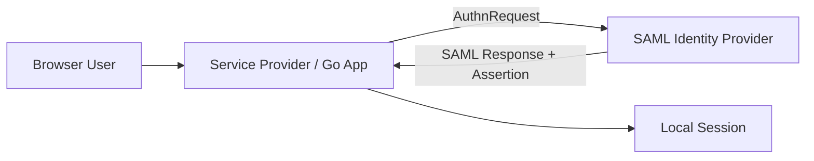
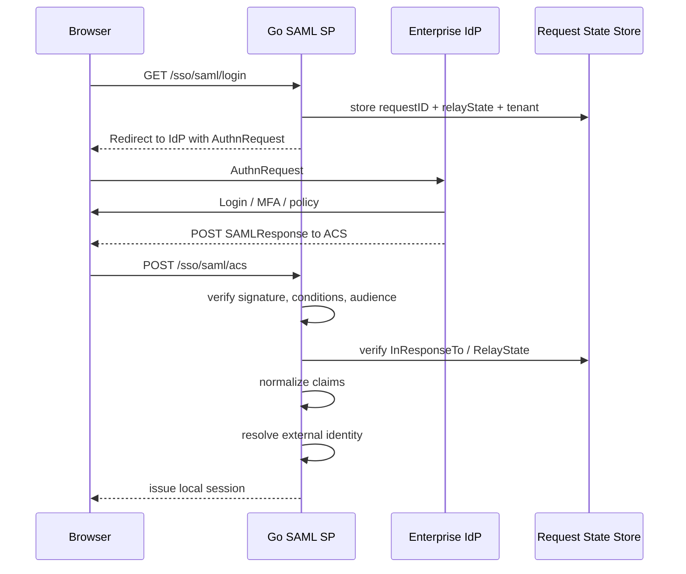
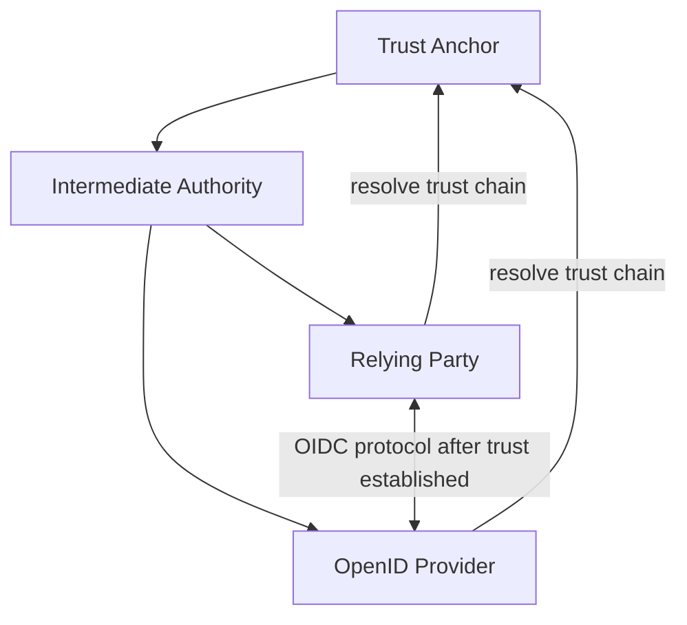
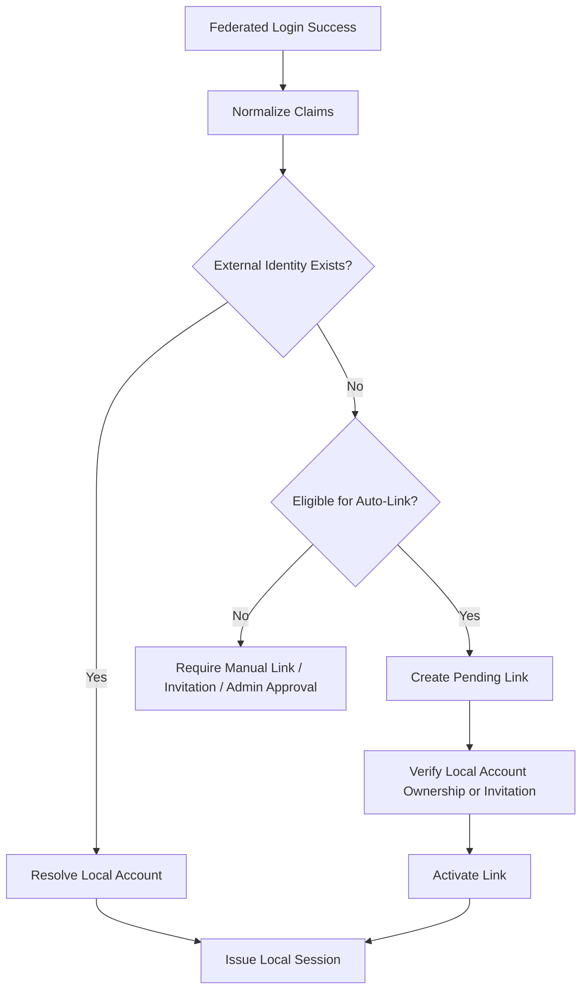
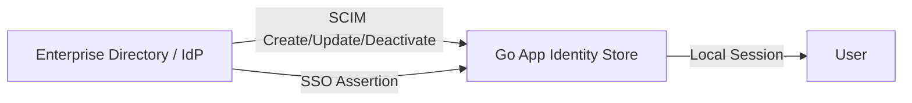
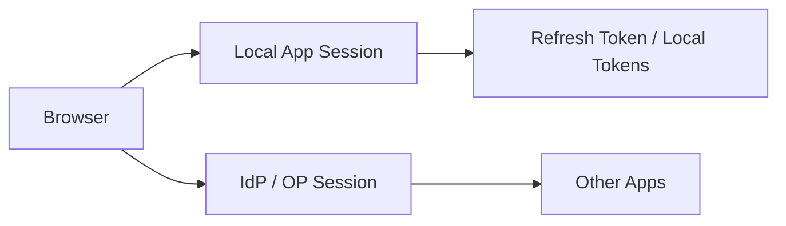
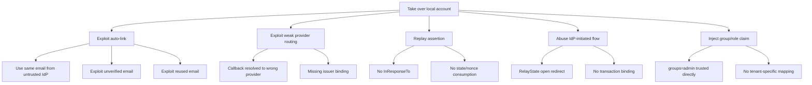
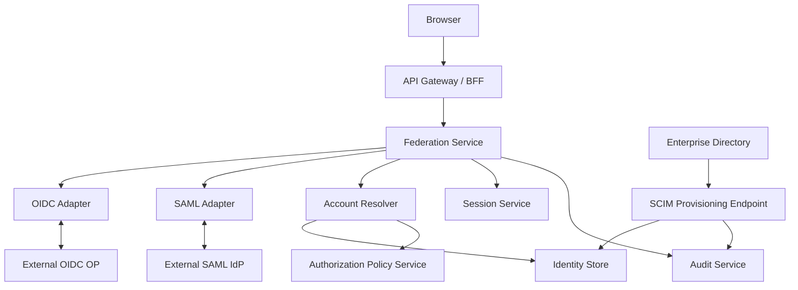

# learn-go-authentication-authorization-identity-permission-part-018.md

# Part 018 — Federation: SAML, OIDC Federation, External IdP, Enterprise SSO

> Seri: `learn-go-authentication-authorization-identity-permission`  
> Target: Go 1.26.x  
> Level: Advanced / internal engineering handbook  
> Fokus: Identity federation, external IdP, enterprise SSO, SAML, OIDC Federation, trust boundary, claim mapping, account linking, JIT provisioning, dan desain implementasi aman di Go.

---

## Daftar Isi

1. [Tujuan Part Ini](#1-tujuan-part-ini)
2. [Masalah Sebenarnya: Federation Bukan Sekadar Login Eksternal](#2-masalah-sebenarnya-federation-bukan-sekadar-login-eksternal)
3. [Vocabulary Presisi](#3-vocabulary-presisi)
4. [Mental Model: Federation Sebagai Trust Translation](#4-mental-model-federation-sebagai-trust-translation)
5. [Federation vs Authentication vs Provisioning vs Authorization](#5-federation-vs-authentication-vs-provisioning-vs-authorization)
6. [Trust Boundary dan Authority Boundary](#6-trust-boundary-dan-authority-boundary)
7. [Federation Protocol Landscape](#7-federation-protocol-landscape)
8. [SAML 2.0 Deep Dive untuk Go Engineer](#8-saml-20-deep-dive-untuk-go-engineer)
9. [OIDC Federation dan Dynamic Trust](#9-oidc-federation-dan-dynamic-trust)
10. [External IdP Integration Model](#10-external-idp-integration-model)
11. [Enterprise SSO Flow: SP-Initiated, IdP-Initiated, RP-Initiated](#11-enterprise-sso-flow-sp-initiated-idp-initiated-rp-initiated)
12. [Claim Mapping dan Attribute Normalization](#12-claim-mapping-dan-attribute-normalization)
13. [Subject Identifier: `sub`, NameID, Pairwise ID, Persistent ID](#13-subject-identifier-sub-nameid-pairwise-id-persistent-id)
14. [Account Linking: Bagian Paling Berbahaya](#14-account-linking-bagian-paling-berbahaya)
15. [JIT Provisioning dan SCIM](#15-jit-provisioning-dan-scim)
16. [Federation Assurance: IAL, AAL, FAL, `acr`, `amr`, AuthnContext](#16-federation-assurance-ial-aal-fal-acr-amr-authncontext)
17. [Federation dan Authorization: Jangan Campur Otoritas](#17-federation-dan-authorization-jangan-campur-otoritas)
18. [Go Architecture: Package Boundary](#18-go-architecture-package-boundary)
19. [Data Model dan Schema Reference](#19-data-model-dan-schema-reference)
20. [OIDC External IdP Implementation Sketch di Go](#20-oidc-external-idp-implementation-sketch-di-go)
21. [SAML Service Provider Implementation Sketch di Go](#21-saml-service-provider-implementation-sketch-di-go)
22. [Federation Router untuk Multi-IdP](#22-federation-router-untuk-multi-idp)
23. [Metadata, Discovery, Key, Certificate, dan Rotation](#23-metadata-discovery-key-certificate-dan-rotation)
24. [Logout: SLO, RP-Initiated Logout, Session Boundary](#24-logout-slo-rp-initiated-logout-session-boundary)
25. [Threat Model Federation](#25-threat-model-federation)
26. [Failure Modes](#26-failure-modes)
27. [Auditability dan Regulatory Defensibility](#27-auditability-dan-regulatory-defensibility)
28. [Testing Strategy](#28-testing-strategy)
29. [Operational Runbook](#29-operational-runbook)
30. [Reference Architecture](#30-reference-architecture)
31. [Case Study: Multi-Agency Regulatory Case Management](#31-case-study-multi-agency-regulatory-case-management)
32. [Checklist Production Readiness](#32-checklist-production-readiness)
33. [Anti-Pattern yang Harus Dihindari](#33-anti-pattern-yang-harus-dihindari)
34. [Latihan Desain](#34-latihan-desain)
35. [Ringkasan](#35-ringkasan)
36. [Referensi Primer](#36-referensi-primer)

---

## 1. Tujuan Part Ini

Bagian ini membahas **identity federation** sebagai mekanisme untuk menerima authentication/assertion dari domain kepercayaan lain, lalu mengubahnya menjadi identity lokal yang bisa dipakai oleh aplikasi Go.

Setelah bagian ini, target pemahamanmu:

1. Bisa membedakan **federated authentication**, **local account**, **provisioning**, dan **authorization**.
2. Bisa mendesain integrasi dengan external IdP tanpa membuat account-linking vulnerability.
3. Bisa membaca SAML/OIDC federation bukan sebagai “protocol magic”, tetapi sebagai **trust translation pipeline**.
4. Bisa mendesain multi-IdP enterprise SSO dengan tenant boundary yang jelas.
5. Bisa memutuskan kapan memakai SAML, OIDC, OIDC Federation, SCIM, atau bridge.
6. Bisa membangun Go package boundary untuk federation yang testable dan tidak bocor ke business logic.
7. Bisa membuat audit trail yang defensible: siapa login dari IdP mana, assertion apa, assurance apa, account mana yang dibentuk, dan authority mana yang dipakai.

Bagian ini tidak mengulang detail OAuth/OIDC dasar dari part sebelumnya. Kita langsung naik ke level **inter-organizational trust**.

---

## 2. Masalah Sebenarnya: Federation Bukan Sekadar Login Eksternal

Banyak engineer menyederhanakan federation menjadi:

> “User klik login dengan IdP X, lalu kita ambil email, lalu masuk.”

Itu terlalu dangkal dan berbahaya.

Federation sebenarnya menjawab pertanyaan:

> “Apakah sistem kita bersedia menerima klaim identitas dari pihak lain, dengan tingkat assurance tertentu, untuk membentuk local principal yang boleh berinteraksi dengan resource kita?”

Di situ ada banyak boundary:

- siapa yang boleh menjadi IdP;
- tenant mana yang boleh memakai IdP itu;
- client/app mana yang boleh menerima assertion dari IdP itu;
- attribute mana yang dipercaya;
- identifier mana yang stabil;
- assurance apa yang cukup;
- kapan account dibuat otomatis;
- kapan external identity boleh dilink ke local account;
- kapan claim role/group dari IdP boleh diterjemahkan menjadi permission lokal;
- bagaimana jika IdP salah konfigurasi;
- bagaimana jika IdP down;
- bagaimana jika IdP mengirim user yang sama dengan identifier berbeda;
- bagaimana jika email berpindah kepemilikan;
- bagaimana jika admin tenant salah mapping group;
- bagaimana jika assertion replayed;
- bagaimana jika metadata signing key IdP berubah.

Di sistem enterprise/regulatory, federation bukan “UX login convenience”. Federation adalah **governance boundary**.

---

## 3. Vocabulary Presisi

| Istilah | Makna | Catatan Desain |
|---|---|---|
| Identity Provider / IdP | Pihak yang melakukan authentication dan mengeluarkan assertion/claim | Dalam OIDC sering disebut OP: OpenID Provider |
| Relying Party / RP | Aplikasi yang bergantung pada assertion IdP | Istilah OIDC/NIST |
| Service Provider / SP | Aplikasi yang memakai SAML IdP | Istilah SAML |
| Assertion | Pernyataan cryptographically protected tentang subject/authentication | SAML assertion, ID Token, federation assertion |
| Subject | Entity yang assertion-nya dibicarakan | Human user, service, workload, organization agent |
| Local Account | Representasi internal account di sistem kita | Tidak sama dengan external identity |
| External Identity | Binding antara local account dan identity dari IdP eksternal | Harus punya provider ID + external subject stable |
| Federation | Hubungan trust lintas domain administratif | Bukan hanya login redirect |
| Provisioning | Pembuatan/update/deactivation user/group dari source eksternal | Bisa JIT atau SCIM |
| JIT Provisioning | Just-in-time account creation/update saat login | Praktis, tapi riskan jika mapping lemah |
| SCIM | Standard HTTP/JSON untuk lifecycle identity provisioning | Complementary to SSO |
| AuthnContext / `acr` | Indikasi metode/level authentication | Jangan dianggap otomatis setara AAL tanpa mapping eksplisit |
| `amr` | Authentication Methods References | Misal `pwd`, `mfa`, `otp`, `fido` |
| NameID | Identifier subject di SAML | Format sangat penting: transient, persistent, email, unspecified |
| `sub` | Subject identifier OIDC | Harus scoped ke issuer; tidak global sendirian |
| Pairwise Subject | Subject berbeda per RP/client sector | Melindungi privacy, mempersulit link lintas RP |
| Metadata | Dokumen konfigurasi IdP/RP/SP | Endpoint, cert/key, bindings, entity ID, capabilities |
| Trust Anchor | Entity yang dipercaya untuk membangun chain kepercayaan | Konsep sentral OIDC Federation |
| FAL | Federation Assurance Level | Dari NIST SP 800-63C |

### Invariant vocabulary

Jangan pernah menulis kode yang menganggap:

```text
email == identity
role claim == permission
valid token == authorized
external group == internal role
federated login == local account ownership proof
IdP authentication == local session policy selesai
```

---

## 4. Mental Model: Federation Sebagai Trust Translation

Federation bisa dipahami sebagai pipeline:

```mermaid
flowchart LR
    A[External User / Subject] --> B[External IdP]
    B --> C[Assertion / Token]
    C --> D[Federation Adapter]
    D --> E[Claim Normalization]
    E --> F[External Identity Binding]
    F --> G[Local Account Resolution]
    G --> H[Local Principal]
    H --> I[Local Session]
    I --> J[Local Authorization]
```



Bagian penting: **IdP tidak langsung membuat user authorized di sistem lokal**.

IdP hanya memberi assertion:

- subject ini diautentikasi oleh IdP X;
- pada waktu tertentu;
- dengan metode tertentu;
- dengan claim tertentu;
- untuk audience/client tertentu;
- dengan issuer tertentu;
- ditandatangani key tertentu;
- berdasarkan metadata/trust relationship tertentu.

Sistem lokal tetap harus melakukan:

1. verify assertion;
2. normalize claim;
3. resolve external identity;
4. link/create local account jika aman;
5. evaluate tenant boundary;
6. issue local session;
7. perform local authorization.

### Analogi

Federation itu seperti menerima surat resmi dari lembaga lain.

Surat itu valid hanya jika:

- lembaganya memang dikenal;
- formatnya sesuai;
- tanda tangannya valid;
- tujuan surat benar;
- surat belum expired;
- isi surat tidak bertentangan dengan policy lokal;
- orang yang disebut dalam surat bisa dipetakan ke record internal;
- surat itu cukup kuat untuk aksi yang diminta.

---

## 5. Federation vs Authentication vs Provisioning vs Authorization

### Authentication

Membuktikan subject telah diautentikasi.

Dalam federation:

- SAML IdP mengeluarkan assertion;
- OIDC OP mengeluarkan ID Token;
- CSP/IdP menurut NIST mengeluarkan assertion ke RP.

### Provisioning

Membuat/mengubah/menghapus representasi account/group di aplikasi.

Bisa melalui:

- JIT provisioning saat login;
- SCIM push provisioning;
- batch import;
- admin manual;
- directory sync.

### Authorization

Memutuskan boleh/tidak melakukan action terhadap resource lokal.

Federated claim bisa menjadi input authorization, tapi tidak otomatis menjadi authorization final.

### Common bug

```go
if claims.Groups.Contains("Admin") {
    user.Role = "admin"
}
```

Masalah:

- group claim mungkin tidak authoritative untuk aplikasi ini;
- group name bisa berubah;
- group berasal dari tenant berbeda;
- IdP bisa salah mapping;
- group claim bisa terlalu luas;
- role lokal tidak punya approval/audit;
- tidak ada separation of duties;
- tidak ada effective date/expiry;
- tidak ada revocation strategy.

Lebih aman:

```text
external group claim
    -> trusted group mapping config per tenant/provider
    -> internal role assignment candidate
    -> local policy validation
    -> audited assignment or session-limited entitlement
    -> authorization engine decision
```

---

## 6. Trust Boundary dan Authority Boundary

Federation punya dua boundary yang sering tercampur.

### 6.1 Trust boundary

Apakah kita percaya assertion dari provider ini?

Pertanyaan:

- Apakah issuer dikenal?
- Apakah metadata provider valid?
- Apakah signing key trusted?
- Apakah assertion audience benar?
- Apakah assertion belum expired?
- Apakah protocol flow aman?
- Apakah tenant boleh memakai provider ini?

### 6.2 Authority boundary

Claim mana yang provider ini berhak nyatakan?

Contoh:

| Claim | Apakah boleh dipercaya? | Catatan |
|---|---:|---|
| `sub` | Ya, dalam scope issuer | Identifier external subject |
| `email` | Mungkin | Perlu `email_verified` dan ownership semantics |
| `name` | Rendah | Display saja |
| `groups` | Tergantung | Hanya jika ada mapping authority |
| `department` | Tergantung | Bisa stale |
| `tenant_id` | Berbahaya | Jangan percaya tanpa binding lokal |
| `role=admin` | Sangat berbahaya | Harus mapped dan governed lokal |
| `acr` | Tergantung | Perlu mapping provider-specific ke local assurance |

### 6.3 Rule utama

> A trusted IdP does not automatically become an authorization authority for all local resources.

IdP bisa authoritative untuk authentication, tetapi tidak untuk permission lokal.

---

## 7. Federation Protocol Landscape

### 7.1 SAML 2.0

Umumnya dipakai di enterprise lama, government, education, dan vendor B2B.

Karakteristik:

- XML-based;
- assertion signed;
- metadata XML;
- SP/IdP terminology;
- browser SSO mature;
- banyak konfigurasi certificate/binding;
- banyak deployment lama masih aktif;
- sangat sensitif terhadap canonicalization/XML signature validation.

### 7.2 OIDC

Modern web/mobile API-friendly identity layer di atas OAuth2.

Karakteristik:

- JSON/JOSE/JWT;
- discovery via `.well-known/openid-configuration`;
- JWKS;
- RP/OP terminology;
- lebih natural untuk Go/REST/microservices;
- lebih mudah diintegrasikan dengan OAuth access token flow;
- tetap punya banyak jebakan validasi.

### 7.3 OIDC Federation

Mekanisme trust establishment dinamis menggunakan trust anchor dan entity statement.

Karakteristik:

- tidak semua RP/OP harus pre-register manual satu per satu;
- trust bisa dibentuk via trust chain;
- cocok untuk ecosystem multi-organization;
- lebih kompleks daripada OIDC biasa;
- memerlukan policy untuk metadata resolution, trust anchor, constraint, dan entity statement validation.

### 7.4 SCIM

Bukan SSO protocol. SCIM adalah provisioning protocol.

Digunakan untuk:

- create user;
- update user attributes;
- deactivate user;
- sync groups;
- lifecycle management.

### 7.5 Token Exchange / STS

Untuk pertukaran token lintas audience, delegation, impersonation, atau workload-to-service flow.

Relevan saat:

- federated user perlu akses downstream API;
- gateway perlu menukar external token menjadi internal token;
- service butuh token dengan audience berbeda;
- perlu delegation/impersonation semantics eksplisit.

---

## 8. SAML 2.0 Deep Dive untuk Go Engineer

### 8.1 Komponen SAML



Komponen utama:

| Komponen | Fungsi |
|---|---|
| IdP | Mengautentikasi user dan mengeluarkan assertion |
| SP | Aplikasi yang menerima assertion |
| Assertion | Berisi subject, condition, authentication statement, attribute statement |
| AuthnRequest | Request dari SP ke IdP |
| SAML Response | Response yang membawa assertion |
| Metadata | Konfigurasi SP/IdP, endpoint, certificate, entityID |
| Binding | Cara membawa message, misalnya HTTP-Redirect, HTTP-POST, Artifact |
| NameID | Identifier subject |
| AudienceRestriction | Membatasi assertion untuk SP tertentu |
| Recipient/Destination | Endpoint tujuan |
| NotBefore/NotOnOrAfter | Waktu validitas assertion |
| InResponseTo | Mengikat response ke request sebelumnya |

### 8.2 SAML SP-Initiated Login



### 8.3 Validation Pipeline SAML

Minimal pipeline:

1. Decode SAMLResponse.
2. Parse XML safely.
3. Validate response signature / assertion signature sesuai policy.
4. Validate issuer.
5. Validate destination/recipient.
6. Validate audience restriction.
7. Validate time conditions.
8. Validate `InResponseTo` untuk SP-initiated flow.
9. Validate NameID format dan stability.
10. Extract AuthnContext.
11. Extract attributes.
12. Normalize claims.
13. Resolve external identity.
14. Create/update local session.
15. Audit.

### 8.4 SAML Pitfalls

#### Pitfall 1: Mengandalkan email sebagai NameID

Email bisa berubah, dialihkan, reused, atau tidak diverifikasi sesuai policy.

Lebih baik:

```text
external_identity_key = (provider_id, issuer_entity_id, persistent_name_id)
```

Jika provider hanya memberi email, perlu risk acceptance dan compensating controls.

#### Pitfall 2: Tidak validate AudienceRestriction

Assertion untuk SP lain bisa dipakai ke aplikasi kita jika audience tidak dicek.

#### Pitfall 3: Tidak validate InResponseTo

Membuka peluang unsolicited response/replay/confused flow.

#### Pitfall 4: IdP-initiated SSO diterima tanpa constraint

IdP-initiated SSO lebih sulit mengikat request state karena SP tidak memulai request.
Jika diterima, harus dibatasi:

- provider allowed;
- tenant allowed;
- ACS endpoint fixed;
- relay state allowlist;
- local account resolution strict;
- audit explicit.

#### Pitfall 5: XML signature wrapping

SAML memakai XML signature. Validasi salah bisa menyebabkan aplikasi membaca assertion yang tidak ditandatangani tetapi memvalidasi signature di elemen lain.

Rule engineering:

> Jangan implement XML signature sendiri. Pakai library matang, test interop, dan tetap audit validation behavior.

---

## 9. OIDC Federation dan Dynamic Trust

OIDC biasa biasanya memakai pre-registered client:

```text
RP <-> OP
client_id, redirect_uri, secret/key, metadata configured manually
```

OIDC Federation menambahkan trust infrastructure:



Konsep utama:

| Konsep | Makna |
|---|---|
| Entity | RP, OP, Federation Authority, Trust Anchor |
| Entity Statement | Signed JWT berisi metadata entity dan authority statement |
| Trust Anchor | Root kepercayaan federation |
| Trust Chain | Rangkaian entity statements dari entity ke trust anchor |
| Metadata Policy | Constraint terhadap metadata entity |
| Federation Endpoint | Endpoint untuk mengambil statement/list/resolve |

### 9.1 Kapan OIDC Federation relevan?

Relevan jika:

- banyak organisasi harus saling trust;
- onboarding manual client/provider tidak scalable;
- ada federation operator;
- perlu delegated trust;
- banyak RP dan OP;
- trust relationship berubah dinamis.

Tidak perlu jika:

- hanya 1-5 enterprise IdP statis;
- integrasi SSO sederhana;
- tenant onboarding manual masih cukup;
- tidak ada governance trust anchor;
- tim belum siap mengelola metadata policy dan trust-chain validation.

### 9.2 Federation validation pipeline

```text
incoming provider/entity
    -> fetch entity statement
    -> validate signature
    -> build trust chain
    -> validate trust anchor
    -> apply metadata policy
    -> resolve effective metadata
    -> use OP/RP metadata for OIDC flow
```

### 9.3 Design warning

Dynamic trust tidak berarti “trust siapa saja yang punya endpoint federation”.

Kamu tetap butuh:

- configured trust anchors;
- allowed federation policies;
- metadata constraints;
- cache TTL dan invalidation;
- audit of resolved trust chain;
- emergency distrust mechanism.

---

## 10. External IdP Integration Model

Dalam sistem Go, external IdP sebaiknya direpresentasikan sebagai konfigurasi eksplisit, bukan hardcoded flow.

### Provider config model

```go
type ProviderProtocol string

const (
    ProtocolOIDC ProviderProtocol = "oidc"
    ProtocolSAML ProviderProtocol = "saml"
)

type ExternalProvider struct {
    ID             string
    TenantID       string
    Protocol       ProviderProtocol
    DisplayName    string
    Enabled        bool
    Issuer         string
    EntityID       string
    ClientID       string
    RedirectURI    string
    MetadataURL    string
    JWKSURL        string
    ACSURL         string
    AllowedDomains []string
    ClaimMapping   ClaimMapping
    AssuranceMap   AssuranceMapping
    CreatedAt      time.Time
    UpdatedAt      time.Time
}

type ClaimMapping struct {
    SubjectPath       string
    EmailPath         string
    EmailVerifiedPath string
    NamePath          string
    GroupsPath        string
    DepartmentPath    string
}

type AssuranceMapping struct {
    ACRToLocalLevel map[string]string
    AMRRules        []AMRRule
}

type AMRRule struct {
    RequiredMethods []string
    LocalAAL        string
}
```

### Provider config invariant

1. Provider belongs to tenant or global authority.
2. Provider protocol is immutable after creation, unless re-onboarding.
3. Issuer/entityID is immutable after trust establishment.
4. Redirect URI/ACS is exact and preconfigured.
5. Claim mapping is versioned and audited.
6. Group/role mapping is not direct authorization.
7. Disabling provider does not delete historical external identities.

---

## 11. Enterprise SSO Flow: SP-Initiated, IdP-Initiated, RP-Initiated

### 11.1 SP/RP-initiated flow

Aplikasi memulai login.

Kelebihan:

- punya local transaction state;
- bisa bind tenant/provider/session initiation;
- bisa validate `state`, `nonce`, `InResponseTo`;
- lebih mudah mencegah injection/replay.

Default yang disarankan.

### 11.2 IdP-initiated SAML flow

User login dari portal IdP lalu diarahkan ke SP.

Risiko:

- tidak ada request state lokal;
- relay state bisa disalahgunakan;
- account linking lebih riskan;
- tenancy resolution bisa ambigu.

Jika harus didukung, buat mode khusus:

```text
allow_idp_initiated = true only per provider
require signed response/assertion
require tenant-bound ACS URL or provider-bound ACS URL
require strict account binding existing only
no automatic privileged JIT provisioning
no open redirect relay state
```

### 11.3 OIDC RP-initiated

OIDC login umumnya RP-initiated menggunakan authorization code flow.

Wajib:

- state;
- nonce;
- PKCE;
- issuer binding;
- redirect URI exact match;
- callback transaction store.

---

## 12. Claim Mapping dan Attribute Normalization

External claim harus dinormalisasi sebelum masuk domain lokal.

### 12.1 Kenapa perlu normalization?

Provider berbeda bisa mengirim:

```json
{
  "sub": "abc123",
  "email": "alice@example.com",
  "email_verified": true,
  "groups": ["case-admin", "ops"]
}
```

atau:

```json
{
  "uid": "A-9981",
  "mail": "Alice.Example@EXAMPLE.COM",
  "verified": "Y",
  "memberOf": ["CN=CaseAdmin,OU=Groups,DC=example,DC=com"]
}
```

atau SAML attributes:

```xml
<saml:Attribute Name="urn:oid:0.9.2342.19200300.100.1.3">
  <saml:AttributeValue>alice@example.com</saml:AttributeValue>
</saml:Attribute>
```

Sistem lokal butuh format stabil:

```go
type NormalizedClaims struct {
    ProviderID    string
    Issuer        string
    Subject       string
    SubjectFormat string
    Email         string
    EmailVerified bool
    DisplayName   string
    Groups        []string
    Department    string
    AuthTime      *time.Time
    ACR           string
    AMR           []string
    Raw           map[string]any
}
```

### 12.2 Normalization rules

1. `issuer + subject` adalah identifier utama, bukan email.
2. Email harus canonicalized untuk lookup, tetapi raw email tetap disimpan untuk audit.
3. `email_verified` provider-specific harus dipahami; jangan diasumsikan universal.
4. Groups harus dipetakan melalui config, bukan dipakai langsung.
5. Unknown claim jangan silently menjadi permission.
6. Raw assertion/token hash disimpan untuk audit, bukan full sensitive token.
7. Mapping version harus dicatat di login event.

### 12.3 Claim freshness

Federated claims bisa stale.

Contoh:

- user pindah department;
- user dikeluarkan dari group;
- user disabled di directory;
- email berubah;
- assurance policy berubah;
- IdP melakukan delayed sync.

Maka klaim dari login session punya lifetime. Untuk aksi sensitif, jangan hanya mengandalkan claim dari login lama. Gunakan:

- session max age;
- step-up;
- re-fetch UserInfo;
- SCIM state;
- local policy store;
- token introspection jika applicable.

---

## 13. Subject Identifier: `sub`, NameID, Pairwise ID, Persistent ID

### 13.1 OIDC `sub`

OIDC `sub` harus dipahami sebagai stable identifier untuk end-user pada issuer tertentu.

Key aman:

```text
external_identity = (provider_id, issuer, sub)
```

Bukan:

```text
external_identity = email
```

### 13.2 Pairwise subject

Pairwise subject berarti user yang sama bisa punya `sub` berbeda untuk client berbeda.

Implikasi:

- tidak bisa memakai `sub` dari client A untuk link dengan client B;
- account linking lintas RP harus pakai mekanisme eksplisit;
- privacy meningkat;
- debugging perlu provider/client/sector identifier.

### 13.3 SAML NameID

NameID punya format. Beberapa contoh:

- persistent;
- transient;
- emailAddress;
- unspecified.

Untuk account binding jangka panjang, cari persistent identifier.

Transient NameID tidak cocok untuk long-term local account linking.

### 13.4 Email as identifier

Email berguna untuk:

- display;
- communication;
- account discovery jika verified;
- invitation matching dengan kontrol tambahan.

Email buruk sebagai primary identifier karena:

- bisa berubah;
- bisa reused;
- bisa case-sensitive di local-part secara teori;
- bisa punya alias;
- bisa tidak verified;
- bisa dikirim oleh provider yang tidak authoritative untuk domain itu.

---

## 14. Account Linking: Bagian Paling Berbahaya

Account linking adalah proses menghubungkan external identity ke local account.

Ini salah satu area paling sering menyebabkan account takeover.

### 14.1 Dangerous flow

```text
User logs in via IdP
IdP returns email alice@company.com
System finds local account with email alice@company.com
System logs user in as that account
```

Ini bisa aman hanya dalam kondisi sangat ketat:

- provider authoritative untuk domain email;
- email verified;
- tenant domain verified;
- local account belum punya binding conflicting;
- no pending takeover/recovery risk;
- audit and notification performed;
- step-up maybe required.

### 14.2 Safer linking flow



### 14.3 Linking states

```go
type ExternalIdentityStatus string

const (
    ExternalIdentityPending  ExternalIdentityStatus = "pending"
    ExternalIdentityActive   ExternalIdentityStatus = "active"
    ExternalIdentityDisabled ExternalIdentityStatus = "disabled"
    ExternalIdentityRevoked  ExternalIdentityStatus = "revoked"
)

type ExternalIdentity struct {
    ID              string
    TenantID        string
    AccountID       string
    ProviderID      string
    Issuer          string
    ExternalSubject string
    SubjectFormat   string
    EmailAtLinkTime string
    Status          ExternalIdentityStatus
    LinkedAt        time.Time
    LinkedBy        string
    LastLoginAt     *time.Time
    MappingVersion  int
}
```

### 14.4 Auto-link policy

Auto-link hanya boleh jika semua kondisi dipenuhi:

1. Provider trusted untuk tenant.
2. Provider authoritative untuk claimed domain.
3. Email verified menurut provider dan policy lokal.
4. Local account status eligible.
5. Tidak ada external identity conflict.
6. Tidak ada recovery/lock/security hold.
7. Mapping version active.
8. Audit event dibuat.
9. User/admin notification dikirim jika sesuai.

### 14.5 Account linking invariant

> Login assertion proves control of external identity. It does not automatically prove ownership of an existing local account.

---

## 15. JIT Provisioning dan SCIM

### 15.1 JIT provisioning

JIT provisioning membuat/mengupdate account saat login.

Kelebihan:

- onboarding cepat;
- tidak perlu pre-sync semua user;
- cocok untuk low-risk application.

Risiko:

- login flow menjadi lifecycle authority;
- attribute stale hanya diperbaiki saat login;
- disable user di IdP tidak langsung disable session lokal;
- group/role drift;
- audit provisioning tercampur dengan login;
- failure provisioning bisa memblok login.

### 15.2 SCIM provisioning

SCIM memisahkan lifecycle identity dari login.



SCIM cocok untuk:

- enterprise SaaS;
- automated deprovisioning;
- group sync;
- pre-provisioned access;
- auditability;
- separation of login and lifecycle.

### 15.3 SCIM user lifecycle

```text
SCIM User active=true
    -> local account provisioned/enabled
SCIM Group membership updated
    -> local group mapping candidate updated
SCIM User active=false
    -> local account disabled
    -> sessions revoked
    -> refresh tokens revoked
    -> future SSO blocked
```

### 15.4 JIT + SCIM hybrid

Banyak enterprise butuh hybrid:

- SCIM creates users/groups;
- SSO authenticates;
- JIT only fills missing non-sensitive attributes;
- privileged roles require SCIM or admin approval;
- login cannot create privileged admin account directly.

### 15.5 Go domain service

```go
type ProvisioningSource string

const (
    ProvisioningJIT  ProvisioningSource = "jit"
    ProvisioningSCIM ProvisioningSource = "scim"
    ProvisioningAdmin ProvisioningSource = "admin"
)

type ProvisioningService interface {
    EnsureAccountForFederatedLogin(ctx context.Context, input FederatedLoginResult) (AccountResolution, error)
    ApplySCIMUser(ctx context.Context, event SCIMUserEvent) error
    ApplySCIMGroup(ctx context.Context, event SCIMGroupEvent) error
}
```

### 15.6 Critical invariant

> Authentication flow should not be the only source of identity lifecycle truth for high-risk enterprise systems.

---

## 16. Federation Assurance: IAL, AAL, FAL, `acr`, `amr`, AuthnContext

Federated assertion membawa authentication evidence dari pihak lain. Pertanyaan lokal:

> “Apakah evidence dari IdP ini cukup untuk aksi ini?”

### 16.1 OIDC assurance fields

| Claim | Makna |
|---|---|
| `acr` | Authentication Context Class Reference |
| `amr` | Authentication Methods References |
| `auth_time` | Waktu end-user authentication terjadi |
| `max_age` request | RP meminta authentication freshness |

### 16.2 SAML assurance fields

| Field | Makna |
|---|---|
| AuthnStatement | Informasi authentication event |
| AuthnInstant | Waktu authentication |
| SessionIndex | Session identifier IdP side |
| AuthnContextClassRef | Class/metode authentication |

### 16.3 Assurance mapping

Jangan menganggap `acr=mfa` universal.

Buat mapping eksplisit per provider:

```yaml
provider: gov-idp-prod
acr_mapping:
  urn:gov:aal1: local_aal1
  urn:gov:aal2: local_aal2
  urn:gov:aal3: local_aal3
amr_rules:
  - methods: ["pwd"]
    local_aal: local_aal1
  - methods: ["pwd", "otp"]
    local_aal: local_aal2
  - methods: ["fido", "user_verification"]
    local_aal: local_aal3
```

### 16.4 Freshness

Even if AAL is high, authentication may be stale.

Untuk action sensitif:

```go
type AssuranceRequirement struct {
    MinAAL       string
    MaxAuthAge   time.Duration
    RequireStepUp bool
}
```

Contoh:

| Action | Requirement |
|---|---|
| View dashboard | AAL1, max session age normal |
| Submit application | AAL2, auth age < 12h |
| Approve enforcement action | AAL2/AAL3, auth age < 15m |
| Break-glass access | AAL3 + dual approval + reason |

### 16.5 FAL

FAL menilai assurance federasi/assertion, bukan hanya login method.

Aspek:

- assertion protection;
- audience restriction;
- holder-of-key/sender constraint;
- assertion replay resistance;
- IdP-RP trust model;
- key management;
- assertion presentation channel.

---

## 17. Federation dan Authorization: Jangan Campur Otoritas

Federated identity sering membawa claim group/role.

Pertanyaan penting:

> “Apakah IdP ini authoritative untuk menentukan role lokal?”

Jawabannya tidak selalu.

### 17.1 Mapping levels

| Level | Model | Risiko |
|---|---|---|
| Display-only | Claim hanya untuk UI/profile | Rendah |
| Login eligibility | Claim menentukan boleh login | Sedang |
| Session attribute | Claim jadi attribute ABAC | Sedang-tinggi |
| Role candidate | Claim mapped ke role lokal | Tinggi |
| Direct permission | Claim langsung jadi permission | Sangat tinggi |

### 17.2 Recommended model

```text
external group
    -> group mapping table
    -> local entitlement candidate
    -> policy constraint
    -> audit decision
    -> session-scoped grant or local role assignment
```

### 17.3 Role mapping schema

```sql
CREATE TABLE federated_group_mapping (
    id                    VARCHAR(64) PRIMARY KEY,
    tenant_id             VARCHAR(64) NOT NULL,
    provider_id           VARCHAR(64) NOT NULL,
    external_group_value  VARCHAR(512) NOT NULL,
    local_role_id         VARCHAR(64) NOT NULL,
    mapping_mode          VARCHAR(32) NOT NULL, -- session_only, persistent_assignment, eligibility_only
    requires_approval     BOOLEAN NOT NULL DEFAULT TRUE,
    enabled               BOOLEAN NOT NULL DEFAULT TRUE,
    created_at            TIMESTAMP NOT NULL,
    updated_at            TIMESTAMP NOT NULL,
    UNIQUE (tenant_id, provider_id, external_group_value, local_role_id)
);
```

### 17.4 Authorization invariant

> Federation may authenticate the subject and supply attributes. The local system remains responsible for authorization semantics.

---

## 18. Go Architecture: Package Boundary

Federation harus dipisah dari business handler.

Contoh struktur:

```text
/internal/authn/
  federation/
    provider.go
    router.go
    normalized_claims.go
    account_resolver.go
    assurance.go
    errors.go
  oidc/
    client.go
    transaction_store.go
    callback.go
    verifier.go
    discovery.go
  saml/
    service_provider.go
    acs.go
    metadata.go
    assertion.go
  scim/
    user_handler.go
    group_handler.go
    patch.go
  session/
    issuer.go
    store.go
  audit/
    events.go
```

### 18.1 Interfaces

```go
type FederationProvider interface {
    ID() string
    Protocol() ProviderProtocol
    StartLogin(ctx context.Context, req StartLoginRequest) (StartLoginResult, error)
    CompleteLogin(ctx context.Context, req CompleteLoginRequest) (FederatedLoginResult, error)
}

type AccountResolver interface {
    ResolveFederatedAccount(ctx context.Context, result FederatedLoginResult) (ResolvedAccount, error)
}

type SessionIssuer interface {
    IssueSession(ctx context.Context, input SessionIssueInput) (IssuedSession, error)
}

type AuditSink interface {
    Record(ctx context.Context, event AuditEvent) error
}
```

### 18.2 Domain object

```go
type FederatedLoginResult struct {
    ProviderID       string
    TenantID         string
    Protocol         ProviderProtocol
    Issuer           string
    ExternalSubject  string
    SubjectFormat    string
    Claims           NormalizedClaims
    Assurance        FederatedAssurance
    AssertionID      string
    AssertionHash    string
    AuthenticatedAt  time.Time
    ReceivedAt       time.Time
    MappingVersion   int
    RawAttributesRef string
}

type FederatedAssurance struct {
    LocalAAL      string
    LocalFAL      string
    ACR           string
    AMR           []string
    AuthnContext  string
    AuthTime      *time.Time
    FreshUntil    *time.Time
}
```

### 18.3 Handler orchestration

```go
func (h *FederationHandler) CompleteLogin(w http.ResponseWriter, r *http.Request) {
    ctx := r.Context()

    provider, err := h.router.ResolveProviderFromCallback(ctx, r)
    if err != nil {
        h.fail(w, r, err)
        return
    }

    result, err := provider.CompleteLogin(ctx, CompleteLoginRequest{HTTPRequest: r})
    if err != nil {
        h.audit.Record(ctx, AuditEventFromFederationFailure(err))
        h.fail(w, r, err)
        return
    }

    account, err := h.accounts.ResolveFederatedAccount(ctx, result)
    if err != nil {
        h.audit.Record(ctx, AuditEventFromAccountResolutionFailure(result, err))
        h.fail(w, r, err)
        return
    }

    session, err := h.sessions.IssueSession(ctx, SessionIssueInput{
        AccountID:     account.AccountID,
        TenantID:      account.TenantID,
        AuthSource:    "federated",
        ProviderID:    result.ProviderID,
        Assurance:     result.Assurance,
        ExternalIDRef: account.ExternalIdentityID,
    })
    if err != nil {
        h.fail(w, r, err)
        return
    }

    h.audit.Record(ctx, AuditEventFederatedLoginSuccess(result, account, session))
    h.sessionCookie.Set(w, session)
    http.Redirect(w, r, h.postLoginURL(account), http.StatusSeeOther)
}
```

### 18.4 Important Go rule

Jangan menaruh raw token/assertion di `context.Context` untuk dipakai handler business.

Business handler cukup tahu:

```go
type Principal struct {
    AccountID string
    TenantID  string
    ActorID   string
    Authn     AuthnContext
}
```

Raw protocol artifact tetap di auth boundary dan audit store yang terkontrol.

---

## 19. Data Model dan Schema Reference

### 19.1 Provider

```sql
CREATE TABLE identity_provider (
    id                  VARCHAR(64) PRIMARY KEY,
    tenant_id           VARCHAR(64),
    protocol            VARCHAR(16) NOT NULL,
    display_name        VARCHAR(255) NOT NULL,
    enabled             BOOLEAN NOT NULL DEFAULT TRUE,
    issuer              VARCHAR(512),
    entity_id           VARCHAR(512),
    metadata_url        VARCHAR(1024),
    jwks_url            VARCHAR(1024),
    client_id           VARCHAR(255),
    redirect_uri        VARCHAR(1024),
    acs_url             VARCHAR(1024),
    allow_idp_initiated BOOLEAN NOT NULL DEFAULT FALSE,
    claim_mapping_json  TEXT NOT NULL,
    assurance_map_json  TEXT NOT NULL,
    config_version      INTEGER NOT NULL DEFAULT 1,
    created_at          TIMESTAMP NOT NULL,
    updated_at          TIMESTAMP NOT NULL
);
```

### 19.2 External identity

```sql
CREATE TABLE external_identity (
    id                  VARCHAR(64) PRIMARY KEY,
    tenant_id           VARCHAR(64) NOT NULL,
    account_id          VARCHAR(64) NOT NULL,
    provider_id         VARCHAR(64) NOT NULL,
    issuer              VARCHAR(512) NOT NULL,
    external_subject    VARCHAR(512) NOT NULL,
    subject_format      VARCHAR(128),
    email_at_link_time  VARCHAR(320),
    status              VARCHAR(32) NOT NULL,
    linked_at           TIMESTAMP NOT NULL,
    linked_by           VARCHAR(64) NOT NULL,
    last_login_at       TIMESTAMP,
    mapping_version     INTEGER NOT NULL,
    UNIQUE (provider_id, issuer, external_subject),
    UNIQUE (tenant_id, account_id, provider_id)
);
```

### 19.3 Login transaction

```sql
CREATE TABLE federation_login_transaction (
    id                  VARCHAR(64) PRIMARY KEY,
    tenant_id           VARCHAR(64) NOT NULL,
    provider_id         VARCHAR(64) NOT NULL,
    protocol            VARCHAR(16) NOT NULL,
    state_hash          VARCHAR(255),
    nonce_hash          VARCHAR(255),
    pkce_verifier_hash  VARCHAR(255),
    saml_request_id     VARCHAR(255),
    relay_state_hash    VARCHAR(255),
    redirect_after      VARCHAR(1024),
    created_at          TIMESTAMP NOT NULL,
    expires_at          TIMESTAMP NOT NULL,
    consumed_at         TIMESTAMP,
    status              VARCHAR(32) NOT NULL
);
```

### 19.4 Federation login event

```sql
CREATE TABLE federation_login_event (
    id                  VARCHAR(64) PRIMARY KEY,
    tenant_id           VARCHAR(64) NOT NULL,
    provider_id         VARCHAR(64) NOT NULL,
    protocol            VARCHAR(16) NOT NULL,
    issuer              VARCHAR(512) NOT NULL,
    external_subject    VARCHAR(512),
    account_id          VARCHAR(64),
    external_identity_id VARCHAR(64),
    result              VARCHAR(32) NOT NULL,
    failure_code        VARCHAR(128),
    assurance_json      TEXT,
    claim_snapshot_hash VARCHAR(255),
    assertion_hash      VARCHAR(255),
    mapping_version     INTEGER,
    ip_hash             VARCHAR(255),
    user_agent_hash     VARCHAR(255),
    created_at          TIMESTAMP NOT NULL
);
```

---

## 20. OIDC External IdP Implementation Sketch di Go

### 20.1 Start login

```go
func (p *OIDCProvider) StartLogin(ctx context.Context, req StartLoginRequest) (StartLoginResult, error) {
    tx, err := p.transactions.Create(ctx, TransactionInput{
        TenantID:      req.TenantID,
        ProviderID:    p.config.ID,
        RedirectAfter: sanitizeRedirect(req.RedirectAfter),
        NeedNonce:     true,
        NeedPKCE:      true,
    })
    if err != nil {
        return StartLoginResult{}, err
    }

    opts := []oauth2.AuthCodeOption{
        oauth2.SetAuthURLParam("nonce", tx.Nonce),
        oauth2.SetAuthURLParam("code_challenge", tx.PKCEChallenge),
        oauth2.SetAuthURLParam("code_challenge_method", "S256"),
    }

    url := p.oauth2Config.AuthCodeURL(tx.State, opts...)
    return StartLoginResult{RedirectURL: url, TransactionID: tx.ID}, nil
}
```

### 20.2 Callback

```go
func (p *OIDCProvider) CompleteLogin(ctx context.Context, req CompleteLoginRequest) (FederatedLoginResult, error) {
    r := req.HTTPRequest

    state := r.URL.Query().Get("state")
    code := r.URL.Query().Get("code")
    if state == "" || code == "" {
        return FederatedLoginResult{}, ErrInvalidCallback
    }

    tx, err := p.transactions.ConsumeByState(ctx, state)
    if err != nil {
        return FederatedLoginResult{}, ErrInvalidState
    }

    token, err := p.oauth2Config.Exchange(ctx, code,
        oauth2.SetAuthURLParam("code_verifier", tx.PKCEVerifier),
    )
    if err != nil {
        return FederatedLoginResult{}, ErrTokenExchangeFailed
    }

    rawIDToken, ok := token.Extra("id_token").(string)
    if !ok || rawIDToken == "" {
        return FederatedLoginResult{}, ErrMissingIDToken
    }

    idToken, err := p.verifier.Verify(ctx, rawIDToken)
    if err != nil {
        return FederatedLoginResult{}, ErrInvalidIDToken
    }

    if idToken.Nonce != tx.Nonce {
        return FederatedLoginResult{}, ErrInvalidNonce
    }

    var raw map[string]any
    if err := idToken.Claims(&raw); err != nil {
        return FederatedLoginResult{}, ErrInvalidClaims
    }

    normalized, err := p.mapper.NormalizeOIDC(raw)
    if err != nil {
        return FederatedLoginResult{}, err
    }

    assurance := p.assurance.MapOIDC(raw)

    return FederatedLoginResult{
        ProviderID:      p.config.ID,
        TenantID:        tx.TenantID,
        Protocol:        ProtocolOIDC,
        Issuer:          idToken.Issuer,
        ExternalSubject: idToken.Subject,
        SubjectFormat:   "oidc-sub",
        Claims:          normalized,
        Assurance:       assurance,
        AssertionHash:   hashToken(rawIDToken),
        AuthenticatedAt: coalesceTime(idToken.AuthTime, time.Now()),
        ReceivedAt:      time.Now(),
        MappingVersion:  p.config.ConfigVersion,
    }, nil
}
```

### 20.3 Notes

Production code harus memperhatikan:

- issuer binding;
- audience/client ID;
- `azp` jika multiple audience;
- nonce;
- expiry;
- signature;
- `auth_time` jika max_age/step-up;
- provider discovery cache;
- JWKS cache;
- exact redirect URI;
- error handling tanpa information leakage.

---

## 21. SAML Service Provider Implementation Sketch di Go

Untuk SAML, gunakan library matang seperti `crewjam/saml`, tetapi tetap bungkus dalam boundary internal.

### 21.1 Provider wrapper

```go
type SAMLProvider struct {
    config       SAMLProviderConfig
    serviceProv  *saml.ServiceProvider
    transactions FederationTransactionStore
    mapper       SAMLClaimMapper
    assurance    SAMLAssuranceMapper
}
```

### 21.2 ACS flow pseudo-code

```go
func (p *SAMLProvider) CompleteLogin(ctx context.Context, req CompleteLoginRequest) (FederatedLoginResult, error) {
    r := req.HTTPRequest

    assertion, err := p.parseAndValidateSAMLResponse(r)
    if err != nil {
        return FederatedLoginResult{}, ErrInvalidSAMLResponse
    }

    if assertion.InResponseTo != "" {
        if err := p.transactions.ConsumeSAMLRequestID(ctx, assertion.InResponseTo); err != nil {
            return FederatedLoginResult{}, ErrInvalidInResponseTo
        }
    } else if !p.config.AllowIDPInitiated {
        return FederatedLoginResult{}, ErrUnsolicitedSAMLResponse
    }

    normalized, err := p.mapper.Normalize(assertion)
    if err != nil {
        return FederatedLoginResult{}, err
    }

    return FederatedLoginResult{
        ProviderID:      p.config.ID,
        TenantID:        p.config.TenantID,
        Protocol:        ProtocolSAML,
        Issuer:          assertion.Issuer,
        ExternalSubject: assertion.NameID,
        SubjectFormat:   assertion.NameIDFormat,
        Claims:          normalized,
        Assurance:       p.assurance.Map(assertion.AuthnContext),
        AssertionID:     assertion.ID,
        AssertionHash:   assertion.Hash,
        AuthenticatedAt: assertion.AuthnInstant,
        ReceivedAt:      time.Now(),
        MappingVersion:  p.config.ConfigVersion,
    }, nil
}
```

### 21.3 Important SAML config

```yaml
saml:
  entity_id: "https://app.example.com/saml/metadata"
  acs_url: "https://app.example.com/saml/acs"
  require_signed_assertion: true
  require_signed_response: false
  allow_idp_initiated: false
  clock_skew: "2m"
  max_assertion_age: "5m"
  nameid_format_required: "persistent"
```

### 21.4 Design rule

SAML parsing/validation library boleh menangani protocol mechanics, tetapi keputusan berikut tetap milik domain service:

- tenant resolution;
- external identity binding;
- auto-link eligibility;
- role/group mapping;
- session issuance;
- audit semantics;
- assurance mapping.

---

## 22. Federation Router untuk Multi-IdP

Enterprise system sering punya banyak IdP:

- tenant A memakai Azure AD OIDC;
- tenant B memakai Okta SAML;
- tenant C memakai government IdP;
- internal admin memakai corporate IdP;
- service account memakai workload identity.

### 22.1 Routing problem

Bagaimana menentukan provider?

Sumber routing:

- tenant subdomain;
- email domain discovery;
- explicit provider selection;
- invite link;
- ACS/callback path containing provider ID;
- login hint;
- organization slug.

### 22.2 Avoid email-domain-only routing

Email-domain discovery bisa membantu UX, tetapi jangan menjadi security boundary tunggal.

```text
alice@agency.gov -> suggest agency IdP
```

Bukan berarti:

```text
any assertion with email @agency.gov is trusted
```

### 22.3 Provider-specific callback path

Lebih aman:

```text
/tenant/{tenantSlug}/sso/{providerID}/oidc/start
/tenant/{tenantSlug}/sso/{providerID}/oidc/callback
/tenant/{tenantSlug}/sso/{providerID}/saml/acs
```

Atau callback global dengan transaction store yang kuat:

```text
/sso/oidc/callback?state=opaque
```

Untuk SAML IdP-initiated, provider-specific ACS sering lebih mudah di-audit.

### 22.4 Router interface

```go
type FederationRouter interface {
    ResolveStartProvider(ctx context.Context, r *http.Request) (FederationProvider, error)
    ResolveCallbackProvider(ctx context.Context, r *http.Request) (FederationProvider, error)
}
```

---

## 23. Metadata, Discovery, Key, Certificate, dan Rotation

### 23.1 OIDC metadata

OIDC discovery menyediakan:

- issuer;
- authorization endpoint;
- token endpoint;
- userinfo endpoint;
- jwks URI;
- supported response types;
- supported claims;
- supported auth methods.

### 23.2 SAML metadata

SAML metadata menyediakan:

- entityID;
- SSO service endpoint;
- SLO endpoint;
- signing/encryption certificate;
- supported bindings;
- organization/contact information;
- SP ACS endpoint.

### 23.3 Metadata cache

Metadata harus dicache, tetapi tidak selamanya.

Policy:

```go
type MetadataCachePolicy struct {
    MinRefreshInterval time.Duration
    MaxStale           time.Duration
    EmergencyBypass    bool
    RequireHTTPS       bool
    PinIssuer          bool
}
```

### 23.4 Key rotation

OIDC:

- JWKS can contain multiple keys;
- token `kid` selects key;
- old key may remain during overlap;
- cache refresh needed on unknown `kid`;
- emergency key revoke must bypass stale cache.

SAML:

- metadata may include new cert;
- overlap period needed;
- certificate expiry monitored;
- manual metadata exchange common;
- signed metadata preferable.

### 23.5 Fail behavior

| Situation | Recommended behavior |
|---|---|
| Unknown OIDC `kid` | Refresh JWKS once, then fail closed |
| Metadata endpoint down, cache valid | Use cached metadata |
| Metadata endpoint down, cache expired | Fail closed or allow limited grace only with explicit risk acceptance |
| SAML cert expired | Fail closed unless emergency override approved |
| Provider disabled | Block new login, keep historical audit |

---

## 24. Logout: SLO, RP-Initiated Logout, Session Boundary

Logout dalam federation kompleks karena ada beberapa session:



### 24.1 Session types

| Session | Owner |
|---|---|
| Local app session | Aplikasi kita |
| IdP session | External IdP |
| Browser session | Browser/cookie jar |
| Downstream service token | Authorization server/resource server |
| Refresh token family | Token service |

### 24.2 Logout invariant

> Local logout must always terminate local authority, even if upstream IdP logout fails.

### 24.3 SAML Single Logout

SAML SLO bisa rumit:

- IdP-initiated logout;
- SP-initiated logout;
- signed logout request/response;
- SessionIndex matching;
- partial failures.

Banyak sistem enterprise memilih minimal local logout + optional IdP redirect.

### 24.4 OIDC logout

OIDC punya beberapa logout specs/ecosystem patterns:

- RP-Initiated Logout;
- Front-Channel Logout;
- Back-Channel Logout;
- Session Management.

Implementasi bervariasi per provider.

### 24.5 Practical approach

1. Revoke local session.
2. Revoke refresh tokens if any.
3. Clear cookies.
4. Audit logout.
5. Optionally redirect to IdP logout endpoint.
6. Show clear UX: “You are signed out of this application. You may still be signed in to your identity provider.”

---

## 25. Threat Model Federation

### 25.1 Attack taxonomy

| Threat | Contoh |
|---|---|
| Assertion replay | Reusing SAML assertion or OIDC code/token |
| Token substitution | ID token/client mismatch |
| Mix-up attack | Callback from wrong issuer/provider |
| Account takeover via email match | External email mapped ke existing account |
| IdP confusion | Multi-provider callback resolves wrong provider |
| Metadata poisoning | JWKS/metadata fetched from attacker-controlled URL |
| XML signature wrapping | SAML parser validates signed node but reads unsigned node |
| IdP-initiated injection | Unsolicited SAML response accepted too broadly |
| Role escalation via group claim | External group becomes local admin directly |
| Tenant breakout | Assertion from tenant A accepted for tenant B |
| Stale deprovisioning | User disabled externally but local session still active |
| Weak assurance translation | `acr` misinterpreted as strong MFA |
| Replay of login transaction | State/request ID not consumed atomically |

### 25.2 Attack tree: account takeover via federation



### 25.3 Controls

| Threat | Control |
|---|---|
| Replay | nonce/state/InResponseTo, one-time transaction, short validity |
| Token substitution | issuer/audience/client/azp validation |
| Metadata poisoning | pinned issuer, configured metadata URL, HTTPS, signed metadata if applicable |
| Account takeover | strict external identity binding, no blind email match |
| Tenant breakout | tenant-bound provider and callback |
| Role escalation | local mapping policy, approval, audit |
| Stale deprovisioning | SCIM, session revocation, short session, revalidation |
| Assurance misread | provider-specific ACR/AMR/AuthnContext mapping |

---

## 26. Failure Modes

### 26.1 Provider config failure

- wrong issuer;
- wrong client ID;
- wrong redirect URI;
- wrong ACS;
- stale certificate;
- unsupported binding;
- wrong NameID format;
- provider disabled accidentally.

### 26.2 Runtime failure

- IdP down;
- metadata endpoint timeout;
- JWKS endpoint timeout;
- token endpoint slow;
- clock skew;
- TLS failure;
- SAML response too large;
- callback state expired;
- duplicate callback submit.

### 26.3 Domain failure

- external identity collision;
- ambiguous tenant;
- local account disabled;
- account locked;
- SCIM says inactive;
- claim mapping no longer valid;
- group mapping conflicts with SoD policy.

### 26.4 Security failure

- invalid signature;
- wrong audience;
- wrong recipient;
- expired assertion;
- missing nonce;
- unknown issuer;
- unknown `kid` after JWKS refresh;
- unsolicited SAML response denied.

### 26.5 Failure classification

```go
type FederationErrorCode string

const (
    ErrCodeProviderNotFound       FederationErrorCode = "provider_not_found"
    ErrCodeProviderDisabled       FederationErrorCode = "provider_disabled"
    ErrCodeInvalidIssuer          FederationErrorCode = "invalid_issuer"
    ErrCodeInvalidAudience        FederationErrorCode = "invalid_audience"
    ErrCodeInvalidSignature       FederationErrorCode = "invalid_signature"
    ErrCodeExpiredAssertion       FederationErrorCode = "expired_assertion"
    ErrCodeInvalidState           FederationErrorCode = "invalid_state"
    ErrCodeInvalidNonce           FederationErrorCode = "invalid_nonce"
    ErrCodeExternalIdentityConflict FederationErrorCode = "external_identity_conflict"
    ErrCodeAccountDisabled        FederationErrorCode = "account_disabled"
    ErrCodeProvisioningDenied     FederationErrorCode = "provisioning_denied"
    ErrCodeAssuranceInsufficient  FederationErrorCode = "assurance_insufficient"
)
```

### 26.6 UX rule

User-facing error:

```text
Unable to sign in with your organization account. Please contact your administrator.
```

Internal/audit error:

```text
provider_id=agency-saml-prod reason=invalid_audience expected=https://app.example.com/saml/metadata actual=https://old.example.com/saml/metadata assertion_id=...
```

Do not leak validation details to browser.

---

## 27. Auditability dan Regulatory Defensibility

Federation audit harus mampu menjawab:

1. Siapa subject eksternalnya?
2. Provider mana yang mengautentikasi?
3. Tenant mana yang menerima assertion?
4. Assertion/token apa yang dipakai, minimal hash/reference?
5. Authentication terjadi kapan di IdP?
6. Assertion diterima kapan?
7. Assurance mapping apa yang dipakai?
8. Claim mapping version berapa?
9. External identity mana yang dipakai?
10. Local account mana yang terbentuk?
11. Session lokal mana yang diterbitkan?
12. Apakah ada JIT provisioning/linking?
13. Apakah ada group/role mapping?
14. Apakah login ditolak? Kenapa?

### 27.1 Audit event example

```json
{
  "event_type": "federated_login_success",
  "tenant_id": "agency-a",
  "provider_id": "agency-a-saml",
  "protocol": "saml",
  "issuer": "https://idp.agency-a.gov/saml",
  "external_subject_hash": "sha256:...",
  "subject_format": "persistent",
  "account_id": "acc_123",
  "external_identity_id": "ext_789",
  "authn_instant": "2026-06-24T10:15:00Z",
  "received_at": "2026-06-24T10:15:08Z",
  "local_aal": "aal2",
  "local_fal": "fal2",
  "mapping_version": 12,
  "assertion_hash": "sha256:...",
  "session_id_hash": "sha256:...",
  "result": "success"
}
```

### 27.2 Audit anti-pattern

Jangan menyimpan full SAMLResponse/ID Token secara mentah di log umum.

Gunakan:

- hash;
- redacted claim snapshot;
- encrypted forensic store jika wajib;
- strict retention;
- access-controlled audit viewer.

---

## 28. Testing Strategy

### 28.1 Unit tests

Test claim mapper:

- missing subject;
- missing email;
- email verified false;
- groups as string vs array;
- unknown claim path;
- SAML OID attribute names;
- provider-specific mapping version.

Test account resolver:

- external identity exists;
- external identity disabled;
- local account disabled;
- no external identity + auto-link denied;
- no external identity + invitation link;
- conflict external subject;
- email collision.

### 28.2 Protocol tests

OIDC:

- invalid issuer;
- invalid audience;
- missing nonce;
- expired ID token;
- unknown `kid`;
- token signed with wrong alg;
- state replay;
- code exchange failure.

SAML:

- unsigned assertion when signature required;
- wrong audience;
- wrong recipient;
- expired assertion;
- missing InResponseTo;
- IDP-initiated disabled;
- duplicate SAML response;
- malformed XML;
- huge XML payload.

### 28.3 Integration tests

Use local test IdP:

- OIDC test provider;
- SAML test IdP;
- fixed key/cert;
- rotate key/cert;
- tenant A/B providers;
- assertion from tenant A to tenant B should fail.

### 28.4 Property tests

For routing:

- any callback must resolve exactly one provider;
- provider disabled must always fail;
- tenant mismatch must always fail;
- state consumed once;
- external identity key uniqueness must hold.

### 28.5 Golden tests

Golden files for:

- claim mapping configs;
- SAML sample assertions;
- OIDC token claims;
- SCIM payloads;
- audit event schemas.

---

## 29. Operational Runbook

### 29.1 IdP metadata changed

Steps:

1. Fetch new metadata.
2. Validate issuer/entityID unchanged unless planned migration.
3. Compare endpoints.
4. Compare cert/JWKS.
5. Check overlap keys/certs.
6. Run synthetic login.
7. Update provider config version.
8. Audit config change.
9. Monitor failures.

### 29.2 IdP down

Decision:

- Is local session still valid?
- Is login blocked only for new sessions?
- Are admin/break-glass accounts local?
- Is there alternate provider?
- Is outage provider-specific or global?

Runbook:

1. Confirm provider health.
2. Check DNS/TLS/JWKS/metadata/token endpoint.
3. Check callback errors.
4. Communicate affected tenants.
5. Do not bypass verification globally.
6. Use emergency access only through audited break-glass.

### 29.3 IdP key compromise

1. Disable provider or specific key.
2. Refresh metadata/JWKS ignoring cache.
3. Revoke local sessions from provider if needed.
4. Revoke refresh tokens linked to provider.
5. Audit last successful login window.
6. Identify affected accounts.
7. Notify tenant security contact.
8. Require reauthentication after remediation.

### 29.4 Claim mapping bug

1. Disable affected mapping.
2. Stop new login if privilege-related.
3. Identify sessions issued with bad mapping version.
4. Revoke or downgrade sessions.
5. Recompute role assignments if persistent.
6. Preserve audit evidence.
7. Create post-incident test fixtures.

---

## 30. Reference Architecture



### 30.1 Component responsibility

| Component | Responsibility |
|---|---|
| Gateway/BFF | Route login/callback, cookie boundary, CSRF boundary |
| Federation Service | Protocol orchestration, provider routing, normalized result |
| OIDC Adapter | OIDC discovery, state/nonce/PKCE, token exchange, ID token verification |
| SAML Adapter | AuthnRequest, ACS, SAMLResponse validation, metadata |
| Account Resolver | External identity binding, JIT, account state |
| Session Service | Local session issuance/revocation |
| Policy Service | Role/group mapping, authorization constraints |
| Identity Store | Account, tenant, provider, external identity, credential records |
| Audit Service | Immutable event capture |
| SCIM Endpoint | Lifecycle provisioning |

### 30.2 Boundary invariant

Federation service emits local principal/session only after:

```text
protocol validation
+ provider trust validation
+ tenant validation
+ claim normalization
+ account resolution
+ assurance mapping
+ policy gate
+ audit event
```

---

## 31. Case Study: Multi-Agency Regulatory Case Management

### 31.1 Scenario

Sistem case management regulatory digunakan oleh:

- internal agency officers;
- external applicants;
- partner agencies;
- vendors;
- admins;
- support officers.

Identity sources:

- internal corporate OIDC;
- partner agency SAML;
- public identity provider;
- local break-glass admin;
- service-to-service workload identity.

### 31.2 Requirement

1. Partner agency officers login via SAML.
2. Internal staff login via corporate OIDC.
3. External applicants login via public IdP.
4. Admin cannot be auto-created via JIT.
5. Partner agency group claims can only produce eligibility, not direct admin.
6. Case officer role is tenant/agency scoped.
7. Cross-agency access requires explicit delegation.
8. Enforcement approval requires fresh AAL2+ login.
9. All impersonation/support access must be audited.
10. If IdP down, existing sessions can continue until normal expiry, but no new login.

### 31.3 Design

Provider config:

```text
provider_internal_oidc: tenant=global, protocol=oidc, allowed_roles=staff
provider_partner_saml_a: tenant=agency-a, protocol=saml, allowed_roles=partner_officer_eligibility
provider_public_oidc: tenant=public, protocol=oidc, allowed_roles=applicant
```

External identity key:

```text
(provider_id, issuer/entityID, subject/nameID)
```

Role mapping:

```text
SAML group "CEA-Case-Officer" -> role candidate "case_officer" for tenant agency-a
requires local approval = true
mapping_mode = persistent_assignment
```

High-risk action:

```text
approve_enforcement_case
requires:
  local_role = enforcement_approver
  tenant_id matches case.tenant_id
  local_aal >= aal2
  auth_time <= 15 minutes
  no active impersonation unless break-glass policy allows
  audit reason code present
```

### 31.4 Failure example

If partner IdP sends:

```text
NameID = alice@example.com
Groups = [Admin]
```

System must not automatically make Alice admin.

Correct path:

1. Validate SAML assertion.
2. Resolve `(provider_partner_saml_a, issuer, NameID)`.
3. Check external identity active.
4. Normalize `Groups`.
5. Apply group mapping: unknown group `Admin` ignored or denied.
6. Issue session with no elevated role.
7. Audit unknown group claim if suspicious.

---

## 32. Checklist Production Readiness

### Trust setup

- [ ] Provider issuer/entityID pinned.
- [ ] Tenant-provider binding explicit.
- [ ] Metadata URL controlled.
- [ ] JWKS/cert rotation policy exists.
- [ ] Disabled provider blocks new login.
- [ ] Config changes audited.

### Protocol validation

- [ ] OIDC validates issuer.
- [ ] OIDC validates audience/client.
- [ ] OIDC validates nonce.
- [ ] OIDC uses state + PKCE.
- [ ] OIDC handles unknown `kid` safely.
- [ ] SAML validates signature.
- [ ] SAML validates audience.
- [ ] SAML validates recipient/destination.
- [ ] SAML validates time conditions.
- [ ] SAML validates InResponseTo for SP-initiated flow.

### Account linking

- [ ] No blind email-based login.
- [ ] External identity uniqueness enforced.
- [ ] Auto-link policy explicit.
- [ ] External identity status modeled.
- [ ] Account disabled blocks login.
- [ ] Linking/unlinking audited.

### Provisioning

- [ ] JIT privilege limited.
- [ ] SCIM deprovisioning revokes sessions.
- [ ] Group mapping versioned.
- [ ] Unknown groups handled safely.
- [ ] Mapping conflicts detected.

### Authorization

- [ ] External role/group not used directly as local permission.
- [ ] Tenant boundary enforced.
- [ ] Assurance mapped per provider.
- [ ] Sensitive actions require fresh assurance.
- [ ] Delegation/impersonation separated from federation login.

### Operations

- [ ] Synthetic login monitor exists.
- [ ] Metadata/JWKS/cert expiry monitored.
- [ ] Provider outage runbook exists.
- [ ] Key compromise runbook exists.
- [ ] Login failures classified.
- [ ] Audit events contain provider/mapping/assertion hash.

---

## 33. Anti-Pattern yang Harus Dihindari

### 33.1 `email` sebagai primary federated identity

Buruk:

```go
user := users.FindByEmail(claims.Email)
login(user)
```

Baik:

```go
externalID := ExternalIdentityKey{
    ProviderID: provider.ID,
    Issuer:     claims.Issuer,
    Subject:    claims.Subject,
}
account := resolver.Resolve(externalID)
```

### 33.2 Trusting `groups` as local roles directly

Buruk:

```go
if contains(claims.Groups, "Admin") {
    principal.Roles = append(principal.Roles, "admin")
}
```

Baik:

```go
entitlements := mapper.MapExternalGroups(provider.ID, tenant.ID, claims.Groups)
decision := policy.EvaluateFederatedEntitlements(account, entitlements)
```

### 33.3 IdP-initiated SSO accepted globally

Buruk:

```text
POST /saml/acs accepts any valid assertion from any known IdP
```

Baik:

```text
POST /tenant/{tenant}/saml/{provider}/acs
provider must allow IdP-initiated
assertion issuer must match provider
tenant must match provider
account must already be linked unless explicit JIT policy
```

### 33.4 Metadata fetched from token/header claim

Buruk:

```text
read issuer from token -> fetch metadata from issuer -> trust keys
```

Baik:

```text
callback route/transaction -> configured provider -> pinned issuer -> configured discovery/metadata -> validate token/assertion
```

### 33.5 Raw assertion in application logs

Buruk:

```go
log.Printf("SAMLResponse=%s", samlResponse)
```

Baik:

```go
log.Info("saml_response_received", "assertion_hash", hash, "provider_id", providerID)
```

---

## 34. Latihan Desain

### Latihan 1

Tenant A memakai Okta OIDC. Tenant B memakai Azure AD OIDC. Keduanya punya user dengan email yang sama `consultant@example.com`.

Desain:

- external identity key;
- local account model;
- tenant boundary;
- audit event;
- login routing.

Pertanyaan:

- Apakah satu local account atau dua?
- Apakah email boleh dipakai untuk auto-link?
- Bagaimana jika consultant memang bekerja untuk dua tenant?

### Latihan 2

Partner IdP SAML hanya bisa mengirim NameID email, bukan persistent ID.

Tentukan:

- risk acceptance;
- compensating controls;
- account linking flow;
- deprovisioning strategy;
- audit requirements.

### Latihan 3

IdP mengirim group `CaseApprover`. Local role `case_approver` boleh approve enforcement case.

Desain:

- mapping mode;
- approval requirement;
- effective date;
- revocation;
- stale group handling;
- audit decision.

### Latihan 4

JWKS endpoint down selama 2 jam. Cache masih valid 30 menit.

Tentukan:

- apakah login baru boleh?
- apakah existing session tetap valid?
- kapan fail closed?
- bagaimana komunikasi ke tenant?
- metric apa yang dipantau?

---

## 35. Ringkasan

Federation adalah salah satu bagian auth system yang paling rawan karena ia memindahkan sebagian authentication evidence dari domain lain ke sistem kita. Kesalahan paling umum bukan sekadar salah validate signature, tetapi salah memahami **authority**.

Inti part ini:

1. Federation adalah trust translation, bukan shortcut login.
2. External IdP bisa dipercaya untuk authentication, tetapi belum tentu untuk authorization.
3. External identity harus diikat dengan stable subject scoped ke provider/issuer, bukan email.
4. Account linking harus diperlakukan sebagai high-risk flow.
5. JIT provisioning berguna, tapi jangan menjadi satu-satunya lifecycle authority untuk sistem high-risk.
6. SCIM memisahkan provisioning dari login dan penting untuk enterprise deprovisioning.
7. Assurance harus dimapping eksplisit per provider.
8. SAML dan OIDC punya validation pitfalls berbeda.
9. OIDC Federation menambahkan dynamic trust chain, tetapi tidak menghapus kebutuhan trust anchor dan metadata policy.
10. Authorization tetap milik sistem lokal.
11. Audit harus bisa merekonstruksi provider, subject, assertion, assurance, mapping, account, dan session.

Top engineer memperlakukan federation sebagai **governed trust boundary**, bukan fitur login.

---

## 36. Referensi Primer

- OpenID Federation 1.0 — https://openid.net/specs/openid-federation-1_0.html
- OpenID Connect Core 1.0 — https://openid.net/specs/openid-connect-core-1_0.html
- OpenID Connect Discovery 1.0 — https://openid.net/specs/openid-connect-discovery-1_0.html
- OAuth 2.0 Security Best Current Practice, RFC 9700 — https://datatracker.ietf.org/doc/rfc9700/
- OAuth 2.0 Token Exchange, RFC 8693 — https://www.rfc-editor.org/info/rfc8693
- SAML 2.0 Technical Overview, OASIS — https://docs.oasis-open.org/security/saml/Post2.0/sstc-saml-tech-overview-2.0.html
- SAML 2.0 Core, OASIS — https://docs.oasis-open.org/security/saml/v2.0/saml-core-2.0-os.pdf
- SAML 2.0 Bindings, OASIS — https://docs.oasis-open.org/security/saml/v2.0/saml-bindings-2.0-os.pdf
- SAML 2.0 Profiles, OASIS — https://docs.oasis-open.org/security/saml/v2.0/saml-profiles-2.0-os.pdf
- NIST SP 800-63C-4 Federation and Assertions — https://csrc.nist.gov/pubs/sp/800/63/c/4/final
- SCIM Core Schema, RFC 7643 — https://datatracker.ietf.org/doc/html/rfc7643
- SCIM Protocol, RFC 7644 — https://datatracker.ietf.org/doc/html/rfc7644
- crewjam/saml Go library — https://github.com/crewjam/saml
- coreos/go-oidc Go library — https://pkg.go.dev/github.com/coreos/go-oidc/v3/oidc
- ZITADEL OIDC Go library — https://github.com/zitadel/oidc

<!-- NAVIGATION_FOOTER -->
<div class="page-nav">
<a href="./learn-go-authentication-authorization-identity-permission-part-017.md">⬅️ Part 017 — Building Authorization Server / Identity Provider Concepts in Go</a>
<a href="./index.md">📚 Kategori</a>
<a href="../../index.md">🏠 Home</a>
<a href="./learn-go-authentication-authorization-identity-permission-part-019.md">Part 019 — Authorization Mental Model: PDP, PEP, PIP, PAP ➡️</a>
</div>
