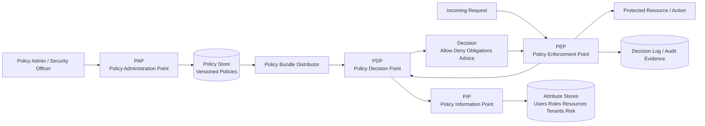
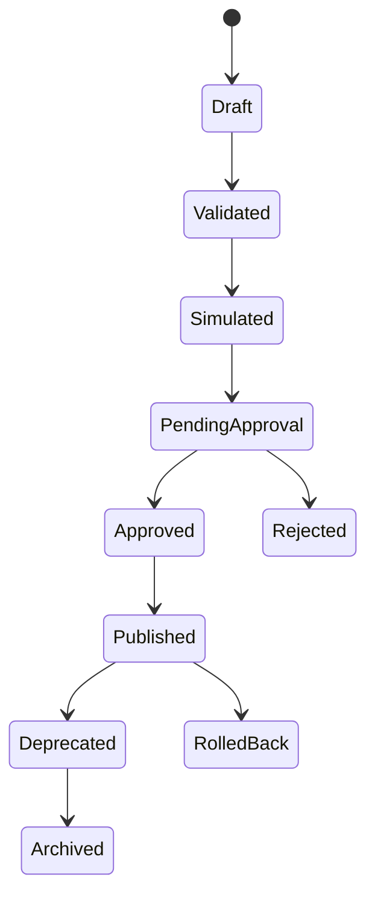
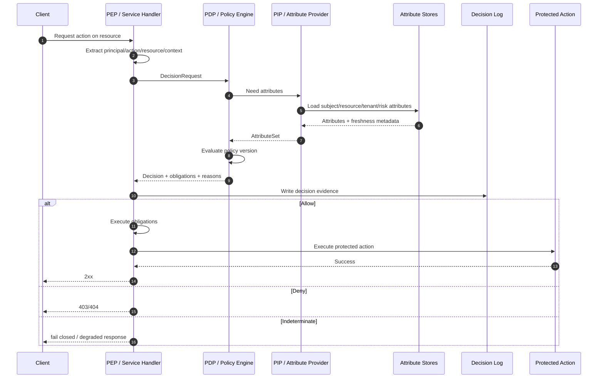
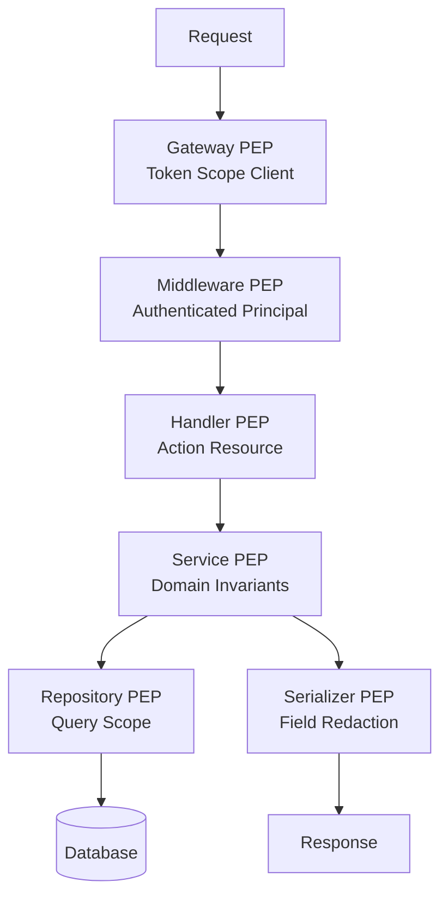
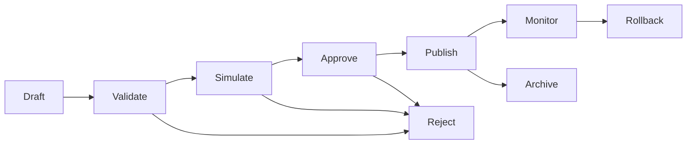
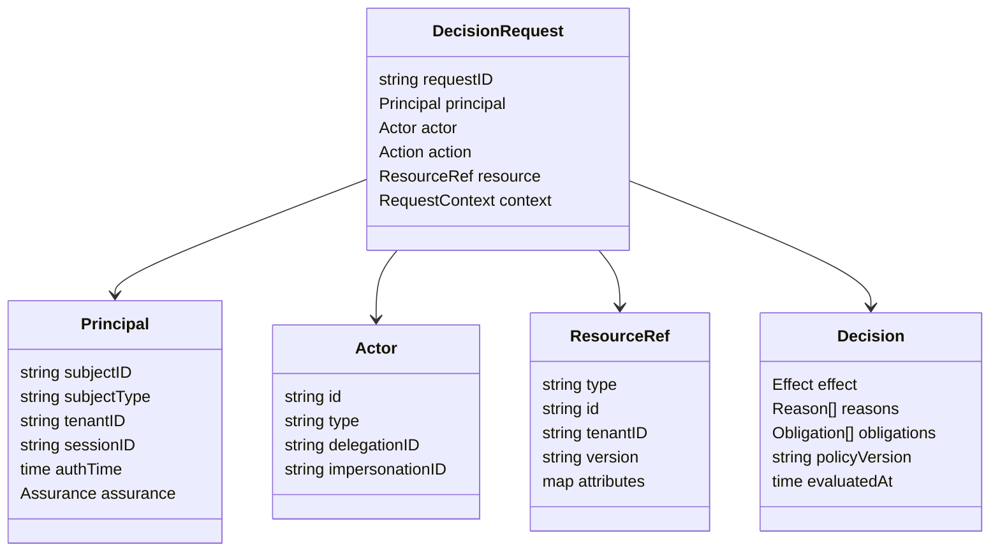

# learn-go-authentication-authorization-identity-permission-part-019.md

# Part 019 — Authorization Mental Model: PDP, PEP, PIP, PAP

> Seri: `learn-go-authentication-authorization-identity-permission`  
> Target: Go 1.26.x  
> Level: Advanced / internal engineering handbook  
> Fokus: arsitektur authorization sebagai sistem keputusan terdistribusi, bukan sekadar role check di middleware.

---

## Daftar Isi

1. [Tujuan Bagian Ini](#1-tujuan-bagian-ini)
2. [Premis Utama: Authorization adalah Decision System](#2-premis-utama-authorization-adalah-decision-system)
3. [Istilah Presisi](#3-istilah-presisi)
4. [Model Klasik: PEP, PDP, PIP, PAP](#4-model-klasik-pep-pdp-pip-pap)
5. [Peta Besar Authorization Control Plane](#5-peta-besar-authorization-control-plane)
6. [PEP — Policy Enforcement Point](#6-pep--policy-enforcement-point)
7. [PDP — Policy Decision Point](#7-pdp--policy-decision-point)
8. [PIP — Policy Information Point](#8-pip--policy-information-point)
9. [PAP — Policy Administration Point](#9-pap--policy-administration-point)
10. [Policy Store, Policy Bundle, dan Policy Version](#10-policy-store-policy-bundle-dan-policy-version)
11. [Decision Log dan Audit Evidence](#11-decision-log-dan-audit-evidence)
12. [Request, Context, Decision, Obligation, Advice](#12-request-context-decision-obligation-advice)
13. [Authorization Decision Contract di Go](#13-authorization-decision-contract-di-go)
14. [Effect Semantics: Allow, Deny, NotApplicable, Indeterminate](#14-effect-semantics-allow-deny-notapplicable-indeterminate)
15. [Centralized vs Embedded vs Hybrid PDP](#15-centralized-vs-embedded-vs-hybrid-pdp)
16. [Synchronous vs Asynchronous Authorization](#16-synchronous-vs-asynchronous-authorization)
17. [Data Freshness, Cache, dan Staleness Budget](#17-data-freshness-cache-dan-staleness-budget)
18. [Obligations: Ketika Allow Tidak Cukup](#18-obligations-ketika-allow-tidak-cukup)
19. [Tenant Boundary dan Authorization Context](#19-tenant-boundary-dan-authorization-context)
20. [Resource-Level Authorization: Beyond Route Check](#20-resource-level-authorization-beyond-route-check)
21. [Authorization Placement: Gateway, BFF, Service, Repository, Database](#21-authorization-placement-gateway-bff-service-repository-database)
22. [Go Package Architecture](#22-go-package-architecture)
23. [HTTP PEP Implementation Pattern](#23-http-pep-implementation-pattern)
24. [gRPC PEP Implementation Pattern](#24-grpc-pep-implementation-pattern)
25. [PDP Interface dan Local Engine](#25-pdp-interface-dan-local-engine)
26. [PIP Adapter Pattern](#26-pip-adapter-pattern)
27. [Policy Admin Model dan Approval Workflow](#27-policy-admin-model-dan-approval-workflow)
28. [Failure Modes](#28-failure-modes)
29. [Security Anti-Patterns](#29-security-anti-patterns)
30. [Testing Strategy](#30-testing-strategy)
31. [Performance Engineering](#31-performance-engineering)
32. [Observability untuk Authorization Decision](#32-observability-untuk-authorization-decision)
33. [Mermaid Diagrams](#33-mermaid-diagrams)
34. [Case Study: Regulatory Case Management](#34-case-study-regulatory-case-management)
35. [Production Checklist](#35-production-checklist)
36. [Review Questions](#36-review-questions)
37. [Ringkasan](#37-ringkasan)
38. [Referensi Primer](#38-referensi-primer)

---

## 1. Tujuan Bagian Ini

Bagian ini membangun fondasi arsitektur authorization yang akan dipakai pada part berikutnya:

- Part 020: RBAC yang benar.
- Part 021: Permission modelling.
- Part 022: ABAC.
- Part 023: ReBAC.
- Part 024: Policy-as-Code.
- Part 025: Capability-based access.
- Part 026: Multi-tenant authorization.
- Part 030: Authorization consistency, cache, staleness, dan revocation.
- Part 031: Regulatory-grade auditability.

Di banyak sistem, authorization dimulai dari hal yang terlihat sederhana:

```go
if user.Role != "admin" {
    return ErrForbidden
}
```

Untuk aplikasi kecil, itu mungkin cukup. Untuk sistem enterprise, multi-tenant, workflow-heavy, regulated, distributed, atau government-grade, pola seperti itu cepat rusak. Penyebabnya bukan hanya karena role kurang fleksibel, tetapi karena keseluruhan model authorization tidak dipisahkan sebagai sistem keputusan.

Part ini membahas authorization sebagai **decision architecture**.

Kita tidak akan mengulang dasar JWT, session, OAuth, OIDC, password, MFA, atau middleware dari part sebelumnya. Yang dibahas di sini adalah pertanyaan desain yang lebih dalam:

- Siapa yang menegakkan keputusan?
- Siapa yang menghitung keputusan?
- Data apa yang dipakai untuk keputusan?
- Siapa yang mengelola policy?
- Bagaimana keputusan itu dibuktikan setelah kejadian?
- Apa yang terjadi saat policy service down?
- Apa yang terjadi saat permission berubah tetapi token masih hidup?
- Apa yang terjadi saat user bertindak sebagai dirinya sendiri, sebagai organisasi, sebagai delegated actor, atau sebagai impersonated support user?

---

## 2. Premis Utama: Authorization adalah Decision System

Authorization bukan tabel role. Bukan middleware. Bukan claim di JWT. Bukan enum permission. Bukan `if` statement.

Authorization adalah proses menjawab pertanyaan:

> Apakah subject tertentu, bertindak sebagai actor tertentu, boleh melakukan action tertentu, terhadap resource tertentu, dalam context tertentu, pada waktu tertentu, berdasarkan policy dan authority yang berlaku?

Secara formal, authorization decision minimal membutuhkan tuple:

```text
(subject, actor, action, resource, context, policy) -> decision
```

Contoh:

```text
subject  = user:123
actor    = user:123 acting as tenant:CEA/officer
action   = case.approve_enforcement_action
resource = case:ACEAS-2026-00091
context  = tenant=CEA, case_stage=LEGAL_REVIEW, risk=high, time=2026-06-24T20:00+07:00
policy   = policy-bundle:v2026.06.24.18

decision = deny(reason="requires legal_supervisor role and step-up AAL2 within 10m")
```

Atau:

```text
subject  = service:notification-worker
actor    = workload:spiffe://agency/prod/notification-worker
action   = correspondence.send_email
resource = correspondence:email-8831
context  = tenant=CEA, source_event=case.approved, environment=prod
policy   = service-policy:v44

decision = allow(obligation="redact_sensitive_fields", audit="high")
```

Top engineer tidak hanya bertanya “boleh atau tidak?” Mereka bertanya:

- Apa input keputusan?
- Input mana yang dipercaya?
- Input mana yang stale?
- Siapa authority dari attribute?
- Bagaimana conflict diselesaikan?
- Apakah keputusan deterministic?
- Apakah keputusan bisa direkonstruksi 6 bulan kemudian?
- Kalau PDP gagal, sistem fail-closed atau fail-open?
- Kalau PIP lambat, boleh pakai cache?
- Kalau cache stale, apakah risikonya diterima?
- Apakah decision berlaku untuk route, resource, field, atau workflow transition?

Itulah level desain yang dibahas di part ini.

---

## 3. Istilah Presisi

### 3.1 Subject

**Subject** adalah entitas yang sedang dievaluasi oleh sistem authorization. Bisa manusia, workload, service account, API client, batch job, atau delegated process.

Contoh:

```text
user:123
service:payment-reconciler
workload:spiffe://aceas/prod/case-service
client:mobile-app-public-client
```

### 3.2 Actor

**Actor** adalah entitas yang secara operasional melakukan aksi. Kadang sama dengan subject, kadang berbeda.

Contoh penting:

- User bertindak sebagai dirinya sendiri.
- Admin impersonate user.
- Support staff act-on-behalf-of user.
- Service menjalankan job atas nama user.
- Background worker mengeksekusi delayed command dari user.

Jika sistem hanya menyimpan `user_id`, audit akan gagal menjawab:

> Siapa yang benar-benar menekan tombol? Siapa yang authority-nya dipakai? Apakah ini direct action, delegation, atau impersonation?

### 3.3 Principal

**Principal** adalah representasi terautentikasi yang sudah dikenali sistem pada boundary tertentu.

Contoh:

```go
type Principal struct {
    SubjectID     string
    SubjectType   string // human, service, workload, client
    AuthMethod    string // password, passkey, oidc, mtls
    AuthTime      time.Time
    Assurance     AssuranceVector
    TenantContext string
}
```

Principal bukan selalu `User`. Service juga bisa principal. External IdP juga bisa menghasilkan principal yang belum linked ke local user.

### 3.4 Resource

**Resource** adalah objek atau capability yang ingin diakses.

Contoh:

- `case:123`
- `appeal:456`
- `document:789`
- `report:monthly-compliance`
- `tenant:CEA`
- `workflow-transition:case.submit_to_legal`
- `field:case.assessment.internal_notes`

Resource harus punya type, id, owner/boundary, tenant, sensitivity, lifecycle state, dan relasi bisnis yang relevan.

### 3.5 Action

**Action** adalah operasi semantik, bukan hanya HTTP method.

Buruk:

```text
GET /cases/{id}
POST /cases/{id}/approve
```

Lebih baik:

```text
case.read
case.view_sensitive_fields
case.approve_enforcement_action
case.assign_officer
document.download_original
report.export_with_pii
```

HTTP method hanya transport-level operation. Authorization action harus domain-level.

### 3.6 Context

**Context** adalah informasi tambahan yang memengaruhi keputusan.

Contoh:

- tenant aktif
- role assignment aktif
- case stage
- officer assigned
- assurance level
- auth freshness
- network zone
- device trust
- risk score
- environment prod/non-prod
- time window
- emergency mode
- delegation chain

Context tidak boleh dianggap “semua aman”. Setiap attribute harus punya source of authority.

### 3.7 Policy

**Policy** adalah aturan yang menentukan apakah action boleh dilakukan.

Contoh natural language:

```text
Officer boleh membaca case dalam tenant-nya jika dia assigned officer atau supervisor dari assigned officer.
Legal supervisor boleh approve enforcement action jika case stage LEGAL_REVIEW dan session memiliki AAL2 dalam 10 menit terakhir.
Support admin boleh impersonate user hanya jika ticket disetujui, durasi < 30 menit, dan audit mode high.
```

### 3.8 Permission

**Permission** adalah kemampuan abstrak untuk melakukan action tertentu terhadap resource tertentu dalam constraint tertentu.

Permission bukan selalu string flat seperti `case:read`. Untuk sistem besar, permission biasanya memiliki struktur:

```text
permission = action + resource_type + boundary + condition + grant_source
```

### 3.9 Entitlement

**Entitlement** adalah hak efektif yang dimiliki subject setelah role, group, direct grants, delegation, policy, dan constraint dievaluasi.

Role assignment adalah input. Permission grant adalah input. Entitlement adalah hasil turunan.

### 3.10 Decision

**Decision** adalah output evaluasi authorization.

Minimal:

```text
allow | deny
```

Untuk sistem serius:

```text
allow | deny | not_applicable | indeterminate
+ reason
+ obligations
+ advice
+ policy version
+ input snapshot hash
+ ttl
+ audit level
```

---

## 4. Model Klasik: PEP, PDP, PIP, PAP

Model PEP/PDP/PIP/PAP sering muncul pada XACML dan ABAC architecture. NIST SP 800-162 membahas ABAC dengan komponen seperti PDP, PEP, PIP, dan PAP. XACML 3.0 juga memformalkan relasi antara Policy Enforcement Point dan Policy Decision Point.

Empat komponen inti:

| Komponen | Nama | Tanggung Jawab |
|---|---|---|
| PEP | Policy Enforcement Point | Menegakkan keputusan di titik eksekusi |
| PDP | Policy Decision Point | Menghitung keputusan berdasarkan policy dan context |
| PIP | Policy Information Point | Menyediakan attribute/context untuk keputusan |
| PAP | Policy Administration Point | Mengelola policy, rule, role, permission, approval |

Tambahan yang sering dibutuhkan dalam implementasi modern:

| Komponen | Tanggung Jawab |
|---|---|
| Policy Store | Menyimpan policy versioned |
| Policy Bundle Distributor | Mendistribusikan policy ke PDP embedded/sidecar |
| Decision Log | Merekam hasil keputusan untuk audit/forensics |
| Attribute Store | Menyimpan facts/attributes yang dipakai PIP |
| Entitlement Cache | Menyimpan effective permission yang sudah dihitung |
| Audit Evidence Store | Menyimpan bukti keputusan yang immutable atau tamper-evident |

---

## 5. Peta Besar Authorization Control Plane

Authorization system punya dua lapisan:

1. **Control plane**
   - policy authoring
   - role/permission administration
   - approval workflow
   - policy versioning
   - bundle distribution
   - audit configuration
   - emergency access configuration

2. **Data plane**
   - request masuk
   - credential/auth context sudah tersedia
   - PEP membuat authorization query
   - PDP mengevaluasi policy
   - PIP menyediakan attributes
   - PEP menegakkan decision
   - decision log ditulis

Mermaid diagram:



Kunci mental model:

> PEP dekat dengan aksi. PDP dekat dengan aturan. PIP dekat dengan fakta. PAP dekat dengan administrasi aturan.

Jika semua dicampur dalam satu middleware, sistem mungkin cepat dibuat, tetapi sulit diaudit, diuji, dan dikembangkan.

---

## 6. PEP — Policy Enforcement Point

### 6.1 Definisi

PEP adalah titik yang **menghentikan atau mengizinkan eksekusi** berdasarkan decision.

PEP bisa berada di:

- API Gateway
- HTTP middleware
- gRPC interceptor
- GraphQL resolver
- service method
- repository/query layer
- database row-level security
- message consumer
- workflow engine transition guard
- file download proxy
- admin UI action handler

### 6.2 Tanggung Jawab PEP

PEP harus:

1. Mengidentifikasi action yang sedang diminta.
2. Mengidentifikasi resource target.
3. Mengambil principal/auth context.
4. Membentuk authorization request.
5. Memanggil PDP.
6. Menegakkan decision.
7. Menjalankan obligation jika ada.
8. Menulis decision log atau mengirim event audit.
9. Mengembalikan error yang aman.

PEP tidak boleh:

- mengarang policy kompleks sendiri;
- mempercayai role dari client;
- menganggap route-level check cukup untuk object-level access;
- mengabaikan obligation;
- fallback allow saat PDP error tanpa kebijakan eksplisit;
- melakukan silent bypass untuk admin/support tanpa audit.

### 6.3 PEP Harus Dekat dengan Mutasi

Authorization harus dilakukan sedekat mungkin dengan operasi yang dilindungi.

Buruk:

```go
// hanya route-level check
router.Post("/cases/{id}/approve", RequireRole("supervisor"), approveHandler)
```

Masalah:

- Tidak cek case tenant.
- Tidak cek case stage.
- Tidak cek assigned/legal unit.
- Tidak cek step-up auth.
- Tidak cek apakah supervisor punya jurisdiction.
- Tidak cek apakah case locked/archived.

Lebih baik:

```go
func (h *CaseHandler) Approve(w http.ResponseWriter, r *http.Request) {
    principal := auth.MustPrincipal(r.Context())
    caseID := chi.URLParam(r, "caseID")

    decision, err := h.Authorizer.Decide(r.Context(), authz.Request{
        Principal: principal,
        Action:    "case.approve_enforcement_action",
        Resource: authz.ResourceRef{
            Type: "case",
            ID:   caseID,
        },
        Context: authz.Context{
            TenantID: principal.TenantID,
            IP:       clientip.FromRequest(r),
            Time:     h.Clock.Now(),
        },
    })
    if err != nil {
        h.writeAuthzError(w, err)
        return
    }
    if !decision.Allowed() {
        h.writeDeny(w, decision)
        return
    }

    if err := h.Obligations.Execute(r.Context(), decision.Obligations); err != nil {
        h.writeAuthzError(w, err)
        return
    }

    if err := h.CaseService.Approve(r.Context(), caseID, principal); err != nil {
        h.writeDomainError(w, err)
        return
    }

    w.WriteHeader(http.StatusNoContent)
}
```

### 6.4 PEP is Not Just Middleware

Middleware bagus untuk:

- authentication check;
- route guard kasar;
- extracting principal;
- enforcing global rules;
- checking broad scope;
- request normalization.

Middleware buruk untuk:

- object-level authorization;
- field-level authorization;
- workflow-stage authorization;
- tenant-specific resource relationship;
- delegation chain evaluation;
- row-level filtering;
- report/export filtering.

Karena itu sistem besar butuh beberapa PEP:

```text
Gateway PEP       -> coarse access, token validity, service identity
HTTP Middleware   -> authenticated principal, broad route access
Handler PEP       -> action/resource authorization
Service PEP       -> domain invariant authorization
Repository PEP    -> query scoping / row filtering
Serializer PEP    -> field-level redaction
Workflow PEP      -> transition guard
```

### 6.5 PEP Must Fail Safe

Default PEP harus deny saat:

- principal missing;
- action unknown;
- resource unknown;
- tenant mismatch;
- PDP error;
- PIP data unavailable;
- policy version incompatible;
- obligation gagal dieksekusi;
- decision expired.

Namun beberapa sistem butuh **degraded mode** untuk action tertentu. Ini harus eksplisit:

```text
If PDP unavailable:
- deny all high-risk mutating actions
- allow cached low-risk read decisions for max 60 seconds
- allow health checks
- allow emergency break-glass only via separately audited path
```

Tidak boleh ada fallback implisit seperti:

```go
if err != nil {
    // bad: let request continue to avoid outage
    next.ServeHTTP(w, r)
    return
}
```

---

## 7. PDP — Policy Decision Point

### 7.1 Definisi

PDP adalah komponen yang menghitung keputusan authorization.

Input:

- subject/principal;
- action;
- resource;
- context;
- policies;
- attributes dari PIP.

Output:

- decision effect;
- reasons;
- obligations;
- advice;
- policy version;
- TTL/cacheability;
- audit metadata.

### 7.2 PDP Harus Deterministic

Untuk input dan policy version yang sama, PDP idealnya menghasilkan decision yang sama.

```text
same request + same attributes + same policy version = same decision
```

Jika PDP menggunakan data real-time seperti risk score, current time, geo anomaly, atau external status, data itu harus dicatat sebagai bagian dari context snapshot.

Kalau tidak, decision tidak bisa direkonstruksi.

### 7.3 PDP Bukan Database Query Sembarangan

PDP tidak seharusnya melakukan query liar ke banyak database tanpa kontrak. Jika PDP butuh fakta, ia harus memakai PIP abstraction.

Buruk:

```go
func (p *PolicyEngine) CanApprove(ctx context.Context, userID, caseID string) bool {
    user := p.userRepo.Find(userID)
    roles := p.roleRepo.Find(userID)
    c := p.caseRepo.Find(caseID)
    tenant := p.tenantRepo.Find(c.TenantID)
    // logic tersebar, tidak jelas attribute authority
}
```

Lebih baik:

```go
type PolicyInformationPoint interface {
    Attributes(ctx context.Context, req AttributeRequest) (AttributeSet, error)
}

type DecisionPoint interface {
    Decide(ctx context.Context, req DecisionRequest) (Decision, error)
}
```

PDP boleh embedded dalam service, sidecar, remote service, atau library. Tetapi kontraknya harus jelas.

### 7.4 PDP Output Harus Lebih Kaya dari Boolean

Boolean terlalu miskin.

Buruk:

```go
func Can(user User, action string, resource Resource) bool
```

Masalah:

- Tidak tahu alasan deny.
- Tidak tahu policy yang dipakai.
- Tidak tahu apakah deny karena policy atau error.
- Tidak tahu obligation.
- Tidak tahu apakah decision boleh dicache.
- Tidak bisa audit.

Lebih baik:

```go
type Decision struct {
    Effect        Effect
    Reasons       []Reason
    Obligations   []Obligation
    Advice        []Advice
    PolicyVersion string
    EvaluatedAt   time.Time
    ExpiresAt     *time.Time
    RequestID     string
    DecisionID    string
}
```

### 7.5 PDP Bisa Menghasilkan Obligations

Contoh allow dengan obligation:

```text
allow + obligation: redact field `internal_notes`
allow + obligation: require audit level HIGH
allow + obligation: mask NRIC/passport number
allow + obligation: limit export to 1000 rows
allow + obligation: watermark downloaded document
allow + obligation: notify data owner
```

Jika PEP tidak menjalankan obligation, decision tidak lengkap.

### 7.6 PDP dan Policy Language

PDP bisa berbasis:

- hardcoded Go rules;
- SQL rule table;
- OPA/Rego;
- Casbin model;
- custom DSL;
- Zanzibar-like relationship graph;
- XACML-like policy;
- hybrid engine.

Tidak ada satu engine yang selalu benar.

Prinsip pemilihan:

| Kondisi | Pendekatan yang Biasanya Cocok |
|---|---|
| Rules sedikit, domain-specific, jarang berubah | typed Go rules |
| Banyak RBAC sederhana | relational permission table / Casbin |
| Attribute-heavy enterprise policy | ABAC engine / OPA |
| Relationship-heavy sharing/ownership | ReBAC / graph engine |
| Compliance policy berubah tanpa deploy | policy-as-code + approval workflow |
| Ultra-low latency hot path | precomputed entitlement + local PDP |

---

## 8. PIP — Policy Information Point

### 8.1 Definisi

PIP menyediakan informasi/attribute yang dibutuhkan PDP.

Attribute bisa berasal dari:

- user directory;
- role assignment store;
- tenant/org structure;
- resource database;
- workflow engine;
- risk engine;
- device trust service;
- IdP claims;
- session store;
- delegation store;
- external registry;
- feature flag/control plane;
- time/environment.

### 8.2 Attribute Harus Punya Authority

Contoh attribute:

```text
subject.department = "Legal"
resource.case_stage = "LEGAL_REVIEW"
resource.tenant_id = "CEA"
subject.role = "LEGAL_SUPERVISOR"
session.aal = 2
session.auth_time = 2026-06-24T19:50:00+07:00
risk.score = 73
```

Pertanyaan penting:

- Siapa source of truth attribute ini?
- Kapan attribute terakhir diperbarui?
- Berapa TTL yang aman?
- Apakah attribute berasal dari token claim, database, cache, atau external service?
- Apakah attribute bisa dipalsukan oleh client?
- Apakah attribute harus masuk audit snapshot?

### 8.3 Token Claims Bukan Selalu PIP yang Cukup

JWT claim berguna, tetapi sering stale.

Contoh problem:

- User dihapus dari role `APPROVER`, tetapi access token masih hidup 1 jam.
- Tenant membership dicabut, tetapi token masih punya claim tenant lama.
- Case assigned officer berubah, tetapi token tidak tahu.
- Step-up auth expired, tetapi token belum expired.

Karena itu token claim biasanya cocok untuk:

- stable subject identifier;
- issuer;
- audience;
- authentication method reference;
- coarse scope;
- session id;
- tenant context jika TTL pendek dan risiko diterima.

Token claim kurang cocok untuk:

- object-level authorization;
- high-risk permission;
- frequently changing role;
- workflow state;
- relationship graph;
- data sensitivity;
- break-glass status;
- delegation status.

### 8.4 PIP Harus Mengembalikan Metadata Freshness

Contoh:

```go
type AttributeValue struct {
    Name       string
    Value      any
    Source     string
    FetchedAt  time.Time
    ExpiresAt  *time.Time
    Confidence string
}
```

PDP dapat memakai metadata ini:

```text
if role_assignment.fetched_at older than 30s and action is high-risk -> deny/refresh
if risk_score unavailable and action is low-risk read -> allow with low audit
if resource_stage stale and action is mutation -> deny
```

### 8.5 PIP Latency adalah Risiko Arsitektur

Jika setiap authorization decision butuh 5 remote calls, sistem akan lambat dan rapuh.

Strategi:

- batch attribute fetch;
- cache attribute per request;
- precompute entitlement;
- colocate hot attributes;
- embed resource attributes in service query;
- use policy-specific projections;
- distinguish low-risk and high-risk freshness;
- avoid PIP calling PIP recursively;
- enforce timeout budget.

---

## 9. PAP — Policy Administration Point

### 9.1 Definisi

PAP adalah tempat policy dikelola.

PAP mencakup:

- role definition management;
- permission definition management;
- policy authoring;
- approval workflow;
- policy testing;
- policy simulation;
- policy publish;
- policy rollback;
- tenant-specific configuration;
- delegated admin;
- emergency access configuration;
- SoD rules;
- audit trail policy admin.

### 9.2 PAP Bukan Sekadar Admin CRUD

Admin screen untuk role/permission bisa berbahaya jika tidak punya governance.

Contoh buruk:

```text
Admin dapat membuat role apa pun dengan permission apa pun dan langsung aktif di production.
```

Risiko:

- privilege escalation;
- toxic combination;
- accidental broad grant;
- audit tidak bisa menjelaskan approval;
- perubahan policy langsung memengaruhi production tanpa testing;
- tenant admin bisa memberi access lintas tenant.

PAP yang benar butuh:

- maker-checker approval;
- versioning;
- dry-run/simulation;
- policy diff;
- rollback;
- separation of duties;
- emergency override path;
- audit immutability;
- blast radius analysis;
- progressive rollout;
- owner approval untuk sensitive permission.

### 9.3 Policy Change adalah Production Change

Policy change harus diperlakukan seperti code deploy.

Minimal:

```text
Draft -> Validate -> Simulate -> Approve -> Publish -> Monitor -> Rollback if needed
```

Bahkan jika policy disimpan di database, bukan repo, tetap harus ada lifecycle.

### 9.4 PAP Harus Mencegah Toxic Combination

Contoh toxic combination:

- User bisa membuat vendor dan approve vendor yang sama.
- User bisa membuat refund dan approve refund yang sama.
- User bisa assign case ke dirinya sendiri lalu approve closure.
- Support admin bisa impersonate dan menonaktifkan audit.
- Tenant admin bisa memberi dirinya permission cross-tenant.

PAP harus punya SoD validation:

```text
grant(permission=A) conflicts with existing permission=B
role=CASE_CREATOR conflicts with role=CASE_APPROVER for same case type
break_glass_access cannot be self-approved
impersonation_admin cannot manage own impersonation ticket
```

---

## 10. Policy Store, Policy Bundle, dan Policy Version

### 10.1 Kenapa Policy Version Penting

Saat incident terjadi, pertanyaan auditor bukan hanya:

> Siapa yang melakukan aksi?

Tetapi juga:

> Berdasarkan aturan versi berapa aksi itu diizinkan?

Jika policy bisa berubah, decision log tanpa policy version tidak cukup.

Decision log harus menyimpan:

- policy version;
- policy hash;
- decision input snapshot hash;
- resource snapshot reference;
- subject/actor snapshot reference;
- decision time;
- PDP version;
- PIP source versions jika relevan.

### 10.2 Policy Store

Policy store bisa berupa:

- Git repository;
- database table;
- object storage;
- OPA bundle registry;
- config management system;
- custom policy service;
- signed policy package.

Yang penting:

- immutable versions;
- provenance;
- approval metadata;
- rollout metadata;
- rollback support;
- tamper evidence;
- environment separation;
- tenant isolation.

### 10.3 Policy Bundle

Untuk embedded PDP, policy sering didistribusikan sebagai bundle.

Bundle berisi:

- policy files;
- data files;
- manifest;
- version;
- hash/signature;
- effective time;
- expiry;
- compatibility metadata.

Contoh manifest konseptual:

```json
{
  "policy_id": "case-management-authz",
  "version": "2026.06.24.18",
  "hash": "sha256:...",
  "effective_from": "2026-06-24T18:00:00Z",
  "valid_until": "2026-07-01T00:00:00Z",
  "environment": "prod",
  "tenant_scope": ["CEA"],
  "approved_by": ["security-officer", "business-owner"]
}
```

### 10.4 Backward Compatibility

Policy version harus kompatibel dengan:

- action taxonomy;
- resource type taxonomy;
- attribute schema;
- PDP engine version;
- PIP schema;
- obligation executor.

Jika policy baru mengeluarkan obligation yang tidak dimengerti PEP lama, harus fail closed atau rollout ditahan.

---

## 11. Decision Log dan Audit Evidence

### 11.1 Decision Log Berbeda dari Application Log

Application log menjawab:

```text
handler called
DB updated
error occurred
```

Decision log menjawab:

```text
authorization decision apa yang dibuat, berdasarkan input apa, policy apa, dan enforced di mana?
```

Untuk regulated system, decision log adalah evidence.

### 11.2 Isi Decision Log

Minimal:

```go
type DecisionLog struct {
    DecisionID     string
    RequestID      string
    CorrelationID  string
    Time           time.Time
    PEP            string
    PDP            string
    PolicyVersion  string
    Effect         string
    Reasons        []string
    SubjectID      string
    ActorID        string
    TenantID       string
    Action         string
    ResourceType   string
    ResourceID     string
    ResourceVersion string
    Obligations    []string
    InputHash      string
    DecisionHash   string
}
```

Untuk high-risk action, tambahkan:

- assurance level;
- auth time;
- session id;
- delegation id;
- impersonation id;
- break-glass ticket;
- approval reference;
- source IP/device;
- policy rule ids;
- PIP attribute sources;
- denied reason category.

### 11.3 Deny Juga Harus Diaudit

Banyak sistem hanya audit success. Itu tidak cukup.

Deny penting untuk:

- detecting attack;
- detecting misconfigured policy;
- support investigation;
- fraud signals;
- compliance review;
- tuning roles;
- diagnosing outage.

Namun deny log harus hati-hati agar tidak bocor informasi. Pesan ke user boleh generik, tetapi internal decision log boleh kaya.

### 11.4 Audit Tidak Boleh Mengandung Secret

Jangan log:

- access token penuh;
- refresh token;
- password;
- OTP;
- private key;
- session secret;
- full PII jika tidak perlu.

Gunakan:

- token hash;
- session id hash;
- subject id;
- resource id;
- claim subset;
- input hash;
- redacted attributes.

---

## 12. Request, Context, Decision, Obligation, Advice

### 12.1 Authorization Request

Authorization request harus domain-oriented.

```go
type DecisionRequest struct {
    RequestID string
    Principal Principal
    Actor     Actor
    Action    Action
    Resource  ResourceRef
    Context   RequestContext
}
```

### 12.2 Principal

```go
type Principal struct {
    SubjectID   string
    SubjectType SubjectType
    TenantID    string
    SessionID   string
    AuthTime    time.Time
    Assurance   Assurance
    Claims      map[string]any
}
```

### 12.3 Actor

```go
type Actor struct {
    ActorID       string
    ActorType     ActorType
    OnBehalfOf    *string
    DelegationID  *string
    Impersonation *ImpersonationContext
}
```

### 12.4 ResourceRef

```go
type ResourceRef struct {
    Type      string
    ID        string
    TenantID  string
    Version   string
    Attributes map[string]any
}
```

Untuk resource yang belum dibaca, PEP bisa memberi ref minimal dan PDP/PIP mengambil attributes.

### 12.5 RequestContext

```go
type RequestContext struct {
    Time        time.Time
    IP          string
    UserAgent   string
    Environment string
    TraceID     string
    Risk        *RiskContext
    Channel     string // web, mobile, api, batch, internal
}
```

### 12.6 Decision

```go
type Decision struct {
    ID            string
    Effect        Effect
    Reasons       []Reason
    Obligations   []Obligation
    Advice        []Advice
    PolicyVersion string
    PolicyHash    string
    EvaluatedAt   time.Time
    ExpiresAt     *time.Time
    Cacheable     bool
}
```

### 12.7 Obligation vs Advice

**Obligation** wajib dijalankan oleh PEP jika decision allow.

Contoh:

```text
redact field X
watermark file
write high audit event
limit export rows
require post-action notification
```

Jika obligation gagal, allow harus dianggap tidak lengkap.

**Advice** adalah saran non-wajib.

Contoh:

```text
show warning banner
suggest step-up for future action
recommend supervisor review
```

---

## 13. Authorization Decision Contract di Go

### 13.1 Design Goals

Contract harus:

- typed enough;
- stable across transports;
- audit-friendly;
- testable;
- explicit on errors;
- distinguish deny from engine failure;
- support obligations;
- support cache policy;
- support future PDP backend replacement.

### 13.2 Package Layout

```text
/internal/authz
    model.go
    decision.go
    authorizer.go
    pep_http.go
    pep_grpc.go
    pip.go
    policy.go
    audit.go
    obligation.go
```

Atau jika ingin reusable:

```text
/pkg/authz
    request.go
    decision.go
    authorizer.go
```

### 13.3 Core Types

```go
package authz

import (
    "context"
    "time"
)

type Effect string

const (
    EffectAllow         Effect = "allow"
    EffectDeny          Effect = "deny"
    EffectNotApplicable Effect = "not_applicable"
    EffectIndeterminate Effect = "indeterminate"
)

type Action string

type SubjectType string

const (
    SubjectHuman   SubjectType = "human"
    SubjectService SubjectType = "service"
    SubjectWorkload SubjectType = "workload"
)

type Principal struct {
    SubjectID   string
    SubjectType SubjectType
    TenantID    string
    SessionID   string
    AuthTime    time.Time
    Assurance   Assurance
}

type Assurance struct {
    IAL int
    AAL int
    FAL int
    AMR []string
    ACR string
}

type Actor struct {
    ID            string
    Type          string
    OnBehalfOf    string
    DelegationID  string
    ImpersonationID string
}

type ResourceRef struct {
    Type       string
    ID         string
    TenantID   string
    Version    string
    Attributes map[string]any
}

type RequestContext struct {
    Time        time.Time
    Environment string
    Channel     string
    IP          string
    TraceID     string
}

type DecisionRequest struct {
    RequestID string
    Principal Principal
    Actor     Actor
    Action    Action
    Resource  ResourceRef
    Context   RequestContext
}

type Reason struct {
    Code    string
    Message string
    RuleID  string
}

type Obligation struct {
    Type   string
    Params map[string]any
}

type Advice struct {
    Type   string
    Params map[string]any
}

type Decision struct {
    ID            string
    Effect        Effect
    Reasons       []Reason
    Obligations   []Obligation
    Advice        []Advice
    PolicyVersion string
    PolicyHash    string
    EvaluatedAt   time.Time
    ExpiresAt     *time.Time
    Cacheable     bool
}

func (d Decision) Allowed() bool {
    return d.Effect == EffectAllow
}

type Authorizer interface {
    Decide(ctx context.Context, req DecisionRequest) (Decision, error)
}
```

### 13.4 Error Taxonomy

Decision effect dan error harus dibedakan.

```go
var (
    ErrPolicyUnavailable  = errors.New("authorization policy unavailable")
    ErrPIPUnavailable     = errors.New("authorization attributes unavailable")
    ErrInvalidAuthzInput  = errors.New("invalid authorization input")
    ErrObligationFailed   = errors.New("authorization obligation failed")
)
```

Deny bukan error teknis:

```go
decision, err := authorizer.Decide(ctx, req)
if err != nil {
    // system failed -> usually 503 or fail-closed 403 depending policy
}
if !decision.Allowed() {
    // policy denied -> 403
}
```

### 13.5 Do Not Return `bool, error`

`bool, error` terlalu ambiguous.

```go
allowed, err := authz.Can(ctx, req)
```

Apa arti `allowed=false, err=nil`? Deny.  
Apa arti `allowed=false, err=PIP timeout`? System failure.  
Apa arti `allowed=true, err=obligation missing`? Dangerous.

Gunakan decision object.

---

## 14. Effect Semantics: Allow, Deny, NotApplicable, Indeterminate

### 14.1 Allow

Policy cocok dan mengizinkan action.

```text
effect=allow
```

Namun allow bisa punya obligation.

### 14.2 Deny

Policy cocok dan melarang action.

Contoh:

```text
deny because subject lacks permission
```

atau:

```text
deny because case stage not eligible
```

### 14.3 NotApplicable

Tidak ada policy yang cocok.

Dalam sistem secure-by-default, `not_applicable` harus diperlakukan sebagai deny oleh PEP.

Contoh:

```text
action unknown
resource type unsupported
policy target mismatch
```

### 14.4 Indeterminate

PDP tidak bisa membuat keputusan karena error.

Contoh:

- PIP timeout;
- policy parse error;
- required attribute missing;
- inconsistent input;
- policy engine crash;
- unknown obligation;
- stale bundle invalid.

Dalam sistem secure, `indeterminate` biasanya fail-closed.

### 14.5 Combining Algorithm

Jika banyak policy/rule berlaku, perlu combining semantics.

Contoh:

- deny-overrides;
- permit-overrides;
- first-applicable;
- only-one-applicable;
- priority-based;
- most-specific-wins.

Untuk enterprise authorization, **deny-overrides** sering lebih aman untuk sensitive operation.

Contoh:

```text
allow if user is supervisor
but deny if user is suspended
but deny if case is sealed
but deny if user has conflict of interest
```

---

## 15. Centralized vs Embedded vs Hybrid PDP

### 15.1 Centralized PDP

Semua service memanggil remote authorization service.

```text
Service -> Authz Service -> Decision
```

Kelebihan:

- policy konsisten;
- mudah update;
- audit terpusat;
- governance jelas;
- language-agnostic.

Kekurangan:

- latency;
- dependency availability;
- network partition risk;
- hot path bottleneck;
- complex scaling;
- PIP fan-out.

Cocok untuk:

- high-risk operations;
- admin actions;
- centralized governance;
- dynamic policy;
- regulated decisions.

### 15.2 Embedded PDP

Policy engine berjalan di dalam service process.

```text
Service + PDP library -> Decision
```

Kelebihan:

- latency rendah;
- no network call;
- resilient to authz service outage;
- easier local unit testing;
- good for high QPS.

Kekurangan:

- policy distribution complexity;
- inconsistent versions;
- harder centralized audit;
- larger service footprint;
- obligation compatibility issues.

Cocok untuk:

- high-QPS read path;
- stable policy;
- local PIP availability;
- edge/gateway enforcement.

### 15.3 Sidecar PDP

PDP berjalan sebagai sidecar per pod/host.

```text
Service -> localhost PDP sidecar -> Decision
```

Kelebihan:

- lower latency than remote;
- language-neutral;
- decouple app and policy engine;
- local caching/bundle.

Kekurangan:

- operational complexity;
- sidecar lifecycle;
- debug complexity;
- resource overhead;
- consistency of bundle distribution.

### 15.4 Hybrid PDP

Kombinasi:

- gateway checks coarse policy;
- service embedded PDP checks object-level;
- remote PDP for high-risk dynamic decisions;
- database row-level filtering for search/export;
- centralized decision log.

Hybrid adalah pendekatan paling realistis untuk enterprise system.

### 15.5 Decision Matrix

| Kriteria | Centralized | Embedded | Sidecar | Hybrid |
|---|---:|---:|---:|---:|
| Latency | Sedang/rendah jika jauh | Sangat rendah | Rendah | Variatif |
| Consistency | Tinggi | Butuh bundle mgmt | Butuh bundle mgmt | Didesain per path |
| Availability | Tergantung service | Tinggi | Sedang | Bisa kuat |
| Audit terpusat | Mudah | Perlu pipeline | Perlu pipeline | Bisa didesain |
| Policy agility | Tinggi | Sedang | Sedang | Tinggi |
| Operational complexity | Sedang | Sedang | Tinggi | Tinggi |

---

## 16. Synchronous vs Asynchronous Authorization

### 16.1 Synchronous Authorization

Decision dilakukan sebelum aksi dieksekusi.

Contoh:

- approve case;
- download document;
- export report;
- update role;
- impersonate user;
- send enforcement notice.

Ini default untuk operasi user-facing.

### 16.2 Asynchronous Authorization

Decision dilakukan sebelum job/event diproses, bukan saat request awal saja.

Contoh:

```text
User submits request -> event queued -> worker processes later
```

Pertanyaan penting:

- Apakah worker memakai authority user saat submit?
- Apakah permission dievaluasi ulang saat eksekusi?
- Apa jika permission dicabut setelah event dibuat?
- Apa jika resource berubah state?
- Apa jika tenant membership dicabut?

### 16.3 Capture Authority vs Re-Evaluate Authority

Dua model:

1. **Captured authorization**
   - decision saat submit menjadi capability untuk eksekusi nanti.
   - perlu expiry, scope, audit, revocation.

2. **Re-evaluated authorization**
   - worker mengevaluasi ulang saat eksekusi.
   - lebih aman untuk perubahan permission, tapi bisa membuat job gagal setelah diterima.

Untuk high-risk operations, sering perlu hybrid:

```text
submit-time authorization + execution-time revalidation of resource state and delegation validity
```

---

## 17. Data Freshness, Cache, dan Staleness Budget

### 17.1 Semua Authorization Data Tidak Sama

Tidak semua data butuh freshness sama.

| Attribute | Freshness yang Umumnya Dibutuhkan |
|---|---|
| User subject id | Token lifetime |
| Auth method | Session lifetime |
| Role membership | Detik-menit tergantung risiko |
| Tenant membership | Detik-menit untuk high-risk |
| Resource owner | Request-time untuk object access |
| Case stage | Request-time untuk workflow transition |
| Suspension status | Sangat fresh |
| Break-glass ticket | Sangat fresh |
| Risk score | Request-time / short TTL |
| Static department | Menit-jam |

### 17.2 Staleness Budget

Staleness budget adalah batas keterlambatan data authorization yang diterima.

Contoh:

```text
case.read low-risk -> role cache max 5 minutes
case.export_pii -> role cache max 30 seconds
case.approve_enforcement -> role + resource state must be fresh at request time
admin.grant_role -> no stale entitlement allowed
```

### 17.3 Decision Cache

Decision cache menyimpan output PDP.

Key harus mencakup:

- subject;
- actor;
- action;
- resource;
- tenant;
- policy version;
- relevant context;
- assurance/freshness;
- delegation id;
- resource version jika applicable.

Buruk:

```text
cache key = user_id + action
```

Akan membocorkan akses antar resource/tenant.

Lebih baik:

```text
cache key = hash(subject, actor, tenant, action, resource_type, resource_id, resource_version, policy_version, assurance, delegation_id)
```

### 17.4 Cache Invalidation

Invalidasi dibutuhkan saat:

- role berubah;
- permission berubah;
- tenant membership berubah;
- resource owner/stage berubah;
- policy version berubah;
- delegation dicabut;
- session assurance berubah;
- account suspended;
- emergency mode aktif;
- break-glass ticket expired.

Kalau tidak bisa invalidasi cepat, gunakan short TTL dan deny high-risk action saat data stale.

---

## 18. Obligations: Ketika Allow Tidak Cukup

### 18.1 Contoh Obligation

Authorization decision bisa menghasilkan allow dengan syarat enforcement tambahan.

Contoh:

```text
case.read -> allow + redact sensitive fields
report.export -> allow + max_rows=1000 + watermark
case.approve -> allow + write high audit + notify supervisor
support.impersonate -> allow + banner + session recording + ticket binding
file.download -> allow + watermark + one-time URL
```

### 18.2 Obligation Executor

PEP harus punya obligation executor.

```go
type ObligationExecutor interface {
    Execute(ctx context.Context, principal authz.Principal, obligations []authz.Obligation) error
}
```

Namun tidak semua obligation cocok dieksekusi di middleware.

| Obligation | Tempat Eksekusi |
|---|---|
| high audit | middleware/service |
| field redaction | serializer/response mapper |
| row limit | query layer |
| watermark | file rendering/download service |
| notify owner | outbox/event service |
| require step-up | handler/session service |

### 18.3 Unknown Obligation Must Fail Closed

Jika PDP mengembalikan obligation yang tidak dimengerti PEP, jangan lanjut.

```go
for _, ob := range decision.Obligations {
    if !executor.Supports(ob.Type) {
        return ErrUnknownObligation
    }
}
```

Alasannya: allow tanpa obligation bisa berarti policy dilanggar.

---

## 19. Tenant Boundary dan Authorization Context

### 19.1 Tenant adalah Security Boundary

Dalam multi-tenant system, tenant bukan sekadar filter UI.

Tenant harus muncul di:

- principal context;
- resource reference;
- policy input;
- query scope;
- audit log;
- cache key;
- decision log;
- admin grant boundary;
- service identity boundary.

### 19.2 Jangan Percaya Tenant dari Client Saja

Buruk:

```go
tenantID := r.Header.Get("X-Tenant-ID")
```

Jika header dikirim client, harus direkonsiliasi dengan principal dan resource.

Lebih baik:

```text
requested_tenant from route/header
principal_tenant_membership from auth/session/PIP
resource_tenant from database/PIP
policy verifies all match or allowed cross-tenant delegation exists
```

### 19.3 Tenant Context Reconciliation

PDP harus dapat mengevaluasi:

```text
principal is member of tenant
actor is operating under tenant
resource belongs to tenant
action allowed within tenant
cross-tenant delegation exists if tenant mismatch
```

Contoh deny:

```text
principal tenant=CEA
resource tenant=CPDS
action=case.read
no cross-tenant grant
=> deny tenant_mismatch
```

### 19.4 Tenant in Cache Key

Cache authorization tanpa tenant adalah bug serius.

```text
user:123 can read case:999 in tenant A
```

tidak berarti:

```text
user:123 can read case:999 in tenant B
```

Meskipun resource id kebetulan sama.

---

## 20. Resource-Level Authorization: Beyond Route Check

### 20.1 Route-Level Authorization Tidak Cukup

Route-level check:

```text
POST /cases/{id}/approve requires role=SUPERVISOR
```

Object-level check:

```text
Can this supervisor approve this specific case now?
```

Field-level check:

```text
Can this user see internal legal notes?
```

Workflow-level check:

```text
Can this case transition from INVESTIGATION to LEGAL_REVIEW by this actor?
```

### 20.2 IDOR/BOLA Lens

Broken Object Level Authorization sering terjadi saat route dilindungi, tetapi object id tidak dicek terhadap subject/tenant/relationship.

Contoh:

```http
GET /cases/123
GET /cases/124
```

Jika user boleh akses 123 tetapi tidak 124, route-level `case.read` tidak cukup.

### 20.3 Query-Level Enforcement

Search/list/export lebih sulit daripada detail endpoint.

Detail endpoint:

```text
Can user read case 123?
```

List endpoint:

```text
Return only cases user can read.
```

Jangan ambil semua lalu filter di memory untuk data besar/sensitif.

Perlu query scoping:

```sql
WHERE tenant_id = :tenant_id
AND (
  assigned_officer_id = :user_id
  OR supervisor_unit_id IN (:user_units)
  OR EXISTS (... delegation ...)
)
```

Atau policy-generated query constraints.

### 20.4 Field-Level Authorization

Response object bisa mengandung field berbeda sensitivitas.

Contoh:

```json
{
  "case_id": "123",
  "status": "LEGAL_REVIEW",
  "applicant_name": "...",
  "internal_notes": "...",
  "legal_assessment": "...",
  "risk_score": 87
}
```

Role `OFFICER` mungkin boleh lihat applicant name, tapi tidak legal assessment. Role `LEGAL_SUPERVISOR` boleh lihat legal assessment. Auditor mungkin boleh lihat semua, tapi read-only.

PDP bisa mengembalikan obligation:

```text
redact_fields = ["internal_notes", "legal_assessment"]
```

---

## 21. Authorization Placement: Gateway, BFF, Service, Repository, Database

### 21.1 Gateway

Cocok untuk:

- token validation;
- coarse scope;
- client/service identity;
- route allowlist;
- rate limiting integration;
- rejecting unauthenticated requests early.

Tidak cukup untuk:

- object-level decision;
- field-level redaction;
- workflow transition;
- resource state condition;
- tenant reconciliation based on database resource.

### 21.2 BFF

Cocok untuk:

- browser session enforcement;
- CSRF protection;
- UI-specific aggregate authorization;
- hiding tokens from browser;
- step-up UX orchestration.

Risiko:

- BFF menganggap UI hiding sama dengan authorization;
- backend APIs tetap bisa dipanggil bypass;
- inconsistent policy antara BFF dan service.

### 21.3 Service Layer

Cocok untuk:

- domain action authorization;
- workflow transition;
- tenant/resource relationship;
- audit decision;
- mutation guard.

Ini biasanya PEP paling penting.

### 21.4 Repository/Query Layer

Cocok untuk:

- list/search/export scoping;
- row-level constraints;
- preventing accidental broad query.

Harus hati-hati agar business policy tidak tersembunyi total dalam SQL tanpa audit.

### 21.5 Database RLS

Database row-level security bisa kuat sebagai defense-in-depth.

Namun:

- sulit express complex workflow policy;
- sulit integrasi assurance/session context;
- debugging bisa sulit;
- cross-service behavior harus konsisten;
- decision log perlu tetap dibuat di application layer.

### 21.6 Recommended Layering

```text
Gateway: authenticate + coarse reject
Middleware: principal extraction + global deny
Handler/Service: domain authorization decision
Repository: query scoping
Serializer: field redaction obligations
Audit: decision evidence
```

---

## 22. Go Package Architecture

### 22.1 Package Boundary

Contoh struktur:

```text
/internal/platform/authn
    principal.go
    session.go
    token.go

/internal/platform/authz
    request.go
    decision.go
    authorizer.go
    pep.go
    obligation.go
    audit.go

/internal/platform/authz/pdp
    local.go
    remote.go
    opa.go
    casbin.go

/internal/platform/authz/pip
    user.go
    tenant.go
    resource.go
    risk.go

/internal/modules/case
    authorization.go
    service.go
    handler.go
    repository.go
```

### 22.2 Domain Module Should Define Actions

Jangan biarkan string action tersebar.

```go
package caseauthz

const (
    ActionReadCase authz.Action = "case.read"
    ActionApproveEnforcement authz.Action = "case.approve_enforcement_action"
    ActionAssignOfficer authz.Action = "case.assign_officer"
    ActionExportCase authz.Action = "case.export"
)
```

### 22.3 Resource Type Constants

```go
const ResourceCase = "case"
```

### 22.4 Service-Level Guard

```go
type Authorizer interface {
    Decide(ctx context.Context, req authz.DecisionRequest) (authz.Decision, error)
}

type Service struct {
    repo       Repository
    authorizer Authorizer
    audit      AuditSink
    clock      Clock
}

func (s *Service) Approve(ctx context.Context, principal authz.Principal, caseID string) error {
    c, err := s.repo.GetCaseHeader(ctx, caseID)
    if err != nil {
        return err
    }

    decision, err := s.authorizer.Decide(ctx, authz.DecisionRequest{
        Principal: principal,
        Actor: authz.Actor{ID: principal.SubjectID, Type: string(principal.SubjectType)},
        Action: caseauthz.ActionApproveEnforcement,
        Resource: authz.ResourceRef{
            Type:     caseauthz.ResourceCase,
            ID:       c.ID,
            TenantID: c.TenantID,
            Version:  c.Version,
            Attributes: map[string]any{
                "stage": c.Stage,
                "assigned_unit": c.AssignedUnit,
                "sealed": c.Sealed,
            },
        },
        Context: authz.RequestContext{
            Time: s.clock.Now(),
        },
    })
    if err != nil {
        return fmt.Errorf("authorize approve case: %w", err)
    }
    if !decision.Allowed() {
        return authz.Forbidden(decision)
    }

    return s.repo.MarkApproved(ctx, caseID, principal.SubjectID)
}
```

### 22.5 Do Not Import Domain from Platform Authz

`platform/authz` tidak boleh import `case` module. Hindari dependency cycle.

Domain module bisa define action/resource constants. PDP/PIP bisa punya adapters.

---

## 23. HTTP PEP Implementation Pattern

### 23.1 Middleware for Coarse Guard

```go
func RequireAuthenticated(next http.Handler) http.Handler {
    return http.HandlerFunc(func(w http.ResponseWriter, r *http.Request) {
        principal, ok := authn.PrincipalFromContext(r.Context())
        if !ok {
            http.Error(w, "unauthorized", http.StatusUnauthorized)
            return
        }
        if principal.SubjectID == "" {
            http.Error(w, "unauthorized", http.StatusUnauthorized)
            return
        }
        next.ServeHTTP(w, r)
    })
}
```

### 23.2 Handler-Level PEP

```go
func (h *Handler) DownloadDocument(w http.ResponseWriter, r *http.Request) {
    principal := authn.MustPrincipal(r.Context())
    docID := chi.URLParam(r, "documentID")

    doc, err := h.docs.GetHeader(r.Context(), docID)
    if err != nil {
        h.errors.Write(w, err)
        return
    }

    decision, err := h.authz.Decide(r.Context(), authz.DecisionRequest{
        RequestID: requestid.FromContext(r.Context()),
        Principal: principal,
        Actor: authz.Actor{ID: principal.SubjectID, Type: "human"},
        Action: "document.download_original",
        Resource: authz.ResourceRef{
            Type: "document",
            ID: doc.ID,
            TenantID: doc.TenantID,
            Version: doc.Version,
            Attributes: map[string]any{
                "classification": doc.Classification,
                "case_id": doc.CaseID,
            },
        },
        Context: authz.RequestContext{
            Time: h.clock.Now(),
            IP: clientip.FromRequest(r),
            Channel: "web",
        },
    })
    if err != nil {
        h.errors.Write(w, authz.ToHTTPError(err))
        return
    }
    if !decision.Allowed() {
        h.audit.Decision(r.Context(), decision)
        http.Error(w, "forbidden", http.StatusForbidden)
        return
    }

    if err := h.obligations.Execute(r.Context(), principal, decision.Obligations); err != nil {
        h.errors.Write(w, authz.ToHTTPError(err))
        return
    }

    h.audit.Decision(r.Context(), decision)
    h.docs.Stream(w, r, docID)
}
```

### 23.3 Error Mapping

| Condition | HTTP Status |
|---|---:|
| No/invalid authentication | 401 |
| Authenticated but denied | 403 |
| Resource hidden to prevent enumeration | 404 |
| PDP unavailable | 503 or 403 fail-closed by policy |
| PIP timeout | 503 or 403 fail-closed by policy |
| Obligation failed | 500/503, not 200 |

Be careful: returning 404 for denied resource can reduce enumeration, but internally decision log must still capture deny.

---

## 24. gRPC PEP Implementation Pattern

### 24.1 Unary Interceptor

```go
func UnaryAuthzInterceptor(authorizer authz.Authorizer, mapper MethodMapper) grpc.UnaryServerInterceptor {
    return func(ctx context.Context, req any, info *grpc.UnaryServerInfo, handler grpc.UnaryHandler) (any, error) {
        principal, ok := authn.PrincipalFromContext(ctx)
        if !ok {
            return nil, status.Error(codes.Unauthenticated, "unauthenticated")
        }

        ar, err := mapper.Map(ctx, info.FullMethod, req, principal)
        if err != nil {
            return nil, status.Error(codes.PermissionDenied, "authorization input invalid")
        }

        decision, err := authorizer.Decide(ctx, ar)
        if err != nil {
            return nil, status.Error(codes.Unavailable, "authorization unavailable")
        }
        if !decision.Allowed() {
            return nil, status.Error(codes.PermissionDenied, "permission denied")
        }

        ctx = authz.ContextWithDecision(ctx, decision)
        return handler(ctx, req)
    }
}
```

### 24.2 Per-Method Mapping

Jangan mapping dari method string secara asal.

```go
type MethodMapper interface {
    Map(ctx context.Context, fullMethod string, req any, principal authz.Principal) (authz.DecisionRequest, error)
}
```

Untuk method seperti `GetCase`, resource id ada di request body. Untuk `ListCases`, authorization harus menghasilkan query scope, bukan decision per item saja.

### 24.3 Stream Interceptor

Stream lebih sulit karena satu stream bisa membawa banyak messages/actions.

Strategi:

- authorize stream open;
- authorize each mutating message;
- bind decision to resource/action per message;
- handle long-lived stream staleness;
- revalidate periodically;
- close stream when session revoked/policy changed for high-risk stream.

---

## 25. PDP Interface dan Local Engine

### 25.1 Local Go PDP Example

Untuk rules domain-specific, typed Go PDP bisa cukup.

```go
type LocalPDP struct {
    pip PolicyInformationPoint
    clock Clock
    policyVersion string
}

func (p *LocalPDP) Decide(ctx context.Context, req authz.DecisionRequest) (authz.Decision, error) {
    if err := validateRequest(req); err != nil {
        return authz.Decision{Effect: authz.EffectIndeterminate}, err
    }

    attrs, err := p.pip.Attributes(ctx, req)
    if err != nil {
        return authz.Decision{Effect: authz.EffectIndeterminate}, err
    }

    switch req.Action {
    case "case.read":
        return p.decideCaseRead(req, attrs), nil
    case "case.approve_enforcement_action":
        return p.decideCaseApprove(req, attrs), nil
    default:
        return authz.Decision{
            Effect: authz.EffectNotApplicable,
            Reasons: []authz.Reason{{Code: "unknown_action"}},
            PolicyVersion: p.policyVersion,
            EvaluatedAt: p.clock.Now(),
        }, nil
    }
}
```

### 25.2 Example Rule

```go
func (p *LocalPDP) decideCaseApprove(req authz.DecisionRequest, attrs AttributeSet) authz.Decision {
    now := p.clock.Now()

    if req.Principal.TenantID != req.Resource.TenantID {
        return deny("tenant_mismatch", p.policyVersion, now)
    }
    if attrs.Bool("subject.suspended") {
        return deny("subject_suspended", p.policyVersion, now)
    }
    if attrs.String("resource.stage") != "LEGAL_REVIEW" {
        return deny("invalid_case_stage", p.policyVersion, now)
    }
    if !attrs.HasRole("LEGAL_SUPERVISOR") {
        return deny("missing_role_legal_supervisor", p.policyVersion, now)
    }
    if req.Principal.Assurance.AAL < 2 {
        return deny("requires_aal2", p.policyVersion, now)
    }
    if now.Sub(req.Principal.AuthTime) > 10*time.Minute {
        return deny("requires_recent_auth", p.policyVersion, now)
    }

    return authz.Decision{
        Effect: authz.EffectAllow,
        PolicyVersion: p.policyVersion,
        EvaluatedAt: now,
        Obligations: []authz.Obligation{
            {Type: "audit.high", Params: map[string]any{"category": "case_approval"}},
        },
    }
}
```

### 25.3 When Typed Go Rules Are Good

Typed Go rules bagus jika:

- policy stabil;
- action sedikit;
- domain semantics kompleks;
- butuh compile-time safety;
- policy owner adalah engineering team;
- audit bisa dipenuhi dengan versioning code release;
- release cadence acceptable.

Tidak bagus jika:

- business/security team sering ubah policy tanpa deploy;
- multi-tenant policy berbeda-beda;
- perlu policy simulation non-engineer;
- rules ratusan/ribuan;
- perlu generic admin policy editor.

---

## 26. PIP Adapter Pattern

### 26.1 PIP Interface

```go
type PolicyInformationPoint interface {
    Attributes(ctx context.Context, req authz.DecisionRequest) (AttributeSet, error)
}

type AttributeSet struct {
    Values map[string]AttributeValue
}

type AttributeValue struct {
    Value     any
    Source    string
    FetchedAt time.Time
    ExpiresAt *time.Time
}
```

### 26.2 Composed PIP

```go
type ComposedPIP struct {
    User     UserAttributes
    Tenant   TenantAttributes
    Resource ResourceAttributes
    Risk     RiskAttributes
}

func (p *ComposedPIP) Attributes(ctx context.Context, req authz.DecisionRequest) (AttributeSet, error) {
    var out AttributeSet

    userAttrs, err := p.User.Load(ctx, req.Principal.SubjectID)
    if err != nil {
        return out, err
    }

    resourceAttrs, err := p.Resource.Load(ctx, req.Resource.Type, req.Resource.ID)
    if err != nil {
        return out, err
    }

    tenantAttrs, err := p.Tenant.Load(ctx, req.Principal.SubjectID, req.Resource.TenantID)
    if err != nil {
        return out, err
    }

    out = Merge(userAttrs, resourceAttrs, tenantAttrs)
    return out, nil
}
```

### 26.3 Avoid Hidden PIP Fan-Out

Jika PIP diam-diam memanggil 10 services, latency akan buruk.

Tambahkan:

- timeout;
- request budget;
- metrics per source;
- fallback strategy;
- batch loading;
- per-request cache;
- attribute projection.

### 26.4 Attribute Projection

Jangan load full user/resource object jika hanya butuh sedikit fields.

```go
type AttributeRequest struct {
    SubjectID string
    Resource authz.ResourceRef
    Needed []string
}
```

Policy compiler atau PDP bisa memberi hint attribute yang dibutuhkan.

---

## 27. Policy Admin Model dan Approval Workflow

### 27.1 Policy as Controlled Artifact

Policy harus punya lifecycle:



### 27.2 Policy Diff

PAP harus bisa menunjukkan diff:

```diff
- role LEGAL_SUPERVISOR can approve case if stage == LEGAL_REVIEW
+ role LEGAL_SUPERVISOR can approve case if stage in [LEGAL_REVIEW, FINAL_REVIEW]
```

Dan blast radius:

```text
Estimated affected users: 14
Estimated affected case types: Enforcement, Appeal
Newly allowed actions: 2
Newly denied actions: 0
High-risk permission affected: yes
Requires approval: Security + Business Owner
```

### 27.3 Simulation

Sebelum publish:

- run policy against historical decision logs;
- run synthetic test cases;
- compare allow/deny delta;
- detect unexpected newly-allowed decisions;
- require approval for high-risk changes.

### 27.4 Rollback

Policy rollback harus cepat dan audited.

```text
publish policy v45 -> incident -> rollback to v44 -> decision logs mark rollback reason
```

---

## 28. Failure Modes

### 28.1 PDP Down

Risk:

- service outage;
- unsafe fallback;
- inconsistent behavior.

Mitigation:

- fail closed by default;
- cached decision for low-risk read only;
- explicit degraded policy;
- health checks;
- circuit breaker;
- local emergency deny list;
- separate break-glass path.

### 28.2 PIP Stale

Risk:

- user retains access after role revoked;
- tenant membership stale;
- resource stage stale;
- suspended user still allowed.

Mitigation:

- freshness metadata;
- staleness budget per action;
- event-driven invalidation;
- short TTL for high-risk attributes;
- deny high-risk when stale.

### 28.3 Policy Version Drift

Risk:

- service A allows, service B denies;
- audit inconsistent;
- rollout partial.

Mitigation:

- bundle version metrics;
- compatibility checks;
- canary rollout;
- minimum required policy version;
- decision log includes policy version.

### 28.4 PEP Bypass

Risk:

- internal endpoint skips authorization;
- background job uses repository directly;
- admin API has old guard;
- message consumer trusts event source.

Mitigation:

- service-layer guard;
- static analysis/code review checklist;
- central authorizer interface;
- secure route registration;
- integration tests;
- database constraints/tenant scoping.

### 28.5 Obligation Not Enforced

Risk:

- sensitive fields leaked;
- watermark missing;
- audit missing;
- notification not sent.

Mitigation:

- unknown obligation fail closed;
- obligation executor registry;
- tests for obligation output;
- audit obligation status.

### 28.6 Decision Cache Poisoning

Risk:

- allow reused across tenant/resource/action;
- stale allow after revocation;
- cache key missing policy version.

Mitigation:

- complete cache key;
- bounded TTL;
- invalidation events;
- no caching for high-risk mutating actions unless carefully designed.

### 28.7 Confused Deputy

Risk:

- service with broad permission performs action for user without checking user authority;
- background worker processes command from unauthorized user;
- admin tool uses service account unrestricted.

Mitigation:

- actor/subject separation;
- on-behalf-of context;
- capability tokens;
- delegation validation;
- decision logs include actor and subject.

---

## 29. Security Anti-Patterns

### 29.1 `isAdmin` Everywhere

```go
if user.IsAdmin { return nil }
```

Problem:

- no scope;
- no tenant boundary;
- no action granularity;
- no audit reason;
- no SoD;
- no emergency constraints;
- impossible to reason.

### 29.2 Role as Policy

Role is input, not policy.

Buruk:

```go
if role == "manager" { allow }
```

Lebih baik:

```text
allow if subject has role manager in tenant X and resource belongs to unit Y and action is within role grant and no conflict-of-interest condition applies
```

### 29.3 Token Claim as Final Permission

```go
if slices.Contains(claims.Permissions, "case.approve") { allow }
```

Masalah:

- stale;
- no resource state;
- no tenant/resource relationship;
- no step-up freshness;
- token bloat;
- revocation hard.

### 29.4 UI-Only Authorization

Menyembunyikan tombol bukan authorization.

UI authorization membantu UX, tapi server tetap harus enforce.

### 29.5 Middleware-Only Authorization

Middleware route check tidak cukup untuk object-level/resource-level.

### 29.6 Fail Open on Error

```go
if err != nil { allow }
```

Sangat berbahaya kecuali explicit degraded policy dan action low-risk.

### 29.7 No Deny Logging

Tanpa deny log, serangan permission probing tidak terlihat.

### 29.8 No Policy Version

Tanpa policy version, audit tidak bisa membuktikan kenapa action dulu allowed.

### 29.9 Over-Centralized Authorization

Satu remote PDP untuk semua hot path bisa menjadi bottleneck dan single point of failure.

### 29.10 Over-Distributed Authorization

Setiap service membuat rules sendiri tanpa shared model menghasilkan inkonsistensi.

---

## 30. Testing Strategy

### 30.1 Unit Test PDP

```go
func TestLegalSupervisorCanApproveLegalReviewCaseWithRecentAAL2(t *testing.T) {
    req := DecisionRequest{
        Principal: Principal{
            SubjectID: "u1",
            TenantID: "CEA",
            Assurance: Assurance{AAL: 2},
            AuthTime: time.Now().Add(-5 * time.Minute),
        },
        Action: "case.approve_enforcement_action",
        Resource: ResourceRef{
            Type: "case",
            ID: "c1",
            TenantID: "CEA",
            Attributes: map[string]any{"stage": "LEGAL_REVIEW"},
        },
    }

    decision, err := pdp.Decide(context.Background(), req)
    require.NoError(t, err)
    require.Equal(t, EffectAllow, decision.Effect)
}
```

### 30.2 Deny Tests

Test deny lebih penting daripada allow.

- missing role;
- wrong tenant;
- wrong stage;
- stale auth;
- suspended user;
- conflict of interest;
- missing resource;
- PIP unavailable;
- unknown action;
- unknown obligation.

### 30.3 Property Tests

Useful properties:

```text
No subject can access resource from another tenant without explicit delegation.
Deny overrides allow for suspended users.
Unknown action never allows.
High-risk action requires AAL2 fresh auth.
Policy downgrade never increases access unexpectedly.
```

### 30.4 Golden Tests for Policies

For policy-as-code:

```text
testdata/policies/v44/case_approve_allow.json
testdata/policies/v44/case_approve_deny_wrong_tenant.json
testdata/policies/v44/case_approve_deny_stale_auth.json
```

### 30.5 Replay Historical Decisions

Saat policy berubah, replay decision log historis:

```text
old_policy decision vs new_policy decision
```

Cari:

- newly allowed high-risk actions;
- newly denied business-critical flows;
- tenant isolation changes;
- emergency access changes.

### 30.6 Integration Tests

Test PEP end-to-end:

- HTTP handler returns 403 when PDP denies;
- service method cannot bypass handler;
- repository scope prevents list leakage;
- field redaction obligation applied;
- audit decision written;
- PDP timeout fails safely.

---

## 31. Performance Engineering

### 31.1 Latency Budget

Authorization sering ada di setiap request. Budget harus eksplisit.

Contoh:

```text
p50 authz decision < 5ms embedded
p95 authz decision < 20ms local/sidecar
p95 remote PDP < 50ms
p99 remote PDP < 100ms for non-hot path
```

Angka aktual tergantung sistem, tapi prinsipnya: authorization latency harus dikelola seperti dependency kritis.

### 31.2 Avoid N+1 Authorization

List 100 cases lalu memanggil PDP 100 kali bisa buruk.

Strategi:

- query scoping;
- batch decision API;
- policy-generated filter;
- precomputed entitlement;
- resource attribute projection;
- page-level authorization plus item-level redaction.

### 31.3 Batch Decision

```go
type BatchAuthorizer interface {
    DecideBatch(ctx context.Context, reqs []DecisionRequest) ([]Decision, error)
}
```

Hati-hati: batch tidak boleh mengubah semantics. Setiap decision tetap harus punya input/output audit.

### 31.4 Precomputed Entitlements

Untuk read-heavy systems:

```text
subject -> effective permissions -> resource scope constraints
```

Precompute membantu performa, tetapi memperkenalkan staleness. Gunakan TTL/invalidation.

### 31.5 Hot Path vs High-Risk Path

Jangan optimasi semua dengan cara sama.

| Path | Strategy |
|---|---|
| public low-risk read | coarse policy + cache |
| tenant list | query scoping + short TTL |
| high-risk approval | fresh PDP/PIP, no stale allow |
| admin grant role | no cache, strict SoD |
| report export PII | fresh decision + obligation |

---

## 32. Observability untuk Authorization Decision

### 32.1 Metrics

Wajib:

```text
authz_decision_total{effect, action, resource_type, tenant, policy_version}
authz_decision_duration_ms{pdp_type, action}
authz_pip_duration_ms{source}
authz_pdp_error_total{error_type}
authz_deny_total{reason_code}
authz_policy_version_active{service, version}
authz_cache_hit_total{cache_type}
authz_obligation_failure_total{obligation_type}
```

### 32.2 Logs

Structured decision log:

```json
{
  "event": "authorization_decision",
  "decision_id": "dec_01",
  "request_id": "req_123",
  "subject_id": "user_123",
  "actor_id": "user_123",
  "tenant_id": "CEA",
  "action": "case.approve_enforcement_action",
  "resource_type": "case",
  "resource_id": "case_999",
  "effect": "deny",
  "reason_codes": ["requires_recent_auth"],
  "policy_version": "2026.06.24.18",
  "pdp": "case-service-local-pdp",
  "latency_ms": 8
}
```

### 32.3 Tracing

Trace spans:

```text
HTTP request
  authn.validate_session
  authz.decide
    pip.load_subject
    pip.load_resource
    pip.load_tenant
    pdp.evaluate_policy
  obligation.execute
  domain.case.approve
```

### 32.4 Alerts

Alert on:

- sudden spike deny;
- sudden drop deny;
- PDP error rate;
- PIP timeout;
- policy version drift;
- unknown action;
- obligation failure;
- break-glass use;
- high-risk action allowed without expected obligation;
- cross-tenant deny spike.

---

## 33. Mermaid Diagrams

### 33.1 PEP/PDP/PIP/PAP Sequence



### 33.2 Layered PEP



### 33.3 Policy Lifecycle



### 33.4 Authorization Input Model



---

## 34. Case Study: Regulatory Case Management

Bayangkan sistem regulatory case management dengan entitas:

- tenant: agency;
- officer;
- supervisor;
- legal reviewer;
- compliance team;
- support admin;
- case;
- appeal;
- document;
- enforcement action;
- correspondence;
- audit trail.

### 34.1 Requirement

Aksi:

```text
case.approve_enforcement_action
```

Aturan:

```text
A legal supervisor may approve enforcement action only if:
1. the user is authenticated;
2. the active tenant matches the case tenant;
3. the case is in LEGAL_REVIEW stage;
4. the user has LEGAL_SUPERVISOR role in the case's agency tenant;
5. the user is not the assigned investigating officer for the same case;
6. the user has no declared conflict of interest;
7. the session has AAL2;
8. authentication freshness is within 10 minutes;
9. the case is not sealed or archived;
10. a high-risk audit obligation is executed.
```

### 34.2 Authorization Request

```json
{
  "principal": {
    "subject_id": "user_123",
    "subject_type": "human",
    "tenant_id": "CEA",
    "aal": 2,
    "auth_time": "2026-06-24T12:50:00Z"
  },
  "actor": {
    "id": "user_123",
    "type": "human"
  },
  "action": "case.approve_enforcement_action",
  "resource": {
    "type": "case",
    "id": "case_999",
    "tenant_id": "CEA",
    "version": "v17"
  },
  "context": {
    "channel": "web",
    "environment": "prod",
    "time": "2026-06-24T13:00:00Z"
  }
}
```

### 34.3 PIP Attributes

```json
{
  "subject.roles": ["LEGAL_SUPERVISOR"],
  "subject.suspended": false,
  "subject.units": ["LEGAL"],
  "resource.stage": "LEGAL_REVIEW",
  "resource.assigned_officer_id": "user_777",
  "resource.sealed": false,
  "resource.archived": false,
  "conflict.exists": false,
  "tenant.membership.active": true
}
```

### 34.4 Decision

```json
{
  "effect": "allow",
  "policy_version": "case-policy-2026.06.24.18",
  "obligations": [
    {
      "type": "audit.high",
      "params": {
        "category": "enforcement_approval",
        "retain_years": 7
      }
    }
  ]
}
```

### 34.5 Why This Is Better than Role Check

Simple role check:

```text
role == LEGAL_SUPERVISOR -> allow
```

Misses:

- tenant boundary;
- case stage;
- conflict of interest;
- self-approval;
- AAL requirement;
- auth freshness;
- sealed/archived state;
- audit obligation;
- policy version.

Top-level lesson:

> Real authorization is not checking who the user is. It is checking whether a specific authority may be exercised over a specific resource under a specific condition.

---

## 35. Production Checklist

### 35.1 Model

- [ ] Subject, actor, principal, resource, action, context dipisahkan.
- [ ] Actor vs subject disimpan untuk delegation/impersonation.
- [ ] Tenant boundary eksplisit.
- [ ] Action taxonomy domain-level, bukan HTTP-level saja.
- [ ] Resource taxonomy punya type, id, tenant, lifecycle state.

### 35.2 PEP

- [ ] PEP ada di gateway/middleware/service sesuai kebutuhan.
- [ ] Object-level authorization tidak hanya route-level.
- [ ] Field-level redaction didukung jika diperlukan.
- [ ] Workflow transition punya authorization guard.
- [ ] PEP fail closed by default.
- [ ] Unknown obligation fail closed.

### 35.3 PDP

- [ ] PDP menghasilkan decision object, bukan boolean.
- [ ] Deny vs system error dibedakan.
- [ ] Policy version/hash disertakan.
- [ ] Combining semantics didefinisikan.
- [ ] NotApplicable diperlakukan aman.
- [ ] Indeterminate diperlakukan aman.

### 35.4 PIP

- [ ] Attribute punya source of authority.
- [ ] Attribute punya freshness metadata.
- [ ] PIP timeout budget jelas.
- [ ] PIP fan-out dimonitor.
- [ ] Token claims tidak dipakai sebagai satu-satunya source untuk high-risk decisions.

### 35.5 PAP

- [ ] Policy/role/permission change punya approval workflow.
- [ ] Policy version immutable.
- [ ] Policy diff tersedia.
- [ ] Policy simulation tersedia untuk high-risk change.
- [ ] Rollback tersedia.
- [ ] SoD/toxic combination dicegah.

### 35.6 Audit

- [ ] Allow dan deny decision dicatat.
- [ ] Decision log tidak menyimpan secret.
- [ ] Decision log punya policy version.
- [ ] High-risk actions punya evidence lengkap.
- [ ] Delegation/impersonation/break-glass dicatat eksplisit.

### 35.7 Distributed System

- [ ] Policy version drift dimonitor.
- [ ] Cache key mencakup tenant/action/resource/policy version.
- [ ] Staleness budget didefinisikan per action.
- [ ] Revocation/invalidation strategy jelas.
- [ ] Degraded mode eksplisit dan terbatas.

---

## 36. Review Questions

1. Apa perbedaan PEP dan PDP?
2. Mengapa middleware-only authorization biasanya tidak cukup?
3. Mengapa decision object lebih baik daripada boolean?
4. Apa perbedaan deny dan indeterminate?
5. Mengapa token claim tidak boleh menjadi satu-satunya source untuk high-risk authorization?
6. Apa yang harus ada dalam decision log untuk regulatory-grade audit?
7. Kapan centralized PDP lebih cocok daripada embedded PDP?
8. Apa risiko decision cache dengan key yang terlalu sempit?
9. Apa perbedaan obligation dan advice?
10. Mengapa policy change harus diperlakukan seperti production change?
11. Bagaimana tenant boundary masuk ke authorization request?
12. Mengapa list/search/export membutuhkan query-level authorization?
13. Apa yang harus dilakukan PEP jika obligation tidak dikenal?
14. Bagaimana cara menghindari confused deputy pada background worker?
15. Apa saja attribute yang harus fresh untuk high-risk approval action?

---

## 37. Ringkasan

Authorization yang matang bukan sekadar `role == admin`. Authorization adalah sistem keputusan yang harus memisahkan enforcement, decision, information, dan administration.

Mental model paling penting:

```text
PEP enforces.
PDP decides.
PIP supplies facts.
PAP manages policies.
Decision log proves what happened.
```

Untuk sistem kecil, role check sederhana mungkin cukup. Untuk sistem enterprise/regulatory/multi-tenant, desain itu tidak akan bertahan. Sistem yang baik harus mampu menjawab:

```text
Who acted?
As whom?
Against what resource?
Under which tenant?
Using which authority?
Under which policy version?
With which attributes?
With what obligations?
With what evidence?
```

Part berikutnya akan masuk ke **RBAC yang benar**. Kita akan membedah kenapa RBAC sering gagal bukan karena RBAC buruk, tetapi karena role dipakai sebagai permission, policy, org structure, workflow state, dan business authority sekaligus.

---

## 38. Referensi Primer

1. NIST SP 800-162 — *Guide to Attribute Based Access Control (ABAC) Definition and Considerations*  
   https://nvlpubs.nist.gov/nistpubs/specialpublications/nist.sp.800-162.pdf

2. OASIS XACML 3.0 Core Specification  
   https://docs.oasis-open.org/xacml/3.0/xacml-3.0-core-spec-os-en.html

3. Open Policy Agent Documentation  
   https://openpolicyagent.org/docs

4. OWASP Application Security Verification Standard  
   https://owasp.org/www-project-application-security-verification-standard/

5. OWASP Authorization Cheat Sheet  
   https://cheatsheetseries.owasp.org/cheatsheets/Authorization_Cheat_Sheet.html

6. Google Zanzibar Paper — *Zanzibar: Google's Consistent, Global Authorization System*  
   https://research.google/pubs/zanzibar-googles-consistent-global-authorization-system/

7. NIST SP 800-63-4 — *Digital Identity Guidelines*  
   https://pages.nist.gov/800-63-4/

8. Go Documentation — `context` package  
   https://pkg.go.dev/context

9. Go Documentation — `net/http` package  
   https://pkg.go.dev/net/http

10. gRPC Go Documentation  
    https://grpc.io/docs/languages/go/

---

**Status seri:** belum selesai.  
**Lanjut ke:** `learn-go-authentication-authorization-identity-permission-part-020.md` — RBAC yang Benar: Role Explosion, Hierarchy, Domain Role, Contextual Role.


<!-- NAVIGATION_FOOTER -->
<div class="page-nav">
<a href="./learn-go-authentication-authorization-identity-permission-part-018.md">⬅️ Part 018 — Federation: SAML, OIDC Federation, External IdP, Enterprise SSO</a>
<a href="./index.md">📚 Kategori</a>
<a href="../../index.md">🏠 Home</a>
<a href="./learn-go-authentication-authorization-identity-permission-part-020.md">Part 020 — RBAC yang Benar: Role Explosion, Hierarchy, Domain Role, Contextual Role ➡️</a>
</div>
