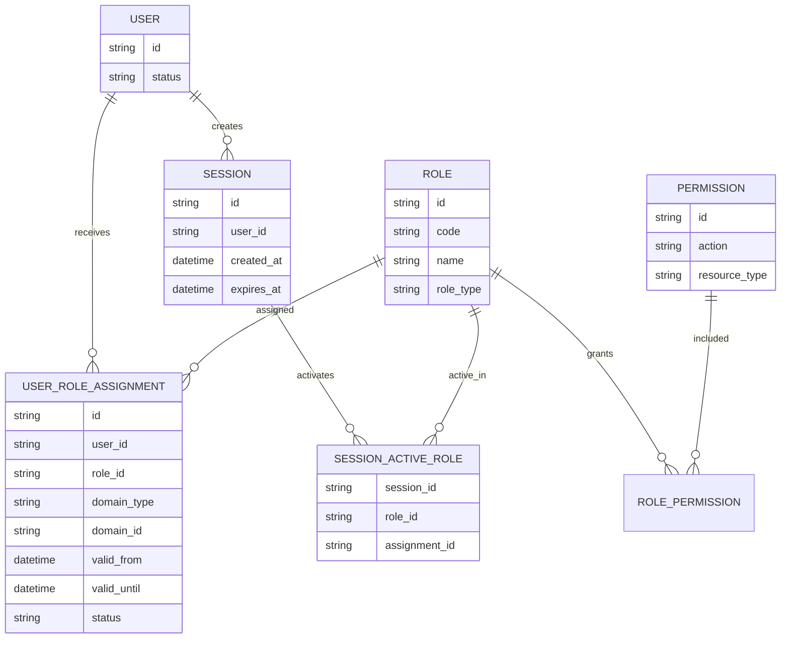
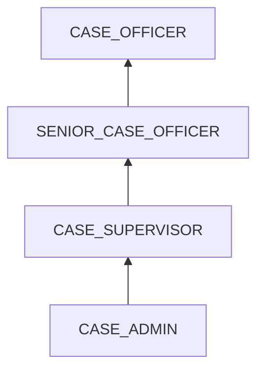
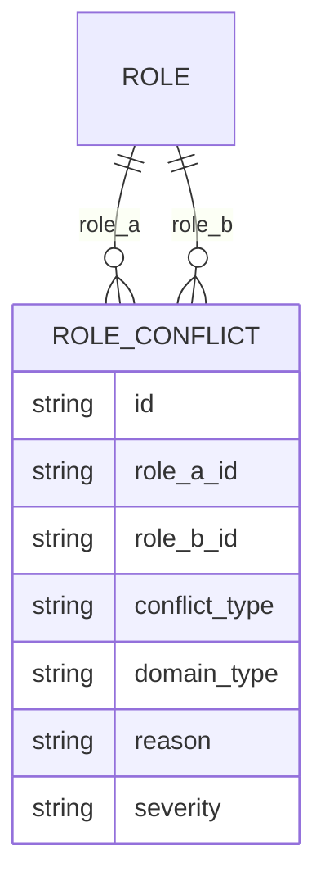
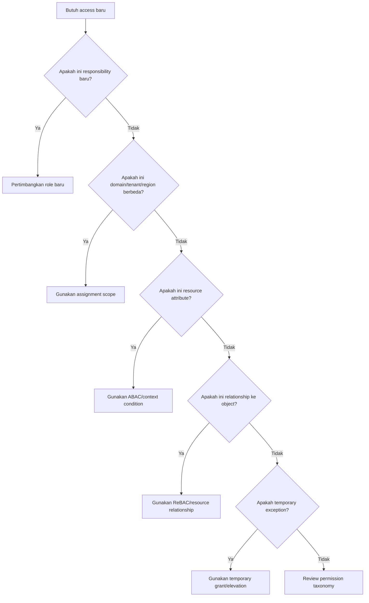
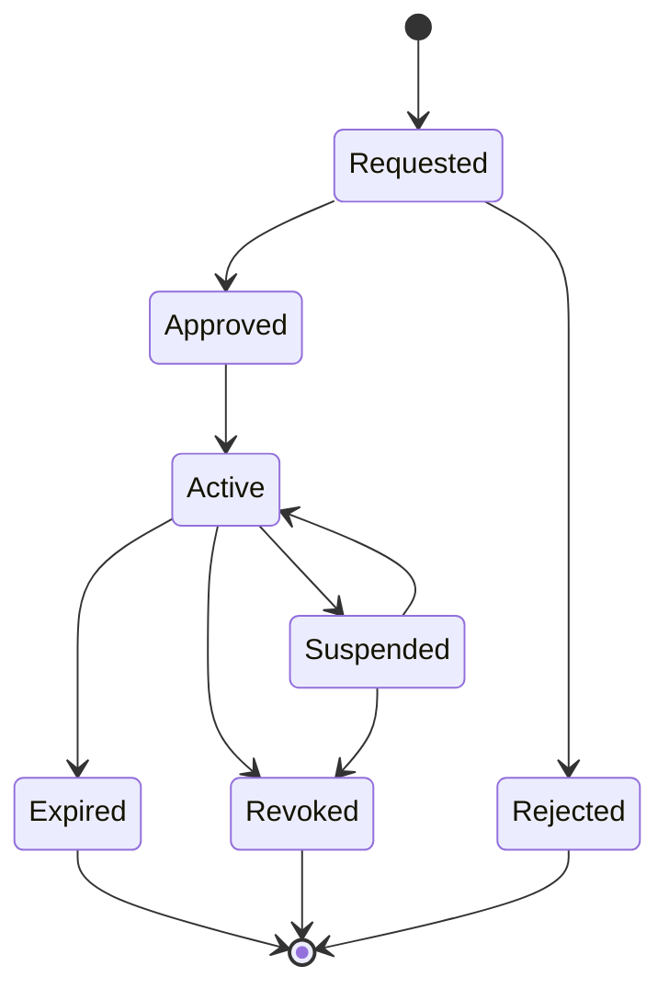
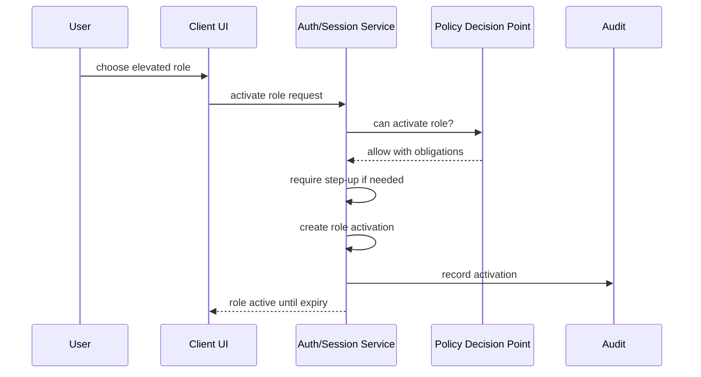
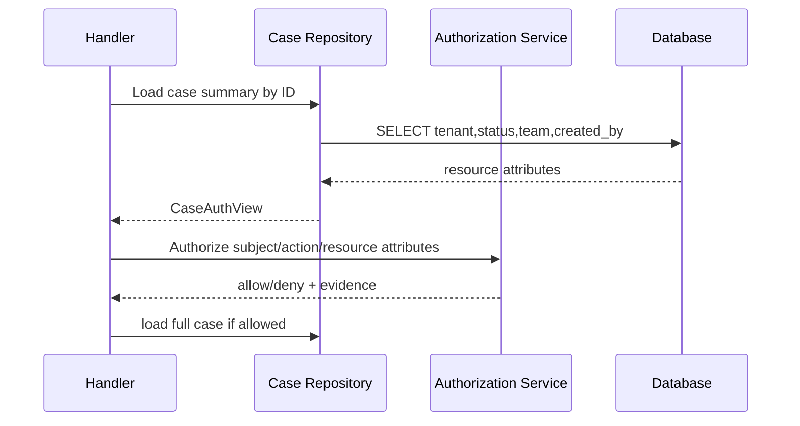
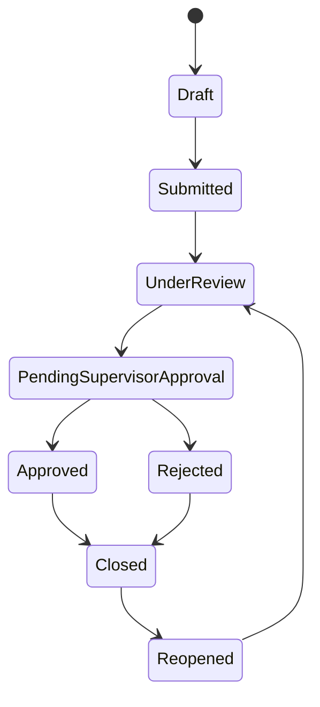
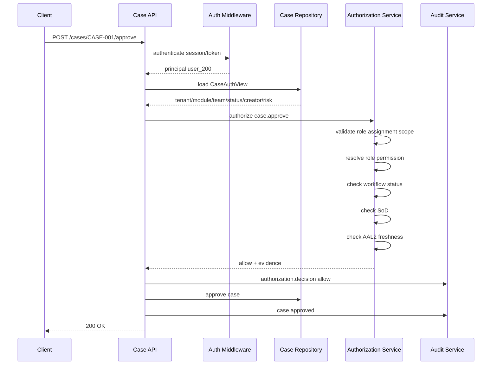

# learn-go-authentication-authorization-identity-permission-part-020.md

# Part 020 — RBAC yang Benar: Role Explosion, Hierarchy, Domain Role, Contextual Role

> Seri: `learn-go-authentication-authorization-identity-permission`  
> Level: Advanced / internal engineering handbook  
> Target pembaca: engineer yang sudah memahami Go, HTTP/gRPC service, SQL, distributed system, security basics, dan ingin mendesain authorization system yang benar-benar dapat dipakai di enterprise/regulatory systems.  
> Fokus part ini: **Role-Based Access Control yang benar**, bukan sekadar tabel `users_roles` dan `roles_permissions`.

---

## Daftar Isi

1. [Tujuan Part Ini](#1-tujuan-part-ini)
2. [Masalah Besar: Banyak Sistem Mengaku RBAC, Tapi Sebenarnya Hanya Role Flag](#2-masalah-besar-banyak-sistem-mengaku-rbac-tapi-sebenarnya-hanya-role-flag)
3. [Fondasi Formal RBAC](#3-fondasi-formal-rbac)
4. [Mental Model Utama](#4-mental-model-utama)
5. [RBAC Bukan Permission Model Lengkap](#5-rbac-bukan-permission-model-lengkap)
6. [Terminologi Presisi](#6-terminologi-presisi)
7. [Core RBAC: User, Role, Permission, Session](#7-core-rbac-user-role-permission-session)
8. [Hierarchical RBAC](#8-hierarchical-rbac)
9. [Static Separation of Duties](#9-static-separation-of-duties)
10. [Dynamic Separation of Duties](#10-dynamic-separation-of-duties)
11. [Domain Role: Role yang Berlaku Dalam Boundary Tertentu](#11-domain-role-role-yang-berlaku-dalam-boundary-tertentu)
12. [Contextual Role: Role yang Aktif Karena Konteks](#12-contextual-role-role-yang-aktif-karena-konteks)
13. [Role Engineering](#13-role-engineering)
14. [Role Explosion](#14-role-explosion)
15. [Toxic Combination dan Conflict Matrix](#15-toxic-combination-dan-conflict-matrix)
16. [RBAC untuk Multi-Tenant dan Regulatory Case Management](#16-rbac-untuk-multi-tenant-dan-regulatory-case-management)
17. [Role Assignment Lifecycle](#17-role-assignment-lifecycle)
18. [Role Activation dan Session Role](#18-role-activation-dan-session-role)
19. [Permission Naming dan Granularity](#19-permission-naming-dan-granularity)
20. [Data Model SQL](#20-data-model-sql)
21. [Go Domain Model](#21-go-domain-model)
22. [Authorization Decision Contract](#22-authorization-decision-contract)
23. [HTTP Middleware dan Route-Level RBAC](#23-http-middleware-dan-route-level-rbac)
24. [Resource-Level RBAC](#24-resource-level-rbac)
25. [Workflow-State RBAC](#25-workflow-state-rbac)
26. [Caching dan Staleness](#26-caching-dan-staleness)
27. [Auditability](#27-auditability)
28. [Testing Strategy](#28-testing-strategy)
29. [Migration dari Naive Role Flag ke Proper RBAC](#29-migration-dari-naive-role-flag-ke-proper-rbac)
30. [Anti-Pattern](#30-anti-pattern)
31. [Failure Mode Matrix](#31-failure-mode-matrix)
32. [Design Review Checklist](#32-design-review-checklist)
33. [Case Study End-to-End](#33-case-study-end-to-end)
34. [Ringkasan](#34-ringkasan)
35. [Referensi Primer](#35-referensi-primer)

---

## 1. Tujuan Part Ini

Setelah part ini, target pemahaman Anda bukan hanya:

> “RBAC adalah user punya role, role punya permission.”

Itu terlalu dangkal.

Target sebenarnya:

1. Anda bisa membedakan **role**, **permission**, **scope**, **entitlement**, **claim**, **policy**, dan **assignment**.
2. Anda bisa mendesain RBAC yang tahan terhadap **role explosion**.
3. Anda tahu kapan RBAC cukup, kapan harus dikombinasikan dengan ABAC/ReBAC.
4. Anda bisa memodelkan **role hierarchy**, **domain role**, **contextual role**, **temporary role**, dan **session role**.
5. Anda bisa menerapkan **separation of duties** secara eksplisit.
6. Anda bisa membuat Go package yang tidak mencampur business handler, middleware, dan policy logic.
7. Anda bisa membuat sistem authorization yang dapat diaudit secara defensible.
8. Anda bisa menjelaskan authorization decision dengan bentuk:

```text
Subject S can perform Action A on Resource R in Domain D under Context C because RoleAssignment X grants Permission P through PolicyVersion V.
```

Kalimat itu adalah inti sistem authorization enterprise.

---

## 2. Masalah Besar: Banyak Sistem Mengaku RBAC, Tapi Sebenarnya Hanya Role Flag

Contoh yang sering ditemukan:

```go
if user.Role == "admin" {
    allow()
}
```

Atau:

```go
if slices.Contains(user.Roles, "manager") {
    approveCase()
}
```

Masalahnya:

1. Role dianggap global.
2. Role dianggap sama dengan permission.
3. Tidak ada resource boundary.
4. Tidak ada tenant boundary.
5. Tidak ada action taxonomy.
6. Tidak ada audit reason.
7. Tidak ada separation of duties.
8. Tidak ada policy version.
9. Tidak ada assignment lifecycle.
10. Tidak ada model untuk “role aktif dalam sesi ini”.

Pada sistem kecil, ini terasa cukup. Pada sistem enterprise, ini menjadi sumber privilege escalation.

### 2.1 Contoh Bug Nyata Secara Model

Misalkan sistem punya role:

```text
ADMIN
OFFICER
SUPERVISOR
LEGAL_REVIEWER
FINANCE_REVIEWER
```

Lalu ada check:

```go
if principal.HasRole("SUPERVISOR") {
    return service.ApproveCase(ctx, caseID)
}
```

Pertanyaan yang hilang:

1. Supervisor untuk tenant/agency mana?
2. Supervisor untuk module apa?
3. Supervisor untuk case type apa?
4. Supervisor aktif dalam session ini atau hanya assigned?
5. Apakah supervisor boleh approve case yang dia sendiri submit?
6. Apakah case sedang berada di stage yang boleh diapprove?
7. Apakah dia supervisor dari team pemilik case?
8. Apakah role itu expired?
9. Apakah role itu temporary elevation?
10. Apakah approval perlu step-up auth?

Kalau 10 pertanyaan ini tidak terlihat dalam desain, berarti sistem belum benar-benar melakukan authorization. Ia baru melakukan **label checking**.

---

## 3. Fondasi Formal RBAC

Secara formal, RBAC berkembang dari model Ferraiolo-Kuhn dan model Sandhu dkk., lalu disatukan menjadi model NIST RBAC. NIST menjelaskan bahwa model tersebut menggabungkan gagasan dari berbagai model RBAC dan menjadi dasar standar ANSI/INCITS 359. RBAC bukan sekadar enum role; RBAC mempunyai relasi formal antara user, role, permission, session, hierarchy, dan separation of duties.

Model RBAC standar biasanya dibagi menjadi:

1. **Core RBAC**
2. **Hierarchical RBAC**
3. **Static Separation of Duty Relations**
4. **Dynamic Separation of Duty Relations**

Dalam bahasa engineering praktis:

```text
Core RBAC      = siapa mendapat role apa, role memberi permission apa.
Hierarchical   = role bisa mewarisi role lain.
Static SoD     = beberapa role tidak boleh dimiliki bersamaan.
Dynamic SoD    = beberapa role tidak boleh aktif bersamaan dalam session/action.
```

### 3.1 Kenapa Ini Penting?

Karena banyak sistem hanya mengimplementasikan bagian pertama secara parsial:

```text
user -> role
```

Padahal RBAC yang benar minimal membutuhkan:

```text
user -> role assignment -> role -> permission assignment -> permission
session -> active role subset
constraints -> allowed assignment/activation
```

---

## 4. Mental Model Utama

RBAC yang benar bukan menjawab:

> “User ini role-nya apa?”

Tetapi menjawab:

> “Role assignment mana yang sedang valid, dalam domain apa, memberi permission apa, untuk action/resource tertentu, dalam konteks request ini?”

### 4.1 Role Adalah Bundle of Authority

Role adalah paket otoritas yang sengaja dibentuk agar manusia tidak perlu mengelola permission satu per satu.

```text
Permission terlalu granular untuk dikelola langsung oleh manusia.
Role terlalu kasar untuk dijadikan satu-satunya dasar authorization.
Policy menyambungkan role ke konteks nyata.
```

Role yang baik adalah abstraction atas pekerjaan, tanggung jawab, atau authority.

Role yang buruk adalah abstraction atas UI menu.

### 4.2 Role Assignment Berbeda dari Role

Role:

```text
SUPERVISOR
```

Role assignment:

```text
User Fajar memiliki role SUPERVISOR untuk Agency A, Module Case Management, dari 2026-01-01 sampai 2026-12-31, diberikan oleh Admin X, berdasarkan approval Y.
```

Dalam sistem enterprise, authorization jarang bergantung pada role saja. Ia bergantung pada **role assignment**.

### 4.3 Permission Adalah Kemampuan Melakukan Action

Permission harus menjawab:

```text
Can perform what action on what kind of resource?
```

Contoh:

```text
case.read
case.create
case.update
case.submit
case.approve
case.reopen
case.assign
case.close
case.export
```

Permission tidak seharusnya seperti:

```text
CAN_ACCESS_BUTTON_BLUE
MENU_CASE_MANAGEMENT_VISIBLE
IS_SUPERVISOR
```

Itu UI/role flag, bukan permission domain.

---

## 5. RBAC Bukan Permission Model Lengkap

RBAC kuat untuk mengelola **authority by job function**.

RBAC lemah untuk:

1. object ownership,
2. tenant hierarchy,
3. relationship graph,
4. dynamic risk,
5. resource state,
6. time-based conditions,
7. field-level rules,
8. contextual workflow rule.

Karena itu, OWASP Authorization Cheat Sheet merekomendasikan mempertimbangkan ABAC dan ReBAC untuk sistem yang membutuhkan authorization lebih kontekstual dan fine-grained.

### 5.1 Contoh Kelemahan RBAC Murni

Rule:

```text
Role CASE_OFFICER has permission case.update.
```

Pertanyaan:

```text
Case officer mana boleh update case mana?
```

RBAC murni tidak cukup menjawab ini tanpa tambahan domain/context.

Butuh kombinasi:

```text
role = CASE_OFFICER
permission = case.update
resource.tenant_id == assignment.tenant_id
resource.assigned_team_id in subject.team_ids
resource.status in [DRAFT, RETURNED]
```

Yang pertama RBAC. Sisanya ABAC/ReBAC/contextual policy.

### 5.2 Prinsip Praktis

Gunakan RBAC untuk:

```text
What kind of authority does this subject have?
```

Gunakan ABAC untuk:

```text
Under which attributes/conditions?
```

Gunakan ReBAC untuk:

```text
Because of which relationship to the resource?
```

Gunakan workflow policy untuk:

```text
At which lifecycle state is this action legal?
```

---

## 6. Terminologi Presisi

| Istilah | Definisi | Contoh | Kesalahan Umum |
|---|---|---|---|
| User | Entitas manusia internal sistem | `user_123` | Disamakan dengan identity provider subject |
| Subject | Entitas yang meminta akses | human, service, delegated actor | Dianggap selalu user manusia |
| Principal | Representasi authenticated subject di runtime | `Principal{SubjectID, TenantID}` | Diisi langsung dari JWT tanpa validasi domain |
| Role | Paket authority | `CASE_SUPERVISOR` | Disamakan dengan permission |
| Permission | Kemampuan melakukan action | `case.approve` | Dibuat berdasarkan UI button |
| Role Assignment | Pemberian role ke subject dalam boundary tertentu | user A punya role B di tenant C | Tidak punya expiry/audit |
| Role Activation | Role yang dipakai dalam session/request | active role subset | Semua role otomatis aktif |
| Domain | Boundary tempat role berlaku | tenant, agency, module, team | Role dibuat global tanpa domain |
| Constraint | Syarat pembatas assignment/activation | mutually exclusive roles | Tidak dimodelkan |
| Entitlement | Hak efektif setelah policy dievaluasi | bisa approve case X | Disimpan statis tanpa invalidasi |
| Policy | Aturan evaluasi access | deny if own-submitted case | Disembunyikan dalam handler |
| Scope | Delegated OAuth permission hint | `case:read` | Disamakan dengan internal permission |
| Claim | Pernyataan dalam token | `sub`, `aud`, `tenant` | Dipercaya sebagai sumber kebenaran mutlak |

---

## 7. Core RBAC: User, Role, Permission, Session

Core RBAC minimal memiliki relasi:

```text
User many-to-many Role
Role many-to-many Permission
User establishes Session
Session activates subset of User's assigned Roles
```

Diagram:



### 7.1 Core Rule

Authorization decision tidak boleh hanya:

```text
user has role
```

Tetapi:

```text
user has valid role assignment
role assignment applies to request domain
role grants required permission
role is active or activatable in this request
constraints do not deny access
```

### 7.2 Session Role Subset

Kenapa session penting?

Karena user bisa punya banyak role, tetapi tidak semua role harus aktif pada saat yang sama.

Contoh:

```text
User: Alice
Assigned roles:
- CASE_OFFICER
- FINANCE_REVIEWER
- EMERGENCY_ADMIN
```

Pada session normal, `EMERGENCY_ADMIN` tidak boleh aktif otomatis. Ia harus diaktifkan lewat step-up, reason code, approval, expiry, dan audit.

---

## 8. Hierarchical RBAC

Role hierarchy memungkinkan satu role mewarisi permission dari role lain.

Contoh:

```text
SENIOR_CASE_OFFICER inherits CASE_OFFICER
CASE_SUPERVISOR inherits SENIOR_CASE_OFFICER
CASE_ADMIN inherits CASE_SUPERVISOR
```

Diagram:



Artinya:

```text
CASE_ADMIN memperoleh permission langsungnya sendiri + permission dari CASE_SUPERVISOR + SENIOR_CASE_OFFICER + CASE_OFFICER.
```

### 8.1 Manfaat Hierarchy

1. Mengurangi duplikasi permission assignment.
2. Membuat role lebih mudah dipahami.
3. Mendukung model seniority.
4. Mendukung delegated administration.
5. Memudahkan audit jika hierarchy stabil.

### 8.2 Bahaya Hierarchy

Hierarchy berbahaya jika dipakai sembarangan:

```text
SUPER_ADMIN inherits EVERYTHING
```

Masalah:

1. Privilege terlalu luas.
2. Audit menjadi kabur.
3. SoD sulit dijaga.
4. Toxic combination tersembunyi.
5. Perubahan role bawah bisa menaikkan privilege role atas tanpa review yang cukup.

### 8.3 Transitive Permission Harus Dapat Dijelaskan

Jika user boleh `case.export`, sistem harus bisa menjawab:

```text
Why allowed?

User U has assignment A to role CASE_ADMIN.
CASE_ADMIN inherits CASE_SUPERVISOR.
CASE_SUPERVISOR inherits SENIOR_CASE_OFFICER.
SENIOR_CASE_OFFICER grants permission case.export.
Assignment A applies to tenant T and module CASE.
No deny constraint matched.
```

Kalau decision tidak bisa dijelaskan, hierarchy Anda terlalu gelap.

### 8.4 Cycle Detection

Role hierarchy harus acyclic.

Bug:

```text
A inherits B
B inherits C
C inherits A
```

Di Go, jangan resolve hierarchy dengan recursive function tanpa visited set.

```go
func ResolveRoleClosure(roleID RoleID, edges map[RoleID][]RoleID) ([]RoleID, error) {
	visited := map[RoleID]bool{}
	visiting := map[RoleID]bool{}
	var out []RoleID

	var dfs func(RoleID) error
	dfs = func(r RoleID) error {
		if visiting[r] {
			return fmt.Errorf("role hierarchy cycle at role %s", r)
		}
		if visited[r] {
			return nil
		}
		visiting[r] = true
		for _, parent := range edges[r] {
			if err := dfs(parent); err != nil {
				return err
			}
		}
		visiting[r] = false
		visited[r] = true
		out = append(out, r)
		return nil
	}

	if err := dfs(roleID); err != nil {
		return nil, err
	}
	return out, nil
}
```

---

## 9. Static Separation of Duties

Static Separation of Duties berarti beberapa role **tidak boleh dimiliki bersamaan** oleh subject yang sama dalam boundary yang sama.

Contoh:

```text
CASE_SUBMITTER dan CASE_APPROVER tidak boleh assigned ke user yang sama untuk tenant dan case type yang sama.
```

### 9.1 Kenapa Static SoD Penting?

Tanpa SoD:

1. User bisa membuat dan menyetujui request sendiri.
2. User bisa melakukan end-to-end fraud tanpa second party.
3. Admin bisa grant dirinya role sensitif.
4. Sistem audit kehilangan defensibility.

### 9.2 Model Static SoD



Contoh table:

| Role A | Role B | Domain | Reason |
|---|---|---|---|
| `CASE_SUBMITTER` | `CASE_APPROVER` | tenant+case_type | prevent self-approval |
| `PAYMENT_PREPARER` | `PAYMENT_RELEASE_APPROVER` | tenant | prevent payment fraud |
| `USER_ADMIN` | `AUDIT_ADMIN` | tenant | prevent audit tampering |
| `POLICY_AUTHOR` | `POLICY_APPROVER` | policy domain | prevent self-approved policy |

### 9.3 Static SoD Check Saat Assignment

Saat admin memberi role:

```text
new assignment = user U gets role R in domain D
```

Sistem harus cek:

```text
existing active assignments for U in D
conflict matrix
if any conflict -> reject or require exception workflow
```

Go interface:

```go
type RoleConflictChecker interface {
	CheckAssignment(ctx context.Context, req CheckRoleAssignmentRequest) (*ConflictResult, error)
}

type CheckRoleAssignmentRequest struct {
	SubjectID SubjectID
	RoleID    RoleID
	Domain    DomainRef
	At        time.Time
}

type ConflictResult struct {
	Allowed   bool
	Conflicts []RoleConflict
}
```

### 9.4 Static SoD Bukan Hanya Pairwise

Kadang conflict bukan hanya dua role.

Contoh:

```text
User tidak boleh punya lebih dari 2 dari 3 role berikut:
- POLICY_AUTHOR
- POLICY_TESTER
- POLICY_APPROVER
```

Ini cardinality constraint.

```go
type CardinalityConstraint struct {
	RoleSet []RoleID
	Max     int
	Domain  DomainPattern
}
```

---

## 10. Dynamic Separation of Duties

Dynamic Separation of Duties berarti beberapa role boleh dimiliki oleh user yang sama, tetapi **tidak boleh aktif bersamaan** dalam sesi atau transaksi tertentu.

Contoh:

```text
User boleh punya role REQUESTER dan APPROVER, tetapi tidak boleh approve request yang dia buat sendiri.
```

Atau:

```text
User boleh punya role CASE_OFFICER dan CASE_SUPERVISOR, tetapi saat acting sebagai officer untuk case X, dia tidak boleh sekaligus acting sebagai supervisor untuk approval case X.
```

### 10.1 Perbedaan Static vs Dynamic SoD

| Aspek | Static SoD | Dynamic SoD |
|---|---|---|
| Kapan dicek | Saat assignment | Saat session/action |
| Melarang | Role dimiliki bersamaan | Role aktif/digunakan bersamaan |
| Cocok untuk | Toxic role ownership | Self-approval, transaction conflict |
| Contoh | Tidak boleh punya `USER_ADMIN` dan `AUDIT_ADMIN` | Tidak boleh approve item yang dibuat sendiri |

### 10.2 Go Decision Check

```go
type DynamicSODChecker interface {
	Check(ctx context.Context, input DynamicSODInput) (*DynamicSODResult, error)
}

type DynamicSODInput struct {
	SubjectID   SubjectID
	ActorID     SubjectID
	Action      Action
	Resource    ResourceRef
	ActiveRoles []ActiveRole
	Attributes  map[string]any
	At          time.Time
}

type DynamicSODResult struct {
	Allowed bool
	Reason  string
}
```

Contoh rule:

```go
if input.Action == "case.approve" && input.Attributes["created_by"] == input.SubjectID {
	return &DynamicSODResult{
		Allowed: false,
		Reason:  "creator cannot approve own case",
	}, nil
}
```

Dalam sistem matang, rule seperti ini sebaiknya bukan hardcoded tersebar di handler. Ia harus berada di PDP/policy layer.

---

## 11. Domain Role: Role yang Berlaku Dalam Boundary Tertentu

Global role adalah sumber banyak bug.

Buruk:

```text
Alice has SUPERVISOR.
```

Lebih benar:

```text
Alice has CASE_SUPERVISOR in tenant=CEA, module=ENFORCEMENT, team=InspectionTeamA.
```

### 11.1 Domain Role Model

Domain role berarti role assignment punya boundary.

Boundary bisa berupa:

1. tenant,
2. organization,
3. agency,
4. department,
5. team,
6. module,
7. case type,
8. region,
9. project,
10. environment.

### 11.2 DomainRef

```go
type DomainType string

const (
	DomainGlobal       DomainType = "global"
	DomainTenant       DomainType = "tenant"
	DomainOrganization DomainType = "organization"
	DomainTeam         DomainType = "team"
	DomainModule       DomainType = "module"
	DomainCaseType     DomainType = "case_type"
)

type DomainRef struct {
	Type DomainType
	ID   string
}
```

Untuk enterprise, satu assignment sering perlu multi-dimensional domain:

```go
type RoleScope struct {
	TenantID *TenantID
	OrgID    *OrgID
	TeamID   *TeamID
	Module   *string
	CaseType *string
}
```

### 11.3 Domain Matching

Role assignment berlaku jika scope assignment mencakup scope request.

```text
assignment: tenant=CEA, module=CASE
request:    tenant=CEA, module=CASE, case_id=123
=> match
```

```text
assignment: tenant=CEA
request:    tenant=CPDS
=> no match
```

```go
func (s RoleScope) Matches(req ResourceScope) bool {
	if s.TenantID != nil && req.TenantID != nil && *s.TenantID != *req.TenantID {
		return false
	}
	if s.Module != nil && req.Module != nil && *s.Module != *req.Module {
		return false
	}
	if s.CaseType != nil && req.CaseType != nil && *s.CaseType != *req.CaseType {
		return false
	}
	return true
}
```

### 11.4 Domain Role Anti-Pattern

```text
Role name encodes domain:
- CEA_CASE_SUPERVISOR
- CPDS_CASE_SUPERVISOR
- CEA_FINANCE_ADMIN
- CPDS_FINANCE_ADMIN
```

Ini mempercepat role explosion.

Lebih baik:

```text
role = CASE_SUPERVISOR
assignment.scope.tenant = CEA
```

Role tetap generic. Scope ada di assignment.

---

## 12. Contextual Role: Role yang Aktif Karena Konteks

Contextual role adalah role yang hanya aktif jika konteks tertentu terpenuhi.

Contoh:

```text
Duty Officer hanya aktif saat shift.
Incident Commander hanya aktif saat incident tertentu.
Emergency Admin hanya aktif saat break-glass session.
Appeal Reviewer hanya aktif saat assigned ke appeal case tertentu.
```

### 12.1 Contextual Role ≠ Permanent Role

Buruk:

```text
User diberi role INCIDENT_COMMANDER selamanya.
```

Lebih benar:

```text
User assigned as INCIDENT_COMMANDER for incident INC-2026-001 from T1 to T2.
```

### 12.2 Context Fields

```go
type ContextualActivation struct {
	AssignmentID RoleAssignmentID
	ActivatedAt  time.Time
	ExpiresAt    time.Time
	Reason       string
	TicketID     *string
	ApprovedBy   *SubjectID
	StepUpRef    *string
}
```

### 12.3 Break-Glass Role

Break-glass adalah contextual role paling sensitif.

Harus punya:

1. explicit activation,
2. reason code,
3. short TTL,
4. step-up auth,
5. notification,
6. full audit,
7. post-event review,
8. automatic expiry,
9. restricted permission set,
10. strong anomaly detection.

Jangan buat break-glass sebagai:

```text
role=SUPER_ADMIN permanent=true
```

Itu bukan break-glass. Itu backdoor administratif.

---

## 13. Role Engineering

Role engineering adalah proses mendesain role berdasarkan kebutuhan organisasi dan sistem.

Ada dua pendekatan umum:

1. **Top-down**: role dirancang dari job function, policy, dan business process.
2. **Bottom-up**: role diturunkan dari access log atau permission usage yang ada.

Dalam sistem besar, biasanya dipakai hybrid.

### 13.1 Top-Down Role Engineering

Langkah:

1. Identifikasi business capabilities.
2. Identifikasi actors/job functions.
3. Identifikasi resources.
4. Identifikasi actions.
5. Kelompokkan permission menjadi role.
6. Tentukan domain boundary.
7. Tentukan SoD.
8. Validasi dengan owner proses.
9. Uji dengan scenario nyata.
10. Review privilege creep.

### 13.2 Bottom-Up Role Mining

Input:

```text
historical access log
existing permission assignment
manual approval record
job title
department/team
```

Output:

```text
candidate roles
candidate permission bundles
outliers
excessive access
unused permission
```

Bahaya bottom-up:

1. Mewarisi privilege yang sudah salah.
2. Mengabadikan access creep.
3. Menganggap historical usage sebagai policy benar.
4. Menghasilkan role yang terlalu spesifik.

### 13.3 Role Design Heuristics

Role yang baik:

1. mudah dijelaskan dalam satu kalimat,
2. stabil terhadap perubahan UI,
3. merepresentasikan responsibility,
4. punya owner,
5. punya permission minimal,
6. punya domain scope,
7. punya lifecycle,
8. punya SoD review,
9. dapat diaudit,
10. tidak mengandung nama orang.

Role yang buruk:

```text
FajarSpecialAccess
CanClickApproveButton
AdminButNotFinanceExceptReport
Officer2024MigrationTemp
CaseReadWriteDeleteExportApproveAll
```

---

## 14. Role Explosion

Role explosion terjadi ketika jumlah role tumbuh tidak terkendali karena role dipakai untuk meng-encode terlalu banyak dimensi.

### 14.1 Penyebab Role Explosion

1. Tenant dimasukkan ke role name.
2. Region dimasukkan ke role name.
3. Module dimasukkan ke role name.
4. Workflow state dimasukkan ke role name.
5. Case type dimasukkan ke role name.
6. Permission minor dibuat menjadi role baru.
7. Temporary exception dibuat role permanen.
8. UI button dibuat role.
9. Personal exception dibuat role.
10. Tidak ada role owner dan review.

Contoh ledakan:

```text
AGENCY_A_CASE_APPROVER
AGENCY_B_CASE_APPROVER
AGENCY_C_CASE_APPROVER
AGENCY_A_APPEAL_APPROVER
AGENCY_B_APPEAL_APPROVER
AGENCY_C_APPEAL_APPROVER
REGION_NORTH_AGENCY_A_CASE_APPROVER
REGION_SOUTH_AGENCY_A_CASE_APPROVER
...
```

Jika ada:

```text
10 agencies × 8 modules × 5 levels × 4 regions × 3 case types = 4,800 roles
```

Ini bukan authorization. Ini combinatorial accident.

### 14.2 Cara Menghindari Role Explosion

Pisahkan dimensi:

```text
Role       = CASE_APPROVER
Tenant     = assignment scope
Region     = assignment scope / attribute
Module     = permission/resource type
Case Type  = resource attribute
Level      = role hierarchy atau approval limit attribute
```

Dari:

```text
CEA_NORTH_CASE_APPROVER_LEVEL_2_SALES_PERSON
```

Menjadi:

```text
role: CASE_APPROVER
scope: tenant=CEA, region=NORTH
constraints: case_type=SALES_PERSON, approval_limit=LEVEL_2
```

### 14.3 Role Explosion Smell

Anda punya role explosion jika:

1. role count tumbuh lebih cepat dari employee count,
2. role name mengandung banyak underscore,
3. banyak role hanya berbeda satu permission,
4. banyak role hanya berbeda tenant/region,
5. permission review sulit dijelaskan,
6. user sering punya puluhan role,
7. admin tidak tahu role mana yang harus diberikan,
8. audit tidak bisa menjelaskan authority dengan jelas,
9. UI access matrix terlalu besar untuk direview,
10. role cleanup tidak pernah dilakukan.

### 14.4 Decision Tree



---

## 15. Toxic Combination dan Conflict Matrix

Toxic combination adalah kombinasi role/permission yang jika dimiliki bersamaan menciptakan risiko berlebih.

Contoh:

```text
USER_ADMIN + AUDIT_LOG_ADMIN
POLICY_AUTHOR + POLICY_APPROVER
CASE_CREATOR + CASE_APPROVER
PAYMENT_MAKER + PAYMENT_APPROVER
REPORT_EXPORTER + DATA_MASKING_ADMIN
```

### 15.1 Conflict Matrix

```text
role_conflicts
- role_a
- role_b
- conflict_type
- domain_pattern
- severity
- enforcement_mode
- exception_allowed
```

Enforcement mode:

```text
HARD_DENY
REQUIRE_APPROVAL
REQUIRE_BREAK_GLASS
WARN_AND_AUDIT
```

### 15.2 Toxic Permission Combination

Kadang conflict bukan role, tapi permission efektif.

Contoh:

```text
user.manage.create
user.manage.assign_role
user.manage.disable_mfa
audit.delete
```

Jika dimiliki bersama, berbahaya meskipun role berbeda.

Maka review harus dilakukan pada dua level:

```text
role combination
permission closure combination
```

### 15.3 Go Representation

```go
type ConflictType string

const (
	ConflictStaticOwnership ConflictType = "static_ownership"
	ConflictDynamicAction   ConflictType = "dynamic_action"
	ConflictPermissionSet   ConflictType = "permission_set"
)

type EnforcementMode string

const (
	EnforcementHardDeny        EnforcementMode = "hard_deny"
	EnforcementRequireApproval EnforcementMode = "require_approval"
	EnforcementBreakGlass      EnforcementMode = "break_glass"
	EnforcementWarnAudit       EnforcementMode = "warn_audit"
)

type ConflictRule struct {
	ID               string
	Type             ConflictType
	RoleA            *RoleID
	RoleB            *RoleID
	PermissionSet    []Permission
	DomainPattern    DomainPattern
	Severity         string
	EnforcementMode  EnforcementMode
	ExceptionAllowed bool
	Reason           string
}
```

---

## 16. RBAC untuk Multi-Tenant dan Regulatory Case Management

Dalam regulatory case management, role biasanya tidak global.

Contoh actor:

1. public applicant,
2. agency officer,
3. case officer,
4. senior officer,
5. supervisor,
6. legal reviewer,
7. finance officer,
8. enforcement officer,
9. admin,
10. auditor,
11. external agency user,
12. service account.

### 16.1 Tenant Boundary

Resource:

```text
case.case_id = C-001
case.tenant_id = CEA
case.module = ENFORCEMENT
case.status = PENDING_SUPERVISOR_APPROVAL
case.created_by = user_123
case.assigned_team_id = team_456
```

Role assignment:

```text
user_999 has CASE_SUPERVISOR scope tenant=CEA module=ENFORCEMENT team=team_456
```

Decision:

```text
allow if:
- user has CASE_SUPERVISOR assignment,
- assignment tenant matches case tenant,
- assignment module matches case module,
- assignment team covers case assigned team,
- role grants case.approve,
- case.status allows approval,
- user is not case.created_by,
- step-up assurance satisfies policy.
```

Ini bukan RBAC murni. Ini RBAC + domain scope + workflow policy + SoD + assurance.

### 16.2 Regulatory Invariant

Untuk aksi penting, audit harus bisa merekonstruksi:

```text
who acted,
as whom,
under what assignment,
on which resource,
with which permission,
under which policy version,
with which authentication assurance,
with which request context,
with which result.
```

---

## 17. Role Assignment Lifecycle

Role assignment bukan row abadi.

State minimal:

```text
REQUESTED
APPROVED
ACTIVE
SUSPENDED
EXPIRED
REVOKED
REJECTED
```

Diagram:



### 17.1 Assignment Fields

```text
id
subject_id
role_id
domain_scope
status
valid_from
valid_until
requested_by
approved_by
approval_reference
created_at
updated_at
revoked_at
revoked_by
revocation_reason
source
policy_version
```

### 17.2 Source of Assignment

Assignment bisa berasal dari:

1. manual admin,
2. HR system,
3. SCIM provisioning,
4. external IdP group mapping,
5. temporary elevation workflow,
6. break-glass,
7. migration script,
8. service account bootstrap.

Source penting untuk audit dan deprovisioning.

### 17.3 Deprovisioning

Ketika user pindah team atau keluar organisasi:

1. role assignment harus suspended/revoked,
2. active session harus dievaluasi ulang,
3. refresh token harus dicabut jika authority berubah drastis,
4. cached permission harus invalidated,
5. audit harus mencatat source event.

---

## 18. Role Activation dan Session Role

Tidak semua assigned role harus aktif pada request.

### 18.1 Active Role Subset

Session dapat memiliki role aktif:

```go
type ActiveRole struct {
	RoleID       RoleID
	AssignmentID RoleAssignmentID
	ActivatedAt  time.Time
	ExpiresAt    *time.Time
	ActivationReason string
}
```

### 18.2 Kenapa Butuh Role Activation?

1. Least privilege during normal browsing.
2. Mengurangi dampak session hijack.
3. Mendukung break-glass.
4. Mendukung dynamic SoD.
5. Mendukung audit “acting as role X”.
6. Mendukung step-up only when needed.

### 18.3 Role Activation Flow



### 18.4 Role Activation Must Be Audited

Audit event:

```json
{
  "event_type": "role.activation",
  "subject_id": "user_123",
  "role_id": "break_glass_admin",
  "assignment_id": "assign_789",
  "reason": "production incident INC-2026-001",
  "approved_by": "user_456",
  "expires_at": "2026-06-24T13:30:00Z",
  "assurance": "AAL2",
  "result": "success"
}
```

---

## 19. Permission Naming dan Granularity

Permission harus stabil, domain-relevant, dan cukup granular.

### 19.1 Format Permission

Rekomendasi:

```text
<resource_type>.<action>
```

Contoh:

```text
case.read
case.create
case.update
case.submit
case.assign
case.approve
case.reject
case.reopen
case.close
case.export
case.delete
```

Untuk subdomain:

```text
case.note.create
case.note.read
case.document.upload
case.document.delete
case.decision.approve
case.decision.publish
```

### 19.2 Hindari Permission Berbasis UI

Buruk:

```text
menu.case.visible
button.approve.enabled
tab.finance.show
```

Lebih baik:

```text
case.read
case.approve
finance.report.read
```

UI harus derive dari permission, bukan permission mengikuti UI.

### 19.3 Action Taxonomy

Umum:

```text
read
create
update
delete
list
search
export
import
submit
approve
reject
assign
unassign
reopen
close
archive
restore
```

Sensitive:

```text
impersonate
break_glass
manage_role
manage_policy
rotate_key
disable_mfa
view_secret
export_pii
```

### 19.4 Granularity Trade-Off

Terlalu kasar:

```text
case.manage
```

Masalah: siapa pun dengan `case.manage` mungkin bisa approve, delete, export.

Terlalu granular:

```text
case.update.title
case.update.description
case.update.priority
case.update.internalComment
```

Masalah: admin overhead tinggi.

Prinsip:

```text
Buat permission berbeda jika risk, audit, owner, approval, atau lifecycle-nya berbeda.
```

---

## 20. Data Model SQL

Berikut model SQL konseptual. Sesuaikan dengan database Anda.

```sql
CREATE TABLE roles (
    id              VARCHAR(64) PRIMARY KEY,
    code            VARCHAR(128) NOT NULL UNIQUE,
    name            VARCHAR(255) NOT NULL,
    description     TEXT,
    role_type       VARCHAR(32) NOT NULL,
    status          VARCHAR(32) NOT NULL,
    owner_team      VARCHAR(128),
    created_at      TIMESTAMP NOT NULL,
    updated_at      TIMESTAMP NOT NULL
);

CREATE TABLE permissions (
    id              VARCHAR(64) PRIMARY KEY,
    resource_type   VARCHAR(128) NOT NULL,
    action          VARCHAR(128) NOT NULL,
    description     TEXT,
    risk_level      VARCHAR(32) NOT NULL,
    created_at      TIMESTAMP NOT NULL,
    UNIQUE(resource_type, action)
);

CREATE TABLE role_permissions (
    role_id         VARCHAR(64) NOT NULL,
    permission_id   VARCHAR(64) NOT NULL,
    granted_at      TIMESTAMP NOT NULL,
    granted_by      VARCHAR(64),
    PRIMARY KEY(role_id, permission_id)
);

CREATE TABLE role_inheritance (
    child_role_id   VARCHAR(64) NOT NULL,
    parent_role_id  VARCHAR(64) NOT NULL,
    created_at      TIMESTAMP NOT NULL,
    created_by      VARCHAR(64),
    PRIMARY KEY(child_role_id, parent_role_id),
    CHECK(child_role_id <> parent_role_id)
);

CREATE TABLE role_assignments (
    id              VARCHAR(64) PRIMARY KEY,
    subject_id      VARCHAR(64) NOT NULL,
    subject_type    VARCHAR(32) NOT NULL,
    role_id         VARCHAR(64) NOT NULL,
    tenant_id       VARCHAR(64),
    org_id          VARCHAR(64),
    team_id         VARCHAR(64),
    module_code     VARCHAR(128),
    case_type       VARCHAR(128),
    status          VARCHAR(32) NOT NULL,
    valid_from      TIMESTAMP NOT NULL,
    valid_until     TIMESTAMP,
    requested_by    VARCHAR(64),
    approved_by     VARCHAR(64),
    source          VARCHAR(64) NOT NULL,
    reason          TEXT,
    created_at      TIMESTAMP NOT NULL,
    updated_at      TIMESTAMP NOT NULL
);

CREATE INDEX idx_role_assignments_subject
ON role_assignments(subject_id, status, valid_from, valid_until);

CREATE INDEX idx_role_assignments_scope
ON role_assignments(tenant_id, org_id, team_id, module_code, case_type);

CREATE TABLE role_conflicts (
    id               VARCHAR(64) PRIMARY KEY,
    role_a_id         VARCHAR(64) NOT NULL,
    role_b_id         VARCHAR(64) NOT NULL,
    conflict_type     VARCHAR(64) NOT NULL,
    enforcement_mode  VARCHAR(64) NOT NULL,
    domain_pattern    TEXT,
    severity          VARCHAR(32) NOT NULL,
    reason            TEXT NOT NULL,
    active            BOOLEAN NOT NULL,
    created_at        TIMESTAMP NOT NULL,
    CHECK(role_a_id <> role_b_id)
);

CREATE TABLE role_activation_events (
    id              VARCHAR(64) PRIMARY KEY,
    session_id      VARCHAR(64) NOT NULL,
    subject_id      VARCHAR(64) NOT NULL,
    role_id         VARCHAR(64) NOT NULL,
    assignment_id   VARCHAR(64) NOT NULL,
    activated_at    TIMESTAMP NOT NULL,
    expires_at      TIMESTAMP,
    reason          TEXT,
    step_up_ref     VARCHAR(128),
    result          VARCHAR(32) NOT NULL
);
```

### 20.1 Important Database Constraints

1. Role code unique.
2. Permission resource/action unique.
3. Role inheritance cannot self-reference.
4. Role hierarchy must be cycle-checked in application or recursive query.
5. Assignment status must be controlled enum.
6. Assignment validity must have clear time semantics.
7. Static SoD may need transaction-level enforcement.

### 20.2 Race Condition Saat Assignment

Dua admin bisa memberi role conflicting secara bersamaan.

Mitigasi:

1. transaction isolation,
2. advisory lock by subject+domain,
3. conflict check dalam transaction,
4. unique constraint untuk role assignment tertentu,
5. audit both attempt and result.

Pseudo:

```go
func (s *RoleAssignmentService) AssignRole(ctx context.Context, cmd AssignRoleCommand) error {
	return s.tx.WithTx(ctx, func(ctx context.Context) error {
		lockKey := fmt.Sprintf("role-assign:%s:%s", cmd.SubjectID, cmd.Scope.LockKey())
		if err := s.locks.Acquire(ctx, lockKey); err != nil {
			return err
		}

		existing, err := s.repo.ListActiveAssignmentsForUpdate(ctx, cmd.SubjectID, cmd.Scope)
		if err != nil {
			return err
		}

		conflict, err := s.conflicts.CheckStatic(ctx, cmd.RoleID, existing, cmd.Scope)
		if err != nil {
			return err
		}
		if !conflict.Allowed {
			return ErrRoleConflict{Conflicts: conflict.Conflicts}
		}

		return s.repo.InsertAssignment(ctx, cmd.ToAssignment())
	})
}
```

---

## 21. Go Domain Model

### 21.1 Strong Types

Jangan gunakan string mentah di semua tempat.

```go
type SubjectID string
type RoleID string
type PermissionID string
type TenantID string
type AssignmentID string

type ResourceType string
type Action string

type Permission struct {
	Resource ResourceType
	Action   Action
}
```

### 21.2 Role

```go
type Role struct {
	ID          RoleID
	Code        string
	Name        string
	Description string
	Type        RoleType
	Status      RoleStatus
	OwnerTeam   string
}

type RoleType string

const (
	RoleTypeBusiness RoleType = "business"
	RoleTypeSystem   RoleType = "system"
	RoleTypeAdmin    RoleType = "admin"
	RoleTypeBreakGlass RoleType = "break_glass"
)
```

### 21.3 Role Assignment

```go
type RoleAssignment struct {
	ID          AssignmentID
	SubjectID   SubjectID
	SubjectType SubjectType
	RoleID      RoleID
	Scope       RoleScope
	Status      AssignmentStatus
	ValidFrom   time.Time
	ValidUntil  *time.Time
	Source      AssignmentSource
	Reason      string
	ApprovedBy  *SubjectID
}

func (a RoleAssignment) IsActiveAt(t time.Time) bool {
	if a.Status != AssignmentActive {
		return false
	}
	if t.Before(a.ValidFrom) {
		return false
	}
	if a.ValidUntil != nil && !t.Before(*a.ValidUntil) {
		return false
	}
	return true
}
```

### 21.4 Effective Permission

```go
type EffectivePermission struct {
	Permission   Permission
	RoleID       RoleID
	AssignmentID AssignmentID
	InheritedVia []RoleID
	Scope        RoleScope
}
```

Jangan hanya return bool. Untuk audit dan debug, return decision evidence.

---

## 22. Authorization Decision Contract

Authorization request:

```go
type AuthorizationRequest struct {
	Subject   SubjectRef
	Actor     *SubjectRef
	Action    Action
	Resource  ResourceRef
	Context   RequestContext
	At        time.Time
}

type ResourceRef struct {
	Type       ResourceType
	ID         string
	TenantID   *TenantID
	Module     *string
	CaseType   *string
	Attributes map[string]any
}

type RequestContext struct {
	SessionID       string
	Authentication  AssuranceContext
	ClientID        string
	IPAddress       string
	CorrelationID   string
}
```

Authorization decision:

```go
type DecisionEffect string

const (
	EffectAllow DecisionEffect = "allow"
	EffectDeny  DecisionEffect = "deny"
)

type AuthorizationDecision struct {
	Effect      DecisionEffect
	ReasonCode  string
	Reason      string
	Evidence    []DecisionEvidence
	Obligations []Obligation
	PolicyID    string
	PolicyVersion string
}

type DecisionEvidence struct {
	AssignmentID AssignmentID
	RoleID       RoleID
	Permission   Permission
	Scope        RoleScope
	Matched      bool
	Reason       string
}
```

### 22.1 Decision Semantics

Default:

```text
deny unless explicitly allowed
```

Deny reasons:

```text
unauthenticated
inactive_subject
missing_permission
scope_mismatch
resource_not_found
tenant_mismatch
role_expired
role_not_active
sod_violation
insufficient_assurance
policy_error
```

### 22.2 Do Not Leak Resource Existence

Untuk resource-level check, response mapping harus hati-hati.

Jika user tidak punya access ke case `C-123`, apakah return `403` atau `404`?

Praktis:

1. Jika resource existence itself sensitive: return `404`.
2. Jika user tahu resource exists tetapi tidak punya permission: return `403`.
3. Audit internal tetap mencatat reason sebenarnya.

---

## 23. HTTP Middleware dan Route-Level RBAC

Middleware harus melakukan:

1. authenticate request,
2. build principal,
3. attach auth context,
4. optionally enforce coarse permission,
5. pass to handler.

Middleware tidak boleh:

1. mengambil semua resource detail,
2. menjalankan business workflow rule kompleks,
3. melakukan DB mutation,
4. menyembunyikan policy tersebar.

### 23.1 Example Middleware

```go
type Authorizer interface {
	Authorize(ctx context.Context, req AuthorizationRequest) (*AuthorizationDecision, error)
}

type Principal struct {
	SubjectID SubjectID
	TenantID  *TenantID
	SessionID string
	Roles     []ActiveRole
}

func RequirePermission(authz Authorizer, resourceType ResourceType, action Action) func(http.Handler) http.Handler {
	return func(next http.Handler) http.Handler {
		return http.HandlerFunc(func(w http.ResponseWriter, r *http.Request) {
			principal, ok := PrincipalFromContext(r.Context())
			if !ok {
				http.Error(w, "unauthenticated", http.StatusUnauthorized)
				return
			}

			decision, err := authz.Authorize(r.Context(), AuthorizationRequest{
				Subject: SubjectRef{ID: principal.SubjectID, Type: "user"},
				Action:  action,
				Resource: ResourceRef{
					Type:     resourceType,
					TenantID: principal.TenantID,
				},
				At: time.Now().UTC(),
			})
			if err != nil {
				http.Error(w, "authorization unavailable", http.StatusServiceUnavailable)
				return
			}
			if decision.Effect != EffectAllow {
				http.Error(w, "forbidden", http.StatusForbidden)
				return
			}

			next.ServeHTTP(w, r)
		})
	}
}
```

### 23.2 Route-Level Check Tidak Cukup

```text
GET /cases/{caseID}
```

Route-level permission:

```text
case.read
```

Belum cukup. Perlu cek:

```text
caseID belongs to tenant scope
case assigned team allowed
case confidentiality allowed
case not sealed
case not deleted
```

Route-level RBAC hanya coarse gate.

---

## 24. Resource-Level RBAC

Resource-level authorization membutuhkan resource attributes.

Flow:



### 24.1 Load Minimal Auth View First

Jangan load full sensitive data sebelum authorization jika tidak perlu.

```go
type CaseAuthView struct {
	ID             string
	TenantID       TenantID
	Module         string
	CaseType       string
	Status         string
	CreatedBy      SubjectID
	AssignedTeamID *string
	Confidential   bool
}
```

### 24.2 Handler Pattern

```go
func (h *CaseHandler) GetCase(w http.ResponseWriter, r *http.Request) {
	ctx := r.Context()
	principal := MustPrincipal(ctx)
	caseID := chi.URLParam(r, "caseID")

	view, err := h.cases.LoadAuthView(ctx, caseID)
	if errors.Is(err, ErrNotFound) {
		http.NotFound(w, r)
		return
	}
	if err != nil {
		http.Error(w, "internal error", http.StatusInternalServerError)
		return
	}

	decision, err := h.authz.Authorize(ctx, AuthorizationRequest{
		Subject: SubjectRef{ID: principal.SubjectID, Type: "user"},
		Action:  "read",
		Resource: ResourceRef{
			Type:     "case",
			ID:       view.ID,
			TenantID: &view.TenantID,
			Module:   &view.Module,
			CaseType: &view.CaseType,
			Attributes: map[string]any{
				"status": view.Status,
				"created_by": view.CreatedBy,
				"assigned_team_id": view.AssignedTeamID,
				"confidential": view.Confidential,
			},
		},
		At: time.Now().UTC(),
	})
	if err != nil {
		http.Error(w, "authorization unavailable", http.StatusServiceUnavailable)
		return
	}
	if decision.Effect != EffectAllow {
		// Could return 404 if resource existence is sensitive.
		http.Error(w, "forbidden", http.StatusForbidden)
		return
	}

	full, err := h.cases.LoadFull(ctx, caseID)
	if err != nil {
		http.Error(w, "internal error", http.StatusInternalServerError)
		return
	}
	WriteJSON(w, full)
}
```

---

## 25. Workflow-State RBAC

Banyak enterprise systems punya state machine. Permission harus memperhatikan state.

Contoh case lifecycle:



Role permission saja tidak cukup.

```text
CASE_SUPERVISOR has case.approve
```

Tetapi action hanya boleh ketika:

```text
case.status == PendingSupervisorApproval
```

### 25.1 Model Permission + State

```text
permission: case.approve
state constraint: status in [PendingSupervisorApproval]
SoD: approver != creator
assurance: AAL2 if high-risk
```

### 25.2 Workflow Guard

```go
type WorkflowGuard interface {
	CanTransition(ctx context.Context, input TransitionCheck) (*TransitionDecision, error)
}

type TransitionCheck struct {
	ResourceType ResourceType
	ResourceID   string
	CurrentState string
	Action       Action
	Actor        SubjectID
}
```

### 25.3 Authorization dan Workflow Harus Konsisten

Jika PDP allow `case.approve`, tetapi workflow engine reject karena state salah, hasilnya membingungkan.

Solusi:

1. PDP dapat menerima resource state sebagai attribute.
2. Workflow transition check menjadi bagian dari policy evaluation.
3. Decision evidence mencatat state constraint.
4. UI mengambil allowed actions dari service yang sama.

---

## 26. Caching dan Staleness

RBAC evaluation sering di-cache.

Cache umum:

1. role assignment cache,
2. role hierarchy closure cache,
3. role permission closure cache,
4. effective permission cache,
5. decision cache.

### 26.1 Cache Mana yang Aman?

Relatif aman:

```text
role hierarchy closure
role permission closure
permission metadata
```

Lebih riskan:

```text
user role assignments
effective permissions
authorization decisions
```

Paling riskan:

```text
decision cache for sensitive action
break-glass role cache
revocation-sensitive roles
```

### 26.2 Staleness Budget

Setiap cache harus punya staleness budget.

Contoh:

| Data | TTL | Invalidation | Risk |
|---|---:|---|---|
| role metadata | 5–30 min | policy version event | low-medium |
| role permission closure | 1–10 min | role update event | medium |
| assignment list | 30–120 sec | assignment event | high |
| sensitive decision | no cache / request only | n/a | very high |

### 26.3 Permission Version

Gunakan policy/permission version.

```go
type PolicySnapshot struct {
	Version string
	LoadedAt time.Time
}
```

Decision evidence:

```json
{
  "policy_version": "rbac-policy-2026-06-24.3",
  "role_assignment_version": "assignments-seq-981723",
  "role_permission_version": "role-perm-seq-711"
}
```

### 26.4 Revocation Problem

Jika role dicabut sekarang, kapan efeknya terasa?

Jawaban harus eksplisit:

```text
For normal permissions: within 60 seconds.
For sensitive admin permissions: immediately by cache purge + session revalidation.
For break-glass: immediate revocation required.
```

Tanpa SLA ini, sistem tidak defensible.

---

## 27. Auditability

Authorization audit bukan hanya:

```text
user clicked approve
```

Harus mencatat:

```text
user was allowed to approve because of role assignment X granting permission Y under policy version Z.
```

### 27.1 Audit Event for Allow

```json
{
  "event_type": "authorization.decision",
  "effect": "allow",
  "subject_id": "user_123",
  "actor_id": "user_123",
  "action": "case.approve",
  "resource_type": "case",
  "resource_id": "CASE-2026-0001",
  "tenant_id": "CEA",
  "role_id": "CASE_SUPERVISOR",
  "assignment_id": "RA-789",
  "permission": "case.approve",
  "policy_version": "rbac-2026-06-24.3",
  "assurance_level": "AAL2",
  "reason_code": "role_permission_scope_match",
  "correlation_id": "corr-abc"
}
```

### 27.2 Audit Event for Deny

Deny juga penting.

```json
{
  "event_type": "authorization.decision",
  "effect": "deny",
  "subject_id": "user_123",
  "action": "case.approve",
  "resource_type": "case",
  "resource_id": "CASE-2026-0001",
  "tenant_id": "CEA",
  "reason_code": "sod_violation",
  "reason": "creator cannot approve own case",
  "policy_version": "rbac-2026-06-24.3",
  "correlation_id": "corr-def"
}
```

### 27.3 Decision Log Volume

Tidak semua read action perlu disimpan selamanya dengan full evidence. Tetapi sensitive write/admin/export/impersonation/break-glass harus dicatat detail.

Tiering:

1. low-risk read: sampled or summarized,
2. normal write: event log,
3. sensitive action: full decision evidence,
4. admin/break-glass: full evidence + alert + review queue.

---

## 28. Testing Strategy

RBAC testing harus melampaui unit test handler.

### 28.1 Permission Matrix Test

```go
func TestCaseSupervisorCanApprovePendingCase(t *testing.T) {
	// Arrange
	role := RoleID("CASE_SUPERVISOR")
	perm := Permission{Resource: "case", Action: "approve"}
	// build policy fixture
	// build assignment fixture
	// build resource fixture

	decision := evaluate(...)
	if decision.Effect != EffectAllow {
		t.Fatalf("expected allow, got %s: %s", decision.Effect, decision.ReasonCode)
	}
}
```

### 28.2 Negative Tests Are More Important

Test deny cases:

1. no role,
2. expired role,
3. wrong tenant,
4. wrong team,
5. role exists but missing permission,
6. permission exists but wrong state,
7. self-approval,
8. insufficient assurance,
9. inactive session role,
10. stale policy version.

### 28.3 Property-Like Tests

Invariant:

```text
No user can both create and approve same case.
```

```go
func TestNoSelfApprovalInvariant(t *testing.T) {
	cases := []struct{
		creator SubjectID
		approver SubjectID
	}{
		{"u1", "u1"},
		{"u1", "u2"},
	}

	for _, tc := range cases {
		decision := evaluateApprove(tc.creator, tc.approver)
		if tc.creator == tc.approver && decision.Effect == EffectAllow {
			t.Fatalf("self approval allowed for %s", tc.creator)
		}
	}
}
```

### 28.4 Golden Test for Policy Matrix

Represent permission matrix as YAML:

```yaml
- name: supervisor can approve pending case
  subject:
    roles:
      - role: CASE_SUPERVISOR
        tenant: CEA
        module: CASE
  action: case.approve
  resource:
    type: case
    tenant: CEA
    module: CASE
    status: PENDING_SUPERVISOR_APPROVAL
    created_by: other
  expect: allow

- name: supervisor cannot approve own case
  subject:
    id: user_1
    roles:
      - role: CASE_SUPERVISOR
        tenant: CEA
        module: CASE
  action: case.approve
  resource:
    type: case
    tenant: CEA
    module: CASE
    status: PENDING_SUPERVISOR_APPROVAL
    created_by: user_1
  expect: deny
  reason: sod_violation
```

Golden tests membuat policy review lebih mudah oleh BA/security/domain owner.

---

## 29. Migration dari Naive Role Flag ke Proper RBAC

Banyak sistem sudah punya:

```text
users.role = ADMIN/OFFICER/SUPERVISOR
```

Migrasi harus bertahap.

### 29.1 Step 1 — Inventory Current Checks

Cari semua:

```text
HasRole
IsAdmin
role ==
roles contains
canAccess
```

Klasifikasi:

1. route-level,
2. resource-level,
3. workflow-level,
4. UI-only,
5. admin-only,
6. service-to-service.

### 29.2 Step 2 — Define Permission Taxonomy

Ubah dari:

```text
if role == supervisor then approve
```

Menjadi:

```text
permission: case.approve
role CASE_SUPERVISOR grants case.approve
```

### 29.3 Step 3 — Introduce Role Assignment Table

Tambahkan assignment scope:

```text
subject_id
role_id
tenant_id
module
status
validity
```

### 29.4 Step 4 — Dual Evaluation

Selama transisi:

```text
old check result
new PDP result
compare
log mismatch
but enforce old result first
```

Setelah confidence tinggi:

```text
enforce new PDP
old check only monitor
```

### 29.5 Step 5 — Remove Old Checks

Jangan biarkan dua sistem authorization hidup selamanya. Itu menciptakan inconsistent enforcement.

---

## 30. Anti-Pattern

### 30.1 `isAdmin` Everywhere

```go
if user.IsAdmin {
    allow()
}
```

Masalah:

1. admin terlalu luas,
2. tidak ada scope,
3. tidak ada audit reason,
4. tidak ada least privilege.

Lebih baik:

```go
Authorize(subject, action, resource, context)
```

### 30.2 Permission dari JWT Tanpa Revalidasi

Buruk:

```json
{
  "permissions": ["case.approve", "user.manage"]
}
```

Lalu resource server percaya penuh selama token hidup.

Masalah:

1. revocation sulit,
2. permission stale,
3. token besar,
4. tenant mismatch,
5. user privilege berubah tetapi token masih valid.

Gunakan token claim sebagai hint, bukan satu-satunya source untuk sensitive action.

### 30.3 UI Authorization Only

Menyembunyikan tombol bukan authorization.

```text
UI hides Approve button.
API still allows POST /cases/{id}/approve.
```

Authorization harus server-side.

### 30.4 Role Name Encodes Everything

```text
CEA_NORTH_ENFORCEMENT_SENIOR_SUPERVISOR_APPEAL_APPROVER_LEVEL_2
```

Ini role explosion. Pisahkan dimensi.

### 30.5 Handler-Level Policy Sprawl

```go
func ApproveCase(...) {
    if user.Role == "supervisor" && case.Status == "pending" && case.Tenant == user.Tenant && ... {
    }
}
```

Jika rule tersebar di 80 handler, policy tidak bisa direview.

### 30.6 No Deny Audit

Hanya log allow action, tidak log deny. Padahal deny sering menjadi sinyal attack atau misconfiguration.

---

## 31. Failure Mode Matrix

| Failure Mode | Penyebab | Dampak | Mitigasi |
|---|---|---|---|
| Global role dipakai untuk tenant-specific action | Role tanpa scope | Cross-tenant access | Domain-scoped assignment |
| Role explosion | Role name encode tenant/region/module | Admin overhead, audit buruk | Role + scope + attributes |
| Self-approval | Tidak ada dynamic SoD | Fraud/regulatory failure | Resource creator check, SoD policy |
| Stale permission | Cache terlalu lama | Revoked user tetap bisa akses | TTL, invalidation, sensitive recheck |
| Permission in JWT stale | Token lifetime panjang | Privilege persists | Short TTL, introspection for sensitive action |
| Hierarchy cycle | Role inheritance tidak divalidasi | Infinite recursion / wrong closure | Cycle detection |
| Hidden admin override | `isAdmin` bypass semua policy | Unbounded privilege | Explicit admin permissions + audit |
| UI-only enforcement | Server tidak cek | Direct API abuse | Server-side PEP on every request |
| Policy sprawl | Check tersebar di handler | Inconsistent authorization | Central PDP/authorizer contract |
| No assignment lifecycle | Role row abadi | Privilege creep | expiry, review, revocation |
| Missing deny evidence | Audit hanya action success | Forensics lemah | decision log allow/deny |
| Static SoD race | concurrent assignment | Toxic role pair active | transaction + lock + conflict check |
| Misleading role hierarchy | inherited permission tidak terlihat | overprivilege | explainable closure |

---

## 32. Design Review Checklist

Gunakan checklist ini saat review RBAC design.

### 32.1 Role Design

- [ ] Apakah role merepresentasikan responsibility, bukan UI?
- [ ] Apakah role punya owner?
- [ ] Apakah role punya deskripsi jelas?
- [ ] Apakah role terlalu luas?
- [ ] Apakah role terlalu spesifik?
- [ ] Apakah role mengandung tenant/region/module di namanya?
- [ ] Apakah role hierarchy acyclic?
- [ ] Apakah inherited permission dapat dijelaskan?

### 32.2 Permission Design

- [ ] Apakah permission berbentuk resource/action?
- [ ] Apakah sensitive permission dipisah?
- [ ] Apakah permission tidak bergantung pada UI?
- [ ] Apakah permission granularity sesuai risk?
- [ ] Apakah export/admin/impersonation/break-glass permission eksplisit?

### 32.3 Assignment Design

- [ ] Apakah assignment punya scope?
- [ ] Apakah assignment punya status?
- [ ] Apakah assignment punya validity period?
- [ ] Apakah assignment punya source?
- [ ] Apakah assignment bisa direvoke?
- [ ] Apakah assignment approval diaudit?
- [ ] Apakah deprovisioning jelas?

### 32.4 SoD

- [ ] Apakah toxic role combination dimodelkan?
- [ ] Apakah self-approval dicegah?
- [ ] Apakah static SoD dicek saat assignment?
- [ ] Apakah dynamic SoD dicek saat action?
- [ ] Apakah exception membutuhkan approval?

### 32.5 Enforcement

- [ ] Apakah semua endpoint lewat PEP?
- [ ] Apakah default deny?
- [ ] Apakah resource-level check dilakukan?
- [ ] Apakah tenant boundary dicek server-side?
- [ ] Apakah sensitive action butuh assurance/step-up?
- [ ] Apakah deny reason internal tidak bocor ke attacker?

### 32.6 Operations

- [ ] Apakah cache punya TTL dan invalidation?
- [ ] Apakah revocation SLA jelas?
- [ ] Apakah policy version dicatat?
- [ ] Apakah decision log cukup untuk audit?
- [ ] Apakah role review periodik dilakukan?
- [ ] Apakah emergency access punya runbook?

---

## 33. Case Study End-to-End

### 33.1 Scenario

Sistem regulatory case management punya action:

```text
POST /cases/{caseID}/approve
```

Rule:

1. User harus authenticated.
2. User harus punya role `CASE_SUPERVISOR`.
3. Assignment harus berlaku pada tenant dan module case.
4. Role harus grant permission `case.approve`.
5. Case harus berada pada status `PENDING_SUPERVISOR_APPROVAL`.
6. User tidak boleh pembuat case.
7. User harus berada pada team yang meng-cover case.
8. Jika case high-risk, perlu AAL2 step-up dalam 15 menit terakhir.
9. Decision harus diaudit.

### 33.2 Data

User:

```text
subject_id = user_200
```

Role assignment:

```text
role = CASE_SUPERVISOR
scope = tenant=CEA, module=ENFORCEMENT, team=TEAM_A
status = ACTIVE
valid_until = 2026-12-31
```

Role permission:

```text
CASE_SUPERVISOR grants case.approve
```

Case:

```text
case_id = CASE-001
tenant = CEA
module = ENFORCEMENT
team = TEAM_A
status = PENDING_SUPERVISOR_APPROVAL
created_by = user_100
risk = HIGH
```

Session:

```text
subject = user_200
auth_time = 2026-06-24T12:00:00Z
last_step_up = 2026-06-24T12:50:00Z
assurance = AAL2
```

Decision:

```text
ALLOW
```

Evidence:

```text
assignment RA-123 matched tenant/module/team
role CASE_SUPERVISOR grants case.approve
workflow status allowed
SoD passed because created_by != subject
assurance satisfied because AAL2 fresh within 15m
```

### 33.3 Mermaid Sequence



### 33.4 Deny Variant

Jika `created_by = user_200`:

```text
DENY reason=sod_violation
```

API response:

```text
403 Forbidden
```

Audit internal:

```text
creator cannot approve own case
```

---

## 34. Ringkasan

RBAC yang benar bukan sekadar:

```text
user has role
```

RBAC yang benar adalah:

```text
valid role assignment within domain grants permission through explainable policy, subject to hierarchy, separation-of-duty, lifecycle, activation, resource scope, and audit requirements.
```

Prinsip utama:

1. Role bukan permission.
2. Role assignment bukan role.
3. Role harus punya domain scope.
4. Permission harus berbasis resource/action.
5. Hierarchy harus explainable dan acyclic.
6. Static SoD dicek saat assignment.
7. Dynamic SoD dicek saat action/session.
8. Contextual role harus time-bound dan audited.
9. Role explosion dihindari dengan memisahkan role, scope, attribute, dan relationship.
10. Authorization decision harus bisa dijelaskan, diuji, dan diaudit.

Dengan model ini, RBAC menjadi fondasi authorization enterprise, bukan hanya conditional check di handler.

Part berikutnya akan masuk ke **Permission Modelling: Action, Resource, Scope, Constraint, Condition**. Di sana kita akan membedah bagaimana mendesain permission taxonomy yang scalable dan tidak rusak ketika sistem punya module, workflow, tenant, field-level access, export, delegated access, dan service-to-service authority.

---

## 35. Referensi Primer

1. NIST CSRC — Role Based Access Control project: https://csrc.nist.gov/projects/role-based-access-control
2. NIST — *The NIST Model for Role-Based Access Control: Towards a Unified Standard*: https://www.nist.gov/publications/nist-model-role-based-access-control-towards-unified-standard
3. ANSI/INCITS 359 RBAC reference model, as discussed by NIST/ANSI material: https://blog.ansi.org/ansi/role-based-access-control-rbac-incits-359/
4. NIST SP 800-162 — *Guide to Attribute Based Access Control*: https://nvlpubs.nist.gov/nistpubs/specialpublications/nist.sp.800-162.pdf
5. OWASP Authorization Cheat Sheet: https://cheatsheetseries.owasp.org/cheatsheets/Authorization_Cheat_Sheet.html
6. OWASP Top 10 Proactive Controls — Implement Access Control: https://top10proactive.owasp.org/the-top-10/c1-accesscontrol/
7. Go `context` package documentation: https://pkg.go.dev/context
8. Go project documentation and release notes: https://go.dev/doc/

---

## Status Seri

Seri belum selesai.

Part selesai:

- [x] part-000 — Orientation Handbook
- [x] part-001 — Mental Model
- [x] part-002 — Threat Model
- [x] part-003 — Identity Domain Model
- [x] part-004 — Credential Lifecycle
- [x] part-005 — Assurance Levels
- [x] part-006 — Password Authentication
- [x] part-007 — MFA, OTP, TOTP, Recovery Codes, Step-Up
- [x] part-008 — Passkeys & WebAuthn
- [x] part-009 — Session Architecture
- [x] part-010 — JWT, JWS, JWE, JWK, JWKS
- [x] part-011 — Token Lifecycle
- [x] part-012 — Secure Auth Middleware
- [x] part-013 — OAuth2 Fundamentals
- [x] part-014 — OAuth2 Security BCP
- [x] part-015 — OpenID Connect
- [x] part-016 — Building OIDC Client / Relying Party
- [x] part-017 — Building Authorization Server / Identity Provider Concepts
- [x] part-018 — Federation
- [x] part-019 — Authorization Mental Model: PDP, PEP, PIP, PAP
- [x] part-020 — RBAC yang Benar

Berikutnya:

- [ ] part-021 — Permission Modelling: Action, Resource, Scope, Constraint, Condition


<!-- NAVIGATION_FOOTER -->
<div class="page-nav">
<a href="./learn-go-authentication-authorization-identity-permission-part-019.md">⬅️ Part 019 — Authorization Mental Model: PDP, PEP, PIP, PAP</a>
<a href="./index.md">📚 Kategori</a>
<a href="../../index.md">🏠 Home</a>
<a href="./learn-go-authentication-authorization-identity-permission-part-021.md">Part 021 — Permission Modelling: Action, Resource, Scope, Constraint, Condition ➡️</a>
</div>
