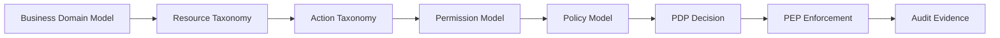
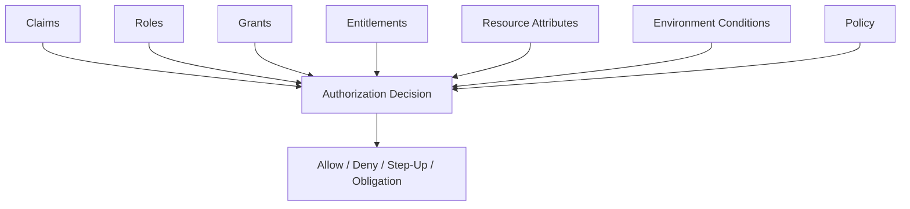
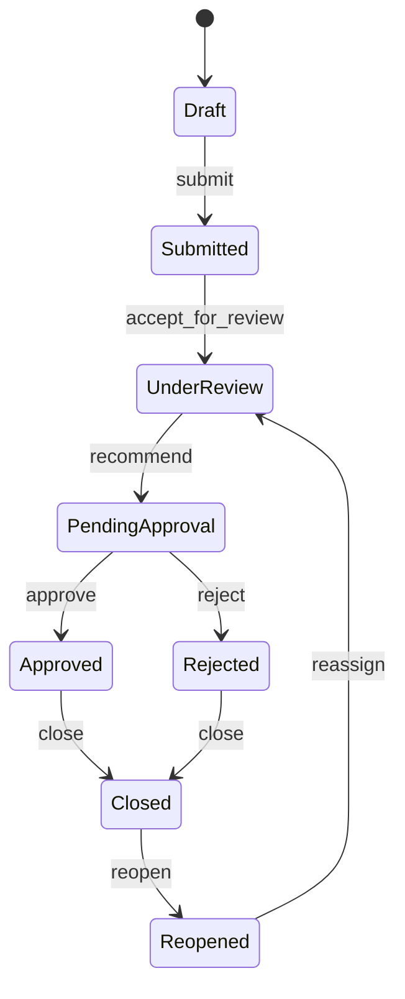
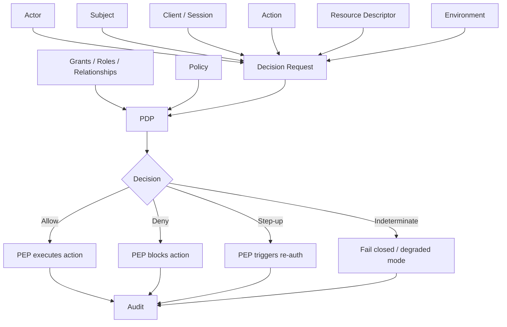
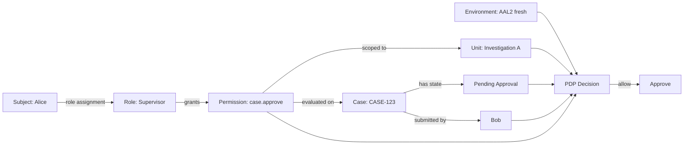
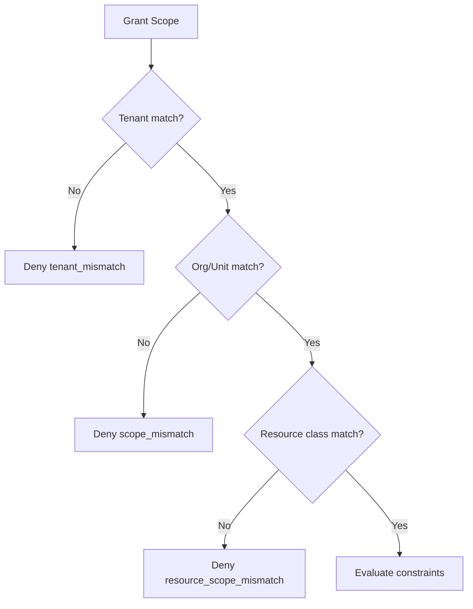
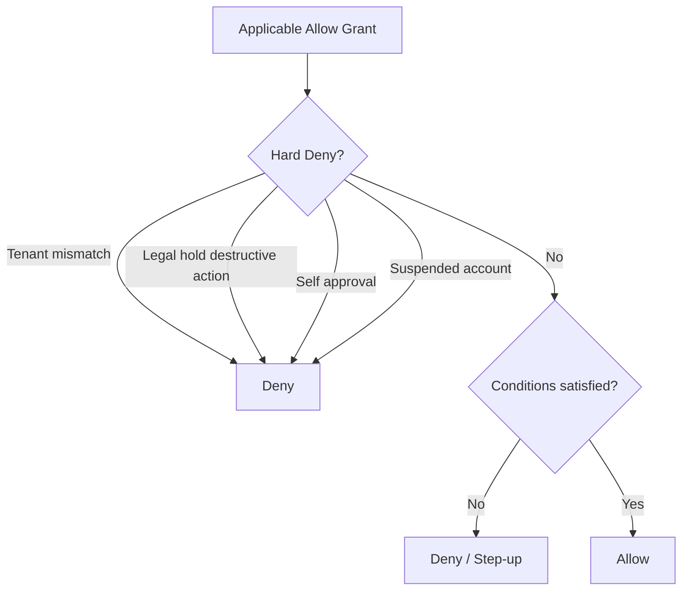

# learn-go-authentication-authorization-identity-permission-part-021.md

# Part 021 — Permission Modelling: Action, Resource, Scope, Constraint, Condition

> Seri: **learn-go-authentication-authorization-identity-permission**  
> Bagian: **021 dari 035**  
> Topik: **Permission Modelling**  
> Target: Go 1.26.x  
> Level: Advanced / internal engineering handbook

---

## Daftar Isi

1. [Tujuan Bagian Ini](#1-tujuan-bagian-ini)
2. [Posisi Permission Modelling dalam Arsitektur Authorization](#2-posisi-permission-modelling-dalam-arsitektur-authorization)
3. [Kesalahan Umum: Permission Dianggap Nama String](#3-kesalahan-umum-permission-dianggap-nama-string)
4. [Mental Model: Permission adalah Klaim Otoritas Terkondisi](#4-mental-model-permission-adalah-klaim-otoritas-terkondisi)
5. [Vocabulary Presisi](#5-vocabulary-presisi)
6. [Anatomi Permission Decision](#6-anatomi-permission-decision)
7. [Action Modelling](#7-action-modelling)
8. [Resource Modelling](#8-resource-modelling)
9. [Scope Modelling](#9-scope-modelling)
10. [Constraint dan Condition Modelling](#10-constraint-dan-condition-modelling)
11. [Permission vs Role vs Scope vs Claim vs Entitlement](#11-permission-vs-role-vs-scope-vs-claim-vs-entitlement)
12. [Resource-Level, Field-Level, dan Workflow-Level Permission](#12-resource-level-field-level-dan-workflow-level-permission)
13. [Permission untuk Multi-Tenant System](#13-permission-untuk-multi-tenant-system)
14. [Permission untuk Regulatory / Case Management Domain](#14-permission-untuk-regulatory--case-management-domain)
15. [Domain Taxonomy: Cara Menamai Action dan Resource](#15-domain-taxonomy-cara-menamai-action-dan-resource)
16. [Permission Decision Contract di Go](#16-permission-decision-contract-di-go)
17. [Typed Permission Model di Go](#17-typed-permission-model-di-go)
18. [Policy Input Model](#18-policy-input-model)
19. [Permission Grant Model](#19-permission-grant-model)
20. [Relational Schema Reference](#20-relational-schema-reference)
21. [Permission Evaluation Algorithm](#21-permission-evaluation-algorithm)
22. [Deny, Allow, Abstain, Conflict Resolution](#22-deny-allow-abstain-conflict-resolution)
23. [Caching, Freshness, dan Revocation](#23-caching-freshness-dan-revocation)
24. [Permission in HTTP, gRPC, Worker, dan Event Handler](#24-permission-in-http-grpc-worker-dan-event-handler)
25. [Testing Permission Model](#25-testing-permission-model)
26. [Observability dan Auditability](#26-observability-dan-auditability)
27. [Failure Modes](#27-failure-modes)
28. [Anti-Pattern](#28-anti-pattern)
29. [Mermaid Diagrams](#29-mermaid-diagrams)
30. [Case Study: Regulatory Case Management Permission Model](#30-case-study-regulatory-case-management-permission-model)
31. [Production Checklist](#31-production-checklist)
32. [Latihan Desain](#32-latihan-desain)
33. [Ringkasan](#33-ringkasan)
34. [Referensi Primer](#34-referensi-primer)

---

## 1. Tujuan Bagian Ini

Bagian sebelumnya membahas RBAC yang benar: role assignment, role hierarchy, domain role, contextual role, separation of duties, toxic combination, dan role explosion. Bagian ini turun satu level lebih presisi: **permission modelling**.

RBAC menjawab:

> “Role apa yang dimiliki subject?”

Permission modelling menjawab:

> “Action apa yang boleh dilakukan subject terhadap resource spesifik, dalam scope tertentu, dengan constraint dan condition tertentu?”

Ini pergeseran penting. Sistem enterprise sering gagal bukan karena tidak punya role, tetapi karena role dipakai sebagai pengganti seluruh model authorization.

Contoh buruk:

```go
if user.Role == "MANAGER" {
    approveApplication(appID)
}
```

Kode ini terlihat sederhana, tetapi menyembunyikan banyak pertanyaan:

- Manager di tenant mana?
- Manager untuk unit kerja mana?
- Manager atas resource apa?
- Apakah application sedang dalam state yang boleh di-approve?
- Apakah user adalah submitter application tersebut?
- Apakah ada separation of duties?
- Apakah approval butuh step-up auth?
- Apakah permission sedang suspended?
- Apakah assignment masih valid?
- Apakah user bertindak sebagai dirinya sendiri atau sedang impersonation?
- Apakah action ini boleh dilakukan via API, UI, batch job, atau hanya back-office?
- Apakah ada legal hold, lock, escalation, atau conflict of interest?

Permission modelling yang matang membuat pertanyaan-pertanyaan ini eksplisit.

Tujuan part ini:

1. Membangun mental model permission yang tidak dangkal.
2. Memisahkan role, permission, scope, claim, entitlement, grant, policy, dan decision.
3. Membentuk taxonomy action dan resource yang stabil.
4. Mendesain permission contract yang bisa dipakai lintas HTTP, gRPC, worker, event handler, dan batch job.
5. Mendesain model Go yang type-safe, testable, auditable, dan tidak menyebarkan logic authorization ke seluruh kode.
6. Membahas failure mode yang biasanya muncul di sistem multi-tenant dan regulatory-grade.

---

## 2. Posisi Permission Modelling dalam Arsitektur Authorization

Dalam model authorization modern, permission modelling berada di antara domain model dan policy decision.



Permission modelling bukan hanya daftar string seperti:

```txt
application.read
application.write
case.approve
user.manage
```

Daftar seperti itu hanya vocabulary awal. Permission yang benar harus punya struktur:

```txt
subject S
performs action A
on resource R
within scope X
under constraints C
when conditions E are true
with authority source G
producing decision D
```

Contoh:

```txt
Officer Alice
may approve
Application EA-123
within Tenant CEA
only if application.status == PENDING_SUPERVISOR_REVIEW
and Alice is assigned as supervisor of the processing unit
and Alice is not the applicant/submitter
and Alice has AAL2 session fresh within 15 minutes
and delegation is not expired
```

Yang penting: permission bukan properti tunggal di user. Permission adalah **relasi terkondisi** antara actor, action, resource, dan context.

---

## 3. Kesalahan Umum: Permission Dianggap Nama String

Banyak codebase memulai authorization seperti ini:

```go
const PermissionApproveCase = "case.approve"
```

Ini tidak salah sebagai awal, tetapi berbahaya bila dianggap cukup.

Masalahnya:

1. Permission string tidak menjelaskan resource instance.
2. Permission string tidak menjelaskan tenant boundary.
3. Permission string tidak menjelaskan state resource.
4. Permission string tidak menjelaskan ownership.
5. Permission string tidak menjelaskan delegation.
6. Permission string tidak menjelaskan channel atau assurance.
7. Permission string tidak menjelaskan conflict resolution.
8. Permission string tidak menjelaskan kenapa decision diberikan.

Contoh:

```txt
case.approve
```

Pertanyaan yang belum terjawab:

- Approve case jenis apa?
- Case milik tenant mana?
- Approve pada stage apa?
- Apakah role assignment berlaku untuk case ini?
- Apakah approver boleh approve case yang ia buat sendiri?
- Apakah approval butuh dua approver?
- Apakah legal module punya override?
- Apakah status case locked?
- Apakah user sedang dalam mode impersonation?

Top 1% engineer tidak berhenti di permission string. Mereka bertanya:

> “Apa struktur decision yang ingin kita pertahankan sebagai invariant sistem?”

---

## 4. Mental Model: Permission adalah Klaim Otoritas Terkondisi

Permission bisa dipahami sebagai:

> **A conditional authority relation between a subject and a resource for a specific action.**

Dalam bahasa praktis:

> Subject boleh melakukan action terhadap resource **hanya jika** authority source dan context membuktikan bahwa action tersebut sah.

Bukan:

> User punya string permission.

Melainkan:

> User/actor memiliki authority yang bisa diturunkan dari role, grant, ownership, delegation, relationship, policy, session assurance, dan state resource.

### 4.1 Permission sebagai Relasi

```txt
(subject) --[may perform action]--> (resource)
```

Contoh:

```txt
user:alice --[approve]--> application:EA-123
service:reporting-worker --[read]--> case:CASE-8841
support:bob --[impersonate]--> account:dealer-771
```

### 4.2 Permission sebagai Relasi Terkondisi

```txt
(subject) --[action if condition]--> (resource)
```

Contoh:

```txt
Alice may approve Application EA-123 if:
- application.tenant_id == Alice.active_tenant_id
- application.status == PENDING_APPROVAL
- Alice has role Supervisor in application.processing_unit
- Alice did not submit the application
- Alice session AAL >= 2
- approval window is open
```

### 4.3 Permission sebagai Keputusan Saat Ini

Permission bukan fakta abadi. Ia dievaluasi pada waktu tertentu.

```txt
Can Alice approve EA-123 at 2026-06-24T20:00:00+07:00?
```

Jawaban bisa berubah karena:

- role dicabut;
- delegation expired;
- resource berubah state;
- tenant switch;
- session sudah tidak fresh;
- case locked;
- assignment berubah;
- risk score naik;
- policy version berubah.

Karena itu decision harus menyimpan:

- evaluated at;
- policy version;
- input facts;
- outcome;
- reason;
- obligations;
- decision ID.

---

## 5. Vocabulary Presisi

### 5.1 Subject

Entity yang meminta akses.

Bisa berupa:

- human user;
- service account;
- workload identity;
- API client;
- delegated actor;
- impersonated user;
- scheduled job.

### 5.2 Actor

Entity yang benar-benar menjalankan action secara operasional.

Dalam normal flow:

```txt
actor == subject
```

Dalam impersonation:

```txt
actor = support officer
subject = impersonated account/user
```

Dalam delegation:

```txt
actor = delegate
subject = original authority holder or delegated subject depending model
```

### 5.3 Principal

Representasi authenticated identity di aplikasi.

Principal biasanya berasal dari:

- session;
- access token;
- client certificate;
- workload identity;
- OIDC ID Token;
- internal service credential.

Principal bukan permission. Principal adalah identity evidence yang sudah diverifikasi.

### 5.4 Resource

Object/domain entity yang dilindungi.

Contoh:

- `Application`
- `Case`
- `Appeal`
- `Document`
- `Payment`
- `UserAccount`
- `RoleAssignment`
- `Report`
- `Tenant`
- `Policy`

Resource bisa berupa:

- instance: `case:123`
- collection: `case:*`
- field: `case:123.field:internal_note`
- operation target: `case:123.transition:approve`
- aggregate/report: `report:monthly-enforcement-summary`

### 5.5 Action

Operasi yang ingin dilakukan terhadap resource.

Contoh generic:

- `read`
- `list`
- `create`
- `update`
- `delete`
- `approve`
- `reject`
- `assign`
- `export`
- `submit`
- `reopen`
- `override`

Action harus domain-aware. `update` terlalu umum untuk aksi sensitif seperti `approve`, `waive`, `escalate`, `close`, atau `revoke`.

### 5.6 Scope

Boundary tempat permission berlaku.

Contoh:

- tenant;
- organization;
- department;
- unit;
- case type;
- region;
- module;
- resource collection;
- API audience;
- client application;
- environment.

### 5.7 Condition

Fakta runtime yang mempengaruhi keputusan.

Contoh:

- current time;
- IP/network zone;
- session assurance;
- authentication freshness;
- risk score;
- feature flag;
- incident mode;
- maintenance window.

### 5.8 Constraint

Batas yang melekat pada grant/policy.

Contoh:

- valid until date;
- max approval amount;
- allowed case type;
- allowed tenant;
- cannot approve own submission;
- must be assigned officer;
- only during business hours;
- requires dual approval;
- requires step-up authentication.

### 5.9 Grant

Pemberian otoritas eksplisit.

Contoh:

- role assignment;
- direct permission assignment;
- delegation;
- OAuth consent grant;
- capability token;
- temporary elevation;
- break-glass activation.

### 5.10 Policy

Aturan yang mengevaluasi facts menjadi decision.

Policy dapat berupa:

- code;
- database rule;
- OPA/Rego policy;
- Casbin model/policy;
- Zanzibar-style relation schema;
- workflow guard;
- configuration.

### 5.11 Decision

Hasil evaluasi authorization.

Minimal:

```txt
allow | deny
```

Untuk production-grade:

```txt
allow | deny | abstain | indeterminate
reason
matched policy
obligations
advice
decision id
evaluated at
policy version
input hash
```

---

## 6. Anatomi Permission Decision

Permission decision yang matang memiliki struktur berikut:

```txt
Can <actor> perform <action> on <resource> under <context>?
```

Lebih lengkap:

```txt
Can Actor A,
acting as Subject S,
from Client C,
in Tenant T,
perform Action X,
on Resource R,
with Resource State RS,
under Environment E,
using Authentication Assurance AA,
according to Policy Version PV?
```

### 6.1 Struktur Decision

```go
type DecisionEffect string

const (
    EffectAllow         DecisionEffect = "allow"
    EffectDeny          DecisionEffect = "deny"
    EffectAbstain       DecisionEffect = "abstain"
    EffectIndeterminate DecisionEffect = "indeterminate"
)

type Decision struct {
    Effect        DecisionEffect
    Reason        string
    ReasonCode    string
    Obligations   []Obligation
    Advice        []Advice
    PolicyVersion string
    DecisionID    string
    EvaluatedAt   time.Time
}
```

Kenapa tidak cukup `bool`?

Karena production system butuh membedakan:

- token invalid;
- unauthenticated;
- authenticated tetapi tidak punya permission;
- resource tidak ada;
- resource ada tetapi disembunyikan;
- tenant mismatch;
- step-up required;
- policy engine unavailable;
- stale permission cache;
- SoD violation;
- case locked;
- legal hold;
- delegation expired;
- policy conflict.

`bool` menghapus semua informasi penting itu.

### 6.2 Decision Harus Bisa Diaudit

Authorization decision bukan hanya runtime control. Ia juga bukti.

Untuk regulatory-grade system, audit harus bisa menjawab:

```txt
Why was Alice allowed to approve case CASE-123 on 2026-06-24?
```

Bukti minimal:

- actor;
- subject;
- tenant;
- action;
- resource;
- decision;
- reason;
- policy version;
- role/grant source;
- resource state snapshot;
- assurance level;
- request correlation ID;
- time;
- enforcement point.

---

## 7. Action Modelling

Action adalah bagian permission yang sering diremehkan. Banyak sistem hanya punya:

```txt
read
write
admin
```

Ini terlalu kasar untuk domain enterprise.

### 7.1 CRUD Bukan Permission Model yang Cukup

CRUD:

- create;
- read;
- update;
- delete.

Cocok untuk admin panel sederhana. Tidak cukup untuk domain kompleks.

Contoh case management:

- create case;
- assign case;
- acknowledge case;
- add minute;
- request information;
- upload evidence;
- issue warning;
- recommend prosecution;
- approve enforcement action;
- close case;
- reopen case;
- export case file;
- redact sensitive field;
- override workflow;
- transfer ownership.

Semua ini tidak boleh disamaratakan menjadi `update`.

### 7.2 Action Harus Mengikuti Business Semantics

Action yang baik merepresentasikan perubahan bisnis.

Buruk:

```txt
application.update
```

Lebih baik:

```txt
application.update_draft
application.submit
application.withdraw
application.request_clarification
application.approve
application.reject
application.reopen
application.assign_officer
application.export_pdf
application.view_sensitive_notes
```

Alasannya:

- audit lebih jelas;
- policy lebih presisi;
- testing lebih mudah;
- least privilege lebih realistis;
- UI bisa derive capabilities;
- risk classification lebih mudah;
- workflow guard lebih jelas.

### 7.3 Action Granularity

Action terlalu kasar:

```txt
case.manage
```

Masalah:

- role kecil menjadi terlalu powerful;
- audit tidak presisi;
- sulit enforce SoD;
- sulit membedakan read/write/export/approve.

Action terlalu halus:

```txt
case.update_title
case.update_description
case.update_due_date
case.update_priority
case.update_tag
case.update_color
case.update_internal_label
```

Masalah:

- permission explosion;
- UI/config sulit;
- policy sulit dimengerti;
- admin assignment membingungkan.

Rule of thumb:

> Action harus mengikuti boundary risiko, business meaning, audit meaning, dan workflow transition; bukan mengikuti setiap field teknis.

### 7.4 Action Class

Untuk desain enterprise, action bisa diklasifikasikan:

| Class | Contoh | Risiko |
|---|---|---|
| Read | view, list, search | data exposure |
| Write | edit draft, update metadata | integrity |
| State transition | submit, approve, reject, close | workflow/legal |
| Assignment | assign, transfer, claim | ownership/control |
| Privilege | grant role, revoke role, impersonate | privilege escalation |
| Export | download, bulk export, report extract | mass disclosure |
| Destructive | delete, purge, anonymize | irreversible loss |
| Override | bypass validation, reopen locked case | governance |
| Administrative | configure policy, manage tenant | systemic risk |
| Service operation | consume event, sync identity, run job | machine authority |

Action class berguna untuk:

- step-up rules;
- approval workflow;
- audit level;
- rate limiting;
- anomaly detection;
- risk scoring;
- UI warnings;
- testing matrix.

### 7.5 Action Naming Convention

Gunakan format stabil:

```txt
<resource-kind>.<verb>
```

Contoh:

```txt
case.read
case.search
case.create
case.update_metadata
case.assign
case.add_note
case.approve_recommendation
case.close
case.reopen
case.export
case.view_sensitive
case.override_workflow
```

Untuk nested resource:

```txt
document.read
document.upload
document.redact
document.delete
case.note.create
case.note.read_internal
case.evidence.upload
```

Jangan masukkan tenant atau resource ID ke nama action:

Buruk:

```txt
case.approve.tenant123
case.approve.CASE-001
```

Tenant dan resource instance adalah input decision, bukan bagian action name.

---

## 8. Resource Modelling

Resource adalah object yang dilindungi. Authorization yang buruk sering tidak punya resource model eksplisit.

Contoh buruk:

```go
func CanApprove(user User) bool
```

Tidak ada resource. Artinya sistem tidak bisa menjawab “approve apa?”

Lebih baik:

```go
func CanApprove(ctx context.Context, principal Principal, app Application) Decision
```

### 8.1 Resource Kind vs Resource Instance

Resource kind:

```txt
case
application
document
user_account
role_assignment
```

Resource instance:

```txt
case:CASE-123
application:APP-991
document:DOC-555
```

Permission biasanya dievaluasi terhadap instance. Permission terhadap collection tetap harus eksplisit.

Contoh:

```txt
case.search         on case collection
case.read           on case instance
case.export_bulk    on case collection
```

### 8.2 Resource Identifier Harus Tenant-Aware

Dalam multi-tenant system, resource ID harus tidak cukup sendirian.

Buruk:

```go
type ResourceRef struct {
    Kind string
    ID   string
}
```

Lebih baik:

```go
type ResourceRef struct {
    TenantID string
    Kind     string
    ID       string
}
```

Atau resource loader wajib mengembalikan tenant.

```go
type ResourceDescriptor struct {
    Ref        ResourceRef
    OwnerID    string
    UnitID     string
    Status     string
    Attributes map[string]string
}
```

Tenant boundary tidak boleh bergantung pada client input saja. Sistem harus membaca tenant resource dari source of truth.

### 8.3 Resource Hierarchy

Banyak permission mengikuti hierarchy.

Contoh:

```txt
Tenant
  └── Organization
      └── Department
          └── Case
              ├── Document
              └── Note
```

Permission terhadap parent bisa memengaruhi child.

Contoh:

- user punya `case.read` untuk department A;
- document milik case di department A;
- maka user mungkin boleh `document.read`;
- tetapi document classified membutuhkan extra condition.

Resource hierarchy harus jelas agar tidak terjadi privilege leak.

### 8.4 Resource State sebagai Input Permission

Resource state sering menentukan apakah action boleh.

Contoh:

| Resource State | Action | Allowed? |
|---|---|---|
| Draft | submit | yes |
| Submitted | submit | no |
| Pending Review | approve | yes for supervisor |
| Approved | edit | no except reopen |
| Closed | add note | maybe yes |
| Under Legal Hold | delete | no |

State machine dan permission model harus sinkron.

Jangan hanya cek role:

```go
if principal.HasRole("Supervisor") {
    approve(caseID)
}
```

Harus cek state:

```go
if decision := authorizer.Decide(ctx, Request{
    Principal: principal,
    Action:    ActionCaseApprove,
    Resource:  caseResource,
}); !decision.Allowed() {
    return decision.ToError()
}
```

### 8.5 Sensitive Sub-Resources

Tidak semua bagian resource punya sensitivitas sama.

Contoh `Case`:

- public summary;
- internal note;
- investigation note;
- legal advice;
- complainant identity;
- evidence attachment;
- financial penalty recommendation;
- audit history.

Resource model perlu bisa menyatakan:

```txt
case:CASE-123.field:internal_note
case:CASE-123.document:DOC-555
case:CASE-123.audit_log
```

Namun hati-hati: jangan membuat field-level permission terlalu granular bila tidak dibutuhkan. Gunakan sensitivity class.

Contoh:

```txt
case.view_basic
case.view_sensitive
case.view_legal
case.view_investigation
```

---

## 9. Scope Modelling

Scope adalah batas berlaku permission.

### 9.1 Scope Bukan Hanya OAuth Scope

Dalam OAuth:

```txt
read:profile write:calendar
```

Dalam enterprise authorization, scope bisa berarti:

- tenant;
- organization;
- department;
- business unit;
- region;
- module;
- case type;
- resource collection;
- environment;
- client application;
- delegated boundary.

Jangan samakan OAuth scope dengan business permission secara langsung.

OAuth scope adalah grant antara client dan authorization server. Business permission adalah decision antara subject dan resource.

### 9.2 Scope Dimensions

Permission scope sering multi-dimensional.

Contoh:

```txt
Role: Enforcement Officer
Scope:
  tenant: CEA
  department: Investigation Unit A
  case_type: LicensingBreach
  action_group: case_processing
  valid_until: 2026-12-31
```

Di Go:

```go
type Scope struct {
    TenantID      string
    OrgID         string
    UnitID        string
    RegionID      string
    Module        string
    ResourceKind  string
    ResourceClass string
    Environment   string
}
```

Namun jangan semua field wajib. Scope sebaiknya extensible tetapi tetap typed untuk field inti.

### 9.3 Scope Matching

Scope matching menjawab:

> Apakah grant yang dimiliki subject berlaku untuk resource ini?

Contoh:

```txt
Grant: department = Investigation-A
Resource: case.department = Investigation-A
=> match
```

```txt
Grant: tenant = CEA
Resource: tenant = CPDS
=> deny
```

Scope matching harus mempertimbangkan hierarchy:

```txt
Grant at organization level may apply to department children.
Grant at tenant level may apply to all orgs in tenant.
Grant at unit level must not apply upward.
```

### 9.4 Scope Collapse Risk

Scope collapse terjadi ketika sistem menyederhanakan semua boundary menjadi satu string.

Contoh:

```go
if user.TenantID == request.TenantID {
    allow()
}
```

Ini tidak cukup karena:

- user mungkin tenant admin, bukan case processor;
- case mungkin belong ke unit lain;
- user mungkin punya access untuk read tetapi bukan approve;
- user mungkin sedang berada dalam delegated tenant context;
- request tenant bisa dipalsukan.

---

## 10. Constraint dan Condition Modelling

Constraint dan condition membuat permission menjadi presisi.

### 10.1 Constraint

Constraint melekat pada authority/grant/policy.

Contoh:

```txt
Role assignment valid until 2026-12-31.
Can approve penalty only up to SGD 10,000.
Can view only cases assigned to own unit.
Can act only during business hours.
Cannot approve own submission.
Must have fresh MFA.
```

Di Go:

```go
type GrantConstraint struct {
    ValidFrom          time.Time
    ValidUntil         *time.Time
    MaxAmount          *decimal.Decimal
    AllowedCaseTypes   []string
    AllowedActions     []Action
    RequireFreshAuth   bool
    RequireMFA         bool
    ExcludeSelfAction  bool
    BusinessHoursOnly  bool
}
```

### 10.2 Condition

Condition adalah fakta runtime.

Contoh:

```txt
current_time = 2026-06-24T20:00+07:00
session_aal = 2
auth_age = 4 minutes
risk_score = low
request_channel = web
resource_status = pending_review
```

Di Go:

```go
type Environment struct {
    Now             time.Time
    IPAddress       netip.Addr
    NetworkZone     string
    RequestChannel  string
    AuthTime        time.Time
    AuthAssurance   int
    RiskLevel       string
    CorrelationID   string
}
```

### 10.3 Constraint vs Condition

| Aspek | Constraint | Condition |
|---|---|---|
| Sumber | grant/policy | runtime/request/resource/session |
| Contoh | valid until, max amount | current time, auth age, resource status |
| Stabilitas | relatif stabil | berubah setiap request |
| Dipakai untuk | membatasi authority | mengevaluasi apakah authority bisa dipakai sekarang |

### 10.4 Policy sebagai Kombinasi Constraint dan Condition

Contoh policy:

```txt
Allow case.approve if:
- subject has role Supervisor scoped to resource.unit_id;
- resource.status == PendingSupervisorApproval;
- subject.id != resource.submitted_by;
- session.aal >= 2;
- auth_time within 15 minutes;
- no legal hold;
- delegation, if used, is still valid;
- no active conflict of interest.
```

---

## 11. Permission vs Role vs Scope vs Claim vs Entitlement

Ini sumber kekacauan besar.

### 11.1 Role

Role adalah bundling authority untuk memudahkan assignment.

```txt
Supervisor
Case Officer
Legal Officer
Tenant Admin
```

Role bukan decision final.

### 11.2 Permission

Permission adalah ability/action terhadap resource.

```txt
case.approve
case.read_sensitive
case.assign
```

Permission bisa berasal dari role, direct grant, delegation, relationship, atau policy.

### 11.3 Scope

Scope adalah boundary berlaku permission.

```txt
tenant=CEA
unit=Investigation-A
case_type=Licensing
```

### 11.4 Claim

Claim adalah assertion dalam token/identity document.

Contoh JWT/OIDC claim:

```json
{
  "sub": "user-123",
  "iss": "https://idp.example.gov",
  "aud": "case-api",
  "tenant_id": "cea",
  "amr": ["pwd", "otp"]
}
```

Claim bukan permission final. Claim adalah input untuk decision.

### 11.5 OAuth Scope

OAuth scope adalah izin client terhadap resource server.

Contoh:

```txt
case-api.read case-api.write
```

Jangan langsung menganggap OAuth scope berarti user boleh mengakses semua object.

OAuth scope menjawab:

> Client ini boleh meminta access token dengan capability umum apa?

Business authorization menjawab:

> User ini boleh melakukan action spesifik terhadap resource spesifik ini?

### 11.6 Entitlement

Entitlement adalah hak yang biasanya berasal dari subscription, product plan, contract, agency configuration, license, atau provisioning.

Contoh:

```txt
tenant has module: Enforcement
agency has feature: BulkExport
user has license: InvestigatorSeat
```

Entitlement bisa menjadi input authorization, tetapi bukan selalu permission.

### 11.7 Grant

Grant adalah assignment otoritas.

Contoh:

```txt
Alice assigned role Supervisor for Unit A from 2026-01-01 to 2026-12-31.
Bob delegated case.approve for CASE-123 until Friday.
Client app granted OAuth scope case-api.read.
```

### 11.8 Ringkasan



---

## 12. Resource-Level, Field-Level, dan Workflow-Level Permission

### 12.1 Resource-Level Permission

Menjawab:

```txt
Can subject read case CASE-123?
```

Ini melindungi object.

Contoh:

```txt
case.read
case.update
case.close
```

### 12.2 Field-Level Permission

Menjawab:

```txt
Can subject view field X of case CASE-123?
```

Contoh field sensitif:

- complainant identity;
- investigation notes;
- legal advice;
- penalty recommendation;
- internal scoring;
- classified attachments.

Field-level permission berguna untuk:

- redaction;
- API response shaping;
- UI hiding;
- report generation;
- export protection.

Namun field-level permission sangat mudah menjadi kompleks. Gunakan sensitivity group.

Contoh:

```go
type Sensitivity string

const (
    SensitivityPublic        Sensitivity = "public"
    SensitivityInternal      Sensitivity = "internal"
    SensitivityInvestigation Sensitivity = "investigation"
    SensitivityLegal         Sensitivity = "legal"
    SensitivityRestricted    Sensitivity = "restricted"
)
```

### 12.3 Workflow-Level Permission

Menjawab:

```txt
Can subject execute transition T from state A to state B?
```

Contoh:

```txt
application.submit
application.approve
application.reject
case.escalate
case.close
case.reopen
```

Workflow-level permission harus sinkron dengan state machine.



Permission tidak boleh mengizinkan transition yang tidak valid menurut state machine.

---

## 13. Permission untuk Multi-Tenant System

Multi-tenant permission harus mencegah tenant breakout.

### 13.1 Tenant Boundary sebagai Hard Constraint

Tenant boundary harus dievaluasi sebelum policy detail.

```go
if principal.TenantID != resource.TenantID {
    return Deny("tenant_mismatch")
}
```

Tetapi ini hanya baseline. Ada kasus cross-tenant legitimate:

- platform admin;
- support impersonation;
- regulator accessing agency data;
- shared service worker;
- delegated external consultant;
- inter-agency workflow.

Maka rule lebih matang:

```txt
Default deny tenant mismatch, unless explicit cross-tenant authority exists and is audited.
```

### 13.2 Active Tenant Context

User bisa punya akses ke banyak tenant.

Contoh:

```txt
Alice belongs to Tenant A and Tenant B.
```

Session harus punya active tenant:

```go
type Principal struct {
    SubjectID      string
    TenantIDs      []string
    ActiveTenantID string
}
```

Authorization harus menggunakan active tenant, bukan sembarang tenant dari request.

### 13.3 Tenant in Token vs Tenant in Database

Token claim:

```json
{"tenant_id": "cea"}
```

Ini input awal, bukan source of truth final untuk resource. Resource tenant harus divalidasi dari database.

Pattern aman:

1. Extract active tenant from session/token.
2. Load resource from database by ID.
3. Check resource tenant.
4. Evaluate scope.
5. Enforce decision.

Buruk:

```sql
SELECT * FROM cases WHERE id = :id
```

Lebih baik:

```sql
SELECT * FROM cases WHERE id = :id AND tenant_id = :active_tenant_id
```

Namun untuk audit denied tenant mismatch, kadang resource lookup perlu hati-hati agar tidak leak existence.

### 13.4 Existence Hiding

Jika user tidak punya akses ke resource, apakah return `403` atau `404`?

Pilihan:

- `403 Forbidden`: resource ada tapi user tidak boleh akses.
- `404 Not Found`: sembunyikan existence.

Untuk BOLA/IDOR-sensitive endpoints, sering lebih aman return `404` untuk unauthorized object read. Namun audit internal tetap mencatat denial.

---

## 14. Permission untuk Regulatory / Case Management Domain

Regulatory/case management authorization memiliki kompleksitas berbeda dari aplikasi CRUD umum.

Karakteristik:

1. Banyak state transition.
2. Ada legal/administrative authority.
3. Ada maker-checker pattern.
4. Ada conflict of interest.
5. Ada sensitive fields.
6. Ada delegation/acting appointment.
7. Ada audit requirement tinggi.
8. Ada cross-unit/cross-agency workflow.
9. Ada emergency/break-glass access.
10. Ada retention/legal hold.

### 14.1 Case Processing Example

Case lifecycle:

```txt
Created -> Assigned -> Investigation -> Recommendation -> Approval -> Enforcement -> Closed
```

Permission:

```txt
case.create
case.assign
case.accept_assignment
case.add_evidence
case.add_internal_note
case.recommend_action
case.approve_action
case.issue_notice
case.close
case.reopen
case.export_bundle
case.view_legal_advice
case.override_deadline
```

Constraints:

```txt
- officer must belong to assigned unit;
- approver must not be recommending officer;
- legal advice visible only to legal role or approved officers;
- export bundle requires AAL2 fresh auth;
- reopen requires supervisor role and reason code;
- override deadline requires escalation authority;
- cross-agency case requires explicit sharing grant.
```

### 14.2 Maker-Checker

Maker-checker is a permission constraint, not just workflow UI.

```txt
The same actor who created/recommended a decision must not approve it.
```

Go check:

```go
func NoSelfApproval(actorID string, resource ResourceDescriptor) bool {
    return actorID != resource.Attributes["recommended_by"]
}
```

But better as policy input:

```go
type ResourceDescriptor struct {
    Ref        ResourceRef
    TenantID   string
    Status     string
    CreatedBy  string
    SubmittedBy string
    RecommendedBy string
    AssignedUnitID string
}
```

### 14.3 Legal Hold

Legal hold should override many permissions.

```txt
If resource.legal_hold == true:
- deny delete;
- deny purge;
- deny destructive edit;
- allow read only to authorized legal/investigation roles;
- require audit reason for export.
```

This is a classic deny override.

### 14.4 Sensitive Action Step-Up

Actions like approve, export, override, impersonate, grant role should require higher assurance.

```txt
case.approve_penalty requires:
- role Supervisor;
- tenant/unit scope;
- resource status PendingApproval;
- AAL2;
- auth_time <= 15 minutes;
- reason code;
- no conflict of interest.
```

---

## 15. Domain Taxonomy: Cara Menamai Action dan Resource

Permission taxonomy harus stabil karena akan hidup lama.

### 15.1 Format Umum

```txt
<domain>.<resource>.<action>
```

atau lebih sederhana:

```txt
<resource>.<action>
```

Contoh:

```txt
case.read
case.search
case.assign
case.approve
case.close
document.upload
document.redact
user_account.disable
role_assignment.grant
policy.publish
```

Untuk sistem besar, gunakan domain prefix:

```txt
enforcement.case.read
enforcement.case.approve
licensing.application.submit
licensing.application.approve
identity.user_account.disable
authz.role_assignment.grant
```

### 15.2 Verb Guidelines

Gunakan verb yang punya makna bisnis.

| Hindari | Gunakan |
|---|---|
| manage | assign, approve, close, reopen |
| write | update_draft, submit, amend |
| process | investigate, recommend, escalate |
| admin | grant_role, configure_policy, disable_account |
| access | read, export, view_sensitive |

### 15.3 Nama Permission Harus Stabil

Jangan rename permission sembarangan. Permission sering dipakai di:

- role configuration;
- policy;
- audit log;
- documentation;
- migration script;
- API contract;
- UI feature flags;
- report;
- compliance evidence.

Jika rename diperlukan, lakukan migration:

```txt
old permission -> new permission
with deprecation window
with compatibility mapping
with audit annotation
```

### 15.4 Permission Registry

Sistem besar butuh permission registry.

Contoh:

```go
type PermissionDefinition struct {
    Action       Action
    ResourceKind ResourceKind
    Description  string
    RiskClass    RiskClass
    RequiresMFA  bool
    AuditLevel   AuditLevel
    Deprecated   bool
}
```

Permission registry berguna untuk:

- admin UI;
- documentation;
- validation;
- migration;
- static analysis;
- test generation;
- audit review.

---

## 16. Permission Decision Contract di Go

Authorization harus punya interface eksplisit.

### 16.1 Basic Contract

```go
type Authorizer interface {
    Decide(ctx context.Context, req DecisionRequest) (Decision, error)
}
```

### 16.2 Decision Request

```go
type DecisionRequest struct {
    Actor       Actor
    Subject     Subject
    Action      Action
    Resource    ResourceDescriptor
    Environment Environment
    Client      ClientContext
    Purpose     string
}
```

### 16.3 Actor dan Subject

```go
type Actor struct {
    ID        string
    Kind      ActorKind
    TenantID  string
    SessionID string
}

type Subject struct {
    ID       string
    Kind     SubjectKind
    TenantID string
}
```

Untuk normal human action:

```txt
actor == subject
```

Untuk impersonation:

```txt
actor = support officer
subject = target user/account
```

Authorization harus tahu keduanya.

### 16.4 Action Type

```go
type Action string

const (
    ActionCaseRead      Action = "case.read"
    ActionCaseSearch    Action = "case.search"
    ActionCaseAssign    Action = "case.assign"
    ActionCaseApprove   Action = "case.approve"
    ActionCaseClose     Action = "case.close"
    ActionCaseExport    Action = "case.export"
    ActionRoleGrant     Action = "role_assignment.grant"
)
```

### 16.5 Resource Descriptor

```go
type ResourceKind string

const (
    ResourceCase           ResourceKind = "case"
    ResourceApplication    ResourceKind = "application"
    ResourceDocument       ResourceKind = "document"
    ResourceRoleAssignment ResourceKind = "role_assignment"
)

type ResourceRef struct {
    TenantID string
    Kind     ResourceKind
    ID       string
}

type ResourceDescriptor struct {
    Ref             ResourceRef
    OwnerSubjectID  string
    CreatedBy       string
    SubmittedBy     string
    AssignedUnitID  string
    Status          string
    Sensitivity     string
    Attributes      map[string]string
}
```

### 16.6 Environment

```go
type Environment struct {
    Now              time.Time
    CorrelationID    string
    RequestChannel   string
    IP               string
    NetworkZone      string
    AuthAssurance    int
    AuthTime         time.Time
    RiskLevel        string
    PolicyVersionHint string
}
```

### 16.7 Decision

```go
type Decision struct {
    Effect        DecisionEffect
    ReasonCode    string
    Message       string
    Obligations   []Obligation
    Advice        []Advice
    MatchedRules   []string
    PolicyVersion string
    DecisionID    string
    EvaluatedAt   time.Time
}

func (d Decision) Allowed() bool {
    return d.Effect == EffectAllow
}
```

---

## 17. Typed Permission Model di Go

String permission fleksibel tetapi raw string menyebar mudah menjadi bug.

### 17.1 Hindari Raw String di Application Code

Buruk:

```go
if hasPermission(user, "case.aporve") { // typo
    // ...
}
```

Lebih baik:

```go
if decision := authz.Require(ctx, principal, ActionCaseApprove, resource); !decision.Allowed() {
    return decision.ToHTTPError()
}
```

### 17.2 Central Permission Registry

```go
var PermissionRegistry = map[Action]PermissionDefinition{
    ActionCaseRead: {
        Action:       ActionCaseRead,
        ResourceKind: ResourceCase,
        Description:  "Read case basic information",
        RiskClass:    RiskLow,
        AuditLevel:   AuditStandard,
    },
    ActionCaseApprove: {
        Action:       ActionCaseApprove,
        ResourceKind: ResourceCase,
        Description:  "Approve case recommendation",
        RiskClass:    RiskHigh,
        RequiresMFA:  true,
        AuditLevel:   AuditHigh,
    },
}
```

### 17.3 Compile-Time Guard dengan Generated Code

Untuk sistem besar, permission registry bisa digenerate dari YAML.

`permissions.yaml`:

```yaml
permissions:
  - action: case.read
    resource: case
    risk: low
    audit: standard
  - action: case.approve
    resource: case
    risk: high
    requires_mfa: true
    audit: high
```

Generate:

```go
const (
    ActionCaseRead    Action = "case.read"
    ActionCaseApprove Action = "case.approve"
)
```

Keuntungan:

- tidak ada typo;
- registry konsisten;
- admin UI bisa baca metadata;
- docs bisa digenerate;
- test matrix bisa digenerate.

---

## 18. Policy Input Model

PDP membutuhkan input yang cukup untuk memutuskan.

### 18.1 Jangan Kirim Seluruh Domain Object

Buruk:

```go
DecisionRequest{Resource: entireCaseAggregate}
```

Masalah:

- coupling tinggi;
- data sensitif bocor ke policy engine;
- serialization mahal;
- sulit test;
- policy engine bergantung pada domain internal.

Lebih baik:

```go
type CasePolicyInput struct {
    TenantID        string
    CaseID          string
    Status          string
    AssignedUnitID  string
    CreatedBy       string
    RecommendedBy   string
    Sensitivity     string
    LegalHold       bool
    CaseType        string
}
```

### 18.2 Policy Input Harus Minimal tapi Cukup

Input harus memuat fakta yang diperlukan:

- tenant;
- resource kind/id;
- owner/assignment;
- state;
- sensitivity;
- workflow stage;
- actor/subject;
- session assurance;
- current time;
- grant/role context;
- delegation context.

### 18.3 Policy Input Builder

```go
type PolicyInputBuilder interface {
    BuildCaseInput(ctx context.Context, principal Principal, caseID string) (DecisionRequest, error)
}
```

Builder bertugas:

1. Load resource.
2. Validate tenant boundary.
3. Normalize attributes.
4. Add environment facts.
5. Add actor/subject context.
6. Avoid leaking unnecessary domain internals.

### 18.4 Input Hash untuk Audit

Untuk audit, simpan hash input.

```go
inputHash := sha256.Sum256(canonicalJSON(policyInput))
```

Jangan selalu simpan seluruh input bila mengandung data sensitif. Simpan snapshot tertentu sesuai kebutuhan compliance.

---

## 19. Permission Grant Model

Grant adalah sumber authority.

### 19.1 Role-Based Grant

```txt
Alice has role Supervisor in Unit A.
```

```go
type RoleAssignment struct {
    ID        string
    SubjectID string
    RoleID    string
    TenantID  string
    UnitID    string
    ValidFrom time.Time
    ValidUntil *time.Time
}
```

### 19.2 Direct Permission Grant

```txt
Bob can export case CASE-123 until Friday.
```

```go
type PermissionGrant struct {
    ID          string
    SubjectID   string
    Action      Action
    ResourceRef *ResourceRef
    Scope       Scope
    Constraints GrantConstraint
    ValidFrom   time.Time
    ValidUntil  *time.Time
    GrantedBy   string
    Reason      string
}
```

### 19.3 Delegation Grant

```txt
Alice delegates case.approve to Bob for CASE-123 while Alice is on leave.
```

Delegation must include:

- delegator;
- delegate;
- action/resource;
- validity;
- reason;
- whether further delegation allowed;
- audit trail;
- revocation.

### 19.4 Relationship Grant

ReBAC-style:

```txt
Alice is owner of document DOC-1.
Bob is member of group G.
Group G is editor of folder F.
Document DOC-1 is child of folder F.
```

Permission derived from relationship graph.

### 19.5 Capability Grant

Capability token:

```txt
Anyone with this signed one-time link can upload document to case CASE-123 until expiry.
```

Capability must be:

- narrow;
- time-bound;
- revocable if possible;
- audience-bound;
- single-use if high risk;
- audited.

---

## 20. Relational Schema Reference

Ini bukan satu-satunya model, tetapi baseline yang kuat untuk RBAC + scoped grants + permission registry.

### 20.1 Permission Registry

```sql
CREATE TABLE permission_definition (
    action              VARCHAR(128) PRIMARY KEY,
    resource_kind       VARCHAR(64) NOT NULL,
    description         VARCHAR(512) NOT NULL,
    risk_class          VARCHAR(32) NOT NULL,
    audit_level         VARCHAR(32) NOT NULL,
    requires_mfa        BOOLEAN NOT NULL DEFAULT FALSE,
    deprecated          BOOLEAN NOT NULL DEFAULT FALSE,
    created_at          TIMESTAMP NOT NULL,
    updated_at          TIMESTAMP NOT NULL
);
```

### 20.2 Role

```sql
CREATE TABLE role_definition (
    role_id             VARCHAR(64) PRIMARY KEY,
    tenant_id           VARCHAR(64),
    name                VARCHAR(128) NOT NULL,
    description         VARCHAR(512),
    role_type           VARCHAR(32) NOT NULL,
    created_at          TIMESTAMP NOT NULL,
    updated_at          TIMESTAMP NOT NULL
);
```

### 20.3 Role Permission

```sql
CREATE TABLE role_permission (
    role_id             VARCHAR(64) NOT NULL,
    action              VARCHAR(128) NOT NULL,
    constraints_json    TEXT,
    created_at          TIMESTAMP NOT NULL,
    PRIMARY KEY (role_id, action),
    FOREIGN KEY (role_id) REFERENCES role_definition(role_id),
    FOREIGN KEY (action) REFERENCES permission_definition(action)
);
```

### 20.4 Role Assignment

```sql
CREATE TABLE role_assignment (
    assignment_id        VARCHAR(64) PRIMARY KEY,
    subject_id           VARCHAR(64) NOT NULL,
    role_id              VARCHAR(64) NOT NULL,
    tenant_id            VARCHAR(64) NOT NULL,
    org_id               VARCHAR(64),
    unit_id              VARCHAR(64),
    valid_from           TIMESTAMP NOT NULL,
    valid_until          TIMESTAMP,
    status               VARCHAR(32) NOT NULL,
    assigned_by          VARCHAR(64) NOT NULL,
    reason               VARCHAR(512),
    created_at           TIMESTAMP NOT NULL,
    updated_at           TIMESTAMP NOT NULL,
    FOREIGN KEY (role_id) REFERENCES role_definition(role_id)
);
```

### 20.5 Direct Permission Grant

```sql
CREATE TABLE permission_grant (
    grant_id             VARCHAR(64) PRIMARY KEY,
    subject_id           VARCHAR(64) NOT NULL,
    action               VARCHAR(128) NOT NULL,
    tenant_id            VARCHAR(64) NOT NULL,
    resource_kind        VARCHAR(64),
    resource_id          VARCHAR(128),
    scope_json           TEXT,
    constraints_json     TEXT,
    valid_from           TIMESTAMP NOT NULL,
    valid_until          TIMESTAMP,
    status               VARCHAR(32) NOT NULL,
    granted_by           VARCHAR(64) NOT NULL,
    reason               VARCHAR(512),
    created_at           TIMESTAMP NOT NULL,
    updated_at           TIMESTAMP NOT NULL,
    FOREIGN KEY (action) REFERENCES permission_definition(action)
);
```

### 20.6 Authorization Decision Log

```sql
CREATE TABLE authorization_decision_log (
    decision_id          VARCHAR(64) PRIMARY KEY,
    correlation_id       VARCHAR(128) NOT NULL,
    actor_id             VARCHAR(64) NOT NULL,
    subject_id           VARCHAR(64) NOT NULL,
    tenant_id            VARCHAR(64) NOT NULL,
    action               VARCHAR(128) NOT NULL,
    resource_kind        VARCHAR(64) NOT NULL,
    resource_id          VARCHAR(128),
    effect               VARCHAR(32) NOT NULL,
    reason_code          VARCHAR(128) NOT NULL,
    policy_version       VARCHAR(128),
    input_hash           VARCHAR(128),
    evaluated_at         TIMESTAMP NOT NULL,
    enforcement_point    VARCHAR(128) NOT NULL
);
```

Catatan:

- High-volume systems mungkin tidak log semua allow decision penuh, tetapi sensitive action harus dicatat.
- Deny decision untuk suspicious access penting untuk security analytics.
- Jangan simpan PII berlebihan di decision log.

---

## 21. Permission Evaluation Algorithm

Evaluasi permission harus deterministic dan auditable.

### 21.1 High-Level Algorithm

```txt
1. Authenticate principal.
2. Resolve actor and subject.
3. Resolve active tenant.
4. Load resource descriptor from source of truth.
5. Validate hard boundaries.
6. Load applicable grants/roles/relationships.
7. Evaluate constraints and conditions.
8. Resolve deny/allow conflicts.
9. Return decision with reason and obligations.
10. Enforce decision.
11. Audit decision if required.
```

### 21.2 Pseudocode

```go
func (a *Authorizer) Decide(ctx context.Context, req DecisionRequest) (Decision, error) {
    now := a.clock.Now()

    if req.Actor.ID == "" || req.Subject.ID == "" {
        return Deny("missing_subject"), nil
    }

    if req.Resource.Ref.TenantID == "" {
        return Deny("missing_resource_tenant"), nil
    }

    if !a.tenantAllowed(req.Subject, req.Resource.Ref.TenantID) {
        return Deny("tenant_mismatch"), nil
    }

    if a.isDestructive(req.Action) && req.Resource.Attributes["legal_hold"] == "true" {
        return Deny("legal_hold"), nil
    }

    grants, err := a.grants.FindApplicable(ctx, req.Subject.ID, req.Action, req.Resource.Ref)
    if err != nil {
        return Indeterminate("grant_lookup_failed"), err
    }

    for _, grant := range grants {
        if !grant.IsValidAt(now) {
            continue
        }
        if !a.scopeMatches(grant.Scope, req.Resource) {
            continue
        }
        if !a.constraintsSatisfied(grant.Constraints, req) {
            continue
        }
        if a.requiresStepUp(req.Action, req.Environment) {
            return DenyWithAdvice("step_up_required", AdviceStepUp), nil
        }
        return Allow("grant_matched", grant.ID), nil
    }

    return Deny("no_applicable_grant"), nil
}
```

### 21.3 Ordering Matters

Recommended order:

1. Validate request shape.
2. Check hard deny boundaries.
3. Check tenant boundary.
4. Check resource state hard denies.
5. Load authority facts.
6. Evaluate allow rules.
7. Apply deny overrides.
8. Apply obligations/advice.
9. Emit decision.

Kenapa hard deny awal?

Karena beberapa condition harus override semua authority.

Contoh:

- tenant mismatch;
- legal hold;
- account suspended;
- resource locked;
- break-glass not activated;
- compromised session;
- policy emergency disable.

---

## 22. Deny, Allow, Abstain, Conflict Resolution

### 22.1 Efek Decision

| Effect | Makna |
|---|---|
| Allow | policy menemukan authority valid |
| Deny | policy melarang atau tidak ada authority |
| Abstain | policy tidak relevan |
| Indeterminate | evaluation gagal/tidak dapat menyimpulkan |

### 22.2 Default Deny

Default harus deny.

```txt
No matching allow => deny.
```

Ini penting karena access control bug sering terjadi saat route/action baru dibuat tetapi lupa diproteksi.

### 22.3 Deny Override

Beberapa deny harus menang dari allow.

Contoh:

```txt
allow because supervisor role
but deny because self-approval
```

Deny override result:

```txt
deny: self_approval_not_allowed
```

### 22.4 Allow Override

Jarang dipakai, tetapi ada untuk emergency/break-glass.

Namun break-glass bukan allow override bebas. Ia harus:

- activated explicitly;
- time-bound;
- reason-bound;
- highly audited;
- notified;
- reviewed after use.

### 22.5 First Applicable vs All Applicable

Policy evaluation strategy:

- first applicable;
- deny overrides;
- permit overrides;
- only one applicable;
- weighted/risk-based.

Untuk enterprise authorization, `deny overrides` sering lebih aman.

### 22.6 Indeterminate Handling

Jika PDP error, apa yang terjadi?

- fail-closed: aman tapi bisa outage;
- fail-open: availability tinggi tapi risiko besar;
- degraded mode: hanya allow low-risk cached decisions;
- emergency mode: require manual approval.

Untuk high-risk action, default fail-closed.

---

## 23. Caching, Freshness, dan Revocation

Permission evaluation bisa mahal. Namun caching authorization decision berisiko.

### 23.1 Apa yang Bisa Di-cache?

Relatif aman:

- permission registry;
- role definition;
- policy bundle;
- public JWKS;
- tenant hierarchy;
- low-risk user role membership dengan TTL pendek.

Lebih berisiko:

- final decision;
- direct permission grant;
- delegation;
- resource attributes;
- session assurance;
- sensitive field permission.

### 23.2 Cache Key

Decision cache key harus memuat semua faktor relevan.

Buruk:

```txt
userID + action
```

Lebih baik:

```txt
subjectID + actorID + tenantID + action + resourceKind + resourceID + resourceVersion + policyVersion + sessionAssurance + grantVersion
```

Tetapi semakin lengkap cache key, semakin rendah hit rate.

### 23.3 Staleness Budget

Tentukan budget:

| Decision Type | Max Staleness |
|---|---:|
| UI capability hint | 30-300 detik |
| low-risk read | 5-60 detik |
| sensitive read | 0-10 detik |
| approval/action legal | 0 detik atau strict validation |
| role grant/revoke | must be strongly fresh |
| break-glass | no stale allow |

### 23.4 Revocation

Revocation harus mempengaruhi:

- role assignment;
- permission grant;
- delegation;
- session;
- token;
- cached decision;
- UI capability hint;
- background job authority.

Pattern:

```txt
permission version / grant version / subject authz version
```

Setiap subject punya `authz_version`. Saat role/grant berubah, increment. Token/session membawa version lama. Middleware/PDP membandingkan.

```go
type Principal struct {
    SubjectID    string
    AuthzVersion int64
}
```

Jika `principal.AuthzVersion < currentAuthzVersion`, force refresh session/claims atau re-evaluate.

---

## 24. Permission in HTTP, gRPC, Worker, dan Event Handler

Authorization tidak hanya di HTTP controller.

### 24.1 HTTP Handler

```go
func (h *CaseHandler) Approve(w http.ResponseWriter, r *http.Request) {
    principal := auth.MustPrincipal(r.Context())
    caseID := chi.URLParam(r, "caseID")

    resource, err := h.casePolicyLoader.Load(r.Context(), caseID)
    if err != nil {
        h.writeNotFound(w, r)
        return
    }

    decision, err := h.authorizer.Decide(r.Context(), authz.DecisionRequest{
        Actor:       principal.Actor(),
        Subject:     principal.Subject(),
        Action:      authz.ActionCaseApprove,
        Resource:    resource,
        Environment: h.env.FromRequest(r),
    })
    if err != nil {
        h.writeAuthzError(w, r, decision, err)
        return
    }
    if !decision.Allowed() {
        h.writeDenied(w, r, decision)
        return
    }

    // execute domain command after authorization
    err = h.caseService.Approve(r.Context(), caseID, principal.SubjectID)
    if err != nil {
        h.writeDomainError(w, r, err)
        return
    }

    w.WriteHeader(http.StatusNoContent)
}
```

### 24.2 gRPC Interceptor

Interceptor bisa enforce method-level auth, tetapi resource-level authorization biasanya perlu dilakukan di service method setelah resource loaded.

```go
func UnaryAuthzInterceptor(authorizer Authorizer) grpc.UnaryServerInterceptor {
    return func(ctx context.Context, req any, info *grpc.UnaryServerInfo, handler grpc.UnaryHandler) (any, error) {
        principal, ok := auth.PrincipalFromContext(ctx)
        if !ok {
            return nil, status.Error(codes.Unauthenticated, "missing principal")
        }

        // Coarse method-level guard only.
        required, ok := MethodPermission(info.FullMethod)
        if ok {
            decision, err := authorizer.Decide(ctx, DecisionRequest{
                Actor: principal.Actor(),
                Subject: principal.Subject(),
                Action: required.Action,
                Resource: required.ResourceDescriptor,
                Environment: EnvFromContext(ctx),
            })
            if err != nil || !decision.Allowed() {
                return nil, status.Error(codes.PermissionDenied, decision.ReasonCode)
            }
        }

        return handler(ctx, req)
    }
}
```

### 24.3 Worker / Batch Job

Background job juga harus punya identity.

Buruk:

```txt
worker can do everything because internal
```

Lebih baik:

```txt
worker identity: service:case-escalation-worker
allowed actions:
- case.read_due_cases
- case.escalate_overdue
scope:
- tenant-specific or system-scoped with explicit policy
```

### 24.4 Event Handler

Event handler harus membedakan:

- event producer authority;
- event consumer authority;
- original actor;
- system actor.

Contoh audit:

```txt
original_actor = Alice
event_producer = case-service
event_consumer = notification-service
action = notification.send_case_update
```

Jangan gunakan original user token berumur panjang untuk async processing. Simpan authority fact yang diperlukan atau gunakan service identity dengan policy jelas.

---

## 25. Testing Permission Model

Authorization harus dites seperti domain critical logic.

### 25.1 Table-Driven Tests

```go
func TestCaseApprovePermission(t *testing.T) {
    tests := []struct {
        name     string
        subject  Subject
        resource ResourceDescriptor
        env      Environment
        grants   []Grant
        want     DecisionEffect
        reason   string
    }{
        {
            name: "supervisor can approve assigned unit pending case",
            subject: Subject{ID: "alice", TenantID: "cea"},
            resource: ResourceDescriptor{
                Ref: ResourceRef{TenantID: "cea", Kind: ResourceCase, ID: "case-1"},
                Status: "pending_approval",
                AssignedUnitID: "unit-a",
                SubmittedBy: "bob",
            },
            env: Environment{AuthAssurance: 2},
            grants: []Grant{SupervisorGrant("alice", "cea", "unit-a")},
            want: EffectAllow,
        },
        {
            name: "deny self approval",
            subject: Subject{ID: "alice", TenantID: "cea"},
            resource: ResourceDescriptor{
                Ref: ResourceRef{TenantID: "cea", Kind: ResourceCase, ID: "case-1"},
                Status: "pending_approval",
                AssignedUnitID: "unit-a",
                SubmittedBy: "alice",
            },
            env: Environment{AuthAssurance: 2},
            grants: []Grant{SupervisorGrant("alice", "cea", "unit-a")},
            want: EffectDeny,
            reason: "self_approval_not_allowed",
        },
    }

    for _, tt := range tests {
        t.Run(tt.name, func(t *testing.T) {
            authz := NewTestAuthorizer(tt.grants)
            got, err := authz.Decide(context.Background(), DecisionRequest{
                Actor: Actor{ID: tt.subject.ID, TenantID: tt.subject.TenantID},
                Subject: tt.subject,
                Action: ActionCaseApprove,
                Resource: tt.resource,
                Environment: tt.env,
            })
            if err != nil {
                t.Fatal(err)
            }
            if got.Effect != tt.want {
                t.Fatalf("got %s want %s reason=%s", got.Effect, tt.want, got.ReasonCode)
            }
        })
    }
}
```

### 25.2 Negative Tests Lebih Penting dari Positive Tests

Test deny untuk:

- tenant mismatch;
- wrong unit;
- expired grant;
- suspended account;
- legal hold;
- self approval;
- stale session;
- insufficient AAL;
- resource wrong state;
- missing resource;
- impersonation without authority;
- direct object access;
- batch export without export permission.

### 25.3 Property-Based Testing

Invariant:

```txt
No subject without tenant membership can access tenant resource.
No creator can approve own submission.
Expired grants never allow.
Legal hold denies destructive actions.
Deny override always wins over allow.
```

Property tests cocok untuk authorization karena kombinasi input sangat banyak.

### 25.4 Golden Tests untuk Policy

Jika policy didefinisikan di YAML/Rego/Casbin, buat golden test:

```txt
input.json -> expected_decision.json
```

Ini membantu review perubahan policy.

---

## 26. Observability dan Auditability

Authorization observability bukan hanya log error.

### 26.1 Metrics

Contoh metrics:

```txt
authz_decision_total{effect, action, resource_kind, reason_code}
authz_decision_latency_ms{pdp, action}
authz_policy_eval_error_total{reason}
authz_cache_hit_ratio{cache}
authz_step_up_required_total{action}
authz_tenant_mismatch_total{endpoint}
authz_denied_sensitive_action_total{action}
```

### 26.2 Structured Log

```json
{
  "event": "authorization_decision",
  "decision_id": "dec-123",
  "correlation_id": "req-abc",
  "actor_id": "user-1",
  "subject_id": "user-1",
  "tenant_id": "cea",
  "action": "case.approve",
  "resource_kind": "case",
  "resource_id": "case-991",
  "effect": "deny",
  "reason_code": "self_approval_not_allowed",
  "policy_version": "authz-policy-2026-06-24",
  "evaluated_at": "2026-06-24T20:00:00+07:00"
}
```

### 26.3 Audit Level

Tidak semua action butuh audit detail sama.

| Audit Level | Contoh |
|---|---|
| Minimal | UI capability hint |
| Standard | read/update normal |
| High | approve/export/assign |
| Critical | grant role/impersonate/break-glass/delete |

Sensitive deny juga perlu dicatat, terutama:

- tenant mismatch;
- privilege escalation attempt;
- repeated object probing;
- admin permission denied;
- export denied.

---

## 27. Failure Modes

### 27.1 BOLA / IDOR

Endpoint menerima resource ID dan tidak cek object-level permission.

Buruk:

```go
caseID := r.PathValue("caseID")
caseData := repo.Get(caseID)
return caseData
```

Lebih baik:

```go
caseData := repo.GetWithinTenant(caseID, principal.ActiveTenantID)
decision := authorizer.Decide(... case.read ... caseData.PolicyDescriptor())
```

### 27.2 Role Check Without Resource

```go
if user.HasRole("Supervisor") { approve(caseID) }
```

Tidak cek unit, tenant, state, self-approval.

### 27.3 UI-Only Authorization

Button disembunyikan tetapi API tetap menerima request.

Rule:

> UI capability is hint. Server authorization is authority.

### 27.4 Token Claim Overtrust

Token claim `roles: [admin]` dipakai tanpa cek tenant/resource/scope.

### 27.5 Stale Role Cache

Role dicabut tetapi user masih bisa action karena cache terlalu lama atau token terlalu panjang.

### 27.6 Permission Explosion

Terlalu banyak permission kecil tanpa taxonomy membuat admin salah konfigurasi.

### 27.7 Overbroad Admin

`admin` menjadi bypass semua guard.

Better:

- explicit admin actions;
- break-glass mode;
- reason code;
- audit;
- dual control for critical actions.

### 27.8 Missing Deny Override

User punya allow grant tetapi harusnya deny karena:

- legal hold;
- self-approval;
- conflict of interest;
- suspended account;
- resource locked.

### 27.9 Wrong Status Code Leak

Returning different errors may reveal resource existence.

### 27.10 Background Job Superpower

Internal worker dapat membaca/mengubah semua resource tanpa policy.

---

## 28. Anti-Pattern

### 28.1 `if role == admin`

Masalah:

- tidak auditable;
- tidak scoped;
- sulit revoke sebagian;
- bypass business constraints.

### 28.2 Permission di Frontend Saja

Frontend permission hanya UX, bukan security boundary.

### 28.3 Permission dari Request Body

Buruk:

```json
{
  "case_id": "case-1",
  "tenant_id": "cea",
  "role": "supervisor"
}
```

Server tidak boleh percaya tenant/role dari body.

### 28.4 Scope sebagai String Tidak Terstruktur

```txt
scope = "CEA:UNIT-A:CASE:*"
```

Bisa dipakai sebagai encoding, tetapi decision layer harus parse menjadi struktur typed.

### 28.5 Wildcard Permission Tanpa Guard

```txt
*.*
case.*
```

Wildcard harus sangat terbatas dan tetap tunduk pada deny override.

### 28.6 Final Decision Disimpan Terlalu Lama

```txt
Alice can approve case-1 = true
```

Jika case state berubah atau role dicabut, decision stale.

### 28.7 Action Tidak Mengikuti Domain

`write` dipakai untuk approve, reject, close, assign, delete, export.

Ini menghancurkan least privilege.

---

## 29. Mermaid Diagrams

### 29.1 Permission Decision Anatomy



### 29.2 Permission as Relation with Conditions



### 29.3 Scope Matching



### 29.4 Deny Override



---

## 30. Case Study: Regulatory Case Management Permission Model

### 30.1 Domain

Entities:

- Tenant;
- Organization;
- Unit;
- Officer;
- Case;
- Application;
- Document;
- Internal Note;
- Legal Advice;
- Role Assignment;
- Delegation;
- Audit Trail.

Actions:

```txt
case.search
case.read
case.read_sensitive
case.create
case.assign
case.accept_assignment
case.add_note
case.add_evidence
case.recommend_action
case.approve_action
case.reject_recommendation
case.issue_notice
case.close
case.reopen
case.export_bundle
case.override_deadline
role_assignment.grant
role_assignment.revoke
support.impersonate
```

### 30.2 Roles

```txt
Case Officer
Senior Officer
Supervisor
Legal Officer
Tenant Admin
System Support
Auditor
```

### 30.3 Example Policy Matrix

| Action | Role | Resource Constraint | Extra Condition |
|---|---|---|---|
| case.read | Case Officer | assigned unit | not sealed |
| case.read_sensitive | Senior Officer | assigned unit | AAL2 |
| case.assign | Supervisor | same unit | case status assignable |
| case.recommend_action | Case Officer | assigned case | not closed |
| case.approve_action | Supervisor | same unit | not recommender, AAL2 fresh |
| case.export_bundle | Supervisor/Legal | case accessible | reason required, AAL2 fresh |
| case.reopen | Supervisor | same unit | closed case, reason required |
| role_assignment.grant | Tenant Admin | same tenant | SoD check, high audit |
| support.impersonate | System Support | explicit support scope | ticket id, expiry, audit |

### 30.4 Authorization Example

Request:

```txt
Alice wants to approve CASE-100.
```

Facts:

```txt
Alice role: Supervisor, Unit A, Tenant CEA
Case: CASE-100, Unit A, Tenant CEA, status PendingApproval
Case recommended_by: Alice
Session: AAL2 fresh
```

Decision:

```txt
deny: self_approval_not_allowed
```

Even though Alice is supervisor and session is strong, maker-checker constraint denies.

### 30.5 Another Example

Request:

```txt
Bob wants to export CASE-200 bundle.
```

Facts:

```txt
Bob role: Legal Officer, Tenant CEA
Case: CASE-200, Tenant CEA, legal_hold = true
Session: AAL1, auth_time 2 hours ago
```

Decision:

```txt
deny with advice: step_up_required
```

After step-up:

```txt
allow with obligation: require_reason_code, high_audit
```

### 30.6 Go Decision Request

```go
req := authz.DecisionRequest{
    Actor: authz.Actor{
        ID:       "alice",
        Kind:     authz.ActorHuman,
        TenantID: "cea",
    },
    Subject: authz.Subject{
        ID:       "alice",
        Kind:     authz.SubjectHuman,
        TenantID: "cea",
    },
    Action: authz.ActionCaseApprove,
    Resource: authz.ResourceDescriptor{
        Ref: authz.ResourceRef{
            TenantID: "cea",
            Kind:     authz.ResourceCase,
            ID:       "CASE-100",
        },
        Status:         "pending_approval",
        AssignedUnitID: "unit-a",
        RecommendedBy:  "alice",
    },
    Environment: authz.Environment{
        Now:            time.Now(),
        AuthAssurance:  2,
        RequestChannel: "web",
        CorrelationID:  "req-123",
    },
}
```

Expected:

```go
Decision{
    Effect:     EffectDeny,
    ReasonCode: "self_approval_not_allowed",
}
```

---

## 31. Production Checklist

### 31.1 Design Checklist

- [ ] Permission model memisahkan action, resource, scope, condition, constraint.
- [ ] Role tidak dipakai sebagai final decision tanpa resource.
- [ ] Permission taxonomy stabil dan terdokumentasi.
- [ ] Sensitive actions punya risk class.
- [ ] High-risk actions punya step-up rule.
- [ ] Tenant boundary adalah hard constraint.
- [ ] Resource descriptor selalu berasal dari source of truth.
- [ ] Workflow state dicek dalam authorization atau domain guard.
- [ ] Self-approval / SoD dimodelkan eksplisit.
- [ ] Legal hold / locked resource menjadi deny override.
- [ ] Impersonation membedakan actor dan subject.
- [ ] Service/worker identity punya permission eksplisit.

### 31.2 Implementation Checklist

- [ ] Tidak ada raw string permission tersebar.
- [ ] Ada `Authorizer.Decide(ctx, req)` contract.
- [ ] Ada typed `Action`, `ResourceKind`, `DecisionEffect`.
- [ ] Ada permission registry.
- [ ] Ada policy input builder.
- [ ] Ada audit decision log untuk sensitive actions.
- [ ] Ada error mapping untuk HTTP/gRPC.
- [ ] Ada cache staleness budget.
- [ ] Ada revocation/authz version strategy.
- [ ] Ada test matrix untuk allow dan deny.

### 31.3 Review Checklist

Saat review PR, tanyakan:

1. Endpoint/action ini resource-level authorized atau hanya route-level?
2. Apa action name-nya sudah domain-specific?
3. Apa resource tenant diambil dari database?
4. Apa user bisa memalsukan tenant/resource/scope dari request?
5. Apa action ini butuh step-up?
6. Apa ada self-approval/toxic combination?
7. Apa permission berlaku untuk collection atau instance?
8. Apa response membocorkan existence resource?
9. Apa denial di-audit jika sensitive?
10. Apa background process memakai service identity yang tepat?

---

## 32. Latihan Desain

### Latihan 1 — Permission Taxonomy

Buat action taxonomy untuk modul `Appeal`:

- submit appeal;
- withdraw appeal;
- assign appeal officer;
- request information;
- view original decision;
- view internal recommendation;
- approve appeal outcome;
- reject appeal;
- reopen appeal;
- export appeal bundle.

Tentukan:

- action name;
- resource kind;
- risk class;
- required role;
- constraints;
- step-up requirement;
- audit level.

### Latihan 2 — Self-Approval

Desain policy untuk:

> Officer yang membuat recommendation tidak boleh approve recommendation, tetapi supervisor boleh reassign recommendation ke supervisor lain.

Tentukan:

- resource attributes;
- action names;
- deny override;
- audit fields.

### Latihan 3 — Multi-Tenant Export

Desain permission untuk bulk export report lintas unit.

Pertanyaan:

- Apakah ini collection permission atau resource permission?
- Apa scope-nya?
- Apa constraints-nya?
- Apakah perlu AAL2 fresh auth?
- Apa audit evidence yang wajib?
- Bagaimana mencegah data tenant lain ikut terekspor?

---

## 33. Ringkasan

Permission modelling adalah inti authorization engineering.

Hal yang harus diingat:

1. Permission bukan string sederhana.
2. Permission adalah relasi terkondisi antara subject/action/resource/context.
3. Role adalah sumber authority, bukan decision final.
4. OAuth scope bukan business authorization final.
5. Token claim adalah input, bukan bukti permission final.
6. Resource-level authorization wajib untuk mencegah BOLA/IDOR.
7. Tenant boundary harus menjadi hard constraint.
8. Action harus mengikuti business semantics, bukan CRUD mentah.
9. Field-level dan workflow-level permission harus dipakai saat domain membutuhkannya.
10. Deny override penting untuk legal hold, self-approval, suspension, dan conflict of interest.
11. Authorization decision harus testable, observable, dan auditable.
12. Go implementation harus memakai typed model, central authorizer, dan policy input builder.

Top engineer tidak bertanya:

> “Role apa yang bisa mengakses endpoint ini?”

Mereka bertanya:

> “Authority apa yang membenarkan actor ini melakukan action ini terhadap resource ini, dalam state dan context ini, dan bagaimana kita membuktikannya setelah kejadian?”

---

## 34. Referensi Primer

Referensi ini digunakan sebagai dasar konseptual dan engineering direction untuk bagian ini.

1. OWASP Authorization Cheat Sheet — server-side authorization, least privilege, deny by default, validate permissions on every request.  
   https://cheatsheetseries.owasp.org/cheatsheets/Authorization_Cheat_Sheet.html

2. OWASP Application Security Verification Standard — access control verification requirements.  
   https://owasp.org/www-project-application-security-verification-standard/

3. OWASP ASVS V4 Access Control, version 4.x historical structure.  
   https://github.com/OWASP/ASVS/blob/master/4.0/en/0x12-V4-Access-Control.md

4. NIST SP 800-162 — Guide to Attribute Based Access Control Definition and Considerations.  
   https://nvlpubs.nist.gov/nistpubs/specialpublications/nist.sp.800-162.pdf

5. Google Zanzibar paper — Zanzibar: Google's Consistent, Global Authorization System.  
   https://www.usenix.org/system/files/atc19-pang.pdf

6. OpenID Authorization API 1.0 — PDP/PEP communication model.  
   https://openid.net/specs/authorization-api-1_0.html

7. Go `context` package — request-scoped values, cancellation, deadlines.  
   https://pkg.go.dev/context

---

## Status Seri

Seri **belum selesai**.

Bagian berikutnya:

```txt
learn-go-authentication-authorization-identity-permission-part-022.md
```

Topik berikutnya:

```txt
ABAC: Attribute-Based Access Control untuk Enterprise Systems
```


<!-- NAVIGATION_FOOTER -->
<div class="page-nav">
<a href="./learn-go-authentication-authorization-identity-permission-part-020.md">⬅️ Part 020 — RBAC yang Benar: Role Explosion, Hierarchy, Domain Role, Contextual Role</a>
<a href="./index.md">📚 Kategori</a>
<a href="../../index.md">🏠 Home</a>
<a href="./learn-go-authentication-authorization-identity-permission-part-022.md">Part 022 — ABAC: Attribute-Based Access Control untuk Enterprise Systems di Go ➡️</a>
</div>
