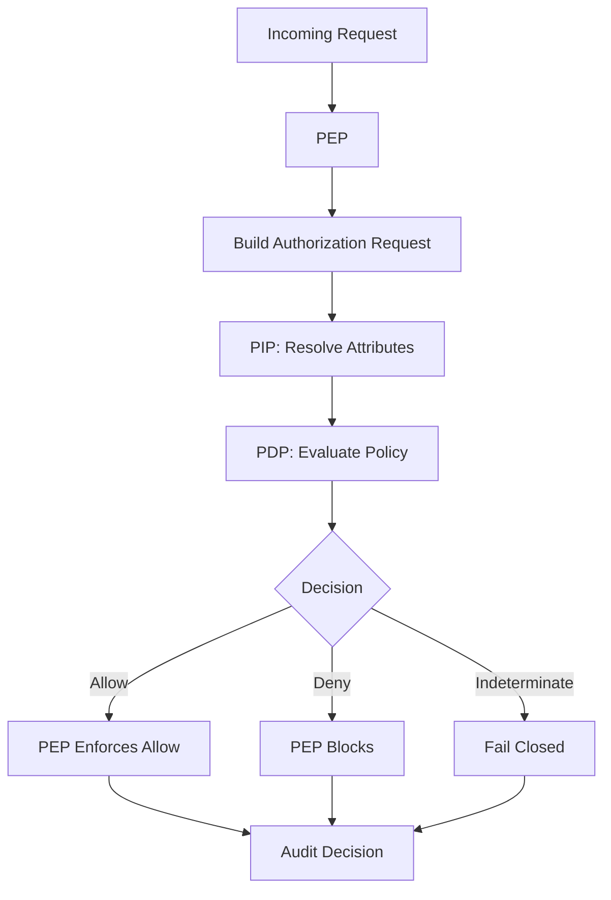
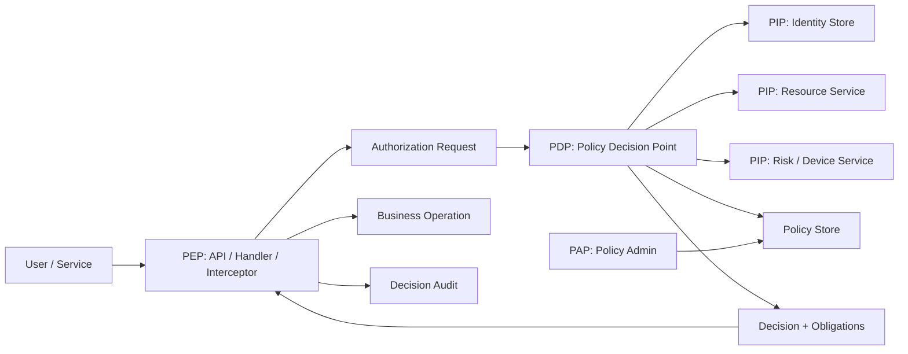
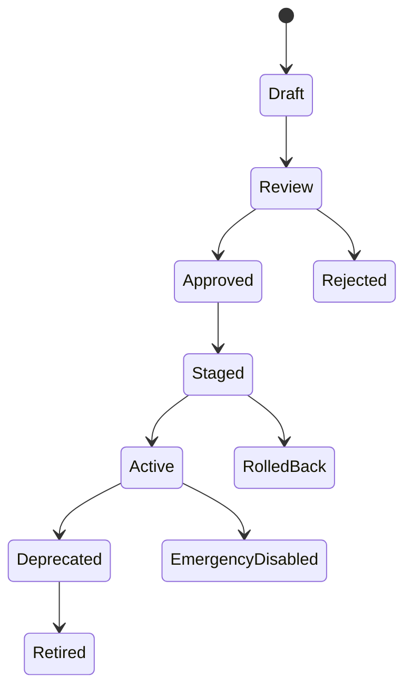
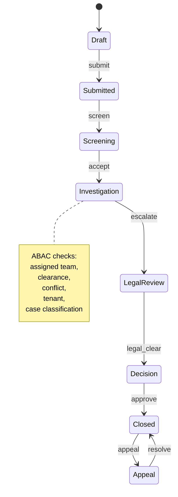
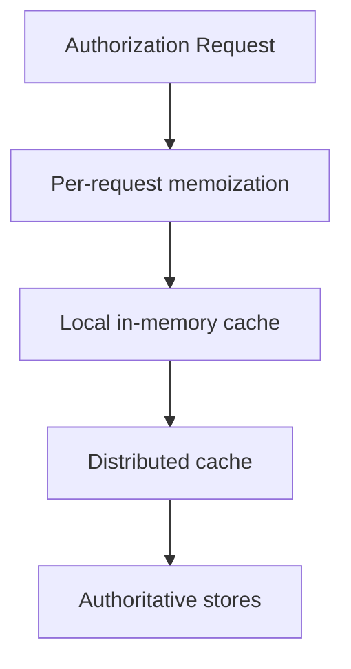
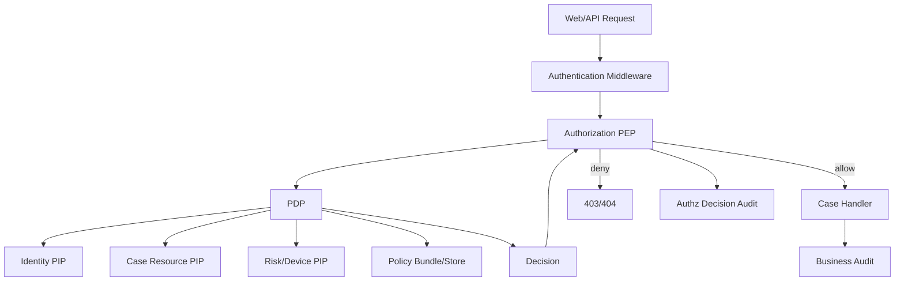

# learn-go-authentication-authorization-identity-permission-part-022.md

# Part 022 — ABAC: Attribute-Based Access Control untuk Enterprise Systems di Go

> **Series**: `learn-go-authentication-authorization-identity-permission`  
> **Part**: 022 dari 035  
> **Target Go**: Go 1.26.x  
> **Level**: Advanced / Principal / Internal Engineering Handbook  
> **Fokus**: Attribute-Based Access Control, policy decisioning, attribute governance, Go implementation, multi-tenant enterprise authorization, auditability, failure modelling.

---

## Daftar Isi

1. [Tujuan Part Ini](#1-tujuan-part-ini)
2. [Masalah yang Diselesaikan ABAC](#2-masalah-yang-diselesaikan-abac)
3. [ABAC dalam Satu Kalimat](#3-abac-dalam-satu-kalimat)
4. [Posisi ABAC di Antara RBAC, ReBAC, PBAC, dan Scope](#4-posisi-abac-di-antara-rbac-rebac-pbac-dan-scope)
5. [Terminologi Presisi](#5-terminologi-presisi)
6. [ABAC Core Model](#6-abac-core-model)
7. [Empat Kategori Attribute](#7-empat-kategori-attribute)
8. [ABAC sebagai Decision System, Bukan If-Else Bertebaran](#8-abac-sebagai-decision-system-bukan-if-else-bertebaran)
9. [ABAC Architecture: PEP, PDP, PIP, PAP](#9-abac-architecture-pep-pdp-pip-pap)
10. [Design Invariants ABAC](#10-design-invariants-abac)
11. [Attribute Engineering](#11-attribute-engineering)
12. [Attribute Source of Truth](#12-attribute-source-of-truth)
13. [Attribute Freshness, Provenance, dan Confidence](#13-attribute-freshness-provenance-dan-confidence)
14. [Policy Engineering](#14-policy-engineering)
15. [Combining Algorithm: Ketika Banyak Policy Bertabrakan](#15-combining-algorithm-ketika-banyak-policy-bertabrakan)
16. [Decision Contract yang Benar](#16-decision-contract-yang-benar)
17. [Go Package Architecture](#17-go-package-architecture)
18. [Go Domain Types untuk ABAC](#18-go-domain-types-untuk-abac)
19. [PIP Interface dan Attribute Resolver](#19-pip-interface-dan-attribute-resolver)
20. [PDP Interface dan Evaluator](#20-pdp-interface-dan-evaluator)
21. [PEP HTTP Middleware](#21-pep-http-middleware)
22. [PEP gRPC Interceptor](#22-pep-grpc-interceptor)
23. [ABAC untuk Background Worker dan Event Consumer](#23-abac-untuk-background-worker-dan-event-consumer)
24. [Schema Reference](#24-schema-reference)
25. [Policy-as-Code dengan OPA/Rego](#25-policy-as-code-dengan-oparego)
26. [ABAC dengan Casbin](#26-abac-dengan-casbin)
27. [Custom ABAC Engine di Go](#27-custom-abac-engine-di-go)
28. [Multi-Tenant ABAC](#28-multi-tenant-abac)
29. [ABAC untuk Workflow dan Case Management](#29-abac-untuk-workflow-dan-case-management)
30. [ABAC untuk Field-Level dan Document-Level Security](#30-abac-untuk-field-level-dan-document-level-security)
31. [Caching dan Staleness](#31-caching-dan-staleness)
32. [TOCTOU: Time-of-Check vs Time-of-Use](#32-toctou-time-of-check-vs-time-of-use)
33. [Auditability dan Regulatory Defensibility](#33-auditability-dan-regulatory-defensibility)
34. [Observability Khusus Authorization Decision](#34-observability-khusus-authorization-decision)
35. [Testing Strategy](#35-testing-strategy)
36. [Performance Engineering](#36-performance-engineering)
37. [Failure Modes](#37-failure-modes)
38. [Anti-Pattern ABAC](#38-anti-pattern-abac)
39. [Case Study: Regulatory Case Management Platform](#39-case-study-regulatory-case-management-platform)
40. [Production Checklist](#40-production-checklist)
41. [Latihan Desain](#41-latihan-desain)
42. [Ringkasan](#42-ringkasan)
43. [Referensi Primer](#43-referensi-primer)
44. [Next Part](#44-next-part)

---

## 1. Tujuan Part Ini

Di part sebelumnya kita sudah membahas permission modelling: action, resource, scope, constraint, condition. Sekarang kita masuk ke **ABAC**, yaitu model authorization yang membuat keputusan berdasarkan **attribute**.

Target pemahaman setelah part ini:

1. Bisa membedakan ABAC dari RBAC, ReBAC, permission table, OAuth scope, dan hardcoded business rule.
2. Bisa mendesain attribute model yang tidak rapuh.
3. Bisa menentukan attribute mana yang boleh dipercaya, dari mana asalnya, seberapa fresh, dan siapa authority-nya.
4. Bisa membangun PDP/PEP/PIP/PAP untuk ABAC di Go.
5. Bisa mengevaluasi trade-off antara OPA/Rego, Casbin, dan custom evaluator.
6. Bisa menerapkan ABAC untuk multi-tenant, workflow, field-level access, document classification, dan regulatory audit.
7. Bisa memodelkan failure mode ABAC: stale attribute, missing attribute, inconsistent policy, privilege escalation, tenant breakout, dan audit gap.

ABAC sering terlihat seperti topik “policy saja”. Pada sistem enterprise, ABAC jauh lebih dari itu. ABAC adalah gabungan dari:

- identity model,
- resource model,
- attribute governance,
- policy authoring,
- distributed data freshness,
- decision logging,
- runtime enforcement,
- operational runbook,
- dan compliance evidence.

Kalau RBAC bisa rusak karena **role explosion**, ABAC bisa rusak karena **attribute chaos**.

---

## 2. Masalah yang Diselesaikan ABAC

RBAC nyaman ketika akses bisa dijelaskan dengan role stabil:

```text
User dengan role CaseOfficer boleh view case.
User dengan role Supervisor boleh approve case.
Admin boleh manage user.
```

Namun sistem nyata sering punya rule seperti ini:

```text
Case officer boleh melihat case jika:
- case berada di tenant/agency yang sama,
- officer assigned ke case tersebut atau berada dalam team yang menangani case,
- case belum masuk stage LegalReview kecuali officer punya clearance LegalRead,
- case tidak ditandai Restricted kecuali officer punya confidentiality clearance yang cukup,
- akses dilakukan dari intranet atau device trusted,
- sesi login punya AAL minimal 2,
- officer bukan subject yang sedang diselidiki,
- waktu akses masih dalam delegated assignment window,
- data field yang dilihat bukan PII sensitif kecuali purpose access valid.
```

Jika rule seperti itu dipaksakan ke RBAC murni, hasilnya biasanya:

```text
Role:
- CaseOfficerAssignedInAgencyAForNonRestrictedCases
- CaseOfficerAssignedInAgencyAForRestrictedCases
- CaseOfficerLegalReadAgencyA
- SupervisorAgencyAAfterEscalation
- SupervisorAgencyAAfterEscalationRestricted
- InvestigationOfficerNonConflicted
- InvestigationOfficerConflictedNoPII
...
```

Itu role explosion.

ABAC menyelesaikan ini dengan mengubah pertanyaan authorization dari:

```text
Apakah user punya role X?
```

menjadi:

```text
Apakah subject dengan attributes S boleh melakukan action A terhadap resource dengan attributes R dalam environment E?
```

Contoh:

```text
allow if
  subject.tenant_id == resource.tenant_id
  and subject.clearance >= resource.classification
  and action == "case.read"
  and resource.status not in ["sealed", "archived_sensitive"]
  and environment.assurance_level >= 2
  and environment.network_zone in ["intranet", "trusted-vpn"]
```

ABAC cocok ketika akses dipengaruhi oleh banyak dimensi yang berubah-ubah.

---

## 3. ABAC dalam Satu Kalimat

**ABAC adalah model authorization di mana keputusan akses ditentukan dengan mengevaluasi attribute milik subject, resource/object, action/operation, dan environment terhadap policy.**

Secara mental:

```text
Decision = f(SubjectAttributes, ResourceAttributes, ActionAttributes, EnvironmentAttributes, Policy)
```

Atau:

```text
Can(subject, action, resource, environment) -> allow | deny | indeterminate
```

Yang penting: ABAC bukan hanya “role ditambah kondisi”. ABAC menuntut disiplin terhadap:

- attribute naming,
- attribute source,
- attribute freshness,
- attribute completeness,
- policy evaluation,
- conflict resolution,
- dan decision evidence.

---

## 4. Posisi ABAC di Antara RBAC, ReBAC, PBAC, dan Scope

### 4.1 RBAC

RBAC menjawab:

```text
Apa role subject?
Role itu membawa permission apa?
```

RBAC kuat untuk struktur organisasi yang relatif stabil.

Contoh:

```text
role: Supervisor
permission: case.approve
```

Kelemahan RBAC:

- role explosion,
- sulit menangani kondisi dinamis,
- sering mencampur job title dengan permission,
- tidak cukup untuk object-level constraints.

### 4.2 ABAC

ABAC menjawab:

```text
Apa attribute subject, resource, action, dan environment saat request terjadi?
Apakah kombinasi attribute itu memenuhi policy?
```

Contoh:

```text
subject.department == resource.owner_department
and subject.clearance >= resource.classification
and env.network_zone == "intranet"
```

Kekuatan ABAC:

- fleksibel,
- bisa object-level,
- bisa context-aware,
- cocok untuk compliance dan data classification.

Kelemahan ABAC:

- policy bisa sulit dibaca,
- attribute source bisa kacau,
- debugging lebih sulit,
- stale attribute dapat membuka akses salah.

### 4.3 ReBAC

ReBAC menjawab:

```text
Apa hubungan subject dengan resource?
```

Contoh:

```text
user is assigned_officer of case
user is supervisor of assigned_officer
user is member of team owning case
```

ReBAC cocok untuk relationship graph.

ABAC dan ReBAC sering digabung:

```text
allow if
  relation(subject, "assigned_officer", resource)
  and subject.tenant_id == resource.tenant_id
  and subject.clearance >= resource.classification
```

### 4.4 PBAC / Policy-Based Access Control

PBAC biasanya berarti authorization decision dikelola melalui policy eksplisit. ABAC sering diimplementasikan sebagai PBAC karena attribute rule ditulis sebagai policy.

### 4.5 OAuth Scope

OAuth scope bukan ABAC. Scope adalah delegated permission hint/boundary pada token.

Contoh scope:

```text
case.read
case.write
```

Scope menjawab:

```text
Token ini diberi authority global apa oleh authorization server?
```

ABAC tetap perlu menjawab:

```text
Untuk case tertentu, dalam context tertentu, boleh tidak?
```

Token dengan scope `case.read` tidak otomatis boleh membaca semua case.

### 4.6 Claims

Claim bukan policy. Claim adalah statement dalam token atau assertion.

Contoh:

```json
{
  "sub": "user-123",
  "tenant_id": "agency-a",
  "acr": "aal2",
  "department": "enforcement"
}
```

Policy menentukan apakah claim itu cukup untuk akses.

---

## 5. Terminologi Presisi

| Istilah | Makna |
|---|---|
| Subject | Entitas yang meminta akses: user, service, delegated actor. |
| Principal | Representasi authenticated identity di runtime. |
| Actor | Pihak yang melakukan aksi, bisa berbeda dari subject saat impersonation/delegation. |
| Resource/Object | Target akses: case, document, field, workflow task, report. |
| Action/Operation | Aksi yang diminta: read, update, approve, export, assign. |
| Environment | Kondisi request: time, network zone, assurance level, device trust, risk score. |
| Attribute | Fakta terstruktur tentang subject/resource/action/environment. |
| Policy | Rule yang menentukan allow/deny berdasarkan attribute. |
| PDP | Policy Decision Point: komponen yang menghitung keputusan. |
| PEP | Policy Enforcement Point: komponen yang memaksa keputusan. |
| PIP | Policy Information Point: penyedia attribute. |
| PAP | Policy Administration Point: tempat policy dikelola. |
| Obligation | Instruksi yang wajib dilakukan PEP jika decision allow/deny. |
| Advice | Informasi tambahan yang tidak wajib tapi berguna. |
| Reason Code | Kode stabil yang menjelaskan mengapa decision dibuat. |

---

## 6. ABAC Core Model

Model minimal ABAC:

```text
Request:
  subject attributes
  resource attributes
  action attributes
  environment attributes

Policy:
  rules over attributes

Decision:
  effect: allow | deny | indeterminate
  reason: stable reason code
  obligations: actions PEP must perform
  evidence: policy version + attributes used
```

Diagram mental:



ABAC bagus ketika kita bisa menjawab dengan disiplin:

1. Attribute apa yang dipakai?
2. Siapa authority attribute itu?
3. Apakah attribute itu fresh?
4. Policy mana yang mengevaluasi?
5. Kalau attribute hilang, default-nya apa?
6. Bagaimana keputusan diaudit?
7. Bagaimana perubahan attribute membatalkan akses?

---

## 7. Empat Kategori Attribute

NIST ABAC secara umum memakai subject, object, operation, dan environment attribute.

### 7.1 Subject Attributes

Subject attribute menjelaskan peminta akses.

Contoh:

```json
{
  "subject.id": "user-123",
  "subject.type": "human",
  "subject.tenant_id": "agency-a",
  "subject.department": "enforcement",
  "subject.clearance_level": 3,
  "subject.employment_status": "active",
  "subject.assigned_team_ids": ["team-1", "team-7"],
  "subject.roles": ["case_officer"],
  "subject.risk_score": 18,
  "subject.training_completed": ["pii_access", "legal_review"]
}
```

Subject attribute tidak harus semuanya berasal dari token. Banyak attribute harus diambil dari authoritative store.

Token claims cocok untuk attribute yang:

- immutable atau low-risk,
- tidak perlu real-time revocation,
- ukurannya kecil,
- diterbitkan oleh issuer terpercaya,
- punya TTL pendek.

Token claims buruk untuk attribute yang:

- sering berubah,
- high-risk,
- memerlukan revocation cepat,
- berasal dari resource state,
- atau terlalu besar.

### 7.2 Resource/Object Attributes

Resource attribute menjelaskan target akses.

Contoh:

```json
{
  "resource.type": "case",
  "resource.id": "case-456",
  "resource.tenant_id": "agency-a",
  "resource.owner_department": "enforcement",
  "resource.classification": 2,
  "resource.status": "investigation",
  "resource.stage": "evidence_review",
  "resource.assigned_team_id": "team-7",
  "resource.has_pii": true,
  "resource.sealed": false,
  "resource.created_by": "user-999"
}
```

Resource attribute sering menjadi sumber IDOR/BOLA bug jika tidak dicek.

Rule paling penting:

```text
Tidak cukup subject punya permission umum.
Resource spesifik harus tetap dicek.
```

### 7.3 Action/Operation Attributes

Action attribute menjelaskan aksi.

Contoh:

```json
{
  "action.name": "case.export",
  "action.category": "read",
  "action.sensitivity": "high",
  "action.requires_reason": true,
  "action.requires_step_up": true,
  "action.data_movement": "externalizable"
}
```

Action bukan sekadar string `read` atau `write`. Pada enterprise system, action punya risk profile.

Contoh perbedaan:

```text
case.read_summary       -> low risk
case.read_full          -> medium/high risk
case.read_pii           -> high risk
case.export_csv         -> high risk
case.bulk_export        -> very high risk
case.assign             -> workflow control risk
case.approve            -> legal/business authority risk
case.delete             -> destructive risk
```

### 7.4 Environment Attributes

Environment attribute menjelaskan konteks request.

Contoh:

```json
{
  "env.time": "2026-06-24T20:00:00+07:00",
  "env.network_zone": "intranet",
  "env.device_trust": "managed",
  "env.session_aal": 2,
  "env.auth_age_seconds": 180,
  "env.ip_reputation": "normal",
  "env.channel": "web",
  "env.request_purpose": "case_handling",
  "env.break_glass": false
}
```

Environment attribute sering menjadi dasar step-up auth dan adaptive access.

---

## 8. ABAC sebagai Decision System, Bukan If-Else Bertebaran

Kesalahan umum:

```go
if user.Role == "admin" {
    return allow()
}

if user.Department == case.Department && case.Status != "sealed" {
    return allow()
}

if user.Clearance >= case.Classification {
    return allow()
}
```

Masalahnya:

1. Rule tersebar di handler.
2. Tidak ada audit evidence.
3. Tidak ada policy version.
4. Sulit test semua kombinasi.
5. Tidak ada deny reason stabil.
6. Sulit menambahkan obligation.
7. Mudah lupa tenant boundary.
8. Decision tidak reusable antara HTTP, gRPC, worker, dan batch job.

ABAC yang benar:

```go
decision, err := authorizer.Decide(ctx, authz.Request{
    Subject:  principal.SubjectRef(),
    Action:   authz.Action("case.read_full"),
    Resource: authz.ResourceRef{Type: "case", ID: caseID},
    Env:      authz.FromHTTPRequest(r),
})
if err != nil {
    return internalError()
}
if !decision.Allowed() {
    return forbidden(decision.PublicReason())
}
```

Handler tidak perlu tahu seluruh policy. Handler hanya tahu action dan resource target.

---

## 9. ABAC Architecture: PEP, PDP, PIP, PAP



### 9.1 PEP

PEP berada di tempat request dieksekusi:

- HTTP middleware,
- route handler,
- gRPC interceptor,
- worker consumer,
- batch export job,
- GraphQL resolver,
- report generator,
- file download endpoint.

Tugas PEP:

1. Extract principal.
2. Tentukan action.
3. Tentukan resource.
4. Kirim request ke PDP.
5. Enforce allow/deny.
6. Jalankan obligation.
7. Tulis audit.

PEP tidak boleh membuat keputusan diam-diam yang melewati PDP untuk akses sensitif.

### 9.2 PDP

PDP mengevaluasi policy.

Tugas PDP:

1. Normalize request.
2. Resolve attribute via PIP.
3. Evaluate policy.
4. Apply combining algorithm.
5. Return decision.
6. Attach reason codes, obligations, and evidence.

### 9.3 PIP

PIP menyediakan attribute.

Contoh PIP:

- identity service,
- user directory,
- HR system,
- tenant service,
- case service,
- document service,
- classification service,
- risk engine,
- device trust service,
- session service.

### 9.4 PAP

PAP adalah tempat policy dikelola.

Bisa berupa:

- Git repository policy-as-code,
- admin UI,
- database-backed policy registry,
- OPA bundle repository,
- Casbin policy table,
- custom governance workflow.

PAP harus punya:

- approval workflow,
- versioning,
- diff,
- tests,
- rollout strategy,
- rollback,
- audit trail.

---

## 10. Design Invariants ABAC

Gunakan invariant ini sebagai checklist desain.

### Invariant 1 — Default Deny

Jika policy tidak cocok, attribute hilang, evaluator error, atau PIP gagal untuk attribute kritikal, hasil default harus deny.

```text
Unknown is not allow.
Missing is not allow.
Error is not allow.
```

### Invariant 2 — Tenant Boundary Tidak Boleh Menjadi Optional Policy

Tenant isolation harus menjadi guard global, bukan rule opsional yang bisa lupa ditambahkan.

```text
subject.tenant_id == resource.tenant_id
```

Untuk cross-tenant admin, harus explicit:

```text
subject.cross_tenant_authority == true
and action in allowed_cross_tenant_actions
and reason_code present
and step_up satisfied
```

### Invariant 3 — Token Claims Bukan Source of Truth Universal

Token claims boleh menjadi input, bukan kebenaran tunggal untuk semua attribute.

Contoh buruk:

```go
if claims.Department == case.Department {
    allow()
}
```

Jika department user bisa berubah dan token TTL panjang, akses bisa stale.

### Invariant 4 — Resource Attribute Harus Diambil dari Resource Authority

Jangan percaya resource attribute dari client.

Buruk:

```json
{
  "case_id": "case-123",
  "case_tenant_id": "agency-a"
}
```

Client bisa mengirim tenant palsu.

Benar:

```text
client sends case_id
server loads case attributes from case service/database
```

### Invariant 5 — Attribute Freshness Harus Sejalan dengan Risiko

Akses high-risk membutuhkan attribute lebih fresh.

Contoh:

```text
view public-ish summary    -> attribute TTL 5 menit mungkin cukup
export PII                 -> attribute harus fresh atau revalidated
approve enforcement action -> fresh assignment + fresh AAL + fresh conflict check
```

### Invariant 6 — Authorization Decision Harus Diaudit sebagai Evidence

Audit minimal:

- subject,
- actor,
- action,
- resource,
- tenant,
- decision,
- reason code,
- policy version,
- attribute version/freshness,
- request correlation id,
- obligations,
- timestamp.

### Invariant 7 — Policy Harus Bisa Diuji Tanpa Menjalankan Handler

Jika authorization hanya ada di handler, policy sulit diuji.

Policy harus bisa dites seperti:

```go
decision := pdp.Decide(ctx, testRequest)
require.Equal(t, authz.Deny, decision.Effect)
require.Contains(t, decision.Reasons, "RESOURCE_CLASSIFICATION_TOO_HIGH")
```

### Invariant 8 — Deny Reason Internal dan Public Harus Dipisah

Public reason jangan membocorkan informasi resource.

Internal:

```text
DENY_RESOURCE_CLASSIFICATION_EXCEEDS_SUBJECT_CLEARANCE
```

Public:

```text
access_denied
```

---

## 11. Attribute Engineering

ABAC gagal ketika attribute tidak didesain.

### 11.1 Attribute Naming

Gunakan namespace eksplisit:

```text
subject.id
subject.type
subject.tenant_id
subject.department
subject.clearance_level
subject.roles
subject.employment_status

resource.type
resource.id
resource.tenant_id
resource.owner_department
resource.classification
resource.status
resource.workflow_stage

action.name
action.category
action.sensitivity

env.network_zone
env.session_aal
env.auth_age_seconds
env.device_trust
```

Jangan gunakan nama ambigu:

```text
level
status
type
owner
role
```

Karena `status` bisa berarti user status, case status, session status, atau document status.

### 11.2 Attribute Type

Attribute harus typed.

Buruk:

```go
map[string]string{
    "clearance": "high",
    "classification": "2",
}
```

Lebih baik:

```go
type ClearanceLevel int

type ClassificationLevel int

const (
    ClearancePublic ClearanceLevel = iota
    ClearanceInternal
    ClearanceRestricted
    ClearanceSecret
)
```

### 11.3 Attribute Cardinality

Attribute bisa:

- single value,
- multi value,
- hierarchical,
- computed,
- temporal,
- derived,
- external.

Contoh:

```text
subject.department        -> single
subject.team_ids          -> multi
resource.org_path         -> hierarchical
subject.risk_score        -> computed
assignment.valid_until    -> temporal
subject.clearance         -> HR/security authority
```

### 11.4 Attribute Mutability

Klasifikasi berdasarkan seberapa sering berubah:

| Jenis | Contoh | Risiko |
|---|---|---|
| Immutable | subject id, tenant id created at registration | Rendah |
| Slow-changing | department, job title | Medium |
| Fast-changing | assignment, session AAL, risk score | Tinggi |
| Request-scoped | IP, device, purpose | Tinggi |
| Resource-state | case stage, sealed flag | Tinggi |

Semakin sering berubah, semakin hati-hati caching-nya.

### 11.5 Attribute Sensitivity

Attribute sendiri bisa sensitif.

Contoh:

- investigation target flag,
- conflict of interest flag,
- risk score,
- medical status,
- disciplinary status,
- law enforcement classification.

Jangan log attribute sensitif mentah-mentah.

---

## 12. Attribute Source of Truth

Pertanyaan paling penting dalam ABAC:

```text
Dari mana attribute ini berasal, dan siapa yang punya authority untuk mengubahnya?
```

### 12.1 Contoh Attribute Authority

| Attribute | Authority |
|---|---|
| subject.employment_status | HR / identity directory |
| subject.tenant_id | tenant/account service |
| subject.roles | IAM/admin policy service |
| subject.clearance_level | security office / clearance registry |
| resource.classification | document/case service |
| resource.workflow_stage | workflow engine |
| env.session_aal | session/auth service |
| env.device_trust | device trust service |
| env.network_zone | gateway/infrastructure context |
| env.risk_score | risk engine |

### 12.2 Jangan Mempercayai Client-Supplied Attribute

Client boleh mengirim:

```json
{
  "case_id": "case-123"
}
```

Client tidak boleh menentukan:

```json
{
  "case_tenant_id": "agency-a",
  "case_classification": 1,
  "user_clearance": 3
}
```

Attribute itu harus di-resolve server-side.

### 12.3 Token Claim as Attribute Source

Token claim bisa menjadi source jika:

- issuer terpercaya,
- claim ditandatangani,
- token valid,
- TTL sesuai risiko,
- claim semantiknya jelas,
- claim tidak perlu real-time freshness.

Namun untuk policy sensitif, claim sering harus direkonsiliasi:

```text
claims.tenant_id == account.tenant_id
claims.sub maps to active principal
claims.acr satisfies action requirement
```

---

## 13. Attribute Freshness, Provenance, dan Confidence

ABAC tidak cukup hanya tahu nilai attribute. Kita juga perlu tahu metadata attribute.

### 13.1 Attribute Value Object

```go
type Attribute[T any] struct {
    Name       string
    Value      T
    Source     string
    Retrieved  time.Time
    ExpiresAt  *time.Time
    Version    string
    Confidence Confidence
}

type Confidence string

const (
    ConfidenceAuthoritative Confidence = "authoritative"
    ConfidenceDerived       Confidence = "derived"
    ConfidenceUserSupplied  Confidence = "user_supplied"
    ConfidenceUnverified    Confidence = "unverified"
)
```

### 13.2 Freshness Budget

Setiap action punya freshness budget.

```go
type FreshnessRequirement struct {
    Attribute string
    MaxAge    time.Duration
}

var ExportPIIRequirements = []FreshnessRequirement{
    {Attribute: "subject.employment_status", MaxAge: 1 * time.Minute},
    {Attribute: "subject.clearance_level", MaxAge: 1 * time.Minute},
    {Attribute: "resource.classification", MaxAge: 0}, // must be read fresh
    {Attribute: "env.session_aal", MaxAge: 0},
}
```

`MaxAge: 0` berarti harus dievaluasi dari request/session/resource state saat itu.

### 13.3 Provenance

Provenance menjawab:

```text
Attribute ini berasal dari sistem apa, versi data apa, dan kapan diambil?
```

Audit decision tanpa provenance sering tidak cukup untuk forensic reconstruction.

---

## 14. Policy Engineering

Policy ABAC harus readable, testable, versioned, dan governable.

### 14.1 Policy Shape

Policy minimal:

```yaml
id: case-read-full-v3
version: 3
status: active
effect: allow
action: case.read_full
conditions:
  - subject.tenant_id == resource.tenant_id
  - subject.employment_status == "active"
  - subject.clearance_level >= resource.classification
  - resource.status not_in ["sealed"]
  - env.session_aal >= 2
obligations:
  - audit_access
  - mask_fields_if_partial_clearance
```

### 14.2 Policy Metadata

Policy harus punya:

- id,
- version,
- owner,
- approval state,
- effective date,
- expiry date jika temporary,
- risk classification,
- test suite reference,
- rollout state,
- rollback pointer.

### 14.3 Policy Lifecycle



### 14.4 Policy Review Questions

Sebelum policy dipromosikan:

1. Apa objective policy?
2. Resource apa yang dilindungi?
3. Action apa yang diatur?
4. Attribute apa yang dipakai?
5. Source of truth attribute jelas?
6. Attribute freshness cukup?
7. Default deny?
8. Tenant boundary ada?
9. Deny reason stabil?
10. Test case allow/deny/edge lengkap?
11. Ada policy conflict?
12. Audit evidence cukup?

---

## 15. Combining Algorithm: Ketika Banyak Policy Bertabrakan

Dalam sistem nyata, banyak policy bisa match request yang sama.

Contoh:

```text
Policy A: case officer can read assigned case.
Policy B: restricted case requires clearance 3.
Policy C: legal hold case cannot be exported.
Policy D: break-glass allows emergency read with approval.
```

Apa hasilnya jika A allow tapi B deny?

Kita butuh combining algorithm.

### 15.1 Deny Overrides

Jika ada deny eksplisit, hasil akhir deny.

Cocok untuk security-sensitive systems.

```text
allow + deny = deny
```

### 15.2 Permit Overrides

Jika ada allow, hasil allow.

Berbahaya untuk sistem sensitif, tetapi kadang dipakai untuk emergency access dengan policy ketat.

```text
deny + allow = allow
```

### 15.3 First Applicable

Policy dievaluasi berurutan, hasil policy pertama yang applicable dipakai.

Risiko: ordering bug.

### 15.4 Priority-Based

Policy punya priority eksplisit.

```yaml
priority: 100
```

Lebih mudah di-govern daripada implicit order.

### 15.5 Recommended Enterprise Default

Untuk sistem regulatory/enterprise:

```text
1. Explicit global deny rules first.
2. Tenant isolation deny is non-bypassable.
3. Legal hold / sealed / conflict-of-interest deny overrides normal allow.
4. Emergency/break-glass allow only through separate policy path with stronger obligations.
5. Missing critical attribute -> deny.
6. Indeterminate -> deny.
```

---

## 16. Decision Contract yang Benar

Decision bukan boolean.

Buruk:

```go
func Can(user User, action string, resource Resource) bool
```

Terlalu miskin. Tidak ada alasan, evidence, obligations, freshness, policy version.

Lebih baik:

```go
type Effect string

const (
    EffectAllow         Effect = "allow"
    EffectDeny          Effect = "deny"
    EffectIndeterminate Effect = "indeterminate"
)

type Decision struct {
    Effect       Effect
    Reasons      []Reason
    Obligations  []Obligation
    Advice       []Advice
    PolicyID     string
    PolicyVersion string
    EvaluatedAt  time.Time
    Evidence     Evidence
}

func (d Decision) Allowed() bool {
    return d.Effect == EffectAllow
}
```

### 16.1 Reason Code

```go
type Reason struct {
    Code       string
    Message    string // internal, not always public
    PublicCode string
}
```

Contoh code:

```text
ALLOW_ASSIGNED_OFFICER_WITH_CLEARANCE
DENY_TENANT_MISMATCH
DENY_RESOURCE_CLASSIFICATION_TOO_HIGH
DENY_SESSION_AAL_TOO_LOW
DENY_RESOURCE_SEALED
DENY_CONFLICT_OF_INTEREST
DENY_ATTRIBUTE_MISSING
DENY_POLICY_INDETERMINATE
```

### 16.2 Obligation

Obligation adalah instruksi wajib untuk PEP.

Contoh:

```go
type Obligation struct {
    Type   string
    Params map[string]any
}
```

Contoh obligation:

```json
{
  "type": "mask_fields",
  "params": {"fields": ["national_id", "phone", "address"]}
}
```

Atau:

```json
{
  "type": "require_reason_code",
  "params": {"min_length": 20}
}
```

PEP harus enforce obligation. Jika PEP tidak mampu menjalankan obligation, hasil harus deny atau fail closed.

---

## 17. Go Package Architecture

Struktur package yang disarankan:

```text
/internal/authz
  request.go
  decision.go
  authorizer.go
  errors.go

/internal/authz/attribute
  attribute.go
  resolver.go
  registry.go
  freshness.go

/internal/authz/policy
  policy.go
  evaluator.go
  combining.go
  version.go

/internal/authz/pip
  identity_resolver.go
  resource_resolver.go
  tenant_resolver.go
  risk_resolver.go
  cache.go

/internal/authz/pep/http
  middleware.go
  route_guard.go

/internal/authz/pep/grpc
  interceptor.go

/internal/authz/audit
  decision_log.go
  redaction.go

/internal/authz/opa
  evaluator.go

/internal/authz/casbin
  enforcer.go
```

Prinsip:

1. Handler tidak tahu detail policy.
2. PDP tidak melakukan business mutation.
3. PIP hanya resolve attribute, tidak decide.
4. PEP enforce decision dan obligations.
5. Audit decision berada di boundary PEP/PDP.
6. Policy evaluator bisa diganti tanpa mengubah handler.

---

## 18. Go Domain Types untuk ABAC

### 18.1 SubjectRef, ResourceRef, Action

```go
package authz

import "time"

type SubjectType string

const (
    SubjectHuman   SubjectType = "human"
    SubjectService SubjectType = "service"
)

type SubjectRef struct {
    ID       string
    Type     SubjectType
    TenantID string
}

type ResourceRef struct {
    Type     string
    ID       string
    TenantID string // optional hint, must be reconciled server-side
}

type Action string
```

### 18.2 Environment

```go
type Environment struct {
    Time           time.Time
    RequestID      string
    CorrelationID  string
    NetworkZone    string
    Channel        string
    SessionAAL     int
    AuthAgeSeconds int
    DeviceTrust    string
    IPReputation   string
    Purpose        string
}
```

### 18.3 Request

```go
type Request struct {
    Subject  SubjectRef
    Actor    *SubjectRef
    Action   Action
    Resource ResourceRef
    Env      Environment
}
```

Actor dipakai untuk impersonation/delegation.

```text
subject = user yang authority-nya dipakai
actor   = admin/support yang menjalankan aksi
```

### 18.4 AttributeBag

```go
type AttributeBag struct {
    Subject  map[string]AttributeValue
    Resource map[string]AttributeValue
    Action   map[string]AttributeValue
    Env      map[string]AttributeValue
}

type AttributeValue struct {
    Name      string
    Value     any
    Source    string
    Retrieved time.Time
    ExpiresAt *time.Time
    Version   string
    Critical  bool
}
```

### 18.5 EvaluationInput

```go
type EvaluationInput struct {
    Request    Request
    Attributes AttributeBag
    PolicySet  string
    Now        time.Time
}
```

---

## 19. PIP Interface dan Attribute Resolver

PIP harus composable.

```go
type AttributeResolver interface {
    Resolve(ctx context.Context, req authz.Request) (authz.AttributeBag, error)
}
```

Namun untuk sistem besar, lebih baik resolver per domain:

```go
type SubjectAttributeResolver interface {
    ResolveSubject(ctx context.Context, subject authz.SubjectRef, action authz.Action) (map[string]authz.AttributeValue, error)
}

type ResourceAttributeResolver interface {
    ResolveResource(ctx context.Context, resource authz.ResourceRef, action authz.Action) (map[string]authz.AttributeValue, error)
}

type EnvironmentAttributeResolver interface {
    ResolveEnvironment(ctx context.Context, req authz.Request) (map[string]authz.AttributeValue, error)
}
```

Aggregator:

```go
type CompositeResolver struct {
    SubjectResolvers []SubjectAttributeResolver
    ResourceResolvers []ResourceAttributeResolver
    EnvResolvers []EnvironmentAttributeResolver
}

func (r *CompositeResolver) Resolve(ctx context.Context, req authz.Request) (authz.AttributeBag, error) {
    bag := authz.AttributeBag{
        Subject:  map[string]authz.AttributeValue{},
        Resource: map[string]authz.AttributeValue{},
        Action:   map[string]authz.AttributeValue{},
        Env:      map[string]authz.AttributeValue{},
    }

    for _, sr := range r.SubjectResolvers {
        attrs, err := sr.ResolveSubject(ctx, req.Subject, req.Action)
        if err != nil {
            return bag, err
        }
        mergeAttrs(bag.Subject, attrs)
    }

    for _, rr := range r.ResourceResolvers {
        attrs, err := rr.ResolveResource(ctx, req.Resource, req.Action)
        if err != nil {
            return bag, err
        }
        mergeAttrs(bag.Resource, attrs)
    }

    for _, er := range r.EnvResolvers {
        attrs, err := er.ResolveEnvironment(ctx, req)
        if err != nil {
            return bag, err
        }
        mergeAttrs(bag.Env, attrs)
    }

    bag.Action["name"] = authz.AttributeValue{
        Name:      "action.name",
        Value:     string(req.Action),
        Source:    "request",
        Retrieved: time.Now(),
        Critical:  true,
    }

    return bag, nil
}
```

### 19.1 Resolver Harus Action-Aware

Jangan selalu load semua attribute.

Untuk `case.read_summary`, mungkin cukup:

```text
subject.active
subject.tenant_id
resource.tenant_id
resource.status
```

Untuk `case.export_pii`, perlu:

```text
subject.active
subject.tenant_id
subject.clearance
subject.training_completed
subject.conflict_status
resource.tenant_id
resource.classification
resource.has_pii
resource.legal_hold
resource.export_allowed
env.session_aal
env.auth_age_seconds
env.device_trust
env.network_zone
env.purpose
```

PIP yang tidak action-aware akan mahal dan lambat.

---

## 20. PDP Interface dan Evaluator

```go
type Authorizer interface {
    Decide(ctx context.Context, req Request) (Decision, error)
}
```

Implementasi umum:

```go
type PDP struct {
    Resolver AttributeResolver
    Evaluator PolicyEvaluator
    Audit DecisionAudit
}

func (p *PDP) Decide(ctx context.Context, req Request) (Decision, error) {
    attrs, err := p.Resolver.Resolve(ctx, req)
    if err != nil {
        decision := Deny("DENY_ATTRIBUTE_RESOLUTION_FAILED")
        decision.Evidence.Request = req
        _ = p.Audit.Record(ctx, decision)
        return decision, nil // fail closed as decision, not transport error
    }

    input := EvaluationInput{
        Request: req,
        Attributes: attrs,
        Now: time.Now(),
    }

    decision, err := p.Evaluator.Evaluate(ctx, input)
    if err != nil {
        decision := Deny("DENY_POLICY_EVALUATION_FAILED")
        decision.Evidence.Request = req
        decision.Evidence.Attributes = attrs
        _ = p.Audit.Record(ctx, decision)
        return decision, nil
    }

    decision.Evidence.Request = req
    decision.Evidence.Attributes = attrs
    _ = p.Audit.Record(ctx, decision)

    return decision, nil
}
```

Catatan penting:

- PIP error untuk attribute kritikal sebaiknya menjadi deny decision, bukan 500 yang bisa diperlakukan ambiguous oleh caller.
- Transport error hanya untuk kegagalan sistem yang benar-benar membuat PDP tidak bisa memberi decision.
- Untuk resource operation, PEP harus fail closed.

---

## 21. PEP HTTP Middleware

Middleware umum bisa authenticate principal, tapi authorization sering route/resource-specific.

Contoh route guard:

```go
func RequireAction(authorizer authz.Authorizer, action authz.Action, resourceFromReq func(*http.Request) authz.ResourceRef) func(http.Handler) http.Handler {
    return func(next http.Handler) http.Handler {
        return http.HandlerFunc(func(w http.ResponseWriter, r *http.Request) {
            principal, ok := authn.PrincipalFromContext(r.Context())
            if !ok {
                http.Error(w, "unauthorized", http.StatusUnauthorized)
                return
            }

            req := authz.Request{
                Subject: authz.SubjectRef{
                    ID:       principal.SubjectID,
                    Type:     authz.SubjectHuman,
                    TenantID: principal.TenantID,
                },
                Action:   action,
                Resource: resourceFromReq(r),
                Env:      authz.EnvFromHTTPRequest(r, principal),
            }

            decision, err := authorizer.Decide(r.Context(), req)
            if err != nil {
                http.Error(w, "authorization_unavailable", http.StatusServiceUnavailable)
                return
            }

            if !decision.Allowed() {
                // Jangan bocorkan apakah resource ada.
                http.Error(w, "forbidden", http.StatusForbidden)
                return
            }

            ctx := authz.ContextWithDecision(r.Context(), decision)
            next.ServeHTTP(w, r.WithContext(ctx))
        })
    }
}
```

### 21.1 Resource Loader vs ResourceRef

Ada dua pola.

#### Pola A — PEP memberi ResourceRef saja

```text
PEP: case_id
PDP/PIP: load case attributes
```

Bagus untuk centralization.

#### Pola B — Handler load resource dahulu

```text
Handler: load case
PEP/PDP: evaluate loaded resource attributes
```

Bagus untuk menghindari double DB call, tapi harus hati-hati agar resource attribute tidak berasal dari client.

### 21.2 Avoid 404 vs 403 Leakage

Jika user tidak boleh tahu resource exists, return 404 untuk denied read bisa masuk akal.

Namun audit internal tetap harus mencatat deny.

```text
public response: 404 not found
internal reason: DENY_TENANT_MISMATCH
```

---

## 22. PEP gRPC Interceptor

Unary interceptor:

```go
func UnaryAuthorizationInterceptor(authorizer authz.Authorizer, mapper MethodMapper) grpc.UnaryServerInterceptor {
    return func(ctx context.Context, req any, info *grpc.UnaryServerInfo, handler grpc.UnaryHandler) (any, error) {
        principal, ok := authn.PrincipalFromContext(ctx)
        if !ok {
            return nil, status.Error(codes.Unauthenticated, "unauthenticated")
        }

        action, resource, err := mapper.Map(info.FullMethod, req)
        if err != nil {
            return nil, status.Error(codes.PermissionDenied, "forbidden")
        }

        decision, err := authorizer.Decide(ctx, authz.Request{
            Subject: authz.SubjectRef{
                ID: principal.SubjectID,
                Type: authz.SubjectHuman,
                TenantID: principal.TenantID,
            },
            Action: action,
            Resource: resource,
            Env: authz.Environment{
                Time: time.Now(),
                Channel: "grpc",
                SessionAAL: principal.AAL,
            },
        })
        if err != nil {
            return nil, status.Error(codes.Unavailable, "authorization unavailable")
        }
        if !decision.Allowed() {
            return nil, status.Error(codes.PermissionDenied, "forbidden")
        }

        ctx = authz.ContextWithDecision(ctx, decision)
        return handler(ctx, req)
    }
}
```

### 22.1 Method Mapping

Jangan hardcode fragile mapping tersebar.

Gunakan registry:

```go
type MethodPolicy struct {
    FullMethod string
    Action     authz.Action
    ResourceExtractor func(req any) (authz.ResourceRef, error)
}
```

---

## 23. ABAC untuk Background Worker dan Event Consumer

Authorization bukan hanya HTTP/gRPC.

Contoh worker:

```text
Event: ExportCaseRequested
Worker: generate CSV and upload to S3
```

Pertanyaan:

1. Apakah worker boleh menjalankan action atas nama user?
2. Apakah authority user masih valid saat event diproses?
3. Apakah case masih boleh diexport?
4. Apakah approval masih valid?
5. Apakah session AAL perlu dipertahankan atau cukup approval token?

### 23.1 Capture Intent, Revalidate State

Event harus membawa:

```json
{
  "requested_by": "user-123",
  "actor": "user-123",
  "tenant_id": "agency-a",
  "action": "case.export_pii",
  "resource": {"type": "case", "id": "case-456"},
  "authorization_decision_id": "dec-789",
  "policy_version": "case-export-v5",
  "approved_until": "2026-06-24T21:00:00+07:00"
}
```

Namun worker tetap harus revalidate critical state sebelum execute.

```text
Authorization at request time is not always enough for delayed execution.
```

---

## 24. Schema Reference

Schema minimal untuk ABAC governance.

### 24.1 Attribute Registry

```sql
CREATE TABLE authz_attribute_definition (
    attribute_name       VARCHAR(200) PRIMARY KEY,
    category             VARCHAR(40) NOT NULL, -- subject/resource/action/environment
    value_type           VARCHAR(40) NOT NULL, -- string/int/bool/list/json
    description          TEXT NOT NULL,
    source_authority     VARCHAR(100) NOT NULL,
    sensitivity          VARCHAR(40) NOT NULL,
    max_staleness_sec    INTEGER,
    critical             BOOLEAN NOT NULL DEFAULT TRUE,
    created_at           TIMESTAMP NOT NULL,
    updated_at           TIMESTAMP NOT NULL
);
```

### 24.2 Policy Table

```sql
CREATE TABLE authz_policy (
    policy_id            VARCHAR(100) NOT NULL,
    policy_version       INTEGER NOT NULL,
    status               VARCHAR(30) NOT NULL,
    effect               VARCHAR(20) NOT NULL,
    action_pattern       VARCHAR(200) NOT NULL,
    resource_type        VARCHAR(100) NOT NULL,
    policy_language      VARCHAR(30) NOT NULL, -- rego/casbin/custom
    policy_body          TEXT NOT NULL,
    owner_team           VARCHAR(100) NOT NULL,
    approved_by          VARCHAR(100),
    approved_at          TIMESTAMP,
    effective_from       TIMESTAMP NOT NULL,
    effective_until      TIMESTAMP,
    created_at           TIMESTAMP NOT NULL,
    PRIMARY KEY (policy_id, policy_version)
);
```

### 24.3 Decision Log

```sql
CREATE TABLE authz_decision_log (
    decision_id          VARCHAR(100) PRIMARY KEY,
    request_id           VARCHAR(100) NOT NULL,
    correlation_id       VARCHAR(100),
    subject_id           VARCHAR(100) NOT NULL,
    actor_id             VARCHAR(100),
    tenant_id            VARCHAR(100),
    action               VARCHAR(200) NOT NULL,
    resource_type        VARCHAR(100) NOT NULL,
    resource_id_hash     VARCHAR(200) NOT NULL,
    effect               VARCHAR(30) NOT NULL,
    reason_codes_json    TEXT NOT NULL,
    obligations_json     TEXT,
    policy_id            VARCHAR(100),
    policy_version       INTEGER,
    attribute_refs_json  TEXT,
    evaluated_at         TIMESTAMP NOT NULL
);
```

Catatan:

- `resource_id_hash` bisa digunakan jika resource id sensitif.
- `attribute_refs_json` sebaiknya menyimpan metadata attribute, bukan semua value mentah.
- Untuk forensic, simpan snapshot minimal yang cukup, dengan redaction.

---

## 25. Policy-as-Code dengan OPA/Rego

OPA memisahkan policy decision dari enforcement. Aplikasi mengirim input terstruktur, OPA mengevaluasi Rego policy, lalu aplikasi enforce hasilnya.

### 25.1 Input Shape

```json
{
  "subject": {
    "id": "user-123",
    "tenant_id": "agency-a",
    "department": "enforcement",
    "clearance_level": 3,
    "employment_status": "active",
    "training_completed": ["pii_access"]
  },
  "resource": {
    "type": "case",
    "id": "case-456",
    "tenant_id": "agency-a",
    "classification": 2,
    "status": "investigation",
    "has_pii": true
  },
  "action": {
    "name": "case.read_pii"
  },
  "env": {
    "session_aal": 2,
    "network_zone": "intranet"
  }
}
```

### 25.2 Rego Example

```rego
package authz.case

default allow := false

default reasons := []

same_tenant if {
  input.subject.tenant_id == input.resource.tenant_id
}

active_subject if {
  input.subject.employment_status == "active"
}

has_clearance if {
  input.subject.clearance_level >= input.resource.classification
}

has_pii_training if {
  "pii_access" in input.subject.training_completed
}

strong_session if {
  input.env.session_aal >= 2
}

trusted_network if {
  input.env.network_zone == "intranet"
}

allow if {
  input.action.name == "case.read_pii"
  same_tenant
  active_subject
  has_clearance
  has_pii_training
  strong_session
  trusted_network
  not input.resource.status == "sealed"
}

deny_reasons contains "DENY_TENANT_MISMATCH" if not same_tenant

deny_reasons contains "DENY_SUBJECT_INACTIVE" if not active_subject

deny_reasons contains "DENY_CLEARANCE_TOO_LOW" if not has_clearance

deny_reasons contains "DENY_PII_TRAINING_REQUIRED" if not has_pii_training

deny_reasons contains "DENY_AAL_TOO_LOW" if not strong_session

deny_reasons contains "DENY_UNTRUSTED_NETWORK" if not trusted_network

deny_reasons contains "DENY_RESOURCE_SEALED" if input.resource.status == "sealed"
```

### 25.3 Go Integration Sketch

```go
type OPAEvaluator struct {
    query rego.PreparedEvalQuery
}

func NewOPAEvaluator(ctx context.Context, module string) (*OPAEvaluator, error) {
    query, err := rego.New(
        rego.Query("data.authz.case"),
        rego.Module("case.rego", module),
    ).PrepareForEval(ctx)
    if err != nil {
        return nil, err
    }
    return &OPAEvaluator{query: query}, nil
}

func (e *OPAEvaluator) Evaluate(ctx context.Context, input authz.EvaluationInput) (authz.Decision, error) {
    results, err := e.query.Eval(ctx, rego.EvalInput(toOPAInput(input)))
    if err != nil {
        return authz.Decision{}, err
    }
    if len(results) == 0 || len(results[0].Expressions) == 0 {
        return authz.Deny("DENY_POLICY_NO_RESULT"), nil
    }

    // Production code should decode structured result carefully.
    // Prefer returning object: {"allow": bool, "reasons": [...], "obligations": [...]}
    return decodeOPADecision(results)
}
```

### 25.4 OPA Strengths

- Policy language expressive.
- Good for policy-as-code.
- Testable outside app.
- Can run embedded or sidecar/remote.
- Good for JSON-like structured input.
- Decouples policy release from app code if governed carefully.

### 25.5 OPA Risks

- Rego learning curve.
- Policy can become hard to read.
- Input schema drift.
- Runtime performance if policy/input huge.
- Hard debugging if reason codes not designed.
- Remote OPA introduces availability/latency concerns.

---

## 26. ABAC dengan Casbin

Casbin memakai PERM metamodel: Policy, Effect, Request, Matchers. Casbin mendukung banyak model termasuk ACL, RBAC, RBAC dengan domain, dan ABAC.

### 26.1 Simple ABAC Model

`model.conf`:

```ini
[request_definition]
r = sub, obj, act

[policy_definition]
p = sub_attr, obj_attr, act

[policy_effect]
e = some(where (p.eft == allow))

[matchers]
m = r.sub.Department == r.obj.OwnerDepartment && r.sub.Clearance >= r.obj.Classification && r.act == p.act
```

Go object:

```go
type Subject struct {
    ID         string
    Department string
    Clearance  int
}

type Object struct {
    ID              string
    OwnerDepartment string
    Classification  int
}
```

Usage:

```go
ok, err := enforcer.Enforce(subject, object, "case.read")
if err != nil {
    return err
}
if !ok {
    return ErrForbidden
}
```

### 26.2 Casbin Strengths

- Easy to integrate.
- Supports many access control models.
- Good for RBAC + domain + ABAC hybrid.
- Policy storage adapters available.
- Familiar to Go ecosystem.

### 26.3 Casbin Risks

- Matcher complexity can grow.
- Reason code/evidence needs extra engineering.
- Attribute provenance/freshness not automatic.
- Domain semantics must be carefully designed.

Casbin is often good when you need practical authorization library with configurable models. OPA is often better when policy-as-code and cross-stack policy consistency are primary goals.

---

## 27. Custom ABAC Engine di Go

Kapan custom engine masuk akal?

1. Policy shape sangat domain-specific.
2. Butuh compile-time typed policies.
3. Butuh reason/evidence detail yang kuat.
4. Policy volume kecil/medium.
5. Governance lebih penting daripada generic expressiveness.
6. Tim belum siap mengoperasikan OPA/Rego.

### 27.1 Rule Interface

```go
type Rule interface {
    ID() string
    Evaluate(ctx context.Context, input EvaluationInput) RuleResult
}

type RuleResult struct {
    Effect      Effect
    Reasons     []Reason
    Obligations []Obligation
}
```

### 27.2 Example Rule

```go
type SameTenantRule struct{}

func (SameTenantRule) ID() string { return "same-tenant" }

func (SameTenantRule) Evaluate(ctx context.Context, input EvaluationInput) RuleResult {
    s, ok1 := input.Attributes.Subject["tenant_id"]
    r, ok2 := input.Attributes.Resource["tenant_id"]
    if !ok1 || !ok2 {
        return RuleResult{Effect: EffectDeny, Reasons: []Reason{{Code: "DENY_TENANT_ATTRIBUTE_MISSING"}}}
    }
    if s.Value != r.Value {
        return RuleResult{Effect: EffectDeny, Reasons: []Reason{{Code: "DENY_TENANT_MISMATCH"}}}
    }
    return RuleResult{Effect: EffectAllow, Reasons: []Reason{{Code: "ALLOW_TENANT_MATCH"}}}
}
```

### 27.3 Evaluator with Deny Override

```go
type DenyOverrideEvaluator struct {
    Rules []Rule
}

func (e DenyOverrideEvaluator) Evaluate(ctx context.Context, input EvaluationInput) (Decision, error) {
    var allowReasons []Reason
    var denyReasons []Reason
    var obligations []Obligation

    for _, rule := range e.Rules {
        result := rule.Evaluate(ctx, input)
        switch result.Effect {
        case EffectDeny:
            denyReasons = append(denyReasons, result.Reasons...)
        case EffectAllow:
            allowReasons = append(allowReasons, result.Reasons...)
            obligations = append(obligations, result.Obligations...)
        case EffectIndeterminate:
            denyReasons = append(denyReasons, Reason{Code: "DENY_RULE_INDETERMINATE:" + rule.ID()})
        }
    }

    if len(denyReasons) > 0 {
        return Decision{
            Effect: EffectDeny,
            Reasons: denyReasons,
            EvaluatedAt: time.Now(),
        }, nil
    }

    if len(allowReasons) > 0 {
        return Decision{
            Effect: EffectAllow,
            Reasons: allowReasons,
            Obligations: obligations,
            EvaluatedAt: time.Now(),
        }, nil
    }

    return Decision{
        Effect: EffectDeny,
        Reasons: []Reason{{Code: "DENY_NO_APPLICABLE_POLICY"}},
        EvaluatedAt: time.Now(),
    }, nil
}
```

### 27.4 Custom Engine Risks

- Bisa berubah menjadi if-else framework sendiri.
- Policy change butuh deploy app.
- Kurang cocok jika policy banyak dan sering berubah.
- Butuh tooling test/diff/approval sendiri.

---

## 28. Multi-Tenant ABAC

Multi-tenant ABAC harus memperlakukan tenant sebagai boundary utama.

### 28.1 Tenant Attribute

Subject:

```text
subject.tenant_id
subject.allowed_tenant_ids
subject.home_tenant_id
subject.cross_tenant_authority
```

Resource:

```text
resource.tenant_id
resource.owner_tenant_id
resource.shared_with_tenant_ids
```

Environment:

```text
env.active_tenant_id
env.delegation_tenant_id
```

### 28.2 Active Tenant

User bisa punya akses ke banyak tenant. Request harus punya active tenant yang jelas.

```text
subject.allowed_tenant_ids contains env.active_tenant_id
resource.tenant_id == env.active_tenant_id
```

### 28.3 Cross-Tenant Access

Cross-tenant access harus explicit:

```text
allow if
  subject.cross_tenant_authority == true
  and action in ["tenant.support_read", "case.cross_tenant_investigate"]
  and env.reason_code is present
  and env.session_aal >= 2
  and env.auth_age_seconds <= 300
  and obligation audit_high_risk
```

### 28.4 Tenant Boundary as Non-Bypassable Rule

```go
type TenantBoundaryRule struct{}
```

Rule ini sebaiknya selalu dievaluasi sebelum business policies.

Jangan biarkan policy author lupa menambahkan tenant check.

---

## 29. ABAC untuk Workflow dan Case Management

Workflow membuat authorization lebih kompleks karena action tergantung stage.

Contoh stages:

```text
Draft -> Submitted -> Screening -> Investigation -> LegalReview -> Decision -> Appeal -> Closed
```

Policy:

```text
case.update_draft allowed only when resource.stage == Draft and subject.id == resource.created_by
case.assign allowed only when stage in [Screening, Investigation] and subject.role == Supervisor
case.approve_decision allowed only when stage == Decision and subject.clearance >= resource.classification and subject.not_involved_in_investigation == true
case.reopen allowed only when stage == Closed and subject.has_authority == true and reason present
```

Diagram:



### 29.1 Stage-Aware Permission

Action should include workflow semantics:

```text
case.investigation.update_evidence
case.legal_review.read_opinion
case.decision.approve
case.appeal.reopen
```

Atau action tetap generic tapi policy memakai stage:

```text
action.name == "case.update"
resource.workflow_stage == "investigation"
```

Untuk auditability, action yang lebih specific biasanya lebih baik.

---

## 30. ABAC untuk Field-Level dan Document-Level Security

ABAC tidak hanya allow/deny request. Bisa juga menghasilkan partial access.

### 30.1 Field-Level Access

Contoh fields:

```text
case.summary
case.description
case.complainant_name
case.complainant_national_id
case.evidence_notes
case.legal_opinion
case.internal_risk_score
```

Policy:

```text
subject.clearance >= field.classification
and subject.training contains field.required_training
```

Decision:

```json
{
  "effect": "allow",
  "obligations": [
    {
      "type": "mask_fields",
      "fields": ["complainant_national_id", "internal_risk_score"]
    }
  ]
}
```

### 30.2 Document Classification

Resource attributes:

```text
resource.classification = restricted
resource.has_pii = true
resource.legal_privileged = true
resource.export_controlled = true
```

Subject attributes:

```text
subject.clearance_level
subject.legal_privilege_authorized
subject.pii_training_completed
subject.export_authority
```

### 30.3 PEP Must Enforce Obligations

Jika PDP return `mask_fields`, handler/serializer harus benar-benar masking.

Buruk:

```go
if decision.Allowed() {
    json.NewEncoder(w).Encode(caseFull)
}
```

Benar:

```go
view := projection.ApplyObligations(caseFull, decision.Obligations)
json.NewEncoder(w).Encode(view)
```

---

## 31. Caching dan Staleness

ABAC mahal karena butuh banyak attribute.

Caching diperlukan, tapi berbahaya.

### 31.1 Cache Layers



### 31.2 Cache What?

Bisa cache:

1. Subject attribute.
2. Resource attribute.
3. Policy bundle.
4. Prepared query/evaluator.
5. Final decision.

Decision cache paling berbahaya karena decision bergantung pada banyak attribute.

### 31.3 Decision Cache Key

Jika tetap memakai decision cache, key harus mencakup:

```text
subject id
actor id
action
resource id
tenant id
policy version
attribute versions
environment bucket
assurance level
purpose
```

Jika tidak, privilege leakage mudah terjadi.

### 31.4 Recommended Pattern

Untuk enterprise system:

- Cache policy bundle/prepared evaluator: yes.
- Cache slow-changing subject attributes: yes, with TTL and invalidation.
- Cache resource classification: maybe, if versioned.
- Cache final decision: only for low-risk read, very short TTL, and with strict key.
- Never cache break-glass/high-risk decision casually.

### 31.5 Staleness Budget

Setiap attribute punya max staleness.

```go
type AttributeDefinition struct {
    Name            string
    Category        string
    SourceAuthority string
    MaxStaleness    time.Duration
    Critical        bool
}
```

Evaluator harus bisa deny jika attribute terlalu stale.

---

## 32. TOCTOU: Time-of-Check vs Time-of-Use

TOCTOU terjadi ketika kondisi saat check berbeda dari kondisi saat action dieksekusi.

Contoh:

1. User authorized untuk export case.
2. Setelah authorized, case ditandai sealed.
3. Worker tetap export karena decision lama.

Mitigasi:

1. Revalidate critical attributes inside transaction jika memungkinkan.
2. Gunakan resource version.
3. Gunakan authorization decision expiry.
4. Re-check sebelum side-effect berisiko.
5. Untuk delayed job, revalidate at execution time.

### 32.1 Resource Version Binding

Decision evidence:

```json
{
  "resource_version": "case-456:v17",
  "policy_version": "case-export-v5",
  "expires_at": "2026-06-24T21:05:00+07:00"
}
```

Execution:

```text
execute only if current resource version == authorized resource version
or re-authorize
```

### 32.2 SQL Pattern

```sql
UPDATE case_export_job
SET status = 'RUNNING'
WHERE job_id = :job_id
  AND status = 'PENDING'
  AND authorized_until > CURRENT_TIMESTAMP;
```

Then re-read case classification/status before export.

---

## 33. Auditability dan Regulatory Defensibility

ABAC yang tidak bisa diaudit akan menyulitkan incident response.

### 33.1 Decision Evidence

```json
{
  "decision_id": "dec-789",
  "subject": "user-123",
  "actor": "user-123",
  "action": "case.read_pii",
  "resource": "case:case-456",
  "tenant": "agency-a",
  "effect": "deny",
  "reason_codes": ["DENY_CLEARANCE_TOO_LOW"],
  "policy": "case-pii-read:v4",
  "attributes": [
    {
      "name": "subject.clearance_level",
      "source": "clearance-service",
      "version": "u123-clearance-v8",
      "retrieved_at": "2026-06-24T20:15:00+07:00"
    },
    {
      "name": "resource.classification",
      "source": "case-service",
      "version": "case-456-v17",
      "retrieved_at": "2026-06-24T20:15:00+07:00"
    }
  ],
  "evaluated_at": "2026-06-24T20:15:00+07:00"
}
```

### 33.2 Audit Jangan Membocorkan Data

Hindari menyimpan value mentah attribute sensitif.

Lebih baik:

```text
subject.clearance_level: hash/ref/version
resource.classification: numeric level may be okay depending policy
risk_score: bucket, not raw score
```

### 33.3 Decision Log Harus Immutable

Untuk akses high-risk:

- append-only,
- tamper-evident jika diperlukan,
- retention sesuai regulation,
- searchable by subject/action/resource/time,
- correlation with business audit.

---

## 34. Observability Khusus Authorization Decision

Metrics:

```text
authz_decisions_total{effect, action, resource_type, reason_code}
authz_decision_latency_ms{pdp, action}
authz_attribute_resolution_latency_ms{resolver}
authz_attribute_resolution_errors_total{resolver, attribute}
authz_policy_eval_errors_total{policy_id}
authz_policy_indeterminate_total{policy_id}
authz_cache_hit_ratio{cache_name}
authz_stale_attribute_denials_total{attribute}
```

Logs:

- structured,
- no PII raw,
- include decision id,
- include correlation id,
- include policy version,
- include public/internal reason separation.

Tracing:

```text
request span
  authn verify span
  authz decide span
    resolve subject attrs
    resolve resource attrs
    resolve env attrs
    evaluate policy
  business handler span
```

Alert examples:

```text
- sudden spike DENY_TENANT_MISMATCH
- sudden spike DENY_ATTRIBUTE_MISSING
- OPA evaluation errors > threshold
- policy bundle version skew across pods
- high-risk action allow rate anomaly
```

---

## 35. Testing Strategy

### 35.1 Unit Test Policy

```go
func TestCaseReadPIIDeniesLowClearance(t *testing.T) {
    input := fixture.EvaluationInput(
        fixture.SubjectClearance(1),
        fixture.ResourceClassification(3),
        fixture.Action("case.read_pii"),
    )

    decision, err := evaluator.Evaluate(context.Background(), input)
    require.NoError(t, err)
    require.Equal(t, authz.EffectDeny, decision.Effect)
    requireReason(t, decision, "DENY_CLEARANCE_TOO_LOW")
}
```

### 35.2 Table-Driven Tests

```go
func TestCaseReadPolicy(t *testing.T) {
    tests := []struct {
        name string
        subject SubjectFixture
        resource ResourceFixture
        env EnvFixture
        want authz.Effect
        reason string
    }{
        {"same tenant assigned officer", SubjectActiveClearance3(), ResourceClass2(), EnvAAL2(), authz.EffectAllow, "ALLOW_ASSIGNED_OFFICER"},
        {"tenant mismatch", SubjectTenant("A"), ResourceTenant("B"), EnvAAL2(), authz.EffectDeny, "DENY_TENANT_MISMATCH"},
        {"sealed case", SubjectActiveClearance3(), ResourceSealed(), EnvAAL2(), authz.EffectDeny, "DENY_RESOURCE_SEALED"},
        {"aal too low", SubjectActiveClearance3(), ResourceClass2(), EnvAAL1(), authz.EffectDeny, "DENY_AAL_TOO_LOW"},
    }

    for _, tt := range tests {
        t.Run(tt.name, func(t *testing.T) {
            input := BuildInput(tt.subject, tt.resource, tt.env)
            decision, err := evaluator.Evaluate(context.Background(), input)
            require.NoError(t, err)
            require.Equal(t, tt.want, decision.Effect)
            requireReason(t, decision, tt.reason)
        })
    }
}
```

### 35.3 Negative Security Tests

Test semua bypass klasik:

- missing tenant id,
- mismatched tenant id,
- stale clearance,
- missing classification,
- sealed resource,
- inactive user,
- insufficient AAL,
- user-supplied resource attribute,
- actor/subject confusion,
- cross-tenant support action without reason,
- policy returns indeterminate,
- PIP timeout,
- cache stale after revocation.

### 35.4 Golden Tests untuk OPA/Rego

Simpan input/output JSON:

```text
testdata/
  case_read_pii_allow.json
  case_read_pii_deny_low_clearance.json
  case_export_deny_legal_hold.json
```

### 35.5 Property-Based Thinking

Invariants:

```text
For all requests, if subject.tenant_id != resource.tenant_id and no explicit cross-tenant authority, decision must not be allow.

For all high-risk actions, if env.session_aal < required_aal, decision must not be allow.

For all resources with sealed == true, normal read/export actions must not be allow.
```

---

## 36. Performance Engineering

ABAC overhead berasal dari:

1. attribute resolution,
2. remote PIP calls,
3. policy evaluation,
4. audit writes,
5. cache misses,
6. JSON serialization if using OPA sidecar/remote.

### 36.1 Optimization Order

Jangan mulai dari micro-optimizing policy. Urutan yang benar:

1. Kurangi attribute yang tidak perlu.
2. Gunakan per-request memoization.
3. Batch resource attribute resolution.
4. Cache safe slow-changing attributes.
5. Compile/prepare policy query.
6. Gunakan local PDP untuk hot paths.
7. Async audit write dengan outbox jika latency sensitive.
8. Measure p95/p99.

### 36.2 Batch Authorization

Untuk list endpoint:

```text
GET /cases
```

Jangan authorize satu per satu dengan remote call 100 kali.

Pola:

1. Apply coarse filter di query berdasarkan tenant/department.
2. Load candidate resources.
3. Batch evaluate resource attributes.
4. Filter result.
5. Apply field masking.

### 36.3 Query-Time Authorization

Untuk list/search, ABAC harus masuk ke query predicate jika memungkinkan.

Contoh:

```sql
SELECT * FROM cases
WHERE tenant_id = :subject_tenant_id
  AND classification <= :subject_clearance
  AND status != 'sealed'
```

Namun tetap hati-hati: query predicate adalah PEP/PIP optimization, bukan pengganti PDP untuk action high-risk.

---

## 37. Failure Modes

| Failure Mode | Dampak | Mitigasi |
|---|---|---|
| Attribute missing treated as allow | Privilege escalation | Missing critical attribute -> deny |
| Tenant check optional | Tenant breakout | Global non-bypassable tenant rule |
| Trust client resource attributes | IDOR/BOLA | Resolve resource server-side |
| Token claim stale | Access after privilege removed | Short TTL, revalidation, introspection for high-risk |
| Policy conflict | Unexpected allow/deny | Combining algorithm + tests |
| PIP timeout fail open | Unauthorized access | Fail closed for protected resources |
| Decision cache too broad | Cross-user/resource leakage | Strict key, low TTL, avoid high-risk caching |
| Actor/subject confusion | Bad impersonation audit | Model actor and subject separately |
| Obligations ignored | PII leakage | PEP obligation enforcement tests |
| Policy version skew | Inconsistent decisions | Bundle rollout, version metrics, canary |
| Overly complex policy | Unreviewable behavior | Policy linting, ownership, decomposition |
| No reason code | Poor debugging/audit | Stable internal reason taxonomy |
| Raw sensitive attributes logged | Privacy incident | Redaction and attribute refs |

---

## 38. Anti-Pattern ABAC

### 38.1 “ABAC” tapi Semua Attribute dari Client

```json
{
  "user_clearance": 5,
  "case_classification": 1
}
```

Ini bukan ABAC. Ini trusting attacker-controlled input.

### 38.2 Policy Tanpa Attribute Registry

Jika siapa pun bisa membuat attribute baru tanpa governance:

```text
subject.is_special
subject.super_access
subject.legacy_admin
```

Policy akan jadi tidak terkendali.

### 38.3 Semua Data Dimasukkan ke Token

Token menjadi besar dan stale.

Buruk:

```text
JWT berisi semua role, team, clearance, assignment, department, org tree, feature flags, permission matrix.
```

### 38.4 Decision Boolean

```go
if authorizer.Can(...) { ... }
```

Tanpa reasons, obligations, evidence.

### 38.5 Policy-as-Code Tanpa Test

Policy adalah production code. Harus ditest.

### 38.6 ABAC untuk Semua Hal

Tidak semua perlu ABAC. Untuk simple admin page, RBAC mungkin cukup.

Top engineer tidak memilih model paling canggih. Mereka memilih model yang tepat.

---

## 39. Case Study: Regulatory Case Management Platform

### 39.1 Context

Sistem:

- multi-agency,
- case management,
- enforcement lifecycle,
- appeal,
- legal review,
- document evidence,
- officer assignment,
- supervisor approval,
- support impersonation,
- audit/regulatory defensibility.

### 39.2 Entities

```text
Agency / Tenant
Officer
Supervisor
Case
Document
Evidence
Workflow Task
Appeal
Legal Opinion
Audit Event
```

### 39.3 Attributes

Subject:

```text
subject.id
subject.type
subject.tenant_id
subject.department
subject.team_ids
subject.clearance_level
subject.roles
subject.employment_status
subject.training_completed
subject.conflict_case_ids
```

Resource:

```text
resource.type
resource.id
resource.tenant_id
resource.classification
resource.status
resource.workflow_stage
resource.assigned_team_id
resource.assigned_officer_id
resource.has_pii
resource.legal_hold
resource.sealed
resource.owner_department
```

Action:

```text
action.name
action.sensitivity
action.requires_step_up
action.data_movement
```

Environment:

```text
env.session_aal
env.auth_age_seconds
env.network_zone
env.device_trust
env.request_purpose
env.break_glass
env.reason_code
```

### 39.4 Policy Examples

#### Read Case Summary

```text
allow if
  subject.active
  and same tenant
  and subject.department == resource.owner_department
  and resource.status != sealed
```

#### Read PII

```text
allow if
  same tenant
  and subject.active
  and subject.clearance_level >= resource.classification
  and "pii_access" in subject.training_completed
  and env.session_aal >= 2
  and env.network_zone in trusted zones
  and not conflict_of_interest(subject, resource)
```

#### Export Case

```text
allow if
  same tenant
  and subject has export authority
  and resource.legal_hold == false
  and resource.sealed == false
  and env.session_aal >= 2
  and env.auth_age_seconds <= 300
  and env.reason_code present
obligations:
  - audit_high_risk
  - watermark_export
  - notify_case_owner
```

#### Break-Glass Read

```text
allow if
  subject.break_glass_authorized == true
  and env.break_glass == true
  and env.reason_code present
  and env.session_aal >= 2
  and env.auth_age_seconds <= 120
  and action in break_glass_allowed_actions
obligations:
  - audit_critical
  - notify_security_officer
  - expire_session_after_action
```

### 39.5 Architecture



### 39.6 Important Design Choice

For list/search endpoints:

```text
Use DB predicates for coarse authorization:
- tenant_id
- classification <= clearance
- status not sealed
```

Then still apply PDP filtering/projection for fields and special constraints.

For single high-risk action:

```text
Always run full PDP decision.
```

---

## 40. Production Checklist

### Attribute Design

- [ ] Attribute registry exists.
- [ ] Attribute category explicit.
- [ ] Source authority documented.
- [ ] Critical attributes marked.
- [ ] Max staleness defined.
- [ ] Sensitive attributes redacted in logs.
- [ ] Token claims not overused.

### Policy Design

- [ ] Default deny.
- [ ] Tenant boundary global.
- [ ] Combining algorithm explicit.
- [ ] Reason codes stable.
- [ ] Obligations defined.
- [ ] Policy versioned.
- [ ] Policy tests required before release.
- [ ] Policy owner assigned.

### Runtime

- [ ] PEP exists on HTTP/gRPC/worker boundaries.
- [ ] PDP returns structured decision.
- [ ] PIP errors fail closed for protected actions.
- [ ] Attribute freshness enforced.
- [ ] Decision audit written.
- [ ] Cache TTL aligned with risk.
- [ ] High-risk action revalidates state.

### Operational

- [ ] Metrics for allow/deny/reason.
- [ ] Alert on policy errors.
- [ ] Alert on attribute resolution failure spike.
- [ ] Policy bundle version skew monitored.
- [ ] Emergency rollback exists.
- [ ] Break-glass policy separately governed.

---

## 41. Latihan Desain

### Exercise 1

Desain ABAC policy untuk:

```text
Supervisor boleh approve case jika:
- supervisor dan case berada di tenant yang sama,
- case berada di stage Decision,
- supervisor bukan investigator utama case itu,
- supervisor punya clearance >= case classification,
- session AAL minimal 2,
- approval dilakukan dari intranet,
- reason code wajib diisi.
```

Tentukan:

1. Subject attributes.
2. Resource attributes.
3. Action attributes.
4. Environment attributes.
5. Policy rule.
6. Deny reasons.
7. Obligations.
8. Audit evidence.

### Exercise 2

Sebuah team ingin memasukkan semua assignment user ke JWT agar PDP tidak perlu query DB.

Analisis:

1. Apa risikonya?
2. Kapan masih acceptable?
3. Berapa TTL aman?
4. Bagaimana revocation?
5. Apa alternatif desain yang lebih baik?

### Exercise 3

List endpoint `GET /cases` harus mengembalikan hanya case yang boleh dilihat user.

Desain:

1. Coarse DB predicate.
2. PDP filtering.
3. Field masking.
4. Audit strategy.
5. Performance strategy.

---

## 42. Ringkasan

ABAC memungkinkan authorization yang jauh lebih ekspresif daripada RBAC, tetapi ekspresivitas itu datang dengan biaya engineering.

Mental model utama:

```text
Authorization decision = policy evaluation over subject, resource, action, and environment attributes.
```

Hal yang harus diingat:

1. ABAC bukan if-else yang diberi nama keren.
2. Attribute harus punya source, freshness, provenance, dan authority.
3. Tenant boundary harus non-bypassable.
4. Missing critical attribute harus deny.
5. Decision bukan boolean; harus punya reason, obligation, evidence, dan policy version.
6. PEP harus enforce obligations.
7. Resource attribute harus di-resolve server-side.
8. Caching harus mengikuti risk dan staleness budget.
9. High-risk delayed action perlu revalidation.
10. Audit decision adalah bagian dari sistem authorization, bukan fitur tambahan.

ABAC yang matang bukan hanya membuat sistem lebih fleksibel. Ia membuat authorization lebih bisa dijelaskan, diuji, diaudit, dan dipertahankan secara regulatory.

---

## 43. Referensi Primer

Referensi yang relevan untuk part ini:

1. NIST SP 800-162 — Guide to Attribute Based Access Control (ABAC) Definition and Considerations.
2. OWASP Authorization Cheat Sheet.
3. OWASP Application Security Verification Standard (ASVS), bagian access control.
4. OASIS XACML 3.0 Core Specification.
5. Open Policy Agent Documentation — Policy Language and Integration.
6. Apache Casbin Documentation — Supported Models, RBAC with Domains, ABAC.
7. Google Zanzibar paper — Consistent, Global Authorization System.
8. Go 1.26 Release Notes and Go compatibility principles.

---

## 44. Next Part

Part berikutnya:

```text
learn-go-authentication-authorization-identity-permission-part-023.md
```

Topik:

```text
ReBAC: Relationship-Based Authorization dan Graph Permission
```

Di part berikutnya kita akan membahas authorization berbasis hubungan:

- owner,
- member,
- parent-child resource,
- assigned officer,
- supervisor chain,
- organization tree,
- delegation graph,
- Zanzibar-style tuple model,
- consistency model,
- dan implementasi graph permission di Go.

ABAC menjawab lewat attribute. ReBAC menjawab lewat relationship. Sistem enterprise yang kuat biasanya perlu keduanya.

---

**Status seri:** belum selesai. Part 022 selesai. Lanjut ke Part 023.


<!-- NAVIGATION_FOOTER -->
<div class="page-nav">
<a href="./learn-go-authentication-authorization-identity-permission-part-021.md">⬅️ Part 021 — Permission Modelling: Action, Resource, Scope, Constraint, Condition</a>
<a href="./index.md">📚 Kategori</a>
<a href="../../index.md">🏠 Home</a>
<a href="./learn-go-authentication-authorization-identity-permission-part-023.md">Part 023 — ReBAC: Relationship-Based Authorization dan Graph Permission di Go ➡️</a>
</div>
