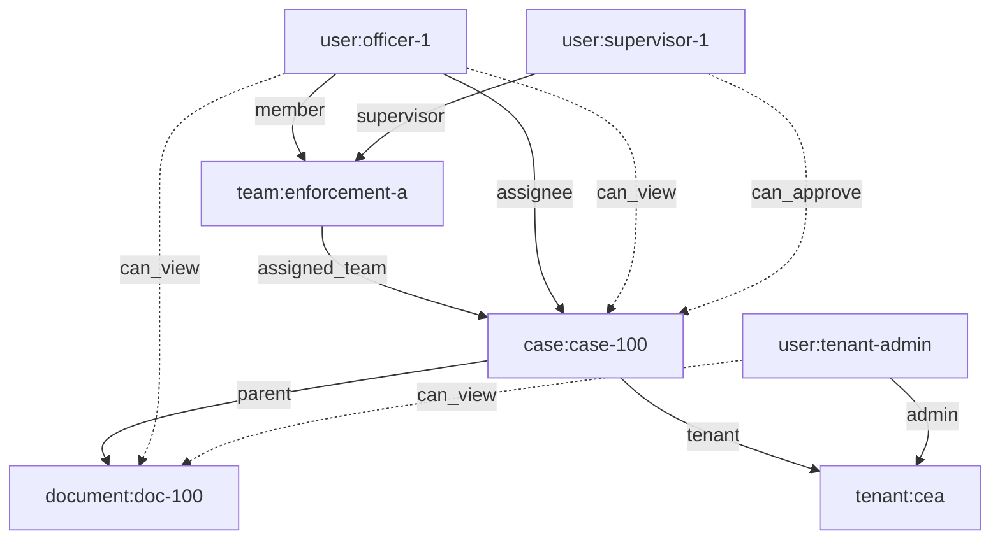
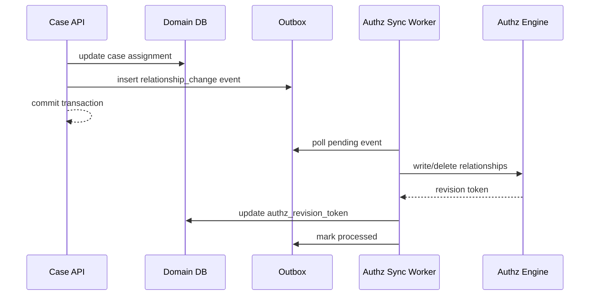

# learn-go-authentication-authorization-identity-permission-part-023.md

# Part 023 — ReBAC: Relationship-Based Authorization dan Graph Permission di Go

> Seri: `learn-go-authentication-authorization-identity-permission`  
> Level: Advanced / internal engineering handbook  
> Target Go: Go 1.26.x  
> Fokus: relationship-based authorization, graph permission, Zanzibar-style authorization, OpenFGA/SpiceDB-inspired modelling, multi-tenant enterprise authorization.

---

## Daftar Isi

1. [Tujuan Bagian Ini](#1-tujuan-bagian-ini)
2. [Masalah yang Diselesaikan ReBAC](#2-masalah-yang-diselesaikan-rebac)
3. [Mental Model Utama](#3-mental-model-utama)
4. [RBAC vs ABAC vs ReBAC](#4-rbac-vs-abac-vs-rebac)
5. [Vocabulary Presisi](#5-vocabulary-presisi)
6. [Zanzibar-Style Authorization](#6-zanzibar-style-authorization)
7. [Graph Permission sebagai Sistem Relasi](#7-graph-permission-sebagai-sistem-relasi)
8. [Kapan ReBAC Tepat Digunakan](#8-kapan-rebac-tepat-digunakan)
9. [Kapan ReBAC Tidak Tepat](#9-kapan-rebac-tidak-tepat)
10. [Design Invariants](#10-design-invariants)
11. [Modeling Method: Dari Domain ke Relationship Graph](#11-modeling-method-dari-domain-ke-relationship-graph)
12. [Contoh Domain Regulatory Case Management](#12-contoh-domain-regulatory-case-management)
13. [Mermaid: Mental Model Graph](#13-mermaid-mental-model-graph)
14. [Authorization Model: OpenFGA-Style DSL](#14-authorization-model-openfga-style-dsl)
15. [Authorization Model: SpiceDB/Zed-Style Schema](#15-authorization-model-spicedbzed-style-schema)
16. [Tuple Design: Relationship sebagai Data](#16-tuple-design-relationship-sebagai-data)
17. [Userset, Computed Userset, Tuple-to-Userset](#17-userset-computed-userset-tuple-to-userset)
18. [Permission Derivation](#18-permission-derivation)
19. [Multi-Tenant ReBAC](#19-multi-tenant-rebac)
20. [Conditional Relationship: Caveat, Condition, Context](#20-conditional-relationship-caveat-condition-context)
21. [Consistency Model: New Enemy Problem, Zookie, ZedToken](#21-consistency-model-new-enemy-problem-zookie-zedtoken)
22. [Go Domain Types](#22-go-domain-types)
23. [Go Authorization Client Interface](#23-go-authorization-client-interface)
24. [Go PEP Integration untuk HTTP](#24-go-pep-integration-untuk-http)
25. [Go PEP Integration untuk gRPC](#25-go-pep-integration-untuk-grpc)
26. [Write Path: Sinkronisasi Domain Relationship](#26-write-path-sinkronisasi-domain-relationship)
27. [Outbox Pattern untuk Relationship Updates](#27-outbox-pattern-untuk-relationship-updates)
28. [Read Path: Check, LookupResources, LookupSubjects](#28-read-path-check-lookupresources-lookupsubjects)
29. [List Authorization Problem](#29-list-authorization-problem)
30. [Caching dan Performance](#30-caching-dan-performance)
31. [Deletion, Tombstone, dan Revocation](#31-deletion-tombstone-dan-revocation)
32. [Auditability dan Regulatory Defensibility](#32-auditability-dan-regulatory-defensibility)
33. [Testing Strategy](#33-testing-strategy)
34. [Failure Modes](#34-failure-modes)
35. [Anti-Pattern](#35-anti-pattern)
36. [Migration dari RBAC/ACL ke ReBAC](#36-migration-dari-rbacacl-ke-rebac)
37. [Reference Package Layout](#37-reference-package-layout)
38. [Production Checklist](#38-production-checklist)
39. [Latihan Desain](#39-latihan-desain)
40. [Ringkasan](#40-ringkasan)
41. [Referensi Primer](#41-referensi-primer)

---

## 1. Tujuan Bagian Ini

Pada bagian sebelumnya kita sudah membahas ABAC: akses ditentukan oleh attribute subject, resource, action, dan environment. ABAC kuat untuk policy yang sangat kontekstual, tetapi sering menjadi kompleks ketika domain access sebenarnya berasal dari **relasi antar entitas**.

Contoh:

- user boleh melihat case karena ia adalah officer yang ditugaskan ke case tersebut;
- user boleh melihat document karena document berada di case yang ia boleh lihat;
- user boleh approve action karena ia supervisor dari officer yang mengajukan;
- user boleh melihat application karena agency-nya memiliki tenancy relation terhadap application;
- user boleh melihat feedback karena ia anggota team yang menerima feedback assignment;
- user boleh melihat report karena report berada dalam folder yang dishare ke group;
- service boleh membaca event karena service tersebut trusted workload untuk tenant tersebut.

Semua contoh di atas lebih natural dimodelkan sebagai **graph of relationships**, bukan hanya role list atau attribute map.

Tujuan part ini:

1. memberi mental model ReBAC yang presisi;
2. membedakan ReBAC dari RBAC, ABAC, ACL, dan scope/token;
3. menjelaskan Zanzibar-style authorization secara praktis;
4. mengajarkan cara memodelkan domain menjadi tuple graph;
5. menunjukkan bagaimana Go service menjadi Policy Enforcement Point yang aman;
6. membahas consistency, caching, list authorization, revocation, dan audit;
7. menyiapkan fondasi untuk authorization platform enterprise.

---

## 2. Masalah yang Diselesaikan ReBAC

RBAC sering mulai sederhana:

```text
Admin can do everything.
Officer can view case.
Supervisor can approve case.
```

Lalu realita domain masuk:

```text
Officer hanya boleh melihat case yang assigned kepadanya.
Supervisor hanya boleh approve case dari team yang ia supervise.
Legal officer boleh melihat case jika case sudah masuk legal stage.
External agency user boleh melihat application jika application berasal dari agency-nya.
Temporary reviewer boleh melihat document sampai tanggal tertentu.
Support admin boleh impersonate user hanya jika ada approved support ticket.
```

Jika semua itu dipaksakan ke RBAC, biasanya muncul role seperti:

```text
CaseOfficer_CEA_TeamA_Level1
CaseOfficer_CEA_TeamA_Level2
CaseOfficer_CEA_TeamB_Level1
Supervisor_CEA_TeamA
Supervisor_CEA_TeamB
LegalViewer_CaseAppeal_CEA
ExternalReviewer_ApplicationRenewal_CEA
```

Ini disebut **role explosion**.

Jika dipaksakan ke ABAC murni, policy mungkin menjadi ekspresi besar yang membaca banyak table runtime:

```text
allow if
  subject.department == resource.department and
  subject.team in resource.assignedTeams and
  subject.id in resource.assignedOfficers and
  resource.caseStage in subject.allowedStages and
  now < resource.assignmentExpiry and
  subject.tenant == resource.tenant
```

ABAC bisa melakukan itu, tetapi ada trade-off:

- policy sulit diaudit sebagai graph access;
- policy evaluation butuh banyak lookup attribute;
- list resource yang boleh dilihat user menjadi mahal;
- permission inheritance dari folder/team/case hierarchy sulit divisualisasikan;
- revocation menjadi tergantung freshness banyak attribute.

ReBAC menyelesaikan bagian domain yang secara alami adalah hubungan:

```text
user:U123 is assignee of case:C456
case:C456 belongs_to tenant:CEA
case:C456 has_document document:D789
team:T1 supervises user:U123
user:U999 is supervisor of team:T1
```

Lalu permission diturunkan dari relasi:

```text
case.view = assignee or supervisor_of_assignee or tenant_admin
case.approve = supervisor_of_assignee and stage_is_review
```

Inti ReBAC:

> Jangan tanya “role apa yang dimiliki user?” saja.  
> Tanyakan: “relasi apa yang menghubungkan subject ini ke object ini?”

---

## 3. Mental Model Utama

ReBAC adalah model authorization yang mengevaluasi akses berdasarkan **relationship path** antara subject dan resource.

Bentuk pertanyaan authorization:

```text
Can subject S perform permission P on object O?
```

Dalam graph:

```text
Is there a valid path from S to O that satisfies relation/permission P?
```

Contoh:

```text
Can user:alice view document:doc1?
```

Dijawab dengan graph:

```text
user:alice --member--> team:appeal-reviewers
team:appeal-reviewers --viewer--> case:case-100
case:case-100 --parent--> document:doc1

view(document) := viewer(document) OR viewer(parent case)
```

Jika path valid, allow. Jika tidak, deny.

Dalam sistem matang, pertanyaan itu tidak dievaluasi oleh `if` tersebar di setiap handler, tetapi oleh authorization engine:

```text
Check(subject=user:alice, permission=view, object=document:doc1)
```

---

## 4. RBAC vs ABAC vs ReBAC

| Model | Pertanyaan Utama | Data Utama | Kekuatan | Kelemahan |
|---|---|---|---|---|
| RBAC | “Role apa yang dimiliki subject?” | user-role-permission | sederhana, mudah dipahami | role explosion, lemah untuk object-level access |
| ABAC | “Attribute apa yang cocok dengan policy?” | subject/resource/env/action attributes | sangat fleksibel | sulit diaudit, lookup attribute bisa kompleks |
| ReBAC | “Relasi apa yang menghubungkan subject ke object?” | relationship tuples / graph | natural untuk sharing, hierarchy, ownership, delegation | modelling dan consistency lebih sulit |

ReBAC bukan pengganti total RBAC/ABAC. Dalam sistem enterprise, kombinasi yang umum:

```text
RBAC  -> coarse organizational capability
ReBAC -> object/resource-level relationship access
ABAC  -> dynamic condition: time, risk, stage, assurance, location
PBAC  -> policy administration and lifecycle
```

Contoh keputusan:

```text
Allow user to approve appeal if:
  RBAC: user has capability `appeal.approve`
  ReBAC: user is supervisor of assigned officer on that appeal
  ABAC: appeal stage == `pending_supervisor_review`
  Assurance: user session AAL >= 2 and auth_time <= 15 minutes
```

---

## 5. Vocabulary Presisi

### 5.1 Subject

Entity yang meminta akses.

Contoh:

```text
user:123
service:case-worker
group:legal-team#member
team:appeal-reviewer#member
```

Dalam Zanzibar-style model, subject bisa berupa direct user atau userset.

### 5.2 Object / Resource

Entity yang dilindungi.

Contoh:

```text
case:CASE-001
document:DOC-001
application:APP-001
tenant:CEA
folder:F1
```

### 5.3 Relation

Nama hubungan antara subject dan object.

Contoh:

```text
owner
viewer
editor
assignee
supervisor
member
parent
tenant
```

### 5.4 Relationship Tuple

Fakta relasi yang disimpan.

Format konseptual:

```text
object#relation@subject
```

Contoh:

```text
case:CASE-001#assignee@user:U123
case:CASE-001#tenant@tenant:CEA
team:TEAM-A#member@user:U123
team:TEAM-A#supervisor@user:U999
document:DOC-001#parent@case:CASE-001
```

OpenFGA menggunakan building block user, relation, dan object untuk relationship tuples. Object merepresentasikan entity, relation mendefinisikan hubungan yang mungkin, dan tuple menyatakan realisasi relasi antara user dan object.

### 5.5 Userset

Set subject yang didefinisikan oleh relasi.

Contoh:

```text
team:TEAM-A#member
organization:ORG-1#admin
case:CASE-001#assignee
```

Userset memungkinkan relasi diberikan ke group/team/organization, bukan satu user satu per satu.

### 5.6 Permission

Permission adalah kemampuan yang diturunkan dari satu atau lebih relation.

Contoh:

```text
permission view = owner or assignee or viewer or tenant_admin
permission edit = owner or assignee
permission approve = supervisor_of_assignee
```

Relation adalah data. Permission adalah derived decision.

### 5.7 Caveat / Condition

Condition yang membuat relasi berlaku hanya jika context tertentu terpenuhi.

Contoh:

```text
user:U777 is viewer of case:CASE-001 only until 2026-07-01
user:U888 is viewer only if request.ip is within allowed CIDR
service:S1 can read only if purpose == background_sync
```

SpiceDB menyebut ini **caveats**: ekspresi boolean yang bisa ditempelkan pada relationship dan dievaluasi saat permission check.

---

## 6. Zanzibar-Style Authorization

Google Zanzibar adalah referensi utama modern untuk relationship-based authorization skala besar. Paper Zanzibar menjelaskan sistem global untuk menyimpan dan mengevaluasi access control lists, memakai uniform data model dan configuration language untuk berbagai service Google seperti Calendar, Cloud, Drive, Maps, Photos, dan YouTube. Paper tersebut juga menekankan external consistency agar authorization decision menghormati causal ordering antara perubahan ACL dan konten resource.

Konsep penting yang perlu dipahami, bukan dihafal:

1. **Authorization data dipisah dari application data**, tetapi terikat secara kausal dengan perubahan resource.
2. **Relationship disimpan sebagai tuple**, bukan sebagai logic hardcoded di service.
3. **Permission dihitung dari graph**, bukan dari satu table role sederhana.
4. **Consistency token** dipakai agar check authorization bisa melihat revision yang relevan.
5. **Schema/configuration language** mendefinisikan bagaimana relation membentuk permission.

Bentuk pertanyaan:

```text
Check(user, relation/permission, object) -> allow / deny
```

Bentuk data:

```text
object#relation@user_or_userset
```

Bentuk schema:

```text
resource type X has relation Y to subject type Z
permission P is union/intersection/exclusion of relations
```

Open-source systems yang terinspirasi oleh Zanzibar antara lain OpenFGA dan SpiceDB.

---

## 7. Graph Permission sebagai Sistem Relasi

ReBAC tidak sekadar “join table permissions”. Ia adalah graph.

Node:

```text
user, group, team, organization, tenant, case, document, application, folder, service
```

Edge:

```text
member, owner, parent, viewer, assignee, supervisor, submitted_by, belongs_to
```

Permission:

```text
can_view_case
can_edit_case
can_approve_case
can_download_document
```

Path:

```text
user:U123
  -> member of team:T1
  -> team T1 assigned to case:C1
  -> case C1 contains document:D1
  => user U123 can view document D1
```

Graph permission menjawab authorization dengan traversal yang dibatasi schema.

Tanpa schema, graph traversal berbahaya karena bisa menyebabkan:

- path tak terbatas;
- cycle;
- privilege escalation via unexpected relation;
- performance collapse;
- semantic ambiguity.

Schema adalah kontrak keamanan.

---

## 8. Kapan ReBAC Tepat Digunakan

Gunakan ReBAC ketika authorization Anda banyak mengandung:

### 8.1 Resource Hierarchy

Contoh:

```text
tenant -> agency -> case -> document -> attachment
folder -> folder -> document
organization -> project -> repository -> branch
```

Jika akses diwariskan dari parent ke child, ReBAC natural.

### 8.2 Sharing

Contoh:

```text
share document to user
share folder to team
share case to external reviewer
share report to agency group
```

Sharing adalah relationship.

### 8.3 Ownership

Contoh:

```text
created_by
owned_by
submitted_by
assigned_to
managed_by
```

Ownership bukan role global.

### 8.4 Delegation

Contoh:

```text
manager delegates approval to deputy
officer delegates case review during leave
agency admin delegates access to external consultant
```

Delegation adalah edge temporer/conditional.

### 8.5 Multi-Entity Permission

Contoh:

```text
supervisor can approve if supervisor supervises assigned officer
legal team can view if case has legal_referral
finance reviewer can view if application has revenue impact
```

### 8.6 Fine-Grained Enterprise Authorization

Contoh:

```text
user can view this exact case but not another case
user can edit this document but not delete it
user can view metadata but not full content
```

---

## 9. Kapan ReBAC Tidak Tepat

ReBAC tidak selalu solusi terbaik.

### 9.1 Policy Sangat Dynamic dan Tidak Berbasis Relationship

Contoh:

```text
allow if transaction amount < subject.daily_limit and device_risk < 50
```

Ini lebih natural ABAC/risk policy.

### 9.2 Domain Tidak Memiliki Object-Level Access

Jika aplikasi hanya punya sedikit role global:

```text
admin, operator, viewer
```

RBAC cukup.

### 9.3 Data Relationship Tidak Stabil atau Tidak Bisa Dipercaya

Jika relation source of truth kacau, ReBAC akan menghasilkan keputusan kacau.

### 9.4 Butuh Deny Rules Kompleks

Zanzibar-style systems sering lebih kuat di allow graph. Deny semantics dapat dibuat, tetapi harus sangat hati-hati karena deny override pada graph dapat sulit diprediksi.

### 9.5 Anda Tidak Bisa Mengelola Consistency

Jika permission update dan resource update tidak bisa disinkronkan, Anda akan mengalami stale allow/stale deny.

---

## 10. Design Invariants

Invariants yang harus dijaga:

### Invariant 1 — Permission Check Selalu Berbasis Subject, Object, Permission

Jangan mengecek hanya:

```go
if user.Role == "officer" { ... }
```

Gunakan bentuk:

```go
Check(subject=user:U123, permission="view", object=case:CASE-001)
```

### Invariant 2 — Token Claim Bukan Source of Truth untuk Object-Level Permission

JWT boleh membawa identity dan coarse capabilities, tetapi object-level relationship harus dievaluasi terhadap authorization graph atau cache yang dikontrol.

Salah:

```json
{
  "can_view_cases": ["CASE-1", "CASE-2", "CASE-3"]
}
```

Masalah:

- token membengkak;
- revocation lambat;
- permission stale sampai token expire;
- tidak scalable;
- audit decision sulit.

### Invariant 3 — Tenant Boundary Harus Tercermin di Graph

Tenant tidak boleh hanya disaring di SQL query. Tenant harus menjadi bagian dari model authorization.

Contoh:

```text
case:CASE-001#tenant@tenant:CEA
user:U123#member_of@tenant:CEA
```

### Invariant 4 — Relationship Write Harus Diaudit

Setiap perubahan tuple adalah perubahan authority.

Audit harus menjawab:

```text
siapa menambahkan relasi apa, terhadap object apa, untuk subject siapa, kapan, dengan alasan apa, melalui workflow apa
```

### Invariant 5 — Permission Derivation Harus Bisa Dijelaskan

Untuk sistem enterprise/regulatory, allow/deny saja tidak cukup. Anda perlu decision explanation.

Contoh:

```text
Allowed because user:U123 is member of team:TEAM-A,
TEAM-A is assignee of case:CASE-001,
and assignee implies case.view.
```

### Invariant 6 — Graph Traversal Harus Bounded

Harus ada batas:

- depth;
- recursion;
- fan-out;
- cycle handling;
- timeout;
- cancellation context.

### Invariant 7 — Fail Closed untuk Enforcement Kritis

Jika authorization engine gagal, default untuk protected operation adalah deny, bukan allow.

---

## 11. Modeling Method: Dari Domain ke Relationship Graph

Gunakan proses berikut.

### Step 1 — Inventory Resource Types

Daftar semua object yang dilindungi:

```text
tenant
agency
user
team
case
application
document
appeal
investigation
feedback
correspondence
report
```

### Step 2 — Inventory Subject Types

```text
user
group
team
service
external_idp_user
agency_account
```

### Step 3 — Inventory Direct Relations

Contoh:

```text
tenant#member@user
tenant#admin@user
team#member@user
team#supervisor@user
case#assignee@user
case#assigned_team@team
case#tenant@tenant
document#parent_case@case
document#owner@user
```

### Step 4 — Inventory Permissions

Jangan langsung tulis role. Tulis action bisnis:

```text
case.view
case.update
case.assign
case.approve
case.close
document.view_metadata
document.download
document.redact
appeal.review
report.export
```

### Step 5 — Define Derivation

Contoh:

```text
case.view = assignee or assigned_team.member or tenant.admin
case.assign = tenant.admin or assigned_team.supervisor
case.approve = assigned_team.supervisor

document.view = owner or parent_case.view
document.download = parent_case.view and not restricted
```

### Step 6 — Model Tenant Boundary

Pastikan setiap protected object punya tenant path.

```text
case belongs to tenant
document belongs to case
application belongs to tenant
report belongs to tenant
```

### Step 7 — Model Exceptional Access

Contoh:

```text
break_glass_viewer
temporary_reviewer
legal_referral_viewer
support_impersonator
```

Tetapkan governance:

- expiry;
- reason;
- approval;
- audit;
- session step-up;
- post-review.

### Step 8 — Model Constraints

Relasi apa yang boleh direct?

```text
case#assignee can only be user
case#assigned_team can only be team
case#viewer can be user or team#member
document#parent can only be case
```

### Step 9 — Model Write Authority

Siapa boleh menambah/menghapus tuple?

Ini sering terlupakan.

```text
Only case.assign permission can write case#assignee.
Only tenant.admin can write tenant#admin.
Only workflow service can write system-generated relations.
```

### Step 10 — Validate with Example Decisions

Buat matrix:

| Subject | Object | Permission | Expected | Path |
|---|---|---|---|---|
| officer U1 | case C1 | view | allow | U1 assignee C1 |
| officer U2 | case C1 | view | deny | no relation |
| supervisor S1 | case C1 | approve | allow | S1 supervisor TEAM-A, TEAM-A assigned C1 |
| tenant admin A1 | doc D1 | download | allow | A1 tenant admin, D1 parent C1 tenant CEA |
| external reviewer E1 | doc D1 | download | deny after expiry | caveat expired |

---

## 12. Contoh Domain Regulatory Case Management

Kita gunakan domain yang kompleks:

```text
Tenant: CEA
Agency User: officer, supervisor, legal, finance
Case: enforcement case
Application: license application
Document: evidence, correspondence, uploaded attachment
Appeal: appeal process
Team: enforcement team
External Party: regulated entity user
```

### 12.1 Resource Graph

```text
tenant:cea
  ├── team:enforcement-a
  │     ├── member user:officer-1
  │     └── supervisor user:supervisor-1
  ├── case:case-100
  │     ├── assigned_team team:enforcement-a
  │     ├── assignee user:officer-1
  │     └── document:doc-100
  └── application:app-200
        └── submitted_by regulated_entity:entity-1
```

### 12.2 Permissions

```text
case.view
case.update
case.assign
case.approve_recommendation
case.close

document.view
document.download
document.redact

appeal.view
appeal.review
appeal.decide
```

### 12.3 Policy Meaning

```text
Officer can view assigned cases.
Team member can view cases assigned to their team.
Supervisor can approve recommendations for cases assigned to their team.
Tenant admin can view tenant cases.
Document access inherits from parent case access.
External user can view only documents explicitly shared to their regulated entity.
Break-glass access requires temporary relation, reason, approval, and session AAL2+.
```

---

## 13. Mermaid: Mental Model Graph



Interpretasi:

- officer bisa view case karena `assignee` atau karena member team yang assigned;
- supervisor bisa approve case karena ia supervisor dari team yang assigned;
- document mewarisi view dari parent case;
- tenant admin mendapat akses via tenant relation.

---

## 14. Authorization Model: OpenFGA-Style DSL

Contoh model konseptual:

```text
model
  schema 1.1

type user

type service

type tenant
  relations
    define member: [user]
    define admin: [user]

type team
  relations
    define tenant: [tenant]
    define member: [user]
    define supervisor: [user]

type case
  relations
    define tenant: [tenant]
    define assignee: [user]
    define assigned_team: [team]
    define direct_viewer: [user, team#member]
    define break_glass_viewer: [user]

    define tenant_admin: admin from tenant
    define team_member: member from assigned_team
    define team_supervisor: supervisor from assigned_team

    define can_view: assignee or team_member or direct_viewer or tenant_admin or break_glass_viewer
    define can_update: assignee or team_member
    define can_assign: tenant_admin or team_supervisor
    define can_approve: team_supervisor

type document
  relations
    define parent_case: [case]
    define owner: [user]
    define direct_viewer: [user, team#member]

    define case_viewer: can_view from parent_case
    define can_view: owner or direct_viewer or case_viewer
    define can_download: can_view
```

Catatan desain:

- `tenant_admin` dihitung dari relation `tenant`;
- `team_member` dihitung dari relation `assigned_team`;
- `document.can_view` mewarisi dari `case.can_view`;
- `break_glass_viewer` harus diikat governance dan audit;
- permission tidak dikodekan sebagai claim di token.

---

## 15. Authorization Model: SpiceDB/Zed-Style Schema

Contoh schema konseptual:

```zed
definition user {}

definition service {}

definition tenant {
  relation member: user
  relation admin: user
}

definition team {
  relation tenant: tenant
  relation member: user
  relation supervisor: user
}

definition case {
  relation tenant: tenant
  relation assignee: user
  relation assigned_team: team
  relation direct_viewer: user | team#member
  relation break_glass_viewer: user with valid_break_glass

  permission tenant_admin = tenant->admin
  permission team_member = assigned_team->member
  permission team_supervisor = assigned_team->supervisor

  permission view = assignee + team_member + direct_viewer + tenant_admin + break_glass_viewer
  permission update = assignee + team_member
  permission assign = tenant_admin + team_supervisor
  permission approve = team_supervisor
}

definition document {
  relation parent_case: case
  relation owner: user
  relation direct_viewer: user | team#member

  permission view = owner + direct_viewer + parent_case->view
  permission download = view
}

caveat valid_break_glass(expires_at timestamp, now timestamp, approved bool) {
  approved == true && now < expires_at
}
```

Catatan:

- Syntax detail dapat berbeda antar versi/engine, tetapi mental model-nya sama;
- `+` berarti union;
- `->` berarti permission/relation dari object yang direferensikan;
- caveat dipakai untuk access yang conditional.

---

## 16. Tuple Design: Relationship sebagai Data

Relationship tuple adalah fakta otorisasi.

Contoh:

```text
tenant:cea#admin@user:u-admin
team:enforcement-a#tenant@tenant:cea
team:enforcement-a#member@user:u-officer-1
team:enforcement-a#supervisor@user:u-supervisor-1
case:case-100#tenant@tenant:cea
case:case-100#assigned_team@team:enforcement-a
case:case-100#assignee@user:u-officer-1
document:doc-100#parent_case@case:case-100
```

Dengan tuple ini:

```text
Check(user:u-officer-1, view, case:case-100) = allow
Check(user:u-supervisor-1, approve, case:case-100) = allow
Check(user:u-officer-1, view, document:doc-100) = allow
Check(user:u-admin, download, document:doc-100) = allow
```

### 16.1 Tuple Table Konseptual

Jika Anda membangun custom prototype, minimal table bisa seperti ini:

```sql
CREATE TABLE authz_relationship_tuple (
    id                  BIGSERIAL PRIMARY KEY,
    tenant_id           TEXT NOT NULL,

    object_type         TEXT NOT NULL,
    object_id           TEXT NOT NULL,
    relation            TEXT NOT NULL,

    subject_type        TEXT NOT NULL,
    subject_id          TEXT NOT NULL,
    subject_relation    TEXT NULL,

    caveat_name         TEXT NULL,
    caveat_context_json JSONB NULL,

    created_at          TIMESTAMPTZ NOT NULL,
    created_by_type     TEXT NOT NULL,
    created_by_id       TEXT NOT NULL,
    reason_code         TEXT NULL,
    source_system       TEXT NOT NULL,

    deleted_at          TIMESTAMPTZ NULL,
    deleted_by_type     TEXT NULL,
    deleted_by_id       TEXT NULL
);

CREATE UNIQUE INDEX uq_authz_tuple_active
ON authz_relationship_tuple (
    tenant_id,
    object_type,
    object_id,
    relation,
    subject_type,
    subject_id,
    COALESCE(subject_relation, '')
)
WHERE deleted_at IS NULL;
```

Namun untuk production skala besar, sebaiknya evaluasi engine khusus seperti OpenFGA/SpiceDB daripada membangun graph engine sendiri.

---

## 17. Userset, Computed Userset, Tuple-to-Userset

### 17.1 Direct Relation

```text
case:case-100#assignee@user:u1
```

Berarti user u1 langsung assignee case-100.

### 17.2 Userset

```text
case:case-100#direct_viewer@team:enforcement-a#member
```

Berarti semua member team enforcement-a adalah direct viewer case-100.

### 17.3 Computed Userset

```text
case.can_view = assignee or direct_viewer
```

Permission `can_view` dihitung dari relation lain.

### 17.4 Tuple-to-Userset

```text
document.can_view = parent_case->can_view
```

Artinya viewer document dihitung dari viewer parent case.

Ini powerful untuk inheritance.

---

## 18. Permission Derivation

Permission harus dimodelkan sebagai business capability, bukan CRUD mentah.

Buruk:

```text
case.read
case.write
case.delete
```

Lebih baik:

```text
case.view_summary
case.view_sensitive_details
case.update_draft
case.submit_recommendation
case.approve_recommendation
case.close
case.reopen
```

Mengapa?

Karena dalam domain nyata:

- user boleh update draft tetapi tidak approve;
- supervisor boleh approve tetapi tidak edit evidence;
- legal boleh view legal section tetapi tidak semua financial data;
- support boleh view metadata tetapi tidak download attachment.

### 18.1 Permission as Derived Relation

```text
case.can_view_summary = assignee or team_member or tenant_admin
case.can_view_sensitive = assignee or legal_referral_viewer or break_glass_viewer
case.can_approve = team_supervisor
case.can_reopen = tenant_admin
```

### 18.2 Avoid Permission Explosion

Permission explosion terjadi ketika setiap endpoint punya permission unik tanpa semantic grouping.

Gunakan level berikut:

```text
Resource capability -> workflow capability -> field/content sensitivity
```

Contoh:

```text
case.view
case.view_sensitive
case.update
case.submit
case.approve
case.close
```

Jangan:

```text
GET_/case/{id}/tab1/button3
POST_/case/{id}/save-screen-2
```

---

## 19. Multi-Tenant ReBAC

Multi-tenant authorization harus didesain sejak awal.

### 19.1 Tenant as First-Class Object

```text
tenant:cea#member@user:u1
tenant:cea#admin@user:u2
case:case-100#tenant@tenant:cea
```

### 19.2 Tenant Boundary di Schema

Jangan hanya menyimpan tenant di application DB tetapi tidak di authz graph.

Buruk:

```text
case:case-100#viewer@user:u1
```

Tanpa tenant context, relasi ini bisa disalahgunakan jika ID collision atau cross-tenant reference terjadi.

Lebih baik:

```text
case:cea/case-100#viewer@user:cea/u1
case:cea/case-100#tenant@tenant:cea
```

Atau gunakan object ID yang globally unique tetapi tetap punya relation tenant.

### 19.3 Cross-Tenant Admin

Untuk super-admin/support, jangan beri `*` global tanpa boundary.

Gunakan relation eksplisit:

```text
tenant:cea#support_admin@user:support-1 with support_ticket_valid
```

Lalu permission:

```text
case.view = tenant->support_admin or ...
```

### 19.4 Tenant Mismatch Defense

Di PEP:

1. resolve resource tenant dari database;
2. construct object ref dengan tenant-aware ID;
3. check permission;
4. jangan percaya tenant ID dari request path saja;
5. audit tenant yang digunakan untuk decision.

---

## 20. Conditional Relationship: Caveat, Condition, Context

ReBAC murni menyimpan relationship sebagai fakta stabil:

```text
user:u1 is viewer of document:d1
```

Tetapi realita sering conditional:

```text
user:u1 is viewer until 2026-07-01
user:u1 is viewer only for purpose investigation_review
user:u1 is viewer only when session assurance AAL2
```

Ada tiga cara modelling:

### 20.1 Encode sebagai Relationship Terpisah

```text
case:case-100#temporary_viewer@user:u1
```

Lalu aplikasi menghapus tuple saat expired.

Kelebihan:

- check cepat;
- tidak butuh context runtime.

Kekurangan:

- expiry butuh cleanup job;
- risk stale allow jika cleanup gagal.

### 20.2 Caveated Relationship

```text
case:case-100#temporary_viewer@user:u1 with expires_at=2026-07-01
```

Saat check:

```json
{
  "now": "2026-06-24T10:00:00Z"
}
```

Kelebihan:

- tidak perlu hapus tepat waktu untuk deny;
- condition terikat ke relasi.

Kekurangan:

- context harus benar;
- time source harus reliable;
- audit harus mencatat context.

### 20.3 Hybrid

Gunakan caveat untuk enforcement, cleanup job untuk hygiene.

Ini paling umum untuk production.

### 20.4 Context yang Layak untuk Caveat

Layak:

```text
now
ip range
session assurance
purpose code
device trust level
approved support ticket id
```

Berbahaya:

```text
arbitrary request JSON dari client
role string dari client
tenant ID dari header yang tidak diverifikasi
```

---

## 21. Consistency Model: New Enemy Problem, Zookie, ZedToken

ReBAC dalam distributed system punya masalah serius: permission graph dan resource data berubah secara terpisah.

### 21.1 New Enemy Problem

Skenario:

1. Alice punya akses ke document D.
2. Alice di-remove dari akses D.
3. Isi document D diubah menjadi sensitive.
4. Karena authorization check membaca snapshot lama, Alice masih boleh melihat D.

Ini disebut **new enemy problem** dalam Zanzibar-style systems: user yang baru dicabut aksesnya jangan melihat konten baru yang seharusnya tidak boleh diakses.

### 21.2 Consistency Token

Zanzibar memperkenalkan konsep zookie. SpiceDB menggunakan ZedToken sebagai token opaque yang merepresentasikan point-in-time datastore dan dipakai untuk consistency guarantees.

Praktik desain:

```text
resource row stores authz_revision_token
permission check uses at_least_as_fresh(authz_revision_token)
```

### 21.3 Store Authz Revision with Resource

Contoh table:

```sql
ALTER TABLE case_record
ADD COLUMN authz_revision_token TEXT NULL;
```

Saat relationship berubah:

1. write relationship ke authz engine;
2. authz engine mengembalikan revision token;
3. simpan token ke resource row;
4. saat read resource, gunakan token itu untuk check consistency.

### 21.4 Trade-Off Consistency

| Mode | Kelebihan | Kekurangan | Cocok untuk |
|---|---|---|---|
| eventual | cepat | stale allow/deny mungkin terjadi | low-risk UI hint |
| at least as fresh | read-after-write relatif aman | perlu simpan token | resource access penting |
| exact snapshot | stabil untuk pagination | snapshot bisa expire | pagination/listing singkat |
| fully consistent | paling fresh | mahal, bypass cache | admin critical action |

### 21.5 Rule of Thumb

Untuk regulatory/security-sensitive data:

```text
Use at-least-as-fresh consistency for protected object reads after ACL/resource changes.
Use fully consistent only for rare high-risk operations.
Do not use stale cache for destructive or sensitive operations.
```

---

## 22. Go Domain Types

Gunakan type yang presisi. Hindari string liar.

```go
package authz

import "time"

type SubjectType string
type ObjectType string
type Relation string
type Permission string

type SubjectRef struct {
	Type     SubjectType
	ID       string
	Relation Relation // optional userset relation, e.g. team#member
}

type ObjectRef struct {
	Type ObjectType
	ID   string
}

type Relationship struct {
	Object   ObjectRef
	Relation Relation
	Subject  SubjectRef
	Caveat   *Caveat
}

type Caveat struct {
	Name    string
	Context map[string]any
}

type CheckRequest struct {
	Subject     SubjectRef
	Permission  Permission
	Object      ObjectRef
	TenantID    string
	Context     DecisionContext
	Consistency ConsistencyRequirement
}

type DecisionContext struct {
	Now              time.Time
	IPAddress        string
	Purpose          string
	SessionAAL       int
	AuthTime         time.Time
	CorrelationID    string
	RequestID        string
	ActorSubject     *SubjectRef // for impersonation/delegation
}

type ConsistencyRequirement struct {
	Mode          ConsistencyMode
	RevisionToken string
}

type ConsistencyMode string

const (
	ConsistencyEventual       ConsistencyMode = "eventual"
	ConsistencyAtLeastAsFresh ConsistencyMode = "at_least_as_fresh"
	ConsistencyFully          ConsistencyMode = "fully_consistent"
)

type DecisionEffect string

const (
	DecisionAllow DecisionEffect = "allow"
	DecisionDeny  DecisionEffect = "deny"
)

type Decision struct {
	Effect        DecisionEffect
	Reason        string
	MatchedPath   []RelationshipPathStep
	RevisionToken string
	Obligations   []Obligation
}

type RelationshipPathStep struct {
	Object   ObjectRef
	Relation Relation
	Subject  SubjectRef
}

type Obligation struct {
	Type string
	Data map[string]any
}
```

### 22.1 Validate References

```go
func (o ObjectRef) Validate() error {
	if o.Type == "" || o.ID == "" {
		return ErrInvalidObjectRef
	}
	return nil
}

func (s SubjectRef) Validate() error {
	if s.Type == "" || s.ID == "" {
		return ErrInvalidSubjectRef
	}
	return nil
}
```

### 22.2 Avoid `context.Context` Abuse

Jangan menyimpan seluruh decision graph dalam `context.Context`. Simpan principal dan request metadata secukupnya, lalu panggil authorization client secara eksplisit.

---

## 23. Go Authorization Client Interface

Buat interface kecil yang tidak mengikat domain service ke vendor.

```go
package authz

import "context"

type Client interface {
	Check(ctx context.Context, req CheckRequest) (Decision, error)
	WriteRelationships(ctx context.Context, req WriteRelationshipsRequest) (WriteRelationshipsResult, error)
	DeleteRelationships(ctx context.Context, req DeleteRelationshipsRequest) (DeleteRelationshipsResult, error)
	LookupResources(ctx context.Context, req LookupResourcesRequest) (LookupResourcesResult, error)
	LookupSubjects(ctx context.Context, req LookupSubjectsRequest) (LookupSubjectsResult, error)
}

type WriteRelationshipsRequest struct {
	TenantID      string
	Relationships []Relationship
	Actor         SubjectRef
	ReasonCode    string
	CorrelationID string
}

type WriteRelationshipsResult struct {
	RevisionToken string
}

type DeleteRelationshipsRequest struct {
	TenantID      string
	Relationships []Relationship
	Actor         SubjectRef
	ReasonCode    string
	CorrelationID string
}

type DeleteRelationshipsResult struct {
	RevisionToken string
}

type LookupResourcesRequest struct {
	Subject    SubjectRef
	Permission Permission
	ObjectType ObjectType
	TenantID   string
	Context    DecisionContext
	Limit      int
	Cursor     string
}

type LookupResourcesResult struct {
	ObjectIDs     []string
	NextCursor    string
	RevisionToken string
}

type LookupSubjectsRequest struct {
	Permission Permission
	Object     ObjectRef
	TenantID   string
	Context    DecisionContext
	Limit      int
	Cursor     string
}

type LookupSubjectsResult struct {
	Subjects      []SubjectRef
	NextCursor    string
	RevisionToken string
}
```

### 23.1 Error Taxonomy

```go
var (
	ErrUnauthenticated       = errors.New("unauthenticated")
	ErrPermissionDenied      = errors.New("permission denied")
	ErrAuthzUnavailable      = errors.New("authorization unavailable")
	ErrInvalidRelationship   = errors.New("invalid relationship")
	ErrConsistencyUnavailable = errors.New("consistency unavailable")
)
```

Jangan samakan:

- user tidak login;
- user login tapi tidak punya permission;
- authz engine down;
- relationship invalid;
- consistency token expired.

Masing-masing punya response, audit, dan runbook berbeda.

---

## 24. Go PEP Integration untuk HTTP

Policy Enforcement Point berada di boundary use case, bukan hanya router.

```go
func (h *CaseHandler) GetCase(w http.ResponseWriter, r *http.Request) {
	ctx := r.Context()

	principal, ok := authn.PrincipalFromContext(ctx)
	if !ok {
		http.Error(w, "unauthenticated", http.StatusUnauthorized)
		return
	}

	caseID := chi.URLParam(r, "caseID")

	caseRecord, err := h.caseRepo.GetByID(ctx, caseID)
	if err != nil {
		h.handleError(w, err)
		return
	}

	decision, err := h.authz.Check(ctx, authz.CheckRequest{
		Subject: authz.SubjectRef{
			Type: "user",
			ID:   principal.SubjectID,
		},
		Permission: "view",
		Object: authz.ObjectRef{
			Type: "case",
			ID:   caseRecord.ID,
		},
		TenantID: caseRecord.TenantID,
		Context: authz.DecisionContext{
			Now:           h.clock.Now(),
			IPAddress:     clientIP(r),
			SessionAAL:    principal.AAL,
			AuthTime:      principal.AuthTime,
			CorrelationID: correlationID(ctx),
			RequestID:     requestID(ctx),
		},
		Consistency: authz.ConsistencyRequirement{
			Mode:          authz.ConsistencyAtLeastAsFresh,
			RevisionToken: caseRecord.AuthzRevisionToken,
		},
	})
	if err != nil {
		h.handleAuthzError(w, err)
		return
	}
	if decision.Effect != authz.DecisionAllow {
		h.auditDenied(ctx, principal, caseRecord, decision)
		http.Error(w, "forbidden", http.StatusForbidden)
		return
	}

	h.auditAllowed(ctx, principal, caseRecord, decision)
	writeJSON(w, caseRecord)
}
```

### 24.1 Important Detail

Perhatikan urutan:

1. authenticate principal;
2. load resource minimal untuk tenant + revision;
3. check authorization;
4. return full data.

Jangan return data sebelum authorization.

### 24.2 Metadata Leak

Jika resource tidak ditemukan atau user tidak punya akses, response strategy harus dipilih sadar:

- `404` untuk menyembunyikan existence;
- `403` untuk user yang sudah jelas berada dalam same tenant tapi tidak punya permission;
- audit internal tetap menyimpan detail.

---

## 25. Go PEP Integration untuk gRPC

Unary interceptor untuk coarse permission:

```go
func UnaryAuthzInterceptor(authzClient authz.Client, mapper MethodPermissionMapper) grpc.UnaryServerInterceptor {
	return func(
		ctx context.Context,
		req any,
		info *grpc.UnaryServerInfo,
		handler grpc.UnaryHandler,
	) (any, error) {
		principal, ok := authn.PrincipalFromContext(ctx)
		if !ok {
			return nil, status.Error(codes.Unauthenticated, "unauthenticated")
		}

		mapping, ok := mapper.Map(info.FullMethod, req)
		if !ok {
			return nil, status.Error(codes.PermissionDenied, "permission mapping missing")
		}

		decision, err := authzClient.Check(ctx, authz.CheckRequest{
			Subject: authz.SubjectRef{Type: "user", ID: principal.SubjectID},
			Permission: mapping.Permission,
			Object: mapping.Object,
			TenantID: mapping.TenantID,
			Context: authz.DecisionContext{
				Now:           time.Now().UTC(),
				SessionAAL:    principal.AAL,
				AuthTime:      principal.AuthTime,
				CorrelationID: correlationID(ctx),
			},
		})
		if err != nil {
			return nil, status.Error(codes.Unavailable, "authorization unavailable")
		}
		if decision.Effect != authz.DecisionAllow {
			return nil, status.Error(codes.PermissionDenied, "permission denied")
		}

		return handler(ctx, req)
	}
}
```

### 25.1 Beware Method-Level Mapping

Method-level permission bisa terlalu kasar.

Contoh:

```text
CaseService/GetCase -> case.view
```

Tetapi object ID berada di request payload. Interceptor harus bisa mengambil object ID dan tenant secara aman.

Jika object resolution butuh database, lakukan authorization di service method/use case layer, bukan interceptor saja.

---

## 26. Write Path: Sinkronisasi Domain Relationship

Relationship harus berubah ketika domain berubah.

Contoh assign case:

```text
Old:
case:case-100#assignee@user:u1

New:
case:case-100#assignee@user:u2
```

Write path aman:

1. check actor boleh `case.assign`;
2. update case assignment di domain DB;
3. write/delete relationship di authz engine;
4. simpan revision token;
5. audit domain event dan authz event;
6. publish outbox event.

### 26.1 Go Use Case

```go
type AssignCaseCommand struct {
	TenantID string
	CaseID   string
	NewUserID string
	Actor    authz.SubjectRef
	Reason   string
}

func (uc *CaseUseCase) AssignCase(ctx context.Context, cmd AssignCaseCommand) error {
	caseRecord, err := uc.caseRepo.GetByID(ctx, cmd.CaseID)
	if err != nil {
		return err
	}

	decision, err := uc.authz.Check(ctx, authz.CheckRequest{
		Subject:    cmd.Actor,
		Permission: "assign",
		Object:     authz.ObjectRef{Type: "case", ID: cmd.CaseID},
		TenantID:   caseRecord.TenantID,
		Context:    uc.decisionContext(ctx),
		Consistency: authz.ConsistencyRequirement{
			Mode:          authz.ConsistencyAtLeastAsFresh,
			RevisionToken: caseRecord.AuthzRevisionToken,
		},
	})
	if err != nil {
		return err
	}
	if decision.Effect != authz.DecisionAllow {
		return authz.ErrPermissionDenied
	}

	return uc.tx.Do(ctx, func(ctx context.Context) error {
		oldAssigneeID := caseRecord.AssigneeID

		if err := uc.caseRepo.Assign(ctx, cmd.CaseID, cmd.NewUserID); err != nil {
			return err
		}

		result, err := uc.authz.WriteRelationships(ctx, authz.WriteRelationshipsRequest{
			TenantID: cmd.TenantID,
			Actor:    cmd.Actor,
			ReasonCode: cmd.Reason,
			Relationships: []authz.Relationship{
				{
					Object:   authz.ObjectRef{Type: "case", ID: cmd.CaseID},
					Relation: "assignee",
					Subject:  authz.SubjectRef{Type: "user", ID: cmd.NewUserID},
				},
			},
		})
		if err != nil {
			return err
		}

		if oldAssigneeID != "" && oldAssigneeID != cmd.NewUserID {
			_, err := uc.authz.DeleteRelationships(ctx, authz.DeleteRelationshipsRequest{
				TenantID: cmd.TenantID,
				Actor:    cmd.Actor,
				ReasonCode: "case_reassignment",
				Relationships: []authz.Relationship{
					{
						Object:   authz.ObjectRef{Type: "case", ID: cmd.CaseID},
						Relation: "assignee",
						Subject:  authz.SubjectRef{Type: "user", ID: oldAssigneeID},
					},
				},
			})
			if err != nil {
				return err
			}
		}

		return uc.caseRepo.UpdateAuthzRevision(ctx, cmd.CaseID, result.RevisionToken)
	})
}
```

Catatan penting:

- Dalam production, atomicity antara domain DB dan external authz engine tidak trivial;
- gunakan outbox/retry/reconciliation;
- simpan idempotency key untuk relationship write.

---

## 27. Outbox Pattern untuk Relationship Updates

Karena domain DB dan authz engine berbeda, distributed transaction sulit.

Gunakan outbox:



### 27.1 Outbox Event

```json
{
  "event_id": "evt-001",
  "event_type": "case.assignee.changed",
  "tenant_id": "cea",
  "object": { "type": "case", "id": "case-100" },
  "remove": [
    { "relation": "assignee", "subject": { "type": "user", "id": "u1" } }
  ],
  "add": [
    { "relation": "assignee", "subject": { "type": "user", "id": "u2" } }
  ],
  "actor": { "type": "user", "id": "supervisor-1" },
  "reason_code": "case_reassignment",
  "occurred_at": "2026-06-24T10:00:00Z"
}
```

### 27.2 Idempotency

Relationship update harus idempotent.

```text
same event_id can be retried safely
same tuple add should not duplicate active relationship
same tuple delete should not fail if already deleted
```

---

## 28. Read Path: Check, LookupResources, LookupSubjects

### 28.1 Check

```text
Can user U view case C?
```

Digunakan untuk object detail endpoint.

### 28.2 LookupResources

```text
Which cases can user U view?
```

Digunakan untuk listing.

### 28.3 LookupSubjects

```text
Who can view case C?
```

Digunakan untuk admin UI, audit, sharing screen.

### 28.4 Expand

```text
Why can user U view case C?
```

Tidak semua engine expose explanation langsung, tetapi internal system perlu membangun decision trace untuk audit/debug.

---

## 29. List Authorization Problem

Salah satu masalah paling sulit:

```text
Show all cases user can view.
```

Naive approach:

```go
cases := repo.ListAllCases()
for _, c := range cases {
    if authz.Check(user, "view", c) == allow {
        result = append(result, c)
    }
}
```

Ini buruk:

- N+1 authorization call;
- expensive;
- pagination salah;
- data leak risk;
- timeout;
- inconsistent result.

### 29.1 Better Approach: LookupResources First

```go
allowedIDs, cursor := authz.LookupResources(user, "view", "case", tenantID)
cases := repo.ListCasesByIDs(allowedIDs)
```

Masalah:

- sorting/filtering by business data perlu join dengan DB;
- pagination harus disatukan antara authz result dan DB filter;
- allowed IDs bisa besar.

### 29.2 Better Approach: Domain-Driven Index

Untuk workload tertentu, maintain read model:

```text
case_visibility_index(user_id, tenant_id, case_id, relation_source, revision)
```

Tetapi ini trade-off:

- lebih cepat untuk list;
- lebih banyak data duplication;
- revocation harus reliable;
- audit harus tahu ini derived index.

### 29.3 Hybrid Strategy

| Use Case | Strategy |
|---|---|
| detail endpoint | Check |
| small team list | LookupResources |
| large report list | precomputed visibility index + periodic reconciliation |
| admin “who has access” | LookupSubjects |
| search/export | combine DB predicate + authz filter + cap result |

### 29.4 Pagination Trap

Jika Anda ambil 20 allowed resource IDs lalu filter by DB search, bisa hasil kosong walaupun page berikutnya ada data.

Solusi:

- authz-aware search index;
- bounded over-fetch;
- materialized visibility table;
- separate permission-filtered search service;
- explicit UX limitation.

---

## 30. Caching dan Performance

ReBAC check bisa mahal karena graph traversal.

### 30.1 Cacheable Inputs

Cache key harus mencakup:

```text
subject
permission
object
tenant
model version
relationship revision / consistency mode
caveat context hash
```

Jangan cache hanya:

```text
userID + permission
```

Itu akan menyebabkan cross-object/cross-tenant leakage.

### 30.2 Cache Levels

| Level | Contoh | Risiko |
|---|---|---|
| in-request | avoid duplicate check dalam request sama | rendah |
| process local | LRU decision cache | stale decision |
| centralized cache | Redis decision cache | invalidation sulit |
| engine internal | Zanzibar/OpenFGA/SpiceDB caching | bergantung consistency model |
| materialized index | visibility index | derived data stale |

### 30.3 Cache Policy

Untuk sensitive operation:

```text
No stale allow for destructive actions.
Short TTL for read decisions.
Use revision token when available.
Invalidate on relationship change where possible.
```

### 30.4 Singleflight

Dalam Go, untuk menghindari thundering herd pada check yang sama:

```go
type CachedClient struct {
	inner authz.Client
	group singleflight.Group
	cache DecisionCache
}
```

Namun hati-hati:

- jangan merge request dengan caveat context berbeda;
- jangan merge tenant berbeda;
- jangan merge consistency requirement berbeda.

### 30.5 Timeout

Authorization check harus punya timeout ketat.

```go
ctx, cancel := context.WithTimeout(ctx, 150*time.Millisecond)
defer cancel()
```

Timeout value tergantung domain dan SLO. Untuk high-risk action, boleh lebih lambat daripada fail-open.

---

## 31. Deletion, Tombstone, dan Revocation

### 31.1 Resource Deletion

Saat case/document dihapus:

- hapus/tombstone domain object;
- hapus relationship terkait;
- simpan audit;
- update revision;
- invalidate cache;
- ensure lookup tidak return deleted object.

### 31.2 Subject Deactivation

Saat user resign/deactivated:

- revoke session;
- remove/deactivate relationships;
- atau add subject status condition;
- block authn;
- audit all active grants.

### 31.3 Group Membership Change

Ini sangat penting:

```text
Remove user from team -> user loses all access inherited from team.
```

Jangan hanya update HR/team DB tanpa update authorization graph atau PIP source.

### 31.4 Emergency Revocation

Untuk emergency:

- fully consistent check untuk critical resources;
- purge decision cache;
- disable subject globally;
- remove high-risk relations;
- generate incident audit trail.

---

## 32. Auditability dan Regulatory Defensibility

ReBAC audit harus mencakup dua tipe event:

### 32.1 Relationship Change Audit

```json
{
  "event_type": "authz.relationship.added",
  "object": "case:case-100",
  "relation": "assignee",
  "subject": "user:u2",
  "actor": "user:supervisor-1",
  "tenant_id": "cea",
  "reason_code": "case_reassignment",
  "workflow_id": "wf-123",
  "approval_id": null,
  "revision_token": "zedtoken...",
  "occurred_at": "2026-06-24T10:00:00Z"
}
```

### 32.2 Authorization Decision Audit

```json
{
  "event_type": "authz.decision",
  "effect": "allow",
  "subject": "user:u1",
  "permission": "view",
  "object": "case:case-100",
  "tenant_id": "cea",
  "matched_path": [
    "case:case-100#assigned_team@team:enforcement-a",
    "team:enforcement-a#member@user:u1"
  ],
  "policy_model_version": "2026-06-01",
  "revision_token": "zedtoken...",
  "request_id": "req-123",
  "correlation_id": "corr-456",
  "occurred_at": "2026-06-24T10:00:00Z"
}
```

### 32.3 Explainability Requirement

Forensik perlu menjawab:

```text
Why did user U have access to resource R at time T?
Who granted that relationship?
Was the relation direct, inherited, conditional, or delegated?
What policy model version was used?
Was the user acting as self, delegate, impersonator, or service?
```

---

## 33. Testing Strategy

### 33.1 Model Assertions

Untuk setiap schema, tulis assertions:

```text
assert user:u1 can view case:case-100
assert user:u2 cannot view case:case-100
assert supervisor:s1 can approve case:case-100
assert officer:u1 cannot approve case:case-100
```

### 33.2 Golden Tests

Simpan fixture tuple:

```text
fixtures/authz/case_assignment.yaml
fixtures/authz/tenant_admin.yaml
fixtures/authz/document_inheritance.yaml
fixtures/authz/break_glass.yaml
```

### 33.3 Property Tests

Property penting:

```text
Removing a relationship must not increase access.
Adding unrelated tenant relationship must not grant access cross-tenant.
Expired temporary relationship must deny.
User not in team must not inherit team permission.
```

### 33.4 Integration Tests

Gunakan testcontainer/local engine jika memakai OpenFGA/SpiceDB.

Test:

- write tuple;
- check permission;
- update relation;
- verify revocation;
- verify consistency token;
- verify lookup resources;
- verify caveat context.

### 33.5 Regression Tests untuk Privilege Escalation

Setiap bug authorization harus jadi regression test.

Contoh:

```text
BUG-2026-001: document inherited access from wrong parent case.
BUG-2026-002: wildcard public viewer leaked cross-tenant draft.
BUG-2026-003: removed team member retained cached allow decision.
```

---

## 34. Failure Modes

| Failure Mode | Penyebab | Dampak | Mitigasi |
|---|---|---|---|
| stale allow | cache/revision lama | data leak | revision token, short TTL, invalidation |
| stale deny | tuple belum sync | user tidak bisa kerja | retry, read-after-write consistency |
| cross-tenant edge | tuple salah tenant | tenant breakout | tenant-aware object ID, schema validation |
| wildcard misuse | `user:*` terlalu luas | public access tidak sengaja | governance, lint, approval |
| role encoded as relation tanpa scope | admin global bocor | privilege escalation | tenant/domain-scoped admin |
| cyclic relation | parent/member cycle | traversal cost/ambiguity | schema constraints, max depth |
| graph explosion | userset terlalu besar | latency tinggi | limit fan-out, precompute, hierarchy review |
| broken cleanup | temporary relation tidak dihapus | stale access | caveat expiry + cleanup |
| missing tuple | sync gagal | false deny | outbox retry, reconciliation |
| duplicate tuple | idempotency buruk | audit noise/inconsistency | unique key, idempotency key |
| wrong object mapping | endpoint maps case ID as document ID | false allow/deny | typed refs, tests |
| check after data returned | enforcement terlambat | data leak | PEP before response |
| lookup pagination bug | authz + DB filter tidak sinkron | missing/extra data | authz-aware pagination design |
| condition context spoof | client-provided context dipercaya | bypass | server-derived context only |
| model version mismatch | service pakai schema lama | inconsistent decision | model versioning, deployment gates |
| fail-open on outage | authz unavailable dianggap allow | mass leak | fail-closed, degrade safe mode |

---

## 35. Anti-Pattern

### 35.1 `if role == admin` Everywhere

```go
if user.Role == "admin" || case.AssigneeID == user.ID {
    // allow
}
```

Masalah:

- policy tersebar;
- sulit audit;
- tenant boundary mudah lupa;
- role explosion;
- tidak bisa explain decision.

### 35.2 Store All Permissions in JWT

```json
{
  "cases": ["C1", "C2", "C3"]
}
```

Masalah:

- stale;
- besar;
- tidak cocok untuk revocation;
- tidak cocok untuk high cardinality object permission.

### 35.3 Treat Group Membership as Static Claim

Group membership berubah. Jika disimpan dalam token panjang, inherited access stale.

### 35.4 ReBAC Without Tenant Modelling

Jika object ID tidak globally unique dan tenant tidak dimodelkan, tenant breakout bisa terjadi.

### 35.5 Use ReBAC for Every Tiny Rule

Jangan memodelkan semua ABAC/risk condition sebagai relation jika lebih natural sebagai runtime context.

### 35.6 No Relationship Write Authorization

Banyak sistem mengecek read access, tetapi lupa bahwa menambah tuple adalah aksi berbahaya.

```text
Who can make someone viewer?
Who can add team member?
Who can assign case?
Who can grant break-glass?
```

### 35.7 Ignoring List Authorization

Detail endpoint aman, tapi listing/search/export bocor.

### 35.8 No Reconciliation

Jika tuple sync gagal, authorization graph drift dari domain DB.

Harus ada reconciliation job:

```text
compare domain assignments with authz relationships
repair missing/stale tuples
report mismatch
```

---

## 36. Migration dari RBAC/ACL ke ReBAC

### 36.1 Jangan Big Bang

Mulai dari resource paling butuh object-level authorization.

Contoh urutan:

1. document sharing;
2. case assignment;
3. team membership inheritance;
4. tenant admin inheritance;
5. delegation/break-glass;
6. list/search authorization.

### 36.2 Parallel Run

Selama transisi:

```text
legacy decision = old RBAC/ACL
new decision = ReBAC
log diff, do not enforce yet
```

### 36.3 Diff Audit

```json
{
  "legacy": "allow",
  "rebac": "deny",
  "subject": "user:u1",
  "object": "case:c1",
  "permission": "view",
  "reason": "missing team membership tuple"
}
```

### 36.4 Enforce Gradually

- read-only low-risk endpoint;
- specific tenant;
- internal users;
- then sensitive endpoints;
- then write operations.

### 36.5 Backfill Relationship Tuples

Generate tuples from source of truth:

```text
case.assignee_id -> case#assignee@user
case.team_id -> case#assigned_team@team
team_member table -> team#member@user
tenant_admin table -> tenant#admin@user
document.case_id -> document#parent_case@case
```

### 36.6 Reconciliation

After backfill:

```text
count expected tuples
count actual tuples
sample check decisions
validate high-risk users
validate cross-tenant denial
```

---

## 37. Reference Package Layout

```text
/internal/authz
  /model
    ref.go
    decision.go
    relationship.go
    consistency.go
  /client
    client.go
    openfga.go
    spicedb.go
    noop.go
  /pep
    http.go
    grpc.go
  /mapper
    case_mapper.go
    document_mapper.go
  /audit
    decision_audit.go
    relationship_audit.go
  /sync
    outbox_worker.go
    reconciler.go
  /testkit
    fixture.go
    assertions.go
```

### 37.1 Layering

```text
handler/controller
  -> use case
    -> authz.Check
    -> domain repository
    -> authz relationship write where needed
```

Authorization should be explicit in use case layer, not hidden entirely in repository.

---

## 38. Production Checklist

### Model Checklist

- [ ] Semua protected resource punya object type.
- [ ] Semua subject type jelas.
- [ ] Permission memakai business capability, bukan endpoint name mentah.
- [ ] Tenant boundary dimodelkan sebagai relation.
- [ ] Direct relation type dibatasi.
- [ ] Inheritance path jelas.
- [ ] Temporary/delegated access punya expiry/caveat.
- [ ] Break-glass punya approval, reason, audit, expiry.
- [ ] Write authority untuk relationship jelas.
- [ ] Wildcard relation dilarang atau heavily governed.

### Implementation Checklist

- [ ] PEP melakukan check sebelum data sensitive dikembalikan.
- [ ] ObjectRef dan SubjectRef typed.
- [ ] Tenant ID diambil dari resource source of truth, bukan hanya request.
- [ ] Authorization client punya timeout.
- [ ] Authz unavailable fail-closed untuk protected operation.
- [ ] Error taxonomy jelas.
- [ ] Decision audit tersedia.
- [ ] Relationship change audit tersedia.
- [ ] Idempotency untuk relationship write.
- [ ] Reconciliation job tersedia.

### Consistency Checklist

- [ ] Relationship write mengembalikan revision token.
- [ ] Resource menyimpan authz revision token jika diperlukan.
- [ ] Critical read memakai at-least-as-fresh.
- [ ] Fully consistent hanya untuk rare critical operation.
- [ ] Cache key mencakup tenant/object/subject/permission/model/revision/context.
- [ ] Revocation menghapus/invalidate relevant cache.

### Testing Checklist

- [ ] Model assertions.
- [ ] Golden tuple fixtures.
- [ ] Cross-tenant deny tests.
- [ ] Revocation tests.
- [ ] Expired caveat tests.
- [ ] List authorization tests.
- [ ] Regression tests untuk setiap authz bug.

### Operations Checklist

- [ ] Dashboard authz latency.
- [ ] Dashboard deny rate.
- [ ] Dashboard engine availability.
- [ ] Alert stale outbox events.
- [ ] Alert reconciliation mismatch.
- [ ] Runbook authz outage.
- [ ] Runbook emergency revocation.
- [ ] Runbook model rollback.

---

## 39. Latihan Desain

### Latihan 1 — Case Assignment

Modelkan:

```text
Officer bisa view case jika assigned langsung atau member team assigned.
Supervisor bisa approve jika supervisor team assigned.
Tenant admin bisa assign ulang case.
```

Tentukan:

- object types;
- relations;
- permissions;
- tuples;
- deny cases;
- tests.

### Latihan 2 — Document Inheritance

Modelkan:

```text
Document berada di case.
Viewer case bisa view document metadata.
Download document hanya untuk assignee, supervisor, atau legal viewer.
External party hanya bisa download document yang explicitly shared.
```

Tentukan:

- mana relation direct;
- mana inherited;
- mana permission berbeda;
- bagaimana audit explanation.

### Latihan 3 — Temporary Reviewer

Modelkan temporary external reviewer:

```text
Reviewer boleh view case selama 7 hari,
hanya untuk purpose legal_review,
dan hanya jika session AAL >= 2.
```

Tentukan apakah memakai:

- temporary relation cleanup;
- caveat;
- ABAC context;
- hybrid.

### Latihan 4 — List Authorization

Desain endpoint:

```text
GET /cases?status=open&sort=dueDate&page=2
```

Dengan requirement:

- user hanya melihat case yang boleh ia view;
- pagination stabil;
- search cepat;
- tidak bocor cross-tenant.

Bandingkan:

- check per row;
- LookupResources;
- visibility index;
- search index dengan ACL filter.

---

## 40. Ringkasan

ReBAC adalah model authorization untuk domain yang permission-nya lahir dari relasi antar entitas.

Yang harus diingat:

1. ReBAC menjawab: **apakah ada path relasi valid dari subject ke object untuk permission tertentu?**
2. Relationship tuple adalah data authorization.
3. Schema adalah kontrak keamanan graph.
4. Permission adalah derivasi dari relation.
5. Tenant boundary harus menjadi bagian dari graph.
6. Token claim bukan source of truth untuk object-level permission.
7. Consistency token penting untuk mencegah stale authorization pada distributed system.
8. List authorization adalah problem berbeda dari detail authorization.
9. Relationship write harus diaudit dan diotorisasi.
10. ReBAC paling kuat ketika digabung secara bijak dengan RBAC, ABAC, assurance, dan policy governance.

Mental model final:

```text
Authentication proves the subject.
ReBAC explains the subject's relationship to the object.
Policy maps relationships to permissions.
PEP enforces decisions at every boundary.
Audit preserves why the decision was defensible.
```

---

## 41. Referensi Primer

1. Google Research — “Zanzibar: Google’s Consistent, Global Authorization System”  
   https://research.google/pubs/zanzibar-googles-consistent-global-authorization-system/

2. OpenFGA Documentation — Concepts, Authorization Model, Relationship Tuples, Usersets, Conditions  
   https://openfga.dev/docs/concepts

3. OpenFGA Documentation — Authorization Concepts: Fine-Grained Authorization, ReBAC, ABAC, Zanzibar  
   https://openfga.dev/docs/authorization-concepts

4. AuthZed / SpiceDB Documentation — What is SpiceDB  
   https://authzed.com/docs/spicedb/getting-started/discovering-spicedb

5. AuthZed / SpiceDB Documentation — Consistency and ZedTokens  
   https://authzed.com/docs/spicedb/concepts/consistency

6. AuthZed / SpiceDB Documentation — Caveats  
   https://authzed.com/docs/spicedb/concepts/caveats

7. NIST SP 800-162 — Guide to Attribute Based Access Control Definition and Considerations  
   https://csrc.nist.gov/pubs/sp/800/162/upd2/final

8. OWASP Authorization Cheat Sheet  
   https://cheatsheetseries.owasp.org/cheatsheets/Authorization_Cheat_Sheet.html

9. Go 1.26 Release Notes  
   https://go.dev/doc/go1.26

---

## Status Seri

Seri belum selesai.  
Lanjut berikutnya: `learn-go-authentication-authorization-identity-permission-part-024.md` — **Policy-as-Code di Go: OPA/Rego, Casbin, Custom Policy Engine**.


<!-- NAVIGATION_FOOTER -->
<div class="page-nav">
<a href="./learn-go-authentication-authorization-identity-permission-part-022.md">⬅️ Part 022 — ABAC: Attribute-Based Access Control untuk Enterprise Systems di Go</a>
<a href="./index.md">📚 Kategori</a>
<a href="../../index.md">🏠 Home</a>
<a href="./learn-go-authentication-authorization-identity-permission-part-024.md">Part 024 — Policy-as-Code di Go: OPA/Rego, Casbin, Custom Policy Engine ➡️</a>
</div>
