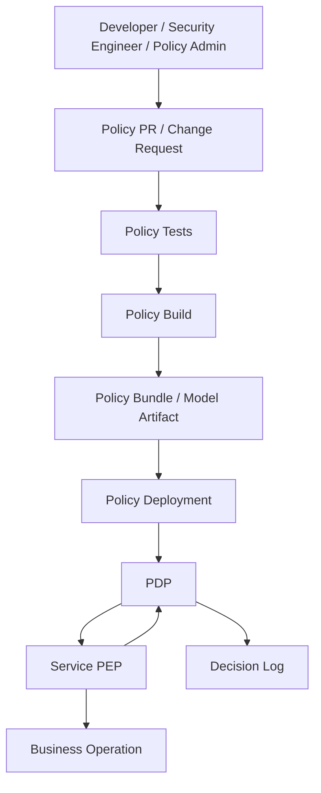
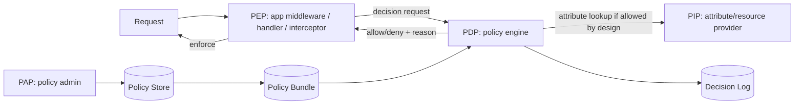
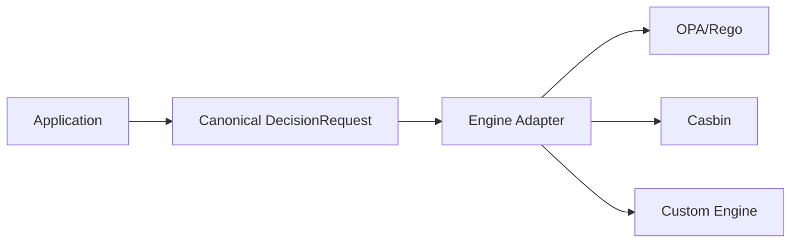
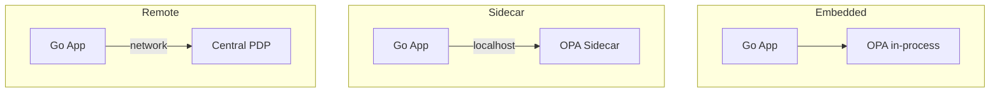
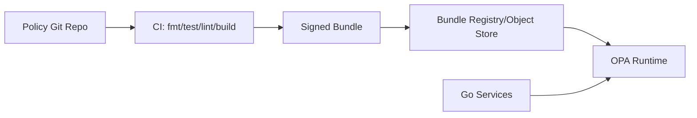
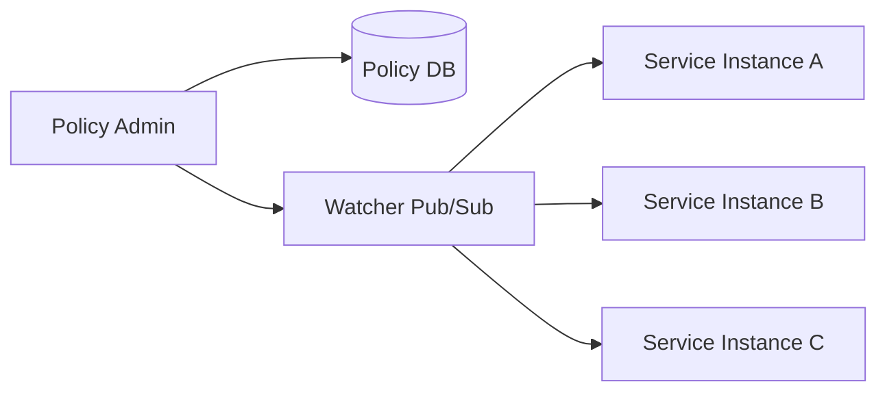
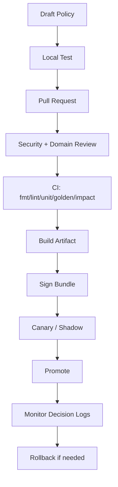
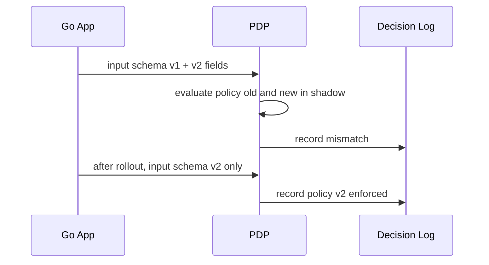
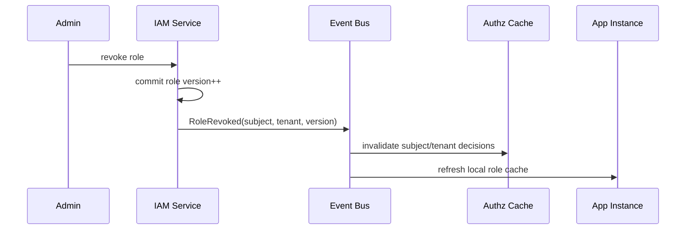

# learn-go-authentication-authorization-identity-permission-part-024.md

# Part 024 — Policy-as-Code di Go: OPA/Rego, Casbin, Custom Policy Engine

> Seri: `learn-go-authentication-authorization-identity-permission`  
> Bagian: `024` dari `035`  
> Target pembaca: engineer yang sudah paham basic Go, HTTP/gRPC, identity, session/token, RBAC, ABAC, dan ReBAC dari bagian sebelumnya.  
> Fokus: bagaimana menjadikan authorization policy sebagai artefak engineering yang versioned, tested, reviewable, deployable, observable, dan defensible.

---

## Daftar Isi

1. [Tujuan Bagian Ini](#1-tujuan-bagian-ini)
2. [Problem Sebenarnya: Authorization Logic yang Tidak Terkelola](#2-problem-sebenarnya-authorization-logic-yang-tidak-terkelola)
3. [Mental Model: Policy-as-Code sebagai Control Plane](#3-mental-model-policy-as-code-sebagai-control-plane)
4. [Policy-as-Code Bukan Sekadar Memakai Rego/Casbin](#4-policy-as-code-bukan-sekadar-memakai-regocasbin)
5. [Taxonomy Policy Engine](#5-taxonomy-policy-engine)
6. [Architecture: PEP, PDP, PIP, PAP, Policy Store, Decision Log](#6-architecture-pep-pdp-pip-pap-policy-store-decision-log)
7. [Decision Contract yang Stabil](#7-decision-contract-yang-stabil)
8. [Policy Input Contract](#8-policy-input-contract)
9. [OPA/Rego untuk Authorization di Go](#9-oparego-untuk-authorization-di-go)
10. [Embedding OPA di Go](#10-embedding-opa-di-go)
11. [OPA sebagai Sidecar atau Remote PDP](#11-opa-sebagai-sidecar-atau-remote-pdp)
12. [OPA Bundle, Versioning, dan Rollout](#12-opa-bundle-versioning-dan-rollout)
13. [Testing Rego Policy](#13-testing-rego-policy)
14. [Performance dan Partial Evaluation OPA](#14-performance-dan-partial-evaluation-opa)
15. [Casbin untuk Authorization di Go](#15-casbin-untuk-authorization-di-go)
16. [Casbin Model Design: Request, Policy, Effect, Matcher](#16-casbin-model-design-request-policy-effect-matcher)
17. [Casbin dengan RBAC Domain, ABAC, dan Hybrid Model](#17-casbin-dengan-rbac-domain-abac-dan-hybrid-model)
18. [Casbin Adapter, Watcher, Dispatcher, dan Multi-Instance Consistency](#18-casbin-adapter-watcher-dispatcher-dan-multi-instance-consistency)
19. [Custom Policy Engine: Kapan Masuk Akal?](#19-custom-policy-engine-kapan-masuk-akal)
20. [Mendesain Custom Policy Engine yang Tidak Berbahaya](#20-mendesain-custom-policy-engine-yang-tidak-berbahaya)
21. [Cedar sebagai Referensi Desain Policy Language](#21-cedar-sebagai-referensi-desain-policy-language)
22. [Policy Lifecycle: Authoring, Review, Test, Deploy, Rollback](#22-policy-lifecycle-authoring-review-test-deploy-rollback)
23. [Policy Versioning dan Migration](#23-policy-versioning-dan-migration)
24. [Policy Administration: Who Can Change the Rules?](#24-policy-administration-who-can-change-the-rules)
25. [Observability: Decision Log, Metrics, Trace, Explain](#25-observability-decision-log-metrics-trace-explain)
26. [Auditability dan Regulatory Defensibility](#26-auditability-dan-regulatory-defensibility)
27. [Distributed Failure Modes](#27-distributed-failure-modes)
28. [Caching, Freshness, dan Revocation](#28-caching-freshness-dan-revocation)
29. [Policy-as-Code untuk HTTP, gRPC, Worker, dan Event Consumer](#29-policy-as-code-untuk-http-grpc-worker-dan-event-consumer)
30. [Reference Package Layout di Go](#30-reference-package-layout-di-go)
31. [End-to-End Example: Regulatory Case Management](#31-end-to-end-example-regulatory-case-management)
32. [Testing Strategy untuk Top 1% Engineering Standard](#32-testing-strategy-untuk-top-1-engineering-standard)
33. [Anti-Pattern](#33-anti-pattern)
34. [Production Checklist](#34-production-checklist)
35. [Review Questions](#35-review-questions)
36. [Ringkasan](#36-ringkasan)
37. [Referensi Primer](#37-referensi-primer)

---

## 1. Tujuan Bagian Ini

Bagian sebelumnya membahas RBAC, permission modelling, ABAC, dan ReBAC. Bagian ini menjawab pertanyaan berikut:

> Setelah kita punya model permission, bagaimana policy itu dijadikan artefak engineering yang aman, bisa diuji, bisa di-review, bisa di-deploy, bisa diobservasi, dan bisa dipertanggungjawabkan?

Di sistem kecil, authorization sering ditulis seperti ini:

```go
if user.Role == "admin" || user.ID == case.OwnerID {
    // allow
}
```

Masalahnya bukan hanya kode tersebut jelek. Masalahnya adalah:

1. policy tersebar;
2. tidak ada policy inventory;
3. perubahan policy tidak bisa di-review sebagai perubahan kontrol keamanan;
4. tidak ada versi policy pada audit log;
5. tidak ada test matrix yang sistematis;
6. tidak ada simulasi dampak perubahan;
7. tidak ada rollback cepat;
8. tidak jelas siapa yang berwenang mengubah aturan;
9. decision tidak bisa dijelaskan;
10. sistem sulit dipertahankan ketika masuk multi-tenant, workflow, delegated access, service-to-service, dan regulator audit.

Policy-as-Code mencoba mengubah policy dari “logic ad hoc di application code” menjadi “artefak yang eksplisit”.

Namun perlu hati-hati:

> Policy-as-Code bukan otomatis aman. Ia hanya membuat policy lebih eksplisit. Kalau input contract buruk, policy language disalahgunakan, atau lifecycle tidak terkendali, hasilnya tetap rentan.

---

## 2. Problem Sebenarnya: Authorization Logic yang Tidak Terkelola

Authorization logic menjadi berbahaya ketika ia punya karakteristik berikut.

### 2.1 Policy tersebar di banyak layer

Contoh:

- API Gateway punya rule path-level.
- Backend punya role check.
- Repository punya tenant filter.
- Frontend menyembunyikan tombol.
- Worker memproses event tanpa re-check.
- Report/export memakai query berbeda.
- Admin console punya bypass.

Akibatnya, tidak ada satu tempat untuk menjawab:

> “Siapa sebenarnya boleh melakukan action X terhadap resource Y dalam konteks Z?”

### 2.2 Policy bercampur dengan business logic

```go
func approveCase(ctx context.Context, caseID string) error {
    user := auth.UserFromContext(ctx)
    c := repo.GetCase(caseID)

    if user.Role == "supervisor" && c.Stage == "review" && c.TeamID == user.TeamID {
        c.Status = "approved"
        return repo.Save(c)
    }

    return ErrForbidden
}
```

Kode ini terlihat sederhana, tapi ada beberapa masalah:

- action `case.approve` tidak eksplisit;
- resource type tidak eksplisit;
- policy tidak reusable;
- policy sulit diuji tanpa menjalankan business function;
- audit log sulit menyimpan policy version;
- rule baru membuat business method makin besar;
- perubahan policy menjadi perubahan aplikasi.

### 2.3 Policy tidak punya schema

Policy butuh input seperti:

```json
{
  "subject": {"id": "u_123", "role": "case_officer"},
  "action": "case.approve",
  "resource": {"id": "case_456", "stage": "draft"},
  "context": {"tenant_id": "cea", "aal": 2}
}
```

Kalau field ini tidak distandardisasi, masing-masing service akan mengirim format berbeda:

- `userId` vs `user_id`;
- `caseStatus` vs `stage`;
- `role` vs `roles`;
- `tenant` vs `agency`;
- `action` vs `permission`;
- `resourceID` tanpa `resourceType`.

Policy-as-Code yang paling sering gagal bukan karena Rego atau Casbin buruk, tetapi karena input contract tidak disiplin.

### 2.4 Tidak ada negative test

Banyak tim hanya menguji happy path:

- supervisor bisa approve;
- admin bisa view;
- owner bisa edit.

Yang sering tidak diuji:

- supervisor tenant A tidak boleh approve tenant B;
- revoked role tidak boleh dipakai;
- stale token tidak boleh membawa permission lama;
- archived case tidak boleh dimodifikasi;
- support impersonation tidak boleh melakukan irreversible action;
- service account tidak boleh memakai user-only action;
- report export harus enforce row-level permission;
- batch worker harus deny event yang resource-nya berubah stage.

Policy-as-Code harus membawa test discipline, bukan hanya memindahkan rule dari Go ke file `.rego` atau `.conf`.

---

## 3. Mental Model: Policy-as-Code sebagai Control Plane

Policy-as-Code adalah pendekatan yang memperlakukan policy sebagai:

1. **kode** — ditulis dalam format formal;
2. **kontrak** — punya input/output schema;
3. **artefak rilis** — punya versi, change log, dan rollback;
4. **objek audit** — decision dapat dikaitkan dengan policy version;
5. **produk internal** — dipakai banyak service;
6. **security control** — perubahan harus melalui governance.

Diagram mental:



Kunci mentalnya:

> Policy-as-Code bukan hanya “rule dalam file”. Policy-as-Code adalah lifecycle lengkap untuk membuat authorization decision dapat dikendalikan seperti software production-grade.

---

## 4. Policy-as-Code Bukan Sekadar Memakai Rego/Casbin

Ada tiga level maturity.

### Level 1 — Policy embedded ad hoc

```go
if user.Role == "admin" {
    allow()
}
```

Ciri:

- cepat;
- sederhana;
- buruk untuk audit;
- sulit berubah;
- rawan duplikasi.

### Level 2 — Policy library

```go
allowed, err := authz.Can(user, "case.approve", resource)
```

Ciri:

- policy terkonsentrasi;
- masih dalam Go;
- lebih mudah diuji;
- belum tentu bisa dikelola non-developer;
- deployment policy ikut deployment app.

### Level 3 — Policy-as-Code

```go
decision, err := pdp.Decide(ctx, authz.DecisionRequest{
    Subject: subject,
    Action:  "case.approve",
    Resource: resource,
    Context: ctxAttrs,
})
```

Ciri:

- policy terpisah dari business code;
- input/output formal;
- policy versioned;
- policy tested;
- decision logged;
- bisa embedded atau remote;
- governance lebih jelas.

### Level 4 — Policy platform

Ciri:

- multi-service policy distribution;
- bundle signing;
- policy simulation;
- impact analysis;
- decision log search;
- policy ownership;
- approval workflow;
- automated rollback;
- runtime explain/debug;
- compliance evidence.

Top engineer tidak berhenti di “pakai OPA”. Mereka mendesain policy sebagai platform control plane.

---

## 5. Taxonomy Policy Engine

Policy engine bisa dibedakan berdasarkan beberapa dimensi.

### 5.1 Berdasarkan lokasi evaluasi

| Tipe | Deskripsi | Kelebihan | Risiko |
|---|---|---|---|
| In-process embedded | Policy engine berjalan dalam process aplikasi Go | latency rendah, simple deployment | update policy ikut app/bundle, memory footprint |
| Sidecar | OPA/Casbin service lokal di pod/host | isolation, local network latency, independent update | operasional lebih kompleks |
| Remote centralized PDP | Semua service call ke central authorization service | governance kuat, decision log terpusat | latency, availability, blast radius |
| Hybrid | coarse/local + fine/remote | balance latency dan governance | consistency lebih sulit |

### 5.2 Berdasarkan bentuk policy

| Bentuk | Contoh | Cocok untuk |
|---|---|---|
| Declarative logic | Rego | ABAC, compliance, complex data evaluation |
| Model + policy rows | Casbin | RBAC/domain RBAC, ACL, simple ABAC hybrid |
| Typed policy language | Cedar | app authorization dengan schema dan principal-action-resource-context |
| Custom DSL | internal engine | domain sangat spesifik dan stabil |
| Native Go code | library sendiri | policy kecil, latency ketat, domain sederhana |

### 5.3 Berdasarkan data dependency

| Tipe policy | Contoh | Risiko utama |
|---|---|---|
| Token-only | action allowed if scope present | stale permission, overclaiming |
| Request-only | path/method/header | object-level bypass |
| Resource-attribute | stage, owner, tenant | TOCTOU, stale resource snapshot |
| Relationship graph | owner/member/delegate | traversal cost, consistency |
| External attributes | risk score, device trust | PIP latency, availability |

### 5.4 Berdasarkan determinism

Authorization sebaiknya deterministic untuk input yang sama pada policy version yang sama.

Bad:

```rego
allow if random_number() > 0.5
```

Good:

```rego
allow if input.subject.tenant_id == input.resource.tenant_id
```

Kalau risk engine digunakan, risk score harus menjadi input eksplisit, bukan dihitung diam-diam di dalam policy tanpa audit.

---

## 6. Architecture: PEP, PDP, PIP, PAP, Policy Store, Decision Log

Bagian 019 sudah memperkenalkan PEP/PDP/PIP/PAP. Di Policy-as-Code, komponen itu menjadi lebih operasional.



### 6.1 PEP — Policy Enforcement Point

PEP adalah kode yang:

1. menerima request;
2. membentuk `DecisionRequest`;
3. memanggil PDP;
4. menegakkan hasil;
5. mencatat hasil enforcement.

PEP tidak boleh:

- diam-diam override allow;
- menambal deny dengan role khusus tanpa audit;
- memanggil business method sebelum decision;
- memakai resource ID dari request tanpa tenant reconciliation;
- menyembunyikan PDP error sebagai allow kecuali explicit degraded mode yang disetujui.

### 6.2 PDP — Policy Decision Point

PDP adalah komponen yang mengevaluasi policy.

PDP harus:

- deterministic;
- deny-by-default;
- punya versi policy;
- punya explain/reason minimal;
- jelas membedakan deny vs error;
- menghasilkan obligation jika enforcement butuh tambahan aksi;
- menghasilkan decision ID untuk trace/audit.

### 6.3 PIP — Policy Information Point

PIP menyediakan attribute:

- subject attributes;
- resource attributes;
- tenant attributes;
- environment attributes;
- relationship attributes;
- risk attributes;
- assurance attributes.

Ada dua pendekatan:

1. PEP resolve semua attribute lalu kirim input lengkap ke PDP.
2. PDP call PIP saat evaluasi.

Untuk sistem Go production, pendekatan pertama sering lebih mudah diaudit dan diuji karena policy input lengkap tersimpan di decision log. Pendekatan kedua berguna jika policy kompleks dan data dependency bervariasi, tetapi lebih berisiko terhadap latency dan hidden dependency.

### 6.4 PAP — Policy Administration Point

PAP adalah sistem/proses untuk:

- menulis policy;
- review policy;
- approve policy;
- publish policy;
- rollback policy;
- melihat impact;
- mengelola ownership policy.

PAP sering diabaikan. Akibatnya policy engine aman, tetapi perubahan policy dilakukan manual oleh orang yang tidak jelas authority-nya.

### 6.5 Policy Store

Policy store dapat berupa:

- Git repository;
- database;
- object storage bundle;
- config service;
- Casbin policy table;
- OPA bundle registry.

Untuk policy-as-code, Git sering cocok sebagai source of truth karena:

- review native;
- history jelas;
- CI mudah;
- rollback jelas;
- signed commits/tags bisa diterapkan.

Namun runtime policy store bisa berbeda. Misalnya source of truth di Git, artifact runtime di S3/object storage, dan PDP mengambil bundle dari sana.

### 6.6 Decision Log

Decision log minimal harus menyimpan:

- decision ID;
- timestamp;
- service;
- endpoint/method;
- subject ID;
- actor ID;
- tenant ID;
- action;
- resource type;
- resource ID;
- decision effect;
- policy version;
- reasons/rule IDs;
- obligation/advice;
- error category jika gagal;
- input hash atau redacted input snapshot;
- correlation/trace ID.

Tanpa decision log, Policy-as-Code kehilangan banyak nilai audit.

---

## 7. Decision Contract yang Stabil

Sebelum memilih OPA atau Casbin, desain dulu decision contract.

### 7.1 Go interface

```go
package authz

import (
    "context"
    "time"
)

type Effect string

const (
    EffectAllow Effect = "allow"
    EffectDeny  Effect = "deny"
)

type DecisionRequest struct {
    RequestID string
    TraceID   string

    Subject  Subject
    Actor    *Actor
    Action   Action
    Resource Resource
    Context  DecisionContext

    // Optional: for emergency replay/debug; must not contain raw secrets.
    InputVersion string
}

type Decision struct {
    ID            string
    Effect        Effect
    Reasons       []Reason
    Obligations   []Obligation
    Advice        []Advice
    PolicyVersion string
    EvaluatedAt   time.Time
    Cache         CacheInfo
}

type Engine interface {
    Decide(ctx context.Context, req DecisionRequest) (Decision, error)
}
```

### 7.2 Deny vs error

Jangan samakan deny dan error.

| Kondisi | Meaning | HTTP mapping umum | gRPC mapping umum |
|---|---|---|---|
| unauthenticated | subject tidak valid/tidak ada | 401 | Unauthenticated |
| denied | policy mengevaluasi request dan hasilnya deny | 403 | PermissionDenied |
| indeterminate | PDP tidak bisa mengevaluasi karena input/policy/data error | 500/503 atau 403 tergantung mode | Internal/Unavailable/PermissionDenied |
| invalid request | input contract rusak | 400/500 tergantung internal/external | InvalidArgument/Internal |

Untuk operation sensitif, `indeterminate` biasanya harus fail-closed.

### 7.3 Obligation dan advice

Decision bukan hanya allow/deny. Kadang PDP perlu memberi instruksi enforcement.

Contoh obligation:

```json
{
  "effect": "allow",
  "obligations": [
    {"type": "mask_fields", "fields": ["nric", "phone"]},
    {"type": "audit_reason_required"}
  ]
}
```

Obligation harus ditegakkan oleh PEP. Kalau PEP tidak mendukung obligation tertentu, decision harus dianggap tidak dapat ditegakkan.

Advice berbeda: advice tidak wajib untuk enforcement.

```json
{
  "effect": "allow",
  "advice": [
    {"type": "display_warning", "message": "Access is logged for sensitive case."}
  ]
}
```

### 7.4 Stable contract matters

Policy engine boleh diganti dari custom ke Casbin atau OPA. Namun app code tidak boleh tersebar tergantung pada detail engine.

Bad:

```go
allowed, err := casbinEnforcer.Enforce(sub, obj, act)
```

Better:

```go
decision, err := authorizer.Decide(ctx, authz.DecisionRequest{...})
```

Dengan ini, Casbin/OPA/custom adalah implementation detail.

---

## 8. Policy Input Contract

Policy input adalah API internal antara PEP dan PDP. Treat it like public API.

### 8.1 Canonical input shape

```json
{
  "request": {
    "id": "req_01HT...",
    "time": "2026-06-24T12:00:00Z",
    "service": "case-service",
    "operation": "ApproveCase"
  },
  "subject": {
    "type": "human",
    "id": "user_123",
    "tenant_id": "tenant_cea",
    "roles": ["case_supervisor"],
    "groups": ["enforcement_north"],
    "assurance": {
      "aal": 2,
      "amr": ["pwd", "totp"],
      "auth_time": "2026-06-24T11:50:00Z"
    }
  },
  "actor": null,
  "action": {
    "name": "case.approve",
    "risk": "high"
  },
  "resource": {
    "type": "case",
    "id": "case_456",
    "tenant_id": "tenant_cea",
    "owner_id": "user_789",
    "stage": "review",
    "classification": "restricted"
  },
  "context": {
    "ip_country": "SG",
    "network_zone": "intranet",
    "request_channel": "web",
    "break_glass": false
  }
}
```

### 8.2 Input design rules

1. **Typed semantic fields lebih baik daripada string bebas.**
2. **Action harus canonical.** Gunakan `case.approve`, bukan `approve`, `APPROVE`, `canApprove`, `approve_case` campur-campur.
3. **Resource harus punya `type`, `id`, dan `tenant_id`.**
4. **Subject tenant dan resource tenant harus sama atau ada explicit cross-tenant authority.**
5. **Actor harus eksplisit untuk impersonation/delegation.**
6. **Assurance harus masuk input jika policy memerlukan step-up.**
7. **Environment attributes harus jelas source-nya.**
8. **Jangan kirim raw secret ke policy engine.**
9. **Jangan bergantung pada UI state.**
10. **Input harus bisa direplay di test environment dengan redaction.**

### 8.3 Go types untuk input

```go
type SubjectType string

const (
    SubjectHuman   SubjectType = "human"
    SubjectService SubjectType = "service"
)

type Subject struct {
    Type      SubjectType `json:"type"`
    ID        string      `json:"id"`
    TenantID  string      `json:"tenant_id"`
    Roles     []string    `json:"roles,omitempty"`
    Groups    []string    `json:"groups,omitempty"`
    Assurance Assurance   `json:"assurance"`
}

type Actor struct {
    Type     SubjectType `json:"type"`
    ID       string      `json:"id"`
    TenantID string      `json:"tenant_id"`
    Mode     string      `json:"mode"` // impersonation, delegation, break_glass
}

type Action struct {
    Name string `json:"name"`
    Risk string `json:"risk"`
}

type Resource struct {
    Type           string         `json:"type"`
    ID             string         `json:"id"`
    TenantID       string         `json:"tenant_id"`
    OwnerID        string         `json:"owner_id,omitempty"`
    Stage          string         `json:"stage,omitempty"`
    Classification string         `json:"classification,omitempty"`
    Attributes     map[string]any `json:"attributes,omitempty"`
}

type DecisionContext struct {
    Time           time.Time      `json:"time"`
    Service        string         `json:"service"`
    Operation      string         `json:"operation"`
    NetworkZone    string         `json:"network_zone,omitempty"`
    RequestChannel string         `json:"request_channel,omitempty"`
    BreakGlass     bool           `json:"break_glass"`
    Attributes     map[string]any `json:"attributes,omitempty"`
}
```

### 8.4 Jangan overfit policy input ke satu engine

OPA nyaman dengan JSON object kompleks.
Casbin tradisional nyaman dengan tuple seperti `sub, obj, act`, tetapi bisa diperluas.
Custom engine bisa typed.

Karena itu, buat canonical input internal, lalu adapter engine mengubah ke format engine.



---

## 9. OPA/Rego untuk Authorization di Go

OPA atau Open Policy Agent adalah general-purpose policy engine. Policy-nya ditulis dalam Rego, declarative language yang dirancang untuk mengevaluasi policy terhadap structured data.

### 9.1 Kapan OPA cocok?

OPA cocok ketika:

- policy kompleks dan conditional;
- input JSON/hierarchical;
- banyak attribute;
- policy ingin diuji sebagai artefak terpisah;
- butuh policy bundle distribution;
- policy dipakai lintas stack, bukan hanya Go;
- butuh compliance policy dan application policy dalam satu pendekatan;
- ingin memisahkan policy authoring dari application release.

### 9.2 Kapan OPA mungkin terlalu berat?

OPA mungkin terlalu berat ketika:

- policy hanya `user has role X`;
- latency budget sangat ketat dan policy sangat sederhana;
- tim belum punya disiplin testing policy;
- policy input belum matang;
- governance policy belum jelas;
- ingin semua authorization diketik secara compile-time di Go.

### 9.3 Rego mental model

Rego menjawab query berdasarkan input dan data.

Contoh sederhana:

```rego
package authz.case

default allow := false

allow if {
    input.subject.tenant_id == input.resource.tenant_id
    input.action.name == "case.view"
    input.subject.roles[_] == "case_officer"
}
```

Artinya:

- default deny;
- allow hanya benar jika semua kondisi terpenuhi;
- `input` berasal dari app;
- `data` bisa berisi policy data/bundle static.

### 9.4 Rego policy untuk case approval

```rego
package authz.case

import future.keywords.if
import future.keywords.in

default allow := false

high_risk_actions := {"case.approve", "case.close", "case.transfer"}

allow if {
    same_tenant
    action_is("case.view")
    has_any_role({"case_officer", "case_supervisor", "case_admin"})
}

allow if {
    same_tenant
    action_is("case.approve")
    input.resource.stage == "review"
    has_role("case_supervisor")
    sufficient_assurance
    not impersonating_forbidden_action
}

same_tenant if {
    input.subject.tenant_id == input.resource.tenant_id
}

action_is(name) if {
    input.action.name == name
}

has_role(role) if {
    role in input.subject.roles
}

has_any_role(roles) if {
    some r in roles
    r in input.subject.roles
}

sufficient_assurance if {
    input.subject.assurance.aal >= 2
}

impersonating_forbidden_action if {
    input.actor != null
    input.actor.mode == "impersonation"
    input.action.name in high_risk_actions
}
```

### 9.5 Menghasilkan reasons

Policy production-grade perlu reason.

```rego
package authz.case

import future.keywords.if
import future.keywords.in

default decision := {
    "allow": false,
    "reasons": ["default_deny"]
}

decision := {
    "allow": true,
    "reasons": ["same_tenant", "supervisor_can_approve_review_case", "aal2_satisfied"],
    "obligations": [{"type": "audit", "level": "sensitive"}]
} if {
    input.subject.tenant_id == input.resource.tenant_id
    input.action.name == "case.approve"
    input.resource.stage == "review"
    "case_supervisor" in input.subject.roles
    input.subject.assurance.aal >= 2
    input.actor == null
}
```

Hati-hati: jangan buat reasons membocorkan informasi sensitif ke user. Reason internal boleh detail; response eksternal harus generik.

### 9.6 Data vs input

Gunakan `input` untuk request-specific data.
Gunakan `data` untuk static/reference data dari bundle.

Contoh `data.authz.risk.high_risk_actions`:

```json
{
  "authz": {
    "risk": {
      "high_risk_actions": ["case.approve", "case.close", "case.transfer"]
    }
  }
}
```

Rego:

```rego
high_risk_action if {
    input.action.name in data.authz.risk.high_risk_actions
}
```

Jangan masukkan user/resource dynamic besar ke `data` jika data berubah sering dan membutuhkan freshness ketat. Untuk itu, resolve di PIP/PEP.

---

## 10. Embedding OPA di Go

OPA bisa dipakai dari Go dengan beberapa cara:

1. SDK high-level;
2. Rego package API;
3. Wasm compiled policy;
4. sidecar/remote call.

Bagian ini fokus embedded SDK/API secara konseptual.

### 10.1 Adapter interface

```go
package opaengine

import (
    "context"
    "encoding/json"
    "fmt"
    "time"

    "example.com/app/authz"
)

type Engine struct {
    query         string
    policyVersion string
    evaluator     Evaluator
}

type Evaluator interface {
    Eval(ctx context.Context, query string, input any) (any, error)
}

func (e *Engine) Decide(ctx context.Context, req authz.DecisionRequest) (authz.Decision, error) {
    started := time.Now()

    raw, err := e.evaluator.Eval(ctx, e.query, req)
    if err != nil {
        return authz.Decision{}, fmt.Errorf("opa evaluate: %w", err)
    }

    dec, err := decodeDecision(raw)
    if err != nil {
        return authz.Decision{}, fmt.Errorf("opa decode decision: %w", err)
    }

    dec.PolicyVersion = e.policyVersion
    dec.EvaluatedAt = started
    return dec, nil
}

func decodeDecision(raw any) (authz.Decision, error) {
    b, err := json.Marshal(raw)
    if err != nil {
        return authz.Decision{}, err
    }

    var dto struct {
        Allow       bool               `json:"allow"`
        Reasons     []string           `json:"reasons"`
        Obligations []authz.Obligation `json:"obligations"`
    }
    if err := json.Unmarshal(b, &dto); err != nil {
        return authz.Decision{}, err
    }

    effect := authz.EffectDeny
    if dto.Allow {
        effect = authz.EffectAllow
    }

    return authz.Decision{
        Effect:      effect,
        Reasons:     authz.StringReasons(dto.Reasons),
        Obligations: dto.Obligations,
    }, nil
}
```

Catatan: kode di atas adalah adapter skeleton. Implementasi konkret tergantung API OPA yang dipilih.

### 10.2 Input conversion

Sebaiknya jangan langsung marshal domain object penuh tanpa kontrol. Buat DTO policy input.

```go
type OPAInput struct {
    Request  OPARequest  `json:"request"`
    Subject  OPASubject  `json:"subject"`
    Actor    *OPAActor   `json:"actor,omitempty"`
    Action   OPAAction   `json:"action"`
    Resource OPAResource `json:"resource"`
    Context  OPAContext  `json:"context"`
}

func ToOPAInput(req authz.DecisionRequest) OPAInput {
    return OPAInput{
        Request: OPARequest{
            ID:        req.RequestID,
            TraceID:   req.TraceID,
            Service:   req.Context.Service,
            Operation: req.Context.Operation,
            Time:      req.Context.Time.Format(time.RFC3339Nano),
        },
        Subject: OPASubject{
            Type:     string(req.Subject.Type),
            ID:       req.Subject.ID,
            TenantID: req.Subject.TenantID,
            Roles:    append([]string(nil), req.Subject.Roles...),
            Groups:   append([]string(nil), req.Subject.Groups...),
            Assurance: OPAAssurance{
                AAL:      req.Subject.Assurance.AAL,
                AMR:      append([]string(nil), req.Subject.Assurance.AMR...),
                AuthTime: req.Subject.Assurance.AuthTime.Format(time.RFC3339Nano),
            },
        },
        Action: OPAAction{
            Name: req.Action.Name,
            Risk: req.Action.Risk,
        },
        Resource: OPAResource{
            Type:           req.Resource.Type,
            ID:             req.Resource.ID,
            TenantID:       req.Resource.TenantID,
            OwnerID:        req.Resource.OwnerID,
            Stage:          req.Resource.Stage,
            Classification: req.Resource.Classification,
        },
        Context: OPAContext{
            NetworkZone:    req.Context.NetworkZone,
            RequestChannel: req.Context.RequestChannel,
            BreakGlass:     req.Context.BreakGlass,
        },
    }
}
```

Kenapa DTO penting?

- mencegah data sensitif ikut terkirim;
- membuat schema input stabil;
- memisahkan internal domain dari policy contract;
- memudahkan golden test;
- memudahkan audit redaction.

### 10.3 Treat OPA error carefully

OPA evaluation bisa gagal karena:

- policy tidak compile;
- query path salah;
- input invalid;
- data missing;
- timeout/cancellation;
- bundle belum loaded;
- type mismatch.

Jangan lakukan ini:

```go
allowed, err := engine.Allow(ctx, req)
if err != nil {
    return nil // fail open: dangerous
}
```

Gunakan kategori error:

```go
var (
    ErrPolicyUnavailable = errors.New("policy unavailable")
    ErrPolicyInvalid     = errors.New("policy invalid")
    ErrInputInvalid      = errors.New("policy input invalid")
)
```

Mapping:

- high-risk action: fail closed;
- low-risk read-only public-ish data: mungkin degraded mode dengan explicit config;
- admin/break-glass: fail closed atau route khusus emergency dengan audit extra;
- background job: retry + quarantine event.

---

## 11. OPA sebagai Sidecar atau Remote PDP

### 11.1 Embedded vs sidecar vs remote



### 11.2 Embedded OPA

Kelebihan:

- latency rendah;
- tidak ada network hop;
- failure domain kecil;
- mudah untuk service kecil.

Kekurangan:

- policy update perlu bundle reload;
- memory per service instance;
- decision logs harus dikirim keluar;
- policy engine ada dalam blast radius app;
- governance runtime lebih terdistribusi.

### 11.3 Sidecar OPA

Kelebihan:

- app tidak membawa engine runtime langsung;
- policy update bisa lebih independent;
- bagus di Kubernetes/service mesh pattern;
- komunikasi localhost relatif cepat.

Kekurangan:

- operasional pod lebih kompleks;
- readiness/liveness harus benar;
- sidecar outage mempengaruhi app;
- version skew app-sidecar perlu dikelola;
- resource overhead.

### 11.4 Remote centralized PDP

Kelebihan:

- governance terpusat;
- decision log terpusat;
- policy update cepat;
- konsistensi policy lebih mudah;
- cocok untuk enterprise authorization platform.

Kekurangan:

- latency tambahan;
- availability kritis;
- perlu caching strategy;
- perlu circuit breaker;
- blast radius besar jika PDP down;
- data minimization lebih sulit.

### 11.5 Decision matrix

| Kondisi | Rekomendasi awal |
|---|---|
| Policy sederhana, latency super ketat | custom library atau embedded Casbin |
| ABAC kompleks, input JSON besar | OPA embedded/sidecar |
| Multi-service enterprise, audit central penting | remote PDP atau hybrid |
| Kubernetes admission/compliance juga butuh policy | OPA ecosystem menarik |
| RBAC domain-heavy dengan policy table | Casbin menarik |
| Butuh principal/action/resource/context schema kuat | Cedar-style/custom typed engine menarik |

---

## 12. OPA Bundle, Versioning, dan Rollout

OPA mendukung konsep bundle: paket policy/data yang didistribusikan ke OPA runtime.

### 12.1 Bundle mental model



### 12.2 Bundle contents

Sebuah bundle bisa memuat:

- `.rego` policy;
- static data JSON/YAML;
- manifest;
- revision/version;
- signatures jika diterapkan;
- metadata owner/change ticket.

### 12.3 Version naming

Gunakan versi yang traceable.

Contoh:

```text
authz-policy-2026.06.24-rc.1+git.4f8c2ab
```

Atau:

```text
policy_version = "case-authz/v24.6.3"
policy_revision = "git:4f8c2ab9"
policy_bundle_digest = "sha256:..."
```

Decision log harus menyimpan minimal:

- `policy_version`;
- `policy_revision`;
- `bundle_digest`.

### 12.4 Rollout modes

| Mode | Deskripsi | Cocok untuk |
|---|---|---|
| all-at-once | semua PDP update | emergency simple policy |
| canary | sebagian service/tenant | policy risk medium/high |
| shadow | evaluate policy baru tanpa enforce | impact analysis |
| dual-decision | old dan new policy dibandingkan | migration critical |
| tenant-scoped | update tenant tertentu | enterprise SaaS/multi-agency |
| action-scoped | update action tertentu | high-risk action |

### 12.5 Shadow decision

Shadow mode:

1. enforce policy lama;
2. evaluate policy baru;
3. log perbedaan;
4. jangan expose ke user;
5. analisis mismatch;
6. baru promote.

Go interface:

```go
type ShadowAuthorizer struct {
    Enforced Engine
    Shadow   Engine
    Logger   DecisionLogger
}

func (a *ShadowAuthorizer) Decide(ctx context.Context, req DecisionRequest) (Decision, error) {
    enforced, err := a.Enforced.Decide(ctx, req)
    if err != nil {
        return Decision{}, err
    }

    go func() {
        shadowCtx, cancel := context.WithTimeout(context.WithoutCancel(ctx), 200*time.Millisecond)
        defer cancel()

        shadow, shadowErr := a.Shadow.Decide(shadowCtx, req)
        a.Logger.LogShadow(req, enforced, shadow, shadowErr)
    }()

    return enforced, nil
}
```

Catatan: untuk audit deterministik, background shadow evaluation harus dirancang hati-hati. Jangan sampai shadow goroutine menabrak resource atau memakan kapasitas kritis.

---

## 13. Testing Rego Policy

Policy tanpa test adalah konfigurasi berbahaya.

### 13.1 Test categories

1. **Unit test policy rule**
2. **Decision table test**
3. **Negative test**
4. **Tenant isolation test**
5. **Assurance test**
6. **Impersonation/delegation test**
7. **Regression test dari incident**
8. **Golden input/output test**
9. **Property-style test**
10. **Shadow comparison test**

### 13.2 Decision table

| Subject role | Tenant same? | Stage | AAL | Actor mode | Action | Expected |
|---|---:|---|---:|---|---|---|
| case_supervisor | yes | review | 2 | none | case.approve | allow |
| case_supervisor | no | review | 2 | none | case.approve | deny |
| case_supervisor | yes | draft | 2 | none | case.approve | deny |
| case_supervisor | yes | review | 1 | none | case.approve | deny |
| case_admin | yes | review | 2 | impersonation | case.approve | deny |
| case_officer | yes | review | 2 | none | case.approve | deny |

### 13.3 Rego test example

```rego
package authz.case_test

import data.authz.case

test_supervisor_can_approve_review_case if {
    input := {
        "subject": {
            "tenant_id": "tenant_cea",
            "roles": ["case_supervisor"],
            "assurance": {"aal": 2}
        },
        "actor": null,
        "action": {"name": "case.approve"},
        "resource": {
            "tenant_id": "tenant_cea",
            "stage": "review"
        }
    }

    case.decision with input as input == {
        "allow": true,
        "reasons": ["same_tenant", "supervisor_can_approve_review_case", "aal2_satisfied"],
        "obligations": [{"type": "audit", "level": "sensitive"}]
    }
}

test_cross_tenant_denied if {
    input := {
        "subject": {
            "tenant_id": "tenant_a",
            "roles": ["case_supervisor"],
            "assurance": {"aal": 2}
        },
        "actor": null,
        "action": {"name": "case.approve"},
        "resource": {
            "tenant_id": "tenant_b",
            "stage": "review"
        }
    }

    not case.decision.allow with input as input
}
```

### 13.4 Golden tests from Go

```go
func TestPolicyGolden(t *testing.T) {
    cases := []struct {
        Name     string
        Input    authz.DecisionRequest
        Expected authz.Effect
    }{
        {
            Name:     "supervisor same tenant review aal2 can approve",
            Input:    fixtures.SupervisorApproveReviewCase(),
            Expected: authz.EffectAllow,
        },
        {
            Name:     "cross tenant supervisor denied",
            Input:    fixtures.CrossTenantSupervisorApprove(),
            Expected: authz.EffectDeny,
        },
    }

    engine := newTestOPAEngine(t)

    for _, tc := range cases {
        t.Run(tc.Name, func(t *testing.T) {
            dec, err := engine.Decide(context.Background(), tc.Input)
            if err != nil {
                t.Fatalf("decide: %v", err)
            }
            if dec.Effect != tc.Expected {
                t.Fatalf("effect = %s, want %s; reasons=%v", dec.Effect, tc.Expected, dec.Reasons)
            }
        })
    }
}
```

### 13.5 Regression tests from production incidents

Setiap authorization incident harus menghasilkan test baru.

Contoh incident:

> User dengan role supervisor tenant A bisa melihat case tenant B melalui report export.

Regression test:

- API detail denies;
- API list excludes;
- export excludes;
- background report job excludes;
- search index query excludes;
- policy log records tenant mismatch.

---

## 14. Performance dan Partial Evaluation OPA

Authorization berada di hot path. Performance harus dirancang, bukan ditebak.

### 14.1 Latency budget

Contoh budget:

| Komponen | Target |
|---|---:|
| PEP build input | < 1 ms |
| PIP resource fetch | 2–20 ms tergantung DB/cache |
| PDP evaluation local | < 1–5 ms untuk simple policy |
| PDP remote network | 5–30 ms tergantung infra |
| decision logging async | tidak blocking hot path kecuali high assurance audit |

Jangan jadikan angka ini sebagai dogma. Ukur di sistem nyata.

### 14.2 Hot path rules

1. Jangan query database dari policy language jika bisa dihindari.
2. Resolve resource attributes sebelum PDP.
3. Batasi ukuran input.
4. Jangan kirim object besar yang tidak dipakai.
5. Precompute derived attributes yang mahal.
6. Cache decision hanya jika safe.
7. Gunakan partial evaluation untuk policy yang punya data static besar.
8. Benchmark policy saat CI untuk rule kritis.

### 14.3 Partial evaluation mental model

Partial evaluation mengkompilasi sebagian policy dengan data yang sudah diketahui, sehingga runtime decision lebih ringan.

Contoh mental:

- static policy + static data diketahui di build time;
- runtime input hanya subject/action/resource/context;
- engine dapat menyederhanakan query sebelum runtime.

Ini berguna untuk:

- data policy besar;
- repeated query pattern;
- gateway-level authorization;
- list filtering;
- SQL predicate generation pattern.

### 14.4 Jangan cache sembarangan

Decision cache key minimal:

```text
subject_id + actor_id + tenant_id + action + resource_type + resource_id + resource_version + policy_version + assurance + context_hash
```

Jika resource stage berubah dari `review` ke `closed`, cached allow untuk `case.approve` harus tidak berlaku.

---

## 15. Casbin untuk Authorization di Go

Casbin adalah authorization library yang mendukung banyak model access control seperti ACL, RBAC, ABAC, ReBAC, PBAC, domain RBAC, RESTful, dan hybrid model. Casbin populer di Go karena integrasinya ringan dan modelnya mudah dipahami.

### 15.1 Kapan Casbin cocok?

Casbin cocok ketika:

- policy bisa dimodelkan sebagai tuple;
- RBAC/domain RBAC dominan;
- butuh library in-process;
- policy disimpan di database;
- butuh role hierarchy;
- policy admin sederhana;
- ingin model matcher yang mudah dibaca;
- tidak butuh Rego-like data reasoning yang kompleks.

### 15.2 Kapan Casbin kurang cocok?

Casbin kurang cocok ketika:

- policy memerlukan reasoning atas JSON kompleks besar;
- butuh policy bundle ecosystem seperti OPA;
- butuh explain detail yang sangat kaya;
- butuh complex graph permission ala Zanzibar;
- policy authoring harus dilakukan non-engineer dengan schema yang kuat;
- multi-service central governance sangat kompleks.

### 15.3 Basic Casbin example

Model file:

```ini
[request_definition]
r = sub, obj, act

[policy_definition]
p = sub, obj, act

[role_definition]
g = _, _

[policy_effect]
e = some(where (p.eft == allow))

[matchers]
m = g(r.sub, p.sub) && r.obj == p.obj && r.act == p.act
```

Policy:

```csv
p, case_supervisor, case, approve
p, case_officer, case, view
g, user_123, case_supervisor
```

Go:

```go
package casbinengine

import (
    "context"
    "fmt"

    "github.com/casbin/casbin/v2"

    "example.com/app/authz"
)

type Engine struct {
    enforcer      *casbin.Enforcer
    policyVersion string
}

func (e *Engine) Decide(ctx context.Context, req authz.DecisionRequest) (authz.Decision, error) {
    obj := req.Resource.Type
    act := req.Action.Name
    sub := req.Subject.ID

    allowed, err := e.enforcer.Enforce(sub, obj, act)
    if err != nil {
        return authz.Decision{}, fmt.Errorf("casbin enforce: %w", err)
    }

    effect := authz.EffectDeny
    if allowed {
        effect = authz.EffectAllow
    }

    return authz.Decision{
        Effect:        effect,
        PolicyVersion: e.policyVersion,
    }, nil
}
```

Ini basic, belum production-grade untuk multi-tenant dan resource-level permission.

---

## 16. Casbin Model Design: Request, Policy, Effect, Matcher

Casbin memakai PERM metamodel:

- Policy;
- Effect;
- Request;
- Matchers.

### 16.1 Request definition

Untuk multi-tenant regulatory case:

```ini
[request_definition]
r = sub, tenant, obj, act, ctx
```

`ctx` bisa berupa struct/map berisi stage, aal, actor mode, classification.

### 16.2 Policy definition

```ini
[policy_definition]
p = role, tenant, obj, act, eft
```

### 16.3 Role definition with domain

```ini
[role_definition]
g = _, _, _
```

Artinya subject punya role dalam domain/tenant.

### 16.4 Effect

```ini
[policy_effect]
e = !some(where (p.eft == deny)) && some(where (p.eft == allow))
```

Deny override sering lebih aman untuk enterprise authorization.

### 16.5 Matcher

```ini
[matchers]
m = g(r.sub, p.role, r.tenant) && \
    r.tenant == p.tenant && \
    keyMatch2(r.obj, p.obj) && \
    r.act == p.act && \
    p.eft == allow
```

Namun untuk ABAC context:

```ini
[matchers]
m = g(r.sub, p.role, r.tenant) && \
    r.tenant == p.tenant && \
    r.obj.Type == p.obj && \
    r.act == p.act && \
    r.obj.Stage == "review" && \
    r.ctx.AAL >= 2
```

### 16.6 Caution: too much logic in matcher

Matcher yang terlalu kompleks sulit diuji dan diaudit.

Bad:

```ini
m = (g(r.sub, p.role, r.tenant) || r.sub == r.obj.owner || r.ctx.breakGlass == true) && ... 200 chars more
```

Better:

- gunakan beberapa policy model terpisah;
- gunakan custom function dengan nama jelas;
- pindahkan decision ke OPA jika logic makin kompleks;
- buat wrapper decision contract yang menyimpan reasons.

---

## 17. Casbin dengan RBAC Domain, ABAC, dan Hybrid Model

### 17.1 Domain RBAC

Policy:

```csv
p, case_supervisor, tenant_cea, case, case.approve, allow
p, case_officer, tenant_cea, case, case.view, allow
g, user_123, case_supervisor, tenant_cea
g, user_456, case_officer, tenant_cea
```

Request:

```go
allowed, err := enforcer.Enforce(
    "user_123",
    "tenant_cea",
    "case",
    "case.approve",
    ctx,
)
```

### 17.2 Object with attributes

```go
type CasbinResource struct {
    Type           string
    ID             string
    TenantID       string
    Stage          string
    OwnerID        string
    Classification string
}

type CasbinContext struct {
    AAL       int
    ActorMode string
    Zone      string
}
```

Matcher dapat membaca field struct via reflection. Namun reflection-based access punya trade-off:

- lebih fleksibel;
- lebih sedikit compile-time safety;
- bisa lebih lambat;
- field rename dapat merusak policy;
- perlu test kuat.

### 17.3 Hybrid RBAC + ABAC

Contoh rule:

- user harus punya role `case_supervisor` dalam tenant;
- resource harus tenant sama;
- case harus stage `review`;
- AAL minimal 2;
- impersonation tidak boleh approve.

Casbin matcher:

```ini
[matchers]
m = g(r.sub, p.role, r.tenant) && \
    r.tenant == r.obj.TenantID && \
    r.tenant == p.tenant && \
    r.obj.Type == p.obj && \
    r.act == p.act && \
    r.obj.Stage == "review" && \
    r.ctx.AAL >= 2 && \
    r.ctx.ActorMode != "impersonation" && \
    p.eft == allow
```

Ini masih manageable. Jika conditions makin banyak, pertimbangkan OPA/custom engine.

### 17.4 Custom Casbin functions

Untuk readability:

```go
enforcer.AddFunction("sameTenant", func(args ...any) (any, error) {
    if len(args) != 2 {
        return false, nil
    }
    a, _ := args[0].(string)
    b, _ := args[1].(string)
    return a != "" && a == b, nil
})
```

Matcher:

```ini
m = sameTenant(r.tenant, r.obj.TenantID) && g(r.sub, p.role, r.tenant) && ...
```

Custom functions harus deterministic, side-effect free, cepat, dan tested.

---

## 18. Casbin Adapter, Watcher, Dispatcher, dan Multi-Instance Consistency

### 18.1 Adapter

Adapter menyimpan policy di backend:

- file;
- SQL database;
- Redis;
- MongoDB;
- object storage;
- custom source.

Production biasanya memakai database atau centralized policy store.

### 18.2 Filtered loading

Untuk multi-tenant besar, jangan load semua policy ke semua instance jika tidak perlu.

Misalnya service hanya melayani tenant tertentu:

```go
// Pseudocode: actual adapter support varies.
err := enforcer.LoadFilteredPolicy(Filter{
    Tenant: "tenant_cea",
})
```

Risiko:

- request cross-tenant bisa false deny karena policy tenant lain tidak loaded;
- lebih aman daripada false allow, tapi bisa menyebabkan operational issue;
- PEP harus tahu tenant routing.

### 18.3 Watcher

Jika policy berubah, instance lain perlu tahu.



Setelah notification, instance reload policy.

### 18.4 Consistency problem

Pertanyaan kritis:

> Setelah role dicabut, berapa lama sampai semua service menolak akses?

Jika answer-nya “tidak tahu”, desain belum production-grade.

Tentukan:

- propagation SLA;
- stale window;
- forced reload mechanism;
- emergency revoke path;
- decision cache invalidation;
- event log.

### 18.5 Policy update transaction

Jangan update policy parsial tanpa version.

Bad:

```text
insert p rule 1
insert p rule 2
insert g role assignment
commit separately
```

Better:

```text
begin transaction
insert policy_version
insert policy rules with version
mark version active atomically
commit
publish policy_version_changed
```

---

## 19. Custom Policy Engine: Kapan Masuk Akal?

Custom engine bukan dosa. Yang berbahaya adalah custom engine tanpa disiplin formal.

Custom policy engine masuk akal ketika:

1. domain sangat spesifik;
2. policy language bisa sangat kecil;
3. performance sangat ketat;
4. team butuh type-safety kuat;
5. policy author semua engineer;
6. rule lifecycle sederhana;
7. OPA/Casbin terlalu general;
8. audit reason harus domain-specific;
9. policy harus compile-time-ish;
10. dependency footprint harus minimal.

Custom engine tidak masuk akal ketika:

- ingin membuat general policy language sendiri;
- tidak punya waktu membuat parser/test/linter;
- policy akan diubah non-engineer;
- model belum stabil;
- butuh federation policy kompleks;
- butuh ecosystem bundle/distribution;
- ingin mengejar “lebih aman” tanpa bukti.

### 19.1 Contoh custom typed engine sederhana

```go
type Rule interface {
    ID() string
    Evaluate(ctx context.Context, in Input) (RuleResult, error)
}

type RuleResult struct {
    Matched bool
    Effect  Effect
    Reason  string
}

type Engine struct {
    version string
    rules   []Rule
}

func (e *Engine) Decide(ctx context.Context, in Input) (Decision, error) {
    reasons := make([]Reason, 0)
    allowed := false

    for _, rule := range e.rules {
        rr, err := rule.Evaluate(ctx, in)
        if err != nil {
            return Decision{}, fmt.Errorf("rule %s: %w", rule.ID(), err)
        }
        if !rr.Matched {
            continue
        }

        reasons = append(reasons, Reason{Code: rr.Reason, RuleID: rule.ID()})

        if rr.Effect == EffectDeny {
            return Decision{
                Effect:        EffectDeny,
                Reasons:       reasons,
                PolicyVersion: e.version,
            }, nil
        }
        if rr.Effect == EffectAllow {
            allowed = true
        }
    }

    if allowed {
        return Decision{Effect: EffectAllow, Reasons: reasons, PolicyVersion: e.version}, nil
    }

    return Decision{
        Effect:        EffectDeny,
        Reasons:       append(reasons, Reason{Code: "default_deny"}),
        PolicyVersion: e.version,
    }, nil
}
```

### 19.2 Rule example

```go
type SupervisorApproveReviewCaseRule struct{}

func (SupervisorApproveReviewCaseRule) ID() string {
    return "case.supervisor_approve_review_case.v1"
}

func (SupervisorApproveReviewCaseRule) Evaluate(ctx context.Context, in Input) (RuleResult, error) {
    if in.Action.Name != "case.approve" {
        return RuleResult{}, nil
    }
    if in.Subject.TenantID != in.Resource.TenantID {
        return RuleResult{Matched: true, Effect: EffectDeny, Reason: "tenant_mismatch"}, nil
    }
    if !contains(in.Subject.Roles, "case_supervisor") {
        return RuleResult{Matched: true, Effect: EffectDeny, Reason: "missing_case_supervisor_role"}, nil
    }
    if in.Resource.Stage != "review" {
        return RuleResult{Matched: true, Effect: EffectDeny, Reason: "case_not_in_review"}, nil
    }
    if in.Subject.Assurance.AAL < 2 {
        return RuleResult{Matched: true, Effect: EffectDeny, Reason: "aal2_required"}, nil
    }
    if in.Actor != nil && in.Actor.Mode == "impersonation" {
        return RuleResult{Matched: true, Effect: EffectDeny, Reason: "impersonation_cannot_approve"}, nil
    }
    return RuleResult{Matched: true, Effect: EffectAllow, Reason: "supervisor_can_approve_review_case"}, nil
}
```

Kelebihan:

- sangat eksplisit;
- typed;
- mudah debug;
- mudah unit test;
- tidak perlu DSL.

Kekurangan:

- policy deployment ikut app;
- non-engineer sulit edit;
- rule inventory harus dibuat;
- sulit untuk policy matrix besar;
- risiko rule order bug.

---

## 20. Mendesain Custom Policy Engine yang Tidak Berbahaya

Kalau membuat custom engine, wajib punya batasan.

### 20.1 Jangan buat bahasa pemrograman baru

Hindari:

- expression parser tanpa sandbox;
- arbitrary script execution;
- dynamic plugin dari user;
- eval string;
- reflection liar;
- SQL-like policy language buatan sendiri tanpa parser/test matang.

### 20.2 Gunakan typed rule registry

```go
type Registry struct {
    rules map[string]Rule
}

func NewRegistry() *Registry {
    return &Registry{rules: map[string]Rule{
        "case.supervisor_approve_review_case.v1": SupervisorApproveReviewCaseRule{},
        "case.owner_can_view.v1":                 OwnerCanViewCaseRule{},
    }}
}
```

### 20.3 Rule order harus eksplisit

```go
type Policy struct {
    Version string
    Rules   []string
    Effect  EffectMode // DenyOverride, AllowOverride, FirstMatch
}
```

Untuk authorization enterprise, deny override sering lebih aman daripada first match.

### 20.4 Policy file hanya memilih rule dan parameter

```yaml
version: case-authz/v1.4.0
effect: deny_override
rules:
  - id: case.tenant_boundary.v1
  - id: case.impersonation_high_risk_deny.v1
  - id: case.supervisor_approve_review_case.v1
    params:
      required_aal: 2
```

Policy file tidak menjalankan arbitrary code. Ia hanya mengonfigurasi rule yang sudah compiled dan tested.

### 20.5 Rule parameter schema

```go
type SupervisorApproveParams struct {
    RequiredAAL int `json:"required_aal" validate:"min=1,max=3"`
}
```

Policy config harus divalidasi sebelum load.

### 20.6 Explainability built-in

Setiap rule harus punya:

- ID;
- version;
- owner;
- description;
- input dependencies;
- effects;
- test cases.

Contoh metadata:

```go
type RuleMetadata struct {
    ID          string
    Version     string
    Owner       string
    Description string
    Inputs      []string
    Effects     []Effect
}
```

---

## 21. Cedar sebagai Referensi Desain Policy Language

Cedar adalah policy language untuk authorization decisions yang menekankan principal, action, resource, dan context. Cedar relevan sebagai referensi mental walaupun bagian ini berfokus Go, OPA, Casbin, dan custom engine.

### 21.1 Mengapa Cedar penting untuk dipelajari?

Cedar memberi contoh desain policy language yang:

- eksplisit memakai principal/action/resource/context;
- mendukung policy permit/forbid;
- punya schema untuk validasi policy;
- memisahkan authorization logic dari application logic;
- mendukung entity dan attributes;
- cocok untuk fine-grained application authorization.

### 21.2 Cedar-like mental model

```text
permit(
  principal in Role::"CaseSupervisor",
  action == Action::"case.approve",
  resource is Case
)
when {
  resource.stage == "review" &&
  principal.tenant == resource.tenant &&
  context.aal >= 2
};
```

Bahkan jika tidak memakai Cedar, model ini mengajarkan satu hal penting:

> Authorization request harus berbentuk principal + action + resource + context.

Ini lebih sehat daripada `sub,obj,act` yang terlalu miskin untuk enterprise jika tidak diperluas.

### 21.3 Pelajaran untuk Go custom engine

Ambil pelajaran berikut:

1. schema matters;
2. action harus terdaftar;
3. resource type harus terdaftar;
4. context harus punya shape;
5. policy harus bisa divalidasi sebelum runtime;
6. principal/resource attributes harus jelas;
7. forbid/deny semantics harus eksplisit.

---

## 22. Policy Lifecycle: Authoring, Review, Test, Deploy, Rollback

Policy lifecycle production-grade:



### 22.1 Authoring

Policy author harus tahu:

- action taxonomy;
- resource taxonomy;
- input schema;
- deny/allow effect semantics;
- tenant boundary rules;
- audit requirements;
- test requirements.

### 22.2 Review

Policy PR review harus mengecek:

- apakah default deny tetap berlaku;
- apakah rule terlalu luas;
- apakah tenant boundary enforce;
- apakah high-risk action perlu AAL/step-up;
- apakah impersonation dibatasi;
- apakah break-glass tercatat;
- apakah deny rule tidak tertimpa allow;
- apakah test mencakup negative cases;
- apakah impact analysis tersedia.

### 22.3 CI gates

Minimal:

- formatting;
- parse/compile;
- unit tests;
- golden tests;
- schema validation;
- prohibited pattern check;
- decision table coverage;
- performance smoke benchmark;
- bundle manifest validation.

### 22.4 Deployment

Deployment harus menyimpan:

- who approved;
- change reason;
- ticket/CR;
- version;
- diff;
- rollout target;
- rollback target;
- timestamp.

### 22.5 Rollback

Rollback policy harus lebih cepat daripada rollback application jika policy salah.

Namun rollback bisa berbahaya jika schema input sudah berubah. Karena itu, policy versioning harus kompatibel dengan input schema version.

---

## 23. Policy Versioning dan Migration

### 23.1 Policy version vs schema version

Bedakan:

- policy version;
- policy engine version;
- input schema version;
- data schema version;
- app version.

Decision log sebaiknya menyimpan semua yang relevan.

```json
{
  "policy_version": "case-authz/v3.2.1",
  "policy_revision": "git:4f8c2ab9",
  "policy_engine": "opa/1.x",
  "input_schema_version": "authz-input/v2",
  "app_version": "case-service/2026.06.24"
}
```

### 23.2 Backward compatibility

Policy baru harus bisa menerima input lama selama rollout jika app instances belum semua update.

Taktik:

- additive fields only;
- default value eksplisit;
- versioned package path;
- dual policy evaluation;
- deploy app first with dual-write input;
- deploy policy after input available;
- remove old fields terakhir.

### 23.3 Versioned Rego package

```rego
package authz.case.v2
```

Atau tetap package stabil tapi manifest menyimpan version. Pilih salah satu dengan konsisten.

### 23.4 Migration pattern



---

## 24. Policy Administration: Who Can Change the Rules?

Policy-as-Code tidak aman jika siapa pun bisa mengubah policy.

### 24.1 Policy change is privileged action

Mengubah policy setara dengan mengubah security boundary.

Contoh policy change berbahaya:

```rego
allow if input.subject.tenant_id == input.resource.tenant_id
```

Rule ini mungkin terlalu luas jika action/resource tidak dicek.

### 24.2 Governance model

| Policy type | Author | Reviewer | Approver |
|---|---|---|---|
| low-risk UI visibility | app team | tech lead | app owner |
| case workflow permission | app team + BA | security/domain owner | product/regulatory owner |
| admin/break-glass | security platform | security lead | risk/compliance |
| tenant boundary | security/platform | principal engineer | security authority |
| service-to-service | platform team | security/platform | architecture owner |

### 24.3 Separation of duties

Jangan biarkan orang yang sama:

- request access;
- approve access;
- modify policy;
- deploy policy;
- delete audit logs.

### 24.4 Emergency policy change

Emergency path boleh ada, tetapi harus:

- time-bound;
- reason required;
- dual approval jika memungkinkan;
- automatically reviewed after incident;
- logged immutably;
- rolled back atau formalized.

---

## 25. Observability: Decision Log, Metrics, Trace, Explain

Policy engine yang tidak observable akan menjadi black box.

### 25.1 Metrics

Minimal:

- `authz_decision_total{effect,action,resource_type,service}`
- `authz_decision_duration_seconds{engine,service}`
- `authz_decision_error_total{category,engine}`
- `authz_policy_version_active{version}`
- `authz_shadow_mismatch_total{action,resource_type}`
- `authz_cache_hit_total{cache}`
- `authz_cache_stale_total`
- `authz_pip_fetch_duration_seconds{source}`

### 25.2 Structured decision log

```json
{
  "decision_id": "dec_01HT...",
  "timestamp": "2026-06-24T12:10:02Z",
  "trace_id": "tr_abc",
  "service": "case-service",
  "operation": "ApproveCase",
  "subject_id": "user_123",
  "actor_id": null,
  "tenant_id": "tenant_cea",
  "action": "case.approve",
  "resource_type": "case",
  "resource_id": "case_456",
  "effect": "deny",
  "reasons": ["aal2_required"],
  "policy_version": "case-authz/v3.2.1",
  "input_schema_version": "authz-input/v2",
  "latency_ms": 3,
  "enforced": true
}
```

### 25.3 Trace

Trace harus menunjukkan:

```text
HTTP request
  -> authenticate
  -> build authz input
  -> fetch resource attributes
  -> PDP decide
  -> enforce obligations
  -> business operation
```

### 25.4 Explain

Explain untuk internal debugging.

Jangan expose detail seperti:

```text
Denied because resource belongs to tenant_b and user belongs to tenant_a.
```

ke external user jika bisa membantu enumerasi data. Response ke user cukup:

```json
{"error":"forbidden"}
```

Internal decision log boleh detail.

---

## 26. Auditability dan Regulatory Defensibility

Untuk regulatory systems, authorization decision harus bisa direkonstruksi.

Pertanyaan audit:

1. Siapa yang mengakses case?
2. Sebagai dirinya sendiri atau impersonation?
3. Action apa?
4. Resource apa?
5. Tenant/agency apa?
6. Policy versi berapa?
7. Attribute apa yang dipakai?
8. Apakah MFA/step-up terpenuhi?
9. Apakah break-glass digunakan?
10. Mengapa allow/deny?
11. Siapa yang mengubah policy tersebut?
12. Kapan policy berubah?
13. Apakah akses itu sesuai rule pada waktu kejadian?

### 26.1 Store decision evidence

Untuk high-risk operation, simpan snapshot redacted:

```json
{
  "subject": {"id":"user_123","roles":["case_supervisor"],"tenant_id":"tenant_cea","aal":2},
  "action": "case.approve",
  "resource": {"id":"case_456","tenant_id":"tenant_cea","stage":"review","classification":"restricted"},
  "context": {"network_zone":"intranet","actor_mode":null}
}
```

Jangan simpan:

- password;
- token mentah;
- raw secret;
- PII berlebihan;
- full document content jika tidak perlu.

Simpan hash/input digest untuk integrity.

### 26.2 Decision log immutability

Decision log authorization sebaiknya append-only.

Kontrol:

- write-once storage jika tersedia;
- restricted deletion;
- retention policy;
- tamper-evident hash chain untuk high assurance;
- separation from app DB;
- audit access to audit logs.

---

## 27. Distributed Failure Modes

### 27.1 PDP unavailable

Skenario:

- remote PDP down;
- sidecar crashed;
- OPA bundle not loaded;
- Casbin policy DB unreachable;
- custom engine config invalid.

Decision:

| Operation | Failure behavior |
|---|---|
| public read | allow if no auth needed |
| authenticated dashboard | maybe degraded with cached last-known-good policy |
| case approve | fail closed |
| admin grant role | fail closed |
| break-glass | separate emergency path with strong audit |
| background report export | retry/quarantine |

### 27.2 Policy bundle bad

Mitigasi:

- compile test before publish;
- canary;
- last-known-good bundle;
- atomic activation;
- health check includes policy query;
- rollback command.

### 27.3 PIP stale

Resource attribute stale dapat menyebabkan false allow.

Contoh:

- case stage berubah dari `review` ke `closed`;
- cached resource masih `review`;
- approve tetap allowed.

Mitigasi:

- resource version in cache key;
- short TTL for sensitive attributes;
- re-check inside DB transaction;
- optimistic concurrency;
- policy decision dekat dengan mutation.

### 27.4 Time skew

Policy yang memakai waktu:

- auth freshness;
- temporary grant;
- break-glass expiry;
- policy effective date.

Mitigasi:

- NTP monitoring;
- centralized time source if needed;
- skew budget;
- log evaluator time;
- do not trust client time.

### 27.5 Split brain policy version

Instance A memakai policy v1, instance B memakai v2.

Mitigasi:

- decision log menyimpan policy version;
- rollout controlled;
- version-aware support/debug;
- canary dashboard;
- emergency pin to version.

---

## 28. Caching, Freshness, dan Revocation

### 28.1 Apa yang boleh dicache?

| Data | Cacheability | Catatan |
|---|---|---|
| compiled policy | high | versioned, immutable |
| static policy data | high | bundle versioned |
| subject roles | medium | invalidation saat role revoke |
| resource attributes | low-medium | tergantung stage/version |
| risk score | low | volatile |
| decision result | careful | action/resource/context-specific |
| deny result | often safer but still context-specific | jangan mengunci akses setelah grant sah tanpa TTL |

### 28.2 Decision cache danger

Decision `allow` sangat berbahaya jika:

- role baru saja dicabut;
- resource stage berubah;
- tenant membership berubah;
- session step-up expired;
- break-glass expired;
- policy version berubah.

### 28.3 Cache key example

```go
type DecisionCacheKey struct {
    SubjectID       string
    ActorID         string
    TenantID        string
    Action          string
    ResourceType    string
    ResourceID      string
    ResourceVersion string
    PolicyVersion   string
    AAL             int
    AuthTimeBucket  int64
    ContextHash     string
}
```

### 28.4 Revocation event



### 28.5 Last-known-good policy

If policy distribution fails, app may use last-known-good policy.

Rules:

- LKG must be signed/verified;
- LKG age limit;
- LKG version logged;
- high-risk changes may require fresh policy;
- emergency revoke must bypass LKG if possible.

---

## 29. Policy-as-Code untuk HTTP, gRPC, Worker, dan Event Consumer

Authorization bukan hanya HTTP request.

### 29.1 HTTP PEP

```go
func RequireAction(authorizer authz.Engine, action string, load ResourceLoader) func(http.Handler) http.Handler {
    return func(next http.Handler) http.Handler {
        return http.HandlerFunc(func(w http.ResponseWriter, r *http.Request) {
            principal := MustPrincipal(r.Context())

            resource, err := load(r.Context(), r)
            if err != nil {
                http.Error(w, "not found", http.StatusNotFound)
                return
            }

            req := BuildDecisionRequest(r.Context(), principal, action, resource)
            dec, err := authorizer.Decide(r.Context(), req)
            if err != nil {
                http.Error(w, "authorization unavailable", http.StatusServiceUnavailable)
                return
            }
            if dec.Effect != authz.EffectAllow {
                http.Error(w, "forbidden", http.StatusForbidden)
                return
            }

            ctx := WithDecision(r.Context(), dec)
            next.ServeHTTP(w, r.WithContext(ctx))
        })
    }
}
```

### 29.2 gRPC interceptor

```go
func UnaryAuthzInterceptor(authorizer authz.Engine, mapper MethodMapper) grpc.UnaryServerInterceptor {
    return func(ctx context.Context, req any, info *grpc.UnaryServerInfo, handler grpc.UnaryHandler) (any, error) {
        principal, ok := PrincipalFromContext(ctx)
        if !ok {
            return nil, status.Error(codes.Unauthenticated, "unauthenticated")
        }

        decisionReq, err := mapper.Map(ctx, principal, info.FullMethod, req)
        if err != nil {
            return nil, status.Error(codes.Internal, "authorization input error")
        }

        dec, err := authorizer.Decide(ctx, decisionReq)
        if err != nil {
            return nil, status.Error(codes.Unavailable, "authorization unavailable")
        }
        if dec.Effect != authz.EffectAllow {
            return nil, status.Error(codes.PermissionDenied, "permission denied")
        }

        return handler(WithDecision(ctx, dec), req)
    }
}
```

### 29.3 Worker authorization

Worker sering dilupakan.

Contoh event:

```json
{
  "type": "CaseApprovalRequested",
  "requested_by": "user_123",
  "case_id": "case_456"
}
```

Worker harus bertanya:

- apakah event origin trusted?
- apakah `requested_by` masih valid?
- apakah action masih allowed saat diproses?
- apakah resource stage berubah?
- apakah event sudah expired?

Untuk high-risk operation, authorization sebaiknya dicek saat command diterima dan saat command dieksekusi jika ada delay signifikan.

### 29.4 Event consumer PEP

```go
func (h *Handler) HandleCaseApprovalRequested(ctx context.Context, ev CaseApprovalRequested) error {
    resource, err := h.cases.Get(ctx, ev.CaseID)
    if err != nil {
        return err
    }

    subject, err := h.subjects.GetSnapshotOrCurrent(ctx, ev.RequestedBy)
    if err != nil {
        return err
    }

    dec, err := h.authz.Decide(ctx, authz.DecisionRequest{
        Subject:  subject,
        Action:   authz.Action{Name: "case.approve", Risk: "high"},
        Resource: resource.ToAuthzResource(),
        Context: authz.DecisionContext{
            Service:   "case-worker",
            Operation: "HandleCaseApprovalRequested",
            Time:      h.clock.Now(),
        },
    })
    if err != nil {
        return retryable(err)
    }
    if dec.Effect != authz.EffectAllow {
        return h.quarantine(ctx, ev, dec)
    }

    return h.cases.Approve(ctx, ev.CaseID, ev.RequestedBy)
}
```

---

## 30. Reference Package Layout di Go

```text
/internal/authz/
  decision.go              # canonical request/decision types
  engine.go                # Engine interface
  errors.go                # error taxonomy
  context.go               # principal/decision context helpers
  pep_http.go              # HTTP PEP helpers
  pep_grpc.go              # gRPC PEP helpers
  audit.go                 # decision logging interface

/internal/authz/opaengine/
  engine.go                # OPA adapter
  input.go                 # DTO conversion
  result.go                # decode OPA result
  bundle.go                # bundle metadata/version
  errors.go

/internal/authz/casbinengine/
  engine.go                # Casbin adapter
  model.conf
  mapper.go                # DecisionRequest -> Casbin args
  watcher.go
  errors.go

/internal/authz/customengine/
  engine.go
  rule.go
  registry.go
  policy_config.go
  rules_case.go
  tests/

/policy/opa/
  authz/case.rego
  authz/case_test.rego
  data/risk.json
  manifest.yaml

/policy/casbin/
  model.conf
  policy.csv

/policy/testdata/
  decisions/case_approve_allow.json
  decisions/case_approve_cross_tenant_deny.json
```

### 30.1 Interface package

```go
package authz

type Engine interface {
    Decide(ctx context.Context, req DecisionRequest) (Decision, error)
}

type ResourceLoader interface {
    LoadAuthzResource(ctx context.Context, id string) (Resource, error)
}

type DecisionLogger interface {
    LogDecision(ctx context.Context, req DecisionRequest, dec Decision, err error)
}
```

### 30.2 Avoid import cycles

Business module boleh import `authz` interface.
`authz` tidak boleh import business module.
Gunakan mapper di boundary.

Bad:

```text
authz imports case
case imports authz
```

Good:

```text
case -> authz interface
case -> caseauthz mapper
caseauthz -> authz
caseauthz -> case domain
```

---

## 31. End-to-End Example: Regulatory Case Management

### 31.1 Scenario

Action:

```text
case.approve
```

Rules:

1. user harus authenticated;
2. subject tenant harus sama dengan case tenant;
3. user harus role `case_supervisor` pada tenant tersebut;
4. case stage harus `review`;
5. user harus AAL >= 2;
6. impersonation tidak boleh approve;
7. break-glass tidak boleh approve kecuali emergency policy khusus;
8. decision harus audit sensitive.

### 31.2 OPA input

```json
{
  "subject": {
    "type": "human",
    "id": "user_123",
    "tenant_id": "cea",
    "roles": ["case_supervisor"],
    "assurance": {"aal": 2, "amr": ["pwd", "totp"]}
  },
  "actor": null,
  "action": {"name": "case.approve", "risk": "high"},
  "resource": {
    "type": "case",
    "id": "case_456",
    "tenant_id": "cea",
    "stage": "review",
    "classification": "restricted"
  },
  "context": {
    "service": "case-service",
    "operation": "ApproveCase",
    "network_zone": "intranet",
    "break_glass": false
  }
}
```

### 31.3 OPA policy

```rego
package authz.case

import future.keywords.if
import future.keywords.in

default decision := {
  "allow": false,
  "reasons": ["default_deny"]
}

decision := {
  "allow": true,
  "reasons": [
    "tenant_match",
    "case_supervisor",
    "case_in_review",
    "aal2_satisfied",
    "not_impersonated"
  ],
  "obligations": [
    {"type": "audit", "level": "sensitive"}
  ]
} if {
  input.action.name == "case.approve"
  input.subject.type == "human"
  input.subject.tenant_id == input.resource.tenant_id
  input.resource.type == "case"
  input.resource.stage == "review"
  "case_supervisor" in input.subject.roles
  input.subject.assurance.aal >= 2
  input.actor == null
  not input.context.break_glass
}
```

### 31.4 Go enforcement

```go
func (s *CaseService) ApproveCase(ctx context.Context, cmd ApproveCaseCommand) error {
    principal, ok := authn.PrincipalFromContext(ctx)
    if !ok {
        return ErrUnauthenticated
    }

    c, err := s.caseRepo.GetForUpdate(ctx, cmd.CaseID)
    if err != nil {
        return err
    }

    dec, err := s.authz.Decide(ctx, authz.DecisionRequest{
        RequestID: requestid.FromContext(ctx),
        TraceID:   traceid.FromContext(ctx),
        Subject:   principal.Subject,
        Actor:     principal.Actor,
        Action:    authz.Action{Name: "case.approve", Risk: "high"},
        Resource: authz.Resource{
            Type:           "case",
            ID:             c.ID,
            TenantID:       c.TenantID,
            Stage:          c.Stage,
            Classification: c.Classification,
        },
        Context: authz.DecisionContext{
            Time:        s.clock.Now(),
            Service:     "case-service",
            Operation:   "ApproveCase",
            NetworkZone: principal.NetworkZone,
            BreakGlass:  principal.BreakGlass,
        },
    })
    s.decisionLogger.LogDecision(ctx, dec, err)

    if err != nil {
        return ErrAuthorizationUnavailable
    }
    if dec.Effect != authz.EffectAllow {
        return ErrForbidden
    }
    if err := enforceObligations(dec.Obligations); err != nil {
        return err
    }

    return s.caseRepo.Approve(ctx, c.ID, principal.Subject.ID)
}
```

### 31.5 Important invariant

Policy evaluation dan mutation harus menggunakan resource state yang konsisten.

Jika `GetForUpdate` tidak digunakan, ada risiko:

1. PEP membaca stage `review`;
2. process lain mengubah stage ke `closed`;
3. service tetap approve;
4. policy benar, enforcement timing salah.

Authorization untuk mutation harus dekat dengan transaction boundary.

---

## 32. Testing Strategy untuk Top 1% Engineering Standard

### 32.1 Policy unit tests

- Rego tests;
- Casbin model tests;
- custom rule tests.

### 32.2 Contract tests

Pastikan semua service mengirim input schema yang sama.

```go
func TestDecisionInputSchema(t *testing.T) {
    req := fixtures.SupervisorApproveReviewCase()
    b, err := json.Marshal(req)
    if err != nil {
        t.Fatal(err)
    }

    if err := jsonschema.Validate(authzInputSchema, b); err != nil {
        t.Fatal(err)
    }
}
```

### 32.3 Golden decision tests

Simpan JSON input/output.

```text
/policy/testdata/
  case_approve_allow.input.json
  case_approve_allow.output.json
  case_approve_cross_tenant_deny.input.json
  case_approve_cross_tenant_deny.output.json
```

### 32.4 Mutation tests

Coba ubah policy dan lihat test gagal.

Contoh mutation:

- hapus tenant check;
- turunkan AAL requirement;
- allow impersonation;
- ignore stage;
- change deny override to allow override.

Kalau test tetap hijau, test suite lemah.

### 32.5 Differential tests

Bandingkan engine lama dan baru.

```go
func TestOPAAndCustomEngineEquivalentForCoreCases(t *testing.T) {
    inputs := fixtures.DecisionCorpus()
    opa := newOPA(t)
    custom := newCustom(t)

    for _, in := range inputs {
        t.Run(in.Name, func(t *testing.T) {
            d1, err1 := opa.Decide(context.Background(), in.Request)
            d2, err2 := custom.Decide(context.Background(), in.Request)

            if (err1 != nil) != (err2 != nil) {
                t.Fatalf("error mismatch: opa=%v custom=%v", err1, err2)
            }
            if d1.Effect != d2.Effect {
                t.Fatalf("effect mismatch: opa=%s custom=%s", d1.Effect, d2.Effect)
            }
        })
    }
}
```

### 32.6 End-to-end authorization tests

E2E harus menguji:

- API detail;
- API list;
- export;
- worker;
- gRPC;
- admin console;
- impersonation;
- tenant switching;
- stale token;
- revoked role;
- step-up expiry.

### 32.7 Performance tests

Benchmark:

- decision per second;
- p95/p99 latency;
- policy reload time;
- bundle size;
- memory allocation;
- cache hit ratio;
- PIP latency;
- decision log backpressure.

---

## 33. Anti-Pattern

### 33.1 “We use OPA, therefore authorization is solved”

OPA adalah engine. Ia tidak otomatis memperbaiki:

- input buruk;
- missing enforcement;
- stale attributes;
- wrong tenant model;
- weak policy review;
- absent audit.

### 33.2 Policy tanpa owner

Setiap policy harus punya owner. Tanpa owner, policy menjadi “milik semua orang”, artinya tidak ada yang bertanggung jawab.

### 33.3 Token claims as policy source of truth

Token claims boleh menjadi evidence, bukan selalu source of truth.

Jika role dicabut tapi token masih berisi role lama, policy token-only bisa false allow.

### 33.4 Frontend-driven policy

Frontend boleh menyembunyikan tombol, tetapi backend tetap wajib enforce.

### 33.5 Giant admin role

```rego
allow if "admin" in input.subject.roles
```

Ini sering menjadi root cause privilege escalation. Admin harus contextual, scoped, dan audited.

### 33.6 Policy calls external services unpredictably

Policy evaluation yang memanggil banyak service saat runtime akan sulit diprediksi.

Lebih baik PEP/PIP resolve attributes secara eksplisit dengan timeout, cache, dan logging.

### 33.7 No explicit deny/error distinction

Jika error dianggap deny tanpa logging, debugging sulit.
Jika error dianggap allow, security hancur.

### 33.8 No policy version in audit

Tanpa policy version, audit tidak bisa menjawab mengapa akses diizinkan saat itu.

### 33.9 Over-generalized DSL

Custom DSL yang terlalu fleksibel biasanya menjadi bahasa pemrograman baru tanpa tooling matang.

### 33.10 Policy change without simulation

Policy perubahan high-risk harus punya shadow/impact test.

---

## 34. Production Checklist

### 34.1 Design checklist

- [ ] Decision contract stabil.
- [ ] Input schema versioned.
- [ ] Action taxonomy canonical.
- [ ] Resource taxonomy canonical.
- [ ] Tenant boundary explicit.
- [ ] Actor/impersonation explicit.
- [ ] Assurance attributes explicit.
- [ ] Deny-by-default.
- [ ] Deny vs error dibedakan.
- [ ] Obligation support jelas.

### 34.2 OPA checklist

- [ ] Rego package structure jelas.
- [ ] `default allow := false` atau equivalent decision default deny.
- [ ] Policy tests mencakup negative cases.
- [ ] Bundle version/digest logged.
- [ ] Bundle rollout controlled.
- [ ] Last-known-good strategy.
- [ ] Query path tested.
- [ ] Input redaction.
- [ ] Performance benchmark.

### 34.3 Casbin checklist

- [ ] Model file reviewed.
- [ ] Effect semantics jelas.
- [ ] Domain/tenant model benar.
- [ ] Matcher tidak terlalu kompleks.
- [ ] Adapter transactionality jelas.
- [ ] Watcher/reload strategy.
- [ ] Policy versioning.
- [ ] Filtered loading behavior understood.
- [ ] Custom functions deterministic.

### 34.4 Custom engine checklist

- [ ] Tidak menjalankan arbitrary code.
- [ ] Rule registry typed.
- [ ] Rule metadata lengkap.
- [ ] Rule order/effect mode eksplisit.
- [ ] Config schema validated.
- [ ] Test suite kuat.
- [ ] Audit reason built-in.
- [ ] Policy version logged.
- [ ] Rollback strategy.

### 34.5 Operational checklist

- [ ] Decision log tersedia.
- [ ] Metrics tersedia.
- [ ] Trace integration.
- [ ] Shadow mode untuk perubahan besar.
- [ ] Policy rollback playbook.
- [ ] Emergency revoke path.
- [ ] PDP outage behavior documented.
- [ ] PIP timeout/caching documented.
- [ ] Audit retention.
- [ ] Access to policy admin controlled.

---

## 35. Review Questions

1. Apa bedanya Policy-as-Code dengan sekadar memindahkan `if role == ...` ke file konfigurasi?
2. Mengapa decision contract harus dirancang sebelum memilih OPA/Casbin/custom engine?
3. Apa risiko terbesar jika policy input tidak punya schema stabil?
4. Kapan OPA lebih cocok daripada Casbin?
5. Kapan Casbin lebih cocok daripada OPA?
6. Kapan custom policy engine masuk akal?
7. Mengapa deny dan error tidak boleh disamakan?
8. Apa itu obligation, dan apa risiko jika PEP mengabaikannya?
9. Apa saja field minimal decision log untuk audit?
10. Bagaimana cara melakukan safe rollout policy change?
11. Apa beda policy version dan input schema version?
12. Mengapa token claims tidak boleh selalu dijadikan source of truth authorization?
13. Bagaimana mencegah stale decision cache setelah role revoke?
14. Mengapa worker/event consumer juga perlu PEP?
15. Apa yang harus dilakukan saat PDP unavailable untuk high-risk action?

---

## 36. Ringkasan

Policy-as-Code adalah langkah penting dari authorization yang tersebar menuju authorization yang bisa dikelola sebagai sistem engineering.

Namun nilai utamanya bukan pada nama tool. Nilainya ada pada disiplin:

- canonical decision request;
- stable input schema;
- deterministic policy evaluation;
- deny-by-default;
- policy versioning;
- tests;
- controlled rollout;
- decision logging;
- explainability;
- auditability;
- revocation and freshness model;
- operational runbook.

OPA/Rego kuat untuk policy deklaratif kompleks atas structured data dan policy bundle ecosystem.
Casbin kuat untuk access-control model yang bisa diekspresikan lewat PERM metamodel, RBAC/domain RBAC, ACL, dan hybrid model yang relatif ringan.
Custom engine bisa benar jika domain sempit, typed, tested, dan tidak berubah menjadi DSL liar.

Prinsip paling penting:

> Policy engine adalah implementation detail. Yang harus stabil adalah authorization decision contract, enforcement boundary, policy lifecycle, dan audit evidence.

Jika bagian 019–023 membangun model authorization, bagian 024 ini membangun cara mengoperasionalkannya sebagai platform control plane.

---

## 37. Referensi Primer

Referensi ini digunakan sebagai basis faktual dan arah desain. Materi di atas disusun sebagai sintesis engineering, bukan salinan spesifikasi.

1. Go 1.26 Release Notes — https://go.dev/doc/go1.26
2. Open Policy Agent Documentation — https://www.openpolicyagent.org/docs
3. OPA Policy Language / Rego — https://www.openpolicyagent.org/docs/policy-language
4. OPA Go SDK package — https://pkg.go.dev/github.com/open-policy-agent/opa/v1/sdk
5. Apache Casbin Documentation — https://casbin.apache.org/
6. Casbin RBAC Documentation — https://casbin.org/docs/rbac/
7. Casbin ABAC Documentation — https://casbin.org/docs/abac/
8. Casbin How It Works / PERM Metamodel — https://casbin.org/docs/how-it-works
9. Cedar Policy Language Reference — https://docs.cedarpolicy.com/
10. AWS Prescriptive Guidance: Cedar for SaaS Multi-Tenant API Authorization — https://docs.aws.amazon.com/prescriptive-guidance/latest/saas-multitenant-api-access-authorization/cedar.html
11. NIST SP 800-162 — Attribute Based Access Control Definition and Considerations — https://csrc.nist.gov/pubs/sp/800/162/upd2/final
12. OWASP Authorization Cheat Sheet — https://cheatsheetseries.owasp.org/cheatsheets/Authorization_Cheat_Sheet.html
13. OWASP ASVS — https://owasp.org/www-project-application-security-verification-standard/
14. Zanzibar: Google's Consistent, Global Authorization System — https://research.google/pubs/zanzibar-googles-consistent-global-authorization-system/

---

## Status Seri

Seri belum selesai.

Bagian berikutnya:

`learn-go-authentication-authorization-identity-permission-part-025.md` — **Capability-Based Access: Delegation, Token Exchange, Fine-Grained Grants**


<!-- NAVIGATION_FOOTER -->
<div class="page-nav">
<a href="./learn-go-authentication-authorization-identity-permission-part-023.md">⬅️ Part 023 — ReBAC: Relationship-Based Authorization dan Graph Permission di Go</a>
<a href="./index.md">📚 Kategori</a>
<a href="../../index.md">🏠 Home</a>
<a href="./learn-go-authentication-authorization-identity-permission-part-025.md">Part 025 — Capability-Based Access di Go: Delegation, Token Exchange, Fine-Grained Grants ➡️</a>
</div>
