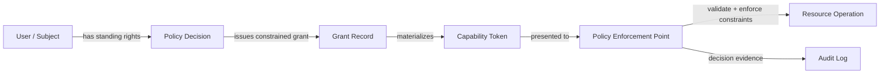
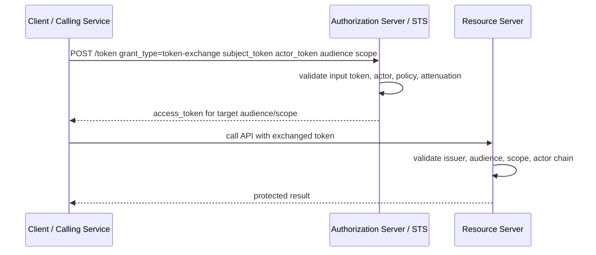
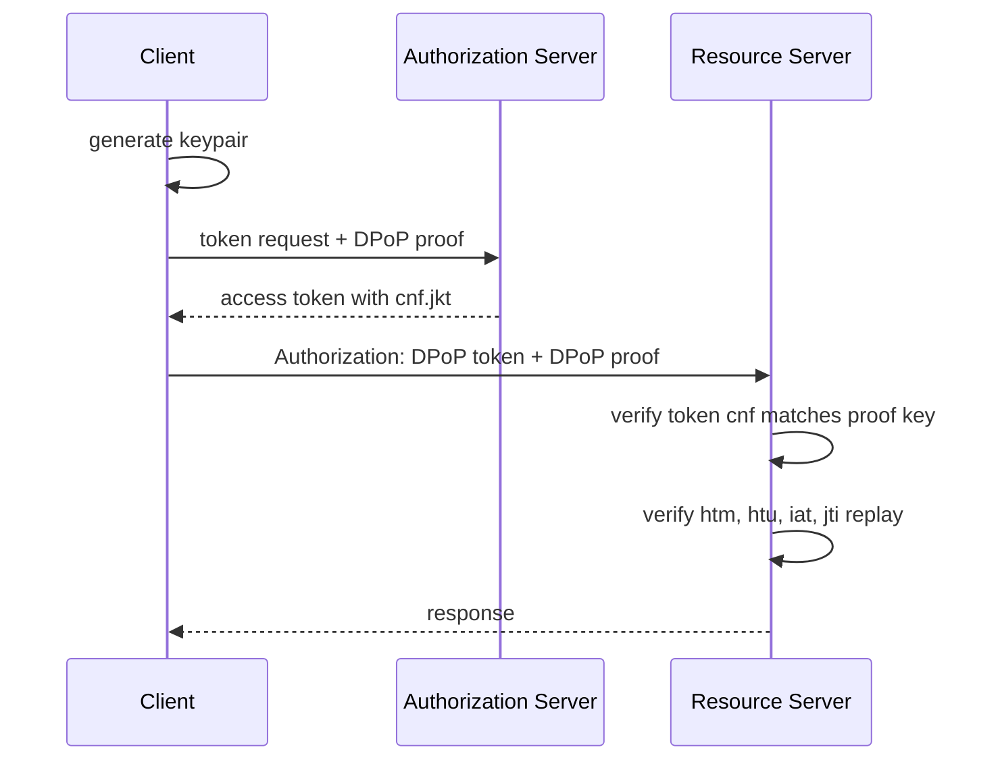
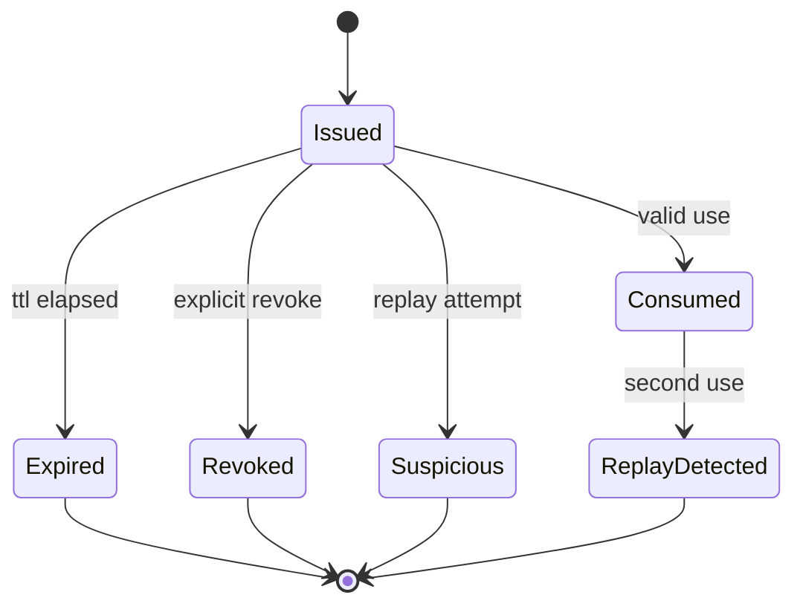
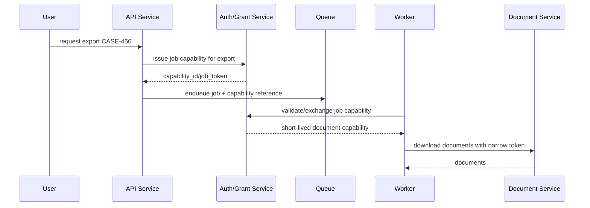
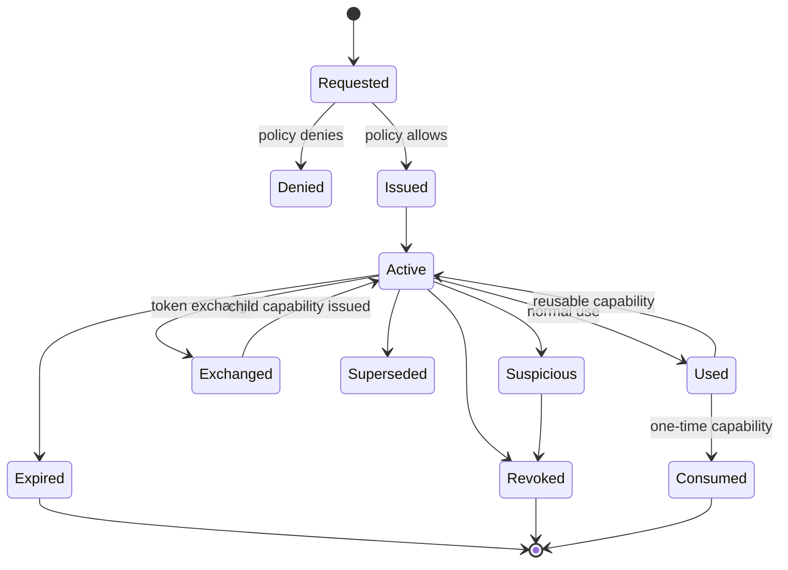
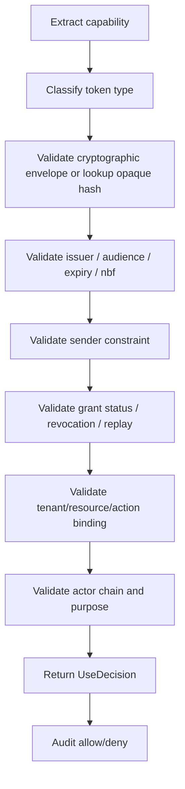
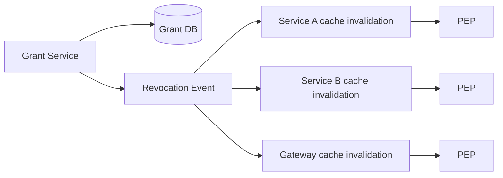
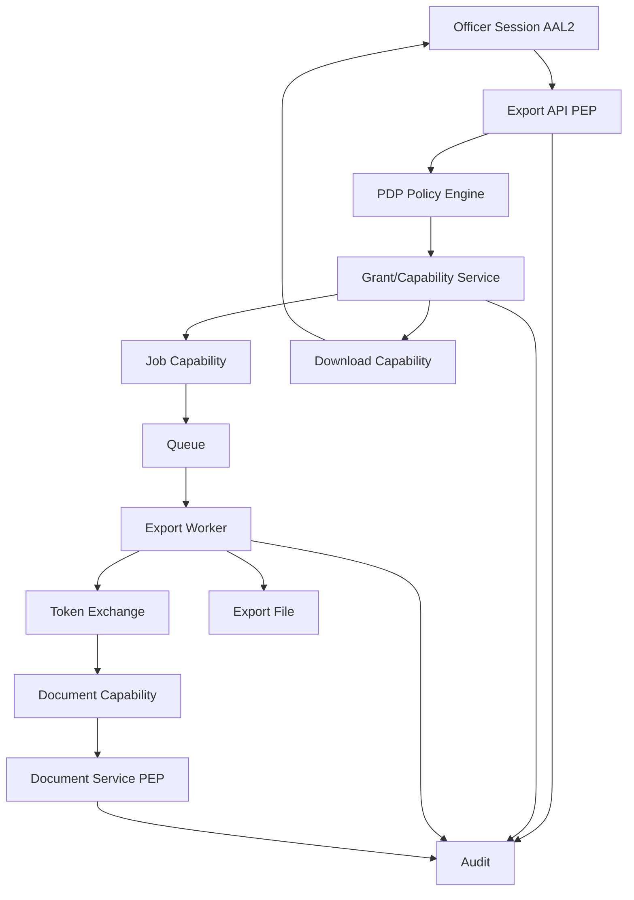

# learn-go-authentication-authorization-identity-permission-part-025.md

# Part 025 — Capability-Based Access di Go: Delegation, Token Exchange, Fine-Grained Grants

> Seri: `learn-go-authentication-authorization-identity-permission`  
> Bagian: `025` dari `035`  
> Target pembaca: engineer yang sudah paham identity domain model, session/token lifecycle, OAuth/OIDC, RBAC, ABAC, ReBAC, dan Policy-as-Code dari bagian sebelumnya.  
> Fokus: bagaimana memodelkan *authority as transferable, constrained, auditable capability* tanpa membuat privilege escalation, confused deputy, token replay, atau delegation chain yang tidak bisa dipertanggungjawabkan.

---

## Daftar Isi

1. [Tujuan Bagian Ini](#1-tujuan-bagian-ini)
2. [Problem Sebenarnya: Access yang Perlu Didelegasikan](#2-problem-sebenarnya-access-yang-perlu-didelegasikan)
3. [Mental Model: Authority sebagai Capability](#3-mental-model-authority-sebagai-capability)
4. [Terminologi Presisi](#4-terminologi-presisi)
5. [Capability-Based Access vs RBAC/ABAC/ReBAC](#5-capability-based-access-vs-rbacabacrebac)
6. [Capability Bukan Berarti Tanpa Policy](#6-capability-bukan-berarti-tanpa-policy)
7. [Delegation vs Impersonation vs Acting-On-Behalf-Of](#7-delegation-vs-impersonation-vs-acting-on-behalf-of)
8. [Threat Model Capability-Based Access](#8-threat-model-capability-based-access)
9. [Capability Token Anatomy](#9-capability-token-anatomy)
10. [Attenuation: Membatasi Authority secara Bertingkat](#10-attenuation-membatasi-authority-secara-bertingkat)
11. [OAuth 2.0 Token Exchange sebagai Security Token Service](#11-oauth-20-token-exchange-sebagai-security-token-service)
12. [Subject Token, Actor Token, dan Actor Chain](#12-subject-token-actor-token-dan-actor-chain)
13. [Token Exchange Use Case Patterns](#13-token-exchange-use-case-patterns)
14. [Fine-Grained Grants dengan Scope, Resource Indicator, dan RAR](#14-fine-grained-grants-dengan-scope-resource-indicator-dan-rar)
15. [Sender-Constrained Capability: DPoP dan mTLS](#15-sender-constrained-capability-dpop-dan-mtls)
16. [Bearer Capability: Kapan Masih Masuk Akal?](#16-bearer-capability-kapan-masih-masuk-akal)
17. [Opaque Capability vs JWT Capability](#17-opaque-capability-vs-jwt-capability)
18. [Macaroons dan Contextual Caveats](#18-macaroons-dan-contextual-caveats)
19. [One-Time Capability dan Transaction Capability](#19-one-time-capability-dan-transaction-capability)
20. [Capability untuk Background Job, Worker, dan Event Consumer](#20-capability-untuk-background-job-worker-dan-event-consumer)
21. [Capability untuk File Download, Export, dan Pre-Signed Operation](#21-capability-untuk-file-download-export-dan-pre-signed-operation)
22. [Capability untuk Service-to-Service Delegation](#22-capability-untuk-service-to-service-delegation)
23. [Capability Lifecycle](#23-capability-lifecycle)
24. [Revocation, Introspection, dan Grant Family](#24-revocation-introspection-dan-grant-family)
25. [Data Model dan Schema Reference](#25-data-model-dan-schema-reference)
26. [Go Domain Model](#26-go-domain-model)
27. [Token Exchange Service di Go](#27-token-exchange-service-di-go)
28. [Capability Issuer di Go](#28-capability-issuer-di-go)
29. [Capability Validator di Go](#29-capability-validator-di-go)
30. [PEP Integration: HTTP, gRPC, Worker](#30-pep-integration-http-grpc-worker)
31. [Auditability dan Regulatory Defensibility](#31-auditability-dan-regulatory-defensibility)
32. [Consistency, Caching, dan Revocation Latency](#32-consistency-caching-dan-revocation-latency)
33. [Testing Strategy](#33-testing-strategy)
34. [Performance Engineering](#34-performance-engineering)
35. [Failure-Mode Matrix](#35-failure-mode-matrix)
36. [Anti-Pattern](#36-anti-pattern)
37. [Production Checklist](#37-production-checklist)
38. [Case Study: Regulatory Case Management](#38-case-study-regulatory-case-management)
39. [Review Questions](#39-review-questions)
40. [Ringkasan](#40-ringkasan)
41. [Referensi Primer](#41-referensi-primer)

---

## 1. Tujuan Bagian Ini

Bagian sebelumnya membahas policy-as-code: bagaimana policy dibuat, diuji, di-version, di-deploy, dan dievaluasi. Bagian ini masuk ke pertanyaan lain yang sering muncul di sistem enterprise modern:

> Bagaimana satu principal dapat memberikan authority terbatas kepada principal lain, service lain, worker lain, job lain, aplikasi lain, atau operasi tertentu, tanpa memberikan seluruh identity/role/permission miliknya?

Contoh nyata:

1. user mengizinkan aplikasi eksternal membaca data tertentu;
2. UI meminta backend membuat export file yang diproses oleh background worker;
3. service A perlu memanggil service B *on behalf of* user;
4. support officer perlu membantu user, tetapi tidak boleh menjadi user secara penuh;
5. system scheduler perlu melanjutkan workflow atas dasar approval sebelumnya;
6. API gateway perlu menukar token user menjadi token audience-specific untuk downstream service;
7. document service perlu memberi temporary download link;
8. case owner perlu mendelegasikan review ke colleague selama 2 hari;
9. payment/transaction system perlu token satu kali untuk satu operasi;
10. service perlu mengubah broad user access menjadi narrow downstream capability.

Masalahnya, banyak sistem menyelesaikan ini dengan pola berbahaya:

```text
- pass user JWT ke semua service;
- berikan role admin sementara;
- pakai service account global;
- simpan user password/token untuk dipakai nanti;
- buat “impersonation” tanpa actor chain;
- kirim signed URL tanpa audit/revocation;
- pakai scope string terlalu broad;
- “trust internal service” tanpa audience/resource binding.
```

Capability-based access adalah pendekatan untuk menjadikan authority sebagai artefak eksplisit:

```text
Principal X may perform action A on resource R under constraints C until time T,
possibly as delegated by principal Y, through actor Z, for purpose P.
```

Tujuan bagian ini adalah membangun mental model dan implementasi Go yang mampu menjawab:

1. authority apa yang diberikan;
2. siapa pemberi authority;
3. siapa penerima authority;
4. siapa actor yang menjalankan authority;
5. resource apa yang ditargetkan;
6. action apa yang diizinkan;
7. batas waktu, tenant, assurance, purpose, network, dan device apa yang berlaku;
8. apakah token dapat digunakan ulang;
9. apakah authority dapat didelegasikan lagi;
10. bagaimana revocation dilakukan;
11. bagaimana audit membedakan owner, subject, actor, dan service.

---

## 2. Problem Sebenarnya: Access yang Perlu Didelegasikan

Di sistem monolit kecil, authorization sering diasumsikan selalu terjadi langsung:

```text
User -> API -> DB
```

API mengecek permission user terhadap resource, lalu menjalankan aksi.

Di sistem distributed, flow nyata lebih sering seperti ini:

```text
User -> Web App -> API Gateway -> Case Service -> Document Service -> Storage
                                    -> Workflow Service -> Worker
                                    -> Notification Service
                                    -> Audit Service
```

Pertanyaan menjadi lebih rumit:

1. Apakah Document Service boleh membaca document karena user boleh, atau karena Case Service boleh?
2. Jika worker berjalan 10 menit setelah request user, apakah worker masih boleh memakai authority user?
3. Jika user permission dicabut setelah job dibuat, apakah job harus gagal?
4. Jika support officer membuka case atas nama user, apakah audit menulis user, support officer, atau keduanya?
5. Jika service account punya akses luas, bagaimana mencegah service menyalahgunakan authority itu?
6. Jika token bocor dari log worker, seberapa besar blast radius?
7. Jika capability untuk export file tersebar, bagaimana menghentikannya?
8. Jika user memberi akses read-only ke external integration, bagaimana memastikan integration tidak bisa write?

Top engineer tidak menyelesaikan masalah ini dengan “tambahkan claim role lagi”. Mereka memisahkan:

```text
Identity     -> siapa principal/entity-nya
Policy       -> aturan apa yang berlaku
Grant        -> authority apa yang pernah diberikan
Capability   -> artefak pembawa authority terbatas
Enforcement  -> tempat authority digunakan
Audit        -> bukti siapa memberi, siapa memakai, untuk apa
```

---

## 3. Mental Model: Authority sebagai Capability

Capability adalah bukti/artefak yang dapat dipresentasikan untuk melakukan operasi tertentu. Model paling sederhana:

```text
Jika Anda memegang capability C,
dan C valid,
dan C mencakup action/resource/context saat ini,
maka operasi boleh dilakukan.
```

Dalam sistem modern, capability bisa berbentuk:

1. opaque access token;
2. JWT access token;
3. OAuth token hasil token exchange;
4. signed URL;
5. one-time operation token;
6. API key yang di-scope;
7. temporary credential;
8. macaroon dengan caveats;
9. delegated grant record;
10. short-lived service token;
11. proof-of-possession token.

Capability berbeda dari role assignment.

Role assignment biasanya mengatakan:

```text
Fajar adalah Case Officer di tenant CEA.
```

Capability mengatakan:

```text
Bearer of this token may download document D-123 for case C-456 until 2026-06-24T21:00:00+07:00,
only through Document Service,
only for purpose: case-review,
issued by Case Service after policy decision PD-789.
```

Role adalah standing authority. Capability adalah authority yang dikemas untuk konteks tertentu.

### Diagram mental model



### Invariant utama

> Capability yang baik mengurangi authority, bukan memperluas authority.

Jika capability hasil delegation memberi akses lebih besar daripada subject/actor punya, maka itu privilege escalation.

---

## 4. Terminologi Presisi

Terminologi sangat penting karena banyak incident terjadi karena engineer memakai kata “delegation”, “impersonation”, “scope”, dan “permission” secara campur aduk.

| Istilah | Makna | Contoh |
|---|---|---|
| Subject | Entity yang authority-nya direpresentasikan | user, service, workload |
| Actor | Entity yang melakukan aksi aktual | support officer, backend service, worker |
| Resource Owner | Pihak yang memiliki authority atas resource dalam model OAuth | end-user atau organization |
| Client | Aplikasi yang meminta token/grant | SPA, backend app, service |
| Resource Server | Service yang menerima token dan melindungi resource | document API |
| Authorization Server | Pihak yang mengeluarkan token/grant | IdP/Auth service |
| Grant | Record authority yang diberikan | user consent, delegated case review |
| Capability | Artefak yang membawa authority terbatas | access token, signed URL |
| Scope | Label coarse-grained authority di OAuth | `case:read` |
| Authorization Details | Structured fine-grained request/authorization data | RAR JSON |
| Audience | Penerima token yang dimaksud | `document-service` |
| Resource Indicator | Identitas protected resource yang ditargetkan | `https://api.example.com/documents` |
| Delegation | Actor bertindak dengan authority subject, tetapi actor tetap terlihat | service acts for user |
| Impersonation | Actor “menjadi” subject, sering mengubah effective subject | support impersonates user |
| Attenuation | Mengurangi authority saat mendelegasikan | read-only, time-limited |
| Caveat | Kondisi tambahan yang harus dipenuhi | only before time T |
| Bearer Token | Token yang dapat digunakan siapa pun yang memegangnya | ordinary access token |
| Sender-Constrained Token | Token yang harus dibuktikan dipakai pemilik key/cert tertentu | DPoP, mTLS-bound |

### Perbedaan paling penting

```text
Impersonation hides or replaces authority context unless designed carefully.
Delegation preserves both subject and actor.
Capability carries authority, but should also carry evidence and constraints.
```

Di sistem audit/regulatory, delegation hampir selalu lebih defensible daripada impersonation murni.

---

## 5. Capability-Based Access vs RBAC/ABAC/ReBAC

Capability-based access bukan pengganti semua authorization model. Ia adalah cara membawa authority yang sudah diputuskan.

| Model | Cocok untuk | Kelemahan jika dipakai sendirian |
|---|---|---|
| RBAC | standing permission berdasarkan jabatan/domain | sulit untuk dynamic context dan per-resource delegation |
| ABAC | rule berbasis attribute/context | membutuhkan attribute freshness dan policy governance |
| ReBAC | permission berdasarkan relasi graph | butuh graph consistency dan query model |
| Policy-as-Code | decision logic eksplisit dan versioned | masih butuh artefak untuk membawa decision lintas boundary |
| Capability | delegated/constrained/portable authority | risk jika bearer, tidak revocable, atau terlalu broad |

Pola yang sehat:

```text
RBAC/ABAC/ReBAC/Policy-as-Code menentukan apakah capability boleh diterbitkan.
Capability membawa hasil authority terbatas ke boundary lain.
PEP tetap memvalidasi capability dan constraints saat digunakan.
```

Jangan membalik:

```text
Capability diterbitkan bebas lalu dianggap menggantikan semua policy.
```

Itu berbahaya karena capability menjadi bypass policy.

---

## 6. Capability Bukan Berarti Tanpa Policy

Kesalahpahaman umum:

> “Kalau pakai capability token, resource server cukup cek signature token.”

Itu hanya benar untuk capability yang sangat sempit, sangat pendek umur, audience-bound, dan seluruh constraints-nya self-contained. Untuk enterprise system, resource server sering tetap perlu policy/context check.

Contoh capability:

```json
{
  "iss": "https://auth.example.com",
  "sub": "user:123",
  "act": {"sub": "service:case-service"},
  "aud": "document-service",
  "scope": "document:download",
  "resource": "document:DOC-789",
  "tenant": "tenant:CEA",
  "purpose": "case-review",
  "exp": 1782315600,
  "jti": "cap_01J..."
}
```

Resource server masih harus mengecek:

1. token signature;
2. issuer;
3. audience;
4. expiry;
5. subject/actor semantics;
6. resource ID di URL cocok dengan claim;
7. tenant di URL/header/token cocok;
8. `jti` belum dicabut/jika one-time belum dipakai;
9. operation sesuai scope/action;
10. purpose/assurance/freshness jika diperlukan;
11. policy version jika token perlu online confirmation;
12. actor chain tidak melanggar boundary.

Capability bukan “surat izin tanpa pemeriksaan”. Capability adalah bukti authority yang harus dievaluasi pada boundary penggunaan.

---

## 7. Delegation vs Impersonation vs Acting-On-Behalf-Of

### Delegation

Delegation berarti subject memberikan atau memungkinkan actor bertindak dengan authority terbatas atas nama subject.

```text
Subject: user:alice
Actor: service:case-service
Action: document:download
Resource: document:DOC-123
```

Audit harus mampu menulis:

```text
service:case-service downloaded document:DOC-123 on behalf of user:alice
under grant:grant-789
```

### Impersonation

Impersonation berarti actor menjalankan sistem sebagai subject. Ini sering dipakai untuk support tooling.

Risiko:

1. audit kehilangan actor asli;
2. action tampak dilakukan oleh user;
3. actor dapat melihat/menjalankan lebih dari yang diperlukan;
4. user dapat disalahkan atas aksi support;
5. non-repudiation rusak;
6. approval/evidence menjadi kabur.

Jika impersonation harus ada, desain minimal:

```text
effective_subject = user:alice
real_actor        = support:bob
mode              = impersonation
reason_code       = USER_SUPPORT
approval_id       = approval:123
session_id        = imp_session:456
scope             = read-only unless explicitly elevated
```

### Acting-on-behalf-of

Istilah ini sering dipakai untuk service-to-service delegation.

Contoh:

```text
User requests export.
API service calls report service on behalf of user.
Report service calls document service using a token representing:
- subject: user
- actor: report service
- original client: web app
- delegation chain: api -> report
```

### Decision table

| Kebutuhan | Pilihan lebih aman |
|---|---|
| Service meneruskan user authority | delegation / token exchange |
| Support membantu user | controlled impersonation with actor chain |
| Worker melanjutkan aksi user | operation-specific capability |
| External app akses data user | OAuth consent + narrow grant |
| Temporary download | signed capability URL with expiry/resource binding |
| Admin emergency | break-glass grant + approval + audit |

---

## 8. Threat Model Capability-Based Access

Capability menambah kekuatan desain, tetapi juga menambah attack surface.

### 8.1 Token theft

Jika capability adalah bearer token, siapa pun yang mencuri token bisa memakai token.

Sumber kebocoran:

1. log application;
2. browser history;
3. referrer header;
4. metrics label;
5. crash dump;
6. query string;
7. proxy log;
8. support screenshot;
9. misconfigured tracing;
10. local storage.

Mitigasi:

1. short TTL;
2. audience/resource binding;
3. sender-constrained token;
4. no token in URL jika bisa;
5. hash token at rest;
6. secret redaction;
7. one-time usage;
8. revocation/introspection;
9. structured audit;
10. log hygiene.

### 8.2 Overbroad delegation

Capability terlalu broad:

```text
scope: document:*
aud: *
resource: *
exp: 24h
```

Mitigasi:

1. issue by requested action/resource;
2. deny wildcard unless explicitly approved;
3. maximum TTL per capability class;
4. downstream audience binding;
5. authorization details/RAR for fine-grained action;
6. policy-based issuance.

### 8.3 Confused deputy

Confused deputy terjadi ketika service yang punya authority tinggi ditipu untuk memakai authority-nya demi attacker.

Contoh:

```text
Attacker cannot download document D.
Attacker calls export service with document_id=D.
Export service uses its broad service account to download D.
```

Mitigasi:

1. service tidak memakai ambient authority untuk user-controlled resource;
2. service meminta delegated capability dari AS/PDP;
3. resource server mengecek subject/actor/resource binding;
4. PEP memverifikasi `resource` claim cocok dengan requested resource;
5. audit mencatat actor chain.

### 8.4 Token substitution

Token untuk resource A dipakai ke resource B.

Mitigasi:

1. audience validation;
2. resource indicator;
3. token type validation;
4. endpoint-specific required action/resource;
5. strict claim matching.

### 8.5 Delegation chain laundering

Actor mencoba menyembunyikan asal authority dengan menukar token berkali-kali.

Mitigasi:

1. preserve actor chain;
2. max delegation depth;
3. require exchange policy;
4. audit each exchange;
5. include parent grant/token id;
6. prohibit exchange from certain token classes.

### 8.6 Replay

Capability dipakai ulang setelah intended use.

Mitigasi:

1. `jti` replay cache;
2. one-time token status;
3. nonce/challenge for transaction;
4. DPoP `jti` proof replay cache;
5. expiry sangat pendek.

---

## 9. Capability Token Anatomy

Capability yang baik harus menjawab enam pertanyaan:

```text
Who?       subject and actor
What?      action/scope/authorization_details
Which?     resource/audience/tenant
Why?       purpose/reason/grant
When?      nbf/iat/exp/freshness
How?       sender constraint/proof/assurance
```

### 9.1 Minimal capability fields

| Field | Fungsi |
|---|---|
| `iss` | issuer yang dipercaya |
| `sub` | subject authority |
| `act` | actor yang memakai/menukar token |
| `aud` | resource server target |
| `scope` | coarse permission label |
| `authorization_details` | fine-grained structured permission |
| `tenant_id` | tenant boundary |
| `resource` | target resource spesifik atau resource server indicator |
| `purpose` | alasan penggunaan |
| `grant_id` | grant/evidence source |
| `policy_decision_id` | decision evidence |
| `iat` | issued at |
| `nbf` | not before |
| `exp` | expiry |
| `jti` | unique token identifier |
| `cnf` | confirmation claim untuk sender-constrained token |

### 9.2 Example JWT capability

```json
{
  "iss": "https://id.example.gov",
  "sub": "user:U123",
  "act": {
    "sub": "service:report-service",
    "act": {"sub": "service:case-service"}
  },
  "aud": "document-service",
  "client_id": "aceas-web-bff",
  "scope": "document:download",
  "authorization_details": [
    {
      "type": "document_access",
      "actions": ["download"],
      "locations": ["document:DOC-789"],
      "case_id": "case:CASE-456",
      "purpose": "case-review"
    }
  ],
  "tenant_id": "tenant:CEA",
  "grant_id": "grant:GR-123",
  "policy_decision_id": "pd:PD-987",
  "assurance": {
    "aal": 2,
    "auth_time": 1782312000,
    "amr": ["pwd", "totp"]
  },
  "jti": "cap_01JZABCDE",
  "iat": 1782312300,
  "nbf": 1782312300,
  "exp": 1782312900
}
```

### 9.3 Jangan overload `scope`

Bad:

```text
scope = "document:download:tenant:CEA:case:CASE-456:document:DOC-789:purpose:case-review"
```

Lebih baik:

```text
scope = "document:download"
authorization_details = structured JSON
resource = "document-service"
tenant_id = "tenant:CEA"
```

Scope cocok untuk coarse-grained operation. Structured details cocok untuk fine-grained authority.

---

## 10. Attenuation: Membatasi Authority secara Bertingkat

Attenuation adalah kemampuan untuk menurunkan authority saat capability didelegasikan.

Contoh:

```text
Original authority:
- user can read/write all documents in case CASE-1

Delegated capability to report service:
- read only
- documents used by report R-1
- tenant CEA
- expires in 5 minutes
- audience report-service

Delegated capability from report service to document service:
- download only
- document DOC-9
- expires in 60 seconds
- audience document-service
```

### 10.1 Attenuation dimensions

| Dimensi | Contoh pembatasan |
|---|---|
| Action | write -> read -> download |
| Resource | all case documents -> one document |
| Tenant | all tenant scope -> one tenant |
| Time | 1 hour -> 2 minutes |
| Audience | multiple services -> one service |
| Purpose | investigation -> export generation |
| Actor | any backend -> report-service only |
| Network | internal network only |
| Assurance | requires AAL2 within 10 minutes |
| Delegability | non-delegatable after one hop |
| Usage count | one-time only |

### 10.2 Invariant attenuation

```text
Child capability authority must be subset of parent capability authority.
```

Secara engineering:

```go
func IsSubset(child, parent CapabilityPolicy) bool {
    return child.Actions.SubsetOf(parent.Actions) &&
        child.Resources.SubsetOf(parent.Resources) &&
        child.TenantID == parent.TenantID &&
        !child.ExpiresAt.After(parent.ExpiresAt) &&
        child.DelegationDepth <= parent.DelegationDepth+1
}
```

Real implementation lebih kompleks, tetapi prinsipnya jelas: token exchange tidak boleh memperluas authority.

---

## 11. OAuth 2.0 Token Exchange sebagai Security Token Service

OAuth 2.0 Token Exchange mendefinisikan mekanisme HTTP/JSON Security Token Service untuk meminta dan memperoleh security token dari Authorization Server. Mekanisme ini mendukung skenario delegation dan impersonation.

Flow konseptual:



### 11.1 Kenapa token exchange dibutuhkan?

Tanpa token exchange, service sering meneruskan original user token ke downstream service.

Masalah:

1. original token audience mungkin bukan downstream service;
2. scope terlalu broad;
3. downstream menerima token yang tidak dimaksudkan untuknya;
4. revocation dan audit sulit;
5. actor chain hilang;
6. confused deputy lebih mudah;
7. tidak ada attenuation.

Token exchange memungkinkan:

1. audience-specific token;
2. reduced scope;
3. actor chain;
4. controlled delegation;
5. policy enforcement saat exchange;
6. audit event per boundary;
7. standardized STS pattern.

### 11.2 Token exchange request contoh

```http
POST /oauth/token HTTP/1.1
Host: auth.example.gov
Content-Type: application/x-www-form-urlencoded
Authorization: Basic ...

grant_type=urn:ietf:params:oauth:grant-type:token-exchange
&subject_token=eyJ...
&subject_token_type=urn:ietf:params:oauth:token-type:access_token
&actor_token=eyJ...
&actor_token_type=urn:ietf:params:oauth:token-type:access_token
&audience=document-service
&scope=document:download
&resource=https://api.example.gov/documents
```

### 11.3 Token exchange response contoh

```json
{
  "access_token": "eyJhbGciOiJSUzI1NiIs...",
  "issued_token_type": "urn:ietf:params:oauth:token-type:access_token",
  "token_type": "Bearer",
  "expires_in": 120,
  "scope": "document:download"
}
```

### 11.4 Exchange policy

Authorization Server tidak boleh menjadi vending machine token.

Exchange harus mengecek:

1. subject token valid;
2. actor token valid jika ada;
3. client boleh melakukan token exchange;
4. actor boleh act for subject;
5. requested audience diizinkan;
6. requested scope subset dari authority;
7. requested resource valid;
8. grant masih aktif;
9. assurance cukup;
10. delegation depth tidak melewati batas;
11. tenant boundary cocok;
12. token class boleh ditukar;
13. target service boleh menerima token class tersebut.

---

## 12. Subject Token, Actor Token, dan Actor Chain

Dalam token exchange, `subject_token` merepresentasikan subject yang authority-nya menjadi basis exchange. `actor_token` merepresentasikan actor yang melakukan exchange, terutama dalam delegation.

### 12.1 Subject token only

```text
Client menukar token user untuk token audience-specific.
```

Use case:

```text
web-bff receives user token -> exchanges for document-service token
```

### 12.2 Subject token + actor token

```text
Actor service membuktikan identitasnya sendiri sambil meminta token atas nama user.
```

Use case:

```text
report-service uses its service token as actor_token
and user's delegated token as subject_token
```

### 12.3 Actor chain

Jika exchange terjadi bertingkat, actor chain harus dipertahankan.

```text
User U
  acted by case-service
    acted by report-service
      acted by document-export-worker
```

JWT-style nested actor claim:

```json
{
  "sub": "user:U123",
  "act": {
    "sub": "service:document-export-worker",
    "act": {
      "sub": "service:report-service",
      "act": {
        "sub": "service:case-service"
      }
    }
  }
}
```

Catatan desain:

1. actor chain jangan dibuat tak terbatas;
2. setiap hop harus punya audit event;
3. setiap hop harus mengecilkan authority atau mempertahankan subset;
4. downstream service harus tahu actor immediate dan original subject;
5. policy harus bisa melarang actor tertentu mendelegasikan lagi.

---

## 13. Token Exchange Use Case Patterns

### 13.1 Audience narrowing

Masalah:

```text
User token aud=api-gateway dipakai ke document-service.
```

Solusi:

```text
api-gateway exchanges token into aud=document-service.
```

Benefit:

1. token substitution berkurang;
2. downstream tidak menerima token yang bukan untuknya;
3. token bisa punya TTL lebih pendek;
4. scope bisa dikurangi.

### 13.2 Scope narrowing

Masalah:

```text
User token has case:read case:write document:read document:write.
Report service only needs document:download.
```

Solusi:

```text
exchange -> scope=document:download
```

### 13.3 Resource narrowing

Masalah:

```text
User can access many documents, but worker only needs DOC-9.
```

Solusi:

```text
exchange -> authorization_details.locations=["document:DOC-9"]
```

### 13.4 Background continuation

Masalah:

```text
Worker runs after HTTP request ends.
Cannot keep user session token forever.
```

Solusi:

```text
issue job capability:
- operation_id
- resource set
- TTL
- one-time or bounded retries
- grant reference
```

### 13.5 Support action

Masalah:

```text
Support officer needs view-only user context.
```

Solusi:

```text
issue support capability:
- subject = affected user/account
- actor = support officer
- mode = delegated_support
- actions = read-only
- reason_code + ticket_id
- TTL short
- audit required
```

### 13.6 External integration

Masalah:

```text
External app needs read access to selected resources.
```

Solusi:

```text
OAuth authorization code + consent + narrow grant + refresh token rotation + audience/resource binding.
```

---

## 14. Fine-Grained Grants dengan Scope, Resource Indicator, dan RAR

OAuth `scope` sering terlalu kasar.

Contoh scope:

```text
case:read document:download report:create
```

Scope tidak nyaman untuk mengekspresikan:

```text
download only document DOC-789 for case CASE-456 for purpose case-review before 21:00
```

### 14.1 Resource Indicators

Resource Indicators memungkinkan client memberi sinyal protected resource yang diminta.

Contoh:

```http
resource=https://api.example.gov/documents
```

Manfaat:

1. AS dapat menerbitkan token audience/resource-specific;
2. token tidak ambigu untuk resource server;
3. mencegah token dipakai di API yang tidak dimaksudkan;
4. mendukung multi-resource authorization.

### 14.2 Rich Authorization Requests

Rich Authorization Requests memperkenalkan parameter `authorization_details` untuk membawa data authorization yang lebih fine-grained dalam OAuth message.

Contoh RAR:

```json
{
  "authorization_details": [
    {
      "type": "document_access",
      "actions": ["download"],
      "locations": ["document:DOC-789"],
      "case_id": "case:CASE-456",
      "purpose": "case-review"
    }
  ]
}
```

### 14.3 Scope vs RAR decision rule

| Kebutuhan | Pakai |
|---|---|
| coarse capability | scope |
| endpoint/function permission | scope |
| resource-specific grant | RAR / authorization_details |
| transaction-specific permission | RAR |
| amount/boundary/purpose | RAR |
| service audience target | resource indicator / audience |
| UI consent label | scope + rendered authorization_details |

### 14.4 Jangan jadikan RAR sebagai arbitrary JSON tanpa contract

RAR harus punya schema.

Bad:

```json
{"anything": "client can put whatever"}
```

Good:

```json
{
  "type": "case_export",
  "case_id": "case:CASE-456",
  "format": "pdf",
  "include_documents": true,
  "max_documents": 25,
  "purpose": "investigation-review"
}
```

Validation:

1. known `type`;
2. schema version;
3. allowed fields;
4. max array size;
5. resource ownership;
6. tenant boundary;
7. purpose allowed;
8. TTL based on detail type;
9. audit rendering.

---

## 15. Sender-Constrained Capability: DPoP dan mTLS

Bearer token punya sifat: siapa pun yang memegang token dapat memakai token. Untuk capability dengan blast radius tinggi, ini sering tidak cukup.

Sender-constrained token mengikat token ke key/certificate tertentu.

### 15.1 DPoP

DPoP adalah proof-of-possession mechanism di application layer. Client membuktikan bahwa ia menguasai private key yang terikat ke token.

Konsep:

```text
Token contains cnf.jkt = thumbprint(public key)
Each request includes DPoP proof JWT signed by private key
Resource server validates proof and token binding
```

Flow:



DPoP validation must check:

1. DPoP proof signature;
2. `htm` matches HTTP method;
3. `htu` matches target URI;
4. `iat` within skew;
5. proof `jti` not replayed;
6. public key thumbprint matches token `cnf.jkt`;
7. token type is DPoP, not Bearer;
8. token audience/scope/resource still valid.

### 15.2 mTLS-bound token

mTLS-bound token mengikat token ke client certificate.

Konsep:

```text
Token contains cnf.x5t#S256 = certificate thumbprint
Resource server validates request TLS client cert matches token cnf
```

Cocok untuk:

1. backend-to-backend;
2. confidential clients;
3. regulated API;
4. internal platform;
5. machine identity.

Kurang cocok untuk:

1. browser-only SPA;
2. unmanaged clients;
3. mobile without proper cert lifecycle;
4. environments where mTLS termination hides client cert from app unless propagated safely.

### 15.3 Sender-constrained is not magic

Sender-constrained token mencegah token replay oleh pencuri yang tidak punya key/cert. Namun tetap harus:

1. validasi issuer/audience/scope;
2. validate tenant/resource;
3. enforce policy;
4. log actor;
5. revoke compromised grant;
6. rotate keys/certs;
7. protect private key.

---

## 16. Bearer Capability: Kapan Masih Masuk Akal?

Bearer capability masih sering dipakai karena sederhana.

Masuk akal jika:

1. TTL sangat pendek;
2. scope sangat sempit;
3. resource-specific;
4. audience-specific;
5. tidak bisa memperluas authority;
6. token tidak disimpan lama;
7. leakage surface rendah;
8. ada audit;
9. ada revocation atau natural expiry cepat;
10. operasi tidak high-risk.

Contoh masuk akal:

```text
signed URL untuk download satu file selama 60 detik.
```

Contoh tidak masuk akal:

```text
bearer token 24 jam dengan document:* dan tenant:* untuk external integration.
```

Decision heuristic:

| Risiko | Token type |
|---|---|
| low-risk, one-time, short TTL | bearer may be acceptable |
| high-value data | sender-constrained preferred |
| service-to-service | mTLS-bound or workload identity |
| browser app | BFF/session often safer than long-lived bearer |
| background job | opaque capability with server-side state |
| external integration | refresh rotation + narrow token + sender constraint if possible |

---

## 17. Opaque Capability vs JWT Capability

### 17.1 Opaque capability

Opaque token:

```text
cap_01JZ8WKVFJ4N6HY...
```

Server stores metadata:

```text
hash(token) -> grant, subject, actor, action, resource, expiry, status
```

Pros:

1. easy revocation;
2. small token;
3. no claim leakage;
4. policy metadata can change server-side;
5. safer for one-time tokens;
6. easier to bind to status/replay.

Cons:

1. requires lookup/introspection;
2. central dependency;
3. latency;
4. cache consistency problem;
5. less offline validation.

### 17.2 JWT capability

Pros:

1. self-contained;
2. fast local validation;
3. distributed-friendly;
4. useful for service mesh/downstream calls.

Cons:

1. harder immediate revocation;
2. stale claims;
3. claim leakage;
4. token bloat;
5. misvalidation risk;
6. key rotation complexity;
7. cannot easily be one-time without server-side replay store.

### 17.3 Decision table

| Use case | Preferred |
|---|---|
| one-time operation | opaque |
| signed download URL | opaque/signed compact with short TTL |
| downstream service token | JWT or opaque introspection depending architecture |
| high-risk revocable grant | opaque or JWT + introspection |
| external API token | opaque or JWT profile with strict validation |
| worker job capability | opaque server-side state usually safer |

---

## 18. Macaroons dan Contextual Caveats

Macaroons adalah bearer credentials dengan contextual caveats. Gagasan pentingnya: authority dapat diattenuate dengan menambahkan caveats, misalnya waktu, lokasi, resource, atau pihak ketiga yang harus memenuhi kondisi.

Contoh conceptual caveats:

```text
capability: read documents
caveat: only tenant=CEA
caveat: only document=DOC-123
caveat: expires before 2026-06-24T21:00:00+07:00
caveat: requires verifier service to discharge risk_ok=true
```

Kelebihan:

1. attenuation natural;
2. decentralized delegation;
3. caveat chain bisa ditambahkan tanpa issuer pusat setiap kali;
4. cocok untuk constrained sharing.

Kekurangan:

1. tetap bearer jika tidak sender-constrained;
2. revocation sulit tanpa server-side check;
3. caveat validation complexity;
4. tidak seumum OAuth/JWT di enterprise;
5. interoperability terbatas.

Mental model dari Macaroons berguna bahkan jika tidak memakai library macaroon: capability harus bisa dipersempit, bukan diperluas.

---

## 19. One-Time Capability dan Transaction Capability

One-time capability adalah token yang hanya boleh dipakai sekali.

Use case:

1. password reset finalization;
2. email verification;
3. high-risk transaction approval;
4. file export retrieval;
5. secure handoff between services;
6. workflow transition token;
7. invite acceptance;
8. magic link.

### 19.1 State machine



### 19.2 Atomic consume

Critical invariant:

```text
Validate and consume must be atomic.
```

Bad:

```go
cap, _ := repo.FindByTokenHash(ctx, hash)
if cap.Status != "issued" { return denied }
// race window here
repo.MarkConsumed(ctx, cap.ID)
```

Better:

```sql
UPDATE capability_token
SET status = 'consumed', consumed_at = now(), consumed_by = $2
WHERE token_hash = $1
  AND status = 'issued'
  AND expires_at > now()
RETURNING id, grant_id, subject_id, resource_id, action;
```

If no row returned, token is invalid, expired, already consumed, or revoked.

### 19.3 Transaction-bound capability

Untuk operasi bernilai tinggi, token harus terikat pada isi transaksi.

Contoh:

```json
{
  "type": "case_transition_approval",
  "case_id": "CASE-456",
  "from_state": "PENDING_REVIEW",
  "to_state": "APPROVED",
  "approver": "user:U123",
  "amount": null,
  "document_hash": "sha256:...",
  "expires_at": "2026-06-24T21:00:00+07:00"
}
```

Jika request aktual berbeda dari payload yang disetujui, token tidak boleh berlaku.

---

## 20. Capability untuk Background Job, Worker, dan Event Consumer

Worker auth sering salah karena worker dianggap “internal”. Padahal worker sering punya blast radius besar.

### 20.1 Bad pattern

```text
HTTP handler creates job with user_id only.
Worker later loads user permissions and acts as user.
```

Masalah:

1. authority basis berubah;
2. permission user mungkin sudah dicabut;
3. audit tidak tahu authority snapshot;
4. worker bisa overreach;
5. replay job sulit dideteksi.

### 20.2 Better pattern

Saat job dibuat:

1. PEP/PDP mengevaluasi request;
2. create grant/capability untuk operation;
3. enqueue job dengan `capability_id`, bukan raw broad token;
4. worker menukar/validasi capability;
5. downstream call memakai token sempit;
6. audit mengaitkan job dengan original decision.



### 20.3 Job capability fields

```text
job_id
operation_type
subject_id
actor_service
tenant_id
resource_set
allowed_actions
max_attempts
expires_at
created_from_decision_id
revocation_status
idempotency_key
```

---

## 21. Capability untuk File Download, Export, dan Pre-Signed Operation

Signed URL adalah capability.

Jika URL seperti ini valid:

```text
GET /download?token=abc
```

maka siapa pun yang memegang URL punya capability.

### 21.1 Download capability requirements

1. file/document id bound;
2. tenant bound;
3. action bound: download/view only;
4. TTL pendek;
5. max usage optional;
6. content disposition fixed;
7. not logged in analytics/proxy;
8. no broad resource path wildcard;
9. audit each use;
10. support revocation if high-risk;
11. avoid leaking token via referer;
12. avoid putting long-lived token in URL.

### 21.2 Secure-ish signed URL payload

```json
{
  "typ": "download_capability",
  "tenant_id": "tenant:CEA",
  "document_id": "DOC-789",
  "case_id": "CASE-456",
  "action": "download",
  "subject_id": "user:U123",
  "issued_by": "service:document-service",
  "purpose": "case-review",
  "jti": "cap_...",
  "exp": 1782312900
}
```

### 21.3 URL token vs cookie session

| Design | Cocok untuk | Risiko |
|---|---|---|
| URL token | temporary external handoff/download | leaks via logs/referrer/history |
| cookie session + authorization | interactive web app | needs session state/CSRF protection |
| POST with bearer header | API clients | token storage issue |
| opaque one-time token | high-risk download | lookup latency |

---

## 22. Capability untuk Service-to-Service Delegation

Di service-to-service, hindari ambient service account yang bisa melakukan segalanya.

### 22.1 Ambient authority problem

```text
report-service has service account with document:read:*.
Any bug in report-service can read all documents.
```

Better:

```text
report-service must obtain capability for document set based on user/grant/policy.
```

### 22.2 Workload identity + delegated capability

Service identity menjawab:

```text
Who is calling? -> service:report-service
```

Delegated capability menjawab:

```text
Why is report-service allowed to read DOC-789 now?
```

Keduanya dibutuhkan.

```text
mTLS/SPIFFE/JWT client assertion proves workload identity.
Token exchange produces delegated capability.
Resource server validates both caller identity and capability.
```

### 22.3 Service-to-service decision

Resource server should ask:

1. Is caller authenticated as expected service?
2. Is token audience this service?
3. Is actor claim consistent with caller identity?
4. Is subject allowed?
5. Is resource bound?
6. Is action bound?
7. Is grant active?
8. Is delegation chain allowed?
9. Is tenant consistent?
10. Is operation within freshness/TTL?

---

## 23. Capability Lifecycle

Capability lifecycle mirip token lifecycle, tetapi semantiknya lebih dekat ke grant/operation.



### 23.1 Lifecycle events

| Event | Audit reason |
|---|---|
| requested | who asked for authority |
| denied | policy evidence |
| issued | authority materialized |
| used | operation performed |
| exchanged | authority delegated/narrowed |
| consumed | one-time completed |
| replay_detected | suspicious reuse |
| revoked | explicit invalidation |
| expired | natural invalidation |
| superseded | rotated/replaced |

### 23.2 TTL policy

| Capability class | Typical TTL |
|---|---|
| user interactive access token | minutes |
| service downstream token | 30 seconds - 5 minutes |
| signed download URL | 30 seconds - 10 minutes |
| one-time transaction token | 1 - 10 minutes |
| job capability | bounded by job SLA, often minutes/hours |
| external refresh grant | long-lived but rotated and revocable |

Do not copy TTL blindly. TTL must be based on:

1. blast radius;
2. revocation requirement;
3. user experience;
4. network latency;
5. retry behavior;
6. downstream outage mode;
7. assurance level;
8. regulatory requirement.

---

## 24. Revocation, Introspection, dan Grant Family

Capability revocation harus didesain dari awal.

### 24.1 Revocation target

Apa yang dicabut?

1. satu token by `jti`;
2. satu capability instance;
3. satu grant;
4. satu token family;
5. semua delegation child tokens;
6. semua tokens untuk user/client/session;
7. semua tokens untuk tenant/resource;
8. semua tokens signed by compromised key.

### 24.2 Grant family

```text
Grant GR-1
  token T1
  exchanged child token T2
  exchanged child token T3
    exchanged grandchild T4
```

Jika GR-1 dicabut, seluruh descendant capability harus dianggap invalid.

### 24.3 JWT revocation problem

Self-contained JWT sulit dicabut segera tanpa online check.

Options:

1. short TTL only;
2. `jti` denylist;
3. grant version check;
4. introspection;
5. opaque token;
6. event-based cache invalidation;
7. emergency signing key revocation.

### 24.4 Introspection

Introspection memungkinkan protected resource bertanya ke AS apakah token active dan metadata apa yang berlaku.

Trade-off:

| Aspect | Local JWT | Introspection |
|---|---|---|
| Latency | low | higher |
| Availability | independent | depends on AS/introspection service |
| Revocation freshness | weaker | stronger |
| Metadata confidentiality | weaker if JWT visible | stronger |
| Scaling | easier local | needs cache/infra |
| Audit centralization | lower | higher |

### 24.5 Revocation event

```json
{
  "event_type": "capability.revoked",
  "grant_id": "grant:GR-1",
  "token_jti": "cap_01J...",
  "tenant_id": "tenant:CEA",
  "reason": "USER_PERMISSION_REVOKED",
  "revoked_by": "service:grant-service",
  "occurred_at": "2026-06-24T21:00:00+07:00"
}
```

---

## 25. Data Model dan Schema Reference

Schema berikut bukan copy-paste final. Ini reference untuk desain.

### 25.1 Capability grant table

```sql
CREATE TABLE capability_grant (
    id                  VARCHAR(64) PRIMARY KEY,
    tenant_id           VARCHAR(64) NOT NULL,
    subject_type        VARCHAR(32) NOT NULL,
    subject_id          VARCHAR(128) NOT NULL,
    actor_type          VARCHAR(32),
    actor_id            VARCHAR(128),
    client_id           VARCHAR(128),
    purpose             VARCHAR(128) NOT NULL,
    grant_type          VARCHAR(64) NOT NULL,
    status              VARCHAR(32) NOT NULL,
    parent_grant_id     VARCHAR(64),
    original_grant_id   VARCHAR(64),
    policy_decision_id  VARCHAR(128),
    max_delegation_depth INT NOT NULL DEFAULT 0,
    issued_at           TIMESTAMP NOT NULL,
    expires_at          TIMESTAMP NOT NULL,
    revoked_at          TIMESTAMP,
    revoked_by          VARCHAR(128),
    revocation_reason   VARCHAR(256),
    version             BIGINT NOT NULL DEFAULT 1
);

CREATE INDEX idx_capability_grant_subject
ON capability_grant (tenant_id, subject_type, subject_id, status);

CREATE INDEX idx_capability_grant_parent
ON capability_grant (parent_grant_id);
```

### 25.2 Capability token table

```sql
CREATE TABLE capability_token (
    id                  VARCHAR(64) PRIMARY KEY,
    grant_id            VARCHAR(64) NOT NULL REFERENCES capability_grant(id),
    token_hash          VARCHAR(128) NOT NULL UNIQUE,
    token_type          VARCHAR(32) NOT NULL,
    audience            VARCHAR(256) NOT NULL,
    resource            VARCHAR(512),
    action              VARCHAR(128) NOT NULL,
    status              VARCHAR(32) NOT NULL,
    usage_limit         INT,
    usage_count         INT NOT NULL DEFAULT 0,
    issued_at           TIMESTAMP NOT NULL,
    not_before          TIMESTAMP,
    expires_at          TIMESTAMP NOT NULL,
    consumed_at         TIMESTAMP,
    last_used_at        TIMESTAMP,
    last_used_by        VARCHAR(128),
    sender_constraint   TEXT,
    authorization_json  TEXT NOT NULL,
    metadata_json       TEXT,
    version             BIGINT NOT NULL DEFAULT 1
);

CREATE INDEX idx_capability_token_grant
ON capability_token (grant_id, status);

CREATE INDEX idx_capability_token_expiry
ON capability_token (expires_at);
```

### 25.3 Capability usage table

```sql
CREATE TABLE capability_usage_event (
    id                  VARCHAR(64) PRIMARY KEY,
    token_id            VARCHAR(64) NOT NULL,
    grant_id            VARCHAR(64) NOT NULL,
    tenant_id           VARCHAR(64) NOT NULL,
    subject_id          VARCHAR(128) NOT NULL,
    actor_id            VARCHAR(128),
    service_id          VARCHAR(128),
    action              VARCHAR(128) NOT NULL,
    resource            VARCHAR(512) NOT NULL,
    decision            VARCHAR(32) NOT NULL,
    denial_reason       VARCHAR(256),
    request_id          VARCHAR(128),
    trace_id            VARCHAR(128),
    ip_hash             VARCHAR(128),
    user_agent_hash     VARCHAR(128),
    occurred_at         TIMESTAMP NOT NULL
);
```

### 25.4 Authorization details table

Jika tidak ingin semua detail hanya JSON, materialize fields penting.

```sql
CREATE TABLE capability_resource_binding (
    id                  VARCHAR(64) PRIMARY KEY,
    grant_id            VARCHAR(64) NOT NULL,
    resource_type       VARCHAR(64) NOT NULL,
    resource_id         VARCHAR(128) NOT NULL,
    action              VARCHAR(128) NOT NULL,
    constraint_json     TEXT,
    created_at          TIMESTAMP NOT NULL
);

CREATE INDEX idx_cap_resource_lookup
ON capability_resource_binding (resource_type, resource_id, action);
```

---

## 26. Go Domain Model

### 26.1 Core types

```go
package capability

import "time"

type PrincipalType string

const (
    PrincipalUser    PrincipalType = "user"
    PrincipalService PrincipalType = "service"
    PrincipalWorker  PrincipalType = "worker"
    PrincipalSupport PrincipalType = "support"
)

type PrincipalRef struct {
    Type PrincipalType
    ID   string
}

type TenantID string
type GrantID string
type TokenID string
type DecisionID string
type Action string
type Resource string
type Audience string

type GrantStatus string

const (
    GrantActive  GrantStatus = "active"
    GrantRevoked GrantStatus = "revoked"
    GrantExpired GrantStatus = "expired"
)

type Grant struct {
    ID                GrantID
    TenantID          TenantID
    Subject           PrincipalRef
    Actor             *PrincipalRef
    ClientID          string
    Purpose           string
    Type              string
    Status            GrantStatus
    ParentGrantID     *GrantID
    OriginalGrantID   *GrantID
    PolicyDecisionID  DecisionID
    MaxDelegationDepth int
    IssuedAt          time.Time
    ExpiresAt         time.Time
    RevokedAt         *time.Time
    RevocationReason  string
    Version           int64
}
```

### 26.2 Capability policy

```go
type AuthorizationDetail struct {
    Type        string            `json:"type"`
    Actions     []Action          `json:"actions"`
    Resources   []Resource        `json:"resources"`
    Constraints map[string]string `json:"constraints,omitempty"`
    Purpose     string            `json:"purpose,omitempty"`
}

type SenderConstraintType string

const (
    SenderNone SenderConstraintType = "none"
    SenderDPoP SenderConstraintType = "dpop"
    SenderMTLS SenderConstraintType = "mtls"
)

type SenderConstraint struct {
    Type SenderConstraintType
    JWKThumbprint string
    CertThumbprint string
}

type CapabilityPolicy struct {
    TenantID             TenantID
    Subject              PrincipalRef
    ActorChain           []PrincipalRef
    Audience             Audience
    Scope                []string
    Details              []AuthorizationDetail
    Resources            []Resource
    Actions              []Action
    Purpose              string
    NotBefore            time.Time
    ExpiresAt            time.Time
    UsageLimit           *int
    Delegable            bool
    RemainingDelegations int
    SenderConstraint     SenderConstraint
    RequiredAAL          int
    AuthTime             *time.Time
}
```

### 26.3 Evaluation input

```go
type UseRequest struct {
    Now          time.Time
    TenantID     TenantID
    Audience     Audience
    Action       Action
    Resource     Resource
    Method       string
    URI          string
    Caller       PrincipalRef
    RequestID    string
    TraceID      string
    DPoPProofJWT string
    ClientCertSHA256 string
}

type UseDecision struct {
    Allow        bool
    Reason       string
    GrantID      GrantID
    TokenID      TokenID
    Subject      PrincipalRef
    ActorChain   []PrincipalRef
    Obligations  []string
    AuditFields  map[string]string
}
```

### 26.4 Package layout

```text
/internal/authz/capability/
  domain.go
  grant.go
  token.go
  issuer.go
  validator.go
  exchange.go
  attenuation.go
  introspection.go
  revocation.go
  replay.go
  audit.go
  http.go
  grpc.go
  worker.go
```

Package boundary principle:

```text
capability package knows capability semantics.
transport middleware extracts tokens/proofs but does not own delegation logic.
policy package decides whether grant can be issued/exchanged.
audit package records immutable evidence.
```

---

## 27. Token Exchange Service di Go

### 27.1 Interface design

```go
type TokenVerifier interface {
    VerifyAccessToken(ctx context.Context, raw string) (VerifiedToken, error)
}

type ExchangePolicy interface {
    CanExchange(ctx context.Context, req ExchangeRequest, subject VerifiedToken, actor *VerifiedToken) (ExchangeDecision, error)
}

type CapabilityIssuer interface {
    Issue(ctx context.Context, input IssueInput) (IssuedCapability, error)
}

type AuditSink interface {
    Record(ctx context.Context, event AuditEvent) error
}

type ExchangeService struct {
    verifier TokenVerifier
    policy   ExchangePolicy
    issuer   CapabilityIssuer
    audit    AuditSink
    clock    Clock
}
```

### 27.2 Exchange request

```go
type ExchangeRequest struct {
    ClientID         string
    SubjectToken     string
    SubjectTokenType string
    ActorToken       string
    ActorTokenType   string
    RequestedAudience Audience
    RequestedScope    []string
    RequestedResource Resource
    AuthorizationDetails []AuthorizationDetail
    Purpose          string
    SenderConstraint SenderConstraint
}
```

### 27.3 Exchange flow

```go
func (s *ExchangeService) Exchange(ctx context.Context, req ExchangeRequest) (IssuedCapability, error) {
    subject, err := s.verifier.VerifyAccessToken(ctx, req.SubjectToken)
    if err != nil {
        s.audit.Record(ctx, AuditEvent{Type: "token_exchange.denied", Reason: "invalid_subject_token"})
        return IssuedCapability{}, ErrInvalidSubjectToken
    }

    var actor *VerifiedToken
    if req.ActorToken != "" {
        v, err := s.verifier.VerifyAccessToken(ctx, req.ActorToken)
        if err != nil {
            s.audit.Record(ctx, AuditEvent{Type: "token_exchange.denied", Reason: "invalid_actor_token"})
            return IssuedCapability{}, ErrInvalidActorToken
        }
        actor = &v
    }

    decision, err := s.policy.CanExchange(ctx, req, subject, actor)
    if err != nil {
        return IssuedCapability{}, err
    }
    if !decision.Allow {
        s.audit.Record(ctx, AuditEvent{
            Type: "token_exchange.denied",
            Reason: decision.Reason,
            Subject: subject.Subject.String(),
        })
        return IssuedCapability{}, ErrExchangeDenied
    }

    issued, err := s.issuer.Issue(ctx, IssueInput{
        TenantID: req.TenantID(),
        Subject: subject.Subject,
        ActorChain: decision.ActorChain,
        Audience: req.RequestedAudience,
        Scope: decision.Scope,
        Details: decision.Details,
        Purpose: req.Purpose,
        ParentTokenID: subject.TokenID,
        PolicyDecisionID: decision.DecisionID,
        SenderConstraint: req.SenderConstraint,
        ExpiresAt: decision.ExpiresAt,
    })
    if err != nil {
        return IssuedCapability{}, err
    }

    s.audit.Record(ctx, AuditEvent{
        Type: "token_exchange.issued",
        GrantID: string(issued.GrantID),
        TokenID: string(issued.TokenID),
        Subject: subject.Subject.String(),
    })

    return issued, nil
}
```

### 27.4 Exchange policy checks

```go
type ExchangeDecision struct {
    Allow      bool
    Reason     string
    DecisionID DecisionID
    ActorChain []PrincipalRef
    Scope      []string
    Details    []AuthorizationDetail
    ExpiresAt  time.Time
}
```

Pseudo-policy:

```go
func (p *DefaultExchangePolicy) CanExchange(ctx context.Context, req ExchangeRequest, subject VerifiedToken, actor *VerifiedToken) (ExchangeDecision, error) {
    if subject.Expired(p.clock.Now()) {
        return Deny("subject_expired"), nil
    }
    if !subject.AllowsAudience(req.RequestedAudience) && !p.rules.AllowAudienceNarrowing(subject.Audience, req.RequestedAudience) {
        return Deny("audience_not_allowed"), nil
    }
    if !p.scopeSubset(req.RequestedScope, subject.Scope) {
        return Deny("scope_not_subset"), nil
    }
    if !p.detailsSubset(req.AuthorizationDetails, subject.AuthorizationDetails) {
        return Deny("details_not_subset"), nil
    }
    if actor != nil && !p.actorAllowed(ctx, actor.Subject, subject.Subject, req.RequestedAudience) {
        return Deny("actor_not_allowed"), nil
    }
    if subject.DelegationDepthRemaining <= 0 {
        return Deny("delegation_depth_exceeded"), nil
    }
    return Allow(...), nil
}
```

---

## 28. Capability Issuer di Go

### 28.1 Issuer responsibilities

Capability issuer harus:

1. create grant record;
2. create token record if opaque;
3. sign JWT if JWT;
4. enforce TTL cap;
5. attach sender constraint;
6. set audience/resource/scope;
7. persist token hash for revocation/replay if needed;
8. emit audit event;
9. return response without leaking server metadata;
10. support idempotency if request can be retried.

### 28.2 Opaque token issuer

```go
type RandomTokenGenerator interface {
    Generate(nBytes int) (string, error)
}

type OpaqueIssuer struct {
    tokens TokenRepository
    grants GrantRepository
    random RandomTokenGenerator
    hasher TokenHasher
    clock  Clock
}

func (i *OpaqueIssuer) Issue(ctx context.Context, in IssueInput) (IssuedCapability, error) {
    raw, err := i.random.Generate(32)
    if err != nil {
        return IssuedCapability{}, err
    }
    hash := i.hasher.Hash(raw)

    grant := Grant{ /* fill */ }
    token := TokenRecord{
        ID: NewTokenID(),
        GrantID: grant.ID,
        TokenHash: hash,
        Type: "opaque",
        Audience: in.Audience,
        Status: "active",
        IssuedAt: i.clock.Now(),
        ExpiresAt: in.ExpiresAt,
    }

    if err := i.grants.CreateWithToken(ctx, grant, token); err != nil {
        return IssuedCapability{}, err
    }

    return IssuedCapability{
        AccessToken: raw,
        TokenType: "Bearer",
        ExpiresIn: int(time.Until(in.ExpiresAt).Seconds()),
        GrantID: grant.ID,
        TokenID: token.ID,
    }, nil
}
```

### 28.3 JWT capability issuer

JWT issuer harus berhati-hati:

1. set `typ`/token type;
2. only allowed signing algorithms;
3. `iss`, `sub`, `aud`, `exp`, `iat`, `nbf`, `jti`;
4. no secrets/PII unnecessary in claims;
5. include `cnf` if sender-constrained;
6. persist `jti` if revocation/replay required;
7. support key rotation.

```go
type JWTClaims struct {
    Issuer   string   `json:"iss"`
    Subject  string   `json:"sub"`
    Audience []string `json:"aud"`
    Scope    string   `json:"scope"`
    TenantID string   `json:"tenant_id"`
    GrantID  string   `json:"grant_id"`
    Purpose  string   `json:"purpose"`
    JTI      string   `json:"jti"`
    IssuedAt int64    `json:"iat"`
    NotBefore int64   `json:"nbf"`
    ExpiresAt int64   `json:"exp"`
    Actor    any      `json:"act,omitempty"`
    AuthorizationDetails []AuthorizationDetail `json:"authorization_details,omitempty"`
    Confirmation map[string]string `json:"cnf,omitempty"`
}
```

---

## 29. Capability Validator di Go

### 29.1 Validation pipeline



### 29.2 Validator interface

```go
type CapabilityValidator interface {
    ValidateUse(ctx context.Context, raw string, req UseRequest) (UseDecision, error)
}
```

### 29.3 Opaque validator

```go
func (v *OpaqueValidator) ValidateUse(ctx context.Context, raw string, req UseRequest) (UseDecision, error) {
    hash := v.hasher.Hash(raw)

    rec, err := v.tokens.FindActiveByHash(ctx, hash)
    if err != nil {
        return DenyDecision("invalid_token"), nil
    }
    now := v.clock.Now()
    if now.Before(rec.NotBefore) || now.After(rec.ExpiresAt) {
        return DenyDecision("token_time_invalid"), nil
    }
    if rec.Audience != req.Audience {
        return DenyDecision("audience_mismatch"), nil
    }
    if !rec.Allows(req.Action, req.Resource, req.TenantID) {
        return DenyDecision("capability_not_covering_operation"), nil
    }
    if rec.SenderConstraint.Type != SenderNone {
        if err := v.sender.Verify(ctx, rec.SenderConstraint, req); err != nil {
            return DenyDecision("sender_constraint_failed"), nil
        }
    }
    if rec.UsageLimit != nil {
        ok, err := v.tokens.AtomicIncrementUsage(ctx, rec.ID, *rec.UsageLimit)
        if err != nil { return UseDecision{}, err }
        if !ok { return DenyDecision("usage_limit_exceeded"), nil }
    }
    return AllowDecision(rec), nil
}
```

### 29.4 JWT validator

JWT validator harus menggabungkan local validation dan optional online validation.

```go
func (v *JWTCapabilityValidator) ValidateUse(ctx context.Context, raw string, req UseRequest) (UseDecision, error) {
    claims, err := v.jwt.Verify(ctx, raw)
    if err != nil {
        return DenyDecision("jwt_invalid"), nil
    }
    if !claims.HasAudience(string(req.Audience)) {
        return DenyDecision("audience_mismatch"), nil
    }
    if claims.TenantID != string(req.TenantID) {
        return DenyDecision("tenant_mismatch"), nil
    }
    if !claims.Allows(req.Action, req.Resource) {
        return DenyDecision("resource_action_mismatch"), nil
    }
    if claims.Confirmation != nil {
        if err := v.sender.VerifyJWTConfirmation(ctx, claims.Confirmation, req); err != nil {
            return DenyDecision("sender_constraint_failed"), nil
        }
    }
    if v.requiresOnlineCheck(claims) {
        active, err := v.introspection.Check(ctx, claims.JTI, claims.GrantID)
        if err != nil { return UseDecision{}, err }
        if !active { return DenyDecision("revoked_or_inactive"), nil }
    }
    return AllowDecisionFromClaims(claims), nil
}
```

### 29.5 Error taxonomy

| Error | HTTP | Meaning |
|---|---:|---|
| missing capability | 401 | no credential |
| malformed token | 401 | invalid syntax |
| invalid signature | 401 | untrusted token |
| expired | 401 | re-acquire token |
| audience mismatch | 403 or 401 | wrong target; prefer 403 after valid auth |
| resource mismatch | 403 | token not sufficient |
| sender proof failed | 401 | possession not proven |
| revoked | 401 | token no longer active |
| usage exceeded | 403 | capability exhausted |
| policy denied | 403 | valid token but action not allowed |

---

## 30. PEP Integration: HTTP, gRPC, Worker

### 30.1 HTTP PEP

```go
func RequireCapability(v CapabilityValidator, action Action, resourceFn func(*http.Request) Resource) func(http.Handler) http.Handler {
    return func(next http.Handler) http.Handler {
        return http.HandlerFunc(func(w http.ResponseWriter, r *http.Request) {
            raw := extractBearer(r.Header.Get("Authorization"))
            if raw == "" {
                http.Error(w, "missing token", http.StatusUnauthorized)
                return
            }
            req := UseRequest{
                Now: time.Now(),
                TenantID: TenantID(r.Header.Get("X-Tenant-ID")),
                Audience: "document-service",
                Action: action,
                Resource: resourceFn(r),
                Method: r.Method,
                URI: canonicalURI(r),
                RequestID: r.Header.Get("X-Request-ID"),
            }
            decision, err := v.ValidateUse(r.Context(), raw, req)
            if err != nil {
                http.Error(w, "auth unavailable", http.StatusServiceUnavailable)
                return
            }
            if !decision.Allow {
                status := mapDenyToHTTP(decision.Reason)
                http.Error(w, "forbidden", status)
                return
            }
            ctx := WithCapabilityDecision(r.Context(), decision)
            next.ServeHTTP(w, r.WithContext(ctx))
        })
    }
}
```

### 30.2 gRPC PEP

```go
func UnaryCapabilityInterceptor(v CapabilityValidator, mapper MethodMapper) grpc.UnaryServerInterceptor {
    return func(ctx context.Context, req any, info *grpc.UnaryServerInfo, handler grpc.UnaryHandler) (any, error) {
        raw := bearerFromMetadata(ctx)
        action, resource, tenant := mapper.Map(info.FullMethod, req)
        decision, err := v.ValidateUse(ctx, raw, UseRequest{
            Audience: "document-service",
            Action: action,
            Resource: resource,
            TenantID: tenant,
        })
        if err != nil {
            return nil, status.Error(codes.Unavailable, "auth unavailable")
        }
        if !decision.Allow {
            return nil, status.Error(codes.PermissionDenied, "permission denied")
        }
        return handler(WithCapabilityDecision(ctx, decision), req)
    }
}
```

### 30.3 Worker PEP

Worker harus memvalidasi capability saat job dieksekusi, bukan hanya saat job dibuat.

```go
func (w *ExportWorker) Handle(ctx context.Context, job ExportJob) error {
    decision, err := w.validator.ValidateUse(ctx, job.CapabilityToken, UseRequest{
        Audience: "export-worker",
        Action: "case:export",
        Resource: Resource("case:" + job.CaseID),
        TenantID: TenantID(job.TenantID),
    })
    if err != nil { return err }
    if !decision.Allow { return ErrPermissionDenied }

    // Exchange for narrower downstream document token if needed.
    docToken, err := w.exchange.Exchange(ctx, ExchangeRequest{ /* ... */ })
    if err != nil { return err }

    return w.exportCase(ctx, job, docToken)
}
```

---

## 31. Auditability dan Regulatory Defensibility

Capability-based access tanpa audit adalah risk multiplier.

Audit harus bisa menjawab:

1. siapa meminta capability;
2. siapa menyetujui/menolak;
3. policy apa yang dipakai;
4. subject authority siapa;
5. actor aktual siapa;
6. client/service mana;
7. resource/action mana;
8. constraints apa;
9. kapan issued/used/exchanged/revoked;
10. apakah one-time token pernah replay;
11. apakah actor chain lengkap;
12. apakah capability digunakan sesuai purpose.

### 31.1 Audit event: issue

```json
{
  "event_type": "capability.issued",
  "grant_id": "grant:GR-123",
  "token_id": "token:T-456",
  "tenant_id": "tenant:CEA",
  "subject": "user:U123",
  "actor": "service:case-service",
  "audience": "document-service",
  "actions": ["document:download"],
  "resources": ["document:DOC-789"],
  "purpose": "case-review",
  "policy_decision_id": "pd:PD-987",
  "expires_at": "2026-06-24T21:05:00+07:00",
  "request_id": "req-abc",
  "trace_id": "trace-xyz"
}
```

### 31.2 Audit event: use denied

```json
{
  "event_type": "capability.use_denied",
  "token_id": "token:T-456",
  "tenant_id": "tenant:CEA",
  "attempted_action": "document:delete",
  "attempted_resource": "document:DOC-789",
  "reason": "capability_not_covering_operation",
  "caller": "service:report-service",
  "request_id": "req-def",
  "trace_id": "trace-xyz"
}
```

### 31.3 Actor vs subject in audit

Bad audit:

```text
user:U123 downloaded document DOC-789
```

Better audit:

```text
service:report-service downloaded document DOC-789 on behalf of user:U123
under grant grant:GR-123 issued by service:case-service after policy decision pd:PD-987
```

Untuk regulatory defensibility, actor chain bukan detail teknis. Itu bukti akuntabilitas.

---

## 32. Consistency, Caching, dan Revocation Latency

Capability sering dipakai lintas service. Caching diperlukan, tetapi bisa membuat revocation terlambat.

### 32.1 Cache classes

| Cache | Data | Risiko |
|---|---|---|
| JWKS cache | signing keys | stale key after emergency revocation |
| introspection cache | active token metadata | revoked token remains accepted |
| grant cache | grant status/constraints | stale permission |
| replay cache | used `jti` | replay accepted if cache lost |
| policy cache | exchange rules | wrong issue decision |

### 32.2 Staleness budget

Jangan hanya bilang “cache 5 menit”. Definisikan budget:

```text
For document download capability:
- token TTL: 2 minutes
- introspection cache: 15 seconds
- revocation SLA: <= 30 seconds
- emergency denylist propagation: <= 5 seconds
```

### 32.3 Revocation propagation pattern



### 32.4 Fail-open vs fail-closed

| Situation | Recommended default |
|---|---|
| cannot validate high-risk capability | fail closed |
| introspection temporary unavailable for low-risk short TTL | maybe degraded with local JWT if allowed |
| revocation event delayed | accept within documented staleness budget only |
| replay cache unavailable for one-time token | fail closed |
| JWKS refresh fails but cached key valid | continue until cache max-stale limit |
| emergency key compromise | fail closed for affected issuer/key |

---

## 33. Testing Strategy

### 33.1 Unit tests

Test capability subset rules:

```go
func TestChildCapabilityCannotExpandScope(t *testing.T) {
    parent := CapabilityPolicy{Actions: []Action{"document:read"}}
    child := CapabilityPolicy{Actions: []Action{"document:write"}}
    if IsSubset(child, parent) {
        t.Fatal("child expanded authority")
    }
}
```

### 33.2 Table tests for validator

Cases:

1. valid token;
2. expired token;
3. not-before in future;
4. wrong audience;
5. wrong tenant;
6. wrong resource;
7. wrong action;
8. revoked grant;
9. consumed one-time token;
10. replay attempt;
11. sender constraint mismatch;
12. actor chain too deep;
13. missing purpose;
14. policy version revoked.

### 33.3 Property tests

Useful invariant:

```text
For any parent P and child C, if C is issued from P, then authority(C) <= authority(P).
```

Another invariant:

```text
One-time token cannot be consumed successfully more than once under concurrent attempts.
```

### 33.4 Concurrency tests

Simulate 100 goroutines consuming same token.

Expected:

```text
1 success, 99 denied/replay
```

### 33.5 Integration tests

1. token exchange from gateway to service;
2. downstream rejects original audience token;
3. downstream accepts exchanged audience token;
4. grant revocation invalidates child token;
5. actor chain preserved;
6. audit events emitted in order;
7. DPoP proof replay rejected;
8. worker job uses capability after HTTP session gone.

### 33.6 Chaos tests

1. introspection service down;
2. cache stale;
3. clock skew;
4. JWKS key rotated;
5. revocation event delayed;
6. DB partial outage;
7. queue redelivery duplicates job;
8. audit sink unavailable.

---

## 34. Performance Engineering

Capability validation can be hot path.

### 34.1 Cost centers

1. JWT signature verification;
2. JWKS lookup/refresh;
3. introspection call;
4. DB lookup for opaque token;
5. grant status check;
6. replay cache check;
7. DPoP proof verification;
8. policy condition evaluation;
9. audit write.

### 34.2 Optimization principles

1. keep local validation local where risk allows;
2. use short TTL + local JWT for low-revocation paths;
3. use opaque/introspection for high-revocation paths;
4. cache active introspection with tiny TTL;
5. batch audit writes via durable queue/outbox;
6. precompile authorization detail schema;
7. avoid per-request discovery/JWKS fetch;
8. separate allow-path latency from audit persistence using outbox;
9. never cache deny/allow without tenant/resource/action key;
10. measure P99, not only average.

### 34.3 Metrics

```text
capability_issue_total{type,status}
capability_exchange_total{client,audience,status,reason}
capability_validate_total{audience,status,reason}
capability_revocation_total{reason}
capability_replay_detected_total{token_type}
capability_introspection_duration_seconds
capability_jwt_verify_duration_seconds
capability_cache_hit_ratio{cache}
capability_denied_total{reason}
```

### 34.4 Trace attributes

Do not put raw token in trace.

Safe-ish attributes:

```text
auth.capability.grant_id
auth.capability.token_id_hash
auth.capability.audience
auth.capability.action
auth.capability.resource_type
auth.capability.decision
auth.capability.reason
auth.actor.type
auth.subject.type
auth.tenant_id
```

---

## 35. Failure-Mode Matrix

| Failure | Root cause | Impact | Mitigation |
|---|---|---|---|
| Token replay accepted | no `jti`/usage tracking | repeated high-risk action | replay cache, one-time atomic consume |
| Token used at wrong service | missing audience validation | token substitution | strict aud/resource validation |
| Capability too broad | poor issuance policy | privilege escalation | subset rule, policy-based issuance |
| Actor hidden | impersonation without chain | bad audit/non-repudiation | actor chain, reason code |
| Child token expands authority | exchange policy bug | privilege escalation | attenuation invariant tests |
| Revoked token accepted | JWT local validation only | stale access | short TTL, introspection, denylist |
| Worker overreaches | service account ambient authority | data leak | job capability + resource binding |
| Signed URL leaks | token in URL/logs | unauthorized download | short TTL, one-time, redaction |
| DPoP replay | no proof `jti` cache | replay request | proof replay cache |
| mTLS binding lost | TLS terminated before app | token accepted without cert | verified cert propagation or validate at gateway |
| RAR arbitrary JSON | no schema | policy bypass | strict authorization detail schema |
| Cache accepts stale grant | long introspection cache | revoked access continues | staleness budget + invalidation |
| Audit sink down | synchronous hard dependency | availability incident | durable outbox/fail policy by risk |
| Grant family not revoked | only leaf token revoked | descendant tokens active | grant tree revocation |
| Purpose ignored | capability accepted regardless purpose | compliance failure | enforce purpose-specific operation |

---

## 36. Anti-Pattern

### 36.1 Passing user token everywhere

```text
Gateway -> Service A -> Service B -> Service C all use original user token.
```

Masalah:

1. audience mismatch;
2. broad scope;
3. no actor chain;
4. downstream can misuse;
5. hard to audit.

Gunakan token exchange/audience narrowing.

### 36.2 Service account superuser

```text
report-service can read all documents because it is internal.
```

Internal bukan authority. Internal hanya network location.

### 36.3 Capability without resource binding

```text
scope=document:download, no resource.
```

Untuk high-risk document download, ini terlalu broad.

### 36.4 Long-lived signed URL

```text
Download link valid 7 days for sensitive report.
```

Ini sering bocor melalui email, chat, browser, proxy log, dan support ticket.

### 36.5 Impersonation without real actor

```text
support logs in as user; audit says user did it.
```

Ini buruk secara compliance.

### 36.6 Token exchange without attenuation

```text
Exchange broad token into equally broad or broader token.
```

Exchange harus mengurangi atau minimal mempertahankan subset authority.

### 36.7 Authorization in token issuer only

```text
AS issued token, resource server trusts token blindly.
```

Resource server tetap harus enforce resource/action/tenant/audience.

### 36.8 Raw token in logs

Tidak ada kompromi: raw capability token tidak boleh masuk log, metrics, trace, audit body, error response.

---

## 37. Production Checklist

### 37.1 Issuance checklist

- [ ] Capability type jelas.
- [ ] Subject jelas.
- [ ] Actor/actor chain jelas.
- [ ] Tenant boundary jelas.
- [ ] Audience jelas.
- [ ] Resource/action binding jelas.
- [ ] Purpose/reason jelas.
- [ ] TTL sesuai risk class.
- [ ] Scope/authorization details subset dari authority parent.
- [ ] Policy decision ID disimpan.
- [ ] Grant record dibuat.
- [ ] Token hash disimpan jika opaque/revocable.
- [ ] Sender constraint dipakai untuk high-risk path.
- [ ] Audit issue event dibuat.

### 37.2 Validation checklist

- [ ] Token syntactically valid.
- [ ] Issuer trusted.
- [ ] Signature/introspection valid.
- [ ] Audience matches service.
- [ ] Time claims valid dengan skew kecil.
- [ ] Tenant matches request/resource.
- [ ] Action matches endpoint.
- [ ] Resource matches URL/body/path.
- [ ] Grant active.
- [ ] Not revoked.
- [ ] Usage limit/replay checked.
- [ ] Sender proof checked jika ada.
- [ ] Actor chain allowed.
- [ ] Audit allow/deny event emitted.

### 37.3 Revocation checklist

- [ ] Bisa revoke token by `jti`/token id.
- [ ] Bisa revoke grant.
- [ ] Bisa revoke grant family.
- [ ] Bisa revoke all subject/client/session tokens.
- [ ] Revocation event propagated.
- [ ] Cache invalidation tested.
- [ ] Emergency key revocation runbook ada.
- [ ] Revocation latency documented.

### 37.4 Audit checklist

- [ ] Raw token tidak dicatat.
- [ ] Subject dan actor tidak tercampur.
- [ ] Grant ID dicatat.
- [ ] Policy decision ID dicatat.
- [ ] Resource/action dicatat.
- [ ] Denial reason dicatat.
- [ ] Exchange chain dicatat.
- [ ] Replay attempt dicatat.
- [ ] Purpose/reason code dicatat.
- [ ] Trace/request correlation tersedia.

---

## 38. Case Study: Regulatory Case Management

### 38.1 Scenario

Regulatory officer membuka case `CASE-456` dan meminta export bundle untuk hearing. Export terdiri dari:

1. case metadata;
2. correspondence;
3. uploaded documents;
4. audit timeline;
5. decision summary.

Export butuh background worker karena ukuran besar.

### 38.2 Bad design

```text
Officer clicks export.
API enqueues job with user_id and case_id.
Worker runs with service account document:* report:*.
Worker downloads all documents for case.
Download URL valid 24 hours.
Audit says worker exported case.
```

Masalah:

1. worker service account terlalu broad;
2. no authority snapshot;
3. user permission revocation tidak jelas efeknya;
4. no actor chain;
5. no proof why worker may access documents;
6. download URL terlalu lama;
7. audit tidak defensible.

### 38.3 Better design

At request time:

1. officer session authenticated AAL2;
2. PEP asks PDP: can officer export `CASE-456`?;
3. PDP checks RBAC/ABAC/ReBAC/workflow state;
4. grant service issues job capability:
   - subject = officer;
   - actor = export-api;
   - action = case:export;
   - resource = case:CASE-456;
   - purpose = hearing-preparation;
   - TTL = 30 minutes;
   - usage = worker execution;
   - policy decision id = PD-1;
5. queue stores job id + capability reference.

At worker time:

1. worker validates job capability;
2. worker exchanges job capability into document-service token:
   - audience = document-service;
   - actions = document:download;
   - resources = docs attached to CASE-456;
   - TTL = 2 minutes;
   - actor chain = officer -> export-api -> export-worker;
3. document-service validates token per document;
4. report generated;
5. download capability issued:
   - one-time or max 3 uses;
   - TTL = 10 minutes;
   - subject = officer;
   - resource = export file;
   - purpose = hearing-preparation;
6. every issue/use/exchange emits audit.

### 38.4 Mermaid architecture



### 38.5 Audit reconstruction

Regulator asks:

> Why did worker download document DOC-789 at 20:14?

System can answer:

```text
At 20:00, officer U123 requested export for CASE-456.
PDP decision PD-1 allowed case:export based on role CaseOfficer, case assignment, tenant CEA, workflow state HEARING_PREP.
Grant GR-1 issued job capability JC-1.
At 20:13, export-worker W1 exchanged JC-1 for document capability DC-9 for DOC-789, audience document-service, TTL 120s.
At 20:14, document-service allowed document:download for DOC-789 under DC-9.
Actor chain: user:U123 -> service:export-api -> worker:export-worker.
Purpose: hearing-preparation.
```

That is defensible.

---

## 39. Review Questions

1. Apa perbedaan role assignment dan capability?
2. Kenapa token exchange lebih aman daripada meneruskan original user token ke semua service?
3. Apa invariant utama attenuation?
4. Kapan capability sebaiknya opaque, bukan JWT?
5. Apa risiko bearer token?
6. Apa perbedaan delegation dan impersonation dalam audit?
7. Apa fungsi `actor_token` dalam token exchange?
8. Kenapa audience binding penting?
9. Apa bedanya scope dan authorization details/RAR?
10. Bagaimana DPoP mencegah replay token yang dicuri?
11. Kenapa one-time token harus atomic consume?
12. Apa yang harus terjadi jika grant parent dicabut?
13. Apa yang harus dicatat dalam audit event capability exchange?
14. Bagaimana mencegah confused deputy pada worker internal?
15. Apa staleness budget revocation untuk sistem Anda?

---

## 40. Ringkasan

Capability-based access adalah cara memodelkan authority sebagai artefak terbatas, portable, dan auditable. Ia sangat berguna untuk delegation, service-to-service, worker, signed URL, one-time operation, external integration, dan fine-grained grants.

Namun capability bukan shortcut untuk menghindari authorization. Capability harus diterbitkan berdasarkan policy, dipersempit melalui attenuation, divalidasi di PEP, dibatasi audience/resource/action/time/purpose, direvokasi dengan jelas, dan diaudit dengan subject/actor chain lengkap.

Prinsip paling penting:

```text
Do not pass broad identity around.
Pass narrow authority with evidence.
```

Dan:

```text
A delegated capability must never contain more authority than its parent.
```

Di Go, desain yang baik biasanya memisahkan:

1. `ExchangeService` untuk token exchange;
2. `CapabilityIssuer` untuk materialisasi token/grant;
3. `CapabilityValidator` untuk use-time validation;
4. `ExchangePolicy` untuk attenuation decision;
5. `AuditSink` untuk evidence;
6. PEP HTTP/gRPC/worker untuk enforcement boundary.

Bagian berikutnya akan melanjutkan ke **Multi-Tenant Authorization: Tenant Boundary, Org Tree, Cross-Tenant Risk**.

---

## 41. Referensi Primer

1. RFC 8693 — OAuth 2.0 Token Exchange: https://www.rfc-editor.org/info/rfc8693/
2. RFC 9449 — OAuth 2.0 Demonstrating Proof of Possession (DPoP): https://www.rfc-editor.org/rfc/rfc9449.html
3. RFC 8705 — OAuth 2.0 Mutual-TLS Client Authentication and Certificate-Bound Access Tokens: https://datatracker.ietf.org/doc/html/rfc8705
4. RFC 6750 — OAuth 2.0 Bearer Token Usage: https://datatracker.ietf.org/doc/html/rfc6750
5. RFC 8707 — Resource Indicators for OAuth 2.0: https://www.rfc-editor.org/info/rfc8707/
6. RFC 9396 — OAuth 2.0 Rich Authorization Requests: https://datatracker.ietf.org/doc/html/rfc9396
7. RFC 7009 — OAuth 2.0 Token Revocation: https://datatracker.ietf.org/doc/html/rfc7009
8. RFC 7662 — OAuth 2.0 Token Introspection: https://datatracker.ietf.org/doc/html/rfc7662
9. RFC 9068 — JWT Profile for OAuth 2.0 Access Tokens: https://datatracker.ietf.org/doc/rfc9068/
10. RFC 9126 — OAuth 2.0 Pushed Authorization Requests: https://datatracker.ietf.org/doc/html/rfc9126
11. Macaroons: Cookies with Contextual Caveats for Decentralized Authorization in the Cloud: https://research.google.com/pubs/pub41892.html
12. Go 1.26 Release Notes: https://go.dev/doc/go1.26


<!-- NAVIGATION_FOOTER -->
<div class="page-nav">
<a href="./learn-go-authentication-authorization-identity-permission-part-024.md">⬅️ Part 024 — Policy-as-Code di Go: OPA/Rego, Casbin, Custom Policy Engine</a>
<a href="./index.md">📚 Kategori</a>
<a href="../../index.md">🏠 Home</a>
<a href="./learn-go-authentication-authorization-identity-permission-part-026.md">Part 026 — Multi-Tenant Authorization: Tenant Boundary, Org Tree, Cross-Tenant Risk ➡️</a>
</div>
