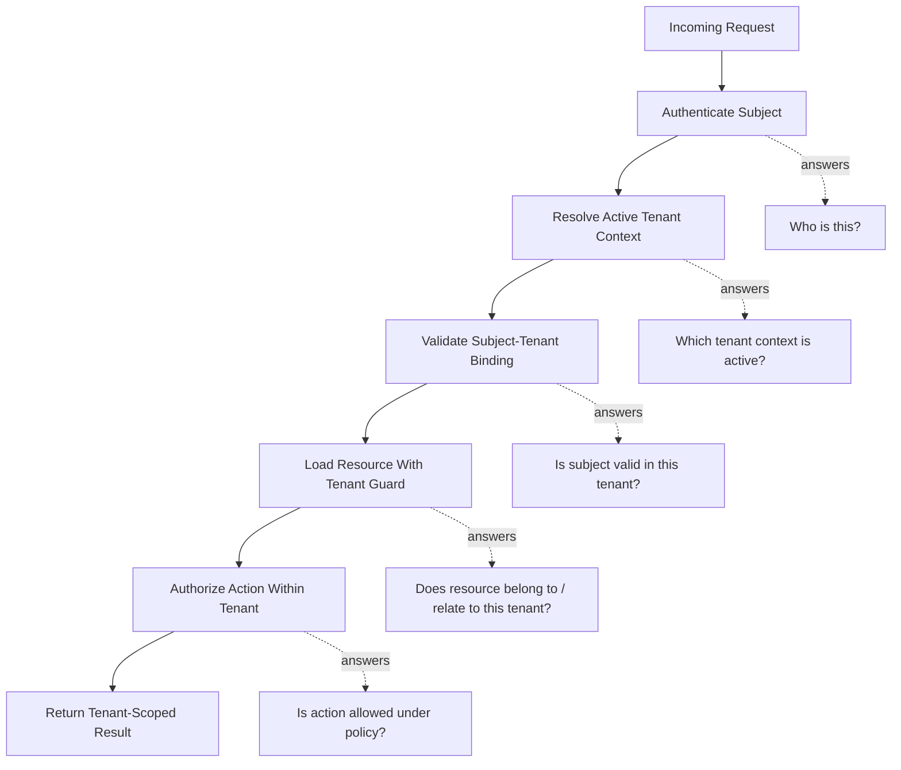
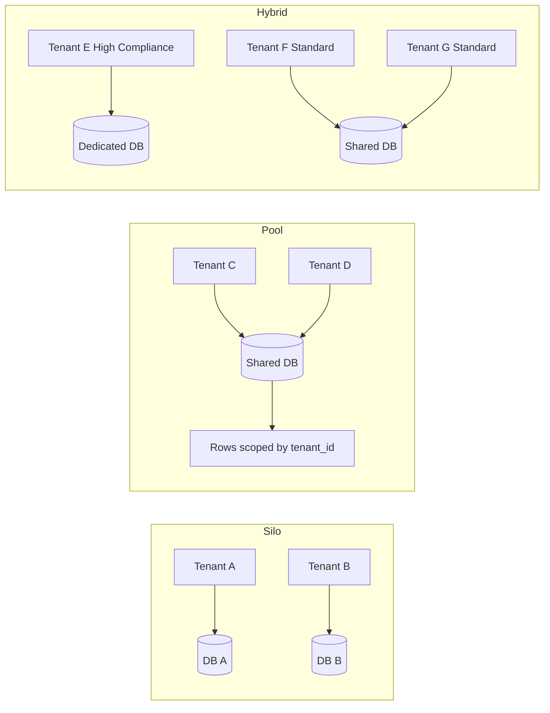
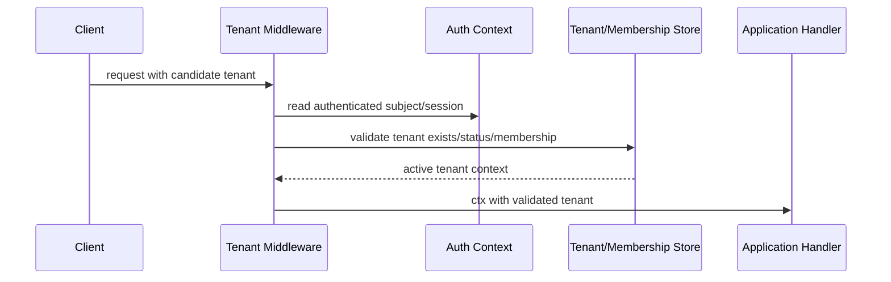
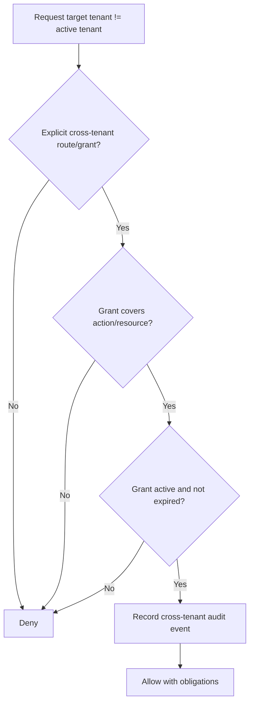
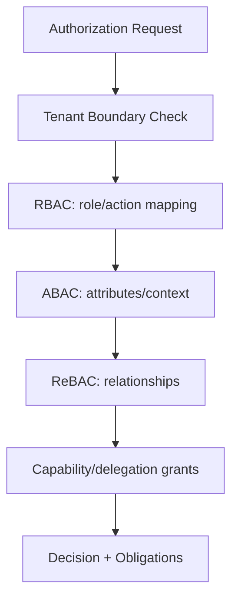
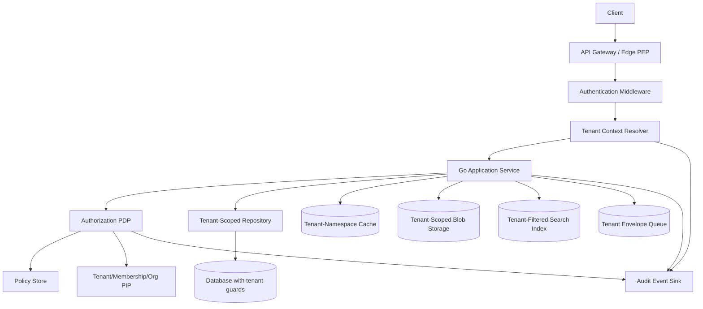

# learn-go-authentication-authorization-identity-permission-part-026.md

# Part 026 — Multi-Tenant Authorization: Tenant Boundary, Org Tree, Cross-Tenant Risk

> Seri: `learn-go-authentication-authorization-identity-permission`  
> Bagian: `026 / 035`  
> Target pembaca: engineer senior/principal yang membangun sistem Go multi-tenant, enterprise SaaS, platform regulatory/case-management, B2B portal, agency/dealer/sub-agency hierarchy, atau internal platform dengan shared infrastructure.  
> Baseline Go: Go 1.26.x. Materi ini tidak bergantung pada fitur eksperimental; desainnya memakai prinsip kompatibilitas Go 1, `context.Context`, `net/http`, gRPC interceptor, typed domain model, dan composable package boundary.

---

## Daftar Isi

1. Tujuan Bagian Ini
2. Mengapa Multi-Tenant Authorization Berbeda dari Authorization Biasa
3. Mental Model: Tenant Boundary Bukan Sekadar Role
4. Terminologi Presisi
5. Invariant Desain Multi-Tenant Authorization
6. Tenant Isolation vs Authentication vs Authorization
7. Model Tenancy: Silo, Pool, Bridge, dan Hybrid
8. Tenant Context Resolution
9. Tenant-Bound Principal, Session, dan Token
10. Org Tree dan Hierarki Tenant
11. Cross-Tenant Access: Legitimate Use Case vs Privilege Escalation
12. Data Boundary: Query Guard, Repository Guard, dan Database Guard
13. Object-Level Authorization dan BOLA/IDOR
14. Field-Level, Document-Level, Export-Level, dan Report-Level Authorization
15. Cache, Session, Queue, Blob, dan Search Index Isolation
16. Policy Model: RBAC, ABAC, ReBAC untuk Multi-Tenant
17. Go Domain Model
18. Go Middleware/Interceptor Design
19. Repository dan Query Enforcement Pattern
20. Database Strategy: Shared Schema, Shared DB, Dedicated Schema, Dedicated DB
21. Tenant-Aware Resource ID dan Identifier Strategy
22. Tenant Context Propagation Antar Service
23. Tenant-Aware Auditability
24. Tenant Onboarding, Offboarding, Suspension, dan Migration
25. Admin, Support, Impersonation, dan Break-Glass pada Multi-Tenant
26. Threat Model dan Failure Modes
27. Testing Strategy
28. Observability dan Detection
29. Performance dan Caching Trade-Off
30. Reference Architecture
31. Production Checklist
32. Anti-Pattern yang Harus Dihindari
33. Case Study: Regulatory Case Management Multi-Agency
34. Review Questions
35. Referensi

---

## 1. Tujuan Bagian Ini

Setelah bagian RBAC, permission modelling, ABAC, ReBAC, policy-as-code, dan capability-based access, kita sekarang masuk ke domain yang sering menjadi pembeda antara sistem auth yang terlihat rapi di demo dan sistem auth yang aman di produksi: **multi-tenant authorization**.

Tujuan utama bagian ini:

1. Membuat mental model bahwa **tenant boundary adalah security boundary**, bukan sekadar kolom `tenant_id`.
2. Membedakan **authentication**, **authorization**, dan **tenant isolation**.
3. Mendesain tenant context yang tidak mudah dipalsukan oleh client.
4. Mendesain permission agar selalu mempertimbangkan tenant, org, resource, workflow stage, dan delegated authority.
5. Mencegah cross-tenant data leakage melalui API, query, export, report, cache, queue, search index, blob storage, dan background worker.
6. Membangun Go package boundary yang membuat developer sulit lupa melakukan tenant scoping.
7. Menyediakan failure-mode matrix untuk review arsitektur production.

Bagian ini tidak mengulang:

- detail crypto primitive,
- detail OAuth/OIDC flow,
- detail `net/http` dan gRPC transport,
- detail SQL tuning,
- detail observability generic.

Namun bagian ini memakai semua konsep tersebut sebagai building block.

---

## 2. Mengapa Multi-Tenant Authorization Berbeda dari Authorization Biasa

Authorization biasa biasanya bertanya:

> Apakah subject ini boleh melakukan action ini terhadap resource ini?

Multi-tenant authorization bertanya lebih panjang:

> Dalam tenant context mana subject ini aktif, apakah subject memang terikat pada tenant tersebut, apakah resource memang milik tenant tersebut atau shareable ke tenant tersebut, apakah action ini diizinkan oleh role/policy dalam tenant itu, apakah tenant sedang aktif, apakah cross-tenant path ini legitimate, apakah hasil query/export/cache/search tidak membawa data tenant lain?

Perbedaan besarnya ada pada **boundary**.

Dalam single-tenant app, bug authorization biasanya berdampak pada satu organisasi/satu deployment. Dalam multi-tenant app, bug kecil dapat berubah menjadi data breach lintas customer, agency, dealer, branch, department, atau organization.

Contoh bug yang terlihat kecil:

```sql
SELECT * FROM cases WHERE case_id = :case_id;
```

Padahal dalam sistem multi-tenant, query minimal harus terikat tenant:

```sql
SELECT *
FROM cases
WHERE tenant_id = :tenant_id
  AND case_id = :case_id;
```

Namun bahkan ini belum cukup. Pertanyaan lanjutannya:

- Dari mana `tenant_id` berasal?
- Apakah `tenant_id` berasal dari authenticated session atau dari header client?
- Apakah user memang member tenant tersebut?
- Apakah resource itu boleh diakses oleh active org unit user?
- Apakah action-nya `read`, `update`, `approve`, `export`, atau `assign`?
- Apakah resource sedang dalam workflow stage yang mengizinkan action tersebut?
- Apakah user sedang impersonating?
- Apakah hasil query akan masuk cache global?
- Apakah background job akan memproses resource tenant lain karena message tidak punya tenant context?

Top engineer tidak melihat multi-tenancy sebagai “tambahkan `tenant_id` ke semua table”. Mereka melihatnya sebagai **sistem enforcement lintas layer**.

---

## 3. Mental Model: Tenant Boundary Bukan Sekadar Role

Ada tiga konsep yang sering tercampur:

```text
Authentication  -> siapa subject ini?
Authorization   -> boleh melakukan action apa?
Isolation       -> resource mana yang berada dalam boundary tenant ini?
```

Seseorang bisa:

- sudah authenticated,
- punya role valid,
- tetapi tetap tidak boleh mengakses resource tenant lain.

Contoh:

```text
User: alice@example.com
Role: Case Officer
Tenant aktif: Agency A
Resource: Case milik Agency B
Action: view
```

`Alice` mungkin memang `Case Officer`, tetapi role itu berlaku di boundary `Agency A`, bukan otomatis di `Agency B`.

AWS SaaS guidance menekankan bahwa tenant isolation berbeda dari general authentication/authorization. User bisa authenticated dan punya role, tetapi itu tidak otomatis berarti sistem telah mencapai tenant isolation. Tenant isolation harus membatasi resource berdasarkan tenant context, terutama pada shared resource model.

### Diagram Mental Model



---

## 4. Terminologi Presisi

### Tenant

A tenant is a logical customer/security boundary. Dalam B2B SaaS, tenant bisa berupa:

- customer company,
- government agency,
- department,
- dealer,
- partner organization,
- regulatory authority,
- internal business unit,
- project/account boundary.

Tenant bukan selalu sama dengan physical infrastructure. Tenant bisa satu database sendiri, satu schema sendiri, atau hanya baris data dalam tabel shared.

### Active tenant

Tenant context yang sedang dipakai untuk request saat ini.

User bisa member banyak tenant:

```text
User Bob:
- Tenant A: Admin
- Tenant B: Viewer
- Tenant C: External Reviewer
```

Dalam satu request, harus ada satu active tenant context yang jelas, kecuali operasi memang explicit cross-tenant dan punya policy khusus.

### Tenant membership

Relasi antara subject/account dan tenant.

Membership biasanya punya:

- status: active, invited, suspended, revoked,
- roles,
- org unit,
- effective date,
- expiry date,
- source: local, SCIM, IdP group, manual admin,
- assurance requirement.

### Organization unit / org node

Substruktur di dalam tenant. Misalnya:

```text
Agency A
├── Enforcement Division
│   ├── Investigation Team
│   └── Prosecution Team
└── Licensing Division
    ├── Application Team
    └── Renewal Team
```

Tenant boundary menjawab “tenant mana”. Org boundary menjawab “bagian mana di dalam tenant”.

### Cross-tenant access

Akses dari satu subject/session ke resource tenant lain. Tidak selalu salah. Contoh legitimate:

- platform support engineer,
- regulator yang mengawasi banyak agency,
- marketplace admin,
- parent organization mengakses child organization,
- shared case antar agency,
- delegated access,
- break-glass incident response.

Namun semua cross-tenant access harus explicit, logged, scoped, time-bound, dan justifiable.

### Tenant-bound resource

Resource yang harus selalu punya owner tenant.

Contoh:

- case,
- application,
- appeal,
- document,
- payment,
- audit event,
- notification,
- report row,
- search document,
- file/blob,
- background job,
- cache entry.

### Global resource

Resource yang tidak dimiliki tenant tertentu, misalnya:

- platform configuration,
- country code,
- static reference data,
- public schema metadata,
- system-wide feature flag.

Namun hati-hati: banyak resource yang terlihat global ternyata punya tenant-specific override.

---

## 5. Invariant Desain Multi-Tenant Authorization

Invariant adalah aturan yang harus tetap benar meskipun implementasi berubah.

### Invariant 1 — Tenant context tidak boleh dipercaya dari client tanpa binding

Header seperti ini berbahaya bila diterima mentah-mentah:

```http
X-Tenant-ID: agency-b
```

Header tenant boleh dipakai sebagai **requested tenant**, tetapi active tenant harus hasil validasi:

```text
requested_tenant + authenticated_subject + membership + tenant_status + session_policy
=> active_tenant
```

### Invariant 2 — Semua tenant-bound resource harus diakses melalui tenant guard

Tidak boleh ada repository method seperti:

```go
FindCaseByID(ctx, caseID)
```

Untuk tenant-bound resource, bentuk aman:

```go
FindCaseByTenantAndID(ctx, tenantID, caseID)
```

Atau lebih kuat:

```go
FindCase(ctx, TenantScopedCaseID)
```

### Invariant 3 — Authorization decision harus menyertakan tenant context

Request authorization minimal:

```text
subject + activeTenant + action + resource + environment
```

Tanpa tenant, PDP bisa memberi keputusan yang terlihat benar secara role tetapi salah secara boundary.

### Invariant 4 — Tenant isolation tidak boleh bergantung pada developer mengingat `WHERE tenant_id = ?`

Developer akan lupa. Shared guard harus dibuat sebagai:

- typed repository API,
- query builder yang wajib tenant,
- middleware/interceptor,
- database row-level security bila sesuai,
- policy engine,
- service contract,
- automated tests/static checks.

### Invariant 5 — Cross-tenant access harus explicit, not accidental

Cross-tenant path harus punya:

- action khusus,
- reason code,
- actor chain,
- time window,
- scope,
- approval bila perlu,
- audit event,
- result minimization.

### Invariant 6 — Read path dan list/search/export path sama-sama perlu guard

Banyak sistem hanya menjaga detail endpoint:

```http
GET /cases/{caseID}
```

Tetapi lupa menjaga:

```http
GET /cases?status=open
GET /reports/cases.csv
POST /search
POST /bulk-export
```

Cross-tenant leak sering muncul di list, search, report, export, notification, dan background job.

### Invariant 7 — Cache key harus tenant-aware

Buruk:

```text
case:123
permissions:user:789
search:open-cases
```

Lebih aman:

```text
tenant:{tenantID}:case:{caseID}
tenant:{tenantID}:permissions:user:{userID}:policy:{version}
tenant:{tenantID}:search:{hash(query)}
```

### Invariant 8 — Audit event harus bisa merekonstruksi tenant decision

Audit log harus menjawab:

```text
who acted?
as whom?
under which tenant?
against which resource tenant?
using which policy version?
why allowed/denied?
was this cross-tenant?
```

---

## 6. Tenant Isolation vs Authentication vs Authorization

### Authentication

Authentication mengikat request ke subject.

```text
Token/session valid -> subject = user:123
```

### Authorization

Authorization memutuskan action.

```text
user:123 can approve case:456?
```

### Tenant isolation

Tenant isolation memastikan resource tenant lain tidak ikut terbuka.

```text
case:456 belongs to tenant:A
active tenant = tenant:B
=> deny before checking normal role, unless explicit cross-tenant grant exists
```

### Contoh bug konseptual

```go
func (s *CaseService) GetCase(ctx context.Context, caseID string) (*Case, error) {
    principal := auth.MustPrincipal(ctx)

    if !principal.HasRole("case_officer") {
        return nil, ErrForbidden
    }

    return s.repo.FindByID(ctx, caseID)
}
```

Kode ini melakukan authorization dangkal, tetapi gagal tenant isolation.

Versi lebih benar:

```go
func (s *CaseService) GetCase(ctx context.Context, caseID string) (*Case, error) {
    principal := auth.MustPrincipal(ctx)
    tenant := tenantctx.MustTenant(ctx)

    c, err := s.repo.FindByTenantAndID(ctx, tenant.ID, caseID)
    if err != nil {
        return nil, err
    }

    decision, err := s.pdp.Decide(ctx, authz.Request{
        Subject: principal.Subject,
        Tenant:  tenant.ID,
        Action:  authz.Action("case.view"),
        Resource: authz.ResourceRef{
            Type:     "case",
            ID:       c.ID,
            TenantID: c.TenantID,
            Attributes: map[string]any{
                "status":     c.Status,
                "org_unit_id": c.OrgUnitID,
            },
        },
    })
    if err != nil {
        return nil, err
    }
    if !decision.Allow {
        return nil, ErrForbidden
    }

    return c, nil
}
```

---

## 7. Model Tenancy: Silo, Pool, Bridge, dan Hybrid

### 7.1 Silo model

Setiap tenant punya resource dedicated:

```text
Tenant A -> DB A, cache A, bucket A
Tenant B -> DB B, cache B, bucket B
```

Kelebihan:

- isolation kuat,
- blast radius kecil,
- compliance lebih mudah,
- migration/offboarding lebih jelas.

Kekurangan:

- biaya tinggi,
- operasional lebih kompleks,
- query/report lintas tenant lebih sulit,
- deployment/config drift.

### 7.2 Pool model

Tenant berbagi resource fisik:

```text
Shared DB/table/cache/bucket
Rows/objects dibedakan dengan tenant_id
```

Kelebihan:

- cost-efficient,
- operationally simpler,
- scaling shared,
- easier global analytics.

Kekurangan:

- query guard wajib benar,
- cache/search/report risk lebih tinggi,
- noisy neighbor,
- compliance bisa lebih sulit.

### 7.3 Bridge model

Beberapa tenant dedicated, beberapa pooled.

Contoh:

```text
Enterprise/high-compliance tenants -> dedicated DB
Small tenants -> shared DB
```

### 7.4 Hybrid by resource class

Tenant sama bisa punya isolation berbeda per resource:

```text
Auth profile: shared
Case data: tenant-specific schema
Audit data: append-only shared partitioned table
Files: tenant-specific prefix/bucket
Search index: shared index with tenant filter atau dedicated index for sensitive tenants
```

### Diagram Tenancy Models



### Engineering conclusion

Tidak ada model terbaik universal. Pertanyaan utama:

1. Apa data paling sensitif?
2. Apa regulatory requirement?
3. Apa blast radius yang diterima?
4. Apa cost envelope?
5. Apa operational maturity?
6. Apakah tenant perlu custom policy?
7. Apakah tenant bisa pindah isolation tier?
8. Apakah global admin/reporting diperlukan?

---

## 8. Tenant Context Resolution

Tenant context resolution adalah proses mengubah input request menjadi active tenant yang dipercaya.

### Sumber tenant context

Tenant context bisa berasal dari:

1. subdomain,
2. path parameter,
3. request header,
4. session selection,
5. token claim,
6. mTLS/SPIFFE identity,
7. API key binding,
8. route config,
9. job metadata,
10. message queue metadata.

Contoh:

```text
https://agency-a.example.com/cases
/cpds/agency-a/cases
X-Tenant-ID: agency-a
token claim: tenant_id=agency-a
session.active_tenant_id=agency-a
```

Semua sumber ini adalah **candidate tenant**, bukan final tenant.

### Resolution pipeline



### Go model

```go
package tenantctx

import (
    "context"
    "errors"
    "time"
)

type TenantID string

type Source string

const (
    SourceSubdomain Source = "subdomain"
    SourcePath      Source = "path"
    SourceHeader    Source = "header"
    SourceSession   Source = "session"
    SourceToken     Source = "token"
    SourceJob       Source = "job"
)

type Status string

const (
    TenantActive    Status = "active"
    TenantSuspended Status = "suspended"
    TenantDeleted   Status = "deleted"
)

type Context struct {
    TenantID       TenantID
    Slug           string
    Status         Status
    Source         Source
    ResolvedAt     time.Time
    MembershipID   string
    OrgUnitID      string
    IsolationTier  string
    CrossTenant    bool
    ResolutionRisk string
}

type contextKey struct{}

func WithTenant(ctx context.Context, t Context) context.Context {
    return context.WithValue(ctx, contextKey{}, t)
}

func Tenant(ctx context.Context) (Context, bool) {
    v, ok := ctx.Value(contextKey{}).(Context)
    return v, ok
}

var ErrNoTenant = errors.New("tenant context missing")

func MustTenant(ctx context.Context) Context {
    t, ok := Tenant(ctx)
    if !ok {
        panic(ErrNoTenant)
    }
    return t
}
```

### Candidate tenant extractor

```go
type Candidate struct {
    TenantHint string
    Source     tenantctx.Source
}

type CandidateExtractor interface {
    Extract(r *http.Request) (Candidate, bool)
}
```

### Resolver contract

```go
type Resolver interface {
    Resolve(ctx context.Context, in ResolveInput) (tenantctx.Context, error)
}

type ResolveInput struct {
    SubjectID     string
    SessionID     string
    Candidate     Candidate
    Required      bool
    RequestPath   string
    RequestMethod string
}
```

### Resolver invariant

`Resolve` tidak boleh hanya melakukan lookup tenant. Ia harus memvalidasi:

- tenant exists,
- tenant active,
- subject/session/API key/workload identity allowed in tenant,
- selected tenant matches allowed tenants,
- membership active,
- org binding valid,
- route allows tenant selection source,
- if cross-tenant, cross-tenant authority exists.

---

## 9. Tenant-Bound Principal, Session, dan Token

### Problem

Principal yang hanya membawa user ID tidak cukup.

```go
type Principal struct {
    SubjectID string
    Roles     []string
}
```

Dalam multi-tenant system, role harus scoped.

```go
type RoleAssignment struct {
    TenantID string
    Role     string
}
```

Bahkan lebih benar:

```go
type Principal struct {
    SubjectID       string
    AccountID       string
    ActiveTenantID  string
    MembershipID    string
    ActiveOrgUnitID string
    ActorChain      []Actor
    Assurance       Assurance
}
```

### Tenant-bound session

Ada dua model:

#### Model A — One session, selected tenant mutable

User login sekali, lalu memilih tenant aktif.

Kelebihan:

- UX mudah,
- cocok untuk dashboard multi-org.

Risiko:

- session fixation tenant,
- tab confusion,
- cache confusion,
- CSRF tenant switch,
- audit ambiguity.

#### Model B — Separate session per active tenant

Setiap tenant context punya session sendiri.

Kelebihan:

- audit lebih jelas,
- cache lebih aman,
- step-up tenant-specific.

Kekurangan:

- UX lebih berat,
- logout lebih kompleks.

### Tenant-bound token

Token bisa mengandung:

```json
{
  "sub": "user-123",
  "iss": "https://idp.example.com",
  "aud": "case-api",
  "tenant_id": "agency-a",
  "membership_id": "mem-456",
  "org_unit_id": "ou-789",
  "scope": "case:read case:update"
}
```

Namun token claim tenant tidak boleh diperlakukan sebagai kebenaran mutlak bila:

- token long-lived,
- tenant membership dapat berubah cepat,
- tenant bisa suspended,
- permission bisa dicabut,
- account linking berubah,
- user switched active tenant.

Untuk high-risk system, gunakan token claim sebagai **bounded assertion**, lalu validasi freshness sesuai risk.

### Token freshness trade-off

| Token TTL | Pros | Cons |
|---|---|---|
| Very short | Revocation cepat, stale tenant lebih kecil | Lebih banyak refresh, latency auth lebih tinggi |
| Medium | UX dan performa seimbang | Ada stale window |
| Long | Offline/mobile mudah | Tenant revocation lambat, cross-tenant risk tinggi |

### Rule of thumb

- Access token tenant-bound: short-lived.
- Refresh token: bound ke account/session/device, bukan bebas dipakai semua tenant tanpa revalidation.
- Tenant switch: rotate session/token or create new active-tenant session.
- Permission revocation: publish invalidation event.

---

## 10. Org Tree dan Hierarki Tenant

Tenant sering tidak flat. Ada org tree.

Contoh:

```text
Tenant: Ministry X
├── Agency A
│   ├── Division A1
│   └── Division A2
└── Agency B
    ├── Division B1
    └── Division B2
```

Pertanyaan authorization:

- Apakah parent boleh melihat child?
- Apakah child boleh melihat parent?
- Apakah sibling boleh saling melihat?
- Apakah user di Division A1 boleh melihat case Division A2?
- Apakah tenant admin melihat semua org node?
- Apakah agency supervisor melihat semua division?
- Apakah case bisa shared ke org node lain?

### Org tree bukan selalu tree murni

Dalam enterprise/regulatory system, bisa ada graph:

```text
Case C1 belongs to Agency A
Case C1 assigned to Investigation Team
Case C1 reviewed by Legal Division
Case C1 escalated to Committee X
Case C1 visible to Audit Unit
```

Ini bukan hierarchy sederhana. ReBAC atau ABAC sering lebih cocok.

### Closure table pattern

Untuk org hierarchy, closure table membantu query ancestor/descendant.

```sql
CREATE TABLE org_unit_closure (
    tenant_id        TEXT NOT NULL,
    ancestor_id      TEXT NOT NULL,
    descendant_id    TEXT NOT NULL,
    depth            INT  NOT NULL,
    PRIMARY KEY (tenant_id, ancestor_id, descendant_id)
);
```

Untuk cek apakah user org punya akses descendant:

```sql
SELECT 1
FROM org_unit_closure c
WHERE c.tenant_id = :tenant_id
  AND c.ancestor_id = :user_org_unit_id
  AND c.descendant_id = :resource_org_unit_id;
```

### Go representation

```go
type OrgUnitID string

type OrgScope struct {
    TenantID        tenantctx.TenantID
    ActiveOrgUnitID OrgUnitID
    AllowedOrgUnits []OrgUnitID
    IncludeChildren bool
}

func (s OrgScope) Contains(unit OrgUnitID) bool {
    for _, allowed := range s.AllowedOrgUnits {
        if allowed == unit {
            return true
        }
    }
    return false
}
```

### Important invariant

Do not infer org hierarchy access from role name.

Buruk:

```go
if principal.HasRole("agency_admin") {
    return allow
}
```

Lebih baik:

```go
allow if principal has action case.view
and resource.tenant_id == active_tenant
and resource.org_unit_id in principal.allowed_org_units
```

---

## 11. Cross-Tenant Access: Legitimate Use Case vs Privilege Escalation

Cross-tenant access bukan otomatis salah. Yang salah adalah cross-tenant access yang accidental, unlogged, unbounded, atau implicit.

### Legitimate cross-tenant patterns

1. Platform support membaca metadata tenant untuk troubleshoot.
2. Regulator melihat laporan lintas agency.
3. Parent organization melihat child organization.
4. Shared case antar agency.
5. External reviewer mendapat delegated access ke case tertentu.
6. Break-glass access saat incident.
7. Background reconciliation job memproses beberapa tenant.

### Cross-tenant access harus punya contract

```go
type CrossTenantAccess struct {
    ActorID        string
    SourceTenantID tenantctx.TenantID
    TargetTenantID tenantctx.TenantID
    Action         string
    ResourceType   string
    ResourceID     string
    ReasonCode     string
    Justification  string
    ApprovedBy     string
    ExpiresAt      time.Time
    TicketID       string
}
```

### Cross-tenant decision model



### Obligations

A PDP should be able to return obligations:

```json
{
  "allow": true,
  "obligations": [
    "record_cross_tenant_reason",
    "mask_sensitive_fields",
    "watermark_export",
    "notify_tenant_admin"
  ]
}
```

Cross-tenant allow is often not just allow. It may require field masking, export restriction, approval, notification, or stronger audit.

---

## 12. Data Boundary: Query Guard, Repository Guard, dan Database Guard

Tenant isolation pada data path bisa dilakukan di beberapa layer.

### Layer 1 — Application service guard

```go
if resource.TenantID != activeTenant.ID {
    return ErrForbidden
}
```

Ini mudah dipahami tetapi gampang lupa.

### Layer 2 — Repository method wajib tenant

```go
type CaseRepository interface {
    FindByTenantAndID(ctx context.Context, tenantID tenantctx.TenantID, caseID string) (*Case, error)
    ListByTenant(ctx context.Context, tenantID tenantctx.TenantID, filter CaseFilter) ([]Case, error)
}
```

Lebih baik, tetapi developer masih bisa membuat repository bypass.

### Layer 3 — Typed tenant scope

```go
type TenantScope struct {
    TenantID tenantctx.TenantID
}

func NewTenantScope(ctx context.Context) (TenantScope, error) {
    t, ok := tenantctx.Tenant(ctx)
    if !ok {
        return TenantScope{}, tenantctx.ErrNoTenant
    }
    if t.CrossTenant {
        return TenantScope{}, errors.New("cross-tenant scope requires explicit API")
    }
    return TenantScope{TenantID: t.TenantID}, nil
}

type CaseRepository interface {
    Find(ctx context.Context, scope TenantScope, id string) (*Case, error)
}
```

### Layer 4 — Query builder with mandatory tenant

```go
type TenantQuery struct {
    tenantID tenantctx.TenantID
    sb       strings.Builder
    args     []any
}

func NewTenantQuery(tenantID tenantctx.TenantID, base string) *TenantQuery {
    q := &TenantQuery{tenantID: tenantID}
    q.sb.WriteString(base)
    q.sb.WriteString(" WHERE tenant_id = ?")
    q.args = append(q.args, tenantID)
    return q
}
```

### Layer 5 — Database row-level security

Some databases support row-level policy. Bila dipakai, tetap jangan jadikan RLS satu-satunya kontrol. Aplikasi masih harus enforce authorization agar error semantics, audit, dan business policy jelas.

### Recommended approach

Gunakan defense in depth:

```text
Middleware resolves tenant
↓
Service requires TenantScope
↓
Repository requires TenantScope
↓
Query includes tenant predicate
↓
Database policy/constraint reinforces tenant boundary
↓
Audit logs tenant decision
```

---

## 13. Object-Level Authorization dan BOLA/IDOR

OWASP API Security Top 10 2023 menempatkan Broken Object Level Authorization sebagai API1. Serangan tipikal: attacker memanipulasi object ID dalam path/query/header/body agar mendapat object milik user/tenant lain.

Contoh vulnerable endpoint:

```http
GET /api/cases/CASE-2026-000123
Authorization: Bearer token-for-tenant-a
```

Jika `CASE-2026-000123` milik tenant B dan server hanya cek token valid, terjadi cross-tenant BOLA.

### Bad implementation

```go
func (h *CaseHandler) Get(w http.ResponseWriter, r *http.Request) {
    caseID := chi.URLParam(r, "caseID")

    c, err := h.repo.FindByID(r.Context(), caseID)
    if err != nil {
        http.Error(w, "not found", http.StatusNotFound)
        return
    }

    json.NewEncoder(w).Encode(c)
}
```

### Better implementation

```go
func (h *CaseHandler) Get(w http.ResponseWriter, r *http.Request) {
    ctx := r.Context()
    tenant := tenantctx.MustTenant(ctx)
    principal := auth.MustPrincipal(ctx)
    caseID := chi.URLParam(r, "caseID")

    c, err := h.repo.FindByTenantAndID(ctx, tenant.TenantID, caseID)
    if errors.Is(err, sql.ErrNoRows) {
        // Prefer not to reveal whether object exists in another tenant.
        http.Error(w, "not found", http.StatusNotFound)
        return
    }
    if err != nil {
        http.Error(w, "internal error", http.StatusInternalServerError)
        return
    }

    decision, err := h.pdp.Decide(ctx, authz.Request{
        Subject: principal.Subject,
        Tenant:  tenant.TenantID,
        Action:  "case.view",
        Resource: authz.ResourceRef{
            Type:     "case",
            ID:       c.ID,
            TenantID: c.TenantID,
            Attributes: map[string]any{
                "org_unit_id": c.OrgUnitID,
                "stage":       c.Stage,
            },
        },
    })
    if err != nil {
        http.Error(w, "authorization unavailable", http.StatusServiceUnavailable)
        return
    }
    if !decision.Allow {
        http.Error(w, "forbidden", http.StatusForbidden)
        return
    }

    json.NewEncoder(w).Encode(c)
}
```

### Important subtlety: 404 vs 403

For cross-tenant object access, returning `404 Not Found` is often safer than `403 Forbidden`, because `403` may reveal that object exists but belongs to another tenant. Namun untuk internal apps/regulatory audit, denied decisions may need to be logged internally as `DENY_CROSS_TENANT_OBJECT` while externally returning `404`.

---

## 14. Field-Level, Document-Level, Export-Level, dan Report-Level Authorization

Multi-tenant leakage tidak hanya terjadi pada object detail.

### Field-level leakage

User boleh melihat case, tapi tidak boleh melihat:

- personal identifiers,
- financial data,
- enforcement notes,
- internal legal opinion,
- officer remarks,
- confidential attachments.

```go
type CaseDTO struct {
    ID            string `json:"id"`
    Status        string `json:"status"`
    ApplicantName string `json:"applicant_name,omitempty"`
    NRIC          string `json:"nric,omitempty"`
    InternalNote  string `json:"internal_note,omitempty"`
}
```

Jangan hanya rely pada frontend hiding. Backend harus shape response berdasarkan decision.

```go
func ProjectCaseForSubject(c Case, decision authz.Decision) CaseDTO {
    dto := CaseDTO{
        ID:     c.ID,
        Status: c.Status,
    }
    if decision.HasField("applicant_name") {
        dto.ApplicantName = c.ApplicantName
    }
    if decision.HasField("nric") {
        dto.NRIC = c.NRIC
    }
    if decision.HasField("internal_note") {
        dto.InternalNote = c.InternalNote
    }
    return dto
}
```

### Export-level leakage

Export is dangerous because:

- it bypasses UI pagination,
- includes hidden columns,
- may run asynchronously,
- may be cached or stored as file,
- may be emailed,
- may combine multiple tables,
- may be generated by background worker that lacks principal context.

Export job must include:

```go
type ExportJob struct {
    JobID           string
    TenantID        tenantctx.TenantID
    RequestedBy     string
    ActorChain      []string
    FilterSnapshot  map[string]any
    PolicyVersion   string
    FieldPolicy     []string
    CreatedAt       time.Time
    ExpiresAt       time.Time
}
```

### Report-level leakage

Reports often aggregate data. Even aggregate counts can leak.

Example:

```text
Tenant A should not know Tenant B has exactly 2 pending enforcement cases.
```

For cross-tenant reports, apply:

- policy-gated report templates,
- row-level tenant filtering,
- field masking,
- minimum aggregation threshold,
- watermarking,
- audit trail,
- export expiry,
- explicit reason code.

### Search leakage

Search index must include tenant filter at query time and ideally at index design.

Bad:

```json
{
  "query": "open enforcement case"
}
```

Better:

```json
{
  "tenant_id": "agency-a",
  "query": "open enforcement case",
  "allowed_org_units": ["ou-1", "ou-2"],
  "field_policy": ["case_id", "status", "applicant_name"]
}
```

---

## 15. Cache, Session, Queue, Blob, dan Search Index Isolation

### Cache key isolation

Bad:

```go
key := "case:" + caseID
```

Good:

```go
key := fmt.Sprintf("tenant:%s:case:%s", tenantID, caseID)
```

Better for permission decisions:

```go
key := fmt.Sprintf(
    "tenant:%s:subject:%s:action:%s:resource:%s:policy:%s",
    tenantID, subjectID, action, resourceID, policyVersion,
)
```

### Session isolation

Session data must not store ambiguous role list:

```json
{
  "user_id": "u1",
  "roles": ["admin"]
}
```

Better:

```json
{
  "user_id": "u1",
  "active_tenant_id": "t1",
  "membership_id": "m1",
  "roles": ["tenant_admin"],
  "org_unit_id": "ou1",
  "policy_version": "2026-06-24T01"
}
```

### Queue isolation

Every message must include tenant context.

```go
type MessageEnvelope[T any] struct {
    MessageID    string
    TenantID     tenantctx.TenantID
    SubjectID    string
    ActorChain   []string
    TraceID      string
    PolicyVersion string
    Payload      T
}
```

Worker must refuse messages without tenant context unless the job is explicitly platform-level.

### Blob/file isolation

Blob object key must include tenant namespace:

```text
tenants/{tenant_id}/cases/{case_id}/documents/{document_id}
```

Metadata must include tenant ID too. Prefix alone is not sufficient if metadata/search later loses prefix.

### Search index isolation

Options:

1. dedicated index per tenant,
2. shared index with mandatory tenant filter,
3. hybrid per sensitivity tier.

Dedicated index gives stronger isolation but higher operational overhead. Shared index needs strict query policy and testing.

---

## 16. Policy Model: RBAC, ABAC, ReBAC untuk Multi-Tenant

### RBAC in multi-tenant system

RBAC role assignment must include tenant.

```text
subject:user-1 has role:case_officer in tenant:agency-a
subject:user-1 has role:viewer in tenant:agency-b
```

### ABAC in multi-tenant system

ABAC evaluates attributes:

```text
subject.tenant_membership.status == active
resource.tenant_id == active_tenant.id
action == case.approve
resource.stage == pending_approval
subject.org_unit in resource.allowed_org_units
environment.assurance >= required
```

### ReBAC in multi-tenant system

ReBAC models relationships:

```text
user:alice member_of tenant:agency-a
case:123 parent tenant:agency-a
case:123 assigned_to org_unit:investigation
user:alice member_of org_unit:investigation
```

### Recommended hybrid

For complex enterprise/regulatory systems:

- Use RBAC for coarse job functions.
- Use ABAC for dynamic context and tenant/org/resource attributes.
- Use ReBAC for ownership, sharing, delegation, parent-child hierarchy.
- Use capability tokens for time-bound delegated access/export/download.

### Policy layering



Tenant boundary should be evaluated early. If resource tenant is incompatible with active tenant and no explicit cross-tenant path exists, deny.

---

## 17. Go Domain Model

### Core types

```go
package multitenant

import "time"

type TenantID string
type SubjectID string
type AccountID string
type MembershipID string
type OrgUnitID string

type TenantStatus string

const (
    TenantStatusActive    TenantStatus = "active"
    TenantStatusSuspended TenantStatus = "suspended"
    TenantStatusDeleted   TenantStatus = "deleted"
)

type Tenant struct {
    ID            TenantID
    Slug          string
    DisplayName   string
    Status        TenantStatus
    IsolationTier string
    Region        string
    CreatedAt     time.Time
    UpdatedAt     time.Time
}

type MembershipStatus string

const (
    MembershipActive    MembershipStatus = "active"
    MembershipInvited   MembershipStatus = "invited"
    MembershipSuspended MembershipStatus = "suspended"
    MembershipRevoked   MembershipStatus = "revoked"
)

type Membership struct {
    ID          MembershipID
    TenantID    TenantID
    SubjectID   SubjectID
    AccountID   AccountID
    OrgUnitID   OrgUnitID
    Status      MembershipStatus
    Roles       []Role
    Source      string
    EffectiveAt time.Time
    ExpiresAt   *time.Time
}

type Role string
```

### Active tenant context

```go
type ActiveTenant struct {
    TenantID       TenantID
    MembershipID   MembershipID
    SubjectID      SubjectID
    AccountID      AccountID
    OrgUnitID      OrgUnitID
    Roles          []Role
    IsolationTier  string
    CrossTenant    bool
    ResolvedAt     time.Time
    PolicyVersion  string
}
```

### Tenant-scoped resource interface

```go
type TenantScopedResource interface {
    ResourceID() string
    ResourceType() string
    ResourceTenantID() TenantID
}
```

### Authorization request

```go
type AuthzRequest struct {
    SubjectID    SubjectID
    ActorChain   []SubjectID
    Tenant       ActiveTenant
    Action       string
    ResourceType string
    ResourceID   string
    ResourceTenantID TenantID
    ResourceAttributes map[string]any
    Environment map[string]any
}
```

### Decision

```go
type DecisionEffect string

const (
    Allow DecisionEffect = "allow"
    Deny  DecisionEffect = "deny"
)

type Decision struct {
    Effect      DecisionEffect
    Reason      string
    PolicyID    string
    PolicyVersion string
    Obligations []string
    FieldMask   []string
    CacheTTL    time.Duration
}
```

---

## 18. Go Middleware/Interceptor Design

### HTTP middleware chain

Recommended chain:

```text
Request ID
↓
Panic recovery
↓
Authentication
↓
Tenant candidate extraction
↓
Tenant resolution and membership validation
↓
Route handler
↓
Resource-level authorization inside service/handler
```

### Tenant middleware

```go
func TenantMiddleware(resolver Resolver, extractor CandidateExtractor) func(http.Handler) http.Handler {
    return func(next http.Handler) http.Handler {
        return http.HandlerFunc(func(w http.ResponseWriter, r *http.Request) {
            principal, ok := auth.Principal(r.Context())
            if !ok {
                http.Error(w, "unauthenticated", http.StatusUnauthorized)
                return
            }

            cand, ok := extractor.Extract(r)
            if !ok {
                http.Error(w, "tenant required", http.StatusBadRequest)
                return
            }

            active, err := resolver.Resolve(r.Context(), ResolveInput{
                SubjectID:     principal.SubjectID,
                SessionID:     principal.SessionID,
                Candidate:     cand,
                Required:      true,
                RequestPath:   r.URL.Path,
                RequestMethod: r.Method,
            })
            if err != nil {
                WriteTenantResolveError(w, err)
                return
            }

            ctx := WithActiveTenant(r.Context(), active)
            next.ServeHTTP(w, r.WithContext(ctx))
        })
    }
}
```

### gRPC interceptor

```go
func UnaryTenantInterceptor(resolver Resolver) grpc.UnaryServerInterceptor {
    return func(ctx context.Context, req any, info *grpc.UnaryServerInfo, handler grpc.UnaryHandler) (any, error) {
        principal, ok := auth.Principal(ctx)
        if !ok {
            return nil, status.Error(codes.Unauthenticated, "unauthenticated")
        }

        cand, ok := CandidateFromMetadata(ctx)
        if !ok {
            return nil, status.Error(codes.InvalidArgument, "tenant required")
        }

        active, err := resolver.Resolve(ctx, ResolveInput{
            SubjectID: principal.SubjectID,
            Candidate: cand,
            Required:  true,
        })
        if err != nil {
            return nil, MapTenantError(err)
        }

        ctx = WithActiveTenant(ctx, active)
        return handler(ctx, req)
    }
}
```

### Important rule

Middleware should resolve tenant context. Middleware should not perform every resource-level decision because resource attributes usually require loading resource. The right split:

```text
Middleware: subject + active tenant
Service: resource + action + policy decision
Repository: tenant-scoped data access
```

---

## 19. Repository dan Query Enforcement Pattern

### Avoid unscoped repository methods

For tenant-bound resources, ban:

```go
FindByID(ctx, id)
List(ctx, filter)
Count(ctx, filter)
Search(ctx, query)
Export(ctx, filter)
```

Prefer:

```go
FindByScopeAndID(ctx, scope, id)
ListByScope(ctx, scope, filter)
CountByScope(ctx, scope, filter)
SearchByScope(ctx, scope, query)
ExportByScope(ctx, scope, filter)
```

### TenantScope type

```go
type TenantScope struct {
    TenantID       TenantID
    AllowedOrgUnit []OrgUnitID
    CrossTenant    bool
}

func ScopeFromContext(ctx context.Context) (TenantScope, error) {
    t, ok := ActiveTenantFromContext(ctx)
    if !ok {
        return TenantScope{}, ErrTenantRequired
    }
    return TenantScope{
        TenantID:       t.TenantID,
        AllowedOrgUnit: []OrgUnitID{t.OrgUnitID},
        CrossTenant:    t.CrossTenant,
    }, nil
}
```

### SQL guard example

```go
func (r *CaseRepo) FindByScopeAndID(ctx context.Context, scope TenantScope, id string) (*Case, error) {
    const q = `
        SELECT id, tenant_id, org_unit_id, status, stage, title
        FROM cases
        WHERE tenant_id = $1
          AND id = $2
    `

    var c Case
    err := r.db.QueryRowContext(ctx, q, scope.TenantID, id).Scan(
        &c.ID, &c.TenantID, &c.OrgUnitID, &c.Status, &c.Stage, &c.Title,
    )
    if err != nil {
        return nil, err
    }
    return &c, nil
}
```

### List guard example

```go
func (r *CaseRepo) ListByScope(ctx context.Context, scope TenantScope, f CaseFilter) ([]Case, error) {
    args := []any{scope.TenantID}
    q := `
        SELECT id, tenant_id, org_unit_id, status, stage, title
        FROM cases
        WHERE tenant_id = $1
    `

    if f.Status != "" {
        args = append(args, f.Status)
        q += fmt.Sprintf(" AND status = $%d", len(args))
    }

    q += " ORDER BY created_at DESC LIMIT 100"

    rows, err := r.db.QueryContext(ctx, q, args...)
    if err != nil {
        return nil, err
    }
    defer rows.Close()

    // scan...
    return nil, nil
}
```

### Cross-tenant repository method must be separate

```go
func (r *CaseRepo) FindCrossTenantByID(ctx context.Context, scope CrossTenantScope, tenantID TenantID, id string) (*Case, error) {
    if !scope.AllowsTenant(tenantID) {
        return nil, ErrCrossTenantDenied
    }
    // explicit cross-tenant query
    return r.findByTenantAndID(ctx, tenantID, id)
}
```

Do not overload normal method with `CrossTenant bool` unless the type system forces explicit construction.

---

## 20. Database Strategy: Shared Schema, Shared DB, Dedicated Schema, Dedicated DB

### Shared table with tenant_id

```sql
CREATE TABLE cases (
    tenant_id      TEXT NOT NULL,
    id             TEXT NOT NULL,
    org_unit_id    TEXT NOT NULL,
    status         TEXT NOT NULL,
    stage          TEXT NOT NULL,
    title          TEXT NOT NULL,
    created_at     TIMESTAMPTZ NOT NULL,
    PRIMARY KEY (tenant_id, id)
);
```

Important: use composite primary key `(tenant_id, id)` or at least tenant-aware unique constraints.

Bad:

```sql
PRIMARY KEY (id)
```

If `id` is globally unique, still include tenant in indexes used by authorization query.

### Shared DB, separate schema

```text
schema_tenant_a.cases
schema_tenant_b.cases
```

Kelebihan:

- stronger logical separation,
- easier per-tenant backup/migration.

Kekurangan:

- schema drift,
- migration orchestration,
- connection/search path risk.

### Dedicated database

```text
tenant_a_db
tenant_b_db
```

Kelebihan:

- strongest blast radius control at DB layer,
- compliance-friendly.

Kekurangan:

- operational overhead,
- connection pool explosion,
- migrations and reporting complexity.

### Database guard pattern

Even with app-layer authorization, DB should support tenant guard:

- composite indexes,
- constraints,
- foreign keys including `tenant_id`,
- row-level security if available,
- separate DB user per isolation tier,
- read replicas scoped carefully.

### Foreign key with tenant

```sql
CREATE TABLE case_documents (
    tenant_id   TEXT NOT NULL,
    case_id     TEXT NOT NULL,
    document_id TEXT NOT NULL,
    PRIMARY KEY (tenant_id, document_id),
    FOREIGN KEY (tenant_id, case_id)
        REFERENCES cases(tenant_id, id)
);
```

This prevents document from accidentally referencing case in another tenant.

---

## 21. Tenant-Aware Resource ID dan Identifier Strategy

### Globally unique ID vs tenant-scoped ID

#### Globally unique

```text
case_01JZ...
```

Pros:

- easier distributed generation,
- lower collision risk,
- object references simpler.

Cons:

- may hide missing tenant checks during tests,
- leaked IDs can still be used for BOLA if guard missing.

#### Tenant-scoped ID

```text
CASE-2026-000123 within tenant A
```

Pros:

- user-friendly,
- natural per-tenant numbering.

Cons:

- must include tenant in primary key,
- accidental cross-tenant collision.

### Recommended strategy

Use both:

```text
internal_id: globally unique opaque ID
display_number: tenant-scoped human-readable number
primary lookup: tenant_id + internal_id or tenant_id + display_number
```

### Do not encode security into ID format

Opaque IDs reduce enumeration but do not replace authorization. UUID/ULID is not a tenant boundary.

---

## 22. Tenant Context Propagation Antar Service

### Problem

Service A validates tenant context, then calls Service B without tenant context. Service B may load resource incorrectly.

### Propagation envelope

```go
type RequestContextEnvelope struct {
    TraceID       string
    SubjectID     string
    ActorChain    []string
    TenantID      TenantID
    MembershipID  MembershipID
    OrgUnitID     OrgUnitID
    Assurance     string
    PolicyVersion string
}
```

### HTTP propagation

Use internal headers only between trusted services:

```http
X-Request-ID: ...
X-Subject-ID: ...
X-Tenant-ID: ...
X-Membership-ID: ...
X-Actor-Chain: ...
```

But internal headers must be:

- stripped at edge,
- signed or protected by service identity boundary,
- regenerated by gateway/PEP,
- not accepted from public client.

### gRPC propagation

Use metadata, but same rule applies. Metadata is not trustworthy unless connection/auth boundary is trustworthy.

### Service-to-service invariant

Downstream service should either:

1. validate signed context token,
2. validate mTLS workload identity and trust internal PEP,
3. introspect context with auth service,
4. independently validate original end-user token.

Do not accept naked `X-Tenant-ID` from arbitrary caller.

---

## 23. Tenant-Aware Auditability

Audit event should include at least:

```go
type AuditEvent struct {
    EventID          string
    Time             time.Time
    TenantID         TenantID
    ResourceTenantID TenantID
    SubjectID        SubjectID
    ActorChain       []SubjectID
    MembershipID     MembershipID
    OrgUnitID        OrgUnitID
    Action           string
    ResourceType     string
    ResourceID       string
    Decision         string
    Reason           string
    PolicyID         string
    PolicyVersion    string
    CrossTenant      bool
    ReasonCode       string
    RequestID        string
    TraceID          string
    IPHash           string
    UserAgentHash    string
}
```

### Audit questions

A regulatory-grade system must answer:

1. Did actor belong to tenant at that time?
2. Was tenant active?
3. Was resource owned by same tenant?
4. Was it cross-tenant?
5. Which policy allowed it?
6. Was the actor impersonating someone?
7. What fields were returned/exported?
8. Was data masked?
9. Was approval required and recorded?
10. Was tenant context derived from session, token, header, path, or job?

### Avoid audit ambiguity

Bad event:

```json
{
  "user": "alice",
  "action": "VIEW_CASE",
  "case": "123"
}
```

Better:

```json
{
  "subject_id": "user:alice",
  "actor_chain": ["support:bob", "user:alice"],
  "active_tenant_id": "agency-a",
  "resource_tenant_id": "agency-a",
  "action": "case.view",
  "resource_type": "case",
  "resource_id": "case:123",
  "decision": "allow",
  "policy_version": "2026-06-24.1",
  "cross_tenant": false,
  "request_id": "req-..."
}
```

---

## 24. Tenant Onboarding, Offboarding, Suspension, dan Migration

### Onboarding

Onboarding must provision:

- tenant record,
- identity provider config,
- role templates,
- org root,
- default admin membership,
- policy profile,
- data partitions,
- storage prefix/bucket,
- cache namespace,
- search index config,
- audit namespace,
- quotas/rate limits,
- feature flags,
- encryption key strategy if applicable.

### Tenant suspension

Suspension must affect:

- login,
- active sessions,
- token refresh,
- API access,
- background jobs,
- exports/downloads,
- webhook delivery,
- service-to-service jobs,
- scheduled reports.

### Offboarding

Offboarding is not just deleting tenant row.

It must address:

- data retention,
- legal hold,
- audit retention,
- export handover,
- key destruction if applicable,
- search index deletion,
- cache purge,
- queue cleanup,
- webhook/API key revocation,
- external IdP unlinking,
- SCIM deprovisioning.

### Migration between isolation tiers

Example:

```text
Tenant A moves from pooled DB to dedicated DB.
```

Authorization impact:

- tenant routing table changes,
- token/session tenant claim remains same,
- repository resolver now routes to different DB,
- audit continuity preserved,
- cache namespace preserved or migrated,
- no cross-tenant fallback during migration.

---

## 25. Admin, Support, Impersonation, dan Break-Glass pada Multi-Tenant

### Platform admin is not tenant admin

`platform_admin` should not automatically mean full data access to all tenants. Separate:

- platform configuration admin,
- tenant billing admin,
- tenant support operator,
- tenant data access reviewer,
- emergency break-glass operator.

### Support access model

Support access should be:

- request-based,
- tenant-approved when required,
- reason-coded,
- time-bound,
- read-only by default,
- field-masked by default,
- audited heavily,
- visible to tenant admin where appropriate.

### Impersonation vs delegation

Impersonation:

```text
support:bob acts as user:alice
```

Delegation:

```text
alice grants support:bob permission to view case:123 for 2 hours
```

In audit, never lose real actor.

```text
actor = support:bob
subject = user:alice
active_tenant = agency-a
impersonation = true
reason = SUPPORT_TICKET
```

### Break-glass

Break-glass should require:

- elevated assurance,
- dual control if possible,
- short expiry,
- explicit resource scope,
- immutable audit,
- post-access review,
- alerting.

---

## 26. Threat Model dan Failure Modes

### Threat categories

| Threat | Example | Primary Defense |
|---|---|---|
| Tenant context injection | User changes `X-Tenant-ID` | derive + validate tenant from session/membership |
| BOLA/IDOR | User changes case ID | repository tenant guard + resource authz |
| Cross-tenant list leak | `/cases?status=open` returns all tenants | list query tenant scope |
| Cross-tenant export leak | CSV includes hidden tenant rows | export job tenant-bound filter snapshot |
| Cache bleed | `case:123` cache shared | tenant-aware cache key |
| Search leak | search index query missing tenant filter | mandatory tenant filter / dedicated index |
| Queue bleed | worker processes job without tenant | tenant envelope + worker guard |
| Blob leak | signed URL generated for wrong tenant file | blob metadata + capability tenant binding |
| Support abuse | platform admin reads all tenants | time-bound cross-tenant grant + audit |
| Stale membership | revoked user still accesses | token TTL + membership freshness + invalidation |
| Tenant suspension bypass | background job continues after suspension | tenant status check in worker |
| Org hierarchy bug | sibling org sees each other | closure table/relation policy |
| Report aggregation leak | counts reveal other tenant data | report policy + minimum threshold |

### Failure-mode matrix

| Layer | Failure | Detection | Mitigation |
|---|---|---|---|
| Edge | client supplies fake tenant header | auth log mismatch | strip external tenant headers |
| Middleware | active tenant not resolved | panic/error metrics | require tenant for protected routes |
| Service | resource auth skipped | authorization coverage tests | service template + guard helpers |
| Repository | missing `tenant_id` predicate | SQL lint/integration tests | typed `TenantScope` APIs |
| DB | FK allows cross-tenant link | constraint tests | composite FK `(tenant_id, id)` |
| Cache | tenant omitted from key | cache hit anomaly | cache namespace helper |
| Queue | missing tenant envelope | DLQ reason | validate envelope at worker entry |
| Search | tenant filter omitted | canary tenant tests | tenant filter injected server-side |
| Export | policy not snapshotted | audit gap | export job stores policy version |
| Audit | no resource tenant | forensic failure | audit schema requires both tenant IDs |

---

## 27. Testing Strategy

### Unit tests are not enough

You need tests that prove tenant boundary across surfaces.

### Test tenant pairs

Create fixtures:

```text
Tenant A
  User Alice: case_officer
  Case A1
  Case A2
Tenant B
  User Bob: case_officer
  Case B1
  Case B2
Platform Support
  User Support1
```

### Cross-tenant negative tests

For every endpoint:

```text
Alice in Tenant A cannot access Case B1 by direct ID.
Alice in Tenant A cannot list Tenant B cases.
Alice in Tenant A cannot export Tenant B cases.
Alice in Tenant A cannot search Tenant B documents.
Alice in Tenant A cannot download Tenant B blobs.
Alice in Tenant A cannot trigger worker job for Tenant B.
```

### Property-based test idea

Generate random resources across tenants and assert:

```text
for all subject S, tenant T, resource R:
if R.tenant_id != T and no explicit cross-tenant grant:
  decision must be deny/not-found
```

### Repository integration test

```go
func TestCaseRepoFindByScopeAndIDDoesNotReturnOtherTenant(t *testing.T) {
    ctx := context.Background()

    tenantA := TenantID("tenant-a")
    tenantB := TenantID("tenant-b")

    insertCase(t, tenantA, "case-1")
    insertCase(t, tenantB, "case-1")

    repo := NewCaseRepo(testDB)

    c, err := repo.FindByScopeAndID(ctx, TenantScope{TenantID: tenantA}, "case-1")
    require.NoError(t, err)
    require.Equal(t, tenantA, c.TenantID)
}
```

### Search/export canary

Create canary records:

```text
Tenant A: title = "CANARY_TENANT_A_SECRET"
Tenant B: title = "CANARY_TENANT_B_SECRET"
```

Assert Tenant A searches/exports never include B canary.

---

## 28. Observability dan Detection

### Metrics

Track:

- tenant resolution failures,
- cross-tenant denied decisions,
- cross-tenant allowed decisions,
- missing tenant context errors,
- per-tenant rate limit,
- per-tenant cache hit/miss,
- per-tenant export volume,
- per-tenant search result count,
- support access count,
- tenant suspension access attempts.

### Logs

Log fields:

```text
request_id
trace_id
subject_id
actor_chain_hash
active_tenant_id
resource_tenant_id
action
resource_type
resource_id_hash
decision
reason
policy_version
cross_tenant
```

Avoid logging sensitive PII/raw tokens.

### Alerts

Alert on:

- cross-tenant allow spike,
- tenant resolution error spike,
- suspended tenant access attempt,
- platform support reads many tenants,
- export volume anomaly,
- search result count anomaly,
- repository guard errors,
- background job without tenant.

---

## 29. Performance dan Caching Trade-Off

### Authorization cache

Decision cache key must include:

```text
subject_id
tenant_id
membership_id
action
resource_type
resource_id/resource attributes hash
policy_version
assurance level
actor_chain
```

### Dangerous cache simplification

Bad:

```text
can:user1:case.view = true
```

This ignores tenant/resource/stage.

### Staleness budget

Define per action:

| Action | Cache TTL | Reason |
|---|---:|---|
| read public-ish metadata | 5–15 min | low risk |
| read case detail | 30–120 sec | moderate risk |
| approve/enforce/delete/export | no cache or very short | high risk |
| support cross-tenant access | no cache | audit-sensitive |

### Cache invalidation events

Invalidate on:

- membership revoked,
- tenant suspended,
- role changed,
- org tree changed,
- policy changed,
- resource ownership changed,
- case stage changed,
- delegation revoked.

---

## 30. Reference Architecture



### Package layout

```text
/internal/authn
/internal/tenantctx
/internal/membership
/internal/authz
/internal/policy
/internal/caseapp
/internal/caserepo
/internal/audit
/internal/blob
/internal/search
/internal/exportjob
```

### Dependency direction

```text
tenantctx: low-level context model
authn: creates principal
authz: decision contract
membership: validates subject-tenant binding
caseapp: business use case, depends on authz + tenantctx
caserepo: tenant-scoped persistence
audit: append-only event sink
```

Avoid cyclic dependency where repository depends on HTTP middleware or handler depends directly on DB policy internals.

---

## 31. Production Checklist

### Tenant context

- [ ] Protected routes require active tenant context.
- [ ] Tenant candidate from header/path/subdomain is validated against subject membership.
- [ ] External client cannot spoof internal tenant headers.
- [ ] Tenant status checked on request and refresh.
- [ ] Tenant switch rotates or updates session safely.

### Data access

- [ ] Every tenant-bound table has `tenant_id`.
- [ ] Primary/unique keys include tenant where appropriate.
- [ ] Foreign keys include tenant where possible.
- [ ] Repository APIs require tenant scope.
- [ ] List/search/export queries include tenant scope.
- [ ] Background workers require tenant envelope.

### Authorization

- [ ] PDP request includes active tenant and resource tenant.
- [ ] Cross-tenant access requires explicit grant.
- [ ] Field-level decision applied server-side.
- [ ] Export/report policy separate from screen-read policy.
- [ ] Deny-by-default enforced.

### Cache/search/blob/queue

- [ ] Cache keys include tenant.
- [ ] Blob keys and metadata include tenant.
- [ ] Search query injects tenant filter server-side.
- [ ] Queue messages include tenant and actor context.
- [ ] DLQ records missing/invalid tenant envelope.

### Admin/support

- [ ] Platform admin does not imply tenant data access.
- [ ] Support access is time-bound and reason-coded.
- [ ] Impersonation preserves actor chain.
- [ ] Break-glass requires stronger controls.

### Audit

- [ ] Audit logs active tenant and resource tenant.
- [ ] Audit logs policy version.
- [ ] Audit logs cross-tenant flag and reason.
- [ ] Denied cross-tenant attempts are recorded safely.
- [ ] Export/download events include field policy and file expiry.

---

## 32. Anti-Pattern yang Harus Dihindari

### Anti-pattern 1 — Tenant ID dari client dipercaya mentah-mentah

```go
tenantID := r.Header.Get("X-Tenant-ID")
```

Tanpa validation, ini tenant context injection.

### Anti-pattern 2 — Role global untuk sistem multi-tenant

```text
user:alice role:admin
```

Harusnya:

```text
user:alice role:tenant_admin in tenant:agency-a
```

### Anti-pattern 3 — Query by ID tanpa tenant

```sql
SELECT * FROM documents WHERE id = $1;
```

### Anti-pattern 4 — Export bypasses authorization

UI dijaga, export tidak.

### Anti-pattern 5 — Cache key tanpa tenant

```text
permissions:user-123
```

User yang sama bisa punya permission berbeda per tenant.

### Anti-pattern 6 — Support can see everything

Support access harus controlled, audited, and scoped.

### Anti-pattern 7 — Tenant isolation dianggap selesai karena ada OIDC login

OIDC membuktikan identity. Tenant isolation harus tetap diterapkan di resource boundary.

### Anti-pattern 8 — Search index dianggap read-only sehingga tidak dijaga

Search result bisa membocorkan judul, snippet, metadata, status, count, dan existence.

### Anti-pattern 9 — Background job dianggap trusted sehingga tidak butuh tenant

Worker justru sering bypass HTTP middleware, jadi harus punya guard sendiri.

---

## 33. Case Study: Regulatory Case Management Multi-Agency

### Context

Sistem regulatory case management dipakai beberapa agency.

Entities:

```text
Tenant = Agency
OrgUnit = Division/Team
Case = tenant-bound resource
Document = tenant-bound + case-bound resource
Officer = user membership in agency/org
Committee = cross-org review group
Support = platform operator
```

### Requirements

1. Officer Agency A tidak boleh melihat case Agency B.
2. Agency admin melihat semua case dalam agency-nya.
3. Division officer hanya melihat case divisi sendiri, kecuali assigned/reviewer.
4. Legal division boleh melihat legal documents tertentu.
5. External reviewer mendapat access ke case tertentu selama review window.
6. Platform support tidak boleh membuka data case tanpa approved support session.
7. Export harus menyertakan hanya field yang authorized.
8. Audit harus membedakan actor asli dan subject yang diimpersonate.

### Policy sketch

```text
allow case.view if:
  resource.tenant_id == active_tenant.id
  and membership.status == active
  and (
      role includes tenant_admin
      or resource.org_unit_id in subject.allowed_org_units
      or subject has relationship reviewer on resource
      or subject has active delegated capability for resource
  )
```

### Go service sketch

```go
func (s *CaseService) ViewCase(ctx context.Context, id string) (*CaseDTO, error) {
    tenant := tenantctx.MustTenant(ctx)
    principal := auth.MustPrincipal(ctx)

    c, err := s.cases.FindByTenantAndID(ctx, tenant.TenantID, id)
    if err != nil {
        return nil, mapNotFound(err)
    }

    decision, err := s.authz.Decide(ctx, authz.Request{
        Subject: principal.Subject,
        Tenant:  tenant.TenantID,
        Action:  "case.view",
        Resource: authz.ResourceRef{
            Type:     "case",
            ID:       c.ID,
            TenantID: c.TenantID,
            Attributes: map[string]any{
                "org_unit_id": c.OrgUnitID,
                "stage":       c.Stage,
                "assigned_to": c.AssignedTo,
            },
        },
    })
    if err != nil {
        return nil, err
    }
    if !decision.Allow {
        return nil, ErrForbidden
    }

    s.audit.Record(ctx, AuditEventFromDecision(principal, tenant, c, decision))
    return ProjectCaseForDecision(c, decision), nil
}
```

### Failure prevented

- Direct ID attack returns not found/forbidden.
- Search is tenant-filtered.
- Export uses tenant-bound job snapshot.
- Support access requires cross-tenant grant.
- Cache uses tenant namespace.
- Documents cannot be linked to cases in other tenants due to composite FK.

---

## 34. Review Questions

1. Apa perbedaan tenant isolation, authentication, dan authorization?
2. Mengapa `X-Tenant-ID` dari client tidak boleh dipercaya langsung?
3. Apa bedanya active tenant dan resource tenant?
4. Mengapa role harus scoped ke tenant?
5. Apa risiko repository method `FindByID(ctx, id)` dalam sistem multi-tenant?
6. Mengapa list/search/export lebih berbahaya daripada detail view?
7. Bagaimana cache key bisa menyebabkan cross-tenant data leak?
8. Apa informasi minimal yang harus ada dalam audit event multi-tenant?
9. Kapan cross-tenant access legitimate?
10. Bagaimana membedakan support impersonation dan delegation?
11. Apa trade-off shared DB vs dedicated DB?
12. Mengapa UUID tidak menggantikan authorization?
13. Bagaimana tenant context harus dipropagasikan ke background worker?
14. Apa yang harus terjadi saat tenant suspended?
15. Bagaimana menguji BOLA lintas tenant secara sistematis?

---

## 35. Referensi

Referensi primer dan praktis yang menjadi basis bagian ini:

1. Go 1.26 Release Notes — https://go.dev/doc/go1.26
2. OWASP Authorization Cheat Sheet — https://cheatsheetseries.owasp.org/cheatsheets/Authorization_Cheat_Sheet.html
3. OWASP Multi-Tenant Application Security Cheat Sheet — https://cheatsheetseries.owasp.org/cheatsheets/Multi_Tenant_Security_Cheat_Sheet.html
4. OWASP API Security Top 10 2023 — API1 Broken Object Level Authorization — https://owasp.org/API-Security/editions/2023/en/0xa1-broken-object-level-authorization/
5. AWS SaaS Architecture Fundamentals — Tenant Isolation — https://docs.aws.amazon.com/whitepapers/latest/saas-architecture-fundamentals/tenant-isolation.html
6. AWS SaaS Tenant Isolation Strategies — Isolation Mindset — https://docs.aws.amazon.com/whitepapers/latest/saas-tenant-isolation-strategies/the-isolation-mindset.html
7. NIST SP 800-207 Zero Trust Architecture — https://csrc.nist.gov/publications/detail/sp/800-207/final
8. NIST SP 800-162 Attribute Based Access Control — https://csrc.nist.gov/pubs/sp/800/162/upd2/final
9. OpenFGA Organization Context Authorization — https://openfga.dev/docs/modeling/organization-context-authorization
10. Open Policy Agent Documentation — https://www.openpolicyagent.org/docs/
11. Google Zanzibar paper — https://research.google/pubs/zanzibar-googles-consistent-global-authorization-system/

---

## Status Seri

Seri **belum selesai**.

Bagian berikutnya:

```text
learn-go-authentication-authorization-identity-permission-part-027.md
```

Judul berikutnya:

```text
Service-to-Service Auth: mTLS, JWT Bearer, Client Credentials, Workload Identity
```

<!-- NAVIGATION_FOOTER -->
<div class="page-nav">
<a href="./learn-go-authentication-authorization-identity-permission-part-025.md">⬅️ Part 025 — Capability-Based Access di Go: Delegation, Token Exchange, Fine-Grained Grants</a>
<a href="./index.md">📚 Kategori</a>
<a href="../../index.md">🏠 Home</a>
<a href="./learn-go-authentication-authorization-identity-permission-part-027.md">Part 027 — Service-to-Service Auth: mTLS, JWT Bearer, Client Credentials, Workload Identity ➡️</a>
</div>
