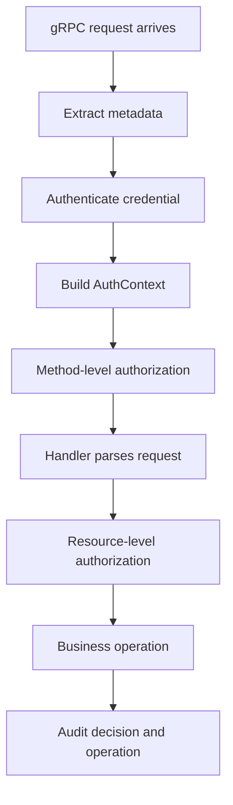
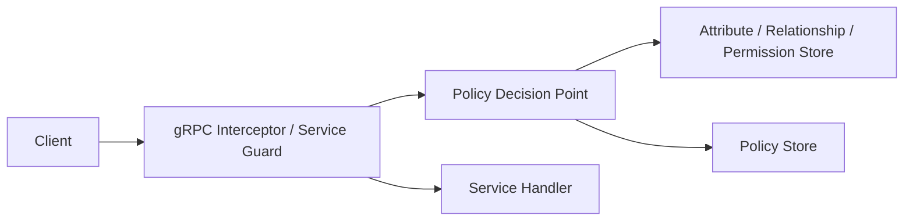
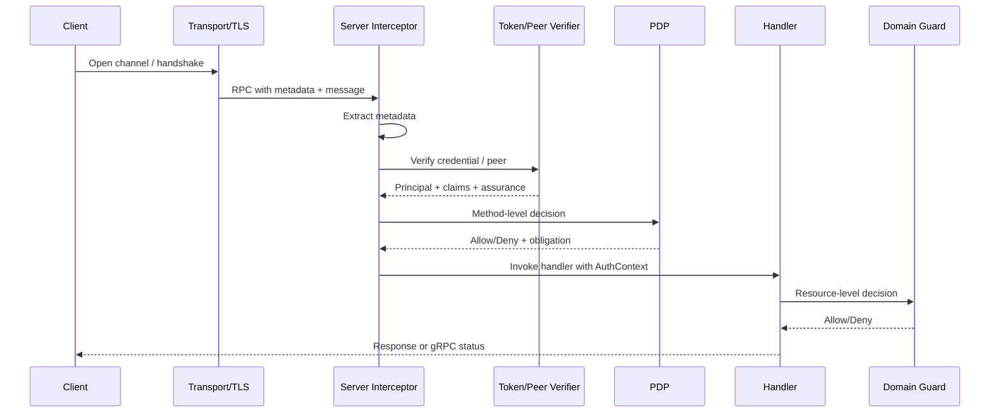
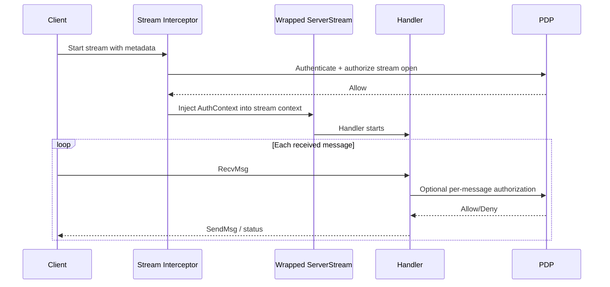
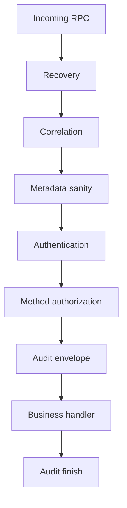
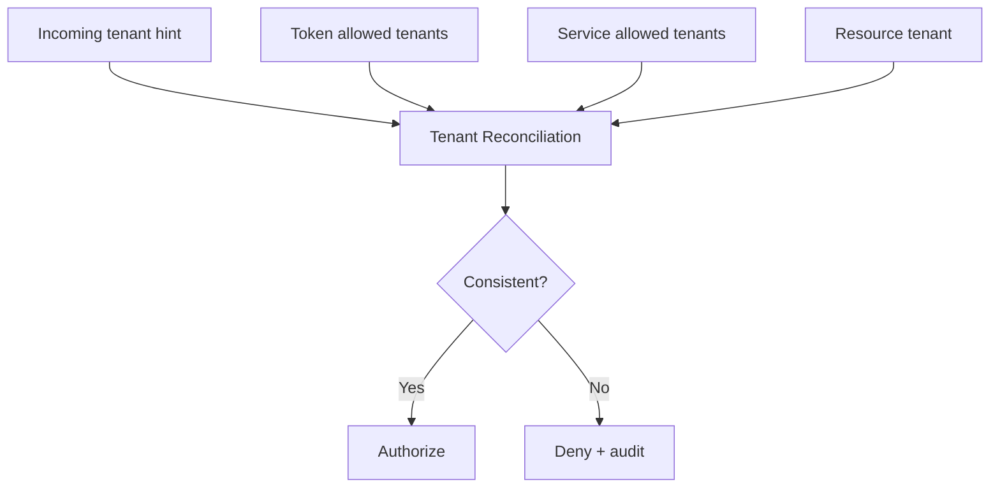
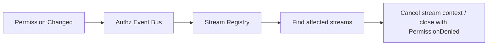
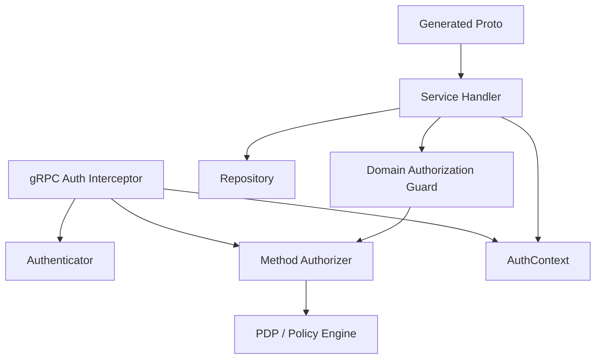
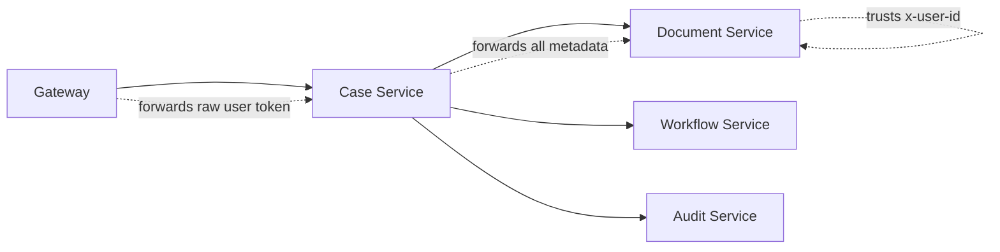
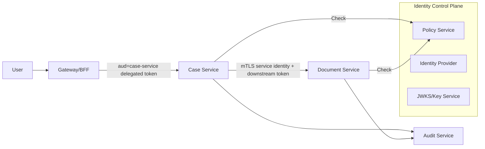

# learn-go-authentication-authorization-identity-permission-part-028.md

# Part 028 — gRPC Auth: Metadata, Interceptor Chain, Per-RPC Authorization

> Seri: `learn-go-authentication-authorization-identity-permission`  
> Bagian: `028`  
> Topik: gRPC authentication, authorization, metadata, interceptor, transport credential, per-RPC credential, service identity, user identity propagation, tenant boundary, streaming authorization  
> Target: Go 1.26.x  
> Level: Advanced / internal engineering handbook

---

## Daftar Isi

1. [Tujuan Bagian Ini](#1-tujuan-bagian-ini)
2. [Masalah yang Sebenarnya: gRPC Auth Bukan Sekadar Token di Metadata](#2-masalah-yang-sebenarnya-grpc-auth-bukan-sekadar-token-di-metadata)
3. [Mental Model: RPC Call sebagai Security Decision Boundary](#3-mental-model-rpc-call-sebagai-security-decision-boundary)
4. [gRPC Auth Vocabulary](#4-grpc-auth-vocabulary)
5. [gRPC Request Lifecycle dari Sudut Pandang Auth](#5-grpc-request-lifecycle-dari-sudut-pandang-auth)
6. [Metadata: Side Channel yang Kuat tapi Berbahaya Jika Disalahgunakan](#6-metadata-side-channel-yang-kuat-tapi-berbahaya-jika-disalahgunakan)
7. [Transport Security: TLS, mTLS, dan Peer Identity](#7-transport-security-tls-mtls-dan-peer-identity)
8. [Per-RPC Credentials: Token per Call, Bukan Sekadar Global Channel State](#8-per-rpc-credentials-token-per-call-bukan-sekadar-global-channel-state)
9. [Server Interceptor sebagai Policy Enforcement Point](#9-server-interceptor-sebagai-policy-enforcement-point)
10. [Unary Interceptor Design](#10-unary-interceptor-design)
11. [Stream Interceptor Design](#11-stream-interceptor-design)
12. [Client Interceptor Design](#12-client-interceptor-design)
13. [Auth Context: Principal, Actor, Tenant, Assurance, dan Authority](#13-auth-context-principal-actor-tenant-assurance-dan-authority)
14. [Per-Method Authorization](#14-per-method-authorization)
15. [Resource-Level Authorization dalam gRPC](#15-resource-level-authorization-dalam-grpc)
16. [Tenant Boundary dan Cross-Tenant Defense](#16-tenant-boundary-dan-cross-tenant-defense)
17. [User Identity Propagation vs Service Identity Propagation](#17-user-identity-propagation-vs-service-identity-propagation)
18. [gRPC Status Code Mapping untuk Auth](#18-grpc-status-code-mapping-untuk-auth)
19. [Public Method, Internal Method, dan Admin Method](#19-public-method-internal-method-dan-admin-method)
20. [Streaming RPC: Auth Problem yang Berbeda](#20-streaming-rpc-auth-problem-yang-berbeda)
21. [Long-Lived Stream, Token Expiry, dan Revocation](#21-long-lived-stream-token-expiry-dan-revocation)
22. [Auth di Background Worker dan Event-Driven RPC](#22-auth-di-background-worker-dan-event-driven-rpc)
23. [Schema Proto dan Contract Design](#23-schema-proto-dan-contract-design)
24. [Go Package Architecture](#24-go-package-architecture)
25. [Reference Implementation: Auth Types](#25-reference-implementation-auth-types)
26. [Reference Implementation: Metadata Extraction](#26-reference-implementation-metadata-extraction)
27. [Reference Implementation: Unary Auth Interceptor](#27-reference-implementation-unary-auth-interceptor)
28. [Reference Implementation: Stream Auth Interceptor](#28-reference-implementation-stream-auth-interceptor)
29. [Reference Implementation: Per-Method Policy Registry](#29-reference-implementation-per-method-policy-registry)
30. [Reference Implementation: PDP Client](#30-reference-implementation-pdp-client)
31. [Reference Implementation: Client-Side Credential Injection](#31-reference-implementation-client-side-credential-injection)
32. [mTLS Peer Identity Extraction](#32-mtls-peer-identity-extraction)
33. [Audit Logging untuk gRPC Auth](#33-audit-logging-untuk-grpc-auth)
34. [Observability dan Telemetry](#34-observability-dan-telemetry)
35. [Testing Strategy](#35-testing-strategy)
36. [Performance Considerations](#36-performance-considerations)
37. [Failure Mode Matrix](#37-failure-mode-matrix)
38. [Anti-Pattern](#38-anti-pattern)
39. [Production Checklist](#39-production-checklist)
40. [Case Study: Regulatory Case Management dengan gRPC Internal Services](#40-case-study-regulatory-case-management-dengan-grpc-internal-services)
41. [Ringkasan](#41-ringkasan)
42. [Referensi](#42-referensi)

---

## 1. Tujuan Bagian Ini

Bagian ini membahas bagaimana membangun **authentication dan authorization boundary pada gRPC service di Go** secara serius.

Targetnya bukan hanya bisa menulis interceptor yang membaca `authorization` metadata, tetapi memahami:

- bagaimana gRPC call menjadi security boundary;
- bagaimana transport credential, per-RPC credential, metadata, interceptor, service handler, dan policy engine berhubungan;
- bagaimana membedakan identity service dengan identity user;
- bagaimana menegakkan authorization pada level service, method, resource, tenant, workflow, dan stream;
- bagaimana memetakan error auth ke gRPC status code yang benar;
- bagaimana mencegah bypass karena public method, internal method, streaming, background job, atau forwarded identity;
- bagaimana merancang Go package agar auth logic tidak bocor ke semua handler.

Bagian ini tidak mengulang detail network/HTTP2/gRPC dasar dari seri I/O network. Yang dibahas di sini adalah **security control plane untuk RPC boundary**.

---

## 2. Masalah yang Sebenarnya: gRPC Auth Bukan Sekadar Token di Metadata

Banyak engineer memperlakukan gRPC auth seperti ini:

```go
md, _ := metadata.FromIncomingContext(ctx)
tokens := md.Get("authorization")
if len(tokens) == 0 {
    return nil, status.Error(codes.Unauthenticated, "missing token")
}
```

Ini baru **credential extraction**, belum authentication architecture.

Setelah credential diekstrak, masih ada pertanyaan lebih besar:

1. Token itu dari issuer mana?
2. Token itu access token, ID token, capability token, atau forwarded user token?
3. Audience token itu untuk service ini atau service lain?
4. Token itu mewakili human user, service account, job, worker, atau delegated actor?
5. Jika token valid, tenant aktifnya apa?
6. Jika token valid, authorization untuk method ini apa?
7. Jika method menerima `case_id`, apakah caller boleh mengakses case itu?
8. Jika stream berlangsung 30 menit, apa yang terjadi ketika token expire di menit ke-10?
9. Jika permission dicabut saat stream aktif, apakah stream harus dihentikan?
10. Jika gateway sudah authorize, apakah service boleh percaya begitu saja?
11. Jika request datang dari internal network, apakah auth boleh dilewati?
12. Jika service A memanggil service B atas nama user, apakah itu delegation, impersonation, atau service-level action?

Pada sistem distributed, bug auth sering muncul bukan karena token parser salah, tetapi karena **identity semantics hilang di antara hop service**.

Contoh bug nyata secara pola:

```text
Frontend -> Gateway -> Case Service -> Document Service
```

Gateway memvalidasi user `u123` dari tenant `T1`.

Case Service memanggil Document Service memakai service token miliknya sendiri.

Document Service hanya melihat:

```text
caller = case-service
```

Jika Document Service tidak menerima atau tidak memvalidasi **delegated user context**, maka ia tidak tahu apakah user `u123` boleh membaca dokumen tersebut. Akhirnya Document Service mungkin hanya percaya `case-service` dan mengembalikan dokumen lintas tenant.

Inilah kenapa gRPC auth harus didesain sebagai **call-chain authorization problem**, bukan endpoint token parsing.

---

## 3. Mental Model: RPC Call sebagai Security Decision Boundary

Setiap gRPC call harus dipandang sebagai boundary berikut:

```text
Caller mencoba melakukan Action terhadap Resource melalui Method pada Service dalam Context tertentu.
```

Bentuk abstraknya:

```text
Decision = Can(
    subject,
    actor,
    service,
    method,
    resource,
    tenant,
    action,
    environment,
)
```

Dalam gRPC, `method` biasanya berbentuk fully qualified method:

```text
/package.Service/Method
/regulatory.case.v1.CaseService/GetCase
/regulatory.case.v1.CaseService/ApproveCase
/regulatory.document.v1.DocumentService/DownloadDocument
```

Jangan menganggap method name sudah cukup sebagai permission. Banyak method membutuhkan resource-level check.

Contoh:

```text
/regulatory.case.v1.CaseService/GetCase
```

Method ini tidak cukup dicek dengan permission:

```text
case.read
```

Harus juga dicek terhadap resource:

```text
case_id = CASE-123
tenant_id = CEA
agency_id = AGENCY-09
classification = restricted
owner_team = enforcement
case_stage = investigation
```

Maka enforcement gRPC biasanya minimal dua lapis:

1. **Method-level gate**: caller punya hak memanggil method ini secara umum.
2. **Resource-level gate**: caller punya hak terhadap object spesifik dalam request.



Design invariant:

> gRPC interceptor dapat menegakkan authentication dan method-level authorization, tetapi resource-level authorization sering membutuhkan data request dan domain state, sehingga harus tetap ada di service layer atau domain authorization layer.

---

## 4. gRPC Auth Vocabulary

### 4.1 Transport Credentials

Transport credentials mengamankan channel.

Contoh:

- TLS server authentication;
- mTLS client authentication;
- SPIFFE X.509-SVID;
- ALTS pada environment tertentu.

Transport credentials menjawab:

```text
Apakah channel ini secure?
Siapa peer pada level transport?
Apakah koneksi terenkripsi?
Apakah client certificate valid?
```

Transport credential tidak otomatis menjawab:

```text
Apakah caller boleh menjalankan ApproveCase?
Apakah user boleh membaca case ini?
Apakah tenant cocok?
```

### 4.2 Per-RPC Credentials

Per-RPC credentials adalah credential yang dikirim per call.

Contoh:

- OAuth2 access token;
- JWT bearer token;
- DPoP proof;
- capability token;
- signed request credential;
- service token.

Per-RPC credential menjawab:

```text
Siapa caller pada call ini?
Credential apa yang membuktikan identity/authority?
```

### 4.3 Metadata

Metadata adalah key-value side channel yang terasosiasi dengan RPC.

Digunakan untuk:

- authorization header;
- request id;
- trace context;
- tenant hint;
- idempotency key;
- audit correlation id;
- capability token;
- client version;
- environment tag.

Metadata bukan tempat untuk:

- data bisnis besar;
- daftar permission besar;
- object payload;
- PII yang tidak perlu;
- token yang tidak terenkripsi pada channel insecure.

### 4.4 Interceptor

Interceptor adalah middleware gRPC.

Server interceptor cocok untuk:

- metadata extraction;
- authentication;
- method-level authorization;
- rate limiting;
- audit envelope;
- metrics;
- panic recovery;
- tracing;
- request validation envelope.

Interceptor tidak cocok untuk:

- mengelola TLS handshake;
- menyimpan connection state bisnis;
- melakukan resource-level check yang butuh business object kompleks kecuali request dapat diekstrak generik;
- mengganti domain authorization di handler.

### 4.5 AuthContext

AuthContext adalah typed representation dari hasil authentication.

Contoh:

```go
type AuthContext struct {
    Principal Principal
    Actor     Actor
    Tenant    TenantContext
    Session   *SessionContext
    Assurance AssuranceContext
    Credential CredentialContext
    Method    MethodContext
    Trace     TraceContext
}
```

AuthContext bukan token mentah. Token mentah sebaiknya tidak diedarkan ke semua layer.

### 4.6 PEP dan PDP

Dalam gRPC:

- Interceptor sering menjadi **PEP**: Policy Enforcement Point.
- Policy engine/service menjadi **PDP**: Policy Decision Point.
- Domain repository atau directory service menjadi **PIP**: Policy Information Point.
- Admin/policy UI menjadi **PAP**: Policy Administration Point.



---

## 5. gRPC Request Lifecycle dari Sudut Pandang Auth

Lifecycle gRPC unary request:



Lifecycle stream request lebih kompleks:



Streaming penting karena:

- authentication terjadi saat stream dibuka;
- stream dapat berlangsung lama;
- request payload bisa datang berkali-kali;
- resource bisa berubah di tengah stream;
- permission bisa dicabut setelah stream terbuka;
- tenant bisa berubah jika message berisi tenant/resource berbeda;
- interceptor biasa tidak otomatis mengecek setiap message.

---

## 6. Metadata: Side Channel yang Kuat tapi Berbahaya Jika Disalahgunakan

gRPC metadata adalah key-value data yang dikirim bersama RPC. Secara konseptual mirip HTTP header karena diimplementasikan di atas HTTP/2 header/trailer.

Contoh metadata:

```text
authorization: Bearer eyJhbGciOi...
x-request-id: req-123
x-tenant-id: cea
x-correlation-id: corr-987
x-idempotency-key: idem-456
```

### 6.1 Metadata Key Rules

Prinsip praktis:

- gunakan lowercase key;
- hindari prefix `grpc-` karena reserved;
- gunakan `authorization` untuk bearer token jika kompatibel dengan gateway/proxy;
- gunakan `-bin` suffix hanya untuk binary metadata;
- batasi ukuran metadata;
- jangan menyimpan payload bisnis besar.

Contoh helper:

```go
package rpcauth

import (
    "context"
    "strings"

    "google.golang.org/grpc/metadata"
)

const (
    MetadataAuthorization = "authorization"
    MetadataTenantID      = "x-tenant-id"
    MetadataRequestID     = "x-request-id"
)

func IncomingMetadataValue(ctx context.Context, key string) (string, bool) {
    md, ok := metadata.FromIncomingContext(ctx)
    if !ok {
        return "", false
    }

    values := md.Get(strings.ToLower(key))
    if len(values) == 0 {
        return "", false
    }

    // For auth-sensitive keys, reject duplicates instead of picking first/last.
    if len(values) != 1 {
        return "", false
    }

    return values[0], true
}
```

Important invariant:

> Untuk metadata security-sensitive seperti `authorization`, duplicate values harus ditolak. Jangan diam-diam memilih value pertama atau terakhir.

### 6.2 Metadata Trust Level

Tidak semua metadata sama tingkat kepercayaannya.

| Metadata | Siapa yang boleh set | Trust level | Catatan |
|---|---|---:|---|
| `authorization` | Client / caller | Medium setelah diverifikasi | Jangan percaya sebelum token verification |
| `x-request-id` | Gateway/client | Low/medium | Boleh dipakai correlation, bukan authorization |
| `x-tenant-id` | Client/gateway | Low sebelum reconcile | Harus dicocokkan dengan token/principal/resource |
| `x-user-id` | Jangan dari public client | Dangerous | Mudah dipalsukan kecuali dari trusted gateway yang authenticated |
| `x-forwarded-user` | Gateway internal saja | Dangerous | Harus ada gateway identity proof |
| `x-service-id` | Jangan manual | Dangerous | Ambil dari mTLS/SPIFFE/token, bukan header mentah |

Anti-pattern:

```go
userID := md.Get("x-user-id")[0]
```

Ini bukan authentication. Ini hanya percaya string dari network.

### 6.3 Authorization Header Parsing

Implementasi parsing harus strict.

```go
package rpcauth

import (
    "errors"
    "strings"
)

var (
    ErrMissingAuthorization = errors.New("missing authorization metadata")
    ErrInvalidAuthorization = errors.New("invalid authorization metadata")
)

func BearerTokenFromAuthorization(v string) (string, error) {
    if v == "" {
        return "", ErrMissingAuthorization
    }

    scheme, token, ok := strings.Cut(v, " ")
    if !ok {
        return "", ErrInvalidAuthorization
    }

    if !strings.EqualFold(scheme, "Bearer") {
        return "", ErrInvalidAuthorization
    }

    token = strings.TrimSpace(token)
    if token == "" || strings.ContainsAny(token, "\r\n\t ") {
        return "", ErrInvalidAuthorization
    }

    return token, nil
}
```

Kenapa strict?

- mencegah header smuggling sederhana;
- mencegah ambiguity antar proxy;
- mencegah token kosong;
- mencegah multi-token parser confusion.

---

## 7. Transport Security: TLS, mTLS, dan Peer Identity

gRPC auth harus memisahkan:

1. **Channel security**: apakah transport terenkripsi dan peer terverifikasi?
2. **Caller identity**: siapa caller pada call ini?
3. **Authority**: caller boleh melakukan apa?

### 7.1 TLS Server Authentication

TLS server authentication memastikan client berbicara dengan server yang benar.

Client code concept:

```go
creds := credentials.NewTLS(&tls.Config{
    MinVersion: tls.VersionTLS12,
    ServerName: "case-service.internal.example.com",
})

conn, err := grpc.NewClient(
    target,
    grpc.WithTransportCredentials(creds),
)
```

Server-side TLS:

```go
cert, err := tls.LoadX509KeyPair("server.crt", "server.key")
if err != nil {
    return err
}

creds := credentials.NewTLS(&tls.Config{
    MinVersion:   tls.VersionTLS12,
    Certificates: []tls.Certificate{cert},
})

server := grpc.NewServer(grpc.Creds(creds))
```

### 7.2 mTLS Client Authentication

mTLS memberi server kemampuan memverifikasi client certificate.

Server-side concept:

```go
caPool := x509.NewCertPool()
// load client CA certs into caPool

creds := credentials.NewTLS(&tls.Config{
    MinVersion: tls.VersionTLS12,
    ClientAuth: tls.RequireAndVerifyClientCert,
    ClientCAs:  caPool,
})

server := grpc.NewServer(grpc.Creds(creds))
```

mTLS bagus untuk service identity, tetapi tetap butuh authorization:

```text
certificate subject = spiffe://prod/ns/case/sa/case-service
```

Itu hanya identity. Permission tetap harus dicek:

```text
case-service may call DocumentService.GetDocument for tenant CEA when delegated user is authorized.
```

### 7.3 Peer Identity dari TLS

Di server handler/interceptor, informasi TLS peer dapat diekstrak dari context.

```go
package rpcauth

import (
    "context"
    "crypto/x509"
    "fmt"

    "google.golang.org/grpc/credentials"
    "google.golang.org/grpc/peer"
)

func PeerCertificates(ctx context.Context) ([]*x509.Certificate, bool) {
    p, ok := peer.FromContext(ctx)
    if !ok || p.AuthInfo == nil {
        return nil, false
    }

    tlsInfo, ok := p.AuthInfo.(credentials.TLSInfo)
    if !ok {
        return nil, false
    }

    if len(tlsInfo.State.PeerCertificates) == 0 {
        return nil, false
    }

    return tlsInfo.State.PeerCertificates, true
}

func PeerSPIFFEID(ctx context.Context) (string, bool) {
    certs, ok := PeerCertificates(ctx)
    if !ok {
        return "", false
    }

    leaf := certs[0]
    for _, uri := range leaf.URIs {
        if uri.Scheme == "spiffe" {
            return uri.String(), true
        }
    }

    return "", false
}

func MustPeerIdentity(ctx context.Context) (string, error) {
    if id, ok := PeerSPIFFEID(ctx); ok {
        return id, nil
    }
    return "", fmt.Errorf("missing peer workload identity")
}
```

Production caveat:

- validasi chain certificate harus dilakukan oleh TLS config;
- jangan hanya membaca certificate subject tanpa trust validation;
- jangan mapping identity dari CN legacy jika environment memakai SAN URI;
- jangan mengizinkan self-signed client certificate tanpa CA trust boundary yang jelas;
- jangan memakai mTLS identity sebagai user identity.

---

## 8. Per-RPC Credentials: Token per Call, Bukan Sekadar Global Channel State

Pada gRPC client Go, token bisa dikirim menggunakan per-RPC credentials.

Conceptual pattern:

```go
conn, err := grpc.NewClient(
    target,
    grpc.WithTransportCredentials(creds),
    grpc.WithPerRPCCredentials(tokenCreds),
)
```

Per-RPC credential berguna karena:

- token bisa refresh;
- tiap call bisa membawa scope/audience berbeda;
- credential tidak menjadi global mutable metadata manual;
- client library bisa memastikan token hanya dikirim di secure transport jika credential mengharuskannya.

Custom credential sederhana:

```go
package rpcauthclient

import (
    "context"

    "google.golang.org/grpc/credentials"
)

type TokenSource interface {
    Token(ctx context.Context) (string, error)
}

type BearerPerRPCCredentials struct {
    Source       TokenSource
    RequireTLS   bool
    ExtraHeaders map[string]string
}

func (c BearerPerRPCCredentials) GetRequestMetadata(ctx context.Context, uri ...string) (map[string]string, error) {
    token, err := c.Source.Token(ctx)
    if err != nil {
        return nil, err
    }

    md := map[string]string{
        "authorization": "Bearer " + token,
    }

    for k, v := range c.ExtraHeaders {
        md[k] = v
    }

    return md, nil
}

func (c BearerPerRPCCredentials) RequireTransportSecurity() bool {
    // In production, this should almost always be true for bearer tokens.
    return c.RequireTLS
}

var _ credentials.PerRPCCredentials = (*BearerPerRPCCredentials)(nil)
```

Important invariant:

> Bearer token tidak boleh dikirim pada insecure transport. Jika harus ada local development insecure mode, buat explicit dev-only configuration dan jangan share code path production.

---

## 9. Server Interceptor sebagai Policy Enforcement Point

Interceptor adalah tempat ideal untuk enforcement yang berlaku lintas method.

Namun perlu dibatasi.

### 9.1 Yang Cocok di Interceptor

- reject missing/invalid credential;
- verify token;
- extract peer identity;
- build `AuthContext`;
- attach auth context ke `context.Context`;
- method-level authorization;
- audit envelope;
- rate limit envelope;
- consistency check metadata;
- reject duplicate security metadata;
- map auth error ke status code.

### 9.2 Yang Tidak Cocok di Interceptor

- mengambil domain object detail secara mahal untuk semua method;
- melakukan business-specific resource authorization yang kompleks tanpa request typing;
- mengubah request payload;
- menyimpan mutable auth state global;
- menganggap semua stream message sudah authorized hanya karena stream opened;
- mengandalkan method name prefix sebagai satu-satunya policy.

### 9.3 Interceptor Chain Order

Urutan interceptor penting.

Recommended server chain:

```text
1. panic recovery
2. request id / correlation
3. deadline / overload guard
4. transport/metadata sanity check
5. authentication
6. method-level authorization
7. audit envelope start
8. metrics/tracing enrichment
9. handler
10. audit envelope finish
```

Alternatif lain bisa valid, tetapi invariant-nya:

> Jangan menjalankan business handler sebelum authentication dan method-level authorization selesai.

Diagram:



---

## 10. Unary Interceptor Design

Unary RPC menerima satu request dan mengembalikan satu response.

Signature Go:

```go
type UnaryServerInterceptor func(
    ctx context.Context,
    req any,
    info *grpc.UnaryServerInfo,
    handler grpc.UnaryHandler,
) (resp any, err error)
```

Unary auth interceptor harus melakukan:

1. read method name;
2. determine auth requirement;
3. extract credentials;
4. verify credentials;
5. build auth context;
6. perform method-level authorization;
7. inject auth context into context;
8. call handler;
9. map errors and audit.

Pseudo-flow:

```go
func UnaryAuthInterceptor(authn Authenticator, authz Authorizer, registry MethodPolicyRegistry) grpc.UnaryServerInterceptor {
    return func(ctx context.Context, req any, info *grpc.UnaryServerInfo, handler grpc.UnaryHandler) (any, error) {
        policy := registry.PolicyFor(info.FullMethod)

        if policy.Public {
            return handler(ctx, req)
        }

        ac, err := authn.Authenticate(ctx, CredentialInputFromContext(ctx))
        if err != nil {
            return nil, ToGRPCAuthError(err)
        }

        decision, err := authz.Authorize(ctx, AuthorizationRequest{
            Auth:   ac,
            Method: info.FullMethod,
            Action: policy.Action,
        })
        if err != nil {
            return nil, status.Error(codes.Unavailable, "authorization service unavailable")
        }
        if !decision.Allow {
            return nil, status.Error(codes.PermissionDenied, "permission denied")
        }

        ctx = ContextWithAuth(ctx, ac)
        return handler(ctx, req)
    }
}
```

Important nuance:

- Jika credential tidak ada atau invalid: `Unauthenticated`.
- Jika principal valid tapi tidak punya hak: `PermissionDenied`.
- Jika authz service unavailable dan default fail-closed: biasanya `Unavailable` atau `PermissionDenied` tergantung policy operasional.
- Jangan return error detail yang membocorkan resource existence.

---

## 11. Stream Interceptor Design

Stream RPC lebih sulit karena handler menerima `grpc.ServerStream`, bukan langsung `context.Context` biasa.

Signature Go:

```go
type StreamServerInterceptor func(
    srv any,
    ss grpc.ServerStream,
    info *grpc.StreamServerInfo,
    handler grpc.StreamHandler,
) error
```

Untuk inject AuthContext, kita perlu wrapping stream:

```go
type wrappedServerStream struct {
    grpc.ServerStream
    ctx context.Context
}

func (w *wrappedServerStream) Context() context.Context {
    return w.ctx
}
```

Stream interceptor basic:

```go
func StreamAuthInterceptor(authn Authenticator, authz Authorizer, registry MethodPolicyRegistry) grpc.StreamServerInterceptor {
    return func(srv any, ss grpc.ServerStream, info *grpc.StreamServerInfo, handler grpc.StreamHandler) error {
        ctx := ss.Context()
        policy := registry.PolicyFor(info.FullMethod)

        if policy.Public {
            return handler(srv, ss)
        }

        ac, err := authn.Authenticate(ctx, CredentialInputFromContext(ctx))
        if err != nil {
            return ToGRPCAuthError(err)
        }

        decision, err := authz.Authorize(ctx, AuthorizationRequest{
            Auth:   ac,
            Method: info.FullMethod,
            Action: policy.Action,
        })
        if err != nil {
            return status.Error(codes.Unavailable, "authorization service unavailable")
        }
        if !decision.Allow {
            return status.Error(codes.PermissionDenied, "permission denied")
        }

        wrapped := &wrappedServerStream{
            ServerStream: ss,
            ctx:          ContextWithAuth(ctx, ac),
        }

        return handler(srv, wrapped)
    }
}
```

Tapi ini baru **stream-open authorization**.

Untuk per-message authorization, perlu salah satu:

1. handler memanggil domain guard setiap menerima message;
2. stream wrapper override `RecvMsg` dan melakukan generic validation;
3. protocol design membatasi satu stream hanya untuk satu resource/tenant;
4. stream memiliki lease/reauth interval.

---

## 12. Client Interceptor Design

Client interceptor berguna untuk:

- inject correlation id;
- inject tenant context;
- inject delegated user context;
- metrics/tracing;
- retry classification;
- audit outbound call;
- request signing envelope.

Untuk auth token, gRPC Go lebih idiomatik memakai `PerRPCCredentials`, tetapi client interceptor tetap bisa berguna untuk metadata non-secret dan propagation.

Unary client interceptor concept:

```go
func UnaryClientContextInterceptor() grpc.UnaryClientInterceptor {
    return func(
        ctx context.Context,
        method string,
        req any,
        reply any,
        cc *grpc.ClientConn,
        invoker grpc.UnaryInvoker,
        opts ...grpc.CallOption,
    ) error {
        ctx = injectCorrelationID(ctx)
        ctx = injectTenantHint(ctx)
        return invoker(ctx, method, req, reply, cc, opts...)
    }
}
```

Danger:

> Jangan membangun delegated identity dengan sekadar forward semua incoming metadata ke outgoing call.

Anti-pattern:

```go
// BAD: blindly forwards incoming metadata to downstream service.
func forwardAllMetadata(ctx context.Context) context.Context {
    md, _ := metadata.FromIncomingContext(ctx)
    return metadata.NewOutgoingContext(ctx, md)
}
```

Kenapa buruk?

- bisa forward user token ke service yang bukan audience-nya;
- bisa forward internal-only header ke external service;
- bisa forward spoofed metadata;
- bisa mencampur tenant header dari caller dengan service call;
- bisa memperluas blast radius token compromise.

Gunakan explicit propagation:

```go
func OutgoingContextForDownstream(ctx context.Context, ds DownstreamTarget) context.Context {
    out := metadata.MD{}

    if reqID, ok := RequestIDFromContext(ctx); ok {
        out.Set("x-request-id", reqID)
    }

    if tenant, ok := TenantFromContext(ctx); ok {
        out.Set("x-tenant-id", tenant.ID)
    }

    // Delegated user context should be minted/translated, not raw-forwarded.
    if delegated, ok := DelegationTokenFromContext(ctx); ok && ds.AcceptsDelegation {
        out.Set("authorization", "Bearer "+delegated.Token)
    }

    return metadata.NewOutgoingContext(ctx, out)
}
```

---

## 13. Auth Context: Principal, Actor, Tenant, Assurance, dan Authority

AuthContext harus bisa merepresentasikan beberapa mode:

1. human user direct call;
2. service-to-service call;
3. service acting on behalf of user;
4. admin impersonation;
5. delegated capability;
6. background job;
7. break-glass access.

### 13.1 Go Types

```go
package rpcauth

import "time"

type PrincipalKind string

const (
    PrincipalHuman   PrincipalKind = "human"
    PrincipalService PrincipalKind = "service"
    PrincipalJob     PrincipalKind = "job"
    PrincipalSystem  PrincipalKind = "system"
)

type Principal struct {
    Kind        PrincipalKind
    ID          string
    DisplayName string
    TenantIDs   []string
    ExternalRef *ExternalRef
}

type ActorKind string

const (
    ActorSelf          ActorKind = "self"
    ActorService       ActorKind = "service"
    ActorDelegatedUser ActorKind = "delegated_user"
    ActorImpersonator  ActorKind = "impersonator"
    ActorBreakGlass    ActorKind = "break_glass"
)

type Actor struct {
    Kind        ActorKind
    SubjectID   string
    ServiceID   string
    Reason      string
    DelegationID string
}

type TenantContext struct {
    ActiveTenantID string
    AllowedTenants []string
    Source         string // token, metadata, route, resource, default
}

type AssuranceContext struct {
    AAL       string
    IAL       string
    FAL       string
    AMR       []string
    ACR       string
    AuthTime  *time.Time
    FreshUntil *time.Time
}

type CredentialContext struct {
    Type      string // access_token, mtls, spiffe, api_key, capability
    Issuer    string
    Subject   string
    Audience  []string
    TokenID   string
    ExpiresAt *time.Time
}

type AuthContext struct {
    Principal  Principal
    Actor      Actor
    Tenant     TenantContext
    Assurance  AssuranceContext
    Credential CredentialContext
}
```

### 13.2 Context Key Safety

Jangan gunakan string key global:

```go
ctx = context.WithValue(ctx, "user", user)
```

Gunakan private typed key:

```go
type authContextKey struct{}

func ContextWithAuth(ctx context.Context, ac AuthContext) context.Context {
    return context.WithValue(ctx, authContextKey{}, ac)
}

func AuthFromContext(ctx context.Context) (AuthContext, bool) {
    ac, ok := ctx.Value(authContextKey{}).(AuthContext)
    return ac, ok
}
```

Important invariant:

> Handler tidak boleh membaca token mentah untuk menentukan authorization. Handler membaca AuthContext yang sudah diverifikasi.

---

## 14. Per-Method Authorization

Per-method authorization adalah check minimal sebelum handler berjalan.

Contoh policy registry:

```go
type MethodPolicy struct {
    FullMethod       string
    Public           bool
    RequiredAction   string
    RequiredResource string
    RequireTenant    bool
    RequireAAL       string
    InternalOnly      bool
    AllowServiceKinds []PrincipalKind
}
```

Contoh registry:

```go
var Policies = map[string]MethodPolicy{
    "/regulatory.case.v1.CaseService/GetCase": {
        FullMethod:       "/regulatory.case.v1.CaseService/GetCase",
        RequiredAction:   "case.read",
        RequiredResource: "case",
        RequireTenant:    true,
    },
    "/regulatory.case.v1.CaseService/ApproveCase": {
        FullMethod:       "/regulatory.case.v1.CaseService/ApproveCase",
        RequiredAction:   "case.approve",
        RequiredResource: "case",
        RequireTenant:    true,
        RequireAAL:       "aal2",
    },
    "/grpc.health.v1.Health/Check": {
        FullMethod: "/grpc.health.v1.Health/Check",
        Public:     true,
    },
}
```

### 14.1 Default Deny

Registry harus default deny.

```go
func (r StaticMethodPolicyRegistry) PolicyFor(fullMethod string) MethodPolicy {
    p, ok := r[fullMethod]
    if !ok {
        return MethodPolicy{
            FullMethod: fullMethod,
            Public:     false,
            // Unknown method should be denied before handler if exposed by server.
            RequiredAction: "__unknown__",
        }
    }
    return p
}
```

Better: fail startup if registered gRPC methods tidak punya policy.

```go
func ValidatePolicyCoverage(registeredMethods []string, policies map[string]MethodPolicy) error {
    for _, m := range registeredMethods {
        if _, ok := policies[m]; !ok {
            return fmt.Errorf("missing auth policy for method %s", m)
        }
    }
    return nil
}
```

### 14.2 Policy dari Proto Option

Untuk scale besar, policy bisa dideklarasikan pada proto custom option.

Concept:

```proto
syntax = "proto3";

package regulatory.case.v1;

import "google/protobuf/descriptor.proto";

extend google.protobuf.MethodOptions {
  AuthzRule authz = 51001;
}

message AuthzRule {
  bool public = 1;
  string action = 2;
  string resource = 3;
  bool tenant_required = 4;
  string min_aal = 5;
}

service CaseService {
  rpc GetCase(GetCaseRequest) returns (GetCaseResponse) {
    option (authz) = {
      action: "case.read"
      resource: "case"
      tenant_required: true
    };
  }
}
```

Benefit:

- policy dekat dengan API contract;
- bisa generate registry;
- bisa validate coverage di CI;
- mengurangi drift antara proto dan service.

Danger:

- jangan taruh policy terlalu kompleks di proto;
- proto option cocok untuk method-level metadata, bukan semua ABAC/ReBAC logic;
- tetap perlu PDP/domain guard untuk object-level decision.

---

## 15. Resource-Level Authorization dalam gRPC

Method-level check tidak cukup.

Contoh handler:

```go
func (s *CaseServer) GetCase(ctx context.Context, req *casev1.GetCaseRequest) (*casev1.GetCaseResponse, error) {
    ac, ok := rpcauth.AuthFromContext(ctx)
    if !ok {
        return nil, status.Error(codes.Internal, "missing auth context")
    }

    caseObj, err := s.caseRepo.Get(ctx, req.CaseId)
    if err != nil {
        return nil, mapRepoError(err)
    }

    decision, err := s.authorizer.Authorize(ctx, authz.Request{
        Subject: ac.Principal.ID,
        Actor:   ac.Actor,
        Tenant:  ac.Tenant.ActiveTenantID,
        Action:  "case.read",
        Resource: authz.Resource{
            Type: "case",
            ID:   caseObj.ID,
            Attributes: map[string]any{
                "tenant_id":      caseObj.TenantID,
                "agency_id":      caseObj.AgencyID,
                "classification": caseObj.Classification,
                "stage":          caseObj.Stage,
            },
        },
    })
    if err != nil {
        return nil, status.Error(codes.Unavailable, "authorization unavailable")
    }
    if !decision.Allow {
        // Avoid revealing existence if policy requires concealment.
        return nil, status.Error(codes.PermissionDenied, "permission denied")
    }

    return mapCase(caseObj), nil
}
```

Resource-level check harus dilakukan setelah resource diketahui, tapi sebelum sensitive data dikembalikan atau dimutasi.

### 15.1 Query Guard vs Post-Read Guard

Ada dua model:

1. Query guard: filter data di query berdasarkan authorization boundary.
2. Post-read guard: baca object lalu authorize.

Untuk list/search/export, query guard wajib.

```go
func (r *CaseRepository) ListVisibleCases(ctx context.Context, ac AuthContext, filter CaseFilter) ([]Case, error) {
    // Query includes tenant and visibility constraints derived from auth context.
    // Do not fetch all and filter in app for large/sensitive data.
    return r.query(ctx, VisibleCaseQuery{
        TenantID: ac.Tenant.ActiveTenantID,
        Teams:   ac.PrincipalTeams,
        Filter:  filter,
    })
}
```

Post-read guard cocok untuk single object tetapi masih harus hati-hati terhadap existence leak.

### 15.2 Existence Leak

Jika unauthorized caller menebak `case_id`, apa response-nya?

Pilihan:

- `PermissionDenied`: caller tahu object ada tapi tidak punya hak.
- `NotFound`: menyembunyikan existence.
- `PermissionDenied` untuk authenticated internal role tertentu, `NotFound` untuk external user.

Policy harus eksplisit, bukan kebetulan.

---

## 16. Tenant Boundary dan Cross-Tenant Defense

Dalam gRPC internal, tenant context sering dikirim lewat metadata:

```text
x-tenant-id: cea
```

Ini hanya **hint**, bukan authority.

Tenant enforcement harus reconcile minimal empat sumber:

1. token claims;
2. mTLS/service identity;
3. metadata tenant hint;
4. resource tenant dari database.



Example tenant reconciliation:

```go
type TenantReconciler struct{}

func (TenantReconciler) Reconcile(ac AuthContext, requestedTenant string) (TenantContext, error) {
    if requestedTenant == "" {
        return TenantContext{}, ErrMissingTenant
    }

    if !contains(ac.Tenant.AllowedTenants, requestedTenant) {
        return TenantContext{}, ErrTenantNotAllowed
    }

    ac.Tenant.ActiveTenantID = requestedTenant
    ac.Tenant.Source = "metadata"
    return ac.Tenant, nil
}
```

Important invariant:

> `tenant_id` dari metadata tidak boleh menjadi satu-satunya filter query. Ia harus dibuktikan sebagai tenant yang diperbolehkan oleh identity dan cocok dengan resource.

Cross-tenant bug umum:

```go
// BAD: tenant is taken from request metadata and directly used.
rows, _ := db.QueryContext(ctx, `SELECT * FROM cases WHERE tenant_id = :1`, tenantFromMetadata)
```

Better:

```go
tenant := MustActiveTenant(ctx) // already reconciled
rows, _ := db.QueryContext(ctx, `SELECT * FROM cases WHERE tenant_id = :1`, tenant.ID)
```

Still better: repository menerima typed `TenantScopedContext`, bukan string mentah.

---

## 17. User Identity Propagation vs Service Identity Propagation

Pada service-to-service RPC, ada dua identity yang sering tercampur:

1. **Calling service identity**: service A memanggil service B.
2. **End-user identity**: user U menyebabkan service A memanggil service B.

Keduanya harus dipisahkan.

### 17.1 Direct Service Call

```text
case-service -> document-service
principal = service:case-service
actor = service:case-service
action = document.generate_index
```

### 17.2 Delegated User Call

```text
case-service -> document-service
principal = user:u123
actor = service:case-service
on_behalf_of = user:u123
delegation = grant-789
action = document.read
```

### 17.3 Impersonation

```text
support-admin -> case-service
principal = user:u123
actor = admin:a999
mode = impersonation
reason = support-ticket-123
```

### 17.4 Anti-Pattern: Raw Token Forwarding

Raw forwarding external user access token ke semua internal services adalah buruk jika:

- audience token hanya untuk gateway;
- downstream services menerima token tanpa audience check;
- token membawa scopes terlalu luas;
- token lifetime terlalu panjang;
- downstream service tidak tahu actor chain;
- token dipakai ke service yang tidak semestinya.

Preferred patterns:

1. **Token exchange**: gateway/service menukar token menjadi downstream audience token.
2. **Internal delegation token**: signed token khusus internal dengan `act`/actor chain.
3. **mTLS service identity + signed user context**: service identity diverifikasi di transport, user context diverifikasi sebagai delegated assertion.
4. **Central PDP**: downstream service authorize berdasarkan service identity + user subject + resource.

---

## 18. gRPC Status Code Mapping untuk Auth

Mapping yang benar penting untuk client behavior, security, dan observability.

| Kondisi | gRPC code | Catatan |
|---|---:|---|
| Credential missing | `Unauthenticated` | Caller belum teridentifikasi |
| Token malformed | `Unauthenticated` | Jangan expose parser detail |
| Token expired | `Unauthenticated` | Client bisa refresh |
| Token issuer invalid | `Unauthenticated` | Authentication gagal |
| Audience mismatch | `Unauthenticated` | Token bukan untuk service ini |
| Principal valid tapi action tidak boleh | `PermissionDenied` | Caller identified tapi unauthorized |
| Tenant tidak allowed | `PermissionDenied` atau `NotFound` | Tergantung concealment policy |
| Resource tidak ada | `NotFound` | Jika memang tidak ada |
| Authz service timeout | `Unavailable` | Jika fail-closed dengan retry mungkin valid |
| Policy misconfigured | `Internal` atau `PermissionDenied` | Lebih baik fail startup |
| Quota exceeded per user | `ResourceExhausted` | Jangan pakai PermissionDenied |
| AAL kurang untuk action | `PermissionDenied` atau custom detail | Bisa signal step-up via error detail |

Prinsip utama:

```text
UNAUTHENTICATED = tidak dapat membuktikan siapa caller.
PERMISSION_DENIED = caller sudah diketahui, tetapi tidak punya hak.
```

### 18.1 Step-Up Error Detail

Untuk action yang membutuhkan AAL lebih tinggi, server bisa return `PermissionDenied` dengan detail terstruktur agar client tahu harus step-up.

Concept:

```go
st := status.New(codes.PermissionDenied, "step-up authentication required")
// Attach protobuf error detail, e.g. google.rpc.ErrorInfo, if your API standard supports it.
return nil, st.Err()
```

Jangan return:

```text
user has role officer but needs senior_officer for case CASE-123
```

Itu membocorkan policy internal.

---

## 19. Public Method, Internal Method, dan Admin Method

Tidak semua gRPC method sama.

### 19.1 Public Method

Contoh:

- health check;
- readiness;
- public discovery;
- login initiation jika exposed via gRPC;
- unauthenticated bootstrap.

Public method tetap perlu:

- rate limiting;
- audit minimal;
- metadata size limit;
- request validation;
- abuse defense.

### 19.2 Internal Method

Internal method bukan berarti tanpa auth.

Harus minimal:

- mTLS/SPIFFE identity;
- service allowlist;
- method-level authorization;
- tenant scoping;
- audit.

### 19.3 Admin Method

Admin method perlu:

- strong auth;
- mTLS service boundary jika internal;
- AAL/step-up jika human;
- approval/dual control untuk high-risk action;
- reason code;
- immutable audit;
- fine-grained permission;
- often deny-by-default per environment.

Example method policy:

```go
"/regulatory.admin.v1.AdminService/GrantRole": {
    RequiredAction: "role.grant",
    RequiredResource: "role_assignment",
    RequireTenant: true,
    RequireAAL: "aal2",
    InternalOnly: true,
}
```

---

## 20. Streaming RPC: Auth Problem yang Berbeda

gRPC streaming types:

1. server streaming;
2. client streaming;
3. bidirectional streaming.

Auth problem berbeda untuk masing-masing.

### 20.1 Server Streaming

Example:

```proto
rpc WatchCaseEvents(WatchCaseEventsRequest) returns (stream CaseEvent);
```

Risk:

- stream opened for tenant A but emits tenant B events;
- permission revoked during stream;
- event visibility changes per event;
- stream stays open after session expiry.

Required controls:

- authorize stream open;
- bind stream to tenant/resource filter;
- authorize event emission;
- periodic lease check;
- close stream on revocation signal if high-risk.

### 20.2 Client Streaming

Example:

```proto
rpc UploadEvidence(stream UploadEvidenceChunk) returns (UploadEvidenceResponse);
```

Risk:

- first message says case A, next chunk smuggles case B;
- oversized stream abuse;
- token expires mid-upload;
- resource authorization checked after receiving huge body;
- tenant mismatch hidden in later chunks.

Required controls:

- first message must bind stream to tenant/resource;
- authorize before accepting large data;
- enforce max bytes/message count;
- validate all messages belong to bound resource;
- handle cancellation.

### 20.3 Bidirectional Streaming

Example:

```proto
rpc CollaborateCase(stream CollaborationMessage) returns (stream CollaborationEvent);
```

Risk:

- dynamic resource switching;
- multiple tenants in one stream;
- user role changes during collaboration;
- one participant sees event they should not see;
- backpressure hides revocation.

Required controls:

- explicit session/channel authorization;
- per-message authorization for sensitive actions;
- participant visibility filtering;
- revocation handling;
- audit per message or batch.

### 20.4 Stream Binding Pattern

For secure streaming, bind stream early:

```go
type BoundStream struct {
    TenantID string
    ResourceType string
    ResourceID string
    PrincipalID string
    OpenedAt time.Time
    LeaseUntil time.Time
}
```

Handler pattern:

```go
func (s *EvidenceServer) UploadEvidence(stream evidencev1.EvidenceService_UploadEvidenceServer) error {
    ctx := stream.Context()
    ac := rpcauth.MustAuth(ctx)

    first, err := stream.Recv()
    if err != nil {
        return mapStreamRecvError(err)
    }

    binding, err := s.authorizeUploadStart(ctx, ac, first)
    if err != nil {
        return err
    }

    for {
        chunk, err := stream.Recv()
        if errors.Is(err, io.EOF) {
            break
        }
        if err != nil {
            return err
        }

        if chunk.CaseId != binding.ResourceID || chunk.TenantId != binding.TenantID {
            return status.Error(codes.PermissionDenied, "stream binding violation")
        }

        if time.Now().After(binding.LeaseUntil) {
            if err := s.refreshStreamLease(ctx, ac, binding); err != nil {
                return err
            }
        }

        if err := s.storeChunk(ctx, binding, chunk); err != nil {
            return err
        }
    }

    return stream.SendAndClose(&evidencev1.UploadEvidenceResponse{ /* ... */ })
}
```

---

## 21. Long-Lived Stream, Token Expiry, dan Revocation

Pada unary call, token expiry sederhana:

```text
token expired -> reject call
```

Pada stream:

```text
stream opened at 10:00 with token expiring 10:10
stream still active at 10:30
```

Apa yang benar?

Jawabannya tergantung risk.

### 21.1 Stream Policy Options

| Policy | Cara kerja | Cocok untuk | Risiko |
|---|---|---|---|
| Check only at open | Token valid saat stream dibuka | Low-risk telemetry | Revocation lambat |
| Max stream lifetime | Close stream setelah durasi tertentu | Banyak stream umum | Client reconnect overhead |
| Lease refresh | Periodic authz recheck | Sensitive stream | Complexity |
| Per-message authz | Cek setiap message/action | High-risk stream | Latency tinggi |
| Revocation push | Server close stream saat permission dicabut | High-risk admin/case stream | Butuh revocation event infra |

### 21.2 Recommended Strategy

Untuk enterprise/regulatory system:

- low-risk stream: open check + max lifetime;
- data-sensitive stream: open check + tenant/resource binding + lease refresh;
- admin/high-risk stream: per-message or per-action check + revocation push;
- upload stream: authorize before accepting large content;
- watch stream: filter each emitted event.

### 21.3 Revocation Signal

Conceptual architecture:



Be careful:

- stream registry must be memory-safe;
- cancellation should not deadlock handler;
- event bus delay defines revocation latency;
- fallback max lifetime still needed.

---

## 22. Auth di Background Worker dan Event-Driven RPC

gRPC call tidak selalu berasal dari HTTP request.

Contoh:

- scheduler calls CaseService.CloseExpiredCases;
- event consumer calls NotificationService.Send;
- batch job calls ReportService.Generate;
- migration tool calls AdminService.BackfillPermissions.

Worker identity harus jelas.

Bad:

```text
metadata: x-user-id = system
```

Better:

```text
principal.kind = job
principal.id = job:case-expiry-scheduler
actor.kind = service
credential.type = workload_identity
reason = scheduled-expiry
```

Authorization tetap dibutuhkan:

```text
job:case-expiry-scheduler may call CaseService.CloseExpiredCases for tenant CEA only for cases in expired state.
```

### 22.1 Job Capability

Untuk job yang membawa delegated authority, gunakan capability terbatas.

```go
type JobCapability struct {
    ID        string
    JobID     string
    TenantID  string
    Action    string
    Resource  string
    ExpiresAt time.Time
    Reason    string
}
```

Worker call:

```text
authorization: Bearer <job-capability-token>
x-job-id: case-expiry-scheduler
x-tenant-id: cea
```

Server validates:

- token issuer;
- audience;
- job id;
- tenant;
- action;
- expiry;
- replay/idempotency if needed.

---

## 23. Schema Proto dan Contract Design

Proto contract memengaruhi authorization.

### 23.1 Explicit Resource ID

Bad:

```proto
message GetRequest {
  string id = 1;
}
```

Better:

```proto
message GetCaseRequest {
  string tenant_id = 1;
  string case_id = 2;
}
```

Even better jika memakai resource name pattern:

```proto
message GetCaseRequest {
  // Format: tenants/{tenant}/cases/{case}
  string name = 1;
}
```

Benefit:

- authorization layer tahu resource type;
- tenant explicit;
- logging/audit lebih jelas;
- cross-tenant confusion lebih kecil.

### 23.2 Avoid Hidden Authorization Inputs

Bad:

```proto
message ApproveCaseRequest {
  string case_id = 1;
  string comment = 2;
}
```

Jika approval tergantung stage, agency, assignment, classification, maka handler harus load case state sebelum authorize.

Better documentation:

```proto
message ApproveCaseRequest {
  string tenant_id = 1;
  string case_id = 2;
  string decision = 3;
  string comment = 4;
  string reason_code = 5;
}
```

But still: do not trust client-supplied stage/classification. Load from server state.

### 23.3 Include Idempotency for Mutations

For mutation methods:

```proto
message ApproveCaseRequest {
  string tenant_id = 1;
  string case_id = 2;
  string idempotency_key = 3;
  string reason_code = 4;
}
```

Why auth related?

- prevents duplicate high-risk action;
- audit can correlate retries;
- avoids client retry causing repeated approval;
- supports safe retry after deadline.

### 23.4 Field-Level Authorization

If response contains mixed sensitivity fields:

```proto
message Case {
  string case_id = 1;
  string status = 2;
  string applicant_name = 3;
  string national_id = 4;
  repeated InternalNote internal_notes = 5;
}
```

Options:

1. separate methods:
   - `GetCaseSummary`
   - `GetCaseSensitiveDetails`
   - `ListInternalNotes`
2. field mask with authorization;
3. response redaction layer;
4. separate services for sensitive domain.

Bad:

```go
return fullCaseToProto(caseObj), nil // every caller gets everything
```

Better:

```go
view, err := s.caseViewBuilder.BuildFor(ctx, ac, caseObj)
```

---

## 24. Go Package Architecture

A practical package layout:

```text
/internal/rpcauth/
  context.go          # AuthContext storage/retrieval
  metadata.go         # extraction/parsing
  errors.go           # auth error taxonomy + grpc mapping
  principal.go        # domain types
  interceptor.go      # unary/stream server interceptors
  client.go           # client metadata/per-rpc helpers
  policy_registry.go  # method policy registry
  peer.go             # TLS/mTLS/SPIFFE peer extraction

/internal/authn/
  authenticator.go
  jwt_verifier.go
  mtls_verifier.go
  composite.go

/internal/authz/
  authorizer.go
  pdp_client.go
  decisions.go
  resource.go

/internal/casesvc/
  server.go
  guards.go
  mapper.go
```

Dependency direction:



Rule:

- generated proto should not depend on auth package;
- interceptor can depend on authn/authz abstractions;
- business service can read typed AuthContext;
- domain guard handles resource-level authorization;
- repository should not parse metadata.

---

## 25. Reference Implementation: Auth Types

```go
package rpcauth

import "time"

type AuthenticatedCaller struct {
    AuthContext AuthContext
    RawClaims    map[string]any // optional, avoid spreading this everywhere
}

type CredentialInput struct {
    BearerToken string
    PeerID      string
    TenantHint  string
    RequestID   string
    FullMethod  string
}

type Authenticator interface {
    Authenticate(ctx context.Context, input CredentialInput) (AuthenticatedCaller, error)
}

type AuthorizationRequest struct {
    AuthContext AuthContext
    FullMethod  string
    Action      string
    Resource    ResourceRef
    TenantID    string
    Environment map[string]any
}

type ResourceRef struct {
    Type       string
    ID         string
    Attributes map[string]any
}

type Decision struct {
    Allow       bool
    ReasonCode  string
    PolicyID    string
    PolicyVer   string
    Obligations []Obligation
}

type Obligation struct {
    Type  string
    Value string
}

type Authorizer interface {
    Authorize(ctx context.Context, req AuthorizationRequest) (Decision, error)
}
```

Auth error taxonomy:

```go
type AuthErrorKind string

const (
    AuthErrMissingCredential AuthErrorKind = "missing_credential"
    AuthErrMalformedCredential AuthErrorKind = "malformed_credential"
    AuthErrInvalidCredential AuthErrorKind = "invalid_credential"
    AuthErrExpiredCredential AuthErrorKind = "expired_credential"
    AuthErrAudienceMismatch AuthErrorKind = "audience_mismatch"
    AuthErrPermissionDenied AuthErrorKind = "permission_denied"
    AuthErrTenantMismatch AuthErrorKind = "tenant_mismatch"
    AuthErrStepUpRequired AuthErrorKind = "step_up_required"
    AuthErrPolicyUnavailable AuthErrorKind = "policy_unavailable"
)

type AuthError struct {
    Kind    AuthErrorKind
    Message string
    Cause   error
}

func (e *AuthError) Error() string {
    if e.Message != "" {
        return e.Message
    }
    return string(e.Kind)
}
```

Mapping:

```go
func ToGRPCAuthError(err error) error {
    var ae *AuthError
    if !errors.As(err, &ae) {
        return status.Error(codes.Internal, "auth error")
    }

    switch ae.Kind {
    case AuthErrMissingCredential,
        AuthErrMalformedCredential,
        AuthErrInvalidCredential,
        AuthErrExpiredCredential,
        AuthErrAudienceMismatch:
        return status.Error(codes.Unauthenticated, "unauthenticated")

    case AuthErrPermissionDenied,
        AuthErrTenantMismatch,
        AuthErrStepUpRequired:
        return status.Error(codes.PermissionDenied, "permission denied")

    case AuthErrPolicyUnavailable:
        return status.Error(codes.Unavailable, "authorization unavailable")

    default:
        return status.Error(codes.Internal, "auth error")
    }
}
```

---

## 26. Reference Implementation: Metadata Extraction

```go
package rpcauth

import (
    "context"
    "strings"

    "google.golang.org/grpc/metadata"
)

func CredentialInputFromContext(ctx context.Context, fullMethod string) (CredentialInput, error) {
    md, _ := metadata.FromIncomingContext(ctx)

    authorization, err := singleMetadata(md, "authorization")
    if err != nil && err != ErrMetadataMissing {
        return CredentialInput{}, &AuthError{Kind: AuthErrMalformedCredential, Message: "invalid authorization metadata", Cause: err}
    }

    var bearer string
    if authorization != "" {
        bearer, err = BearerTokenFromAuthorization(authorization)
        if err != nil {
            return CredentialInput{}, &AuthError{Kind: AuthErrMalformedCredential, Message: "invalid bearer token", Cause: err}
        }
    }

    tenantHint, _ := singleMetadata(md, "x-tenant-id")
    requestID, _ := singleMetadata(md, "x-request-id")

    peerID, _ := PeerSPIFFEID(ctx)

    return CredentialInput{
        BearerToken: bearer,
        PeerID:      peerID,
        TenantHint:  tenantHint,
        RequestID:   requestID,
        FullMethod:  fullMethod,
    }, nil
}

var ErrMetadataMissing = errors.New("metadata missing")
var ErrMetadataDuplicate = errors.New("metadata duplicate")

func singleMetadata(md metadata.MD, key string) (string, error) {
    if md == nil {
        return "", ErrMetadataMissing
    }

    values := md.Get(strings.ToLower(key))
    if len(values) == 0 {
        return "", ErrMetadataMissing
    }
    if len(values) != 1 {
        return "", ErrMetadataDuplicate
    }

    return values[0], nil
}
```

Note: kode di atas membutuhkan import `errors`; dipisahkan di snippet agar fokus.

---

## 27. Reference Implementation: Unary Auth Interceptor

```go
package rpcauth

import (
    "context"

    "google.golang.org/grpc"
    "google.golang.org/grpc/codes"
    "google.golang.org/grpc/status"
)

type MethodPolicyRegistry interface {
    PolicyFor(fullMethod string) MethodPolicy
}

type UnaryAuthConfig struct {
    Authenticator Authenticator
    Authorizer    Authorizer
    Registry      MethodPolicyRegistry
    Audit         AuditSink
}

func UnaryAuthInterceptor(cfg UnaryAuthConfig) grpc.UnaryServerInterceptor {
    return func(ctx context.Context, req any, info *grpc.UnaryServerInfo, handler grpc.UnaryHandler) (any, error) {
        policy := cfg.Registry.PolicyFor(info.FullMethod)

        if policy.Public {
            return handler(ctx, req)
        }

        input, err := CredentialInputFromContext(ctx, info.FullMethod)
        if err != nil {
            cfg.Audit.Record(ctx, AuditEventFromAuthFailure(info.FullMethod, err))
            return nil, ToGRPCAuthError(err)
        }

        caller, err := cfg.Authenticator.Authenticate(ctx, input)
        if err != nil {
            cfg.Audit.Record(ctx, AuditEventFromAuthFailure(info.FullMethod, err))
            return nil, ToGRPCAuthError(err)
        }

        if policy.RequireTenant && caller.AuthContext.Tenant.ActiveTenantID == "" {
            err := &AuthError{Kind: AuthErrTenantMismatch, Message: "missing tenant"}
            cfg.Audit.Record(ctx, AuditEventFromAuthFailure(info.FullMethod, err))
            return nil, ToGRPCAuthError(err)
        }

        decision, err := cfg.Authorizer.Authorize(ctx, AuthorizationRequest{
            AuthContext: caller.AuthContext,
            FullMethod:  info.FullMethod,
            Action:      policy.RequiredAction,
            Resource: ResourceRef{
                Type: policy.RequiredResource,
            },
            TenantID: caller.AuthContext.Tenant.ActiveTenantID,
        })
        if err != nil {
            cfg.Audit.Record(ctx, AuditEventFromAuthzError(info.FullMethod, caller.AuthContext, err))
            return nil, status.Error(codes.Unavailable, "authorization unavailable")
        }
        if !decision.Allow {
            cfg.Audit.Record(ctx, AuditEventFromDeny(info.FullMethod, caller.AuthContext, decision))
            return nil, status.Error(codes.PermissionDenied, "permission denied")
        }

        ctx = ContextWithAuth(ctx, caller.AuthContext)
        cfg.Audit.Record(ctx, AuditEventFromAllow(info.FullMethod, caller.AuthContext, decision))

        return handler(ctx, req)
    }
}
```

Important design choices:

- audit deny before returning;
- attach auth context only after successful authentication;
- public method bypasses auth but not necessarily other interceptors;
- tenant requirement checked before authorization;
- method-level authorization is not a replacement for resource-level check.

---

## 28. Reference Implementation: Stream Auth Interceptor

```go
package rpcauth

import (
    "google.golang.org/grpc"
    "google.golang.org/grpc/codes"
    "google.golang.org/grpc/status"
)

type StreamAuthConfig struct {
    Authenticator Authenticator
    Authorizer    Authorizer
    Registry      MethodPolicyRegistry
    Audit         AuditSink
}

type authWrappedServerStream struct {
    grpc.ServerStream
    ctx context.Context
}

func (s *authWrappedServerStream) Context() context.Context {
    return s.ctx
}

func StreamAuthInterceptor(cfg StreamAuthConfig) grpc.StreamServerInterceptor {
    return func(srv any, ss grpc.ServerStream, info *grpc.StreamServerInfo, handler grpc.StreamHandler) error {
        ctx := ss.Context()
        policy := cfg.Registry.PolicyFor(info.FullMethod)

        if policy.Public {
            return handler(srv, ss)
        }

        input, err := CredentialInputFromContext(ctx, info.FullMethod)
        if err != nil {
            cfg.Audit.Record(ctx, AuditEventFromAuthFailure(info.FullMethod, err))
            return ToGRPCAuthError(err)
        }

        caller, err := cfg.Authenticator.Authenticate(ctx, input)
        if err != nil {
            cfg.Audit.Record(ctx, AuditEventFromAuthFailure(info.FullMethod, err))
            return ToGRPCAuthError(err)
        }

        decision, err := cfg.Authorizer.Authorize(ctx, AuthorizationRequest{
            AuthContext: caller.AuthContext,
            FullMethod:  info.FullMethod,
            Action:      policy.RequiredAction,
            Resource: ResourceRef{
                Type: policy.RequiredResource,
            },
            TenantID: caller.AuthContext.Tenant.ActiveTenantID,
        })
        if err != nil {
            cfg.Audit.Record(ctx, AuditEventFromAuthzError(info.FullMethod, caller.AuthContext, err))
            return status.Error(codes.Unavailable, "authorization unavailable")
        }
        if !decision.Allow {
            cfg.Audit.Record(ctx, AuditEventFromDeny(info.FullMethod, caller.AuthContext, decision))
            return status.Error(codes.PermissionDenied, "permission denied")
        }

        wrapped := &authWrappedServerStream{
            ServerStream: ss,
            ctx:          ContextWithAuth(ctx, caller.AuthContext),
        }

        cfg.Audit.Record(ctx, AuditEventFromAllow(info.FullMethod, caller.AuthContext, decision))
        return handler(srv, wrapped)
    }
}
```

This enforces stream-open auth. Handler still needs stream-specific checks.

---

## 29. Reference Implementation: Per-Method Policy Registry

```go
package rpcauth

import "fmt"

type MethodPolicy struct {
    FullMethod       string
    Public           bool
    RequiredAction   string
    RequiredResource string
    RequireTenant    bool
    RequireAAL       string
    InternalOnly      bool
    ConcealExistence  bool
}

type StaticPolicyRegistry map[string]MethodPolicy

func (r StaticPolicyRegistry) PolicyFor(fullMethod string) MethodPolicy {
    if p, ok := r[fullMethod]; ok {
        return p
    }

    return MethodPolicy{
        FullMethod:      fullMethod,
        RequiredAction:  "__deny_unknown_method__",
        InternalOnly:    true,
        RequireTenant:   true,
        ConcealExistence: true,
    }
}

func (r StaticPolicyRegistry) Validate() error {
    for method, p := range r {
        if method == "" || p.FullMethod == "" {
            return fmt.Errorf("invalid method policy")
        }
        if method != p.FullMethod {
            return fmt.Errorf("policy key mismatch: %s != %s", method, p.FullMethod)
        }
        if !p.Public && p.RequiredAction == "" {
            return fmt.Errorf("non-public method %s missing required action", method)
        }
    }
    return nil
}
```

Recommended CI check:

- enumerate service descriptors;
- list full method names;
- ensure every method has policy;
- ensure no policy references nonexistent method;
- ensure public methods are explicitly annotated;
- ensure admin methods have AAL/tenant/internal requirements.

---

## 30. Reference Implementation: PDP Client

PDP can be local or remote.

Remote PDP client interface:

```go
type PDPClient struct {
    client authzv1.PolicyDecisionServiceClient
}

func (p *PDPClient) Authorize(ctx context.Context, req AuthorizationRequest) (Decision, error) {
    pbReq := &authzv1.CheckRequest{
        Subject: &authzv1.Subject{
            Id:   req.AuthContext.Principal.ID,
            Kind: string(req.AuthContext.Principal.Kind),
        },
        Actor: &authzv1.Actor{
            Kind:      string(req.AuthContext.Actor.Kind),
            SubjectId: req.AuthContext.Actor.SubjectID,
            ServiceId: req.AuthContext.Actor.ServiceID,
        },
        TenantId: req.TenantID,
        Action:   req.Action,
        Resource: &authzv1.Resource{
            Type: req.Resource.Type,
            Id:   req.Resource.ID,
        },
        Method: req.FullMethod,
    }

    resp, err := p.client.Check(ctx, pbReq)
    if err != nil {
        return Decision{}, err
    }

    return Decision{
        Allow:      resp.Allow,
        ReasonCode: resp.ReasonCode,
        PolicyID:   resp.PolicyId,
        PolicyVer:  resp.PolicyVersion,
    }, nil
}
```

Important production controls:

- PDP call timeout short and explicit;
- circuit breaker;
- cache only safe decisions with TTL;
- cache key includes subject, action, resource, tenant, policy version, relevant attributes;
- fail-closed for high-risk methods;
- fail-open only for explicitly classified low-risk read/telemetry methods;
- audit PDP timeout separately from deny.

---

## 31. Reference Implementation: Client-Side Credential Injection

### 31.1 Static Bearer Token for Internal Client

```go
type StaticTokenSource struct {
    TokenValue string
}

func (s StaticTokenSource) Token(ctx context.Context) (string, error) {
    if s.TokenValue == "" {
        return "", errors.New("missing token")
    }
    return s.TokenValue, nil
}
```

### 31.2 Refreshing Token Source

```go
type RefreshingTokenSource struct {
    mu     sync.Mutex
    cached string
    exp    time.Time
    fetch  func(context.Context) (token string, exp time.Time, err error)
}

func (s *RefreshingTokenSource) Token(ctx context.Context) (string, error) {
    now := time.Now()

    s.mu.Lock()
    defer s.mu.Unlock()

    if s.cached != "" && now.Before(s.exp.Add(-30*time.Second)) {
        return s.cached, nil
    }

    token, exp, err := s.fetch(ctx)
    if err != nil {
        return "", err
    }

    s.cached = token
    s.exp = exp
    return token, nil
}
```

### 31.3 Create Client

```go
func NewCaseServiceClient(target string, tlsConfig *tls.Config, tokenSource TokenSource) (casev1.CaseServiceClient, *grpc.ClientConn, error) {
    conn, err := grpc.NewClient(
        target,
        grpc.WithTransportCredentials(credentials.NewTLS(tlsConfig)),
        grpc.WithPerRPCCredentials(BearerPerRPCCredentials{
            Source:     tokenSource,
            RequireTLS: true,
        }),
    )
    if err != nil {
        return nil, nil, err
    }

    return casev1.NewCaseServiceClient(conn), conn, nil
}
```

---

## 32. mTLS Peer Identity Extraction

mTLS identity can be mapped into principal.

```go
func AuthenticatePeerOnly(ctx context.Context, input CredentialInput) (AuthenticatedCaller, error) {
    if input.PeerID == "" {
        return AuthenticatedCaller{}, &AuthError{Kind: AuthErrMissingCredential, Message: "missing peer identity"}
    }

    principal := Principal{
        Kind: PrincipalService,
        ID:   input.PeerID,
    }

    ac := AuthContext{
        Principal: principal,
        Actor: Actor{
            Kind:      ActorService,
            ServiceID: input.PeerID,
        },
        Credential: CredentialContext{
            Type:    "mtls_spiffe",
            Subject: input.PeerID,
        },
    }

    return AuthenticatedCaller{AuthContext: ac}, nil
}
```

Composite authentication:

```go
func (a CompositeAuthenticator) Authenticate(ctx context.Context, input CredentialInput) (AuthenticatedCaller, error) {
    switch {
    case input.BearerToken != "" && input.PeerID != "":
        return a.AuthenticateTokenAndPeer(ctx, input)
    case input.BearerToken != "":
        return a.TokenAuthenticator.Authenticate(ctx, input)
    case input.PeerID != "":
        return a.PeerAuthenticator.Authenticate(ctx, input)
    default:
        return AuthenticatedCaller{}, &AuthError{Kind: AuthErrMissingCredential}
    }
}
```

Policy decision can require both:

```text
method = AdminService.RotateSigningKey
requires peer identity = key-admin-service
requires bearer token actor = privileged operator with AAL2
```

---

## 33. Audit Logging untuk gRPC Auth

Audit event harus bisa menjawab:

```text
Who called what, as whom, on which tenant/resource, under which credential/authority, and what was decided?
```

Audit fields:

```go
type AuthAuditEvent struct {
    EventID      string
    Time         time.Time
    FullMethod   string
    Service      string
    Method       string
    PrincipalID  string
    PrincipalKind string
    ActorKind    string
    ActorID      string
    TenantID     string
    ResourceType string
    ResourceID   string
    Action       string
    Decision     string
    ReasonCode   string
    PolicyID     string
    PolicyVersion string
    CredentialType string
    CredentialIssuer string
    CredentialSubject string
    TokenID      string
    PeerID       string
    RequestID    string
    TraceID      string
    ErrorCode    string
}
```

Do not log:

- raw access token;
- refresh token;
- authorization header;
- full PII claims if not needed;
- password/API key;
- private key/cert material.

### 33.1 Audit Deny vs Business Failure

Differentiate:

```text
authn_failed
method_authz_denied
resource_authz_denied
business_validation_failed
business_operation_failed
```

If all return generic `PermissionDenied`, forensic analysis becomes hard.

### 33.2 Audit for Stream

For stream:

- stream opened;
- stream denied;
- stream bound to resource;
- per-message sensitive action;
- stream closed normally;
- stream closed due token expiry;
- stream closed due revocation;
- stream closed due binding violation.

---

## 34. Observability dan Telemetry

Metrics recommended:

```text
grpc_authn_attempt_total{service,method,result,credential_type}
grpc_authz_decision_total{service,method,action,decision,reason_code}
grpc_authz_latency_seconds{service,method,pdp}
grpc_authn_latency_seconds{service,method,verifier}
grpc_auth_metadata_invalid_total{service,method,reason}
grpc_auth_tenant_mismatch_total{service,method}
grpc_auth_stream_revoked_total{service,method}
grpc_auth_step_up_required_total{service,method,required_aal}
```

Tracing attributes:

```text
rpc.system=grpc
rpc.service=regulatory.case.v1.CaseService
rpc.method=ApproveCase
auth.principal.kind=human
auth.credential.type=access_token
auth.decision=deny
auth.reason_code=missing_permission
```

Careful with cardinality:

- do not put raw user id as high-cardinality metric label unless controlled;
- do not put resource id as metric label;
- use logs/traces/audit for per-user/resource details.

Structured logs:

```json
{
  "event": "grpc_authz_decision",
  "method": "/regulatory.case.v1.CaseService/ApproveCase",
  "principal_kind": "human",
  "tenant_id": "cea",
  "action": "case.approve",
  "decision": "deny",
  "reason_code": "step_up_required",
  "request_id": "req-123"
}
```

---

## 35. Testing Strategy

### 35.1 Unit Tests

Test metadata parser:

- missing metadata;
- missing authorization;
- duplicate authorization;
- malformed bearer;
- lowercase/uppercase bearer;
- token with whitespace;
- tenant metadata duplicate;
- reserved metadata ignored.

Test error mapping:

- expired token -> Unauthenticated;
- permission denied -> PermissionDenied;
- PDP timeout -> Unavailable;
- tenant mismatch -> PermissionDenied/NotFound per policy;
- step-up -> PermissionDenied with detail.

### 35.2 Interceptor Tests

Use bufconn for in-memory gRPC integration tests.

Test cases:

- public health method passes without token;
- protected method rejects missing token;
- invalid token rejected;
- valid token but missing permission rejected;
- valid token and permission allowed;
- AuthContext present in handler;
- stream receives AuthContext;
- unknown method denied or not exposed;
- duplicate metadata rejected.

### 35.3 Authorization Matrix Tests

Create table:

| Principal | Tenant | Method | Resource | Expected |
|---|---|---|---|---|
| officer T1 | T1 | GetCase | case T1 owned | allow |
| officer T1 | T2 | GetCase | case T2 | deny |
| service case | T1 | GetCase | case T1 | deny unless delegated |
| admin AAL1 | T1 | ApproveCase | case T1 | step-up |
| admin AAL2 | T1 | ApproveCase | case T1 | allow |

### 35.4 Fuzz Tests

Fuzz:

- metadata parser;
- authorization header parser;
- resource name parser;
- tenant id parser;
- method policy lookup.

### 35.5 Security Regression Tests

For every fixed auth bug, create regression test:

- token audience mismatch accepted;
- tenant header overrides token tenant;
- stream accepts second resource after binding;
- forwarded metadata bypass;
- public method accidentally exposes admin action;
- role check bypass via service token;
- permission cache ignores tenant.

---

## 36. Performance Considerations

Auth path runs on every RPC. It must be correct first, then efficient.

### 36.1 Expensive Operations

- JWKS fetch;
- token introspection;
- PDP remote call;
- graph authorization traversal;
- directory/group lookup;
- database lookup for resource attributes;
- certificate chain validation if misconfigured per call.

### 36.2 Caching Layers

| Cache | Key | TTL | Risk |
|---|---|---:|---|
| JWKS cache | issuer+kid | minutes/hours | stale key after emergency revoke |
| Token verification cache | token hash | short | revocation lag |
| Method policy cache | method | long | policy rollout drift |
| PDP decision cache | subject/action/resource/tenant/attrs/policy version | very short | stale permission |
| Attribute cache | subject/resource attr | short/medium | stale ABAC |

### 36.3 Decision Cache Key Must Include Tenant

Bad:

```text
cache key = subject:action:resource_id
```

Better:

```text
cache key = tenant:subject:actor:action:resource_type:resource_id:policy_version:attribute_version
```

### 36.4 Timeout Budget

Example unary budget:

```text
total RPC deadline: 1000ms
metadata/authn parse: <1ms
JWT verify local: 1-3ms
PDP check: 10-50ms
resource DB load: 50-200ms
business operation: remaining
```

If authz PDP regularly consumes 500ms, system will fail under load.

### 36.5 Streaming

Streaming auth performance:

- per-message PDP check can be too expensive;
- use stream binding;
- use lease refresh;
- precompute visibility filters;
- batch audit for low-risk events;
- do not block send loop on slow audit sink.

---

## 37. Failure Mode Matrix

| Failure Mode | Root Cause | Impact | Detection | Prevention |
|---|---|---|---|---|
| Missing auth on new method | No policy coverage check | Unauthorized access | CI descriptor scan | Default deny + startup validation |
| Token accepted for wrong audience | Validator missing aud check | Token substitution | authn logs by audience | Strict issuer/audience/token type validation |
| Raw metadata forwarding | Client interceptor forwards all md | Privilege leak | outbound metadata audit | Explicit propagation allowlist |
| Tenant header trusted | Metadata used as authority | Cross-tenant data leak | tenant mismatch metric | Tenant reconciliation |
| Method-level only authorization | No resource check | IDOR/BOLA | authz regression tests | Domain guard |
| Stream authorized only at open | Permission revoked mid-stream | Data leak | stream lifetime metrics | lease/revocation strategy |
| Service token treated as user | Principal kind ignored | Confused deputy | audit principal kind | Actor/subject separation |
| Permission cache missing tenant | Bad cache key | Cross-tenant allow | cache audit | tenant in cache key |
| Duplicate authorization metadata accepted | Parser picks first/last | Header confusion | parser tests | reject duplicates |
| PDP unavailable fail-open | Unsafe fallback | Unauthorized access | PDP timeout metrics | method risk based fail mode |
| `PermissionDenied` for missing token | Wrong status mapping | Bad client behavior | status code tests | auth error taxonomy |
| Public method accidentally sensitive | Wrong annotation | Data exposure | policy review | public allowlist + CI |
| mTLS cert subject trusted without verification | TLS misconfig | Spoofed service | peer identity tests | CA pin/trust bundle |
| Long-lived stream no max lifetime | stale authority | persistent access | stream age metrics | max lifetime |
| User token forwarded to wrong service | no token exchange | audience confusion | downstream aud deny | audience-specific tokens |

---

## 38. Anti-Pattern

### 38.1 `if role == admin` di Handler

```go
if ac.Principal.Role == "admin" {
    // allow
}
```

Masalah:

- role bukan permission;
- tidak tenant-scoped;
- tidak resource-scoped;
- sulit audit;
- tidak support step-up;
- sulit migrate ke ABAC/ReBAC.

### 38.2 Trust Internal Network

```go
if strings.HasPrefix(peerAddr, "10.") {
    return handler(ctx, req)
}
```

Network location bukan identity.

### 38.3 Forward Semua Metadata

```go
outCtx := metadata.NewOutgoingContext(ctx, incomingMD)
```

Ini mencampur trust boundary.

### 38.4 Authorization di Client Saja

Client-side gating hanya UX. Server tetap wajib enforce.

### 38.5 ID Token sebagai Access Token

ID token membuktikan authentication ke client/RP. Resource server tidak boleh menggunakannya sebagai access token kecuali secara eksplisit dirancang dan divalidasi sesuai audience/type.

### 38.6 `x-user-id` Header dari Gateway Tanpa Proof

Jika gateway meneruskan user context, downstream harus membuktikan:

- call berasal dari gateway/service terpercaya;
- forwarded identity ditandatangani atau berasal dari mTLS-authenticated trusted peer;
- user context tidak bisa diset public caller;
- audience dan tenant cocok.

### 38.7 No Auth on Streams

Stream harus dianggap sebagai rangkaian authorization decisions, bukan satu decision statis.

### 38.8 AuthContext sebagai Map

```go
auth := map[string]string{"user": "123", "role": "admin"}
```

Gunakan typed struct agar semantics jelas.

---

## 39. Production Checklist

### Authentication

- [ ] Semua protected method membutuhkan credential.
- [ ] Public method explicit allowlist.
- [ ] Duplicate `authorization` metadata ditolak.
- [ ] Bearer parser strict.
- [ ] Token issuer/audience/expiry/type divalidasi.
- [ ] mTLS peer identity diekstrak dari verified TLS state.
- [ ] Service identity dan user identity dipisahkan.
- [ ] Per-RPC credentials require transport security.

### Authorization

- [ ] Semua method punya method-level policy.
- [ ] Unknown method default deny.
- [ ] Resource-level authorization ada di domain guard.
- [ ] Tenant reconciliation dilakukan.
- [ ] Policy decision audit-able.
- [ ] Step-up semantics jelas.
- [ ] Admin method butuh stronger assurance/reason/audit.

### Streaming

- [ ] Stream open authorization.
- [ ] Stream binding ke tenant/resource jika relevan.
- [ ] Per-message/per-action authorization untuk sensitive stream.
- [ ] Max stream lifetime.
- [ ] Revocation handling untuk high-risk stream.
- [ ] Upload stream authorize sebelum menerima payload besar.

### Propagation

- [ ] Tidak blind-forward metadata.
- [ ] Downstream token audience-specific.
- [ ] Delegation/impersonation actor chain eksplisit.
- [ ] Tenant hint bukan authority.
- [ ] Internal service calls tetap authenticated dan authorized.

### Observability

- [ ] Authn/authz metrics ada.
- [ ] Deny reason code structured.
- [ ] Token raw tidak pernah dilog.
- [ ] Audit event mencatat principal, actor, method, action, tenant, decision.
- [ ] PDP latency dan timeout termonitor.

### Testing

- [ ] Interceptor tests dengan valid/invalid/missing token.
- [ ] Policy coverage CI.
- [ ] Tenant mismatch tests.
- [ ] Stream binding tests.
- [ ] Metadata parser fuzz tests.
- [ ] Security regression tests untuk semua auth bug.

---

## 40. Case Study: Regulatory Case Management dengan gRPC Internal Services

### 40.1 Context

Sistem terdiri dari:

```text
API Gateway
Case Service
Document Service
Workflow Service
Notification Service
Audit Service
Policy Service
Identity Service
```

Human user login melalui OIDC di gateway. Internal services berkomunikasi via gRPC.

### 40.2 Required Properties

- user hanya bisa akses case tenant/agency yang diizinkan;
- service identity harus diverifikasi;
- document download butuh resource-level auth;
- approval butuh AAL2;
- support impersonation harus diaudit;
- batch job hanya boleh menjalankan action terbatas;
- audit service menerima event dari semua service tapi tidak boleh dipakai untuk query data case;
- stream event harus filter per user.

### 40.3 Bad Architecture



Problems:

- raw token forwarding;
- no audience change;
- downstream trusts metadata;
- tenant header can be spoofed;
- service identity ignored;
- no resource-level authorization in Document Service.

### 40.4 Better Architecture



Properties:

- gateway validates external token;
- gateway mints/exchanges internal audience-specific token;
- service-to-service channel uses mTLS/SPIFFE;
- downstream validates both service identity and delegated user authority;
- resource-level authorization happens in owning service;
- audit records actor chain.

### 40.5 Example Call: Approve Case

```text
User u123 -> Gateway -> CaseService.ApproveCase
```

Interceptor:

- validates token;
- builds AuthContext;
- checks method permission `case.approve`;
- requires AAL2;
- injects AuthContext.

Handler:

- loads case;
- checks case tenant;
- checks stage is approvable;
- calls PDP with resource attributes;
- writes approval;
- emits audit.

Downstream WorkflowService:

- receives call from CaseService;
- verifies mTLS peer = case-service;
- verifies delegated authority or service capability;
- starts workflow transition;
- audits service actor and user subject.

### 40.6 Example Call: Watch Case Events Stream

```text
User u123 -> Gateway -> CaseService.WatchCaseEvents
```

Controls:

- stream open: user can watch events for tenant T1;
- binding: stream fixed to tenant T1 and allowed case set;
- event filter: each event checked for visibility;
- max lifetime: 15 minutes;
- revocation: permission changes close affected stream;
- audit: stream opened/closed and sensitive events delivered.

---

## 41. Ringkasan

gRPC auth di Go bukan sekadar memasang JWT interceptor. Sistem yang benar harus memisahkan:

- transport identity;
- per-RPC credential;
- human principal;
- service principal;
- actor/delegation chain;
- tenant context;
- method-level policy;
- resource-level policy;
- stream lifecycle;
- audit evidence.

Prinsip utamanya:

1. Metadata adalah input, bukan authority.
2. Token valid bukan berarti action boleh.
3. mTLS identity bukan authorization.
4. Service identity dan user identity harus dipisahkan.
5. Interceptor cocok untuk authentication dan method gate, bukan semua domain authorization.
6. Resource-level authorization harus dekat dengan domain state.
7. Streaming RPC perlu model auth sendiri.
8. Jangan blind-forward metadata.
9. Gunakan status code auth yang tepat.
10. Semua auth decision harus bisa diaudit.

Jika bagian sebelumnya membahas service-to-service identity secara umum, bagian ini menurunkannya ke boundary teknis gRPC di Go: metadata, credentials, interceptors, context, method policy, stream, dan status code.

---

## 42. Referensi

Sumber primer dan acuan teknis:

1. gRPC Authentication Guide — <https://grpc.io/docs/guides/auth/>
2. gRPC Interceptors Guide — <https://grpc.io/docs/guides/interceptors/>
3. gRPC Metadata Guide — <https://grpc.io/docs/guides/metadata/>
4. gRPC Status Codes — <https://grpc.io/docs/guides/status-codes/>
5. grpc-go package — <https://pkg.go.dev/google.golang.org/grpc>
6. grpc-go credentials package — <https://pkg.go.dev/google.golang.org/grpc/credentials>
7. grpc-go auth support documentation — <https://github.com/grpc/grpc-go/blob/master/Documentation/grpc-auth-support.md>
8. Go context package — <https://pkg.go.dev/context>
9. RFC 8705 — OAuth 2.0 Mutual-TLS Client Authentication and Certificate-Bound Access Tokens
10. RFC 7523 — JSON Web Token Bearer Token Profiles for OAuth 2.0
11. RFC 8693 — OAuth 2.0 Token Exchange
12. RFC 9449 — OAuth 2.0 Demonstrating Proof of Possession
13. SPIFFE Specification — <https://github.com/spiffe/spiffe/blob/main/standards/SPIFFE.md>
14. OWASP Authorization Cheat Sheet — <https://cheatsheetseries.owasp.org/cheatsheets/Authorization_Cheat_Sheet.html>
15. OWASP API Security Top 10 2023 — <https://owasp.org/API-Security/editions/2023/en/0x11-t10/>

---

## Status Seri

Seri belum selesai.

Bagian berikutnya:

`learn-go-authentication-authorization-identity-permission-part-029.md` — **API Gateway vs Service-Level Authorization: Boundary Design**

<!-- NAVIGATION_FOOTER -->
<div class="page-nav">
<a href="./learn-go-authentication-authorization-identity-permission-part-027.md">⬅️ Part 027 — Service-to-Service Auth: mTLS, JWT Bearer, Client Credentials, Workload Identity</a>
<a href="./index.md">📚 Kategori</a>
<a href="../../index.md">🏠 Home</a>
<a href="./learn-go-authentication-authorization-identity-permission-part-029.md">Part 029 — API Gateway vs Service-Level Authorization: Boundary Design ➡️</a>
</div>
