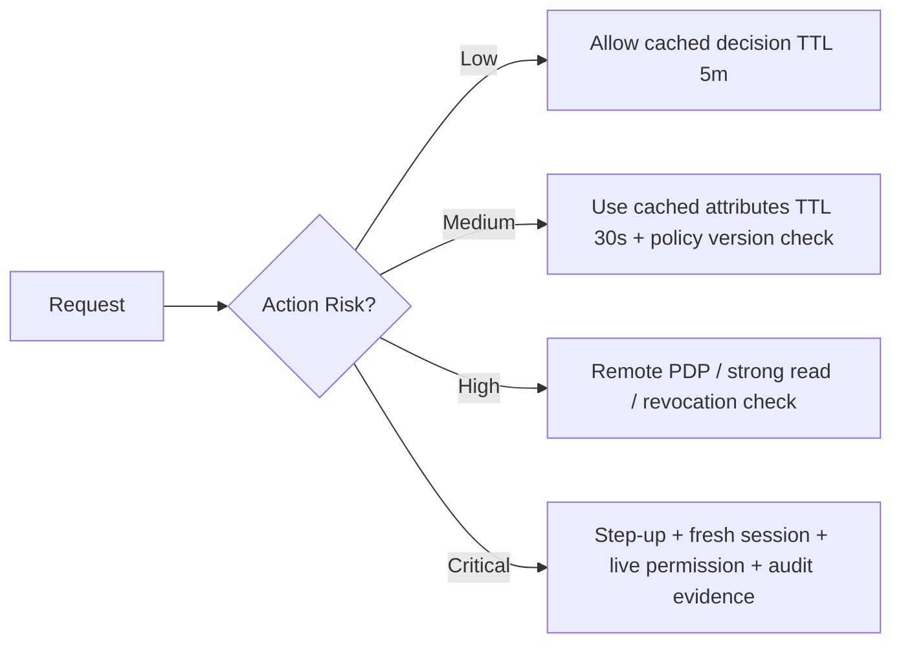
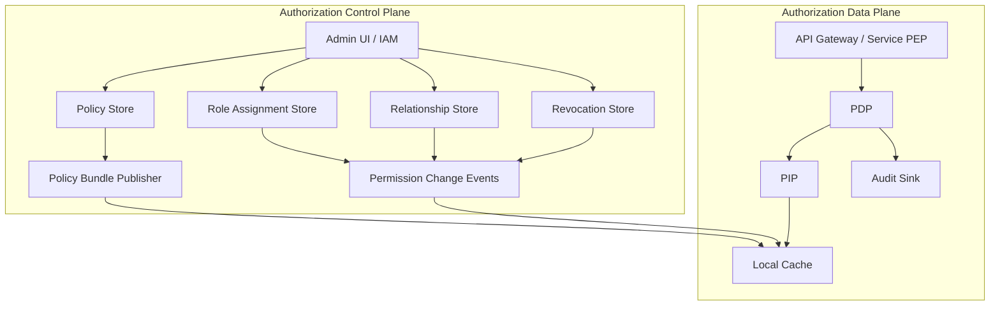
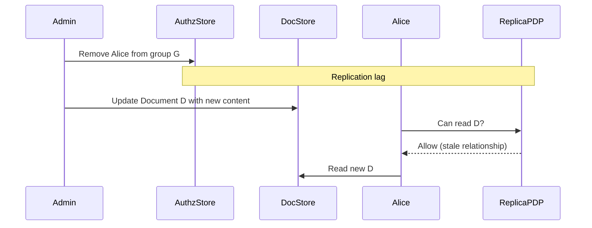
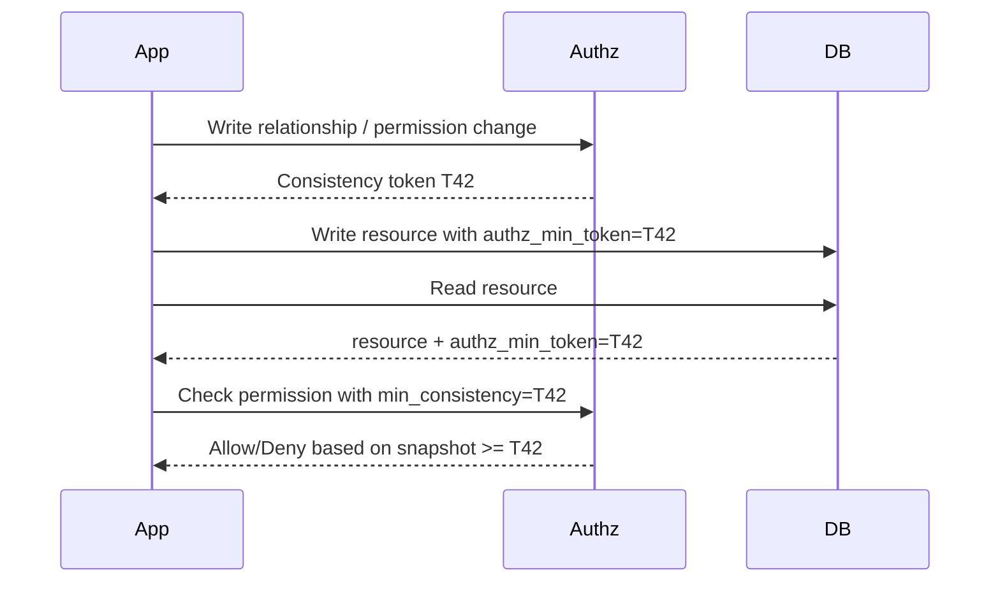
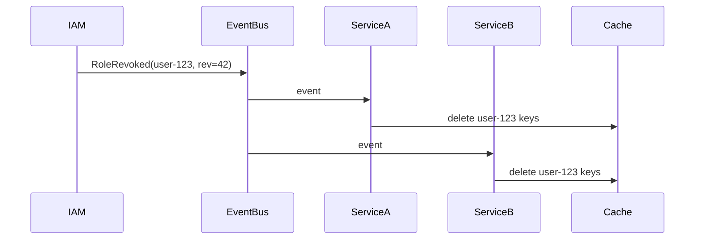
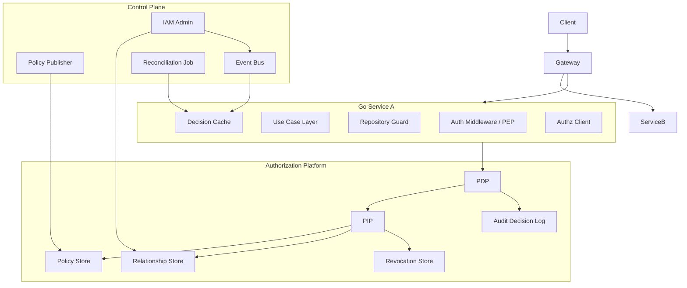
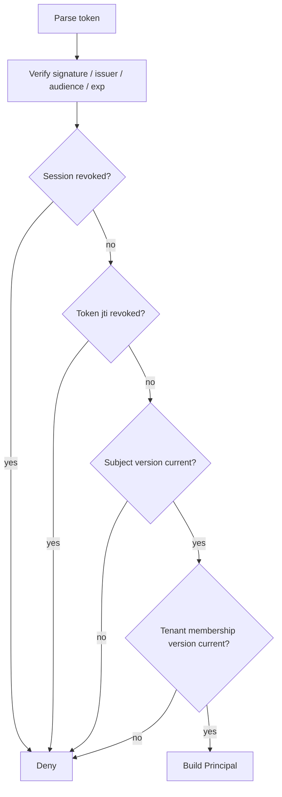
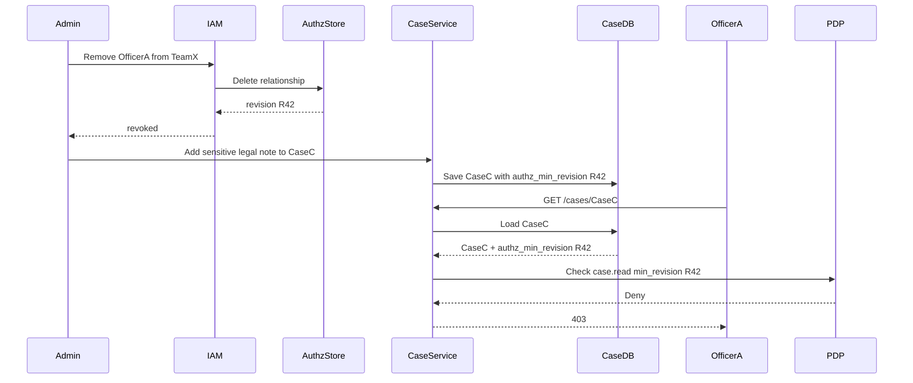

# learn-go-authentication-authorization-identity-permission-part-030.md

# Part 030 — Authorization in Distributed Systems: Caching, Consistency, Staleness, Revocation

> Seri: **Go Authentication, Authorization, Identity, Permission**  
> Target: Go hingga **1.26.x**  
> Level: Advanced / internal engineering handbook  
> Fokus: bagaimana authorization tetap benar ketika sistem sudah distributed, cached, replicated, asynchronous, multi-service, multi-tenant, dan high-throughput.

---

## Daftar Isi

1. [Tujuan Bagian Ini](#1-tujuan-bagian-ini)
2. [Masalah Besar: Authorization Bukan Fungsi Murni Lokal](#2-masalah-besar-authorization-bukan-fungsi-murni-lokal)
3. [Mental Model: Decision Freshness vs Decision Latency](#3-mental-model-decision-freshness-vs-decision-latency)
4. [Vocabulary Presisi](#4-vocabulary-presisi)
5. [Authorization Data Plane dan Control Plane](#5-authorization-data-plane-dan-control-plane)
6. [Invariants yang Harus Dijaga](#6-invariants-yang-harus-dijaga)
7. [Sumber Staleness dalam Sistem Distributed](#7-sumber-staleness-dalam-sistem-distributed)
8. [Authorization Caching: Apa yang Boleh Dicache dan Apa yang Berbahaya](#8-authorization-caching-apa-yang-boleh-dicache-dan-apa-yang-berbahaya)
9. [Decision Cache Key Design](#9-decision-cache-key-design)
10. [Permission Data Cache vs Decision Cache](#10-permission-data-cache-vs-decision-cache)
11. [Token TTL vs Policy Freshness](#11-token-ttl-vs-policy-freshness)
12. [Revocation Semantics](#12-revocation-semantics)
13. [Consistency Model untuk Authorization](#13-consistency-model-untuk-authorization)
14. [Read-Your-Writes untuk Permission Change](#14-read-your-writes-untuk-permission-change)
15. [The New Enemy Problem](#15-the-new-enemy-problem)
16. [Zookie/ZedToken/Consistency Token Pattern](#16-zookiezedtokenconsistency-token-pattern)
17. [Event-Driven Permission Propagation](#17-event-driven-permission-propagation)
18. [Invalidation Strategy](#18-invalidation-strategy)
19. [Handling Race Conditions](#19-handling-race-conditions)
20. [Go Reference Architecture](#20-go-reference-architecture)
21. [Go Domain Types](#21-go-domain-types)
22. [Decision Cache Implementation Sketch](#22-decision-cache-implementation-sketch)
23. [Revocation-Aware Token Validator](#23-revocation-aware-token-validator)
24. [Policy Versioning dan Decision Evidence](#24-policy-versioning-dan-decision-evidence)
25. [Cross-Service Authorization Context Propagation](#25-cross-service-authorization-context-propagation)
26. [Multi-Tenant Consistency Risk](#26-multi-tenant-consistency-risk)
27. [Workflow Authorization dan State Freshness](#27-workflow-authorization-dan-state-freshness)
28. [List Authorization, Search, Export, dan Reporting](#28-list-authorization-search-export-dan-reporting)
29. [Fail-Closed, Fail-Open, dan Degraded Mode](#29-fail-closed-fail-open-dan-degraded-mode)
30. [Observability](#30-observability)
31. [Testing Strategy](#31-testing-strategy)
32. [Performance Engineering](#32-performance-engineering)
33. [Failure Mode Matrix](#33-failure-mode-matrix)
34. [Case Study: Regulatory Case Management Platform](#34-case-study-regulatory-case-management-platform)
35. [Checklist Produksi](#35-checklist-produksi)
36. [Kesimpulan](#36-kesimpulan)
37. [Referensi Primer](#37-referensi-primer)

---

## 1. Tujuan Bagian Ini

Di part sebelumnya kita sudah membahas:

- authentication dan session;
- JWT/JWKS dan token lifecycle;
- OAuth/OIDC/federation;
- RBAC, permission modelling, ABAC, ReBAC, policy-as-code;
- multi-tenant auth;
- service-to-service auth;
- gRPC auth;
- gateway vs service-level authorization.

Sekarang masalahnya naik level:

> Bagaimana menjaga authorization tetap benar ketika permission, role, token, policy, resource state, tenant membership, session, dan cache berubah di waktu yang berbeda pada service yang berbeda?

Topik ini adalah salah satu pembeda besar antara engineer yang hanya bisa membuat authorization “jalan” dan engineer yang bisa membuat authorization **aman, scalable, audit-able, dan predictable** di produksi.

Di sistem sederhana, authorization sering terlihat seperti fungsi lokal:

```go
if user.Role == "admin" {
    allow()
}
```

Di sistem enterprise distributed, authorization decision biasanya bergantung pada banyak state:

```text
allow if:
  principal is authenticated
  token is valid
  session is active
  tenant is active
  user membership is active
  role assignment is active
  delegation is active
  policy version permits action
  resource exists
  resource belongs to tenant
  workflow stage allows action
  resource is not locked
  user is not suspended
  credential/session is not revoked
  assurance is fresh enough
  decision is not based on stale critical data
```

Semua state itu bisa berubah.

Masalahnya: perubahan itu tidak otomatis terlihat serentak di semua tempat.

---

## 2. Masalah Besar: Authorization Bukan Fungsi Murni Lokal

Authorization tampak seperti fungsi:

```text
Decision = f(subject, action, resource, context)
```

Tetapi di distributed system, input fungsi itu datang dari banyak sumber:

| Input | Contoh Sumber | Risiko |
|---|---|---|
| Subject | JWT, session store, IdP, service identity | token stale, session revoked, user disabled |
| Action | route, RPC method, command name | action mapping salah |
| Resource | database, search index, cache, object store | resource stale, tenant mismatch |
| Policy | local bundle, remote PDP, DB policy | policy version mismatch |
| Relationship | ReBAC store, group store, org tree | relationship replication lag |
| Attribute | HR system, risk engine, device posture, tenant config | attribute freshness tidak jelas |
| Environment | time, IP, network, region, assurance | context spoofing / missing |
| Revocation | token blacklist, session DB, grant store | revocation belum propagate |

Jadi realitasnya:

```text
Decision = f(
  subject_snapshot,
  resource_snapshot,
  policy_snapshot,
  relationship_snapshot,
  attribute_snapshot,
  revocation_snapshot,
  environment_snapshot
)
```

Setiap snapshot punya waktu, versi, dan confidence berbeda.

### Kesalahan mental model yang umum

Kesalahan paling sering:

> Menganggap “valid token” berarti “current authorization masih benar”.

Token yang valid secara signature belum tentu valid secara authorization. Token bisa masih cryptographically valid, tetapi:

- user sudah di-suspend;
- role sudah dicabut;
- tenant membership sudah berakhir;
- grant sudah revoked;
- resource sudah berpindah state;
- policy baru sudah melarang action;
- assurance sudah tidak fresh;
- session sudah logout;
- admin privilege sudah expired.

### Authorization correctness adalah masalah waktu

Pertanyaan authorization yang matang bukan hanya:

> “Boleh atau tidak?”

Tetapi:

> “Boleh atau tidak, berdasarkan data versi apa, seberapa fresh, dengan revocation latency maksimum berapa, dan apakah bukti keputusan itu bisa diaudit?”

---

## 3. Mental Model: Decision Freshness vs Decision Latency

Ada trade-off utama:

```text
Semakin fresh decision -> biasanya semakin tinggi latency dan dependency.
Semakin cepat decision -> biasanya semakin besar risiko staleness.
```

Contoh:

| Model | Latency | Freshness | Risiko |
|---|---:|---:|---|
| Local JWT claims only | sangat rendah | rendah | stale role/tenant/revocation |
| Local policy bundle + cached attributes | rendah | sedang | stale cache |
| Remote PDP tiap request | sedang/tinggi | tinggi | dependency/outage |
| Strong consistency permission store | tinggi | tinggi | throughput/cost |
| Hybrid dengan TTL dan invalidation | sedang | configurable | kompleksitas |

Top engineer tidak mencari “satu pattern terbaik”. Mereka menentukan **freshness budget** per action.

### Freshness budget

Freshness budget adalah batas maksimum seberapa tua data authorization yang masih bisa diterima.

Contoh:

| Action | Freshness Budget | Alasan |
|---|---:|---|
| lihat public metadata | 5–15 menit | dampak rendah |
| lihat case internal | 30–120 detik | data sensitif |
| update case status | 0–10 detik | integrity penting |
| approve enforcement action | near-real-time | high impact |
| admin impersonation | no stale grant | abuse risk tinggi |
| revoke user | immediate/bounded seconds | security event |
| export report | strict resource filtering | leakage massal |

Jangan menyamakan semua endpoint.



---

## 4. Vocabulary Presisi

### 4.1 Authorization decision

Hasil evaluasi apakah subject boleh melakukan action pada resource dalam context tertentu.

```json
{
  "effect": "allow",
  "subject": "user:123",
  "action": "case.approve",
  "resource": "case:987",
  "tenant": "tenant:cea",
  "policy_version": "2026-06-24.12",
  "resource_version": "v391",
  "relationship_revision": "zedtoken:abc",
  "evaluated_at": "2026-06-24T13:00:00Z"
}
```

### 4.2 Policy freshness

Seberapa baru policy yang dipakai PDP dibanding policy source of truth.

### 4.3 Attribute freshness

Seberapa baru attribute subject/resource/environment yang dipakai decision.

### 4.4 Relationship freshness

Seberapa baru graph relationship yang dipakai ReBAC/permission store.

### 4.5 Revocation latency

Waktu maksimum antara “hak dicabut” dan “semua enforcement point berhenti mengizinkan”.

### 4.6 Decision cache

Cache hasil `allow/deny` untuk request shape tertentu.

### 4.7 Data cache

Cache input decision, misalnya roles, permissions, user attributes, tenant membership, policy bundle.

### 4.8 Consistency token

Token opaque yang merepresentasikan snapshot/revision authorization data yang harus minimal terlihat oleh permission check berikutnya.

### 4.9 New Enemy Problem

Masalah ketika object/resource update dan ACL/permission update tidak terlihat dalam urutan yang sama oleh authorization check, sehingga user yang baru dicabut aksesnya masih dapat melihat resource versi baru.

---

## 5. Authorization Data Plane dan Control Plane

Authorization distributed harus dilihat sebagai dua plane.

### Control plane

Mengelola data dan policy:

- role assignment;
- permission grant;
- tenant membership;
- delegation;
- policy authoring;
- policy deployment;
- relationship tuple writes;
- revocation event;
- key/policy/config rollout.

### Data plane

Menjawab request runtime:

- validate token/session;
- resolve principal;
- resolve tenant/resource;
- evaluate permission;
- enforce decision;
- emit audit evidence.



Prinsipnya:

> Control plane boleh eventually consistent untuk banyak perubahan biasa, tetapi data plane harus tahu action mana yang memerlukan fresh/strong decision.

---

## 6. Invariants yang Harus Dijaga

### Invariant 1 — Deny by default

Jika authorization data tidak cukup untuk membuktikan allow, hasil aman adalah deny.

```text
Unknown != Allow
Missing attribute != Allow
PDP timeout != Allow, kecuali action masuk explicit fail-open allowlist
```

### Invariant 2 — Token claim bukan sumber kebenaran permission jangka panjang

JWT claim boleh dipakai sebagai snapshot, bukan authoritative source untuk permission high-risk.

### Invariant 3 — Revocation harus punya bounded latency

Harus ada angka jelas:

```text
Role revocation visible within <= 60 seconds
Session revocation visible within <= 10 seconds
Admin privilege revocation visible immediately or <= 5 seconds
```

Tanpa angka, sistem tidak punya SLO keamanan.

### Invariant 4 — Decision harus menyertakan evidence

Authorization decision harus dapat dijawab setelah kejadian:

- siapa subject;
- actor sebenarnya siapa;
- action apa;
- resource apa;
- tenant apa;
- policy versi apa;
- role/grant mana;
- attributes versi apa;
- decision allow/deny;
- kapan dievaluasi;
- PEP mana yang enforce.

### Invariant 5 — Permission check harus resource-aware

`hasPermission(user, "case.read")` tidak cukup untuk object sensitif.

Yang benar:

```text
can(user, "case.read", case:123, context)
```

### Invariant 6 — Cache harus mengenal tenant boundary

Cache key tanpa tenant adalah bug security.

### Invariant 7 — Authorization untuk write harus memvalidasi state saat commit

Untuk action yang mengubah state, check sebelum load tidak cukup. Harus ada check dekat dengan commit, atau optimistic concurrency/resource version check.

---

## 7. Sumber Staleness dalam Sistem Distributed

### 7.1 Token staleness

Access token sering membawa claims:

```json
{
  "sub": "user-123",
  "roles": ["case_officer"],
  "tenant": "cea",
  "iat": 1782300000,
  "exp": 1782303600
}
```

Jika role dicabut 1 menit setelah token diterbitkan, token tetap valid sampai `exp` kecuali ada revocation/introspection/session check.

### 7.2 Session staleness

Server-side session dapat lebih mudah dicabut, tetapi cache session di edge/service bisa stale.

### 7.3 Policy bundle staleness

OPA embedded atau local policy file bisa tertinggal dari policy store.

### 7.4 Relationship graph staleness

ReBAC store replicated. Check di replica yang belum melihat tuple delete bisa masih allow.

### 7.5 Search index staleness

Search/export sering membaca index, bukan database utama. Jika permission filter memakai index yang stale, data leakage bisa terjadi.

### 7.6 Cache staleness

Redis/local LRU/CDN/gateway authorizer cache bisa menyimpan allow terlalu lama.

### 7.7 Event propagation lag

Permission change event bisa delay, duplicate, out-of-order, atau gagal diproses.

### 7.8 Clock skew

`exp`, `nbf`, `iat`, session timeout, dan assurance freshness bergantung waktu. Clock skew dapat membuat token terlalu cepat diterima/ditolak.

### 7.9 Human workflow staleness

Resource workflow stage berubah, tetapi UI/API masih mengizinkan action lama.

Contoh:

```text
Case moved from DRAFT -> SUBMITTED.
Old UI tab still calls updateDraft().
Server checks only role, not workflow stage.
Result: unauthorized state mutation.
```

---

## 8. Authorization Caching: Apa yang Boleh Dicache dan Apa yang Berbahaya

Caching authorization bukan dosa. Di skala besar, caching sering wajib.

Yang berbahaya adalah caching tanpa:

- TTL;
- tenant boundary;
- policy version;
- resource version;
- principal version;
- revocation awareness;
- invalidation strategy;
- action risk classification.

### 8.1 Yang relatif aman dicache

| Item | Aman Jika | Catatan |
|---|---|---|
| JWKS | TTL pendek + background refresh + key pinning issuer | jangan trust `jku` dari token sembarang |
| Policy bundle | signed/versioned + rollout + decision logs | jangan silently fallback ke policy lama untuk critical action |
| Static permission registry | versioned | bukan assignment user |
| Public route metadata | static | tidak mengandung resource-specific allow |
| Deny decision | TTL pendek | hati-hati UX setelah grant baru |

### 8.2 Yang harus hati-hati dicache

| Item | Risiko |
|---|---|
| Allow decision | privilege tetap jalan setelah revoke |
| Role assignment | stale role |
| Tenant membership | cross-tenant access |
| Delegation grant | delegated access setelah expired/revoked |
| Impersonation right | support abuse |
| Admin privilege | high impact |
| Resource ownership | BOLA/IDOR |
| Workflow state | invalid transition |
| Risk score/device posture | stale trust |

### 8.3 Heuristic cache berdasarkan risk

```text
Low-risk read:       allow decision TTL 1-5 min mungkin acceptable.
Sensitive read:      cache input, bukan final decision; TTL 10-60s.
State-changing write: live/fresh check dekat commit.
Admin action:        no cached allow, require fresh privilege/session.
Break-glass:         fresh approval + immutable audit + no stale allow.
```

---

## 9. Decision Cache Key Design

Decision cache paling sering salah karena key terlalu sempit.

### 9.1 Cache key yang salah

```text
userID + action
```

Bug:

- tidak ada tenant;
- tidak ada resource;
- tidak ada policy version;
- tidak ada principal/session version;
- tidak ada assurance;
- tidak ada actor/delegation;
- tidak ada resource version/workflow state.

### 9.2 Cache key yang lebih aman

```text
subject_id
actor_id
tenant_id
action
resource_type
resource_id
resource_version_or_etag
policy_version
permission_revision
principal_version
session_auth_time_bucket
assurance_level
constraints_hash
```

### 9.3 Contoh Go type

```go
type DecisionCacheKey struct {
    SubjectID          string
    ActorID            string
    TenantID           string
    Action             string
    ResourceType       string
    ResourceID         string
    ResourceVersion    string
    PolicyVersion      string
    PermissionRevision string
    PrincipalVersion   string
    AssuranceLevel     string
    ContextHash        string
}
```

### 9.4 Jangan cache decision jika input high-cardinality tidak jelas

Jika decision bergantung pada attribute yang berubah cepat dan tidak dimasukkan ke key, cache bisa salah.

Contoh:

```text
allow if resource.status == DRAFT
```

Jika cache key tidak memasukkan `resource.status` atau `resource_version`, allow lama bisa dipakai setelah status berubah.

---

## 10. Permission Data Cache vs Decision Cache

Ada dua jenis cache utama.

### 10.1 Permission data cache

Menyimpan input:

```text
user -> role assignments
user -> tenant memberships
resource -> owner/team/org
policy bundle
relationship tuples
```

Kelebihan:

- lebih fleksibel;
- decision tetap dihitung ulang;
- bisa memasukkan resource state terbaru.

Kekurangan:

- butuh evaluasi ulang;
- PIP logic lebih kompleks.

### 10.2 Decision cache

Menyimpan hasil:

```text
(user, action, resource, context) -> allow/deny
```

Kelebihan:

- cepat;
- mengurangi PDP load;
- cocok untuk high-volume repeated reads.

Kekurangan:

- sangat mudah stale;
- invalidation sulit;
- berbahaya untuk write/admin/delegation.

### 10.3 Rekomendasi umum

| Use Case | Cache yang Disarankan |
|---|---|
| Dashboard count non-sensitive | decision cache pendek |
| Case detail sensitive | data cache + resource-level check |
| Submit/approve case | no cached allow / fresh check |
| Admin user management | live policy + revocation check |
| Report export | query-time authorization filter |
| Search | pre-filter by tenant + post-filter by resource permission |
| Worker processing | capability/job token + fresh job ownership check |

---

## 11. Token TTL vs Policy Freshness

### 11.1 JWT expiry bukan revocation guarantee

Access token dengan TTL 1 jam berarti permission claim di dalamnya bisa stale hingga 1 jam, kecuali:

- resource server melakukan introspection;
- resource server mengecek session/grant version;
- resource server mengecek revocation store;
- token berisi permission revision yang dibandingkan dengan server-side revision;
- token sender-constrained dan tetap saja policy freshness ditangani terpisah.

### 11.2 Short-lived token mengurangi tapi tidak menghilangkan risiko

TTL pendek mengurangi exposure window.

Namun untuk high-risk action, 5 menit pun bisa terlalu lama.

### 11.3 Token version pattern

Saat menerbitkan token, masukkan versi tertentu:

```json
{
  "sub": "user-123",
  "sid": "session-abc",
  "tenant": "cea",
  "authz_ver": "user-123:tenant-cea:v42",
  "policy_ver": "2026-06-24.3",
  "iat": 1782300000,
  "exp": 1782300300
}
```

Resource server cek:

```text
token.authz_ver == currentAuthzVersion(subject, tenant)
```

Jika tidak sama:

```text
return 401/403 or require token refresh/re-authz
```

### 11.4 Session version pattern

Session punya `security_version`.

Naikkan version saat:

- password change;
- MFA reset;
- role revoked;
- user suspended;
- tenant membership changed;
- session logout all;
- suspicious activity.

Resource server membandingkan token/session version dengan authoritative value.

---

## 12. Revocation Semantics

Revocation harus spesifik: apa yang dicabut?

### 12.1 Jenis revocation

| Revocation | Dampak |
|---|---|
| User disabled | semua session/token/grant user invalid |
| Session revoked | session tertentu invalid |
| Refresh token revoked | tidak bisa mint access token baru |
| Access token revoked | token tertentu invalid, sulit jika stateless |
| Role revoked | permission berbasis role hilang |
| Tenant membership revoked | akses tenant hilang |
| Delegation revoked | actor tidak bisa act on behalf |
| Admin elevation expired | admin action harus deny |
| Service credential revoked | service-to-service auth invalid |
| Policy revoked | decision memakai policy lama tidak valid |

### 12.2 Revocation strategy

| Strategy | Cocok Untuk | Trade-off |
|---|---|---|
| Short TTL only | low risk | revocation window tetap ada |
| Server-side session | human web app | store dependency |
| Token introspection | opaque token/API | latency ke AS |
| Revocation list by `jti` | targeted JWT revoke | storage/check overhead |
| Version check | user/session/tenant revoke | butuh authoritative lookup/cache |
| Event invalidation | distributed services | eventual, perlu retry/idempotency |
| Strong PDP check | critical action | latency/dependency tinggi |

### 12.3 Bounded revocation latency

Tuliskan SLO:

```yaml
revocation_slo:
  user_disabled: "<= 10s"
  session_logout: "<= 5s"
  role_removed: "<= 60s"
  tenant_membership_removed: "<= 30s"
  admin_elevation_expired: "<= 5s"
  service_credential_revoked: "<= 30s"
```

Tanpa SLO, tidak ada cara menguji apakah desain revocation cukup.

---

## 13. Consistency Model untuk Authorization

Tidak semua action butuh consistency yang sama.

### 13.1 Eventual consistency

Permission change akan terlihat setelah propagation.

Cocok untuk:

- low-risk UI display;
- non-sensitive feature flag;
- menu visibility;
- read model non-critical.

Tidak cukup untuk:

- revocation high-risk;
- user disabled;
- tenant boundary;
- admin/break-glass;
- sensitive write.

### 13.2 Read-your-writes

Setelah user/admin melakukan permission update, check berikutnya harus melihat update itu.

Contoh:

```text
Admin grants reviewer access to case.
Immediately open case detail.
System should allow.
```

Atau:

```text
Admin removes reviewer access.
Immediately check access.
System should deny.
```

### 13.3 Monotonic reads

Jika request sebelumnya sudah melihat permission version 42, request berikutnya tidak boleh dievaluasi dengan version 41.

### 13.4 Causal consistency

Jika perubahan resource dan perubahan permission terkait secara sebab-akibat, authorization check harus menghormati urutan itu.

### 13.5 Strong consistency

Check selalu melihat data terbaru.

Mahal, tetapi kadang dibutuhkan.

### 13.6 Practical consistency matrix

| Operation | Suggested Consistency |
|---|---|
| render menu | eventual |
| read own profile | session-local/current user check |
| read case detail | bounded stale / resource version aware |
| update case | fresh resource + permission check |
| approve enforcement action | strong/fresh + step-up |
| revoke user | strong write + global invalidation |
| export sensitive report | fresh tenant/resource permission |
| break-glass access | strong approval + no cached allow |

---

## 14. Read-Your-Writes untuk Permission Change

### 14.1 Problem

Admin menambah permission, tetapi request berikutnya masih deny karena cache/PDP belum update.

Atau lebih buruk:

Admin mencabut permission, tetapi request berikutnya masih allow.

### 14.2 Pattern: revision return

Saat permission write, return revision.

```go
type PermissionWriteResult struct {
    Revision string
}
```

Request berikutnya membawa minimum revision:

```http
X-Authz-Min-Revision: 0000000042
```

PDP harus memastikan decision memakai data minimal revision tersebut.

```go
type CheckRequest struct {
    SubjectID   string
    Action      string
    ResourceRef ResourceRef
    MinRevision string
}
```

Jika PDP belum mencapai revision:

```text
wait briefly / route to primary / return retryable unavailable / deny for critical action
```

### 14.3 Pattern: sticky consistency

Setelah permission update, user/admin diarahkan sementara ke PDP/read replica yang sudah melihat revision baru.

### 14.4 Pattern: write-through cache

Permission write juga memperbarui cache yang dipakai data plane.

Risiko:

- partial failure;
- cache update sukses, DB gagal;
- DB sukses, cache gagal;
- out-of-order update.

Gunakan outbox pattern jika memakai event propagation.

---

## 15. The New Enemy Problem

The New Enemy Problem adalah salah satu masalah paling penting dalam authorization distributed.

### 15.1 Skenario

1. Alice punya akses ke document D.
2. Alice dihapus dari group G.
3. Document D diperbarui dengan data baru yang Alice tidak boleh lihat.
4. Replica authorization belum melihat penghapusan Alice.
5. Alice membaca D versi baru.

Akibat: Alice melihat data yang dibuat setelah aksesnya dicabut.

### 15.2 Mengapa ini terjadi

Karena resource data dan permission data punya timeline berbeda.



### 15.3 Mengapa TTL saja tidak cukup

TTL 30 detik berarti Alice masih bisa melihat data baru selama 30 detik setelah revoke.

Untuk data sangat sensitif, itu tidak acceptable.

### 15.4 Solusi konseptual

Saat resource update terjadi setelah permission change, resource harus membawa minimum authorization revision yang harus terlihat oleh check.

```text
resource.authz_min_revision = revision_after_acl_change
```

Saat read:

```text
check permission at least at resource.authz_min_revision
```

---

## 16. Zookie/ZedToken/Consistency Token Pattern

Zanzibar memperkenalkan konsep zookie, token opaque yang merepresentasikan snapshot/revision authorization data. SpiceDB memakai konsep serupa bernama ZedToken.

### 16.1 Pattern umum



### 16.2 Go type

```go
type ConsistencyToken string

type ResourceEnvelope struct {
    TenantID         string
    ResourceType     string
    ResourceID       string
    Version          string
    AuthzMinRevision ConsistencyToken
}

type CheckRequest struct {
    Subject       SubjectRef
    Action        Action
    Resource      ResourceEnvelope
    Context       map[string]any
    MinConsistency ConsistencyToken
}
```

### 16.3 When to require token

Gunakan consistency token untuk:

- resource sensitive;
- object yang ACL-nya berubah sering;
- collaboration/group membership;
- cross-tenant share;
- document/case update setelah permission revocation;
- report/export yang membaca snapshot besar.

Tidak wajib untuk:

- public static content;
- menu rendering;
- purely cosmetic UI permission.

### 16.4 Caveat

Consistency token bukan magic. Ia harus:

- disimpan atomically bersama resource update jika diperlukan;
- diteruskan ke check;
- dihormati oleh PDP;
- masuk ke audit evidence.

---

## 17. Event-Driven Permission Propagation

Banyak sistem memakai event untuk propagate perubahan permission.

### 17.1 Contoh event

```json
{
  "event_id": "evt-123",
  "event_type": "RoleAssignmentRevoked",
  "tenant_id": "cea",
  "subject_id": "user-123",
  "role_id": "case_approver",
  "revision": "0000000042",
  "occurred_at": "2026-06-24T13:00:00Z"
}
```

### 17.2 Event consumer harus idempotent

```go
type AuthzEvent struct {
    EventID   string
    Type      string
    TenantID  string
    SubjectID string
    Revision  string
}

func (c *Consumer) Handle(ctx context.Context, ev AuthzEvent) error {
    if c.seen(ev.EventID) {
        return nil
    }
    if c.isOlderThanCurrent(ev.SubjectID, ev.Revision) {
        c.markSeen(ev.EventID)
        return nil
    }
    if err := c.invalidateSubject(ctx, ev.TenantID, ev.SubjectID); err != nil {
        return err
    }
    c.markSeen(ev.EventID)
    return nil
}
```

### 17.3 Out-of-order event

Event bisa datang:

```text
v43 before v42
```

Jangan blindly apply event berdasarkan arrival order. Gunakan revision.

### 17.4 Duplicate event

Event broker bisa at-least-once. Handler harus idempotent.

### 17.5 Lost event

Butuh reconciliation job:

```text
Every N minutes:
  compare local cache revision with source-of-truth revision
  repair stale entries
```

---

## 18. Invalidation Strategy

### 18.1 TTL-only

Simple tetapi revocation latency = TTL.

Cocok untuk low risk.

### 18.2 Event invalidation

Permission update mengirim event untuk menghapus cache.



Risiko:

- event delay;
- consumer down;
- invalidation tidak lengkap;
- key pattern salah;
- cache stampede.

### 18.3 Versioned cache

Daripada delete semua, cache key menyertakan version.

```text
authz:user-123:tenant-cea:v42:case.read:case-987
```

Saat revocation, current version naik ke v43. Entry v42 otomatis tidak dipakai.

Kelebihan:

- menghindari delete broad pattern;
- lebih aman terhadap missed invalidation;
- old keys expire via TTL.

Kekurangan:

- butuh lookup current version;
- key cardinality naik.

### 18.4 Negative cache

Deny bisa dicache pendek untuk mengurangi load.

Namun grant baru mungkin belum terlihat.

Gunakan TTL pendek dan revision-aware.

### 18.5 Hierarchical invalidation

Untuk multi-tenant:

```text
tenant version
subject version
resource version
policy version
relationship graph revision
```

Decision key menyertakan kombinasi versi.

---

## 19. Handling Race Conditions

### 19.1 TOCTOU authorization

Time-of-check-to-time-of-use:

```text
Check permission -> load resource -> resource state changes -> commit update
```

Solusi:

- check dekat commit;
- optimistic concurrency;
- DB transaction dengan resource version;
- re-check after lock;
- policy condition memakai current state.

### 19.2 Write command example

```go
func (s *CaseService) Approve(ctx context.Context, cmd ApproveCaseCommand) error {
    principal := MustPrincipal(ctx)

    // 1. Load current resource with version.
    caze, err := s.caseRepo.GetForUpdate(ctx, cmd.CaseID)
    if err != nil {
        return err
    }

    // 2. Authorize using current state.
    decision, err := s.authz.Check(ctx, CheckRequest{
        Subject: principal.Subject,
        Actor:   principal.Actor,
        TenantID: caze.TenantID,
        Action:  "case.approve",
        Resource: ResourceRef{
            Type:    "case",
            ID:      caze.ID,
            Version: caze.Version,
            State:   caze.Status,
        },
        Context: AuthzContext{
            AssuranceLevel: principal.Assurance.Level,
            AuthTime:       principal.AuthTime,
        },
    })
    if err != nil {
        return err
    }
    if !decision.Allow {
        return ErrPermissionDenied
    }

    // 3. Validate workflow transition.
    if caze.Status != "SUBMITTED" {
        return ErrInvalidState
    }

    // 4. Commit with optimistic version check.
    return s.caseRepo.ApproveIfVersion(ctx, caze.ID, caze.Version, principal.Subject.ID)
}
```

### 19.3 Permission removed during transaction

If permission revocation occurs after check but before commit, what happens?

Options:

1. Accept tiny race window.
2. Use serializable transaction with permission table.
3. Re-check just before commit.
4. Use short lease/capability minted for transaction.
5. Use command authorization service that owns both decision and command execution.

Choose based on risk.

---

## 20. Go Reference Architecture



### Package layout

```text
/internal/authn
  validator.go
  session.go

/internal/authz
  decision.go
  client.go
  cache.go
  revision.go
  middleware_http.go
  interceptor_grpc.go
  audit.go

/internal/iam
  role_assignment.go
  membership.go
  revocation.go

/internal/policy
  bundle.go
  version.go

/internal/caseapp
  usecase_approve.go
  repo_guard.go
```

Prinsip:

- `authn` menyelesaikan identity proof untuk request.
- `authz` menyelesaikan decision.
- use case layer tetap melakukan resource-aware authorization.
- repository guard mencegah query lintas tenant/object.
- audit decision log bukan optional untuk high-risk system.

---

## 21. Go Domain Types

### 21.1 Core decision types

```go
package authz

import "time"

type Effect string

const (
    EffectAllow Effect = "allow"
    EffectDeny  Effect = "deny"
)

type SubjectRef struct {
    Type string // user, service, job
    ID   string
}

type ActorRef struct {
    Type string
    ID   string
}

type ResourceRef struct {
    Type    string
    ID      string
    Tenant  string
    Version string
    State   string
}

type Action string

type Assurance struct {
    Level    string
    AuthTime time.Time
    Methods  []string
}

type RequestContext struct {
    RequestID       string
    TenantID        string
    IP              string
    UserAgent       string
    Assurance       Assurance
    PolicyVersion   string
    MinRevision     string
    Extra           map[string]string
}

type CheckRequest struct {
    Subject  SubjectRef
    Actor    ActorRef
    Action   Action
    Resource ResourceRef
    Context  RequestContext
}

type Evidence struct {
    PolicyVersion      string
    PermissionRevision string
    ResourceVersion    string
    RelationshipToken  string
    CacheStatus        string
    EvaluatedAt        time.Time
    PDP                string
}

type Decision struct {
    Effect      Effect
    ReasonCode  string
    Obligations []string
    Advice      []string
    Evidence    Evidence
}

func (d Decision) Allowed() bool { return d.Effect == EffectAllow }
```

### 21.2 Interface

```go
type Checker interface {
    Check(ctx context.Context, req CheckRequest) (Decision, error)
}
```

### 21.3 Error distinction

```go
var (
    ErrUnauthenticated = errors.New("unauthenticated")
    ErrPermissionDenied = errors.New("permission denied")
    ErrAuthzUnavailable = errors.New("authorization unavailable")
    ErrStaleAuthzData = errors.New("authorization data stale")
)
```

Jangan samakan:

- caller tidak dikenal;
- caller dikenal tapi tidak boleh;
- sistem authorization unavailable;
- data authorization terlalu stale.

---

## 22. Decision Cache Implementation Sketch

### 22.1 Interface cache

```go
type DecisionCache interface {
    Get(ctx context.Context, key DecisionCacheKey) (Decision, bool, error)
    Set(ctx context.Context, key DecisionCacheKey, decision Decision, ttl time.Duration) error
    InvalidateSubject(ctx context.Context, tenantID, subjectID string) error
    InvalidateResource(ctx context.Context, tenantID, resourceType, resourceID string) error
}
```

### 22.2 TTL policy

```go
type RiskLevel string

const (
    RiskLow      RiskLevel = "low"
    RiskMedium   RiskLevel = "medium"
    RiskHigh     RiskLevel = "high"
    RiskCritical RiskLevel = "critical"
)

type TTLPolicy struct{}

func (TTLPolicy) DecisionTTL(action Action, risk RiskLevel, effect Effect) time.Duration {
    if effect == EffectDeny {
        return 10 * time.Second
    }

    switch risk {
    case RiskLow:
        return 5 * time.Minute
    case RiskMedium:
        return 30 * time.Second
    case RiskHigh:
        return 0
    case RiskCritical:
        return 0
    default:
        return 0
    }
}
```

### 22.3 Cached checker

```go
type CachedChecker struct {
    Next      Checker
    Cache     DecisionCache
    Keyer     DecisionKeyer
    TTLPolicy TTLPolicy
    Risk      ActionRiskClassifier
}

func (c *CachedChecker) Check(ctx context.Context, req CheckRequest) (Decision, error) {
    risk := c.Risk.Classify(req.Action, req.Resource.Type)
    key := c.Keyer.Key(req)

    // Never cache high-risk allow decisions.
    if risk != RiskHigh && risk != RiskCritical {
        if decision, ok, err := c.Cache.Get(ctx, key); err == nil && ok {
            decision.Evidence.CacheStatus = "hit"
            return decision, nil
        }
    }

    decision, err := c.Next.Check(ctx, req)
    if err != nil {
        return Decision{}, err
    }

    ttl := c.TTLPolicy.DecisionTTL(req.Action, risk, decision.Effect)
    if ttl > 0 {
        _ = c.Cache.Set(ctx, key, decision, ttl)
    }

    decision.Evidence.CacheStatus = "miss"
    return decision, nil
}
```

### 22.4 Important nuance

Do not cache `allow` if request contains:

- impersonation;
- break-glass;
- admin privilege;
- approval action;
- money/legal/enforcement action;
- resource state mutation;
- explicit min revision;
- high-risk device/risk posture;
- recently changed permissions.

---

## 23. Revocation-Aware Token Validator

### 23.1 Why token validation alone is insufficient

JWT validation verifies:

- signature;
- issuer;
- audience;
- expiry;
- not-before;
- algorithm;
- key.

It does not automatically verify:

- session is still active;
- user is not disabled;
- tenant membership is current;
- role is still active;
- grant is not revoked;
- password/MFA reset has not invalidated session;
- token `jti` is not revoked.

### 23.2 Revocation service interface

```go
type RevocationChecker interface {
    IsSessionRevoked(ctx context.Context, sessionID string) (bool, error)
    IsTokenRevoked(ctx context.Context, tokenID string) (bool, error)
    CurrentSubjectVersion(ctx context.Context, subjectID string) (string, error)
    CurrentTenantMembershipVersion(ctx context.Context, subjectID, tenantID string) (string, error)
}
```

### 23.3 Token claims

```go
type AccessTokenClaims struct {
    SubjectID          string
    SessionID          string
    TokenID            string
    TenantID           string
    SubjectVersion     string
    MembershipVersion  string
    AuthzVersion       string
    IssuedAt           time.Time
    ExpiresAt          time.Time
}
```

### 23.4 Validator flow



### 23.5 Performance note

Doing all checks against primary DB on every request can be expensive.

Common hybrid:

- JWT cryptographic validation local;
- revocation/version check via low-latency cache;
- high-risk endpoints force fresh lookup;
- revocation events update cache;
- short token TTL limits stale window.

---

## 24. Policy Versioning dan Decision Evidence

### 24.1 Why policy version matters

Without policy version, you cannot answer:

> “Why was this action allowed yesterday?”

Because policy may have changed.

### 24.2 Policy version fields

```go
type PolicyMetadata struct {
    Version     string
    CommitSHA   string
    BundleHash  string
    PublishedAt time.Time
    ActivatedAt time.Time
    Author      string
    ApprovedBy  []string
}
```

### 24.3 Decision log

```json
{
  "decision_id": "dec-123",
  "request_id": "req-789",
  "effect": "allow",
  "subject": "user:123",
  "actor": "user:123",
  "tenant": "cea",
  "action": "case.approve",
  "resource": "case:987",
  "resource_version": "v17",
  "policy_version": "authz-policy-2026-06-24.3",
  "permission_revision": "0000000042",
  "cache_status": "miss",
  "pdp": "authz-pdp-a",
  "evaluated_at": "2026-06-24T13:00:00Z",
  "reason_code": "ROLE_AND_WORKFLOW_ALLOW"
}
```

### 24.4 Evidence completeness

For regulatory-grade systems, allow decision without evidence is weak.

You need enough to reconstruct:

- input;
- policy;
- resource state;
- principal state;
- cache/freshness;
- PDP identity;
- obligation applied.

---

## 25. Cross-Service Authorization Context Propagation

### 25.1 Problem

Service A authorizes request and calls Service B.

Bad pattern:

```text
Service B trusts Service A blindly.
```

Better:

- Service B authenticates Service A as workload.
- Service B receives end-user context or delegated capability.
- Service B performs its own authorization for its resource/action.

### 25.2 Propagation options

| Pattern | Description | Risk |
|---|---|---|
| Forward original access token | simple | audience mismatch/token leakage |
| Token exchange | downstream-scoped token | better, more complex |
| Signed internal auth context | efficient | must be audience-bound and short-lived |
| Capability token | least privilege | lifecycle/revocation required |
| Service-only auth | for backend job | loses end-user accountability |

### 25.3 Internal auth context

```go
type InternalAuthContext struct {
    SubjectID        string
    ActorID          string
    TenantID         string
    SessionID        string
    DelegationID     string
    AssuranceLevel   string
    AuthTime         time.Time
    AuthzRevision    string
    PolicyVersion    string
    ExpiresAt        time.Time
    Audience         string
}
```

### 25.4 Never propagate unchecked role strings

Bad:

```http
X-User-Roles: admin
```

Better:

- signed token;
- audience-bound;
- short TTL;
- issuer validated;
- service B re-checks resource-level permission.

---

## 26. Multi-Tenant Consistency Risk

Multi-tenant authorization makes staleness more dangerous.

### 26.1 Tenant membership revoke

If tenant membership is revoked but cache stale:

```text
user can still access tenant data
```

This is cross-tenant breach.

### 26.2 Tenant context switch

Decision cache must include active tenant.

Wrong:

```text
cache:user123:case.read:case987
```

Correct:

```text
cache:tenantCEA:user123:case.read:case987:tenantVersion42
```

### 26.3 Org tree changes

If user is moved from branch A to branch B, ABAC condition like `subject.branch in resource.allowedBranches` can be stale.

### 26.4 Tenant-level version

Maintain tenant authz version:

```text
tenant_authz_version[cea] = 104
```

Bump when:

- tenant disabled;
- org tree changed;
- tenant-wide role changed;
- tenant policy changed;
- cross-tenant trust changed.

---

## 27. Workflow Authorization dan State Freshness

Authorization often depends on workflow state.

Example:

```text
case.submit allowed only if case.status == DRAFT
case.approve allowed only if case.status == SUBMITTED
case.close allowed only if case.status == APPROVED
```

### 27.1 Never trust UI state

UI can be stale or manipulated.

Server must load current state.

### 27.2 State-aware permission check

```go
req := authz.CheckRequest{
    Subject: principal.Subject,
    Action:  "case.approve",
    Resource: authz.ResourceRef{
        Type:    "case",
        ID:      caze.ID,
        Tenant:  caze.TenantID,
        Version: caze.Version,
        State:   caze.Status,
    },
}
```

### 27.3 Commit-time validation

Use optimistic version:

```sql
UPDATE cases
SET status = 'APPROVED', version = version + 1
WHERE id = :id
  AND version = :expected_version
  AND status = 'SUBMITTED'
```

Authorization and state transition must be consistent.

---

## 28. List Authorization, Search, Export, dan Reporting

Per-object authorization is easy for detail page:

```text
GET /cases/123 -> check case:123
```

It is harder for list/search/export:

```text
GET /cases?status=open
```

### 28.1 Bad pattern

Load many rows, then filter in app:

```go
cases := repo.Search(ctx, query)
for _, c := range cases {
    if authz.CanRead(user, c) { result = append(result, c) }
}
```

Problems:

- expensive;
- pagination wrong;
- count wrong;
- timing side channel;
- accidental leakage via logs/errors/cache;
- export too large.

### 28.2 Better pattern: query-time authorization guard

Add authorization predicate to query.

```sql
SELECT c.*
FROM cases c
JOIN case_acl acl ON acl.case_id = c.id
WHERE c.tenant_id = :tenant_id
  AND acl.subject_id = :subject_id
  AND acl.permission = 'case.read'
  AND c.status = :status
ORDER BY c.created_at DESC
LIMIT :limit
```

### 28.3 Hybrid pattern

For complex ABAC/ReBAC:

1. coarse filter by tenant/org/team;
2. retrieve candidate IDs;
3. batch check with PDP;
4. fetch authorized subset;
5. stable pagination strategy.

### 28.4 Export must be stricter than list

Export often leaks at scale.

Require:

- explicit export permission;
- fresh authorization;
- async job capability;
- row-level filtering;
- audit reason;
- data minimization;
- expiry of generated file;
- revocation-aware download.

---

## 29. Fail-Closed, Fail-Open, dan Degraded Mode

### 29.1 Fail-closed default

If PDP unavailable:

```text
deny
```

For sensitive systems, this is usually correct.

### 29.2 Controlled fail-open

Some actions may fail-open if business continuity requires it.

Only with explicit policy:

```yaml
degraded_mode:
  allow:
    - action: health.read
    - action: public_metadata.read
    - action: own_session.logout
  deny:
    - action: case.approve
    - action: user.role.assign
    - action: report.export
```

### 29.3 Degraded decision evidence

If using stale policy/cache due to outage, log it.

```json
{
  "effect": "allow",
  "degraded_mode": true,
  "cache_age_seconds": 45,
  "reason_code": "ALLOW_FROM_STALE_LOW_RISK_CACHE"
}
```

### 29.4 Do not silently degrade critical actions

For critical actions:

- deny;
- queue for manual review;
- require break-glass;
- restrict to narrow emergency roles;
- log loudly.

---

## 30. Observability

Authorization observability should answer:

- how many decisions allow/deny;
- cache hit ratio;
- decision latency;
- stale decision count;
- PDP error rate;
- revocation propagation lag;
- policy version distribution;
- denied high-risk action attempts;
- cross-tenant deny count;
- fallback/degraded mode count;
- permission change to enforcement latency.

### 30.1 Metrics

```text
authz_decision_total{effect, action, tenant, resource_type}
authz_decision_latency_seconds{action, risk}
authz_cache_hit_total{cache, effect}
authz_cache_age_seconds{action}
authz_stale_decision_total{reason}
authz_pdp_error_total{error_type}
authz_revocation_lag_seconds{revocation_type}
authz_policy_version_active{service, version}
authz_degraded_decision_total{action}
```

### 30.2 Logs

Decision logs must avoid leaking sensitive attributes. Log IDs and versions, not full PII.

### 30.3 Tracing

Trace spans:

```text
request
  authn.validate_token
  authz.resolve_resource
  authz.check
    cache.get
    pdp.evaluate
    pip.resolve_attributes
  usecase.execute
  audit.write
```

### 30.4 Alert examples

```yaml
alerts:
  - name: HighPDPErrorRate
    condition: authz_pdp_error_rate > 1% for 5m
  - name: RevocationLagTooHigh
    condition: p95(authz_revocation_lag_seconds) > revocation_slo
  - name: DegradedCriticalDecision
    condition: authz_degraded_decision_total{risk="critical"} > 0
  - name: PolicyVersionSkew
    condition: more than 2 active policy versions for same service > 10m
```

---

## 31. Testing Strategy

### 31.1 Unit tests

Test evaluator:

- allow cases;
- deny cases;
- missing attributes;
- stale revisions;
- tenant mismatch;
- resource state mismatch;
- expired delegation;
- low assurance;
- revoked session.

### 31.2 Property tests

Invariant examples:

```text
If tenant mismatch, decision must never be allow.
If subject disabled, no action except logout can be allow.
If role revoked and revision is current, permission must be deny.
If resource status is CLOSED, update action must be deny.
```

### 31.3 Race tests

Simulate:

- revoke while requests in flight;
- role grant while cache negative;
- event out-of-order;
- PDP timeout;
- token refresh racing with session revoke;
- resource update racing with permission revoke.

### 31.4 Integration tests

Use real components where possible:

- Redis cache;
- message broker;
- policy bundle server;
- ReBAC store;
- database transaction;
- gRPC interceptors.

### 31.5 Chaos tests

Inject:

- event bus delay;
- dropped invalidation events;
- Redis outage;
- PDP outage;
- clock skew;
- policy bundle rollback;
- partial deployment with old policy version.

### 31.6 Golden decision tests

Maintain fixtures:

```text
input subject/action/resource/context -> expected decision/evidence
```

Use them for policy regression.

---

## 32. Performance Engineering

### 32.1 Latency budget

Example budget:

```text
p95 API request: 200ms
  token validation: 2ms local / 10ms with cache
  resource load: 30ms
  authz decision: 5-25ms
  business logic: 100ms
  audit enqueue: 5ms
```

### 32.2 Batch checks

For list/search:

```go
type BatchCheckRequest struct {
    Subject   SubjectRef
    Action    Action
    Resources []ResourceRef
    Context   RequestContext
}
```

Avoid N+1 remote PDP calls.

### 32.3 Singleflight

For cache miss storm:

```go
// Use singleflight.Group around expensive policy/permission fetch.
```

### 32.4 Precompute cautiously

Precomputed permission views help performance, but are dangerous if stale.

Use:

- versioned materialized views;
- reconciliation;
- bounded TTL;
- strict invalidation;
- no high-risk cached allow.

### 32.5 Hot path optimization

Optimize only after correctness:

1. define risk categories;
2. define freshness SLO;
3. measure PDP latency;
4. cache low-risk repeated checks;
5. batch list checks;
6. version/invalidate;
7. tune indexes.

---

## 33. Failure Mode Matrix

| Failure | Example | Impact | Mitigation |
|---|---|---|---|
| Stale role cache | role revoked but allow persists | privilege abuse | versioned cache + short TTL + invalidation |
| Stale tenant membership | removed tenant user can read data | cross-tenant leak | tenant version check + strict deny |
| PDP outage | service cannot decide | availability/security trade-off | fail-closed + low-risk degraded allowlist |
| Missed invalidation event | old allow remains | stale access | TTL + reconciliation + version check |
| Out-of-order events | v42 applied after v43 | rollback authz state | monotonic revision compare |
| Token TTL too long | revoked user keeps access | delayed revoke | short TTL + session/version check |
| Policy version skew | service A old policy, B new | inconsistent decision | rollout control + policy version metrics |
| Search index stale | result includes unauthorized item | data leak | query guard + post-filter + index authz revision |
| Cache key missing tenant | allow reused across tenant | severe breach | typed key + tests |
| Resource state stale | invalid workflow action allowed | integrity breach | load current state + version commit |
| Relationship graph stale | ReBAC allow after revoke | data leak | consistency token / min revision |
| Clock skew | token accepted too long | security window | NTP + small skew allowance + monitoring |
| Fail-open critical path | approve allowed during PDP outage | severe integrity breach | explicit degraded policy deny critical |
| Duplicate event | repeated invalidation | load spike | idempotent consumer |
| Admin elevation cache | expired admin still privileged | admin abuse | no cached allow for admin elevation |

---

## 34. Case Study: Regulatory Case Management Platform

### 34.1 Context

System:

- multi-tenant regulatory agency;
- case management;
- enforcement lifecycle;
- appeals;
- legal review;
- document repository;
- report export;
- external identity federation;
- admin impersonation;
- service-to-service workflows.

### 34.2 Entities

```text
User
Officer
Agency
Division
Team
Case
Document
Appeal
EnforcementAction
ReportExportJob
RoleAssignment
Delegation
PolicyVersion
AuthzRevision
```

### 34.3 Critical actions

| Action | Risk | Freshness Requirement |
|---|---|---|
| case.read | medium/high | bounded stale, tenant strict |
| case.update | high | fresh resource state |
| case.approve | critical | fresh permission + step-up |
| enforcement.issue | critical | strong/fresh + audit |
| report.export | high/critical | fresh row-level auth |
| user.impersonate | critical | no cached allow |
| role.assign | critical | dual control |
| document.download | high | resource-level auth + revocation-aware URL |

### 34.4 Permission revoke scenario

Scenario:

- Officer A removed from Team X.
- Team X owns Case C.
- Case C updated with sensitive legal note.
- Officer A must not see the new note.

Design:

1. IAM write removes relationship `team:X#member@user:A`.
2. Authz store returns revision `R42`.
3. Case update stores `authz_min_revision=R42`.
4. Read Case C requires check with `min_revision >= R42`.
5. PDP that cannot satisfy R42 must not allow.
6. Decision log records relationship revision.

### 34.5 Mermaid sequence



### 34.6 Report export scenario

Export should not reuse UI list authorization blindly.

Design:

- create export job requires `report.export` permission;
- job token/capability includes subject, tenant, query, expiry, authz revision;
- worker re-checks capability;
- query guard enforces tenant and allowed resource scope;
- generated file is encrypted, short-lived, and bound to subject/session;
- download requires fresh check or valid short-lived capability;
- audit stores row count, query hash, policy version.

---

## 35. Checklist Produksi

### Design checklist

- [ ] Apakah setiap decision punya subject, actor, tenant, action, resource, context?
- [ ] Apakah action risk sudah diklasifikasikan?
- [ ] Apakah tiap risk punya freshness budget?
- [ ] Apakah token TTL sesuai revocation requirement?
- [ ] Apakah high-risk action melakukan fresh permission check?
- [ ] Apakah admin/break-glass action tidak memakai cached allow?
- [ ] Apakah tenant selalu masuk cache key?
- [ ] Apakah resource version/state masuk decision untuk write?
- [ ] Apakah policy version masuk evidence?
- [ ] Apakah permission/relationship revision masuk evidence?
- [ ] Apakah revocation SLO tertulis?
- [ ] Apakah event invalidation idempotent?
- [ ] Apakah out-of-order event ditangani?
- [ ] Apakah reconciliation job ada?
- [ ] Apakah degraded mode explicit dan action-scoped?
- [ ] Apakah fail-open tidak berlaku untuk critical action?
- [ ] Apakah list/search/export punya query-time authorization?
- [ ] Apakah audit log cukup untuk forensic reconstruction?

### Go implementation checklist

- [ ] Typed `CheckRequest`, bukan map/string bebas.
- [ ] Typed `Decision`, `Evidence`, `Effect`.
- [ ] Auth context tidak memakai raw string key sembarangan.
- [ ] Middleware hanya membentuk principal, bukan menggantikan resource authorization.
- [ ] Use case layer melakukan resource-aware check.
- [ ] Repository guard mencegah tenant leak.
- [ ] Cache key typed dan diuji.
- [ ] Revocation checker punya timeout jelas.
- [ ] PDP error dibedakan dari deny.
- [ ] Audit write tidak membocorkan PII.
- [ ] Batch check tersedia untuk list/search.
- [ ] Race tests untuk revoke/update tersedia.

### Operational checklist

- [ ] Dashboard authz latency.
- [ ] Dashboard cache hit/miss.
- [ ] Dashboard policy version skew.
- [ ] Dashboard revocation lag.
- [ ] Alert degraded critical decision.
- [ ] Alert stale decision above SLO.
- [ ] Runbook PDP outage.
- [ ] Runbook event bus outage.
- [ ] Runbook emergency role revoke.
- [ ] Runbook policy rollback.

---

## 36. Kesimpulan

Authorization di distributed system bukan sekadar `Can(user, action)`.

Ia adalah masalah:

- waktu;
- versi;
- snapshot;
- cache;
- consistency;
- revocation;
- policy rollout;
- tenant boundary;
- resource state;
- workflow correctness;
- audit evidence.

Prinsip terpenting:

1. **Valid token bukan bukti current permission.**
2. **Cache harus punya risk model, TTL, version, dan invalidation.**
3. **High-risk action harus fresh.**
4. **Revocation harus punya bounded latency.**
5. **Permission decision harus resource-aware.**
6. **Distributed authorization butuh consistency strategy, bukan harapan.**
7. **Audit decision harus menyimpan evidence versi/snapshot.**
8. **List/search/export lebih berbahaya daripada detail page.**
9. **Fail-open harus explicit, sempit, dan tidak untuk critical action.**
10. **Top engineer mendesain authorization sebagai system, bukan helper function.**

Jika bagian ini dipahami, desain authorization enterprise akan naik kelas: dari sekadar “role check” menjadi **decision platform** yang bisa diuji, diaudit, diskalakan, dan dipertanggungjawabkan.

---

## 37. Referensi Primer

1. Go 1.26 Release Notes — https://go.dev/doc/go1.26
2. OWASP Authorization Cheat Sheet — https://cheatsheetseries.owasp.org/cheatsheets/Authorization_Cheat_Sheet.html
3. OWASP Broken Access Control — https://owasp.org/www-community/Broken_Access_Control
4. NIST SP 800-207 Zero Trust Architecture — https://csrc.nist.gov/publications/detail/sp/800-207/final
5. Zanzibar: Google's Consistent, Global Authorization System — https://research.google/pubs/zanzibar-googles-consistent-global-authorization-system/
6. Authzed SpiceDB Consistency Docs — https://authzed.com/docs/spicedb/concepts/consistency
7. Authzed Read-After-Write Consistency — https://authzed.com/docs/spicedb/concepts/read-after-write
8. OpenFGA Concepts — https://openfga.dev/docs/concepts
9. OpenFGA Immutable Authorization Models — https://openfga.dev/docs/getting-started/immutable-models
10. Open Policy Agent Decision Logs — https://openpolicyagent.org/docs/management-decision-logs
11. Open Policy Agent Bundles — https://openpolicyagent.org/docs/management-bundles
12. OPA Go SDK — https://pkg.go.dev/github.com/open-policy-agent/opa/v1/sdk

---

## Status Seri

Seri **belum selesai**.

Lanjut berikutnya:

```text
learn-go-authentication-authorization-identity-permission-part-031.md
```

Topik berikutnya:

```text
Auditability & Regulatory Defensibility: Who Did What, As Whom, Under Which Authority
```

<!-- NAVIGATION_FOOTER -->
<div class="page-nav">
<a href="./learn-go-authentication-authorization-identity-permission-part-029.md">⬅️ Part 029 — API Gateway vs Service-Level Authorization: Boundary Design</a>
<a href="./index.md">📚 Kategori</a>
<a href="../../index.md">🏠 Home</a>
<a href="./learn-go-authentication-authorization-identity-permission-part-031.md">Part 031 — Auditability & Regulatory Defensibility: Who Did What, As Whom, Under Which Authority ➡️</a>
</div>
