# learn-go-authentication-authorization-identity-permission-part-031.md

# Part 031 — Auditability & Regulatory Defensibility: Who Did What, As Whom, Under Which Authority

> Seri: `learn-go-authentication-authorization-identity-permission`  
> Level: Advanced / internal engineering handbook  
> Target: Go 1.26.x  
> Fokus: auditability, evidence design, authorization decision logging, regulatory defensibility, forensic reconstruction, and Go implementation architecture.

---

## Daftar Isi

1. [Tujuan Part Ini](#1-tujuan-part-ini)
2. [Kenapa Auditability Berbeda dari Logging Biasa](#2-kenapa-auditability-berbeda-dari-logging-biasa)
3. [Mental Model: Audit Sebagai Evidence System](#3-mental-model-audit-sebagai-evidence-system)
4. [Pertanyaan Inti yang Harus Bisa Dijawab](#4-pertanyaan-inti-yang-harus-bisa-dijawab)
5. [Terminologi Presisi](#5-terminologi-presisi)
6. [Audit Event Taxonomy untuk Auth System](#6-audit-event-taxonomy-untuk-auth-system)
7. [Design Invariants](#7-design-invariants)
8. [Regulatory Defensibility Model](#8-regulatory-defensibility-model)
9. [Trust Boundary dan Threat Model Audit](#9-trust-boundary-dan-threat-model-audit)
10. [Reference Architecture](#10-reference-architecture)
11. [Canonical Audit Event Schema](#11-canonical-audit-event-schema)
12. [Actor, Subject, Principal, Session, dan Authority Snapshot](#12-actor-subject-principal-session-dan-authority-snapshot)
13. [Authorization Decision Evidence](#13-authorization-decision-evidence)
14. [Where to Emit Audit Events](#14-where-to-emit-audit-events)
15. [Synchronous vs Asynchronous Audit Write](#15-synchronous-vs-asynchronous-audit-write)
16. [Transactional Outbox untuk Audit](#16-transactional-outbox-untuk-audit)
17. [Integrity Protection: Hash Chain, Signature, WORM](#17-integrity-protection-hash-chain-signature-worm)
18. [Privacy, PII, Secrets, dan Data Minimization](#18-privacy-pii-secrets-dan-data-minimization)
19. [Go Package Architecture](#19-go-package-architecture)
20. [Go Domain Types](#20-go-domain-types)
21. [Go Audit Writer Interface](#21-go-audit-writer-interface)
22. [HTTP dan gRPC Enforcement Integration](#22-http-dan-grpc-enforcement-integration)
23. [Audit untuk Impersonation, Delegation, dan Break-Glass](#23-audit-untuk-impersonation-delegation-dan-break-glass)
24. [Audit untuk Policy Change dan Permission Change](#24-audit-untuk-policy-change-dan-permission-change)
25. [Audit untuk Data Access, Export, Report, dan Search](#25-audit-untuk-data-access-export-report-dan-search)
26. [Audit Query Model dan Investigation UX](#26-audit-query-model-dan-investigation-ux)
27. [Retention, Legal Hold, dan Data Lifecycle](#27-retention-legal-hold-dan-data-lifecycle)
28. [Operational Failure Modes](#28-operational-failure-modes)
29. [Testing Strategy](#29-testing-strategy)
30. [Performance dan Scalability](#30-performance-dan-scalability)
31. [Anti-Patterns](#31-anti-patterns)
32. [Case Study: Regulatory Case Management](#32-case-study-regulatory-case-management)
33. [Production Checklist](#33-production-checklist)
34. [Review Questions](#34-review-questions)
35. [Ringkasan](#35-ringkasan)
36. [Sumber Primer](#36-sumber-primer)

---

## 1. Tujuan Part Ini

Part ini membahas desain audit untuk sistem authentication, authorization, identity, permission, session, federation, service identity, multi-tenant access, dan administrative access di Go.

Target setelah membaca part ini:

1. Bisa membedakan **log operasional**, **security event**, **audit record**, dan **authorization evidence**.
2. Bisa mendesain event schema yang cukup kuat untuk investigasi dan regulatory review.
3. Bisa menjawab pertanyaan: **who did what, as whom, under which authority, against which resource, in which tenant, using which policy version, at what time**.
4. Bisa membangun audit writer di Go yang tidak mengotori domain logic tetapi tetap tidak kehilangan context.
5. Bisa menentukan event mana yang harus ditulis secara sinkron, asinkron, atau transaction-bound.
6. Bisa memahami failure mode seperti audit tampering, dropped events, stale claims, policy version drift, hidden impersonation, dan tenant leakage.
7. Bisa mendesain audit trail yang berguna untuk forensik, compliance, dan dispute resolution tanpa membocorkan secret/PII secara berlebihan.

Yang tidak akan diulang dari seri sebelumnya:

- Detail logging framework umum.
- Detail observability, tracing, profiling.
- Detail SQL tuning.
- Detail cryptographic primitive.
- Detail HTTP/gRPC dasar.

Kita akan fokus pada audit sebagai **evidence system** dalam authorization architecture.

---

## 2. Kenapa Auditability Berbeda dari Logging Biasa

Banyak engineer mencampur audit dengan logging.

Itu berbahaya.

Logging biasa menjawab:

> “Apa yang terjadi di aplikasi?”

Auditability menjawab:

> “Apakah kita bisa membuktikan, secara konsisten dan dapat dipertanggungjawabkan, siapa melakukan tindakan apa, dengan authority apa, pada resource apa, dalam konteks apa, dan apakah tindakan itu valid menurut aturan saat itu?”

Perbedaannya:

| Aspek | Log Operasional | Security Event | Audit Record | Authorization Evidence |
|---|---|---|---|---|
| Tujuan | Debugging/operasi | Deteksi ancaman | Akuntabilitas | Rekonstruksi keputusan access control |
| Contoh | request latency, DB timeout | failed login spike | user changed role | `ALLOW submit_case` because policy `v42` matched role `supervisor` |
| Retensi | pendek-menengah | menengah | panjang | panjang / sesuai kebutuhan hukum |
| Format | sering bebas | structured | strongly structured | strongly structured + policy/evidence snapshot |
| Mutability | bisa rotate/delete | harus dilindungi | harus append-only | sebaiknya tamper-evident |
| Konsumen | engineer/SRE | security team | auditor/compliance | auditor, investigator, legal, incident responder |

Internal engineering principle:

> Logs help you understand systems. Audit records help you defend decisions.

---

## 3. Mental Model: Audit Sebagai Evidence System

Audit system yang matang bukan “tempat menyimpan text log”.

Audit system adalah pipeline evidence.

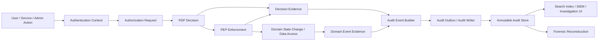

Audit evidence harus dipahami sebagai gabungan dari:

1. **Identity evidence** — siapa caller-nya?
2. **Authentication evidence** — bagaimana dia diautentikasi?
3. **Session evidence** — session/device/client apa yang dipakai?
4. **Authority evidence** — role, grant, delegation, capability, policy, entitlement apa yang memberi authority?
5. **Decision evidence** — kenapa allow/deny?
6. **Resource evidence** — object apa yang disentuh?
7. **State evidence** — before/after atau referensi snapshot apa?
8. **Temporal evidence** — kapan terjadi dan policy versi berapa yang berlaku?
9. **Integrity evidence** — apakah audit record bisa dipercaya dan belum diubah?

---

## 4. Pertanyaan Inti yang Harus Bisa Dijawab

Untuk setiap aksi penting, sistem audit harus bisa menjawab:

### 4.1 Who?

- user ID lokal
- external identity subject
- service identity
- client ID
- admin/support ID
- workload ID
- device/session ID

### 4.2 Did what?

- action name
- command name
- API route/method
- business action
- resource operation
- workflow transition

Contoh buruk:

```text
User clicked button.
```

Contoh lebih baik:

```text
case.submit_application
case.approve_enforcement_notice
permission.assign_role
session.revoke
credential.reset_mfa
report.export_sensitive_case_listing
```

### 4.3 As whom?

Ini penting untuk impersonation, delegation, service-to-service, background job, dan support access.

Contoh:

```text
Actor: support-user-123
Subject: agency-user-987
Acting mode: impersonation
Approved by: support-manager-456
Reason: ticket INC-2026-1182
```

Tanpa pemisahan actor dan subject, audit trail akan salah menuduh user yang di-impersonate.

### 4.4 Under which authority?

Harus bisa menjawab authority source:

- role assignment
- permission grant
- delegated authority
- capability token
- OAuth scope
- OIDC assurance claim
- service account grant
- break-glass approval
- policy rule
- workflow ownership
- tenant membership

### 4.5 Against what?

- resource type
- resource ID
- tenant ID
- resource owner
- parent resource
- classification
- workflow stage
- data sensitivity

### 4.6 Why was it allowed or denied?

Harus punya structured reason, bukan text bebas.

Contoh:

```json
{
  "effect": "ALLOW",
  "reason_code": "ROLE_PERMISSION_MATCH",
  "matched_policy_id": "policy-case-submit-v42",
  "matched_rule_id": "rule-supervisor-submit-draft-case",
  "required_permissions": ["case.submit"],
  "granted_permissions": ["case.submit", "case.read"],
  "constraints": {
    "tenant_match": true,
    "workflow_stage": "DRAFT",
    "aal_at_least": 2
  }
}
```

### 4.7 When?

Minimal:

- occurred_at: waktu kejadian domain
- recorded_at: waktu audit diterima/ditulis
- request_received_at
- decision_at
- policy_effective_at

### 4.8 From where?

- IP address, dengan caveat proxy chain
- user agent
- client app
- device binding ID
- service identity
- region/zone
- ingress gateway
- network trust zone

### 4.9 Under which version?

- service version
- policy version
- schema version
- authorization model version
- role catalog version
- resource snapshot version
- decision engine version

Tanpa versioning, audit hanya bisa berkata “saat ini user tidak punya akses”, bukan “pada saat itu user diberi akses oleh policy tertentu”.

---

## 5. Terminologi Presisi

### 5.1 Event

Sesuatu yang terjadi.

Contoh:

```text
login.succeeded
case.submitted
role.assigned
```

### 5.2 Audit event

Event terstruktur yang didesain untuk akuntabilitas dan investigasi.

### 5.3 Security event

Event yang relevan untuk keamanan.

Contoh:

```text
login.failed
mfa.challenge.failed
token.reuse_detected
cross_tenant_access_denied
```

### 5.4 Authorization decision log

Record tentang keputusan access control.

Contoh:

```text
ALLOW actor A to perform action X on resource R because rule Y matched.
```

### 5.5 Evidence snapshot

Snapshot context yang diperlukan untuk merekonstruksi event di masa depan.

Contoh:

- actor snapshot
- subject snapshot
- claims snapshot
- policy version
- role assignment version
- tenant context
- resource classification

### 5.6 Audit trail

Rangkaian audit records yang dapat ditelusuri.

### 5.7 Tamper-evident

Jika record diubah, perubahan dapat terdeteksi.

### 5.8 Tamper-resistant

Sistem didesain agar record sulit diubah oleh aktor tidak berwenang.

### 5.9 Non-repudiation

Kemampuan untuk mengurangi kemungkinan pihak menyangkal aksi yang dilakukan. Dalam sistem aplikasi, non-repudiation tidak hanya soal signature; ia juga membutuhkan identity proofing, authentication assurance, session integrity, audit integrity, dan operational controls.

---

## 6. Audit Event Taxonomy untuk Auth System

Audit taxonomy harus stabil, eksplisit, dan bisa dipakai untuk query.

### 6.1 Authentication events

```text
auth.login.started
auth.login.succeeded
auth.login.failed
auth.login.step_up_required
auth.login.step_up_succeeded
auth.login.step_up_failed
auth.logout.succeeded
auth.account_locked
auth.account_unlocked
```

### 6.2 Credential lifecycle events

```text
credential.password.created
credential.password.changed
credential.password.reset_requested
credential.password.reset_completed
credential.mfa.enrolled
credential.mfa.removed
credential.passkey.registered
credential.passkey.removed
credential.recovery_code.generated
credential.recovery_code.used
credential.compromised_detected
```

### 6.3 Session events

```text
session.created
session.rotated
session.revoked
session.expired
session.reauthenticated
session.concurrent_limit_exceeded
```

### 6.4 Token lifecycle events

```text
token.issued
token.refreshed
token.refresh_reuse_detected
token.revoked
token.introspection.performed
token.exchange.performed
```

### 6.5 Authorization decision events

```text
authz.decision.allowed
authz.decision.denied
authz.decision.error
authz.decision.degraded
authz.decision.cache_hit
authz.decision.cache_miss
```

Cache hit/miss tidak selalu harus menjadi audit event panjang; biasanya lebih cocok sebagai metric/log. Namun untuk high-risk action, mencatat apakah decision memakai cached result bisa penting.

### 6.6 Permission administration events

```text
permission.role.created
permission.role.updated
permission.role.deleted
permission.role.assigned
permission.role.revoked
permission.policy.published
permission.policy.rolled_back
permission.grant.created
permission.grant.revoked
permission.sod.violation_detected
```

### 6.7 Delegation, impersonation, break-glass

```text
delegation.created
delegation.accepted
delegation.revoked
impersonation.started
impersonation.ended
break_glass.requested
break_glass.approved
break_glass.used
break_glass.ended
```

### 6.8 Data access events

```text
data.case.viewed
data.case.updated
data.document.downloaded
data.report.generated
data.report.exported
data.search.performed
data.bulk_export.performed
```

### 6.9 Federation events

```text
federation.login.succeeded
federation.login.failed
federation.account_linked
federation.account_unlinked
federation.claim_mapping_changed
federation.metadata_refreshed
federation.jit_provisioned
```

### 6.10 Service identity events

```text
workload.token.issued
workload.certificate.rotated
service.client_credentials.used
service.mtls.peer_authenticated
service.authz.denied
```

---

## 7. Design Invariants

### Invariant 1 — Audit records must be structured

Audit yang hanya berupa string sulit dicari, sulit dianalisis, sulit divalidasi, dan sulit dipertanggungjawabkan.

Buruk:

```text
User fajar submitted something at 10pm.
```

Baik:

```json
{
  "event_type": "case.submitted",
  "actor_id": "usr_123",
  "subject_id": "usr_123",
  "tenant_id": "tenant_cea",
  "resource_type": "case",
  "resource_id": "case_456",
  "action": "case.submit",
  "decision_effect": "ALLOW",
  "policy_version": "authz-policy-2026-06-24.3"
}
```

### Invariant 2 — Actor and subject must be separated

Actor adalah pihak yang melakukan aksi. Subject adalah identity atas nama siapa aksi dilakukan.

Normal user action:

```text
actor = subject = user A
```

Impersonation:

```text
actor = support admin
subject = target user
```

Delegation:

```text
actor = delegate
subject = original authority holder / represented party
```

Service acting for user:

```text
actor = service identity
subject = human user / tenant / job owner
```

### Invariant 3 — Tenant context must be first-class

Untuk sistem multi-tenant, audit event tanpa tenant ID hampir selalu cacat.

Minimal:

```text
tenant_id
active_tenant_id
resource_tenant_id
actor_tenant_membership
cross_tenant_mode
```

### Invariant 4 — Do not reconstruct historical authority from current state

Kesalahan besar:

> “Untuk audit, nanti kita query role user sekarang.”

Itu salah karena role bisa berubah.

Audit harus menyimpan authority evidence saat decision dibuat:

- matched role assignment ID
- role assignment version
- permission grant version
- policy ID/version
- entitlement version
- delegation ID
- capability token ID
- assurance level saat itu

### Invariant 5 — Authorization decision must be auditable even on deny

Deny event penting untuk:

- brute force permission probing
- BOLA/IDOR attempts
- tenant breakout attempts
- insider misuse
- misconfigured policy investigation

Namun deny logging harus dikontrol agar tidak menjadi noise explosion.

### Invariant 6 — Audit must not store secrets

Jangan simpan:

- password
- OTP
- recovery code plaintext
- refresh token plaintext
- access token plaintext
- ID token plaintext
- authorization code
- session cookie
- private key
- full API key

Jika perlu referensi token, simpan:

- token hash/fingerprint
- token family ID
- grant ID
- session ID hashed
- key ID

### Invariant 7 — Audit access is also audited

Membaca audit trail sendiri adalah high-risk action.

Harus ada event seperti:

```text
audit.record.viewed
audit.query.executed
audit.export.performed
audit.retention_changed
audit.legal_hold_applied
```

### Invariant 8 — Audit should be append-only

Jangan update audit record lama kecuali untuk metadata yang jelas dipisahkan, misalnya indexing status.

Jika perlu koreksi, buat compensating event:

```text
audit.record.corrected
```

### Invariant 9 — Audit must survive app-level compromise as much as practical

Jika attacker bisa mengubah data aplikasi dan audit trail dengan credential yang sama, audit defensibility lemah.

Minimal:

- separate storage boundary
- separate IAM permission
- append-only/WORM where possible
- hash chain/signature
- restricted delete
- periodic export to immutable storage

### Invariant 10 — Audit pipeline must have explicit failure behavior

Untuk setiap event class, tentukan:

- fail-closed
- fail-open with local durable buffer
- fail-open best effort
- retry policy
- alert threshold
- backpressure behavior

---

## 8. Regulatory Defensibility Model

Regulatory defensibility berarti sistem bisa mempertahankan kebenaran dan kelayakan proses ketika ditinjau oleh auditor, regulator, legal, incident responder, atau pihak eksternal.

Ini bukan hanya “punya log”.

Model defensibility terdiri dari 7 layer:

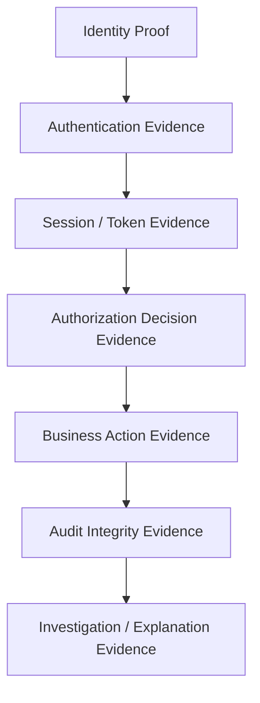

### 8.1 Identity proof

Apakah sistem tahu siapa subject-nya?

Contoh evidence:

- local account ID
- external IdP `iss` + `sub`
- assurance level
- account status
- tenant membership

### 8.2 Authentication evidence

Bagaimana subject masuk?

Contoh:

- password + TOTP
- passkey with UV
- OIDC login with ACR
- mTLS workload identity
- client credentials

### 8.3 Session/token evidence

Aksi dilakukan lewat session/token mana?

Contoh:

- session ID hash
- device ID
- token `jti`
- token family ID
- refresh grant ID
- client ID

### 8.4 Authorization evidence

Kenapa boleh?

Contoh:

- matched policy rule
- permission grant
- role assignment
- ABAC attributes
- ReBAC relationship tuple
- capability grant

### 8.5 Business action evidence

Apa yang berubah?

Contoh:

- case status before/after
- document downloaded
- report exported
- role assigned
- tenant switched

### 8.6 Integrity evidence

Apakah record bisa dipercaya?

Contoh:

- append-only store
- hash chain
- signature
- storage-level immutability
- restricted write/delete permission

### 8.7 Explanation evidence

Bisakah manusia memahami event?

Contoh:

- reason code
- policy display name
- approval reason
- ticket number
- change request ID
- correlation ID

---

## 9. Trust Boundary dan Threat Model Audit

Audit system sendiri punya threat model.

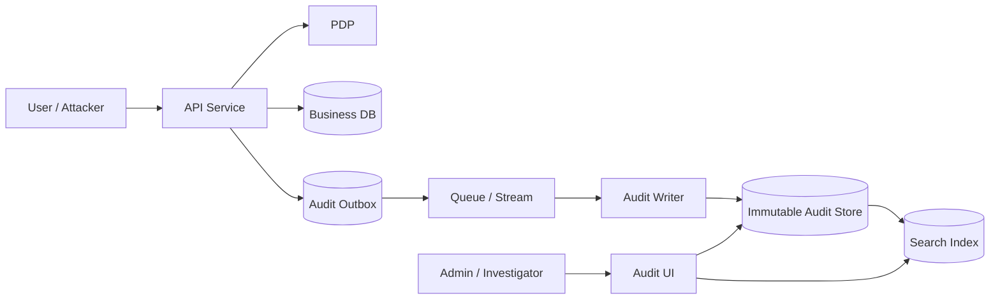

### 9.1 Threat: audit deletion

Attacker performs malicious action, then deletes audit record.

Controls:

- append-only store
- separate IAM role
- WORM storage
- restricted delete
- retention lock
- deletion event audit
- periodic integrity verification

### 9.2 Threat: audit tampering

Attacker modifies event content.

Controls:

- hash chain
- digital signature/MAC
- immutable storage
- canonical encoding
- periodic anchoring/checkpointing

### 9.3 Threat: log injection

Attacker injects newline/control characters to forge log entries.

Controls:

- structured encoding
- escaping
- reject invalid control characters
- never concatenate raw user input into audit text

### 9.4 Threat: context loss

Audit says “case updated” but not by whom or why allowed.

Controls:

- typed `AuthContext`
- mandatory audit event builder
- compile-time required fields where possible
- route/action registry
- policy decision evidence

### 9.5 Threat: hidden superuser

Admin changes data without evidence.

Controls:

- no silent admin bypass
- break-glass workflow
- dual control for critical action
- mandatory reason code
- high-severity audit event
- separate admin session marker

### 9.6 Threat: audit pipeline failure

Audit sink unavailable, actions continue silently.

Controls:

- event class failure policy
- local durable outbox
- health check
- SLO/alert
- fail-closed for critical admin/security events

### 9.7 Threat: privacy leakage

Audit contains sensitive content and becomes a second data breach surface.

Controls:

- data minimization
- field classification
- redaction
- hashing/fingerprinting
- access control on audit query
- audit access logging

### 9.8 Threat: clock manipulation

Attacker manipulates time ordering.

Controls:

- server-side timestamp
- monotonic ordering within process where possible
- NTP monitoring
- recorded_at and occurred_at separation
- sequence number/event ID ordering

### 9.9 Threat: cross-tenant audit leakage

Tenant A can see Tenant B audit event.

Controls:

- tenant-bound audit row
- audit query authorization
- partition/index by tenant
- tenant filter enforced server-side
- redaction for cross-tenant support access

---

## 10. Reference Architecture

High-level architecture:

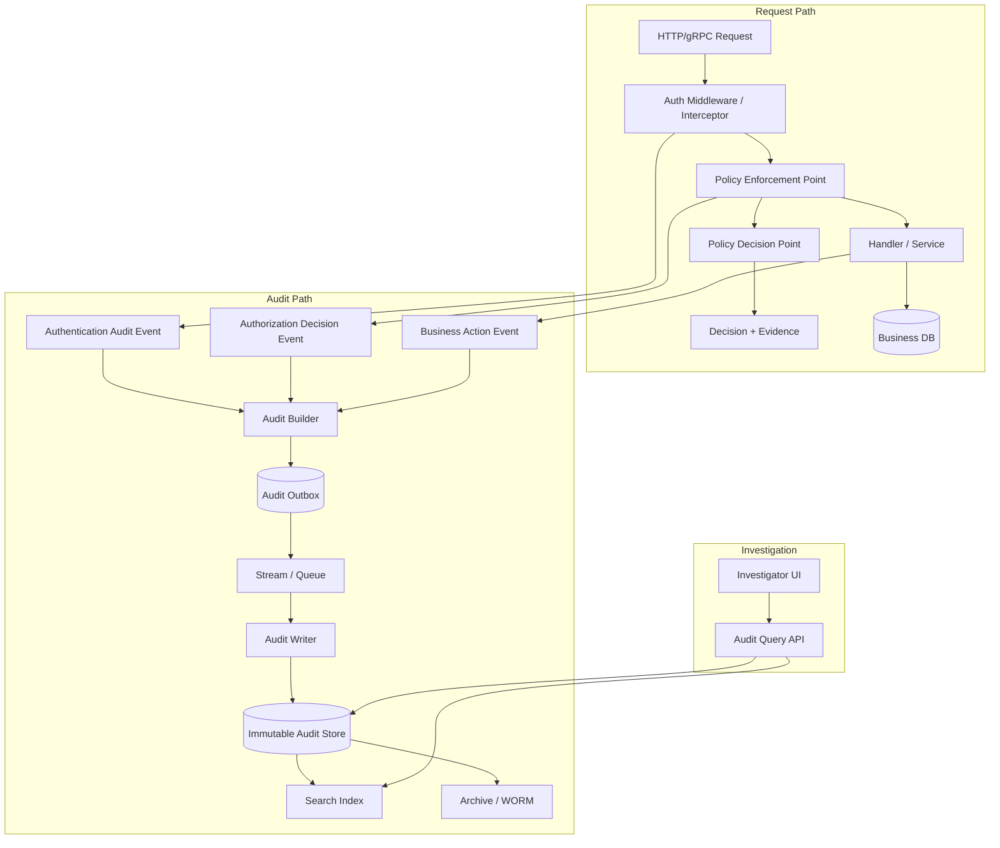

### 10.1 Components

| Component | Responsibility |
|---|---|
| Auth middleware/interceptor | Extract credential, validate token/session, build auth context |
| PEP | Enforce decision and emit authorization evidence |
| PDP | Evaluate policy and return structured decision |
| Domain service | Emit business action audit events |
| Audit builder | Normalize context into canonical event |
| Audit outbox | Durable local persistence for audit events tied to transaction |
| Audit writer | Validate, enrich, hash/sign, and store audit events |
| Immutable audit store | Source of truth for audit records |
| Search index | Query acceleration, not source of truth |
| Investigation API | Controlled audit access with its own authorization |
| SIEM integration | Detection and alerting |

### 10.2 Important principle

Search index is not the audit system of record.

Search indexes are often mutable, reindexed, eventually consistent, and optimized for query. Audit source of truth should be an append-only authoritative store.

---

## 11. Canonical Audit Event Schema

### 11.1 Top-level fields

```json
{
  "schema_version": "audit.v1",
  "event_id": "evt_01J...",
  "event_type": "authz.decision.allowed",
  "event_category": "authorization",
  "severity": "info",
  "occurred_at": "2026-06-24T13:01:22.345Z",
  "recorded_at": "2026-06-24T13:01:22.389Z",
  "environment": "prod",
  "service": {
    "name": "case-service",
    "version": "2026.06.24.3",
    "instance_id": "pod-case-abc123",
    "region": "ap-southeast-1"
  },
  "correlation": {
    "request_id": "req_...",
    "correlation_id": "corr_...",
    "trace_id": "trace_...",
    "span_id": "span_..."
  },
  "tenant": {
    "tenant_id": "tenant_cea",
    "active_tenant_id": "tenant_cea",
    "resource_tenant_id": "tenant_cea",
    "cross_tenant": false
  },
  "actor": {},
  "subject": {},
  "session": {},
  "authentication": {},
  "authority": {},
  "action": {},
  "resource": {},
  "decision": {},
  "result": {},
  "integrity": {}
}
```

### 11.2 Actor block

```json
{
  "actor": {
    "kind": "human_user",
    "id": "usr_123",
    "display": "Fajar A.",
    "external": {
      "issuer": "https://idp.example.gov",
      "subject": "abc-def-123"
    },
    "tenant_memberships": ["tenant_cea"],
    "ip": "203.0.113.10",
    "user_agent": "Mozilla/5.0 ...",
    "client_id": "web-portal"
  }
}
```

### 11.3 Subject block

```json
{
  "subject": {
    "kind": "human_user",
    "id": "usr_987",
    "relationship_to_actor": "impersonated_by_actor",
    "represented_by_actor": true
  }
}
```

For normal action:

```json
{
  "subject": {
    "kind": "human_user",
    "id": "usr_123",
    "relationship_to_actor": "same"
  }
}
```

### 11.4 Session block

```json
{
  "session": {
    "session_id_hash": "sha256:...",
    "created_at": "2026-06-24T12:01:00Z",
    "last_authn_at": "2026-06-24T12:58:00Z",
    "authn_fresh_until": "2026-06-24T13:08:00Z",
    "device_id_hash": "sha256:...",
    "remembered_device": false
  }
}
```

### 11.5 Authentication block

```json
{
  "authentication": {
    "authenticated": true,
    "methods": ["password", "totp"],
    "aal": 2,
    "acr": "urn:example:aal2",
    "amr": ["pwd", "otp"],
    "auth_time": "2026-06-24T12:58:00Z",
    "federated": true,
    "issuer": "https://idp.example.gov"
  }
}
```

### 11.6 Authority block

```json
{
  "authority": {
    "source": "role_assignment",
    "role_assignment_ids": ["ra_123"],
    "permission_grant_ids": ["pg_456"],
    "policy_id": "case-policy",
    "policy_version": "v42",
    "policy_etag": "sha256:...",
    "delegation_id": null,
    "capability_id": null,
    "scope": ["case:submit"],
    "constraints": {
      "tenant_match": true,
      "workflow_stage": "DRAFT",
      "required_aal": 2
    }
  }
}
```

### 11.7 Action block

```json
{
  "action": {
    "name": "case.submit",
    "category": "workflow_transition",
    "risk_level": "high",
    "requires_step_up": true
  }
}
```

### 11.8 Resource block

```json
{
  "resource": {
    "type": "case",
    "id": "case_456",
    "tenant_id": "tenant_cea",
    "owner_id": "agency_789",
    "classification": "restricted",
    "workflow_stage_before": "DRAFT",
    "workflow_stage_after": "SUBMITTED",
    "version_before": 12,
    "version_after": 13
  }
}
```

### 11.9 Decision block

```json
{
  "decision": {
    "decision_id": "dec_789",
    "effect": "ALLOW",
    "reason_code": "POLICY_RULE_MATCH",
    "matched_rules": [
      {
        "policy_id": "case-policy",
        "policy_version": "v42",
        "rule_id": "supervisor-can-submit-draft-case"
      }
    ],
    "required_permissions": ["case.submit"],
    "granted_permissions": ["case.submit"],
    "obligations": ["audit_high_risk_action"],
    "advice": ["reauthenticated_within_5_minutes"]
  }
}
```

### 11.10 Result block

```json
{
  "result": {
    "status": "success",
    "http_status": 200,
    "grpc_code": null,
    "error_code": null,
    "business_result": "case_submitted"
  }
}
```

### 11.11 Integrity block

```json
{
  "integrity": {
    "canonicalization": "json-canonical-v1",
    "content_hash": "sha256:...",
    "previous_hash": "sha256:...",
    "signature_key_id": "audit-signing-key-2026-06",
    "signature": "base64url..."
  }
}
```

---

## 12. Actor, Subject, Principal, Session, dan Authority Snapshot

### 12.1 Jangan hanya simpan user ID

Jika audit hanya menyimpan `user_id`, ia tidak cukup.

Kenapa?

Karena user ID tidak menjawab:

- apakah user sedang impersonated?
- apakah user login via external IdP?
- apakah action dilakukan service atas nama user?
- apakah session sudah step-up?
- apakah role saat itu masih sama?
- apakah action lintas tenant?
- apakah authority berasal dari delegation?

### 12.2 Snapshot bukan full profile dump

Snapshot harus cukup untuk rekonstruksi, tetapi tidak berlebihan.

Contoh actor snapshot yang wajar:

```go
type ActorSnapshot struct {
    Kind         ActorKind `json:"kind"`
    ID           string    `json:"id"`
    DisplayName  string    `json:"display_name,omitempty"`
    ExternalIss  string    `json:"external_iss,omitempty"`
    ExternalSub  string    `json:"external_sub,omitempty"`
    ClientID     string    `json:"client_id,omitempty"`
    ServiceID    string    `json:"service_id,omitempty"`
    IPHash       string    `json:"ip_hash,omitempty"`
    UserAgent    string    `json:"user_agent,omitempty"`
}
```

Catatan:

- IP bisa disimpan plaintext atau hash tergantung regulasi dan kebutuhan forensik.
- Display name bisa berubah; simpan jika membantu investigasi, tetapi jangan jadikan primary identity.
- External subject harus disimpan bersama issuer, bukan subject saja.

### 12.3 Authority snapshot harus terstruktur

Buruk:

```json
{"role": "Admin"}
```

Lebih baik:

```json
{
  "authority": {
    "source": "role_assignment",
    "role_assignment_id": "ra_123",
    "role_id": "role_supervisor",
    "role_version": "7",
    "permission_grants": ["case.submit"],
    "constraints": {
      "tenant_id": "tenant_cea",
      "resource_type": "case",
      "workflow_stage": "DRAFT"
    }
  }
}
```

### 12.4 Policy snapshot vs policy version

Tidak semua audit event harus menyimpan full policy text.

Umumnya cukup:

- policy ID
- policy version
- rule ID
- policy hash/etag
- decision input hash
- decision output

Full policy bisa disimpan di policy repository dengan immutable versioning.

---

## 13. Authorization Decision Evidence

Authorization decision evidence adalah bagian paling kritis dalam seri ini.

Decision evidence harus menjelaskan:

```text
Input + Policy + Context => Effect + Reason + Obligation
```

### 13.1 Decision contract

```go
type DecisionEffect string

const (
    DecisionAllow DecisionEffect = "ALLOW"
    DecisionDeny  DecisionEffect = "DENY"
)

type Decision struct {
    ID          string          `json:"id"`
    Effect      DecisionEffect  `json:"effect"`
    ReasonCode  string          `json:"reason_code"`
    PolicyID    string          `json:"policy_id"`
    PolicyVer   string          `json:"policy_version"`
    RuleIDs     []string        `json:"rule_ids,omitempty"`
    Obligations []string        `json:"obligations,omitempty"`
    Advice      []string        `json:"advice,omitempty"`
    InputHash   string          `json:"input_hash,omitempty"`
    EvaluatedAt time.Time       `json:"evaluated_at"`
}
```

### 13.2 Reason code taxonomy

Contoh allow reason:

```text
ROLE_PERMISSION_MATCH
ABAC_POLICY_MATCH
REBAS_RELATIONSHIP_MATCH
CAPABILITY_VALID
DELEGATION_VALID
BREAK_GLASS_APPROVED
SERVICE_ACCOUNT_ALLOWED
OWNER_ALLOWED
WORKFLOW_ASSIGNEE_ALLOWED
```

Contoh deny reason:

```text
UNAUTHENTICATED
INSUFFICIENT_AAL
TENANT_MISMATCH
RESOURCE_NOT_FOUND_OR_HIDDEN
PERMISSION_MISSING
POLICY_DENY_RULE_MATCH
DELEGATION_EXPIRED
CAPABILITY_REVOKED
SESSION_STALE
TOKEN_EXPIRED
STEP_UP_REQUIRED
SEPARATION_OF_DUTIES_VIOLATION
```

### 13.3 Deny event ambiguity

Untuk public API, jangan bocorkan apakah resource ada.

Response ke user mungkin:

```http
404 Not Found
```

Audit internal harus lebih jelas:

```json
{
  "decision": {
    "effect": "DENY",
    "reason_code": "TENANT_MISMATCH_RESOURCE_EXISTS_BUT_HIDDEN"
  },
  "result": {
    "http_status": 404
  }
}
```

### 13.4 PEP should log the enforced decision

PDP boleh menghasilkan decision, tetapi PEP yang tahu apakah decision benar-benar enforced.

Karena itu event penting harus ditulis di PEP atau di boundary yang tahu:

- request
- caller
- resource
- decision
- enforcement result
- business result

Anti-pattern:

```text
PDP logs ALLOW, but handler later bypasses enforcement or performs different action.
```

Better pattern:

```text
PEP receives decision, enforces it, and emits audit event containing decision evidence.
```

---

## 14. Where to Emit Audit Events

### 14.1 Middleware/interceptor

Cocok untuk:

- authentication success/failure
- session/token validation result
- generic request denied due to auth failure
- high-level request metadata

Tidak cukup untuk:

- object-level authorization
- workflow transition
- business state change
- report/export detail

### 14.2 PEP layer

Cocok untuk:

- authorization decision allowed/denied
- resource-level permission
- tenant mismatch
- step-up requirement
- policy evaluation error

### 14.3 Domain service

Cocok untuk:

- business action succeeded/failed
- before/after business state
- command accepted/rejected
- workflow transition

### 14.4 Repository/data access layer

Cocok terbatas untuk:

- sensitive document download
- bulk export
- direct data view
- privileged query

Hati-hati: repository audit sering kehilangan business intent.

Contoh buruk:

```text
SELECT case WHERE id=123
```

Contoh lebih baik:

```text
case.viewed for enforcement_review by supervisor
```

### 14.5 Admin/control-plane layer

Wajib untuk:

- role assignment
- policy update
- tenant setting change
- IdP configuration change
- signing key rotation
- break-glass approval
- support impersonation

---

## 15. Synchronous vs Asynchronous Audit Write

Tidak semua audit event harus ditulis dengan cara yang sama.

### 15.1 Classification by criticality

| Event Class | Example | Write Strategy | Failure Behavior |
|---|---|---|---|
| Critical security control | role assigned, break-glass used, MFA removed | transaction-bound / sync outbox | fail-closed or durable outbox required |
| Critical business action | case approved, enforcement notice issued | transaction-bound outbox | action should not commit without audit outbox |
| High-volume read | case listing viewed | async/batched | degrade with buffer + alert |
| Failed auth attempt | login failed | async durable | rate-limit and alert if dropped |
| Debug context | cache miss | metrics/log | best effort |

### 15.2 Synchronous direct write

Pros:

- immediate durability
- simpler mental model
- strong coupling with action

Cons:

- latency impact
- audit store outage affects app
- risk of distributed transaction complexity

### 15.3 Async write

Pros:

- lower latency
- decoupled
- scalable

Cons:

- event loss risk
- ordering issues
- delayed visibility
- harder exactly-once semantics

### 15.4 Transactional outbox

Best for business actions:

```text
business state change and audit intent commit atomically in same local transaction
```

Then async worker publishes to audit store.

---

## 16. Transactional Outbox untuk Audit

Transactional outbox menyelesaikan problem klasik:

> Business DB commit berhasil, tetapi audit event gagal dikirim.

Atau sebaliknya:

> Audit event terkirim, tetapi business DB rollback.

### 16.1 Pattern

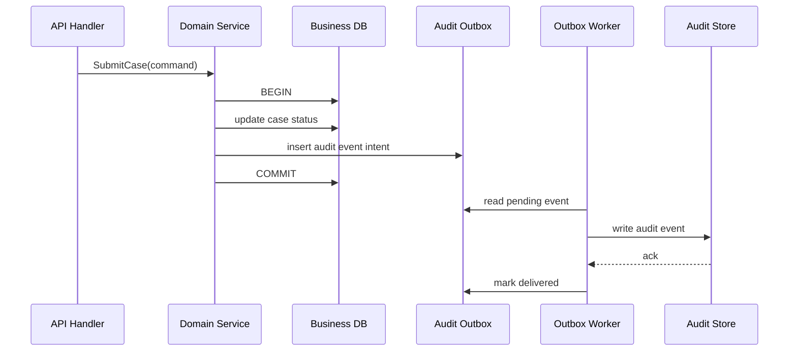

### 16.2 Outbox schema

```sql
CREATE TABLE audit_outbox (
    id                VARCHAR(64) PRIMARY KEY,
    event_type        VARCHAR(128) NOT NULL,
    tenant_id         VARCHAR(64) NOT NULL,
    aggregate_type    VARCHAR(64),
    aggregate_id      VARCHAR(128),
    payload_json      CLOB NOT NULL,
    status            VARCHAR(32) NOT NULL,
    attempt_count     INTEGER NOT NULL DEFAULT 0,
    next_attempt_at   TIMESTAMP,
    created_at        TIMESTAMP NOT NULL,
    delivered_at      TIMESTAMP,
    last_error_code   VARCHAR(128),
    last_error_text   VARCHAR(1000)
);
```

DB syntax harus disesuaikan dengan database yang dipakai.

### 16.3 Outbox event state machine

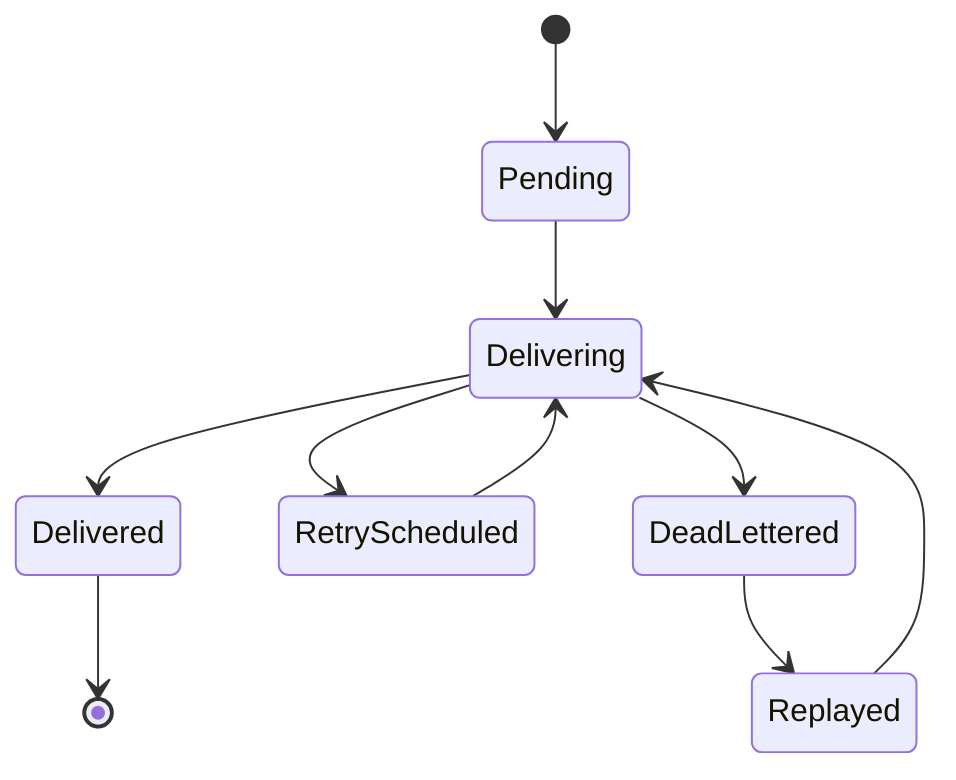

### 16.4 Idempotency

Audit writer harus idempotent berdasarkan `event_id`.

Jika worker retry, tidak boleh muncul duplicate authoritative event.

Pattern:

```text
event_id is globally unique
insert into audit_store with unique constraint on event_id
if duplicate, treat as success if content hash matches
if duplicate with different content hash, raise integrity incident
```

### 16.5 Outbox is not the audit store

Outbox adalah buffer sementara. Audit source of truth tetap audit store.

---

## 17. Integrity Protection: Hash Chain, Signature, WORM

### 17.1 Audit integrity goals

1. Detect modification.
2. Detect deletion where possible.
3. Detect insertion/reordering anomalies where possible.
4. Limit blast radius if application DB compromised.
5. Provide evidence for investigation.

### 17.2 Hash chain

Hash chain menghubungkan record berurutan.

```text
record_hash_n = SHA256(canonical(record_n_without_integrity) + previous_hash)
```

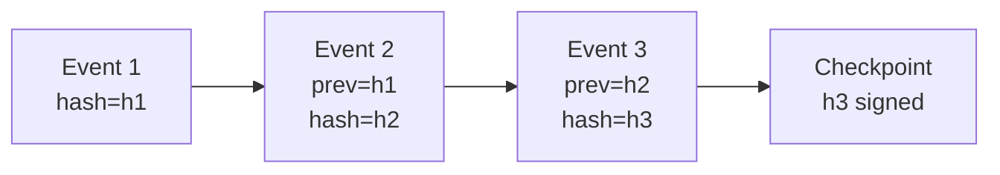

### 17.3 Per-partition hash chain

Untuk skala besar, hash chain global bisa menjadi bottleneck.

Alternatif:

- chain per tenant
- chain per service
- chain per partition/day
- Merkle tree per batch
- checkpoint per interval

### 17.4 Canonical serialization

Hash/signature hanya bermakna jika serialization stabil.

Hindari hash langsung dari map JSON yang tidak deterministik.

Gunakan canonical representation:

- sorted keys
- normalized timestamp format
- no insignificant whitespace
- stable number/string encoding

### 17.5 Signature/MAC

Hash chain mendeteksi perubahan internal, tetapi attacker yang bisa rewrite semua record dan recompute hash tetap berbahaya.

Tambahkan:

- signing key di KMS/HSM
- key ID
- periodic checkpoint signature
- restricted signing role
- signature verification job

### 17.6 WORM/immutable storage

WORM/immutability membantu mencegah delete/modify selama retention period.

Pattern umum:

- append event to primary audit DB
- stream to immutable object storage
- retention lock
- separate account/project
- restricted delete permission

### 17.7 Jangan overclaim

Hash chain bukan magic.

Ia tidak otomatis membuktikan:

- user benar-benar manusia tertentu
- device tidak compromised
- policy benar secara bisnis
- semua event pasti tertangkap

Ia hanya membantu integrity evidence.

---

## 18. Privacy, PII, Secrets, dan Data Minimization

Audit trail sering menjadi data store paling sensitif.

Kenapa?

Karena audit mengandung:

- siapa mengakses apa
- kapan mengakses
- dari mana
- resource sensitif
- admin action
- failed attempts
- investigation history

### 18.1 Never store secrets

Jangan simpan:

```text
password
OTP
TOTP secret
recovery code plaintext
session cookie
access token
refresh token
authorization code
client secret
private key
API key plaintext
full SAML assertion jika berisi sensitive claims
full ID token jika tidak perlu
```

Gunakan:

```text
hash/fingerprint
key id
token id / jti
grant id
session id hash
credential id
```

### 18.2 Data minimization by field classification

Contoh classification:

| Field | Classification | Store? | Notes |
|---|---|---|---|
| actor_id | internal identifier | yes | required |
| display name | personal data | maybe | useful but not primary |
| email | personal data | maybe redacted | use if needed |
| IP address | personal/security data | maybe | follow policy/regulation |
| access token | secret | no | store hash/fingerprint only |
| resource title | sensitive business data | maybe | avoid if not needed |
| case description | sensitive content | no | store resource ID/classification |

### 18.3 Redaction strategy

Redaction harus default-deny.

```go
type Redactor interface {
    RedactAuditValue(field string, value any) (any, error)
}
```

Lebih baik allowlist daripada denylist.

Buruk:

```go
log.Any("request", req)
```

Baik:

```go
audit.Event{
    Resource: audit.ResourceSnapshot{
        Type: "case",
        ID: caseID,
        Classification: "restricted",
    },
}
```

### 18.4 Audit access control

Audit query API harus punya authorization sendiri.

Contoh permissions:

```text
audit.read_own_tenant
audit.read_security_events
audit.read_admin_events
audit.export
audit.apply_legal_hold
audit.verify_integrity
```

### 18.5 Privacy-aware investigation

Investigator tidak selalu boleh melihat semua field.

Pattern:

- field-level redaction
- purpose-based access
- ticket/reason required
- query result watermarked
- export approval
- audit the audit access

---

## 19. Go Package Architecture

Contoh struktur package:

```text
/internal/authn
/internal/authz
/internal/session
/internal/tenant
/internal/audit
    event.go
    builder.go
    writer.go
    outbox.go
    redactor.go
    integrity.go
    sink.go
    middleware.go
/internal/auditstore
    postgres.go
    s3.go
    search.go
/internal/platform/clock
/internal/platform/idgen
```

### 19.1 Boundary principles

1. `audit` package mendefinisikan canonical types.
2. Domain service tidak boleh bergantung pada storage-specific audit implementation.
3. PEP menghasilkan authorization decision evidence.
4. Audit builder menggabungkan auth context, decision, request metadata, dan domain result.
5. Audit writer bertanggung jawab pada validation, redaction, integrity metadata, dan sink.

### 19.2 Avoid global logger-as-audit

Buruk:

```go
log.Printf("user %s approved case %s", userID, caseID)
```

Baik:

```go
auditWriter.Record(ctx, audit.Event{
    Type: audit.EventCaseApproved,
    Actor: actor,
    Subject: subject,
    Tenant: tenant,
    Action: audit.Action{Name: "case.approve"},
    Resource: audit.Resource{Type: "case", ID: caseID},
    Decision: decision.Evidence(),
})
```

### 19.3 Compile-time pressure

Buat required fields sulit dilupakan.

```go
type EventBuilder struct {
    event Event
    errs  []error
}

func NewEventBuilder(eventType EventType) *EventBuilder {
    return &EventBuilder{
        event: Event{
            SchemaVersion: "audit.v1",
            Type:          eventType,
        },
    }
}

func (b *EventBuilder) WithActor(a ActorSnapshot) *EventBuilder {
    b.event.Actor = a
    return b
}

func (b *EventBuilder) Build() (Event, error) {
    if b.event.Type == "" {
        b.errs = append(b.errs, errors.New("audit event type is required"))
    }
    if b.event.Actor.ID == "" && b.event.Actor.Kind != ActorAnonymous {
        b.errs = append(b.errs, errors.New("audit actor is required"))
    }
    if b.event.Tenant.TenantID == "" {
        b.errs = append(b.errs, errors.New("audit tenant is required"))
    }
    if len(b.errs) > 0 {
        return Event{}, errors.Join(b.errs...)
    }
    return b.event, nil
}
```

---

## 20. Go Domain Types

### 20.1 Core event type

```go
package audit

import "time"

type EventType string

type Severity string

const (
    SeverityInfo     Severity = "info"
    SeverityNotice   Severity = "notice"
    SeverityWarning  Severity = "warning"
    SeverityCritical Severity = "critical"
)

type Event struct {
    SchemaVersion string              `json:"schema_version"`
    ID            string              `json:"event_id"`
    Type          EventType           `json:"event_type"`
    Category      string              `json:"event_category"`
    Severity      Severity            `json:"severity"`
    OccurredAt    time.Time           `json:"occurred_at"`
    RecordedAt    time.Time           `json:"recorded_at"`
    Environment   string              `json:"environment"`
    Service       ServiceSnapshot     `json:"service"`
    Correlation   CorrelationSnapshot `json:"correlation"`
    Tenant        TenantSnapshot      `json:"tenant"`
    Actor         ActorSnapshot       `json:"actor"`
    Subject       SubjectSnapshot     `json:"subject"`
    Session       SessionSnapshot     `json:"session,omitempty"`
    Authentication AuthnSnapshot      `json:"authentication,omitempty"`
    Authority     AuthoritySnapshot   `json:"authority,omitempty"`
    Action        ActionSnapshot      `json:"action"`
    Resource      ResourceSnapshot    `json:"resource,omitempty"`
    Decision      DecisionSnapshot    `json:"decision,omitempty"`
    Result        ResultSnapshot      `json:"result"`
    Integrity     IntegritySnapshot   `json:"integrity,omitempty"`
    Extensions    map[string]any      `json:"extensions,omitempty"`
}
```

### 20.2 Actor and subject

```go
type ActorKind string

const (
    ActorHumanUser ActorKind = "human_user"
    ActorService   ActorKind = "service"
    ActorJob       ActorKind = "job"
    ActorAnonymous ActorKind = "anonymous"
)

type ActorSnapshot struct {
    Kind        ActorKind `json:"kind"`
    ID          string    `json:"id,omitempty"`
    DisplayName string    `json:"display_name,omitempty"`
    ExternalIss string    `json:"external_issuer,omitempty"`
    ExternalSub string    `json:"external_subject,omitempty"`
    ClientID    string    `json:"client_id,omitempty"`
    ServiceID   string    `json:"service_id,omitempty"`
    IP          string    `json:"ip,omitempty"`
    IPHash      string    `json:"ip_hash,omitempty"`
    UserAgent   string    `json:"user_agent,omitempty"`
}

type SubjectSnapshot struct {
    Kind                ActorKind `json:"kind"`
    ID                  string    `json:"id,omitempty"`
    RelationshipToActor string    `json:"relationship_to_actor"`
    RepresentedByActor  bool      `json:"represented_by_actor"`
}
```

### 20.3 Authority

```go
type AuthoritySnapshot struct {
    Source              string         `json:"source"`
    RoleAssignmentIDs   []string       `json:"role_assignment_ids,omitempty"`
    PermissionGrantIDs  []string       `json:"permission_grant_ids,omitempty"`
    DelegationID        string         `json:"delegation_id,omitempty"`
    CapabilityID        string         `json:"capability_id,omitempty"`
    PolicyID            string         `json:"policy_id,omitempty"`
    PolicyVersion       string         `json:"policy_version,omitempty"`
    PolicyHash          string         `json:"policy_hash,omitempty"`
    Scope               []string       `json:"scope,omitempty"`
    Constraints         map[string]any `json:"constraints,omitempty"`
}
```

### 20.4 Decision

```go
type DecisionSnapshot struct {
    DecisionID          string   `json:"decision_id"`
    Effect              string   `json:"effect"`
    ReasonCode          string   `json:"reason_code"`
    MatchedPolicyID     string   `json:"matched_policy_id,omitempty"`
    MatchedPolicyVersion string  `json:"matched_policy_version,omitempty"`
    MatchedRuleIDs      []string `json:"matched_rule_ids,omitempty"`
    RequiredPermissions []string `json:"required_permissions,omitempty"`
    GrantedPermissions  []string `json:"granted_permissions,omitempty"`
    Obligations         []string `json:"obligations,omitempty"`
    Advice              []string `json:"advice,omitempty"`
    InputHash           string   `json:"input_hash,omitempty"`
}
```

### 20.5 Resource

```go
type ResourceSnapshot struct {
    Type                 string         `json:"type"`
    ID                   string         `json:"id"`
    TenantID             string         `json:"tenant_id,omitempty"`
    OwnerID              string         `json:"owner_id,omitempty"`
    Classification       string         `json:"classification,omitempty"`
    VersionBefore        string         `json:"version_before,omitempty"`
    VersionAfter         string         `json:"version_after,omitempty"`
    WorkflowStageBefore  string         `json:"workflow_stage_before,omitempty"`
    WorkflowStageAfter   string         `json:"workflow_stage_after,omitempty"`
    Attributes           map[string]any `json:"attributes,omitempty"`
}
```

---

## 21. Go Audit Writer Interface

### 21.1 Interface

```go
package audit

import "context"

type Writer interface {
    Record(ctx context.Context, event Event) error
}

type BatchWriter interface {
    RecordBatch(ctx context.Context, events []Event) error
}
```

### 21.2 Validation writer

```go
type ValidatingWriter struct {
    next Writer
}

func (w ValidatingWriter) Record(ctx context.Context, e Event) error {
    if err := ValidateEvent(e); err != nil {
        return err
    }
    return w.next.Record(ctx, e)
}
```

### 21.3 Redacting writer

```go
type RedactingWriter struct {
    redactor Redactor
    next     Writer
}

func (w RedactingWriter) Record(ctx context.Context, e Event) error {
    redacted, err := w.redactor.Redact(e)
    if err != nil {
        return err
    }
    return w.next.Record(ctx, redacted)
}
```

### 21.4 Integrity writer

```go
type IntegrityWriter struct {
    signer Signer
    next   Writer
}

func (w IntegrityWriter) Record(ctx context.Context, e Event) error {
    canonical, err := Canonicalize(e)
    if err != nil {
        return err
    }

    hash := SHA256(canonical)
    sig, keyID, err := w.signer.Sign(ctx, hash)
    if err != nil {
        return err
    }

    e.Integrity.ContentHash = "sha256:" + hash
    e.Integrity.Signature = sig
    e.Integrity.SignatureKeyID = keyID

    return w.next.Record(ctx, e)
}
```

### 21.5 Composable pipeline

```text
Domain/PEP
  -> Validation
  -> Redaction
  -> Integrity
  -> Outbox/Sink
```

```go
writer := audit.ValidatingWriter{
    Next: audit.RedactingWriter{
        Redactor: redactor,
        Next: audit.IntegrityWriter{
            Signer: signer,
            Next:   sink,
        },
    },
}
```

Real code perlu memakai exported fields/constructor yang konsisten. Snippet di atas menunjukkan arsitektur.

---

## 22. HTTP dan gRPC Enforcement Integration

### 22.1 HTTP PEP audit pattern

```go
func RequirePermission(
    authorizer Authorizer,
    auditWriter audit.Writer,
    action string,
    resolveResource func(*http.Request) (audit.ResourceSnapshot, error),
    next http.Handler,
) http.Handler {
    return http.HandlerFunc(func(w http.ResponseWriter, r *http.Request) {
        ctx := r.Context()
        authCtx, ok := AuthContextFrom(ctx)
        if !ok {
            http.Error(w, "unauthenticated", http.StatusUnauthorized)
            return
        }

        resource, err := resolveResource(r)
        if err != nil {
            http.Error(w, "bad request", http.StatusBadRequest)
            return
        }

        req := AuthzRequest{
            Principal: authCtx.Principal,
            TenantID:  authCtx.TenantID,
            Action:    action,
            Resource:  resource,
        }

        decision, err := authorizer.Decide(ctx, req)
        if err != nil {
            _ = auditWriter.Record(ctx, BuildAuthzErrorEvent(authCtx, action, resource, err))
            http.Error(w, "authorization error", http.StatusInternalServerError)
            return
        }

        _ = auditWriter.Record(ctx, BuildAuthzDecisionEvent(authCtx, action, resource, decision))

        if decision.Effect != DecisionAllow {
            http.Error(w, "forbidden", http.StatusForbidden)
            return
        }

        next.ServeHTTP(w, r.WithContext(WithDecision(ctx, decision)))
    })
}
```

### 22.2 gRPC PEP audit pattern

```go
func UnaryAuthzInterceptor(authorizer Authorizer, auditWriter audit.Writer) grpc.UnaryServerInterceptor {
    return func(ctx context.Context, req any, info *grpc.UnaryServerInfo, handler grpc.UnaryHandler) (any, error) {
        authCtx, ok := AuthContextFrom(ctx)
        if !ok {
            return nil, status.Error(codes.Unauthenticated, "unauthenticated")
        }

        action := MethodToAction(info.FullMethod)
        resource := ResolveRPCResource(req)

        decision, err := authorizer.Decide(ctx, AuthzRequest{
            Principal: authCtx.Principal,
            TenantID:  authCtx.TenantID,
            Action:    action,
            Resource:  resource,
        })
        if err != nil {
            _ = auditWriter.Record(ctx, BuildAuthzErrorEvent(authCtx, action, resource, err))
            return nil, status.Error(codes.Internal, "authorization error")
        }

        _ = auditWriter.Record(ctx, BuildAuthzDecisionEvent(authCtx, action, resource, decision))

        if decision.Effect != DecisionAllow {
            return nil, status.Error(codes.PermissionDenied, "permission denied")
        }

        return handler(WithDecision(ctx, decision), req)
    }
}
```

### 22.3 Handler-level business audit

Authorization event says action was allowed. Business audit says action actually happened.

```go
func (s *CaseService) SubmitCase(ctx context.Context, cmd SubmitCaseCommand) error {
    authCtx := MustAuthContext(ctx)
    decision := MustDecision(ctx)

    before, after, err := s.repo.SubmitCase(ctx, cmd.CaseID)
    if err != nil {
        _ = s.audit.Record(ctx, audit.CaseSubmitFailed(authCtx, decision, cmd.CaseID, err))
        return err
    }

    return s.audit.Record(ctx, audit.CaseSubmitted(authCtx, decision, before, after))
}
```

Untuk state change penting, gunakan transactional outbox agar business update dan audit intent atomic.

---

## 23. Audit untuk Impersonation, Delegation, dan Break-Glass

### 23.1 Impersonation

Impersonation adalah mode paling rawan penyalahgunaan.

Audit wajib memuat:

- real actor
- impersonated subject
- reason/ticket
- approval reference
- start time
- end time
- allowed scope
- session marker
- visible banner state, jika ada
- all actions during impersonation

Event:

```json
{
  "event_type": "impersonation.started",
  "actor": {"id": "support_123"},
  "subject": {
    "id": "usr_987",
    "relationship_to_actor": "impersonated_by_actor"
  },
  "authority": {
    "source": "support_impersonation_approval",
    "delegation_id": "imp_456"
  },
  "result": {"status": "success"}
}
```

### 23.2 Delegation

Delegation harus menyatakan:

- delegator
- delegate
- scope
- resource constraints
- expiry
- revocation
- accepted/activated status

Jangan samakan delegation dengan impersonation.

Delegation:

```text
Delegate acts as themselves, with delegated authority.
```

Impersonation:

```text
Actor acts as if they are subject, but audit must expose real actor.
```

### 23.3 Break-glass

Break-glass adalah emergency access.

Audit wajib:

- high severity
- reason mandatory
- expiry short
- approval/notification path
- post-use review
- immutable event
- alert to security/compliance

Break-glass event sequence:

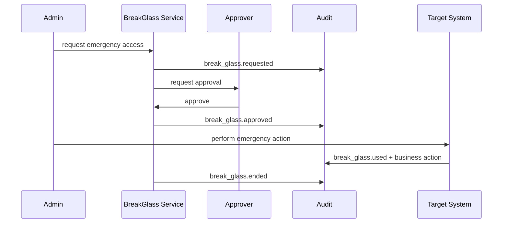

---

## 24. Audit untuk Policy Change dan Permission Change

Policy/permission change adalah control-plane action. Dampaknya bisa lebih besar dari business action biasa.

### 24.1 Role assignment event

```json
{
  "event_type": "permission.role.assigned",
  "actor": {"id": "admin_123"},
  "subject": {"id": "usr_456"},
  "action": {"name": "permission.assign_role", "risk_level": "critical"},
  "resource": {
    "type": "role_assignment",
    "id": "ra_789",
    "tenant_id": "tenant_cea"
  },
  "result": {
    "status": "success"
  },
  "extensions": {
    "role_id": "role_supervisor",
    "scope": "tenant_cea",
    "effective_from": "2026-06-24T13:00:00Z",
    "effective_until": null,
    "approval_id": "approval_123"
  }
}
```

### 24.2 Policy publish event

Must capture:

- previous policy version
- new policy version
- diff hash
- author
- reviewer/approver
- rollout mode
- effective time
- rollback reference

### 24.3 Separation of duties

Permission change audit should identify toxic combinations.

Example:

```text
User cannot both create vendor and approve vendor payment.
```

Audit event:

```text
permission.sod.violation_detected
```

### 24.4 Control-plane changes require stronger assurance

For critical policy/role changes:

- require MFA/step-up
- require fresh authentication
- require dual approval
- log `auth_time`, `amr`, `acr`, AAL

---

## 25. Audit untuk Data Access, Export, Report, dan Search

Data access audit is difficult because read volume can be high.

### 25.1 Not every read has same risk

| Action | Audit Level |
|---|---|
| View own profile | low/medium |
| View sensitive case | medium/high |
| Download document | high |
| Export report | high/critical |
| Bulk search | high |
| Admin query across tenants | critical |

### 25.2 Search audit

Search can leak information even if individual object access is checked.

Audit should capture:

- query type
- filters used
- tenant scope
- result count
- sensitive filters
- export flag
- policy decision

Avoid storing raw search text if it may contain PII, unless required and protected.

### 25.3 Export audit

Export is high-risk because it moves data out of controlled UI.

Capture:

- export type
- format
- filter summary
- result count
- file ID
- file hash
- recipient/download actor
- expiry
- approval ID

### 25.4 Report audit

Report generation audit should include:

- report template ID/version
- parameter hash/summary
- tenant scope
- date range
- classification
- generated file reference

### 25.5 Field-level audit

For highly sensitive fields:

```text
data.sensitive_field.viewed
```

But be careful with event volume.

Possible strategy:

- audit access to record
- separately audit access to specially classified fields
- aggregate low-risk field visibility

---

## 26. Audit Query Model dan Investigation UX

Audit trail is useless if investigators cannot answer questions.

### 26.1 Common queries

1. What did user X do in tenant Y between time A and B?
2. Who accessed case C?
3. Why was user X allowed to approve action A?
4. Who changed role assignment R?
5. Which actions happened during impersonation session S?
6. Which denied actions indicate tenant probing?
7. Which exports included restricted cases?
8. What policy version was used when case C was approved?
9. Which service accessed resource R?
10. Did audit integrity verification pass for period P?

### 26.2 Investigation model

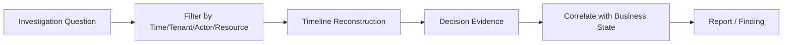

### 26.3 Audit query API

Example endpoint design:

```text
GET /audit/events?tenant_id=...&actor_id=...&from=...&to=...
GET /audit/resources/{type}/{id}/timeline
GET /audit/decisions/{decision_id}
GET /audit/integrity/checkpoints/{date}
```

### 26.4 Audit query authorization

Do not let general admins query all audit data by default.

Pattern:

```text
security_auditor: read security events
compliance_officer: read regulatory business audit
tenant_admin: read own tenant administrative events
support_manager: read support impersonation events
system_operator: read pipeline health only
```

### 26.5 Investigation report

Report should include:

- scope
- query parameters
- investigator identity
- reason/ticket
- records referenced
- integrity verification status
- generated_at
- export hash

---

## 27. Retention, Legal Hold, dan Data Lifecycle

### 27.1 Retention is policy, not code constant

Different events have different retention needs.

| Event Class | Example | Retention Consideration |
|---|---|---|
| Auth failed noise | failed login | shorter, aggregated possible |
| Auth successful | login/session | medium |
| Permission change | role/policy changes | long |
| Business regulatory action | enforcement approval | long |
| Break-glass | emergency admin access | long/critical |
| Debug/metric | cache hit | short |

### 27.2 Legal hold

Legal hold freezes deletion/expiration for relevant audit data.

Audit legal hold events:

```text
audit.legal_hold.applied
audit.legal_hold.released
audit.retention_policy.changed
```

### 27.3 Data lifecycle

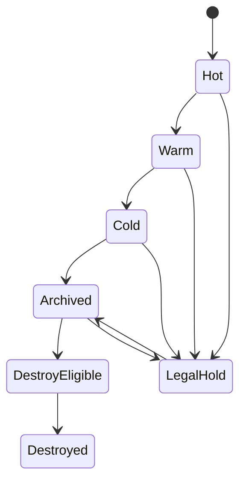

### 27.4 Deletion must be auditable

If audit record is legally destroyed after retention, log destruction metadata separately if allowed:

- retention policy ID
- destruction batch ID
- time
- authorized actor
- count/hash summary

Do not silently delete.

---

## 28. Operational Failure Modes

### 28.1 Audit sink down

Problem:

- app cannot write audit events

Decide per event class:

- fail closed for critical control-plane actions
- local durable outbox for business actions
- buffer/drop with alert for low-risk high-volume reads

### 28.2 Outbox backlog

Problem:

- audit events delayed

Controls:

- backlog metric
- oldest pending age
- retry with backoff
- dead-letter queue
- replay tool
- capacity planning

### 28.3 Duplicate events

Problem:

- retries create duplicates

Controls:

- idempotency key/event ID
- unique constraint
- content hash compare

### 28.4 Missing auth context

Problem:

- event emitted without actor/tenant

Controls:

- validation writer
- required fields
- test coverage
- unknown/system actor only for explicit system events

### 28.5 Policy version missing

Problem:

- cannot reconstruct authorization decision

Controls:

- PDP decision contract requires policy version
- fail validation for high-risk authz event

### 28.6 Audit event contains secret

Problem:

- audit store becomes breach multiplier

Controls:

- redaction allowlist
- scanner tests
- secret detection
- code review

### 28.7 Index inconsistent with source

Problem:

- investigator sees incomplete results

Controls:

- source-of-truth marker
- index lag metric
- query can fallback to authoritative store
- reindex job

### 28.8 Clock skew

Problem:

- wrong event ordering

Controls:

- server timestamps
- sequence IDs
- NTP monitoring
- monotonic local ordering

### 28.9 Multi-tenant leakage

Problem:

- audit query leaks other tenant data

Controls:

- server-side tenant filter
- row-level authorization
- partition by tenant/time
- audit query tests

### 28.10 Alert fatigue

Problem:

- too many audit/security events, no one responds

Controls:

- event severity taxonomy
- aggregation
- thresholding
- deduplication
- tuned detections

---

## 29. Testing Strategy

### 29.1 Unit tests

Test event builder:

- required fields
- actor/subject separation
- tenant required
- no secret fields
- decision evidence required for authz event
- policy version required for high-risk allow

### 29.2 Property tests

Useful for:

- redaction never emits forbidden field names
- canonicalization is deterministic
- hash changes if event changes
- duplicate event ID behavior

### 29.3 Integration tests

Scenarios:

1. Login success emits auth event.
2. Login failure emits security event without leaking password.
3. Authorized case approval emits decision event and business event.
4. Denied cross-tenant access emits deny event.
5. Role assignment emits control-plane event.
6. Impersonation session preserves real actor.
7. Audit query is itself audited.
8. Outbox replay is idempotent.

### 29.4 Chaos/failure tests

Test:

- audit sink down
- queue unavailable
- outbox backlog
- duplicate delivery
- slow audit store
- signer/KMS unavailable
- index lag

### 29.5 Golden file tests

For audit schema, golden files can help catch accidental schema drift.

Example:

```text
testdata/audit_case_submitted_v1.golden.json
```

### 29.6 Security tests

- log injection via newline/control character
- JSON injection
- PII leakage
- token leakage
- audit query privilege escalation
- tenant filter bypass
- direct DB write bypass

---

## 30. Performance dan Scalability

### 30.1 Volume estimation

Estimate events per action.

Example:

```text
1 login = auth.login.started + auth.login.succeeded + session.created
1 case approve = authz.decision.allowed + case.approved
1 export = authz.decision.allowed + report.generated + report.exported
```

### 30.2 Avoid audit explosion

Do not blindly audit every low-level function call.

Prefer business-level and security-relevant events.

### 30.3 Partitioning

Common partition keys:

- occurred_at date
- tenant_id
- event_category
- resource_type

### 30.4 Indexing

Common indexes:

- tenant_id + occurred_at
- actor_id + occurred_at
- subject_id + occurred_at
- resource_type + resource_id + occurred_at
- event_type + occurred_at
- correlation_id
- decision_id
- session_id_hash

### 30.5 Batching

Batch low-risk events, but avoid delaying critical events too long.

### 30.6 Backpressure

If audit path cannot keep up:

- throttle low-risk endpoints
- degrade export/report
- block critical control-plane changes
- increase worker capacity
- alert before data loss

### 30.7 Hot path budget

Do not put heavy policy explanation rendering in hot path if not needed. Store structured IDs and minimal evidence, then resolve human-readable explanation in investigation UI using immutable policy repository.

---

## 31. Anti-Patterns

### Anti-pattern 1 — “Audit is just logs”

Logs are not automatically audit.

### Anti-pattern 2 — Only log success

Deny events often reveal attacks.

### Anti-pattern 3 — Only log at gateway

Gateway cannot know object-level/resource-level decision.

### Anti-pattern 4 — Store current role only

Historical decision becomes unreconstructable.

### Anti-pattern 5 — No actor/subject split

Impersonation and delegation become legally misleading.

### Anti-pattern 6 — Store tokens in audit

Audit becomes a credential leakage database.

### Anti-pattern 7 — Let admins delete audit records

Compromised admin can erase evidence.

### Anti-pattern 8 — Search index as source of truth

Index is not immutable evidence store.

### Anti-pattern 9 — No audit for audit access

Investigator/admin abuse becomes invisible.

### Anti-pattern 10 — Over-logging raw request/response

This leaks PII, secrets, and sensitive business data.

### Anti-pattern 11 — Policy decision without policy version

Cannot explain why access was allowed.

### Anti-pattern 12 — Async audit without durability

Business action can succeed while audit disappears.

### Anti-pattern 13 — Fail-open critical control-plane action

Role/policy changes should not silently proceed when audit cannot be durably recorded.

### Anti-pattern 14 — No schema version

Audit consumers break when event shape changes.

### Anti-pattern 15 — Event type names unstable

Changing event taxonomy destroys long-term analytics and compliance queries.

---

## 32. Case Study: Regulatory Case Management

Context:

- multi-tenant government/regulatory system
- users from agencies
- internal support admins
- case lifecycle
- sensitive documents
- enforcement actions
- reports/exports
- external IdP login
- service-to-service workers

### 32.1 Scenario: officer submits case

Flow:

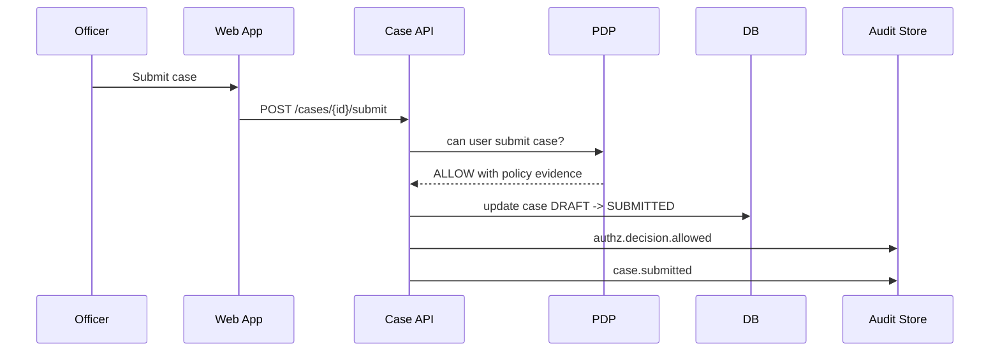

Audit evidence:

```json
{
  "event_type": "case.submitted",
  "actor": {"kind": "human_user", "id": "usr_officer_1"},
  "subject": {"kind": "human_user", "id": "usr_officer_1", "relationship_to_actor": "same"},
  "tenant": {"tenant_id": "agency_cea", "resource_tenant_id": "agency_cea"},
  "action": {"name": "case.submit", "risk_level": "high"},
  "resource": {
    "type": "case",
    "id": "case_1001",
    "workflow_stage_before": "DRAFT",
    "workflow_stage_after": "SUBMITTED",
    "classification": "restricted"
  },
  "decision": {
    "effect": "ALLOW",
    "reason_code": "WORKFLOW_ASSIGNEE_ALLOWED",
    "matched_policy_id": "case-workflow-policy",
    "matched_policy_version": "v42",
    "matched_rule_ids": ["assignee-can-submit-draft-case"]
  }
}
```

### 32.2 Scenario: support impersonates agency user

Bad audit:

```text
usr_agency_9 updated case case_1001
```

Defensible audit:

```json
{
  "event_type": "case.updated",
  "actor": {
    "kind": "human_user",
    "id": "support_admin_3"
  },
  "subject": {
    "kind": "human_user",
    "id": "usr_agency_9",
    "relationship_to_actor": "impersonated_by_actor",
    "represented_by_actor": true
  },
  "authority": {
    "source": "impersonation_approval",
    "delegation_id": "imp_2026_77",
    "constraints": {
      "ticket_id": "INC-2026-1182",
      "expires_at": "2026-06-24T14:00:00Z"
    }
  }
}
```

### 32.3 Scenario: denied cross-tenant access

Response to caller:

```http
404 Not Found
```

Audit internal:

```json
{
  "event_type": "authz.decision.denied",
  "severity": "warning",
  "actor": {"id": "usr_agency_a"},
  "tenant": {
    "active_tenant_id": "agency_a",
    "resource_tenant_id": "agency_b",
    "cross_tenant": true
  },
  "action": {"name": "case.read"},
  "resource": {"type": "case", "id": "case_b_777"},
  "decision": {
    "effect": "DENY",
    "reason_code": "TENANT_MISMATCH"
  },
  "result": {
    "http_status": 404
  }
}
```

### 32.4 Scenario: report export

Audit must include:

- report ID/template version
- tenant scope
- filters summary
- result count
- file hash
- downloader
- approval ID if required

```json
{
  "event_type": "report.exported",
  "severity": "critical",
  "action": {"name": "report.export_sensitive_cases"},
  "resource": {
    "type": "report",
    "id": "report_sensitive_case_listing",
    "classification": "restricted"
  },
  "extensions": {
    "template_version": "v12",
    "filter_summary": {
      "date_from": "2026-01-01",
      "date_to": "2026-06-24",
      "case_status": ["OPEN", "ENFORCEMENT"]
    },
    "result_count": 1280,
    "file_hash": "sha256:...",
    "approval_id": "approval_991"
  }
}
```

---

## 33. Production Checklist

### 33.1 Schema

- [ ] Audit event has stable schema version.
- [ ] Event type taxonomy is documented.
- [ ] Actor and subject are separate.
- [ ] Tenant context is mandatory for tenant-scoped system.
- [ ] Resource type and ID are structured.
- [ ] Decision evidence includes effect, reason, policy ID/version.
- [ ] Authority source is captured.
- [ ] Session/token references are hashed/fingerprinted.
- [ ] No secrets are stored.
- [ ] PII fields are classified and minimized.

### 33.2 Pipeline

- [ ] Critical business actions use transactional outbox.
- [ ] Audit writer is idempotent.
- [ ] Duplicate event ID handling is defined.
- [ ] Outbox backlog is monitored.
- [ ] Dead-letter replay exists.
- [ ] Audit sink outage behavior is defined per event class.
- [ ] Search index is not the source of truth.

### 33.3 Integrity

- [ ] Audit store is append-only or practically append-only.
- [ ] Delete/update permissions are restricted.
- [ ] Hash/signature/checkpoint strategy exists.
- [ ] Integrity verification job exists.
- [ ] Key rotation plan exists.
- [ ] Immutable archive exists for critical events.

### 33.4 Authorization

- [ ] Audit query API has its own authorization.
- [ ] Audit access is audited.
- [ ] Cross-tenant audit access is controlled.
- [ ] Support/admin/break-glass access is high-severity audited.
- [ ] Policy/role changes require strong assurance.

### 33.5 Operations

- [ ] Retention policy is documented.
- [ ] Legal hold is supported.
- [ ] Audit export is controlled and audited.
- [ ] Clock synchronization is monitored.
- [ ] Runbook exists for audit pipeline failure.
- [ ] Runbook exists for integrity verification failure.
- [ ] Runbook exists for accidental secret leakage into audit.

### 33.6 Testing

- [ ] Unit tests validate required fields.
- [ ] Integration tests verify event emission.
- [ ] Chaos tests cover audit sink failure.
- [ ] Redaction tests prevent secret leakage.
- [ ] Tenant isolation tests cover audit query.
- [ ] Golden tests cover schema stability.

---

## 34. Review Questions

1. Apa perbedaan log operasional, security event, audit record, dan authorization evidence?
2. Kenapa actor dan subject harus dipisahkan?
3. Kenapa policy version harus masuk ke authorization audit?
4. Apa risiko menyimpan current role saja untuk audit?
5. Event apa yang harus fail-closed jika audit tidak bisa ditulis?
6. Kapan transactional outbox lebih tepat daripada direct async publish?
7. Kenapa search index tidak boleh menjadi audit source of truth?
8. Bagaimana mendesain audit untuk support impersonation?
9. Bagaimana audit mencegah atau mendeteksi tenant breakout attempt?
10. Field apa saja yang tidak boleh masuk audit karena termasuk secret?
11. Bagaimana hash chain membantu audit integrity dan apa batasannya?
12. Bagaimana audit query API harus diauthorize?
13. Apa yang harus dicatat saat policy berubah?
14. Bagaimana mengaudit report/export tanpa menyimpan seluruh isi report?
15. Bagaimana menguji bahwa audit event tidak kehilangan context?

---

## 35. Ringkasan

Auditability untuk auth system bukan masalah “menulis log”.

Auditability adalah kemampuan sistem untuk menjawab dan mempertahankan:

```text
Who did what,
as whom,
under which authority,
against which resource,
in which tenant,
using which policy version,
at what time,
with what result,
and can we prove the record was not silently altered?
```

Dalam sistem Go enterprise, desain audit yang matang membutuhkan:

- typed audit event
- actor/subject separation
- tenant context
- authority snapshot
- authorization decision evidence
- transaction-bound audit untuk action kritis
- idempotent audit writer
- redaction and minimization
- immutable/tamper-evident storage
- audit query authorization
- failure-mode-aware operational design

Top engineer tidak hanya bertanya:

> “Apakah user boleh melakukan ini?”

Mereka juga bertanya:

> “Jika 18 bulan lagi auditor bertanya kenapa user ini bisa melakukan itu, apakah sistem kita bisa menjawab dengan bukti yang konsisten?”

---

## 36. Sumber Primer

Referensi utama untuk part ini:

1. NIST SP 800-92 — Guide to Computer Security Log Management  
   https://csrc.nist.gov/pubs/sp/800/92/final

2. NIST SP 800-53 Rev. 5 — Security and Privacy Controls for Information Systems and Organizations, terutama family AU: Audit and Accountability  
   https://csrc.nist.gov/pubs/sp/800/53/r5/upd1/final

3. OWASP Logging Cheat Sheet  
   https://cheatsheetseries.owasp.org/cheatsheets/Logging_Cheat_Sheet.html

4. OWASP Application Logging Vocabulary Cheat Sheet  
   https://cheatsheetseries.owasp.org/cheatsheets/Logging_Vocabulary_Cheat_Sheet.html

5. OWASP Application Security Verification Standard 5.0  
   https://owasp.org/www-project-application-security-verification-standard/

6. OWASP Authorization Cheat Sheet  
   https://cheatsheetseries.owasp.org/cheatsheets/Authorization_Cheat_Sheet.html

7. NIST SP 800-207 — Zero Trust Architecture  
   https://csrc.nist.gov/pubs/sp/800/207/final

8. Open Policy Agent Documentation  
   https://www.openpolicyagent.org/docs/

9. Zanzibar: Google’s Consistent, Global Authorization System  
   https://research.google/pubs/zanzibar-googles-consistent-global-authorization-system/

10. Go `context` package documentation  
   https://pkg.go.dev/context

11. Go `log/slog` package documentation  
   https://pkg.go.dev/log/slog

---

## Status Seri

Seri belum selesai.

Part berikutnya:

`learn-go-authentication-authorization-identity-permission-part-032.md` — **Admin, Impersonation, Delegated Access, Break-Glass Access**.


<!-- NAVIGATION_FOOTER -->
<div class="page-nav">
<a href="./learn-go-authentication-authorization-identity-permission-part-030.md">⬅️ Part 030 — Authorization in Distributed Systems: Caching, Consistency, Staleness, Revocation</a>
<a href="./index.md">📚 Kategori</a>
<a href="../../index.md">🏠 Home</a>
<a href="./learn-go-authentication-authorization-identity-permission-part-032.md">Part 032 — Admin, Impersonation, Delegated Access, Break-Glass Access ➡️</a>
</div>
