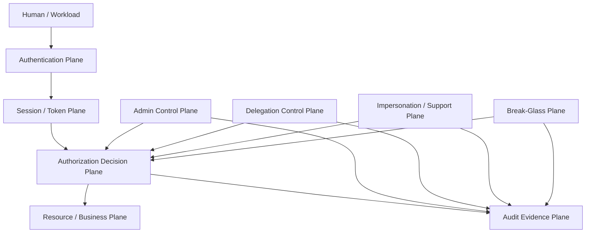
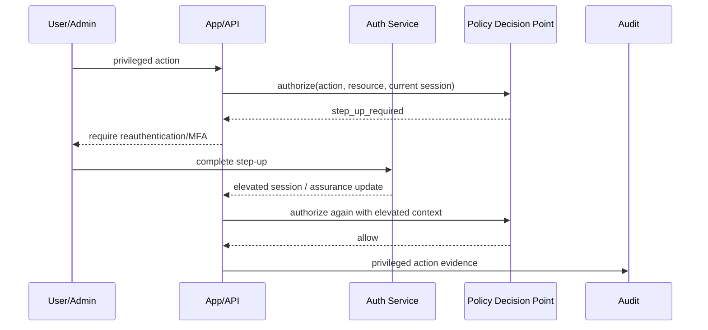
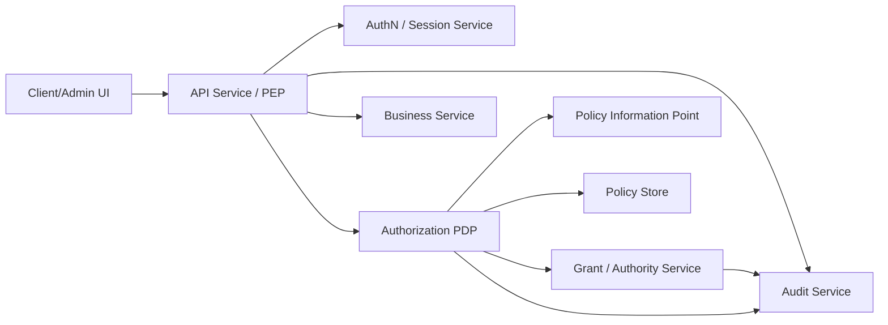
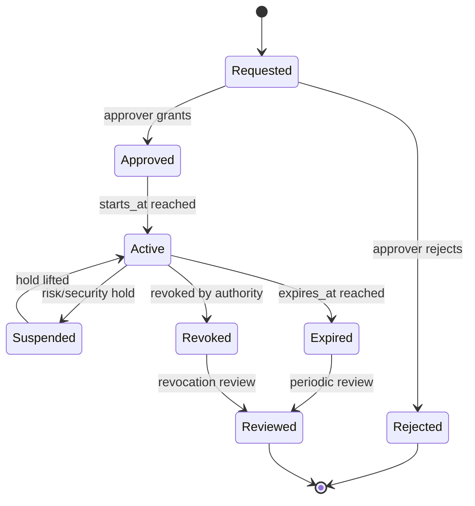
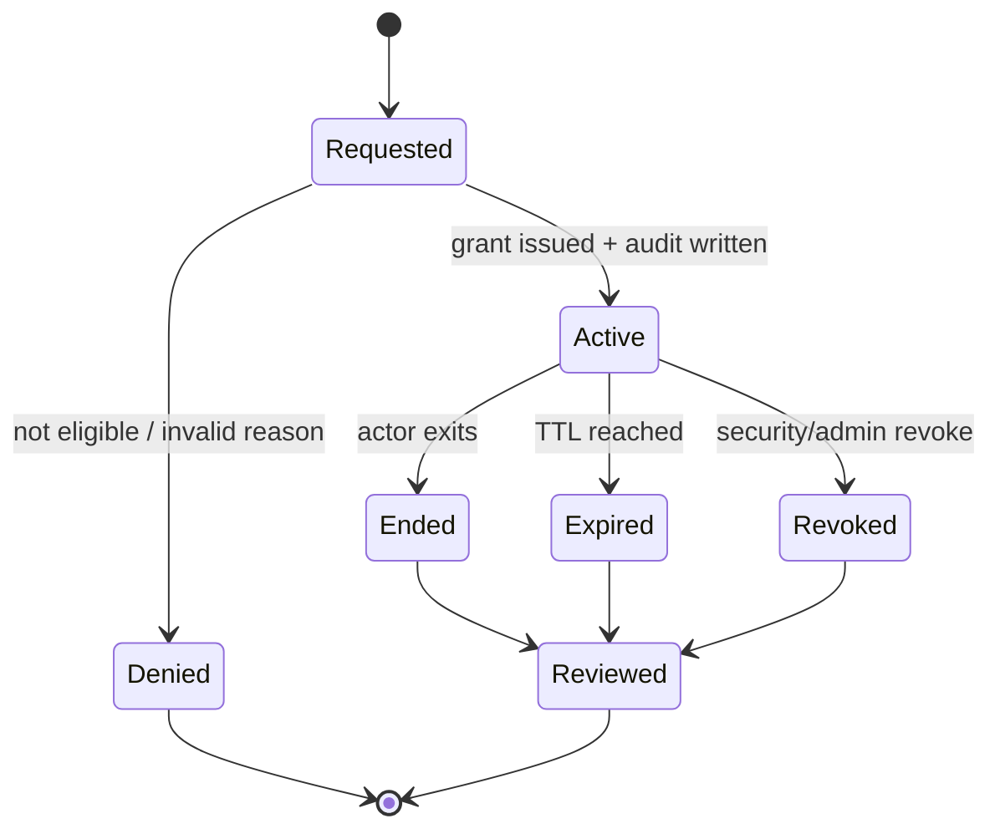
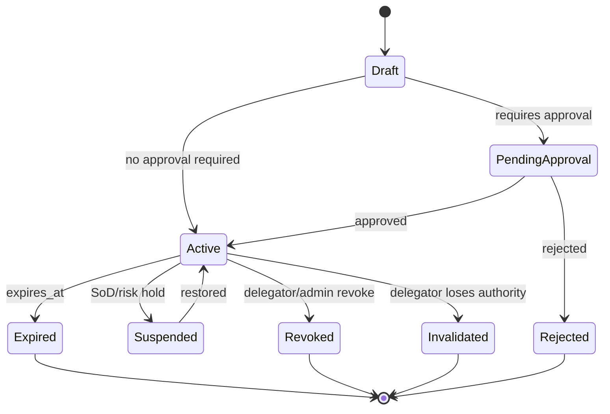
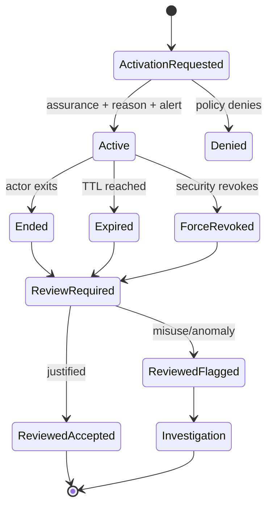

# learn-go-authentication-authorization-identity-permission-part-032.md

# Part 032 — Admin, Impersonation, Delegated Access, Break-Glass Access

> Seri: `learn-go-authentication-authorization-identity-permission`  
> Target runtime: Go 1.26.x  
> Level: Advanced / internal engineering handbook  
> Fokus: privileged access, support access, delegated authority, emergency access, auditability, dan regulatory defensibility.

---

## Daftar Isi

1. [Posisi Part Ini dalam Seri](#1-posisi-part-ini-dalam-seri)
2. [Learning Objectives](#2-learning-objectives)
3. [Masalah Inti: Semua Orang Menyebutnya Admin, Padahal Berbeda](#3-masalah-inti-semua-orang-menyebutnya-admin-padahal-berbeda)
4. [Terminologi Presisi](#4-terminologi-presisi)
5. [Mental Model: Authority Plane](#5-mental-model-authority-plane)
6. [Core Invariants](#6-core-invariants)
7. [Authority Taxonomy](#7-authority-taxonomy)
8. [Admin Access](#8-admin-access)
9. [Impersonation](#9-impersonation)
10. [Delegated Access](#10-delegated-access)
11. [Break-Glass Access](#11-break-glass-access)
12. [Step-Up, Reauthentication, and Session Upgrade](#12-step-up-reauthentication-and-session-upgrade)
13. [Architecture: PEP, PDP, Grant Service, Audit Service](#13-architecture-pep-pdp-grant-service-audit-service)
14. [Go Domain Model](#14-go-domain-model)
15. [Relational Schema Reference](#15-relational-schema-reference)
16. [State Machines](#16-state-machines)
17. [HTTP/gRPC Enforcement Pattern](#17-httpgrpc-enforcement-pattern)
18. [Policy Decision Contract](#18-policy-decision-contract)
19. [Audit Evidence Model](#19-audit-evidence-model)
20. [Multi-Tenant Considerations](#20-multi-tenant-considerations)
21. [Workflow and Regulatory Case Management Considerations](#21-workflow-and-regulatory-case-management-considerations)
22. [Admin UI and UX Guardrails](#22-admin-ui-and-ux-guardrails)
23. [Operational Runbooks](#23-operational-runbooks)
24. [Testing Strategy](#24-testing-strategy)
25. [Failure-Mode Matrix](#25-failure-mode-matrix)
26. [Anti-Patterns](#26-anti-patterns)
27. [Production Checklist](#27-production-checklist)
28. [Case Study: Regulatory Case Management Platform](#28-case-study-regulatory-case-management-platform)
29. [Review Questions](#29-review-questions)
30. [Referensi Primer](#30-referensi-primer)
31. [Penutup](#31-penutup)

---

## 1. Posisi Part Ini dalam Seri

Part sebelumnya membangun fondasi:

- identity domain model,
- authentication,
- assurance,
- session/token lifecycle,
- OAuth/OIDC/federation,
- authorization model,
- RBAC/ABAC/ReBAC,
- policy-as-code,
- capability-based access,
- multi-tenant authorization,
- service-to-service auth,
- gateway vs service-level authorization,
- distributed authorization consistency,
- auditability and regulatory defensibility.

Part ini masuk ke salah satu area paling berbahaya dalam sistem enterprise: **privileged authority**.

Banyak sistem tampak aman untuk user biasa, tetapi runtuh ketika masuk ke:

- admin dashboard,
- support staff yang “login as user”,
- delegated approval,
- emergency override,
- maintenance script,
- production support,
- vendor/operator access,
- legal/regulatory access,
- cross-tenant operation,
- incident response.

Masalahnya bukan hanya apakah admin boleh melakukan sesuatu. Masalah sebenarnya adalah:

> Apakah sistem dapat membuktikan, setelah kejadian, siapa bertindak, sebagai siapa, berdasarkan authority apa, terhadap resource apa, dengan policy versi mana, dalam konteks risiko apa, dan apakah authority itu valid pada saat tindakan dilakukan?

Itu alasan part ini sangat erat dengan Part 031 tentang auditability.

---

## 2. Learning Objectives

Setelah menyelesaikan part ini, Anda harus mampu:

1. Membedakan **admin access**, **impersonation**, **delegation**, dan **break-glass access** secara presisi.
2. Mendesain model authority yang tidak mencampur actor, subject, role, grant, session, dan policy.
3. Membuat state machine untuk privileged access lifecycle.
4. Mendesain admin access yang least-privilege, time-bound, approval-aware, dan auditable.
5. Mendesain impersonation yang transparan, terbatas, eksplisit, dan forensic-safe.
6. Mendesain delegated access yang attenuated, revocable, dan tidak berubah menjadi hidden privilege escalation.
7. Mendesain break-glass access sebagai emergency mechanism, bukan super-admin shortcut.
8. Menurunkan desain tersebut ke Go domain types, interfaces, middleware, gRPC interceptors, schema, dan audit events.
9. Menguji failure mode: stale grant, revoked delegation, cross-tenant impersonation, missing audit, approval bypass, policy cache staleness, dan privilege leak.
10. Membuat checklist produksi untuk privileged access dalam sistem enterprise/regulatory.

---

## 3. Masalah Inti: Semua Orang Menyebutnya Admin, Padahal Berbeda

Sistem yang lemah biasanya memiliki model seperti ini:

```go
if user.Role == "admin" {
    // allow everything
}
```

Atau lebih buruk:

```go
if user.IsAdmin {
    ctx = context.WithValue(ctx, "user_id", targetUserID)
}
```

Dua contoh ini tampak praktis, tetapi menghancurkan banyak invariant:

- actor asli hilang,
- subject yang diwakili tercampur,
- audit menjadi menipu,
- tenant boundary mudah bocor,
- role admin terlalu luas,
- tidak ada approval,
- tidak ada expiry,
- tidak ada reason code,
- tidak ada policy version,
- tidak ada revocation path,
- tidak ada forensic reconstruction.

Dalam sistem serius, privilege tidak boleh diperlakukan sebagai boolean.

Privilege harus diperlakukan sebagai **authority instance**.

Authority instance memiliki:

- siapa actor-nya,
- siapa subject-nya,
- authority source-nya,
- grant ID-nya,
- scope-nya,
- resource constraints-nya,
- tenant boundary-nya,
- approval chain-nya,
- start time,
- expiry time,
- revocation status,
- reason code,
- evidence,
- policy version,
- audit correlation ID.

---

## 4. Terminologi Presisi

### 4.1 Admin Access

**Admin access** adalah access yang diberikan kepada principal karena ia memiliki administrative responsibility terhadap sistem, tenant, module, atau resource class.

Contoh:

- user management admin,
- tenant admin,
- case assignment manager,
- security officer,
- system configuration admin,
- audit reviewer,
- workflow administrator.

Admin access bukan berarti “boleh semua”. Admin access harus tetap:

- scoped,
- least-privilege,
- auditable,
- time-bound untuk privilege tinggi,
- subject to separation of duties,
- subject to step-up authentication.

### 4.2 Impersonation

**Impersonation** adalah mode ketika actor A bertindak **as if** subject B untuk tujuan tertentu.

Contoh:

- support officer melihat tampilan user untuk debugging,
- helpdesk melakukan tindakan terbatas atas nama user,
- investigator membuka case view sebagai officer tertentu untuk reproduksi issue.

Dalam impersonation, sistem harus tetap menyimpan dua identitas:

```text
actor  = support officer asli
subject = user yang sedang di-impersonate
```

Jika audit hanya menulis subject, audit menjadi salah.

### 4.3 Delegation

**Delegation** adalah authority yang secara eksplisit diberikan dari delegator kepada delegatee untuk melakukan subset tindakan tertentu.

Contoh:

- manager mendelegasikan approval selama cuti,
- officer mendelegasikan review dokumen ke officer lain,
- agency admin memberi vendor akses terbatas ke module tertentu,
- user memberi aplikasi akses scoped melalui OAuth.

Delegation yang sehat harus:

- lebih sempit dari authority delegator,
- punya expiry,
- revocable,
- punya scope/resource/action constraints,
- punya audit trail,
- tidak boleh memperluas privilege tanpa basis.

### 4.4 Break-Glass Access

**Break-glass access** adalah emergency access untuk kondisi luar biasa ketika normal control path tidak cukup cepat atau tidak tersedia.

Contoh:

- production outage kritikal,
- security incident,
- data corruption blocking public service,
- emergency legal/regulatory action,
- IdP outage yang memblokir semua admin normal,
- tenant-critical incident.

Break-glass bukan “admin lebih tinggi”.

Break-glass adalah **exception path** dengan:

- stronger authentication,
- justification,
- time limit sangat pendek,
- automatic alert,
- immutable audit,
- post-event review,
- possible dual control,
- restricted operations,
- no silent use.

### 4.5 Privilege Elevation

**Privilege elevation** adalah transisi dari normal session ke elevated session.

Elevation dapat terjadi karena:

- step-up authentication,
- approval,
- break-glass activation,
- JIT admin grant,
- temporary role activation,
- privileged command confirmation.

Elevation harus menghasilkan **session class** atau **authority context** baru, bukan sekadar menambahkan role ke session lama tanpa bukti.

### 4.6 Delegation vs Impersonation

| Aspek | Delegation | Impersonation |
|---|---|---|
| Siapa memberi authority? | Delegator atau system policy | Admin/support policy |
| Subject yang tampak | Delegatee bertindak dengan authority terbatas dari delegator | Actor bertindak sebagai subject tertentu |
| Audit utama | Actor + delegator + grant | Actor + impersonated subject + reason |
| Apakah user harus tahu? | Tergantung domain, biasanya ya untuk business delegation | Biasanya harus ada transparency/log/notification untuk high-risk |
| Risk | Scope terlalu luas | Identity confusion dan audit deception |
| Model bagus | Attenuated grant | Explicit dual identity session |

### 4.7 Impersonation vs Break-Glass

| Aspek | Impersonation | Break-Glass |
|---|---|---|
| Tujuan | Support/debug/assist user | Emergency response |
| Normalitas | Bisa jadi controlled normal workflow | Exception path |
| Durasi | Pendek, case-bound/user-bound | Sangat pendek, incident-bound |
| Approval | Bisa pre-approved berdasarkan role | Bisa dual-control atau post-review tergantung urgency |
| Alerting | Recommended | Mandatory |
| Audit severity | High | Critical |

---

## 5. Mental Model: Authority Plane

Bayangkan auth system enterprise sebagai beberapa plane:



Auth biasa menjawab:

```text
Can principal P perform action A on resource R?
```

Privileged access menjawab pertanyaan lebih kaya:

```text
Can actor X, acting under authority Y,
possibly as subject Z,
perform action A on resource R,
inside tenant T,
for reason K,
at time now,
given policy version V,
with assurance level L?
```

Inilah bedanya sistem biasa dengan sistem enterprise-grade.

---

## 6. Core Invariants

### Invariant 1 — Actor tidak boleh hilang

Dalam semua privileged action, actor asli harus selalu ada.

Buruk:

```json
{
  "user_id": "target-user-123",
  "action": "update_email"
}
```

Baik:

```json
{
  "actor_id": "support-officer-999",
  "subject_id": "target-user-123",
  "authority_type": "IMPERSONATION",
  "authority_id": "imp-2026-0001",
  "action": "update_email"
}
```

### Invariant 2 — Authority harus eksplisit

Akses privileged tidak boleh muncul dari implicit side effect.

Buruk:

```go
if isSupport(ctx) {
    ctx = withUser(ctx, targetUser)
}
```

Baik:

```go
authCtx := AuthContext{
    Actor:     supportOfficer,
    Subject:   targetUser,
    Authority: ImpersonationAuthority{ID: grantID, Reason: reason},
}
```

### Invariant 3 — Authority harus lebih sempit dari sumbernya

Delegation tidak boleh menghasilkan privilege lebih luas daripada delegator.

Jika manager hanya boleh approve case dalam `region=A`, delegatee tidak boleh mendapat approval untuk `region=B`.

### Invariant 4 — Elevated authority harus time-bound

Privilege tinggi harus punya expiry.

Untuk tindakan high-risk:

- session pendek,
- idle timeout pendek,
- absolute timeout pendek,
- step-up required,
- renewal explicit.

### Invariant 5 — Audit tidak boleh optional

Jika audit writer gagal, sistem harus memutuskan:

- fail-closed untuk high-risk privileged command,
- queue durable untuk lower-risk read,
- degraded mode hanya dengan risk acceptance eksplisit.

Silent audit failure adalah desain buruk.

### Invariant 6 — Break-glass harus menimbulkan suara

Break-glass yang tidak mengirim alert adalah backdoor.

Minimal:

- alert security/on-call,
- audit event severity critical,
- post-event review ticket,
- reason required,
- session recording metadata,
- auto-expiry.

### Invariant 7 — Admin tidak boleh mengelola audit dirinya sendiri

Ini separation-of-duties.

Security/admin user yang bisa:

- memberi dirinya role,
- menggunakan break-glass,
- menghapus audit,
- menutup review,

adalah kombinasi berbahaya.

### Invariant 8 — Token/session tidak boleh menjadi satu-satunya sumber kebenaran authority

Untuk privileged authority, token claims harus dianggap snapshot terbatas.

PDP tetap harus bisa mengecek:

- grant masih aktif,
- tidak revoked,
- policy version valid,
- actor masih eligible,
- tenant/resource masih sesuai,
- approval belum expired.

### Invariant 9 — Deny by default

Jika authority context ambigu, stale, missing, invalid, expired, atau tidak bisa diverifikasi, default-nya deny.

---

## 7. Authority Taxonomy

Authority dalam sistem enterprise dapat berasal dari banyak sumber.

| Authority Type | Contoh | Durasi | Risiko Utama | Kontrol Wajib |
|---|---|---:|---|---|
| Direct Role | Tenant admin | Long-lived | privilege creep | review berkala |
| JIT Role | elevated admin selama 30 menit | short | approval bypass | approval + expiry |
| Delegated Grant | manager cuti delegasikan approval | medium | over-delegation | attenuated scope |
| Impersonation Grant | support login as user | short | audit deception | dual identity audit |
| Break-Glass Grant | emergency prod fix | very short | backdoor | alert + review |
| System Grant | batch job performs system action | medium | confused deputy | workload identity |
| Legal/Regulatory Grant | investigator access | bounded | privacy breach | reason + evidence |
| Workflow Authority | assigned case officer | workflow-bound | stale assignment | assignment freshness |
| Data Owner Grant | owner can share document | bounded | uncontrolled sharing | revocation + audit |

Authority bukan sekadar role. Authority adalah alasan formal mengapa tindakan boleh dilakukan.

---

## 8. Admin Access

### 8.1 Admin sebagai Capability, Bukan Identity

Jangan desain seperti ini:

```text
Fajar is admin.
```

Desain lebih sehat:

```text
Fajar has UserManagement.Admin role for tenant CEA,
effective 2026-06-01 to 2026-09-01,
approved by SecurityOfficer,
limited to actions: user.read, user.lock, user.reset_mfa,
excluding: grant_admin, delete_audit.
```

Admin harus diperlakukan sebagai authority assignment yang punya:

- domain,
- scope,
- action set,
- expiry/review date,
- approver,
- SoD constraints,
- audit record.

### 8.2 Admin Role Classification

| Admin Class | Deskripsi | Contoh |
|---|---|---|
| Business Admin | Mengelola proses bisnis | case manager, module admin |
| Tenant Admin | Mengelola user/config tenant | agency admin |
| Security Admin | Mengelola security control | role admin, policy admin |
| Platform Admin | Mengelola infra/runtime | SRE/platform engineer |
| Audit Admin | Mengakses/review audit | compliance auditor |
| Support Admin | Membantu user | helpdesk/support officer |
| Emergency Admin | Emergency-only | break-glass operator |

Setiap class punya risk berbeda.

Misalnya, **Security Admin** tidak otomatis boleh melihat case data. **Business Admin** tidak otomatis boleh mengubah security policy. **Audit Admin** tidak otomatis boleh memodifikasi audit.

### 8.3 Admin Session

Admin operation sebaiknya memakai session class terpisah:

```text
normal session      -> browsing, normal actions
elevated session    -> privileged admin actions
break-glass session -> emergency actions
impersonation       -> support actions as another subject
```

Dalam Go:

```go
type SessionClass string

const (
    SessionNormal       SessionClass = "NORMAL"
    SessionElevated     SessionClass = "ELEVATED"
    SessionImpersonated SessionClass = "IMPERSONATED"
    SessionBreakGlass   SessionClass = "BREAK_GLASS"
)
```

### 8.4 Admin Actions Must Be Explicit

Jangan gunakan generic permission seperti:

```text
admin:* 
```

Untuk sistem serius, pecah action:

```text
user.read
user.lock
user.unlock
user.reset_password
user.reset_mfa
user.assign_role
user.revoke_role
policy.publish
audit.read
audit.export
case.reassign
case.override_status
case.force_close
config.update
```

Semakin tinggi risiko action, semakin spesifik permission-nya.

### 8.5 Admin Approval Pattern

Untuk high-risk action, gunakan approval.

Contoh high-risk:

- grant admin role,
- revoke MFA,
- disable user,
- export bulk personal data,
- change policy,
- break-glass activation,
- cross-tenant access,
- delete/close regulatory case,
- override workflow state.

Approval policy bisa:

- no approval,
- self-step-up only,
- manager approval,
- security approval,
- dual approval,
- post-review only for emergency.

---

## 9. Impersonation

### 9.1 Impersonation Problem

Impersonation berguna untuk support, tetapi berbahaya karena:

- actor asli bisa hilang,
- audit bisa tampak seolah user melakukan aksi,
- support bisa melihat data sensitif,
- support bisa melakukan high-risk action,
- cross-tenant leak mudah terjadi,
- user trust rusak jika tidak transparan,
- incident investigation menjadi kacau.

### 9.2 Correct Impersonation Model

Impersonation session harus membawa dua identitas:

```go
type IdentityContext struct {
    Actor   PrincipalRef // real authenticated operator
    Subject PrincipalRef // impersonated user
}
```

Contoh:

```text
actor   = helpdesk:alice
subject = user:bob
tenant  = tenant:cea
authority = impersonation grant IMP-2026-000912
reason = reproduce login issue ticket INC-2026-1234
```

### 9.3 Impersonation Must Be Visible

Impersonation UX harus jelas:

- banner “You are impersonating Bob”,
- actor cannot forget they are in impersonation mode,
- dangerous actions disabled by default,
- exit impersonation button obvious,
- session timeout short,
- optional notification to target user/domain owner,
- every action logged with actor + subject.

### 9.4 Read-Only vs Write Impersonation

Rekomendasi default:

```text
impersonation = read-only unless explicitly approved
```

Write impersonation harus sangat terbatas.

Bahkan jika write diperbolehkan, beberapa action sebaiknya tetap dilarang:

- change password,
- reset MFA,
- enroll new MFA factor,
- change recovery email,
- export sensitive data,
- grant role,
- approve own case,
- delete audit,
- change account ownership,
- modify consent/delegation grant.

### 9.5 Impersonation Token Design

Jika memakai token/session claim, jangan mengganti `sub` begitu saja tanpa actor.

Buruk:

```json
{
  "sub": "target-user-123",
  "role": "user"
}
```

Baik:

```json
{
  "sub": "target-user-123",
  "act": {
    "sub": "support-officer-999"
  },
  "authority_type": "impersonation",
  "authority_id": "imp-2026-0001",
  "tenant_id": "tenant-cea",
  "reason_code": "support_ticket",
  "ticket_id": "INC-2026-1234",
  "exp": 1780000000
}
```

Namun token claim saja tidak cukup. Resource service tetap perlu mengecek authority validity jika risikonya tinggi.

### 9.6 Impersonation Decision Rules

PEP/PDP harus mengecek:

- actor authenticated,
- actor has support role,
- actor eligible for target tenant,
- target subject belongs to allowed tenant,
- impersonation grant active,
- grant not expired,
- grant not revoked,
- reason code provided,
- target action allowed under impersonation mode,
- resource belongs to subject/tenant,
- action not prohibited for impersonation,
- audit can be written.

### 9.7 Impersonation Audit Event

Setiap session start:

```json
{
  "event_type": "IMPERSONATION_STARTED",
  "severity": "HIGH",
  "actor_id": "support-officer-999",
  "subject_id": "user-123",
  "tenant_id": "tenant-cea",
  "authority_id": "imp-2026-0001",
  "reason_code": "SUPPORT_TICKET",
  "ticket_id": "INC-2026-1234",
  "expires_at": "2026-06-24T16:30:00Z"
}
```

Setiap action:

```json
{
  "event_type": "IMPERSONATED_ACTION",
  "actor_id": "support-officer-999",
  "subject_id": "user-123",
  "action": "case.view",
  "resource_type": "case",
  "resource_id": "case-777",
  "authority_id": "imp-2026-0001",
  "decision_id": "dec-abc",
  "policy_version": "policy-2026-06-01"
}
```

### 9.8 Impersonation in Go Context

Jangan taruh hanya `UserID` di context.

Gunakan struktur eksplisit:

```go
type AuthContext struct {
    Actor       PrincipalRef
    Subject     PrincipalRef
    Tenant      TenantRef
    SessionID   string
    SessionClass SessionClass
    Authority   AuthorityContext
    Assurance   AssuranceContext
}

func (a AuthContext) IsImpersonated() bool {
    return a.SessionClass == SessionImpersonated && a.Actor.ID != a.Subject.ID
}
```

---

## 10. Delegated Access

### 10.1 Delegation Mental Model

Delegation bukan impersonation.

Delegation berarti:

```text
Delegator gives Delegatee limited authority to perform specific actions.
```

Delegatee tetap bertindak sebagai dirinya sendiri, tetapi membawa authority dari delegator.

Contoh:

```text
Actor: officer-b
Authority source: delegated by officer-a
Allowed actions: case.review, document.comment
Resources: cases assigned to officer-a in tenant CEA
Expiry: 2026-07-01
```

### 10.2 Delegation Must Be Attenuated

Delegasi harus lebih sempit atau sama sempitnya dari authority delegator.

Jika delegator punya:

```text
case.approve where region = north and amount <= 10000
```

Delegation tidak boleh memberi:

```text
case.approve where region = all and amount <= 100000
```

### 10.3 Delegation Types

| Type | Contoh | Risk |
|---|---|---|
| User-to-user | manager delegates approval | over-delegation |
| Role-based delegation | tenant admin assigns temporary operator | role creep |
| Workflow delegation | assigned officer delegates task | stale assignment |
| OAuth app delegation | user grants app scope | consent abuse |
| Service delegation | service calls downstream on behalf of user | confused deputy |
| Legal delegation | authorized representative | identity proofing gap |

### 10.4 Delegation Grant Structure

```go
type DelegationGrant struct {
    ID           string
    TenantID     string
    DelegatorID  string
    DelegateeID  string
    Actions      []Action
    ResourceSet  ResourceSelector
    Conditions   []Condition
    Reason       string
    CreatedAt    time.Time
    StartsAt     time.Time
    ExpiresAt    time.Time
    RevokedAt    *time.Time
    ApprovedBy   []string
    PolicyVersion string
}
```

### 10.5 Delegation Decision Logic

```text
allow if:
  actor == delegatee
  grant.active(now)
  grant.tenant == request.tenant
  request.action in grant.actions
  request.resource matches grant.resource_selector
  request.context satisfies grant.conditions
  delegator still has authority or policy allows snapshot delegation
  no SoD conflict
  no explicit deny
```

Salah satu keputusan penting:

> Apakah delegation mengikuti authority delegator secara dinamis, atau snapshot saat grant dibuat?

#### Dynamic delegation

Jika delegator kehilangan role, delegation ikut tidak valid.

Kelebihan:

- lebih aman terhadap stale privilege.

Kekurangan:

- butuh check tambahan,
- bisa membuat delegation mendadak gagal.

#### Snapshot delegation

Delegation tetap valid sampai expiry/revoke walau delegator berubah.

Kelebihan:

- stabil untuk operasi bisnis.

Kekurangan:

- risk stale authority.

Rekomendasi enterprise:

- high-risk action: dynamic atau short snapshot,
- low-risk workflow delegation: bounded snapshot,
- selalu ada revocation path.

### 10.6 Delegation and OAuth Token Exchange

OAuth 2.0 Token Exchange RFC 8693 relevan untuk sistem yang perlu menukar token agar downstream service dapat memahami delegation atau impersonation.

Konsep penting:

- `subject_token`: token subject awal,
- `actor_token`: token actor,
- requested token type,
- audience,
- scope,
- issued token yang membawa delegation/impersonation semantics.

Dalam service-to-service call:

```text
Frontend/API receives user token
Service A needs to call Service B on behalf of user
Service A requests token exchange
Authorization Server issues token for Service B audience
Token includes actor/service chain or delegated authority
```

Jangan forward token user mentah ke semua downstream service tanpa audience control.

---

## 11. Break-Glass Access

### 11.1 Break-Glass Is Not Super Admin

Break-glass bukan role permanen.

Break-glass adalah emergency protocol.

Buruk:

```text
Role: super_admin
Password: known by ops team
Use when things go wrong
```

Baik:

```text
Break-glass account protected by phishing-resistant MFA,
activation requires reason + incident ID,
session expires in 15 minutes,
triggers pager alert,
all commands audited,
post-review required,
access automatically disabled after use.
```

### 11.2 Break-Glass Triggers

Break-glass hanya untuk kondisi seperti:

- production outage P1,
- security incident containment,
- IdP unavailable and admin access blocked,
- corruption recovery,
- emergency regulatory/legal operation,
- critical public-service impact,
- safety-critical business process blocked.

Bukan untuk:

- convenience,
- bypass approval karena malas,
- routine maintenance,
- testing,
- avoiding workflow,
- data browsing.

### 11.3 Break-Glass Controls

Minimum controls:

1. Separate account or separate authority path.
2. Strong/phishing-resistant MFA.
3. Explicit activation flow.
4. Incident ID or reason code.
5. Very short TTL.
6. Automatic alert.
7. Immutable audit.
8. Session activity recording metadata.
9. Post-event review.
10. Automatic revoke/disable.
11. Periodic drill.
12. SoD: user who activates should not solely approve closure.

### 11.4 Break-Glass Decision Model

```text
allow if:
  actor authenticated with required AAL
  actor in break-glass eligible set
  break-glass activation active
  activation not expired
  reason/incident ID present
  target action allowed under emergency policy
  resource/tenant in emergency scope
  audit path available
  alert dispatch succeeded or durable alert queued
```

### 11.5 Break-Glass Alert

Alert should include:

- actor,
- tenant,
- incident ID,
- reason,
- source IP/device,
- start time,
- expected expiry,
- action scope,
- session ID,
- review link.

### 11.6 Break-Glass Audit Severity

Break-glass event severity should be critical:

```json
{
  "event_type": "BREAK_GLASS_ACTIVATED",
  "severity": "CRITICAL",
  "actor_id": "operator-123",
  "tenant_id": "tenant-cea",
  "incident_id": "INC-P1-2026-06-24",
  "reason": "IdP outage blocks emergency case reassignment",
  "expires_at": "2026-06-24T17:15:00Z",
  "alert_id": "pager-9981"
}
```

### 11.7 Break-Glass Review

After session ends:

- reviewer must inspect all actions,
- verify reason was valid,
- verify actions were proportional,
- flag anomalies,
- attach incident postmortem,
- revoke if still active,
- update policy/runbook if misuse or gap found.

---

## 12. Step-Up, Reauthentication, and Session Upgrade

Privileged actions often require stronger assurance than normal browsing.

Examples requiring step-up:

- grant/revoke role,
- reset MFA,
- export bulk data,
- impersonate user,
- activate break-glass,
- approve high-value transaction,
- publish policy,
- change tenant config,
- access sealed case,
- execute destructive command.

### 12.1 Session Upgrade Pattern



### 12.2 Freshness

Step-up is not only factor type, but freshness.

An MFA from 8 hours ago should not authorize a critical admin action now.

Model:

```go
type AssuranceContext struct {
    AAL              int
    Methods          []string
    AuthenticatedAt  time.Time
    LastStepUpAt     *time.Time
    FreshUntil       time.Time
}
```

### 12.3 Step-Up Should Not Mutate Normal Session Silently

Better patterns:

- issue elevated session ID,
- bind elevated authority to current session,
- short TTL,
- separate audit event,
- explicit UI indicator.

---

## 13. Architecture: PEP, PDP, Grant Service, Audit Service

### 13.1 Component Model



### 13.2 Responsibility Boundaries

| Component | Responsibility |
|---|---|
| AuthN/Session Service | authenticate actor, issue session, track assurance |
| Grant Service | create/revoke/check admin/delegation/impersonation/break-glass grants |
| PDP | decide if request is allowed under policy and authority |
| PEP | enforce decision at HTTP/gRPC/business boundary |
| PIP | fetch attributes: role, tenant, assignment, risk, resource metadata |
| Audit Service | durable evidence for grant lifecycle and privileged action |
| Notification/Alert Service | alert for break-glass/high-risk privileged activity |

### 13.3 Why Grant Service Should Exist

Without explicit Grant Service, authority gets scattered across:

- role table,
- session claims,
- config flags,
- feature toggles,
- admin UI code,
- support scripts,
- manual DB updates.

Grant Service centralizes authority lifecycle.

---

## 14. Go Domain Model

### 14.1 Core Types

```go
package authz

import "time"

type PrincipalID string
type TenantID string
type ResourceID string
type Action string
type AuthorityID string

type PrincipalKind string

const (
    PrincipalHuman   PrincipalKind = "HUMAN"
    PrincipalService PrincipalKind = "SERVICE"
)

type PrincipalRef struct {
    ID     PrincipalID
    Kind   PrincipalKind
    Tenant TenantID
}

type AuthorityType string

const (
    AuthorityDirectRole    AuthorityType = "DIRECT_ROLE"
    AuthorityJITRole       AuthorityType = "JIT_ROLE"
    AuthorityDelegation    AuthorityType = "DELEGATION"
    AuthorityImpersonation AuthorityType = "IMPERSONATION"
    AuthorityBreakGlass    AuthorityType = "BREAK_GLASS"
    AuthorityWorkflow      AuthorityType = "WORKFLOW"
    AuthoritySystem        AuthorityType = "SYSTEM"
)

type AuthorityContext struct {
    ID            AuthorityID
    Type          AuthorityType
    Source        string
    ReasonCode    string
    TicketID      string
    IncidentID    string
    PolicyVersion string
    GrantedAt     time.Time
    ExpiresAt     time.Time
}

type AuthContext struct {
    Actor        PrincipalRef
    Subject      PrincipalRef
    Tenant       TenantID
    SessionID    string
    SessionClass SessionClass
    Authority    AuthorityContext
    Assurance    AssuranceContext
}
```

### 14.2 Action and Resource

```go
type ResourceRef struct {
    Type     string
    ID       ResourceID
    TenantID TenantID
    OwnerID  PrincipalID
    Labels   map[string]string
}

type AuthorizeRequest struct {
    Auth      AuthContext
    Action    Action
    Resource  ResourceRef
    Context   map[string]any
    RequestID string
    Now       time.Time
}
```

### 14.3 Decision

```go
type DecisionEffect string

const (
    Allow DecisionEffect = "ALLOW"
    Deny  DecisionEffect = "DENY"
)

type Decision struct {
    ID            string
    Effect        DecisionEffect
    Reason        string
    Obligations   []Obligation
    PolicyVersion string
    Evidence      map[string]any
}

type Obligation struct {
    Type string
    Data map[string]any
}
```

### 14.4 Grant Service Interface

```go
type GrantService interface {
    CreateDelegation(ctx context.Context, cmd CreateDelegationCommand) (DelegationGrant, error)
    RevokeDelegation(ctx context.Context, id AuthorityID, reason string) error

    StartImpersonation(ctx context.Context, cmd StartImpersonationCommand) (ImpersonationSession, error)
    EndImpersonation(ctx context.Context, id AuthorityID) error

    ActivateBreakGlass(ctx context.Context, cmd ActivateBreakGlassCommand) (BreakGlassSession, error)
    EndBreakGlass(ctx context.Context, id AuthorityID) error

    ValidateAuthority(ctx context.Context, auth AuthContext, action Action, resource ResourceRef) (AuthorityValidation, error)
}
```

### 14.5 Commands

```go
type StartImpersonationCommand struct {
    ActorID        PrincipalID
    TargetSubjectID PrincipalID
    TenantID       TenantID
    ReasonCode     string
    TicketID        string
    RequestedActions []Action
    Duration       time.Duration
}

type CreateDelegationCommand struct {
    DelegatorID PrincipalID
    DelegateeID PrincipalID
    TenantID    TenantID
    Actions     []Action
    Resources   ResourceSelector
    Conditions  []Condition
    StartsAt    time.Time
    ExpiresAt   time.Time
    Reason      string
}

type ActivateBreakGlassCommand struct {
    ActorID     PrincipalID
    TenantID    TenantID
    IncidentID  string
    Reason      string
    Scope       EmergencyScope
    Duration    time.Duration
    Assurance   AssuranceContext
}
```

### 14.6 Resource Selector

```go
type ResourceSelector struct {
    ResourceType string
    TenantID     TenantID
    IDs          []ResourceID
    Labels       map[string]string
    Query        map[string]any
}
```

Be careful: resource selector can become an injection vector if it is translated blindly into SQL. Always compile selectors into safe repository constraints.

---

## 15. Relational Schema Reference

### 15.1 Privileged Role Assignment

```sql
CREATE TABLE privileged_role_assignment (
    id                  VARCHAR(64) PRIMARY KEY,
    tenant_id            VARCHAR(64) NOT NULL,
    principal_id         VARCHAR(64) NOT NULL,
    role_code            VARCHAR(128) NOT NULL,
    scope_type           VARCHAR(64) NOT NULL,
    scope_id             VARCHAR(128),
    starts_at            TIMESTAMP NOT NULL,
    expires_at           TIMESTAMP,
    review_due_at        TIMESTAMP,
    status               VARCHAR(32) NOT NULL,
    created_by           VARCHAR(64) NOT NULL,
    approved_by          VARCHAR(64),
    created_at           TIMESTAMP NOT NULL,
    updated_at           TIMESTAMP NOT NULL,
    revoked_at           TIMESTAMP,
    revoke_reason        VARCHAR(512)
);

CREATE INDEX idx_priv_role_principal
ON privileged_role_assignment (tenant_id, principal_id, status);
```

### 15.2 Delegation Grant

```sql
CREATE TABLE delegation_grant (
    id                  VARCHAR(64) PRIMARY KEY,
    tenant_id            VARCHAR(64) NOT NULL,
    delegator_id         VARCHAR(64) NOT NULL,
    delegatee_id         VARCHAR(64) NOT NULL,
    actions_json         CLOB NOT NULL,
    resource_selector_json CLOB NOT NULL,
    conditions_json      CLOB,
    starts_at            TIMESTAMP NOT NULL,
    expires_at           TIMESTAMP NOT NULL,
    status               VARCHAR(32) NOT NULL,
    reason               VARCHAR(512) NOT NULL,
    policy_version       VARCHAR(128) NOT NULL,
    created_at           TIMESTAMP NOT NULL,
    revoked_at           TIMESTAMP,
    revoked_by           VARCHAR(64),
    revoke_reason        VARCHAR(512)
);

CREATE INDEX idx_delegation_delegatee
ON delegation_grant (tenant_id, delegatee_id, status, expires_at);
```

### 15.3 Impersonation Session

```sql
CREATE TABLE impersonation_session (
    id                  VARCHAR(64) PRIMARY KEY,
    tenant_id            VARCHAR(64) NOT NULL,
    actor_id             VARCHAR(64) NOT NULL,
    subject_id           VARCHAR(64) NOT NULL,
    reason_code          VARCHAR(64) NOT NULL,
    ticket_id            VARCHAR(128),
    allowed_actions_json CLOB NOT NULL,
    status               VARCHAR(32) NOT NULL,
    started_at           TIMESTAMP NOT NULL,
    expires_at           TIMESTAMP NOT NULL,
    ended_at             TIMESTAMP,
    ended_by             VARCHAR(64),
    policy_version       VARCHAR(128) NOT NULL
);

CREATE INDEX idx_impersonation_actor
ON impersonation_session (tenant_id, actor_id, status, expires_at);
```

### 15.4 Break-Glass Session

```sql
CREATE TABLE break_glass_session (
    id                  VARCHAR(64) PRIMARY KEY,
    tenant_id            VARCHAR(64) NOT NULL,
    actor_id             VARCHAR(64) NOT NULL,
    incident_id          VARCHAR(128) NOT NULL,
    reason               VARCHAR(1024) NOT NULL,
    scope_json           CLOB NOT NULL,
    status               VARCHAR(32) NOT NULL,
    activated_at         TIMESTAMP NOT NULL,
    expires_at           TIMESTAMP NOT NULL,
    ended_at             TIMESTAMP,
    alert_id             VARCHAR(128),
    review_status        VARCHAR(32) NOT NULL,
    reviewed_by          VARCHAR(64),
    reviewed_at          TIMESTAMP,
    review_notes         CLOB,
    policy_version       VARCHAR(128) NOT NULL
);

CREATE INDEX idx_break_glass_active
ON break_glass_session (tenant_id, actor_id, status, expires_at);
```

### 15.5 Authority Audit Event

```sql
CREATE TABLE authority_audit_event (
    id                  VARCHAR(64) PRIMARY KEY,
    event_time           TIMESTAMP NOT NULL,
    tenant_id            VARCHAR(64) NOT NULL,
    event_type           VARCHAR(128) NOT NULL,
    severity             VARCHAR(32) NOT NULL,
    actor_id             VARCHAR(64) NOT NULL,
    subject_id           VARCHAR(64),
    authority_id         VARCHAR(64),
    authority_type       VARCHAR(64),
    action               VARCHAR(128),
    resource_type        VARCHAR(128),
    resource_id          VARCHAR(128),
    decision_id          VARCHAR(64),
    policy_version       VARCHAR(128),
    reason_code          VARCHAR(64),
    ticket_id            VARCHAR(128),
    incident_id          VARCHAR(128),
    request_id           VARCHAR(128),
    ip_address           VARCHAR(64),
    user_agent_hash      VARCHAR(128),
    evidence_json        CLOB,
    prev_hash            VARCHAR(128),
    event_hash           VARCHAR(128) NOT NULL
);

CREATE INDEX idx_authority_audit_actor_time
ON authority_audit_event (actor_id, event_time);

CREATE INDEX idx_authority_audit_authority
ON authority_audit_event (authority_id, event_time);
```

---

## 16. State Machines

### 16.1 Privileged Role Lifecycle



### 16.2 Impersonation Lifecycle



### 16.3 Delegation Lifecycle



### 16.4 Break-Glass Lifecycle



---

## 17. HTTP/gRPC Enforcement Pattern

### 17.1 HTTP Middleware Pattern

```go
type Authorizer interface {
    Authorize(ctx context.Context, req AuthorizeRequest) (Decision, error)
}

type AuditWriter interface {
    Write(ctx context.Context, event AuditEvent) error
}

func RequireAction(authorizer Authorizer, audit AuditWriter, action Action, resourceFn func(*http.Request) (ResourceRef, error)) func(http.Handler) http.Handler {
    return func(next http.Handler) http.Handler {
        return http.HandlerFunc(func(w http.ResponseWriter, r *http.Request) {
            authCtx, ok := AuthFromContext(r.Context())
            if !ok {
                http.Error(w, "unauthenticated", http.StatusUnauthorized)
                return
            }

            res, err := resourceFn(r)
            if err != nil {
                http.Error(w, "bad resource", http.StatusBadRequest)
                return
            }

            dec, err := authorizer.Authorize(r.Context(), AuthorizeRequest{
                Auth:      authCtx,
                Action:    action,
                Resource:  res,
                RequestID: r.Header.Get("X-Request-ID"),
                Now:       time.Now().UTC(),
            })
            if err != nil {
                http.Error(w, "authorization unavailable", http.StatusServiceUnavailable)
                return
            }

            if dec.Effect != Allow {
                _ = audit.Write(r.Context(), AuditEventFromDecision(authCtx, action, res, dec, "DENIED"))
                http.Error(w, "forbidden", http.StatusForbidden)
                return
            }

            for _, ob := range dec.Obligations {
                if ob.Type == "audit_required" {
                    if err := audit.Write(r.Context(), AuditEventFromDecision(authCtx, action, res, dec, "ALLOWED")); err != nil {
                        http.Error(w, "audit unavailable", http.StatusServiceUnavailable)
                        return
                    }
                }
            }

            next.ServeHTTP(w, r)
        })
    }
}
```

### 17.2 gRPC Unary Interceptor Pattern

```go
func UnaryAuthorizationInterceptor(authorizer Authorizer, audit AuditWriter, actionMapper ActionMapper) grpc.UnaryServerInterceptor {
    return func(ctx context.Context, req any, info *grpc.UnaryServerInfo, handler grpc.UnaryHandler) (any, error) {
        authCtx, ok := AuthFromContext(ctx)
        if !ok {
            return nil, status.Error(codes.Unauthenticated, "missing auth context")
        }

        action, resource, err := actionMapper.Map(info.FullMethod, req)
        if err != nil {
            return nil, status.Error(codes.InvalidArgument, "cannot map authorization target")
        }

        dec, err := authorizer.Authorize(ctx, AuthorizeRequest{
            Auth:     authCtx,
            Action:   action,
            Resource: resource,
            Now:      time.Now().UTC(),
        })
        if err != nil {
            return nil, status.Error(codes.Unavailable, "authorization unavailable")
        }
        if dec.Effect != Allow {
            _ = audit.Write(ctx, AuditEventFromDecision(authCtx, action, resource, dec, "DENIED"))
            return nil, status.Error(codes.PermissionDenied, "permission denied")
        }

        return handler(ctx, req)
    }
}
```

### 17.3 Why Enforcement Must Be Close to Business Operation

Gateway can enforce coarse access:

- authenticated,
- tenant selected,
- route allowed,
- token valid.

But service must enforce:

- resource belongs to tenant,
- actor has authority over specific object,
- impersonation allowed for this action,
- break-glass scope covers this resource,
- delegation covers this workflow stage,
- SoD does not block action,
- audit required before mutation.

---

## 18. Policy Decision Contract

### 18.1 Decision Input

Privileged access PDP needs more than role.

```json
{
  "actor": {
    "id": "officer-1",
    "type": "human",
    "tenant_id": "cea"
  },
  "subject": {
    "id": "user-9",
    "type": "human",
    "tenant_id": "cea"
  },
  "authority": {
    "type": "IMPERSONATION",
    "id": "imp-123",
    "reason_code": "SUPPORT_TICKET",
    "expires_at": "2026-06-24T17:00:00Z"
  },
  "session": {
    "class": "IMPERSONATED",
    "aal": 2,
    "last_step_up_at": "2026-06-24T16:15:00Z"
  },
  "action": "case.view",
  "resource": {
    "type": "case",
    "id": "case-777",
    "tenant_id": "cea",
    "classification": "restricted"
  },
  "environment": {
    "ip_risk": "low",
    "time": "2026-06-24T16:20:00Z"
  }
}
```

### 18.2 Decision Output

```json
{
  "effect": "ALLOW",
  "reason": "impersonation grant permits read-only case view",
  "policy_version": "authz-policy-2026-06-01",
  "obligations": [
    {
      "type": "audit_required",
      "severity": "HIGH"
    },
    {
      "type": "ui_banner",
      "text": "Impersonating user-9"
    }
  ],
  "evidence": {
    "grant_id": "imp-123",
    "grant_expires_at": "2026-06-24T17:00:00Z"
  }
}
```

### 18.3 Obligations

Obligations are actions that must be performed if decision is allowed.

Examples:

- audit required,
- mask sensitive fields,
- require UI banner,
- prohibit export,
- watermark document,
- notify tenant owner,
- create review task,
- require second approval before mutation.

If PEP cannot fulfill obligations, it must deny or degrade according to policy.

---

## 19. Audit Evidence Model

Privileged access audit should capture lifecycle and action events.

### 19.1 Lifecycle Events

- `PRIVILEGED_ROLE_REQUESTED`
- `PRIVILEGED_ROLE_APPROVED`
- `PRIVILEGED_ROLE_REVOKED`
- `ELEVATED_SESSION_STARTED`
- `ELEVATED_SESSION_ENDED`
- `IMPERSONATION_STARTED`
- `IMPERSONATION_ACTION`
- `IMPERSONATION_ENDED`
- `DELEGATION_CREATED`
- `DELEGATION_ACCEPTED`
- `DELEGATION_USED`
- `DELEGATION_REVOKED`
- `BREAK_GLASS_ACTIVATED`
- `BREAK_GLASS_ACTION`
- `BREAK_GLASS_ENDED`
- `BREAK_GLASS_REVIEWED`

### 19.2 Required Fields

| Field | Why it matters |
|---|---|
| actor_id | who actually acted |
| subject_id | on whose behalf / as whom |
| authority_id | which grant/session authorized this |
| authority_type | admin/delegation/impersonation/break-glass |
| tenant_id | isolation and jurisdiction |
| action | what was attempted |
| resource | target object |
| decision_id | link to PDP decision |
| policy_version | reconstruct decision later |
| reason_code | business justification |
| ticket/incident ID | external evidence link |
| assurance | whether step-up was present |
| request ID | correlation |
| source IP/device | investigation |
| outcome | allowed/denied/error |

### 19.3 Tamper-Evident Hash Chain

Simplified model:

```go
type AuditEvent struct {
    ID        string
    PrevHash  string
    Payload   []byte
    EventHash string
}

func ComputeEventHash(prevHash string, payload []byte) string {
    h := sha256.New()
    h.Write([]byte(prevHash))
    h.Write(payload)
    return hex.EncodeToString(h.Sum(nil))
}
```

This does not replace secure storage/WORM controls, but it helps detect tampering in application-level audit streams.

---

## 20. Multi-Tenant Considerations

Privileged access is where multi-tenant systems often leak.

### 20.1 Tenant-Bound Authority

Every authority must have tenant scope.

Never allow:

```text
support_admin can impersonate any user globally
```

Use:

```text
support_admin can impersonate users only in tenant T,
for ticket assigned to support group G,
for read-only actions,
for 30 minutes.
```

### 20.2 Cross-Tenant Admin

If cross-tenant admin exists, model it separately.

```go
type TenantScope struct {
    Mode      string // SINGLE, MULTI, GLOBAL
    TenantIDs []TenantID
    Reason    string
}
```

Global scope should be rare and heavily audited.

### 20.3 Tenant Context Reconciliation

For every privileged request:

- tenant in session,
- tenant in route/path,
- tenant in resource,
- tenant in authority grant,
- tenant in database query,

must agree or be explicitly permitted by cross-tenant policy.

### 20.4 Cache Isolation

Do not cache decisions with keys like:

```text
actor_id + action
```

Use at least:

```text
tenant_id + actor_id + subject_id + authority_id + action + resource_fingerprint + policy_version
```

Otherwise impersonation/delegation decision can leak across tenants or subjects.

---

## 21. Workflow and Regulatory Case Management Considerations

In regulatory systems, authority often depends on workflow state.

Examples:

- only assigned officer can review,
- supervisor can reassign,
- legal officer can view sealed case,
- enforcement lead can approve escalation,
- officer cannot approve case they created,
- support can view UI but cannot submit on behalf,
- break-glass can reassign stuck urgent case but cannot close case silently.

### 21.1 Workflow Authority

```text
User has authority because they are assigned to case C in stage S.
```

This is not static RBAC.

It is workflow-derived authority.

### 21.2 Separation of Duties

Common SoD rules:

- creator cannot approve own submission,
- investigator cannot be final approver,
- role admin cannot approve own role assignment,
- break-glass actor cannot close their own review,
- audit admin cannot delete audit retention config,
- support cannot reset MFA and impersonate same user in same incident.

### 21.3 Case Access During Impersonation

If support impersonates officer:

- case list should be constrained,
- sensitive fields may be masked,
- document download may be disabled,
- workflow mutations disabled unless explicitly approved,
- every view event audited.

### 21.4 Break-Glass in Regulatory Workflow

Emergency authority should be proportional.

Example allowed:

```text
P1 outage: enforcement case stuck due workflow engine issue.
Break-glass allows reassignment to duty officer.
```

Example not allowed:

```text
Break-glass closes enforcement case without review because approver unavailable.
```

---

## 22. Admin UI and UX Guardrails

Security is not only backend checks. UX can prevent accidental abuse.

### 22.1 Required UI Signals

For elevated/impersonated/break-glass session:

- persistent banner,
- different color/theme,
- countdown timer,
- current actor/subject shown,
- reason/ticket visible,
- exit button,
- disabled prohibited actions,
- watermark exports/screens.

### 22.2 Confirmation for High-Risk Action

High-risk action should show:

- what will happen,
- target resource,
- tenant,
- subject,
- authority basis,
- audit implication,
- irreversible effects,
- reason field if needed.

### 22.3 Avoid Dark Patterns

Do not make it easy to:

- stay in impersonation mode unknowingly,
- activate break-glass casually,
- approve own privilege,
- hide audit events,
- bulk export during support session.

---

## 23. Operational Runbooks

### 23.1 Impersonation Runbook

1. Verify support ticket exists.
2. Verify actor eligible for tenant/support group.
3. Request impersonation session.
4. Step-up authenticate if required.
5. Start session with TTL.
6. UI banner active.
7. Perform minimal action.
8. End session.
9. Audit automatically attached to ticket.
10. Review anomalies.

### 23.2 Delegation Runbook

1. Delegator selects delegatee.
2. Select action/resource scope.
3. Select duration.
4. System checks delegator authority.
5. System checks SoD conflict.
6. Approval if required.
7. Grant becomes active.
8. Delegatee uses own identity.
9. Usage audited.
10. Grant expires/revoked.

### 23.3 Break-Glass Runbook

1. Confirm emergency condition.
2. Actor step-up authenticates.
3. Actor enters incident ID and reason.
4. System activates scoped break-glass session.
5. Alert sent to security/on-call/compliance.
6. Actor performs minimal necessary action.
7. Session auto-expires or actor ends.
8. Review task created automatically.
9. Reviewer validates proportionality.
10. Incident postmortem references audit.

### 23.4 Privileged Access Review

Periodic review should answer:

- who has privileged roles,
- why,
- since when,
- last used when,
- still needed,
- approvals current,
- SoD conflicts,
- expired but active grants,
- orphaned users,
- vendor accounts,
- break-glass drill results.

---

## 24. Testing Strategy

### 24.1 Unit Tests

Test PDP rules:

- expired grant denies,
- revoked grant denies,
- wrong tenant denies,
- missing reason denies,
- insufficient AAL denies,
- prohibited action under impersonation denies,
- allowed read under valid impersonation allows,
- delegation cannot exceed delegator authority,
- break-glass requires incident ID.

### 24.2 Property Tests

Useful invariants:

- no decision allow without actor,
- no privileged allow without authority ID,
- no cross-tenant allow unless scope permits,
- revoked authority never allows,
- expired authority never allows,
- impersonation never changes actor,
- delegation never broadens action set.

### 24.3 Integration Tests

Scenarios:

- support impersonates user and attempts export: denied.
- manager delegates approval and delegatee approves allowed case: allowed.
- delegatee attempts resource outside selector: denied.
- break-glass activated without alert queue: fail-closed for critical command.
- admin role revoked during elevated session: next command denied.
- tenant admin tries to manage user in another tenant: denied.

### 24.4 Race Tests

Critical races:

- grant revoked while action in progress,
- break-glass expires during long command,
- delegation created concurrently with delegator revocation,
- double approval,
- replay of impersonation session ID,
- stale cache after revocation.

### 24.5 Audit Tests

For every privileged action:

- audit event exists,
- actor present,
- subject present when relevant,
- authority ID present,
- policy version present,
- resource present,
- decision ID present,
- hash chain valid,
- cannot delete without privileged audit event.

---

## 25. Failure-Mode Matrix

| Failure Mode | Cause | Impact | Detection | Mitigation |
|---|---|---|---|---|
| Actor lost during impersonation | context overwritten with subject | false audit | audit field check | dual identity context |
| Delegation broader than delegator | no attenuation check | privilege escalation | policy tests | validate source authority |
| Break-glass used silently | no alert obligation | hidden backdoor | SIEM missing alert | alert required before active |
| Admin role never reviewed | long-lived role | privilege creep | access review report | expiry/review_due_at |
| Cross-tenant impersonation | target tenant not checked | data breach | tenant anomaly audit | tenant-bound grants |
| Audit failure ignored | async fire-and-forget | no evidence | audit gap monitor | fail-closed high-risk |
| Revoked grant still works | stale cache/session | unauthorized action | decision cache metrics | short TTL + revocation version |
| Support can reset MFA while impersonating | prohibited actions missing | account takeover | action anomaly | deny sensitive actions |
| Break-glass review never done | no workflow | abuse undetected | overdue review dashboard | auto review task |
| Shared emergency account | no individual actor | no accountability | login source anomaly | named accounts + MFA |
| Delegation not revoked after leave | HR/offboarding gap | stale access | orphaned grant report | identity lifecycle integration |
| Gateway-only authorization | service bypass | BOLA/IDOR | service endpoint tests | service-level PEP |
| Role admin approves own role | SoD missing | privilege self-grant | SoD query | dual approval/exclusion |
| Admin can delete audit | control conflict | cover-up | audit retention monitor | WORM/separate duty |
| Token claims contain stale role | no server check | stale privilege | mismatch detection | introspection/grant check |

---

## 26. Anti-Patterns

### Anti-Pattern 1 — `is_admin` Boolean

```sql
ALTER TABLE users ADD is_admin BOOLEAN;
```

This cannot express:

- scope,
- expiry,
- tenant,
- approval,
- SoD,
- reason,
- audit evidence.

### Anti-Pattern 2 — Login As by Replacing User ID

```go
ctx = WithUserID(ctx, targetUserID)
```

This destroys actor identity.

### Anti-Pattern 3 — Break-Glass Shared Password

Shared emergency accounts eliminate accountability.

### Anti-Pattern 4 — Admin Role Grants All Permissions

`admin:*` becomes unreviewable and impossible to reason about.

### Anti-Pattern 5 — Delegation Without Expiry

Delegation becomes permanent privilege assignment.

### Anti-Pattern 6 — Audit as Best-Effort Log

For privileged command, audit is part of the transaction/evidence, not optional logging.

### Anti-Pattern 7 — UI-Only Restriction

Disabling a button is not authorization.

### Anti-Pattern 8 — Support Access to Production DB

Manual SQL fixes bypass:

- application authz,
- audit,
- validation,
- tenant guard,
- workflow rules.

If manual operations are unavoidable, wrap them in audited runbooks and compensating controls.

### Anti-Pattern 9 — Token as God Object

Stuffing all roles/grants into JWT makes revocation and freshness hard.

### Anti-Pattern 10 — No Review Loop

Privileged access without periodic review becomes entitlement drift.

---

## 27. Production Checklist

### 27.1 Admin Access

- [ ] Privileged role assignments scoped by tenant/domain/resource.
- [ ] High-risk roles have expiry or review date.
- [ ] SoD rules implemented.
- [ ] Admin actions use explicit permissions.
- [ ] Step-up required for high-risk actions.
- [ ] Admin sessions are distinguishable from normal sessions.
- [ ] Role assignment lifecycle audited.

### 27.2 Impersonation

- [ ] Actor and subject both stored.
- [ ] Reason code/ticket required.
- [ ] TTL short.
- [ ] Tenant-bound target validation.
- [ ] Prohibited actions blocked.
- [ ] UI banner persistent.
- [ ] Every action audited with actor + subject.
- [ ] Optional user/tenant notification configured.

### 27.3 Delegation

- [ ] Delegation grant has action/resource scope.
- [ ] Delegation cannot exceed delegator authority.
- [ ] Expiry required.
- [ ] Revocation path exists.
- [ ] SoD conflicts checked.
- [ ] Usage audited.
- [ ] Dynamic vs snapshot authority semantics documented.

### 27.4 Break-Glass

- [ ] Separate emergency authority path.
- [ ] Strong MFA / phishing-resistant authenticator preferred.
- [ ] Incident ID/reason required.
- [ ] TTL very short.
- [ ] Alert mandatory.
- [ ] Critical severity audit.
- [ ] Post-event review required.
- [ ] Periodic drill performed.
- [ ] Shared accounts avoided.

### 27.5 Audit and Forensics

- [ ] Actor/subject/authority/resource/action captured.
- [ ] Policy version captured.
- [ ] Decision ID captured.
- [ ] Reason/ticket/incident captured.
- [ ] Audit failure policy defined.
- [ ] Tamper-evident or immutable storage used.
- [ ] Review dashboards exist.

### 27.6 Distributed Systems

- [ ] Decision cache includes authority ID and policy version.
- [ ] Revocation version/check implemented.
- [ ] Cross-service propagation preserves actor/subject.
- [ ] Downstream services enforce audience/scope/resource checks.
- [ ] Stale grant behavior defined.

---

## 28. Case Study: Regulatory Case Management Platform

### 28.1 Context

System has:

- agency tenants,
- officers,
- supervisors,
- enforcement cases,
- appeals,
- documents,
- legal review,
- audit trail,
- support team,
- production operations,
- external identity provider.

### 28.2 Admin Roles

```text
TenantUserAdmin:
  can invite/disable users within tenant
  cannot grant SecurityAdmin
  cannot read sealed cases

CaseSupervisor:
  can reassign cases in assigned unit
  cannot approve own case

SecurityAdmin:
  can publish auth policy
  cannot delete audit

AuditReviewer:
  can read audit evidence
  cannot modify access policy
```

### 28.3 Impersonation Flow

Support receives ticket:

```text
User cannot submit renewal appeal.
```

Flow:

1. Support officer requests impersonation.
2. Ticket ID required.
3. PDP verifies support officer assigned to tenant.
4. Impersonation session is read-only.
5. UI shows user journey as subject.
6. Submit button disabled.
7. Support reproduces problem.
8. Every view/action audited.
9. Session expires after 20 minutes.

### 28.4 Delegation Flow

Supervisor takes leave.

1. Supervisor delegates `case.review` and `case.reassign` to deputy.
2. Resource scope: cases in Unit A only.
3. Expiry: leave end date.
4. SoD prevents deputy from approving cases they created.
5. Delegated usage logs delegator/delegatee/grant.

### 28.5 Break-Glass Flow

Workflow engine incident blocks urgent enforcement case reassignment.

1. Duty lead activates break-glass.
2. Incident ID required.
3. Step-up MFA required.
4. Break-glass scope: `case.reassign` only for affected case IDs.
5. Pager alert sent.
6. Case reassigned.
7. Session ends automatically.
8. Review task generated.
9. Postmortem links audit event.

### 28.6 Decision Example

Request:

```text
actor: duty-lead-1
subject: duty-lead-1
authority: break_glass BG-2026-991
action: case.reassign
resource: case CASE-123
tenant: CEA
incident: INC-P1-2026-001
```

PDP checks:

- break-glass active,
- incident ID present,
- actor eligible,
- AAL sufficient,
- resource in emergency scope,
- action allowed,
- audit available,
- alert dispatched.

Decision:

```text
ALLOW with obligations:
  audit_required(severity=CRITICAL)
  create_review_task
  notify_security
```

---

## 29. Review Questions

1. Apa perbedaan admin access, impersonation, delegation, dan break-glass?
2. Mengapa impersonation tidak boleh hanya mengganti `user_id` di session?
3. Field apa saja yang wajib ada dalam audit event privileged action?
4. Mengapa break-glass bukan super-admin role?
5. Bagaimana cara mencegah delegation memperluas authority delegator?
6. Apa risiko menyimpan role admin long-lived tanpa review?
7. Mengapa audit failure harus bisa menyebabkan fail-closed untuk high-risk command?
8. Bagaimana session class membantu membedakan normal, elevated, impersonated, dan break-glass session?
9. Apa saja action yang sebaiknya dilarang selama impersonation?
10. Bagaimana menulis cache key authorization agar tidak bocor antar tenant/authority?
11. Apa bedanya approval sebelum break-glass dan post-event review?
12. Apa bentuk SoD conflict yang umum dalam sistem regulatory case management?
13. Bagaimana OAuth Token Exchange membantu service-to-service delegation?
14. Mengapa admin tidak boleh mengelola audit trail dirinya sendiri?
15. Bagaimana Anda menguji revoked grant agar tidak tetap bisa digunakan karena stale cache?

---

## 30. Referensi Primer

Referensi utama untuk part ini:

1. **NIST SP 800-53 Rev. 5 — Security and Privacy Controls for Information Systems and Organizations**  
   Relevan untuk access control, least privilege, separation of duties, audit and accountability, privileged functions, account management, dan control governance.

2. **NIST SP 800-63B-4 — Digital Identity Guidelines: Authentication and Authenticator Management**  
   Relevan untuk authenticator assurance, reauthentication, step-up, authenticator lifecycle, dan session assurance.

3. **OAuth 2.0 Token Exchange — RFC 8693**  
   Relevan untuk delegation dan impersonation semantics pada token exchange / STS.

4. **OWASP Application Security Verification Standard**  
   Relevan sebagai verification baseline untuk authentication, session, access control, logging, dan admin-sensitive functions.

5. **OWASP Authorization Cheat Sheet**  
   Relevan untuk deny-by-default, server-side enforcement, least privilege, dan validation on every request.

6. **OWASP Logging Cheat Sheet**  
   Relevan untuk security logging, audit event content, monitoring, dan tamper-aware logging.

7. **NIST SP 800-207 — Zero Trust Architecture**  
   Relevan untuk PDP/PEP thinking, continuous evaluation, dan no implicit trust.

---

## 31. Penutup

Part ini memperluas authorization dari sekadar “user punya permission atau tidak” menjadi **authority lifecycle engineering**.

Di sistem kecil, admin sering diperlakukan sebagai pengecualian. Di sistem enterprise/regulatory, admin justru harus menjadi area yang paling disiplin:

- actor tidak boleh hilang,
- authority harus eksplisit,
- elevated session harus time-bound,
- impersonation harus transparan,
- delegation harus attenuated,
- break-glass harus noisy,
- audit harus forensic-grade,
- review harus menjadi bagian lifecycle.

Materi berikutnya:

```text
learn-go-authentication-authorization-identity-permission-part-033.md
```

Topik berikutnya:

```text
Abuse, Fraud, Bot, Brute Force, Enumeration, Account Takeover Defense
```

Seri belum selesai.

<!-- NAVIGATION_FOOTER -->
<div class="page-nav">
<a href="./learn-go-authentication-authorization-identity-permission-part-031.md">⬅️ Part 031 — Auditability & Regulatory Defensibility: Who Did What, As Whom, Under Which Authority</a>
<a href="./index.md">📚 Kategori</a>
<a href="../../index.md">🏠 Home</a>
<a href="./learn-go-authentication-authorization-identity-permission-part-033.md">Part 033 — Abuse, Fraud, Bot, Brute Force, Enumeration, Account Takeover Defense di Go ➡️</a>
</div>
