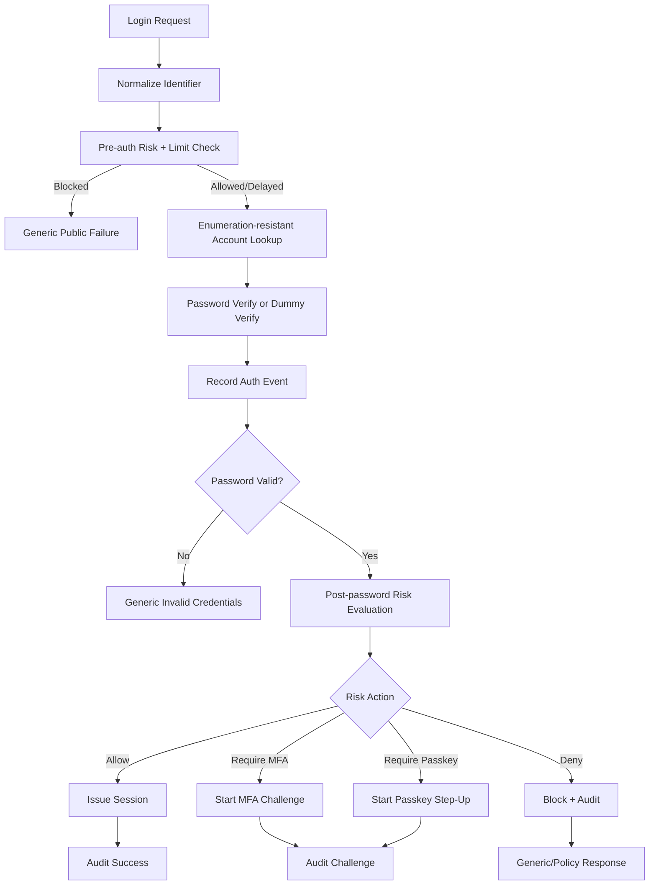
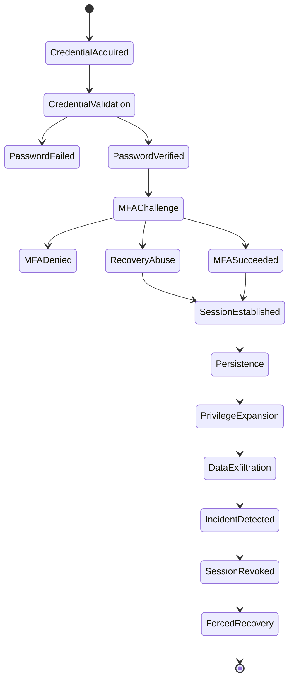
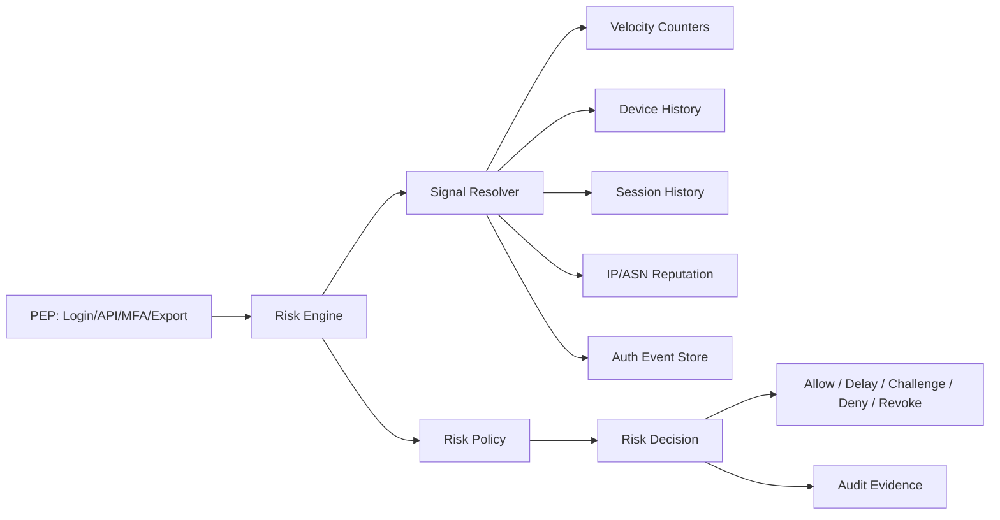
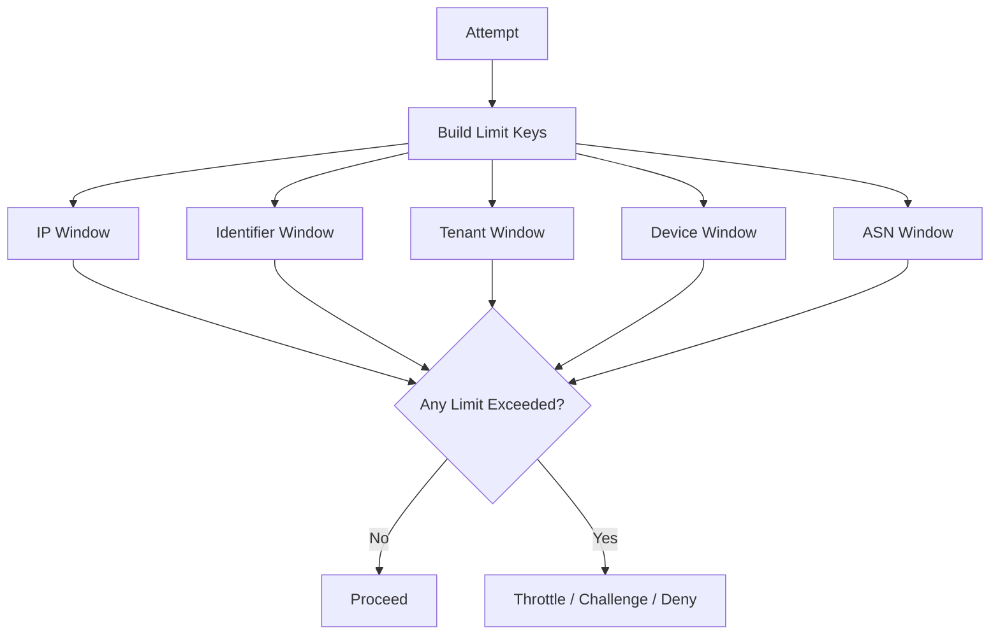
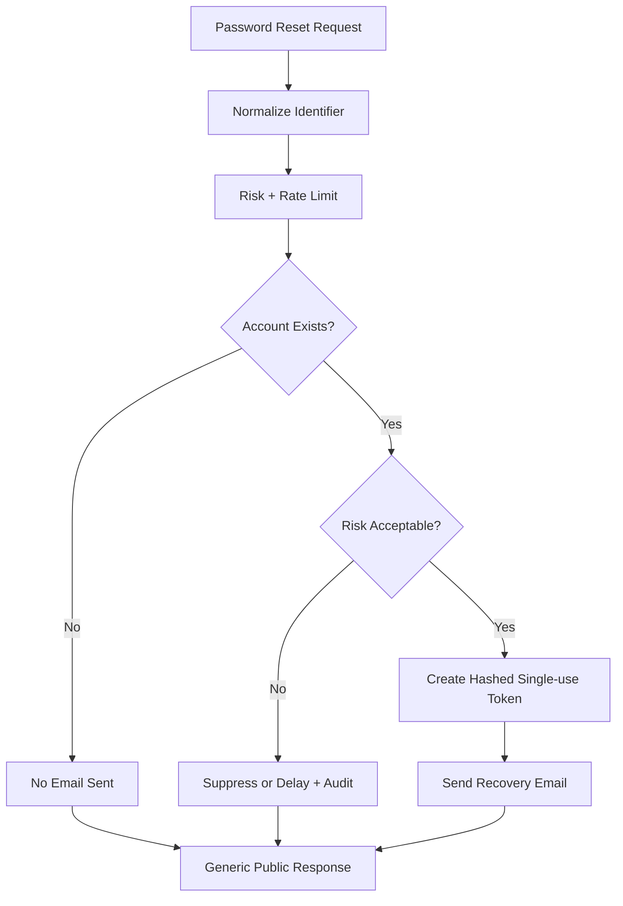

# learn-go-authentication-authorization-identity-permission-part-033.md

# Part 033 — Abuse, Fraud, Bot, Brute Force, Enumeration, Account Takeover Defense di Go

> Seri: `learn-go-authentication-authorization-identity-permission`  
> Target: Go 1.26.x  
> Level: Advanced / internal engineering handbook  
> Fokus: abuse-resistance untuk authentication, recovery, MFA, token, session, dan authorization boundary  
> Status seri: **belum selesai** — ini adalah part 033 dari 035

---

## Daftar Isi

1. [Tujuan Part Ini](#1-tujuan-part-ini)
2. [Masalah yang Sebenarnya: Auth Flow sebagai Attack Surface Ekonomi](#2-masalah-yang-sebenarnya-auth-flow-sebagai-attack-surface-ekonomi)
3. [Terminologi Presisi](#3-terminologi-presisi)
4. [Threat Taxonomy](#4-threat-taxonomy)
5. [Mental Model: Correctness vs Abuse Resistance](#5-mental-model-correctness-vs-abuse-resistance)
6. [Attack Surface Map](#6-attack-surface-map)
7. [Design Invariants](#7-design-invariants)
8. [Credential Stuffing](#8-credential-stuffing)
9. [Password Spraying](#9-password-spraying)
10. [Brute Force](#10-brute-force)
11. [Account Enumeration](#11-account-enumeration)
12. [Account Takeover Lifecycle](#12-account-takeover-lifecycle)
13. [MFA Abuse dan MFA Fatigue](#13-mfa-abuse-dan-mfa-fatigue)
14. [Recovery Flow Abuse](#14-recovery-flow-abuse)
15. [Bot dan Automation Defense](#15-bot-dan-automation-defense)
16. [Rate Limiting vs Throttling vs Lockout vs Challenge](#16-rate-limiting-vs-throttling-vs-lockout-vs-challenge)
17. [Risk Scoring Architecture](#17-risk-scoring-architecture)
18. [Go Package Architecture](#18-go-package-architecture)
19. [Go Domain Types](#19-go-domain-types)
20. [Identifier Normalization dan Enumeration-Resistant Lookup](#20-identifier-normalization-dan-enumeration-resistant-lookup)
21. [Multi-Dimensional Throttling](#21-multi-dimensional-throttling)
22. [Login Pipeline yang Abuse-Resistant](#22-login-pipeline-yang-abuse-resistant)
23. [Credential Stuffing Detection Pipeline](#23-credential-stuffing-detection-pipeline)
24. [Password Spraying Detection Pipeline](#24-password-spraying-detection-pipeline)
25. [Adaptive Challenge dan Step-Up](#25-adaptive-challenge-dan-step-up)
26. [Device, Network, dan Behavior Signals](#26-device-network-dan-behavior-signals)
27. [Session dan Token Defense Setelah Risiko Terdeteksi](#27-session-dan-token-defense-setelah-risiko-terdeteksi)
28. [Protecting Password Reset, Email Verification, dan MFA Reset](#28-protecting-password-reset-email-verification-dan-mfa-reset)
29. [Authorization Abuse: IDOR/BOLA, Privilege Probing, dan Permission Oracle](#29-authorization-abuse-idorbola-privilege-probing-dan-permission-oracle)
30. [Fraud Signals untuk Enterprise/Regulatory Systems](#30-fraud-signals-untuk-enterpriseregulatory-systems)
31. [Data Model dan Schema](#31-data-model-dan-schema)
32. [Audit, Observability, dan Detection Engineering](#32-audit-observability-dan-detection-engineering)
33. [Testing Strategy](#33-testing-strategy)
34. [Performance dan Reliability](#34-performance-dan-reliability)
35. [Failure Mode Matrix](#35-failure-mode-matrix)
36. [Mermaid Diagrams](#36-mermaid-diagrams)
37. [Anti-Pattern](#37-anti-pattern)
38. [Production Checklist](#38-production-checklist)
39. [Case Study: Regulatory Case Management Platform](#39-case-study-regulatory-case-management-platform)
40. [Ringkasan](#40-ringkasan)
41. [Latihan](#41-latihan)
42. [Referensi Primer](#42-referensi-primer)

---

## 1. Tujuan Part Ini

Part sebelumnya sudah membahas correctness dari password, MFA, session, token, OIDC, federation, authorization, distributed consistency, auditability, impersonation, delegation, dan break-glass.

Part ini menjawab pertanyaan yang berbeda:

> Setelah flow auth secara teknis benar, apakah sistem tetap bertahan saat attacker menjalankan automation, credential stuffing, password spraying, enumeration, MFA fatigue, recovery abuse, dan account takeover campaign dalam skala besar?

Ini bukan lagi sekadar pertanyaan:

- apakah password hash benar?
- apakah token signature valid?
- apakah MFA challenge bisa diverifikasi?
- apakah policy `Allow/Deny` benar?

Melainkan:

- apakah login endpoint bisa menjadi password oracle?
- apakah forgot password bisa menjadi username oracle?
- apakah OTP endpoint bisa dipakai menghabiskan biaya SMS/email?
- apakah MFA push bisa dipakai melelahkan user?
- apakah lockout bisa dipakai attacker untuk denial-of-service terhadap user sah?
- apakah rate limit terlalu kasar sehingga mengganggu user korporat di NAT yang sama?
- apakah refresh token replay langsung mematikan token family?
- apakah support/admin recovery bisa menjadi jalur bypass MFA?
- apakah perbedaan response time membocorkan keberadaan akun?
- apakah risk signal cukup untuk memaksa step-up tanpa memblokir semua traffic?

Di level senior/principal, auth tidak hanya dilihat sebagai authentication protocol. Auth adalah **abuse-sensitive distributed control system**.

---

## 2. Masalah yang Sebenarnya: Auth Flow sebagai Attack Surface Ekonomi

Banyak sistem auth dirancang seolah attacker hanya manusia yang mencoba login beberapa kali. Itu asumsi lemah.

Pada sistem nyata, attacker memakai:

- botnet;
- residential proxy;
- credential dump;
- password list;
- breached email/password pairs;
- rotating IP;
- device spoofing;
- headless browser;
- CAPTCHA solving service;
- credential validation service;
- phishing kit;
- session/token theft;
- MFA fatigue;
- social engineering terhadap support;
- automation terhadap password reset dan email verification.

Artinya, auth endpoint punya **economic attack surface**:

| Endpoint | Nilai bagi attacker |
|---|---|
| Login | validasi credential hasil breach |
| Forgot password | cek keberadaan akun, takeover via email |
| OTP request | biaya SMS/email, spam, exhaustion |
| MFA challenge | fatigue, brute force OTP, bypass recovery |
| Registration | fake account, fraud, resource abuse |
| Email verification | account enumeration, deliverability abuse |
| Token refresh | long-lived access setelah credential dicuri |
| Admin/support tool | high-value escalation path |
| Search/export/report | post-compromise data extraction |

Attacker tidak harus menembus crypto. Mereka cukup menemukan flow yang secara bisnis “masuk akal” tetapi secara abuse tidak terlindungi.

Contoh klasik:

```text
1. Attacker punya 10 juta email/password pair dari breach eksternal.
2. Attacker menjalankan login otomatis ke aplikasi Anda.
3. Sistem memberi error berbeda untuk user tidak ada vs password salah.
4. Sistem tidak punya velocity control per identifier.
5. MFA hanya muncul setelah password benar.
6. Recovery email bisa menghapus MFA.
7. Setelah login, attacker export data besar.
```

Tidak ada crypto yang rusak. Tetapi sistem tetap gagal.

---

## 3. Terminologi Presisi

### 3.1 Brute force

Brute force adalah percobaan sistematis untuk menebak secret, bisa terhadap satu akun atau banyak akun. MITRE ATT&CK T1110 mengelompokkan brute force sebagai teknik untuk memperoleh credential valid melalui percobaan berulang.

### 3.2 Password spraying

Password spraying adalah percobaan satu password umum atau daftar kecil password umum terhadap banyak akun. Tujuannya menghindari lockout yang biasanya dipicu oleh banyak gagal terhadap satu akun.

Contoh:

```text
Password: Winter2026!
Targets : 50.000 akun
Pattern : 1 attempt/account/hour
```

Ini berbeda dari brute force tradisional:

```text
Target  : alice@example.com
Attempts: 100.000 password
```

### 3.3 Credential stuffing

Credential stuffing adalah penggunaan pasangan username/password yang sudah bocor dari sistem lain untuk mencoba login ke sistem Anda.

Ini bukan “menebak password”. Ini menguji reuse credential.

### 3.4 Account enumeration

Account enumeration adalah kemampuan attacker membedakan apakah identifier valid atau tidak, lewat:

- pesan error;
- status code;
- response time;
- email side effect;
- lockout side effect;
- MFA challenge behavior;
- password reset behavior;
- registration conflict;
- API response shape.

### 3.5 Account takeover / ATO

Account takeover adalah kondisi attacker berhasil mengontrol akun korban, baik lewat:

- credential stuffing;
- phishing;
- session theft;
- reset password;
- MFA reset;
- support abuse;
- device compromise;
- token replay;
- federated account linking abuse.

### 3.6 MFA fatigue

MFA fatigue adalah serangan yang membanjiri user dengan push approval, OTP request, atau challenge berulang hingga user salah menyetujui atau menyerah.

### 3.7 Abuse resistance

Abuse resistance adalah kemampuan sistem bertahan terhadap penggunaan fitur yang tampak valid secara protokol tetapi jahat secara pola.

Contoh:

- `/login` request valid secara HTTP;
- JSON valid;
- password verification valid;
- tetapi pattern-nya credential stuffing campaign.

### 3.8 Risk signal

Risk signal adalah observasi yang membantu memperkirakan risiko request/session/action.

Contoh:

- IP velocity;
- ASN reputation;
- device novelty;
- impossible travel;
- failed login burst;
- identifier spread;
- MFA challenge count;
- password reset shortly before export;
- new device plus admin action.

### 3.9 Risk decision

Risk decision adalah tindakan yang diambil dari risk score/signal:

- allow;
- silently slow down;
- require CAPTCHA;
- require MFA;
- require phishing-resistant MFA;
- deny;
- lock account;
- revoke sessions;
- alert security team;
- require support review.

---

## 4. Threat Taxonomy

### 4.1 Authentication abuse

| Threat | Target | Typical Signal |
|---|---|---|
| brute force | satu akun | banyak password untuk identifier sama |
| password spraying | banyak akun | password sama terhadap banyak identifier |
| credential stuffing | credential breach | banyak pasangan credential dari IP/proxy/ASN berbeda |
| enumeration | identifier validity | beda response/error/timing |
| MFA fatigue | user approval | banyak push/OTP request |
| OTP brute force | OTP verifier | banyak guess dalam time window |
| reset abuse | recovery flow | token request burst, email flood |
| fake registration | signup | disposable email, automation, velocity |

### 4.2 Authorization abuse

| Threat | Target | Typical Signal |
|---|---|---|
| BOLA/IDOR probing | object endpoint | sequential/random object ID attempts |
| permission oracle | policy endpoint | attacker mapping permission surface |
| tenant breakout | tenant boundary | resource tenant mismatch attempts |
| role probing | admin routes | repeated forbidden actions |
| export abuse | data exfiltration | high-volume export after risky login |
| workflow abuse | case state machine | unauthorized transition attempts |

### 4.3 Token/session abuse

| Threat | Target | Typical Signal |
|---|---|---|
| stolen session | session cookie | new geo/device for existing session |
| refresh token replay | token family | reused rotated refresh token |
| access token replay | bearer token | same token from different networks/devices |
| session fixation | login boundary | session ID not rotated after auth |
| persistent attacker | long-lived session | old session after credential reset |

### 4.4 Federation abuse

| Threat | Target | Typical Signal |
|---|---|---|
| account linking abuse | external identity binding | new external sub attached to existing account |
| IdP confusion | multi-provider RP | issuer/provider mismatch |
| claim abuse | attribute mapping | role/tenant from untrusted claim |
| JIT provisioning abuse | automatic account creation | suspicious domain/provider pattern |

---

## 5. Mental Model: Correctness vs Abuse Resistance

Correctness menjawab:

```text
Apakah implementasi mengikuti spesifikasi?
```

Abuse resistance menjawab:

```text
Apakah implementasi tetap aman saat digunakan secara massal oleh attacker?
```

Keduanya berbeda.

### 5.1 Sistem correct tetapi tidak abuse-resistant

```text
POST /login
- password diverifikasi dengan Argon2id
- session cookie HttpOnly Secure SameSite
- MFA TOTP valid
- audit event ditulis
```

Tetapi:

- tidak ada rate limit;
- login error membedakan user tidak ada vs password salah;
- password reset bisa dipakai enumeration;
- OTP request tidak dibatasi;
- MFA reset hanya via email;
- IP reputation tidak dipakai;
- impossible travel tidak memicu reauthentication;
- token refresh replay tidak dideteksi.

Ini sistem yang “benar” di unit test tetapi lemah di internet.

### 5.2 Abuse-resistant design lens

Setiap auth feature harus ditanya:

1. Apa asset yang dilindungi?
2. Apa yang bisa dipakai sebagai oracle?
3. Apa cost yang dipindahkan ke kita?
4. Apa yang bisa diotomasi?
5. Apa yang bisa disalahgunakan terhadap user lain?
6. Apa yang bisa dipakai attacker setelah login berhasil?
7. Apa response aman saat sinyal risiko tidak pasti?
8. Apakah defense menimbulkan DoS terhadap user sah?
9. Apakah bypass lewat recovery/support/admin lebih mudah daripada login?
10. Apakah audit bisa membuktikan apa yang terjadi?

---

## 6. Attack Surface Map

```text
[Public Internet]
      |
      v
+-------------------+
| Registration      | -> fake account, email abuse, tenant squatting
+-------------------+
      |
      v
+-------------------+
| Login             | -> stuffing, spraying, brute force, enumeration
+-------------------+
      |
      +-----------------> [Password Reset] -> account recovery abuse
      |
      +-----------------> [MFA Challenge]  -> OTP brute force, fatigue
      |
      v
+-------------------+
| Session Issuance  | -> fixation, session theft, weak rotation
+-------------------+
      |
      v
+-------------------+
| Token Refresh     | -> replay, long-lived compromise
+-------------------+
      |
      v
+-------------------+
| App/API Access    | -> IDOR, tenant breakout, export abuse
+-------------------+
      |
      v
+-------------------+
| Admin/Support     | -> impersonation abuse, break-glass abuse
+-------------------+
```

Setiap node punya abuse control. Jangan hanya menaruh WAF/rate limit di depan `/login`, lalu melupakan `/forgot-password`, `/mfa/reset`, `/session/refresh`, `/exports`, dan `/admin/impersonate`.

---

## 7. Design Invariants

### Invariant 1 — Auth endpoints must not become oracles

Endpoint auth tidak boleh membocorkan:

- apakah user ada;
- apakah password benar sebagian;
- apakah MFA terdaftar;
- apakah email verified;
- apakah akun locked;
- apakah akun punya admin role;
- apakah external identity sudah terhubung.

### Invariant 2 — Every expensive action must have cost control

Expensive action mencakup:

- password hashing;
- email send;
- SMS send;
- push notification;
- WebAuthn challenge storage;
- token minting;
- export generation;
- large search;
- audit write amplification.

### Invariant 3 — Rate limit must be multi-dimensional

Rate limit tunggal per IP tidak cukup.

Harus mempertimbangkan:

- IP;
- identifier;
- tenant;
- device fingerprint;
- ASN/network;
- session;
- account;
- credential hash prefix;
- endpoint;
- action type;
- risk category.

### Invariant 4 — Lockout is a control, but also a weapon

Account lockout dapat mencegah brute force, tetapi juga bisa dipakai attacker untuk mengunci banyak user sah.

Karena itu, lockout harus:

- selective;
- temporary;
- risk-aware;
- tidak terlalu mudah dipicu oleh distributed spraying;
- punya safe recovery;
- diaudit;
- dibedakan antara hard lock, soft lock, step-up, dan delay.

### Invariant 5 — Recovery must not be weaker than login

Jika login butuh MFA, recovery tidak boleh cukup hanya dengan email link yang mudah dicuri.

Recovery adalah salah satu jalur ATO paling kritis.

### Invariant 6 — Risk changes must affect existing sessions

Jika risiko tinggi terdeteksi, sistem harus mempertimbangkan:

- revoke session;
- require reauthentication;
- require step-up;
- rotate session;
- revoke refresh token family;
- mark account under review;
- suppress high-risk actions.

### Invariant 7 — Risk decision must be explainable internally

Risk scoring tidak boleh menjadi angka misterius tanpa evidence.

Decision harus menyimpan:

- input signals;
- weights/reasons;
- policy version;
- decision;
- action taken;
- correlation ID;
- actor/account/session/tenant/resource.

### Invariant 8 — Abuse defense must fail safely

Jika Redis/risk service down, sistem harus punya mode:

- fail-closed untuk high-risk action;
- degraded allow untuk low-risk read;
- local fallback limiter;
- circuit breaker;
- emergency override yang diaudit.

### Invariant 9 — Do not punish legitimate shared networks blindly

Banyak enterprise user berada di:

- corporate NAT;
- VPN;
- mobile carrier NAT;
- government network;
- campus network.

Rate limit per IP saja bisa false positive tinggi.

### Invariant 10 — Post-login behavior matters

ATO sering baru terlihat setelah login:

- profile change;
- MFA disabled;
- email changed;
- password changed;
- API key created;
- export generated;
- role assignment changed;
- case data accessed unusually;
- mass download.

---

## 8. Credential Stuffing

### 8.1 Mental model

Credential stuffing bukan password guessing. Ini credential validation at scale.

Attacker punya:

```text
email,password
alice@example.com,Hunter2!
bob@example.com,Spring2025!
...
```

Lalu menjalankan automated login.

### 8.2 Kenapa sulit

Credential stuffing sulit karena tiap attempt tampak seperti login biasa:

- satu identifier;
- satu password;
- user-agent mirip browser;
- IP berganti;
- request rate rendah per IP;
- CAPTCHA bisa dilewati;
- credential mungkin benar.

### 8.3 Signal

Credential stuffing signal:

- banyak login gagal dari banyak IP;
- IP mencoba banyak akun berbeda;
- akun mendapat failed login dari banyak IP;
- request berasal dari ASN/proxy/datacenter tertentu;
- user-agent entropy rendah;
- credential success rate kecil tapi non-zero;
- sukses login diikuti MFA failure;
- sukses login diikuti immediate export/profile change.

### 8.4 Defense stack

| Layer | Defense |
|---|---|
| pre-login | bot detection, IP/ASN reputation, progressive delay |
| password check | rate limit per identifier and credential attempt |
| post-password | MFA/step-up for risky login |
| session | short-lived elevated privilege, device binding where appropriate |
| post-login | monitor sensitive changes/export/API key creation |
| user protection | notify suspicious login, session management UI |
| incident | force reset, revoke sessions, suppress exports |

### 8.5 Design trap

Trap:

```text
If password correct, immediately create full session.
```

Better:

```text
Password correct -> evaluate risk -> maybe MFA/step-up -> maybe limited session -> only then full session.
```

---

## 9. Password Spraying

### 9.1 Mental model

Password spraying memakai sedikit password umum terhadap banyak akun.

Tujuan attacker:

- menghindari per-account lockout;
- mengeksploitasi weak/common password;
- tetap low-and-slow agar tidak terdeteksi.

### 9.2 Signal

Password spraying signal:

- password candidate sama/serupa muncul untuk banyak identifier;
- banyak akun gagal satu kali dalam interval tertentu;
- pattern across tenant/org;
- user-agent/IP cluster melakukan satu attempt per akun;
- failure rate tinggi tetapi per-user low count;
- attempts mengikuti daftar email valid.

### 9.3 Defense

Password spraying tidak cukup dilawan dengan lockout per akun.

Perlu:

- per-IP limit;
- per-ASN/network limit;
- per-tenant login failure rate;
- per-password fingerprint bucket;
- breached/common password blocklist;
- slow down unknown/risky networks;
- MFA for admin and privileged accounts;
- alert tenant admin/security.

### 9.4 Password fingerprint caution

Untuk mendeteksi password spraying, kita mungkin ingin tahu bahwa banyak request memakai password sama.

Jangan pernah menyimpan password plaintext.

Pattern aman:

```text
password candidate -> HMAC(server_secret, normalized_password) -> short-lived detection key
```

Detection key:

- hanya untuk window pendek;
- tidak disimpan permanen;
- tidak dikirim ke log;
- secret dirotasi;
- akses dibatasi.

Tujuannya mendeteksi “same password sprayed”, bukan menyimpan password.

---

## 10. Brute Force

### 10.1 Brute force online

Online brute force adalah percobaan melalui verifier sistem.

Defense:

- rate limiting;
- throttling;
- account delay;
- progressive backoff;
- MFA;
- password blocklist;
- anomaly detection;
- lockout untuk high-risk target;
- no enumeration.

### 10.2 Brute force offline

Offline brute force terjadi jika password hash bocor.

Defense utama ada di part password authentication:

- Argon2id/bcrypt/scrypt/PBKDF2 sesuai policy;
- salt unik;
- pepper bila sesuai;
- strong parameter;
- breach response.

Part ini fokus online abuse.

### 10.3 Balancing lockout

Lockout terlalu agresif:

```text
5 failed attempts -> account locked 24 hours
```

Masalah:

- attacker bisa lock ribuan akun;
- helpdesk overload;
- user sah tidak bisa bekerja;
- tenant admin frustrasi.

Alternatif lebih baik:

- progressive delay;
- soft lock untuk password login tapi allow passkey;
- require MFA/step-up;
- allow recovery dengan stronger assurance;
- per-risk lockout;
- notify user/security.

---

## 11. Account Enumeration

### 11.1 Enumeration channels

| Channel | Example leak |
|---|---|
| login error | “user not found” vs “wrong password” |
| HTTP status | 404 vs 401 |
| response shape | `mfa_required: true` only for existing user |
| timing | user lookup/hash time differs |
| forgot password | email sent only if account exists |
| registration | “email already registered” |
| MFA reset | “no MFA enrolled” |
| lockout | non-existent user cannot be locked |
| email side effect | only valid user receives email |
| rate limit | valid user bucket changes differently |

### 11.2 Enumeration-resistant response

For login:

```json
{
  "error": "invalid_credentials"
}
```

Not:

```json
{
  "error": "user_not_found"
}
```

For forgot password:

```text
If an account exists for this email, we will send reset instructions.
```

Not:

```text
No account found.
```

### 11.3 Timing resistance

Problem:

```go
u, err := users.FindByEmail(email)
if err == sql.ErrNoRows {
    return invalidCredentials()
}
return verifyHash(u.PasswordHash, password)
```

Non-existent user returns faster.

Better pattern:

```go
hash := configuredDummyHash
u, found := users.FindByIdentifier(ctx, identifier)
if found {
    hash = u.PasswordHash
}

ok := passwordVerifier.Verify(ctx, hash, password)
if !found || !ok {
    return invalidCredentials()
}
```

This does not make timing perfectly constant in distributed systems, but it removes the obvious difference.

### 11.4 Registration tension

Registration often needs to tell user that email already exists.

Safer pattern:

- for consumer apps: use email-based flow with generic response;
- for enterprise invite-only apps: do not allow self-discovery;
- for admin-created accounts: return precise errors only to authorized admin;
- log enumeration attempts;
- rate limit registration conflicts.

---

## 12. Account Takeover Lifecycle

ATO is not a single event. It is a lifecycle.

```text
Credential acquisition
    -> Credential validation
    -> Login success or MFA challenge
    -> MFA bypass/fatigue/recovery
    -> Session establishment
    -> Persistence
    -> Privilege expansion
    -> Data access/exfiltration
    -> Cover tracks
```

### 12.1 ATO stages and controls

| Stage | Control |
|---|---|
| acquisition | not fully controllable; assume credentials leak externally |
| validation | stuffing/spraying detection, rate limit, no oracle |
| MFA challenge | phishing-resistant MFA, challenge limits, number matching |
| recovery | secure reset/MFA recovery, support controls |
| session | device/session management, token rotation |
| persistence | API key creation control, email/MFA change notification |
| exfiltration | export throttling, anomaly detection, object-level auth |
| response | revoke sessions, force reset, incident workflow |

### 12.2 ATO-sensitive actions

Treat these as high-risk:

- password change;
- email change;
- phone change;
- MFA disable;
- MFA reset;
- passkey registration;
- new API key;
- role assignment;
- admin invitation;
- export large dataset;
- case ownership transfer;
- payment/bank detail update;
- organization membership change;
- external IdP linking.

These should often require:

- recent authentication;
- step-up;
- notification;
- delayed effect;
- approval;
- audit reason;
- rollback path.

---

## 13. MFA Abuse dan MFA Fatigue

### 13.1 MFA is not magic

MFA reduces risk, but implementation flaws can still produce bypass.

Common failures:

- unlimited OTP attempts;
- unlimited push attempts;
- email reset disables MFA;
- support can remove MFA without strong verification;
- remembered device never expires;
- MFA not required for recovery/change email;
- MFA challenge accepted from old session after password reset;
- no binding between transaction and challenge;
- no audit of factor changes.

### 13.2 MFA fatigue signal

Signals:

- multiple push challenges in short time;
- challenge denied repeatedly;
- challenge expires repeatedly;
- challenge from new geo/device;
- push after multiple password failures;
- push after known credential stuffing campaign;
- user reports “I did not try to login”.

### 13.3 Defense

- limit challenge creation;
- add cooldown after denied/expired challenges;
- require number matching or explicit context;
- show location/device/action in challenge;
- suppress push and require stronger factor under risk;
- notify user about repeated attempts;
- allow user to report suspicious challenge;
- lock only risky factor path, not necessarily entire account;
- require phishing-resistant factor for high-risk admins.

### 13.4 TOTP brute force

TOTP has small code space, often 6 digits. Without throttling, it is brute-forceable online.

Controls:

- max attempts per challenge;
- max attempts per authenticator per window;
- replay prevention for accepted time step;
- lock/cooldown after repeated failures;
- alert after repeated failures;
- do not reveal if password was correct before MFA to unknown clients.

---

## 14. Recovery Flow Abuse

Recovery flow is often the weakest auth path.

### 14.1 Password reset abuse

Threats:

- enumeration;
- email flood;
- token brute force;
- token replay;
- token leakage via referer/logs;
- reset without invalidating sessions;
- reset used to bypass MFA;
- attacker resets email first, then password;
- reset token usable after password changed.

Controls:

- generic response;
- rate limit by identifier, IP, tenant, email domain;
- high-entropy single-use token;
- store token hash only;
- short TTL;
- invalidate all reset tokens after successful reset;
- reauthenticate or step-up for sensitive recovery changes;
- revoke active sessions after password reset or require reauth;
- notify user;
- log with correlation ID.

### 14.2 MFA reset abuse

MFA reset must be treated as high-risk account recovery.

Patterns:

| Pattern | Risk |
|---|---|
| email-only MFA reset | weak if email compromised |
| support-only reset | social engineering risk |
| backup codes | good if generated/stored correctly |
| multiple enrolled factors | better recovery UX/security |
| delayed reset | reduces instant takeover |
| admin approval | good for enterprise, must be audited |

### 14.3 Recovery invariant

> Recovery must not reduce account assurance below what protected the account before recovery.

If account has AAL2/AAL3 factors, recovery should not silently fall back to email-only without risk controls.

---

## 15. Bot dan Automation Defense

### 15.1 Bot defense is layered

No single control stops bots.

Layered controls:

- velocity limits;
- proof-of-work for suspicious traffic;
- CAPTCHA only when useful;
- device integrity signals;
- IP/ASN reputation;
- TLS/browser fingerprint signal;
- headless behavior detection;
- honey identifiers;
- canary accounts;
- progressive friction;
- behavioral analytics;
- response randomization/delay where appropriate;
- abuse-intelligence feedback loop.

### 15.2 CAPTCHA caution

CAPTCHA is not a complete defense:

- can be solved by farms;
- hurts accessibility;
- hurts legitimate users;
- may be bypassed by API clients;
- becomes another dependency/outage point;
- may create privacy/legal concerns.

Use CAPTCHA as one adaptive challenge, not the core security model.

### 15.3 Headless/browser signals

Be careful with device fingerprinting:

- privacy constraints;
- false positives;
- browser changes;
- corporate devices;
- mobile apps;
- accessibility tools;
- legal/regulatory considerations.

Device signal should be a risk input, not a final truth.

---

## 16. Rate Limiting vs Throttling vs Lockout vs Challenge

These are different controls.

| Control | Meaning | Good For | Danger |
|---|---|---|---|
| rate limit | hard cap per key/window | cost control | false positives |
| throttling | slow down progressively | brute force | latency for legit users |
| lockout | block account/factor temporarily | targeted brute force | attacker-induced DoS |
| challenge | require extra proof | suspicious traffic | challenge fatigue/bypass |
| step-up | require stronger/recent auth | high-risk action | UX friction |
| deny | reject request | high confidence abuse | false denial |

### 16.1 Multi-dimensional limiter

Do not design only:

```text
key = IP
```

Better:

```text
key = endpoint + IP
key = endpoint + normalized_identifier
key = endpoint + tenant_id
key = endpoint + ASN
key = endpoint + device_id
key = endpoint + credential_fingerprint_window
key = action + account_id
key = action + session_id
```

### 16.2 Progressive response

Example escalation:

```text
normal -> allow
mild risk -> small delay
medium risk -> CAPTCHA or MFA
high risk -> stronger MFA / deny
confirmed compromise -> revoke sessions and force reset
```

---

## 17. Risk Scoring Architecture

### 17.1 Risk score is not authorization

Risk score answers:

```text
How suspicious is this request/session/action?
```

Authorization answers:

```text
Is this subject allowed to perform this action on this resource?
```

They interact, but should not be merged blindly.

Example:

```text
User has permission to export report.
Risk score says new device + impossible travel + password reset 5 minutes ago.
Decision: require step-up or delay export.
```

Authorization says “allowed”. Risk engine says “not safe yet”.

### 17.2 Risk engine inputs

```go
type RiskInput struct {
    Now          time.Time
    RequestID    string
    TenantID     TenantID
    AccountID    *AccountID
    SessionID    *SessionID
    Identifier   *NormalizedIdentifier
    IP           netip.Addr
    ASN          *int
    Country      *string
    UserAgent    string
    DeviceID     *DeviceID
    Endpoint     string
    Action       Action
    Resource     *ResourceRef
    AuthStage    AuthStage
    Signals      []Signal
}
```

### 17.3 Risk output

```go
type RiskDecision struct {
    Score       int // 0..100
    Level       RiskLevel
    Action      RiskAction
    Reasons     []RiskReason
    PolicyID    string
    PolicyVer   int64
    ExpiresAt   time.Time
}

type RiskLevel string

const (
    RiskLow      RiskLevel = "low"
    RiskMedium   RiskLevel = "medium"
    RiskHigh     RiskLevel = "high"
    RiskCritical RiskLevel = "critical"
)

type RiskAction string

const (
    RiskAllow             RiskAction = "allow"
    RiskDelay             RiskAction = "delay"
    RiskRequireCaptcha    RiskAction = "require_captcha"
    RiskRequireMFA        RiskAction = "require_mfa"
    RiskRequirePasskey    RiskAction = "require_passkey"
    RiskDeny              RiskAction = "deny"
    RiskLockFactor        RiskAction = "lock_factor"
    RiskRevokeSessions    RiskAction = "revoke_sessions"
    RiskManualReview      RiskAction = "manual_review"
)
```

### 17.4 Explainability

Never store only:

```json
{"risk_score": 87}
```

Store reasons:

```json
{
  "risk_score": 87,
  "level": "high",
  "reasons": [
    "new_device",
    "ip_seen_in_stuffing_campaign",
    "password_reset_recent",
    "impossible_travel",
    "export_attempt_after_login"
  ],
  "policy_version": 42
}
```

---

## 18. Go Package Architecture

Suggested package layout:

```text
internal/authabuse/
  model.go
  risk.go
  limiter.go
  detector.go
  challenge.go
  recovery_guard.go
  session_guard.go
  audit.go
  middleware_http.go
  interceptor_grpc.go
  store.go
  redis_store.go
  memory_store_test.go
  policy.go
  metrics.go
```

Boundary:

```text
HTTP/gRPC handler
   -> Auth middleware
   -> Abuse guard
   -> Authentication service
   -> Risk engine
   -> Limiter/detector stores
   -> Audit/metrics
```

Avoid putting abuse logic directly inside controllers. It will become inconsistent.

### 18.1 Core interfaces

```go
type RiskEngine interface {
    Evaluate(ctx context.Context, input RiskInput) (RiskDecision, error)
}

type Limiter interface {
    Check(ctx context.Context, key LimitKey, cost int, now time.Time) (LimitDecision, error)
    Record(ctx context.Context, key LimitKey, event LimitEvent, now time.Time) error
}

type Detector interface {
    Observe(ctx context.Context, event AuthEvent) error
    Detect(ctx context.Context, input RiskInput) ([]Signal, error)
}

type ChallengeService interface {
    Required(ctx context.Context, decision RiskDecision) (ChallengeRequirement, error)
}

type AbuseAuditWriter interface {
    WriteAbuseEvent(ctx context.Context, event AbuseAuditEvent) error
}
```

### 18.2 Do not couple to Redis directly

Bad:

```go
func Login(w http.ResponseWriter, r *http.Request) {
    redis.Incr(ctx, "login:"+r.RemoteAddr)
    // ...
}
```

Better:

```go
decision, err := abuse.GuardLoginAttempt(ctx, LoginAttemptInput{...})
```

Redis is an implementation detail.

---

## 19. Go Domain Types

```go
type TenantID string
type AccountID string
type SessionID string
type DeviceID string

type NormalizedIdentifier struct {
    Kind  IdentifierKind
    Value string
}

type IdentifierKind string

const (
    IdentifierEmail IdentifierKind = "email"
    IdentifierPhone IdentifierKind = "phone"
    IdentifierUser  IdentifierKind = "username"
)

type AuthStage string

const (
    StagePrePassword      AuthStage = "pre_password"
    StagePasswordVerified AuthStage = "password_verified"
    StageMFAPending       AuthStage = "mfa_pending"
    StageAuthenticated    AuthStage = "authenticated"
    StageRecovery         AuthStage = "recovery"
    StageTokenRefresh     AuthStage = "token_refresh"
)

type Action string

const (
    ActionLogin             Action = "auth.login"
    ActionPasswordResetReq  Action = "auth.password_reset.request"
    ActionPasswordResetDone Action = "auth.password_reset.complete"
    ActionMFAChallenge      Action = "auth.mfa.challenge"
    ActionMFADisable        Action = "auth.mfa.disable"
    ActionTokenRefresh      Action = "auth.token.refresh"
    ActionExport            Action = "data.export"
)
```

Important:

- use explicit domain types;
- avoid raw string everywhere;
- do not put raw password/token in events;
- normalize identifier once;
- keep tenant/account/session distinction clear.

---

## 20. Identifier Normalization dan Enumeration-Resistant Lookup

### 20.1 Normalize before lookup

For email:

- trim surrounding whitespace;
- Unicode normalization policy;
- lower-case domain;
- decide whether local-part lower-case is allowed by product policy;
- do not invent provider-specific normalization unless you control semantics.

```go
func NormalizeEmail(raw string) (NormalizedIdentifier, error) {
    s := strings.TrimSpace(raw)
    if s == "" {
        return NormalizedIdentifier{}, ErrInvalidIdentifier
    }

    at := strings.LastIndexByte(s, '@')
    if at <= 0 || at == len(s)-1 {
        return NormalizedIdentifier{}, ErrInvalidIdentifier
    }

    local := s[:at]
    domain := strings.ToLower(s[at+1:])

    // Product decision: local part lowercasing may be acceptable for most systems,
    // but pure RFC semantics are more nuanced. Be explicit.
    local = strings.ToLower(local)

    return NormalizedIdentifier{
        Kind:  IdentifierEmail,
        Value: local + "@" + domain,
    }, nil
}
```

### 20.2 Enumeration-resistant account lookup

```go
type AccountLookupResult struct {
    Account     *Account
    Found       bool
    PasswordRef PasswordVerifierRef
}

func (s *AuthService) lookupForPasswordVerify(
    ctx context.Context,
    tenantID TenantID,
    identifier NormalizedIdentifier,
) (AccountLookupResult, error) {
    acct, err := s.accounts.FindByIdentifier(ctx, tenantID, identifier)
    if err == nil {
        return AccountLookupResult{
            Account:     acct,
            Found:       true,
            PasswordRef: acct.PasswordVerifierRef,
        }, nil
    }
    if errors.Is(err, ErrNotFound) {
        return AccountLookupResult{
            Account:     nil,
            Found:       false,
            PasswordRef: s.dummyPasswordVerifierRef,
        }, nil
    }
    return AccountLookupResult{}, err
}
```

Then always verify:

```go
verified, verifyErr := s.passwords.Verify(ctx, lookup.PasswordRef, input.Password)
if verifyErr != nil {
    return LoginResult{}, verifyErr
}

if !lookup.Found || !verified {
    return s.failInvalidCredentials(ctx, input, lookup.Found)
}
```

Do not return different public messages.

---

## 21. Multi-Dimensional Throttling

### 21.1 Limit key model

```go
type LimitKey struct {
    Scope     LimitScope
    TenantID  *TenantID
    AccountID *AccountID
    Value     string
    Window    time.Duration
}

type LimitScope string

const (
    LimitByIP         LimitScope = "ip"
    LimitByIdentifier LimitScope = "identifier"
    LimitByTenant     LimitScope = "tenant"
    LimitByASN        LimitScope = "asn"
    LimitByDevice     LimitScope = "device"
    LimitBySession    LimitScope = "session"
    LimitByEndpoint   LimitScope = "endpoint"
)

type LimitDecision struct {
    Allowed    bool
    Remaining  int
    RetryAfter time.Duration
    Reason     string
}
```

### 21.2 Composite checks

```go
func (g *Guard) CheckLoginLimits(ctx context.Context, in LoginAttemptInput) (LimitDecision, error) {
    keys := []LimitKey{
        {Scope: LimitByIP, TenantID: &in.TenantID, Value: in.IP.String(), Window: time.Minute},
        {Scope: LimitByIdentifier, TenantID: &in.TenantID, Value: in.Identifier.Value, Window: 15 * time.Minute},
        {Scope: LimitByTenant, TenantID: &in.TenantID, Value: string(in.TenantID), Window: time.Minute},
    }

    if in.DeviceID != nil {
        keys = append(keys, LimitKey{Scope: LimitByDevice, TenantID: &in.TenantID, Value: string(*in.DeviceID), Window: 15 * time.Minute})
    }

    var strictest LimitDecision
    strictest.Allowed = true

    for _, k := range keys {
        d, err := g.limiter.Check(ctx, k, 1, in.Now)
        if err != nil {
            return LimitDecision{}, err
        }
        if !d.Allowed {
            return d, nil
        }
        if strictest.RetryAfter < d.RetryAfter {
            strictest = d
        }
    }

    return strictest, nil
}
```

### 21.3 Cost-based limiting

Not every attempt costs the same.

| Request | Suggested cost |
|---|---:|
| normal login attempt | 1 |
| password hash verify | 2–5 |
| SMS OTP send | 10–50 |
| email send | 5–20 |
| export generation | 50–500 |
| password reset request | 5–20 |
| MFA push | 10–50 |

```go
type CostPolicy interface {
    Cost(action Action, risk RiskLevel) int
}
```

Riskier traffic consumes budget faster.

---

## 22. Login Pipeline yang Abuse-Resistant

### 22.1 Pipeline

```text
Parse request
  -> Normalize identifier
  -> Pre-auth abuse checks
  -> Enumeration-resistant account lookup
  -> Password verification with dummy hash if not found
  -> Record outcome
  -> Risk evaluation
  -> If invalid: generic response
  -> If valid but risky: step-up/challenge/limited session
  -> If valid and low-risk: issue session
  -> Audit and metrics
```

### 22.2 Go sketch

```go
func (s *AuthService) Login(ctx context.Context, in LoginInput) (LoginResult, error) {
    now := s.clock.Now()

    identifier, err := NormalizeEmail(in.Identifier)
    if err != nil {
        // Still return generic response, but record invalid format separately.
        s.audit.InvalidIdentifier(ctx, in, err)
        return LoginResult{Status: LoginInvalidCredentials}, nil
    }

    preRisk, err := s.risk.Evaluate(ctx, RiskInput{
        Now:        now,
        TenantID:   in.TenantID,
        Identifier: &identifier,
        IP:         in.IP,
        UserAgent:  in.UserAgent,
        Endpoint:   "/login",
        Action:     ActionLogin,
        AuthStage:  StagePrePassword,
    })
    if err != nil {
        return LoginResult{}, err
    }

    if preRisk.Action == RiskDeny {
        s.audit.LoginBlocked(ctx, in, preRisk)
        return LoginResult{Status: LoginInvalidCredentials}, nil
    }
    if preRisk.Action == RiskDelay {
        s.delay.Apply(ctx, preRisk)
    }

    lookup, err := s.lookupForPasswordVerify(ctx, in.TenantID, identifier)
    if err != nil {
        return LoginResult{}, err
    }

    verified, err := s.passwords.Verify(ctx, lookup.PasswordRef, in.Password)
    if err != nil {
        return LoginResult{}, err
    }

    outcome := AuthOutcomeFailure
    if lookup.Found && verified {
        outcome = AuthOutcomePasswordVerified
    }

    event := AuthEvent{
        Time:       now,
        TenantID:   in.TenantID,
        AccountID:  accountIDOrNil(lookup.Account),
        Identifier: identifier,
        IP:         in.IP,
        UserAgent:  in.UserAgent,
        Stage:      StagePrePassword,
        Outcome:    outcome,
    }
    _ = s.detector.Observe(ctx, event)

    if !lookup.Found || !verified {
        s.audit.LoginFailed(ctx, in, lookup.Found, preRisk)
        return LoginResult{Status: LoginInvalidCredentials}, nil
    }

    postRisk, err := s.risk.Evaluate(ctx, RiskInput{
        Now:       now,
        TenantID:  in.TenantID,
        AccountID: &lookup.Account.ID,
        IP:        in.IP,
        UserAgent: in.UserAgent,
        Endpoint:  "/login",
        Action:    ActionLogin,
        AuthStage: StagePasswordVerified,
    })
    if err != nil {
        return LoginResult{}, err
    }

    switch postRisk.Action {
    case RiskRequirePasskey:
        return s.beginStepUp(ctx, lookup.Account, StepUpPasskey, postRisk)
    case RiskRequireMFA:
        return s.beginStepUp(ctx, lookup.Account, StepUpMFA, postRisk)
    case RiskDeny:
        s.audit.LoginBlocked(ctx, in, postRisk)
        return LoginResult{Status: LoginDenied}, nil
    }

    session, err := s.sessions.Issue(ctx, IssueSessionInput{
        TenantID:  in.TenantID,
        AccountID: lookup.Account.ID,
        AuthTime:  now,
        Risk:      postRisk.Level,
    })
    if err != nil {
        return LoginResult{}, err
    }

    s.audit.LoginSucceeded(ctx, in, lookup.Account.ID, postRisk)
    return LoginResult{Status: LoginOK, Session: session}, nil
}
```

### 22.3 Public result mapping

| Internal condition | Public result |
|---|---|
| user not found | invalid credentials |
| password wrong | invalid credentials |
| account disabled | invalid credentials or generic contact support depending policy |
| risk deny | invalid credentials or generic blocked |
| MFA required | challenge only after password valid and safe to reveal |
| locked | generic message; notify user out-of-band where appropriate |

---

## 23. Credential Stuffing Detection Pipeline

### 23.1 Event stream

Every auth attempt should produce event:

```go
type AuthEvent struct {
    EventID      string
    Time         time.Time
    TenantID     TenantID
    AccountID    *AccountID
    Identifier   NormalizedIdentifier
    IP           netip.Addr
    ASN          *int
    Country      *string
    UserAgent    string
    DeviceID     *DeviceID
    Stage        AuthStage
    Outcome      AuthOutcome
    RiskReasons  []RiskReason
}

type AuthOutcome string

const (
    AuthOutcomeFailure          AuthOutcome = "failure"
    AuthOutcomePasswordVerified AuthOutcome = "password_verified"
    AuthOutcomeMFASucceeded     AuthOutcome = "mfa_succeeded"
    AuthOutcomeMFAFailed        AuthOutcome = "mfa_failed"
    AuthOutcomeBlocked          AuthOutcome = "blocked"
)
```

### 23.2 Detection windows

Maintain rolling windows:

- failures per IP;
- identifiers per IP;
- IPs per identifier;
- failures per tenant;
- successes after many failures;
- MFA failures after password success;
- geo/network novelty.

### 23.3 Example detector

```go
type StuffingSignalDetector struct {
    store RollingCounterStore
}

func (d *StuffingSignalDetector) Detect(ctx context.Context, in RiskInput) ([]Signal, error) {
    var signals []Signal

    idsByIP, _ := d.store.CountDistinct(ctx, "login:identifiers_by_ip", in.IP.String(), 15*time.Minute)
    if idsByIP > 50 {
        signals = append(signals, Signal{Kind: "many_identifiers_from_ip", Severity: 60})
    }

    ipsByIdentifier := 0
    if in.Identifier != nil {
        ipsByIdentifier, _ = d.store.CountDistinct(ctx, "login:ips_by_identifier", in.Identifier.Value, 15*time.Minute)
        if ipsByIdentifier > 10 {
            signals = append(signals, Signal{Kind: "many_ips_for_identifier", Severity: 50})
        }
    }

    tenantFailureRate, _ := d.store.Count(ctx, "login:failures_by_tenant", string(in.TenantID), 5*time.Minute)
    if tenantFailureRate > 1000 {
        signals = append(signals, Signal{Kind: "tenant_login_failure_spike", Severity: 70})
    }

    return signals, nil
}
```

Thresholds must be calibrated per product traffic. Hardcoded numbers above are illustration.

---

## 24. Password Spraying Detection Pipeline

### 24.1 Detecting same password candidate safely

Do not log passwords.

Use short-lived keyed HMAC detection key:

```go
func PasswordSprayKey(secret []byte, normalizedPassword []byte) string {
    mac := hmac.New(sha256.New, secret)
    mac.Write(normalizedPassword)
    sum := mac.Sum(nil)
    return base64.RawURLEncoding.EncodeToString(sum[:16])
}
```

Caution:

- never store plaintext;
- never put detection key in user-visible logs;
- rotate secret;
- short TTL;
- access restricted;
- only used for detection window.

### 24.2 Spray signal

```text
same password fingerprint -> many identifiers -> mostly failures -> across one tenant/org -> short window
```

### 24.3 Defense

- block known weak/new passwords at registration/change;
- detect same-password fanout;
- rate limit by tenant and credential fingerprint;
- force step-up for matched account;
- warn admins of spray campaign;
- do not lock all accounts automatically.

---

## 25. Adaptive Challenge dan Step-Up

### 25.1 Challenge types

| Risk | Challenge |
|---|---|
| mild bot suspicion | delay/proof-of-work/CAPTCHA |
| suspicious login | MFA |
| privileged account | phishing-resistant MFA/passkey |
| new device after reset | reauthentication + MFA |
| suspicious export | step-up + approval/delay |
| confirmed compromise | deny + revoke + recovery workflow |

### 25.2 Challenge escalation

```go
type ChallengeRequirement struct {
    Required     bool
    Type         ChallengeType
    Reason       string
    MaxAttempts  int
    ExpiresAt    time.Time
    Transaction  *TransactionBinding
}

type ChallengeType string

const (
    ChallengeNone     ChallengeType = "none"
    ChallengeCaptcha  ChallengeType = "captcha"
    ChallengeTOTP     ChallengeType = "totp"
    ChallengePush     ChallengeType = "push"
    ChallengePasskey  ChallengeType = "passkey"
    ChallengeApproval ChallengeType = "approval"
)
```

### 25.3 Transaction binding

For high-risk action, bind challenge to action:

```text
challenge_id covers:
- account_id
- session_id
- action
- resource_id
- amount/scope if applicable
- created_at
- expires_at
```

A challenge for login must not authorize export. A challenge for viewing case must not authorize deleting case.

---

## 26. Device, Network, dan Behavior Signals

### 26.1 Device signals

Useful but imperfect:

- device cookie;
- passkey credential ID;
- platform authenticator presence;
- user-agent family;
- app installation ID;
- client certificate;
- mobile attestation if available;
- previously trusted device state.

Do not treat device fingerprint as identity.

### 26.2 Network signals

- IP address;
- ASN;
- country/region;
- proxy/VPN/datacenter reputation;
- corporate network allowlist;
- impossible travel;
- sudden network change;
- TOR exit node, where relevant.

### 26.3 Behavior signals

- time of day;
- typing/interaction speed;
- endpoint sequence;
- navigation pattern;
- export immediately after login;
- password reset followed by email change;
- admin action from new device;
- repeated forbidden object access.

### 26.4 Privacy and governance

Risk signals can become sensitive personal data.

Engineering guardrails:

- data minimization;
- retention limit;
- access control;
- no raw secret logging;
- documented purpose;
- tenant/legal requirements;
- explainable decisions;
- review false positives.

---

## 27. Session dan Token Defense Setelah Risiko Terdeteksi

### 27.1 When risk changes

If a session becomes risky:

- mark session risk level;
- require reauthentication;
- reduce session privileges;
- prevent sensitive actions;
- revoke refresh tokens;
- notify user;
- audit decision.

### 27.2 Refresh token replay

If refresh token rotation detects reuse:

```text
reused old refresh token -> assume token family compromise -> revoke token family -> revoke related sessions -> alert user/security
```

### 27.3 Risk-bound session

```go
type Session struct {
    ID              SessionID
    AccountID       AccountID
    TenantID        TenantID
    CreatedAt       time.Time
    LastSeenAt      time.Time
    AuthTime        time.Time
    AssuranceLevel  AssuranceLevel
    RiskLevel       RiskLevel
    SensitiveUntil  *time.Time
    RequiresStepUp  bool
}
```

### 27.4 Do not rely only on token TTL

A 15-minute access token may still be enough for damage:

- export data;
- create API key;
- change email;
- disable MFA;
- alter role;
- submit legal/regulatory action.

High-risk actions require live/session-aware checks, not only valid JWT.

---

## 28. Protecting Password Reset, Email Verification, dan MFA Reset

### 28.1 Reset request guard

```go
func (g *Guard) CheckPasswordResetRequest(ctx context.Context, in ResetRequestInput) (RiskDecision, error) {
    signals, err := g.detector.Detect(ctx, RiskInput{
        Now:        in.Now,
        TenantID:   in.TenantID,
        Identifier: &in.Identifier,
        IP:         in.IP,
        UserAgent:  in.UserAgent,
        Endpoint:   "/forgot-password",
        Action:     ActionPasswordResetReq,
        AuthStage:  StageRecovery,
    })
    if err != nil {
        return RiskDecision{}, err
    }

    return g.policy.DecideRecoveryRisk(ctx, signals)
}
```

### 28.2 Always return generic response

```go
func (h *Handler) ForgotPassword(w http.ResponseWriter, r *http.Request) {
    // internally decide whether to send email
    // publicly always respond the same
    writeJSON(w, http.StatusOK, map[string]string{
        "message": "If an account exists, recovery instructions will be sent.",
    })
}
```

### 28.3 Token design

- random high entropy;
- token hash stored;
- single-use;
- short TTL;
- purpose-bound;
- account-bound;
- tenant-bound;
- invalidated on password change;
- no token in logs;
- no token in referer;
- use POST for completion where possible.

### 28.4 MFA reset

MFA reset options should include controls:

- backup code;
- other enrolled factor;
- verified enterprise admin approval;
- delayed effect;
- support workflow with dual control;
- notification to old channels;
- forced re-enrollment;
- session revocation.

---

## 29. Authorization Abuse: IDOR/BOLA, Privilege Probing, dan Permission Oracle

Abuse defense is not only login.

### 29.1 BOLA probing signal

Signals:

- repeated 403/404 on object IDs;
- sequential resource ID attempts;
- resource tenant mismatch attempts;
- high number of denied decisions;
- search filters probing hidden values;
- export attempts with widened filters.

### 29.2 Permission oracle

If endpoint returns detailed denial reasons to attacker, it may reveal permission model.

Internal reason:

```json
{
  "effect": "deny",
  "reason": "missing_permission:case.approve.after_investigation_stage"
}
```

Public response:

```json
{
  "error": "forbidden"
}
```

Detailed reason belongs in audit/diagnostics, not public API.

### 29.3 Abuse-aware PEP

PEP should report denied attempts to detector:

```go
func (p *PolicyEnforcer) Enforce(ctx context.Context, req AuthzRequest) error {
    decision, err := p.pdp.Decide(ctx, req)
    if err != nil {
        return err
    }

    if decision.Effect == Deny {
        _ = p.detector.Observe(ctx, AuthzDeniedEvent{
            Subject:  req.Subject,
            TenantID: req.TenantID,
            Action:   req.Action,
            Resource: req.Resource,
            Reason:   decision.Reason,
            Time:     p.clock.Now(),
        })
        return ErrForbidden
    }

    return nil
}
```

---

## 30. Fraud Signals untuk Enterprise/Regulatory Systems

For regulatory/case systems, fraud is not only money fraud. It can be:

- unauthorized case viewing;
- evidence tampering;
- document exfiltration;
- malicious approval;
- appeal manipulation;
- compliance case suppression;
- export of regulated entity data;
- privileged access misuse;
- insider acting under another user's session;
- support impersonation abuse.

### 30.1 Domain-specific signals

| Signal | Risk |
|---|---|
| login from new country then mass case search | ATO/exfiltration |
| password reset then privileged approval | recovery takeover |
| support impersonation outside working hours | insider/support abuse |
| repeated denied access to cases across tenants | tenant probing |
| export shortly after role assignment | privilege abuse |
| admin disables MFA for another admin | high-risk account weakening |
| many failed object reads | IDOR exploration |
| sudden access to old archived cases | unusual investigation pattern |

### 30.2 Domain control

- require reason code;
- step-up for case state transition;
- approval for mass export;
- delayed execution for sensitive bulk action;
- dual control for admin role changes;
- audit decision snapshot;
- tenant-aware anomaly detection;
- report to security/agency admin.

---

## 31. Data Model dan Schema

### 31.1 Auth events

```sql
CREATE TABLE auth_event (
    id                  VARCHAR(64) PRIMARY KEY,
    occurred_at          TIMESTAMP NOT NULL,
    tenant_id            VARCHAR(64) NOT NULL,
    account_id           VARCHAR(64),
    session_id           VARCHAR(64),
    identifier_hash       VARCHAR(128),
    ip_address           VARCHAR(64),
    asn                  INTEGER,
    country              VARCHAR(8),
    user_agent_hash       VARCHAR(128),
    device_id            VARCHAR(64),
    stage                VARCHAR(64) NOT NULL,
    outcome              VARCHAR(64) NOT NULL,
    risk_level           VARCHAR(32),
    risk_score           INTEGER,
    correlation_id        VARCHAR(128) NOT NULL
);

CREATE INDEX idx_auth_event_tenant_time ON auth_event (tenant_id, occurred_at);
CREATE INDEX idx_auth_event_account_time ON auth_event (account_id, occurred_at);
CREATE INDEX idx_auth_event_ip_time ON auth_event (ip_address, occurred_at);
```

### 31.2 Risk decisions

```sql
CREATE TABLE risk_decision (
    id                  VARCHAR(64) PRIMARY KEY,
    occurred_at          TIMESTAMP NOT NULL,
    tenant_id            VARCHAR(64) NOT NULL,
    account_id           VARCHAR(64),
    session_id           VARCHAR(64),
    action               VARCHAR(128) NOT NULL,
    resource_type        VARCHAR(128),
    resource_id          VARCHAR(128),
    score                INTEGER NOT NULL,
    level                VARCHAR(32) NOT NULL,
    decision_action      VARCHAR(64) NOT NULL,
    policy_id            VARCHAR(128) NOT NULL,
    policy_version       BIGINT NOT NULL,
    reasons_json         CLOB NOT NULL,
    signal_snapshot_json CLOB NOT NULL,
    correlation_id        VARCHAR(128) NOT NULL
);
```

### 31.3 Abuse counters

For high-volume counters, use Redis or similar ephemeral store, not relational DB per attempt.

Logical keys:

```text
abuse:v1:login:ip:{tenant}:{ip}:1m
abuse:v1:login:identifier:{tenant}:{hash}:15m
abuse:v1:login:tenant:{tenant}:1m
abuse:v1:mfa:challenge:{account}:10m
abuse:v1:reset:identifier:{tenant}:{hash}:1h
abuse:v1:authz:deny:{tenant}:{account}:10m
```

Never put raw email/token/password in key names.

Use HMAC or keyed hash for identifiers:

```text
identifier_hash = HMAC(abuse_key, normalized_identifier)
```

---

## 32. Audit, Observability, dan Detection Engineering

### 32.1 Metrics

Metrics to expose:

```text
auth_login_attempt_total{tenant,outcome,risk_level}
auth_login_blocked_total{tenant,reason}
auth_mfa_challenge_total{tenant,type,outcome}
auth_password_reset_request_total{tenant,outcome}
auth_risk_decision_total{tenant,action,level,decision}
auth_rate_limit_block_total{tenant,scope,endpoint}
authz_denied_total{tenant,action,resource_type}
session_revoked_total{tenant,reason}
token_replay_detected_total{tenant}
```

### 32.2 Logs

Log security events, but never log:

- password;
- OTP;
- reset token;
- session cookie;
- refresh token;
- access token;
- raw full device fingerprint;
- unnecessary PII.

### 32.3 Alert examples

| Alert | Condition |
|---|---|
| credential stuffing campaign | tenant failure spike + many identifiers/IP |
| password spraying | same password fingerprint across many accounts |
| MFA fatigue | repeated push denies/timeouts |
| recovery abuse | reset request spike |
| token replay | rotated refresh token reuse |
| export after risky login | high-risk login then bulk export |
| admin abuse | admin role change after new-device login |

### 32.4 Detection as product feedback loop

Every incident should improve:

- rules;
- thresholds;
- telemetry;
- UX copy;
- recovery flow;
- admin tooling;
- tenant alerting;
- runbook.

---

## 33. Testing Strategy

### 33.1 Unit tests

Test:

- normalization;
- rate limit key construction;
- risk scoring rules;
- generic response mapping;
- lockout escalation;
- reset token single-use;
- MFA challenge limits;
- token replay response;
- public vs internal error mapping.

### 33.2 Property tests

Properties:

```text
For all invalid login causes, public response must be indistinguishable.
For any reset token, successful use invalidates token.
For any refresh token reuse, token family becomes revoked.
For any high-risk action, if assurance freshness is insufficient, step-up is required.
```

### 33.3 Abuse simulation

Simulate:

- 1 IP -> many identifiers;
- many IPs -> one identifier;
- same password -> many identifiers;
- many reset requests;
- repeated MFA challenge;
- BOLA probing;
- export after risky login;
- Redis unavailable;
- risk service slow/down;
- clock skew.

### 33.4 Timing test caution

Do not claim perfect constant-time login end-to-end. Networks, DB, caches, and scheduler introduce noise.

Goal:

- remove obvious control-flow timing leaks;
- normalize public responses;
- avoid early return for non-existent user before expensive verification;
- monitor real distributions.

---

## 34. Performance dan Reliability

### 34.1 Auth abuse defense can be DoS vector

Risk engine must not turn login into fragile dependency chain.

Danger:

```text
/login -> risk service -> geoip service -> reputation API -> ML service -> Redis -> DB -> email vendor
```

If every dependency is synchronous, auth availability collapses.

### 34.2 Reliability pattern

- local in-process fallback limiter;
- async event ingestion;
- bounded timeouts;
- circuit breaker for external reputation;
- cached reputation data;
- fail-closed for high-risk actions;
- degraded allow for low-risk low-value requests;
- separate hot path from analytics path.

### 34.3 Budgeting

Password hashing is CPU/memory expensive by design. Bot traffic can cause resource exhaustion.

Controls:

- pre-hash cheap risk checks;
- queue/budget expensive verifications;
- per-tenant budget;
- per-node concurrency limit;
- shed suspicious load first;
- protect DB pool;
- protect email/SMS provider quota.

### 34.4 Go concurrency guard

```go
type Semaphore struct {
    ch chan struct{}
}

func NewSemaphore(n int) *Semaphore {
    return &Semaphore{ch: make(chan struct{}, n)}
}

func (s *Semaphore) Acquire(ctx context.Context) error {
    select {
    case s.ch <- struct{}{}:
        return nil
    case <-ctx.Done():
        return ctx.Err()
    }
}

func (s *Semaphore) Release() {
    select {
    case <-s.ch:
    default:
        panic("release without acquire")
    }
}
```

Use for expensive password verification or external risk calls.

---

## 35. Failure Mode Matrix

| Failure | Consequence | Defense |
|---|---|---|
| per-IP only rate limit | botnet bypass | multi-dimensional limits |
| hard lockout too aggressive | attacker locks users | soft lock/step-up/progressive delay |
| forgot password reveals account | enumeration | generic response |
| non-existent user returns faster | timing oracle | dummy verifier path |
| OTP unlimited attempts | OTP brute force | attempt limit/cooldown/replay prevention |
| MFA push unlimited | fatigue | challenge limit/number matching/context |
| email-only MFA reset | MFA bypass | backup factor/admin approval/delay |
| risk engine down | auth outage or fail-open | degraded policy/fallback limiter |
| Redis down | no throttling | local emergency limiter/fail-safe |
| risk score unexplainable | impossible investigation | reason snapshot/policy version |
| token replay ignored | persistent attacker | token family revoke/session revoke |
| public denial too detailed | permission oracle | generic public errors/internal audit detail |
| tenant-wide NAT blocked | false positive | combine IP with identifier/device/tenant |
| export after ATO allowed | data breach | post-login risk checks/step-up/export limits |
| support can remove MFA silently | insider/social engineering | approval, dual control, audit, notification |

---

## 36. Mermaid Diagrams

### 36.1 Abuse-resistant login pipeline



### 36.2 Account takeover lifecycle



### 36.3 Risk engine architecture



### 36.4 Multi-dimensional throttling



### 36.5 Recovery guard



---

## 37. Anti-Pattern

### Anti-pattern 1 — “We have CAPTCHA, so we are safe”

CAPTCHA is friction, not complete security.

### Anti-pattern 2 — Locking account after 5 failures forever

This invites attacker-induced lockout.

### Anti-pattern 3 — MFA reset through email only

If email is compromised, MFA is bypassed.

### Anti-pattern 4 — Detailed auth errors in public response

“User not found”, “wrong password”, “MFA not configured” become oracle.

### Anti-pattern 5 — Per-IP only limiter

Botnets and NAT make this insufficient and noisy.

### Anti-pattern 6 — Risk score without reasons

Uninvestigable and hard to tune.

### Anti-pattern 7 — Ignoring post-login actions

ATO often becomes visible only after login.

### Anti-pattern 8 — Logging raw credentials/tokens

Never log password, OTP, token, reset URL, or session cookie.

### Anti-pattern 9 — Recovery bypasses assurance

If recovery is weaker than login, attacker attacks recovery.

### Anti-pattern 10 — Abuse logic duplicated in handlers

Creates inconsistent enforcement and blind spots.

---

## 38. Production Checklist

### Login

- [ ] Generic public error for invalid credentials.
- [ ] Dummy verifier path for missing user.
- [ ] Multi-dimensional rate limit.
- [ ] Progressive delay/challenge.
- [ ] Credential stuffing detection.
- [ ] Password spraying detection.
- [ ] Risk evaluation before full session issuance.
- [ ] Audit login success/failure/block.

### MFA

- [ ] Attempt limit per challenge.
- [ ] Challenge creation limit.
- [ ] Push fatigue defense.
- [ ] Recovery path hardened.
- [ ] Factor changes require step-up.
- [ ] MFA disable triggers notification/audit.

### Recovery

- [ ] Generic reset response.
- [ ] Hashed single-use reset token.
- [ ] Short TTL.
- [ ] Reset token not logged.
- [ ] Rate limit reset request.
- [ ] Revoke sessions after reset where appropriate.
- [ ] MFA reset stronger than email-only.

### Session/token

- [ ] Session risk level tracked.
- [ ] Sensitive actions require recent auth.
- [ ] Refresh token rotation/reuse detection.
- [ ] Token family revocation.
- [ ] Suspicious session revocation workflow.

### Authorization abuse

- [ ] Denied authz events observed.
- [ ] BOLA probing detection.
- [ ] Search/export throttling.
- [ ] Public forbidden response does not leak permission model.
- [ ] Tenant mismatch attempts audited.

### Operations

- [ ] Redis/risk service failure mode defined.
- [ ] Local fallback limiter.
- [ ] Metrics and alerts.
- [ ] Runbook for stuffing/spraying campaign.
- [ ] Tenant notification workflow.
- [ ] False positive review process.

---

## 39. Case Study: Regulatory Case Management Platform

### 39.1 Context

System:

- multi-tenant agency platform;
- case management;
- investigation workflow;
- compliance/enforcement modules;
- public internet login for external parties;
- intranet login for officers;
- SSO/federated identity;
- admin/support impersonation;
- export/report features;
- sensitive case documents.

### 39.2 Attack scenario

```text
1. Attacker obtains credential dump containing regulated entities and officers.
2. Attacker credential-stuffs public login.
3. Some external users reused passwords.
4. MFA is enabled for officers but not all external users.
5. Attacker logs in as external user.
6. Attacker probes case IDs.
7. Attacker requests exports.
8. Attacker triggers password reset for other users to enumerate accounts.
9. Attacker attempts support route to disable MFA.
```

### 39.3 Controls

Login:

- multi-dimensional throttling;
- credential stuffing detection;
- generic error;
- risk-based MFA.

Post-login:

- export requires recent authentication;
- case object-level authorization;
- tenant-aware repository guard;
- BOLA probing detection;
- export volume anomaly alert.

Recovery:

- generic reset;
- reset request velocity;
- reset does not disable MFA;
- support reset requires dual control.

Admin/support:

- impersonation separate from delegation;
- reason code;
- time-bound elevated session;
- audited authority snapshot.

Incident:

- token/session revocation;
- forced password reset for affected users;
- tenant admin notification;
- audit reconstruction;
- rules updated.

### 39.4 Decision example

```json
{
  "subject": "account:external-123",
  "tenant": "agency-A",
  "action": "case.export",
  "authorization": "allow_by_permission",
  "risk_decision": "require_step_up",
  "risk_reasons": [
    "new_device",
    "credential_stuffing_campaign_active",
    "password_login_without_mfa",
    "bulk_export_after_login"
  ],
  "final_decision": "challenge_required"
}
```

Important: permission allowed the export. Risk prevented immediate execution.

---

## 40. Ringkasan

Top-level points:

1. Auth correctness is not enough; public auth systems need abuse resistance.
2. Credential stuffing validates leaked credentials; password spraying tests common passwords across many accounts.
3. Account enumeration can happen through error message, timing, side effect, lockout, recovery, and MFA behavior.
4. Rate limiting must be multi-dimensional: IP, identifier, tenant, device, ASN, endpoint, action.
5. Lockout is both defense and weapon; use progressive, risk-aware controls.
6. MFA helps, but recovery and fatigue can bypass it.
7. Recovery must not be weaker than login.
8. Risk scoring must be explainable and auditable.
9. Post-login behavior is part of ATO detection.
10. Authorization abuse signals should feed the same detection ecosystem.
11. Go implementation should separate handler, guard, limiter, detector, risk engine, and audit writer.
12. Production design must include dependency failure mode and false-positive handling.

---

## 41. Latihan

### Latihan 1 — Login response oracle review

Ambil endpoint login existing dan jawab:

- apakah user-not-found berbeda dari password-wrong?
- apakah response time berbeda signifikan?
- apakah MFA-required membocorkan valid credential?
- apakah lockout message membocorkan account existence?
- apakah audit tetap menyimpan alasan internal?

### Latihan 2 — Multi-dimensional limiter design

Desain limiter untuk:

- login;
- forgot password;
- OTP send;
- MFA verify;
- token refresh;
- export report.

Untuk tiap action, tentukan:

- key dimensions;
- window;
- cost;
- action saat limit exceeded;
- false-positive risk.

### Latihan 3 — Password spraying detector

Buat detector yang menangkap:

```text
same password fingerprint -> 500 identifiers -> 98% failures -> one tenant -> 10 minutes
```

Tentukan:

- telemetry;
- storage TTL;
- HMAC secret rotation;
- alert;
- mitigation;
- privacy constraints.

### Latihan 4 — MFA fatigue runbook

Buat runbook untuk:

- 10 push challenges denied dalam 5 menit;
- user report “not me”;
- successful login after 6 denied push;
- admin account involved.

### Latihan 5 — ATO-sensitive action policy

Pilih 10 action dari sistem Anda dan klasifikasikan:

- low-risk;
- medium-risk;
- high-risk;
- requires step-up;
- requires approval;
- requires notification;
- requires delay.

---

## 42. Referensi Primer

1. Go 1.26 Release Notes — https://go.dev/doc/go1.26
2. Go Release History — https://go.dev/doc/devel/release
3. NIST SP 800-63B-4, Digital Identity Guidelines: Authentication and Authenticator Management — https://pages.nist.gov/800-63-4/sp800-63b.html
4. OWASP Authentication Cheat Sheet — https://cheatsheetseries.owasp.org/cheatsheets/Authentication_Cheat_Sheet.html
5. OWASP Credential Stuffing Prevention Cheat Sheet — https://cheatsheetseries.owasp.org/cheatsheets/Credential_Stuffing_Prevention_Cheat_Sheet.html
6. OWASP Multifactor Authentication Cheat Sheet — https://cheatsheetseries.owasp.org/cheatsheets/Multifactor_Authentication_Cheat_Sheet.html
7. OWASP Forgot Password Cheat Sheet — https://cheatsheetseries.owasp.org/cheatsheets/Forgot_Password_Cheat_Sheet.html
8. OWASP Automated Threats to Web Applications — https://owasp.org/www-project-automated-threats-to-web-applications/
9. OWASP OAT-008 Credential Stuffing — https://owasp.org/www-project-automated-threats-to-web-applications/assets/oats/EN/OAT-008_Credential_Stuffing
10. OWASP API Security Top 10 2023 — https://owasp.org/API-Security/editions/2023/en/0x11-t10/
11. OWASP API1:2023 Broken Object Level Authorization — https://owasp.org/API-Security/editions/2023/en/0xa1-broken-object-level-authorization/
12. OWASP API4:2023 Unrestricted Resource Consumption — https://owasp.org/www-project-api-security/
13. OWASP Web Security Testing Guide: Testing MFA — https://github.com/OWASP/wstg/blob/master/document/4-Web_Application_Security_Testing/04-Authentication_Testing/11-Testing_Multi-Factor_Authentication.md
14. MITRE ATT&CK T1110 Brute Force — https://attack.mitre.org/techniques/T1110/
15. MITRE ATT&CK T1110.003 Password Spraying — https://attack.mitre.org/techniques/T1110/003/

---

## Status Lanjutan

Part ini adalah **part 033 dari 035**.

Seri belum selesai.

Part berikutnya:

```text
learn-go-authentication-authorization-identity-permission-part-034.md
```

Topik berikutnya:

```text
Production Hardening: Key Rotation, JWKS Cache, Clock Skew, Outage Mode, Runbook
```


<!-- NAVIGATION_FOOTER -->
<div class="page-nav">
<a href="./learn-go-authentication-authorization-identity-permission-part-032.md">⬅️ Part 032 — Admin, Impersonation, Delegated Access, Break-Glass Access</a>
<a href="./index.md">📚 Kategori</a>
<a href="../../index.md">🏠 Home</a>
<a href="./learn-go-authentication-authorization-identity-permission-part-034.md">Part 034 — Production Hardening: Key Rotation, JWKS Cache, Clock Skew, Outage Mode, Runbook ➡️</a>
</div>
