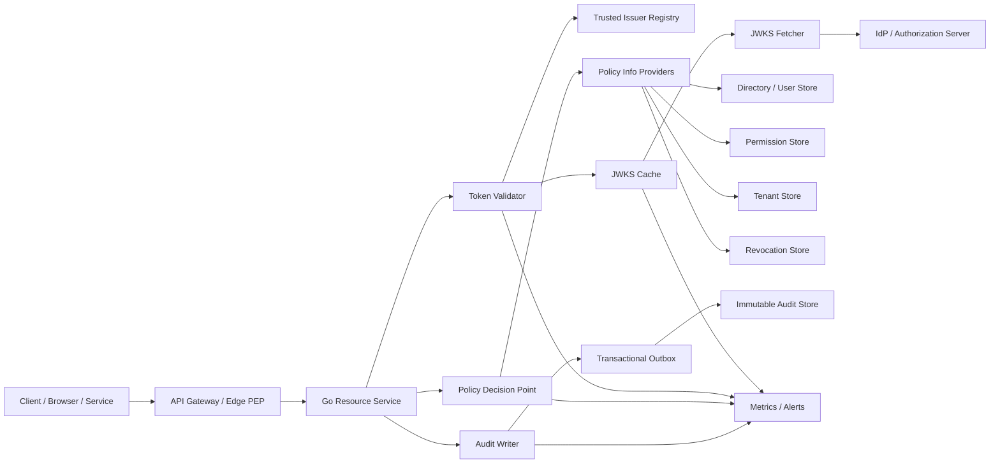
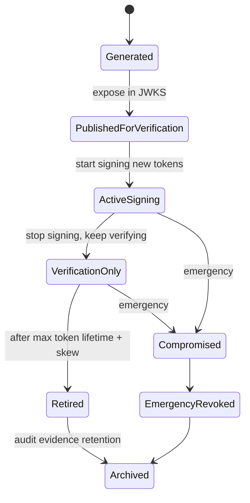
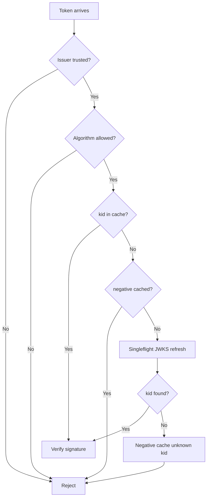
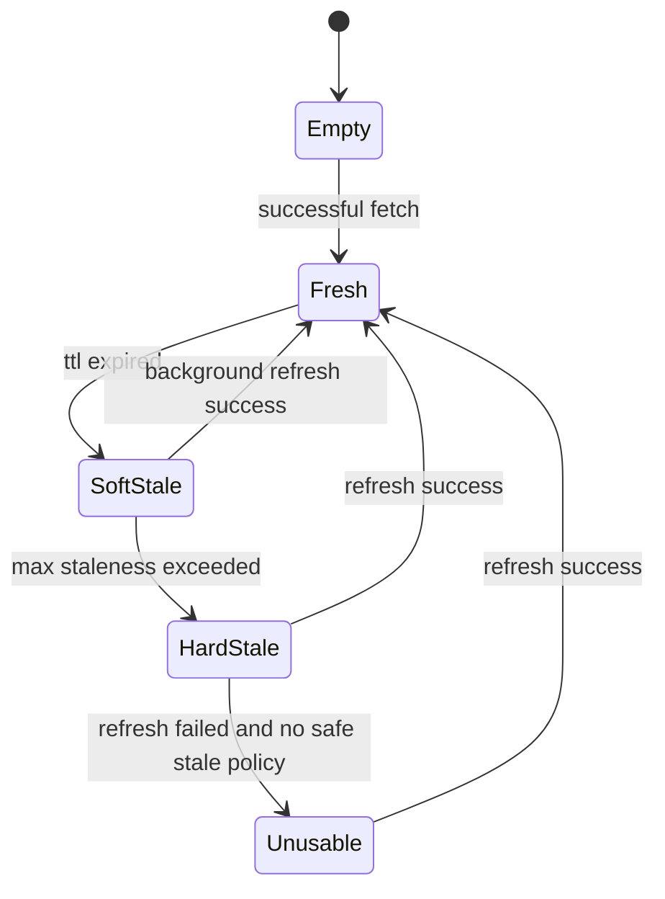
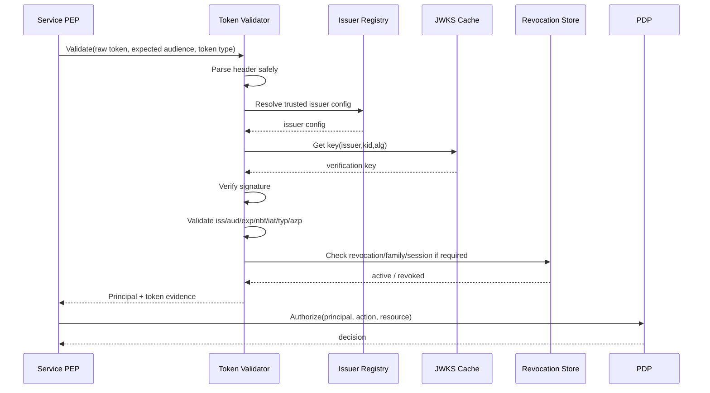
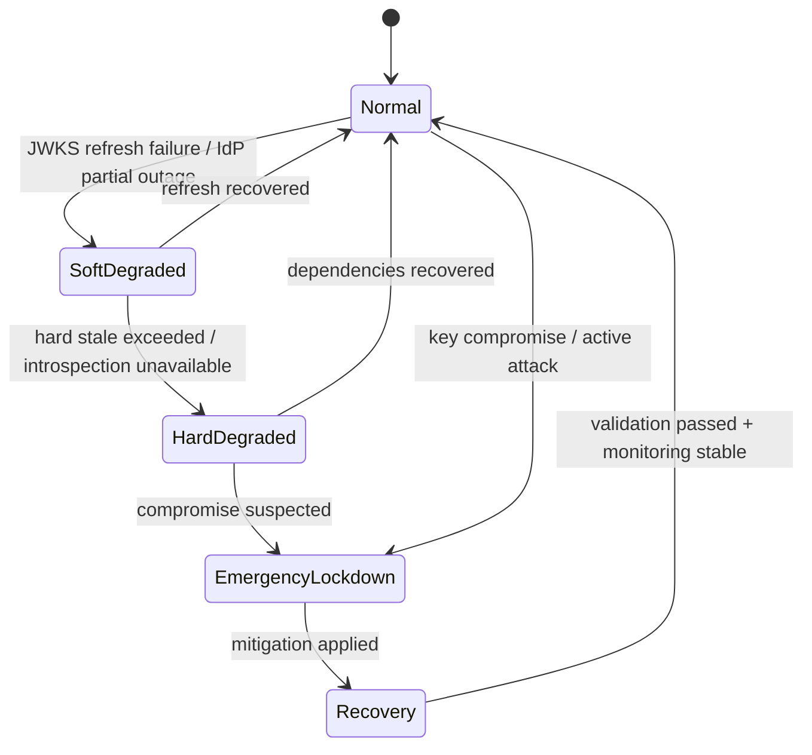
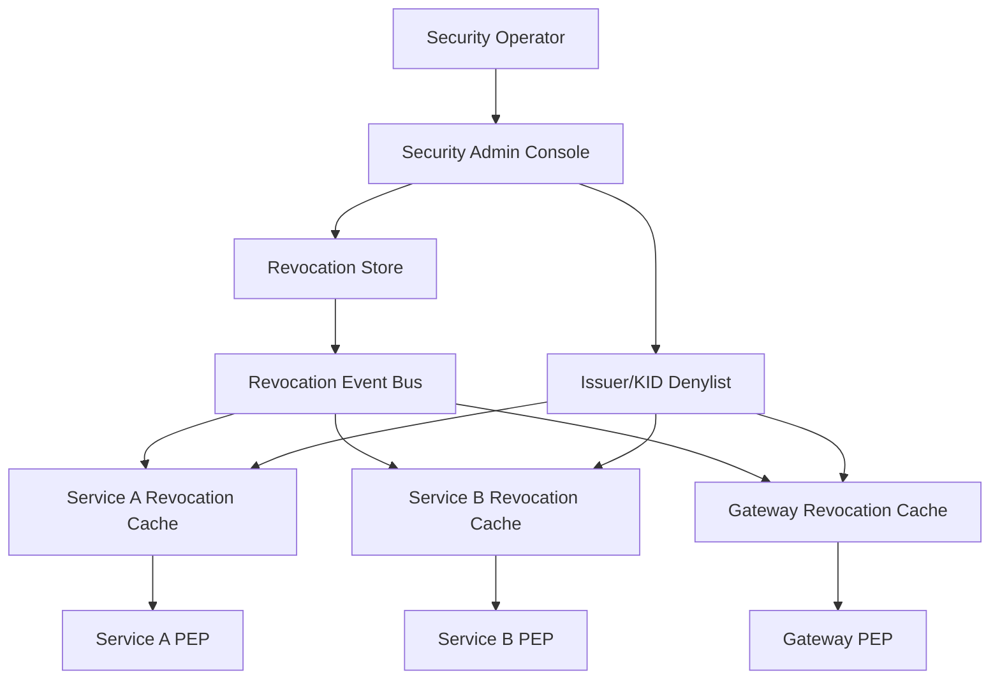

# learn-go-authentication-authorization-identity-permission-part-034.md

# Part 034 — Production Hardening: Key Rotation, JWKS Cache, Clock Skew, Outage Mode, Runbook

> Seri: **Go Authentication, Authorization, Identity, Permission — Advanced Engineering Handbook**  
> Target: **Go 1.26.x**  
> Level: advanced / staff+ / principal engineering  
> Fokus: membuat auth system **tetap benar, aman, terukur, observable, dan recoverable** ketika masuk production reality: key rotation, JWKS cache, IdP outage, clock skew, revocation emergency, token validator failure, policy cache staleness, dan incident runbook.

---

## Daftar Isi

1. [Tujuan Part Ini](#1-tujuan-part-ini)
2. [Mental Model: Production Auth Is a Safety-Critical Control Plane](#2-mental-model-production-auth-is-a-safety-critical-control-plane)
3. [Production Hardening Scope](#3-production-hardening-scope)
4. [Core Invariants](#4-core-invariants)
5. [Reference Architecture](#5-reference-architecture)
6. [Key Management: Signing, Verification, Rotation, Emergency Revocation](#6-key-management-signing-verification-rotation-emergency-revocation)
7. [JWKS Cache Engineering](#7-jwks-cache-engineering)
8. [Token Validator Hardening](#8-token-validator-hardening)
9. [Clock Skew, Time Discipline, and Temporal Claims](#9-clock-skew-time-discipline-and-temporal-claims)
10. [IdP / Authorization Server Outage Mode](#10-idp--authorization-server-outage-mode)
11. [Revocation Emergency Playbook](#11-revocation-emergency-playbook)
12. [Refresh Token, Session, and Policy Invalidation](#12-refresh-token-session-and-policy-invalidation)
13. [Fail-Closed, Fail-Open, and Degraded Mode](#13-fail-closed-fail-open-and-degraded-mode)
14. [Multi-Tenant Production Hardening](#14-multi-tenant-production-hardening)
15. [Go Package Architecture](#15-go-package-architecture)
16. [Reference Go Types](#16-reference-go-types)
17. [JWKS Client Implementation Model](#17-jwks-client-implementation-model)
18. [Validator Pipeline Implementation Model](#18-validator-pipeline-implementation-model)
19. [Operational Configuration](#19-operational-configuration)
20. [Observability: Metrics, Logs, Traces, Alerts](#20-observability-metrics-logs-traces-alerts)
21. [Runbooks](#21-runbooks)
22. [Testing Strategy](#22-testing-strategy)
23. [Failure-Mode Matrix](#23-failure-mode-matrix)
24. [Production Checklist](#24-production-checklist)
25. [Case Study: Regulatory Case Management Platform](#25-case-study-regulatory-case-management-platform)
26. [What Top Engineers Pay Attention To](#26-what-top-engineers-pay-attention-to)
27. [References](#27-references)

---

## 1. Tujuan Part Ini

Part sebelumnya sudah membangun fondasi:

- JWT/JWKS validation
- token lifecycle
- auth middleware
- OAuth2/OIDC
- authorization model
- distributed authorization
- auditability
- impersonation/break-glass
- abuse defense

Part ini menjawab pertanyaan production:

> “Apa yang terjadi ketika signing key berubah, IdP down, JWKS endpoint lambat, clock antar node berbeda, refresh token bocor, revocation event terlambat, cache permission stale, atau auditor meminta bukti keputusan authorization tiga bulan lalu?”

Di level basic, auth terlihat seperti:

```text
validate token -> allow request
```

Di production, auth lebih mirip:

```text
discover issuer metadata
fetch JWKS
cache keys safely
validate token strictly
apply temporal leeway
check revocation/freshness budget
enforce policy version
record decision evidence
handle degraded mode
alert abnormal behavior
rotate keys without outage
recover from compromise
```

Engineering target part ini:

1. Mampu mendesain **key rotation** tanpa downtime.
2. Mampu membangun **JWKS cache** yang aman, bounded, observable, dan tidak mudah dijadikan DoS vector.
3. Mampu membedakan **stale-but-safe** vs **stale-and-dangerous**.
4. Mampu membuat **outage mode** yang tidak otomatis menjadi privilege escalation.
5. Mampu membuat **runbook incident** untuk key compromise, IdP outage, clock skew, token replay, dan policy cache corruption.
6. Mampu membangun Go auth package yang explicit, testable, auditable, dan production-ready.

---

## 2. Mental Model: Production Auth Is a Safety-Critical Control Plane

Auth system bukan sekadar fitur aplikasi. Ia adalah **control plane** yang menentukan:

- siapa boleh masuk,
- siapa boleh bertindak,
- atas nama siapa ia bertindak,
- terhadap resource apa,
- berdasarkan authority apa,
- dan apakah keputusan itu bisa dipertanggungjawabkan.

Dalam production, auth control plane punya empat risiko besar:

| Risiko | Dampak |
|---|---|
| **False allow** | User/service tidak berhak tetap bisa akses. Ini security incident. |
| **False deny** | User/service berhak tetapi diblokir. Ini availability/business incident. |
| **Unexplainable allow/deny** | Tidak bisa membuktikan alasan keputusan. Ini audit/regulatory incident. |
| **Unrecoverable failure** | Tidak bisa pulih cepat ketika key/IdP/cache/policy rusak. Ini operational maturity failure. |

Top engineer tidak hanya bertanya:

> “Apakah token valid?”

Mereka bertanya:

> “Valid menurut issuer mana, key versi mana, metadata versi mana, policy versi mana, tenant mana, jam siapa, cache freshness berapa, revocation source apa, dan apa bukti yang tersimpan?”

---

## 3. Production Hardening Scope

Part ini membahas production hardening untuk:

- OIDC/OAuth2 relying party / resource server.
- Internal Go API yang memvalidasi JWT/opaque token.
- Service-to-service auth.
- Multi-tenant authorization.
- Session/token lifecycle.
- Key rotation dan JWKS cache.
- Outage/degraded mode.
- Observability dan incident response.

Part ini **tidak mengulang**:

- detail primitive cryptography,
- low-level HTTP/gRPC transport,
- generic logging/observability,
- generic Kubernetes deployment,
- generic performance benchmarking.

Namun seluruh topik itu akan disentuh ketika langsung mempengaruhi auth correctness.

---

## 4. Core Invariants

Gunakan invariant ini sebagai “hukum desain” untuk production auth.

### 4.1 Validator Must Be Strict by Default

Token hanya valid jika seluruh syarat terpenuhi:

- signature valid,
- algorithm allowed,
- key berasal dari trusted issuer,
- `iss` exact match,
- `aud` exact match,
- token type benar,
- `exp`, `nbf`, `iat` masuk akal,
- `azp` / authorized party diproses jika relevan,
- scope/permission tidak disimpulkan dari claim yang tidak trusted,
- tenant binding cocok dengan request/resource,
- token belum direvoked jika sistem memerlukan revocation check.

### 4.2 Key Discovery Is Not Trust Discovery

JWKS endpoint hanya boleh dipakai setelah issuer dipercaya.

Jangan biarkan token menentukan sendiri URL key:

```text
BAD:
token header jku -> fetch that URL -> verify signature
```

Yang benar:

```text
trusted issuer config -> trusted jwks_uri -> fetch keys -> verify token from that issuer
```

### 4.3 Cache Is a Performance Optimization, Not a Source of Truth

Cache boleh mempercepat:

- JWKS key lookup,
- issuer metadata,
- introspection response,
- permission decision,
- revocation status.

Tetapi cache harus punya:

- TTL,
- max staleness,
- explicit invalidation,
- bounded size,
- observability,
- behavior saat source down,
- tenant/issuer isolation.

### 4.4 Rotation Must Be Boring

Key rotation yang baik tidak dramatis.

Rotation ideal:

1. publish new key,
2. wait propagation,
3. start signing with new key,
4. keep old key for verification,
5. wait token max lifetime,
6. retire old key,
7. monitor errors.

Jika rotation butuh semua service restart bersamaan, desainnya belum matang.

### 4.5 Emergency Revocation Beats Availability for High-Risk Access

Untuk key compromise, token family compromise, break-glass abuse, admin compromise:

> false deny sementara lebih dapat diterima daripada false allow yang membuka data/regulatory breach.

Namun degraded mode harus granular. Tidak semua request harus mati jika hanya admin key yang bocor.

### 4.6 Audit Evidence Must Outlive Cache and Tokens

Audit tidak boleh bergantung pada:

- token masih tersedia,
- JWKS masih menampilkan old key,
- policy current version,
- cache masih ada,
- session masih aktif.

Audit decision harus menyimpan snapshot minimal:

- subject,
- actor,
- issuer,
- audience,
- token ID/hash,
- key ID,
- auth method,
- assurance,
- tenant,
- resource,
- action,
- policy version,
- decision,
- reason,
- timestamp,
- correlation ID.

---

## 5. Reference Architecture



Important boundaries:

| Boundary | Responsibility |
|---|---|
| Gateway | coarse authentication, request normalization, rate limit, edge deny |
| Service | resource-level enforcement, tenant binding, business action authorization |
| Validator | token validation, issuer/key/audience/time/type checks |
| JWKS cache | key retrieval/caching/rotation/staleness controls |
| PDP | policy decision |
| PIP | attributes, roles, relationships, revocation, tenant state |
| Audit | durable evidence |

---

## 6. Key Management: Signing, Verification, Rotation, Emergency Revocation

### 6.1 Key Types in Auth Systems

| Key | Used For | Owner |
|---|---|---|
| OIDC signing key | signing ID token / JWT access token | IdP / AS |
| Resource server verification key | verifying issuer tokens | Resource service cache |
| Session signing key | signing local session cookie/token | Application |
| Session encryption key | encrypting local session data | Application |
| Refresh token hash pepper | protecting stored refresh token hashes | Auth service |
| mTLS private key | service identity | workload / mesh |
| DPoP client key | proof-of-possession token binding | client |
| WebAuthn credential public key | passkey verification | relying party |
| Audit chain key | tamper-evident audit integrity | audit/security platform |

Part ini fokus pada key yang berpengaruh ke token/session validation.

### 6.2 Key Rotation Lifecycle



### 6.3 Normal Rotation Timeline

Assume:

- access token TTL: 15 minutes,
- max clock skew: 2 minutes,
- JWKS cache TTL: 5 minutes,
- propagation delay: 5 minutes.

Safe normal rotation:

```text
T0       generate key K2
T0       publish K2 in JWKS, but still sign with K1
T0+10m   begin signing with K2
T0+25m   stop accepting K1 only if all K1-signed tokens expired
T0+30m   remove K1 from JWKS
```

More conservative formula:

```text
old_key_removal_time >= last_sign_time_old_key
                      + max_access_token_lifetime
                      + max_clock_skew
                      + max_jwks_cache_staleness
                      + propagation_safety_margin
```

### 6.4 Key Rotation Anti-Patterns

#### Anti-pattern: Replace JWKS atomically without overlap

```text
JWKS before: [K1]
signing key changes to K2
JWKS after:  [K2]
```

Problem:

- tokens signed by K1 are still alive,
- resource servers can no longer validate them,
- mass false-deny incident.

Correct:

```text
JWKS during rotation: [K1, K2]
```

#### Anti-pattern: Same `kid` reused for different key material

`kid` must identify a key version. Reusing `kid` breaks cache semantics.

Bad:

```json
{"kid":"prod-key","kty":"RSA","n":"old..."}
{"kid":"prod-key","kty":"RSA","n":"new..."}
```

Better:

```json
{"kid":"2026-06-01-rs256-01","kty":"RSA","n":"old..."}
{"kid":"2026-06-24-rs256-01","kty":"RSA","n":"new..."}
```

#### Anti-pattern: Blindly trust token header key references

Headers such as `jku`, `jwk`, or `x5u` must not override trusted issuer configuration unless explicitly designed and heavily constrained.

### 6.5 Emergency Key Revocation

Emergency revocation happens when:

- private signing key suspected leaked,
- token signing pipeline compromised,
- wrong key used by wrong issuer/tenant,
- JWKS poisoned,
- signing service misconfigured,
- old key still signs tokens after retirement,
- attacker signs tokens accepted by resource servers.

Emergency action hierarchy:

1. Stop issuing tokens with compromised key.
2. Remove compromised key from JWKS or mark it denied in validators.
3. Push validator denylist by `issuer + kid`.
4. Revoke affected token families/sessions if needed.
5. Force reauthentication for affected users/services.
6. Increase monitoring sensitivity.
7. Preserve forensic evidence.

Important: removing a key from JWKS is not enough if validators use stale cache. Resource servers should support emergency denylist independent of JWKS TTL.

---

## 7. JWKS Cache Engineering

JWKS cache looks simple until production failure happens.

### 7.1 JWKS Cache Responsibilities

A JWKS cache should:

- fetch from trusted `jwks_uri`,
- cache keys by issuer and `kid`,
- enforce allowed algorithms,
- enforce key use (`use`) / key operations (`key_ops`) if present,
- enforce key type compatibility,
- handle unknown `kid`,
- avoid unbounded fetch storms,
- respect HTTP cache headers with internal maximums,
- support background refresh,
- support stale-while-revalidate within safe bounds,
- expose metrics,
- support emergency key denylist,
- isolate tenants/issuers.

### 7.2 Cache Key

Cache key must include issuer.

Bad:

```go
map[string]Key // kid -> key
```

Why bad:

- two issuers can use same `kid`,
- malicious tenant IdP can collide with trusted `kid`,
- cross-issuer confusion.

Better:

```go
type KeyID struct {
    Issuer string
    KID    string
}
```

For multi-tenant federation:

```go
type IssuerID struct {
    TenantID string
    Issuer   string
}
```

### 7.3 Unknown KID Strategy

When token has unknown `kid`:

1. Check issuer is trusted.
2. Check algorithm allowed for issuer.
3. Check negative cache for `(issuer, kid)`.
4. If not negative-cached, trigger refresh with singleflight.
5. Re-check cache.
6. If still unknown, reject token.
7. Record metric.



### 7.4 Avoiding JWKS Fetch Storm

Attack:

```text
attacker sends many JWTs with random kid
service fetches JWKS for every unknown kid
IdP/JWKS endpoint overloaded
auth path becomes slow/down
```

Defense:

- singleflight refresh per issuer,
- negative cache unknown `kid`,
- rate limit JWKS refresh,
- background refresh,
- circuit breaker,
- max JWKS document size,
- max keys per issuer,
- HTTP timeout,
- no redirects or constrained redirects,
- trusted host allowlist.

### 7.5 HTTP Cache Headers vs Security Boundaries

JWKS endpoints may return:

- `Cache-Control: max-age=...`
- `ETag`
- `Last-Modified`

Use them, but do not let remote metadata fully control your safety posture.

Recommended internal constraints:

```text
effective_ttl = min(remote_max_age, configured_max_ttl)
refresh_interval = min(effective_ttl / 2, configured_background_refresh)
hard_stale_limit = configured_hard_stale_limit
```

For high-risk services:

- `max_ttl`: 5–15 minutes,
- `hard_stale_limit`: 30–60 minutes,
- emergency denylist checked every request.

For lower-risk services:

- `max_ttl`: 30–60 minutes,
- `hard_stale_limit`: 2–6 hours,
- still support emergency denylist.

### 7.6 Stale-While-Revalidate

A practical JWKS cache state:



Rules:

| State | Behavior |
|---|---|
| Empty | Cannot verify token unless preloaded key exists |
| Fresh | Verify normally |
| SoftStale | Verify with stale key and refresh in background |
| HardStale | Depends on endpoint risk; usually reject high-risk access |
| Unusable | Fail closed |

### 7.7 JWKS Poisoning Controls

A resource server must not accept arbitrary key set changes blindly.

Controls:

- issuer exact match,
- JWKS URI pinned to issuer config/discovery,
- HTTPS only,
- host allowlist/pinning if feasible,
- no token-supplied `jku`,
- allowed algorithm per issuer,
- key type/algorithm compatibility,
- max keys per issuer,
- reject duplicate `kid` with different material in same JWKS,
- alert sudden key-set explosion,
- alert unexpected algorithm change,
- alert unexpected key removal.

---

## 8. Token Validator Hardening

### 8.1 Validation Pipeline

A hardened validator should perform layered checks.



### 8.2 Validation Order

Recommended order:

1. Basic syntax limit:
   - max token length,
   - compact JWT parts count,
   - base64url decode size limits.
2. Header parse:
   - reject `none`,
   - reject unknown/disallowed `alg`,
   - require `kid` if issuer uses JWKS rotation,
   - ignore/forbid dynamic key URLs unless explicitly supported.
3. Unverified claims parse only for routing:
   - use `iss` only to select trusted config,
   - do not trust authorization claims before signature validation.
4. Key lookup:
   - by trusted issuer config + `kid`,
   - not global `kid`.
5. Signature validation.
6. Registered claim validation:
   - `iss`,
   - `aud`,
   - `exp`,
   - `nbf`,
   - `iat`,
   - `azp`,
   - `typ` / token-use if used.
7. Application claim validation:
   - tenant,
   - session ID,
   - subject,
   - auth method,
   - assurance.
8. Revocation / introspection if required.
9. Principal construction.
10. Authorization decision.

### 8.3 Token Type Confusion

Problem:

- ID token accepted as access token.
- Access token accepted as session token.
- Refresh token accepted at resource API.
- API token accepted in browser endpoint.
- Service token accepted as human user token.

Defense:

- explicit expected token type,
- audience separation,
- issuer separation if needed,
- `typ` / `token_use` / custom claim check,
- different signing keys for different token classes if feasible,
- different validator configs per boundary.

Example token class matrix:

| Token | Issuer | Audience | Accepted By | Never Accepted By |
|---|---|---|---|---|
| ID token | OIDC OP | client_id | RP callback/session establishment | Resource API |
| Access token | AS | API audience | Resource server | Browser session store |
| Refresh token | AS/Auth service | token endpoint | Token endpoint only | Resource API |
| Session cookie | App | app origin | BFF/web app | External API |
| Service token | AS/workload IdP | service audience | internal services | user-facing admin UI unless explicit |

### 8.4 Algorithm Confusion

Do not let token choose algorithm policy.

Bad mental model:

```text
header.alg says RS256 -> use RS256
header.alg says HS256 -> use HS256
```

Correct mental model:

```text
issuer config says allowed algorithms = [RS256]
token header alg must be one of allowed algorithms
key type must match algorithm
```

### 8.5 Audience Validation

Audience must be exact and contextual.

Bad:

```go
if strings.Contains(aud, "api") { allow }
```

Better:

```go
expected := Audience("https://case-api.internal")
if !claims.HasAudience(expected) {
    reject
}
```

Multi-audience tokens should be treated carefully. For high-risk APIs, prefer narrow audiences.

### 8.6 Issuer Validation

Issuer must be exact string comparison after normalization rules defined by spec/provider.

Do not accept:

- prefix match,
- suffix match,
- case-insensitive random matching,
- issuer from user input,
- tenant ID alone as issuer.

### 8.7 Revocation Check Placement

Not every JWT validation requires online revocation check. But high-risk cases do:

- admin endpoints,
- break-glass,
- impersonation,
- destructive actions,
- export/report,
- permission management,
- financial/regulatory submission,
- session after credential reset,
- user/service flagged as compromised.

Pattern:

```text
low-risk read:
  short TTL access token + no online revocation

high-risk write:
  short TTL access token + session freshness + revocation check

admin/break-glass:
  token validation + session revocation + step-up freshness + audit reason
```

---

## 9. Clock Skew, Time Discipline, and Temporal Claims

### 9.1 Why Clock Skew Matters

JWT validation depends on time:

- `exp`: expiration time,
- `nbf`: not before,
- `iat`: issued at,
- `auth_time`: authentication time,
- refresh token rotation timestamps,
- session idle timeout,
- revocation time,
- audit event ordering.

If service clocks drift, you can get:

- valid tokens rejected,
- expired tokens accepted,
- step-up freshness bypassed,
- revocation race,
- confusing audit timeline.

### 9.2 Temporal Claims Validation

Typical validation:

```text
now <= exp + allowed_skew
now + allowed_skew >= nbf
iat <= now + allowed_skew
auth_time + freshness_window >= now
```

Recommended skew:

| Environment | Suggested leeway |
|---|---|
| tightly controlled server-side infra | 30s–120s |
| mobile/native clients involved | 1–5m only where unavoidable |
| high-risk admin actions | as low as practical |
| service-to-service | 30s–60s |

Do not use huge leeway like 30 minutes. That effectively extends token lifetime.

### 9.3 Time Source

In Go:

- use `time.Now()` through an injected `Clock` interface for testability,
- use monotonic component for measuring durations,
- store audit timestamps as UTC,
- avoid relying on DB server time and app time interchangeably without discipline.

Example:

```go
type Clock interface {
    Now() time.Time
}

type RealClock struct{}

func (RealClock) Now() time.Time {
    return time.Now().UTC()
}
```

### 9.4 Alerting for Clock Skew

Signals:

- sudden `token_not_yet_valid` spike,
- sudden `token_expired` spike across all services,
- service-specific auth failures,
- audit timestamps out of order,
- TLS certificate not yet valid / expired errors.

Metric examples:

```text
auth_token_validation_total{result="not_yet_valid"}
auth_token_validation_total{result="expired"}
auth_clock_skew_estimate_seconds{issuer="..."}
auth_reauth_freshness_rejected_total
```

---

## 10. IdP / Authorization Server Outage Mode

### 10.1 Outage Types

| Outage | Impact |
|---|---|
| Discovery endpoint down | new config refresh fails |
| JWKS endpoint down | new/rotated key fetch fails |
| Token endpoint down | login/refresh/client-credentials fail |
| Introspection endpoint down | opaque token validation may fail |
| Revocation endpoint down | logout/revocation requests fail |
| UserInfo endpoint down | login/account linking may fail |
| Directory/PIP down | authorization decisions may fail |
| Policy bundle endpoint down | policy refresh fails |

### 10.2 Resource Server During IdP Outage

If service already has fresh/soft-stale JWKS:

- existing access tokens can be validated offline,
- new unknown `kid` may fail,
- refresh/login may fail elsewhere,
- high-risk access may require online checks and fail.

Decision matrix:

| Request Type | IdP Down but JWKS Fresh | IdP Down and JWKS Hard-Stale |
|---|---:|---:|
| Low-risk read with valid JWT | allow | maybe deny or degraded allow depending risk |
| Destructive write | allow only if local policy/revocation sufficient | deny |
| Admin action | require revocation/session freshness; likely deny | deny |
| Login callback | deny/fail | deny/fail |
| Token refresh | fail at AS | fail |
| Break-glass | local emergency path only | local emergency path only |

### 10.3 Degraded Mode Principles

Degraded mode must be explicit.

Bad:

```text
IdP down -> skip auth
```

Correct:

```text
IdP down -> use locally verifiable tokens within bounded staleness
         -> disable high-risk operations requiring online assurance
         -> surface degraded status
         -> alert operators
```

### 10.4 Outage Mode State Machine



---

## 11. Revocation Emergency Playbook

### 11.1 Revocation Granularity

| Granularity | Example | Blast Radius |
|---|---|---|
| single token | one access token `jti` | narrow |
| token family | refresh token family | session/device |
| session | web/mobile session | user-device |
| user | all sessions for user | user |
| client | OAuth client disabled | app/integration |
| issuer key | compromised `kid` | all tokens signed by key |
| tenant | tenant-wide compromise | tenant |
| global | all tokens/session invalid | whole system |

### 11.2 Emergency Revocation Architecture



### 11.3 Revocation Store Design

Minimal fields:

```sql
CREATE TABLE auth_revocation (
    id              TEXT PRIMARY KEY,
    scope_type      TEXT NOT NULL, -- token, family, session, subject, client, issuer_kid, tenant
    scope_value     TEXT NOT NULL,
    issuer          TEXT,
    tenant_id       TEXT,
    reason          TEXT NOT NULL,
    severity        TEXT NOT NULL,
    revoked_at      TIMESTAMPTZ NOT NULL,
    expires_at      TIMESTAMPTZ,
    created_by      TEXT NOT NULL,
    correlation_id  TEXT NOT NULL
);

CREATE INDEX auth_revocation_lookup
ON auth_revocation(scope_type, scope_value, issuer, tenant_id);
```

### 11.4 Validator Revocation Check

```go
type RevocationChecker interface {
    IsRevoked(ctx context.Context, q RevocationQuery) (RevocationResult, error)
}

type RevocationQuery struct {
    Issuer        string
    TokenID       string
    TokenHash     string
    TokenFamilyID string
    SessionID     string
    SubjectID     string
    ClientID      string
    TenantID      string
    KID           string
    CheckedAt     time.Time
}

type RevocationResult struct {
    Revoked bool
    Reason  string
    Source  string
}
```

### 11.5 Revocation SLA

You need explicit SLA:

| Event | Target Propagation |
|---|---:|
| normal logout | best effort, seconds/minutes |
| password reset | seconds |
| admin user disabled | seconds |
| refresh token replay | immediate local + event propagation |
| key compromise | immediate denylist push |
| tenant compromise | immediate tenant lock |

For JWT access token, revocation latency is bounded by:

```text
min(online revocation check latency, access token TTL, revocation event propagation)
```

If you do not check revocation online, your worst-case exposure is close to token TTL plus clock skew.

---

## 12. Refresh Token, Session, and Policy Invalidation

### 12.1 Invalidation Types

| Trigger | What to Invalidate |
|---|---|
| password change/reset | sessions, refresh token families, remembered devices |
| MFA reset | elevated sessions, recovery tokens, potentially all sessions |
| role removed | permission cache, active sessions if embedded claims |
| tenant membership removed | tenant context sessions, permission cache |
| account disabled | all sessions/tokens |
| suspicious login | active session review, refresh family |
| break-glass ended | elevated token/session |
| policy changed | decision cache by policy version |

### 12.2 Embedded Claims vs Dynamic Permissions

If tokens embed roles/permissions:

- fast local checks,
- stale until token expires,
- difficult immediate revocation.

If permissions resolved dynamically:

- fresher,
- latency/cache complexity,
- dependency failure concerns.

Common enterprise approach:

```text
token contains identity/session/tenant/auth assurance
permission decision resolved by service/PDP
short-lived token limits stale identity claims
authorization cache has version/freshness bound
```

### 12.3 Policy Version Invalidation

Every policy decision should include:

```go
type PolicyEvidence struct {
    PolicySetID      string
    PolicyVersion    string
    PermissionVersion string
    AttributeVersion string
}
```

When policy changes:

- increment policy version,
- invalidate old decision cache,
- record rollout window,
- allow canary policy evaluation,
- compare old/new decisions for sensitive policies.

---

## 13. Fail-Closed, Fail-Open, and Degraded Mode

### 13.1 Definitions

| Mode | Meaning |
|---|---|
| Fail-closed | dependency failure leads to deny |
| Fail-open | dependency failure leads to allow |
| Degraded allow | allow limited subset under explicit constraints |
| Degraded deny | deny high-risk operations but allow low-risk operations |
| Emergency lockdown | deny most/all except emergency operator path |

### 13.2 Decision Framework

Ask:

1. What is the asset risk?
2. Is the caller already authenticated with local evidence?
3. Is authorization decision local or dependency-based?
4. Is revocation required for this action?
5. What is maximum acceptable stale window?
6. Is there an audit trail for degraded allow?
7. Can we restrict operation to read-only?
8. Can tenant boundary still be enforced?
9. Can we alert and expire degraded mode automatically?

### 13.3 Example Policy

| Action | Dependency Down | Behavior |
|---|---|---|
| read own low-risk profile | PDP cache fresh | allow |
| read case details | PDP soft-stale < 5m | allow with degraded audit |
| export all cases | PDP unavailable | deny |
| approve enforcement action | revocation unavailable | deny |
| admin permission change | IdP/PDP degraded | deny |
| break-glass access | normal IdP down | local emergency flow with dual control |

### 13.4 Never Fail Open Silently

If degraded allow is used, record:

- degraded reason,
- dependency state,
- staleness,
- action/resource,
- policy evidence,
- operator mode if any.

---

## 14. Multi-Tenant Production Hardening

### 14.1 Tenant-Isolated Issuer and Key Cache

Multi-tenant systems may support:

- one issuer for all tenants,
- issuer per tenant,
- external IdP per tenant,
- multiple IdPs per tenant.

Do not key caches globally.

```go
type TenantIssuerKey struct {
    TenantID string
    Issuer   string
    KID      string
}
```

### 14.2 Tenant Binding

Token tenant claims must match:

- route/path tenant,
- resource tenant,
- session active tenant,
- policy decision tenant,
- audit tenant.

```text
token.tenant_id == request.tenant_id == resource.tenant_id == decision.tenant_id
```

### 14.3 External IdP Tenant Risk

For tenant-owned IdP:

- tenant admin may rotate keys,
- tenant IdP may be misconfigured,
- tenant IdP outage impacts only that tenant,
- tenant IdP compromise should not compromise other tenants.

Controls:

- issuer allowlist per tenant,
- tenant-scoped JWKS cache,
- tenant-scoped rate limit,
- tenant-scoped emergency disable,
- claim mapping versioning,
- max trust level per external IdP.

---

## 15. Go Package Architecture

Recommended package boundary:

```text
/internal/authn/
  issuer/
    registry.go
    discovery.go
  jwks/
    cache.go
    fetcher.go
    keyset.go
  token/
    validator.go
    claims.go
    errors.go
  session/
    session.go
    revocation.go
  degraded/
    mode.go
  audit/
    evidence.go

/internal/authz/
  decision.go
  pep.go
  pdp.go
  policy_version.go

/internal/platform/
  clock/
    clock.go
  metrics/
  logger/
```

Design principles:

- validator should not know business authorization rules,
- middleware should not fetch random keys,
- issuer registry should be explicit,
- JWKS cache should be dependency-injected,
- clock should be injectable,
- errors should be typed,
- all security decisions should emit evidence.

---

## 16. Reference Go Types

### 16.1 Issuer Config

```go
package issuer

import "time"

type Config struct {
    ID                  string
    Issuer              string
    JWKSURI             string
    AllowedAlgorithms   []string
    ExpectedAudiences   []string
    RequireKID          bool
    MaxTokenLifetime    time.Duration
    ClockSkew           time.Duration
    JWKSMaxTTL          time.Duration
    JWKSHardStaleLimit  time.Duration
    TokenTypes          []string
    TenantID            string
}
```

### 16.2 Token Evidence

```go
package token

import "time"

type Evidence struct {
    Issuer        string
    Subject      string
    Audience      []string
    ClientID      string
    AuthorizedParty string
    TokenID       string
    TokenHash     string
    TokenType     string
    KID           string
    Algorithm     string
    IssuedAt      time.Time
    NotBefore     time.Time
    ExpiresAt     time.Time
    AuthTime      time.Time
    AMR           []string
    ACR           string
    TenantID      string
    SessionID     string
    ValidationAt  time.Time
    ValidatorID   string
}
```

### 16.3 Validator Errors

```go
package token

type ErrorCode string

const (
    ErrMalformedToken       ErrorCode = "malformed_token"
    ErrUntrustedIssuer      ErrorCode = "untrusted_issuer"
    ErrUnsupportedAlgorithm ErrorCode = "unsupported_algorithm"
    ErrUnknownKID           ErrorCode = "unknown_kid"
    ErrInvalidSignature     ErrorCode = "invalid_signature"
    ErrExpired              ErrorCode = "expired"
    ErrNotYetValid          ErrorCode = "not_yet_valid"
    ErrInvalidAudience      ErrorCode = "invalid_audience"
    ErrInvalidTokenType     ErrorCode = "invalid_token_type"
    ErrRevoked              ErrorCode = "revoked"
    ErrValidatorUnavailable ErrorCode = "validator_unavailable"
)

type ValidationError struct {
    Code        ErrorCode
    SafeMessage string
    Cause       error
}

func (e *ValidationError) Error() string {
    return string(e.Code)
}
```

Why typed errors matter:

- HTTP/gRPC status mapping,
- metrics label cardinality,
- audit reason,
- safe client response,
- incident diagnosis.

---

## 17. JWKS Client Implementation Model

This is a simplified production-oriented model. Real implementation should use a vetted JOSE library for key parsing and signature verification.

```go
package jwks

import (
    "context"
    "errors"
    "sync"
    "time"
)

type Key struct {
    Issuer    string
    KID       string
    Algorithm string
    Material  any
    NotAfter  time.Time
}

type Fetcher interface {
    Fetch(ctx context.Context, issuer string, jwksURI string) (KeySet, FetchMeta, error)
}

type KeySet struct {
    Keys []Key
}

type FetchMeta struct {
    FetchedAt time.Time
    ExpiresAt time.Time
    ETag      string
}

type Cache struct {
    mu       sync.RWMutex
    entries  map[string]*issuerEntry
    fetcher  Fetcher
    clock    Clock
    maxTTL   time.Duration
    hardTTL  time.Duration
}

type Clock interface {
    Now() time.Time
}

type issuerEntry struct {
    issuer   string
    jwksURI  string
    keys     map[string]Key
    fetched  time.Time
    expires  time.Time
    hardExp  time.Time
    lastErr  error
}

var ErrKeyNotFound = errors.New("jwks key not found")
var ErrKeySetStale = errors.New("jwks key set hard stale")
```

### 17.1 Singleflight Refresh

In real code, use `golang.org/x/sync/singleflight` to deduplicate refresh per issuer.

Conceptual behavior:

```go
func (c *Cache) GetKey(ctx context.Context, issuer, jwksURI, kid string) (Key, error) {
    now := c.clock.Now()

    c.mu.RLock()
    e := c.entries[issuer]
    if e != nil {
        if key, ok := e.keys[kid]; ok && now.Before(e.hardExp) {
            softStale := now.After(e.expires)
            c.mu.RUnlock()

            if softStale {
                go c.refreshBestEffort(issuer, jwksURI)
            }
            return key, nil
        }
    }
    c.mu.RUnlock()

    // Synchronous refresh on miss.
    if err := c.refresh(ctx, issuer, jwksURI); err != nil {
        return Key{}, err
    }

    c.mu.RLock()
    defer c.mu.RUnlock()

    e = c.entries[issuer]
    if e == nil || now.After(e.hardExp) {
        return Key{}, ErrKeySetStale
    }
    key, ok := e.keys[kid]
    if !ok {
        return Key{}, ErrKeyNotFound
    }
    return key, nil
}
```

Production additions:

- negative cache unknown `kid`,
- rate limit refresh,
- context timeout,
- circuit breaker,
- HTTP cache headers,
- ETag conditional request,
- duplicate `kid` detection,
- max JWKS document size,
- max key count,
- metrics.

---

## 18. Validator Pipeline Implementation Model

Pseudo-code:

```go
func (v *Validator) Validate(ctx context.Context, raw string, expected Expected) (*Principal, *Evidence, error) {
    if len(raw) > v.maxTokenSize {
        return nil, nil, errCode(ErrMalformedToken)
    }

    header, claims, err := v.parser.ParseUnverified(raw)
    if err != nil {
        return nil, nil, errCode(ErrMalformedToken)
    }

    cfg, err := v.issuers.Resolve(claims.Issuer)
    if err != nil {
        return nil, nil, errCode(ErrUntrustedIssuer)
    }

    if !cfg.AllowsAlgorithm(header.Algorithm) {
        return nil, nil, errCode(ErrUnsupportedAlgorithm)
    }

    if cfg.RequireKID && header.KID == "" {
        return nil, nil, errCode(ErrUnknownKID)
    }

    key, err := v.keys.GetKey(ctx, cfg.Issuer, cfg.JWKSURI, header.KID)
    if err != nil {
        return nil, nil, mapKeyError(err)
    }

    verified, err := v.parser.Verify(raw, key.Material, header.Algorithm)
    if err != nil {
        return nil, nil, errCode(ErrInvalidSignature)
    }

    now := v.clock.Now()

    if err := validateRegisteredClaims(verified, cfg, expected, now); err != nil {
        return nil, nil, err
    }

    evidence := buildEvidence(verified, header, cfg, now)

    if expected.RequireRevocationCheck {
        res, err := v.revocation.IsRevoked(ctx, RevocationQueryFrom(evidence))
        if err != nil {
            if expected.HighRisk {
                return nil, nil, errCode(ErrValidatorUnavailable)
            }
            // For lower risk, policy may allow bounded degraded validation.
        }
        if res.Revoked {
            return nil, nil, errCode(ErrRevoked)
        }
    }

    principal, err := v.principals.FromClaims(verified, evidence)
    if err != nil {
        return nil, nil, errCode(ErrMalformedToken)
    }

    return principal, evidence, nil
}
```

Important: `ParseUnverified` is only for routing to trusted issuer config. Never build an authenticated principal from unverified claims.

---

## 19. Operational Configuration

Example YAML:

```yaml
auth:
  validator_id: "case-api-token-validator-v3"
  max_token_size_bytes: 8192
  default_clock_skew: "60s"

  issuers:
    - id: "gov-main"
      issuer: "https://idp.example.gov/realms/main"
      jwks_uri: "https://idp.example.gov/realms/main/protocol/openid-connect/certs"
      allowed_algorithms: ["RS256"]
      expected_audiences:
        - "https://case-api.internal"
      require_kid: true
      max_token_lifetime: "15m"
      jwks_max_ttl: "5m"
      jwks_hard_stale_limit: "30m"

  revocation:
    enabled: true
    required_for:
      - "admin"
      - "export"
      - "permission_write"
      - "break_glass"
    cache_ttl: "10s"
    hard_fail_for_high_risk: true

  degraded_mode:
    enabled: true
    max_duration: "30m"
    allow_low_risk_read: true
    deny_admin: true
    deny_export: true
    deny_permission_write: true

  emergency:
    key_denylist_refresh: "5s"
    tenant_lock_refresh: "5s"
```

---

## 20. Observability: Metrics, Logs, Traces, Alerts

### 20.1 Metrics

Recommended metrics:

```text
auth_token_validation_total{issuer,result,reason,token_type}
auth_token_validation_duration_seconds{issuer,result}
auth_jwks_fetch_total{issuer,result}
auth_jwks_fetch_duration_seconds{issuer}
auth_jwks_cache_state{issuer,state}
auth_jwks_cache_age_seconds{issuer}
auth_unknown_kid_total{issuer}
auth_invalid_signature_total{issuer}
auth_revocation_check_total{result}
auth_revocation_check_duration_seconds
auth_degraded_mode_active{service,mode}
auth_degraded_decision_total{action,risk,decision}
auth_policy_cache_age_seconds{tenant}
auth_permission_decision_total{decision,reason}
auth_clock_temporal_reject_total{reason}
```

Avoid high-cardinality labels:

- raw `sub`,
- token ID,
- email,
- full URL,
- resource ID,
- arbitrary tenant if tenant count is huge and metrics backend cannot handle it.

Use logs/audit for detailed identifiers.

### 20.2 Structured Logs

Log security-relevant events with stable fields:

```json
{
  "event": "auth.token.validation.failed",
  "reason": "unknown_kid",
  "issuer": "https://idp.example.gov/realms/main",
  "kid": "2026-06-24-rs256-01",
  "audience": "https://case-api.internal",
  "request_id": "req-123",
  "tenant_id": "agency-a",
  "remote_ip_hash": "..."
}
```

Never log:

- raw access token,
- raw refresh token,
- session cookie,
- password,
- OTP,
- recovery code,
- full PII unless explicitly required and protected.

### 20.3 Alerts

Suggested alerts:

| Alert | Signal |
|---|---|
| JWKS endpoint failing | fetch failure > threshold |
| JWKS hard stale | cache age exceeds hard stale |
| Unknown kid spike | possible rotation or attack |
| Invalid signature spike | attack or misconfigured issuer |
| Token expired spike | clock issue or client bug |
| Not-before spike | clock skew |
| Revocation store unavailable | high-risk decisions impacted |
| Degraded mode active too long | operational incident |
| Key set changed unexpectedly | possible rotation or compromise |
| Tenant issuer disabled | tenant outage/security event |
| Admin denied spike | possible permission rollout bug |
| Authorization false-deny spike | policy/cache issue |

---

## 21. Runbooks

### 21.1 Runbook: Normal Signing Key Rotation

**Goal:** rotate signing key without downtime.

Steps:

1. Generate new key in KMS/HSM/secure key store.
2. Assign unique `kid`.
3. Publish public key in JWKS.
4. Confirm resource servers fetch new JWKS.
5. Wait propagation window.
6. Start signing new tokens with new key.
7. Monitor:
   - `unknown_kid`,
   - `invalid_signature`,
   - `jwks_fetch_failure`,
   - login/token issuance errors.
8. Keep old key in JWKS until all old tokens expire plus skew/cache margin.
9. Stop accepting old key after safe window.
10. Archive key metadata for audit.

Rollback:

- if new key causes failures before old key retired, resume signing with old key,
- keep both keys in JWKS,
- investigate validator compatibility.

### 21.2 Runbook: Unknown KID Spike

Possible causes:

- legitimate key rotation not propagated,
- attacker sends random `kid`,
- wrong issuer config,
- JWKS endpoint stale,
- cache bug,
- tenant IdP changed key unexpectedly.

Actions:

1. Check affected issuer/tenant.
2. Check if new key exists in trusted JWKS.
3. Check JWKS fetch health.
4. Check negative cache and refresh rate.
5. Compare token `iss`, `aud`, `kid`, `alg`.
6. If legitimate rotation: force refresh safely.
7. If attack: rate-limit, keep rejecting, avoid fetch storm.
8. If compromised/unknown tenant IdP: disable tenant issuer.

### 21.3 Runbook: Signing Key Compromise

Actions:

1. Declare security incident.
2. Stop token issuance with compromised key.
3. Add `(issuer,kid)` to emergency denylist.
4. Remove key from JWKS if appropriate.
5. Revoke affected sessions/token families.
6. Force reauthentication.
7. Rotate signing key.
8. Increase monitoring.
9. Preserve logs/audit/token evidence.
10. Perform post-incident review.

Decision:

- If key compromise scope uncertain, assume all tokens signed by key are untrusted.
- If access token TTL is short but admin/export tokens are high-risk, revoke and step-up anyway.

### 21.4 Runbook: JWKS Endpoint Down

Actions:

1. Check cache age per issuer.
2. If cache fresh/soft-stale:
   - continue low-risk validation,
   - refresh background,
   - alert.
3. If hard-stale:
   - deny high-risk requests,
   - consider degraded low-risk read-only if policy permits,
   - block admin/export/permission changes.
4. Coordinate with IdP owner.
5. Recover and verify new JWKS fetch.
6. Exit degraded mode explicitly.

### 21.5 Runbook: Clock Skew Incident

Actions:

1. Check `expired`/`not_yet_valid` spike.
2. Compare service node time to NTP.
3. Identify affected nodes/regions.
4. Drain or restart bad nodes after time correction.
5. Avoid increasing skew globally unless necessary.
6. Review audit ordering impact.
7. Record incident evidence.

### 21.6 Runbook: Revocation Store Down

Actions:

1. Determine actions requiring revocation check.
2. Deny high-risk actions.
3. Allow low-risk actions only if token TTL/freshness acceptable.
4. Alert security/on-call.
5. Do not silently skip revocation for admin/break-glass/export.
6. Reconcile missed revocation events after recovery.

### 21.7 Runbook: Policy Cache Corruption

Actions:

1. Detect abnormal decision pattern.
2. Disable corrupted cache tier.
3. Fall back to source-of-truth PDP if safe.
4. If PDP unavailable, deny high-risk operations.
5. Invalidate by policy version/tenant.
6. Replay decision tests against policy bundle.
7. Preserve decision logs.

---

## 22. Testing Strategy

### 22.1 Unit Tests

Token validator tests:

- valid token accepted,
- expired token rejected,
- not-yet-valid rejected,
- wrong issuer rejected,
- wrong audience rejected,
- unsupported alg rejected,
- missing `kid` rejected,
- unknown `kid` triggers refresh once,
- duplicate `kid` in JWKS rejected,
- key denylist rejects token,
- token type confusion rejected,
- clock skew boundary tested,
- revocation required failure behavior tested.

### 22.2 Property / Fuzz Tests

Use fuzzing for:

- malformed JWT,
- huge header/payload,
- invalid base64,
- duplicated JSON keys,
- nested weird JSON,
- unknown algorithms,
- invalid `kid` values,
- Unicode in issuer/audience.

### 22.3 Integration Tests

- local JWKS server,
- key rotation sequence,
- JWKS outage,
- slow JWKS response,
- 500/429 JWKS response,
- ETag/Cache-Control behavior,
- revocation event propagation,
- multi-tenant issuer config,
- degraded mode.

### 22.4 Chaos Tests

Simulate:

- IdP down,
- JWKS returning old keys,
- JWKS returning too many keys,
- wrong key for same `kid`,
- clock drift,
- revocation store latency,
- policy bundle stale,
- network partition.

### 22.5 Golden Audit Tests

For sensitive actions, assert audit evidence includes:

- principal,
- actor,
- issuer,
- kid,
- token hash,
- action,
- resource,
- tenant,
- policy version,
- decision,
- degraded mode flag,
- correlation ID.

---

## 23. Failure-Mode Matrix

| Failure | Likely Cause | Bad System Behavior | Hardened Behavior |
|---|---|---|---|
| unknown `kid` spike | attack or key rotation | fetch storm | singleflight, negative cache, bounded refresh |
| key removed too early | bad rotation | valid users denied | overlap old/new keys until max token TTL + skew |
| compromised key | leak | attacker tokens accepted until TTL | emergency `(issuer,kid)` denylist |
| JWKS down | IdP outage | all requests fail or auth skipped | bounded stale use + deny high-risk |
| hard-stale JWKS | prolonged outage | accept indefinitely | fail closed / degraded deny |
| clock drift | NTP issue | expired/not-yet-valid chaos | bounded leeway + alert + node remediation |
| revocation store down | infra issue | revocation skipped | deny high-risk, allow low-risk only if safe |
| policy cache stale | invalidation delay | removed permission still works | freshness budget + version checks |
| tenant IdP misconfigured | tenant admin error | cross-tenant or global failure | tenant-scoped issuer disable |
| duplicate `kid` | issuer bug/attack | wrong key selected | reject JWKS keyset |
| token type confusion | validator reuse | ID token accepted as access token | expected token type and audience separation |
| algorithm confusion | library misuse | HS/RS confusion | algorithm allowlist per issuer |
| discovery poisoned | config injection | wrong JWKS trusted | trusted issuer registry + pinned metadata |
| degraded mode forgotten | ops bug | indefinite stale allow | max degraded duration + alert |

---

## 24. Production Checklist

### 24.1 Issuer and Discovery

- [ ] Trusted issuers are explicitly configured.
- [ ] Issuer comparison is exact.
- [ ] JWKS URI is from trusted config/discovery.
- [ ] Token header cannot override JWKS URI.
- [ ] Allowed algorithms are configured per issuer.
- [ ] Audience is configured per service/API.
- [ ] Multi-tenant issuer config is tenant-scoped.

### 24.2 JWKS Cache

- [ ] Cache key includes issuer and tenant when relevant.
- [ ] Unknown `kid` triggers bounded refresh.
- [ ] Negative cache prevents random-kid DoS.
- [ ] Singleflight deduplicates refresh.
- [ ] HTTP timeout is strict.
- [ ] Max JWKS size enforced.
- [ ] Max keys per issuer enforced.
- [ ] Duplicate `kid` rejected.
- [ ] Hard stale limit exists.
- [ ] Metrics expose cache age/state/fetch failures.
- [ ] Emergency key denylist bypasses stale cache.

### 24.3 Token Validation

- [ ] Reject `none`.
- [ ] Reject unsupported algorithms.
- [ ] Validate signature before trusting claims.
- [ ] Validate `iss`.
- [ ] Validate `aud`.
- [ ] Validate temporal claims with bounded skew.
- [ ] Validate token type/use.
- [ ] Validate tenant binding.
- [ ] Validate session/freshness for high-risk actions.
- [ ] Check revocation when required.
- [ ] Return safe error messages.

### 24.4 Rotation and Revocation

- [ ] Normal rotation runbook exists.
- [ ] Emergency key compromise runbook exists.
- [ ] Old keys remain until max token TTL + skew + cache margin.
- [ ] Key `kid` is unique per key version.
- [ ] Revocation store supports token/session/user/client/kid/tenant.
- [ ] Revocation propagation SLA is defined.
- [ ] Access token TTL matches revocation risk.

### 24.5 Degraded Mode

- [ ] Degraded mode is explicit.
- [ ] Degraded mode has max duration.
- [ ] High-risk actions fail closed.
- [ ] Degraded decisions are audited.
- [ ] Operators are alerted.
- [ ] Exit criteria are documented.

### 24.6 Auditability

- [ ] Decision evidence stores issuer/kid/policy version.
- [ ] Token hash stored, not raw token.
- [ ] Actor vs subject captured.
- [ ] Tenant/resource/action captured.
- [ ] Degraded mode captured.
- [ ] Audit survives token/key/cache expiration.

---

## 25. Case Study: Regulatory Case Management Platform

Scenario:

- Users authenticate via external government IdP.
- Officers belong to agencies/teams.
- Cases are tenant/domain-scoped.
- Some users can impersonate agency users for support.
- Admins can export case data.
- Services communicate through internal gRPC.
- Audit must reconstruct decisions later.

### 25.1 Key Production Risks

| Risk | Example |
|---|---|
| JWKS stale | old IdP key used after emergency revocation |
| token claim stale | officer removed from case team but token still has role |
| tenant confusion | agency A token accesses agency B case |
| admin overreach | support impersonation not audited |
| IdP outage | all case processing stops |
| policy cache stale | revoked export permission still works |
| clock skew | submitted-after-deadline decision disputed |
| audit gap | cannot prove why access was allowed |

### 25.2 Hardened Design

Token contains:

- `sub`,
- `iss`,
- `aud`,
- `exp`,
- `iat`,
- `auth_time`,
- `amr`,
- `tenant_candidates` maybe,
- session ID.

Token does **not** become source of truth for:

- case assignment,
- approval authority,
- export rights,
- break-glass authority,
- cross-agency delegation.

Resource service:

1. validates token,
2. resolves active tenant,
3. loads case resource,
4. checks case tenant,
5. asks PDP for action,
6. checks revocation/freshness for high-risk actions,
7. writes audit evidence.

### 25.3 Example Decision Evidence

```json
{
  "event": "authorization.decision",
  "decision": "allow",
  "actor_id": "user:officer-123",
  "subject_id": "user:officer-123",
  "tenant_id": "agency-a",
  "action": "case.approve_recommendation",
  "resource": {
    "type": "case",
    "id": "case-789",
    "tenant_id": "agency-a"
  },
  "auth": {
    "issuer": "https://idp.example.gov/realms/main",
    "kid": "2026-06-24-rs256-01",
    "token_hash": "sha256:...",
    "acr": "aal2",
    "amr": ["pwd", "otp"],
    "auth_time": "2026-06-24T03:10:00Z"
  },
  "policy": {
    "policy_set_id": "case-workflow",
    "policy_version": "2026.06.24.1",
    "permission_version": "perm-44201"
  },
  "runtime": {
    "degraded_mode": false,
    "jwks_cache_age_seconds": 84,
    "revocation_checked": true
  },
  "correlation_id": "req-abc"
}
```

### 25.4 Degraded Mode Example

During IdP JWKS outage:

- read own assigned case: allow if token valid against soft-stale key and authorization cache fresh < 5m,
- approve enforcement action: deny unless revocation and policy source are available,
- export cases: deny,
- permission management: deny,
- break-glass: use local emergency flow with dual approval and forced audit.

---

## 26. What Top Engineers Pay Attention To

Top engineers do not merely “use JWT correctly.” They design for production entropy.

They ask:

1. What happens when key rotation overlaps with token TTL?
2. Can unknown `kid` become a DoS vector?
3. Can a tenant IdP poison global key cache?
4. Can emergency key denylist override stale JWKS?
5. Are ID token, access token, session token, and service token separated?
6. Is degraded mode explicit, bounded, and audited?
7. Are high-risk actions denied when revocation/policy freshness is unavailable?
8. Can we reconstruct a decision months later after key/policy/cache changed?
9. Is clock skew observable?
10. Does authorization still happen at resource level, not only gateway level?
11. Are caches keyed by issuer/tenant/policy version?
12. Is token TTL aligned with revocation needs?
13. Are policy changes testable before rollout?
14. Can ops rotate keys without waking every service team?
15. Can security revoke compromised authority in seconds?

The difference between average and top-tier production auth design is not knowledge of a library. It is **failure modelling plus operational control**.

---

## 27. References

Primary references used for this part:

1. Go 1.26 Release Notes — https://go.dev/doc/go1.26
2. RFC 7517 — JSON Web Key (JWK) — https://www.rfc-editor.org/rfc/rfc7517.html
3. RFC 7519 — JSON Web Token (JWT) — https://www.rfc-editor.org/rfc/rfc7519.html
4. RFC 8725 — JSON Web Token Best Current Practices — https://www.rfc-editor.org/rfc/rfc8725.html
5. RFC 9700 — Best Current Practice for OAuth 2.0 Security — https://www.rfc-editor.org/info/rfc9700/
6. RFC 8414 — OAuth 2.0 Authorization Server Metadata — https://datatracker.ietf.org/doc/html/rfc8414
7. RFC 7662 — OAuth 2.0 Token Introspection — https://datatracker.ietf.org/doc/html/rfc7662
8. OpenID Connect Core 1.0 — https://openid.net/specs/openid-connect-core-1_0.html
9. OpenID Connect Discovery 1.0 — https://openid.net/specs/openid-connect-discovery-1_0.html
10. NIST SP 800-63B-4 — Authentication and Authenticator Management — https://pages.nist.gov/800-63-4/sp800-63b.html
11. OWASP Authorization Cheat Sheet — https://cheatsheetseries.owasp.org/cheatsheets/Authorization_Cheat_Sheet.html
12. OWASP JSON Web Token Testing — https://owasp.org/www-project-web-security-testing-guide/latest/4-Web_Application_Security_Testing/06-Session_Management_Testing/10-Testing_JSON_Web_Tokens
13. NIST SP 800-207 — Zero Trust Architecture — https://csrc.nist.gov/publications/detail/sp/800-207/final

---

## Status Seri

Part ini adalah **part-034 dari 035**.

Seri belum selesai.  
Part berikutnya adalah part terakhir:

`learn-go-authentication-authorization-identity-permission-part-035.md`

Topik berikutnya:

> **End-to-End Reference Architecture: Enterprise Identity Platform in Go**


<!-- NAVIGATION_FOOTER -->
<div class="page-nav">
<a href="./learn-go-authentication-authorization-identity-permission-part-033.md">⬅️ Part 033 — Abuse, Fraud, Bot, Brute Force, Enumeration, Account Takeover Defense di Go</a>
<a href="./index.md">📚 Kategori</a>
<a href="../../index.md">🏠 Home</a>
<a href="./learn-go-authentication-authorization-identity-permission-part-035.md">Part 035 — End-to-End Reference Architecture: Enterprise Identity Platform in Go ➡️</a>
</div>
