# learn-go-authentication-authorization-identity-permission-part-035.md

# Part 035 — End-to-End Reference Architecture: Enterprise Identity Platform in Go

> Seri: `learn-go-authentication-authorization-identity-permission`  
> Bagian: `035 / 035`  
> Status: **BAGIAN TERAKHIR — SERIES COMPLETE**  
> Target baseline: **Go 1.26.x**  
> Kedalaman: internal engineering handbook / senior-principal architecture level

---

## Daftar Isi

1. [Tujuan Bagian Ini](#1-tujuan-bagian-ini)
2. [Baseline Faktual dan Standar Rujukan](#2-baseline-faktual-dan-standar-rujukan)
3. [Masalah yang Diselesaikan oleh Enterprise Identity Platform](#3-masalah-yang-diselesaikan-oleh-enterprise-identity-platform)
4. [Architecture North Star](#4-architecture-north-star)
5. [Prinsip Desain yang Tidak Boleh Dilanggar](#5-prinsip-desain-yang-tidak-boleh-dilanggar)
6. [High-Level Reference Architecture](#6-high-level-reference-architecture)
7. [Control Plane vs Data Plane](#7-control-plane-vs-data-plane)
8. [Component Responsibility Matrix](#8-component-responsibility-matrix)
9. [Core Domain Model End-to-End](#9-core-domain-model-end-to-end)
10. [Go Monorepo / Multi-Service Package Layout](#10-go-monorepo--multi-service-package-layout)
11. [Identity Boundary: Human, Workload, External IdP, System Actor](#11-identity-boundary-human-workload-external-idp-system-actor)
12. [Authentication Architecture](#12-authentication-architecture)
13. [Session and Token Architecture](#13-session-and-token-architecture)
14. [Authorization Architecture](#14-authorization-architecture)
15. [Permission Platform: RBAC + ABAC + ReBAC Hybrid](#15-permission-platform-rbac--abac--rebac-hybrid)
16. [Tenant Boundary Architecture](#16-tenant-boundary-architecture)
17. [Policy Decision Service](#17-policy-decision-service)
18. [Audit and Evidence Architecture](#18-audit-and-evidence-architecture)
19. [Service-to-Service Identity Architecture](#19-service-to-service-identity-architecture)
20. [API Gateway, BFF, and Service-Level Enforcement](#20-api-gateway-bff-and-service-level-enforcement)
21. [Reference Runtime Flows](#21-reference-runtime-flows)
22. [Data Model Blueprint](#22-data-model-blueprint)
23. [Go Interface Contracts](#23-go-interface-contracts)
24. [Security-Invariant Driven Implementation](#24-security-invariant-driven-implementation)
25. [Caching, Consistency, Revocation, and Staleness Budgets](#25-caching-consistency-revocation-and-staleness-budgets)
26. [Operational Hardening Blueprint](#26-operational-hardening-blueprint)
27. [Observability, SLO, and Detection Engineering](#27-observability-slo-and-detection-engineering)
28. [Testing Strategy: Unit, Integration, Property, Chaos, Security](#28-testing-strategy-unit-integration-property-chaos-security)
29. [Failure-Mode Matrix](#29-failure-mode-matrix)
30. [Migration Strategy from Legacy Auth](#30-migration-strategy-from-legacy-auth)
31. [Reference Roadmap: From Small System to Top-Tier Platform](#31-reference-roadmap-from-small-system-to-top-tier-platform)
32. [Architecture Review Checklist](#32-architecture-review-checklist)
33. [What Top Engineers Pay Attention To](#33-what-top-engineers-pay-attention-to)
34. [Penutup Seri](#34-penutup-seri)
35. [References](#35-references)

---

## 1. Tujuan Bagian Ini

Bagian terakhir ini menyatukan seluruh seri menjadi satu **reference architecture end-to-end** untuk membangun enterprise identity platform di Go.

Sampai part sebelumnya, kita sudah membahas:

- identity domain model;
- credential lifecycle;
- assurance level;
- password, MFA, passkey, WebAuthn;
- session dan token architecture;
- JWT/JWKS/token lifecycle;
- OAuth2/OIDC/federation;
- authorization mental model;
- RBAC, permission modelling, ABAC, ReBAC;
- policy-as-code;
- capability/delegation/token exchange;
- multi-tenant authorization;
- service-to-service identity;
- gRPC auth;
- gateway vs service-level boundary;
- caching, consistency, revocation;
- auditability dan regulatory defensibility;
- admin, impersonation, delegation, break-glass;
- abuse/fraud/bot/ATO defense;
- production hardening.

Sekarang pertanyaannya berubah dari:

> “Bagaimana setiap mekanisme bekerja?”

menjadi:

> “Bagaimana seluruh mekanisme itu dirangkai menjadi platform yang benar, scalable, observable, auditable, maintainable, dan defensible?”

Bagian ini bukan blueprint vendor tertentu. Ini adalah **architecture pattern** yang bisa diterapkan dengan:

- custom Go services;
- managed IdP seperti Keycloak, Okta, Auth0, Entra ID, Cognito;
- policy engine seperti OPA, Casbin, OpenFGA, SpiceDB, Cedar-like engine;
- API gateway/service mesh;
- monolith modular, modular monolith, atau microservices.

Fokusnya adalah **mental model dan boundary**, bukan sekadar stack.

---

## 2. Baseline Faktual dan Standar Rujukan

Architecture ini disusun berdasarkan beberapa baseline yang stabil dan relevan:

### 2.1 Go 1.26.x

Go 1.26 mempertahankan Go 1 compatibility promise. Sebagian besar perubahan berada pada toolchain, runtime, dan standard library. Untuk sistem auth, implikasinya bukan “pakai fitur baru tertentu”, tetapi:

- tetap desain dengan compatibility mindset;
- gunakan `context.Context` secara benar;
- jangan bergantung pada experimental feature untuk security-critical path;
- pisahkan domain security dari framework HTTP/gRPC;
- gunakan dependency yang jelas maintenance posture-nya.

### 2.2 OAuth 2.0 Security BCP — RFC 9700

RFC 9700 adalah OAuth 2.0 Security Best Current Practice. Ia memperbarui threat model dan rekomendasi keamanan OAuth 2.0, termasuk mitigasi terhadap flow lama yang lemah, redirect attack, token replay, mix-up, dan client security.

Dalam architecture ini, OAuth diperlakukan sebagai **delegated authorization protocol**, bukan generic login protocol.

### 2.3 OpenID Connect Core

OIDC adalah identity layer di atas OAuth 2.0. Dalam architecture ini:

- ID Token diperlakukan sebagai authentication evidence;
- Access Token diperlakukan sebagai authorization credential ke resource server;
- `sub`, `iss`, `aud`, `nonce`, `auth_time`, `acr`, dan `amr` dimodelkan eksplisit;
- account linking dan external identity binding tidak dilakukan secara implisit.

### 2.4 NIST SP 800-63-4

NIST Digital Identity Guidelines revision 4 membagi identity assurance ke:

- identity proofing;
- authentication;
- federation.

Architecture ini membawa konsep IAL/AAL/FAL sebagai bagian dari domain, bukan hanya dokumentasi compliance.

### 2.5 OWASP ASVS dan OWASP Cheat Sheets

OWASP ASVS menyediakan requirement verification untuk web application security. Untuk auth platform, ASVS membantu menerjemahkan architecture ke testable control.

### 2.6 SPIFFE/SPIRE

SPIFFE menyediakan model workload identity. Workload membuktikan identitasnya memakai SVID dalam bentuk X.509 atau JWT. Ini relevan untuk service-to-service auth.

### 2.7 OPA / Rego, Casbin, Zanzibar-style Authorization

- OPA memisahkan policy decision dari enforcement.
- Casbin menyediakan metamodel authorization seperti RBAC/ABAC/domain RBAC.
- Zanzibar memberikan referensi kuat untuk relationship-based authorization global dengan consistency considerations.

---

## 3. Masalah yang Diselesaikan oleh Enterprise Identity Platform

Enterprise identity platform bukan hanya “login service”. Ia menyelesaikan beberapa kelas masalah berbeda.

### 3.1 Siapa pengguna ini?

Ini authentication dan identity binding:

- apakah user benar-benar menguasai credential?
- credential apa yang digunakan?
- assurance level-nya berapa?
- apakah berasal dari external IdP?
- apakah akun internal sudah ter-link dengan benar?

### 3.2 Apa konteks authority-nya?

Ini bukan hanya role.

Contoh:

- user login sebagai officer tenant A;
- user melakukan delegated action atas nama supervisor;
- support engineer sedang impersonate user dengan approval;
- break-glass admin sedang akses case kritikal;
- service A memproses job yang dibuat user B.

Architecture harus bisa menjawab:

> “Tindakan ini dilakukan oleh siapa, sebagai siapa, memakai authority apa?”

### 3.3 Boleh melakukan apa?

Ini authorization:

- action apa?
- resource apa?
- tenant mana?
- workflow state apa?
- field mana?
- confidence attribute cukup segar?
- policy version apa?
- apakah ada deny override?

### 3.4 Bagaimana keputusan itu dibuktikan nanti?

Ini auditability:

- decision apa yang terjadi?
- input decision apa?
- policy version apa?
- role/permission snapshot apa?
- claim/token/session apa?
- ada step-up auth atau tidak?
- ada impersonation/delegation/break-glass atau tidak?

### 3.5 Bagaimana sistem tetap aman saat sebagian dependency gagal?

Ini operational resilience:

- IdP down;
- JWKS endpoint lambat;
- policy service unavailable;
- permission cache stale;
- event invalidation terlambat;
- clock skew;
- revoked key masih ada di cache;
- service mesh identity gagal rotate;
- audit sink down.

Top engineer tidak hanya mendesain happy path. Ia mendesain **failure semantics**.

---

## 4. Architecture North Star

North star architecture:

> Build identity as a control plane that produces verifiable authentication evidence, explicit authority context, consistent authorization decisions, and durable audit evidence, while keeping enforcement close to every protected resource.

Dalam bahasa lebih praktis:

- **Identity** bukan sekadar tabel user.
- **Authentication** bukan sekadar login endpoint.
- **Authorization** bukan sekadar role check.
- **Audit** bukan sekadar log string.
- **Token** bukan sekadar JWT.
- **Gateway** bukan pengganti authorization di service.
- **Policy** bukan if-else yang tersebar.
- **Session** bukan cookie random tanpa lifecycle.

Architecture yang kuat selalu bisa menjawab:

```text
who authenticated?
how strongly?
through which provider?
which local account/principal was bound?
which tenant/context is active?
which actor is performing the action?
on behalf of whom?
against which resource?
under which policy?
with which evidence?
what happens if the answer becomes stale?
```

---

## 5. Prinsip Desain yang Tidak Boleh Dilanggar

### 5.1 Default deny

Jika sistem tidak bisa menentukan dengan benar apakah request boleh, hasilnya harus deny.

Bukan:

```go
if err != nil {
    return allowTemporarily()
}
```

Tetapi:

```go
if err != nil {
    return Deny("authorization_unavailable")
}
```

Dengan catatan: ada mode degradasi yang eksplisit dan terbatas untuk read-only low-risk actions, jika organisasi memang menyetujuinya.

### 5.2 Authentication evidence tidak sama dengan authorization decision

ID Token valid tidak berarti user boleh akses resource.

Access Token valid tidak berarti semua action boleh.

Session valid tidak berarti permission masih segar.

### 5.3 Token claims tidak boleh menjadi satu-satunya source of truth untuk permission dinamis

Claim bisa stale.

Token bagus untuk membawa:

- subject identity;
- issuer;
- audience;
- session id;
- tenant hint;
- authentication context;
- coarse scopes.

Tetapi object-level permission, workflow-stage permission, break-glass state, revoked role, dan tenant membership dinamis harus bisa dicek ulang atau punya freshness budget eksplisit.

### 5.4 Tenant boundary harus enforce di banyak layer

Minimal:

- session/token bound tenant;
- request context tenant;
- repository/query guard;
- authorization decision tenant;
- cache key tenant;
- audit tenant;
- export/report tenant;
- event/job tenant.

### 5.5 Actor dan subject harus dipisahkan

Contoh:

- support engineer `S` impersonate user `U`;
- service `case-worker` menjalankan job yang dibuat user `U`;
- supervisor `M` delegate approval ke officer `O`.

Audit yang hanya menyimpan `user_id` tidak cukup.

Harus ada minimal:

```text
actor        = entity yang benar-benar melakukan tindakan
subject      = identity yang authority-nya dipakai
on_behalf_of = pihak yang diwakili, jika ada
authority    = basis kewenangan
```

### 5.6 Enforcement harus dekat dengan resource

Gateway boleh melakukan coarse enforcement.

Service tetap wajib melakukan fine-grained/resource-level enforcement.

Repository/query layer harus mencegah leakage pada list/search/export.

### 5.7 Policy decision harus bisa direkonstruksi

Authorization yang tidak bisa dijelaskan adalah liability.

Minimal decision evidence:

- subject;
- actor;
- tenant;
- action;
- resource;
- policy version;
- role/permission snapshot id;
- relevant attributes;
- result;
- reason code;
- timestamp;
- request correlation id.

### 5.8 Operational semantics harus eksplisit

Untuk setiap dependency:

```text
If unavailable, do we fail closed, fail open, use stale cache, or degrade?
For how long?
For which actions?
With which alert?
With which audit marker?
```

---

## 6. High-Level Reference Architecture

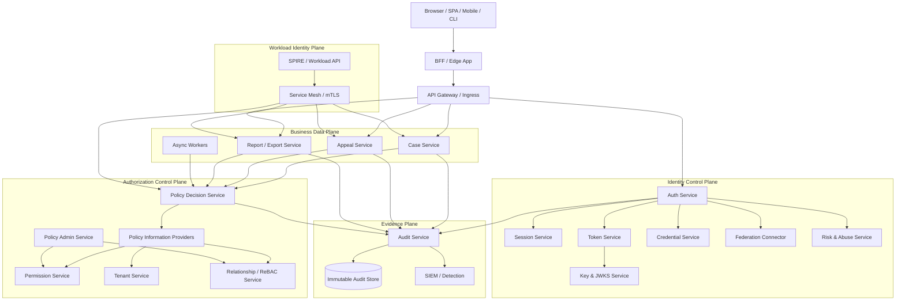

Poin penting:

- Browser tidak langsung memegang credential internal yang tidak perlu.
- Gateway bukan satu-satunya PEP.
- Setiap business service tetap melakukan authorization.
- PDP bukan database permission biasa; PDP menghasilkan keputusan.
- PIP menyediakan atribut/permission/relationship ke PDP.
- Audit service menerima event dari auth, PDP, dan business services.
- Workload identity terpisah dari human identity.

---

## 7. Control Plane vs Data Plane

### 7.1 Identity Control Plane

Mengelola:

- authentication;
- credential lifecycle;
- session lifecycle;
- token issuance;
- external identity binding;
- MFA/passkey;
- key rotation;
- risk/abuse signal.

### 7.2 Authorization Control Plane

Mengelola:

- policies;
- role assignment;
- permission grants;
- relationship tuples;
- tenant/org tree;
- attribute source;
- decision logs;
- policy rollout.

### 7.3 Business Data Plane

Menjalankan domain action:

- create case;
- assign officer;
- approve appeal;
- export report;
- update sensitive field;
- send notification;
- process async job.

Business service tidak boleh “percaya begitu saja” pada control plane. Ia harus enforce decision secara eksplisit.

### 7.4 Evidence Plane

Merekam:

- authentication evidence;
- authorization decision evidence;
- administrative change;
- impersonation/delegation/break-glass;
- data access;
- export/report;
- failed/denied access;
- policy version.

---

## 8. Component Responsibility Matrix

| Component | Responsibility | Non-Responsibility |
|---|---|---|
| API Gateway | TLS termination, coarse route auth, token presence, rate limit, request normalization | Object-level authorization |
| BFF | Browser session mediation, CSRF defense, UI-specific auth flow | Central permission truth |
| Auth Service | Login, credential verification, session issuance, external IdP callback | Business authorization |
| Credential Service | Password/MFA/passkey lifecycle | Policy decision |
| Session Service | Server-side session lifecycle, rotation, revocation | Permission evaluation |
| Token Service | Access/refresh token issuance, introspection, revocation | Business resource access |
| Key Service | Signing key lifecycle, JWKS | Credential verification logic |
| Federation Connector | OIDC/SAML integration, claim normalization | Blind account linking |
| Tenant Service | Tenant/org membership, active tenant resolution | Global admin bypass without policy |
| Permission Service | Role/permission grant storage | Final decision alone |
| Relationship Service | ReBAC tuples/graph relationships | Authentication |
| PDP | Decision evaluation | Enforcement side effects |
| PAP | Policy administration/versioning | Runtime request mutation |
| PIP | Attribute retrieval | Policy ownership |
| Audit Service | Evidence capture, tamper-evident event store | Real-time business decision |
| Risk Service | Abuse signals, risk score, throttling hints | Absolute authorization source |
| Business Service | Domain operation and resource-level PEP | Delegating fine-grained auth fully to gateway |

---

## 9. Core Domain Model End-to-End

### 9.1 Identity Entities

```text
User
  human person representation

Account
  local account in system

ExternalIdentity
  identity from external IdP, e.g. OIDC/SAML

Principal
  authenticated entity inside this platform

Subject
  entity whose authority is evaluated

Actor
  entity actually performing the operation

Credential
  proof mechanism: password, passkey, TOTP, recovery code, API key

Session
  authenticated continuity between requests

Token
  portable credential or authorization artifact
```

### 9.2 Authorization Entities

```text
Role
  named collection or position of authority

Permission
  action-resource capability, often with scope/constraint

Grant
  assignment of permission/role/delegation/capability

Policy
  rule that maps input context to decision

Decision
  allow/deny plus reason/evidence/obligations

RelationshipTuple
  subject-object-relation edge for ReBAC

Attribute
  subject/resource/environment/action property for ABAC
```

### 9.3 Tenant Entities

```text
Tenant
  isolation boundary

OrganizationUnit
  hierarchy inside tenant

Membership
  subject/account association to tenant/org unit

TenantContext
  active tenant selected for current request/session
```

### 9.4 Evidence Entities

```text
AuditEvent
  immutable record of meaningful security/business event

DecisionEvidence
  snapshot of authorization decision inputs/outputs

AuthoritySnapshot
  role/permission/delegation/context at decision time

PolicyVersion
  versioned policy artifact used for evaluation
```

---

## 10. Go Monorepo / Multi-Service Package Layout

Ada dua pendekatan umum.

### 10.1 Modular monolith package layout

Cocok saat platform belum terlalu besar, latency ingin rendah, dan team ingin menjaga transactional consistency.

```text
identity-platform/
  cmd/
    api/
      main.go
    worker/
      main.go
    migrate/
      main.go

  internal/
    app/
      httpserver/
      grpcserver/
      bootstrap/

    identity/
      domain/
      credential/
      session/
      token/
      federation/
      risk/
      usecase/
      repository/
      transport/

    authorization/
      domain/
      pdp/
      pap/
      pip/
      rbac/
      abac/
      rebac/
      policy/
      repository/
      transport/

    tenant/
      domain/
      repository/
      usecase/

    audit/
      domain/
      writer/
      repository/
      transport/

    platform/
      clock/
      idgen/
      tx/
      outbox/
      cache/
      cryptoedge/
      config/
      telemetry/

  pkg/
    authctx/
    authzclient/
    middleware/
    errorsx/
```

Principle:

- `internal/identity` owns authentication/session/token.
- `internal/authorization` owns decisioning.
- `internal/audit` owns durable evidence.
- `pkg/authctx` may be reused by business services.
- Business modules should not import low-level IdP libraries directly.

### 10.2 Microservice layout

Cocok saat scale, governance, team ownership, atau runtime isolation sudah menuntut pemisahan.

```text
services/
  auth-service/
  session-service/
  token-service/
  credential-service/
  federation-service/
  policy-decision-service/
  permission-service/
  tenant-service/
  audit-service/
  risk-service/

libs/
  go-authctx/
  go-tokenvalidator/
  go-authzclient/
  go-auditclient/
  go-middleware/
  go-tenantctx/
```

Risiko microservice:

- network latency;
- consistency gap;
- distributed transaction problem;
- circular dependency;
- partial outage;
- debugging lebih sulit.

Gunakan microservice kalau ada alasan nyata, bukan karena “auth harus microservice”.

---

## 11. Identity Boundary: Human, Workload, External IdP, System Actor

Enterprise platform harus membedakan minimal empat jenis identity.

### 11.1 Human identity

Contoh:

```text
user:123
account:456
principal:human:456
```

Digunakan untuk:

- login browser;
- MFA;
- passkey;
- session;
- user-driven action.

### 11.2 Workload identity

Contoh:

```text
spiffe://prod.example.com/ns/case/sa/case-api
service:case-api
job:case-expiry-worker
```

Digunakan untuk:

- service-to-service call;
- background job;
- scheduled worker;
- event consumer.

### 11.3 External identity

Contoh:

```text
issuer=https://idp.agency.example
subject=00u123xyz
provider=agency-sso
```

Harus di-bind ke local account secara eksplisit.

Jangan memakai email saja sebagai unique binding tanpa kontrol tambahan.

### 11.4 System actor

Contoh:

```text
system:migration
system:retention-policy
system:auto-escalation
```

System actor harus tetap audited.

Jangan jadikan system actor sebagai lubang hitam audit.

---

## 12. Authentication Architecture

### 12.1 Authentication pipeline

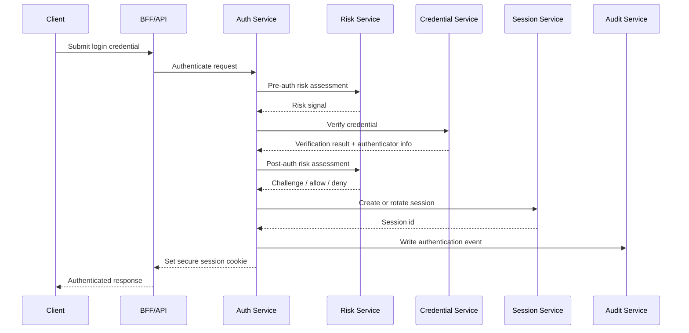

### 12.2 Authentication result model

```go
package identity

import "time"

type AuthenticatorType string

const (
    AuthenticatorPassword AuthenticatorType = "password"
    AuthenticatorTOTP     AuthenticatorType = "totp"
    AuthenticatorPasskey  AuthenticatorType = "passkey"
    AuthenticatorOIDC     AuthenticatorType = "oidc"
)

type AssuranceLevel string

const (
    AAL1 AssuranceLevel = "aal1"
    AAL2 AssuranceLevel = "aal2"
    AAL3 AssuranceLevel = "aal3"
)

type AuthenticationResult struct {
    PrincipalID       string
    AccountID         string
    TenantCandidates  []string
    Authenticators    []AuthenticatorType
    Assurance         AssuranceLevel
    AuthenticatedAt   time.Time
    AuthenticationAge time.Duration
    ExternalIssuer    string
    ExternalSubject   string
    AMR               []string
    ACR               string
    RiskLevel         string
}
```

### 12.3 Authentication invariants

- Login success must produce explicit authentication event.
- High-risk action must evaluate freshness of authentication.
- MFA enrollment does not automatically imply current MFA verification.
- External IdP authentication must be bound to local account.
- Password reset must invalidate or downgrade relevant sessions.
- Recovery flow is authentication flow and must have equal rigor.

---

## 13. Session and Token Architecture

### 13.1 Recommended web pattern

Untuk browser-based enterprise app:

- gunakan server-side session atau BFF session;
- cookie `HttpOnly`, `Secure`, `SameSite` sesuai kebutuhan;
- access token tidak perlu diekspos ke browser jika BFF bisa menjadi mediator;
- rotate session after login/privilege upgrade;
- maintain session registry per device;
- bind session to tenant/assurance context;
- model logout sebagai lifecycle event, bukan hanya delete cookie.

### 13.2 Token model

| Token | Holder | Purpose | Lifetime | Revocation |
|---|---|---|---|---|
| Session ID | Browser cookie | Web continuity | idle + absolute | server-side |
| Access Token | Service/client | Resource access | short | TTL/introspection/denylist |
| Refresh Token | Confidential client/session service | Obtain new access token | longer | rotation/reuse detection |
| ID Token | RP | Authentication evidence | short | usually not revocation mechanism |
| Capability Token | Specific actor/workflow | Narrow delegated access | very short | jti/introspection |
| Service Token | Workload | S2S access | short | workload trust/issuer revocation |

### 13.3 Token validation pipeline

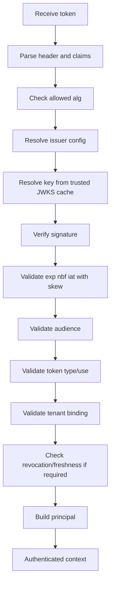

### 13.4 Session/token anti-patterns

- JWT accepted without issuer/audience validation.
- `kid` used to fetch arbitrary remote key.
- Gateway validates token but service trusts all forwarded headers.
- Access token used as ID token.
- Long-lived JWT with dynamic permissions inside.
- Refresh token stored in plaintext.
- Logout implemented only client-side.
- Session not rotated after login.
- Tenant selected only from URL without reconciliation to session membership.

---

## 14. Authorization Architecture

### 14.1 Authorization request contract

Every protected operation should be reducible to:

```text
Can subject S, represented by actor A,
perform action X,
on resource R,
within tenant T,
under context C,
at time Now?
```

### 14.2 PDP/PEP/PIP/PAP architecture

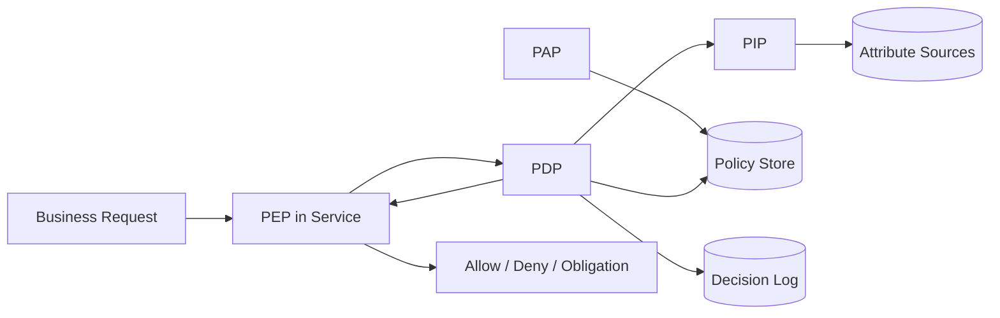

### 14.3 Authorization result

```go
package authz

import "time"

type Effect string

const (
    Allow Effect = "allow"
    Deny  Effect = "deny"
)

type Decision struct {
    Effect        Effect
    ReasonCode    string
    PolicyVersion string
    DecisionID    string
    EvaluatedAt   time.Time
    Obligations   []Obligation
    Advice        []Advice
    Evidence      DecisionEvidence
}

type Obligation struct {
    Type   string
    Params map[string]string
}

type Advice struct {
    Type    string
    Message string
}

type DecisionEvidence struct {
    SubjectID          string
    ActorID            string
    TenantID           string
    Action             string
    ResourceType       string
    ResourceID         string
    SessionID          string
    AuthoritySnapshot  string
    AttributeSnapshot  string
    RelationshipCursor string
}
```

### 14.4 Authorization invariant

- PEP must deny if PDP unavailable unless explicit degraded policy allows limited action.
- Decision must include reason code.
- Decision must include policy version.
- Sensitive denies should be audited.
- All high-impact allows should be audited.
- List/search/export must authorize the collection and the returned items.
- Workflow command must check current workflow state.
- Authorization must be server-side.

---

## 15. Permission Platform: RBAC + ABAC + ReBAC Hybrid

No single model is enough for serious enterprise systems.

### 15.1 RBAC role

Good for stable organizational authority:

```text
TenantAdmin
CaseOfficer
Supervisor
Auditor
AppealReviewer
SupportEngineer
```

Use RBAC for:

- coarse module access;
- operational roles;
- admin permissions;
- workflow responsibilities.

### 15.2 ABAC attributes

Good for contextual decision:

```text
subject.department == resource.owner_department
resource.status == "draft"
environment.ip_risk == "low"
request.assurance >= AAL2
```

Use ABAC for:

- workflow stage;
- risk level;
- business hours;
- data classification;
- authentication freshness;
- resource sensitivity.

### 15.3 ReBAC relationships

Good for object graph:

```text
user:alice viewer case:123
team:appeals reviewer appeal:789
case:123 parent agency:cea
```

Use ReBAC for:

- ownership;
- assignment;
- delegation;
- hierarchical resource access;
- document/case collaboration;
- organization tree.

### 15.4 Hybrid decision

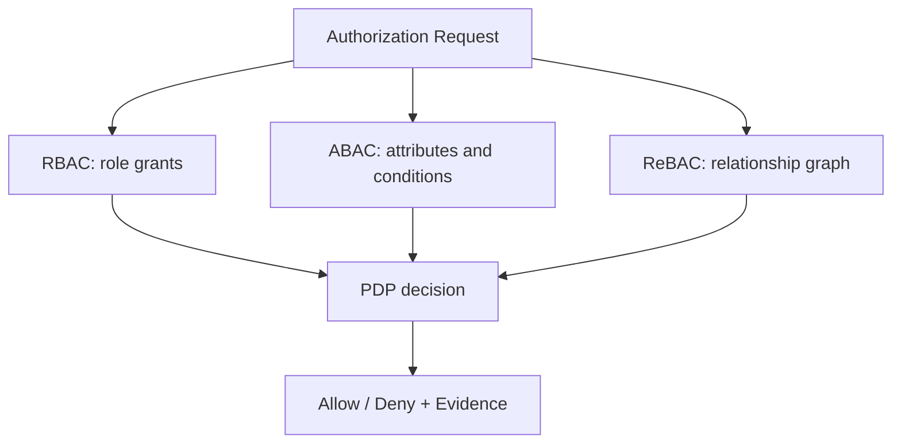

Example decision:

```text
Allow if:
  subject has role CaseOfficer in tenant T
  AND subject is assigned_to case C OR subject is supervisor_of assigned officer
  AND case.status in [Draft, PendingReview]
  AND request.assurance >= AAL2 for sensitive update
  AND no active deny/lock/legal-hold rule applies
```

---

## 16. Tenant Boundary Architecture

### 16.1 Tenant context resolution

Possible sources:

- hostname/subdomain;
- path prefix;
- explicit tenant selector;
- session active tenant;
- token claim;
- resource ownership;
- service/job metadata.

Do not accept tenant context from only one untrusted input.

### 16.2 Tenant reconciliation

```go
func ResolveTenant(ctx context.Context, req Request, principal Principal) (TenantContext, error) {
    hinted := req.TenantHint()
    active := principal.ActiveTenantID

    if hinted == "" {
        return TenantContext{}, ErrTenantRequired
    }
    if active != "" && hinted != active {
        return TenantContext{}, ErrTenantMismatch
    }
    if !principal.MemberOf(hinted) {
        return TenantContext{}, ErrTenantForbidden
    }
    return TenantContext{TenantID: hinted}, nil
}
```

### 16.3 Tenant isolation layers

```text
Layer 1: routing boundary
Layer 2: session/token tenant binding
Layer 3: authorization tenant check
Layer 4: repository query guard
Layer 5: cache key namespace
Layer 6: event/job metadata
Layer 7: audit tenant_id
Layer 8: export/report filter
```

### 16.4 Tenant cache key

Bad:

```text
permission:user-123:case-456
```

Good:

```text
tenant:tenant-abc:permission:user-123:case-456:policy:v42
```

---

## 17. Policy Decision Service

### 17.1 PDP deployment options

| Option | Benefit | Risk |
|---|---|---|
| Embedded library | low latency, simple deployment | policy rollout harder |
| Sidecar OPA | local decision, policy separation | sidecar operational complexity |
| Central PDP service | centralized governance | latency/outage dependency |
| Hybrid | balance | more moving parts |

### 17.2 Recommended enterprise approach

For high-scale business services:

- embedded or sidecar PDP for hot-path low-latency decisions;
- central PAP for policy management;
- policy bundles for rollout;
- local cache with versioning;
- centralized decision log pipeline;
- central PDP for complex less-frequent decisions.

### 17.3 PDP input shape

```json
{
  "subject": {
    "id": "account-123",
    "type": "human",
    "roles": ["case_officer"],
    "assurance": "aal2"
  },
  "actor": {
    "id": "account-123",
    "type": "human"
  },
  "tenant": {
    "id": "tenant-cea"
  },
  "action": "case.update_sensitive_field",
  "resource": {
    "type": "case",
    "id": "case-789",
    "status": "pending_review",
    "classification": "restricted"
  },
  "environment": {
    "time": "2026-06-24T12:00:00Z",
    "ip_risk": "low",
    "auth_age_seconds": 240
  }
}
```

### 17.4 PDP output shape

```json
{
  "effect": "allow",
  "reason_code": "assigned_case_officer_with_fresh_aal2",
  "policy_version": "policy-bundle-2026.06.24.1",
  "obligations": [
    {"type": "audit", "level": "high"},
    {"type": "mask_fields", "fields": ["national_id"]}
  ]
}
```

---

## 18. Audit and Evidence Architecture

### 18.1 Audit event categories

```text
AuthenticationEvent
CredentialEvent
SessionEvent
TokenEvent
AuthorizationDecisionEvent
PolicyChangeEvent
PermissionChangeEvent
TenantMembershipEvent
AdminActionEvent
ImpersonationEvent
DelegationEvent
BreakGlassEvent
DataAccessEvent
ExportEvent
ReportEvent
SystemJobEvent
```

### 18.2 Audit write pattern

For critical business operation:

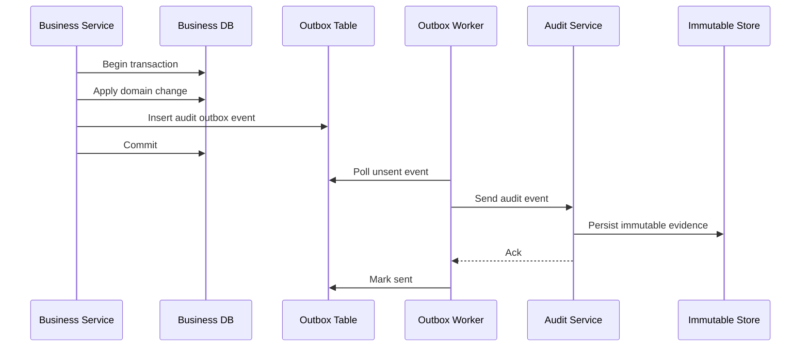

### 18.3 Audit evidence structure

```go
package audit

import "time"

type Event struct {
    EventID       string
    EventType     string
    OccurredAt    time.Time
    TenantID      string
    ActorID       string
    SubjectID     string
    SessionID     string
    RequestID     string
    CorrelationID string
    ResourceType  string
    ResourceID    string
    Action        string
    Outcome       string
    ReasonCode    string
    PolicyVersion string
    Evidence      map[string]any
    PrevHash      string
    Hash          string
}
```

### 18.4 Audit rules

- Never log raw passwords, OTP, recovery codes, refresh token, access token.
- Do log token id/hash reference if needed.
- Do log `actor` and `subject` separately.
- Do log denied high-risk authorization attempts.
- Do log administrative changes.
- Do log policy version.
- Do log break-glass justification and approval reference.
- Do use transactional outbox for critical events.
- Do design retention and legal hold explicitly.

---

## 19. Service-to-Service Identity Architecture

### 19.1 S2S identity options

| Pattern | Use Case | Notes |
|---|---|---|
| OAuth2 client credentials | service calls external/internal APIs | requires client secret or private key |
| JWT client assertion | stronger client authentication | good for confidential services |
| mTLS | mutual transport identity | good for internal service mesh |
| SPIFFE X.509-SVID | platform-neutral workload identity | good for zero-trust infrastructure |
| SPIFFE JWT-SVID | token-based workload proof | good for crossing HTTP/gRPC boundary |
| Token exchange | user-to-service delegation | preserves actor chain |

### 19.2 S2S authorization rule

Service identity answers:

> “Which workload is calling?”

It does not automatically answer:

> “Is this workload allowed to perform this action on this resource for this user/tenant?”

S2S authorization must include:

- caller workload identity;
- called service audience;
- action/method;
- tenant;
- user/actor chain if delegated;
- resource;
- policy.

### 19.3 Internal request context

```text
x-request-id
x-correlation-id
x-tenant-id
x-actor-id
x-subject-id
x-session-id
x-auth-assurance
x-delegation-chain-id
```

Important: do not blindly trust these headers unless they are:

- generated by trusted edge;
- stripped at boundary;
- signed or protected by mTLS;
- validated by service.

---

## 20. API Gateway, BFF, and Service-Level Enforcement

### 20.1 Gateway responsibilities

Gateway can do:

- TLS termination;
- public route blocking;
- token presence/format check;
- coarse audience/issuer validation;
- rate limiting;
- request size limit;
- header normalization;
- coarse scope check;
- bot/abuse edge signals.

Gateway should not be the only layer doing:

- object-level authorization;
- workflow authorization;
- field-level authorization;
- tenant data filtering;
- export/report permission;
- break-glass policy;
- delegated authority resolution.

### 20.2 Business service PEP

Each business service should enforce:

```text
route-level permission
resource existence + tenant ownership
resource-level permission
workflow/state permission
field-level permission if sensitive
obligation handling
post-decision audit
```

### 20.3 Repository guard

Do not trust application-level checks alone for list/search/export.

Bad:

```go
rows := db.Query("SELECT * FROM cases")
filterInMemory(rows, subject)
```

Better:

```go
rows := db.Query(`
    SELECT * FROM cases
    WHERE tenant_id = :tenant_id
      AND id IN (:authorized_case_ids)
`)
```

For large systems, use precomputed visibility index, relationship query, or dedicated authorization-aware search index.

---

## 21. Reference Runtime Flows

### 21.1 OIDC login flow

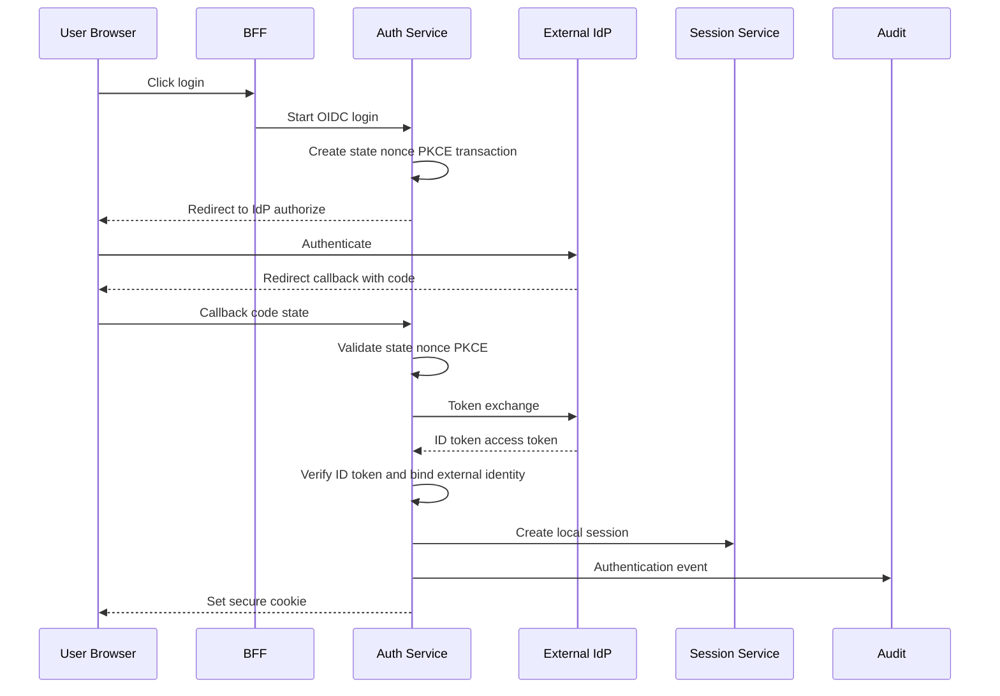

### 21.2 Business command flow

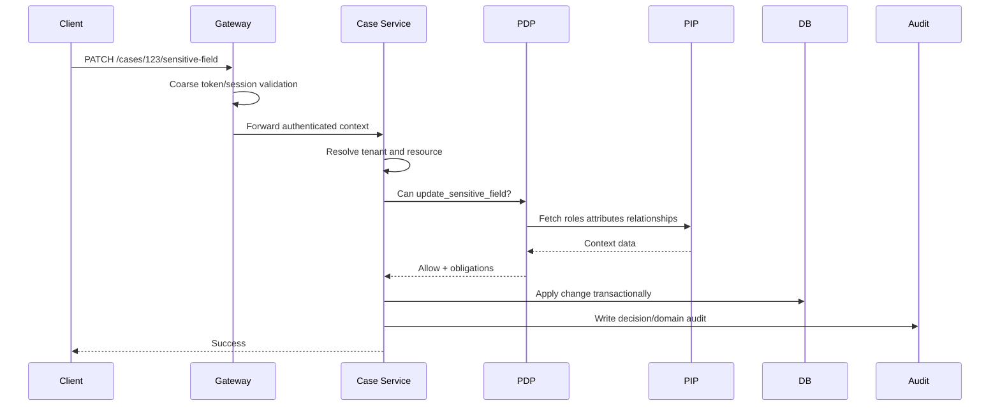

### 21.3 Permission change flow

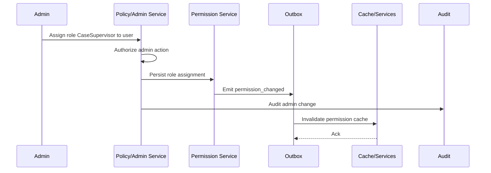

### 21.4 Emergency key revocation flow

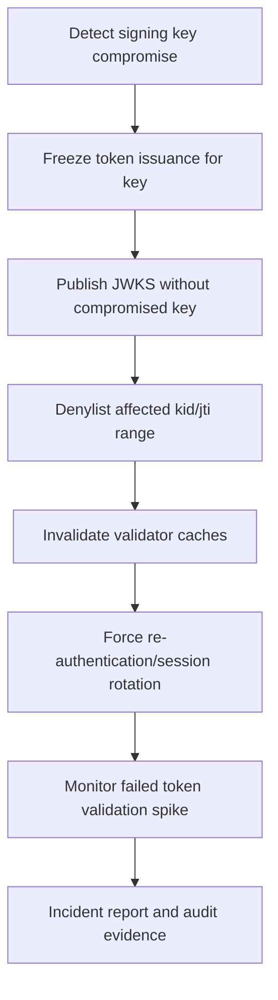

### 21.5 Break-glass flow

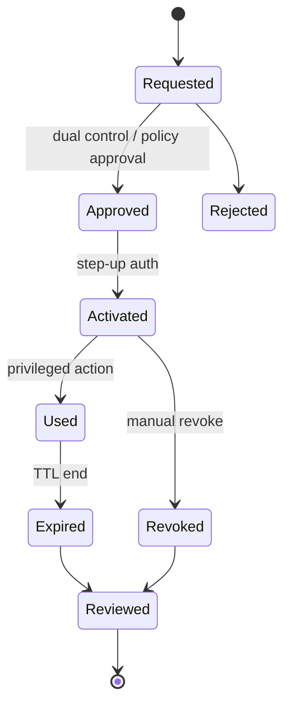

---

## 22. Data Model Blueprint

This is not a universal schema. It is a starting point.

### 22.1 Identity tables

```sql
CREATE TABLE accounts (
    id              VARCHAR(64) PRIMARY KEY,
    status          VARCHAR(32) NOT NULL,
    display_name    VARCHAR(255),
    primary_email   VARCHAR(320),
    created_at      TIMESTAMP NOT NULL,
    updated_at      TIMESTAMP NOT NULL
);

CREATE TABLE external_identities (
    id              VARCHAR(64) PRIMARY KEY,
    account_id      VARCHAR(64) NOT NULL,
    provider_id     VARCHAR(64) NOT NULL,
    issuer          VARCHAR(512) NOT NULL,
    subject         VARCHAR(512) NOT NULL,
    email           VARCHAR(320),
    email_verified  BOOLEAN NOT NULL DEFAULT FALSE,
    linked_at       TIMESTAMP NOT NULL,
    UNIQUE (provider_id, issuer, subject)
);

CREATE TABLE credentials (
    id              VARCHAR(64) PRIMARY KEY,
    account_id      VARCHAR(64) NOT NULL,
    type            VARCHAR(32) NOT NULL,
    status          VARCHAR(32) NOT NULL,
    public_label    VARCHAR(255),
    secret_hash     TEXT,
    metadata_json   JSON,
    created_at      TIMESTAMP NOT NULL,
    last_used_at    TIMESTAMP,
    revoked_at      TIMESTAMP
);
```

### 22.2 Session/token tables

```sql
CREATE TABLE sessions (
    id               VARCHAR(64) PRIMARY KEY,
    account_id        VARCHAR(64) NOT NULL,
    active_tenant_id  VARCHAR(64),
    assurance_level   VARCHAR(16) NOT NULL,
    auth_time         TIMESTAMP NOT NULL,
    created_at        TIMESTAMP NOT NULL,
    last_seen_at      TIMESTAMP NOT NULL,
    expires_at        TIMESTAMP NOT NULL,
    revoked_at        TIMESTAMP,
    revoke_reason     VARCHAR(128)
);

CREATE TABLE token_grants (
    id              VARCHAR(64) PRIMARY KEY,
    account_id      VARCHAR(64),
    client_id       VARCHAR(128) NOT NULL,
    session_id      VARCHAR(64),
    grant_type      VARCHAR(64) NOT NULL,
    status          VARCHAR(32) NOT NULL,
    created_at      TIMESTAMP NOT NULL,
    revoked_at      TIMESTAMP
);

CREATE TABLE refresh_tokens (
    id              VARCHAR(64) PRIMARY KEY,
    grant_id        VARCHAR(64) NOT NULL,
    family_id       VARCHAR(64) NOT NULL,
    token_hash      TEXT NOT NULL,
    status          VARCHAR(32) NOT NULL,
    issued_at       TIMESTAMP NOT NULL,
    used_at         TIMESTAMP,
    revoked_at      TIMESTAMP,
    UNIQUE(token_hash)
);
```

### 22.3 Tenant and membership tables

```sql
CREATE TABLE tenants (
    id              VARCHAR(64) PRIMARY KEY,
    status          VARCHAR(32) NOT NULL,
    name            VARCHAR(255) NOT NULL,
    created_at      TIMESTAMP NOT NULL
);

CREATE TABLE tenant_memberships (
    id              VARCHAR(64) PRIMARY KEY,
    tenant_id       VARCHAR(64) NOT NULL,
    account_id      VARCHAR(64) NOT NULL,
    status          VARCHAR(32) NOT NULL,
    joined_at       TIMESTAMP NOT NULL,
    revoked_at      TIMESTAMP,
    UNIQUE(tenant_id, account_id)
);
```

### 22.4 Authorization tables

```sql
CREATE TABLE roles (
    id              VARCHAR(64) PRIMARY KEY,
    tenant_id       VARCHAR(64),
    name            VARCHAR(128) NOT NULL,
    description     TEXT,
    created_at      TIMESTAMP NOT NULL
);

CREATE TABLE permissions (
    id              VARCHAR(64) PRIMARY KEY,
    action          VARCHAR(128) NOT NULL,
    resource_type   VARCHAR(128) NOT NULL,
    scope           VARCHAR(128),
    condition_json  JSON,
    UNIQUE(action, resource_type, scope)
);

CREATE TABLE role_permissions (
    role_id         VARCHAR(64) NOT NULL,
    permission_id   VARCHAR(64) NOT NULL,
    PRIMARY KEY(role_id, permission_id)
);

CREATE TABLE role_assignments (
    id              VARCHAR(64) PRIMARY KEY,
    tenant_id       VARCHAR(64) NOT NULL,
    account_id      VARCHAR(64) NOT NULL,
    role_id         VARCHAR(64) NOT NULL,
    status          VARCHAR(32) NOT NULL,
    effective_from  TIMESTAMP NOT NULL,
    effective_until TIMESTAMP,
    granted_by      VARCHAR(64),
    grant_reason    TEXT
);
```

### 22.5 Relationship tuple table

```sql
CREATE TABLE relationship_tuples (
    id              VARCHAR(64) PRIMARY KEY,
    tenant_id       VARCHAR(64) NOT NULL,
    object_type     VARCHAR(128) NOT NULL,
    object_id       VARCHAR(128) NOT NULL,
    relation        VARCHAR(128) NOT NULL,
    subject_type    VARCHAR(128) NOT NULL,
    subject_id      VARCHAR(128) NOT NULL,
    condition_json  JSON,
    created_at      TIMESTAMP NOT NULL,
    deleted_at      TIMESTAMP,
    UNIQUE(tenant_id, object_type, object_id, relation, subject_type, subject_id)
);
```

### 22.6 Audit event table

```sql
CREATE TABLE audit_events (
    id              VARCHAR(64) PRIMARY KEY,
    tenant_id       VARCHAR(64),
    event_type      VARCHAR(128) NOT NULL,
    actor_id        VARCHAR(64),
    subject_id      VARCHAR(64),
    session_id      VARCHAR(64),
    action          VARCHAR(128),
    resource_type   VARCHAR(128),
    resource_id     VARCHAR(128),
    outcome         VARCHAR(32) NOT NULL,
    reason_code     VARCHAR(128),
    policy_version  VARCHAR(128),
    evidence_json   JSON NOT NULL,
    prev_hash       VARCHAR(128),
    event_hash      VARCHAR(128) NOT NULL,
    occurred_at     TIMESTAMP NOT NULL,
    ingested_at     TIMESTAMP NOT NULL
);
```

---

## 23. Go Interface Contracts

### 23.1 Auth context

```go
package authctx

import "time"

type PrincipalKind string

const (
    PrincipalHuman    PrincipalKind = "human"
    PrincipalWorkload PrincipalKind = "workload"
    PrincipalSystem   PrincipalKind = "system"
)

type Principal struct {
    ID        string
    Kind      PrincipalKind
    AccountID string
    ServiceID string
    Issuer    string
    Subject   string
}

type Actor struct {
    ID   string
    Kind PrincipalKind
}

type Authority struct {
    Mode              string // direct, delegated, impersonation, break_glass, system
    DelegationID      string
    ImpersonationID   string
    BreakGlassID      string
    AssuranceLevel    string
    AuthenticatedAt   time.Time
    AuthoritySnapshot string
}

type Context struct {
    Principal     Principal
    Actor         Actor
    Subject       Principal
    TenantID      string
    SessionID     string
    RequestID     string
    CorrelationID string
    Authority     Authority
}
```

### 23.2 Token validator

```go
package token

import "context"

type Validator interface {
    ValidateAccessToken(ctx context.Context, raw string, expected ExpectedToken) (ValidatedToken, error)
}

type ExpectedToken struct {
    Issuer   string
    Audience string
    Use      string // access, id, capability, service
    TenantID string
}

type ValidatedToken struct {
    Subject      string
    Issuer       string
    Audience     []string
    JTI          string
    SessionID    string
    TenantID     string
    Scopes       []string
    ACR          string
    AMR          []string
    AuthTimeUnix int64
}
```

### 23.3 Authorizer

```go
package authz

import "context"

type Authorizer interface {
    Decide(ctx context.Context, req Request) (Decision, error)
}

type Request struct {
    Subject      Subject
    Actor        Actor
    TenantID     string
    Action       string
    Resource     Resource
    Environment  Environment
    RequestID    string
}

type Subject struct {
    ID             string
    Type           string
    AccountID      string
    AssuranceLevel string
    Roles          []string
}

type Actor struct {
    ID   string
    Type string
}

type Resource struct {
    Type       string
    ID         string
    TenantID   string
    Attributes map[string]any
}

type Environment struct {
    IP              string
    RiskLevel       string
    AuthAgeSeconds  int64
    PolicyFreshness string
}
```

### 23.4 Audit writer

```go
package audit

import "context"

type Writer interface {
    Write(ctx context.Context, event Event) error
}

type OutboxWriter interface {
    WriteInTx(ctx context.Context, tx Tx, event Event) error
}
```

### 23.5 Middleware composition

```go
func ProtectedRoute(
    authenticate Middleware,
    resolveTenant Middleware,
    requireFreshAuth Middleware,
    authorize Middleware,
    handler http.Handler,
) http.Handler {
    return authenticate(
        resolveTenant(
            requireFreshAuth(
                authorize(handler),
            ),
        ),
    )
}
```

Order matters:

1. request id/correlation id;
2. panic recovery;
3. timeout;
4. credential extraction;
5. authentication;
6. tenant resolution;
7. risk/assurance/freshness;
8. authorization;
9. business handler;
10. audit/metrics.

---

## 24. Security-Invariant Driven Implementation

A strong implementation begins with invariants, not code.

### 24.1 Authentication invariants

```text
AUTH-001: No session is created without successful authentication evidence.
AUTH-002: Session ID is rotated after login and privilege/assurance upgrade.
AUTH-003: MFA reset invalidates remembered devices and high-assurance sessions.
AUTH-004: External IdP subject is bound by issuer+subject, not by email alone.
AUTH-005: Recovery flow cannot produce stronger assurance than its factors justify.
```

### 24.2 Token invariants

```text
TOK-001: Every token must validate issuer, audience, expiry, not-before, type/use.
TOK-002: JWT key resolution must only use trusted configured issuer metadata.
TOK-003: Unknown kid must not trigger unbounded outbound fetch storms.
TOK-004: Refresh token is stored hashed and rotated on use.
TOK-005: Reuse of rotated refresh token revokes the token family.
```

### 24.3 Authorization invariants

```text
AUTHZ-001: Every protected command has a server-side authorization decision.
AUTHZ-002: Gateway authorization is not sufficient for object-level access.
AUTHZ-003: Tenant context is reconciled against principal membership and resource ownership.
AUTHZ-004: List/search/export authorization cannot rely only on post-filtering.
AUTHZ-005: PDP unavailable defaults to deny unless explicitly configured degraded policy applies.
```

### 24.4 Audit invariants

```text
AUD-001: Every high-risk allow is auditable.
AUD-002: Every high-risk deny is auditable.
AUD-003: Actor and subject are never collapsed when delegation/impersonation exists.
AUD-004: Policy version is captured for authorization decisions.
AUD-005: Audit pipeline failure does not silently discard critical events.
```

### 24.5 Tenant invariants

```text
TEN-001: Every tenant-scoped resource has tenant_id.
TEN-002: Every tenant-scoped request has tenant context.
TEN-003: Cache keys include tenant_id.
TEN-004: Async jobs include tenant_id and authority context.
TEN-005: Cross-tenant access requires explicit policy and audit reason.
```

---

## 25. Caching, Consistency, Revocation, and Staleness Budgets

### 25.1 Cache classes

| Cache | Example | Staleness Risk |
|---|---|---|
| JWKS cache | signing keys | key compromise exposure |
| Session cache | session lookup | revoked session accepted |
| Permission cache | role grants | stale privilege |
| Decision cache | PDP result | stale object access |
| Relationship cache | ReBAC graph | New Enemy Problem |
| Attribute cache | department/risk/status | context mismatch |

### 25.2 Staleness budget

Every cache must have explicit budget:

```text
what data is cached?
who owns invalidation?
how long may it be stale?
what action class may use it?
how is stale use audited?
what happens on invalidation failure?
```

### 25.3 Recommended budgets

| Data | Suggested budget | Notes |
|---|---:|---|
| JWKS normal refresh | minutes-hours | emergency path must bypass |
| Access token | 5-15 min | depends on risk |
| Session lookup | seconds-minutes | revocation-sensitive |
| Permission grant | seconds-minutes | event invalidation preferred |
| Break-glass state | near-real-time | should not be stale |
| Relationship graph | bounded by consistency token | use cursor/zookie-like pattern |
| Risk signal | short | risk can change quickly |

### 25.4 Revocation architecture

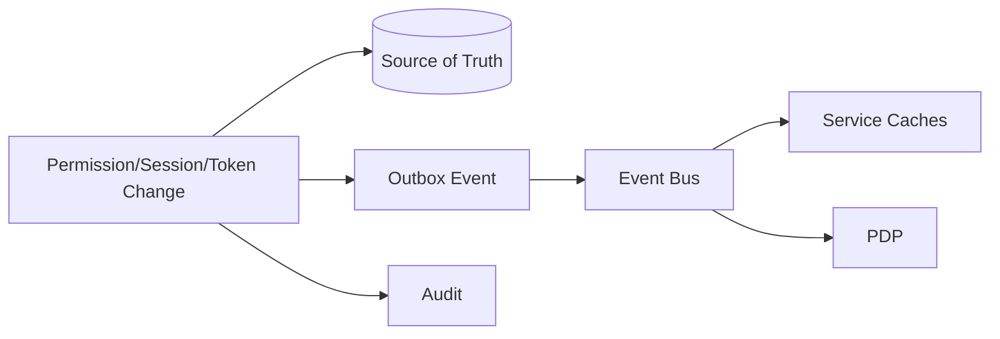

### 25.5 Avoid impossible guarantees

A common weak assumption:

> “Once admin revokes permission, no service anywhere can ever authorize it again instantly.”

In distributed systems, this is expensive and often impossible without synchronous central decision path.

Better engineering statement:

```text
Permission revocation propagates to all hot-path authorization caches within 10 seconds p99.
Critical actions bypass cache or require decision freshness <= 1 second.
Break-glass revocation is synchronously checked.
All stale-cache decisions are tagged and auditable.
```

---

## 26. Operational Hardening Blueprint

### 26.1 Key rotation runbook

Normal rotation:

```text
1. Generate new signing key.
2. Publish new key in JWKS while old key remains valid.
3. Start signing new tokens with new kid.
4. Wait for max token lifetime + validator cache TTL.
5. Retire old key from signing.
6. Remove old key from JWKS after safe window.
7. Verify metrics: unknown kid, validation failures, token issuance failures.
```

Emergency rotation:

```text
1. Stop signing with compromised key immediately.
2. Remove or mark compromised kid as revoked.
3. Push validator cache invalidation.
4. Revoke affected sessions/tokens if necessary.
5. Force reauthentication for affected users.
6. Increase monitoring on token validation failures.
7. Produce incident audit report.
```

### 26.2 IdP outage policy

Define by action class:

| Action Class | IdP Down Behavior |
|---|---|
| Existing low-risk session read | allow if session valid and not stale beyond limit |
| New login | fail closed |
| Step-up required action | fail closed |
| Admin action | fail closed |
| Break-glass activation | local emergency flow if pre-approved |
| Public route | unaffected |

### 26.3 PDP outage policy

| Action Class | PDP Down Behavior |
|---|---|
| Public read | unaffected |
| Authenticated low-risk read | use cached allow if fresh enough |
| Sensitive read | deny or require central PDP |
| Mutating command | deny unless explicit emergency rule |
| Admin change | deny |
| Export/report | deny |

### 26.4 Audit sink outage policy

For critical audit:

- write to local durable outbox;
- do not silently drop;
- apply backpressure if outbox full;
- alert on lag;
- reconcile later.

---

## 27. Observability, SLO, and Detection Engineering

### 27.1 Metrics

Authentication:

```text
login_success_total
login_failure_total by reason
mfa_challenge_total
mfa_failure_total
passkey_success_total
password_reset_requested_total
account_lock_total
```

Token:

```text
token_issued_total
token_validation_failure_total by reason
token_refresh_total
token_refresh_reuse_detected_total
jwks_refresh_total
unknown_kid_total
```

Authorization:

```text
authz_decision_total by effect/action/resource/tenant
pdp_latency_ms
pdp_error_total
permission_cache_hit_ratio
permission_cache_stale_decision_total
policy_version_active
```

Audit:

```text
audit_event_written_total
audit_outbox_lag_seconds
audit_write_failure_total
audit_integrity_check_failure_total
```

Abuse:

```text
credential_stuffing_suspected_total
password_spray_suspected_total
enumeration_defense_triggered_total
risk_score_distribution
rate_limit_triggered_total
```

### 27.2 SLO examples

```text
Auth token validation p99 < 20ms local cache.
PDP decision p99 < 50ms for hot-path embedded/sidecar policy.
Permission revocation propagation p99 < 10s.
Audit outbox lag p99 < 30s.
JWKS refresh success ratio > 99.9%.
```

### 27.3 Alerts

High signal alerts:

- spike in `unknown_kid_total`;
- sudden token validation failure by issuer;
- refresh token reuse detected;
- break-glass activation;
- admin permission mass change;
- cross-tenant deny spike;
- authorization deny spike for one endpoint after deployment;
- PDP error rate;
- audit outbox lag;
- credential stuffing signal.

### 27.4 Detection rules

Examples:

```text
IF refresh_token_reuse_detected_total > 0
THEN high severity security alert.

IF unknown_kid_total spikes across services
THEN investigate JWKS/key rotation or token forgery attempt.

IF same actor exports reports across many tenants within short window
THEN suspicious cross-tenant data access alert.

IF admin grants high-privilege role to many accounts
THEN privileged access anomaly alert.
```

---

## 28. Testing Strategy: Unit, Integration, Property, Chaos, Security

### 28.1 Unit tests

Test:

- token validation edge cases;
- issuer/audience mismatch;
- expired/nbf/skew;
- unsupported alg;
- unknown kid;
- tenant mismatch;
- permission decision combinations;
- role hierarchy;
- deny override;
- assurance freshness;
- actor/subject separation.

### 28.2 Integration tests

Test full flows:

- OIDC login callback;
- state/nonce/PKCE mismatch;
- session rotation;
- refresh token rotation;
- refresh token reuse detection;
- role assignment invalidation;
- service-to-service mTLS identity;
- audit outbox delivery;
- policy bundle rollout.

### 28.3 Property tests

Useful authorization properties:

```text
A denied user should not become allowed by adding unrelated tenant membership.
A lower assurance session should never pass a higher assurance requirement.
A revoked role should not authorize after freshness window.
A user from tenant A should not access tenant B resource unless cross-tenant grant exists.
A deny override should dominate allow grants.
```

### 28.4 Chaos tests

Simulate:

- IdP down;
- JWKS endpoint timeout;
- PDP unavailable;
- audit sink unavailable;
- permission event bus delayed;
- cache invalidation lost;
- clock skew;
- database read replica lag;
- token key revoked mid-flight.

### 28.5 Security tests

Run tests for:

- IDOR/BOLA;
- CSRF on session-based flows;
- callback parameter tampering;
- open redirect;
- token substitution;
- alg confusion;
- tenant context injection;
- header spoofing;
- enumeration;
- brute force;
- recovery bypass;
- MFA bypass;
- impersonation abuse.

---

## 29. Failure-Mode Matrix

| Failure | Weak Design Outcome | Strong Design Outcome |
|---|---|---|
| IdP down | all sessions fail or login bypass created | existing sessions follow explicit policy; new login fails closed |
| JWKS endpoint slow | request latency spikes globally | bounded cache, background refresh, stale-if-safe, alert |
| Unknown kid storm | outbound fetch storm | rate-limited refresh and issuer-bound JWKS |
| PDP down | service accidentally allows | deny by default or explicit limited degraded allow |
| Permission cache stale | revoked user still mutates | freshness budget + invalidation + bypass for sensitive action |
| Audit sink down | audit silently lost | durable outbox + alert + backpressure |
| Tenant header spoofed | cross-tenant data leak | edge strips headers + service reconciles tenant |
| Gateway bypass | service trusts network | service-level PEP validates auth context |
| Break-glass abused | admin can access anything silently | approval, TTL, step-up, immutable audit, review |
| Refresh token stolen | long-term account takeover | rotation + reuse detection + token family revocation |
| External IdP changes email | account hijack through email match | bind issuer+subject, not email alone |
| Worker lacks actor context | system action untraceable | job includes tenant, actor, subject, authority snapshot |
| Policy rollout bug | production outage | staged rollout, tests, canary, policy version rollback |
| Clock skew | valid tokens rejected/invalid accepted | bounded skew, NTP alert, metrics by reason |
| Relationship graph stale | new enemy problem | consistency token/freshness requirement |

---

## 30. Migration Strategy from Legacy Auth

### 30.1 Common legacy state

You may start from:

```text
users table
roles table
user_roles table
JWT with role claim
manual if role == admin checks
no tenant-safe cache
no decision log
no audit actor/subject separation
```

Do not rewrite everything at once.

### 30.2 Migration phases

#### Phase 1 — Establish vocabulary and context

- Define principal/actor/subject.
- Introduce `AuthContext`.
- Normalize tenant context.
- Add request id/correlation id.

#### Phase 2 — Centralize enforcement contracts

- Add `Authorizer` interface.
- Replace scattered role checks gradually.
- Add route guard and resource guard.
- Introduce deny-by-default helpers.

#### Phase 3 — Build audit evidence

- Add decision id.
- Add policy version placeholder.
- Add actor/subject/tenant/action/resource audit.
- Add outbox for critical events.

#### Phase 4 — Split static role from permission

- Introduce permission catalog.
- Map roles to permissions.
- Remove direct role semantics from business code.

#### Phase 5 — Add ABAC/ReBAC where needed

- Add workflow attributes.
- Add assignment relationships.
- Add ownership/delegation graph.

#### Phase 6 — Improve token/session lifecycle

- Add session registry.
- Add refresh rotation.
- Add revocation events.
- Reduce dynamic permission claims.

#### Phase 7 — Production hardening

- Key rotation runbook.
- JWKS cache metrics.
- PDP outage behavior.
- Policy canary/rollback.
- Abuse detection.

### 30.3 Migration anti-pattern

Do not begin by replacing all auth with a giant policy engine if the system cannot even answer:

```text
who is actor?
who is subject?
what is tenant?
what is resource?
what is action?
where is audit evidence?
```

Policy engine amplifies your model. It does not fix a bad model.

---

## 31. Reference Roadmap: From Small System to Top-Tier Platform

### Level 0 — Basic

- login;
- password hash;
- simple session;
- basic role check.

Risk: fragile, hard to audit.

### Level 1 — Professional

- session lifecycle;
- MFA;
- token validation;
- centralized middleware;
- permission catalog;
- tenant checks;
- basic audit.

### Level 2 — Enterprise

- OIDC/federation;
- external identity binding;
- RBAC/ABAC hybrid;
- PDP/PEP separation;
- service-to-service identity;
- revocation/invalidation;
- outbox audit.

### Level 3 — Platform

- policy-as-code;
- ReBAC;
- consistency token;
- audit evidence reconstruction;
- break-glass workflow;
- abuse/risk scoring;
- key rotation automation;
- chaos testing.

### Level 4 — Top-tier

- measurable staleness budgets;
- formalized security invariants;
- policy rollout pipeline;
- decision simulation;
- least privilege analytics;
- privilege graph review;
- tenant isolation verification;
- end-to-end forensic replay;
- SLO-backed identity platform.

---

## 32. Architecture Review Checklist

### 32.1 Identity

- [ ] Is `User` separated from `Account`?
- [ ] Is external identity bound by issuer+subject?
- [ ] Is actor separated from subject?
- [ ] Are workload identities first-class?
- [ ] Are system actors auditable?

### 32.2 Authentication

- [ ] Is credential lifecycle stateful?
- [ ] Is MFA reset protected?
- [ ] Is passkey/WebAuthn challenge lifecycle correct?
- [ ] Is authentication freshness tracked?
- [ ] Is recovery flow treated as auth flow?

### 32.3 Session/token

- [ ] Is session rotated after login/privilege upgrade?
- [ ] Are access tokens short-lived?
- [ ] Are refresh tokens rotated and hashed?
- [ ] Is token type validated?
- [ ] Is JWKS cache bounded and issuer-scoped?

### 32.4 Authorization

- [ ] Is authorization enforced server-side for every protected action?
- [ ] Is gateway not the only PEP?
- [ ] Is object-level authorization present?
- [ ] Is list/search/export guarded?
- [ ] Is deny-by-default implemented?
- [ ] Is policy version captured?

### 32.5 Tenant

- [ ] Is tenant context reconciled?
- [ ] Is tenant id in every tenant-scoped table?
- [ ] Are cache keys tenant-scoped?
- [ ] Are async jobs tenant-scoped?
- [ ] Are cross-tenant actions explicit and audited?

### 32.6 Audit

- [ ] Are authentication events logged?
- [ ] Are authorization decisions logged for high-risk actions?
- [ ] Are admin changes logged?
- [ ] Are impersonation/delegation/break-glass events logged?
- [ ] Is audit loss prevented by outbox/backpressure?

### 32.7 Operations

- [ ] Is key rotation tested?
- [ ] Is emergency key revocation tested?
- [ ] Is PDP outage behavior defined?
- [ ] Is IdP outage behavior defined?
- [ ] Are stale-cache decisions observable?
- [ ] Are abuse signals monitored?

---

## 33. What Top Engineers Pay Attention To

### 33.1 They do not confuse mechanism with guarantee

JWT is mechanism, not authorization guarantee.

MFA is mechanism, not account takeover immunity.

Gateway auth is mechanism, not object-level security.

Policy engine is mechanism, not correct policy model.

Audit log is mechanism, not evidence if incomplete.

### 33.2 They design negative space

They ask:

- what if the IdP lies?
- what if claim is stale?
- what if admin abuses access?
- what if cache is stale?
- what if service bypasses gateway?
- what if tenant id is spoofed?
- what if external email changes?
- what if policy rollout is wrong?
- what if audit sink is down?

### 33.3 They make authority explicit

Instead of:

```text
user can approve case
```

They model:

```text
actor account-1, acting as supervisor in tenant-cea,
with direct authority from role_assignment-9,
using AAL2 session fresh within 5 minutes,
may approve case-123 because case is in PendingSupervisorReview
and actor supervises assigned officer.
```

### 33.4 They optimize for forensic reconstruction

Months later, investigators should be able to answer:

```text
Why was this allowed?
Who allowed it?
Who performed it?
What policy version existed?
What tenant context was active?
Was there impersonation?
Was there break-glass?
Was MFA fresh?
Which resource fields were accessed?
```

### 33.5 They know where not to be clever

Do not invent:

- custom password hashing;
- custom JWT algorithm handling;
- custom OAuth shortcuts;
- unaudited break-glass;
- role claim as full permission truth;
- implicit tenant inference;
- magic admin bypass;
- email-only federation binding.

### 33.6 They treat auth as product and platform

Good auth system serves:

- users: usable login/recovery;
- admins: manageable access;
- developers: safe APIs and SDKs;
- auditors: evidence;
- security: detection and response;
- operations: runbooks and metrics;
- business: controlled delegation and workflow.

---

## 34. Penutup Seri

Seri `learn-go-authentication-authorization-identity-permission` selesai di bagian ini.

Kita sudah bergerak dari fondasi sampai architecture end-to-end:

```text
identity model
credential lifecycle
assurance
password/MFA/passkey
session/token
OAuth/OIDC/federation
authorization models
RBAC/ABAC/ReBAC
policy-as-code
capability/delegation
multi-tenancy
service identity
gRPC auth
gateway/service boundary
distributed consistency
audit/regulatory evidence
admin/impersonation/break-glass
abuse defense
production hardening
reference architecture
```

Jika ada satu kalimat yang merangkum seluruh seri:

> Sistem auth yang matang bukan sistem yang hanya bisa mengizinkan akses, tetapi sistem yang bisa membuktikan kenapa akses itu benar, membatasi authority sesuai konteks, bertahan saat dependency gagal, dan tetap bisa direkonstruksi saat diaudit.

Untuk mencapai level top-tier, target berikutnya bukan menambah library, tetapi meningkatkan kualitas **model, invariant, boundary, evidence, and operations**.

---

## 35. References

Referensi primer dan standar yang menjadi baseline seri:

1. Go 1.26 Release Notes — https://go.dev/doc/go1.26
2. Go 1.26 Blog Announcement — https://go.dev/blog/go1.26
3. OAuth 2.0 Framework, RFC 6749 — https://datatracker.ietf.org/doc/html/rfc6749
4. OAuth 2.0 Bearer Token Usage, RFC 6750 — https://datatracker.ietf.org/doc/html/rfc6750
5. OAuth 2.0 Security Best Current Practice, RFC 9700 — https://datatracker.ietf.org/doc/rfc9700/
6. OAuth 2.0 Token Revocation, RFC 7009 — https://datatracker.ietf.org/doc/html/rfc7009
7. OAuth 2.0 Token Introspection, RFC 7662 — https://datatracker.ietf.org/doc/html/rfc7662
8. OAuth 2.0 Token Exchange, RFC 8693 — https://datatracker.ietf.org/doc/html/rfc8693
9. OAuth 2.0 Mutual-TLS Client Authentication and Certificate-Bound Access Tokens, RFC 8705 — https://datatracker.ietf.org/doc/html/rfc8705
10. OAuth 2.0 Demonstrating Proof of Possession, RFC 9449 — https://datatracker.ietf.org/doc/html/rfc9449
11. OpenID Connect Core 1.0 — https://openid.net/specs/openid-connect-core-1_0.html
12. OpenID Connect Discovery 1.0 — https://openid.net/specs/openid-connect-discovery-1_0.html
13. NIST SP 800-63-4 Digital Identity Guidelines — https://pages.nist.gov/800-63-4/
14. NIST SP 800-63A-4 Identity Proofing — https://pages.nist.gov/800-63-4/sp800-63a.html
15. NIST SP 800-63B-4 Authentication and Authenticator Management — https://pages.nist.gov/800-63-4/sp800-63b.html
16. NIST SP 800-63C-4 Federation and Assertions — https://pages.nist.gov/800-63-4/sp800-63c.html
17. OWASP ASVS — https://owasp.org/www-project-application-security-verification-standard/
18. OWASP Authorization Cheat Sheet — https://cheatsheetseries.owasp.org/cheatsheets/Authorization_Cheat_Sheet.html
19. OWASP Authentication Cheat Sheet — https://cheatsheetseries.owasp.org/cheatsheets/Authentication_Cheat_Sheet.html
20. OWASP Session Management Cheat Sheet — https://cheatsheetseries.owasp.org/cheatsheets/Session_Management_Cheat_Sheet.html
21. OWASP Multi-Tenant Security Cheat Sheet — https://cheatsheetseries.owasp.org/cheatsheets/Multi_Tenant_Security_Cheat_Sheet.html
22. WebAuthn Level 3 — https://www.w3.org/TR/webauthn-3/
23. FIDO Passkeys — https://fidoalliance.org/passkeys/
24. JWT, RFC 7519 — https://datatracker.ietf.org/doc/html/rfc7519
25. JWS, RFC 7515 — https://datatracker.ietf.org/doc/html/rfc7515
26. JWE, RFC 7516 — https://datatracker.ietf.org/doc/html/rfc7516
27. JWK, RFC 7517 — https://datatracker.ietf.org/doc/html/rfc7517
28. JWT Best Current Practices, RFC 8725 — https://datatracker.ietf.org/doc/html/rfc8725
29. SPIFFE Concepts — https://spiffe.io/docs/latest/spiffe-about/spiffe-concepts/
30. SPIFFE Workload API — https://github.com/spiffe/spiffe/blob/main/standards/SPIFFE_Workload_API.md
31. OPA Documentation — https://openpolicyagent.org/docs
32. OPA Integration Documentation — https://openpolicyagent.org/docs/integration
33. OPA Bundles — https://openpolicyagent.org/docs/management-bundles
34. Casbin Documentation — https://casbin.org/docs/overview
35. Zanzibar: Google’s Consistent, Global Authorization System — https://research.google/pubs/zanzibar-googles-consistent-global-authorization-system/
36. gRPC Authentication — https://grpc.io/docs/guides/auth/
37. gRPC Metadata — https://grpc.io/docs/guides/metadata/
38. NIST SP 800-207 Zero Trust Architecture — https://csrc.nist.gov/publications/detail/sp/800-207/final
39. NIST SP 800-92 Guide to Computer Security Log Management — https://csrc.nist.gov/pubs/sp/800/92/final
40. NIST SP 800-53 Rev. 5 Security and Privacy Controls — https://csrc.nist.gov/pubs/sp/800/53/r5/upd1/final

---

**Status akhir:** `learn-go-authentication-authorization-identity-permission` **selesai sampai part 035**.

<!-- NAVIGATION_FOOTER -->
<div class="page-nav">
<a href="./learn-go-authentication-authorization-identity-permission-part-034.md">⬅️ Part 034 — Production Hardening: Key Rotation, JWKS Cache, Clock Skew, Outage Mode, Runbook</a>
<a href="./index.md">📚 Kategori</a>
<a href="../../index.md">🏠 Home</a>
<span></span>
</div>
